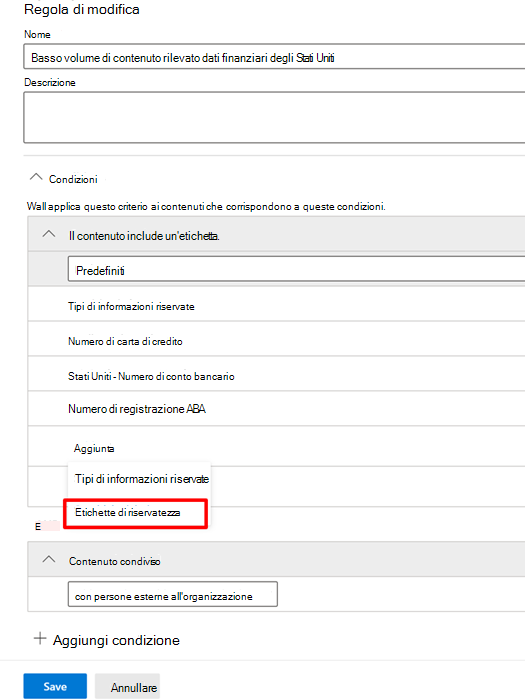

# Usare le etichette di riservatezza come condizioni nei criteri di prevenzione della perdita dei dati (anteprima)Use sensitivity labels as conditions in DLP policies (preview)

Le [etichette di riservatezza](sensitivity-labels.md) possono essere usate come condizioni dei criteri di prevenzione della perdita dei dati in queste posizioni:You can use [sensitivity labels](sensitivity-labels.md) as a condition in DLP policies for these location:

- Messaggi di posta elettronica di Exchange OnlineExchange Online email messages
- SharePoint OnlineSharePoint Online
- Siti di OneDrive for BusinessOneDrive for Business sites
- Dispositivi Windows 10Windows 10 devices

Le etichette di riservatezza sono mostrate come opzioni dell'elenco **Il contenuto contiene**.Sensitivity labels appear as an option in the **Content contains** list.

## Elementi supportati, scenari e suggerimenti per i criteriSupported items, scenarios, and policy tips

È possibile usare le etichette di riservatezza come condizioni per questi elementi e in questi scenari.You can use sensitivity labels as conditions on these items and in these scenarios.

### Elementi supportatiSupported items

|servizioservice  |tipo di elementoitem type  |disponibile per i suggerimento per i criteriavailable to policy tip  |applicabileenforceable  |
|---------|---------|---------|---------|
|ExchangeExchange    |messaggio di posta elettronicaemail message         |sìyes         |sìyes         |
|ExchangeExchange    |allegato di posta elettronicaemail attachment         |no \*no \*         |no \*no \*         |
|SharePoint OnlineSharePoint Online     |elementi di SharePoint Onlineitems in SharePoint Online         |sìyes         |sìyes         |
|OneDrive for BusinessOneDrive for Business     |elementiitems         |sìyes         |sìyes         |
|TeamsTeams     |Messaggi di Teams e dei canaliTeams and channel messages         |non applicabilenot applicable         |non applicabilenot applicable         |
|TeamsTeams     |allegatiattachements         |sì \*\*yes \*\*         |sì \*\*yes \*\*         |
|Dispositivi Windows 10 (anteprima)Windows 10 devices (preview)     |elementiitems         |sìyes         |sìyes         |
|MCAS (anteprima)MCAS (preview) |elementiitems         |sìyes         |sìyes         |

\* il rilevamento di prevenzione della perdita dei dati per le etichette di riservatezza dei messaggi di posta elettronica è supportato.\* DLP detection of sensitivity labels on emails are supported. Il rilevamento di prevenzione della perdita dei dati per le etichette di riservatezza degli allegati dei messaggi non è supportato.DLP detection of sensitivity labeled email attachments are not.

\*\* Gli allegati inviati in Teams tramite chat individuali o canali sono caricati automaticamente su OneDrive for Business e SharePoint.\*\* Attachments sent in Teams over 1:1 chat or channels are automatically uploaded to One drive for business and SharePoint. Perciò, se SharePoint Online o OneDrive for Business sono inclusi come posizioni del criteri di prevenzione della perdita dei dati, gli allegati etichettai inviati in Teams saranno inclusi automaticamente nell'ambito di questa condizione.So if SharePoint Online or One Drive for Business are included as locations in your DLP policy, then labeled attachments sent in Teams will be automatically included in the scope of this condition. Teams non deve essere selezionato come posizione nel criteri di prevenzione della perdita dei dati.Teams as a location does not need to be selected in the DLP policy.

### Scenari supportatiSupported scenarios

- L'amministratore per la prevenzione della perdita dei dati sarà in grado di accedere a un elenco di tutte le etichette di conservazione del tenant quando sceglie di includere una o più etichette di riservatezza come condizioni.DLP Admin will be able to see a list of all sensitivity labels in the tenant when they choose to include one or more sensitivity labels as a condition.
- L'uso delle etichette di riservatezza come condizioni è supportato in tutti i carichi di lavoro, come indicato nella matrice di supporto precedente.Using sensitivity labels as a condition is supported across all workloads as indicated in the support matrix above
- I suggerimenti per i criteri di prevenzione della perdita dei dati continuano a essere visualizzati in tutti i carichi di lavoro (salvo quelli di Outlook Win32) per i criteri di prevenzione che contengono etichette di riservatezza come condizioni.DLP policy tips will continue to be shown across workloads (except Outlook Win32) for DLP policies which contain sensitivity label as a condition.
- Le etichette di riservatezza sono visualizzate anche all'interno del messaggio di posta elettronica del report degli incidenti, se c'è una corrispondenza con un criterio di prevenzione della perdita dei dati con etichette di riservatezza come condizioni. Sensitivity labels will also appear as a part of the incident report email if a DLP policy with sensitivity label as a condition is matched.
- I dettagli dell'etichetta di riservatezza sono mostrati anche nel log di controllo della corrispondenza delle regole di prevenzione della perdita dei dati, in caso di corrispondenza con criteri di prevenzione che contengono etichette di riservatezza come condizioni.Sensitivity label details will also be shown in the DLP rule match audit log for a DLP policy match which contains sensitivity label as a condition.

### Supporto per i suggerimenti per i criteriSupport policy tips

|carico di lavoroworkload  |suggerimenti per criteri supportati/non supportatipolicy tips supported/not supported  |
|---------|---------|
|OWAOWA |    supportatosupported     |
|Outlook Win 32Outlook Win 32    |  non supportatonot supported       |
|SharePointSharePoint   |   supportatosupported      |
|OneDrive for BusinessOneDrive for Business    |    supportatosupported     |
|dispositivi endpointendpoint devices   |  non supportatonot supported       |
