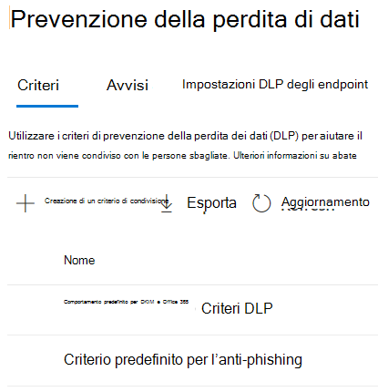

# Informazioni sul criterio predefinito per la prevenzione della perdita di dati in Microsoft Teams (anteprima)Learn about the default data loss prevention policy in Microsoft Teams (preview)

[Le funzionalità di prevenzione della](dlp-learn-about-dlp.md) perdita dei dati sono state estese Microsoft Teams messaggi di chat e canali, inclusi i messaggi del canale privato.[Data loss prevention](dlp-learn-about-dlp.md) capabilities have been extended to include Microsoft Teams chat and channel messages, including private channel messages. Come parte di questa versione, è stato creato un criterio DLP predefinito per Microsoft Teams per i clienti al Centro conformità per la prima volta.As a part of this release, we created a default DLP policy for Microsoft Teams for first-time customers to Compliance center.

## Si applica aApplies to

Qualsiasi tenant concesso in licenza con una o più delle licenze seguenti e con utenti Teams attiviAny tenant who is licensed with one or more of the below licenses and have active Teams users
 
- ME5,ME5, 
- MA5,MA5, 
- Conformità E5/A5,E5/A5 Compliance, 
- IP+G,IP+G, 
- OE5,OE5, 
- Conformità avanzata di O365O365 Advanced Compliance 
- EMS E5EMS E5

## Cosa fa il criterio predefinito?What does the default policy do?

Il criterio DLP predefinito per Teams tiene traccia di tutti i numeri di carta di credito condivisi internamente ed esternamente all'organizzazione.The default DLP policy for Teams tracks all the credit card numbers shared internally and externally to the organization. Questo criterio è in base all'impostazione predefinita per tutti gli utenti del tenant.This policy is on by default for all users of the tenant. Non genera suggerimenti per i criteri per gli utenti finali, ma genera un evento Alert e inoltre attiva un messaggio di posta elettronica di bassa gravità per l'amministratore (aggiunto nel criterio).It does not generate any policy tips for end users but does generate an Alert event and also triggers a low severity email to the admin (added in the policy). L'amministratore può visualizzare le attività e modificare i dettagli dei criteri accedendo al Centro conformità.Administrator can view the activities and edit the policies details by logging into the Compliance center.

Gli amministratori possono visualizzare questo criterio nel [Centro](https://compliance.microsoft.com/compliancesettings) conformità > criteri di prevenzione della perdita di dati.Admins can view this policy in the [Compliance center](https://compliance.microsoft.com/compliancesettings) > Data Loss prevention policies page.

> [!div class="mx-imgBorder"]
> 

## Modificare o eliminare il criterio predefinitoEdit or delete the default policy

Per [modificare il criterio predefinito per migliorare le prestazioni](create-test-tune-dlp-policy.md#tune-a-dlp-policy)o eliminarlo, è sufficiente utilizzare un account con autorizzazioni di gestione della conformità **DLP.**To [edit the default policy for better performance or to delete it](create-test-tune-dlp-policy.md#tune-a-dlp-policy), just use an account with **DLP Compliance Management** permissions. Per ulteriori informazioni, vedere [Autorizzazioni](create-test-tune-dlp-policy.md#permissions).For more information, see, [Permissions](create-test-tune-dlp-policy.md#permissions).

