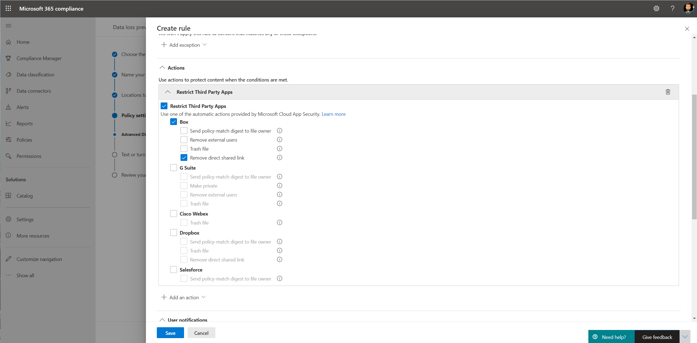

# Usare i criteri di prevenzione della perdita dei dati per le app cloud non Microsoft (anteprima)Use data loss prevention policies for non-Microsoft cloud apps (preview)

I criteri di prevenzione della perdita dei dati (DLP) per le app cloud non Microsoft fanno parte della famiglia di funzionalità DLP di Microsoft 365; Usando queste funzionalità, è possibile individuare e proteggere gli elementi sensibili nei servizi di Microsoft 365.Data loss prevention (DLP) policies to non-Microsoft cloud apps are part of the Microsoft 365 DLP suite of features; using these features, you can discover and protect sensitive items across Microsoft 365 services. Per ulteriori informazioni su tutte le offerte dlp di Microsoft, vedere [Panoramica della prevenzione della perdita dei dati.](https://docs.microsoft.com/microsoft-365/compliance/data-loss-prevention-policies?view=o365-worldwide)For more information about all Microsoft DLP offerings, see [Overview of data loss prevention](https://docs.microsoft.com/microsoft-365/compliance/data-loss-prevention-policies?view=o365-worldwide).

È possibile utilizzare i criteri DLP per le app cloud non Microsoft per monitorare e rilevare quando gli elementi sensibili vengono utilizzati e condivisi tramite app cloud non Microsoft.You can use DLP policies to non-Microsoft cloud apps to monitor and detect when sensitive items are used and shared via non-Microsoft cloud apps. L'uso di questi criteri offre la visibilità e il controllo necessari per garantire che vengano utilizzati e protetti correttamente e consente di evitare comportamenti rischiosi che potrebbero comprometterli.Using these policies gives you the visibility and control that you need to ensure that they're correctly used and protected, and it helps prevent risky behavior that might compromise them.

## Informazioni preliminariBefore you begin

### Licenze per SKU/abbonamentiSKU/subscriptions licensing

Prima di iniziare a usare i criteri DLP per le app cloud non Microsoft, confermare l'abbonamento a [Microsoft 365](https://www.microsoft.com/microsoft-365/compare-microsoft-365-enterprise-plans?rtc=1) e tutti i componenti aggiuntivi.Before you start using DLP policies to non-Microsoft cloud apps, confirm your [Microsoft 365 subscription](https://www.microsoft.com/microsoft-365/compare-microsoft-365-enterprise-plans?rtc=1) and any add-ons. Per accedere a questa funzionalità e utilizzarla, è necessario disporre di uno di questi abbonamenti o componenti aggiuntivi:To access and use this functionality, you must have one of these subscriptions or add-ons:

- Microsoft 365 E5Microsoft 365 E5
- Conformità Microsoft 365 E5Microsoft 365 E5 Compliance
- Microsoft 365 E5 SecurityMicrosoft 365 E5 Security

### Preparare l'ambiente Cloud App SecurityPrepare your Cloud App Security environment

I criteri DLP per le app cloud non Microsoft utilizzano le funzionalità DLP di Cloud App Security.DLP policies to non-Microsoft cloud apps use Cloud App Security DLP capabilities. Per usarlo, è necessario preparare l'ambiente Cloud App Security.To use it, you should prepare your Cloud App Security environment. Per istruzioni, vedi [Impostare azioni immediate di visibilità, protezione e governance per le tue app.](https://docs.microsoft.com/cloud-app-security/getting-started-with-cloud-app-security#step-1-set-instant-visibility-protection-and-governance-actions-for-your-apps)For instructions, see [Set instant visibility, protection, and governance actions for your apps](https://docs.microsoft.com/cloud-app-security/getting-started-with-cloud-app-security#step-1-set-instant-visibility-protection-and-governance-actions-for-your-apps).

### Connettere un'app cloud non MicrosoftConnect a non-Microsoft cloud app

Per usare i criteri DLP per un'app cloud non Microsoft specifica, l'app deve essere connessa a Cloud App Security.To use DLP policy to a specific non-Microsoft cloud app, the app must be connected to Cloud App Security. Per informazioni, vedere:For information, see:

- [Connect BoxConnect Box](https://docs.microsoft.com/cloud-app-security/connect-box-to-microsoft-cloud-app-security)
- [Connettere DropboxConnect Dropbox](https://docs.microsoft.com/cloud-app-security/connect-dropbox-to-microsoft-cloud-app-security)
- [Connettere G-SuiteConnect G-Suite](https://docs.microsoft.com/cloud-app-security/connect-google-apps-to-microsoft-cloud-app-security)
- [Connettere SalesforceConnect Salesforce](https://docs.microsoft.com/cloud-app-security/connect-salesforce-to-microsoft-cloud-app-security)
- [Connettere Cisco WebexConnect Cisco Webex](https://docs.microsoft.com/cloud-app-security/connect-webex-to-microsoft-cloud-app-security)

Dopo aver connesso le app cloud a Cloud App Security, è possibile creare criteri DLP di Microsoft 365 per loro.After you connect your cloud apps to Cloud App Security, you can create Microsoft 365 DLP policies for them.

>[!NOTE]
>È anche possibile usare Microsoft Cloud App Security per creare criteri DLP per le app cloud Microsoft.It's also possible to use Microsoft Cloud App Security to create DLP policies to Microsoft cloud apps. Tuttavia, è consigliabile usare Microsoft 365 per creare e gestire i criteri DLP per le app cloud Microsoft.However, it's recommended to use Microsoft 365 to create and manage DLP policies to Microsoft cloud apps.

## Creare un criterio DLP in un'app cloud non MicrosoftCreate a DLP policy to a non-Microsoft cloud app

Quando si seleziona un percorso per il criterio DLP, attivare il percorso **di Microsoft Cloud App Security.**When you select a location for the DLP policy, turn on the **Microsoft Cloud App Security** location.

- Per selezionare un'app o un'istanza specifica, selezionare **Scegli istanza.**To select a specific app or instance, select **Choose instance**.
- Se non si seleziona un'istanza, il criterio usa tutte le app connesse nel tenant di Microsoft Cloud App Security.If you don't select an instance, the policy uses all connected apps in your Microsoft Cloud App Security tenant.

   

   

Puoi scegliere varie azioni per ogni app cloud non Microsoft supportata.You can choose various actions for every supported non-Microsoft cloud app. Per ogni app, esistono diverse azioni possibili (dipende dall'API dell'app cloud).For every app, there are different possible actions (depends on the cloud app API).

Quando si crea una regola nel criterio DLP, è possibile selezionare un'azione per le app cloud non Microsoft.When you create a rule in the DLP policy, you can select an action for non-Microsoft cloud apps. Per limitare le app di terze parti, selezionare **Limita app di terze parti.**To restrict third-party apps, select **Restrict Third Party Apps**.

Per informazioni sulla creazione e la configurazione di criteri DLP, vedere [Creare test e ottimizzare un criterio DLP.](https://docs.microsoft.com/microsoft-365/compliance/create-test-tune-dlp-policy?view=o365-worldwide)For information about creating and configuring DLP policies, see [Create test and tune a DLP policy](https://docs.microsoft.com/microsoft-365/compliance/create-test-tune-dlp-policy?view=o365-worldwide).

## Vedere ancheSee Also

- [Creare test e ottimizzare un criterio DLPCreate test and tune a DLP policy](https://docs.microsoft.com/microsoft-365/compliance/create-test-tune-dlp-policy?view=o365-worldwide)
- [Cominciare con il criterio di prevenzione della perdita dei dati predefinitoGet started with the default DLP policy](https://docs.microsoft.com/microsoft-365/compliance/get-started-with-the-default-dlp-policy?view=o365-worldwide)
- [Creare un criterio di prevenzione della perdita dei dati da un modelloCreate a DLP policy from a template](https://docs.microsoft.com/microsoft-365/compliance/create-a-dlp-policy-from-a-template?view=o365-worldwide)
