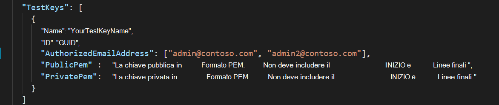
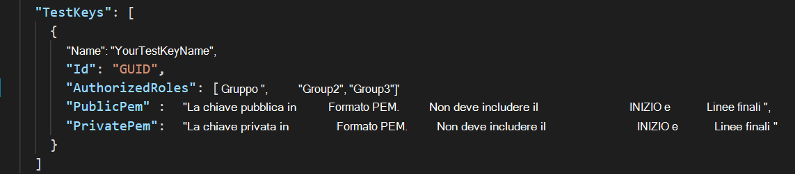
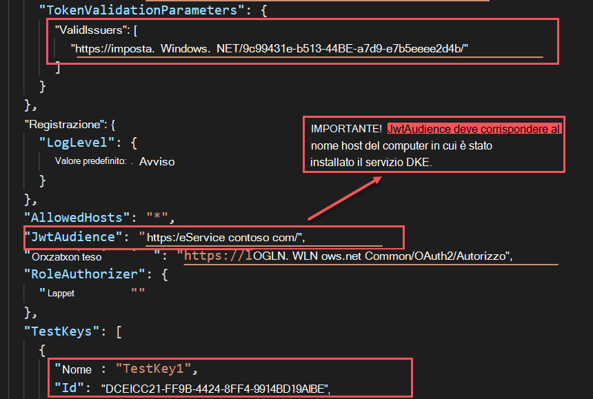
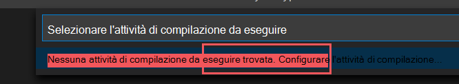
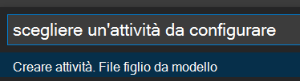
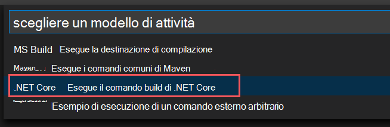
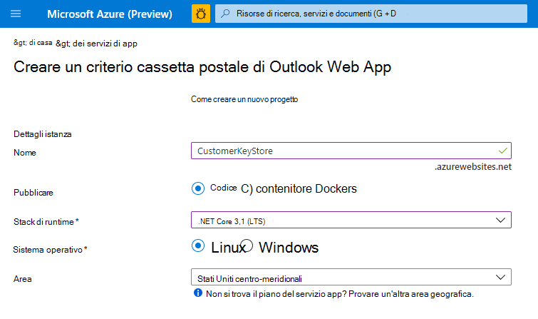
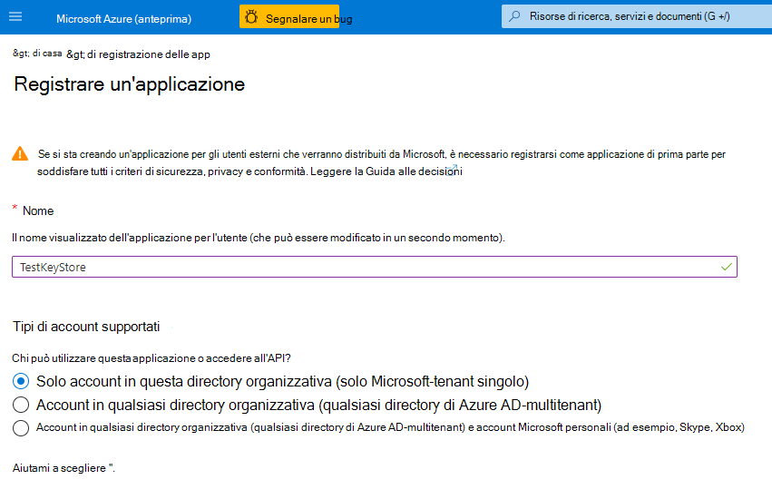

# <a name="double-key-encryption-for-microsoft-365"></a>Crittografia a chiave doppia per Microsoft 365

> *Si applica a: Crittografia a chiave doppia per Microsoft 365, [Conformità Microsoft 365,](https://www.microsoft.com/microsoft-365/business/compliance-management) [Azure Information Protection](https://azure.microsoft.com/pricing/details/information-protection)*
>
> *Istruzioni per: [Client di etichettatura unificata](https://docs.microsoft.com/azure/information-protection/faqs#whats-the-difference-between-the-azure-information-protection-classic-and-unified-labeling-clients) di Azure Information Protection per Windows*
>
> *Descrizione del servizio per: [Conformità Microsoft 365](https://docs.microsoft.com/office365/servicedescriptions/microsoft-365-service-descriptions/microsoft-365-tenantlevel-services-licensing-guidance/microsoft-365-security-compliance-licensing-guidance)*

La crittografia a chiave doppia (DKE, Double Key Encryption) usa due chiavi insieme per accedere al contenuto protetto. Microsoft archivia una chiave in Microsoft Azure e tieni premuta l'altra chiave. È possibile mantenere il controllo completo di una delle chiavi utilizzando il servizio di crittografia a chiave doppia. La protezione viene applicata tramite il client di etichettatura unificata di Azure Information Protection ai contenuti altamente riservati.

La crittografia a chiave doppia supporta sia le distribuzioni cloud che le distribuzioni locali. Queste distribuzioni consentono di garantire che i dati crittografati rimangano opachi ovunque si archivino i dati protetti.

Per ulteriori informazioni sulle chiavi radice del tenant predefinite basate su cloud, vedere Pianificazione e implementazione della chiave tenant di [Azure Information Protection.](https://docs.microsoft.com/azure/information-protection/plan-implement-tenant-key)

## <a name="when-your-organization-should-adopt-dke"></a>Quando l'organizzazione deve adottare DKE

La crittografia a chiave doppia è destinata ai dati più sensibili soggetti ai requisiti di protezione più rigidi. DKE non è destinato a tutti i dati. In generale, si utilizza la crittografia a chiave doppia per proteggere solo una piccola parte dei dati complessivi. È consigliabile eseguire la due diligence per identificare i dati da coprire con questa soluzione prima della distribuzione. In alcuni casi, potrebbe essere necessario restringere l'ambito e utilizzare altre soluzioni per la maggior parte dei dati, ad esempio Microsoft Information Protection con chiavi gestite da Microsoft o BYOK. Queste soluzioni sono sufficienti per i documenti che non sono soggetti a protezioni avanzate e a requisiti normativi. Inoltre, queste soluzioni consentono di usare i servizi di Office 365 più potenti; servizi che non è possibile utilizzare con il contenuto crittografato DKE. Ad esempio:

- Regole di trasporto che includono antimalware e posta indesiderata che richiedono visibilità nell'allegato
- Microsoft Delve
- eDiscovery
- Ricerca e indicizzazione del contenuto
- Office Web Apps, inclusa la funzionalità di creazione condivisa

Qualsiasi applicazione o servizio esterno non integrato con DKE tramite MIP SDK non sarà in grado di eseguire azioni sui dati crittografati.

Microsoft Information Protection SDK 1.7+ supporta la crittografia a chiave doppia; le applicazioni che si integrano con l'SDK saranno in grado di fare riferimento a questi dati con autorizzazioni e integrazioni sufficienti.

È consigliabile che le organizzazioni usino le funzionalità di Microsoft Information Protection (classificazione ed etichettatura) per proteggere la maggior parte dei dati sensibili e usare DKE solo per i dati cruciali. La crittografia a chiave doppia è rilevante per i dati sensibili in settori altamente regolamentati come i servizi finanziari e il settore sanitario.

Se le organizzazioni hanno uno dei requisiti seguenti, è possibile utilizzare DKE per proteggere il contenuto:

- Si desidera garantire che solo tu possa decrittografare il contenuto protetto, in tutte le circostanze. 
- Non si desidera che Microsoft abbia accesso ai dati protetti da solo.
- Hai requisiti normativi per contenere le chiavi all'interno di un limite geografico. Tutte le chiavi conservate per la crittografia e la decrittografia dei dati vengono mantenute nel data center.

## <a name="system-and-licensing-requirements-for-dke"></a>Requisiti di sistema e licenze per DKE

**La crittografia a chiave doppia per Microsoft 365** viene fornita con Microsoft 365 E5. Se non si dispone di una licenza di Microsoft 365 E5, è possibile iscriversi per una versione di [valutazione.](https://aka.ms/M365E5ComplianceTrial) Per altre informazioni su queste licenze, vedere le indicazioni sulle licenze di [Microsoft 365 per la sicurezza & conformità.](https://docs.microsoft.com/office365/servicedescriptions/microsoft-365-service-descriptions/microsoft-365-tenantlevel-services-licensing-guidance/microsoft-365-security-compliance-licensing-guidance)

**Azure Information Protection**. DKE funziona con le etichette di riservatezza e richiede Azure Information Protection.

Le etichette di riservatezza DKE vengono rese disponibili agli utenti finali tramite la barra multifunzione di riservatezza in Office Desktop Apps. Installare questi prerequisiti in ogni computer client in cui si desidera proteggere e utilizzare documenti protetti.

**Microsoft Office Apps for enterprise** versione *.12711 o successiva (versioni desktop di Word, PowerPoint ed Excel) in Windows.

**Azure Information Protection Unified Labeling Client** versioni 2.7.93.0 o successive. Scaricare e installare il client di etichettatura unificato [dall'Area download Microsoft.](https://www.microsoft.com/download/details.aspx?id=53018)

## <a name="supported-environments-for-storing-and-viewing-dke-protected-content"></a>Ambienti supportati per l'archiviazione e la visualizzazione di contenuto protetto da DKE

**Applicazioni supportate.** [Client Microsoft 365 Apps for enterprise](https://www.microsoft.com/microsoft-365/business/microsoft-365-apps-for-enterprise-product) in Windows, inclusi Word, Excel e PowerPoint.

**Supporto dei contenuti online.** Sono supportati i documenti e i file archiviati online sia in Microsoft SharePoint che in OneDrive for Business. È possibile condividere contenuto crittografato tramite posta elettronica, ma non è possibile visualizzare documenti e file crittografati online. Devi invece visualizzare il contenuto protetto usando le app desktop nel computer locale.

## <a name="overview-of-deploying-dke"></a>Panoramica della distribuzione di DKE

Segui questi passaggi generali per configurare DKE. Dopo aver completato questi passaggi, gli utenti finali potranno proteggere i dati altamente sensibili con la crittografia a chiave doppia.

1. Distribuire il servizio DKE come descritto in questo articolo.

2. Creare un'etichetta con la crittografia a chiave doppia. Passare a Protezione delle informazioni nel [Centro conformità Microsoft 365](https://compliance.microsoft.com) e creare una nuova etichetta con la crittografia a chiave doppia. Vedere [Limitare l'accesso al contenuto utilizzando le etichette di riservatezza per applicare la crittografia.](https://docs.microsoft.com/microsoft-365/compliance/encryption-sensitivity-labels)

3. Utilizzare le etichette di crittografia a chiave doppia. Proteggere i dati selezionando l'etichetta Crittografia a chiave doppia dalla barra multifunzione Riservatezza in Microsoft Office.

Esistono diversi modi per completare alcuni dei passaggi per distribuire la crittografia a chiave doppia. In questo articolo vengono fornite istruzioni dettagliate in modo che gli amministratori meno esperti distribuiscono correttamente il servizio. Se si ha familiarità con questa operazione, è possibile scegliere di utilizzare metodi personalizzati.

## <a name="deploy-dke"></a>Distribuire DKE

Questo articolo e il video di distribuzione usano Azure come destinazione di distribuzione per il servizio DKE. Se si esegue la distribuzione in un'altra posizione, è necessario specificare valori personalizzati.

Guardare il [video sulla distribuzione della crittografia](https://youtu.be/vDWfHN_kygg) a chiave doppia per una panoramica dettagliata dei concetti illustrati in questo articolo. Il completamento del video richiede circa 18 minuti.

Seguire questi passaggi generali per configurare la crittografia a chiave doppia per l'organizzazione.

1. [Installare i prerequisiti software per il servizio DKE](#install-software-prerequisites-for-the-dke-service)
1. [Clonare il repository GitHub della crittografia a chiave doppia](#clone-the-dke-github-repository)
1. [Modificare le impostazioni dell'applicazione](#modify-application-settings)
1. [Generare chiavi di test](#generate-test-keys)
1. [Compilare il progetto](#build-the-project)
1. [Distribuire il servizio DKE e pubblicare l'archivio chiavi](#deploy-the-dke-service-and-publish-the-key-store)
1. [Convalidare la distribuzione](#validate-your-deployment)
1. [Registrare l'archivio chiavi](#register-your-key-store)
1. [Creare etichette di riservatezza con DKE](#create-sensitivity-labels-using-dke)
1. [Abilitare DKE nel client](#enable-dke-in-your-client)
1. [Eseguire la migrazione dei file protetti dalle etichette HYOK alle etichette DKE](#migrate-protected-files-from-hyok-labels-to-dke-labels)

Al termine, è possibile crittografare documenti e file con DKE. Per informazioni, vedere [Applicare etichette di riservatezza ai file e alla posta elettronica in Office.](https://support.microsoft.com/office/2f96e7cd-d5a4-403b-8bd7-4cc636bae0f9)

### <a name="install-software-prerequisites-for-the-dke-service"></a>Installare i prerequisiti software per il servizio DKE

Installare questi prerequisiti nel computer in cui si desidera installare il servizio DKE.

**.NET Core 3.1 SDK**. Scaricare e installare l'SDK [da Scaricare .NET Core 3.1.](https://dotnet.microsoft.com/download/dotnet-core/3.1)

**Visual Studio Code**. Scarica Visual Studio Code da [https://code.visualstudio.com/](https://code.visualstudio.com) . Dopo l'installazione, esegui Visual Studio Code e seleziona **Visualizza** \> **estensioni.** Installare queste estensioni.

- C# per Visual Studio Code

- NuGet Gestione pacchetti

**Risorse Git.** Scaricare e installare uno dei componenti seguenti.

- [Git](https://git-scm.com/downloads)

- [GitHub Desktop](https://desktop.github.com/)

- [GitHub Enterprise](https://github.com/enterprise)

**OpenSSL** È necessario che [OpenSSL sia](https://slproweb.com/products/Win32OpenSSL.html) installato per [generare chiavi di test](#generate-test-keys) dopo la distribuzione di DKE. Assicurarsi che venga richiamato correttamente dal percorso delle variabili di ambiente. Ad esempio, per informazioni dettagliate, vedere "Aggiungere la directory di installazione [https://www.osradar.com/install-openssl-windows/](https://www.osradar.com/install-openssl-windows/) a PATH".

### <a name="clone-the-dke-github-repository"></a>Clonare il repository GitHub DKE

Microsoft fornisce i file di origine DKE in un repository GitHub. Clonare l'archivio per creare il progetto in locale per l'uso dell'organizzazione. Il repository GitHub DKE si trova in [https://github.com/Azure-Samples/DoubleKeyEncryptionService](https://github.com/Azure-Samples/DoubleKeyEncryptionService) .

Le istruzioni seguenti sono destinate agli utenti inesperti di Git o Visual Studio Code:

1. Nel browser passare a: [https://github.com/Azure-Samples/DoubleKeyEncryptionService](https://github.com/Azure-Samples/DoubleKeyEncryptionService) .

2. Verso il lato destro dello schermo, selezionare **Codice.** La versione dell'interfaccia utente potrebbe mostrare un **pulsante Clone o Download.** Nell'elenco a discesa visualizzato selezionare quindi l'icona copia per copiare l'URL negli Appunti.

    Ad esempio:

   

3. In Visual Studio Code seleziona **Visualizza** tavolozza \> **dei comandi** e seleziona **Git: Clone.** Per passare all'opzione nell'elenco, iniziare a digitare per filtrare le voci e quindi `git: clone` selezionarla dall'elenco a discesa. Ad esempio:

   

4. Nella casella di testo incolla l'URL copiato da Git e seleziona **Clone da GitHub.**

5. Nella finestra **di dialogo Seleziona** cartella visualizzata, individuare e selezionare un percorso in cui archiviare il repository. Al prompt, selezionare **Apri.**

    Il repository si apre in Visual Studio Code e visualizza il ramo Git corrente in basso a sinistra. Ad esempio, il ramo deve essere **principale.** Ad esempio:

   

6. Se non si è nel ramo principale, è necessario selezionarlo. In Visual Studio Code seleziona il ramo e scegli **main** nell'elenco dei rami visualizzati.

   > [!IMPORTANT]
   > La selezione del ramo principale garantisce di disporre dei file corretti per compilare il progetto. Se non si sceglie il ramo corretto, la distribuzione avrà esito negativo.

L'archivio di origine DKE è ora configurato localmente. Modificare quindi [le impostazioni dell'applicazione](#modify-application-settings) per l'organizzazione.

### <a name="modify-application-settings"></a>Modificare le impostazioni dell'applicazione

Per distribuire il servizio DKE, è necessario modificare i tipi di impostazioni dell'applicazione seguenti:

- [Impostazioni di accesso ai tasti](#key-access-settings)
- [Impostazioni tenant e chiave](#tenant-and-key-settings)

È possibile modificare le impostazioni dell'applicazione appsettings.jsfile. Questo file si trova nel repo DoubleKeyEncryptionService clonato localmente in DoubleKeyEncryptionService\src\customer-key-store. In Visual Studio Code, ad esempio, è possibile passare al file come illustrato nell'immagine seguente.


#### <a name="key-access-settings"></a>Impostazioni di accesso ai tasti

Scegliere se utilizzare l'autorizzazione di posta elettronica o di ruolo. DKE supporta solo uno di questi metodi di autenticazione alla volta.

- **Autorizzazione per la posta elettronica**. Consente all'organizzazione di autorizzare l'accesso alle chiavi solo in base agli indirizzi di posta elettronica.

- **Autorizzazione del ruolo**. Consente all'organizzazione di autorizzare l'accesso alle chiavi in base ai gruppi di Active Directory e richiede che il servizio Web possa eseguire query LDAP.

**Per impostare le impostazioni di accesso alle chiavi per DKE tramite l'autorizzazione di posta elettronica**

1. Apri il **appsettings.jsfile e** individua l'impostazione. `AuthorizedEmailAddress`

2. Aggiungere l'indirizzo di posta elettronica o gli indirizzi che si desidera autorizzare. Separare più indirizzi di posta elettronica con virgolette doppie e virgole. Ad esempio:

   ```json
   "AuthorizedEmailAddress": ["email1@company.com", "email2@company.com ", "email3@company.com"]
   ```

3. Individuare `LDAPPath` l'impostazione e rimuovere il testo `If you use role authorization (AuthorizedRoles) then this is the LDAP path.` tra virgolette doppie. Lasciare le virgolette doppie sul posto. Al termine, l'impostazione dovrebbe essere simile alla seguente.

   ```json
   "LDAPPath": ""
   ```

4. Individuare `AuthorizedRoles` l'impostazione ed eliminare l'intera riga.

Questa immagine mostra l'appsettings.jssul file **formattato** correttamente per l'autorizzazione della posta elettronica.

   

**Per impostare le impostazioni di accesso alle chiavi per DKE tramite l'autorizzazione del ruolo**

1. Apri il **appsettings.jsfile e** individua l'impostazione. `AuthorizedRoles`

2. Aggiungere i nomi dei gruppi di Active Directory che si desidera autorizzare. Separare più nomi di gruppo con virgolette doppie e virgole. Ad esempio:

   ```json
   "AuthorizedRoles": ["group1", "group2", "group3"]
   ```

3. Individuare `LDAPPath` l'impostazione e aggiungere il dominio di Active Directory. Ad esempio:

   ```json
   "LDAPPath": "contoso.com"
   ```

4. Individuare `AuthorizedEmailAddress` l'impostazione ed eliminare l'intera riga.

Questa immagine mostra **l'appsettings.jssul** file formattato correttamente per l'autorizzazione del ruolo.

   

#### <a name="tenant-and-key-settings"></a>Impostazioni tenant e chiave

Le impostazioni delle chiavi e del tenant DKE si trovano nel **appsettings.jsfile.**

**Per configurare le impostazioni del tenant e delle chiavi per DKE**

1. Aprire il **appsettings.jsfile.**

2. Individuare `ValidIssuers` l'impostazione e `<tenantid>` sostituirla con l'ID tenant. È possibile individuare l'ID tenant andando al portale di Azure e visualizzando le proprietà [del tenant.](https://aad.portal.azure.com/#blade/Microsoft_AAD_IAM/ActiveDirectoryMenuBlade/Properties) Ad esempio:

   ```json
   "ValidIssuers": [
     "https://sts.windows.net/9c99431e-b513-44be-a7d9-e7b500002d4b/"
   ]
   ```

Individuare `JwtAudience` il file . Sostituire `<yourhostname>` con il nome host del computer in cui verrà eseguito il servizio DKE. Ad esempio:

  > [!IMPORTANT]
  > Il valore di `JwtAudience` deve corrispondere esattamente al nome dell'host. Puoi usare **localhost:5001 durante** il debug. Al termine del debug, tuttavia, assicurarsi di aggiornare questo valore al nome host del server.

- `TestKeys:Name`. Immettere un nome per la chiave. Ad esempio: `TestKey1`
- `TestKeys:Id`. Creare un GUID e immetterlo come `TestKeys:ID` valore. Ad esempio, `DCE1CC21-FF9B-4424-8FF4-9914BD19A1BE`. È possibile utilizzare un sito come [Generatore di GUID online](https://guidgenerator.com/) per generare casualmente un GUID.

Questa immagine mostra il formato corretto per le impostazioni del tenant e delle chiavi in **appsettings.jsin**. `LDAPPath` è configurato per l'autorizzazione dei ruoli.



### <a name="generate-test-keys"></a>Generare chiavi di test

Dopo aver definito le impostazioni dell'applicazione, sei pronto per generare chiavi di test pubbliche e private.

Per generare le chiavi:

1. Dal menu Start di Windows esegui il prompt dei comandi OpenSSL.

2. Passare alla cartella in cui si desidera salvare le chiavi di test. I file creati completando i passaggi di questa attività vengono archiviati nella stessa cartella.

3. Generare la nuova chiave di test.

   ```dos
   openssl req -x509 -newkey rsa:2048 -keyout key.pem -out cert.pem -days 365
   ```

4. Generare la chiave privata.

   ```dos
   openssl rsa -in key.pem -out privkeynopass.pem
   ```

5. Generare la chiave pubblica.

   ```dos
   openssl rsa -in key.pem -pubout > pubkeyonly.pem
   ```

6. In un editor di testo, aprire **pubkeyonly.pem.** Copiare tutto il contenuto del file **pubkeyonly.pem,** ad eccezione della prima e dell'ultima riga, nella sezioneappsettings.js`PublicPem` **file.**

7. In un editor di testo, aprire **privkeynopass.pem.** Copiare tutto il contenuto del file **privkeynopass.pem,** ad eccezione della prima e dell'ultima riga, nella sezioneappsettings.js`PrivatePem` **file.**

8. Rimuovere tutti gli spazi vuoti e le righe di nuova riga sia nelle `PublicPem` sezioni che nelle `PrivatePem` sezioni.

    > [!IMPORTANT]
    > Quando si copia questo contenuto, non eliminare i dati PEM.

9. In Visual Studio Code passa al file **Startup.cs** file. Questo file si trova nel repo DoubleKeyEncryptionService clonato localmente in DoubleKeyEncryptionService\src\customer-key-store\.

10. Individuare le righe seguenti:

   ```c#
        #if USE_TEST_KEYS
        #error !!!!!!!!!!!!!!!!!!!!!! Use of test keys is only supported for testing,
        DO NOT USE FOR PRODUCTION !!!!!!!!!!!!!!!!!!!!!!!!!!!!!
        services.AddSingleton<ippw.IKeyStore, ippw.TestKeyStore>();
        #endif
   ```

11. Sostituire queste righe con il testo seguente:

   ```csharp
   services.AddSingleton<ippw.IKeyStore, ippw.TestKeyStore>();
   ```

   I risultati finali dovrebbero essere simili ai seguenti.

   

Ora sei pronto per [compilare il progetto DKE.](#build-the-project)

### <a name="build-the-project"></a>Compilare il progetto

Usa le istruzioni seguenti per compilare il progetto DKE in locale:

1. In Visual Studio Code, nel repository del servizio DKE, selezionare **Visualizza** tavolozza dei comandi e \>  quindi digitare **build** al prompt dei comandi.

2. Nell'elenco scegli **Attività: Esegui attività di compilazione.**

   Se non vengono trovate attività di compilazione, selezionare **Configura** attività di compilazione e crearne una per .NET Core come indicato di seguito.

   

   1. Scegliere **Crea tasks.jsdal modello.**

      

   2. Nell'elenco dei tipi di modello seleziona **.NET Core.**

      

   3. Nella sezione build individuare il percorso del file **customerkeystore.csproj.** In caso contrario, aggiungere la riga seguente:

      ```json
      "${workspaceFolder}/src/customer-key-store/customerkeystore.csproj",
      ```

   4. Esegui di nuovo la compilazione.

3. Verificare che nella finestra di output non siano presenti errori di colore rosso.

   Se sono presenti errori di colore rosso, controlla l'output della console. Assicurarsi di aver completato correttamente tutti i passaggi precedenti e che siano presenti le versioni di build corrette.

4. Selezionare **Esegui debug** \> **per** eseguire il debug del processo. Se viene richiesto di selezionare un ambiente, selezionare **.NET Core.**

Il debugger .NET Core si avvia in genere su `https://localhost:5001` . Per visualizzare la chiave di test, passare `https://localhost:5001` a e aggiungere una barra (/) e il nome della chiave. Ad esempio:

```https
https://localhost:5001/TestKey1
```

La chiave deve essere visualizzata in formato JSON.

La configurazione è stata completata. Prima di pubblicare il keystore, in appsettings.jsattiva, per l'impostazione JwtAudience, assicurati che il valore per il nome host corrisponda esattamente al nome host del servizio app. Potresti aver modificato localhost per risolvere i problemi di compilazione.

### <a name="deploy-the-dke-service-and-publish-the-key-store"></a>Distribuire il servizio DKE e pubblicare l'archivio chiavi

Per le distribuzioni di produzione, distribuire il servizio in un cloud di terze parti o [pubblicarlo in un sistema locale.](https://docs.microsoft.com/aspnet/core/tutorials/publish-to-iis?view=aspnetcore-3.1&preserve-view=true&tabs=netcore-cli)

Potresti preferire altri metodi per distribuire le chiavi. Selezionare il metodo più adatto per l'organizzazione.

Per le distribuzioni pilota, è possibile eseguire la distribuzione in Azure e iniziare subito.

**Per creare un'istanza di Azure Web App per ospitare la distribuzione DKE**

Per pubblicare l'archivio chiavi, verrà creata un'istanza del servizio app di Azure per ospitare la distribuzione DKE. Successivamente, pubblicherai le chiavi generate in Azure.

1. Nel browser accedere al portale di [Microsoft Azure](https://ms.portal.azure.com)e passare ad **Aggiungi servizi**  >  **app.**

2. Seleziona la sottoscrizione e il gruppo di risorse e definisci i dettagli dell'istanza.

    - Immettere il nome host del computer in cui si desidera installare il servizio DKE. Assicurati che sia lo stesso nome di quello definito per l'impostazione JwtAudience nel file [**appsettings.json.**](#tenant-and-key-settings) Il valore specificato per il nome è anche WebAppInstanceName.

    - Per **Pubblica,** seleziona **codice** e per **Stack di runtime** seleziona **.NET Core 3.1.**

    Ad esempio:

   

3. At the bottom of the page, select **Review + create**, and then select **Add.**

4. Eseguire una delle operazioni seguenti per pubblicare le chiavi generate:

    - [Pubblicare tramite ZipDeployUI](#publish-via-zipdeployui)
    - [Pubblicare tramite FTP](#publish-via-ftp)
    - [Pubblicare tramite Visual Studio 2019 o versione successiva](https://docs.microsoft.com/aspnet/core/tutorials/)

#### <a name="publish-via-zipdeployui"></a>Pubblicare tramite ZipDeployUI

1. Passare a `https://<WebAppInstanceName>.scm.azurewebsites.net/ZipDeployUI`.

    Ad esempio: https://dkeservice.scm.azurewebsites.net/ZipDeployUI

2. Nella codebase dell'archivio chiavi passare alla cartella **customer-key-store\src\customer-key-store** e verificare che questa cartella contenga il file **customerkeystore.csproj.**

3. Run: **dotnet publish**

     Nella finestra di output viene visualizzata la directory in cui è stata distribuita la pubblicazione.

    Ad esempio: `customer-key-store\src\customer-key-store\bin\Debug\netcoreapp3.1\publish\`

4. Inviare tutti i file nella directory di pubblicazione a un file ZIP. Quando crei il file ZIP, assicurati che tutti i file nella directory siano a livello radice del file ZIP.

5. Trascinare e rilasciare il file ZIP creato nel sito ZipDeployUI aperto in precedenza. Ad esempio: https://dkeservice.scm.azurewebsites.net/ZipDeployUI

DKE viene distribuito ed è possibile passare alle chiavi di test create. Continuare a [convalidare la distribuzione di](#validate-your-deployment) seguito.

#### <a name="publish-via-ftp"></a>Pubblicare tramite FTP

1. Connettersi al servizio app creato in [precedenza.](#deploy-the-dke-service-and-publish-the-key-store)

    Nel browser passare a: Dashboard FTP per la distribuzione manuale del Centro distribuzione del servizio app di   >    >    >    >    >  Azure.

2. Copiare le stringhe di connessione visualizzate in un file locale. Queste stringhe verranno usate per connettersi al servizio Web App e caricare i file tramite FTP.

    Ad esempio:

   

3. Nella codebase per l'archiviazione delle chiavi passa alla **directory customer-key-store\src\customer-key-store.**

4. Verificare che questa directory contenga il file **customerkeystore.csproj.**

5. Run: **dotnet publish**

    L'output contiene la directory in cui è stata distribuita la pubblicazione.

    Ad esempio: `customer-key-store\src\customer-key-store\bin\Debug\netcoreapp3.1\publish\`

6. Inviare tutti i file nella directory di pubblicazione a un file ZIP. Quando crei il file ZIP, assicurati che tutti i file nella directory siano a livello radice del file ZIP.

7. Dal client FTP, usa le informazioni di connessione copiate per connetterti al servizio app. Carica il file ZIP creato nel passaggio precedente nella directory radice dell'app Web.

DKE viene distribuito ed è possibile passare alle chiavi di test create. Convalidare [quindi la distribuzione.](#validate-your-deployment)

### <a name="validate-your-deployment"></a>Convalidare la distribuzione

Dopo aver distribuito DKE usando uno dei metodi descritti in precedenza, convalidare la distribuzione e le impostazioni dell'archivio chiavi.

Correre:

src\customer-key-store\scripts\key_store_tester.ps1 dkeserviceurl/mykey

Ad esempio:

key_store_tester.ps1 https://mydkeservice.com/mykey

Assicurarsi che non vengano visualizzati errori nell'output. Quando si è pronti, [registrare l'archivio chiavi.](#register-your-key-store)

Per il nome della chiave viene impostata la distinzione tra maiuscole e minuscole. Immettere il nome della chiave così come viene visualizzato nel appsettings.jsfile.

## <a name="register-your-key-store"></a>Registrare l'archivio chiavi

La procedura seguente consente di registrare il servizio DKE. La registrazione del servizio DKE è l'ultimo passaggio nella distribuzione di DKE prima di iniziare a creare etichette.

Per registrare il servizio DKE:

1. Nel browser, aprire il portale [di Microsoft Azure](https://ms.portal.azure.com/)e passare a All **Services** \> **Identity** \> **App Registrations.**

2. Selezionare **Nuova registrazione** e immettere un nome significativo.

3. Selezionare un tipo di account dalle opzioni visualizzate.

    Se si usa Microsoft Azure con un dominio non personalizzato, ad esempio **onmicrosoft.com**, selezionare Account solo in questa directory organizzativa **(Solo Microsoft - Singolo tenant).**

    Ad esempio:

   

4. Nella parte inferiore della pagina seleziona **Registra per** creare la nuova registrazione dell'app.

5. Nel riquadro sinistro della nuova registrazione dell'app, in **Gestisci,** selezionare **Autenticazione.**

6. Seleziona **Aggiungi una piattaforma.**

7. Nel popup **Configura piattaforme** selezionare **Web.**

8. In **Reindirizza URI** immettere l'URI del servizio di crittografia a chiave doppia. Immettere l'URL del servizio app, inclusi il nome host e il dominio.

    Ad esempio: https://mydkeservicetest.com

    - L'URL immesso deve corrispondere al nome host in cui è distribuito il servizio DKE.
    - Se stai testando localmente con Visual Studio, usa **https://localhost:5001** .
    - In tutti i casi, lo schema deve essere **https.**

    Verificare che il nome host corrisponda esattamente al nome host del servizio app. È possibile che sia stato modificato per `localhost` risolvere i problemi di compilazione. In **appsettings.js,** questo valore è il nome host impostato per `JwtAudience` .

9. In **Concessione implicita** selezionare la **casella di controllo Token ID.**

10. Selezionare **Salva** per salvare le modifiche.

11. Nel riquadro sinistro seleziona Esporre **un'API,** quindi accanto a URI ID applicazione seleziona **Imposta.**

12. Sempre nella pagina **Esponi un'API,** nell'area Ambiti definiti da questa **API,** seleziona **Aggiungi un ambito.** Nel nuovo ambito:

    1. Definire il nome dell'ambito **user_impersonation**.

    2. Selezionare gli amministratori e gli utenti che possono acconsentire.

    3. Definire gli eventuali valori rimanenti necessari.

    4. Selezionare **Aggiungi ambito.**

    5. Selezionare **Salva** nella parte superiore per salvare le modifiche.

13. Sempre nella pagina **Esporre un'API,** nell'area **Applicazioni client** autorizzate, selezionare **Aggiungi un'applicazione client.**

    Nella nuova applicazione client:

    1. Definire l'ID client **come d3590ed6-52b3-4102-aeff-aad2292ab01c**. Questo valore è l'MICROSOFT OFFICE client e consente a Office di ottenere un token di accesso per l'archivio chiavi.

    2. In **Ambiti autorizzati selezionare** l'user_impersonation ambito. 

    3. Selezionare **Aggiungi applicazione.**

    4. Selezionare **Salva** nella parte superiore per salvare le modifiche.

Il servizio DKE è ora registrato. Continuare creando [etichette con DKE.](#create-sensitivity-labels-using-dke)

## <a name="create-sensitivity-labels-using-dke"></a>Creare etichette di riservatezza con DKE

Nel Centro conformità Microsoft 365, creare una nuova etichetta di riservatezza e applicare la crittografia come si farebbe in caso contrario. Selezionare **Usa crittografia a chiave doppia** e immettere l'URL dell'endpoint per la chiave.

Ad esempio:


Tutte le etichette DKE che aggiungi inizieranno a essere visualizzate per gli utenti nelle versioni più recenti di Microsoft 365 Apps for enterprise.

> [!NOTE]
> L'aggiornamento dei client con le nuove etichette può richiedere fino a 24 ore.

### <a name="enable-dke-in-your-client"></a>Abilitare DKE nel client

Se si è un Office Insider, DKE è abilitato per l'utente. In caso contrario, abilitare DKE per il client aggiungendo le seguenti chiavi del Registro di sistema:

```properties
    [HKEY_LOCAL_MACHINE\SOFTWARE\WOW6432Node\Microsoft\MSIPC\flighting]
    "DoubleKeyProtection"=dword:00000001

    [HKEY_LOCAL_MACHINE\SOFTWARE\Microsoft\MSIPC\flighting]
    "DoubleKeyProtection"=dword:00000001
```

## <a name="migrate-protected-files-from-hyok-labels-to-dke-labels"></a>Eseguire la migrazione dei file protetti dalle etichette HYOK alle etichette DKE

Se si desidera, dopo aver completato la configurazione di DKE, è possibile eseguire la migrazione del contenuto protetto tramite le etichette HYOK alle etichette DKE. Per eseguire la migrazione, si userà lo scanner AIP. Per iniziare a usare lo scanner, vedere [Che cos'è](https://docs.microsoft.com/azure/information-protection/deploy-aip-scanner)lo scanner di etichettatura unificata di Azure Information Protection? .

Se non si esegue la migrazione del contenuto, il contenuto protetto HYOK rimarrà invariato.
