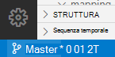

# <a name="double-key-encryption-for-microsoft-365"></a><span data-ttu-id="22d58-103">Crittografia a chiave doppia per Microsoft 365</span><span class="sxs-lookup"><span data-stu-id="22d58-103">Double Key Encryption for Microsoft 365</span></span>

> <span data-ttu-id="22d58-104">*Si applica a: crittografia a chiave doppia per Microsoft 365, [conformità a microsoft 365](https://www.microsoft.com/microsoft-365/business/compliance-management), [Azure Information Protection](https://azure.microsoft.com/pricing/details/information-protection)*</span><span class="sxs-lookup"><span data-stu-id="22d58-104">*Applies to: Double Key Encryption for Microsoft 365, [Microsoft 365 Compliance](https://www.microsoft.com/microsoft-365/business/compliance-management), [Azure Information Protection](https://azure.microsoft.com/pricing/details/information-protection)*</span></span>
>
> <span data-ttu-id="22d58-105">*Istruzioni per: [client di etichettatura unificata di Azure Information Protection per Windows](https://docs.microsoft.com/azure/information-protection/faqs#whats-the-difference-between-the-azure-information-protection-classic-and-unified-labeling-clients)*</span><span class="sxs-lookup"><span data-stu-id="22d58-105">*Instructions for: [Azure Information Protection unified labeling client for Windows](https://docs.microsoft.com/azure/information-protection/faqs#whats-the-difference-between-the-azure-information-protection-classic-and-unified-labeling-clients)*</span></span>
>
> <span data-ttu-id="22d58-106">*Descrizione del servizio per: [conformità di Microsoft 365](https://docs.microsoft.com/office365/servicedescriptions/microsoft-365-service-descriptions/microsoft-365-tenantlevel-services-licensing-guidance/microsoft-365-security-compliance-licensing-guidance)*</span><span class="sxs-lookup"><span data-stu-id="22d58-106">*Service description for: [Microsoft 365 Compliance](https://docs.microsoft.com/office365/servicedescriptions/microsoft-365-service-descriptions/microsoft-365-tenantlevel-services-licensing-guidance/microsoft-365-security-compliance-licensing-guidance)*</span></span>

<span data-ttu-id="22d58-107">La crittografia a chiave doppia (DKE) utilizza due tasti insieme per accedere al contenuto protetto.</span><span class="sxs-lookup"><span data-stu-id="22d58-107">Double Key Encryption (DKE) uses two keys together to access protected content.</span></span> <span data-ttu-id="22d58-108">Microsoft archivia una chiave in Microsoft Azure e si tiene premuto l'altro tasto.</span><span class="sxs-lookup"><span data-stu-id="22d58-108">Microsoft stores one key in Microsoft Azure, and you hold the other key.</span></span> <span data-ttu-id="22d58-109">È possibile mantenere il controllo completo di una delle chiavi utilizzando il servizio di crittografia a chiave doppia.</span><span class="sxs-lookup"><span data-stu-id="22d58-109">You maintain full control of one of your keys using the Double Key Encryption service.</span></span> <span data-ttu-id="22d58-110">È possibile applicare la protezione utilizzando il client Azure Information Protection Unified Labeling al contenuto estremamente riservato.</span><span class="sxs-lookup"><span data-stu-id="22d58-110">You apply protection using The Azure Information Protection unified labeling client to your highly sensitive content.</span></span>

<span data-ttu-id="22d58-111">La crittografia a chiave doppia supporta sia le distribuzioni cloud che quelle locali.</span><span class="sxs-lookup"><span data-stu-id="22d58-111">Double Key Encryption supports both cloud and on-premises deployments.</span></span> <span data-ttu-id="22d58-112">Queste distribuzioni contribuiscono a garantire che i dati crittografati rimangano opachi ovunque vengano archiviati i dati protetti.</span><span class="sxs-lookup"><span data-stu-id="22d58-112">These deployments help to ensure that encrypted data remains opaque wherever you store the protected data.</span></span>

<span data-ttu-id="22d58-113">Per ulteriori informazioni sulle chiavi radice tenant basate su cloud predefinite, vedere [Planning and implementing your Azure Information Protection tenant Key](https://docs.microsoft.com/azure/information-protection/plan-implement-tenant-key).</span><span class="sxs-lookup"><span data-stu-id="22d58-113">For more information about the default, cloud-based tenant root keys, see [Planning and implementing your Azure Information Protection tenant key](https://docs.microsoft.com/azure/information-protection/plan-implement-tenant-key).</span></span>

## <a name="when-your-organization-should-adopt-dke"></a><span data-ttu-id="22d58-114">Quando l'organizzazione deve adottare DKE</span><span class="sxs-lookup"><span data-stu-id="22d58-114">When your organization should adopt DKE</span></span>

<span data-ttu-id="22d58-115">La crittografia a chiave doppia è destinata ai dati più sensibili che sono soggetti ai requisiti di protezione più severi.</span><span class="sxs-lookup"><span data-stu-id="22d58-115">Double Key Encryption is intended for your most sensitive data that is subject to the strictest protection requirements.</span></span> <span data-ttu-id="22d58-116">DKE non è destinato a tutti i dati.</span><span class="sxs-lookup"><span data-stu-id="22d58-116">DKE is not intended for all data.</span></span> <span data-ttu-id="22d58-117">In generale, si utilizzerà la crittografia a chiave doppia per proteggere solo una parte piccolissima dei dati complessivi.</span><span class="sxs-lookup"><span data-stu-id="22d58-117">In general, you'll be using Double Key Encryption to protect only a very small part of your overall data.</span></span> <span data-ttu-id="22d58-118">Prima di eseguire la distribuzione, è necessario fare due diligence per identificare i dati giusti da includere in questa soluzione.</span><span class="sxs-lookup"><span data-stu-id="22d58-118">You should do due diligence in identifying the right data to cover with this solution before you deploy.</span></span> <span data-ttu-id="22d58-119">In alcuni casi, potrebbe essere necessario restringere l'ambito e utilizzare altre soluzioni per la maggior parte dei dati, ad esempio Microsoft Information Protection con Microsoft-Managed Keys o BYOK.</span><span class="sxs-lookup"><span data-stu-id="22d58-119">In some cases, you might need to narrow your scope and make use of other solutions for the majority of your data such as Microsoft Information Protection with Microsoft-managed keys or BYOK.</span></span> <span data-ttu-id="22d58-120">Queste soluzioni sono sufficienti per i documenti che non sono soggetti a protezioni avanzate e requisiti normativi.</span><span class="sxs-lookup"><span data-stu-id="22d58-120">These solutions are sufficient for documents that aren't subject to enhanced protections and regulatory requirements.</span></span> <span data-ttu-id="22d58-121">Inoltre, queste soluzioni consentono di utilizzare i più potenti servizi di Office 365; servizi che non è possibile utilizzare con il contenuto crittografato di DKE.</span><span class="sxs-lookup"><span data-stu-id="22d58-121">Also, these solutions enable you to use the most powerful Office 365 services; services that you can't use with DKE encrypted content.</span></span> <span data-ttu-id="22d58-122">Ad esempio:</span><span class="sxs-lookup"><span data-stu-id="22d58-122">For example:</span></span>

- <span data-ttu-id="22d58-123">Regole di trasporto, tra cui anti-malware e posta indesiderata che richiedono visibilità nell'allegato</span><span class="sxs-lookup"><span data-stu-id="22d58-123">Transport rules including anti-malware and spam that require visibility into the attachment</span></span>
- <span data-ttu-id="22d58-124">Approfondimento Microsoft</span><span class="sxs-lookup"><span data-stu-id="22d58-124">Microsoft Delve</span></span>
- <span data-ttu-id="22d58-125">eDiscovery</span><span class="sxs-lookup"><span data-stu-id="22d58-125">eDiscovery</span></span>
- <span data-ttu-id="22d58-126">Ricerca e indicizzazione del contenuto</span><span class="sxs-lookup"><span data-stu-id="22d58-126">Content search and indexing</span></span>
- <span data-ttu-id="22d58-127">Office Web Apps inclusa la funzionalità di creazione condivisa</span><span class="sxs-lookup"><span data-stu-id="22d58-127">Office Web Apps including co-authoring functionality</span></span>

<span data-ttu-id="22d58-128">Tutte le applicazioni o i servizi esterni che non sono integrati con DKE tramite l'SDK MIP non saranno in grado di eseguire azioni sui dati crittografati.</span><span class="sxs-lookup"><span data-stu-id="22d58-128">Any external applications or services that are not integrated with DKE through the MIP SDK will be unable to perform actions on the encrypted data.</span></span>

<span data-ttu-id="22d58-129">Microsoft Information Protection SDK 1.7 + supporta la crittografia a chiave doppia. le applicazioni che si integrano con il nostro SDK saranno in grado di ragionare su questi dati con autorizzazioni e integrazioni sufficienti sul posto.</span><span class="sxs-lookup"><span data-stu-id="22d58-129">The Microsoft Information Protection SDK 1.7+ supports Double Key Encryption; applications that integrate with our SDK will be able to reason over this data with sufficient permissions and integrations in place.</span></span>

<span data-ttu-id="22d58-130">Si consiglia alle organizzazioni di utilizzare le funzionalità di protezione delle informazioni di Microsoft (classificazione ed etichettatura) per proteggere la maggior parte dei dati riservati e utilizzare solo DKE per i dati mission-critical.</span><span class="sxs-lookup"><span data-stu-id="22d58-130">We recommend organizations use Microsoft Information protection capabilities (classification and labeling) to protect most of their sensitive data and only use DKE for their mission-critical data.</span></span> <span data-ttu-id="22d58-131">La crittografia a chiave doppia è particolarmente importante per i dati estremamente sensibili nelle industrie altamente regolamentate, come i servizi finanziari e sanitari.</span><span class="sxs-lookup"><span data-stu-id="22d58-131">Double Key Encryption is particularly relevant for extremely sensitive data in highly regulated industries such as Financial services and Healthcare.</span></span>

<span data-ttu-id="22d58-132">Se le organizzazioni hanno uno dei requisiti seguenti, è possibile utilizzare DKE per proteggere il contenuto:</span><span class="sxs-lookup"><span data-stu-id="22d58-132">If your organizations have any of the following requirements, you can use DKE to help secure your content:</span></span>

- <span data-ttu-id="22d58-133">Si desidera garantire che sia possibile decrittografare il contenuto protetto *solo* in tutte le circostanze.</span><span class="sxs-lookup"><span data-stu-id="22d58-133">You want to ensure that *only you* can ever decrypt protected content, under all circumstances.</span></span>
- <span data-ttu-id="22d58-134">Non si desidera che Microsoft abbia accesso ai dati protetti da solo.</span><span class="sxs-lookup"><span data-stu-id="22d58-134">You don't want Microsoft to have access to protected data on its own.</span></span>
- <span data-ttu-id="22d58-135">Sono necessari requisiti normativi per mantenere le chiavi all'interno di un limite geografico.</span><span class="sxs-lookup"><span data-stu-id="22d58-135">You have regulatory requirements to hold keys within a geographical boundary.</span></span> <span data-ttu-id="22d58-136">Tutte le chiavi conservate per la crittografia e la decrittografia dei dati vengono mantenute nel Data Center.</span><span class="sxs-lookup"><span data-stu-id="22d58-136">All of the keys that you hold for data encryption and decryption are maintained in your data center.</span></span>

## <a name="system-and-licensing-requirements-for-dke"></a><span data-ttu-id="22d58-137">Requisiti di sistema e licenze per DKE</span><span class="sxs-lookup"><span data-stu-id="22d58-137">System and licensing requirements for DKE</span></span>

<span data-ttu-id="22d58-138">**La crittografia a chiave doppia per microsoft 365** è disponibile con Microsoft 365 E5 e Office 365 E5.</span><span class="sxs-lookup"><span data-stu-id="22d58-138">**Double Key Encryption for Microsoft 365** comes with Microsoft 365 E5 and Office 365 E5.</span></span> <span data-ttu-id="22d58-139">Se non si dispone di una licenza Microsoft 365 E5, è possibile iscriversi per una [versione di valutazione](https://aka.ms/M365E5ComplianceTrial).</span><span class="sxs-lookup"><span data-stu-id="22d58-139">If you don’t have a Microsoft 365 E5 license, you can sign up for a [trial](https://aka.ms/M365E5ComplianceTrial).</span></span> <span data-ttu-id="22d58-140">Per ulteriori informazioni su queste licenze, vedere [Microsoft 365 Licensing Guidance for security & Compliance](https://docs.microsoft.com/office365/servicedescriptions/microsoft-365-service-descriptions/microsoft-365-tenantlevel-services-licensing-guidance/microsoft-365-security-compliance-licensing-guidance).</span><span class="sxs-lookup"><span data-stu-id="22d58-140">For more information about these licenses, see [Microsoft 365 licensing guidance for security & compliance](https://docs.microsoft.com/office365/servicedescriptions/microsoft-365-service-descriptions/microsoft-365-tenantlevel-services-licensing-guidance/microsoft-365-security-compliance-licensing-guidance).</span></span>

<span data-ttu-id="22d58-141">**Azure Information Protection**.</span><span class="sxs-lookup"><span data-stu-id="22d58-141">**Azure Information Protection**.</span></span> <span data-ttu-id="22d58-142">DKE funziona con le etichette di riservatezza e richiede la protezione delle informazioni di Azure.</span><span class="sxs-lookup"><span data-stu-id="22d58-142">DKE works with sensitivity labels and requires Azure Information Protection.</span></span>

<span data-ttu-id="22d58-143">Le etichette di sensibilità di DKE sono rese disponibili agli utenti finali tramite la barra multifunzione di sensitivity nelle app desktop di Office.</span><span class="sxs-lookup"><span data-stu-id="22d58-143">DKE sensitivity labels are made available to end-users through the sensitivity ribbon in Office Desktop Apps.</span></span> <span data-ttu-id="22d58-144">Installare questi prerequisiti su ogni computer client in cui si desidera proteggere e utilizzare documenti protetti.</span><span class="sxs-lookup"><span data-stu-id="22d58-144">Install these prerequisites on each client computer where you want to protect and consume protected documents.</span></span>

<span data-ttu-id="22d58-145">**App di Microsoft Office per Enterprise** Version \*. 12711 o versione successiva (versioni desktop di Word, PowerPoint ed Excel) in Windows.</span><span class="sxs-lookup"><span data-stu-id="22d58-145">**Microsoft Office Apps for enterprise** version \*.12711 or later (Desktop versions of Word, PowerPoint, and Excel) on Windows.</span></span>

<span data-ttu-id="22d58-146">**Azure Information Protection Unified Labeling client** Versions 2.7.93.0 o versione successiva.</span><span class="sxs-lookup"><span data-stu-id="22d58-146">**Azure Information Protection Unified Labeling Client** versions 2.7.93.0 or later.</span></span> <span data-ttu-id="22d58-147">Scaricare e installare il client di etichettatura unificata dall' [area download Microsoft](https://www.microsoft.com/download/details.aspx?id=53018).</span><span class="sxs-lookup"><span data-stu-id="22d58-147">Download and install the Unified Labeling client from the [Microsoft download center](https://www.microsoft.com/download/details.aspx?id=53018).</span></span>

## <a name="supported-environments-for-storing-and-viewing-dke-protected-content"></a><span data-ttu-id="22d58-148">Ambienti supportati per l'archiviazione e la visualizzazione di contenuto protetto da DKE</span><span class="sxs-lookup"><span data-stu-id="22d58-148">Supported environments for storing and viewing DKE-protected content</span></span>

<span data-ttu-id="22d58-149">**Applicazioni supportate**.</span><span class="sxs-lookup"><span data-stu-id="22d58-149">**Supported applications**.</span></span> <span data-ttu-id="22d58-150">[Microsoft 365 Apps for Enterprise](https://www.microsoft.com/microsoft-365/business/microsoft-365-apps-for-enterprise-product) clients on Windows, tra cui Word, Excel e PowerPoint.</span><span class="sxs-lookup"><span data-stu-id="22d58-150">[Microsoft 365 Apps for enterprise](https://www.microsoft.com/microsoft-365/business/microsoft-365-apps-for-enterprise-product) clients on Windows, including Word, Excel, and PowerPoint.</span></span>

<span data-ttu-id="22d58-151">**Supporto per i contenuti online**.</span><span class="sxs-lookup"><span data-stu-id="22d58-151">**Online content support**.</span></span> <span data-ttu-id="22d58-152">Sono supportati i documenti e i file archiviati online in Microsoft SharePoint e OneDrive for business.</span><span class="sxs-lookup"><span data-stu-id="22d58-152">Documents and files stored online in both Microsoft SharePoint and OneDrive for Business are supported.</span></span> <span data-ttu-id="22d58-153">È possibile condividere il contenuto crittografato tramite posta elettronica, ma non è possibile visualizzare i documenti e i file crittografati online.</span><span class="sxs-lookup"><span data-stu-id="22d58-153">You can share encrypted content by email, but you can't view encrypted documents and files online.</span></span> <span data-ttu-id="22d58-154">Al contrario, è necessario visualizzare il contenuto protetto utilizzando le app desktop del computer locale.</span><span class="sxs-lookup"><span data-stu-id="22d58-154">Instead, you must view protected content using the desktop apps on your local computer.</span></span>

## <a name="overview-of-deploying-dke"></a><span data-ttu-id="22d58-155">Panoramica della distribuzione di DKE</span><span class="sxs-lookup"><span data-stu-id="22d58-155">Overview of deploying DKE</span></span>

<span data-ttu-id="22d58-156">Seguire questi passaggi generali per configurare DKE.</span><span class="sxs-lookup"><span data-stu-id="22d58-156">You'll follow these general steps to set up DKE.</span></span> <span data-ttu-id="22d58-157">Dopo aver completato questi passaggi, gli utenti finali saranno in grado di proteggere i dati altamente riservati con la crittografia a chiave doppia.</span><span class="sxs-lookup"><span data-stu-id="22d58-157">Once you've completed these steps, your end users will be able to protect your highly sensitive data with Double Key Encryption.</span></span>

1. <span data-ttu-id="22d58-158">Distribuire il servizio DKE come descritto in questo articolo.</span><span class="sxs-lookup"><span data-stu-id="22d58-158">Deploy the DKE service as described in this article.</span></span>

2. <span data-ttu-id="22d58-159">Creare un'etichetta con crittografia a chiave doppia.</span><span class="sxs-lookup"><span data-stu-id="22d58-159">Create a label with Double Key Encryption.</span></span> <span data-ttu-id="22d58-160">Passare a Information Protection nel [centro conformità Microsoft 365](https://compliance.microsoft.com) e creare una nuova etichetta con crittografia a chiave doppia.</span><span class="sxs-lookup"><span data-stu-id="22d58-160">Navigate to Information protection under the [Microsoft 365 compliance center](https://compliance.microsoft.com) and create a new label with Double Key Encryption.</span></span> <span data-ttu-id="22d58-161">[Per applicare la crittografia, vedere limitare l'accesso al contenuto utilizzando le etichette di riservatezza](https://docs.microsoft.com/microsoft-365/compliance/encryption-sensitivity-labels).</span><span class="sxs-lookup"><span data-stu-id="22d58-161">See [Restrict access to content by using sensitivity labels to apply encryption](https://docs.microsoft.com/microsoft-365/compliance/encryption-sensitivity-labels).</span></span>

3. <span data-ttu-id="22d58-162">Utilizzare le etichette di crittografia a chiave doppia.</span><span class="sxs-lookup"><span data-stu-id="22d58-162">Use Double Key Encryption labels.</span></span> <span data-ttu-id="22d58-163">Proteggere i dati selezionando l'etichetta crittografata con il doppio tasto dalla barra multifunzione di sensitivity in Microsoft Office.</span><span class="sxs-lookup"><span data-stu-id="22d58-163">Protect data by selecting the Double Key Encrypted label from the Sensitivity ribbon in Microsoft Office.</span></span>

<span data-ttu-id="22d58-164">Sono disponibili diversi modi per completare alcuni passaggi per la distribuzione della crittografia a chiave doppia.</span><span class="sxs-lookup"><span data-stu-id="22d58-164">There are several ways you can complete some of the steps to deploy Double Key Encryption.</span></span> <span data-ttu-id="22d58-165">In questo articolo vengono fornite istruzioni dettagliate per consentire agli amministratori meno esperti di distribuire correttamente il servizio.</span><span class="sxs-lookup"><span data-stu-id="22d58-165">This article provides detailed instructions so that less experienced admins successfully deploy the service.</span></span> <span data-ttu-id="22d58-166">Se si ha familiarità con questo metodo, è possibile scegliere di utilizzare i propri metodi.</span><span class="sxs-lookup"><span data-stu-id="22d58-166">If you're comfortable doing so, you can choose to use your own methods.</span></span>

## <a name="deploy-dke"></a><span data-ttu-id="22d58-167">Distribuire DKE</span><span class="sxs-lookup"><span data-stu-id="22d58-167">Deploy DKE</span></span>

<span data-ttu-id="22d58-168">Questo articolo e il video sulla distribuzione utilizzano Azure come destinazione di distribuzione per il servizio DKE.</span><span class="sxs-lookup"><span data-stu-id="22d58-168">This article and the deployment video use Azure as the deployment destination for the DKE service.</span></span> <span data-ttu-id="22d58-169">Se si esegue la distribuzione in un'altra posizione, è necessario fornire i propri valori.</span><span class="sxs-lookup"><span data-stu-id="22d58-169">If you're deploying to another location, you'll need to provide your own values.</span></span>

<span data-ttu-id="22d58-170">Per una panoramica dettagliata dei concetti di questo articolo, vedere il [video sulla distribuzione di crittografia a chiave doppia](https://youtu.be/vDWfHN_kygg) .</span><span class="sxs-lookup"><span data-stu-id="22d58-170">Watch the [Double Key Encryption deployment video](https://youtu.be/vDWfHN_kygg) to see a step-by-step overview of the concepts in this article.</span></span> <span data-ttu-id="22d58-171">Il video richiede circa 18 minuti per il completamento.</span><span class="sxs-lookup"><span data-stu-id="22d58-171">The video takes about 18 minutes to complete.</span></span>

<span data-ttu-id="22d58-172">Seguire questi passaggi generali per configurare la crittografia a chiave doppia per l'organizzazione.</span><span class="sxs-lookup"><span data-stu-id="22d58-172">You'll follow these general steps to set up Double Key Encryption for your organization.</span></span>

1. [<span data-ttu-id="22d58-173">Installare i prerequisiti software per il servizio DKE</span><span class="sxs-lookup"><span data-stu-id="22d58-173">Install software prerequisites for the DKE service</span></span>](#install-software-prerequisites-for-the-dke-service)
1. [<span data-ttu-id="22d58-174">Clonare il repository di crittografia GitHub a doppio tasto</span><span class="sxs-lookup"><span data-stu-id="22d58-174">Clone the Double Key Encryption GitHub repository</span></span>](#clone-the-dke-github-repository)
1. [<span data-ttu-id="22d58-175">Modificare le impostazioni dell'applicazione</span><span class="sxs-lookup"><span data-stu-id="22d58-175">Modify application settings</span></span>](#modify-application-settings)
1. [<span data-ttu-id="22d58-176">Generare i tasti di testing</span><span class="sxs-lookup"><span data-stu-id="22d58-176">Generate test keys</span></span>](#generate-test-keys)
1. [<span data-ttu-id="22d58-177">Generare il progetto</span><span class="sxs-lookup"><span data-stu-id="22d58-177">Build the project</span></span>](#build-the-project)
1. [<span data-ttu-id="22d58-178">Distribuire il servizio DKE e pubblicare l'archivio delle chiavi</span><span class="sxs-lookup"><span data-stu-id="22d58-178">Deploy the DKE service and publish the key store</span></span>](#deploy-the-dke-service-and-publish-the-key-store)
1. [<span data-ttu-id="22d58-179">Convalidare la distribuzione</span><span class="sxs-lookup"><span data-stu-id="22d58-179">Validate your deployment</span></span>](#validate-your-deployment)
1. [<span data-ttu-id="22d58-180">Registrare il proprio archivio delle chiavi</span><span class="sxs-lookup"><span data-stu-id="22d58-180">Register your key store</span></span>](#register-your-key-store)
1. [<span data-ttu-id="22d58-181">Creare etichette di riservatezza utilizzando DKE</span><span class="sxs-lookup"><span data-stu-id="22d58-181">Create sensitivity labels using DKE</span></span>](#create-sensitivity-labels-using-dke)
1. [<span data-ttu-id="22d58-182">Abilitare DKE nel client</span><span class="sxs-lookup"><span data-stu-id="22d58-182">Enable DKE in your client</span></span>](#enable-dke-in-your-client)
1. [<span data-ttu-id="22d58-183">Eseguire la migrazione di file protetti da etichette di HYOK a etichette DKE</span><span class="sxs-lookup"><span data-stu-id="22d58-183">Migrate protected files from HYOK labels to DKE labels</span></span>](#migrate-protected-files-from-hyok-labels-to-dke-labels)

<span data-ttu-id="22d58-184">Al termine, è possibile crittografare documenti e file utilizzando DKE.</span><span class="sxs-lookup"><span data-stu-id="22d58-184">When you're done, you can encrypt documents and files using DKE.</span></span> <span data-ttu-id="22d58-185">Per informazioni, vedere [applicare etichette di riservatezza ai propri file e messaggi di posta elettronica in Office](https://support.microsoft.com/office/2f96e7cd-d5a4-403b-8bd7-4cc636bae0f9).</span><span class="sxs-lookup"><span data-stu-id="22d58-185">For information, see [Apply sensitivity labels to your files and email in Office](https://support.microsoft.com/office/2f96e7cd-d5a4-403b-8bd7-4cc636bae0f9).</span></span>

### <a name="install-software-prerequisites-for-the-dke-service"></a><span data-ttu-id="22d58-186">Installare i prerequisiti software per il servizio DKE</span><span class="sxs-lookup"><span data-stu-id="22d58-186">Install software prerequisites for the DKE service</span></span>

<span data-ttu-id="22d58-187">Installare questi prerequisiti nel computer in cui si desidera installare il servizio DKE.</span><span class="sxs-lookup"><span data-stu-id="22d58-187">Install these prerequisites on the computer where you want to install the DKE service.</span></span>

<span data-ttu-id="22d58-188">**.NET Core 3,1 SDK**.</span><span class="sxs-lookup"><span data-stu-id="22d58-188">**.NET Core 3.1 SDK**.</span></span> <span data-ttu-id="22d58-189">Scaricare e installare l'SDK da [download .NET Core 3,1](https://dotnet.microsoft.com/download/dotnet-core/3.1).</span><span class="sxs-lookup"><span data-stu-id="22d58-189">Download and install the SDK from [Download .NET Core 3.1](https://dotnet.microsoft.com/download/dotnet-core/3.1).</span></span>

<span data-ttu-id="22d58-190">**Codice Visual Studio**.</span><span class="sxs-lookup"><span data-stu-id="22d58-190">**Visual Studio Code**.</span></span> <span data-ttu-id="22d58-191">Scaricare il codice di Visual Studio da [https://code.visualstudio.com/](https://code.visualstudio.com) .</span><span class="sxs-lookup"><span data-stu-id="22d58-191">Download Visual Studio Code from [https://code.visualstudio.com/](https://code.visualstudio.com).</span></span> <span data-ttu-id="22d58-192">Una volta installato, eseguire codice Visual Studio e selezionare **Visualizza** \> **estensioni**.</span><span class="sxs-lookup"><span data-stu-id="22d58-192">Once installed, run Visual Studio Code and select **View** \> **Extensions**.</span></span> <span data-ttu-id="22d58-193">Installare queste estensioni.</span><span class="sxs-lookup"><span data-stu-id="22d58-193">Install these extensions.</span></span>

- <span data-ttu-id="22d58-194">C# per Visual Studio Code</span><span class="sxs-lookup"><span data-stu-id="22d58-194">C# for Visual Studio Code</span></span>

- <span data-ttu-id="22d58-195">Gestione pacchetti NuGet</span><span class="sxs-lookup"><span data-stu-id="22d58-195">NuGet Package Manager</span></span>

<span data-ttu-id="22d58-196">**Risorse git**.</span><span class="sxs-lookup"><span data-stu-id="22d58-196">**Git resources**.</span></span> <span data-ttu-id="22d58-197">Scaricare e installare una delle opzioni seguenti.</span><span class="sxs-lookup"><span data-stu-id="22d58-197">Download and install one of the following.</span></span>

- [<span data-ttu-id="22d58-198">Git</span><span class="sxs-lookup"><span data-stu-id="22d58-198">Git</span></span>](https://git-scm.com/downloads)

- [<span data-ttu-id="22d58-199">GitHub desktop</span><span class="sxs-lookup"><span data-stu-id="22d58-199">GitHub Desktop</span></span>](https://desktop.github.com/)

- [<span data-ttu-id="22d58-200">GitHub Enterprise</span><span class="sxs-lookup"><span data-stu-id="22d58-200">GitHub Enterprise</span></span>](https://github.com/enterprise)

<span data-ttu-id="22d58-201">**Openssl** È necessario avere installato [openssl](https://slproweb.com/products/Win32OpenSSL.html) per [generare le chiavi di test](#generate-test-keys) dopo la distribuzione di DKE.</span><span class="sxs-lookup"><span data-stu-id="22d58-201">**OpenSSL** You must have [OpenSSL](https://slproweb.com/products/Win32OpenSSL.html) installed to [generate test keys](#generate-test-keys) after you deploy DKE.</span></span> <span data-ttu-id="22d58-202">Assicurarsi di richiamarlo correttamente dal percorso delle variabili di ambiente.</span><span class="sxs-lookup"><span data-stu-id="22d58-202">Make sure you're invoking it correctly from your environment variables path.</span></span> <span data-ttu-id="22d58-203">Ad esempio, vedere la sezione "aggiungere la directory di installazione al percorso" [https://www.osradar.com/install-openssl-windows/](https://www.osradar.com/install-openssl-windows/) per informazioni dettagliate.</span><span class="sxs-lookup"><span data-stu-id="22d58-203">For example, see "Add the installation directory to PATH" at [https://www.osradar.com/install-openssl-windows/](https://www.osradar.com/install-openssl-windows/) for details.</span></span>

### <a name="clone-the-dke-github-repository"></a><span data-ttu-id="22d58-204">Clonare il repository di DKE GitHub</span><span class="sxs-lookup"><span data-stu-id="22d58-204">Clone the DKE GitHub repository</span></span>

<span data-ttu-id="22d58-205">Microsoft fornisce i file di origine di DKE in un repository GitHub.</span><span class="sxs-lookup"><span data-stu-id="22d58-205">Microsoft supplies the DKE source files in a GitHub repository.</span></span> <span data-ttu-id="22d58-206">È possibile clonare il repository per creare il progetto localmente per l'utilizzo dell'organizzazione.</span><span class="sxs-lookup"><span data-stu-id="22d58-206">You clone the repository to build the project locally for your organization's use.</span></span> <span data-ttu-id="22d58-207">L'archivio di DKE GitHub si trova in [https://github.com/Azure-Samples/DoubleKeyEncryptionService](https://github.com/Azure-Samples/DoubleKeyEncryptionService) .</span><span class="sxs-lookup"><span data-stu-id="22d58-207">The DKE GitHub repository is located at [https://github.com/Azure-Samples/DoubleKeyEncryptionService](https://github.com/Azure-Samples/DoubleKeyEncryptionService).</span></span>

<span data-ttu-id="22d58-208">Le istruzioni riportate di seguito sono destinate agli utenti di codice git o Visual Studio inesperti:</span><span class="sxs-lookup"><span data-stu-id="22d58-208">The following instructions are intended for inexperienced git or Visual Studio Code users:</span></span>

1. <span data-ttu-id="22d58-209">Nel browser, andare a: [https://github.com/Azure-Samples/DoubleKeyEncryptionService](https://github.com/Azure-Samples/DoubleKeyEncryptionService) .</span><span class="sxs-lookup"><span data-stu-id="22d58-209">In your browser, go to: [https://github.com/Azure-Samples/DoubleKeyEncryptionService](https://github.com/Azure-Samples/DoubleKeyEncryptionService).</span></span>

2. <span data-ttu-id="22d58-210">Verso il lato destro dello schermo, selezionare **codice**.</span><span class="sxs-lookup"><span data-stu-id="22d58-210">Towards the right side of the screen, select **Code**.</span></span> <span data-ttu-id="22d58-211">La versione dell'interfaccia utente potrebbe mostrare un pulsante **Clone o download** .</span><span class="sxs-lookup"><span data-stu-id="22d58-211">Your version of the UI might show a **Clone or download** button.</span></span> <span data-ttu-id="22d58-212">Quindi, nell'elenco a discesa che viene visualizzato, selezionare l'icona copia per copiare l'URL negli Appunti.</span><span class="sxs-lookup"><span data-stu-id="22d58-212">Then, in the dropdown that appears, select the copy icon to copy the URL to your clipboard.</span></span>

    <span data-ttu-id="22d58-213">Ad esempio:</span><span class="sxs-lookup"><span data-stu-id="22d58-213">For example:</span></span>

   

3. <span data-ttu-id="22d58-215">In Visual Studio Code, selezionare **Visualizza** \> **tavolozza dei comandi** e selezionare **git: Clone**.</span><span class="sxs-lookup"><span data-stu-id="22d58-215">In Visual Studio Code, select **View** \> **Command Palette** and select **Git: Clone**.</span></span> <span data-ttu-id="22d58-216">Per passare all'opzione nell'elenco, iniziare `git: clone` a digitare per filtrare le voci e quindi selezionarla dal menu a discesa.</span><span class="sxs-lookup"><span data-stu-id="22d58-216">To jump to the option in the list, start typing `git: clone` to filter the entries and then select it from the drop-down.</span></span> <span data-ttu-id="22d58-217">Ad esempio:</span><span class="sxs-lookup"><span data-stu-id="22d58-217">For example:</span></span>

   

4. <span data-ttu-id="22d58-219">Nella casella di testo incollare l'URL copiato da git e selezionare **Clone da GitHub**.</span><span class="sxs-lookup"><span data-stu-id="22d58-219">In the text box, paste the URL that you copied from Git and select **Clone from GitHub**.</span></span>

5. <span data-ttu-id="22d58-220">Nella finestra di dialogo **Seleziona cartella** visualizzata passare a e selezionare un percorso in cui archiviare il repository.</span><span class="sxs-lookup"><span data-stu-id="22d58-220">In the **Select Folder** dialog that appears, browse to and select a location to store the repository.</span></span> <span data-ttu-id="22d58-221">Al prompt dei comandi, selezionare **Apri**.</span><span class="sxs-lookup"><span data-stu-id="22d58-221">At the prompt, select **Open**.</span></span>

    <span data-ttu-id="22d58-222">L'archivio viene aperto in Visual Studio Code e visualizza il ramo git corrente in basso a sinistra.</span><span class="sxs-lookup"><span data-stu-id="22d58-222">The repository opens in Visual Studio Code, and displays the current Git branch at the bottom left.</span></span> <span data-ttu-id="22d58-223">La succursale deve essere **Master**.</span><span class="sxs-lookup"><span data-stu-id="22d58-223">The branch should be **master**.</span></span>

    <span data-ttu-id="22d58-224">Ad esempio:</span><span class="sxs-lookup"><span data-stu-id="22d58-224">For example:</span></span>

   

6. <span data-ttu-id="22d58-226">Selezionare il **Master** di Word nell'elenco dei rami.</span><span class="sxs-lookup"><span data-stu-id="22d58-226">Select the word **master** from the list of branches.</span></span>

   > [!IMPORTANT]
   > <span data-ttu-id="22d58-227">Selezionando la succursale Master si garantisce che siano presenti i file corretti per la creazione del progetto.</span><span class="sxs-lookup"><span data-stu-id="22d58-227">Selecting the master branch ensures that you have the correct files to build the project.</span></span> <span data-ttu-id="22d58-228">Se non si sceglie la succursale corretta, la distribuzione avrà esito negativo.</span><span class="sxs-lookup"><span data-stu-id="22d58-228">If you do not choose the correct branch your deployment will fail.</span></span>

<span data-ttu-id="22d58-229">È ora necessario configurare l'archivio di origine di DKE localmente.</span><span class="sxs-lookup"><span data-stu-id="22d58-229">You now have your DKE source repository set up locally.</span></span> <span data-ttu-id="22d58-230">Successivamente, [modificare le impostazioni dell'applicazione](#modify-application-settings) per l'organizzazione.</span><span class="sxs-lookup"><span data-stu-id="22d58-230">Next, [modify application settings](#modify-application-settings) for your organization.</span></span>

### <a name="modify-application-settings"></a><span data-ttu-id="22d58-231">Modificare le impostazioni dell'applicazione</span><span class="sxs-lookup"><span data-stu-id="22d58-231">Modify application settings</span></span>

<span data-ttu-id="22d58-232">Per distribuire il servizio DKE, è necessario modificare i tipi di impostazioni dell'applicazione seguenti:</span><span class="sxs-lookup"><span data-stu-id="22d58-232">To deploy the DKE service, you must modify the following types of application settings:</span></span>

- [<span data-ttu-id="22d58-233">Impostazioni di accesso alle chiavi</span><span class="sxs-lookup"><span data-stu-id="22d58-233">Key access settings</span></span>](#key-access-settings)
- [<span data-ttu-id="22d58-234">Impostazioni del tenant e delle chiavi</span><span class="sxs-lookup"><span data-stu-id="22d58-234">Tenant and key settings</span></span>](#tenant-and-key-settings)

<span data-ttu-id="22d58-235">È possibile modificare le impostazioni dell'applicazione nel appsettings.jssu file.</span><span class="sxs-lookup"><span data-stu-id="22d58-235">You modify application settings in the appsettings.json file.</span></span> <span data-ttu-id="22d58-236">Questo file si trova nel repo di DoubleKeyEncryptionService clonato localmente in DoubleKeyEncryptionService\src\customer-key-store.</span><span class="sxs-lookup"><span data-stu-id="22d58-236">This file is located in the DoubleKeyEncryptionService repo you cloned locally under DoubleKeyEncryptionService\src\customer-key-store.</span></span> <span data-ttu-id="22d58-237">Ad esempio, in Visual Studio Code è possibile passare al file come illustrato nella figura seguente.</span><span class="sxs-lookup"><span data-stu-id="22d58-237">For example, in Visual Studio Code, you can browse to the file as shown in the following picture.</span></span>


#### <a name="key-access-settings"></a><span data-ttu-id="22d58-239">Impostazioni di accesso alle chiavi</span><span class="sxs-lookup"><span data-stu-id="22d58-239">Key access settings</span></span>

<span data-ttu-id="22d58-240">Scegliere se utilizzare la posta elettronica o l'autorizzazione di ruolo.</span><span class="sxs-lookup"><span data-stu-id="22d58-240">Choose whether to use email or role authorization.</span></span> <span data-ttu-id="22d58-241">DKE supporta solo uno di questi metodi di autenticazione alla volta.</span><span class="sxs-lookup"><span data-stu-id="22d58-241">DKE supports only one of these authentication methods at a time.</span></span>

- <span data-ttu-id="22d58-242">**Autorizzazione per la posta elettronica**.</span><span class="sxs-lookup"><span data-stu-id="22d58-242">**Email authorization**.</span></span> <span data-ttu-id="22d58-243">Consente all'organizzazione di autorizzare l'accesso alle chiavi solo in base agli indirizzi di posta elettronica.</span><span class="sxs-lookup"><span data-stu-id="22d58-243">Allows your organization to authorize access to keys based on email addresses only.</span></span>

- <span data-ttu-id="22d58-244">**Autorizzazione ruolo**.</span><span class="sxs-lookup"><span data-stu-id="22d58-244">**Role authorization**.</span></span> <span data-ttu-id="22d58-245">Consente all'organizzazione di autorizzare l'accesso ai tasti basati su gruppi di Active Directory e richiede che il servizio Web possa eseguire query su LDAP.</span><span class="sxs-lookup"><span data-stu-id="22d58-245">Allows your organization to authorize access to keys based on Active Directory groups, and requires that the web service can query LDAP.</span></span>

<span data-ttu-id="22d58-246">**Per impostare le impostazioni di accesso alle chiavi per DKE utilizzando l'autorizzazione per la posta elettronica**</span><span class="sxs-lookup"><span data-stu-id="22d58-246">**To set key access settings for DKE using email authorization**</span></span>

1. <span data-ttu-id="22d58-247">Aprire il **appsettings.jssu** file e individuare l' `AuthorizedEmailAddress` impostazione.</span><span class="sxs-lookup"><span data-stu-id="22d58-247">Open the **appsettings.json** file and locate the `AuthorizedEmailAddress` setting.</span></span>

2. <span data-ttu-id="22d58-248">Aggiungere l'indirizzo o gli indirizzi di posta elettronica che si desidera autorizzare.</span><span class="sxs-lookup"><span data-stu-id="22d58-248">Add the email address or addresses that you want to authorize.</span></span> <span data-ttu-id="22d58-249">Separare più indirizzi di posta elettronica con virgolette doppie e virgole.</span><span class="sxs-lookup"><span data-stu-id="22d58-249">Separate multiple email addresses with double quotes and commas.</span></span> <span data-ttu-id="22d58-250">Ad esempio:</span><span class="sxs-lookup"><span data-stu-id="22d58-250">For example:</span></span>

   ```json
   "AuthorizedEmailAddress": ["email1@company.com", "email2@company.com ", "email3@company.com"]
   ```

3. <span data-ttu-id="22d58-251">Individuare l' `LDAPPath` impostazione e rimuovere il testo `If you use role authorization (AuthorizedRoles) then this is the LDAP path.` tra virgolette doppie.</span><span class="sxs-lookup"><span data-stu-id="22d58-251">Locate the `LDAPPath` setting and remove the text `If you use role authorization (AuthorizedRoles) then this is the LDAP path.` between the double quotes.</span></span> <span data-ttu-id="22d58-252">Lasciare le virgolette doppie sul posto.</span><span class="sxs-lookup"><span data-stu-id="22d58-252">Leave the double quotes in place.</span></span> <span data-ttu-id="22d58-253">Al termine, l'impostazione dovrebbe essere simile alla seguente.</span><span class="sxs-lookup"><span data-stu-id="22d58-253">When you're finished, the setting should look like this.</span></span>

   ```json
   "LDAPPath": ""
   ```

4. <span data-ttu-id="22d58-254">Individuare l' `AuthorizedRoles` impostazione ed eliminare l'intera riga.</span><span class="sxs-lookup"><span data-stu-id="22d58-254">Locate the `AuthorizedRoles` setting and delete the entire line.</span></span>

<span data-ttu-id="22d58-255">Questa immagine Visualizza il **appsettings.jssu** file formattato correttamente per l'autorizzazione della posta elettronica.</span><span class="sxs-lookup"><span data-stu-id="22d58-255">This image shows the **appsettings.json** file correctly formatted for email authorization.</span></span>

   

<span data-ttu-id="22d58-257">**Per impostare le impostazioni di accesso alle chiavi per DKE utilizzando l'autorizzazione ruolo**</span><span class="sxs-lookup"><span data-stu-id="22d58-257">**To set key access settings for DKE using role authorization**</span></span>

1. <span data-ttu-id="22d58-258">Aprire il **appsettings.jssu** file e individuare l' `AuthorizedRoles` impostazione.</span><span class="sxs-lookup"><span data-stu-id="22d58-258">Open the **appsettings.json** file and locate the `AuthorizedRoles` setting.</span></span>

2. <span data-ttu-id="22d58-259">Aggiungere i nomi dei gruppi di Active Directory che si desidera autorizzare.</span><span class="sxs-lookup"><span data-stu-id="22d58-259">Add the Active Directory group names you want to authorize.</span></span> <span data-ttu-id="22d58-260">Separare più nomi di gruppi con virgolette doppie e virgole.</span><span class="sxs-lookup"><span data-stu-id="22d58-260">Separate multiple group names with double quotes and commas.</span></span> <span data-ttu-id="22d58-261">Ad esempio:</span><span class="sxs-lookup"><span data-stu-id="22d58-261">For example:</span></span>

   ```json
   "AuthorizedRoles": ["group1", "group2", "group3"]
   ```

3. <span data-ttu-id="22d58-262">Individuare l' `LDAPPath` impostazione e aggiungere il dominio di Active Directory.</span><span class="sxs-lookup"><span data-stu-id="22d58-262">Locate the `LDAPPath` setting and add the Active Directory domain.</span></span> <span data-ttu-id="22d58-263">Ad esempio:</span><span class="sxs-lookup"><span data-stu-id="22d58-263">For example:</span></span>

   ```json
   "LDAPPath": "contoso.com"
   ```

4. <span data-ttu-id="22d58-264">Individuare l' `AuthorizedEmailAddress` impostazione ed eliminare l'intera riga.</span><span class="sxs-lookup"><span data-stu-id="22d58-264">Locate the `AuthorizedEmailAddress` setting and delete the entire line.</span></span>

<span data-ttu-id="22d58-265">Questa immagine Visualizza il **appsettings.jssu** file formattato correttamente per l'autorizzazione di ruolo.</span><span class="sxs-lookup"><span data-stu-id="22d58-265">This image shows the **appsettings.json** file correctly formatted for role authorization.</span></span>

   

#### <a name="tenant-and-key-settings"></a><span data-ttu-id="22d58-267">Impostazioni del tenant e delle chiavi</span><span class="sxs-lookup"><span data-stu-id="22d58-267">Tenant and key settings</span></span>

<span data-ttu-id="22d58-268">Le impostazioni del tenant e delle chiavi di DKE si trovano nel **appsettings.jssu** file.</span><span class="sxs-lookup"><span data-stu-id="22d58-268">DKE tenant and key settings are located in the **appsettings.json** file.</span></span>

<span data-ttu-id="22d58-269">**Per configurare le impostazioni relative a tenant e chiavi per DKE**</span><span class="sxs-lookup"><span data-stu-id="22d58-269">**To configure tenant and key settings for DKE**</span></span>

1. <span data-ttu-id="22d58-270">Aprire la **appsettings.jssu** file.</span><span class="sxs-lookup"><span data-stu-id="22d58-270">Open the **appsettings.json** file.</span></span>

2. <span data-ttu-id="22d58-271">Individuare l' `ValidIssuers` impostazione e sostituirla `<tenantid>` con l'ID tenant.</span><span class="sxs-lookup"><span data-stu-id="22d58-271">Locate the `ValidIssuers` setting and replace `<tenantid>` with your tenant ID.</span></span> <span data-ttu-id="22d58-272">È possibile individuare l'ID tenant accedendo al portale di Azure e visualizzando le [proprietà del tenant](https://aad.portal.azure.com/#blade/Microsoft_AAD_IAM/ActiveDirectoryMenuBlade/Properties).</span><span class="sxs-lookup"><span data-stu-id="22d58-272">You can locate your tenant ID by going to the Azure portal and viewing the [tenant properties](https://aad.portal.azure.com/#blade/Microsoft_AAD_IAM/ActiveDirectoryMenuBlade/Properties).</span></span> <span data-ttu-id="22d58-273">Ad esempio:</span><span class="sxs-lookup"><span data-stu-id="22d58-273">For example:</span></span>

   ```json
   "ValidIssuers": [
     "https://sts.windows.net/9c99431e-b513-44be-a7d9-e7b500002d4b/"
   ]
   ```

<span data-ttu-id="22d58-274">Individuare il `JwtAudience` .</span><span class="sxs-lookup"><span data-stu-id="22d58-274">Locate the `JwtAudience`.</span></span> <span data-ttu-id="22d58-275">Sostituire `<yourhostname>` con il nome host del computer in cui verrà eseguito il servizio DKE.</span><span class="sxs-lookup"><span data-stu-id="22d58-275">Replace `<yourhostname>` with the hostname of the machine where the DKE service will run.</span></span> <span data-ttu-id="22d58-276">Ad esempio:</span><span class="sxs-lookup"><span data-stu-id="22d58-276">For example:</span></span>

  > [!IMPORTANT]
  > <span data-ttu-id="22d58-277">Il valore per `JwtAudience` deve corrispondere *esattamente*al nome dell'host.</span><span class="sxs-lookup"><span data-stu-id="22d58-277">The value for `JwtAudience` must match the name of your host *exactly*.</span></span> <span data-ttu-id="22d58-278">È possibile utilizzare **localhost: 5001** durante il debug.</span><span class="sxs-lookup"><span data-stu-id="22d58-278">You may use **localhost:5001** while debugging.</span></span> <span data-ttu-id="22d58-279">Tuttavia, al termine del debug, aggiornare questo valore al nome host del server.</span><span class="sxs-lookup"><span data-stu-id="22d58-279">However, When you're done debugging, make sure to update this value to the server's hostname.</span></span>

- <span data-ttu-id="22d58-280">`TestKeys:Name`.</span><span class="sxs-lookup"><span data-stu-id="22d58-280">`TestKeys:Name`.</span></span> <span data-ttu-id="22d58-281">Immettere un nome per la chiave.</span><span class="sxs-lookup"><span data-stu-id="22d58-281">Enter a name for your key.</span></span> <span data-ttu-id="22d58-282">Ad esempio: `TestKey1`</span><span class="sxs-lookup"><span data-stu-id="22d58-282">For example: `TestKey1`</span></span>
- <span data-ttu-id="22d58-283">`TestKeys:Id`.</span><span class="sxs-lookup"><span data-stu-id="22d58-283">`TestKeys:Id`.</span></span> <span data-ttu-id="22d58-284">Creare un GUID e immetterlo come `TestKeys:ID` valore.</span><span class="sxs-lookup"><span data-stu-id="22d58-284">Create a GUID and enter it as the `TestKeys:ID` value.</span></span> <span data-ttu-id="22d58-285">Ad esempio, `DCE1CC21-FF9B-4424-8FF4-9914BD19A1BE`.</span><span class="sxs-lookup"><span data-stu-id="22d58-285">For example, `DCE1CC21-FF9B-4424-8FF4-9914BD19A1BE`.</span></span> <span data-ttu-id="22d58-286">È possibile utilizzare un sito come [Generatore di GUID online](https://guidgenerator.com/) per generare casualmente un GUID.</span><span class="sxs-lookup"><span data-stu-id="22d58-286">You can use a site like [Online GUID Generator](https://guidgenerator.com/) to randomly generate a GUID.</span></span>

<span data-ttu-id="22d58-287">Questa immagine Visualizza il formato corretto per le impostazioni dei tenant e delle chiavi in **appsettings.jsattiva**.</span><span class="sxs-lookup"><span data-stu-id="22d58-287">This image shows the correct format for tenant and keys settings in **appsettings.json**.</span></span> <span data-ttu-id="22d58-288">`LDAPPath` è configurata per l'autorizzazione di ruolo.</span><span class="sxs-lookup"><span data-stu-id="22d58-288">`LDAPPath` is configured for role authorization.</span></span>


### <a name="generate-test-keys"></a><span data-ttu-id="22d58-290">Generare i tasti di testing</span><span class="sxs-lookup"><span data-stu-id="22d58-290">Generate test keys</span></span>

<span data-ttu-id="22d58-291">Una volta definite le impostazioni dell'applicazione, si è pronti a generare chiavi di test pubbliche e private.</span><span class="sxs-lookup"><span data-stu-id="22d58-291">Once you have your application settings defined, you're ready to generate public and private test keys.</span></span>

<span data-ttu-id="22d58-292">Per generare chiavi:</span><span class="sxs-lookup"><span data-stu-id="22d58-292">To generate keys:</span></span>

1. <span data-ttu-id="22d58-293">Dal menu Start di Windows, eseguire il prompt dei comandi di OpenSSL.</span><span class="sxs-lookup"><span data-stu-id="22d58-293">From the Windows Start menu, run the OpenSSL Command Prompt.</span></span>

2. <span data-ttu-id="22d58-294">Passare alla cartella in cui si desidera salvare i tasti di test.</span><span class="sxs-lookup"><span data-stu-id="22d58-294">Change to the folder where you want to save the test keys.</span></span> <span data-ttu-id="22d58-295">I file creati eseguendo la procedura descritta in questa attività sono archiviati nella stessa cartella.</span><span class="sxs-lookup"><span data-stu-id="22d58-295">The files you create by completing the steps in this task are stored in the same folder.</span></span>

3. <span data-ttu-id="22d58-296">Generare il nuovo tasto di test.</span><span class="sxs-lookup"><span data-stu-id="22d58-296">Generate the new test key.</span></span>

   ```dos
   openssl req -x509 -newkey rsa:2048 -keyout key.pem -out cert.pem -days 365
   ```

4. <span data-ttu-id="22d58-297">Generare la chiave privata.</span><span class="sxs-lookup"><span data-stu-id="22d58-297">Generate the private key.</span></span>

   ```dos
   openssl rsa -in key.pem -out privkeynopass.pem
   ```

5. <span data-ttu-id="22d58-298">Generare la chiave pubblica.</span><span class="sxs-lookup"><span data-stu-id="22d58-298">Generate the public key.</span></span>

   ```dos
   openssl rsa -in key.pem -pubout > pubkeyonly.pem
   ```

6. <span data-ttu-id="22d58-299">In un editor di testo aprire **pubkeyonly. pem**.</span><span class="sxs-lookup"><span data-stu-id="22d58-299">In a text editor, open **pubkeyonly.pem**.</span></span> <span data-ttu-id="22d58-300">Copiare tutto il contenuto del file **pubkeyonly. pem** , tranne la prima e l'ultima riga, nella `PublicPem` sezione del **appsettings.jssu** file.</span><span class="sxs-lookup"><span data-stu-id="22d58-300">Copy all of the content in the **pubkeyonly.pem** file, except the first and last lines, into the `PublicPem` section of the **appsettings.json** file.</span></span>

7. <span data-ttu-id="22d58-301">In un editor di testo aprire **privkeynopass. pem**.</span><span class="sxs-lookup"><span data-stu-id="22d58-301">In a text editor, open **privkeynopass.pem**.</span></span> <span data-ttu-id="22d58-302">Copiare tutto il contenuto del file **privkeynopass. pem** , tranne la prima e l'ultima riga, nella `PrivatePem` sezione del **appsettings.jssu** file.</span><span class="sxs-lookup"><span data-stu-id="22d58-302">Copy all of the content in the **privkeynopass.pem** file, except the first and last lines, into the `PrivatePem` section of the **appsettings.json** file.</span></span>

8. <span data-ttu-id="22d58-303">Rimuovere tutti gli spazi vuoti e le nuove righe in entrambe le `PublicPem` `PrivatePem` sezioni e.</span><span class="sxs-lookup"><span data-stu-id="22d58-303">Remove all blank spaces and newlines in both the `PublicPem` and `PrivatePem` sections.</span></span>

    > [!IMPORTANT]
    > <span data-ttu-id="22d58-304">Quando si copia questo contenuto, non eliminare i dati PEM.</span><span class="sxs-lookup"><span data-stu-id="22d58-304">When you copy this content, do not delete any of the PEM data.</span></span>

9. <span data-ttu-id="22d58-305">In Visual Studio Code passare al file **Startup.cs** .</span><span class="sxs-lookup"><span data-stu-id="22d58-305">In Visual Studio Code, browse to the **Startup.cs** file.</span></span> <span data-ttu-id="22d58-306">Questo file si trova nel repo di DoubleKeyEncryptionService clonato localmente in DoubleKeyEncryptionService\src\customer-key-store\.</span><span class="sxs-lookup"><span data-stu-id="22d58-306">This file is located in the DoubleKeyEncryptionService repo you cloned locally under DoubleKeyEncryptionService\src\customer-key-store\.</span></span>

10. <span data-ttu-id="22d58-307">Individuare le righe seguenti:</span><span class="sxs-lookup"><span data-stu-id="22d58-307">Locate the following lines:</span></span>

   ```c#
        #if USE_TEST_KEYS
        #error !!!!!!!!!!!!!!!!!!!!!! Use of test keys is only supported for testing,
        DO NOT USE FOR PRODUCTION !!!!!!!!!!!!!!!!!!!!!!!!!!!!!
        services.AddSingleton<ippw.IKeyStore, ippw.TestKeyStore>();
        #endif
   ```

11. <span data-ttu-id="22d58-308">Sostituire queste righe con il testo seguente:</span><span class="sxs-lookup"><span data-stu-id="22d58-308">Replace these lines with the following text:</span></span>

   ```csharp
   services.AddSingleton<ippw.IKeyStore, ippw.TestKeyStore>();
   ```

   <span data-ttu-id="22d58-309">I risultati finali devono essere simili al seguente.</span><span class="sxs-lookup"><span data-stu-id="22d58-309">The end results should look similar to the following.</span></span>

   

<span data-ttu-id="22d58-311">A questo punto si è pronti per [creare il progetto di DKE](#build-the-project).</span><span class="sxs-lookup"><span data-stu-id="22d58-311">Now you're ready to [build your DKE project](#build-the-project).</span></span>

### <a name="build-the-project"></a><span data-ttu-id="22d58-312">Generare il progetto</span><span class="sxs-lookup"><span data-stu-id="22d58-312">Build the project</span></span>

<span data-ttu-id="22d58-313">Utilizzare le istruzioni seguenti per creare localmente il progetto DKE:</span><span class="sxs-lookup"><span data-stu-id="22d58-313">Use the following instructions to build the DKE project locally:</span></span>

1. <span data-ttu-id="22d58-314">In Visual Studio Code, nell'archivio dei servizi di DKE, selezionare **Visualizza** \> **tavolozza dei comandi** e quindi digitare **Compila** al prompt.</span><span class="sxs-lookup"><span data-stu-id="22d58-314">In Visual Studio Code, in the DKE service repository, select **View** \> **Command Palette** and then type **build** at the prompt.</span></span>

2. <span data-ttu-id="22d58-315">Nell'elenco scegliere **attività: Esegui attività di compilazione**.</span><span class="sxs-lookup"><span data-stu-id="22d58-315">From the list, choose **Tasks: Run build task**.</span></span>

   <span data-ttu-id="22d58-316">Se non sono state trovate attività di compilazione, selezionare **Configura attività di compilazione** e crearne una per .NET Core come indicato di seguito.</span><span class="sxs-lookup"><span data-stu-id="22d58-316">If there are no build tasks found, select **Configure Build Task** and create one for .NET core as follows.</span></span>

   

   1. <span data-ttu-id="22d58-318">Scegliere **crea tasks.jssu da modello**.</span><span class="sxs-lookup"><span data-stu-id="22d58-318">Choose **Create tasks.json from template**.</span></span>

      

   2. <span data-ttu-id="22d58-320">Nell'elenco dei tipi di modello selezionare **.NET Core**.</span><span class="sxs-lookup"><span data-stu-id="22d58-320">From the list of template types, select **.NET Core**.</span></span>

      

   3. <span data-ttu-id="22d58-322">Nella sezione generazione individuare il percorso del file **customerkeystore. csproj** .</span><span class="sxs-lookup"><span data-stu-id="22d58-322">In the build section, locate the path to the **customerkeystore.csproj** file.</span></span> <span data-ttu-id="22d58-323">Se non è presente, aggiungere la riga seguente:</span><span class="sxs-lookup"><span data-stu-id="22d58-323">If it's not there, add the following line:</span></span>

      ```json
      "${workspaceFolder}/src/customer-key-store/customerkeystore.csproj",
      ```

   4. <span data-ttu-id="22d58-324">Eseguire di nuovo la Build.</span><span class="sxs-lookup"><span data-stu-id="22d58-324">Run the build again.</span></span>

3. <span data-ttu-id="22d58-325">Verificare che non vi siano errori rossi nella finestra di output.</span><span class="sxs-lookup"><span data-stu-id="22d58-325">Verify that there are no red errors in the output window.</span></span>

   <span data-ttu-id="22d58-326">Se sono presenti errori rossi, controllare l'output della console.</span><span class="sxs-lookup"><span data-stu-id="22d58-326">If there are red errors, check the console output.</span></span> <span data-ttu-id="22d58-327">Verificare che siano stati completati correttamente tutti i passaggi precedenti e che siano presenti le versioni di compilazione corrette.</span><span class="sxs-lookup"><span data-stu-id="22d58-327">Ensure that you completed all the previous steps correctly and the correct build versions are present.</span></span>

4. <span data-ttu-id="22d58-328">Selezionare **Esegui** \> **debug avvio** per eseguire il debug del processo.</span><span class="sxs-lookup"><span data-stu-id="22d58-328">Select **Run** \> **Start Debugging** to debug the process.</span></span> <span data-ttu-id="22d58-329">Se viene richiesto di selezionare un ambiente, selezionare **.NET Core**.</span><span class="sxs-lookup"><span data-stu-id="22d58-329">If you're prompted to select an environment, select **.NET core**.</span></span>

<span data-ttu-id="22d58-330">Il debugger di base di .NET in genere viene avviato in `https://localhost:5001` .</span><span class="sxs-lookup"><span data-stu-id="22d58-330">The .NET core debugger typically launches to `https://localhost:5001`.</span></span> <span data-ttu-id="22d58-331">Per visualizzare la chiave di test, passare a `https://localhost:5001` e aggiungere una barra (/) e il nome della chiave.</span><span class="sxs-lookup"><span data-stu-id="22d58-331">To view your test key, go to `https://localhost:5001` and append a forward slash (/) and the name of your key.</span></span> <span data-ttu-id="22d58-332">Ad esempio:</span><span class="sxs-lookup"><span data-stu-id="22d58-332">For example:</span></span>

```https
https://localhost:5001/TestKey1
```

<span data-ttu-id="22d58-333">Il tasto dovrebbe essere visualizzato in formato JSON.</span><span class="sxs-lookup"><span data-stu-id="22d58-333">The key should display in JSON format.</span></span>

<span data-ttu-id="22d58-334">La configurazione è stata completata.</span><span class="sxs-lookup"><span data-stu-id="22d58-334">Your setup is now complete.</span></span> <span data-ttu-id="22d58-335">Prima di pubblicare il keystore, in appsettings.jssu, per l'impostazione JwtAudience, assicurarsi che il valore di hostname corrisponda esattamente al nome host del servizio app.</span><span class="sxs-lookup"><span data-stu-id="22d58-335">Before you publish the keystore, in appsettings.json, for the JwtAudience setting, ensure the value for hostname exactly matches your App Service host name.</span></span> <span data-ttu-id="22d58-336">Potrebbe essere stata modificata in localhost per risolvere i problemi relativi alla generazione.</span><span class="sxs-lookup"><span data-stu-id="22d58-336">You may have changed it to localhost to troubleshoot the build.</span></span>

### <a name="deploy-the-dke-service-and-publish-the-key-store"></a><span data-ttu-id="22d58-337">Distribuire il servizio DKE e pubblicare l'archivio delle chiavi</span><span class="sxs-lookup"><span data-stu-id="22d58-337">Deploy the DKE service and publish the key store</span></span>

<span data-ttu-id="22d58-338">Per le distribuzioni di produzione, distribuire il servizio in un cloud di terze parti o [pubblicarlo in un sistema locale](https://docs.microsoft.com/aspnet/core/tutorials/publish-to-iis?view=aspnetcore-3.1&preserve-view=true&tabs=netcore-cli).</span><span class="sxs-lookup"><span data-stu-id="22d58-338">For production deployments, deploy the service either in a third-party cloud or [publish to an on-premises system](https://docs.microsoft.com/aspnet/core/tutorials/publish-to-iis?view=aspnetcore-3.1&preserve-view=true&tabs=netcore-cli).</span></span>

<span data-ttu-id="22d58-339">È possibile preferire altri metodi per distribuire le chiavi.</span><span class="sxs-lookup"><span data-stu-id="22d58-339">You may prefer other methods to deploy your keys.</span></span> <span data-ttu-id="22d58-340">Selezionare il metodo più adatto per l'organizzazione.</span><span class="sxs-lookup"><span data-stu-id="22d58-340">Select the method that works best for your organization.</span></span>

<span data-ttu-id="22d58-341">Per le distribuzioni pilota, è possibile eseguire la distribuzione in Azure e iniziare subito.</span><span class="sxs-lookup"><span data-stu-id="22d58-341">For pilot deployments, you can deploy in Azure and get started right away.</span></span>

<span data-ttu-id="22d58-342">**Per creare un'istanza di Azure Web App per ospitare la distribuzione di DKE**</span><span class="sxs-lookup"><span data-stu-id="22d58-342">**To create an Azure Web App instance to host your DKE deployment**</span></span>

<span data-ttu-id="22d58-343">Per pubblicare l'archivio delle chiavi, è possibile creare un'istanza del servizio app di Azure per ospitare la distribuzione di DKE.</span><span class="sxs-lookup"><span data-stu-id="22d58-343">To publish the key store, you'll create an Azure App Service instance to host your DKE deployment.</span></span> <span data-ttu-id="22d58-344">Successivamente, verranno pubblicate le chiavi generate in Azure.</span><span class="sxs-lookup"><span data-stu-id="22d58-344">Next, you'll publish your generated keys to Azure.</span></span>

1. <span data-ttu-id="22d58-345">Nel browser, accedere al [portale di Microsoft Azure](https://ms.portal.azure.com)e passare a **app Services**  >  **Add**.</span><span class="sxs-lookup"><span data-stu-id="22d58-345">In your browser, sign in to the [Microsoft Azure portal](https://ms.portal.azure.com), and go to **App Services** > **Add**.</span></span>

2. <span data-ttu-id="22d58-346">Selezionare l'abbonamento e il gruppo di risorse e definire i dettagli dell'istanza.</span><span class="sxs-lookup"><span data-stu-id="22d58-346">Select your subscription and resource group and define your instance details.</span></span>

    - <span data-ttu-id="22d58-347">Immettere il nome host del computer in cui si desidera installare il servizio DKE.</span><span class="sxs-lookup"><span data-stu-id="22d58-347">Enter the hostname of the computer where you want to install the DKE service.</span></span> <span data-ttu-id="22d58-348">Verificare che sia lo stesso nome di quello definito per l'impostazione JwtAudience nel [**appsettings.jssu**](#tenant-and-key-settings) file.</span><span class="sxs-lookup"><span data-stu-id="22d58-348">Make sure it's the same name as the one defined for the JwtAudience setting in the [**appsettings.json**](#tenant-and-key-settings) file.</span></span> <span data-ttu-id="22d58-349">Il valore specificato per il nome è anche WebAppInstanceName.</span><span class="sxs-lookup"><span data-stu-id="22d58-349">The value you provide for the name is also the WebAppInstanceName.</span></span>

    - <span data-ttu-id="22d58-350">Per la **pubblicazione**, selezionare **codice**e per **stack di Runtime**, selezionare **.NET Core 3,1**.</span><span class="sxs-lookup"><span data-stu-id="22d58-350">For **Publish**, select **code**, and for **Runtime stack**, select **.NET Core 3.1**.</span></span>

    <span data-ttu-id="22d58-351">Ad esempio:</span><span class="sxs-lookup"><span data-stu-id="22d58-351">For example:</span></span>

   

3. <span data-ttu-id="22d58-353">Nella parte inferiore della pagina, selezionare **revisione + crea**e quindi fare clic su **Aggiungi**.</span><span class="sxs-lookup"><span data-stu-id="22d58-353">At the bottom of the page, select **Review + create**, and then select **Add**.</span></span>

4. <span data-ttu-id="22d58-354">Per pubblicare le chiavi generate, eseguire una delle operazioni seguenti:</span><span class="sxs-lookup"><span data-stu-id="22d58-354">Do one of the following to publish your generated keys:</span></span>

    - [<span data-ttu-id="22d58-355">Pubblicare tramite ZipDeployUI</span><span class="sxs-lookup"><span data-stu-id="22d58-355">Publish via ZipDeployUI</span></span>](#publish-via-zipdeployui)
    - [<span data-ttu-id="22d58-356">Pubblicare tramite FTP</span><span class="sxs-lookup"><span data-stu-id="22d58-356">Publish via FTP</span></span>](#publish-via-ftp)
    - [<span data-ttu-id="22d58-357">Pubblicare tramite Visual Studio 2019 o versione successiva</span><span class="sxs-lookup"><span data-stu-id="22d58-357">Publish via Visual Studio 2019 or later</span></span>](https://docs.microsoft.com/aspnet/core/tutorials/)

#### <a name="publish-via-zipdeployui"></a><span data-ttu-id="22d58-358">Pubblicare tramite ZipDeployUI</span><span class="sxs-lookup"><span data-stu-id="22d58-358">Publish via ZipDeployUI</span></span>

1. <span data-ttu-id="22d58-359">Passare a `https://<WebAppInstanceName>.scm.azurewebsites.net/ZipDeployUI`.</span><span class="sxs-lookup"><span data-stu-id="22d58-359">Go to `https://<WebAppInstanceName>.scm.azurewebsites.net/ZipDeployUI`.</span></span>

    <span data-ttu-id="22d58-360">Ad esempio: https://dkeservice.scm.azurewebsites.net/ZipDeployUI</span><span class="sxs-lookup"><span data-stu-id="22d58-360">For example: https://dkeservice.scm.azurewebsites.net/ZipDeployUI</span></span>

2. <span data-ttu-id="22d58-361">Nella codebase per l'archivio delle chiavi passare alla cartella **Customer-Key-store\src\customer-Key-Store** e verificare che la cartella contenga il file **customerkeystore. csproj** .</span><span class="sxs-lookup"><span data-stu-id="22d58-361">In the codebase for the key store, go to the **customer-key-store\src\customer-key-store** folder, and verify that this folder contains the **customerkeystore.csproj** file.</span></span>

3. <span data-ttu-id="22d58-362">Esegui: **pubblicazione di DotNet**</span><span class="sxs-lookup"><span data-stu-id="22d58-362">Run: **dotnet publish**</span></span>

     <span data-ttu-id="22d58-363">La finestra di output Visualizza la directory in cui è stata distribuita la pubblicazione.</span><span class="sxs-lookup"><span data-stu-id="22d58-363">The output window displays the directory where the publish was deployed.</span></span>

    <span data-ttu-id="22d58-364">Ad esempio: `customer-key-store\src\customer-key-store\bin\Debug\netcoreapp3.1\publish\`</span><span class="sxs-lookup"><span data-stu-id="22d58-364">For example: `customer-key-store\src\customer-key-store\bin\Debug\netcoreapp3.1\publish\`</span></span>

4. <span data-ttu-id="22d58-365">Inviare tutti i file nella directory di pubblicazione a un file con estensione zip.</span><span class="sxs-lookup"><span data-stu-id="22d58-365">Send all files in the publish directory to a .zip file.</span></span> <span data-ttu-id="22d58-366">Quando si crea il file con estensione zip, verificare che tutti i file presenti nella directory si trovino nel livello radice del file. zip.</span><span class="sxs-lookup"><span data-stu-id="22d58-366">When creating the .zip file, make sure that all files in the directory are at the root level of the .zip file.</span></span>

5. <span data-ttu-id="22d58-367">Trascinare e rilasciare il file con estensione zip creato nel sito di ZipDeployUI che è stato aperto.</span><span class="sxs-lookup"><span data-stu-id="22d58-367">Drag and drop the .zip file you create to the ZipDeployUI site you opened above.</span></span> <span data-ttu-id="22d58-368">Ad esempio: https://dkeservice.scm.azurewebsites.net/ZipDeployUI</span><span class="sxs-lookup"><span data-stu-id="22d58-368">For example: https://dkeservice.scm.azurewebsites.net/ZipDeployUI</span></span>

<span data-ttu-id="22d58-369">DKE è distribuito ed è possibile passare alle chiavi di test create.</span><span class="sxs-lookup"><span data-stu-id="22d58-369">DKE is deployed and you can browse to the test keys you've created.</span></span> <span data-ttu-id="22d58-370">Continuare a [convalidare la distribuzione](#validate-your-deployment) seguente.</span><span class="sxs-lookup"><span data-stu-id="22d58-370">Continue to [Validate your deployment](#validate-your-deployment) below.</span></span>

#### <a name="publish-via-ftp"></a><span data-ttu-id="22d58-371">Pubblicare tramite FTP</span><span class="sxs-lookup"><span data-stu-id="22d58-371">Publish via FTP</span></span>

1. <span data-ttu-id="22d58-372">Connettersi al servizio app creato [precedentemente](#deploy-the-dke-service-and-publish-the-key-store).</span><span class="sxs-lookup"><span data-stu-id="22d58-372">Connect to the App Service you created [above](#deploy-the-dke-service-and-publish-the-key-store).</span></span>

    <span data-ttu-id="22d58-373">Nel browser passare a: **Azure portal**  >  **App Service**  >  **Deployment Center**  >  **Manual Deployment**  >  **FTP**  >  **Dashboard**FTP Deployment Center di distribuzione manuale di Azure Portal app.</span><span class="sxs-lookup"><span data-stu-id="22d58-373">In your browser, go to: **Azure portal** > **App Service** > **Deployment Center** > **Manual Deployment** > **FTP** > **Dashboard**.</span></span>

2. <span data-ttu-id="22d58-374">Copiare le stringhe di connessione visualizzate in un file locale.</span><span class="sxs-lookup"><span data-stu-id="22d58-374">Copy the connection strings displayed to a local file.</span></span> <span data-ttu-id="22d58-375">Queste stringhe verranno utilizzate per la connessione al servizio Web App e per il caricamento dei file tramite FTP.</span><span class="sxs-lookup"><span data-stu-id="22d58-375">You'll use these strings to connect to the Web App Service and upload files via FTP.</span></span>

    <span data-ttu-id="22d58-376">Ad esempio:</span><span class="sxs-lookup"><span data-stu-id="22d58-376">For example:</span></span>

   

3. <span data-ttu-id="22d58-378">Nella codebase per l'archiviazione delle chiavi passare alla **directory Customer-Key-store\src\customer-Key-Store**</span><span class="sxs-lookup"><span data-stu-id="22d58-378">In the codebase for the key storage, go to the **customer-key-store\src\customer-key-store directory**.</span></span>

4. <span data-ttu-id="22d58-379">Verificare che la directory contenga il file **customerkeystore. csproj** .</span><span class="sxs-lookup"><span data-stu-id="22d58-379">Verify that this directory contains the **customerkeystore.csproj** file.</span></span>

5. <span data-ttu-id="22d58-380">Esegui: **pubblicazione di DotNet**</span><span class="sxs-lookup"><span data-stu-id="22d58-380">Run: **dotnet publish**</span></span>

    <span data-ttu-id="22d58-381">L'output contiene la directory in cui è stata distribuita la pubblicazione.</span><span class="sxs-lookup"><span data-stu-id="22d58-381">The output contains the directory where the publish was deployed.</span></span>

    <span data-ttu-id="22d58-382">Ad esempio: `customer-key-store\src\customer-key-store\bin\Debug\netcoreapp3.1\publish\`</span><span class="sxs-lookup"><span data-stu-id="22d58-382">For example: `customer-key-store\src\customer-key-store\bin\Debug\netcoreapp3.1\publish\`</span></span>

6. <span data-ttu-id="22d58-383">Inviare tutti i file nella directory di pubblicazione in un file zip.</span><span class="sxs-lookup"><span data-stu-id="22d58-383">Send all files in the publish directory to a zip file.</span></span> <span data-ttu-id="22d58-384">Quando si crea il file con estensione zip, verificare che tutti i file presenti nella directory si trovino nel livello radice del file. zip.</span><span class="sxs-lookup"><span data-stu-id="22d58-384">When creating the .zip file, make sure that all files in the directory are at the root level of the .zip file.</span></span>

7. <span data-ttu-id="22d58-385">Dal client FTP, utilizzare le informazioni di connessione copiate per la connessione al servizio app.</span><span class="sxs-lookup"><span data-stu-id="22d58-385">From your FTP client, use the connection information you copied to connect to your App Service.</span></span> <span data-ttu-id="22d58-386">Caricare il file con estensione zip creato nel passaggio precedente alla directory radice dell'app Web.</span><span class="sxs-lookup"><span data-stu-id="22d58-386">Upload the .zip file you created in the previous step to the root directory of your Web App.</span></span>

<span data-ttu-id="22d58-387">DKE è distribuito ed è possibile passare alle chiavi di test create.</span><span class="sxs-lookup"><span data-stu-id="22d58-387">DKE is deployed and you can browse to the test keys you'd created.</span></span> <span data-ttu-id="22d58-388">Successivamente, [convalidare la distribuzione](#validate-your-deployment).</span><span class="sxs-lookup"><span data-stu-id="22d58-388">Next, [Validate your deployment](#validate-your-deployment).</span></span>

### <a name="validate-your-deployment"></a><span data-ttu-id="22d58-389">Convalidare la distribuzione</span><span class="sxs-lookup"><span data-stu-id="22d58-389">Validate your deployment</span></span>

<span data-ttu-id="22d58-390">Dopo aver distribuito DKE utilizzando uno dei metodi descritti in alto, convalidare la distribuzione e le impostazioni dell'archivio chiavi.</span><span class="sxs-lookup"><span data-stu-id="22d58-390">After deploying DKE using one of the methods described above, validate the deployment and the key store settings.</span></span>

<span data-ttu-id="22d58-391">Eseguire: </span><span class="sxs-lookup"><span data-stu-id="22d58-391">Run:</span></span>

<span data-ttu-id="22d58-392">src\customer-key-store\scripts\key_store_tester.ps1 dkeserviceurl/MyKey</span><span class="sxs-lookup"><span data-stu-id="22d58-392">src\customer-key-store\scripts\key_store_tester.ps1 dkeserviceurl/mykey</span></span>

<span data-ttu-id="22d58-393">Ad esempio:</span><span class="sxs-lookup"><span data-stu-id="22d58-393">For example:</span></span>

<span data-ttu-id="22d58-394">key_store_tester.ps1 https://mydkeservice.com/mykey</span><span class="sxs-lookup"><span data-stu-id="22d58-394">key_store_tester.ps1 https://mydkeservice.com/mykey</span></span>

<span data-ttu-id="22d58-395">Assicurarsi che non vengano visualizzati errori nell'output.</span><span class="sxs-lookup"><span data-stu-id="22d58-395">Ensure that no errors appear in the output.</span></span> <span data-ttu-id="22d58-396">Quando si è pronti, [registrare il proprio archivio delle chiavi](#register-your-key-store).</span><span class="sxs-lookup"><span data-stu-id="22d58-396">When you're ready, [register your key store](#register-your-key-store).</span></span>

## <a name="register-your-key-store"></a><span data-ttu-id="22d58-397">Registrare il proprio archivio delle chiavi</span><span class="sxs-lookup"><span data-stu-id="22d58-397">Register your key store</span></span>

<span data-ttu-id="22d58-398">La procedura seguente consente di registrare il servizio DKE.</span><span class="sxs-lookup"><span data-stu-id="22d58-398">The following steps enable you to register your DKE service.</span></span> <span data-ttu-id="22d58-399">La registrazione del servizio DKE è l'ultimo passaggio della distribuzione di DKE prima di iniziare a creare etichette.</span><span class="sxs-lookup"><span data-stu-id="22d58-399">Registering your DKE service is the last step in deploying DKE before you can start creating labels.</span></span>

<span data-ttu-id="22d58-400">Per registrare il servizio DKE:</span><span class="sxs-lookup"><span data-stu-id="22d58-400">To register the DKE service:</span></span>

1. <span data-ttu-id="22d58-401">Nel browser aprire il portale di [Microsoft Azure](https://ms.portal.azure.com/)e passare a **tutte le** \> **Identity** \> **registrazioni delle app**di identità dei servizi.</span><span class="sxs-lookup"><span data-stu-id="22d58-401">In your browser, open the [Microsoft Azure portal](https://ms.portal.azure.com/), and go to **All Services** \> **Identity** \> **App Registrations**.</span></span>

2. <span data-ttu-id="22d58-402">Selezionare **nuova registrazione**e immettere un nome significativo.</span><span class="sxs-lookup"><span data-stu-id="22d58-402">Select **New registration**, and enter a meaningful name.</span></span>

3. <span data-ttu-id="22d58-403">Selezionare un tipo di account dalle opzioni visualizzate.</span><span class="sxs-lookup"><span data-stu-id="22d58-403">Select an account type from the options displayed.</span></span>

    <span data-ttu-id="22d58-404">Se si utilizza Microsoft Azure con un dominio non personalizzato, ad esempio **onmicrosoft.com**, selezionare solo gli **account nella directory dell'organizzazione (solo tenant di Microsoft).**</span><span class="sxs-lookup"><span data-stu-id="22d58-404">If you're using Microsoft Azure with a non-custom domain, such as **onmicrosoft.com**, select **Accounts in this organizational directory only (Microsoft only - Single tenant).**</span></span>

    <span data-ttu-id="22d58-405">Ad esempio:</span><span class="sxs-lookup"><span data-stu-id="22d58-405">For example:</span></span>

   

4. <span data-ttu-id="22d58-407">Nella parte inferiore della pagina, selezionare **registra** per creare la nuova registrazione app.</span><span class="sxs-lookup"><span data-stu-id="22d58-407">At the bottom of the page, select **Register** to create the new App Registration.</span></span>

5. <span data-ttu-id="22d58-408">Nella nuova registrazione dell'app, nel riquadro sinistro, in **Gestisci**selezionare **autenticazione**.</span><span class="sxs-lookup"><span data-stu-id="22d58-408">In your new App Registration, in the left pane, under **Manage**, select **Authentication**.</span></span>

6. <span data-ttu-id="22d58-409">Selezionare **Aggiungi una piattaforma**.</span><span class="sxs-lookup"><span data-stu-id="22d58-409">Select **Add a platform**.</span></span>

7. <span data-ttu-id="22d58-410">Nel menu a comparsa **Configura piattaforme** selezionare **Web**.</span><span class="sxs-lookup"><span data-stu-id="22d58-410">On the **Configure platforms** popup, select **Web**.</span></span>

8. <span data-ttu-id="22d58-411">In **URI di reindirizzamento**, immettere l'URI del servizio di crittografia a chiave doppia.</span><span class="sxs-lookup"><span data-stu-id="22d58-411">Under **Redirect URIs**, enter the URI of your double key encryption service.</span></span> <span data-ttu-id="22d58-412">Immettere l'URL del servizio app, inclusi il nome host e il dominio.</span><span class="sxs-lookup"><span data-stu-id="22d58-412">Enter the App Service URL, including both the hostname and domain.</span></span>

    <span data-ttu-id="22d58-413">Ad esempio: https://mydkeservicetest.com</span><span class="sxs-lookup"><span data-stu-id="22d58-413">For example: https://mydkeservicetest.com</span></span>

    - <span data-ttu-id="22d58-414">L'URL immesso deve corrispondere al nome host in cui è distribuito il servizio DKE.</span><span class="sxs-lookup"><span data-stu-id="22d58-414">The URL you enter must match the hostname where your DKE service is deployed.</span></span>
    - <span data-ttu-id="22d58-415">Se si sta verificando localmente con Visual Studio, utilizzare **https://localhost:5001** .</span><span class="sxs-lookup"><span data-stu-id="22d58-415">If you're testing locally with Visual Studio, use **https://localhost:5001**.</span></span>
    - <span data-ttu-id="22d58-416">In tutti i casi, lo schema deve essere **https**.</span><span class="sxs-lookup"><span data-stu-id="22d58-416">In all cases, the scheme must be **https**.</span></span>

    <span data-ttu-id="22d58-417">Verificare che il nome host corrisponda esattamente al nome host del servizio app.</span><span class="sxs-lookup"><span data-stu-id="22d58-417">Ensure the hostname exactly matches your App Service hostname.</span></span> <span data-ttu-id="22d58-418">Potrebbe essere stato modificato per `localhost` risolvere i problemi relativi alla generazione.</span><span class="sxs-lookup"><span data-stu-id="22d58-418">You may have changed it to `localhost` to troubleshoot the build.</span></span> <span data-ttu-id="22d58-419">In **appsettings.js**, questo valore è il nome host impostato per `JwtAudience` .</span><span class="sxs-lookup"><span data-stu-id="22d58-419">In **appsettings.json**, this value is the hostname you set for `JwtAudience`.</span></span>

9. <span data-ttu-id="22d58-420">In **concessione implicita**selezionare la casella di controllo **token ID** .</span><span class="sxs-lookup"><span data-stu-id="22d58-420">Under **Implicit grant**, select the **ID tokens** checkbox.</span></span>

10. <span data-ttu-id="22d58-421">Selezionare **Salva** per salvare le modifiche.</span><span class="sxs-lookup"><span data-stu-id="22d58-421">Select **Save** to save your changes.</span></span>

11. <span data-ttu-id="22d58-422">Nel riquadro sinistro, selezionare **esporre un'API**, quindi accanto a URI ID applicazione selezionare **imposta**.</span><span class="sxs-lookup"><span data-stu-id="22d58-422">On the left pane, select **Expose an API**, then next to Application ID URI, select **Set**.</span></span>

12. <span data-ttu-id="22d58-423">Sempre nella pagina **esporre un'API** , nell' **ambito definito dall'area API** Selezionare **Aggiungi un ambito**.</span><span class="sxs-lookup"><span data-stu-id="22d58-423">Still on the **Expose an API** page, in the **Scopes defined by this API** area, select **Add a scope**.</span></span> <span data-ttu-id="22d58-424">Nel nuovo ambito:</span><span class="sxs-lookup"><span data-stu-id="22d58-424">In the new scope:</span></span>

    1. <span data-ttu-id="22d58-425">Definire il nome dell'ambito come **user_impersonation**.</span><span class="sxs-lookup"><span data-stu-id="22d58-425">Define the scope name as **user_impersonation**.</span></span>

    2. <span data-ttu-id="22d58-426">Selezionare gli amministratori e gli utenti che possono acconsentire.</span><span class="sxs-lookup"><span data-stu-id="22d58-426">Select the administrators and users who can consent.</span></span>

    3. <span data-ttu-id="22d58-427">Definire i valori rimanenti richiesti.</span><span class="sxs-lookup"><span data-stu-id="22d58-427">Define any remaining values required.</span></span>

    4. <span data-ttu-id="22d58-428">Selezionare **Aggiungi ambito**.</span><span class="sxs-lookup"><span data-stu-id="22d58-428">Select **Add scope**.</span></span>

    5. <span data-ttu-id="22d58-429">Selezionare **Salva** nella parte superiore per salvare le modifiche.</span><span class="sxs-lookup"><span data-stu-id="22d58-429">Select **Save** at the top to save your changes.</span></span>

13. <span data-ttu-id="22d58-430">Sempre nella pagina **esporre un'API** , nell'area **applicazioni client autorizzate** Selezionare **Aggiungi un'applicazione client**.</span><span class="sxs-lookup"><span data-stu-id="22d58-430">Still on the **Expose an API** page, in the **Authorized client applications** area, select **Add a client application**.</span></span>

    <span data-ttu-id="22d58-431">Nella nuova applicazione client:</span><span class="sxs-lookup"><span data-stu-id="22d58-431">In the new client application:</span></span>

    1. <span data-ttu-id="22d58-432">Definire l'ID client come **d3590ed6-52B3-4102-Aeff-aad2292ab01c**.</span><span class="sxs-lookup"><span data-stu-id="22d58-432">Define the Client ID as **d3590ed6-52b3-4102-aeff-aad2292ab01c**.</span></span> <span data-ttu-id="22d58-433">Questo valore è l'ID client di Microsoft Office e consente a Office di ottenere un token di accesso per l'archivio delle chiavi.</span><span class="sxs-lookup"><span data-stu-id="22d58-433">This value is the Microsoft Office client ID, and enables Office to obtain an access token for your key store.</span></span>

    2. <span data-ttu-id="22d58-434">In **ambiti autorizzati**selezionare l'ambito **user_impersonation** .</span><span class="sxs-lookup"><span data-stu-id="22d58-434">Under **Authorized scopes**, select the **user_impersonation** scope.</span></span>

    3. <span data-ttu-id="22d58-435">Selezionare **Aggiungi applicazione**.</span><span class="sxs-lookup"><span data-stu-id="22d58-435">Select **Add application**.</span></span>

    4. <span data-ttu-id="22d58-436">Selezionare **Salva** nella parte superiore per salvare le modifiche.</span><span class="sxs-lookup"><span data-stu-id="22d58-436">Select **Save** at the top to save your changes.</span></span>

<span data-ttu-id="22d58-437">Il servizio DKE è ora registrato.</span><span class="sxs-lookup"><span data-stu-id="22d58-437">Your DKE service is now registered.</span></span> <span data-ttu-id="22d58-438">Continuare con la [creazione di etichette mediante DKE](#create-sensitivity-labels-using-dke).</span><span class="sxs-lookup"><span data-stu-id="22d58-438">Continue by [creating labels using DKE](#create-sensitivity-labels-using-dke).</span></span>

## <a name="create-sensitivity-labels-using-dke"></a><span data-ttu-id="22d58-439">Creare etichette di riservatezza utilizzando DKE</span><span class="sxs-lookup"><span data-stu-id="22d58-439">Create sensitivity labels using DKE</span></span>

<span data-ttu-id="22d58-440">Nel centro conformità di Microsoft 365, creare una nuova etichetta di riservatezza e applicare la crittografia come si farebbe altrimenti.</span><span class="sxs-lookup"><span data-stu-id="22d58-440">In the Microsoft 365 compliance center, create a new sensitivity label and apply encryption as you would otherwise.</span></span> <span data-ttu-id="22d58-441">Selezionare **Use Double Key Encryption** e immettere l'URL dell'endpoint per la chiave.</span><span class="sxs-lookup"><span data-stu-id="22d58-441">Select **Use Double Key Encryption** and enter the endpoint URL for your key.</span></span>

<span data-ttu-id="22d58-442">Ad esempio:</span><span class="sxs-lookup"><span data-stu-id="22d58-442">For example:</span></span>


<span data-ttu-id="22d58-444">Tutte le etichette di DKE aggiunte verranno visualizzate per gli utenti nelle versioni più recenti di Microsoft 365 Apps for Enterprise.</span><span class="sxs-lookup"><span data-stu-id="22d58-444">Any DKE labels you add will start appearing for users in the latest versions of Microsoft 365 Apps for enterprise.</span></span>

> [!NOTE]
> <span data-ttu-id="22d58-445">La possibilità di aggiornare i client con le nuove etichette potrebbe richiedere fino a 24 ore.</span><span class="sxs-lookup"><span data-stu-id="22d58-445">It may take up to 24 hours for the clients to refresh with the new labels.</span></span>

### <a name="enable-dke-in-your-client"></a><span data-ttu-id="22d58-446">Abilitare DKE nel client</span><span class="sxs-lookup"><span data-stu-id="22d58-446">Enable DKE in your client</span></span>

<span data-ttu-id="22d58-447">Se si è un Office Insider, DKE è abilitato per l'utente.</span><span class="sxs-lookup"><span data-stu-id="22d58-447">If you're an Office Insider, DKE is enabled for you.</span></span> <span data-ttu-id="22d58-448">In caso contrario, abilitare DKE per il client aggiungendo le seguenti chiavi del registro di sistema:</span><span class="sxs-lookup"><span data-stu-id="22d58-448">Otherwise, enable DKE for your client by adding the following registry keys:</span></span>

```properties
    [HKEY_LOCAL_MACHINE\SOFTWARE\WOW6432Node\Microsoft\MSIPC\flighting]
    "DoubleKeyProtection"=dword:00000001

    [HKEY_LOCAL_MACHINE\SOFTWARE\Microsoft\MSIPC\flighting]
    "DoubleKeyProtection"=dword:00000001
```

## <a name="migrate-protected-files-from-hyok-labels-to-dke-labels"></a><span data-ttu-id="22d58-449">Eseguire la migrazione di file protetti da etichette di HYOK a etichette DKE</span><span class="sxs-lookup"><span data-stu-id="22d58-449">Migrate protected files from HYOK labels to DKE labels</span></span>

<span data-ttu-id="22d58-450">Se si desidera, una volta completata la configurazione di DKE, è possibile eseguire la migrazione del contenuto protetto utilizzando le etichette di HYOK per le etichette di DKE.</span><span class="sxs-lookup"><span data-stu-id="22d58-450">If you want, once you're finished setting up DKE, you can migrate content that you've protected using HYOK labels to DKE labels.</span></span> <span data-ttu-id="22d58-451">Per eseguire la migrazione, è possibile utilizzare lo scanner AIP.</span><span class="sxs-lookup"><span data-stu-id="22d58-451">To migrate, you'll use the AIP scanner.</span></span> <span data-ttu-id="22d58-452">Per iniziare a utilizzare lo scanner, vedere [che cos'è l'etichettatura unificata di Azure Information Protection?](https://docs.microsoft.com/azure/information-protection/deploy-aip-scanner).</span><span class="sxs-lookup"><span data-stu-id="22d58-452">To get started using the scanner, see [What is the Azure Information Protection unified labeling scanner?](https://docs.microsoft.com/azure/information-protection/deploy-aip-scanner).</span></span>

<span data-ttu-id="22d58-453">Se non si esegue la migrazione del contenuto, il contenuto protetto di HYOK rimarrà invariato.</span><span class="sxs-lookup"><span data-stu-id="22d58-453">If you don't migrate content, your HYOK protected content will remain unaffected.</span></span>
