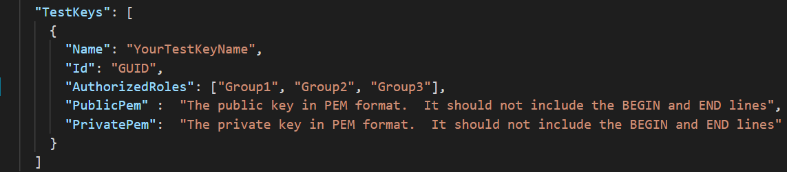
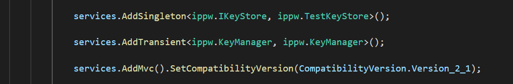

# <a name="double-key-encryption-for-microsoft-365"></a>Crittografia a chiave doppia per Microsoft 365

> *Si applica a: crittografia a chiave doppia per Microsoft 365, [conformità a microsoft 365](https://www.microsoft.com/microsoft-365/business/compliance-management), [Azure Information Protection](https://azure.microsoft.com/pricing/details/information-protection)*
>
> *Istruzioni per: [client di etichettatura unificata di Azure Information Protection per Windows](https://docs.microsoft.com/azure/information-protection/faqs#whats-the-difference-between-the-azure-information-protection-classic-and-unified-labeling-clients)*
>
> *Descrizione del servizio per: [conformità di Microsoft 365](https://docs.microsoft.com/office365/servicedescriptions/microsoft-365-service-descriptions/microsoft-365-tenantlevel-services-licensing-guidance/microsoft-365-security-compliance-licensing-guidance)*

La crittografia a chiave doppia (DKE) utilizza due tasti insieme per accedere al contenuto protetto. Microsoft archivia una chiave in Microsoft Azure e si tiene premuto l'altro tasto. È possibile mantenere il controllo completo di una delle chiavi utilizzando il servizio di crittografia a chiave doppia. È possibile applicare la protezione utilizzando il client Azure Information Protection Unified Labeling al contenuto estremamente riservato.

La crittografia a chiave doppia supporta sia le distribuzioni cloud che quelle locali. Queste distribuzioni contribuiscono a garantire che i dati crittografati rimangano opachi ovunque vengano archiviati i dati protetti.

Per ulteriori informazioni sulle chiavi radice tenant basate su cloud predefinite, vedere [Planning and implementing your Azure Information Protection tenant Key](https://docs.microsoft.com/azure/information-protection/plan-implement-tenant-key).

## <a name="when-your-organization-should-adopt-dke"></a>Quando l'organizzazione deve adottare DKE

La crittografia a chiave doppia è destinata ai dati più sensibili che sono soggetti ai requisiti di protezione più severi. DKE non è destinato a tutti i dati. In generale, si utilizzerà la crittografia a chiave doppia per proteggere solo una parte piccolissima dei dati complessivi. Prima di eseguire la distribuzione, è necessario fare due diligence per identificare i dati giusti da includere in questa soluzione. In alcuni casi, potrebbe essere necessario restringere l'ambito e utilizzare altre soluzioni per la maggior parte dei dati, ad esempio Microsoft Information Protection con Microsoft-Managed Keys o BYOK. Queste soluzioni sono sufficienti per i documenti che non sono soggetti a protezioni avanzate e requisiti normativi. Inoltre, queste soluzioni consentono di utilizzare i più potenti servizi di Office 365; servizi che non è possibile utilizzare con il contenuto crittografato di DKE. Ad esempio:

- Regole di trasporto, tra cui anti-malware e posta indesiderata che richiedono visibilità nell'allegato
- Approfondimento Microsoft
- eDiscovery
- Ricerca e indicizzazione del contenuto
- Office Web Apps inclusa la funzionalità di creazione condivisa

Tutte le applicazioni o i servizi esterni che non sono integrati con DKE tramite l'SDK MIP non saranno in grado di eseguire azioni sui dati crittografati.

Microsoft Information Protection SDK 1.7 + supporta la crittografia a chiave doppia. le applicazioni che si integrano con il nostro SDK saranno in grado di ragionare su questi dati con autorizzazioni e integrazioni sufficienti sul posto.

Si consiglia alle organizzazioni di utilizzare le funzionalità di protezione delle informazioni di Microsoft (classificazione ed etichettatura) per proteggere la maggior parte dei dati riservati e utilizzare solo DKE per i dati mission-critical. La crittografia a chiave doppia è particolarmente importante per i dati estremamente sensibili nelle industrie altamente regolamentate, come i servizi finanziari e sanitari.

Se le organizzazioni hanno uno dei requisiti seguenti, è possibile utilizzare DKE per proteggere il contenuto:

- Si desidera garantire che sia possibile decrittografare il contenuto protetto *solo* in tutte le circostanze.
- Non si desidera che Microsoft abbia accesso ai dati protetti da solo.
- Sono necessari requisiti normativi per mantenere le chiavi all'interno di un limite geografico. Tutte le chiavi conservate per la crittografia e la decrittografia dei dati vengono mantenute nel Data Center.

## <a name="system-and-licensing-requirements-for-dke"></a>Requisiti di sistema e licenze per DKE

**La crittografia a chiave doppia per microsoft 365** è disponibile con Microsoft 365 E5 e Office 365 E5. Se non si dispone di una licenza Microsoft 365 E5, è possibile iscriversi per una [versione di valutazione](https://aka.ms/M365E5ComplianceTrial). Per ulteriori informazioni su queste licenze, vedere [Microsoft 365 Licensing Guidance for security & Compliance](https://docs.microsoft.com/office365/servicedescriptions/microsoft-365-service-descriptions/microsoft-365-tenantlevel-services-licensing-guidance/microsoft-365-security-compliance-licensing-guidance).

**Azure Information Protection**. DKE funziona con le etichette di riservatezza e richiede la protezione delle informazioni di Azure.

Le etichette di sensibilità di DKE sono rese disponibili agli utenti finali tramite la barra multifunzione di sensitivity nelle app desktop di Office. Installare questi prerequisiti su ogni computer client in cui si desidera proteggere e utilizzare documenti protetti.

**App di Microsoft Office per Enterprise** Version *. 12711 o versione successiva (versioni desktop di Word, PowerPoint ed Excel) in Windows.

**Azure Information Protection Unified Labeling client** Versions 2.7.93.0 o versione successiva. Scaricare e installare il client di etichettatura unificata dall' [area download Microsoft](https://www.microsoft.com/download/details.aspx?id=53018).

## <a name="supported-environments-for-storing-and-viewing-dke-protected-content"></a>Ambienti supportati per l'archiviazione e la visualizzazione di contenuto protetto da DKE

**Applicazioni supportate**. [Microsoft 365 Apps for Enterprise](https://www.microsoft.com/microsoft-365/business/microsoft-365-apps-for-enterprise-product) clients on Windows, tra cui Word, Excel e PowerPoint.

**Supporto per i contenuti online**. Sono supportati i documenti e i file archiviati online in Microsoft SharePoint e OneDrive for business. È possibile condividere il contenuto crittografato tramite posta elettronica, ma non è possibile visualizzare i documenti e i file crittografati online. Al contrario, è necessario visualizzare il contenuto protetto utilizzando le app desktop del computer locale.

## <a name="overview-of-deploying-dke"></a>Panoramica della distribuzione di DKE

Seguire questi passaggi generali per configurare DKE. Dopo aver completato questi passaggi, gli utenti finali saranno in grado di proteggere i dati altamente riservati con la crittografia a chiave doppia.

1. Distribuire il servizio DKE come descritto in questo articolo.

2. Creare un'etichetta con crittografia a chiave doppia. Passare a Information Protection nel [centro conformità Microsoft 365](https://compliance.microsoft.com) e creare una nuova etichetta con crittografia a chiave doppia. [Per applicare la crittografia, vedere limitare l'accesso al contenuto utilizzando le etichette di riservatezza](https://docs.microsoft.com/microsoft-365/compliance/encryption-sensitivity-labels).

3. Utilizzare le etichette di crittografia a chiave doppia. Proteggere i dati selezionando l'etichetta crittografata con il doppio tasto dalla barra multifunzione di sensitivity in Microsoft Office.

Sono disponibili diversi modi per completare alcuni passaggi per la distribuzione della crittografia a chiave doppia. In questo articolo vengono fornite istruzioni dettagliate per consentire agli amministratori meno esperti di distribuire correttamente il servizio. Se si ha familiarità con questo metodo, è possibile scegliere di utilizzare i propri metodi.

## <a name="deploy-dke"></a>Distribuire DKE

Questo articolo e il video sulla distribuzione utilizzano Azure come destinazione di distribuzione per il servizio DKE. Se si esegue la distribuzione in un'altra posizione, è necessario fornire i propri valori.

Per una panoramica dettagliata dei concetti di questo articolo, vedere il [video sulla distribuzione di crittografia a chiave doppia](https://youtu.be/vDWfHN_kygg) . Il video richiede circa 18 minuti per il completamento.

Seguire questi passaggi generali per configurare la crittografia a chiave doppia per l'organizzazione.

1. [Installare i prerequisiti software per il servizio DKE](#install-software-prerequisites-for-the-dke-service)
1. [Clonare il repository di crittografia GitHub a doppio tasto](#clone-the-dke-github-repository)
1. [Modificare le impostazioni dell'applicazione](#modify-application-settings)
1. [Generare i tasti di testing](#generate-test-keys)
1. [Generare il progetto](#build-the-project)
1. [Distribuire il servizio DKE e pubblicare l'archivio delle chiavi](#deploy-the-dke-service-and-publish-the-key-store)
1. [Convalidare la distribuzione](#validate-your-deployment)
1. [Registrare il proprio archivio delle chiavi](#register-your-key-store)
1. [Creare etichette di riservatezza utilizzando DKE](#create-sensitivity-labels-using-dke)
1. [Abilitare DKE nel client](#enable-dke-in-your-client)
1. [Eseguire la migrazione di file protetti da etichette di HYOK a etichette DKE](#migrate-protected-files-from-hyok-labels-to-dke-labels)

Al termine, è possibile crittografare documenti e file utilizzando DKE. Per informazioni, vedere [applicare etichette di riservatezza ai propri file e messaggi di posta elettronica in Office](https://support.microsoft.com/office/2f96e7cd-d5a4-403b-8bd7-4cc636bae0f9).

### <a name="install-software-prerequisites-for-the-dke-service"></a>Installare i prerequisiti software per il servizio DKE

Installare questi prerequisiti nel computer in cui si desidera installare il servizio DKE.

**.NET Core 3,1 SDK**. Scaricare e installare l'SDK da [download .NET Core 3,1](https://dotnet.microsoft.com/download/dotnet-core/3.1).

**Codice Visual Studio**. Scaricare il codice di Visual Studio da [https://code.visualstudio.com/](https://code.visualstudio.com) . Una volta installato, eseguire codice Visual Studio e selezionare **Visualizza** \> **estensioni**. Installare queste estensioni.

- C# per Visual Studio Code

- Gestione pacchetti NuGet

**Risorse git**. Scaricare e installare una delle opzioni seguenti.

- [Git](https://git-scm.com/downloads)

- [GitHub desktop](https://desktop.github.com/)

- [GitHub Enterprise](https://github.com/enterprise)

**Openssl** È necessario avere installato [openssl](https://slproweb.com/products/Win32OpenSSL.html) per [generare le chiavi di test](#generate-test-keys) dopo la distribuzione di DKE. Assicurarsi di richiamarlo correttamente dal percorso delle variabili di ambiente. Ad esempio, vedere la sezione "aggiungere la directory di installazione al percorso" [https://www.osradar.com/install-openssl-windows/](https://www.osradar.com/install-openssl-windows/) per informazioni dettagliate.

### <a name="clone-the-dke-github-repository"></a>Clonare il repository di DKE GitHub

Microsoft fornisce i file di origine di DKE in un repository GitHub. È possibile clonare il repository per creare il progetto localmente per l'utilizzo dell'organizzazione. L'archivio di DKE GitHub si trova in [https://github.com/Azure-Samples/DoubleKeyEncryptionService](https://github.com/Azure-Samples/DoubleKeyEncryptionService) .

Le istruzioni riportate di seguito sono destinate agli utenti di codice git o Visual Studio inesperti:

1. Nel browser, andare a: [https://github.com/Azure-Samples/DoubleKeyEncryptionService](https://github.com/Azure-Samples/DoubleKeyEncryptionService) .

2. Verso il lato destro dello schermo, selezionare **codice**. La versione dell'interfaccia utente potrebbe mostrare un pulsante **Clone o download** . Quindi, nell'elenco a discesa che viene visualizzato, selezionare l'icona copia per copiare l'URL negli Appunti.

    Ad esempio:

   

3. In Visual Studio Code, selezionare **Visualizza** \> **tavolozza dei comandi** e selezionare **git: Clone**. Per passare all'opzione nell'elenco, iniziare `git: clone` a digitare per filtrare le voci e quindi selezionarla dal menu a discesa. Ad esempio:

   

4. Nella casella di testo incollare l'URL copiato da git e selezionare **Clone da GitHub**.

5. Nella finestra di dialogo **Seleziona cartella** visualizzata passare a e selezionare un percorso in cui archiviare il repository. Al prompt dei comandi, selezionare **Apri**.

    L'archivio viene aperto in Visual Studio Code e visualizza il ramo git corrente in basso a sinistra. La succursale deve essere **Master**.

    Ad esempio:

   

6. Selezionare il **Master** di Word nell'elenco dei rami.

   > [!IMPORTANT]
   > Selezionando la succursale Master si garantisce che siano presenti i file corretti per la creazione del progetto. Se non si sceglie la succursale corretta, la distribuzione avrà esito negativo.

È ora necessario configurare l'archivio di origine di DKE localmente. Successivamente, [modificare le impostazioni dell'applicazione](#modify-application-settings) per l'organizzazione.

### <a name="modify-application-settings"></a>Modificare le impostazioni dell'applicazione

Per distribuire il servizio DKE, è necessario modificare i tipi di impostazioni dell'applicazione seguenti:

- [Impostazioni di accesso alle chiavi](#key-access-settings)
- [Impostazioni del tenant e delle chiavi](#tenant-and-key-settings)

È possibile modificare le impostazioni dell'applicazione nel appsettings.jssu file. Questo file si trova nel repo di DoubleKeyEncryptionService clonato localmente in DoubleKeyEncryptionService\src\customer-key-store. Ad esempio, in Visual Studio Code è possibile passare al file come illustrato nella figura seguente.


#### <a name="key-access-settings"></a>Impostazioni di accesso alle chiavi

Scegliere se utilizzare la posta elettronica o l'autorizzazione di ruolo. DKE supporta solo uno di questi metodi di autenticazione alla volta.

- **Autorizzazione per la posta elettronica**. Consente all'organizzazione di autorizzare l'accesso alle chiavi solo in base agli indirizzi di posta elettronica.

- **Autorizzazione ruolo**. Consente all'organizzazione di autorizzare l'accesso ai tasti basati su gruppi di Active Directory e richiede che il servizio Web possa eseguire query su LDAP.

**Per impostare le impostazioni di accesso alle chiavi per DKE utilizzando l'autorizzazione per la posta elettronica**

1. Aprire il **appsettings.jssu** file e individuare l' `AuthorizedEmailAddress` impostazione.

2. Aggiungere l'indirizzo o gli indirizzi di posta elettronica che si desidera autorizzare. Separare più indirizzi di posta elettronica con virgolette doppie e virgole. Ad esempio:

   ```json
   "AuthorizedEmailAddress": ["email1@company.com", "email2@company.com ", "email3@company.com"]
   ```

3. Individuare l' `LDAPPath` impostazione e rimuovere il testo `If you use role authorization (AuthorizedRoles) then this is the LDAP path.` tra virgolette doppie. Lasciare le virgolette doppie sul posto. Al termine, l'impostazione dovrebbe essere simile alla seguente.

   ```json
   "LDAPPath": ""
   ```

4. Individuare l' `AuthorizedRoles` impostazione ed eliminare l'intera riga.

Questa immagine Visualizza il **appsettings.jssu** file formattato correttamente per l'autorizzazione della posta elettronica.

   

**Per impostare le impostazioni di accesso alle chiavi per DKE utilizzando l'autorizzazione ruolo**

1. Aprire il **appsettings.jssu** file e individuare l' `AuthorizedRoles` impostazione.

2. Aggiungere i nomi dei gruppi di Active Directory che si desidera autorizzare. Separare più nomi di gruppi con virgolette doppie e virgole. Ad esempio:

   ```json
   "AuthorizedRoles": ["group1", "group2", "group3"]
   ```

3. Individuare l' `LDAPPath` impostazione e aggiungere il dominio di Active Directory. Ad esempio:

   ```json
   "LDAPPath": "contoso.com"
   ```

4. Individuare l' `AuthorizedEmailAddress` impostazione ed eliminare l'intera riga.

Questa immagine Visualizza il **appsettings.jssu** file formattato correttamente per l'autorizzazione di ruolo.

   

#### <a name="tenant-and-key-settings"></a>Impostazioni del tenant e delle chiavi

Le impostazioni del tenant e delle chiavi di DKE si trovano nel **appsettings.jssu** file.

**Per configurare le impostazioni relative a tenant e chiavi per DKE**

1. Aprire la **appsettings.jssu** file.

2. Individuare l' `ValidIssuers` impostazione e sostituirla `<tenantid>` con l'ID tenant. È possibile individuare l'ID tenant accedendo al portale di Azure e visualizzando le [proprietà del tenant](https://aad.portal.azure.com/#blade/Microsoft_AAD_IAM/ActiveDirectoryMenuBlade/Properties). Ad esempio:

   ```json
   "ValidIssuers": [
     "https://sts.windows.net/9c99431e-b513-44be-a7d9-e7b500002d4b/"
   ]
   ```

Individuare il `JwtAudience` . Sostituire `<yourhostname>` con il nome host del computer in cui verrà eseguito il servizio DKE. Ad esempio:

  > [!IMPORTANT]
  > Il valore per `JwtAudience` deve corrispondere *esattamente*al nome dell'host. È possibile utilizzare **localhost: 5001** durante il debug. Tuttavia, al termine del debug, aggiornare questo valore al nome host del server.

- `TestKeys:Name`. Immettere un nome per la chiave. Ad esempio: `TestKey1`
- `TestKeys:Id`. Creare un GUID e immetterlo come `TestKeys:ID` valore. Ad esempio, `DCE1CC21-FF9B-4424-8FF4-9914BD19A1BE`. È possibile utilizzare un sito come [Generatore di GUID online](https://guidgenerator.com/) per generare casualmente un GUID.

Questa immagine Visualizza il formato corretto per le impostazioni dei tenant e delle chiavi in **appsettings.jsattiva**. `LDAPPath` è configurata per l'autorizzazione di ruolo.


### <a name="generate-test-keys"></a>Generare i tasti di testing

Una volta definite le impostazioni dell'applicazione, si è pronti a generare chiavi di test pubbliche e private.

Per generare chiavi:

1. Dal menu Start di Windows, eseguire il prompt dei comandi di OpenSSL.

2. Passare alla cartella in cui si desidera salvare i tasti di test. I file creati eseguendo la procedura descritta in questa attività sono archiviati nella stessa cartella.

3. Generare il nuovo tasto di test.

   ```dos
   openssl req -x509 -newkey rsa:2048 -keyout key.pem -out cert.pem -days 365
   ```

4. Generare la chiave privata.

   ```dos
   openssl rsa -in key.pem -out privkeynopass.pem
   ```

5. Generare la chiave pubblica.

   ```dos
   openssl rsa -in key.pem -pubout > pubkeyonly.pem
   ```

6. In un editor di testo aprire **pubkeyonly. pem**. Copiare tutto il contenuto del file **pubkeyonly. pem** , tranne la prima e l'ultima riga, nella `PublicPem` sezione del **appsettings.jssu** file.

7. In un editor di testo aprire **privkeynopass. pem**. Copiare tutto il contenuto del file **privkeynopass. pem** , tranne la prima e l'ultima riga, nella `PrivatePem` sezione del **appsettings.jssu** file.

8. Rimuovere tutti gli spazi vuoti e le nuove righe in entrambe le `PublicPem` `PrivatePem` sezioni e.

    > [!IMPORTANT]
    > Quando si copia questo contenuto, non eliminare i dati PEM.

9. In Visual Studio Code passare al file **Startup.cs** . Questo file si trova nel repo di DoubleKeyEncryptionService clonato localmente in DoubleKeyEncryptionService\src\customer-key-store\.

10. Individuare le righe seguenti:

   ```c#
        #if USE_TEST_KEYS
        #error !!!!!!!!!!!!!!!!!!!!!! Use of test keys is only supported for testing,
        DO NOT USE FOR PRODUCTION !!!!!!!!!!!!!!!!!!!!!!!!!!!!!
        services.AddSingleton<ippw.IKeyStore, ippw.TestKeyStore>();
        #endif
   ```

11. Sostituire queste righe con il testo seguente:

   ```csharp
   services.AddSingleton<ippw.IKeyStore, ippw.TestKeyStore>();
   ```

   I risultati finali devono essere simili al seguente.

   

A questo punto si è pronti per [creare il progetto di DKE](#build-the-project).

### <a name="build-the-project"></a>Generare il progetto

Utilizzare le istruzioni seguenti per creare localmente il progetto DKE:

1. In Visual Studio Code, nell'archivio dei servizi di DKE, selezionare **Visualizza** \> **tavolozza dei comandi** e quindi digitare **Compila** al prompt.

2. Nell'elenco scegliere **attività: Esegui attività di compilazione**.

   Se non sono state trovate attività di compilazione, selezionare **Configura attività di compilazione** e crearne una per .NET Core come indicato di seguito.

   

   1. Scegliere **crea tasks.jssu da modello**.

      

   2. Nell'elenco dei tipi di modello selezionare **.NET Core**.

      

   3. Nella sezione generazione individuare il percorso del file **customerkeystore. csproj** . Se non è presente, aggiungere la riga seguente:

      ```json
      "${workspaceFolder}/src/customer-key-store/customerkeystore.csproj",
      ```

   4. Eseguire di nuovo la Build.

3. Verificare che non vi siano errori rossi nella finestra di output.

   Se sono presenti errori rossi, controllare l'output della console. Verificare che siano stati completati correttamente tutti i passaggi precedenti e che siano presenti le versioni di compilazione corrette.

4. Selezionare **Esegui** \> **debug avvio** per eseguire il debug del processo. Se viene richiesto di selezionare un ambiente, selezionare **.NET Core**.

Il debugger di base di .NET in genere viene avviato in `https://localhost:5001` . Per visualizzare la chiave di test, passare a `https://localhost:5001` e aggiungere una barra (/) e il nome della chiave. Ad esempio:

```https
https://localhost:5001/TestKey1
```

Il tasto dovrebbe essere visualizzato in formato JSON.

La configurazione è stata completata. Prima di pubblicare il keystore, in appsettings.jssu, per l'impostazione JwtAudience, assicurarsi che il valore di hostname corrisponda esattamente al nome host del servizio app. Potrebbe essere stata modificata in localhost per risolvere i problemi relativi alla generazione.

### <a name="deploy-the-dke-service-and-publish-the-key-store"></a>Distribuire il servizio DKE e pubblicare l'archivio delle chiavi

Per le distribuzioni di produzione, distribuire il servizio in un cloud di terze parti o [pubblicarlo in un sistema locale](https://docs.microsoft.com/aspnet/core/tutorials/publish-to-iis?view=aspnetcore-3.1&preserve-view=true&tabs=netcore-cli).

È possibile preferire altri metodi per distribuire le chiavi. Selezionare il metodo più adatto per l'organizzazione.

Per le distribuzioni pilota, è possibile eseguire la distribuzione in Azure e iniziare subito.

**Per creare un'istanza di Azure Web App per ospitare la distribuzione di DKE**

Per pubblicare l'archivio delle chiavi, è possibile creare un'istanza del servizio app di Azure per ospitare la distribuzione di DKE. Successivamente, verranno pubblicate le chiavi generate in Azure.

1. Nel browser, accedere al [portale di Microsoft Azure](https://ms.portal.azure.com)e passare a **app Services**  >  **Add**.

2. Selezionare l'abbonamento e il gruppo di risorse e definire i dettagli dell'istanza.

    - Immettere il nome host del computer in cui si desidera installare il servizio DKE. Verificare che sia lo stesso nome di quello definito per l'impostazione JwtAudience nel [**appsettings.jssu**](#tenant-and-key-settings) file. Il valore specificato per il nome è anche WebAppInstanceName.

    - Per la **pubblicazione**, selezionare **codice**e per **stack di Runtime**, selezionare **.NET Core 3,1**.

    Ad esempio:

   

3. Nella parte inferiore della pagina, selezionare **revisione + crea**e quindi fare clic su **Aggiungi**.

4. Per pubblicare le chiavi generate, eseguire una delle operazioni seguenti:

    - [Pubblicare tramite ZipDeployUI](#publish-via-zipdeployui)
    - [Pubblicare tramite FTP](#publish-via-ftp)
    - [Pubblicare tramite Visual Studio 2019 o versione successiva](https://docs.microsoft.com/aspnet/core/tutorials/)

#### <a name="publish-via-zipdeployui"></a>Pubblicare tramite ZipDeployUI

1. Passare a `https://<WebAppInstanceName>.scm.azurewebsites.net/ZipDeployUI`.

    Ad esempio: https://dkeservice.scm.azurewebsites.net/ZipDeployUI

2. Nella codebase per l'archivio delle chiavi passare alla cartella **Customer-Key-store\src\customer-Key-Store** e verificare che la cartella contenga il file **customerkeystore. csproj** .

3. Esegui: **pubblicazione di DotNet**

     La finestra di output Visualizza la directory in cui è stata distribuita la pubblicazione.

    Ad esempio: `customer-key-store\src\customer-key-store\bin\Debug\netcoreapp3.1\publish\`

4. Inviare tutti i file nella directory di pubblicazione a un file con estensione zip. Quando si crea il file con estensione zip, verificare che tutti i file presenti nella directory si trovino nel livello radice del file. zip.

5. Trascinare e rilasciare il file con estensione zip creato nel sito di ZipDeployUI che è stato aperto. Ad esempio: https://dkeservice.scm.azurewebsites.net/ZipDeployUI

DKE è distribuito ed è possibile passare alle chiavi di test create. Continuare a [convalidare la distribuzione](#validate-your-deployment) seguente.

#### <a name="publish-via-ftp"></a>Pubblicare tramite FTP

1. Connettersi al servizio app creato [precedentemente](#deploy-the-dke-service-and-publish-the-key-store).

    Nel browser passare a: **Azure portal**  >  **App Service**  >  **Deployment Center**  >  **Manual Deployment**  >  **FTP**  >  **Dashboard**FTP Deployment Center di distribuzione manuale di Azure Portal app.

2. Copiare le stringhe di connessione visualizzate in un file locale. Queste stringhe verranno utilizzate per la connessione al servizio Web App e per il caricamento dei file tramite FTP.

    Ad esempio:

   

3. Nella codebase per l'archiviazione delle chiavi passare alla **directory Customer-Key-store\src\customer-Key-Store**

4. Verificare che la directory contenga il file **customerkeystore. csproj** .

5. Esegui: **pubblicazione di DotNet**

    L'output contiene la directory in cui è stata distribuita la pubblicazione.

    Ad esempio: `customer-key-store\src\customer-key-store\bin\Debug\netcoreapp3.1\publish\`

6. Inviare tutti i file nella directory di pubblicazione in un file zip. Quando si crea il file con estensione zip, verificare che tutti i file presenti nella directory si trovino nel livello radice del file. zip.

7. Dal client FTP, utilizzare le informazioni di connessione copiate per la connessione al servizio app. Caricare il file con estensione zip creato nel passaggio precedente alla directory radice dell'app Web.

DKE è distribuito ed è possibile passare alle chiavi di test create. Successivamente, [convalidare la distribuzione](#validate-your-deployment).

### <a name="validate-your-deployment"></a>Convalidare la distribuzione

Dopo aver distribuito DKE utilizzando uno dei metodi descritti in alto, convalidare la distribuzione e le impostazioni dell'archivio chiavi.

Eseguire: 

src\customer-key-store\scripts\key_store_tester.ps1 dkeserviceurl/MyKey

Ad esempio:

key_store_tester.ps1 https://mydkeservice.com/mykey

Assicurarsi che non vengano visualizzati errori nell'output. Quando si è pronti, [registrare il proprio archivio delle chiavi](#register-your-key-store).

## <a name="register-your-key-store"></a>Registrare il proprio archivio delle chiavi

La procedura seguente consente di registrare il servizio DKE. La registrazione del servizio DKE è l'ultimo passaggio della distribuzione di DKE prima di iniziare a creare etichette.

Per registrare il servizio DKE:

1. Nel browser aprire il portale di [Microsoft Azure](https://ms.portal.azure.com/)e passare a **tutte le** \> **Identity** \> **registrazioni delle app**di identità dei servizi.

2. Selezionare **nuova registrazione**e immettere un nome significativo.

3. Selezionare un tipo di account dalle opzioni visualizzate.

    Se si utilizza Microsoft Azure con un dominio non personalizzato, ad esempio **onmicrosoft.com**, selezionare solo gli **account nella directory dell'organizzazione (solo tenant di Microsoft).**

    Ad esempio:

   

4. Nella parte inferiore della pagina, selezionare **registra** per creare la nuova registrazione app.

5. Nella nuova registrazione dell'app, nel riquadro sinistro, in **Gestisci**selezionare **autenticazione**.

6. Selezionare **Aggiungi una piattaforma**.

7. Nel menu a comparsa **Configura piattaforme** selezionare **Web**.

8. In **URI di reindirizzamento**, immettere l'URI del servizio di crittografia a chiave doppia. Immettere l'URL del servizio app, inclusi il nome host e il dominio.

    Ad esempio: https://mydkeservicetest.com

    - L'URL immesso deve corrispondere al nome host in cui è distribuito il servizio DKE.
    - Se si sta verificando localmente con Visual Studio, utilizzare **https://localhost:5001** .
    - In tutti i casi, lo schema deve essere **https**.

    Verificare che il nome host corrisponda esattamente al nome host del servizio app. Potrebbe essere stato modificato per `localhost` risolvere i problemi relativi alla generazione. In **appsettings.js**, questo valore è il nome host impostato per `JwtAudience` .

9. In **concessione implicita**selezionare la casella di controllo **token ID** .

10. Selezionare **Salva** per salvare le modifiche.

11. Nel riquadro sinistro, selezionare **esporre un'API**, quindi accanto a URI ID applicazione selezionare **imposta**.

12. Sempre nella pagina **esporre un'API** , nell' **ambito definito dall'area API** Selezionare **Aggiungi un ambito**. Nel nuovo ambito:

    1. Definire il nome dell'ambito come **user_impersonation**.

    2. Selezionare gli amministratori e gli utenti che possono acconsentire.

    3. Definire i valori rimanenti richiesti.

    4. Selezionare **Aggiungi ambito**.

    5. Selezionare **Salva** nella parte superiore per salvare le modifiche.

13. Sempre nella pagina **esporre un'API** , nell'area **applicazioni client autorizzate** Selezionare **Aggiungi un'applicazione client**.

    Nella nuova applicazione client:

    1. Definire l'ID client come **d3590ed6-52B3-4102-Aeff-aad2292ab01c**. Questo valore è l'ID client di Microsoft Office e consente a Office di ottenere un token di accesso per l'archivio delle chiavi.

    2. In **ambiti autorizzati**selezionare l'ambito **user_impersonation** .

    3. Selezionare **Aggiungi applicazione**.

    4. Selezionare **Salva** nella parte superiore per salvare le modifiche.

Il servizio DKE è ora registrato. Continuare con la [creazione di etichette mediante DKE](#create-sensitivity-labels-using-dke).

## <a name="create-sensitivity-labels-using-dke"></a>Creare etichette di riservatezza utilizzando DKE

Nel centro conformità di Microsoft 365, creare una nuova etichetta di riservatezza e applicare la crittografia come si farebbe altrimenti. Selezionare **Use Double Key Encryption** e immettere l'URL dell'endpoint per la chiave.

Ad esempio:


Tutte le etichette di DKE aggiunte verranno visualizzate per gli utenti nelle versioni più recenti di Microsoft 365 Apps for Enterprise.

> [!NOTE]
> La possibilità di aggiornare i client con le nuove etichette potrebbe richiedere fino a 24 ore.

### <a name="enable-dke-in-your-client"></a>Abilitare DKE nel client

Se si è un Office Insider, DKE è abilitato per l'utente. In caso contrario, abilitare DKE per il client aggiungendo le seguenti chiavi del registro di sistema:

```properties
    [HKEY_LOCAL_MACHINE\SOFTWARE\WOW6432Node\Microsoft\MSIPC\flighting]
    "DoubleKeyProtection"=dword:00000001

    [HKEY_LOCAL_MACHINE\SOFTWARE\Microsoft\MSIPC\flighting]
    "DoubleKeyProtection"=dword:00000001
```

## <a name="migrate-protected-files-from-hyok-labels-to-dke-labels"></a>Eseguire la migrazione di file protetti da etichette di HYOK a etichette DKE

Se si desidera, una volta completata la configurazione di DKE, è possibile eseguire la migrazione del contenuto protetto utilizzando le etichette di HYOK per le etichette di DKE. Per eseguire la migrazione, è possibile utilizzare lo scanner AIP. Per iniziare a utilizzare lo scanner, vedere [che cos'è l'etichettatura unificata di Azure Information Protection?](https://docs.microsoft.com/azure/information-protection/deploy-aip-scanner).

Se non si esegue la migrazione del contenuto, il contenuto protetto di HYOK rimarrà invariato.
