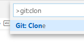
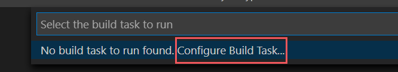

# <a name="double-key-encryption-for-microsoft-365"></a><span data-ttu-id="4b26e-103">Crittografia a chiave doppia per Microsoft 365</span><span class="sxs-lookup"><span data-stu-id="4b26e-103">Double Key Encryption for Microsoft 365</span></span>

> <span data-ttu-id="4b26e-104">*Si applica a: Double Key Encryption for Microsoft 365, [Microsoft 365 Compliance](https://www.microsoft.com/microsoft-365/business/compliance-management), Azure [Information Protection](https://azure.microsoft.com/pricing/details/information-protection)*</span><span class="sxs-lookup"><span data-stu-id="4b26e-104">*Applies to: Double Key Encryption for Microsoft 365, [Microsoft 365 Compliance](https://www.microsoft.com/microsoft-365/business/compliance-management), [Azure Information Protection](https://azure.microsoft.com/pricing/details/information-protection)*</span></span>
>
> <span data-ttu-id="4b26e-105">*Istruzioni per: [Client di etichettatura unificata](/azure/information-protection/faqs#whats-the-difference-between-the-azure-information-protection-classic-and-unified-labeling-clients) di Azure Information Protection per Windows*</span><span class="sxs-lookup"><span data-stu-id="4b26e-105">*Instructions for: [Azure Information Protection unified labeling client for Windows](/azure/information-protection/faqs#whats-the-difference-between-the-azure-information-protection-classic-and-unified-labeling-clients)*</span></span>
>
> <span data-ttu-id="4b26e-106">*Descrizione del servizio per: [Microsoft 365 conformità](/office365/servicedescriptions/microsoft-365-service-descriptions/microsoft-365-tenantlevel-services-licensing-guidance/microsoft-365-security-compliance-licensing-guidance)*</span><span class="sxs-lookup"><span data-stu-id="4b26e-106">*Service description for: [Microsoft 365 Compliance](/office365/servicedescriptions/microsoft-365-service-descriptions/microsoft-365-tenantlevel-services-licensing-guidance/microsoft-365-security-compliance-licensing-guidance)*</span></span>

<span data-ttu-id="4b26e-107">La crittografia a chiave doppia (DKE) usa due chiavi insieme per accedere al contenuto protetto.</span><span class="sxs-lookup"><span data-stu-id="4b26e-107">Double Key Encryption (DKE) uses two keys together to access protected content.</span></span> <span data-ttu-id="4b26e-108">Microsoft archivia una chiave in Microsoft Azure e tieni premuto l'altro tasto.</span><span class="sxs-lookup"><span data-stu-id="4b26e-108">Microsoft stores one key in Microsoft Azure, and you hold the other key.</span></span> <span data-ttu-id="4b26e-109">È possibile mantenere il controllo completo di una delle chiavi utilizzando il servizio di crittografia a chiave doppia.</span><span class="sxs-lookup"><span data-stu-id="4b26e-109">You maintain full control of one of your keys using the Double Key Encryption service.</span></span> <span data-ttu-id="4b26e-110">Puoi applicare la protezione usando il client di etichettatura unificata di Azure Information Protection ai contenuti altamente sensibili.</span><span class="sxs-lookup"><span data-stu-id="4b26e-110">You apply protection using The Azure Information Protection unified labeling client to your highly sensitive content.</span></span>

<span data-ttu-id="4b26e-111">La crittografia a chiave doppia supporta sia le distribuzioni cloud che le distribuzioni locali.</span><span class="sxs-lookup"><span data-stu-id="4b26e-111">Double Key Encryption supports both cloud and on-premises deployments.</span></span> <span data-ttu-id="4b26e-112">Queste distribuzioni consentono di garantire che i dati crittografati rimangano opachi ovunque si archivino i dati protetti.</span><span class="sxs-lookup"><span data-stu-id="4b26e-112">These deployments help to ensure that encrypted data remains opaque wherever you store the protected data.</span></span>

<span data-ttu-id="4b26e-113">Per ulteriori informazioni sulle chiavi radice del tenant predefinite basate su cloud, vedere [Planning and implementing your Azure Information Protection tenant key.](/azure/information-protection/plan-implement-tenant-key)</span><span class="sxs-lookup"><span data-stu-id="4b26e-113">For more information about the default, cloud-based tenant root keys, see [Planning and implementing your Azure Information Protection tenant key](/azure/information-protection/plan-implement-tenant-key).</span></span>

## <a name="when-your-organization-should-adopt-dke"></a><span data-ttu-id="4b26e-114">Quando l'organizzazione deve adottare DKE</span><span class="sxs-lookup"><span data-stu-id="4b26e-114">When your organization should adopt DKE</span></span>

<span data-ttu-id="4b26e-115">La crittografia a chiave doppia è destinata ai dati più sensibili soggetti ai requisiti di protezione più rigorosi.</span><span class="sxs-lookup"><span data-stu-id="4b26e-115">Double Key Encryption is intended for your most sensitive data that is subject to the strictest protection requirements.</span></span> <span data-ttu-id="4b26e-116">DKE non è destinato a tutti i dati.</span><span class="sxs-lookup"><span data-stu-id="4b26e-116">DKE is not intended for all data.</span></span> <span data-ttu-id="4b26e-117">In generale, si utilizza la crittografia a chiave doppia per proteggere solo una piccola parte dei dati complessivi.</span><span class="sxs-lookup"><span data-stu-id="4b26e-117">In general, you'll be using Double Key Encryption to protect only a small part of your overall data.</span></span> <span data-ttu-id="4b26e-118">È consigliabile fare due diligence per identificare i dati più idonei da coprire con questa soluzione prima di procedere alla distribuzione.</span><span class="sxs-lookup"><span data-stu-id="4b26e-118">You should do due diligence in identifying the right data to cover with this solution before you deploy.</span></span> <span data-ttu-id="4b26e-119">In alcuni casi, potrebbe essere necessario restringere l'ambito e utilizzare altre soluzioni per la maggior parte dei dati, ad esempio Microsoft Information Protection con chiavi gestite da Microsoft o BYOK.</span><span class="sxs-lookup"><span data-stu-id="4b26e-119">In some cases, you might need to narrow your scope and make use of other solutions for most your data such as Microsoft Information Protection with Microsoft-managed keys or BYOK.</span></span> <span data-ttu-id="4b26e-120">Queste soluzioni sono sufficienti per i documenti che non sono soggetti a protezioni avanzate e requisiti normativi.</span><span class="sxs-lookup"><span data-stu-id="4b26e-120">These solutions are sufficient for documents that aren't subject to enhanced protections and regulatory requirements.</span></span> <span data-ttu-id="4b26e-121">Inoltre, queste soluzioni consentono di utilizzare i servizi di Office 365 più potenti; servizi che non è possibile utilizzare con il contenuto crittografato DKE.</span><span class="sxs-lookup"><span data-stu-id="4b26e-121">Also, these solutions enable you to use the most powerful Office 365 services; services that you can't use with DKE encrypted content.</span></span> <span data-ttu-id="4b26e-122">Ad esempio:</span><span class="sxs-lookup"><span data-stu-id="4b26e-122">For example:</span></span>

- <span data-ttu-id="4b26e-123">Regole di trasporto che includono antimalware e posta indesiderata che richiedono visibilità nell'allegato</span><span class="sxs-lookup"><span data-stu-id="4b26e-123">Transport rules including anti-malware and spam that require visibility into the attachment</span></span>
- <span data-ttu-id="4b26e-124">Microsoft Delve</span><span class="sxs-lookup"><span data-stu-id="4b26e-124">Microsoft Delve</span></span>
- <span data-ttu-id="4b26e-125">eDiscovery</span><span class="sxs-lookup"><span data-stu-id="4b26e-125">eDiscovery</span></span>
- <span data-ttu-id="4b26e-126">Ricerca e indicizzazione del contenuto</span><span class="sxs-lookup"><span data-stu-id="4b26e-126">Content search and indexing</span></span>
- <span data-ttu-id="4b26e-127">Office App Web che includono la funzionalità di creazione condivisa</span><span class="sxs-lookup"><span data-stu-id="4b26e-127">Office Web Apps including coauthoring functionality</span></span>

<span data-ttu-id="4b26e-128">Qualsiasi applicazione o servizio esterno non integrato con DKE tramite MIP SDK non sarà in grado di eseguire azioni sui dati crittografati.</span><span class="sxs-lookup"><span data-stu-id="4b26e-128">Any external applications or services that are not integrated with DKE through the MIP SDK will be unable to perform actions on the encrypted data.</span></span>

<span data-ttu-id="4b26e-129">Microsoft Information Protection SDK 1.7+ supporta la crittografia a chiave doppia. le applicazioni che si integrano con il nostro SDK saranno in grado di ragionare su questi dati con autorizzazioni e integrazioni sufficienti.</span><span class="sxs-lookup"><span data-stu-id="4b26e-129">The Microsoft Information Protection SDK 1.7+ supports Double Key Encryption; applications that integrate with our SDK will be able to reason over this data with sufficient permissions and integrations in place.</span></span>

<span data-ttu-id="4b26e-130">È consigliabile che le organizzazioni utilizzino le funzionalità di protezione delle informazioni Microsoft (classificazione ed etichettatura) per proteggere la maggior parte dei dati sensibili e utilizzare DKE solo per i dati cruciali.</span><span class="sxs-lookup"><span data-stu-id="4b26e-130">We recommend organizations use Microsoft Information protection capabilities (classification and labeling) to protect most of their sensitive data and only use DKE for their mission-critical data.</span></span> <span data-ttu-id="4b26e-131">La crittografia a chiave doppia è rilevante per i dati sensibili in settori altamente regolamentati come i servizi finanziari e il settore sanitario.</span><span class="sxs-lookup"><span data-stu-id="4b26e-131">Double Key Encryption is relevant for sensitive data in highly regulated industries such as Financial services and Healthcare.</span></span>

<span data-ttu-id="4b26e-132">Se le organizzazioni hanno uno dei requisiti seguenti, è possibile utilizzare DKE per proteggere il contenuto:</span><span class="sxs-lookup"><span data-stu-id="4b26e-132">If your organizations have any of the following requirements, you can use DKE to help secure your content:</span></span>

- <span data-ttu-id="4b26e-133">Si desidera assicurarsi che *solo tu possa* decrittografare il contenuto protetto, in tutte le circostanze.</span><span class="sxs-lookup"><span data-stu-id="4b26e-133">You want to ensure that *only you* can ever decrypt protected content, under all circumstances.</span></span>
- <span data-ttu-id="4b26e-134">Non si desidera che Microsoft abbia accesso ai dati protetti da solo.</span><span class="sxs-lookup"><span data-stu-id="4b26e-134">You don't want Microsoft to have access to protected data on its own.</span></span>
- <span data-ttu-id="4b26e-135">Sono necessari requisiti normativi per contenere le chiavi all'interno di un limite geografico.</span><span class="sxs-lookup"><span data-stu-id="4b26e-135">You have regulatory requirements to hold keys within a geographical boundary.</span></span> <span data-ttu-id="4b26e-136">Tutte le chiavi conservate per la crittografia e la decrittografia dei dati vengono mantenute nel data center.</span><span class="sxs-lookup"><span data-stu-id="4b26e-136">All of the keys that you hold for data encryption and decryption are maintained in your data center.</span></span>

## <a name="system-and-licensing-requirements-for-dke"></a><span data-ttu-id="4b26e-137">Requisiti di sistema e licenze per DKE</span><span class="sxs-lookup"><span data-stu-id="4b26e-137">System and licensing requirements for DKE</span></span>

<span data-ttu-id="4b26e-138">**Double Key Encryption for Microsoft 365** viene fornito con Microsoft 365 E5.</span><span class="sxs-lookup"><span data-stu-id="4b26e-138">**Double Key Encryption for Microsoft 365** comes with Microsoft 365 E5.</span></span> <span data-ttu-id="4b26e-139">Se non si dispone di una licenza Microsoft 365 E5, è possibile iscriversi a una versione di [valutazione.](https://aka.ms/M365E5ComplianceTrial)</span><span class="sxs-lookup"><span data-stu-id="4b26e-139">If you don’t have a Microsoft 365 E5 license, you can sign up for a [trial](https://aka.ms/M365E5ComplianceTrial).</span></span> <span data-ttu-id="4b26e-140">Per ulteriori informazioni su queste licenze, vedere linee [guida Microsoft 365 licenze per la sicurezza & conformità](/office365/servicedescriptions/microsoft-365-service-descriptions/microsoft-365-tenantlevel-services-licensing-guidance/microsoft-365-security-compliance-licensing-guidance).</span><span class="sxs-lookup"><span data-stu-id="4b26e-140">For more information about these licenses, see [Microsoft 365 licensing guidance for security & compliance](/office365/servicedescriptions/microsoft-365-service-descriptions/microsoft-365-tenantlevel-services-licensing-guidance/microsoft-365-security-compliance-licensing-guidance).</span></span>

<span data-ttu-id="4b26e-141">**Azure Information Protection**.</span><span class="sxs-lookup"><span data-stu-id="4b26e-141">**Azure Information Protection**.</span></span> <span data-ttu-id="4b26e-142">DKE funziona con le etichette di riservatezza e richiede Azure Information Protection.</span><span class="sxs-lookup"><span data-stu-id="4b26e-142">DKE works with sensitivity labels and requires Azure Information Protection.</span></span>

<span data-ttu-id="4b26e-143">Le etichette di riservatezza DKE sono rese disponibili per gli utenti finali tramite la barra multifunzione di riservatezza in Office desktop.</span><span class="sxs-lookup"><span data-stu-id="4b26e-143">DKE sensitivity labels are made available to end users through the sensitivity ribbon in Office Desktop Apps.</span></span> <span data-ttu-id="4b26e-144">Installare questi prerequisiti in ogni computer client in cui si desidera proteggere e utilizzare i documenti protetti.</span><span class="sxs-lookup"><span data-stu-id="4b26e-144">Install these prerequisites on each client computer where you want to protect and consume protected documents.</span></span>

<span data-ttu-id="4b26e-145">**Microsoft Office Apps for enterprise** versione 2009 o successiva (versioni desktop di Word, PowerPoint e Excel) Windows.</span><span class="sxs-lookup"><span data-stu-id="4b26e-145">**Microsoft Office Apps for enterprise** version 2009 or later (Desktop versions of Word, PowerPoint, and Excel) on Windows.</span></span>

<span data-ttu-id="4b26e-146">**Azure Information Protection Unified Labeling Client** versioni 2.7.93.0 o successive.</span><span class="sxs-lookup"><span data-stu-id="4b26e-146">**Azure Information Protection Unified Labeling Client** versions 2.7.93.0 or later.</span></span> <span data-ttu-id="4b26e-147">Scaricare e installare il client di etichettatura unificata [dall'Area download Microsoft.](https://www.microsoft.com/download/details.aspx?id=53018)</span><span class="sxs-lookup"><span data-stu-id="4b26e-147">Download and install the Unified Labeling client from the [Microsoft download center](https://www.microsoft.com/download/details.aspx?id=53018).</span></span>

## <a name="supported-environments-for-storing-and-viewing-dke-protected-content"></a><span data-ttu-id="4b26e-148">Ambienti supportati per l'archiviazione e la visualizzazione di contenuto protetto da DKE</span><span class="sxs-lookup"><span data-stu-id="4b26e-148">Supported environments for storing and viewing DKE-protected content</span></span>

<span data-ttu-id="4b26e-149">**Applicazioni supportate**.</span><span class="sxs-lookup"><span data-stu-id="4b26e-149">**Supported applications**.</span></span> <span data-ttu-id="4b26e-150">[Microsoft 365 Apps for enterprise](https://www.microsoft.com/microsoft-365/business/microsoft-365-apps-for-enterprise-product) client in Windows, inclusi Word, Excel e PowerPoint.</span><span class="sxs-lookup"><span data-stu-id="4b26e-150">[Microsoft 365 Apps for enterprise](https://www.microsoft.com/microsoft-365/business/microsoft-365-apps-for-enterprise-product) clients on Windows, including Word, Excel, and PowerPoint.</span></span>

<span data-ttu-id="4b26e-151">**Supporto del contenuto online**.</span><span class="sxs-lookup"><span data-stu-id="4b26e-151">**Online content support**.</span></span> <span data-ttu-id="4b26e-152">È possibile archiviare documenti e file protetti con la crittografia a chiave doppia online sia in Microsoft SharePoint che OneDrive for Business.</span><span class="sxs-lookup"><span data-stu-id="4b26e-152">You can store documents and files protected with Double Key Encryption online in both Microsoft SharePoint and OneDrive for Business.</span></span> <span data-ttu-id="4b26e-153">È necessario etichettare e proteggere documenti e file con DKE dalle applicazioni supportate prima di caricarlo in questi percorsi.</span><span class="sxs-lookup"><span data-stu-id="4b26e-153">You must label and protect documents and files with DKE by supported applications before you upload to these locations.</span></span> <span data-ttu-id="4b26e-154">È possibile condividere il contenuto crittografato tramite posta elettronica, ma non è possibile visualizzare documenti e file crittografati online.</span><span class="sxs-lookup"><span data-stu-id="4b26e-154">You can share encrypted content by email, but you can't view encrypted documents and files online.</span></span> <span data-ttu-id="4b26e-155">È invece necessario visualizzare il contenuto protetto utilizzando le applicazioni desktop e i client supportati nel computer locale.</span><span class="sxs-lookup"><span data-stu-id="4b26e-155">Instead, you must view protected content using the supported desktop applications and clients on your local computer.</span></span>

## <a name="overview-of-deploying-dke"></a><span data-ttu-id="4b26e-156">Panoramica della distribuzione di DKE</span><span class="sxs-lookup"><span data-stu-id="4b26e-156">Overview of deploying DKE</span></span>

<span data-ttu-id="4b26e-157">Segui questi passaggi generali per configurare DKE.</span><span class="sxs-lookup"><span data-stu-id="4b26e-157">You'll follow these general steps to set up DKE.</span></span> <span data-ttu-id="4b26e-158">Dopo aver completato questi passaggi, gli utenti finali potranno proteggere i dati altamente sensibili con la crittografia a chiave doppia.</span><span class="sxs-lookup"><span data-stu-id="4b26e-158">Once you've completed these steps, your end users will can protect your highly sensitive data with Double Key Encryption.</span></span>

1. <span data-ttu-id="4b26e-159">Distribuire il servizio DKE come descritto in questo articolo.</span><span class="sxs-lookup"><span data-stu-id="4b26e-159">Deploy the DKE service as described in this article.</span></span>

2. <span data-ttu-id="4b26e-160">Crea un'etichetta con la crittografia a chiave doppia.</span><span class="sxs-lookup"><span data-stu-id="4b26e-160">Create a label with Double Key Encryption.</span></span> <span data-ttu-id="4b26e-161">Passare a Protezione delle informazioni nel [Centro Microsoft 365 conformità](https://compliance.microsoft.com) e creare una nuova etichetta con crittografia a chiave doppia.</span><span class="sxs-lookup"><span data-stu-id="4b26e-161">Navigate to Information protection under the [Microsoft 365 compliance center](https://compliance.microsoft.com) and create a new label with Double Key Encryption.</span></span> <span data-ttu-id="4b26e-162">Vedere [Limitare l'accesso al contenuto utilizzando etichette di riservatezza per applicare la crittografia.](./encryption-sensitivity-labels.md)</span><span class="sxs-lookup"><span data-stu-id="4b26e-162">See [Restrict access to content by using sensitivity labels to apply encryption](./encryption-sensitivity-labels.md).</span></span>

3. <span data-ttu-id="4b26e-163">Utilizzare le etichette di crittografia a chiave doppia.</span><span class="sxs-lookup"><span data-stu-id="4b26e-163">Use Double Key Encryption labels.</span></span> <span data-ttu-id="4b26e-164">Proteggere i dati selezionando l'etichetta Crittografia a chiave doppia dalla barra multifunzione Riservatezza in Microsoft Office.</span><span class="sxs-lookup"><span data-stu-id="4b26e-164">Protect data by selecting the Double Key Encrypted label from the Sensitivity ribbon in Microsoft Office.</span></span>

<span data-ttu-id="4b26e-165">Esistono diversi modi per completare alcuni dei passaggi per distribuire la crittografia a chiave doppia.</span><span class="sxs-lookup"><span data-stu-id="4b26e-165">There are several ways you can complete some of the steps to deploy Double Key Encryption.</span></span> <span data-ttu-id="4b26e-166">In questo articolo vengono fornite istruzioni dettagliate in modo che gli amministratori meno esperti distribuiscono correttamente il servizio.</span><span class="sxs-lookup"><span data-stu-id="4b26e-166">This article provides detailed instructions so that less experienced admins successfully deploy the service.</span></span> <span data-ttu-id="4b26e-167">Se si ha familiarità con questa operazione, è possibile scegliere di utilizzare metodi personalizzati.</span><span class="sxs-lookup"><span data-stu-id="4b26e-167">If you're comfortable doing so, you can choose to use your own methods.</span></span>

## <a name="deploy-dke"></a><span data-ttu-id="4b26e-168">Distribuire DKE</span><span class="sxs-lookup"><span data-stu-id="4b26e-168">Deploy DKE</span></span>

<span data-ttu-id="4b26e-169">Questo articolo e il video di distribuzione usano Azure come destinazione di distribuzione per il servizio DKE.</span><span class="sxs-lookup"><span data-stu-id="4b26e-169">This article and the deployment video use Azure as the deployment destination for the DKE service.</span></span> <span data-ttu-id="4b26e-170">Se si esegue la distribuzione in un'altra posizione, è necessario specificare i propri valori.</span><span class="sxs-lookup"><span data-stu-id="4b26e-170">If you're deploying to another location, you'll need to provide your own values.</span></span>

<span data-ttu-id="4b26e-171">Guarda il [video sulla distribuzione della crittografia](https://youtu.be/vDWfHN_kygg) a chiave doppia per una panoramica dettagliata dei concetti illustrati in questo articolo.</span><span class="sxs-lookup"><span data-stu-id="4b26e-171">Watch the [Double Key Encryption deployment video](https://youtu.be/vDWfHN_kygg) to see a step-by-step overview of the concepts in this article.</span></span> <span data-ttu-id="4b26e-172">Il completamento del video richiede circa 18 minuti.</span><span class="sxs-lookup"><span data-stu-id="4b26e-172">The video takes about 18 minutes to complete.</span></span>

<span data-ttu-id="4b26e-173">Seguire questi passaggi generali per configurare la crittografia a chiave doppia per l'organizzazione.</span><span class="sxs-lookup"><span data-stu-id="4b26e-173">You'll follow these general steps to set up Double Key Encryption for your organization.</span></span>

1. [<span data-ttu-id="4b26e-174">Installare i prerequisiti software per il servizio DKE</span><span class="sxs-lookup"><span data-stu-id="4b26e-174">Install software prerequisites for the DKE service</span></span>](#install-software-prerequisites-for-the-dke-service)
1. [<span data-ttu-id="4b26e-175">Clonare l'archivio GitHub doppia chiave</span><span class="sxs-lookup"><span data-stu-id="4b26e-175">Clone the Double Key Encryption GitHub repository</span></span>](#clone-the-dke-github-repository)
1. [<span data-ttu-id="4b26e-176">Modificare le impostazioni dell'applicazione</span><span class="sxs-lookup"><span data-stu-id="4b26e-176">Modify application settings</span></span>](#modify-application-settings)
1. [<span data-ttu-id="4b26e-177">Generare chiavi di test</span><span class="sxs-lookup"><span data-stu-id="4b26e-177">Generate test keys</span></span>](#generate-test-keys)
1. [<span data-ttu-id="4b26e-178">Compilare il progetto</span><span class="sxs-lookup"><span data-stu-id="4b26e-178">Build the project</span></span>](#build-the-project)
1. [<span data-ttu-id="4b26e-179">Distribuire il servizio DKE e pubblicare l'archivio chiavi</span><span class="sxs-lookup"><span data-stu-id="4b26e-179">Deploy the DKE service and publish the key store</span></span>](#deploy-the-dke-service-and-publish-the-key-store)
1. [<span data-ttu-id="4b26e-180">Convalidare la distribuzione</span><span class="sxs-lookup"><span data-stu-id="4b26e-180">Validate your deployment</span></span>](#validate-your-deployment)
1. [<span data-ttu-id="4b26e-181">Registrare l'archivio chiavi</span><span class="sxs-lookup"><span data-stu-id="4b26e-181">Register your key store</span></span>](#register-your-key-store)
1. [<span data-ttu-id="4b26e-182">Creare etichette di riservatezza con DKE</span><span class="sxs-lookup"><span data-stu-id="4b26e-182">Create sensitivity labels using DKE</span></span>](#create-sensitivity-labels-using-dke)
1. [<span data-ttu-id="4b26e-183">Abilitare DKE nel client</span><span class="sxs-lookup"><span data-stu-id="4b26e-183">Enable DKE in your client</span></span>](#enable-dke-in-your-client)
1. [<span data-ttu-id="4b26e-184">Eseguire la migrazione dei file protetti dalle etichette HYOK alle etichette DKE</span><span class="sxs-lookup"><span data-stu-id="4b26e-184">Migrate protected files from HYOK labels to DKE labels</span></span>](#migrate-protected-files-from-hyok-labels-to-dke-labels)

<span data-ttu-id="4b26e-185">Al termine, è possibile crittografare documenti e file utilizzando DKE.</span><span class="sxs-lookup"><span data-stu-id="4b26e-185">When you're done, you can encrypt documents and files using DKE.</span></span> <span data-ttu-id="4b26e-186">Per informazioni, vedere [Applicare etichette di riservatezza ai file](https://support.microsoft.com/office/2f96e7cd-d5a4-403b-8bd7-4cc636bae0f9)e alla posta elettronica in Office .</span><span class="sxs-lookup"><span data-stu-id="4b26e-186">For information, see [Apply sensitivity labels to your files and email in Office](https://support.microsoft.com/office/2f96e7cd-d5a4-403b-8bd7-4cc636bae0f9).</span></span>

### <a name="install-software-prerequisites-for-the-dke-service"></a><span data-ttu-id="4b26e-187">Installare i prerequisiti software per il servizio DKE</span><span class="sxs-lookup"><span data-stu-id="4b26e-187">Install software prerequisites for the DKE service</span></span>

<span data-ttu-id="4b26e-188">Installare questi prerequisiti nel computer in cui si desidera installare il servizio DKE.</span><span class="sxs-lookup"><span data-stu-id="4b26e-188">Install these prerequisites on the computer where you want to install the DKE service.</span></span>

<span data-ttu-id="4b26e-189">**.NET Core 3.1 SDK**.</span><span class="sxs-lookup"><span data-stu-id="4b26e-189">**.NET Core 3.1 SDK**.</span></span> <span data-ttu-id="4b26e-190">Scaricare e installare l'SDK [da Scaricare .NET Core 3.1](https://dotnet.microsoft.com/download/dotnet-core/3.1).</span><span class="sxs-lookup"><span data-stu-id="4b26e-190">Download and install the SDK from [Download .NET Core 3.1](https://dotnet.microsoft.com/download/dotnet-core/3.1).</span></span>

<span data-ttu-id="4b26e-191">**Visual Studio Code**.</span><span class="sxs-lookup"><span data-stu-id="4b26e-191">**Visual Studio Code**.</span></span> <span data-ttu-id="4b26e-192">Scarica Visual Studio Code da [https://code.visualstudio.com/](https://code.visualstudio.com) .</span><span class="sxs-lookup"><span data-stu-id="4b26e-192">Download Visual Studio Code from [https://code.visualstudio.com/](https://code.visualstudio.com).</span></span> <span data-ttu-id="4b26e-193">Dopo l'installazione, eseguire Visual Studio Code e selezionare **Visualizza** \> **estensioni**.</span><span class="sxs-lookup"><span data-stu-id="4b26e-193">Once installed, run Visual Studio Code and select **View** \> **Extensions**.</span></span> <span data-ttu-id="4b26e-194">Installare queste estensioni.</span><span class="sxs-lookup"><span data-stu-id="4b26e-194">Install these extensions.</span></span>

- <span data-ttu-id="4b26e-195">C# per Visual Studio Code</span><span class="sxs-lookup"><span data-stu-id="4b26e-195">C# for Visual Studio Code</span></span>

- <span data-ttu-id="4b26e-196">NuGet Gestione pacchetti</span><span class="sxs-lookup"><span data-stu-id="4b26e-196">NuGet Package Manager</span></span>

<span data-ttu-id="4b26e-197">**Risorse Git**.</span><span class="sxs-lookup"><span data-stu-id="4b26e-197">**Git resources**.</span></span> <span data-ttu-id="4b26e-198">Scaricare e installare uno dei componenti seguenti.</span><span class="sxs-lookup"><span data-stu-id="4b26e-198">Download and install one of the following.</span></span>

- [<span data-ttu-id="4b26e-199">Git</span><span class="sxs-lookup"><span data-stu-id="4b26e-199">Git</span></span>](https://git-scm.com/downloads)

- [<span data-ttu-id="4b26e-200">GitHub Desktop</span><span class="sxs-lookup"><span data-stu-id="4b26e-200">GitHub Desktop</span></span>](https://desktop.github.com/)

- [<span data-ttu-id="4b26e-201">GitHub Enterprise</span><span class="sxs-lookup"><span data-stu-id="4b26e-201">GitHub Enterprise</span></span>](https://github.com/enterprise)

<span data-ttu-id="4b26e-202">**OpenSSL** È necessario che [OpenSSL sia](https://slproweb.com/products/Win32OpenSSL.html) installato per [generare le chiavi di test](#generate-test-keys) dopo la distribuzione di DKE.</span><span class="sxs-lookup"><span data-stu-id="4b26e-202">**OpenSSL** You must have [OpenSSL](https://slproweb.com/products/Win32OpenSSL.html) installed to [generate test keys](#generate-test-keys) after you deploy DKE.</span></span> <span data-ttu-id="4b26e-203">Assicurati di richiamarlo correttamente dal percorso delle variabili di ambiente.</span><span class="sxs-lookup"><span data-stu-id="4b26e-203">Make sure you're invoking it correctly from your environment variables path.</span></span> <span data-ttu-id="4b26e-204">Ad esempio, vedere "Aggiungere la directory di installazione a PATH" [https://www.osradar.com/install-openssl-windows/](https://www.osradar.com/install-openssl-windows/) all'indirizzo per informazioni dettagliate.</span><span class="sxs-lookup"><span data-stu-id="4b26e-204">For example, see "Add the installation directory to PATH" at [https://www.osradar.com/install-openssl-windows/](https://www.osradar.com/install-openssl-windows/) for details.</span></span>

### <a name="clone-the-dke-github-repository"></a><span data-ttu-id="4b26e-205">Clonare l'archivio GitHub DKE</span><span class="sxs-lookup"><span data-stu-id="4b26e-205">Clone the DKE GitHub repository</span></span>

<span data-ttu-id="4b26e-206">Microsoft fornisce i file di origine DKE in un GitHub repository.</span><span class="sxs-lookup"><span data-stu-id="4b26e-206">Microsoft supplies the DKE source files in a GitHub repository.</span></span> <span data-ttu-id="4b26e-207">Clonare il repository per compilare il progetto in locale per l'utilizzo dell'organizzazione.</span><span class="sxs-lookup"><span data-stu-id="4b26e-207">You clone the repository to build the project locally for your organization's use.</span></span> <span data-ttu-id="4b26e-208">L'archivio GitHub DKE si trova in [https://github.com/Azure-Samples/DoubleKeyEncryptionService](https://github.com/Azure-Samples/DoubleKeyEncryptionService) .</span><span class="sxs-lookup"><span data-stu-id="4b26e-208">The DKE GitHub repository is located at [https://github.com/Azure-Samples/DoubleKeyEncryptionService](https://github.com/Azure-Samples/DoubleKeyEncryptionService).</span></span>

<span data-ttu-id="4b26e-209">Le istruzioni seguenti sono destinate a utenti git o Visual Studio Code inesperti:</span><span class="sxs-lookup"><span data-stu-id="4b26e-209">The following instructions are intended for inexperienced git or Visual Studio Code users:</span></span>

1. <span data-ttu-id="4b26e-210">Nel browser passare a: [https://github.com/Azure-Samples/DoubleKeyEncryptionService](https://github.com/Azure-Samples/DoubleKeyEncryptionService) .</span><span class="sxs-lookup"><span data-stu-id="4b26e-210">In your browser, go to: [https://github.com/Azure-Samples/DoubleKeyEncryptionService](https://github.com/Azure-Samples/DoubleKeyEncryptionService).</span></span>

2. <span data-ttu-id="4b26e-211">Verso il lato destro dello schermo, selezionare **Codice.**</span><span class="sxs-lookup"><span data-stu-id="4b26e-211">Towards the right side of the screen, select **Code**.</span></span> <span data-ttu-id="4b26e-212">La versione dell'interfaccia utente potrebbe mostrare un **pulsante Clone o download.**</span><span class="sxs-lookup"><span data-stu-id="4b26e-212">Your version of the UI might show a **Clone or download** button.</span></span> <span data-ttu-id="4b26e-213">Nell'elenco a discesa visualizzato selezionare quindi l'icona copia per copiare l'URL negli Appunti.</span><span class="sxs-lookup"><span data-stu-id="4b26e-213">Then, in the dropdown that appears, select the copy icon to copy the URL to your clipboard.</span></span>

    <span data-ttu-id="4b26e-214">Ad esempio:</span><span class="sxs-lookup"><span data-stu-id="4b26e-214">For example:</span></span>

   > [!div class="mx-imgBorder"]
   > <span data-ttu-id="4b26e-215"></span><span class="sxs-lookup"><span data-stu-id="4b26e-215"></span></span>

3. <span data-ttu-id="4b26e-216">In Visual Studio Code, selezionare **Visualizza tavolozza** \> **dei comandi** e selezionare **Git: Clone**.</span><span class="sxs-lookup"><span data-stu-id="4b26e-216">In Visual Studio Code, select **View** \> **Command Palette** and select **Git: Clone**.</span></span> <span data-ttu-id="4b26e-217">Per passare all'opzione nell'elenco, iniziare a digitare per filtrare le voci e `git: clone` quindi selezionarle dall'elenco a discesa.</span><span class="sxs-lookup"><span data-stu-id="4b26e-217">To jump to the option in the list, start typing `git: clone` to filter the entries and then select it from the drop-down.</span></span> <span data-ttu-id="4b26e-218">Ad esempio:</span><span class="sxs-lookup"><span data-stu-id="4b26e-218">For example:</span></span>

   > [!div class="mx-imgBorder"]
   > <span data-ttu-id="4b26e-219"></span><span class="sxs-lookup"><span data-stu-id="4b26e-219"></span></span>

4. <span data-ttu-id="4b26e-220">Nella casella di testo incolla l'URL copiato da Git e seleziona **Clona da GitHub**.</span><span class="sxs-lookup"><span data-stu-id="4b26e-220">In the text box, paste the URL that you copied from Git and select **Clone from GitHub**.</span></span>

5. <span data-ttu-id="4b26e-221">Nella finestra **di dialogo Seleziona** cartella visualizzata individuare e selezionare un percorso in cui archiviare il repository.</span><span class="sxs-lookup"><span data-stu-id="4b26e-221">In the **Select Folder** dialog that appears, browse to and select a location to store the repository.</span></span> <span data-ttu-id="4b26e-222">Al prompt dei comandi, selezionare **Apri**.</span><span class="sxs-lookup"><span data-stu-id="4b26e-222">At the prompt, select **Open**.</span></span>

    <span data-ttu-id="4b26e-223">Il repository viene aperto in Visual Studio Code e visualizza il ramo Git corrente in basso a sinistra.</span><span class="sxs-lookup"><span data-stu-id="4b26e-223">The repository opens in Visual Studio Code, and displays the current Git branch at the bottom left.</span></span> <span data-ttu-id="4b26e-224">Ad esempio, il ramo deve essere **main**.</span><span class="sxs-lookup"><span data-stu-id="4b26e-224">For example,  The branch should be **main**.</span></span> <span data-ttu-id="4b26e-225">Ad esempio:</span><span class="sxs-lookup"><span data-stu-id="4b26e-225">For example:</span></span>

   

6. <span data-ttu-id="4b26e-227">Se non si è nel ramo principale, è necessario selezionarlo.</span><span class="sxs-lookup"><span data-stu-id="4b26e-227">If you're not on the main branch, you'll need to select it.</span></span> <span data-ttu-id="4b26e-228">In Visual Studio Code selezionare il ramo e scegliere **principale** dall'elenco di rami visualizzato.</span><span class="sxs-lookup"><span data-stu-id="4b26e-228">In Visual Studio Code, select the branch and choose **main** from the list of branches that displays.</span></span>

   > [!IMPORTANT]
   > <span data-ttu-id="4b26e-229">La selezione del ramo principale garantisce che siano stati compilati i file corretti.</span><span class="sxs-lookup"><span data-stu-id="4b26e-229">Selecting the main branch ensures that you have the correct files to build the project.</span></span> <span data-ttu-id="4b26e-230">Se non si sceglie il ramo corretto, la distribuzione avrà esito negativo.</span><span class="sxs-lookup"><span data-stu-id="4b26e-230">If you don't choose the correct branch your deployment will fail.</span></span>

<span data-ttu-id="4b26e-231">A questo punto l'archivio di origine DKE è configurato localmente.</span><span class="sxs-lookup"><span data-stu-id="4b26e-231">You now have your DKE source repository set up locally.</span></span> <span data-ttu-id="4b26e-232">Modificare quindi [le impostazioni dell'applicazione](#modify-application-settings) per l'organizzazione.</span><span class="sxs-lookup"><span data-stu-id="4b26e-232">Next, [modify application settings](#modify-application-settings) for your organization.</span></span>

### <a name="modify-application-settings"></a><span data-ttu-id="4b26e-233">Modificare le impostazioni dell'applicazione</span><span class="sxs-lookup"><span data-stu-id="4b26e-233">Modify application settings</span></span>

<span data-ttu-id="4b26e-234">Per distribuire il servizio DKE, è necessario modificare i tipi di impostazioni dell'applicazione seguenti:</span><span class="sxs-lookup"><span data-stu-id="4b26e-234">To deploy the DKE service, you must modify the following types of application settings:</span></span>

- [<span data-ttu-id="4b26e-235">Impostazioni di accesso ai tasti</span><span class="sxs-lookup"><span data-stu-id="4b26e-235">Key access settings</span></span>](#key-access-settings)
- [<span data-ttu-id="4b26e-236">Impostazioni tenant e chiave</span><span class="sxs-lookup"><span data-stu-id="4b26e-236">Tenant and key settings</span></span>](#tenant-and-key-settings)

<span data-ttu-id="4b26e-237">È possibile modificare le impostazioni dell'applicazione nel file appsettings.jssu.</span><span class="sxs-lookup"><span data-stu-id="4b26e-237">You modify application settings in the appsettings.json file.</span></span> <span data-ttu-id="4b26e-238">Questo file si trova nel repo DoubleKeyEncryptionService clonato localmente in DoubleKeyEncryptionService\src\customer-key-store.</span><span class="sxs-lookup"><span data-stu-id="4b26e-238">This file is located in the DoubleKeyEncryptionService repo you cloned locally under DoubleKeyEncryptionService\src\customer-key-store.</span></span> <span data-ttu-id="4b26e-239">Ad esempio, in Visual Studio Code, è possibile passare al file come illustrato nella figura seguente.</span><span class="sxs-lookup"><span data-stu-id="4b26e-239">For example, in Visual Studio Code, you can browse to the file as shown in the following picture.</span></span>


#### <a name="key-access-settings"></a><span data-ttu-id="4b26e-241">Impostazioni di accesso ai tasti</span><span class="sxs-lookup"><span data-stu-id="4b26e-241">Key access settings</span></span>

<span data-ttu-id="4b26e-242">Scegliere se utilizzare la posta elettronica o l'autorizzazione del ruolo.</span><span class="sxs-lookup"><span data-stu-id="4b26e-242">Choose whether to use email or role authorization.</span></span> <span data-ttu-id="4b26e-243">DKE supporta solo uno di questi metodi di autenticazione alla volta.</span><span class="sxs-lookup"><span data-stu-id="4b26e-243">DKE supports only one of these authentication methods at a time.</span></span>

- <span data-ttu-id="4b26e-244">**Autorizzazione di posta elettronica**.</span><span class="sxs-lookup"><span data-stu-id="4b26e-244">**Email authorization**.</span></span> <span data-ttu-id="4b26e-245">Consente all'organizzazione di autorizzare l'accesso alle chiavi solo in base agli indirizzi di posta elettronica.</span><span class="sxs-lookup"><span data-stu-id="4b26e-245">Allows your organization to authorize access to keys based on email addresses only.</span></span>

- <span data-ttu-id="4b26e-246">**Autorizzazione del ruolo**.</span><span class="sxs-lookup"><span data-stu-id="4b26e-246">**Role authorization**.</span></span> <span data-ttu-id="4b26e-247">Consente all'organizzazione di autorizzare l'accesso alle chiavi in base ai gruppi di Active Directory e richiede che il servizio Web possa eseguire query LDAP.</span><span class="sxs-lookup"><span data-stu-id="4b26e-247">Allows your organization to authorize access to keys based on Active Directory groups, and requires that the web service can query LDAP.</span></span>

<span data-ttu-id="4b26e-248">**Per impostare le impostazioni di accesso alle chiavi per DKE tramite l'autorizzazione di posta elettronica**</span><span class="sxs-lookup"><span data-stu-id="4b26e-248">**To set key access settings for DKE using email authorization**</span></span>

1. <span data-ttu-id="4b26e-249">Apri il **appsettings.jsfile on** e individua l'impostazione. `AuthorizedEmailAddress`</span><span class="sxs-lookup"><span data-stu-id="4b26e-249">Open the **appsettings.json** file and locate the `AuthorizedEmailAddress` setting.</span></span>

2. <span data-ttu-id="4b26e-250">Aggiungere l'indirizzo di posta elettronica o gli indirizzi che si desidera autorizzare.</span><span class="sxs-lookup"><span data-stu-id="4b26e-250">Add the email address or addresses that you want to authorize.</span></span> <span data-ttu-id="4b26e-251">Separare più indirizzi di posta elettronica con virgolette doppie e virgole.</span><span class="sxs-lookup"><span data-stu-id="4b26e-251">Separate multiple email addresses with double quotes and commas.</span></span> <span data-ttu-id="4b26e-252">Ad esempio:</span><span class="sxs-lookup"><span data-stu-id="4b26e-252">For example:</span></span>

   ```json
   "AuthorizedEmailAddress": ["email1@company.com", "email2@company.com ", "email3@company.com"]
   ```

3. <span data-ttu-id="4b26e-253">Individuare `LDAPPath` l'impostazione e rimuovere il `If you use role authorization (AuthorizedRoles) then this is the LDAP path.` testo tra virgolette doppie.</span><span class="sxs-lookup"><span data-stu-id="4b26e-253">Locate the `LDAPPath` setting and remove the text `If you use role authorization (AuthorizedRoles) then this is the LDAP path.` between the double quotes.</span></span> <span data-ttu-id="4b26e-254">Lasciare le virgolette doppie in posizione.</span><span class="sxs-lookup"><span data-stu-id="4b26e-254">Leave the double quotes in place.</span></span> <span data-ttu-id="4b26e-255">Al termine, l'impostazione dovrebbe essere simile alla seguente.</span><span class="sxs-lookup"><span data-stu-id="4b26e-255">When you're finished, the setting should look like this.</span></span>

   ```json
   "LDAPPath": ""
   ```

4. <span data-ttu-id="4b26e-256">Individuare `AuthorizedRoles` l'impostazione ed eliminare l'intera riga.</span><span class="sxs-lookup"><span data-stu-id="4b26e-256">Locate the `AuthorizedRoles` setting and delete the entire line.</span></span>

<span data-ttu-id="4b26e-257">Questa immagine mostra **l'appsettings.jssul** file formattato correttamente per l'autorizzazione di posta elettronica.</span><span class="sxs-lookup"><span data-stu-id="4b26e-257">This image shows the **appsettings.json** file correctly formatted for email authorization.</span></span>

   

<span data-ttu-id="4b26e-259">**Per impostare le impostazioni di accesso alle chiavi per DKE tramite l'autorizzazione del ruolo**</span><span class="sxs-lookup"><span data-stu-id="4b26e-259">**To set key access settings for DKE using role authorization**</span></span>

1. <span data-ttu-id="4b26e-260">Apri il **appsettings.jsfile on** e individua l'impostazione. `AuthorizedRoles`</span><span class="sxs-lookup"><span data-stu-id="4b26e-260">Open the **appsettings.json** file and locate the `AuthorizedRoles` setting.</span></span>

2. <span data-ttu-id="4b26e-261">Aggiungere i nomi dei gruppi di Active Directory che si desidera autorizzare.</span><span class="sxs-lookup"><span data-stu-id="4b26e-261">Add the Active Directory group names you want to authorize.</span></span> <span data-ttu-id="4b26e-262">Separare più nomi di gruppo con virgolette doppie e virgole.</span><span class="sxs-lookup"><span data-stu-id="4b26e-262">Separate multiple group names with double quotes and commas.</span></span> <span data-ttu-id="4b26e-263">Ad esempio:</span><span class="sxs-lookup"><span data-stu-id="4b26e-263">For example:</span></span>

   ```json
   "AuthorizedRoles": ["group1", "group2", "group3"]
   ```

3. <span data-ttu-id="4b26e-264">Individuare `LDAPPath` l'impostazione e aggiungere il dominio di Active Directory.</span><span class="sxs-lookup"><span data-stu-id="4b26e-264">Locate the `LDAPPath` setting and add the Active Directory domain.</span></span> <span data-ttu-id="4b26e-265">Ad esempio:</span><span class="sxs-lookup"><span data-stu-id="4b26e-265">For example:</span></span>

   ```json
   "LDAPPath": "contoso.com"
   ```

4. <span data-ttu-id="4b26e-266">Individuare `AuthorizedEmailAddress` l'impostazione ed eliminare l'intera riga.</span><span class="sxs-lookup"><span data-stu-id="4b26e-266">Locate the `AuthorizedEmailAddress` setting and delete the entire line.</span></span>

<span data-ttu-id="4b26e-267">Questa immagine mostra **l'appsettings.jssul** file formattato correttamente per l'autorizzazione del ruolo.</span><span class="sxs-lookup"><span data-stu-id="4b26e-267">This image shows the **appsettings.json** file correctly formatted for role authorization.</span></span>

   

#### <a name="tenant-and-key-settings"></a><span data-ttu-id="4b26e-269">Impostazioni tenant e chiave</span><span class="sxs-lookup"><span data-stu-id="4b26e-269">Tenant and key settings</span></span>

<span data-ttu-id="4b26e-270">Le impostazioni delle chiavi e del tenant DKE si trovano nel file **appsettings.jsfile.**</span><span class="sxs-lookup"><span data-stu-id="4b26e-270">DKE tenant and key settings are located in the **appsettings.json** file.</span></span>

<span data-ttu-id="4b26e-271">**Per configurare le impostazioni del tenant e delle chiavi per DKE**</span><span class="sxs-lookup"><span data-stu-id="4b26e-271">**To configure tenant and key settings for DKE**</span></span>

1. <span data-ttu-id="4b26e-272">Aprire il **appsettings.jsfile.**</span><span class="sxs-lookup"><span data-stu-id="4b26e-272">Open the **appsettings.json** file.</span></span>

2. <span data-ttu-id="4b26e-273">Individuare `ValidIssuers` l'impostazione e `<tenantid>` sostituirla con l'ID tenant.</span><span class="sxs-lookup"><span data-stu-id="4b26e-273">Locate the `ValidIssuers` setting and replace `<tenantid>` with your tenant ID.</span></span> <span data-ttu-id="4b26e-274">È possibile individuare l'ID tenant andando al portale di Azure e visualizzando le proprietà [del tenant.](https://aad.portal.azure.com/#blade/Microsoft_AAD_IAM/ActiveDirectoryMenuBlade/Properties)</span><span class="sxs-lookup"><span data-stu-id="4b26e-274">You can locate your tenant ID by going to the Azure portal and viewing the [tenant properties](https://aad.portal.azure.com/#blade/Microsoft_AAD_IAM/ActiveDirectoryMenuBlade/Properties).</span></span> <span data-ttu-id="4b26e-275">Ad esempio:</span><span class="sxs-lookup"><span data-stu-id="4b26e-275">For example:</span></span>

   ```json
   "ValidIssuers": [
     "https://sts.windows.net/9c99431e-b513-44be-a7d9-e7b500002d4b/"
   ]
   ```
> [!NOTE]
> <span data-ttu-id="4b26e-276">Se si desidera abilitare l'accesso B2B esterno all'archivio chiavi, sarà inoltre necessario includere questi tenant esterni come parte dell'elenco delle autorità emittente valide.</span><span class="sxs-lookup"><span data-stu-id="4b26e-276">If you want to enable external B2B access to your key store, you will also need to include these external tenants as part of the valid issuers' list.</span></span>

<span data-ttu-id="4b26e-277">Individuare `JwtAudience` il file .</span><span class="sxs-lookup"><span data-stu-id="4b26e-277">Locate the `JwtAudience`.</span></span> <span data-ttu-id="4b26e-278">Sostituire `<yourhostname>` con il nome host del computer in cui verrà eseguito il servizio DKE.</span><span class="sxs-lookup"><span data-stu-id="4b26e-278">Replace `<yourhostname>` with the hostname of the machine where the DKE service will run.</span></span> <span data-ttu-id="4b26e-279">Ad esempio:</span><span class="sxs-lookup"><span data-stu-id="4b26e-279">For example:</span></span>

  > [!IMPORTANT]
  > <span data-ttu-id="4b26e-280">Il valore di `JwtAudience` deve corrispondere esattamente al nome dell'host.</span><span class="sxs-lookup"><span data-stu-id="4b26e-280">The value for `JwtAudience` must match the name of your host *exactly*.</span></span> <span data-ttu-id="4b26e-281">Puoi usare **localhost:5001 durante** il debug.</span><span class="sxs-lookup"><span data-stu-id="4b26e-281">You may use **localhost:5001** while debugging.</span></span> <span data-ttu-id="4b26e-282">Tuttavia, al termine del debug, assicurarsi di aggiornare questo valore al nome host del server.</span><span class="sxs-lookup"><span data-stu-id="4b26e-282">However, When you're done debugging, make sure to update this value to the server's hostname.</span></span>

- <span data-ttu-id="4b26e-283">`TestKeys:Name`.</span><span class="sxs-lookup"><span data-stu-id="4b26e-283">`TestKeys:Name`.</span></span> <span data-ttu-id="4b26e-284">Immettere un nome per la chiave.</span><span class="sxs-lookup"><span data-stu-id="4b26e-284">Enter a name for your key.</span></span> <span data-ttu-id="4b26e-285">Ad esempio: `TestKey1`</span><span class="sxs-lookup"><span data-stu-id="4b26e-285">For example: `TestKey1`</span></span>
- <span data-ttu-id="4b26e-286">`TestKeys:Id`.</span><span class="sxs-lookup"><span data-stu-id="4b26e-286">`TestKeys:Id`.</span></span> <span data-ttu-id="4b26e-287">Creare un GUID e immetterlo come `TestKeys:ID` valore.</span><span class="sxs-lookup"><span data-stu-id="4b26e-287">Create a GUID and enter it as the `TestKeys:ID` value.</span></span> <span data-ttu-id="4b26e-288">Ad esempio, `DCE1CC21-FF9B-4424-8FF4-9914BD19A1BE`.</span><span class="sxs-lookup"><span data-stu-id="4b26e-288">For example, `DCE1CC21-FF9B-4424-8FF4-9914BD19A1BE`.</span></span> <span data-ttu-id="4b26e-289">È possibile utilizzare un sito come [generatore di GUID online](https://guidgenerator.com/) per generare casualmente un GUID.</span><span class="sxs-lookup"><span data-stu-id="4b26e-289">You can use a site like [Online GUID Generator](https://guidgenerator.com/) to randomly generate a GUID.</span></span>

<span data-ttu-id="4b26e-290">Questa immagine mostra il formato corretto per le impostazioni del tenant e delle chiavi in **appsettings.jssu**.</span><span class="sxs-lookup"><span data-stu-id="4b26e-290">This image shows the correct format for tenant and keys settings in **appsettings.json**.</span></span> <span data-ttu-id="4b26e-291">`LDAPPath` è configurato per l'autorizzazione dei ruoli.</span><span class="sxs-lookup"><span data-stu-id="4b26e-291">`LDAPPath` is configured for role authorization.</span></span>


### <a name="generate-test-keys"></a><span data-ttu-id="4b26e-293">Generare chiavi di test</span><span class="sxs-lookup"><span data-stu-id="4b26e-293">Generate test keys</span></span>

<span data-ttu-id="4b26e-294">Dopo aver definito le impostazioni dell'applicazione, sei pronto per generare chiavi di test pubbliche e private.</span><span class="sxs-lookup"><span data-stu-id="4b26e-294">Once you have your application settings defined, you're ready to generate public and private test keys.</span></span>

<span data-ttu-id="4b26e-295">Per generare le chiavi:</span><span class="sxs-lookup"><span data-stu-id="4b26e-295">To generate keys:</span></span>

1. <span data-ttu-id="4b26e-296">Dal Windows start esegui il prompt dei comandi OpenSSL.</span><span class="sxs-lookup"><span data-stu-id="4b26e-296">From the Windows Start menu, run the OpenSSL Command Prompt.</span></span>

2. <span data-ttu-id="4b26e-297">Passare alla cartella in cui si desidera salvare le chiavi di test.</span><span class="sxs-lookup"><span data-stu-id="4b26e-297">Change to the folder where you want to save the test keys.</span></span> <span data-ttu-id="4b26e-298">I file creati completando i passaggi di questa attività vengono archiviati nella stessa cartella.</span><span class="sxs-lookup"><span data-stu-id="4b26e-298">The files you create by completing the steps in this task are stored in the same folder.</span></span>

3. <span data-ttu-id="4b26e-299">Generare la nuova chiave di test.</span><span class="sxs-lookup"><span data-stu-id="4b26e-299">Generate the new test key.</span></span>

   ```console
   openssl req -x509 -newkey rsa:2048 -keyout key.pem -out cert.pem -days 365
   ```

4. <span data-ttu-id="4b26e-300">Generare la chiave privata.</span><span class="sxs-lookup"><span data-stu-id="4b26e-300">Generate the private key.</span></span>

   ```console
   openssl rsa -in key.pem -out privkeynopass.pem
   ```

5. <span data-ttu-id="4b26e-301">Generare la chiave pubblica.</span><span class="sxs-lookup"><span data-stu-id="4b26e-301">Generate the public key.</span></span>

   ```console
   openssl rsa -in key.pem -pubout > pubkeyonly.pem
   ```

6. <span data-ttu-id="4b26e-302">In un editor di testo aprire **pubkeyonly.pem**.</span><span class="sxs-lookup"><span data-stu-id="4b26e-302">In a text editor, open **pubkeyonly.pem**.</span></span> <span data-ttu-id="4b26e-303">Copiare tutto il contenuto del file **pubkeyonly.pem,** ad eccezione della prima e dell'ultima riga, nella sezione del file `PublicPem` **appsettings.json.**</span><span class="sxs-lookup"><span data-stu-id="4b26e-303">Copy all of the content in the **pubkeyonly.pem** file, except the first and last lines, into the `PublicPem` section of the **appsettings.json** file.</span></span>

7. <span data-ttu-id="4b26e-304">In un editor di testo apri **privkeynopass.pem.**</span><span class="sxs-lookup"><span data-stu-id="4b26e-304">In a text editor, open **privkeynopass.pem**.</span></span> <span data-ttu-id="4b26e-305">Copiare tutto il contenuto del file **privkeynopass.pem,** ad eccezione della prima e dell'ultima riga, nella sezione del file `PrivatePem` **appsettings.json.**</span><span class="sxs-lookup"><span data-stu-id="4b26e-305">Copy all of the content in the **privkeynopass.pem** file, except the first and last lines, into the `PrivatePem` section of the **appsettings.json** file.</span></span>

8. <span data-ttu-id="4b26e-306">Rimuovere tutti gli spazi vuoti e le righe di nuova riga nelle `PublicPem` sezioni e `PrivatePem` .</span><span class="sxs-lookup"><span data-stu-id="4b26e-306">Remove all blank spaces and newlines in both the `PublicPem` and `PrivatePem` sections.</span></span>

    > [!IMPORTANT]
    > <span data-ttu-id="4b26e-307">Quando si copia questo contenuto, non eliminare i dati PEM.</span><span class="sxs-lookup"><span data-stu-id="4b26e-307">When you copy this content, do not delete any of the PEM data.</span></span>

9. <span data-ttu-id="4b26e-308">In Visual Studio Code passare al file **Startup.cs.**</span><span class="sxs-lookup"><span data-stu-id="4b26e-308">In Visual Studio Code, browse to the **Startup.cs** file.</span></span> <span data-ttu-id="4b26e-309">Questo file si trova nel repo DoubleKeyEncryptionService clonato localmente in DoubleKeyEncryptionService\src\customer-key-store\.</span><span class="sxs-lookup"><span data-stu-id="4b26e-309">This file is located in the DoubleKeyEncryptionService repo you cloned locally under DoubleKeyEncryptionService\src\customer-key-store\.</span></span>

10. <span data-ttu-id="4b26e-310">Individuare le righe seguenti:</span><span class="sxs-lookup"><span data-stu-id="4b26e-310">Locate the following lines:</span></span>

    ```csharp
        #if USE_TEST_KEYS
        #error !!!!!!!!!!!!!!!!!!!!!! Use of test keys is only supported for testing,
        DO NOT USE FOR PRODUCTION !!!!!!!!!!!!!!!!!!!!!!!!!!!!!
        services.AddSingleton<ippw.IKeyStore, ippw.TestKeyStore>();
        #endif
    ```

11. <span data-ttu-id="4b26e-311">Sostituire queste righe con il testo seguente:</span><span class="sxs-lookup"><span data-stu-id="4b26e-311">Replace these lines with the following text:</span></span>

    ```csharp
    services.AddSingleton<ippw.IKeyStore, ippw.TestKeyStore>();
    ```

    <span data-ttu-id="4b26e-312">I risultati finali dovrebbero essere simili ai seguenti.</span><span class="sxs-lookup"><span data-stu-id="4b26e-312">The end results should look similar to the following.</span></span>

    

<span data-ttu-id="4b26e-314">Ora sei pronto per [compilare il progetto DKE.](#build-the-project)</span><span class="sxs-lookup"><span data-stu-id="4b26e-314">Now you're ready to [build your DKE project](#build-the-project).</span></span>

### <a name="build-the-project"></a><span data-ttu-id="4b26e-315">Compilare il progetto</span><span class="sxs-lookup"><span data-stu-id="4b26e-315">Build the project</span></span>

<span data-ttu-id="4b26e-316">Seguire le istruzioni seguenti per compilare il progetto DKE in locale:</span><span class="sxs-lookup"><span data-stu-id="4b26e-316">Use the following instructions to build the DKE project locally:</span></span>

1. <span data-ttu-id="4b26e-317">In Visual Studio Code, nel repository del servizio DKE, selezionare **Visualizza** tavolozza dei comandi \>  e quindi digitare **build** al prompt.</span><span class="sxs-lookup"><span data-stu-id="4b26e-317">In Visual Studio Code, in the DKE service repository, select **View** \> **Command Palette** and then type **build** at the prompt.</span></span>

2. <span data-ttu-id="4b26e-318">Nell'elenco scegliere **Attività: Esegui attività di compilazione.**</span><span class="sxs-lookup"><span data-stu-id="4b26e-318">From the list, choose **Tasks: Run build task**.</span></span>

   <span data-ttu-id="4b26e-319">Se non vengono trovate attività di compilazione, selezionare Configura attività **di** compilazione e crearne una per .NET Core come indicato di seguito.</span><span class="sxs-lookup"><span data-stu-id="4b26e-319">If there are no build tasks found, select **Configure Build Task** and create one for .NET core as follows.</span></span>

   

   1. <span data-ttu-id="4b26e-321">Scegliere **Crea tasks.jsda modello**.</span><span class="sxs-lookup"><span data-stu-id="4b26e-321">Choose **Create tasks.json from template**.</span></span>

      

   2. <span data-ttu-id="4b26e-323">Nell'elenco dei tipi di modello seleziona **.NET Core.**</span><span class="sxs-lookup"><span data-stu-id="4b26e-323">From the list of template types, select **.NET Core**.</span></span>

      

   3. <span data-ttu-id="4b26e-325">Nella sezione build individuare il percorso del file **customerkeystore.csproj.**</span><span class="sxs-lookup"><span data-stu-id="4b26e-325">In the build section, locate the path to the **customerkeystore.csproj** file.</span></span> <span data-ttu-id="4b26e-326">In caso contrario, aggiungere la riga seguente:</span><span class="sxs-lookup"><span data-stu-id="4b26e-326">If it's not there, add the following line:</span></span>

      ```json
      "${workspaceFolder}/src/customer-key-store/customerkeystore.csproj",
      ```

   4. <span data-ttu-id="4b26e-327">Eseguire di nuovo la compilazione.</span><span class="sxs-lookup"><span data-stu-id="4b26e-327">Run the build again.</span></span>

3. <span data-ttu-id="4b26e-328">Verificare che non siano presenti errori di colore rosso nella finestra di output.</span><span class="sxs-lookup"><span data-stu-id="4b26e-328">Verify that there are no red errors in the output window.</span></span>

   <span data-ttu-id="4b26e-329">Se sono presenti errori di colore rosso, controllare l'output della console.</span><span class="sxs-lookup"><span data-stu-id="4b26e-329">If there are red errors, check the console output.</span></span> <span data-ttu-id="4b26e-330">Assicurarsi di aver completato correttamente tutti i passaggi precedenti e che siano presenti le versioni di compilazione corrette.</span><span class="sxs-lookup"><span data-stu-id="4b26e-330">Ensure that you completed all the previous steps correctly and the correct build versions are present.</span></span>

4. <span data-ttu-id="4b26e-331">Selezionare **Esegui** \> **avvia debug** per eseguire il debug del processo.</span><span class="sxs-lookup"><span data-stu-id="4b26e-331">Select **Run** \> **Start Debugging** to debug the process.</span></span> <span data-ttu-id="4b26e-332">Se viene richiesto di selezionare un ambiente, selezionare **.NET core.**</span><span class="sxs-lookup"><span data-stu-id="4b26e-332">If you're prompted to select an environment, select **.NET core**.</span></span>

   <span data-ttu-id="4b26e-333">Il debugger di base .NET si avvia in genere su `https://localhost:5001` .</span><span class="sxs-lookup"><span data-stu-id="4b26e-333">The .NET core debugger typically launches to `https://localhost:5001`.</span></span> <span data-ttu-id="4b26e-334">Per visualizzare la chiave di test, passare `https://localhost:5001` a e aggiungere una barra (/) e il nome della chiave.</span><span class="sxs-lookup"><span data-stu-id="4b26e-334">To view your test key, go to `https://localhost:5001` and append a forward slash (/) and the name of your key.</span></span> <span data-ttu-id="4b26e-335">Ad esempio:</span><span class="sxs-lookup"><span data-stu-id="4b26e-335">For example:</span></span>

   ```https
   https://localhost:5001/TestKey1
   ```

   <span data-ttu-id="4b26e-336">La chiave deve essere visualizzata in formato JSON.</span><span class="sxs-lookup"><span data-stu-id="4b26e-336">The key should display in JSON format.</span></span>

<span data-ttu-id="4b26e-337">La configurazione è stata completata.</span><span class="sxs-lookup"><span data-stu-id="4b26e-337">Your setup is now complete.</span></span> <span data-ttu-id="4b26e-338">Prima di pubblicare il keystore, in appsettings.jsattiva, per l'impostazione JwtAudience, assicurati che il valore di hostname corrisponda esattamente al nome host del servizio app.</span><span class="sxs-lookup"><span data-stu-id="4b26e-338">Before you publish the keystore, in appsettings.json, for the JwtAudience setting, ensure the value for hostname exactly matches your App Service host name.</span></span> <span data-ttu-id="4b26e-339">È possibile che sia stato modificato in localhost per risolvere i problemi relativi alla compilazione.</span><span class="sxs-lookup"><span data-stu-id="4b26e-339">You may have changed it to localhost to troubleshoot the build.</span></span>

### <a name="deploy-the-dke-service-and-publish-the-key-store"></a><span data-ttu-id="4b26e-340">Distribuire il servizio DKE e pubblicare l'archivio chiavi</span><span class="sxs-lookup"><span data-stu-id="4b26e-340">Deploy the DKE service and publish the key store</span></span>

<span data-ttu-id="4b26e-341">Per le distribuzioni di produzione, distribuire il servizio in un cloud di terze parti o [pubblicarlo in un sistema locale.](/aspnet/core/tutorials/publish-to-iis?preserve-view=true&tabs=netcore-cli&view=aspnetcore-3.1)</span><span class="sxs-lookup"><span data-stu-id="4b26e-341">For production deployments, deploy the service either in a third-party cloud or [publish to an on-premises system](/aspnet/core/tutorials/publish-to-iis?preserve-view=true&tabs=netcore-cli&view=aspnetcore-3.1).</span></span>

<span data-ttu-id="4b26e-342">Potresti preferire altri metodi per distribuire le chiavi.</span><span class="sxs-lookup"><span data-stu-id="4b26e-342">You may prefer other methods to deploy your keys.</span></span> <span data-ttu-id="4b26e-343">Selezionare il metodo più adatto per l'organizzazione.</span><span class="sxs-lookup"><span data-stu-id="4b26e-343">Select the method that works best for your organization.</span></span>

<span data-ttu-id="4b26e-344">Per le distribuzioni pilota, è possibile eseguire la distribuzione in Azure e iniziare subito.</span><span class="sxs-lookup"><span data-stu-id="4b26e-344">For pilot deployments, you can deploy in Azure and get started right away.</span></span>

<span data-ttu-id="4b26e-345">**Per creare un'istanza di Azure Web App per ospitare la distribuzione DKE**</span><span class="sxs-lookup"><span data-stu-id="4b26e-345">**To create an Azure Web App instance to host your DKE deployment**</span></span>

<span data-ttu-id="4b26e-346">Per pubblicare l'archivio chiavi, creerai un'istanza del servizio app di Azure per ospitare la distribuzione DKE.</span><span class="sxs-lookup"><span data-stu-id="4b26e-346">To publish the key store, you'll create an Azure App Service instance to host your DKE deployment.</span></span> <span data-ttu-id="4b26e-347">Successivamente, pubblicherai le chiavi generate in Azure.</span><span class="sxs-lookup"><span data-stu-id="4b26e-347">Next, you'll publish your generated keys to Azure.</span></span>

1. <span data-ttu-id="4b26e-348">Nel browser, accedere al portale di [Microsoft Azure](https://ms.portal.azure.com)e passare a **Servizi app**  >  **Aggiungi**.</span><span class="sxs-lookup"><span data-stu-id="4b26e-348">In your browser, sign in to the [Microsoft Azure portal](https://ms.portal.azure.com), and go to **App Services** > **Add**.</span></span>

2. <span data-ttu-id="4b26e-349">Seleziona la sottoscrizione e il gruppo di risorse e definisci i dettagli dell'istanza.</span><span class="sxs-lookup"><span data-stu-id="4b26e-349">Select your subscription and resource group and define your instance details.</span></span>

   - <span data-ttu-id="4b26e-350">Immettere il nome host del computer in cui si desidera installare il servizio DKE.</span><span class="sxs-lookup"><span data-stu-id="4b26e-350">Enter the hostname of the computer where you want to install the DKE service.</span></span> <span data-ttu-id="4b26e-351">Assicurati che sia lo stesso nome di quello definito per l'impostazione JwtAudience nel file [**appsettings.json.**](#tenant-and-key-settings)</span><span class="sxs-lookup"><span data-stu-id="4b26e-351">Make sure it's the same name as the one defined for the JwtAudience setting in the [**appsettings.json**](#tenant-and-key-settings) file.</span></span> <span data-ttu-id="4b26e-352">Il valore specificato per il nome è anche WebAppInstanceName.</span><span class="sxs-lookup"><span data-stu-id="4b26e-352">The value you provide for the name is also the WebAppInstanceName.</span></span>

   - <span data-ttu-id="4b26e-353">Per **Pubblica,** selezionare **codice** e per **Stack di runtime** selezionare **.NET Core 3.1.**</span><span class="sxs-lookup"><span data-stu-id="4b26e-353">For **Publish**, select **code**, and for **Runtime stack**, select **.NET Core 3.1**.</span></span>

   <span data-ttu-id="4b26e-354">Ad esempio:</span><span class="sxs-lookup"><span data-stu-id="4b26e-354">For example:</span></span>

   > [!div class="mx-imgBorder"]
   > <span data-ttu-id="4b26e-355"></span><span class="sxs-lookup"><span data-stu-id="4b26e-355"></span></span>

3. <span data-ttu-id="4b26e-356">Nella parte inferiore della pagina seleziona **Revisione + crea** e quindi seleziona **Aggiungi.**</span><span class="sxs-lookup"><span data-stu-id="4b26e-356">At the bottom of the page, select **Review + create**, and then select **Add**.</span></span>

4. <span data-ttu-id="4b26e-357">Eseguire una delle operazioni seguenti per pubblicare le chiavi generate:</span><span class="sxs-lookup"><span data-stu-id="4b26e-357">Do one of the following to publish your generated keys:</span></span>

   - [<span data-ttu-id="4b26e-358">Pubblicare tramite ZipDeployUI</span><span class="sxs-lookup"><span data-stu-id="4b26e-358">Publish via ZipDeployUI</span></span>](#publish-via-zipdeployui)
   - [<span data-ttu-id="4b26e-359">Pubblicare tramite FTP</span><span class="sxs-lookup"><span data-stu-id="4b26e-359">Publish via FTP</span></span>](#publish-via-ftp)
   - [<span data-ttu-id="4b26e-360">Pubblicare tramite Visual Studio 2019 o versione successiva</span><span class="sxs-lookup"><span data-stu-id="4b26e-360">Publish via Visual Studio 2019 or later</span></span>](/aspnet/core/tutorials/)

#### <a name="publish-via-zipdeployui"></a><span data-ttu-id="4b26e-361">Pubblicare tramite ZipDeployUI</span><span class="sxs-lookup"><span data-stu-id="4b26e-361">Publish via ZipDeployUI</span></span>

1. <span data-ttu-id="4b26e-362">Passare a `https://<WebAppInstanceName>.scm.azurewebsites.net/ZipDeployUI`.</span><span class="sxs-lookup"><span data-stu-id="4b26e-362">Go to `https://<WebAppInstanceName>.scm.azurewebsites.net/ZipDeployUI`.</span></span>

   <span data-ttu-id="4b26e-363">Ad esempio: https://dkeservice.scm.azurewebsites.net/ZipDeployUI</span><span class="sxs-lookup"><span data-stu-id="4b26e-363">For example: https://dkeservice.scm.azurewebsites.net/ZipDeployUI</span></span>

2. <span data-ttu-id="4b26e-364">Nella codebase dell'archivio chiavi passare alla cartella **customer-key-store\src\customer-key-store** e verificare che questa cartella contenga il file **customerkeystore.csproj.**</span><span class="sxs-lookup"><span data-stu-id="4b26e-364">In the codebase for the key store, go to the **customer-key-store\src\customer-key-store** folder, and verify that this folder contains the **customerkeystore.csproj** file.</span></span>

3. <span data-ttu-id="4b26e-365">Run: **dotnet publish**</span><span class="sxs-lookup"><span data-stu-id="4b26e-365">Run: **dotnet publish**</span></span>

   <span data-ttu-id="4b26e-366">Nella finestra di output viene visualizzata la directory in cui è stata distribuita la pubblicazione.</span><span class="sxs-lookup"><span data-stu-id="4b26e-366">The output window displays the directory where the publish was deployed.</span></span>

   <span data-ttu-id="4b26e-367">Ad esempio: `customer-key-store\src\customer-key-store\bin\Debug\netcoreapp3.1\publish\`</span><span class="sxs-lookup"><span data-stu-id="4b26e-367">For example: `customer-key-store\src\customer-key-store\bin\Debug\netcoreapp3.1\publish\`</span></span>

4. <span data-ttu-id="4b26e-368">Inviare tutti i file nella directory di pubblicazione a .zip file.</span><span class="sxs-lookup"><span data-stu-id="4b26e-368">Send all files in the publish directory to a .zip file.</span></span> <span data-ttu-id="4b26e-369">Quando si crea .zip file, assicurarsi che tutti i file nella directory siano a livello radice del file .zip file.</span><span class="sxs-lookup"><span data-stu-id="4b26e-369">When creating the .zip file, make sure that all files in the directory are at the root level of the .zip file.</span></span>

5. <span data-ttu-id="4b26e-370">Trascinare e rilasciare .zip file creato nel sito ZipDeployUI aperto in precedenza.</span><span class="sxs-lookup"><span data-stu-id="4b26e-370">Drag and drop the .zip file you create to the ZipDeployUI site you opened above.</span></span> <span data-ttu-id="4b26e-371">Ad esempio: https://dkeservice.scm.azurewebsites.net/ZipDeployUI</span><span class="sxs-lookup"><span data-stu-id="4b26e-371">For example: https://dkeservice.scm.azurewebsites.net/ZipDeployUI</span></span>

<span data-ttu-id="4b26e-372">DKE viene distribuito ed è possibile passare alle chiavi di test create.</span><span class="sxs-lookup"><span data-stu-id="4b26e-372">DKE is deployed and you can browse to the test keys you've created.</span></span> <span data-ttu-id="4b26e-373">Continua a [Convalidare la distribuzione di](#validate-your-deployment) seguito.</span><span class="sxs-lookup"><span data-stu-id="4b26e-373">Continue to [Validate your deployment](#validate-your-deployment) below.</span></span>

#### <a name="publish-via-ftp"></a><span data-ttu-id="4b26e-374">Pubblicare tramite FTP</span><span class="sxs-lookup"><span data-stu-id="4b26e-374">Publish via FTP</span></span>

1. <span data-ttu-id="4b26e-375">Connessione al servizio app creato in [precedenza.](#deploy-the-dke-service-and-publish-the-key-store)</span><span class="sxs-lookup"><span data-stu-id="4b26e-375">Connect to the App Service you created [above](#deploy-the-dke-service-and-publish-the-key-store).</span></span>

   <span data-ttu-id="4b26e-376">Nel browser passare a: Dashboard FTP per la distribuzione manuale del Centro distribuzione del servizio app di **Azure**  >    >    >    >    >  .</span><span class="sxs-lookup"><span data-stu-id="4b26e-376">In your browser, go to: **Azure portal** > **App Service** > **Deployment Center** > **Manual Deployment** > **FTP** > **Dashboard**.</span></span>

2. <span data-ttu-id="4b26e-377">Copiare le stringhe di connessione visualizzate in un file locale.</span><span class="sxs-lookup"><span data-stu-id="4b26e-377">Copy the connection strings displayed to a local file.</span></span> <span data-ttu-id="4b26e-378">Queste stringhe verranno usate per connettersi al servizio Web App e caricare i file tramite FTP.</span><span class="sxs-lookup"><span data-stu-id="4b26e-378">You'll use these strings to connect to the Web App Service and upload files via FTP.</span></span>

   <span data-ttu-id="4b26e-379">Ad esempio:</span><span class="sxs-lookup"><span data-stu-id="4b26e-379">For example:</span></span>

   

3. <span data-ttu-id="4b26e-381">Nella codebase per l'archiviazione delle chiavi passare alla **directory customer-key-store\src\customer-key-store**.</span><span class="sxs-lookup"><span data-stu-id="4b26e-381">In the codebase for the key storage, go to the **customer-key-store\src\customer-key-store directory**.</span></span>

4. <span data-ttu-id="4b26e-382">Verificare che questa directory contenga il file **customerkeystore.csproj.**</span><span class="sxs-lookup"><span data-stu-id="4b26e-382">Verify that this directory contains the **customerkeystore.csproj** file.</span></span>

5. <span data-ttu-id="4b26e-383">Run: **dotnet publish**</span><span class="sxs-lookup"><span data-stu-id="4b26e-383">Run: **dotnet publish**</span></span>

   <span data-ttu-id="4b26e-384">L'output contiene la directory in cui è stata distribuita la pubblicazione.</span><span class="sxs-lookup"><span data-stu-id="4b26e-384">The output contains the directory where the publish was deployed.</span></span>

   <span data-ttu-id="4b26e-385">Ad esempio: `customer-key-store\src\customer-key-store\bin\Debug\netcoreapp3.1\publish\`</span><span class="sxs-lookup"><span data-stu-id="4b26e-385">For example: `customer-key-store\src\customer-key-store\bin\Debug\netcoreapp3.1\publish\`</span></span>

6. <span data-ttu-id="4b26e-386">Inviare tutti i file nella directory di pubblicazione a un file ZIP.</span><span class="sxs-lookup"><span data-stu-id="4b26e-386">Send all files in the publish directory to a zip file.</span></span> <span data-ttu-id="4b26e-387">Quando si crea .zip file, assicurarsi che tutti i file nella directory siano a livello radice del file .zip file.</span><span class="sxs-lookup"><span data-stu-id="4b26e-387">When creating the .zip file, make sure that all files in the directory are at the root level of the .zip file.</span></span>

7. <span data-ttu-id="4b26e-388">Dal client FTP usa le informazioni di connessione copiate per connetterti al servizio app.</span><span class="sxs-lookup"><span data-stu-id="4b26e-388">From your FTP client, use the connection information you copied to connect to your App Service.</span></span> <span data-ttu-id="4b26e-389">Upload il .zip creato nel passaggio precedente alla directory radice dell'app Web.</span><span class="sxs-lookup"><span data-stu-id="4b26e-389">Upload the .zip file you created in the previous step to the root directory of your Web App.</span></span>

<span data-ttu-id="4b26e-390">DKE viene distribuito ed è possibile passare alle chiavi di test create.</span><span class="sxs-lookup"><span data-stu-id="4b26e-390">DKE is deployed and you can browse to the test keys you'd created.</span></span> <span data-ttu-id="4b26e-391">Successivamente, [convalidare la distribuzione](#validate-your-deployment).</span><span class="sxs-lookup"><span data-stu-id="4b26e-391">Next, [Validate your deployment](#validate-your-deployment).</span></span>

### <a name="validate-your-deployment"></a><span data-ttu-id="4b26e-392">Convalidare la distribuzione</span><span class="sxs-lookup"><span data-stu-id="4b26e-392">Validate your deployment</span></span>

<span data-ttu-id="4b26e-393">Dopo aver distribuito DKE utilizzando uno dei metodi descritti in precedenza, convalidare la distribuzione e le impostazioni dell'archivio chiavi.</span><span class="sxs-lookup"><span data-stu-id="4b26e-393">After deploying DKE using one of the methods described above, validate the deployment and the key store settings.</span></span>

<span data-ttu-id="4b26e-394">Eseguire: </span><span class="sxs-lookup"><span data-stu-id="4b26e-394">Run:</span></span>

```powershell
src\customer-key-store\scripts\key_store_tester.ps1 dkeserviceurl/mykey
```

<span data-ttu-id="4b26e-395">Ad esempio:</span><span class="sxs-lookup"><span data-stu-id="4b26e-395">For example:</span></span>

```powershell
key_store_tester.ps1 https://mydkeservice.com/mykey
```

<span data-ttu-id="4b26e-396">Verificare che non vengano visualizzati errori nell'output.</span><span class="sxs-lookup"><span data-stu-id="4b26e-396">Ensure that no errors appear in the output.</span></span> <span data-ttu-id="4b26e-397">Quando si è pronti, [registrare l'archivio chiavi](#register-your-key-store).</span><span class="sxs-lookup"><span data-stu-id="4b26e-397">When you're ready, [register your key store](#register-your-key-store).</span></span>

<span data-ttu-id="4b26e-398">Il nome della chiave fa distinzione tra maiuscole e minuscole.</span><span class="sxs-lookup"><span data-stu-id="4b26e-398">The key name is case sensitive.</span></span> <span data-ttu-id="4b26e-399">Immettere il nome della chiave così come viene visualizzato nel appsettings.jsfile.</span><span class="sxs-lookup"><span data-stu-id="4b26e-399">Enter the key name as it appears in the appsettings.json file.</span></span>

## <a name="register-your-key-store"></a><span data-ttu-id="4b26e-400">Registrare l'archivio chiavi</span><span class="sxs-lookup"><span data-stu-id="4b26e-400">Register your key store</span></span>

<span data-ttu-id="4b26e-401">La procedura seguente consente di registrare il servizio DKE.</span><span class="sxs-lookup"><span data-stu-id="4b26e-401">The following steps enable you to register your DKE service.</span></span> <span data-ttu-id="4b26e-402">La registrazione del servizio DKE è l'ultimo passaggio nella distribuzione di DKE prima di iniziare a creare etichette.</span><span class="sxs-lookup"><span data-stu-id="4b26e-402">Registering your DKE service is the last step in deploying DKE before you can start creating labels.</span></span>

<span data-ttu-id="4b26e-403">Per registrare il servizio DKE:</span><span class="sxs-lookup"><span data-stu-id="4b26e-403">To register the DKE service:</span></span>

1. <span data-ttu-id="4b26e-404">Nel browser, aprire il portale [Microsoft Azure](https://ms.portal.azure.com/)e passare a **All Services** \> **Identity** \> **App Registrations**.</span><span class="sxs-lookup"><span data-stu-id="4b26e-404">In your browser, open the [Microsoft Azure portal](https://ms.portal.azure.com/), and go to **All Services** \> **Identity** \> **App Registrations**.</span></span>

2. <span data-ttu-id="4b26e-405">Selezionare **Nuova registrazione** e immettere un nome significativo.</span><span class="sxs-lookup"><span data-stu-id="4b26e-405">Select **New registration**, and enter a meaningful name.</span></span>

3. <span data-ttu-id="4b26e-406">Selezionare un tipo di account dalle opzioni visualizzate.</span><span class="sxs-lookup"><span data-stu-id="4b26e-406">Select an account type from the options displayed.</span></span>

   <span data-ttu-id="4b26e-407">Se si usa un Microsoft Azure con un dominio non personalizzato, ad esempio **onmicrosoft.com**, selezionare Account solo in questa directory organizzativa **(solo Microsoft - Singolo tenant).**</span><span class="sxs-lookup"><span data-stu-id="4b26e-407">If you're using Microsoft Azure with a non-custom domain, such as **onmicrosoft.com**, select **Accounts in this organizational directory only (Microsoft only - Single tenant).**</span></span>

   <span data-ttu-id="4b26e-408">Ad esempio:</span><span class="sxs-lookup"><span data-stu-id="4b26e-408">For example:</span></span>

   > [!div class="mx-imgBorder"]
   > <span data-ttu-id="4b26e-409"></span><span class="sxs-lookup"><span data-stu-id="4b26e-409"></span></span>

4. <span data-ttu-id="4b26e-410">Nella parte inferiore della pagina seleziona **Registra** per creare la nuova registrazione dell'app.</span><span class="sxs-lookup"><span data-stu-id="4b26e-410">At the bottom of the page, select **Register** to create the new App Registration.</span></span>

5. <span data-ttu-id="4b26e-411">Nel riquadro sinistro della nuova registrazione dell'app, in **Gestisci,** selezionare **Autenticazione.**</span><span class="sxs-lookup"><span data-stu-id="4b26e-411">In your new App Registration, in the left pane, under **Manage**, select **Authentication**.</span></span>

6. <span data-ttu-id="4b26e-412">Seleziona **Aggiungi una piattaforma.**</span><span class="sxs-lookup"><span data-stu-id="4b26e-412">Select **Add a platform**.</span></span>

7. <span data-ttu-id="4b26e-413">Nel popup **Configura piattaforme** selezionare **Web**.</span><span class="sxs-lookup"><span data-stu-id="4b26e-413">On the **Configure platforms** popup, select **Web**.</span></span>

8. <span data-ttu-id="4b26e-414">In **URI di reindirizzamento** immetti l'URI del servizio di crittografia a chiave doppia.</span><span class="sxs-lookup"><span data-stu-id="4b26e-414">Under **Redirect URIs**, enter the URI of your double key encryption service.</span></span> <span data-ttu-id="4b26e-415">Immetti l'URL del servizio app, inclusi il nome host e il dominio.</span><span class="sxs-lookup"><span data-stu-id="4b26e-415">Enter the App Service URL, including both the hostname and domain.</span></span>

   <span data-ttu-id="4b26e-416">Ad esempio: https://mydkeservicetest.com</span><span class="sxs-lookup"><span data-stu-id="4b26e-416">For example: https://mydkeservicetest.com</span></span>

   - <span data-ttu-id="4b26e-417">L'URL immesso deve corrispondere al nome host in cui è distribuito il servizio DKE.</span><span class="sxs-lookup"><span data-stu-id="4b26e-417">The URL you enter must match the hostname where your DKE service is deployed.</span></span>
   - <span data-ttu-id="4b26e-418">Se stai testando localmente con Visual Studio, usa **https://localhost:5001** .</span><span class="sxs-lookup"><span data-stu-id="4b26e-418">If you're testing locally with Visual Studio, use **https://localhost:5001**.</span></span>
   - <span data-ttu-id="4b26e-419">In tutti i casi, lo schema deve essere **https**.</span><span class="sxs-lookup"><span data-stu-id="4b26e-419">In all cases, the scheme must be **https**.</span></span>

   <span data-ttu-id="4b26e-420">Assicurati che il nome host corrisponda esattamente al nome host del servizio app.</span><span class="sxs-lookup"><span data-stu-id="4b26e-420">Ensure the hostname exactly matches your App Service hostname.</span></span> <span data-ttu-id="4b26e-421">È possibile che sia stato modificato per `localhost` risolvere i problemi relativi alla compilazione.</span><span class="sxs-lookup"><span data-stu-id="4b26e-421">You may have changed it to `localhost` to troubleshoot the build.</span></span> <span data-ttu-id="4b26e-422">In **appsettings.jssu**, questo valore è il nome host impostato per `JwtAudience` .</span><span class="sxs-lookup"><span data-stu-id="4b26e-422">In **appsettings.json**, this value is the hostname you set for `JwtAudience`.</span></span>

9. <span data-ttu-id="4b26e-423">In **Concessione implicita** seleziona la **casella di controllo Token ID.**</span><span class="sxs-lookup"><span data-stu-id="4b26e-423">Under **Implicit grant**, select the **ID tokens** checkbox.</span></span>

10. <span data-ttu-id="4b26e-424">Selezionare **Salva** per salvare le modifiche.</span><span class="sxs-lookup"><span data-stu-id="4b26e-424">Select **Save** to save your changes.</span></span>

11. <span data-ttu-id="4b26e-425">Nel riquadro sinistro seleziona **Esponi un'API,** quindi accanto a URI ID applicazione seleziona **Imposta**.</span><span class="sxs-lookup"><span data-stu-id="4b26e-425">On the left pane, select **Expose an API**, then next to Application ID URI, select **Set**.</span></span>

12. <span data-ttu-id="4b26e-426">Sempre nella pagina **Esponi un'API,** nell'area **Ambiti definiti da** questa API seleziona Aggiungi un **ambito.**</span><span class="sxs-lookup"><span data-stu-id="4b26e-426">Still on the **Expose an API** page, in the **Scopes defined by this API** area, select **Add a scope**.</span></span> <span data-ttu-id="4b26e-427">Nel nuovo ambito:</span><span class="sxs-lookup"><span data-stu-id="4b26e-427">In the new scope:</span></span>

    1. <span data-ttu-id="4b26e-428">Definire il nome dell'ambito **come user_impersonation**.</span><span class="sxs-lookup"><span data-stu-id="4b26e-428">Define the scope name as **user_impersonation**.</span></span>

    2. <span data-ttu-id="4b26e-429">Selezionare gli amministratori e gli utenti che possono acconsentire.</span><span class="sxs-lookup"><span data-stu-id="4b26e-429">Select the administrators and users who can consent.</span></span>

    3. <span data-ttu-id="4b26e-430">Definire gli eventuali valori rimanenti necessari.</span><span class="sxs-lookup"><span data-stu-id="4b26e-430">Define any remaining values required.</span></span>

    4. <span data-ttu-id="4b26e-431">Selezionare **Aggiungi ambito.**</span><span class="sxs-lookup"><span data-stu-id="4b26e-431">Select **Add scope**.</span></span>

    5. <span data-ttu-id="4b26e-432">Selezionare **Salva** nella parte superiore per salvare le modifiche.</span><span class="sxs-lookup"><span data-stu-id="4b26e-432">Select **Save** at the top to save your changes.</span></span>

13. <span data-ttu-id="4b26e-433">Sempre nella pagina **Esponi un'API,** nell'area **Applicazioni client autorizzate** seleziona **Aggiungi un'applicazione client.**</span><span class="sxs-lookup"><span data-stu-id="4b26e-433">Still on the **Expose an API** page, in the **Authorized client applications** area, select **Add a client application**.</span></span>

    <span data-ttu-id="4b26e-434">Nella nuova applicazione client:</span><span class="sxs-lookup"><span data-stu-id="4b26e-434">In the new client application:</span></span>

    1. <span data-ttu-id="4b26e-435">Definire l'ID client come `d3590ed6-52b3-4102-aeff-aad2292ab01c` .</span><span class="sxs-lookup"><span data-stu-id="4b26e-435">Define the Client ID as `d3590ed6-52b3-4102-aeff-aad2292ab01c`.</span></span> <span data-ttu-id="4b26e-436">Questo valore è l'ID Microsoft Office client e consente Office ottenere un token di accesso per l'archivio chiavi.</span><span class="sxs-lookup"><span data-stu-id="4b26e-436">This value is the Microsoft Office client ID, and enables Office to obtain an access token for your key store.</span></span>

    2. <span data-ttu-id="4b26e-437">In **Ambiti autorizzati** selezionare l'user_impersonation autorizzato. </span><span class="sxs-lookup"><span data-stu-id="4b26e-437">Under **Authorized scopes**, select the **user_impersonation** scope.</span></span>

    3. <span data-ttu-id="4b26e-438">Selezionare **Aggiungi applicazione**.</span><span class="sxs-lookup"><span data-stu-id="4b26e-438">Select **Add application**.</span></span>

    4. <span data-ttu-id="4b26e-439">Selezionare **Salva** nella parte superiore per salvare le modifiche.</span><span class="sxs-lookup"><span data-stu-id="4b26e-439">Select **Save** at the top to save your changes.</span></span>

    5. <span data-ttu-id="4b26e-440">Ripeti questi passaggi, ma questa volta definisci l'ID client come `c00e9d32-3c8d-4a7d-832b-029040e7db99` .</span><span class="sxs-lookup"><span data-stu-id="4b26e-440">Repeat these steps, but this time, define the client ID as `c00e9d32-3c8d-4a7d-832b-029040e7db99`.</span></span> <span data-ttu-id="4b26e-441">Questo valore è l'ID client di etichettatura unificato di Azure Information Protection.</span><span class="sxs-lookup"><span data-stu-id="4b26e-441">This value is the Azure Information Protection unified labeling client ID.</span></span> 

<span data-ttu-id="4b26e-442">Il servizio DKE è ora registrato.</span><span class="sxs-lookup"><span data-stu-id="4b26e-442">Your DKE service is now registered.</span></span> <span data-ttu-id="4b26e-443">Continuare creando [etichette con DKE](#create-sensitivity-labels-using-dke).</span><span class="sxs-lookup"><span data-stu-id="4b26e-443">Continue by [creating labels using DKE](#create-sensitivity-labels-using-dke).</span></span>

## <a name="create-sensitivity-labels-using-dke"></a><span data-ttu-id="4b26e-444">Creare etichette di riservatezza con DKE</span><span class="sxs-lookup"><span data-stu-id="4b26e-444">Create sensitivity labels using DKE</span></span>

<span data-ttu-id="4b26e-445">Nel Centro Microsoft 365 conformità crea una nuova etichetta di riservatezza e applica la crittografia come farei in caso contrario.</span><span class="sxs-lookup"><span data-stu-id="4b26e-445">In the Microsoft 365 compliance center, create a new sensitivity label and apply encryption as you would otherwise.</span></span> <span data-ttu-id="4b26e-446">Seleziona **Usa crittografia a chiave doppia** e immetti l'URL dell'endpoint per la chiave.</span><span class="sxs-lookup"><span data-stu-id="4b26e-446">Select **Use Double Key Encryption** and enter the endpoint URL for your key.</span></span>

<span data-ttu-id="4b26e-447">Ad esempio:</span><span class="sxs-lookup"><span data-stu-id="4b26e-447">For example:</span></span>

> [!div class="mx-imgBorder"]
> <span data-ttu-id="4b26e-448"></span><span class="sxs-lookup"><span data-stu-id="4b26e-448"></span></span>

<span data-ttu-id="4b26e-449">Tutte le etichette DKE che aggiungi inizieranno a essere visualizzate per gli utenti nelle versioni più recenti di Microsoft 365 Apps for enterprise.</span><span class="sxs-lookup"><span data-stu-id="4b26e-449">Any DKE labels you add will start appearing for users in the latest versions of Microsoft 365 Apps for enterprise.</span></span>

> [!NOTE]
> <span data-ttu-id="4b26e-450">L'aggiornamento dei client con le nuove etichette può richiedere fino a 24 ore.</span><span class="sxs-lookup"><span data-stu-id="4b26e-450">It may take up to 24 hours for the clients to refresh with the new labels.</span></span>

### <a name="enable-dke-in-your-client"></a><span data-ttu-id="4b26e-451">Abilitare DKE nel client</span><span class="sxs-lookup"><span data-stu-id="4b26e-451">Enable DKE in your client</span></span>

<span data-ttu-id="4b26e-452">Se sei un insider Office, DKE è abilitato per te.</span><span class="sxs-lookup"><span data-stu-id="4b26e-452">If you're an Office Insider, DKE is enabled for you.</span></span> <span data-ttu-id="4b26e-453">In caso contrario, abilitare DKE per il client aggiungendo le seguenti chiavi del Registro di sistema:</span><span class="sxs-lookup"><span data-stu-id="4b26e-453">Otherwise, enable DKE for your client by adding the following registry keys:</span></span>

```console
   [HKEY_LOCAL_MACHINE\SOFTWARE\WOW6432Node\Microsoft\MSIPC\flighting]
   "DoubleKeyProtection"=dword:00000001

   [HKEY_LOCAL_MACHINE\SOFTWARE\Microsoft\MSIPC\flighting]
   "DoubleKeyProtection"=dword:00000001
```

## <a name="migrate-protected-files-from-hyok-labels-to-dke-labels"></a><span data-ttu-id="4b26e-454">Eseguire la migrazione dei file protetti dalle etichette HYOK alle etichette DKE</span><span class="sxs-lookup"><span data-stu-id="4b26e-454">Migrate protected files from HYOK labels to DKE labels</span></span>

<span data-ttu-id="4b26e-455">Se si desidera, dopo aver completato la configurazione di DKE, è possibile eseguire la migrazione del contenuto protetto tramite le etichette HYOK alle etichette DKE.</span><span class="sxs-lookup"><span data-stu-id="4b26e-455">If you want, once you're finished setting up DKE, you can migrate content that you've protected using HYOK labels to DKE labels.</span></span> <span data-ttu-id="4b26e-456">Per eseguire la migrazione, verrà utilizzato lo scanner AIP.</span><span class="sxs-lookup"><span data-stu-id="4b26e-456">To migrate, you'll use the AIP scanner.</span></span> <span data-ttu-id="4b26e-457">Per iniziare a usare lo scanner, vedere [Che cos'è lo scanner](/azure/information-protection/deploy-aip-scanner)di etichettatura unificato di Azure Information Protection? .</span><span class="sxs-lookup"><span data-stu-id="4b26e-457">To get started using the scanner, see [What is the Azure Information Protection unified labeling scanner?](/azure/information-protection/deploy-aip-scanner).</span></span>

<span data-ttu-id="4b26e-458">Se non si esegue la migrazione del contenuto, il contenuto protetto hyOK rimarrà invariato.</span><span class="sxs-lookup"><span data-stu-id="4b26e-458">If you don't migrate content, your HYOK protected content will remain unaffected.</span></span>
