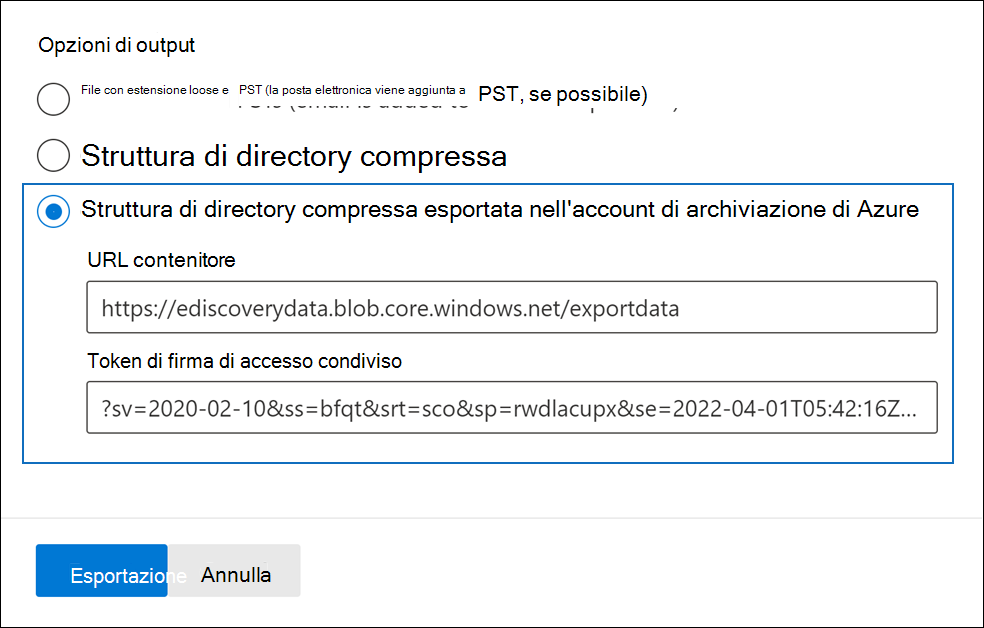
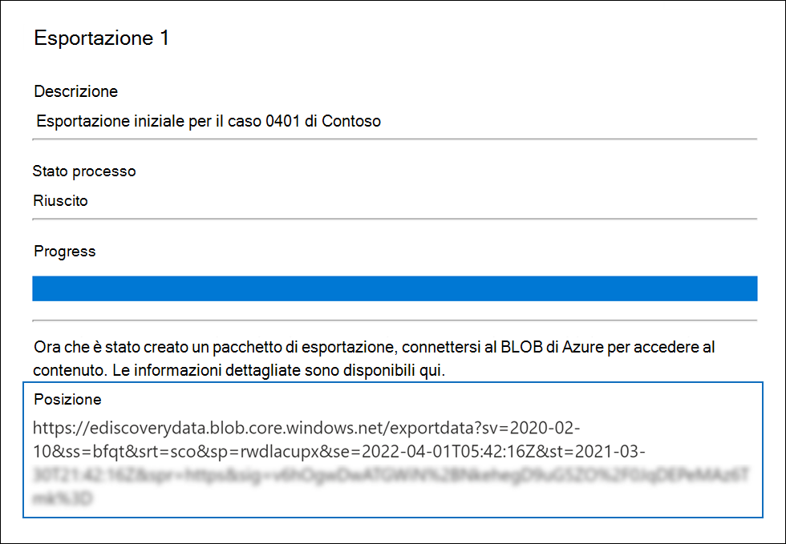
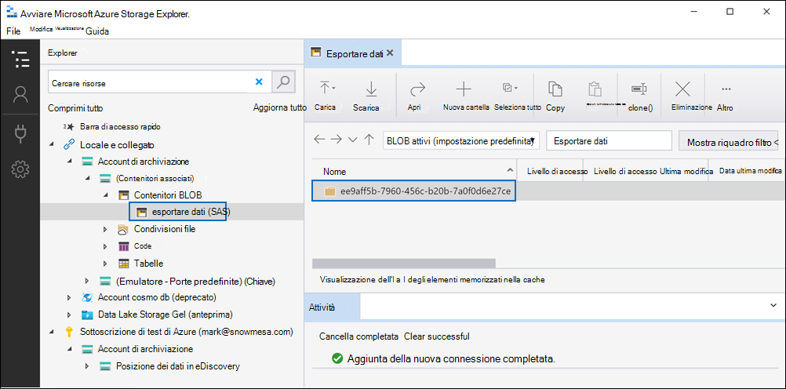
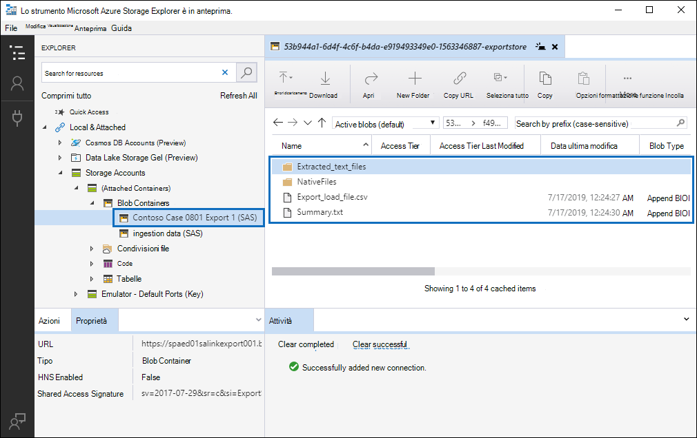

# Esportare documenti in un set di revisione in un account Archiviazione di Azure revisione

Quando si esportano documenti da un set di Advanced eDiscovery, è possibile esportarli in un account Archiviazione di Azure gestito dall'organizzazione. Se si utilizza questa opzione, i documenti vengono caricati nel percorso Archiviazione di Azure locale. Dopo l'esportazione, è possibile accedere ai documenti (e scaricarli in un computer locale o in un altro percorso) utilizzando il Azure Storage Explorer. In questo articolo vengono fornite istruzioni su come esportare documenti nell'account Archiviazione di Azure e sull'utilizzo di Azure Storage Explorer per connettersi a un percorso di Archiviazione di Azure per scaricare i documenti esportati. Per ulteriori informazioni sulle Azure Storage Explorer, vedere [Use Azure Storage Explorer](/azure/storage/blobs/storage-quickstart-blobs-storage-explorer).

## Prima di esportare documenti da un set di revisioni

- Devi fornire un token di firma di accesso condiviso (SAS) per l'account Archiviazione di Azure e l'URL di un contenitore specifico nell'account di archiviazione per esportare i documenti da un set di recensioni. Assicurarsi di aver a portata di mano questi elementi (ad esempio, copiati in un file di testo) quando si esegue il passaggio 2

  - **Token SAS:** assicurarsi di ottenere il token di firma di accesso condiviso per l'account Archiviazione di Azure (e non per il contenitore). Puoi generare un token di firma di accesso condiviso per il tuo account in Archiviazione di Azure. A tale scopo, passare all'account Archiviazione di Azure  e selezionare  Condividi firma di accesso nelle impostazioni Impostazioni nel pannello dell'account di archiviazione. Usa le impostazioni predefinite e consenti tutti i tipi di risorse quando generi il token di firma di accesso condiviso.

  - **URL contenitore:** è necessario creare un contenitore in cui caricare i documenti del set di revisione e quindi ottenere una copia dell'URL per il contenitore. ad `https://ediscoverydata.blob.core.windows.net/exportdata` esempio. Per ottenere l'URL, passare al contenitore in  Archiviazione di Azure e selezionare Proprietà nella sezione Impostazioni **nel** pannello contenitore.

- Scaricare e installare il Azure Storage Explorer. Per istruzioni, vedere [Azure Storage Explorer tool](https://go.microsoft.com/fwlink/p/?LinkId=544842). Puoi usare questo strumento per connetterti al contenitore nel tuo account Archiviazione di Azure e scaricare i documenti esportati nel passaggio 1.

## Passaggio 1: Esportare i documenti da un set di revisioni

Il primo passaggio consiste nel creare un processo di esportazione per esportare i documenti da un set di revisioni. Per istruzioni più dettagliate su tutte le opzioni di esportazione, vedere [Export documents from a review set.](export-documents-from-review-set.md) Nella procedura seguente vengono evidenziate le impostazioni per esportare i documenti nell'account Archiviazione di Azure dell'organizzazione.

1. Nel centro Microsoft 365 conformità aprire il caso Advanced eDiscovery, selezionare la scheda Review **sets** e quindi selezionare il set di recensioni che si desidera esportare.

2. Nel set di revisioni fare clic **su Azione**  >  **Esporta.**

3. Nella pagina **a comparsa Opzioni** di esportazione digitare un nome (obbligatorio) e una descrizione (facoltativo) per l'esportazione.

4. Configurare le impostazioni nelle sezioni documenti, metadati, contenuto e opzioni. Per ulteriori informazioni su queste impostazioni, vedere [Export documents from a review set](export-documents-from-review-set.md).

5. Nella sezione **Opzioni di** output selezionare l'opzione Struttura di **directory compressa esportata** nel Archiviazione di Azure account.

6. Incollare l'URL del contenitore e il token di firma di accesso condiviso per l'account di archiviazione nei campi corrispondenti.

   

7. Fare **clic su** Esporta per creare il processo di esportazione.

## Passaggio 2: Ottenere l'URL della firma di accesso condiviso dal processo di esportazione

Il passaggio successivo consiste nell'ottenere l'URL della firma di accesso condiviso generato dopo aver creato il processo di esportazione nel passaggio 1. L'URL della firma di accesso condiviso viene utilizzato per connettersi al contenitore del Archiviazione di Azure in cui sono stati esportati i documenti del set di revisione.

1. Nella pagina **Advanced eDiscovery,** passare al caso e quindi fare clic sulla **scheda** Esportazioni.

2. Nella scheda **Esportazioni** fare clic sul processo di esportazione da scaricare. Questo è il processo di esportazione creato nel passaggio 1.

3. Nella pagina a comparsa, in **Posizioni,** copiare l'URL della firma di accesso condiviso visualizzato. Se necessario, è possibile salvarlo in un file di testo in modo da poter accedere al passaggio 3.

   

   > [!TIP]
   > L'URL della firma di accesso condiviso visualizzato nel processo di esportazione è una concatenazione dell'URL del contenitore e del token di firma di accesso condiviso per l'account Archiviazione di Azure locale. È possibile copiarlo dal processo di esportazione o crearlo manualmente combinando l'URL e il token di firma di accesso condiviso.

## Passaggio 3: Connessione al contenitore Archiviazione di Azure

Il passaggio finale consiste nell'usare il Azure Storage Explorer e l'URL della firma di accesso condiviso per connettersi al contenitore nell'account Archiviazione di Azure e scaricare i documenti esportati in un computer locale.

1. Avviare il Azure Storage Explorer scaricato e installato.

2. Fare clic **sull'icona Apri Connessione dialogo.**

   

3. Nella pagina **Connessione da Archiviazione di Azure** fare clic su **Contenitore BLOB.**

4. Nella pagina **Selezione metodo di autenticazione** selezionare **l'opzione Firma** di accesso condiviso e quindi fare clic su **Avanti.**

5. Nella pagina **Immetti informazioni di** connessione incollare l'URL della firma di accesso condiviso (ottenuto nel processo di esportazione nel passaggio 2) nella casella URL firma di accesso condiviso del contenitore **BLOB.**

    

    Si noti che il nome del contenitore viene visualizzato nella **casella Nome** visualizzato. È possibile modificare questo nome.

6. Fare **clic su** Avanti per visualizzare la pagina **di** riepilogo e quindi fare clic su **Connessione**.

    Viene aperto il nodo **Contenitori** BLOB (in **Archiviazione**  >  **account (contenitori** \> associati).

    

    Contiene un contenitore denominato con il nome visualizzato del passaggio 5. Questo contenitore contiene una cartella per ogni processo di esportazione scaricato nel contenitore nel Archiviazione di Azure account. Queste cartelle sono denominate con un ID corrispondente all'ID del processo di esportazione. Questi ID di esportazione (e il nome dell'esportazione) sono disponibili in  Informazioni di supporto nella  pagina a comparsa per ogni processo di preparazione dei dati per l'esportazione elencato nella scheda Processi del caso Advanced eDiscovery. 

7. Fare doppio clic sulla cartella del processo di esportazione per aprirla.

   Viene visualizzato un elenco di cartelle e rapporti di esportazione.

    

8. Per esportare tutto il contenuto dal processo di esportazione, fare clic **sulla** freccia su per tornare alla cartella del processo di esportazione e quindi fare clic su **Scarica.**

9. Specificare la posizione in cui scaricare i file esportati, quindi fare clic su Seleziona cartella.

    Il Azure Storage Explorer avvia il processo di download. Lo stato del download degli elementi esportati viene visualizzato nel **riquadro** Attività. Al termine del download viene visualizzato un messaggio.

> [!NOTE]
> Anziché scaricare l'intero processo di esportazione in Azure Storage Explorer, è possibile selezionare elementi specifici da scaricare e visualizzare.

## Ulteriori informazioni

- La cartella del processo di esportazione contiene gli elementi seguenti. Gli elementi effettivi nella cartella di esportazione sono determinati dalle opzioni di esportazione configurate al momento della creazione del processo di esportazione. Per ulteriori informazioni su queste opzioni, vedere [Export documents from a review set.](export-documents-from-review-set.md)

  - Export_load_file.csv: questo file CSV è un report di esportazione dettagli contenente informazioni su ogni documento esportato. Il file è costituito da una colonna per ogni proprietà di metadati di un documento. Per un elenco e una descrizione dei metadati inclusi in questo report, vedere la colonna **Nome** campo esportato nella tabella in Campi metadati documento [in Advanced eDiscovery](document-metadata-fields-in-advanced-ediscovery.md).

  - Summary.txt: un file di testo contenente un riepilogo dell'esportazione, incluse le statistiche di esportazione.

  - Extracted_text_files: questa cartella contiene una versione di file di testo di ogni documento esportato.

  - NativeFiles: questa cartella contiene una versione file nativa di ogni documento esportato.

  - Error_files: questa cartella include gli elementi seguenti quando il processo di esportazione contiene file di errore:

    - ExtractionError.csv: questo file CSV contiene i metadati disponibili per i file che non sono stati estratti correttamente dall'elemento padre.

    - ProcessingError: questa cartella contiene documenti con errori di elaborazione. Questo contenuto si trova a livello di elemento, il che significa che se un allegato ha avuto un errore di elaborazione, anche il documento contenente l'allegato verrà incluso in questa cartella.
