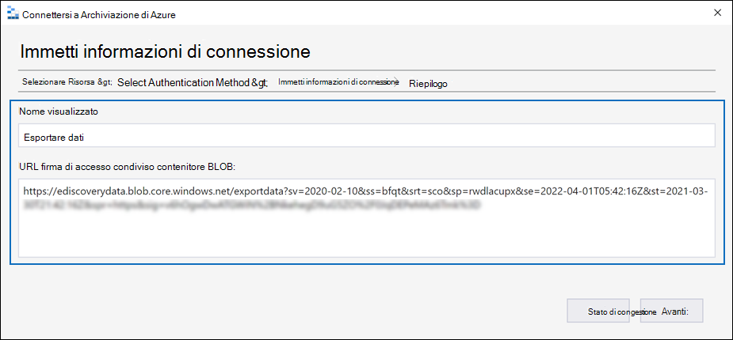

# Scaricare i processi di esportazione in un caso advanced eDiscovery

Quando si esportano documenti da un set di revisione in un caso advanced eDiscovery, i documenti vengono caricati in una posizione di Archiviazione di Azure fornita da Microsoft o in una posizione di Archiviazione di Azure gestita dall'organizzazione. Il tipo di percorso di Archiviazione di Azure usato dipende dall'opzione selezionata al momento dell'esportazione dei documenti.

In questo articolo vengono fornite istruzioni su come usare Esplora risorse di archiviazione di Microsoft Azure per connettersi a un percorso di archiviazione di Azure per esplorare e scaricare i documenti esportati. Per altre informazioni su Azure Storage Explorer, vedere [Guida introduttiva: Usare Azure Storage Explorer.](/azure/storage/blobs/storage-quickstart-blobs-storage-explorer)

## Passaggio 1: installare Azure Storage Explorer

Il primo passaggio consiste nel scaricare e installare Azure Storage Explorer. Per istruzioni, vedere [Strumento Azure Storage Explorer.](https://go.microsoft.com/fwlink/p/?LinkId=544842) Questo strumento consente di connettersi e scaricare i documenti esportati nel passaggio 3.

## Passaggio 2: Ottenere l'URL della firma di accesso condiviso dal processo di esportazione

Il passaggio successivo consiste nell'ottenere l'URL della firma di accesso condiviso (SAS) generato al momento della creazione del processo di esportazione per esportare i documenti [da un set di revisioni.](export-documents-from-review-set.md) È possibile copiare l'URL della firma di accesso condiviso per i documenti caricati in un percorso di archiviazione di Azure fornito da Microsoft o in un percorso di archiviazione di Azure gestito dall'organizzazione. In entrambi i casi, si usa l'URL della firma di accesso condiviso per connettersi al percorso di Archiviazione di Azure nel passaggio 3.

1. Nella pagina **Advanced eDiscovery** passare al caso e quindi fare clic sulla **scheda** Esportazioni.

2. Nella scheda **Esportazioni** fare clic sul processo di esportazione che si desidera scaricare.

3. Nella pagina a comparsa, in **Posizioni,** copiare l'URL della firma di accesso condiviso visualizzato. Se necessario, è possibile salvarlo in un file in modo da poterlo accedere al passaggio 3.
 
   

## Passaggio 3: connettersi al percorso di archiviazione di Azure

Il passaggio finale consiste nell'usare Azure Storage Explorer e l'URL della firma di accesso condiviso per connettersi al percorso di Archiviazione di Azure e scaricare i documenti esportati in un computer locale.

1. Aprire Azure Storage Explorer installato nel passaggio 1.

2. Fai clic **sull'icona Aggiungi account.** In alternativa, è possibile fare clic con il pulsante destro **del mouse su Account di archiviazione**.

   

3. Nella pagina **Connetti a Archiviazione di Azure** fare clic su Usa URI firma di accesso condiviso **e** quindi su **Avanti.**

    

4. Nella pagina **Allega con URI SAS** fare clic nella casella URI e quindi incollare l'URL della firma di accesso condiviso ottenuto nel passaggio 2. 

    

    Si noti che una parte dell'URL della firma di accesso condiviso viene visualizzata nella **casella Nome** visualizzato. Verrà utilizzato come nome visualizzato del contenitore creato  nell'account di archiviazione dopo la connessione al percorso di archiviazione. Questo nome è costituito dall'ID del caso advanced eDiscovery e da un identificatore univoco. È possibile mantenere il nome visualizzato predefinito o modificarlo. Se viene modificato, il nome visualizzato deve essere univoco.

5. Fare clic su **Avanti**.

    Viene **visualizzata la** pagina Riepilogo connessione.

    

6. Nella pagina **Riepilogo connessione** esaminare le informazioni sulla connessione e quindi fare clic su **Connetti**.

    Viene aperto il nodo **Contenitori BLOB** (in **Account**  >  **di archiviazione (contenitori** \> allegati).

    

    Contiene un contenitore denominato con il nome visualizzato del passaggio 4. Questo contenitore contiene una cartella per ogni processo di esportazione creato. Queste cartelle sono denominate con un ID corrispondente all'ID del processo di esportazione. Questi ID di esportazione (e il nome dell'esportazione) sono disponibili in  Informazioni di supporto nella pagina a comparsa per ogni processo di preparazione dei dati per l'esportazione elencato nella **scheda** Processi. 

7. Fare doppio clic sulla cartella del processo di esportazione per aprirla.

   Viene visualizzato un elenco di cartelle e rapporti di esportazione.
   
    

   La cartella del processo di esportazione contiene gli elementi seguenti. Gli elementi effettivi nella cartella di esportazione sono determinati dalle opzioni di esportazione configurate al momento della creazione del processo di esportazione. Per ulteriori informazioni, vedere [Export documents from a review set.](export-documents-from-review-set.md)

    - Export_load_file.csv: questo file CSV è un report di esportazione dettagli contenente informazioni su ogni documento esportato. Il file è costituito da una colonna per ogni proprietà di metadati di un documento. Per un elenco e una descrizione dei metadati inclusi in questo report, vedere la colonna **Nome** campo esportato nella tabella in Campi metadati documento [in Advanced eDiscovery.](document-metadata-fields-in-advanced-ediscovery.md)
    
    - Summary.txt: un file di testo contenente un riepilogo dell'esportazione, incluse le statistiche di esportazione.
    
    - Extracted_text_files: questa cartella contiene una versione di file di testo di ogni documento esportato.
     
    - NativeFiles: questa cartella contiene una versione file nativa di ogni documento esportato.
    
    - Error_files: questa cartella include gli elementi seguenti quando il processo di esportazione contiene file di errore: 
        
      - ExtractionError.csv: questo file CSV contiene i metadati disponibili per i file che non sono stati estratti correttamente dall'elemento padre.
        
      - ProcessingError: questa cartella contiene documenti con errori di elaborazione. Questo contenuto si trova a livello di elemento, il che significa che se un allegato ha avuto un errore di elaborazione, anche il documento contenente l'allegato verrà incluso in questa cartella.
 
8. Per esportare tutto il contenuto nell'esportazione, selezionare la cartella di esportazione e quindi fare clic su **Scarica.**

9. Specificare il percorso in cui si desidera scaricare i file esportati e quindi fare clic su Seleziona cartella.

    Azure Storage Explorer avvia il processo di esportazione. Lo stato del download degli elementi esportati viene visualizzato nel **riquadro** Attività. Al termine del download viene visualizzato un messaggio.

    

> [!NOTE]
> Anziché scaricare l'intero processo di esportazione, è possibile selezionare elementi specifici da scaricare. Anziché scaricare elementi, è possibile fare doppio clic su un elemento per visualizzarlo.