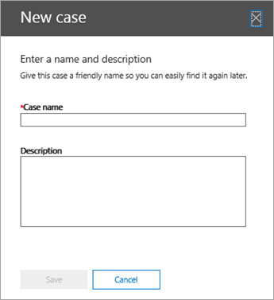
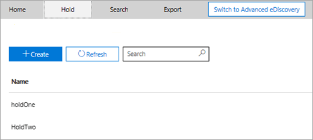
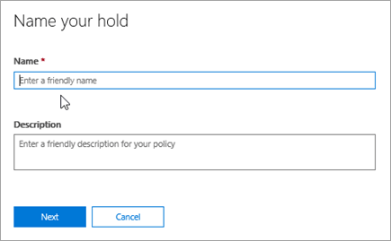
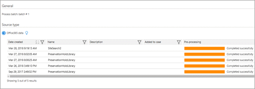

# <a name="manage-ediscovery-cases-in-the-security--compliance-center"></a><span data-ttu-id="b38f6-105">Gestire i casi di eDiscovery nel Centro sicurezza e conformità</span><span class="sxs-lookup"><span data-stu-id="b38f6-105">Manage eDiscovery cases in the Security & Compliance Center</span></span>

<span data-ttu-id="b38f6-106">È possibile utilizzare i casi di eDiscovery nel centro conformità di Office 365 e Microsoft 365 per controllare gli utenti autorizzati a creare, accedere e gestire i casi di eDiscovery nell'organizzazione.</span><span class="sxs-lookup"><span data-stu-id="b38f6-106">You can use eDiscovery cases in the compliance center in Office 365 and Microsoft 365 to control who can create, access, and manage eDiscovery cases in your organization.</span></span> <span data-ttu-id="b38f6-107">Se l'organizzazione dispone di un abbonamento a Office 365 E5, è anche possibile utilizzare i casi di eDiscovery per analizzare i risultati della ricerca tramite Office 365 Advanced eDiscovery.</span><span class="sxs-lookup"><span data-stu-id="b38f6-107">If your organization has an Office 365 E5 subscription, you can also use eDiscovery cases to analyze search results by using Office 365 Advanced eDiscovery.</span></span>
  
<span data-ttu-id="b38f6-108">Un caso di eDiscovery consente di aggiungere membri a un caso, controllare i tipi di azione che i membri del caso specifico possono eseguire, conservare i percorsi di contenuti attinenti a un caso legale e associare più ricerche di contenuto a un caso singolo.</span><span class="sxs-lookup"><span data-stu-id="b38f6-108">An eDiscovery case allows you to add members to a case, control what types of actions that specific case members can perform, place a hold on content locations relevant to a legal case, and associate multiple Content Searches with a single case.</span></span> <span data-ttu-id="b38f6-109">È inoltre possibile esportare i risultati di una ricerca di contenuto associata a un caso oppure preparare i risultati della ricerca per l'analisi in Advanced eDiscovery.</span><span class="sxs-lookup"><span data-stu-id="b38f6-109">You can also export the results of any Content Search that is associated with a case or prepare search results for analysis in Advanced eDiscovery.</span></span> <span data-ttu-id="b38f6-110">I casi di eDiscovery sono un'ottima soluzione per limitare chi ha accesso a ricerche di contenuto e risultati della ricerca per un caso legale specifico nell'organizzazione.</span><span class="sxs-lookup"><span data-stu-id="b38f6-110">eDiscovery cases are a good way to limit who has access to Content Searches and search results for a specific legal case in your organization.</span></span>
  
<span data-ttu-id="b38f6-111">Utilizzare il flusso di lavoro seguente per configurare e utilizzare i casi di eDiscovery nel centro sicurezza & compliance e Advanced eDiscovery.</span><span class="sxs-lookup"><span data-stu-id="b38f6-111">Use the following workflow to set-up and use eDiscovery cases in the Security & Compliance Center and Advanced eDiscovery.</span></span>

[<span data-ttu-id="b38f6-112">Step 1: Assign eDiscovery permissions to potential case members</span><span class="sxs-lookup"><span data-stu-id="b38f6-112">Step 1: Assign eDiscovery permissions to potential case members</span></span>](#step-1-assign-ediscovery-permissions-to-potential-case-members)

[<span data-ttu-id="b38f6-113">Passaggio 2: creare un nuovo caso</span><span class="sxs-lookup"><span data-stu-id="b38f6-113">Step 2: Create a new case</span></span>](#step-2-create-a-new-case)

[<span data-ttu-id="b38f6-114">Passaggio 3: aggiungere membri a un caso</span><span class="sxs-lookup"><span data-stu-id="b38f6-114">Step 3: Add members to a case</span></span>](#step-3-add-members-to-a-case)

[<span data-ttu-id="b38f6-115">Passaggio 4: posizionare i percorsi di contenuto in attesa</span><span class="sxs-lookup"><span data-stu-id="b38f6-115">Step 4: Place content locations on hold</span></span>](#step-4-place-content-locations-on-hold)

[<span data-ttu-id="b38f6-116">Passaggio 5: creare ed eseguire una ricerca di contenuto associata a un caso</span><span class="sxs-lookup"><span data-stu-id="b38f6-116">Step 5: Create and run a Content Search associated with a case</span></span>](#step-5-create-and-run-a-content-search-associated-with-a-case)

[<span data-ttu-id="b38f6-117">Passaggio 6: esportare i risultati di una ricerca di contenuto associata a un caso</span><span class="sxs-lookup"><span data-stu-id="b38f6-117">Step 6: Export the results of a Content Search associated with a case</span></span>](#step-6-export-the-results-of-a-content-search-associated-with-a-case)

[<span data-ttu-id="b38f6-118">Passaggio 7: preparare i risultati della ricerca per Advanced eDiscovery</span><span class="sxs-lookup"><span data-stu-id="b38f6-118">Step 7: Prepare search results for Advanced eDiscovery</span></span>](#step-7-prepare-search-results-for-advanced-ediscovery)

[<span data-ttu-id="b38f6-119">Passaggio 8: passare alla causa in Advanced eDiscovery</span><span class="sxs-lookup"><span data-stu-id="b38f6-119">Step 8: Go to the case in Advanced eDiscovery</span></span>](#step-8-go-to-the-case-in-advanced-ediscovery)

[<span data-ttu-id="b38f6-120">Optional Passaggio 9: chiudere un caso</span><span class="sxs-lookup"><span data-stu-id="b38f6-120">(Optional) Step 9: Close a case</span></span>](#optional-step-9-close-a-case)

[<span data-ttu-id="b38f6-121">Optional Passaggio 10: riaprire un caso chiuso</span><span class="sxs-lookup"><span data-stu-id="b38f6-121">(Optional) Step 10: Re-open a closed case</span></span>](#optional-step-10-re-open-a-closed-case)

[<span data-ttu-id="b38f6-122">Altre informazioni</span><span class="sxs-lookup"><span data-stu-id="b38f6-122">More information</span></span>](#more-information)
  
## <a name="step-1-assign-ediscovery-permissions-to-potential-case-members"></a><span data-ttu-id="b38f6-123">Passaggio 1: Assegnare autorizzazioni di eDiscovery a potenziali membri del caso</span><span class="sxs-lookup"><span data-stu-id="b38f6-123">Step 1: Assign eDiscovery permissions to potential case members</span></span>

<span data-ttu-id="b38f6-124">Il primo passaggio consiste nell'assegnare le autorizzazioni appropriate relative a eDiscovery alle persone, in modo da poterle aggiungere a un caso di eDiscovery nel passaggio 2.</span><span class="sxs-lookup"><span data-stu-id="b38f6-124">The first step is to assign the appropriate eDiscovery-related permissions to people so you can add them to an eDiscovery case in Step 2.</span></span> <span data-ttu-id="b38f6-125">È necessario essere membri del gruppo di ruoli Gestione organizzazione (o essere assegnati al ruolo di gestione dei ruoli) nel centro sicurezza & conformità per assegnare le autorizzazioni di eDiscovery.</span><span class="sxs-lookup"><span data-stu-id="b38f6-125">You have to be a member of the Organization Management role group (or be assigned the Role Management role) in the Security & Compliance Center to assign eDiscovery permissions.</span></span> <span data-ttu-id="b38f6-126">Nell'elenco seguente vengono descritti i gruppi di ruoli correlati a eDiscovery nel centro sicurezza & Compliance.</span><span class="sxs-lookup"><span data-stu-id="b38f6-126">The following list describes the eDiscovery-related role groups in the Security & Compliance Center.</span></span> 
  
- <span data-ttu-id="b38f6-127">**Revisore.**</span><span class="sxs-lookup"><span data-stu-id="b38f6-127">**Reviewer.**</span></span> <span data-ttu-id="b38f6-128">Questo gruppo di ruoli ha le autorizzazioni più restrittive relative a eDiscovery.</span><span class="sxs-lookup"><span data-stu-id="b38f6-128">This role group has the most restrictive eDiscovery-related permissions.</span></span> <span data-ttu-id="b38f6-129">Lo scopo principale di questo gruppo di ruoli è consentire ai membri di visualizzare e accedere ai dati del caso in [Advanced eDiscovery (Classic)](office-365-advanced-ediscovery.md) (noto anche come *Advanced eDiscovery V1*).</span><span class="sxs-lookup"><span data-stu-id="b38f6-129">The primary purpose of this role group is to allow members to view and access case data in [Advanced eDiscovery (classic)](office-365-advanced-ediscovery.md) (also known as *Advanced eDiscovery v1*).</span></span> <span data-ttu-id="b38f6-130">I membri di questo gruppo possono visualizzare e aprire solo l'elenco dei casi nella pagina **eDiscovery** nel centro sicurezza & conformità di cui sono membri.</span><span class="sxs-lookup"><span data-stu-id="b38f6-130">Members of this group can only see and open the list of the cases on the **eDiscovery** page in the Security & Compliance Center that they are members of.</span></span> <span data-ttu-id="b38f6-131">Dopo che l'utente ha eseguito l'accesso a un caso nel centro sicurezza e conformità, è possibile fare clic su **passa a Advanced eDiscovery** per accedere ai dati del caso in Advanced eDiscovery e analizzarli.</span><span class="sxs-lookup"><span data-stu-id="b38f6-131">After the user accesses a case in the security and compliance center, they can click **Switch to Advanced eDiscovery** to access and analyze the case data in Advanced eDiscovery.</span></span> <span data-ttu-id="b38f6-132">Non è possibile creare casi, aggiungere membri a un caso, creare esenzioni, creare ricerche, visualizzare in anteprima i risultati della ricerca, esportare i risultati della ricerca o preparare i risultati per Advanced eDiscovery.</span><span class="sxs-lookup"><span data-stu-id="b38f6-132">They can't create cases, add members to a case, create holds, create searches, preview search results, export search results, or prepare results for Advanced eDiscovery.</span></span> 

   > [!NOTE]
   > <span data-ttu-id="b38f6-133">A questo punto, gli utenti membri del gruppo di ruoli reviewer non possono accedere ai dati in [Advanced eDiscovery in Microsoft 365](overview-ediscovery-20.md) (noto anche come *Advanced eDiscovery V2*).</span><span class="sxs-lookup"><span data-stu-id="b38f6-133">At this time, users who are member of the Reviewer role group can't access data in [Advanced eDiscovery in Microsoft 365](overview-ediscovery-20.md) (also known as *Advanced eDiscovery v2*).</span></span> <span data-ttu-id="b38f6-134">Per aggiungere membri a un caso in Advanced eDiscovery V2 in modo che possano esaminare i dati dei casi, un utente deve essere membro del gruppo di ruoli Gestione eDiscovery.</span><span class="sxs-lookup"><span data-stu-id="b38f6-134">To add members to a case in Advanced eDiscovery v2 so that they can review case data, a user must be a member of the eDiscovery Manager role group.</span></span>
    
- <span data-ttu-id="b38f6-135">**eDiscovery Manager.**</span><span class="sxs-lookup"><span data-stu-id="b38f6-135">**eDiscovery Manager.**</span></span> <span data-ttu-id="b38f6-136">I membri di questo gruppo di ruoli possono creare e gestire casi di eDiscovery.</span><span class="sxs-lookup"><span data-stu-id="b38f6-136">Members of this role group can create and manage eDiscovery cases.</span></span> <span data-ttu-id="b38f6-137">Possono aggiungere e rimuovere membri, inserire posizioni di contenuto in attesa, creare e modificare le ricerche di contenuto associate a un caso, esportare i risultati di una ricerca di contenuto e preparare i risultati della ricerca per l'analisi in Advanced eDiscovery.</span><span class="sxs-lookup"><span data-stu-id="b38f6-137">They can add and remove members, place content locations on hold, create and edit Content Searches associated with a case, export the results of a Content Search, and prepare search results for analysis in Advanced eDiscovery.</span></span> <span data-ttu-id="b38f6-138">In questo gruppo di ruoli sono presenti due sottogruppi.</span><span class="sxs-lookup"><span data-stu-id="b38f6-138">There are two subgroups in this role group.</span></span> <span data-ttu-id="b38f6-139">La differenza tra questi sottogruppi dipende dall'ambito.</span><span class="sxs-lookup"><span data-stu-id="b38f6-139">The difference between these subgroups is based on scope.</span></span>
    
  - <span data-ttu-id="b38f6-140">**eDiscovery Manager.**</span><span class="sxs-lookup"><span data-stu-id="b38f6-140">**eDiscovery Manager.**</span></span> <span data-ttu-id="b38f6-141">Può solo visualizzare e gestire i casi di eDiscovery che ha creato o di cui è membro.</span><span class="sxs-lookup"><span data-stu-id="b38f6-141">Can view and manage the eDiscovery cases they create or are a member of.</span></span> <span data-ttu-id="b38f6-142">Se un altro Manager di eDiscovery crea un caso ma non aggiunge un secondo Manager di eDiscovery come membro del caso, il secondo responsabile di eDiscovery non sarà in grado di visualizzare o aprire il caso nella pagina **eDiscovery** del centro sicurezza & Compliance.</span><span class="sxs-lookup"><span data-stu-id="b38f6-142">If another eDiscovery Manager creates a case but doesn't add a second eDiscovery Manager as a member of that case, the second eDiscovery Manager won't be able to view or open the case on the **eDiscovery** page in the Security & Compliance Center.</span></span> <span data-ttu-id="b38f6-143">i responsabili di eDiscovery possono inoltre accedere ai propri casi in Advanced eDiscovery per eseguire attività di analisi.</span><span class="sxs-lookup"><span data-stu-id="b38f6-143">eDiscovery Managers can also access their cases in Advanced eDiscovery to perform analysis tasks.</span></span> 
    
  - <span data-ttu-id="b38f6-144">\**Amministratore di eDiscovery *.**</span><span class="sxs-lookup"><span data-stu-id="b38f6-144">**eDiscovery Administrator\*.**</span></span> <span data-ttu-id="b38f6-145">Può eseguire tutte le attività di gestione dei casi di un gestore di eDiscovery.</span><span class="sxs-lookup"><span data-stu-id="b38f6-145">Can perform all case management tasks that an eDiscovery Manager can do.</span></span> <span data-ttu-id="b38f6-146">Inoltre, un amministratore di eDiscovery è in grado di:</span><span class="sxs-lookup"><span data-stu-id="b38f6-146">Additionally, an eDiscovery Administrator can:</span></span>
    
    - <span data-ttu-id="b38f6-147">Visualizzare tutti i casi elencati nella pagina **eDiscovery**.</span><span class="sxs-lookup"><span data-stu-id="b38f6-147">View all cases that are listed on the **eDiscovery** page.</span></span> 
    
    - <span data-ttu-id="b38f6-148">Gestire qualsiasi caso nell'organizzazione dopo che si è aggiunto come membro del caso.</span><span class="sxs-lookup"><span data-stu-id="b38f6-148">Manage any case in the organization after they add themself as a member of the case.</span></span>
    
    - <span data-ttu-id="b38f6-149">Accedere ai dati del caso in Advanced eDiscovery per tutti i casi nell'organizzazione.</span><span class="sxs-lookup"><span data-stu-id="b38f6-149">Access case data in Advanced eDiscovery for any case in the organization.</span></span>
    
    <span data-ttu-id="b38f6-150">Vedere la sezione [More information](#more-information) per conoscere i motivi per cui si potrebbe voler diventare un amministratore di eDiscovery nell'organizzazione.</span><span class="sxs-lookup"><span data-stu-id="b38f6-150">See the [More information](#more-information) section for reasons why you may want an eDiscovery Administrator in your organization.</span></span> 

<span data-ttu-id="b38f6-151">Per ulteriori informazioni sulle autorizzazioni di eDiscovery, vedere [assign eDiscovery Permissions](assign-ediscovery-permissions.md).</span><span class="sxs-lookup"><span data-stu-id="b38f6-151">For more information about eDiscovery permissions, see [Assign eDiscovery permissions](assign-ediscovery-permissions.md).</span></span>
  
 <span data-ttu-id="b38f6-152">**Per assegnare autorizzazioni di eDiscovery:**</span><span class="sxs-lookup"><span data-stu-id="b38f6-152">**To assign eDiscovery permissions:**</span></span>
  
1. <span data-ttu-id="b38f6-153">Passare a [https://protection.office.com](https://protection.office.com).</span><span class="sxs-lookup"><span data-stu-id="b38f6-153">Go to [https://protection.office.com](https://protection.office.com).</span></span>
    
2. <span data-ttu-id="b38f6-154">Accedere a Office 365 usando l'account aziendale o dell'istituto di istruzione.</span><span class="sxs-lookup"><span data-stu-id="b38f6-154">Sign in to Office 365 using your work or school account.</span></span>
    
3. <span data-ttu-id="b38f6-155">Nel centro sicurezza & conformità fare clic su **autorizzazioni**e quindi eseguire una delle operazioni seguenti in base alle autorizzazioni di eDiscovery che si desidera assegnare.</span><span class="sxs-lookup"><span data-stu-id="b38f6-155">In the Security & Compliance Center, click **Permissions**, and then do one of the following based on the eDiscovery permissions that you want to assign.</span></span>
    
    - <span data-ttu-id="b38f6-156">Per assegnare le autorizzazioni per il revisore, selezionare il gruppo di ruoli **reviewer** e quindi fare clic su **modifica**accanto a **membri**.</span><span class="sxs-lookup"><span data-stu-id="b38f6-156">To assign Reviewer permissions, select the **Reviewer** role group, and then next to **Members**, click **Edit**.</span></span> <span data-ttu-id="b38f6-157">Fare clic su **Scegli membri**, fare clic  **,** selezionare l'utente che si desidera aggiungere al gruppo di ruoli reviewer e quindi fare clic su **Aggiungi**.</span><span class="sxs-lookup"><span data-stu-id="b38f6-157">Click **Choose members**, click **Edit**, click  **Add**, select the user that you want to add to the Reviewer role group, and then click **Add**.</span></span>
    
    - <span data-ttu-id="b38f6-158">Per assegnare le autorizzazioni di eDiscovery Manager, selezionare il gruppo di ruoli **gestione eDiscovery** , quindi fare clic su **modifica**accanto a **eDiscovery Manager**.</span><span class="sxs-lookup"><span data-stu-id="b38f6-158">To assign eDiscovery Manager permissions, select the **eDiscovery Manager** role group, and then next to **eDiscovery Manager**, click **Edit**.</span></span> <span data-ttu-id="b38f6-159">Fare clic su **Scegli eDiscovery Manager**, fare clic  \* \* Aggiungi \* \*, selezionare l'utente che si desidera aggiungere come Manager di eDiscovery e quindi fare clic su **Aggiungi**.</span><span class="sxs-lookup"><span data-stu-id="b38f6-159">Click **Choose eDiscovery Manager**, click **Edit**, click  \*\* Add \*\*, select the user that you want to add as an eDiscovery Manager, and then click **Add**.</span></span>
    
    - <span data-ttu-id="b38f6-160">Per assegnare le autorizzazioni di amministratore di eDiscovery, selezionare il gruppo di ruoli **gestione di eDiscovery** e quindi fare clic su **modifica**accanto a **amministratore di eDiscovery**.</span><span class="sxs-lookup"><span data-stu-id="b38f6-160">To assign eDiscovery Administrator permissions, select the **eDiscovery Manager** role group, and then next to **eDiscovery Administrator**, click **Edit**.</span></span> <span data-ttu-id="b38f6-161">Fare clic su **Scegli amministratore di eDiscovery**, fare  **modifica**, fare clic su Aggiungi icona, selezionare l'utente che si **desidera aggiungere come**amministratore di eDiscovery e quindi fare clic su **Aggiungi**.</span><span class="sxs-lookup"><span data-stu-id="b38f6-161">Click **Choose eDiscovery Administrator**, click **Edit**, click  **Add**, select the user that you want to add as an eDiscovery Administrator, and then click **Add**.</span></span>
    
4. <span data-ttu-id="b38f6-162">Dopo aver aggiunto tutti gli utenti, fare clic su **fine**, fare clic su **Salva** per salvare le modifiche apportate al gruppo di ruoli e quindi fare clic su **Chiudi**.</span><span class="sxs-lookup"><span data-stu-id="b38f6-162">After you have added all the users, click **Done**, click **Save** to save the changes to the role group, and then click **Close**.</span></span>

## <a name="step-2-create-a-new-case"></a><span data-ttu-id="b38f6-163">Passaggio 2: creare un nuovo caso</span><span class="sxs-lookup"><span data-stu-id="b38f6-163">Step 2: Create a new case</span></span>

<span data-ttu-id="b38f6-164">Il passaggio successivo consiste nel creare un caso di eDiscovery.</span><span class="sxs-lookup"><span data-stu-id="b38f6-164">The next step is to create a eDiscovery case.</span></span> <span data-ttu-id="b38f6-165">È necessario essere un membro del gruppo di ruoli Gestore di eDiscovery per creare casi di eDiscovery.</span><span class="sxs-lookup"><span data-stu-id="b38f6-165">You must be a member of the eDiscovery Managers role group to create eDiscovery cases.</span></span> <span data-ttu-id="b38f6-166">Come spiegato in precedenza, dopo aver creato un caso nel centro sicurezza & Compliance, l'utente (e altri membri del caso) potranno accedere allo stesso caso in Advanced eDiscovery se l'organizzazione dispone di un abbonamento a Office 365 E5.</span><span class="sxs-lookup"><span data-stu-id="b38f6-166">As previously explained, after you create a case in the Security & Compliance Center, you (and other case members) will be able to access that same case in Advanced eDiscovery if your organization has an Office 365 E5 subscription.</span></span>
  
1. <span data-ttu-id="b38f6-167">Passare a [https://protection.office.com](https://protection.office.com).</span><span class="sxs-lookup"><span data-stu-id="b38f6-167">Go to [https://protection.office.com](https://protection.office.com).</span></span>
    
2. <span data-ttu-id="b38f6-168">Accedere a Office 365 usando l'account aziendale o dell'istituto di istruzione.</span><span class="sxs-lookup"><span data-stu-id="b38f6-168">Sign in to Office 365 using your work or school account.</span></span>
    
3. <span data-ttu-id="b38f6-169">Nel centro sicurezza & conformità, fare clic su **eDiscovery** \> **eDiscovery**, quindi fare  Aggiungi icona **creare un caso**.</span><span class="sxs-lookup"><span data-stu-id="b38f6-169">In the Security & Compliance Center, click **eDiscovery** \> **eDiscovery**, and then click  **Create a case**.</span></span>
    
4. <span data-ttu-id="b38f6-170">Nella pagina **nuovo caso** , assegnare un nome al caso, digitare una descrizione facoltativa, quindi fare clic su **Salva**.</span><span class="sxs-lookup"><span data-stu-id="b38f6-170">On the **New Case** page, give the case a name, type an optional description, and then click **Save**.</span></span> <span data-ttu-id="b38f6-171">Il nome del caso deve essere univoco nell'organizzazione.</span><span class="sxs-lookup"><span data-stu-id="b38f6-171">The case name must be unique in your organization.</span></span>
    
    
  
    <span data-ttu-id="b38f6-173">Il nuovo caso viene visualizzato nell'elenco dei casi nella pagina **eDiscovery** .</span><span class="sxs-lookup"><span data-stu-id="b38f6-173">The new case is displayed in the list of cases on the **eDiscovery** page.</span></span> <span data-ttu-id="b38f6-174">È possibile posizionare il puntatore del mouse su un nome di case per visualizzare le informazioni relative al caso, incluso lo stato del caso (**attivo** o **chiuso**), la descrizione del caso (creato nel passaggio precedente) e quando il caso è stato modificato per ultimo e chi lo ha modificato.</span><span class="sxs-lookup"><span data-stu-id="b38f6-174">You can hover the cursor over a case name to display information about the case, including the status of the case (**Active** or **Closed**), the description of the case (that was created in the previous step), and when the case was changed last and who changed it.</span></span>
    
    > [!TIP]
    > <span data-ttu-id="b38f6-175">Dopo aver creato un nuovo caso, è possibile rinominarlo in qualsiasi momento.</span><span class="sxs-lookup"><span data-stu-id="b38f6-175">After you create a new case, you can rename it anytime.</span></span> <span data-ttu-id="b38f6-176">Basta fare clic sul nome del caso nella pagina **eDiscovery** .</span><span class="sxs-lookup"><span data-stu-id="b38f6-176">Just click the name of the case on the **eDiscovery** page.</span></span> <span data-ttu-id="b38f6-177">Nella pagina **Gestisci** il riquadro a comparsa di questo caso, modificare il nome visualizzato nella casella in **nome**e quindi salvare la modifica.</span><span class="sxs-lookup"><span data-stu-id="b38f6-177">On the **Manage this case** flyout page, change the name displayed in the box under **Name**, and then save the change.</span></span> 
## <a name="step-3-add-members-to-a-case"></a><span data-ttu-id="b38f6-178">Passaggio 3: aggiungere membri a un caso</span><span class="sxs-lookup"><span data-stu-id="b38f6-178">Step 3: Add members to a case</span></span>

<span data-ttu-id="b38f6-179">Dopo aver creato un caso, il passaggio successivo consiste nell'aggiungere membri al caso.</span><span class="sxs-lookup"><span data-stu-id="b38f6-179">After you create a case, the next step is to add members to the case.</span></span> <span data-ttu-id="b38f6-180">Il responsabile di eDiscovery che ha creato il caso viene aggiunto automaticamente come membro.</span><span class="sxs-lookup"><span data-stu-id="b38f6-180">The eDiscovery Manager who created the case is automatically added as a member.</span></span> <span data-ttu-id="b38f6-181">Come spiegato in precedenza, i membri devono assegnare le autorizzazioni appropriate di eDiscovery, in modo che possano accedere al caso dopo averli aggiunti.</span><span class="sxs-lookup"><span data-stu-id="b38f6-181">As previously explained, members have to assign the appropriate eDiscovery permissions so they can access the case after you add them.</span></span>
  
1. <span data-ttu-id="b38f6-182">Nel centro sicurezza & conformità, fare clic su **eDiscovery** \> **eDiscovery** per visualizzare l'elenco dei casi nell'organizzazione.</span><span class="sxs-lookup"><span data-stu-id="b38f6-182">In the Security & Compliance Center, click **eDiscovery** \> **eDiscovery** to display the list of cases in your organization.</span></span> 

2. <span data-ttu-id="b38f6-183">Fare clic sul nome del caso in cui si desidera aggiungere i membri.</span><span class="sxs-lookup"><span data-stu-id="b38f6-183">Click the name of the case that you want to add members to.</span></span>

    <span data-ttu-id="b38f6-184">Viene visualizzata la pagina Gestisci il riquadro a comparsa di **questo caso** .</span><span class="sxs-lookup"><span data-stu-id="b38f6-184">The **Manage this case** flyout page is displayed.</span></span> 

    
  
3. <span data-ttu-id="b38f6-186">In **Gestisci membri**fare  **Aggiungi icona Aggiungi** per aggiungere membri al caso.</span><span class="sxs-lookup"><span data-stu-id="b38f6-186">Under **Manage members**, click  **Add** to add members to the case.</span></span> 

    <span data-ttu-id="b38f6-187">È inoltre possibile scegliere di aggiungere un gruppo di ruoli al caso.</span><span class="sxs-lookup"><span data-stu-id="b38f6-187">You can also choose to add a role group to the case.</span></span> <span data-ttu-id="b38f6-188">In **Gestisci gruppi**di ruoli  su **Aggiungi icona Aggiungi**.</span><span class="sxs-lookup"><span data-stu-id="b38f6-188">Under **Manage role groups**, click  **Add**.</span></span>

    > [!NOTE]
    > <span data-ttu-id="b38f6-189">I gruppi di ruoli controllano chi può assegnare membri a un caso di eDiscovery.</span><span class="sxs-lookup"><span data-stu-id="b38f6-189">Role groups control who can assign members to an eDiscovery case.</span></span> <span data-ttu-id="b38f6-190">Questo significa che è possibile assegnare solo i gruppi di ruoli a cui si è membri di un caso.</span><span class="sxs-lookup"><span data-stu-id="b38f6-190">That means you can only assign the role groups that you are a member of to a case.</span></span>

4. <span data-ttu-id="b38f6-191">Nell'elenco di utenti o gruppi di ruoli che possono essere aggiunti come membri del caso, fare clic sulla casella di controllo accanto ai nomi degli utenti o dei gruppi di ruoli che si desidera aggiungere.</span><span class="sxs-lookup"><span data-stu-id="b38f6-191">In the list of people or role groups that can be added as members of the case, click the check box next to the names of the people or role groups that you want to add.</span></span>

    > [!TIP]
    > <span data-ttu-id="b38f6-192">Se si dispone di un elenco elevato di utenti che possono essere aggiunti come membri, utilizzare la casella di **ricerca** per cercare una persona specifica nell'elenco.</span><span class="sxs-lookup"><span data-stu-id="b38f6-192">If you have a large list of people who can added as members, use the **Search** box to search for a specific person in the list.</span></span> 
  
5. <span data-ttu-id="b38f6-193">Dopo aver selezionato gli utenti o i gruppi di ruoli da aggiungere come membri del gruppo, fare clic su **Aggiungi**.</span><span class="sxs-lookup"><span data-stu-id="b38f6-193">After you select the people or role groups to add as members of the group, click **Add**.</span></span>
    
    <span data-ttu-id="b38f6-194">In **Gestisci questo caso**, fare clic su **Salva** per salvare il nuovo elenco dei membri del caso.</span><span class="sxs-lookup"><span data-stu-id="b38f6-194">In **Manage this case**, click **Save** to save the new list of case members.</span></span> 
    
6. <span data-ttu-id="b38f6-195">Fare clic su **Salva** per salvare il nuovo elenco dei membri del caso.</span><span class="sxs-lookup"><span data-stu-id="b38f6-195">Click **Save** to save the new list of case members.</span></span> 
  
## <a name="step-4-place-content-locations-on-hold"></a><span data-ttu-id="b38f6-196">Passaggio 4: posizionare i percorsi di contenuto in attesa</span><span class="sxs-lookup"><span data-stu-id="b38f6-196">Step 4: Place content locations on hold</span></span>

<span data-ttu-id="b38f6-197">È possibile utilizzare un caso eDiscovery per creare blocchi al fine di conservare contenuti che potrebbero essere attinenti al caso.</span><span class="sxs-lookup"><span data-stu-id="b38f6-197">You can use an eDiscovery case to create holds to preserve content that might be relevant to the case.</span></span> <span data-ttu-id="b38f6-198">È possibile applicare un blocco alle cassette postali e ai siti di OneDrive for business di persone che sono depositarie nel caso.</span><span class="sxs-lookup"><span data-stu-id="b38f6-198">You can place a hold on the mailboxes and OneDrive for Business sites of people who are custodians in the case.</span></span> <span data-ttu-id="b38f6-199">È inoltre possibile inserire un blocco nel sito di gruppo cassetta postale, sito di SharePoint e OneDrive for business per un gruppo di Office 365.</span><span class="sxs-lookup"><span data-stu-id="b38f6-199">You can also place a hold on the group mailbox, SharePoint site, and OneDrive for Business site for an Office 365 Group.</span></span> <span data-ttu-id="b38f6-200">Analogamente, è possibile applicare un blocco alle cassette postali e ai siti associati a Microsoft teams o ai gruppi di Yammer.</span><span class="sxs-lookup"><span data-stu-id="b38f6-200">Similarly, you can place a hold on the mailboxes and sites that are associated with Microsoft Teams or Yammer Groups.</span></span> <span data-ttu-id="b38f6-201">Quando si posizionano le posizioni di contenuto in attesa, il contenuto viene mantenuto fino a quando non viene rimosso il blocco dal percorso del contenuto o fino a quando non viene eliminato il blocco.</span><span class="sxs-lookup"><span data-stu-id="b38f6-201">When you place content locations on hold, content is held until you remove the hold from the content location or until you delete the hold.</span></span>

> [!NOTE]
> <span data-ttu-id="b38f6-202">Dopo aver attivato il blocco del contenuto, sono necessarie fino a 24 ore per rendere effettive le esenzioni.</span><span class="sxs-lookup"><span data-stu-id="b38f6-202">After you place a content location on hold, it takes up to 24 hours for the hold to take effect.</span></span> 

<span data-ttu-id="b38f6-203">Quando si crea un'esenzione, sono disponibili le opzioni seguenti per l'ambito del contenuto conservato nei percorsi di contenuto specificati:</span><span class="sxs-lookup"><span data-stu-id="b38f6-203">When you create a hold, you have the following options to scope the content that is held in the specified content locations:</span></span>
  
- <span data-ttu-id="b38f6-204">È possibile creare un'esenzione infinita in cui tutto il contenuto viene messo in attesa.</span><span class="sxs-lookup"><span data-stu-id="b38f6-204">You create an infinite hold where all content is placed on hold.</span></span> <span data-ttu-id="b38f6-205">In alternativa, è possibile creare un blocco basato su query che contenga solo il contenuto che corrisponde a una query di ricerca.</span><span class="sxs-lookup"><span data-stu-id="b38f6-205">Alternatively, you can create a query-based hold where only content that matches a search query is placed on hold.</span></span>
    
- <span data-ttu-id="b38f6-206">È possibile specificare un intervallo di date che contenga solo il contenuto che è stato inviato, ricevuto o creato all'interno di tale intervallo di date.</span><span class="sxs-lookup"><span data-stu-id="b38f6-206">You can specify a date range to hold only the content that was sent, received, or created within that date range.</span></span> <span data-ttu-id="b38f6-207">In alternativa, è possibile conservare tutto il contenuto indipendentemente dal momento in cui è stato inviato, ricevuto o creato.</span><span class="sxs-lookup"><span data-stu-id="b38f6-207">Alternatively, you can hold all content regardless of when it was sent, received, or created.</span></span>
    
> [!NOTE]
> <span data-ttu-id="b38f6-208">È possibile disporre di un massimo di 10.000 criteri di blocco in tutti i casi di eDiscovery nell'organizzazione.</span><span class="sxs-lookup"><span data-stu-id="b38f6-208">You can have a maximum of 10,000 hold policies across all eDiscovery cases in your organization.</span></span> 
  
<span data-ttu-id="b38f6-209">Per creare un'esenzione per un caso di eDiscovery:</span><span class="sxs-lookup"><span data-stu-id="b38f6-209">To create a hold for an eDiscovery case:</span></span>
  
1. <span data-ttu-id="b38f6-210">Nel centro sicurezza & conformità, fare clic su **eDiscovery** \> **eDiscovery** per visualizzare l'elenco dei casi nell'organizzazione.</span><span class="sxs-lookup"><span data-stu-id="b38f6-210">In the Security & Compliance Center, click **eDiscovery** \> **eDiscovery** to display the list of cases in your organization.</span></span> 
    
2. <span data-ttu-id="b38f6-211">Fare clic su **Apri** accanto al caso in cui si desidera creare le esenzioni.</span><span class="sxs-lookup"><span data-stu-id="b38f6-211">Click **Open** next to the case that you want to create the holds in.</span></span> 
    
3. <span data-ttu-id="b38f6-212">Nella **Home** page del caso, fare clic sulla scheda **blocco** .</span><span class="sxs-lookup"><span data-stu-id="b38f6-212">On the **Home** page for the case, click the **Hold** tab.</span></span> 
    
    
  
4. <span data-ttu-id="b38f6-214">Nella pagina **blocco** fare clic  **Crea**.</span><span class="sxs-lookup"><span data-stu-id="b38f6-214">On the **Hold** page, click  **Create**.</span></span>
    
5. <span data-ttu-id="b38f6-215">Nella pagina **denominare il blocco** , assegnare un nome al blocco.</span><span class="sxs-lookup"><span data-stu-id="b38f6-215">On the **Name your hold** page, give the hold a name.</span></span> <span data-ttu-id="b38f6-216">Il nome del blocco deve essere univoco nell'organizzazione.</span><span class="sxs-lookup"><span data-stu-id="b38f6-216">The name of the hold must be unique in your organization.</span></span> 
    
    
  
6. <span data-ttu-id="b38f6-218">Optional Nella casella **Descrizione** aggiungere una descrizione dell'esenzione.</span><span class="sxs-lookup"><span data-stu-id="b38f6-218">(Optional) In the **Description** box, add a description of the hold.</span></span> 
    
7. <span data-ttu-id="b38f6-219">Fare clic su **Avanti**.</span><span class="sxs-lookup"><span data-stu-id="b38f6-219">Click **Next**.</span></span>
    
8. <span data-ttu-id="b38f6-220">Scegliere i percorsi di contenuto che si desidera inserire in attesa.</span><span class="sxs-lookup"><span data-stu-id="b38f6-220">Choose the content locations that you want to place on hold.</span></span> <span data-ttu-id="b38f6-221">È possibile inserire le cassette postali, i siti e le cartelle pubbliche in attesa.</span><span class="sxs-lookup"><span data-stu-id="b38f6-221">You can place mailboxes, sites, and public folders on hold.</span></span>
    
    
  
   <span data-ttu-id="b38f6-223">a.</span><span class="sxs-lookup"><span data-stu-id="b38f6-223">a.</span></span> <span data-ttu-id="b38f6-224">**Posta elettronica di Exchange** -fare clic su **Scegli utenti, gruppi o team** e quindi fare di nuovo clic su **Scegli utenti, gruppi o team** .</span><span class="sxs-lookup"><span data-stu-id="b38f6-224">**Exchange email** - Click **Choose users, groups, or teams** and then click **Choose users, groups, or teams** again.</span></span> <span data-ttu-id="b38f6-225">per specificare le cassette postali da inserire in attesa.</span><span class="sxs-lookup"><span data-stu-id="b38f6-225">to specify mailboxes to place on hold.</span></span> <span data-ttu-id="b38f6-226">Utilizzare la casella di ricerca per trovare le cassette postali degli utenti e i gruppi di distribuzione (per inserire un'esenzione nelle cassette postali dei membri del gruppo) per effettuare il blocco.</span><span class="sxs-lookup"><span data-stu-id="b38f6-226">Use the search box to find user mailboxes and distribution groups (to place a hold on the mailboxes of group members) to place on hold.</span></span> <span data-ttu-id="b38f6-227">È inoltre possibile inserire un blocco sulla cassetta postale associata per un team di Microsoft, un gruppo di Yammer o un gruppo di Office 365.</span><span class="sxs-lookup"><span data-stu-id="b38f6-227">You can also place a hold on the associated mailbox for a Microsoft Team, a Yammer Group, or an Office 365 Group.</span></span> <span data-ttu-id="b38f6-228">Selezionare la casella di controllo utente, gruppo, team, fare clic su **Scegli**e quindi su **fine**.</span><span class="sxs-lookup"><span data-stu-id="b38f6-228">Select the user, group, team check box, click **Choose**, and then click **Done**.</span></span>
    
    > [!NOTE]
    > <span data-ttu-id="b38f6-229">Quando si fa clic su **Scegli utenti, gruppi o team** per specificare le cassette postali da inserire in attesa, lo strumento di selezione delle cassette postali visualizzato è vuoto.</span><span class="sxs-lookup"><span data-stu-id="b38f6-229">When you click **Choose users, groups, or teams** to specify mailboxes to place on hold, the mailbox picker that's displayed is empty.</span></span> <span data-ttu-id="b38f6-230">Si tratta di un'impostazione predefinita per migliorare le prestazioni.</span><span class="sxs-lookup"><span data-stu-id="b38f6-230">This is by design to enhance performance.</span></span> <span data-ttu-id="b38f6-231">Per aggiungere persone a questo elenco, digitare un nome, almeno 3 caratteri, nella casella di ricerca.</span><span class="sxs-lookup"><span data-stu-id="b38f6-231">To add people to this list, type a name (a minimum of 3 characters) in the search box.</span></span> 

   <span data-ttu-id="b38f6-232">b.</span><span class="sxs-lookup"><span data-stu-id="b38f6-232">b.</span></span> <span data-ttu-id="b38f6-233">**Siti di SharePoint** -fare clic su **Scegli siti** , quindi fare di nuovo clic su **Choose sites** per specificare i siti di SharePoint e OneDrive for business in attesa.</span><span class="sxs-lookup"><span data-stu-id="b38f6-233">**SharePoint sites** - Click **Choose sites** and then click **Choose sites** again to specify SharePoint and OneDrive for Business sites to place on hold.</span></span> <span data-ttu-id="b38f6-234">Digitare l'URL per ogni sito che si desidera conservare.</span><span class="sxs-lookup"><span data-stu-id="b38f6-234">Type the URL for each site that you want to place on hold.</span></span> <span data-ttu-id="b38f6-235">È inoltre possibile aggiungere l'URL per il sito di SharePoint per un team di Microsoft, un gruppo di Yammer o un gruppo di Office 365.</span><span class="sxs-lookup"><span data-stu-id="b38f6-235">You can also add the URL for the SharePoint site for a Microsoft Team, a Yammer Group, or a, Office 365 Group.</span></span> <span data-ttu-id="b38f6-236">Fare clic su **Scegli**e quindi su **fine**.</span><span class="sxs-lookup"><span data-stu-id="b38f6-236">Click **Choose**, and then click **Done**.</span></span>
    
    <span data-ttu-id="b38f6-237">Vedere la sezione [ulteriori informazioni](#more-information) per suggerimenti su come mettere in attesa Microsoft teams, gruppi di Yammer e gruppi di Office 365.</span><span class="sxs-lookup"><span data-stu-id="b38f6-237">See the [More information](#more-information) section for tips on putting Microsoft Teams, Yammer Groups, and Office 365 Groups on hold.</span></span> 
    
    > [!NOTE]
    > <span data-ttu-id="b38f6-238">Nel caso raro che il nome dell'entità utente (UPN, User Principal Name) di una persona venga modificato, l'URL per il relativo account OneDrive verrà modificato anche per incorporare il nuovo UPN.</span><span class="sxs-lookup"><span data-stu-id="b38f6-238">In the rare case that a person's user principal name (UPN) is changed, the URL for their OneDrive account will also be changed to incorporate the new UPN.</span></span> <span data-ttu-id="b38f6-239">In questo caso, è necessario modificare il blocco aggiungendo il nuovo URL di OneDrive dell'utente e rimuovendo quello precedente.</span><span class="sxs-lookup"><span data-stu-id="b38f6-239">If this happens, you'll have to modify the hold by adding the user's new OneDrive URL and removing the old one.</span></span> <span data-ttu-id="b38f6-240">Per ulteriori informazioni, vedere [come le modifiche UPN influiscono sull'URL di OneDrive](https://docs.microsoft.com/onedrive/upn-changes).</span><span class="sxs-lookup"><span data-stu-id="b38f6-240">For more information, see [How UPN changes affect the OneDrive URL](https://docs.microsoft.com/onedrive/upn-changes).</span></span>
  
   <span data-ttu-id="b38f6-241">c.</span><span class="sxs-lookup"><span data-stu-id="b38f6-241">c.</span></span> <span data-ttu-id="b38f6-242">**Cartelle pubbliche di Exchange.**</span><span class="sxs-lookup"><span data-stu-id="b38f6-242">**Exchange public folders.**</span></span> <span data-ttu-id="b38f6-243">Spostare il controllo](../media/963dfcd0-1765-4306-bcce-c3008c4406b9.png) Toggle Toggle  to the **All** position to put all public folders in your Exchange Online organization on hold.</span></span> <span data-ttu-id="b38f6-244">Non è possibile scegliere cartelle pubbliche specifiche da mantenere in attesa.</span><span class="sxs-lookup"><span data-stu-id="b38f6-244">You can't choose specific public folders to put on hold.</span></span> <span data-ttu-id="b38f6-245">Lasciare l'opzione toggle impostata su **None** se non si desidera inserire un blocco nelle cartelle pubbliche.</span><span class="sxs-lookup"><span data-stu-id="b38f6-245">Leave the toggle switch set to **None** if you don't want to put a hold on public folders.</span></span>
    
9. <span data-ttu-id="b38f6-246">Dopo aver aggiunto i percorsi di contenuto all'esenzione, fare clic su **Avanti**.</span><span class="sxs-lookup"><span data-stu-id="b38f6-246">When you're done adding content locations to the hold, click **Next**.</span></span>
    
10. <span data-ttu-id="b38f6-247">Per creare un blocco basato su query con condizioni, completare quanto segue.</span><span class="sxs-lookup"><span data-stu-id="b38f6-247">To create a query-based hold with conditions, complete the following.</span></span> <span data-ttu-id="b38f6-248">In caso contrario, fare clic su **Avanti** .</span><span class="sxs-lookup"><span data-stu-id="b38f6-248">Otherwise, click **Next**</span></span>
    
    
  
    
       <span data-ttu-id="b38f6-250">a.</span><span class="sxs-lookup"><span data-stu-id="b38f6-250">a.</span></span> <span data-ttu-id="b38f6-251">Nella casella sotto **parole chiave**Digitare una query di ricerca nella casella in modo che solo il contenuto che soddisfa i criteri di ricerca venga messo in attesa.</span><span class="sxs-lookup"><span data-stu-id="b38f6-251">In the box under **Keywords**, type a search query in the box so that only the content that meets the search criteria is placed on hold.</span></span> <span data-ttu-id="b38f6-252">È possibile specificare le parole chiave, le proprietà del messaggio o le proprietà del documento, ad esempio i nomi di file.</span><span class="sxs-lookup"><span data-stu-id="b38f6-252">You can specify keywords, message properties, or document properties, such as file names.</span></span> <span data-ttu-id="b38f6-253">È inoltre possibile utilizzare query più complesse che utilizzano un operatore booleano, ad esempio **e**, **o**o **meno**.</span><span class="sxs-lookup"><span data-stu-id="b38f6-253">You can also use more complex queries that use a Boolean operator, such as **AND**, **OR**, or **NOT**.</span></span> <span data-ttu-id="b38f6-254">Se si lascia vuota la casella parola chiave, tutto il contenuto che si trova nei percorsi di contenuto specificato verrà messo in attesa.</span><span class="sxs-lookup"><span data-stu-id="b38f6-254">If you leave the keyword box empty, then all content located in the specified content locations will be placed on hold.</span></span>
    
    <span data-ttu-id="b38f6-255">b.</span><span class="sxs-lookup"><span data-stu-id="b38f6-255">b.</span></span> <span data-ttu-id="b38f6-256">Fare  **Aggiungi icona per aggiungere una** o più condizioni per limitare la query di ricerca per il blocco.</span><span class="sxs-lookup"><span data-stu-id="b38f6-256">Click  **Add conditions** to add one or more conditions to narrow the search query for the hold.</span></span> <span data-ttu-id="b38f6-257">Ogni condizione aggiunge una clausola alla query di ricerca di KQL che viene creata e eseguita quando si crea il blocco.</span><span class="sxs-lookup"><span data-stu-id="b38f6-257">Each condition adds a clause to the KQL search query that is created and run when you create the hold.</span></span> <span data-ttu-id="b38f6-258">Ad esempio, è possibile specificare un intervallo di date in modo che i documenti di posta elettronica o di sito creati entro la data di intervallo siano stati inseriti in attesa.</span><span class="sxs-lookup"><span data-stu-id="b38f6-258">For example, you can specify a date range so that email or site documents that were created within the date ranged are placed on hold.</span></span> <span data-ttu-id="b38f6-259">Una condizione è collegata logicamente alla query con parola chiave (specificata nella relativa casella) dall'operatore **AND**.</span><span class="sxs-lookup"><span data-stu-id="b38f6-259">A condition is logically connected to the keyword query (specified in the keyword box) by the **AND** operator.</span></span> <span data-ttu-id="b38f6-260">Questo significa che gli elementi devono soddisfare sia la query di parole chiave che la condizione da inserire in attesa.</span><span class="sxs-lookup"><span data-stu-id="b38f6-260">That means that items have to satisfy both the keyword query and the condition to be placed on hold.</span></span>

    <span data-ttu-id="b38f6-261">Per ulteriori informazioni sulla creazione di una query di ricerca e sull'utilizzo di condizioni, vedere [keyword queries and Search Conditions for content search](keyword-queries-and-search-conditions.md).</span><span class="sxs-lookup"><span data-stu-id="b38f6-261">For more information about creating a search query and using conditions, see [Keyword queries and search conditions for Content Search](keyword-queries-and-search-conditions.md).</span></span>
    
11. <span data-ttu-id="b38f6-262">Dopo aver configurato un blocco basato su query, fare clic su **Avanti**.</span><span class="sxs-lookup"><span data-stu-id="b38f6-262">After configuring a query-based hold, click **Next**.</span></span>
    
12. <span data-ttu-id="b38f6-263">Rivedere le impostazioni e quindi fare clic su **Crea blocco**.</span><span class="sxs-lookup"><span data-stu-id="b38f6-263">Review your settings, and then click **Create this hold**.</span></span>
    
### <a name="hold-statistics"></a><span data-ttu-id="b38f6-264">Statistiche di blocco</span><span class="sxs-lookup"><span data-stu-id="b38f6-264">Hold statistics</span></span>

<span data-ttu-id="b38f6-265">Dopo un po' di tempo, le informazioni relative al nuovo blocco vengono visualizzate nel riquadro dei dettagli nella pagina **esenzioni** per il blocco selezionato.</span><span class="sxs-lookup"><span data-stu-id="b38f6-265">After a while, information about the new hold is displayed in the details pane on the **Holds** page for the selected hold.</span></span> <span data-ttu-id="b38f6-266">Queste informazioni includono il numero di cassette postali e i siti in attesa e le statistiche sul contenuto che è stato messo in attesa, ad esempio il numero totale e le dimensioni degli elementi che sono stati messi in attesa e l'ultima volta che sono state calcolate le statistiche di blocco.</span><span class="sxs-lookup"><span data-stu-id="b38f6-266">This information includes the number of mailboxes and sites on hold and statistics about the content that was placed on hold, such as the total number and size of items placed on hold and the last time the hold statistics were calculated.</span></span> <span data-ttu-id="b38f6-267">Queste statistiche di blocco consentono di identificare la quantità di contenuto correlata al caso di eDiscovery.</span><span class="sxs-lookup"><span data-stu-id="b38f6-267">These hold statistics help you identify how much content that's related to the eDiscovery case is being held.</span></span> 
  

  
<span data-ttu-id="b38f6-269">Tenere presenti le considerazioni seguenti sulle statistiche di archiviazione:</span><span class="sxs-lookup"><span data-stu-id="b38f6-269">Keep the following things in mind about hold statistics:</span></span>
  
- <span data-ttu-id="b38f6-270">Il numero totale di elementi in attesa indica il numero di elementi provenienti da tutte le origini di contenuto che vengono bloccate.</span><span class="sxs-lookup"><span data-stu-id="b38f6-270">The total number of items on hold indicates the number of items from all content sources that are placed on hold.</span></span> <span data-ttu-id="b38f6-271">Se è stata creata una conservazione basata su query, questa statistica indica il numero di elementi che corrispondono alla query.</span><span class="sxs-lookup"><span data-stu-id="b38f6-271">If you've created a query-based hold, this statistic indicates the number of items that match the query.</span></span>
    
- <span data-ttu-id="b38f6-272">Il numero di elementi in attesa include anche gli elementi non indicizzati trovati nei percorsi di contenuto.</span><span class="sxs-lookup"><span data-stu-id="b38f6-272">The number of items on hold also includes unindexed items found in the content locations.</span></span> <span data-ttu-id="b38f6-273">Se si crea un blocco basato su query, tutti gli elementi non indicizzati nei percorsi di contenuto vengono inseriti in attesa.</span><span class="sxs-lookup"><span data-stu-id="b38f6-273">If you create a query-based hold, all unindexed items in the content locations are placed on hold.</span></span> <span data-ttu-id="b38f6-274">Sono inclusi gli elementi non indicizzati che non corrispondono ai criteri di ricerca di un blocco basato su query e di elementi non indicizzati che potrebbero non essere compresi in una condizione dell'intervallo di date.</span><span class="sxs-lookup"><span data-stu-id="b38f6-274">This includes unindexed items that don't match the search criteria of a query-based hold and unindexed items that might fall outside of a date range condition.</span></span> <span data-ttu-id="b38f6-275">Questo è diverso da quello che succede quando si esegue una ricerca di contenuto, in cui gli elementi non indicizzati che non corrispondono alla query di ricerca o sono esclusi da una condizione dell'intervallo di date non sono inclusi nei risultati della ricerca.</span><span class="sxs-lookup"><span data-stu-id="b38f6-275">This is different than what happens when you run a Content Search, in which unindexed items that don't match the search query or are excluded by a date range condition aren't included in the search results.</span></span> <span data-ttu-id="b38f6-276">Per ulteriori informazioni sugli elementi non indicizzati, vedere [gli elementi parzialmente indicizzati in ricerca contenuto in Office 365](partially-indexed-items-in-content-search.md).</span><span class="sxs-lookup"><span data-stu-id="b38f6-276">For more information about unindexed items, see [Partially indexed items in Content Search in Office 365](partially-indexed-items-in-content-search.md).</span></span>
    
- <span data-ttu-id="b38f6-277">È possibile ottenere le statistiche di blocco più recenti facendo clic su **Aggiorna statistiche** per rieseguire una stima di ricerca che calcola il numero corrente di elementi in attesa.</span><span class="sxs-lookup"><span data-stu-id="b38f6-277">You can get the latest hold statistics by clicking **Update statistics** to re-run a search estimate that calculates the current number of items on hold.</span></span> <span data-ttu-id="b38f6-278">Se necessario **, fare clic su** icona di aggiornamento sulla barra degli strumenti per aggiornare le statistiche di blocco nel riquadro dei dettagli.</span><span class="sxs-lookup"><span data-stu-id="b38f6-278">If necessary, click **Refresh** in the toolbar to update the hold statistics in the details pane.</span></span> 
    
- <span data-ttu-id="b38f6-279">È normale che il numero di elementi in attesa aumenti nel tempo, in quanto gli utenti la cui cassetta postale o sito è in attesa vengono in genere inviati o ricevuti da un nuovo messaggio di posta elettronica e dalla creazione di nuovi documenti di SharePoint e OneDrive for business.</span><span class="sxs-lookup"><span data-stu-id="b38f6-279">It's normal for the number of items on hold to increase over time because users whose mailbox or site is on hold are typically sending or receiving new email message and creating new SharePoint and OneDrive for Business documents.</span></span>
    
> [!NOTE]
> <span data-ttu-id="b38f6-280">Se un sito di SharePoint o un account OneDrive viene spostato in un'area geografica diversa in un ambiente multi-geografico, le statistiche per il sito non verranno incluse nelle statistiche di esenzione.</span><span class="sxs-lookup"><span data-stu-id="b38f6-280">If a SharePoint site or OneDrive account is moved to a different region in a multi-geo environment, the statistics for that site won't be included in the hold statistics.</span></span> <span data-ttu-id="b38f6-281">Tuttavia, il contenuto del sito rimarrà ancora in attesa.</span><span class="sxs-lookup"><span data-stu-id="b38f6-281">However, the content in the site will still be on hold.</span></span> <span data-ttu-id="b38f6-282">Inoltre, se un sito viene spostato in un'altra area, l'URL visualizzato nell'esenzione non verrà aggiornato.</span><span class="sxs-lookup"><span data-stu-id="b38f6-282">Also, if a site is moved to a different region the URL that's displayed in the hold will not be updated.</span></span> <span data-ttu-id="b38f6-283">È necessario modificare il blocco e aggiornare l'URL.</span><span class="sxs-lookup"><span data-stu-id="b38f6-283">You'll have to edit the hold and update the URL.</span></span> 
  
## <a name="step-5-create-and-run-a-content-search-associated-with-a-case"></a><span data-ttu-id="b38f6-284">Passaggio 5: creare ed eseguire una ricerca di contenuto associata a un caso</span><span class="sxs-lookup"><span data-stu-id="b38f6-284">Step 5: Create and run a Content Search associated with a case</span></span>

<span data-ttu-id="b38f6-285">Dopo aver creato un caso di eDiscovery, e archiviato i depositari correlati al caso, è possibile creare ed eseguire una o più ricerche di contenuto associate al caso.</span><span class="sxs-lookup"><span data-stu-id="b38f6-285">After an eDiscovery case is created and any custodians related to the case are placed on hold, you can create and run one or more Content Searches that are associated with the case.</span></span> <span data-ttu-id="b38f6-286">Le ricerche di contenuto associate a un caso non sono elencate nella pagina di **ricerca** nel centro sicurezza & conformità.</span><span class="sxs-lookup"><span data-stu-id="b38f6-286">Content Searches associated with a case aren't listed on the **Search** page in the Security & Compliance Center.</span></span> <span data-ttu-id="b38f6-287">Ciò significa che possono accedere alle ricerche di contenuto associate a un caso solo i membri del caso che sono anche membri del gruppo di ruoli Gestore di eDiscovery.</span><span class="sxs-lookup"><span data-stu-id="b38f6-287">This means that Content Searches associated with a case can only be accessed by case members who are also members of the eDiscovery Manager role group.</span></span> 
  
1. <span data-ttu-id="b38f6-288">Nel centro sicurezza & conformità, fare clic su **eDiscovery** \> **eDiscovery** per visualizzare l'elenco dei casi nell'organizzazione.</span><span class="sxs-lookup"><span data-stu-id="b38f6-288">In the Security & Compliance Center, click **eDiscovery** \> **eDiscovery** to display the list of cases in your organization.</span></span> 
    
2. <span data-ttu-id="b38f6-289">Fare clic su **Apri** accanto al caso in cui si desidera creare una ricerca di contenuto.</span><span class="sxs-lookup"><span data-stu-id="b38f6-289">Click **Open** next to the case that you want to create a Content Search in.</span></span> 
    
3. <span data-ttu-id="b38f6-290">Nella **Home** page del caso, fare clic sulla scheda **Cerca** .</span><span class="sxs-lookup"><span data-stu-id="b38f6-290">On the **Home** page for the case, click the **Search** tab.</span></span> 
    
    
  
4. <span data-ttu-id="b38f6-292">Nella pagina **ricerca** fare clic  icona di **ricerca**.</span><span class="sxs-lookup"><span data-stu-id="b38f6-292">On the **Search** page, click  **New search**.</span></span> 
    
5. <span data-ttu-id="b38f6-293">Nella pagina **Nuova ricerca**, è possibile aggiungere parole chiave e condizioni per creare la query di ricerca.</span><span class="sxs-lookup"><span data-stu-id="b38f6-293">On the **New search** page, you can add keywords and conditions to create the search query.</span></span> 
    
    
  
6. <span data-ttu-id="b38f6-295">È possibile specificare le parole chiave, le proprietà dei messaggi, ad esempio le date inviate e ricevute, o le proprietà del documento, ad esempio i nomi di file o la data dell'Ultima modifica di un documento.</span><span class="sxs-lookup"><span data-stu-id="b38f6-295">You can specify keywords, message properties, such as sent and received dates, or document properties, such as file names or the date that a document was last changed.</span></span> <span data-ttu-id="b38f6-296">È possibile utilizzare query più complesse che utilizzano un operatore booleano, ad esempio **and**, **or**, **not**, **near**o **ONEAR**.</span><span class="sxs-lookup"><span data-stu-id="b38f6-296">You can use more complex queries that use a Boolean operator, such as **AND**, **OR**, **NOT**, **NEAR**, or **ONEAR**.</span></span> <span data-ttu-id="b38f6-297">È inoltre possibile cercare informazioni sensibili (ad esempio numeri di codice fiscale) nei documenti o cercare documenti condivisi esternamente.</span><span class="sxs-lookup"><span data-stu-id="b38f6-297">You can also search for sensitive information (such as social security numbers) in documents, or search for documents that have been shared externally.</span></span> <span data-ttu-id="b38f6-298">Se si lascia vuota la casella parola chiave, tutto il contenuto che si trova nei percorsi di contenuto specificato verrà incluso nei risultati della ricerca.</span><span class="sxs-lookup"><span data-stu-id="b38f6-298">If you leave the keyword box empty, all content located in the specified content locations will be included in the search results.</span></span> 
    
7. <span data-ttu-id="b38f6-299">È possibile fare clic sulla casella di controllo **Mostra elenco parole chiave** e digitare una parola chiave in ogni riga.</span><span class="sxs-lookup"><span data-stu-id="b38f6-299">You can click the **Show keyword list** check box and the type a keyword in each row.</span></span> <span data-ttu-id="b38f6-300">Se si esegue questa operazione, le parole chiave in ogni riga sono connesse dall'operatore **or** nella query di ricerca creata.</span><span class="sxs-lookup"><span data-stu-id="b38f6-300">If you do this, the keywords on each row are connected by the **OR** operator in the search query that's created.</span></span> 
    
    
  
    <span data-ttu-id="b38f6-302">Perché usare l'elenco di parole chiave?</span><span class="sxs-lookup"><span data-stu-id="b38f6-302">Why use the keyword list?</span></span> <span data-ttu-id="b38f6-303">È possibile ottenere statistiche che mostrano il numero di elementi che corrispondono a ogni parola chiave.</span><span class="sxs-lookup"><span data-stu-id="b38f6-303">You can get statistics that show how many items match each keyword.</span></span> <span data-ttu-id="b38f6-304">Questo è utile per identificare rapidamente le parole chiave più e meno efficaci.</span><span class="sxs-lookup"><span data-stu-id="b38f6-304">This can help you quickly identify which keywords are the most (and least) effective.</span></span> <span data-ttu-id="b38f6-305">È possibile usare anche una frase chiave, racchiusa tra parentesi, in una riga.</span><span class="sxs-lookup"><span data-stu-id="b38f6-305">You can also use a keyword phrase (surrounded by parentheses) in a row.</span></span> <span data-ttu-id="b38f6-306">Per altre informazioni sulle statistiche di ricerca, vedere [Visualizzare statistiche delle parole chiave per i risultati di Ricerca contenuto](view-keyword-statistics-for-content-search.md).</span><span class="sxs-lookup"><span data-stu-id="b38f6-306">For more information about search statistics, see [View keyword statistics for Content Search results](view-keyword-statistics-for-content-search.md).</span></span>
    
    <span data-ttu-id="b38f6-307">Per ulteriori informazioni sull'utilizzo dell'elenco delle parole chiave, vedere [creazione di una query di ricerca](content-search.md#building-a-search-query).</span><span class="sxs-lookup"><span data-stu-id="b38f6-307">For more information about using the keywords list, see [Building a search query](content-search.md#building-a-search-query).</span></span>
    
8. <span data-ttu-id="b38f6-308">In **condizioni**, aggiungere condizioni a una query di ricerca per restringere una ricerca e restituire un set di risultati più raffinato.</span><span class="sxs-lookup"><span data-stu-id="b38f6-308">Under **Conditions**, add conditions to a search query to narrow a search and return a more refined set of results.</span></span> <span data-ttu-id="b38f6-309">Ogni condizione consente di aggiungere una clausola alla query di ricerca KQL creata ed eseguita quando si avvia la ricerca.</span><span class="sxs-lookup"><span data-stu-id="b38f6-309">Each condition adds a clause to the KQL search query that is created and run when you start the search.</span></span> <span data-ttu-id="b38f6-310">Una condizione è logicamente connessa alla query con parole chiave (specificata nella casella delle parole chiave) mediante l'operatore **AND**.</span><span class="sxs-lookup"><span data-stu-id="b38f6-310">A condition is logically connected to the keyword query (specified in the keyword box) by the **AND** operator.</span></span> <span data-ttu-id="b38f6-311">Ciò significa che, per essere inclusi nei risultati, gli elementi devono soddisfare sia la query con parola chiave, sia la condizione.</span><span class="sxs-lookup"><span data-stu-id="b38f6-311">That means that items have to satisfy both the keyword query and the condition to be included in the results.</span></span> <span data-ttu-id="b38f6-312">Ecco come le condizioni consentono di circoscrivere i risultati.</span><span class="sxs-lookup"><span data-stu-id="b38f6-312">This is how conditions help to narrow your results.</span></span> 
    
    <span data-ttu-id="b38f6-313">Per ulteriori informazioni sulla creazione di una query di ricerca e sull'utilizzo di condizioni, vedere [Keyword queries for Content Search](keyword-queries-and-search-conditions.md).</span><span class="sxs-lookup"><span data-stu-id="b38f6-313">For more information about creating a search query and using conditions, see [Keyword queries for Content Search](keyword-queries-and-search-conditions.md).</span></span>
    
9. <span data-ttu-id="b38f6-314">In **percorsi: posizioni in attesa**, scegliere i percorsi di contenuto che si desidera ricercare.</span><span class="sxs-lookup"><span data-stu-id="b38f6-314">Under **Locations: locations on hold**, choose the content locations that you want to search.</span></span> <span data-ttu-id="b38f6-315">È possibile cercare le cassette postali, i siti e le cartelle pubbliche nella stessa ricerca.</span><span class="sxs-lookup"><span data-stu-id="b38f6-315">You can search mailboxes, sites, and public folders in the same search.</span></span>
    
    
  
    - <span data-ttu-id="b38f6-317">**Tutte le posizioni** : selezionare questa opzione per eseguire la ricerca in tutti i percorsi di contenuto dell'organizzazione.</span><span class="sxs-lookup"><span data-stu-id="b38f6-317">**All locations** - Select this option to search all content locations in your organization.</span></span> <span data-ttu-id="b38f6-318">Quando si seleziona questa opzione, è possibile scegliere di effettuare una ricerca in tutte le cassette postali di Exchange (incluse le cassette postali per tutti i team Microsoft, i gruppi di Yammer e i gruppi di Office 365), tutti i siti di SharePoint e OneDrive for business (che include i siti per tutti i gruppi Microsoft, Yammer e Office 365) e tutte le cartelle pubbliche.</span><span class="sxs-lookup"><span data-stu-id="b38f6-318">When you select this option, you can choose to search all Exchange mailboxes (which includes the mailboxes for all Microsoft Teams, Yammer Groups, and Office 365 Groups), all SharePoint and OneDrive for Business sites (which includes the sites for all Microsoft Teams, Yammer Groups, and Office 365 Groups), and all public folders.</span></span>
    
    - <span data-ttu-id="b38f6-319">**Tutte le posizioni in attesa.**</span><span class="sxs-lookup"><span data-stu-id="b38f6-319">**All locations on hold.**</span></span> <span data-ttu-id="b38f6-320">Selezionare questa opzione per cercare tutti i percorsi di contenuto che sono stati inseriti in attesa nel caso.</span><span class="sxs-lookup"><span data-stu-id="b38f6-320">Select this option to search all the content locations that have been placed on hold in the case.</span></span> <span data-ttu-id="b38f6-321">Se il caso contiene più esenzioni, i percorsi di contenuto di tutte le esenzioni verranno ricercati quando si seleziona questa opzione.</span><span class="sxs-lookup"><span data-stu-id="b38f6-321">If the case contains multiple holds, the content locations from all holds will be searched when you select this option.</span></span> <span data-ttu-id="b38f6-322">Inoltre, se un percorso di contenuto è stato posizionato in un blocco basato su query, vengono ricercati solo gli elementi che sono in attesa quando si esegue la ricerca di contenuto che si sta creando in questo passaggio.</span><span class="sxs-lookup"><span data-stu-id="b38f6-322">Additionally, if a content location was placed on a query-based hold, only the items that are on hold will be searched when you run the content search that you're creating in this step.</span></span> <span data-ttu-id="b38f6-323">Ad esempio, se un utente è stato inserito in una conservazione basata su query che conserva gli elementi inviati o creati prima di una data specifica, solo gli elementi verranno ricercati utilizzando i criteri di ricerca della ricerca contenuto.</span><span class="sxs-lookup"><span data-stu-id="b38f6-323">For example, if a user was placed on query-based case hold that preserves items that were sent or created before a specific date, only those items would be searched by using the search criteria of the content search.</span></span> <span data-ttu-id="b38f6-324">Questa operazione viene eseguita collegando la query di blocco del caso e la query di ricerca del contenuto da parte di un operatore **and** .</span><span class="sxs-lookup"><span data-stu-id="b38f6-324">This is accomplished by connecting the case hold query and the content search query by an **AND** operator.</span></span> <span data-ttu-id="b38f6-325">Vedere la sezione [ulteriori informazioni](#more-information) alla fine di questo articolo per ulteriori informazioni sulla ricerca di contenuto del caso.</span><span class="sxs-lookup"><span data-stu-id="b38f6-325">See the [More information](#more-information) section at the end of this article for more details about searching case content.</span></span> 
    
    - <span data-ttu-id="b38f6-326">**Posizioni specifiche.**</span><span class="sxs-lookup"><span data-stu-id="b38f6-326">**Specific locations.**</span></span> <span data-ttu-id="b38f6-327">Selezionare questa opzione per selezionare le cassette postali e i siti in cui si desidera eseguire la ricerca.</span><span class="sxs-lookup"><span data-stu-id="b38f6-327">Select this option to select the mailboxes and sites that you want to search.</span></span> <span data-ttu-id="b38f6-328">Quando si seleziona questa opzione e si fa clic su **modifica**, viene visualizzato un elenco di posizioni.</span><span class="sxs-lookup"><span data-stu-id="b38f6-328">When you select this option and click **Modify**, a list of locations appears.</span></span> <span data-ttu-id="b38f6-329">È possibile scegliere di cercare tutti gli utenti, i gruppi, i team o i percorsi del sito.</span><span class="sxs-lookup"><span data-stu-id="b38f6-329">You can choose to search any or all users, groups, teams, or site locations.</span></span>
    
      
  
      <span data-ttu-id="b38f6-331">È inoltre possibile scegliere di effettuare una ricerca in tutte le cartelle pubbliche dell'organizzazione, ma se si seleziona questa opzione e si esegue una ricerca in qualsiasi posizione di contenuto in attesa, qualsiasi query proveniente da un blocco di caso basato su query non verrà applicata alla query di ricerca.</span><span class="sxs-lookup"><span data-stu-id="b38f6-331">You can also choose to search all public folders in your organization, but if you select this option and search any content location that's on hold, any query from a query-based case hold won't be applied to the search query.</span></span> <span data-ttu-id="b38f6-332">In altre parole, viene cercato tutto il contenuto di una posizione, non solo il contenuto che viene conservato da un blocco di caso basato su query.</span><span class="sxs-lookup"><span data-stu-id="b38f6-332">In other words, all content in a location is searched, not just the content that is preserved by a query-based case hold.</span></span>
    
      <span data-ttu-id="b38f6-333">È possibile rimuovere i percorsi di contenuto precompilati oppure aggiungerne di nuovi.</span><span class="sxs-lookup"><span data-stu-id="b38f6-333">You can remove the pre-populated case content locations or add new ones.</span></span> <span data-ttu-id="b38f6-334">Se si sceglie questa opzione, è inoltre possibile eseguire la ricerca in tutti i percorsi di contenuto per un servizio specifico, ad esempio la ricerca in tutte le cassette postali di Exchange, oppure cercare percorsi di contenuto specifici per un servizio.</span><span class="sxs-lookup"><span data-stu-id="b38f6-334">If you choose this option, you also have flexibility to search all content locations for a specific service (such as searching all Exchange mailboxes) or you can search specific content locations for a service.</span></span> <span data-ttu-id="b38f6-335">È anche possibile scegliere se eseguire la ricerca nelle cartelle pubbliche dell'organizzazione.</span><span class="sxs-lookup"><span data-stu-id="b38f6-335">You can also choose whether to search the public folders in your organization.</span></span>
    
      <span data-ttu-id="b38f6-336">Tenere presente queste considerazioni quando si aggiungono percorsi di contenuto alla ricerca:</span><span class="sxs-lookup"><span data-stu-id="b38f6-336">Keep these things in mind when adding content locations to search:</span></span>
    
      - <span data-ttu-id="b38f6-337">Quando si fa clic su **Scegli utenti, gruppi o team** per specificare le cassette postali da cercare, lo strumento di selezione delle cassette postali visualizzato è vuoto.</span><span class="sxs-lookup"><span data-stu-id="b38f6-337">When you click **Choose users, groups, or teams** to specify mailboxes to search, the mailbox picker that's displayed is empty.</span></span> <span data-ttu-id="b38f6-338">Si tratta di un'impostazione predefinita per migliorare le prestazioni.</span><span class="sxs-lookup"><span data-stu-id="b38f6-338">This is by design to enhance performance.</span></span> <span data-ttu-id="b38f6-339">Per aggiungere destinatari all'elenco, fare clic su **Scegli utenti, gruppi o team**, digitare un nome, almeno 3 caratteri, nella casella di ricerca, selezionare la casella di controllo accanto al nome, quindi fare clic su **Scegli**.</span><span class="sxs-lookup"><span data-stu-id="b38f6-339">To add recipients to this list, click **Choose users, groups, or teams**, type a name (a minimum of 3 characters) in the search box, select the check box next to the name, and then click **Choose**.</span></span> 
    
      - <span data-ttu-id="b38f6-340">È possibile aggiungere cassette postali inattive, Microsoft teams, gruppi di Yammer, gruppi di Office 365 e gruppi di distribuzione all'elenco delle cassette postali da cercare.</span><span class="sxs-lookup"><span data-stu-id="b38f6-340">You can add inactive mailboxes, Microsoft Teams, Yammer Groups, Office 365 Groups, and distribution groups to the list of mailboxes to search.</span></span> <span data-ttu-id="b38f6-341">Non sono supportati i gruppi di distribuzione dinamici.</span><span class="sxs-lookup"><span data-stu-id="b38f6-341">Dynamic distribution groups aren't supported.</span></span> <span data-ttu-id="b38f6-342">Se si aggiungono Microsoft teams, gruppi di Yammer o gruppi di Office 365, viene eseguita la ricerca nella cassetta postale del gruppo o del team. le cassette postali dei membri del gruppo non vengono cercate.</span><span class="sxs-lookup"><span data-stu-id="b38f6-342">If you add Microsoft Teams, Yammer Groups, or Office 365 Groups, the group or team mailbox is searched; the mailboxes of the group members aren't searched.</span></span>
    
      - <span data-ttu-id="b38f6-343">Per aggiungere siti fare clic su **Scegli siti**, fare di nuovo clic su **Scegli siti** e quindi digitare l'URL per ogni sito che si desidera ricercare.</span><span class="sxs-lookup"><span data-stu-id="b38f6-343">To add sites click **Choose sites**, click **Choose sites** again, and then type the URL for each site that you want to search.</span></span> <span data-ttu-id="b38f6-344">È inoltre possibile aggiungere l'URL per il sito di SharePoint per un team di Microsoft, un gruppo di Yammer o un gruppo di Office 365.</span><span class="sxs-lookup"><span data-stu-id="b38f6-344">You can also add the URL for the SharePoint site for a Microsoft Team, a Yammer Group, or an Office 365 Group.</span></span> 
    
10. <span data-ttu-id="b38f6-345">Dopo aver selezionato i percorsi di contenuto in cui eseguire la ricerca, fare clic su **fine** e quindi su **Salva**.</span><span class="sxs-lookup"><span data-stu-id="b38f6-345">After you select the content locations to search, click **Done** and then click **Save**.</span></span>
    
11. <span data-ttu-id="b38f6-346">Nella pagina **nuova ricerca** , fare clic su **Salva** e quindi digitare un nome per la ricerca.</span><span class="sxs-lookup"><span data-stu-id="b38f6-346">On the **New search** page, click **Save** and then type a name for the search.</span></span> <span data-ttu-id="b38f6-347">Le ricerche di contenuto associate a un caso devono avere nomi univoci all'interno dell'organizzazione di Office 365.</span><span class="sxs-lookup"><span data-stu-id="b38f6-347">Content Searches associated with a case must have names that are unique within your Office 365 organization.</span></span> 
    
12. <span data-ttu-id="b38f6-348">Fare clic su **Salva &amp; esecuzione** per salvare le impostazioni di ricerca.</span><span class="sxs-lookup"><span data-stu-id="b38f6-348">Click **Save &amp; run** to save the search settings.</span></span> 
    
13. <span data-ttu-id="b38f6-349">Immettere un nome univoco per la ricerca e fare clic su **Salva** per avviare la ricerca.</span><span class="sxs-lookup"><span data-stu-id="b38f6-349">Enter a unique name for the search, and click **Save** to start the search.</span></span> 
    
    <span data-ttu-id="b38f6-350">La ricerca ha inizio.</span><span class="sxs-lookup"><span data-stu-id="b38f6-350">The search begins.</span></span> <span data-ttu-id="b38f6-351">Dopo un po' di tempo, una stima dei risultati della ricerca viene visualizzata nel riquadro dei dettagli.</span><span class="sxs-lookup"><span data-stu-id="b38f6-351">After a while, an estimate of the search results is displayed in the details pane.</span></span> <span data-ttu-id="b38f6-352">La stima include la dimensione totale e il numero di elementi che corrispondono ai criteri di ricerca.</span><span class="sxs-lookup"><span data-stu-id="b38f6-352">The estimate includes the total size and number of items that matched the search criteria.</span></span> <span data-ttu-id="b38f6-353">La stima della ricerca include anche il numero di elementi non indicizzati nei percorsi di contenuto di cui è stata eseguita la ricerca.</span><span class="sxs-lookup"><span data-stu-id="b38f6-353">The search estimate also includes the number of unindexed items in the content locations that were searched.</span></span> <span data-ttu-id="b38f6-354">Il numero di elementi non indicizzati (che non corrispondono ai criteri di ricerca) verrà incluso nelle statistiche della ricerca visualizzate nel riquadro dei dettagli.</span><span class="sxs-lookup"><span data-stu-id="b38f6-354">The number of unindexed items that don't meet the search criteria will be included in the search statistics displayed in the details pane.</span></span> <span data-ttu-id="b38f6-355">Se un elemento non indicizzato corrisponde alla query di ricerca (perché altre proprietà del messaggio o del documento soddisfano i criteri di ricerca), non verrà incluso nel numero stimato di elementi non indicizzati.</span><span class="sxs-lookup"><span data-stu-id="b38f6-355">If an unindexed item matches the search query (because other message or document properties meet the search criteria), it won't be included in the estimated number of unindexed items.</span></span> <span data-ttu-id="b38f6-356">Se un elemento non indicizzato è escluso dai criteri di ricerca, non verrà incluso nella stima degli elementi non indicizzati.</span><span class="sxs-lookup"><span data-stu-id="b38f6-356">If an unindexed item is excluded by the search criteria, it also won't be included in the estimate of unindexed items.</span></span>
    
  <span data-ttu-id="b38f6-357">Una volta completata la ricerca, è possibile visualizzare in anteprima i risultati della ricerca.</span><span class="sxs-lookup"><span data-stu-id="b38f6-357">After the search is completed, you can preview the search results.</span></span> <span data-ttu-id="b38f6-358">Se necessario **, fare clic su** l'icona Aggiorna per aggiornare le informazioni nel riquadro dei dettagli.</span><span class="sxs-lookup"><span data-stu-id="b38f6-358">If necessary, click **Refresh** to update the information in the details pane.</span></span> 
    
## <a name="step-6-export-the-results-of-a-content-search-associated-with-a-case"></a><span data-ttu-id="b38f6-359">Passaggio 6: esportare i risultati di una ricerca di contenuto associata a un caso</span><span class="sxs-lookup"><span data-stu-id="b38f6-359">Step 6: Export the results of a Content Search associated with a case</span></span>

<span data-ttu-id="b38f6-360">Dopo aver eseguito correttamente una ricerca, è possibile esportare i risultati della ricerca.</span><span class="sxs-lookup"><span data-stu-id="b38f6-360">After a search is successfully run, you can export the search results.</span></span> <span data-ttu-id="b38f6-361">Quando si esportano i risultati della ricerca, gli elementi della cassetta postale vengono scaricati nei file PST o come singoli messaggi.</span><span class="sxs-lookup"><span data-stu-id="b38f6-361">When you export search results, mailbox items are downloaded in PST files or as individual messages.</span></span> <span data-ttu-id="b38f6-362">Quando si esporta contenuto da siti di SharePoint e OneDrive for business, vengono esportate copie dei documenti di Office native e di altri documenti.</span><span class="sxs-lookup"><span data-stu-id="b38f6-362">When you export content from SharePoint and OneDrive for Business sites, copies of native Office documents and other documents are exported.</span></span> <span data-ttu-id="b38f6-363">Viene esportato anche un file manifesto (in formato XML) che contiene informazioni su tutti i risultati della ricerca.</span><span class="sxs-lookup"><span data-stu-id="b38f6-363">A manifest file (in XML format) that contains information about every search result is also exported.</span></span>
  
<span data-ttu-id="b38f6-364">È possibile esportare i risultati di una [singola ricerca associata a un caso](#export-the-results-of-a-single-search-associated-with-a-case) oppure esportare i risultati di [più ricerche associate a un caso](#export-the-results-of-multiple-searches-associated-with-a-case).</span><span class="sxs-lookup"><span data-stu-id="b38f6-364">You can export the results of a [single search associated with a case](#export-the-results-of-a-single-search-associated-with-a-case) or you can export the results of [multiple searches associated with a case](#export-the-results-of-multiple-searches-associated-with-a-case).</span></span>
  
### <a name="export-the-results-of-a-single-search-associated-with-a-case"></a><span data-ttu-id="b38f6-365">Esportare i risultati di una singola ricerca associata a un caso</span><span class="sxs-lookup"><span data-stu-id="b38f6-365">Export the results of a single search associated with a case</span></span>

1. <span data-ttu-id="b38f6-366">Nel centro sicurezza & conformità, fare clic su **eDiscovery** \> **eDiscovery** per visualizzare l'elenco dei casi nell'organizzazione.</span><span class="sxs-lookup"><span data-stu-id="b38f6-366">In the Security & Compliance Center, click **eDiscovery** \> **eDiscovery** to display the list of cases in your organization.</span></span> 
    
2. <span data-ttu-id="b38f6-367">Fare clic su **Apri** accanto al caso da cui si desidera esportare la ricerca.</span><span class="sxs-lookup"><span data-stu-id="b38f6-367">Click **Open** next to the case that you want to export search from.</span></span> 
    
3. <span data-ttu-id="b38f6-368">Nella **Home** page del caso, fare clic su **Cerca**.</span><span class="sxs-lookup"><span data-stu-id="b38f6-368">On the **Home** page for the case, click **Search**.</span></span>
    
4. <span data-ttu-id="b38f6-369">Nell'elenco delle ricerche del caso, fare clic sulla ricerca di cui si desidera esportare i risultati della ricerca, fare  **altre**icone dei risultati di ricerca e quindi selezionare **Esporta risultati** dall'elenco a discesa.</span><span class="sxs-lookup"><span data-stu-id="b38f6-369">In the list of searches for the case, click the search that you want to export search results from, click  **More**, and then select **Export results** from the drop-down list.</span></span> 
    
    <span data-ttu-id="b38f6-370">Viene visualizzata la pagina dei **risultati di esportazione** .</span><span class="sxs-lookup"><span data-stu-id="b38f6-370">The **Export results** page is displayed.</span></span> 
    
    
  
    <span data-ttu-id="b38f6-372">Il flusso di lavoro per l’esportazione dei risultati di una ricerca di contenuto associata a un caso è lo stesso di quando si esportano i risultati della ricerca per una ricerca sulla pagina **Ricerca contenuto**.</span><span class="sxs-lookup"><span data-stu-id="b38f6-372">The workflow to export the results from a Content Search associated with a case is that same as exporting the search results for a search on the **Content search** page.</span></span> <span data-ttu-id="b38f6-373">Per istruzioni dettagliate, vedere [Export content search results](export-search-results.md).</span><span class="sxs-lookup"><span data-stu-id="b38f6-373">For step-by-step instructions, see [Export Content Search results](export-search-results.md).</span></span>
    
    > [!NOTE]
    > <span data-ttu-id="b38f6-374">Quando si esportano i risultati della ricerca, è possibile abilitare la deduplicazione in modo che venga esportata una sola copia di un messaggio di posta elettronica anche se sono state trovate più istanze dello stesso messaggio nelle cassette postali di cui è stata eseguita la ricerca.</span><span class="sxs-lookup"><span data-stu-id="b38f6-374">When you export search results, you have the option to enable de-duplication so that only one copy of an email message is exported even though multiple instances of the same message might have been found in the mailboxes that were searched.</span></span> <span data-ttu-id="b38f6-375">Per ulteriori informazioni sulla deduplicazione e sulla modalità di identificazione degli elementi duplicati, vedere [de-duplication nei risultati della ricerca di eDiscovery](de-duplication-in-ediscovery-search-results.md).</span><span class="sxs-lookup"><span data-stu-id="b38f6-375">For more information about de-duplication and how duplicate items are identified, see [De-duplication in eDiscovery search results](de-duplication-in-ediscovery-search-results.md).</span></span> 
  
5. <span data-ttu-id="b38f6-376">Fare clic sulla scheda **Esporta** per visualizzare l'elenco dei processi di esportazione esistenti per questo caso.</span><span class="sxs-lookup"><span data-stu-id="b38f6-376">Click the **Export** tab to display the list of export jobs that exist for that case.</span></span> 
    
    
  
    <span data-ttu-id="b38f6-378">Potrebbe essere **necessario fare clic su** icona Aggiorna per aggiornare l'elenco dei processi di esportazione in modo che venga visualizzato il processo di esportazione creato.</span><span class="sxs-lookup"><span data-stu-id="b38f6-378">You might have to click **Refresh** to update the list of export jobs so that it shows the export job that you created.</span></span> <span data-ttu-id="b38f6-379">I processi di esportazione hanno lo stesso nome della ricerca di contenuto corrispondente con **_Export** accodati alla fine del nome della ricerca.</span><span class="sxs-lookup"><span data-stu-id="b38f6-379">Export jobs have the same name as the corresponding Content Search with **_Export** appended to the end of search name.</span></span> 
    
6. <span data-ttu-id="b38f6-380">Fare clic sul processo di esportazione appena creato per visualizzare le informazioni sullo stato nel riquadro dei dettagli.</span><span class="sxs-lookup"><span data-stu-id="b38f6-380">Click the export job that you just created to display status information in the details pane.</span></span> <span data-ttu-id="b38f6-381">Queste informazioni includono la percentuale di elementi che sono stati trasferiti in un'area di archiviazione di Azure nel cloud Microsoft.</span><span class="sxs-lookup"><span data-stu-id="b38f6-381">This information includes the percentage of items that have been transferred to an Azure Storage area in the Microsoft cloud.</span></span>
    
    <span data-ttu-id="b38f6-382">Dopo aver trasferito tutti gli elementi, fare clic su **Scarica risultati** per scaricare i risultati della ricerca nel computer locale.</span><span class="sxs-lookup"><span data-stu-id="b38f6-382">After all items have been transferred, click **Download results** to download the search results to your local computer.</span></span> <span data-ttu-id="b38f6-383">Per ulteriori informazioni, vedere passaggio 2 in [Export content search results](export-search-results.md)</span><span class="sxs-lookup"><span data-stu-id="b38f6-383">For more information, see Step 2 in [Export Content Search results](export-search-results.md)</span></span>
    
### <a name="export-the-results-of-multiple-searches-associated-with-a-case"></a><span data-ttu-id="b38f6-384">Esportare i risultati di più ricerche associate a un caso</span><span class="sxs-lookup"><span data-stu-id="b38f6-384">Export the results of multiple searches associated with a case</span></span>

<span data-ttu-id="b38f6-385">Come alternativa all'esportazione dei risultati di una singola ricerca di contenuto associata a un caso, è possibile esportare i risultati di più ricerche dallo stesso caso in una singola esportazione.</span><span class="sxs-lookup"><span data-stu-id="b38f6-385">As an alternative to exporting the results of a single Content Search associated with a case, you can export the results of multiple searches from the same case in a single export.</span></span> <span data-ttu-id="b38f6-386">L'esportazione dei risultati di più ricerche è più semplice e veloce rispetto all'esportazione dei risultati di una ricerca alla volta.</span><span class="sxs-lookup"><span data-stu-id="b38f6-386">Exporting the results of multiple searches is faster and easier than exporting the results one search at a time.</span></span>
  
> [!NOTE]
> <span data-ttu-id="b38f6-387">Non è possibile esportare i risultati di più ricerche se una di queste ricerche è stata configurata per la ricerca in tutti i contenuti del caso.</span><span class="sxs-lookup"><span data-stu-id="b38f6-387">You can't export the results of multiple searches if one of those searches was configured to search all case content.</span></span> <span data-ttu-id="b38f6-388">esportare solo i risultati di più ricerche per le ricerche associate a un caso di eDiscovery.</span><span class="sxs-lookup"><span data-stu-id="b38f6-388">only export the results of multiple searches for searches that are associated with an eDiscovery case.</span></span> <span data-ttu-id="b38f6-389">Non è possibile esportare i risultati di più ricerche elencate nella pagina **Ricerca contenuto** nel centro sicurezza & conformità.</span><span class="sxs-lookup"><span data-stu-id="b38f6-389">You can't export the results of multiple searches listed on the **Content search** page in the Security & Compliance Center.</span></span> 
  
1. <span data-ttu-id="b38f6-390">Nel centro sicurezza & conformità, fare clic su **eDiscovery** \> **eDiscovery** per visualizzare l'elenco dei casi nell'organizzazione.</span><span class="sxs-lookup"><span data-stu-id="b38f6-390">In the Security & Compliance Center, click **eDiscovery** \> **eDiscovery** to display the list of cases in your organization.</span></span> 
    
2. <span data-ttu-id="b38f6-391">Fare clic su **Apri** accanto al caso in cui si desidera esportare i risultati della ricerca.</span><span class="sxs-lookup"><span data-stu-id="b38f6-391">Click **Open** next to the case that you want to export search results from.</span></span> 
    
3. <span data-ttu-id="b38f6-392">Nella **Home** page del caso, fare clic su **Cerca**.</span><span class="sxs-lookup"><span data-stu-id="b38f6-392">On the **Home** page for the case, click **Search**.</span></span>
    
4. <span data-ttu-id="b38f6-393">Nell'elenco delle ricerche per il caso, selezionare due o più ricerche da cui si desidera esportare i risultati della ricerca.</span><span class="sxs-lookup"><span data-stu-id="b38f6-393">In the list of searches for the case, select two or more searches that you want to export search results from.</span></span>
    
    > [!NOTE]
    > <span data-ttu-id="b38f6-394">Per selezionare più ricerche, premere CTRL quando si fa clic su ogni ricerca.</span><span class="sxs-lookup"><span data-stu-id="b38f6-394">To select multiple searches, press Ctrl as you click each search.</span></span> <span data-ttu-id="b38f6-395">In alternativa, è possibile selezionare più ricerche adiacenti facendo clic sulla prima ricerca, tenendo premuto il tasto MAIUSC e quindi facendo clic sull'ultima ricerca.</span><span class="sxs-lookup"><span data-stu-id="b38f6-395">Or you can select multiple adjacent searches by clicking the first search, holding down the Shift key, and then clicking the last search.</span></span> 
  
5. <span data-ttu-id="b38f6-396">Dopo aver selezionato le ricerche, viene visualizzata la pagina **azioni in blocco** .</span><span class="sxs-lookup"><span data-stu-id="b38f6-396">After you select the searches, the **Bulk actions** page appears.</span></span> 
    
    
  
    
6. <span data-ttu-id="b38f6-398">Fare  risultati dell' **esportazione**dell'icona risultati della ricerca.</span><span class="sxs-lookup"><span data-stu-id="b38f6-398">Click  **Export results**.</span></span>

7. <span data-ttu-id="b38f6-399">Nella pagina **Export results** , assegnare un nome univoco all'esportazione, selezionare opzioni di output e scegliere in che modo verrà esportato il contenuto.</span><span class="sxs-lookup"><span data-stu-id="b38f6-399">On the **Export results** page, give the export a unique name, select output options, and choose how your content will be exported.</span></span> <span data-ttu-id="b38f6-400">Fare clic su **Esporta**.</span><span class="sxs-lookup"><span data-stu-id="b38f6-400">Click **Export**.</span></span>
    
    <span data-ttu-id="b38f6-401">Il flusso di lavoro per esportare i risultati da più ricerche di contenuto associate a un caso equivale all'esportazione dei risultati della ricerca per una singola ricerca.</span><span class="sxs-lookup"><span data-stu-id="b38f6-401">The workflow to export the results from multiple content searches associated with a case is the same as exporting the search results for a single search.</span></span> <span data-ttu-id="b38f6-402">Per istruzioni dettagliate, vedere [Export content search results](export-search-results.md).</span><span class="sxs-lookup"><span data-stu-id="b38f6-402">For step-by-step instructions, see [Export Content Search results](export-search-results.md).</span></span>
    
    > [!NOTE]
    > <span data-ttu-id="b38f6-403">Quando si esportano i risultati della ricerca da più ricerche associate a un caso, è anche possibile abilitare la deduplicazione in modo che venga esportata una sola copia di un messaggio di posta elettronica anche se sono state trovate più istanze dello stesso messaggio nelle cassette postali che sono state ricercate in una o più delle ricerche.</span><span class="sxs-lookup"><span data-stu-id="b38f6-403">When you export search results from multiple searches associated with a case, you also have the option to enable de-duplication so that only one copy of an email message is exported even though multiple instances of the same message might have been found in the mailboxes that were searched in one or more of the searches.</span></span> <span data-ttu-id="b38f6-404">Per ulteriori informazioni sulla deduplicazione e sulla modalità di identificazione degli elementi duplicati, vedere [de-duplication nei risultati della ricerca di eDiscovery](de-duplication-in-ediscovery-search-results.md).</span><span class="sxs-lookup"><span data-stu-id="b38f6-404">For more information about de-duplication and how duplicate items are identified, see [De-duplication in eDiscovery search results](de-duplication-in-ediscovery-search-results.md).</span></span> 
  
8. <span data-ttu-id="b38f6-405">Dopo aver avviato l'esportazione, fare clic sulla scheda **Esporta** per visualizzare l'elenco dei processi di esportazione per questo caso.</span><span class="sxs-lookup"><span data-stu-id="b38f6-405">After you start the export, click the **Export** tab to display the list of export jobs for that case.</span></span> 
    
    
  
    <span data-ttu-id="b38f6-407">Potrebbe essere **necessario fare clic su**  icona Aggiorna per aggiornare l'elenco dei processi di esportazione per visualizzare il processo di esportazione creato.</span><span class="sxs-lookup"><span data-stu-id="b38f6-407">You might have to click **Refresh**  to update the list of export jobs to display the export job that you created.</span></span> <span data-ttu-id="b38f6-408">Le ricerche incluse nel processo di esportazione sono elencate nella colonna **ricerche** .</span><span class="sxs-lookup"><span data-stu-id="b38f6-408">The searches that were included in the export job are listed in the **Searches** column.</span></span> 
    
8. <span data-ttu-id="b38f6-409">Fare clic sul processo di esportazione appena creato per visualizzare le informazioni sullo stato nel riquadro dei dettagli.</span><span class="sxs-lookup"><span data-stu-id="b38f6-409">Click the export job that you just created to display status information in the details pane.</span></span> <span data-ttu-id="b38f6-410">Queste informazioni includono la percentuale di elementi che sono stati trasferiti in un'area di archiviazione di Azure nel cloud Microsoft.</span><span class="sxs-lookup"><span data-stu-id="b38f6-410">This information includes the percentage of items that have been transferred to an Azure Storage area in the Microsoft cloud.</span></span>
    
9. <span data-ttu-id="b38f6-411">Dopo aver trasferito tutti gli elementi, fare clic su **Scarica risultati** per scaricare i risultati della ricerca nel computer locale.</span><span class="sxs-lookup"><span data-stu-id="b38f6-411">After all items have been transferred, click **Download results** to download the search results to your local computer.</span></span> <span data-ttu-id="b38f6-412">Per ulteriori informazioni, vedere il passaggio 2 in [Export content search results](export-search-results.md).</span><span class="sxs-lookup"><span data-stu-id="b38f6-412">For more information, see Step 2 in [Export Content Search results](export-search-results.md).</span></span>
    
#### <a name="more-information-about-exporting-the-results-of-multiple-searches"></a><span data-ttu-id="b38f6-413">Ulteriori informazioni sull'esportazione dei risultati di più ricerche</span><span class="sxs-lookup"><span data-stu-id="b38f6-413">More information about exporting the results of multiple searches</span></span>

- <span data-ttu-id="b38f6-414">Quando si esportano i risultati di più ricerche, le query di ricerca provenienti da tutte le ricerche vengono combinate **tramite gli operatori e** quindi viene avviata la ricerca combinata.</span><span class="sxs-lookup"><span data-stu-id="b38f6-414">When you export the results of multiple searches, the search queries from all the searches are combined by using **OR** operators, and then the combined search is started.</span></span> <span data-ttu-id="b38f6-415">I risultati stimati della ricerca combinata vengono visualizzati nel riquadro dei dettagli del processo di esportazione selezionato.</span><span class="sxs-lookup"><span data-stu-id="b38f6-415">The estimated results of the combined search are displayed in the details pane of the selected export job.</span></span> <span data-ttu-id="b38f6-416">I risultati della ricerca vengono quindi trasferiti nell'area di archiviazione di Azure nel cloud Microsoft.</span><span class="sxs-lookup"><span data-stu-id="b38f6-416">The search results are then transferred to the Azure Storage area in the Microsoft cloud.</span></span> <span data-ttu-id="b38f6-417">Anche lo stato del trasferimento viene visualizzato nel riquadro dei dettagli.</span><span class="sxs-lookup"><span data-stu-id="b38f6-417">The status of the transfer is also displayed in the details pane.</span></span> <span data-ttu-id="b38f6-418">Come indicato in precedenza, dopo che tutti i risultati della ricerca sono stati trasferiti, è possibile scaricarli nel computer locale.</span><span class="sxs-lookup"><span data-stu-id="b38f6-418">As previously stated, after all the search results have been transferred, you can download them to your local computer.</span></span> 
    
- <span data-ttu-id="b38f6-419">Il numero massimo di parole chiave delle query di ricerca per tutte le ricerche che si desidera esportare è 500.</span><span class="sxs-lookup"><span data-stu-id="b38f6-419">The maximum number of keywords from the search queries for all searches that you want to export is 500.</span></span> <span data-ttu-id="b38f6-420">(questo è lo stesso limite per una singola ricerca contenuto).</span><span class="sxs-lookup"><span data-stu-id="b38f6-420">(this is the same limit for a single Content Search).</span></span> <span data-ttu-id="b38f6-421">Ciò è dovuto al fatto che il processo di esportazione combina tutte le query di ricerca utilizzando l'operatore **or** .</span><span class="sxs-lookup"><span data-stu-id="b38f6-421">That's because the export job combines all the search queries by using the **OR** operator.</span></span> <span data-ttu-id="b38f6-422">Se si supera questo limite, verrà restituito un errore.</span><span class="sxs-lookup"><span data-stu-id="b38f6-422">If you exceed this limit, an error will be returned.</span></span> <span data-ttu-id="b38f6-423">In questo caso, è necessario esportare i risultati da meno ricerche o semplificare le query di ricerca delle ricerche che si desidera esportare.</span><span class="sxs-lookup"><span data-stu-id="b38f6-423">In this case, you have to export the results from fewer searches or simplify the search queries of the searches that you want to export.</span></span> 
    
- <span data-ttu-id="b38f6-424">I risultati della ricerca esportati sono organizzati dall'origine di contenuto in cui è stato trovato l'elemento.</span><span class="sxs-lookup"><span data-stu-id="b38f6-424">The search results that are exported are organized by the content source the item was found in.</span></span> <span data-ttu-id="b38f6-425">Questo significa che un'origine di contenuto nei risultati di esportazione potrebbe avere elementi restituiti da ricerche diverse.</span><span class="sxs-lookup"><span data-stu-id="b38f6-425">That means a content source in the export results might have items returned by different searches.</span></span> <span data-ttu-id="b38f6-426">Ad esempio, se si è scelto di esportare i messaggi di posta elettronica in un unico file PST per ogni cassetta postale, il file PST potrebbe avere risultati da più ricerche.</span><span class="sxs-lookup"><span data-stu-id="b38f6-426">For example, if you chose to export email messages in one PST file for each mailbox, the PST file might have results from multiple searches.</span></span>
    
- <span data-ttu-id="b38f6-427">Se lo stesso elemento di posta elettronica o documento proveniente dallo stesso percorso di contenuto viene restituito da più di una delle ricerche esportate, verrà esportata solo una copia dell'elemento.</span><span class="sxs-lookup"><span data-stu-id="b38f6-427">If the same email item or document from the same content location is returned by more than one of the searches that you export, only one copy of the item will be exported.</span></span>
    
- <span data-ttu-id="b38f6-428">Non è possibile modificare un'esportazione per più ricerche dopo averlo creato.</span><span class="sxs-lookup"><span data-stu-id="b38f6-428">You can't edit an export for multiple searches after you create it.</span></span> <span data-ttu-id="b38f6-429">Ad esempio, non è possibile aggiungere o rimuovere le ricerche dall'esportazione.</span><span class="sxs-lookup"><span data-stu-id="b38f6-429">For example, you can't add or remove searches from the export.</span></span> <span data-ttu-id="b38f6-430">È necessario creare un processo di esportazione per modificare i risultati di ricerca esportati.</span><span class="sxs-lookup"><span data-stu-id="b38f6-430">You have to create an export job to change which search results are exported.</span></span> <span data-ttu-id="b38f6-431">Dopo la creazione di un processo di esportazione, è possibile scaricare i risultati solo in un computer, riavviare l'esportazione o eliminare il processo di esportazione.</span><span class="sxs-lookup"><span data-stu-id="b38f6-431">After an export job is created, you only can download the results to a computer, restart the export, or delete the export job.</span></span>
    
- <span data-ttu-id="b38f6-432">Se si riavvia l'esportazione, tutte le modifiche apportate alle query delle ricerche che compongono il processo di esportazione non influiscono sui risultati della ricerca che verranno recuperati.</span><span class="sxs-lookup"><span data-stu-id="b38f6-432">If you restart the export, any changes to the queries of the searches that make up the export job won't affect the search results that will be retrieved.</span></span> <span data-ttu-id="b38f6-433">Quando si riavvia un'esportazione, viene eseguito di nuovo lo stesso processo di query di ricerca combinato eseguito al momento della creazione del processo di esportazione.</span><span class="sxs-lookup"><span data-stu-id="b38f6-433">When you restart an export, the same combined search query job that was run when the export job was created will be run again.</span></span>
    
- <span data-ttu-id="b38f6-434">Se si riavvia una esportazione dalla pagina **esportazioni** in un caso di eDiscovery, i risultati della ricerca trasferiti nell'area di archiviazione di Azure sovrascrivono i risultati precedenti.</span><span class="sxs-lookup"><span data-stu-id="b38f6-434">If you restart an export from the **Exports** page in an eDiscovery case, the search results that are transferred to the Azure Storage area overwrites the previous results.</span></span> <span data-ttu-id="b38f6-435">I risultati precedenti sono stati trasferiti non saranno disponibili per il download.</span><span class="sxs-lookup"><span data-stu-id="b38f6-435">The previous results there were transferred won't be available to be downloaded.</span></span> 
    
- <span data-ttu-id="b38f6-436">La preparazione dei risultati di più ricerche per l'analisi in Advanced eDiscovery non è disponibile.</span><span class="sxs-lookup"><span data-stu-id="b38f6-436">Preparing the results of multiple searches for analysis in Advanced eDiscovery isn't available.</span></span> <span data-ttu-id="b38f6-437">È possibile preparare solo i risultati di una singola ricerca per l'analisi in Advanced eDiscovery.</span><span class="sxs-lookup"><span data-stu-id="b38f6-437">You can only prepare the results of a single search for analysis in Advanced eDiscovery.</span></span>

## <a name="step-7-prepare-search-results-for-advanced-ediscovery"></a><span data-ttu-id="b38f6-438">Passaggio 7: preparare i risultati della ricerca per Advanced eDiscovery</span><span class="sxs-lookup"><span data-stu-id="b38f6-438">Step 7: Prepare search results for Advanced eDiscovery</span></span>

<span data-ttu-id="b38f6-439">Se l'organizzazione dispone di un abbonamento a Office 365 E5, è possibile preparare i risultati delle ricerche di contenuto associate a un caso di analisi in Advanced eDiscovery.</span><span class="sxs-lookup"><span data-stu-id="b38f6-439">If your organization has an Office 365 E5 subscription, you can prepare the results of Content Searches associated with a case for analysis in Advanced eDiscovery.</span></span> <span data-ttu-id="b38f6-440">Dopo aver preparato i risultati della ricerca, è possibile passare a Advanced eDiscovery (vedere [Step 8: go to the case in Advanced eDiscovery](#step-8-go-to-the-case-in-advanced-ediscovery)) ed elaborare i dati dei risultati di ricerca per un'ulteriore analisi in Advanced eDiscovery.</span><span class="sxs-lookup"><span data-stu-id="b38f6-440">After you prepare search results, you can go to Advanced eDiscovery (see [Step 8: Go to the case in Advanced eDiscovery](#step-8-go-to-the-case-in-advanced-ediscovery)) and process the search result data for further analysis in Advanced eDiscovery.</span></span>
  
<span data-ttu-id="b38f6-441">Quando si preparano i risultati della ricerca per Advanced eDiscovery, la funzionalità di riconoscimento ottico dei caratteri (OCR) estrae automaticamente il testo dalle immagini.</span><span class="sxs-lookup"><span data-stu-id="b38f6-441">When you prepare search results for Advanced eDiscovery, optical character recognition (OCR) functionality automatically extracts text from images.</span></span> <span data-ttu-id="b38f6-442">OCR è supportato per file sciolti, allegati di posta elettronica e immagini incorporate.</span><span class="sxs-lookup"><span data-stu-id="b38f6-442">OCR is supported for loose files, email attachments, and embedded images.</span></span> <span data-ttu-id="b38f6-443">In questo modo è possibile applicare le funzionalità analitiche del testo avanzate di eDiscovery (quasi duplicati, Threading di posta elettronica, temi e codifica predittiva) a qualsiasi testo nei file di immagine.</span><span class="sxs-lookup"><span data-stu-id="b38f6-443">This allows you to apply the text analytic capabilities of Advanced eDiscovery (near-duplicates, email threading, themes, and predictive coding) to any text in image files.</span></span>
  
> [!NOTE]
> <span data-ttu-id="b38f6-444">Per analizzare i dati di un utente tramite Advanced eDiscovery, all'utente (custode dei dati) deve essere assegnata una licenza di Office 365 E5.</span><span class="sxs-lookup"><span data-stu-id="b38f6-444">To analyze a user's data using Advanced eDiscovery, the user (the custodian of the data) must be assigned an Office 365 E5 license.</span></span> <span data-ttu-id="b38f6-445">In alternativa, agli utenti con una licenza di Office 365 E1 o E3 può essere assegnata una licenza di eDiscovery autonoma avanzata.</span><span class="sxs-lookup"><span data-stu-id="b38f6-445">Alternatively, users with an Office 365 E1 or E3 license can be assigned an Advanced eDiscovery standalone license.</span></span> <span data-ttu-id="b38f6-446">Gli amministratori e i responsabili della conformità assegnati ai casi e utilizzano Advanced eDiscovery per analizzare i dati non hanno bisogno di una licenza E5.</span><span class="sxs-lookup"><span data-stu-id="b38f6-446">Administrators and compliance officers who are assigned to cases and use Advanced eDiscovery to analyze data don't need an E5 license.</span></span> 
  
1. <span data-ttu-id="b38f6-447">Nel centro sicurezza & conformità, fare clic su **eDiscovery** \> **eDiscovery** per visualizzare l'elenco dei casi nell'organizzazione.</span><span class="sxs-lookup"><span data-stu-id="b38f6-447">In the Security & Compliance Center, click **eDiscovery** \> **eDiscovery** to display the list of cases in your organization.</span></span> 
    
2. <span data-ttu-id="b38f6-448">Fare clic su **Apri** accanto al caso in cui si desidera preparare i risultati della ricerca per l'analisi in Advanced eDiscovery.</span><span class="sxs-lookup"><span data-stu-id="b38f6-448">Click **Open** next to the case that you want to prepare search results for analysis in Advanced eDiscovery.</span></span> 
    
3. <span data-ttu-id="b38f6-449">Nella **Home** page del caso, fare clic su **ricerca**, quindi selezionare la ricerca.</span><span class="sxs-lookup"><span data-stu-id="b38f6-449">On the **Home** page for the case, click **Search**, and then select the search.</span></span>
    
4. <span data-ttu-id="b38f6-450">Nel riquadro dei dettagli, fare  **altre**icone dei risultati della ricerca, quindi fare clic su **prepara per Advanced eDiscovery**.</span><span class="sxs-lookup"><span data-stu-id="b38f6-450">In the details pane, click  **More**, and then click **Prepare for Advanced eDiscovery**.</span></span>
    
    
  
5. <span data-ttu-id="b38f6-452">Nella pagina **preparazione per la eDiscovery avanzata** scegliere di preparare una delle operazioni seguenti:</span><span class="sxs-lookup"><span data-stu-id="b38f6-452">On the **Prepare for Advanced eDiscovery** page, choose to prepare one of the following:</span></span> 
    
    - <span data-ttu-id="b38f6-453">Tutti gli elementi, esclusi quelli con formato non riconosciuto, sono crittografati o non sono stati indicizzati per altri motivi.</span><span class="sxs-lookup"><span data-stu-id="b38f6-453">All items, excluding those with unrecognized format, are encrypted, or weren't indexed for other reasons.</span></span>
    
    - <span data-ttu-id="b38f6-454">Tutti gli elementi, compresi quelli che dispongono di un formato non riconosciuto, sono crittografati o non sono stati indicizzati per altri motivi.</span><span class="sxs-lookup"><span data-stu-id="b38f6-454">All items, including those that have unrecognized format, are encrypted, or weren't indexed for other reasons.</span></span>
    
    - <span data-ttu-id="b38f6-455">Solo gli elementi con un formato irriconoscibile, sono crittografati o non sono stati indicizzati per altri motivi.</span><span class="sxs-lookup"><span data-stu-id="b38f6-455">Only items that have an unrecognizable format, are encrypted, or weren't indexed for other reasons.</span></span>
    
6. <span data-ttu-id="b38f6-456">Optional Fare clic sulla casella **di controllo Includi versioni per i file di SharePoint** .</span><span class="sxs-lookup"><span data-stu-id="b38f6-456">(Optional) Click the **Include versions for SharePoint files** check box.</span></span> 
    
7. <span data-ttu-id="b38f6-457">Fare clic su **Prepara**.</span><span class="sxs-lookup"><span data-stu-id="b38f6-457">Click **Prepare**.</span></span>
    
    <span data-ttu-id="b38f6-458">I risultati della ricerca sono pronti per l'analisi con Advanced eDiscovery.</span><span class="sxs-lookup"><span data-stu-id="b38f6-458">The search results are prepared for analysis with Advanced eDiscovery.</span></span>
    
8. <span data-ttu-id="b38f6-459">Fare clic su **Chiudi** per chiudere il riquadro dei dettagli.</span><span class="sxs-lookup"><span data-stu-id="b38f6-459">Click **Close** to close the details pane.</span></span> 
    
## <a name="step-8-go-to-the-case-in-advanced-ediscovery"></a><span data-ttu-id="b38f6-460">Passaggio 8: passare alla causa in Advanced eDiscovery</span><span class="sxs-lookup"><span data-stu-id="b38f6-460">Step 8: Go to the case in Advanced eDiscovery</span></span>

<span data-ttu-id="b38f6-461">Dopo aver creato un caso nel centro sicurezza & conformità, è possibile passare allo stesso caso in Advanced eDiscovery.</span><span class="sxs-lookup"><span data-stu-id="b38f6-461">After you create a case in the Security & Compliance Center, you can go to the same case in Advanced eDiscovery.</span></span>
  
<span data-ttu-id="b38f6-462">Per accedere a un caso in Advanced eDiscovery:</span><span class="sxs-lookup"><span data-stu-id="b38f6-462">To go to a case in Advanced eDiscovery:</span></span>
  
1. <span data-ttu-id="b38f6-463">Nel centro sicurezza & conformità, fare clic su **eDiscovery** \> **eDiscovery** per visualizzare l'elenco dei casi nell'organizzazione.</span><span class="sxs-lookup"><span data-stu-id="b38f6-463">In the Security & Compliance Center, click **eDiscovery** \> **eDiscovery** to display the list of cases in your organization.</span></span> 
    
2. <span data-ttu-id="b38f6-464">Fare clic su **Apri** accanto al caso in cui si desidera accedere in Advanced eDiscovery.</span><span class="sxs-lookup"><span data-stu-id="b38f6-464">Click **Open** next to the case that you want to go to in Advanced eDiscovery.</span></span> 
    
3. <span data-ttu-id="b38f6-465">Nella **Home** page del caso, fare clic su **passa a Advanced eDiscovery**.</span><span class="sxs-lookup"><span data-stu-id="b38f6-465">On the **Home** page for the case, click **Switch to Advanced eDiscovery**.</span></span>
    
    
  
    <span data-ttu-id="b38f6-467">Viene visualizzata la barra **di avanzamento per la connessione a Advanced eDiscovery** .</span><span class="sxs-lookup"><span data-stu-id="b38f6-467">The **Connecting to Advanced eDiscovery** progress bar is displayed.</span></span> <span data-ttu-id="b38f6-468">Quando si è connessi a Advanced eDiscovery, nella pagina viene visualizzato un elenco di contenitori.</span><span class="sxs-lookup"><span data-stu-id="b38f6-468">When you're connected to Advanced eDiscovery, a list of containers is displayed on the page.</span></span> 
    
    
  
    <span data-ttu-id="b38f6-470">Questi contenitori rappresentano i risultati della ricerca preparati per l'analisi in Advanced eDiscovery nel passaggio 7.</span><span class="sxs-lookup"><span data-stu-id="b38f6-470">These containers represent the search results that you prepared for analysis in Advanced eDiscovery in Step 7.</span></span> <span data-ttu-id="b38f6-471">Il nome del contenitore ha lo stesso nome della ricerca di contenuto nel caso nel centro sicurezza & conformità.</span><span class="sxs-lookup"><span data-stu-id="b38f6-471">The name of the container has the same name as Content Search in the case in the Security & Compliance Center.</span></span> <span data-ttu-id="b38f6-472">I contenitori presenti nell'elenco sono quelli che sono stati preparati.</span><span class="sxs-lookup"><span data-stu-id="b38f6-472">The containers in the list are the ones that you prepared.</span></span> <span data-ttu-id="b38f6-473">Se un utente diverso ha preparato i risultati della ricerca per Advanced eDiscovery, i contenitori corrispondenti non verranno inclusi nell'elenco.</span><span class="sxs-lookup"><span data-stu-id="b38f6-473">If a different user prepared search results for Advanced eDiscovery, the corresponding containers won't be included in the list.</span></span>
    
4. <span data-ttu-id="b38f6-474">Per caricare i dati dei risultati di ricerca da un contenitore a un caso in Advanced eDiscovery, selezionare un contenitore e fare clic su **processo**.</span><span class="sxs-lookup"><span data-stu-id="b38f6-474">To load the search result data from a container to the case in Advanced eDiscovery, select a container and click **Process**.</span></span>
    
    <span data-ttu-id="b38f6-475">Per informazioni su come elaborare i contenitori, vedere [eseguire il modulo di processo e caricare i dati in Office 365 Advanced eDiscovery](run-the-process-module-and-load-data-in-advanced-ediscovery.md).</span><span class="sxs-lookup"><span data-stu-id="b38f6-475">For information about how to process containers, see [Run the Process module and load data in Office 365 Advanced eDiscovery](run-the-process-module-and-load-data-in-advanced-ediscovery.md).</span></span>
    
> [!TIP]
> <span data-ttu-id="b38f6-476">Fare clic su **passa a eDiscovery** per tornare allo stesso caso nel centro sicurezza & conformità.</span><span class="sxs-lookup"><span data-stu-id="b38f6-476">Click **Switch to eDiscovery** to go back to the same case in the Security & Compliance Center.</span></span> 
  
## <a name="optional-step-9-close-a-case"></a><span data-ttu-id="b38f6-477">Optional Passaggio 9: chiudere un caso</span><span class="sxs-lookup"><span data-stu-id="b38f6-477">(Optional) Step 9: Close a case</span></span>

<span data-ttu-id="b38f6-478">Quando viene completata la causa legale o l'indagine supportata da un caso di eDiscovery, è possibile chiudere il caso.</span><span class="sxs-lookup"><span data-stu-id="b38f6-478">When the legal case or investigation supported by an eDiscovery case is completed, you can close the case.</span></span> <span data-ttu-id="b38f6-479">Ecco cosa succede quando si chiude un caso:</span><span class="sxs-lookup"><span data-stu-id="b38f6-479">Here's what happens when you close a case:</span></span>
  
- <span data-ttu-id="b38f6-480">Se il caso contiene eventuali posizioni di contenuto in attesa, tali esenzioni saranno disattivate.</span><span class="sxs-lookup"><span data-stu-id="b38f6-480">If the case contains any content locations on hold, those holds will be turned off.</span></span> <span data-ttu-id="b38f6-481">Potrebbe risultare che il contenuto venga eliminato o rimosso definitivamente, dall'utente o da un processo automatizzato, ad esempio un criterio di eliminazione.</span><span class="sxs-lookup"><span data-stu-id="b38f6-481">This might result in content being permanently deleted or purged, either by the user or by an automated process, such as a deletion policy.</span></span>
    
- <span data-ttu-id="b38f6-482">La chiusura di un caso disattiva solo le esenzioni associate a quel caso.</span><span class="sxs-lookup"><span data-stu-id="b38f6-482">Closing a case only turns off the holds that are associated with that case.</span></span> <span data-ttu-id="b38f6-483">Se altre esenzioni sono posizionate in una posizione di contenuto, ad esempio un blocco per controversia legale.</span><span class="sxs-lookup"><span data-stu-id="b38f6-483">If other holds are place on a content location (such as a Litigation Hold.</span></span> <span data-ttu-id="b38f6-484">un criterio di conservazione o un'esenzione da un caso di eDiscovery diverso) tali esenzioni verranno comunque mantenute.</span><span class="sxs-lookup"><span data-stu-id="b38f6-484">a Preservation Policy, or a hold from a different eDiscovery case) those holds will still be maintained.</span></span>
    
- <span data-ttu-id="b38f6-485">Il caso è ancora elencato nella pagina eDiscovery nel centro sicurezza & Compliance.</span><span class="sxs-lookup"><span data-stu-id="b38f6-485">The case is still listed on the eDiscovery page in the Security & Compliance Center.</span></span> <span data-ttu-id="b38f6-486">Vengono mantenuti i dettagli, le esenzioni, le ricerche e i membri di un caso chiuso.</span><span class="sxs-lookup"><span data-stu-id="b38f6-486">The details, holds, searches, and members of a closed case are retained.</span></span>
    
- <span data-ttu-id="b38f6-487">È possibile modificare un caso dopo che è stato chiuso.</span><span class="sxs-lookup"><span data-stu-id="b38f6-487">You can edit a case after it's closed.</span></span> <span data-ttu-id="b38f6-488">Ad esempio, è possibile aggiungere o rimuovere membri, creare ricerche, esportare i risultati della ricerca e preparare il risultato della ricerca per l'analisi in Advanced eDiscovery.</span><span class="sxs-lookup"><span data-stu-id="b38f6-488">For example, you can add or removing members, create searches, export search results, and prepare search result for analysis in Advanced eDiscovery.</span></span> <span data-ttu-id="b38f6-489">La differenza principale tra casi attivi e chiusi consiste nel fatto che le esenzioni sono disattivate quando un caso viene chiuso.</span><span class="sxs-lookup"><span data-stu-id="b38f6-489">The primary difference between active and closed cases is that holds are turned off when a case is closed.</span></span>
    
<span data-ttu-id="b38f6-490">Per chiudere un caso:</span><span class="sxs-lookup"><span data-stu-id="b38f6-490">To close a case:</span></span>
  
1. <span data-ttu-id="b38f6-491">Nel centro sicurezza & conformità, fare clic su **eDiscovery** \> **eDiscovery** per visualizzare l'elenco dei casi nell'organizzazione.</span><span class="sxs-lookup"><span data-stu-id="b38f6-491">In the Security & Compliance Center, click **eDiscovery** \> **eDiscovery** to display the list of cases in your organization.</span></span> 
    
2. <span data-ttu-id="b38f6-492">Fare clic sul nome del caso che si desidera chiudere.</span><span class="sxs-lookup"><span data-stu-id="b38f6-492">Click the name of the case that you want to close.</span></span>
    
    <span data-ttu-id="b38f6-493">Viene visualizzata la pagina Gestisci il riquadro a comparsa di **questo caso** .</span><span class="sxs-lookup"><span data-stu-id="b38f6-493">The **Manage this case** flyout page is displayed.</span></span> 
    
3. <span data-ttu-id="b38f6-494">In **Manage case status**fare  **caso di chiusura**del pulsante di visualizzazione.</span><span class="sxs-lookup"><span data-stu-id="b38f6-494">Under **Manage case status**, click  **Close case**.</span></span>
    
    <span data-ttu-id="b38f6-495">Viene visualizzato un messaggio di avviso in cui viene indicato che le esenzioni associate al caso saranno disattivate.</span><span class="sxs-lookup"><span data-stu-id="b38f6-495">A warning is displayed saying that the holds associated with the case will be turned off.</span></span>
    
4. <span data-ttu-id="b38f6-496">Fare clic su **Sì** per chiudere il caso.</span><span class="sxs-lookup"><span data-stu-id="b38f6-496">Click **Yes** to close the case.</span></span> 
    
    <span data-ttu-id="b38f6-497">Lo stato della pagina **Gestisci** il riquadro a comparsa di questo caso è stato modificato da **attivo** a **chiusura**.</span><span class="sxs-lookup"><span data-stu-id="b38f6-497">The status on the **Manage this case** flyout page is changed from **Active** to **Closing**.</span></span>
    
5. <span data-ttu-id="b38f6-498">Chiudere la pagina **Gestisci questo caso** .</span><span class="sxs-lookup"><span data-stu-id="b38f6-498">Close the **Manage this case** page.</span></span> 
    
6. <span data-ttu-id="b38f6-499">Nella pagina **eDiscovery** fare  **clic su Aggiorna icona Aggiorna** per aggiornare lo stato del caso chiuso.</span><span class="sxs-lookup"><span data-stu-id="b38f6-499">On the **eDiscovery** page, click  **Refresh** to update the status of the closed case.</span></span> <span data-ttu-id="b38f6-500">Il completamento del processo di chiusura potrebbe richiedere fino a 60 minuti.</span><span class="sxs-lookup"><span data-stu-id="b38f6-500">It might take up to 60 minutes for the closing process to complete.</span></span> 
    
    <span data-ttu-id="b38f6-501">Al termine del processo, lo stato della distinzione tra maiuscole e minuscole viene modificato in **chiuso** nella pagina **eDiscovery** .</span><span class="sxs-lookup"><span data-stu-id="b38f6-501">When the process is complete, the status of the case is changed to **Closed** on the **eDiscovery** page.</span></span> <span data-ttu-id="b38f6-502">Fare di nuovo clic sul nome del caso per visualizzare la pagina Gestisci il riquadro a comparsa di **questo caso** , che contiene informazioni su quando il caso è stato chiuso e chi l'ha chiusa.</span><span class="sxs-lookup"><span data-stu-id="b38f6-502">Click the name of the case again to display the **Manage this case** flyout page, which contains information about when the case was closed and who closed it.</span></span> 
     
## <a name="optional-step-10-re-open-a-closed-case"></a><span data-ttu-id="b38f6-503">Optional Passaggio 10: riaprire un caso chiuso</span><span class="sxs-lookup"><span data-stu-id="b38f6-503">(Optional) Step 10: Re-open a closed case</span></span>

<span data-ttu-id="b38f6-504">Quando si riapre un caso, tutte le esenzioni sul posto quando il caso è stato chiuso non verranno ripristinate automaticamente.</span><span class="sxs-lookup"><span data-stu-id="b38f6-504">When you reopen a case, any holds that were in place when the case was closed won't be automatically reinstated.</span></span> <span data-ttu-id="b38f6-505">Dopo la riapertura del caso, è necessario andare alla pagina di **attesa** e girare le stive precedenti.</span><span class="sxs-lookup"><span data-stu-id="b38f6-505">After the case is reopened, you'll have to go to the **Hold** page and turn on the previous holds.</span></span> <span data-ttu-id="b38f6-506">Per abilitare un'esenzione, selezionarla e fare clic **su attiva** nel riquadro dei dettagli.</span><span class="sxs-lookup"><span data-stu-id="b38f6-506">To turn on a hold, select it and click **Turn it on** in the details pane.</span></span> 
  
1. <span data-ttu-id="b38f6-507">Nel centro sicurezza & conformità, fare clic su **eDiscovery** \> **eDiscovery** per visualizzare l'elenco dei casi nell'organizzazione.</span><span class="sxs-lookup"><span data-stu-id="b38f6-507">In the Security & Compliance Center, click **eDiscovery** \> **eDiscovery** to display the list of cases in your organization.</span></span> 
    
2. <span data-ttu-id="b38f6-508">Fare clic sul nome del caso che si desidera riaprire.</span><span class="sxs-lookup"><span data-stu-id="b38f6-508">Click the name of the case that you want to reopen.</span></span>
    
    <span data-ttu-id="b38f6-509">Viene visualizzata la pagina Gestisci il riquadro a comparsa di **questo caso** .</span><span class="sxs-lookup"><span data-stu-id="b38f6-509">The **Manage this case** flyout page is displayed.</span></span> 
    
3. <span data-ttu-id="b38f6-510">In **Manage case status**fare clic su **riapri caso**.</span><span class="sxs-lookup"><span data-stu-id="b38f6-510">Under **Manage case status**, click **Reopen case**.</span></span>
    
    <span data-ttu-id="b38f6-511">Viene visualizzato un messaggio di avviso in cui viene indicato che le esenzioni associate al caso in cui è stata chiusa non verranno attivate automaticamente.</span><span class="sxs-lookup"><span data-stu-id="b38f6-511">A warning is displayed saying that the holds that were associated with the case when it was closed won't be turned on automatically.</span></span>
    
4. <span data-ttu-id="b38f6-512">Fare clic su **Sì** per riaprire il caso.</span><span class="sxs-lookup"><span data-stu-id="b38f6-512">Click **Yes** to reopen the case.</span></span> 
    
    <span data-ttu-id="b38f6-513">Lo stato della pagina **Gestisci** il riquadro a comparsa di questo caso è stato modificato da **chiuso** a **attivo**.</span><span class="sxs-lookup"><span data-stu-id="b38f6-513">The status on the **Manage this case** flyout page is changed from **Closed** to **Active**.</span></span>
    
5. <span data-ttu-id="b38f6-514">Chiudere la pagina **Gestisci questo caso** .</span><span class="sxs-lookup"><span data-stu-id="b38f6-514">Close the **Manage this case** page.</span></span> 
    
6. <span data-ttu-id="b38f6-515">Nella pagina **eDiscovery** fare  **clic su Aggiorna icona Aggiorna** per aggiornare lo stato del caso riaperto.</span><span class="sxs-lookup"><span data-stu-id="b38f6-515">On the **eDiscovery** page, click  **Refresh** to update the status of the reopened case.</span></span> <span data-ttu-id="b38f6-516">Per il completamento del processo di riapertura, potrebbero essere necessari fino a 60 minuti.</span><span class="sxs-lookup"><span data-stu-id="b38f6-516">It might take up to 60 minutes for the reopening process to complete.</span></span> 
    
    <span data-ttu-id="b38f6-517">Al termine del processo, lo stato del caso viene modificato in **attivo** nella pagina **eDiscovery** .</span><span class="sxs-lookup"><span data-stu-id="b38f6-517">When the process is complete, the status of the case is changed to **Active** on the **eDiscovery** page.</span></span> 
  
## <a name="optional-step-11-delete-a-case"></a><span data-ttu-id="b38f6-518">Optional Passaggio 11: eliminazione di un caso</span><span class="sxs-lookup"><span data-stu-id="b38f6-518">(Optional) Step 11: Delete a case</span></span>

<span data-ttu-id="b38f6-519">È inoltre possibile eliminare i casi attivi e chiusi.</span><span class="sxs-lookup"><span data-stu-id="b38f6-519">You can also delete active and closed cases.</span></span> <span data-ttu-id="b38f6-520">Quando si elimina un caso, tutte le ricerche e le esportazioni nel caso vengono eliminate ed è stata rimossa dall'elenco dei casi nella pagina **eDiscovery** nel centro sicurezza & conformità.</span><span class="sxs-lookup"><span data-stu-id="b38f6-520">When you delete a case all searches and exports in the case are deleted, and it's removed from the list of cases on the **eDiscovery** page in the Security & Compliance Center.</span></span> <span data-ttu-id="b38f6-521">Non è possibile riaprire un caso eliminato.</span><span class="sxs-lookup"><span data-stu-id="b38f6-521">You can't re-open a deleted case.</span></span> 

<span data-ttu-id="b38f6-522">Prima di poter eliminare un caso (che sia attivo o chiuso), è necessario prima eliminare *tutti* gli appigli associati al caso.</span><span class="sxs-lookup"><span data-stu-id="b38f6-522">Before you can delete a case (whether it's active or closed), you must first delete *all* holds associated with the case.</span></span> <span data-ttu-id="b38f6-523">Che include l'eliminazione di esenzioni con stato **disattivata**.</span><span class="sxs-lookup"><span data-stu-id="b38f6-523">That includes deleting holds with a status of **Off**.</span></span> 

<span data-ttu-id="b38f6-524">Per eliminare un'esenzione:</span><span class="sxs-lookup"><span data-stu-id="b38f6-524">To delete a hold:</span></span>

1. <span data-ttu-id="b38f6-525">Andare alla scheda **esenzioni** nel caso in cui si desidera eliminare.</span><span class="sxs-lookup"><span data-stu-id="b38f6-525">Go the **Holds** tab in case that you want to delete.</span></span>

2. <span data-ttu-id="b38f6-526">Fare clic sul blocco che si desidera eliminare.</span><span class="sxs-lookup"><span data-stu-id="b38f6-526">Click the hold that you want to delete.</span></span>

3. <span data-ttu-id="b38f6-527">Nella pagina a comparsa fare clic su **Elimina blocco**.</span><span class="sxs-lookup"><span data-stu-id="b38f6-527">On the flyout page, click **Delete hold**.</span></span>

<span data-ttu-id="b38f6-528">Per eliminare un caso:</span><span class="sxs-lookup"><span data-stu-id="b38f6-528">To delete a case:</span></span>

1. <span data-ttu-id="b38f6-529">Nel centro sicurezza & conformità, fare clic su **eDiscovery** \> **eDiscovery** per visualizzare l'elenco dei casi nell'organizzazione.</span><span class="sxs-lookup"><span data-stu-id="b38f6-529">In the Security & Compliance Center, click **eDiscovery** \> **eDiscovery** to display the list of cases in your organization.</span></span> 
    
2. <span data-ttu-id="b38f6-530">Fare clic sul nome del caso che si desidera eliminare.</span><span class="sxs-lookup"><span data-stu-id="b38f6-530">Click the name of the case that you want to delete.</span></span>

3. <span data-ttu-id="b38f6-531">In **Gestione stato caso** nella pagina riquadro a comparsa fare clic su **Elimina caso**.</span><span class="sxs-lookup"><span data-stu-id="b38f6-531">Under **Manage case status** on the flyout page, click **Delete case**.</span></span>

<span data-ttu-id="b38f6-532">Se il caso in cui si sta tentando di eliminare contiene ancora le esenzioni, verrà visualizzato un messaggio di errore.</span><span class="sxs-lookup"><span data-stu-id="b38f6-532">If the case you're trying to delete still contains holds, you'll receive an error message.</span></span> <span data-ttu-id="b38f6-533">Sarà necessario eliminare tutte le esenzioni associate al caso e quindi riprovare per eliminare il caso.</span><span class="sxs-lookup"><span data-stu-id="b38f6-533">You'll have to delete all holds associated with the case and then try again to delete the case.</span></span>

## <a name="more-information"></a><span data-ttu-id="b38f6-534">Ulteriori informazioni</span><span class="sxs-lookup"><span data-stu-id="b38f6-534">More information</span></span>

- <span data-ttu-id="b38f6-535">**Esistono limiti per i casi di eDiscovery o per i detiene associati a un caso di eDiscovery?**</span><span class="sxs-lookup"><span data-stu-id="b38f6-535">**Are there any limits for eDiscovery cases or holds associated with an eDiscovery case?**</span></span> <span data-ttu-id="b38f6-536">Nella tabella seguente sono elencati i limiti per i casi di eDiscovery e le esenzioni del caso.</span><span class="sxs-lookup"><span data-stu-id="b38f6-536">The following table lists the limits for eDiscovery cases and case holds.</span></span>
    
  |<span data-ttu-id="b38f6-537">**Descrizione del limite**</span><span class="sxs-lookup"><span data-stu-id="b38f6-537">**Description of limit**</span></span>|<span data-ttu-id="b38f6-538">**Tipo di limite**</span><span class="sxs-lookup"><span data-stu-id="b38f6-538">**Limit**</span></span>|
  |:-----|:-----|
  |<span data-ttu-id="b38f6-539">Numero massimo di casi per un'organizzazione</span><span class="sxs-lookup"><span data-stu-id="b38f6-539">Maximum number of cases for an organization</span></span>  <br/> |<span data-ttu-id="b38f6-540">Nessun limite</span><span class="sxs-lookup"><span data-stu-id="b38f6-540">No limit</span></span>  <br/> |
  |<span data-ttu-id="b38f6-541">Numero massimo di case conservate per un'organizzazione</span><span class="sxs-lookup"><span data-stu-id="b38f6-541">Maximum number of case holds for an organization</span></span>  <br/> |<span data-ttu-id="b38f6-542">10.000</span><span class="sxs-lookup"><span data-stu-id="b38f6-542">10,000</span></span>  <br/> |
  |<span data-ttu-id="b38f6-543">Numero massimo di cassette postali in un singolo blocco maiuscole/minuscole</span><span class="sxs-lookup"><span data-stu-id="b38f6-543">Maximum number of mailboxes in a single case hold</span></span>  <br/> |<span data-ttu-id="b38f6-544">1.000</span><span class="sxs-lookup"><span data-stu-id="b38f6-544">1,000</span></span>  <br/> |
  |<span data-ttu-id="b38f6-545">Numero massimo di siti di SharePoint e OneDrive for business in un unico blocco del caso</span><span class="sxs-lookup"><span data-stu-id="b38f6-545">Maximum number of SharePoint and OneDrive for Business sites in a single case hold</span></span>  <br/> |<span data-ttu-id="b38f6-546">100</span><span class="sxs-lookup"><span data-stu-id="b38f6-546">100</span></span>  <br/> |
  |<span data-ttu-id="b38f6-547">Numero massimo di casi visualizzati nella Home page di eDiscovery e il numero massimo di elementi visualizzati nelle schede esenzioni, ricerche ed esportazione all'interno di un caso.</span><span class="sxs-lookup"><span data-stu-id="b38f6-547">Maximum number of cases displayed on the eDiscovery home page, and the maximum number of items displayed on the Holds, Searches, and Export tabs within a case.</span></span> <span data-ttu-id="b38f6-548"><sup>1</sup></span><span class="sxs-lookup"><span data-stu-id="b38f6-548"><sup>1</sup></span></span> |<span data-ttu-id="b38f6-549">1.000</span><span class="sxs-lookup"><span data-stu-id="b38f6-549">1,000</span></span>|
  |||

   > [!NOTE]
   > <span data-ttu-id="b38f6-550"><sup>1</sup> per visualizzare un elenco di più di 1.000 casi, esenzioni, ricerche o esportazioni, è possibile utilizzare il cmdlet di PowerShell per la sicurezza & conformità corrispondente di Office 365:</span><span class="sxs-lookup"><span data-stu-id="b38f6-550"><sup>1</sup> To view a list of more than 1,000 cases, holds, searches, or exports, you can use the corresponding Office 365 Security & Compliance PowerShell cmdlet:</span></span><br/> [<span data-ttu-id="b38f6-551">Get-ComplianceCase</span><span class="sxs-lookup"><span data-stu-id="b38f6-551">Get-ComplianceCase</span></span>](https://docs.microsoft.com/powershell/module/exchange/policy-and-compliance-ediscovery/get-compliancecase) <br/> [<span data-ttu-id="b38f6-552">Get-CaseHoldPolicy</span><span class="sxs-lookup"><span data-stu-id="b38f6-552">Get-CaseHoldPolicy</span></span>](https://docs.microsoft.com/powershell/module/exchange/policy-and-compliance-ediscovery/get-caseholdpolicy)<br/> [<span data-ttu-id="b38f6-553">Get-ComplianceSearch</span><span class="sxs-lookup"><span data-stu-id="b38f6-553">Get-ComplianceSearch</span></span>](https://docs.microsoft.com/powershell/module/exchange/policy-and-compliance-content-search/get-compliancesearch)<br/> [<span data-ttu-id="b38f6-554">Get-ComplianceSearchAction</span><span class="sxs-lookup"><span data-stu-id="b38f6-554">Get-ComplianceSearchAction</span></span>](https://docs.microsoft.com/powershell/module/exchange/policy-and-compliance-content-search/get-compliancesearchaction)


- <span data-ttu-id="b38f6-555">**Che dire dei casi creati nella pagina di gestione dei casi in Advanced eDiscovery?**</span><span class="sxs-lookup"><span data-stu-id="b38f6-555">**What about cases that were created on the case management page in Advanced eDiscovery?**</span></span> <span data-ttu-id="b38f6-556">È possibile accedere a un elenco dei casi di eDiscovery avanzati precedenti facendo clic sul collegamento nella parte inferiore della pagina **eDiscovery** nel centro sicurezza & conformità.</span><span class="sxs-lookup"><span data-stu-id="b38f6-556">You can access a list of older Advanced eDiscovery cases by clicking the link at the bottom on the **eDiscovery** page in the Security & Compliance Center.</span></span> <span data-ttu-id="b38f6-557">Tuttavia, per eseguire qualsiasi operazione in un caso meno recente, è necessario contattare il supporto di Office 365 e richiedere che il caso venga spostato in un nuovo caso di eDiscovery nel centro sicurezza & Compliance.</span><span class="sxs-lookup"><span data-stu-id="b38f6-557">However, to do any work in an older case, you have to contact Office 365 Support and request that the case be moved to a new eDiscovery case in the Security & Compliance Center.</span></span> 
    
- <span data-ttu-id="b38f6-558">**Perché creare un amministratore di eDiscovery?**</span><span class="sxs-lookup"><span data-stu-id="b38f6-558">**Why create an eDiscovery Administrator?**</span></span> <span data-ttu-id="b38f6-559">Come indicato in precedenza, un amministratore di eDiscovery è membro del gruppo di ruoli Gestore di eDiscovery e può visualizzare e accedere a tutti i casi di eDiscovery nell'organizzazione.</span><span class="sxs-lookup"><span data-stu-id="b38f6-559">As previously explained, an eDiscovery Administrator is member of the eDiscovery Manager role group who can view and access all eDiscovery cases in your organization.</span></span> <span data-ttu-id="b38f6-560">La possibilità di accedere a tutti i casi di eDiscovery ha due importanti scopi:</span><span class="sxs-lookup"><span data-stu-id="b38f6-560">This ability to access all the eDiscovery cases has two important purposes:</span></span>
    
  - <span data-ttu-id="b38f6-561">Se una persona che è l'unico membro di un caso di eDiscovery lascia l'organizzazione, nessuno (inclusi i membri del gruppo di ruoli Gestione organizzazione o un altro membro del gruppo di ruoli Gestore di eDiscovery) può accedere al caso di eDiscovery poiché non è membro di un caso.</span><span class="sxs-lookup"><span data-stu-id="b38f6-561">If a person who is the only member of an eDiscovery case leaves your organization, no one (including members of the Organization Management role group or another member of the eDiscovery Manager role group) can access that eDiscovery case because they aren't a member of a case.</span></span> <span data-ttu-id="b38f6-562">In questo caso, non esisterebbe alcun modo di accedere ai dati nel caso.</span><span class="sxs-lookup"><span data-stu-id="b38f6-562">In this situation, there would be no way to access the data in the case.</span></span> <span data-ttu-id="b38f6-563">Tuttavia, poiché un amministratore di eDiscovery può accedere a tutti i casi di eDiscovery nell'organizzazione, è possibile visualizzare il caso nel centro sicurezza & compliance e aggiungere se stessi o un altro responsabile di eDiscovery come membro del caso.</span><span class="sxs-lookup"><span data-stu-id="b38f6-563">But because an eDiscovery Administrator can access all eDiscovery cases in the organization, they can view the case in the Security & Compliance Center and add themselves or another eDiscovery manager as a member of the case.</span></span>
    
  - <span data-ttu-id="b38f6-564">Poiché un amministratore di eDiscovery può visualizzare e accedere a tutti i casi di eDiscovery, è in grado di controllare e controllare tutti i casi e le ricerche di contenuto associate.</span><span class="sxs-lookup"><span data-stu-id="b38f6-564">Because an eDiscovery Administrator can view and access all eDiscovery cases, they can audit and oversee all cases and associated Content Searches.</span></span> <span data-ttu-id="b38f6-565">Ciò può aiutare a evitare l'errato utilizzo di ricerche di contenuto o casi di eDiscovery.</span><span class="sxs-lookup"><span data-stu-id="b38f6-565">This can help to prevent any misuse of Content Searches or eDiscovery cases.</span></span> <span data-ttu-id="b38f6-566">Inoltre, poiché gli amministratori di eDiscovery possono accedere a informazioni potenzialmente riservate nei risultati di una ricerca di contenuto, è opportuno limitare il numero di persone che sono amministratori di eDiscovery.</span><span class="sxs-lookup"><span data-stu-id="b38f6-566">And because eDiscovery Administrators can access potentially sensitive information in the results of a Content Search, you should limit the number of people who are eDiscovery Administrators.</span></span>
    
    <span data-ttu-id="b38f6-567">Infine, come spiegato in precedenza, gli amministratori di eDiscovery nel centro sicurezza & Compliance vengono aggiunti automaticamente come amministratori in Advanced eDiscovery.</span><span class="sxs-lookup"><span data-stu-id="b38f6-567">Finally, as previous explained, eDiscovery Administrators in the Security & Compliance Center are automatically added as administrators in Advanced eDiscovery.</span></span> <span data-ttu-id="b38f6-568">Questo significa che una persona che è un amministratore di eDiscovery può eseguire attività amministrative in eDiscovery avanzata, ad esempio la configurazione degli utenti, la creazione di case e l'aggiunta di dati ai casi.</span><span class="sxs-lookup"><span data-stu-id="b38f6-568">That means a person who is an eDiscovery Administrator can perform administrative tasks in Advanced eDiscovery, such as setting up users, creating cases, and adding data to cases.</span></span>
    
- <span data-ttu-id="b38f6-569">**Quali sono i requisiti per la gestione delle licenze per il blocco dei percorsi di contenuto?**</span><span class="sxs-lookup"><span data-stu-id="b38f6-569">**What are the licensing requirements to place content locations on hold?**</span></span> <span data-ttu-id="b38f6-570">In generale, le organizzazioni richiedono un abbonamento a Office 365 E3 o versioni successive per inserire posizioni di contenuto in attesa.</span><span class="sxs-lookup"><span data-stu-id="b38f6-570">In general, organizations require an Office 365 E3 subscription or higher to place content locations on hold.</span></span> <span data-ttu-id="b38f6-571">Per attivare il blocco delle cassette postali, è necessaria una licenza di Exchange Online piano 2 per la cassetta postale che si desidera inserire in attesa.</span><span class="sxs-lookup"><span data-stu-id="b38f6-571">To place mailboxes on hold, an Exchange Online Plan 2 license is required for the mailbox you want to place on hold.</span></span>
    
- <span data-ttu-id="b38f6-572">**Cos'altro è necessario sapere sulla ricerca di tutti i contenuti del caso nel passaggio 5?**</span><span class="sxs-lookup"><span data-stu-id="b38f6-572">**What else should you know about searching all case content in Step 5?**</span></span> <span data-ttu-id="b38f6-573">Come spiegato in precedenza, è possibile eseguire una ricerca nei percorsi di contenuto che sono stati inseriti in attesa nel caso.</span><span class="sxs-lookup"><span data-stu-id="b38f6-573">As previously explained, you can search the content locations that have been placed on hold in the case.</span></span> <span data-ttu-id="b38f6-574">Quando si esegue questa operazione, solo il contenuto che corrisponde ai criteri di blocco è search.</span><span class="sxs-lookup"><span data-stu-id="b38f6-574">When you do this, only the content that matches the hold criteria is search.</span></span> <span data-ttu-id="b38f6-575">Se non è presente alcun criterio di conservazione, viene cercato tutto il contenuto.</span><span class="sxs-lookup"><span data-stu-id="b38f6-575">If there is no hold criteria, all content is searched.</span></span> <span data-ttu-id="b38f6-576">Se il contenuto è in un blocco basato su query, viene restituito solo il contenuto che corrisponde a entrambi i criteri di conservazione (dal blocco posto nel passaggio 4) e i criteri di ricerca (dalla ricerca nel passaggio 5).</span><span class="sxs-lookup"><span data-stu-id="b38f6-576">If contents are on a query-based hold, only the content that matches both hold criteria (from the hold placed in Step 4) and the search criteria (from the search in Step 5) is returned with the search results.</span></span>
    
    <span data-ttu-id="b38f6-577">Di seguito sono riportate alcune considerazioni da tenere presenti quando si esegue la ricerca di tutti i contenuti del caso:</span><span class="sxs-lookup"><span data-stu-id="b38f6-577">Here are some other things to keep in mind when searching all case content:</span></span>
    
  - <span data-ttu-id="b38f6-578">Se una posizione di contenuto fa parte di più riserve nello stesso caso, le query di blocco vengono combinate da un operatore **or** quando si esegue una ricerca nel percorso del contenuto utilizzando l'opzione tutti i contenuti di caso.</span><span class="sxs-lookup"><span data-stu-id="b38f6-578">If a content location is part of multiple holds within the same case, the hold queries are combined by an **OR** operator when you search that content location using the all case content option.</span></span> <span data-ttu-id="b38f6-579">Analogamente, se una posizione di contenuto fa parte di due diverse esenzioni, in cui una è basata su query e l'altra è una conservazione infinita (in cui tutto il contenuto viene messo in attesa), tutto il contenuto è una ricerca a causa del blocco infinito.</span><span class="sxs-lookup"><span data-stu-id="b38f6-579">Similarly, if a content location is part of two different holds, where one is query-based and the other is an infinite hold (where all content is placed on hold), then all content is search because of the infinite hold.</span></span> 
    
  - <span data-ttu-id="b38f6-580">Se si tratta di una ricerca di contenuto per un caso ed è stata configurata per la ricerca in tutti i contenuti del caso e quindi si modifica un blocco (aggiungendo o rimuovendo una posizione di contenuto o cambiando la query di blocco), la configurazione di ricerca verrà aggiornata con tali modifiche.</span><span class="sxs-lookup"><span data-stu-id="b38f6-580">If a content search is for a case and you've configured it to search all case content and then you change a hold (by adding or removing a content location or changing the hold query), the search configuration is updated with those changes.</span></span> <span data-ttu-id="b38f6-581">Tuttavia, è necessario eseguire di nuovo la ricerca dopo che il blocco è stato modificato per aggiornare i risultati della ricerca.</span><span class="sxs-lookup"><span data-stu-id="b38f6-581">However, you have to re-run the search after the hold is changed to update the search results.</span></span>
    
  - <span data-ttu-id="b38f6-582">Se più case sono posizionate in un percorso di contenuto in un caso di eDiscovery e si seleziona per eseguire la ricerca in tutti i contenuti del caso, il numero massimo di parole chiave per la query di ricerca è 500.</span><span class="sxs-lookup"><span data-stu-id="b38f6-582">If multiple case holds are placed on a content location in an eDiscovery case and you select to search all case content, the maximum number of keywords for that search query is 500.</span></span> <span data-ttu-id="b38f6-583">Ciò è dovuto al fatto che la ricerca di contenuto combina tutte le esenzioni basate su query utilizzando l'operatore **or** .</span><span class="sxs-lookup"><span data-stu-id="b38f6-583">That's because the content search combines all the query-based holds by using the **OR** operator.</span></span> <span data-ttu-id="b38f6-584">Se sono presenti più di 500 parole chiave nelle query di archiviazione combinata e nella query di ricerca del contenuto, viene cercato tutto il contenuto della cassetta postale, non solo il contenuto che corrisponde a qualsiasi caso basato su query.</span><span class="sxs-lookup"><span data-stu-id="b38f6-584">If there are more than 500 keywords in the combined hold queries and the content search query, then all content in the mailbox is searched, not just that content that matches any query-based case holds.</span></span> 
    
  - <span data-ttu-id="b38f6-585">Se il blocco di un caso ha lo stato di **attivazione**, è comunque possibile eseguire la ricerca nei percorsi del contenuto del caso mentre il blocco è attivo.</span><span class="sxs-lookup"><span data-stu-id="b38f6-585">If a case hold has a status of **Turning on**, you can still search the case content locations while the hold is being turned on.</span></span>
    
  - <span data-ttu-id="b38f6-586">Come indicato in precedenza, se una ricerca è configurata per la ricerca in tutti i contenuti del caso, non è possibile includere tale ricerca se si desidera esportare i risultati di più ricerche.</span><span class="sxs-lookup"><span data-stu-id="b38f6-586">As previously stated, if a search is configured to search all case content, then you can't include that search if you want to export the results of multiple searches.</span></span> <span data-ttu-id="b38f6-587">Se una ricerca è configurata per la ricerca in tutti i contenuti del caso, è necessario esportare i risultati di tale singola ricerca.</span><span class="sxs-lookup"><span data-stu-id="b38f6-587">If a search is configured to search all case content, then you have to export the results of that single search.</span></span>
    
- <span data-ttu-id="b38f6-588">**Se una cassetta postale, un sito di SharePoint o un account di OneDrive che è in attesa viene spostato in un'area geografica diversa in un ambiente multi-geografico, il blocco verrà applicato ancora?**</span><span class="sxs-lookup"><span data-stu-id="b38f6-588">**If a mailbox, SharePoint site, or OneDrive account that is on hold is moved to a different region in a multi-geo environment, will the hold still apply?**</span></span> <span data-ttu-id="b38f6-589">In tutti i casi, il contenuto di un account della cassetta postale, del sito o di OneDrive verrà comunque mantenuto.</span><span class="sxs-lookup"><span data-stu-id="b38f6-589">In all cases, the content in a mailbox, site, or OneDrive account will still be retained.</span></span> <span data-ttu-id="b38f6-590">Tuttavia, le statistiche di archiviazione non includeranno più gli elementi provenienti da una posizione di contenuto che è stata spostata in un'altra area.</span><span class="sxs-lookup"><span data-stu-id="b38f6-590">However, the hold statistics will no longer include items from a content location that's been moved to a different region.</span></span> <span data-ttu-id="b38f6-591">Per includere statistiche di archiviazione per una posizione di contenuto che è stata spostata, è necessario modificare il blocco e aggiornare l'URL (o l'indirizzo SMTP di una cassetta postale) in modo che il percorso del contenuto venga di nuovo incluso nelle statistiche di blocco.</span><span class="sxs-lookup"><span data-stu-id="b38f6-591">To include hold statistics for a content location that's been moved, you have to edit the hold and update the URL (or SMTP address of a mailbox) so that the content location is once again included in the hold statistics.</span></span> 
    
- <span data-ttu-id="b38f6-592">**Informazioni su come archiviare i gruppi di Office 365 e Microsoft teams.**</span><span class="sxs-lookup"><span data-stu-id="b38f6-592">**What about placing a hold on Office 365 Groups and Microsoft Teams?**</span></span> <span data-ttu-id="b38f6-593">Microsoft teams è basato sui gruppi di Office 365.</span><span class="sxs-lookup"><span data-stu-id="b38f6-593">Microsoft Teams is built on Office 365 Groups.</span></span> <span data-ttu-id="b38f6-594">Pertanto, l'inserimento di tali contenuti in un caso di eDiscovery è simile.</span><span class="sxs-lookup"><span data-stu-id="b38f6-594">Therefore, placing them on hold in an eDiscovery case is similar.</span></span> <span data-ttu-id="b38f6-595">Tenere presente quanto segue quando si immettono in attesa gruppi di Office 365 e Microsoft teams.</span><span class="sxs-lookup"><span data-stu-id="b38f6-595">Keep the following things in mind when placing Office 365 Groups and Microsoft Teams on hold.</span></span> 
    
  - <span data-ttu-id="b38f6-596">Per inserire il contenuto presente nei gruppi di Office 365 e Microsoft teams in attesa, è necessario specificare la cassetta postale e il sito di SharePoint associato a un gruppo o a un team.</span><span class="sxs-lookup"><span data-stu-id="b38f6-596">To place content located in Office 365 Groups and Microsoft Teams on hold, you have to specify the mailbox and SharePoint site that associated with a group or team.</span></span>
    
  - <span data-ttu-id="b38f6-597">Eseguire il cmdlet **Get-UnifiedGroup** in Exchange Online per visualizzare le proprietà di un gruppo di Office 365 o di un team di Microsoft.</span><span class="sxs-lookup"><span data-stu-id="b38f6-597">Run the **Get-UnifiedGroup** cmdlet in Exchange Online to view properties for an Office 365 Group or Microsoft Team.</span></span> <span data-ttu-id="b38f6-598">Questo è un ottimo metodo per ottenere l'URL del sito associato a un gruppo di Office 365 o a un team di Microsoft.</span><span class="sxs-lookup"><span data-stu-id="b38f6-598">This is a good way to get the URL for the site that's associated with an Office 365 Group or a Microsoft Team.</span></span> <span data-ttu-id="b38f6-599">Ad esempio, il comando seguente consente di visualizzare le proprietà selezionate per un gruppo di Office 365 denominato Senior Leadership Team:</span><span class="sxs-lookup"><span data-stu-id="b38f6-599">For example, the following command displays selected properties for an Office 365 Group named Senior Leadership Team:</span></span> 
    
       ```text
       Get-UnifiedGroup "Senior Leadership Team" | FL DisplayName,Alias,PrimarySmtpAddress,SharePointSiteUrl

       DisplayName            : Senior Leadership Team
       Alias                  : seniorleadershipteam
       PrimarySmtpAddress     : seniorleadershipteam@contoso.onmicrosoft.com
       SharePointSiteUrl      : https://contoso.sharepoint.com/sites/seniorleadershipteam
       ```

    > [!NOTE]
    > <span data-ttu-id="b38f6-600">Per eseguire il cmdlet **Get-UnifiedGroup**, è necessario avere il ruolo Destinatari di sola lettura in Exchange Online o essere membri di un gruppo di ruoli assegnato al ruolo Destinatari di sola lettura.</span><span class="sxs-lookup"><span data-stu-id="b38f6-600">To run the **Get-UnifiedGroup** cmdlet, you have to be assigned the View-Only Recipients role in Exchange Online or be a member of a role group that's assigned the View-Only Recipients role.</span></span> 
  
  - <span data-ttu-id="b38f6-601">Quando viene eseguita la ricerca della cassetta postale di un utente, qualsiasi gruppo di Office 365 o Microsoft Team di cui l'utente è membro non verrà cercato.</span><span class="sxs-lookup"><span data-stu-id="b38f6-601">When a user's mailbox is searched, any Office 365 Group or Microsoft Team that the user is a member of won't be searched.</span></span> <span data-ttu-id="b38f6-602">Analogamente, quando si inserisce un gruppo di Office 365 o un blocco di Microsoft Team, solo la cassetta postale di gruppo e il sito del gruppo vengono inseriti in blocco.</span><span class="sxs-lookup"><span data-stu-id="b38f6-602">Similarly, when you place an Office 365 Group or Microsoft Team hold, only the group mailbox and group site are placed on hold.</span></span> <span data-ttu-id="b38f6-603">Le cassette postali e i siti di OneDrive for business dei membri del gruppo non vengono conservati a meno che non vengano aggiunti in modo esplicito all'esenzione.</span><span class="sxs-lookup"><span data-stu-id="b38f6-603">The mailboxes and OneDrive for Business sites of group members aren't placed on hold unless you explicitly add them to the hold.</span></span> <span data-ttu-id="b38f6-604">Pertanto, se si ha la necessità di disporre di un gruppo di Office 365 o di un team di Microsoft per un motivo legale, è consigliabile aggiungere le cassette postali e i siti di OneDrive for business per i membri del team e del gruppo nello stesso blocco.</span><span class="sxs-lookup"><span data-stu-id="b38f6-604">Therefore, if you the need to place an Office 365 Group or Microsoft Team on hold for a legal reason, consider adding the mailboxes and OneDrive for Business sites for group and team members on the same hold.</span></span>
    
  - <span data-ttu-id="b38f6-605">Per ottenere un elenco dei membri di un gruppo di Office 365 o di un team di Microsoft, è possibile visualizzare le proprietà nella pagina **Home \> gruppi** nell'interfaccia di amministrazione di Microsoft 365.</span><span class="sxs-lookup"><span data-stu-id="b38f6-605">To get a list of the members of an Office 365 Group or Microsoft Team, you can view the properties on the **Home \> Groups** page in the Microsoft 365 admin center.</span></span> <span data-ttu-id="b38f6-606">In alternativa, è possibile eseguire il comando seguente in PowerShell di Exchange Online:</span><span class="sxs-lookup"><span data-stu-id="b38f6-606">Alternatively, you can run the following command in Exchange Online PowerShell:</span></span> 
    
    ```powershell
    Get-UnifiedGroupLinks <group or team name> -LinkType Members | FL DisplayName,PrimarySmtpAddress 
    ```

    > [!NOTE]
    > <span data-ttu-id="b38f6-607">Per eseguire il cmdlet **Get-UnifiedGroupLinks**, è necessario avere il ruolo Destinatari di sola lettura in Exchange Online o essere membri di un gruppo di ruoli assegnato al ruolo Destinatari di sola lettura.</span><span class="sxs-lookup"><span data-stu-id="b38f6-607">To run the **Get-UnifiedGroupLinks** cmdlet, you have to be assigned the View-Only Recipients role in Exchange Online or be a member of a role group that's assigned the View-Only Recipients role.</span></span> 
  
  - <span data-ttu-id="b38f6-608">Le conversazioni che fanno parte di un canale Microsoft teams vengono memorizzate nella cassetta postale associata al team di Microsoft.</span><span class="sxs-lookup"><span data-stu-id="b38f6-608">Conversations that are part of a Microsoft Teams channel are stored in the mailbox that's associated with the Microsoft Team.</span></span> <span data-ttu-id="b38f6-609">Allo stesso modo, i file che i membri del team condividono in un canale vengono archiviati nel sito di SharePoint del team.</span><span class="sxs-lookup"><span data-stu-id="b38f6-609">Similarly, files that team members share in a channel are stored on the team's SharePoint site.</span></span> <span data-ttu-id="b38f6-610">Pertanto, è necessario inserire la cassetta postale di Microsoft Team e il sito di SharePoint in attesa per conservare le conversazioni e i file in un canale.</span><span class="sxs-lookup"><span data-stu-id="b38f6-610">Therefore, you have to place the Microsoft Team mailbox and SharePoint site on hold to retain conversations and files in a channel.</span></span>
    
    <span data-ttu-id="b38f6-611">In alternativa, le conversazioni che fanno parte dell'elenco chat in Microsoft teams vengono memorizzate nella cassetta postale dell'utente che partecipa alla chat.</span><span class="sxs-lookup"><span data-stu-id="b38f6-611">Alternatively, conversations that are part of the Chat list in Microsoft Teams are stored in the mailbox of the user's who participate in the chat.</span></span> <span data-ttu-id="b38f6-612">E i file che un utente condivide nelle conversazioni chat sono archiviati nel sito di OneDrive for business dell'utente che condivide il file.</span><span class="sxs-lookup"><span data-stu-id="b38f6-612">And files that a user shares in Chat conversations are stored in the OneDrive for Business site of the user who shares the file.</span></span> <span data-ttu-id="b38f6-613">Pertanto, è necessario posizionare i singoli utenti e le cassette postali di OneDrive for business in attesa per conservare le conversazioni e i file nell'elenco chat.</span><span class="sxs-lookup"><span data-stu-id="b38f6-613">Therefore, you have to place the individual user mailboxes and OneDrive for Business sites on hold to retain conversations and files in the Chat list.</span></span> <span data-ttu-id="b38f6-614">Questo è il motivo per cui è consigliabile applicare un blocco alle cassette postali dei membri di un team di Microsoft oltre a mettere in attesa la cassetta postale del team (e il sito).</span><span class="sxs-lookup"><span data-stu-id="b38f6-614">That's why it's a good idea to place a hold on the mailboxes of members of a Microsoft Team in addition to placing the team mailbox (and site) on hold.</span></span>
    
    > [!IMPORTANT]
    > <span data-ttu-id="b38f6-615">Gli utenti che partecipano a conversazioni che fanno parte dell'elenco chat in Microsoft teams devono disporre di una cassetta postale di Exchange Online (basata su cloud) per mantenere le conversazioni chat quando la cassetta postale viene inserita in un blocco di eDiscovery.</span><span class="sxs-lookup"><span data-stu-id="b38f6-615">Users who participate in conversations that are part of the Chat list in Microsoft Teams must have an Exchange Online (cloud-based) mailbox in order to retain chat conversations when the mailbox is placed on an eDiscovery hold.</span></span> <span data-ttu-id="b38f6-616">Questo perché le conversazioni che fanno parte dell'elenco chat sono memorizzate nelle cassette postali basate sul cloud dei partecipanti alla chat.</span><span class="sxs-lookup"><span data-stu-id="b38f6-616">That's because conversations that are part of the Chat list are stored in the cloud-based mailboxes of the chat participants.</span></span> <span data-ttu-id="b38f6-617">Se un partecipante alla chat non dispone di una cassetta postale di Exchange Online, non sarà in grado di mantenere le conversazioni chat.</span><span class="sxs-lookup"><span data-stu-id="b38f6-617">If a chat participant doesn't have an Exchange Online mailbox, you won't be able to retain chat conversations.</span></span> <span data-ttu-id="b38f6-618">Ad esempio, in una distribuzione ibrida di Exchange, gli utenti che dispongono di una cassetta postale locale potrebbero essere in grado di partecipare a conversazioni che fanno parte dell'elenco chat in Microsoft teams.</span><span class="sxs-lookup"><span data-stu-id="b38f6-618">For example, in an Exchange hybrid deployment, users with an on-premises mailbox might be able to participate in conversations that are part of the Chat list in Microsoft Teams.</span></span> <span data-ttu-id="b38f6-619">Tuttavia, in questo caso, il contenuto di queste conversazioni non può essere mantenuto perché gli utenti non dispongono di cassette postali basate sul cloud.</span><span class="sxs-lookup"><span data-stu-id="b38f6-619">However in this case, content from these conversation can't be retained because the users don't have cloud-based mailboxes.</span></span> 
  
  - <span data-ttu-id="b38f6-620">Ogni canale di Microsoft Team o team contiene un wiki per la partecipazione alle note e la collaborazione.</span><span class="sxs-lookup"><span data-stu-id="b38f6-620">Every Microsoft Team or team channel contains a Wiki for note-taking and collaboration.</span></span> <span data-ttu-id="b38f6-621">Il contenuto Wiki viene salvato automaticamente in un file con formato MHT.</span><span class="sxs-lookup"><span data-stu-id="b38f6-621">The Wiki content is automatically saved to a file with a .mht format.</span></span> <span data-ttu-id="b38f6-622">Il file è archiviato nella raccolta documenti di dati Wiki di Teams nel sito di SharePoint del team.</span><span class="sxs-lookup"><span data-stu-id="b38f6-622">This file is stored in the Teams Wiki Data document library on the team's SharePoint site.</span></span> <span data-ttu-id="b38f6-623">È possibile inserire il contenuto nel wiki in attesa inserendo il sito di SharePoint del team in attesa.</span><span class="sxs-lookup"><span data-stu-id="b38f6-623">You can place the content in the Wiki on hold by placing the team's SharePoint site on hold.</span></span>
    
    > [!NOTE]
    > <span data-ttu-id="b38f6-624">La possibilità di conservare il contenuto wiki per un canale Microsoft Team o team (quando si posiziona il sito di SharePoint del team in attesa) è stata rilasciata il 22 giugno 2017.</span><span class="sxs-lookup"><span data-stu-id="b38f6-624">The capability to retain Wiki content for a Microsoft Team or team channel (when you place the team's SharePoint site on hold) was released on June 22, 2017.</span></span> <span data-ttu-id="b38f6-625">Se un sito del team è in attesa, il contenuto del wiki verrà mantenuto a partire da tale data.</span><span class="sxs-lookup"><span data-stu-id="b38f6-625">If a team site is on hold, the Wiki content will be retained starting on that date.</span></span> <span data-ttu-id="b38f6-626">Tuttavia, se un sito del team è in attesa e il contenuto del wiki è stato eliminato entro il 22 giugno 2017, il contenuto del wiki non è stato mantenuto.</span><span class="sxs-lookup"><span data-stu-id="b38f6-626">However, if a team site is on hold and the Wiki content was deleted before June 22, 2017, the Wiki content was not retained.</span></span> 

- <span data-ttu-id="b38f6-627">**Come trovare l'URL per i siti di OneDrive for business?**</span><span class="sxs-lookup"><span data-stu-id="b38f6-627">**How do I find the URL for OneDrive for Business sites?**</span></span> <span data-ttu-id="b38f6-628">Per raccogliere un elenco degli URL per i siti di OneDrive for business nell'organizzazione, in modo da poterli aggiungere a un'esenzione o a una ricerca associata a un caso di eDiscovery, vedere [creare un elenco di tutte le posizioni di OneDrive nell'organizzazione](https://support.office.com/article/8e200cb2-c768-49cb-88ec-53493e8ad80a).</span><span class="sxs-lookup"><span data-stu-id="b38f6-628">To collect a list of the URLs for the OneDrive for Business sites in your organization so you can add them to a hold or search associated with an eDiscovery case, see [Create a list of all OneDrive locations in your organization](https://support.office.com/article/8e200cb2-c768-49cb-88ec-53493e8ad80a).</span></span> <span data-ttu-id="b38f6-629">Lo script in questo articolo crea un file di testo che contiene un elenco di tutti i siti di OneDrive.</span><span class="sxs-lookup"><span data-stu-id="b38f6-629">This script in this article creates a text file that contains a list of all OneDrive sites.</span></span> <span data-ttu-id="b38f6-630">Per eseguire questo script, è necessario installare e usare SharePoint Online Management Shell.</span><span class="sxs-lookup"><span data-stu-id="b38f6-630">To run this script, you have to install and use the SharePoint Online Management Shell.</span></span> <span data-ttu-id="b38f6-631">Assicurarsi di aggiungere l'URL del dominio MySite dell'organizzazione a ogni sito OneDrive che si desidera includere nella ricerca.</span><span class="sxs-lookup"><span data-stu-id="b38f6-631">Be sure to append the URL for your organization's MySite domain to each OneDrive site that you want to search.</span></span> <span data-ttu-id="b38f6-632">Si tratta del dominio che contiene tutti i siti di OneDrive, ad esempio, `https://contoso-my.sharepoint.com`.</span><span class="sxs-lookup"><span data-stu-id="b38f6-632">This is the domain that contains all your OneDrive; for example,  `https://contoso-my.sharepoint.com`.</span></span> <span data-ttu-id="b38f6-633">Di seguito viene riportato un esempio di sito OneDrive di un utente: `https://contoso-my.sharepoint.com/personal/sarad_contoso_onmicrosoft.com`.</span><span class="sxs-lookup"><span data-stu-id="b38f6-633">Here's an example of a URL for a user's OneDrive site:  `https://contoso-my.sharepoint.com/personal/sarad_contoso_onmicrosoft.com`.</span></span>
