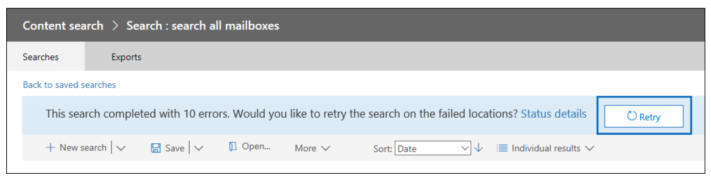

# <a name="investigate-troubleshoot-and-resolve-common-ediscovery-issues"></a><span data-ttu-id="6d65b-103">Analizzare, risolvere e risolvere i problemi comuni di eDiscovery</span><span class="sxs-lookup"><span data-stu-id="6d65b-103">Investigate, troubleshoot, and resolve common eDiscovery issues</span></span>

<span data-ttu-id="6d65b-104">In questo argomento vengono illustrati i passaggi di base per la risoluzione dei problemi che è possibile eseguire per identificare e risolvere i problemi che possono verificarsi durante una ricerca eDiscovery o in un altro punto del processo di eDiscovery.</span><span class="sxs-lookup"><span data-stu-id="6d65b-104">This topic covers basic troubleshooting steps you can take to identify and resolve issues you may encounter during an eDiscovery search or elsewhere in the eDiscovery process.</span></span> <span data-ttu-id="6d65b-105">La risoluzione di alcuni di questi scenari richiede assistenza da parte del supporto tecnico Microsoft.</span><span class="sxs-lookup"><span data-stu-id="6d65b-105">Resolving some of these scenarios requires help from Microsoft Support.</span></span> <span data-ttu-id="6d65b-106">Le informazioni su quando contattare il supporto Tecnico Microsoft sono incluse nei passaggi di risoluzione.</span><span class="sxs-lookup"><span data-stu-id="6d65b-106">Information on when to contact Microsoft Support is included in the resolution steps.</span></span>

## <a name="errorissue-ambiguous-location"></a><span data-ttu-id="6d65b-107">Errore/problema: percorso ambiguo</span><span class="sxs-lookup"><span data-stu-id="6d65b-107">Error/issue: Ambiguous location</span></span>

<span data-ttu-id="6d65b-108">Se si tenta di aggiungere la posizione della cassetta postale dell'utente per la ricerca e sono presenti oggetti duplicati o in conflitto con lo stesso ID utente nella directory di Exchange Online Protection (EOP), viene visualizzato questo errore: `The compliance search contains the following invalid location(s):useralias@contoso.com. The location "useralias@contoso.com" is ambiguous` .</span><span class="sxs-lookup"><span data-stu-id="6d65b-108">If you try to add user's mailbox location to search and there are duplicate or conflicting objects with the same userID in the Exchange Online Protection (EOP) directory, you receive this error: `The compliance search contains the following invalid location(s):useralias@contoso.com. The location "useralias@contoso.com" is ambiguous`.</span></span>

### <a name="resolution"></a><span data-ttu-id="6d65b-109">Risoluzione</span><span class="sxs-lookup"><span data-stu-id="6d65b-109">Resolution</span></span>

<span data-ttu-id="6d65b-110">Verificare la presenza di utenti duplicati o lista di distribuzione con lo stesso ID utente.</span><span class="sxs-lookup"><span data-stu-id="6d65b-110">Check for duplicate users or distribution list with the same user ID.</span></span>

1. <span data-ttu-id="6d65b-111">Connessione a [PowerShell & Centro sicurezza e conformità](/powershell/exchange/connect-to-scc-powershell).</span><span class="sxs-lookup"><span data-stu-id="6d65b-111">Connect to [Security & Compliance Center PowerShell](/powershell/exchange/connect-to-scc-powershell).</span></span>

2. <span data-ttu-id="6d65b-112">Eseguire il comando seguente per recuperare tutte le istanze del nome utente:</span><span class="sxs-lookup"><span data-stu-id="6d65b-112">Run the following command to retrieve all instances of the username:</span></span>

    ```powershell
    Get-Recipient <username>
    ```

   <span data-ttu-id="6d65b-113">L'output per "useralias@contoso.com" è simile al seguente:</span><span class="sxs-lookup"><span data-stu-id="6d65b-113">The output for 'useralias@contoso.com' would be similar to the following:</span></span>

   > 
   > |<span data-ttu-id="6d65b-114">Nome</span><span class="sxs-lookup"><span data-stu-id="6d65b-114">Name</span></span>|<span data-ttu-id="6d65b-115">RecipientType</span><span class="sxs-lookup"><span data-stu-id="6d65b-115">RecipientType</span></span>|
   > |---|---|
   > |<span data-ttu-id="6d65b-116">Alias, Utente</span><span class="sxs-lookup"><span data-stu-id="6d65b-116">Alias, User</span></span>|<span data-ttu-id="6d65b-117">MailUser</span><span class="sxs-lookup"><span data-stu-id="6d65b-117">MailUser</span></span>|
   > |<span data-ttu-id="6d65b-118">Alias, Utente</span><span class="sxs-lookup"><span data-stu-id="6d65b-118">Alias, User</span></span>|<span data-ttu-id="6d65b-119">Utente</span><span class="sxs-lookup"><span data-stu-id="6d65b-119">User</span></span>|

3. <span data-ttu-id="6d65b-120">Se vengono restituiti più utenti, individuare e correggere l'oggetto in conflitto.</span><span class="sxs-lookup"><span data-stu-id="6d65b-120">If multiple users are returned, locate and fix the conflicting object.</span></span>

## <a name="errorissue-search-fails-on-specific-locations"></a><span data-ttu-id="6d65b-121">Errore/problema: la ricerca ha esito negativo in posizioni specifiche</span><span class="sxs-lookup"><span data-stu-id="6d65b-121">Error/issue: Search fails on specific locations</span></span>

<span data-ttu-id="6d65b-122">Una ricerca di contenuto o eDiscovery può produrre l'errore seguente: `This search completed with (#) errors.  Would you like to retry the search on the failed locations?`</span><span class="sxs-lookup"><span data-stu-id="6d65b-122">An eDiscovery or content search may yield the following error: `This search completed with (#) errors.  Would you like to retry the search on the failed locations?`</span></span>



### <a name="resolution"></a><span data-ttu-id="6d65b-124">Risoluzione</span><span class="sxs-lookup"><span data-stu-id="6d65b-124">Resolution</span></span>

<span data-ttu-id="6d65b-125">Se viene visualizzato questo errore, è consigliabile verificare i percorsi non riusciti nella ricerca e quindi eseguire di nuovo la ricerca solo nei percorsi non riusciti.</span><span class="sxs-lookup"><span data-stu-id="6d65b-125">If you receive this error, we recommend that you verify the locations that failed in the search  then rerun the search only on the failed locations.</span></span>

1. <span data-ttu-id="6d65b-126">Connessione [a PowerShell & centro](/powershell/exchange/connect-to-scc-powershell) sicurezza e conformità, quindi eseguire il comando seguente:</span><span class="sxs-lookup"><span data-stu-id="6d65b-126">Connect to [Security & Compliance Center PowerShell](/powershell/exchange/connect-to-scc-powershell) and then run the following command:</span></span>

   ```powershell
   Get-ComplianceSearch <searchname> | FL
   ```

2. <span data-ttu-id="6d65b-127">Dall'output di PowerShell, visualizzare le posizioni non riuscite nel campo degli errori o dai dettagli sullo stato nell'errore dall'output della ricerca.</span><span class="sxs-lookup"><span data-stu-id="6d65b-127">From the PowerShell output, view the failed locations in the errors field or from the status details in the error from the search output.</span></span>

3. <span data-ttu-id="6d65b-128">Ritentare la ricerca eDiscovery solo nei percorsi con errore.</span><span class="sxs-lookup"><span data-stu-id="6d65b-128">Retry the eDiscovery search on the failed locations only.</span></span>

4. <span data-ttu-id="6d65b-129">Se si continua a ricevere questi errori, vedere [Riprovare](/Office365/SecurityCompliance/retry-failed-content-search) percorsi non riusciti per ulteriori procedure di risoluzione dei problemi.</span><span class="sxs-lookup"><span data-stu-id="6d65b-129">If you continue to receive these errors, see [Retry failed locations](/Office365/SecurityCompliance/retry-failed-content-search) for more troubleshooting steps.</span></span>

## <a name="errorissue-file-not-found"></a><span data-ttu-id="6d65b-130">Errore/problema: file non trovato</span><span class="sxs-lookup"><span data-stu-id="6d65b-130">Error/issue: File not found</span></span>

<span data-ttu-id="6d65b-131">Quando si esegue una ricerca eDiscovery che include posizioni di SharePoint Online e One Drive For Business, è possibile che venga visualizzato l'errore anche se il file si `File Not Found` trova nel sito.</span><span class="sxs-lookup"><span data-stu-id="6d65b-131">When running an eDiscovery search that includes SharePoint Online and One Drive For Business locations, you may receive the error `File Not Found` although the file is located on the site.</span></span> <span data-ttu-id="6d65b-132">Questo errore verrà visualizzato negli avvisi di esportazione e errors.csv o ignorato items.csv.</span><span class="sxs-lookup"><span data-stu-id="6d65b-132">This error will be in the export warnings and errors.csv or skipped items.csv.</span></span> <span data-ttu-id="6d65b-133">Ciò può verificarsi se non è possibile trovare il file nel sito o se l'indice non è aggiornato.</span><span class="sxs-lookup"><span data-stu-id="6d65b-133">This may occur if the file can't be found on the site or if the index is out of date.</span></span> <span data-ttu-id="6d65b-134">Ecco il testo di un errore effettivo (con enfasi aggiunta).</span><span class="sxs-lookup"><span data-stu-id="6d65b-134">Here's the text of an actual error (with emphasis added).</span></span>

> <span data-ttu-id="6d65b-135">28.06.2019 10:02:19_FailedToExportItem_Failed per scaricare il contenuto.</span><span class="sxs-lookup"><span data-stu-id="6d65b-135">28.06.2019 10:02:19_FailedToExportItem_Failed to download content.</span></span> <span data-ttu-id="6d65b-136">Informazioni di diagnostica aggiuntive: Microsoft. Office. Compliance.EDiscovery.ExportWorker.Exceptions.ContentDownloadTemporaryFailure: impossibile eseguire il download dal contenuto 6ea52149-91cd-4965-b5bb-82ca6a3ec9be di tipo Document.</span><span class="sxs-lookup"><span data-stu-id="6d65b-136">Additional diagnostic info : Microsoft.Office.Compliance.EDiscovery.ExportWorker.Exceptions.ContentDownloadTemporaryFailure: Failed to download from content 6ea52149-91cd-4965-b5bb-82ca6a3ec9be of type Document.</span></span> <span data-ttu-id="6d65b-137">ID correlazione: 3bd84722-937b-4c23-b61b-08d6fba9ec32.</span><span class="sxs-lookup"><span data-stu-id="6d65b-137">Correlation Id: 3bd84722-937b-4c23-b61b-08d6fba9ec32.</span></span> <span data-ttu-id="6d65b-138">ServerErrorCode: -2147024894 ---> Microsoft. SharePoint. Client.ServerException: ***file non trovato.***</span><span class="sxs-lookup"><span data-stu-id="6d65b-138">ServerErrorCode: -2147024894 ---> Microsoft.SharePoint.Client.ServerException: ***File Not Found***.</span></span> <span data-ttu-id="6d65b-139">presso Microsoft. SharePoint. Client.ClientRequest.ProcessResponseStream(Stream responseStream) presso Microsoft. SharePoint. Client.ClientRequest.ProcessResponse() --- fine dell'analisi dello stack delle eccezioni interne ---</span><span class="sxs-lookup"><span data-stu-id="6d65b-139">at Microsoft.SharePoint.Client.ClientRequest.ProcessResponseStream(Stream responseStream) at Microsoft.SharePoint.Client.ClientRequest.ProcessResponse() --- End of inner exception stack trace ---</span></span>

### <a name="resolution"></a><span data-ttu-id="6d65b-140">Risoluzione</span><span class="sxs-lookup"><span data-stu-id="6d65b-140">Resolution</span></span>

1. <span data-ttu-id="6d65b-141">Controllare il percorso identificato nella ricerca per verificare che il percorso del file sia corretto e aggiunto nei percorsi di ricerca.</span><span class="sxs-lookup"><span data-stu-id="6d65b-141">Check location identified in the search to ensure that the location of the file is correct and added in the search locations.</span></span>

2. <span data-ttu-id="6d65b-142">Utilizzare le procedure descritte in Richiedere manualmente la ricerca per indicizzazione e la reindicizzazione di un [sito,](/sharepoint/crawl-site-content) di una raccolta o di un elenco per reindicizzare il sito.</span><span class="sxs-lookup"><span data-stu-id="6d65b-142">Use the procedures at [Manually request crawling and re-indexing of a site, a library, or a list](/sharepoint/crawl-site-content) to reindex the site.</span></span>

## <a name="errorissue-this-file-wasnt-exported-because-it-doesnt-exist-anymore-the-file-was-included-in-the-count-of-estimated-search-results-because-its-still-listed-in-the-index-the-file-will-eventually-be-removed-from-the-index-and-wont-cause-an-error-in-the-future"></a><span data-ttu-id="6d65b-143">Errore/problema: il file non è stato esportato perché non esiste più.</span><span class="sxs-lookup"><span data-stu-id="6d65b-143">Error/issue: This file wasn't exported because it doesn't exist anymore.</span></span> <span data-ttu-id="6d65b-144">Il file è stato incluso nel conteggio dei risultati di ricerca stimati perché è ancora elencato nell'indice.</span><span class="sxs-lookup"><span data-stu-id="6d65b-144">The file was included in the count of estimated search results because it's still listed in the index.</span></span> <span data-ttu-id="6d65b-145">Il file verrà rimosso dall'indice e non causerà un errore in futuro.</span><span class="sxs-lookup"><span data-stu-id="6d65b-145">The file will eventually be removed from the index, and won't cause an error in the future.</span></span>

<span data-ttu-id="6d65b-146">È possibile che venga visualizzato questo errore quando si esegue una ricerca eDiscovery che include SharePoint online e one drive for business.</span><span class="sxs-lookup"><span data-stu-id="6d65b-146">You may see that error when running an eDiscovery search that includes SharePoint Online and One Drive For Business locations.</span></span> <span data-ttu-id="6d65b-147">eDiscovery si basa sull'indice di SpO per identificare i percorsi dei file.</span><span class="sxs-lookup"><span data-stu-id="6d65b-147">eDiscovery relies on the SPO index to identify the file locations.</span></span> <span data-ttu-id="6d65b-148">Se il file è stato eliminato ma l'indice di SpO non è stato ancora aggiornato, è possibile che si verifichi questo errore.</span><span class="sxs-lookup"><span data-stu-id="6d65b-148">If the file was deleted but the SPO index was not yet updated this error may occur.</span></span>

### <a name="resolution"></a><span data-ttu-id="6d65b-149">Risoluzione</span><span class="sxs-lookup"><span data-stu-id="6d65b-149">Resolution</span></span> 
<span data-ttu-id="6d65b-150">Aprire il percorso di SpO e verificare che il file non sia effettivamente presente.</span><span class="sxs-lookup"><span data-stu-id="6d65b-150">Open the SPO location and verify that this file indeed is not there.</span></span>
<span data-ttu-id="6d65b-151">La soluzione suggerita consiste nel reindicizzare manualmente il sito o attendere la reindicizzazione del sito in base al processo automatico in background.</span><span class="sxs-lookup"><span data-stu-id="6d65b-151">Suggested solution is to manually reindex the site, or wait till the site reindexes by the automatic background process.</span></span>


## <a name="errorissue-this-search-result-was-not-downloaded-as-it-is-a-folder-or-other-artifact-that-cant-be-downloaded-by-itself-any-items-inside-the-folder-or-library-will-be-downloaded"></a><span data-ttu-id="6d65b-152">Errore/problema: questo risultato della ricerca non è stato scaricato perché si tratta di una cartella o di un altro elemento che non può essere scaricato da solo, verranno scaricati tutti gli elementi all'interno della cartella o della raccolta.</span><span class="sxs-lookup"><span data-stu-id="6d65b-152">Error/issue: This search result was not downloaded as it is a folder or other artifact that can't be downloaded by itself, any items inside the folder or library will be downloaded.</span></span>

<span data-ttu-id="6d65b-153">È possibile che venga visualizzato questo errore quando si esegue una ricerca eDiscovery che include SharePoint online e one drive for business.</span><span class="sxs-lookup"><span data-stu-id="6d65b-153">You may see that error when running an eDiscovery search that includes SharePoint Online and One Drive For Business locations.</span></span> <span data-ttu-id="6d65b-154">Significa che si stava provando ad esportare l'elemento riportato nell'indice, ma si è scoperto che si tratta di una cartella, quindi non è stata esportata.</span><span class="sxs-lookup"><span data-stu-id="6d65b-154">It means that we were going to try and export the item reported in the index, but it turned out to be a folder so we did not export it.</span></span> <span data-ttu-id="6d65b-155">Come accennato nell'errore, non esportiamo gli elementi delle cartelle, ma ne esportiamo il contenuto.</span><span class="sxs-lookup"><span data-stu-id="6d65b-155">As mentioned in the error, we don't export folder items but we do export their contents.</span></span>


## <a name="errorissue-search-fails-because-recipient-is-not-found"></a><span data-ttu-id="6d65b-156">Errore/problema: la ricerca ha esito negativo perché il destinatario non è stato trovato</span><span class="sxs-lookup"><span data-stu-id="6d65b-156">Error/issue: Search fails because recipient is not found</span></span>

<span data-ttu-id="6d65b-157">Una ricerca eDiscovery ha esito negativo con l'errore `recipient not found` .</span><span class="sxs-lookup"><span data-stu-id="6d65b-157">An eDiscovery search fails with error the `recipient not found`.</span></span> <span data-ttu-id="6d65b-158">Questo errore può verificarsi se non è possibile trovare l'oggetto utente in Exchange Online Protection (EOP) perché l'oggetto non è stato sincronizzato.</span><span class="sxs-lookup"><span data-stu-id="6d65b-158">This error may occur if the user object cannot be found in Exchange Online Protection (EOP) because the object has not synced.</span></span>

### <a name="resolution"></a><span data-ttu-id="6d65b-159">Risoluzione</span><span class="sxs-lookup"><span data-stu-id="6d65b-159">Resolution</span></span>

1. <span data-ttu-id="6d65b-160">Connessione a [Exchange Online PowerShell](/powershell/exchange/connect-to-exchange-online-powershell).</span><span class="sxs-lookup"><span data-stu-id="6d65b-160">Connect to [Exchange Online PowerShell](/powershell/exchange/connect-to-exchange-online-powershell).</span></span>

2. <span data-ttu-id="6d65b-161">Eseguire il comando seguente per verificare se l'utente è sincronizzato con Exchange Online Protection:</span><span class="sxs-lookup"><span data-stu-id="6d65b-161">Run the following command to check if the user is synced to Exchange Online Protection:</span></span>

   ```powershell
   Get-Recipient <userId> | FL
   ```

3. <span data-ttu-id="6d65b-162">Deve essere presente un oggetto utente di posta per la domanda dell'utente.</span><span class="sxs-lookup"><span data-stu-id="6d65b-162">There should be a mail user object for the user question.</span></span> <span data-ttu-id="6d65b-163">Se non viene restituito alcun valore, analizzare l'oggetto utente.</span><span class="sxs-lookup"><span data-stu-id="6d65b-163">If nothing is returned, investigate the user object.</span></span> <span data-ttu-id="6d65b-164">Contattare il supporto tecnico Microsoft se l'oggetto non può essere sincronizzato.</span><span class="sxs-lookup"><span data-stu-id="6d65b-164">Contact Microsoft Support if the object can't be synced.</span></span>

## <a name="errorissue-exporting-search-results-is-slow"></a><span data-ttu-id="6d65b-165">Errore/problema: l'esportazione dei risultati della ricerca è lenta</span><span class="sxs-lookup"><span data-stu-id="6d65b-165">Error/issue: Exporting search results is slow</span></span>

<span data-ttu-id="6d65b-166">Quando si esportano i risultati della ricerca da Core eDiscovery o Ricerca contenuto nell'Centro conformità Microsoft 365, il download richiede più tempo del previsto.</span><span class="sxs-lookup"><span data-stu-id="6d65b-166">When exporting search results from Core eDiscovery or Content search in the Microsoft 365 compliance center, the download takes longer than expected.</span></span>  <span data-ttu-id="6d65b-167">Puoi controllare la quantità di dati da scaricare ed eventualmente aumentare la velocità di esportazione.</span><span class="sxs-lookup"><span data-stu-id="6d65b-167">You can check to see the amount of data to be download and possibly increase the export speed.</span></span>

### <a name="resolution"></a><span data-ttu-id="6d65b-168">Risoluzione</span><span class="sxs-lookup"><span data-stu-id="6d65b-168">Resolution</span></span>

1. <span data-ttu-id="6d65b-169">Connessione [a PowerShell & centro](/powershell/exchange/connect-to-scc-powershell) sicurezza e conformità, quindi eseguire il comando seguente:</span><span class="sxs-lookup"><span data-stu-id="6d65b-169">Connect to [Security & Compliance Center PowerShell](/powershell/exchange/connect-to-scc-powershell) and then run the following command:</span></span>

   ```powershell
   Get-ComplianceSearch <searchname> | FL
   ```

2. <span data-ttu-id="6d65b-170">Trova la quantità di dati da scaricare nei parametri SearchResults e SearchStatistics.</span><span class="sxs-lookup"><span data-stu-id="6d65b-170">Find the amount of data to be downloaded in the SearchResults and SearchStatistics parameters.</span></span>

3. <span data-ttu-id="6d65b-171">Eseguire il comando seguente:</span><span class="sxs-lookup"><span data-stu-id="6d65b-171">Run the following command:</span></span>

   ```powershell
   Get-ComplianceSearchAction | FL
   ```

4. <span data-ttu-id="6d65b-172">Nel campo dei risultati individuare i dati esportati e visualizzare gli eventuali errori riscontrati.</span><span class="sxs-lookup"><span data-stu-id="6d65b-172">In the results field, find the data that has been exported and view any errors encountered.</span></span>

5. <span data-ttu-id="6d65b-173">Verificare la presenza di eventuali errori nel file trace.log presente nella directory in cui è stato esportato il contenuto.</span><span class="sxs-lookup"><span data-stu-id="6d65b-173">Check the trace.log file located in the directory that you exported the content to for any errors.</span></span>

6. <span data-ttu-id="6d65b-174">Se si verificano ancora problemi, è consigliabile suddividere le ricerche che restituiscono un set di risultati di grandi dimensioni in ricerche più piccole.</span><span class="sxs-lookup"><span data-stu-id="6d65b-174">If you still have issues, consider dividing searches that return a large set of results into smaller searches.</span></span> <span data-ttu-id="6d65b-175">È ad esempio possibile utilizzare intervalli di date nelle query di ricerca per restituire un set più piccolo di risultati che possono essere scaricati più velocemente.</span><span class="sxs-lookup"><span data-stu-id="6d65b-175">For example, you can use date ranges in search queries to return a smaller set of results that can be downloaded faster.</span></span>

## <a name="errorissue-export-process-not-progressing-or-is-stuck"></a><span data-ttu-id="6d65b-176">Errore/problema: il processo di esportazione non è in corso o è bloccato</span><span class="sxs-lookup"><span data-stu-id="6d65b-176">Error/issue: Export process not progressing or is stuck</span></span>

<span data-ttu-id="6d65b-177">Quando si esportano i risultati della ricerca da Core eDiscovery o Ricerca contenuto nel Centro conformità Microsoft 365, il processo di esportazione non è in corso o sembra bloccato.</span><span class="sxs-lookup"><span data-stu-id="6d65b-177">When exporting search results from Core eDiscovery or Content search in the Microsoft 365 compliance center, the export process is not progressing or appears to be stuck.</span></span>

### <a name="resolution"></a><span data-ttu-id="6d65b-178">Risoluzione</span><span class="sxs-lookup"><span data-stu-id="6d65b-178">Resolution</span></span>

1. <span data-ttu-id="6d65b-179">Se necessario, eseguire di nuovo la ricerca.</span><span class="sxs-lookup"><span data-stu-id="6d65b-179">If necessary, rerun the search.</span></span> <span data-ttu-id="6d65b-180">Se l'ultima ricerca è stata eseguita più di 7 giorni fa, è necessario rieseguire la ricerca.</span><span class="sxs-lookup"><span data-stu-id="6d65b-180">If the search was last ran more than 7 days ago, you have to rerun the search.</span></span>

2. <span data-ttu-id="6d65b-181">Riavviare l'esportazione.</span><span class="sxs-lookup"><span data-stu-id="6d65b-181">Restart the export.</span></span>

## <a name="errorissue-internal-server-error-500-occurred"></a><span data-ttu-id="6d65b-182">Errore/problema: "Errore interno del server (500) si è verificato"</span><span class="sxs-lookup"><span data-stu-id="6d65b-182">Error/issue: "Internal server error (500) occurred"</span></span>

<span data-ttu-id="6d65b-183">Quando si esegue una ricerca eDiscovery, se la ricerca continuamente non riesce con un errore simile a "Errore interno del server (500) si è verificato", potrebbe essere necessario eseguire di nuovo la ricerca solo in posizioni specifiche delle cassette postali.</span><span class="sxs-lookup"><span data-stu-id="6d65b-183">When running an eDiscovery search, if the search continually fails with error similar to "Internal server error (500) occurred", you may need rerun the search only on specific mailbox locations.</span></span>


### <a name="resolution"></a><span data-ttu-id="6d65b-185">Risoluzione</span><span class="sxs-lookup"><span data-stu-id="6d65b-185">Resolution</span></span>

1. <span data-ttu-id="6d65b-186">Suddividere la ricerca in ricerche più piccole ed eseguire di nuovo la ricerca.</span><span class="sxs-lookup"><span data-stu-id="6d65b-186">Break the search into smaller searches and run the search again.</span></span>  <span data-ttu-id="6d65b-187">Provare a utilizzare un intervallo di date più piccolo o limitare il numero di posizioni in cui si sta ricercando.</span><span class="sxs-lookup"><span data-stu-id="6d65b-187">Try using a smaller date range or limit the number of locations being searched.</span></span>

2. <span data-ttu-id="6d65b-188">Connessione [a PowerShell & centro](/powershell/exchange/connect-to-scc-powershell) sicurezza e conformità, quindi eseguire il comando seguente:</span><span class="sxs-lookup"><span data-stu-id="6d65b-188">Connect to [Security & Compliance Center PowerShell](/powershell/exchange/connect-to-scc-powershell) and then run the following command:</span></span>

   ```powershell Set-CaseHoldPolicy <policyname> -RetryDistribution
   Get-ComplianceSearch <searchname> | FL
   ```

3. <span data-ttu-id="6d65b-189">Esaminare l'output per ottenere risultati ed errori.</span><span class="sxs-lookup"><span data-stu-id="6d65b-189">Examine the output for results and errors.</span></span>

4. <span data-ttu-id="6d65b-190">Esaminare il file trace.log.</span><span class="sxs-lookup"><span data-stu-id="6d65b-190">Examine the trace.log file.</span></span> <span data-ttu-id="6d65b-191">Si trova nella stessa cartella in cui sono stati esportati i risultati della ricerca.</span><span class="sxs-lookup"><span data-stu-id="6d65b-191">It's located  in the same folder that you exported the search results to.</span></span>

5. <span data-ttu-id="6d65b-192">Contattare il Servizio Supporto Tecnico Clienti Microsoft.</span><span class="sxs-lookup"><span data-stu-id="6d65b-192">Contact Microsoft Support.</span></span>

## <a name="errorissue-holds-dont-sync"></a><span data-ttu-id="6d65b-193">Errore/problema: i blocchi non vengono sincronizzati</span><span class="sxs-lookup"><span data-stu-id="6d65b-193">Error/issue: Holds don't sync</span></span>

<span data-ttu-id="6d65b-194">Errore di distribuzione della sincronizzazione dei criteri di blocco del caso di eDiscovery.</span><span class="sxs-lookup"><span data-stu-id="6d65b-194">eDiscovery Case Hold Policy Sync Distribution error.</span></span> <span data-ttu-id="6d65b-195">L'errore è:</span><span class="sxs-lookup"><span data-stu-id="6d65b-195">The error reads:</span></span>

> <span data-ttu-id="6d65b-196">"Risorse: la distribuzione del criterio richiede più tempo del previsto.</span><span class="sxs-lookup"><span data-stu-id="6d65b-196">"Resources: It's taking longer than expected to deploy the policy.</span></span> <span data-ttu-id="6d65b-197">L'aggiornamento dello stato finale della distribuzione potrebbe richiedere altre 2 ore, quindi controllare di nuovo tra un paio d'ore."</span><span class="sxs-lookup"><span data-stu-id="6d65b-197">It might take an additional 2 hours to update the final deployment status, so check back in a couple hours."</span></span>

### <a name="resolution"></a><span data-ttu-id="6d65b-198">Risoluzione</span><span class="sxs-lookup"><span data-stu-id="6d65b-198">Resolution</span></span>

1. <span data-ttu-id="6d65b-199">Connessione a [PowerShell &](/powershell/exchange/connect-to-scc-powershell) Centro sicurezza e conformità, quindi eseguire il comando seguente per un blocco caso di eDiscovery:</span><span class="sxs-lookup"><span data-stu-id="6d65b-199">Connect to [Security & Compliance Center PowerShell](/powershell/exchange/connect-to-scc-powershell) and then run the following command for an eDiscovery case hold:</span></span>

   ```powershell
   Get-CaseHoldPolicy <policyname> - DistributionDetail | FL
   ```

    <span data-ttu-id="6d65b-200">Per un criterio di conservazione, eseguire il comando seguente:</span><span class="sxs-lookup"><span data-stu-id="6d65b-200">For a retention policy, run the following command:</span></span>

   ```powershell
   Get-RetentionCompliancePolicy <policyname> - DistributionDetail | FL
   ```

2. <span data-ttu-id="6d65b-201">Esaminare il valore nel parametro DistributionDetail per verificare la presenza di errori simili ai seguenti:</span><span class="sxs-lookup"><span data-stu-id="6d65b-201">Examine the value in the DistributionDetail parameter for errors like the following:</span></span>

   > <span data-ttu-id="6d65b-202">Errore: risorse: la distribuzione del criterio richiede più tempo del previsto.</span><span class="sxs-lookup"><span data-stu-id="6d65b-202">Error: Resources: It's taking longer than expected to deploy the policy.</span></span> <span data-ttu-id="6d65b-203">L'aggiornamento dello stato finale della distribuzione potrebbe richiedere altre 2 ore, quindi controllare di nuovo tra un paio d'ore."</span><span class="sxs-lookup"><span data-stu-id="6d65b-203">It might take an additional 2 hours to update the final deployment status, so check back in a couple hours."</span></span>

3. <span data-ttu-id="6d65b-204">Provare a eseguire il parametro RetryDistribution sul criterio in questione:</span><span class="sxs-lookup"><span data-stu-id="6d65b-204">Try running the RetryDistribution parameter on the policy in question:</span></span>

   <span data-ttu-id="6d65b-205">Per i blocchi dei casi di eDiscovery:</span><span class="sxs-lookup"><span data-stu-id="6d65b-205">For eDiscovery case holds:</span></span>

   ```powershell
   Set-CaseHoldPolicy <policyname> -RetryDistribution
   ```

   <span data-ttu-id="6d65b-206">Per i criteri di conservazione:</span><span class="sxs-lookup"><span data-stu-id="6d65b-206">For retention policies:</span></span>

   ```powershell
   Set-RetentionCompliancePolicy <policyname> -RetryDistribution
   ```

4. <span data-ttu-id="6d65b-207">Contattare il Servizio Supporto Tecnico Clienti Microsoft.</span><span class="sxs-lookup"><span data-stu-id="6d65b-207">Contact Microsoft Support.</span></span>

## <a name="error-the-condition-specified-using-http-conditional-headers-is-not-met"></a><span data-ttu-id="6d65b-208">Errore: "La condizione specificata tramite le intestazioni condizionali HTTP non è soddisfatta"</span><span class="sxs-lookup"><span data-stu-id="6d65b-208">Error: "The condition specified using HTTP conditional header(s) is not met"</span></span>

<span data-ttu-id="6d65b-209">Quando si scaricano i risultati della ricerca utilizzando lo strumento di esportazione di eDiscovery, è possibile che venga visualizzato l'errore seguente: Si tratta di un errore temporaneo, che in genere si verifica nel percorso Archiviazione di Azure `System.Net.WebException: The remote server returned an error: (412) The condition specified using HTTP conditional header(s) is not met.` ricerca.</span><span class="sxs-lookup"><span data-stu-id="6d65b-209">When downloading search results using the eDiscovery Export Tool, it's possible you might receive the following error: `System.Net.WebException: The remote server returned an error: (412) The condition specified using HTTP conditional header(s) is not met.` This is transient error, which typically occurs in the Azure Storage location.</span></span>

### <a name="resolution"></a><span data-ttu-id="6d65b-210">Risoluzione</span><span class="sxs-lookup"><span data-stu-id="6d65b-210">Resolution</span></span>

<span data-ttu-id="6d65b-211">Per risolvere questo problema, ritentare [il download dei risultati della](export-search-results.md#step-2-download-the-search-results)ricerca, che riavvierà lo strumento di esportazione di eDiscovery.</span><span class="sxs-lookup"><span data-stu-id="6d65b-211">To resolve this issue, retry [downloading the search results](export-search-results.md#step-2-download-the-search-results), which will restart the eDiscovery Export Tool.</span></span>

## <a name="errorissue-downloaded-export-shows-no-results"></a><span data-ttu-id="6d65b-212">Errore/problema: l'esportazione scaricata non mostra risultati</span><span class="sxs-lookup"><span data-stu-id="6d65b-212">Error/issue: Downloaded export shows no results</span></span>

<span data-ttu-id="6d65b-213">Dopo un'esportazione completata, il download completato tramite lo strumento di esportazione mostra zero file nei risultati.</span><span class="sxs-lookup"><span data-stu-id="6d65b-213">After a successful export, the completed download via the export tool shows zero files in the results.</span></span>

### <a name="resolution"></a><span data-ttu-id="6d65b-214">Risoluzione</span><span class="sxs-lookup"><span data-stu-id="6d65b-214">Resolution</span></span>

<span data-ttu-id="6d65b-215">Si tratta di un problema sul lato client.</span><span class="sxs-lookup"><span data-stu-id="6d65b-215">This is a client-side issue.</span></span> <span data-ttu-id="6d65b-216">Per correggere l'errore, attenersi alla seguente procedura:</span><span class="sxs-lookup"><span data-stu-id="6d65b-216">To remediate it, follow these steps:</span></span>

1. <span data-ttu-id="6d65b-217">Prova a usare un altro client/computer per il download.</span><span class="sxs-lookup"><span data-stu-id="6d65b-217">Try using another client/machine to download.</span></span>

2. <span data-ttu-id="6d65b-218">Rimuovere le ricerche precedenti non più necessarie utilizzando il cmdlet [Remove-ComplianceSearch.](/powershell/module/exchange/remove-compliancesearch)</span><span class="sxs-lookup"><span data-stu-id="6d65b-218">Remove old searches that are no longer needed using [Remove-ComplianceSearch](/powershell/module/exchange/remove-compliancesearch) cmdlet.</span></span>

3. <span data-ttu-id="6d65b-219">Assicurati di eseguire il download in un'unità locale.</span><span class="sxs-lookup"><span data-stu-id="6d65b-219">Make sure to download to a local drive.</span></span>

4. <span data-ttu-id="6d65b-220">Verificare che il programma antivirus non sia in esecuzione.</span><span class="sxs-lookup"><span data-stu-id="6d65b-220">Make sure the virus scanner is not running.</span></span>

5. <span data-ttu-id="6d65b-221">Assicurarsi che nessun'altra esportazione sia in download nella stessa cartella o in qualsiasi cartella padre.</span><span class="sxs-lookup"><span data-stu-id="6d65b-221">Make sure that no other export is downloading to the same folder or any parent folder.</span></span>

6. <span data-ttu-id="6d65b-222">Se i passaggi precedenti non funzionano, disabilitare la compressione e la deduplicazione.</span><span class="sxs-lookup"><span data-stu-id="6d65b-222">If the previous steps don't work, disable zipping and de-duplication.</span></span>

7. <span data-ttu-id="6d65b-223">Se funziona, il problema è dovuto a un programma antivirus locale o a un problema del disco.</span><span class="sxs-lookup"><span data-stu-id="6d65b-223">If this works then the issue is due to a local virus scanner or a disk issue.</span></span>
