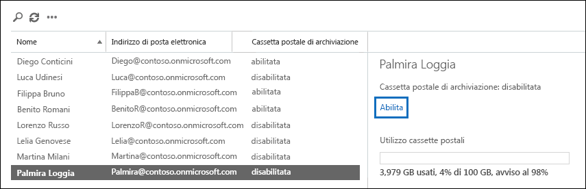

# <a name="enable-archive-mailboxes-in-the-compliance-center"></a><span data-ttu-id="735a3-103">Abilitare le cassette postali di archiviazione nel Centro sicurezza e conformità</span><span class="sxs-lookup"><span data-stu-id="735a3-103">Enable archive mailboxes in the compliance center</span></span>

<span data-ttu-id="735a3-104">L'archiviazione in Microsoft 365 (denominata anche *Archiviazione sul posto*) fornisce agli utenti ulteriore spazio di archiviazione per la cassetta postale.</span><span class="sxs-lookup"><span data-stu-id="735a3-104">Archiving in Microsoft 365 (also called *In-Place Archiving*) provides users with additional mailbox storage space.</span></span> <span data-ttu-id="735a3-105">Dopo aver attivato le cassette postali di archiviazione, gli utenti possono accedere ai messaggi e archiviarli nelle cassette postali tramite Microsoft Outlook e Outlook sul Web (in precedenza noto come Outlook Web App).</span><span class="sxs-lookup"><span data-stu-id="735a3-105">After you turn on archive mailboxes, users can access and store messages in their archive mailboxes by using Microsoft Outlook and Outlook on the web (formerly known as Outlook Web App).</span></span> <span data-ttu-id="735a3-106">Gli utenti possono anche spostare o copiare i messaggi dalla cassetta postale principale a quella di archiviazione.</span><span class="sxs-lookup"><span data-stu-id="735a3-106">Users can also move or copy messages between their primary mailbox and their archive mailbox.</span></span> <span data-ttu-id="735a3-107">Inoltre, possono ripristinare gli elementi eliminati dalla cartella Elementi ripristinabili nella propria cassetta postale di archiviazione con lo strumento Recupera elementi eliminati.</span><span class="sxs-lookup"><span data-stu-id="735a3-107">They can also recover deleted items from the Recoverable Items folder in their archive mailbox by using the Recover Deleted Items tool.</span></span>

> [!NOTE]
> <span data-ttu-id="735a3-108">La funzionalità di archiviazione a espansione automatica di Microsoft 365 offre spazio di archiviazione aggiuntivo nelle cassette postali di archiviazione.</span><span class="sxs-lookup"><span data-stu-id="735a3-108">The auto-expanding archiving feature in Microsoft 365 provides additional storage in archive mailboxes.</span></span> <span data-ttu-id="735a3-109">Dopo aver attivato l'archiviazione a espansione automatica, quando viene raggiunto il limite di archiviazione iniziale nella cassetta postale di un utente, Microsoft 365 aggiunge automaticamente ulteriore spazio di archiviazione.</span><span class="sxs-lookup"><span data-stu-id="735a3-109">When auto-expanding  archiving is turned on, and then the initial storage quota in a user's archive mailbox is reached, Microsoft 365 automatically adds additional storage space.</span></span> <span data-ttu-id="735a3-110">Ciò significa che gli utenti non esauriranno lo spazio di archiviazione delle cassette postali e che non sarà necessario compiere ulteriori operazioni dopo aver abilitato la cassetta postale di archiviazione e attivato l'archiviazione a espansione automatica per l'organizzazione.</span><span class="sxs-lookup"><span data-stu-id="735a3-110">This means that users won't run out of mailbox storage space and you won't have to manage anything after you initially enable the archive mailbox and turn on auto-expanding archiving for your organization.</span></span> <span data-ttu-id="735a3-111">Per altre informazioni, vedere [Panoramica dell'archiviazione illimitata](unlimited-archiving.md).</span><span class="sxs-lookup"><span data-stu-id="735a3-111">For more information, see [Overview of unlimited archiving](unlimited-archiving.md).</span></span>

## <a name="get-the-necessary-permissions"></a><span data-ttu-id="735a3-112">Ottenere i permessi necessari</span><span class="sxs-lookup"><span data-stu-id="735a3-112">Get the necessary permissions</span></span>

<span data-ttu-id="735a3-113">Per abilitare o disabilitare le cassette postali di archiviazione, è necessario che all’utente sia assegnato il ruolo destinatario di posta elettronica in Exchange Online.</span><span class="sxs-lookup"><span data-stu-id="735a3-113">You have to be assigned the Mail Recipients role in Exchange Online to enable or disable archive mailboxes.</span></span> <span data-ttu-id="735a3-114">Per impostazione predefinita, il ruolo è assegnato ai gruppi di ruoli Gestione dei destinatati e Gestione organizzazione nella pagina **Autorizzazioni** nell'interfaccia di amministrazione di Exchange.</span><span class="sxs-lookup"><span data-stu-id="735a3-114">By default, this role is assigned to the Recipient Management and Organization Management role groups on the **Permissions** page in the Exchange admin center.</span></span> <span data-ttu-id="735a3-115">Se non viene visualizzata la pagina **Archivio** nel Centro sicurezza e conformità, è necessario chiedere all'amministratore di assegnare le opportune autorizzazioni.</span><span class="sxs-lookup"><span data-stu-id="735a3-115">If you don't see the **Archive** page in the Security & Compliance Center, ask your administrator to assign you the necessary permissions.</span></span>

## <a name="enable-an-archive-mailbox"></a><span data-ttu-id="735a3-116">Abilitazione di una cassetta postale di archiviazione</span><span class="sxs-lookup"><span data-stu-id="735a3-116">Enable an archive mailbox</span></span>

1. <span data-ttu-id="735a3-117">Passare a <https://protection.office.com>.</span><span class="sxs-lookup"><span data-stu-id="735a3-117">Go to <https://protection.office.com>.</span></span>

2. <span data-ttu-id="735a3-118">Accedere usando l'account aziendale o dell'istituto di istruzione.</span><span class="sxs-lookup"><span data-stu-id="735a3-118">Sign in using your work or school account.</span></span>

3. <span data-ttu-id="735a3-119">Nel riquadro sinistro del Centro sicurezza e conformità, fare clic su **Governance delle informazioni** \>**Archivio**.</span><span class="sxs-lookup"><span data-stu-id="735a3-119">In the left pane of the Security & Compliance Center, click **Information governance** \> **Archive**.</span></span>

   <span data-ttu-id="735a3-p104">Viene visualizzata la pagina **Archivio**. La colonna **Cassetta postale di archiviazione** indica se una cassetta postale di archiviazione è abilitata o disabilitata per ciascun utente.</span><span class="sxs-lookup"><span data-stu-id="735a3-p104">The **Archive** page is displayed. The **Archive mailbox** column indicates whether an archive mailbox is enabled or disabled for each user.</span></span>

   > [!NOTE]
   > <span data-ttu-id="735a3-122">La pagina **Archivio** mostra un massimo di 500 utenti.</span><span class="sxs-lookup"><span data-stu-id="735a3-122">The **Archive** page shows a maximum of 500 users.</span></span>

4. <span data-ttu-id="735a3-123">Nell'elenco delle cassette postali, selezionare l'utente per il quale si desidera abilitare la cassetta postale di archiviazione.</span><span class="sxs-lookup"><span data-stu-id="735a3-123">In the list of mailboxes, select the user that you want to enable the archive mailbox for.</span></span>

   

5. <span data-ttu-id="735a3-125">Nel riquadro del dettagli per l’utente selezionato fare clic su **Abilita**.</span><span class="sxs-lookup"><span data-stu-id="735a3-125">In the details pane for the selected user, click **Enable**.</span></span>

   <span data-ttu-id="735a3-126">Verrà visualizzato un avviso che indica che, se si abilita la cassetta postale di archiviazione, gli elementi che risalgono a un periodo precedente al criterio di archiviazione assegnato alla cassetta postale, verranno spostati nella nuova cassetta postale di archiviazione.</span><span class="sxs-lookup"><span data-stu-id="735a3-126">A warning is displayed saying that if you enable the archive mailbox, items in the user's mailbox that are older than the archiving policy assigned to the mailbox will be moved to the new archive mailbox.</span></span> <span data-ttu-id="735a3-127">I criteri di archiviazione predefiniti che fanno parte dei criteri di conservazione assegnati alle cassette postali di Exchange Online spostano gli elementi nella cassetta postale di archiviazione due anni dopo la data in cui l'elemento è stato creato dall'utente o recapitato nella cassetta postale.</span><span class="sxs-lookup"><span data-stu-id="735a3-127">The default archive policy that is part of the retention policy assigned to Exchange Online mailboxes moves items to the archive mailbox two years after the date the item was delivered to the mailbox or created by the user.</span></span> <span data-ttu-id="735a3-128">Per altre informazioni, vedere la sezione **Altre informazioni** in questo articolo.</span><span class="sxs-lookup"><span data-stu-id="735a3-128">For more information, see the **More info** section in this article.</span></span>

6. <span data-ttu-id="735a3-129">Fare clic su **Sì** per abilitare la cassetta postale di archiviazione.</span><span class="sxs-lookup"><span data-stu-id="735a3-129">Click **Yes** to enable the archive mailbox.</span></span>

   <span data-ttu-id="735a3-130">La creazione della cassetta postale di archiviazione potrebbe richiedere alcuni minuti.</span><span class="sxs-lookup"><span data-stu-id="735a3-130">It might take a few moments to create the archive mailbox.</span></span> <span data-ttu-id="735a3-131">Al termine viene visualizzato il messaggio **Cassetta postale di archiviazione: abilitata** nel riquadro dei dettagli per l'utente selezionato.</span><span class="sxs-lookup"><span data-stu-id="735a3-131">When it's created, **Archive mailbox: enabled** is displayed in the details pane for the selected user.</span></span> <span data-ttu-id="735a3-132">Potrebbe essere necessario fare clic su **Aggiorna**  per aggiornare le informazioni nel riquadro dei dettagli.</span><span class="sxs-lookup"><span data-stu-id="735a3-132">You might have to click **Refresh**  to update the information in the details pane.</span></span>

> [!TIP]
> <span data-ttu-id="735a3-p107">È anche possibile abilitare in blocco le cassette postali di archiviazione selezionando più utenti con cassette postali di archiviazione disabilitate (con i tasti Maiusc o Ctrl). Dopo aver selezionato più cassette postali, fare clic su **Abilita** nel riquadro dei dettagli.</span><span class="sxs-lookup"><span data-stu-id="735a3-p107">You can also bulk-enable archive mailboxes by selecting multiple users with disabled archive mailboxes (use the Shift or Ctrl keys). After selecting multiple mailboxes, click **Enable** in the details pane.</span></span>

## <a name="disable-an-archive-mailbox"></a><span data-ttu-id="735a3-135">Disabilitazione di una cassetta postale di archiviazione</span><span class="sxs-lookup"><span data-stu-id="735a3-135">Disable an archive mailbox</span></span>

<span data-ttu-id="735a3-136">È anche possibile utilizzare la pagina **Archivio** nel Centro sicurezza e conformità per disabilitare la cassetta postale di archiviazione di un utente.</span><span class="sxs-lookup"><span data-stu-id="735a3-136">You can also use the **Archive** page in the Security & Compliance Center to disable a user's archive mailbox.</span></span> <span data-ttu-id="735a3-137">Dopo aver disabilitato una cassetta postale di archiviazione, è possibile connetterla di nuovo alla cassetta postale principale dell'utente entro 30 giorni dalla disabilitazione.</span><span class="sxs-lookup"><span data-stu-id="735a3-137">After you disable an archive mailbox, you can reconnect it to the user's primary mailbox within 30 days of disabling it.</span></span> <span data-ttu-id="735a3-138">In questo caso, i contenuti originali della cassetta postale di archiviazione vengono ripristinati.</span><span class="sxs-lookup"><span data-stu-id="735a3-138">In this case, the original contents of the archive mailbox are restored.</span></span> <span data-ttu-id="735a3-139">Dopo 30 giorni, i contenuti della cassetta postale di archiviazione originale vengono eliminati in modo definitivo e non possono essere ripristinati.</span><span class="sxs-lookup"><span data-stu-id="735a3-139">After 30 days, the contents of the original archive mailbox are permanently deleted and can't be recovered.</span></span> <span data-ttu-id="735a3-140">Pertanto, se si riabilita l'archivio più di 30 giorni dopo averlo disabilitato, viene creata una nuova cassetta postale di archiviazione.</span><span class="sxs-lookup"><span data-stu-id="735a3-140">So if you re-enable the archive more than 30 days after disabling it, a new archive mailbox is created.</span></span>

<span data-ttu-id="735a3-141">Il criterio di archiviazione predefinito assegnato alle cassette postali degli utenti sposta gli elementi alla cassetta postale di archiviazione due anni dopo la data di consegna dell'elemento.</span><span class="sxs-lookup"><span data-stu-id="735a3-141">The default archive policy assigned to users' mailboxes moves items to the archive mailbox two years after the date the item is delivered.</span></span> <span data-ttu-id="735a3-142">Se si disabilita una cassetta postale di archiviazione di un utente, non verrà eseguita alcuna operazione sugli elementi della cassetta postale, che rimarranno nella cassetta postale principale dell'utente.</span><span class="sxs-lookup"><span data-stu-id="735a3-142">If you disable a user's archive mailbox, no action will be taken on mailbox items and they will remain in the user's primary mailbox.</span></span>

<span data-ttu-id="735a3-143">Disabilitare una cassetta postale di archiviazione:</span><span class="sxs-lookup"><span data-stu-id="735a3-143">To disable an archive mailbox:</span></span>

1. <span data-ttu-id="735a3-144">Passare a <https://protection.office.com>.</span><span class="sxs-lookup"><span data-stu-id="735a3-144">Go to <https://protection.office.com>.</span></span>

2. <span data-ttu-id="735a3-145">Accedere usando l'account aziendale o dell'istituto di istruzione.</span><span class="sxs-lookup"><span data-stu-id="735a3-145">Sign in using your work or school account.</span></span>

3. <span data-ttu-id="735a3-146">Nel riquadro sinistro del Centro sicurezza e conformità, fare clic su **Governance delle informazioni** \>**Archivio**.</span><span class="sxs-lookup"><span data-stu-id="735a3-146">In the left pane of the Security & Compliance Center, click **Information governance** \> **Archive**.</span></span>

   <span data-ttu-id="735a3-p110">Viene visualizzata la pagina **Archivio**. La colonna **Cassetta postale di archiviazione** indica se una cassetta postale di archiviazione è abilitata o disabilitata per ciascun utente.</span><span class="sxs-lookup"><span data-stu-id="735a3-p110">The **Archive** page is displayed. The **Archive mailbox** column indicates whether an archive mailbox is enabled or disabled for each user.</span></span>

   > [!NOTE]
   > <span data-ttu-id="735a3-149">La pagina **Archivio** mostra un massimo di 500 utenti.</span><span class="sxs-lookup"><span data-stu-id="735a3-149">The **Archive** page shows a maximum of 500 users.</span></span>

4. <span data-ttu-id="735a3-150">Nell'elenco delle cassette postali, selezionare l'utente per il quale si desidera disabilitare la cassetta postale di archiviazione.</span><span class="sxs-lookup"><span data-stu-id="735a3-150">In the list of mailboxes, select the user that you want to disable the archive mailbox for.</span></span>

5. <span data-ttu-id="735a3-151">Nel riquadro dei dettagli fare clic su **Disabilita**.</span><span class="sxs-lookup"><span data-stu-id="735a3-151">In the details pane, click **Disable**.</span></span>

   <span data-ttu-id="735a3-152">Viene visualizzato un messaggio di avviso che indica che si avranno a disposizione 30 giorni per abilitare di nuovo la cassetta postale di archiviazione e che, scaduto questo periodo, tutte le informazioni contenute nell'archivio verranno eliminate in modo definitivo.</span><span class="sxs-lookup"><span data-stu-id="735a3-152">A warning message is displayed saying that you'll have 30 days to re-enable the archive mailbox, and that after 30 days, all information in the archive will be permanently deleted.</span></span>

6. <span data-ttu-id="735a3-153">Scegliere **Sì** per disabilitare la cassetta postale di archiviazione.</span><span class="sxs-lookup"><span data-stu-id="735a3-153">Click **Yes** to disable the archive mailbox.</span></span>

   <span data-ttu-id="735a3-154">Potrebbero essere necessari alcuni minuti per disabilitare la cassetta postale di archiviazione.</span><span class="sxs-lookup"><span data-stu-id="735a3-154">It might take a few moments to disable the archive mailbox.</span></span> <span data-ttu-id="735a3-155">Al termine, nel riquadro dei dettagli dell’utente selezionato, viene visualizzato il messaggio **Cassetta postale di archiviazione: disabilitata**.</span><span class="sxs-lookup"><span data-stu-id="735a3-155">When it's disabled, **Archive mailbox: disabled** is displayed in the details pane for the selected user.</span></span> <span data-ttu-id="735a3-156">Potrebbe essere necessario fare clic su **Aggiorna**  per aggiornare le informazioni nel riquadro dei dettagli.</span><span class="sxs-lookup"><span data-stu-id="735a3-156">You might have to click **Refresh**  to update the information in the details pane.</span></span>

> [!TIP]
> <span data-ttu-id="735a3-p112">È anche possibile disabilitare in blocco le cassette postali di archiviazione selezionando più utenti con cassette postali di archiviazione abilitate (con i tasti Maiusc o Ctrl). Dopo aver selezionato più cassette postali, fare clic su **Disabilita** nel riquadro dei dettagli.</span><span class="sxs-lookup"><span data-stu-id="735a3-p112">You can also bulk-disable archive mailboxes by selecting multiple users with enabled archive mailboxes (use the Shift or Ctrl keys). After selecting multiple mailboxes, click **Disable** in the details pane.</span></span>

## <a name="use-exchange-online-powershell-to-enable-or-disable-archive-mailboxes"></a><span data-ttu-id="735a3-159">Usare PowerShell per Exchange Online per abilitare o disabilitare le cassette postali di archiviazione.</span><span class="sxs-lookup"><span data-stu-id="735a3-159">Use Exchange Online PowerShell to enable or disable archive mailboxes</span></span>

<span data-ttu-id="735a3-160">È possibile usare anche PowerShell per Exchange Online per abilitare le cassette postali di archiviazione.</span><span class="sxs-lookup"><span data-stu-id="735a3-160">You can also use Exchange Online PowerShell to enable archive mailboxes.</span></span> <span data-ttu-id="735a3-161">Il motivo principale per usare PowerShell è che consente di abilitare rapidamente la cassetta postale di archiviazione per tutti gli utenti dell'organizzazione.</span><span class="sxs-lookup"><span data-stu-id="735a3-161">The primary reason to use PowerShell is that you can quickly enable the archive mailbox for all users in your organization.</span></span>

<span data-ttu-id="735a3-162">La prima operazione da eseguire consiste nel connettersi a PowerShell per Exchange Online.</span><span class="sxs-lookup"><span data-stu-id="735a3-162">The first step is to connect to Exchange Online PowerShell.</span></span> <span data-ttu-id="735a3-163">Per istruzioni, vedere [Connettersi a PowerShell di Exchange Online](/powershell/exchange/connect-to-exchange-online-powershell).</span><span class="sxs-lookup"><span data-stu-id="735a3-163">For instructions, see [Connect to Exchange Online PowerShell](/powershell/exchange/connect-to-exchange-online-powershell).</span></span>

<span data-ttu-id="735a3-164">Una volta effettuata la connessione a Exchange Online, è possibile eseguire i comandi indicati nelle sezioni seguenti per abilitare o disabilitare le cassette postali di archiviazione.</span><span class="sxs-lookup"><span data-stu-id="735a3-164">After you're connected to Exchange Online, you can run the commands in the following sections to enable or disable archive mailboxes.</span></span>

### <a name="enable-archive-mailboxes"></a><span data-ttu-id="735a3-165">Abilitare le cassette postali di archiviazione</span><span class="sxs-lookup"><span data-stu-id="735a3-165">Enable archive mailboxes</span></span>

<span data-ttu-id="735a3-166">Eseguire il comando seguente per abilitare la cassetta postale di archiviazione per un singolo utente.</span><span class="sxs-lookup"><span data-stu-id="735a3-166">Run the following command to enable the archive mailbox for a single user.</span></span>

```powershell
Enable-Mailbox -Identity <username> -Archive
```

<span data-ttu-id="735a3-167">È possibile eseguire il comando seguente per abilitare le cassette postali di archiviazione per tutti gli utenti dell’organizzazione, la cui cassetta postale di archiviazione al momento non è abilitata.</span><span class="sxs-lookup"><span data-stu-id="735a3-167">Run the following command to enable the archive mailbox for all users in your organization (whose archive mailbox is currently not enabled).</span></span>

```powershell
Get-Mailbox -Filter {ArchiveGuid -Eq "00000000-0000-0000-0000-000000000000" -AND RecipientTypeDetails -Eq "UserMailbox"} | Enable-Mailbox -Archive
```

### <a name="disable-archive-mailboxes"></a><span data-ttu-id="735a3-168">Disabilitare le cassette postali di archiviazione</span><span class="sxs-lookup"><span data-stu-id="735a3-168">Disable archive mailboxes</span></span>

<span data-ttu-id="735a3-169">Eseguire il comando seguente per disabilitare la cassetta postale di archiviazione per un singolo utente.</span><span class="sxs-lookup"><span data-stu-id="735a3-169">Run the following command to disable the archive mailbox for a single user.</span></span>

```powershell
Disable-Mailbox -Identity <username> -Archive
```

<span data-ttu-id="735a3-170">È possibile eseguire il comando seguente per disabilitare le cassette postali di archiviazione per tutti gli utenti dell’organizzazione, la cui cassetta postale di archiviazione al momento non è disabilitata.</span><span class="sxs-lookup"><span data-stu-id="735a3-170">Run the following command to disable the archive mailbox for all users in your organization (whose archive mailbox is currently enabled).</span></span>

```powershell
Get-Mailbox -Filter {ArchiveGuid -Ne "00000000-0000-0000-0000-000000000000" -AND RecipientTypeDetails -Eq "UserMailbox"} | Disable-Mailbox -Archive
```

## <a name="more-information"></a><span data-ttu-id="735a3-171">Altre informazioni</span><span class="sxs-lookup"><span data-stu-id="735a3-171">More information</span></span>

- <span data-ttu-id="735a3-172">Quando una cassetta postale di archiviazione è abilitata, gli utenti possono archiviare i messaggi nella propria cassetta postale di archiviazione.</span><span class="sxs-lookup"><span data-stu-id="735a3-172">When an archive mailbox is enabled, users can store messages in their archive mailbox.</span></span> <span data-ttu-id="735a3-173">Gli utenti possono accedere alle proprie cassette postali di archiviazione tramite Microsoft Outlook e Outlook sul Web.</span><span class="sxs-lookup"><span data-stu-id="735a3-173">Users can access their archive mailboxes by using Microsoft Outlook and Outlook on the web.</span></span> <span data-ttu-id="735a3-174">Utilizzando una di queste applicazioni client, gli utenti possono visualizzare i messaggi nella propria cassetta postale di archiviazione e spostare o copiare i messaggi tra la cassetta postale principale e la cassetta postale di archiviazione.</span><span class="sxs-lookup"><span data-stu-id="735a3-174">Using either of these client applications, users can view messages in their archive mailbox and move or copy messages between their primary mailbox and their archive mailbox.</span></span> <span data-ttu-id="735a3-175">Inoltre, gli utenti possono ripristinare gli elementi eliminati dalla cartella Elementi ripristinabili nella propria cassetta postale di archiviazione con lo strumento Recupera elementi eliminati.</span><span class="sxs-lookup"><span data-stu-id="735a3-175">Users can also recover deleted items from the Recoverable Items folder in their archive mailbox by using the Recover Deleted Items tool.</span></span>

  <span data-ttu-id="735a3-176">Per un elenco delle licenze di Outlook che supportano l'Archiviazione sul posto, vedere [Requisiti delle licenze di Outlook per le funzionalità di Exchange](https://support.microsoft.com/office/46b6b7c5-c3ca-43e5-8424-1e2807917c99).</span><span class="sxs-lookup"><span data-stu-id="735a3-176">For a list of Outlook licenses that support In-Place Archiving, see [Outlook license requirements for Exchange features](https://support.microsoft.com/office/46b6b7c5-c3ca-43e5-8424-1e2807917c99).</span></span>

- <span data-ttu-id="735a3-177">Le cassette postali di archiviazione consentono di soddisfare i requisiti di conservazione, eDiscovery e mantenimento dei messaggi dell'organizzazione.</span><span class="sxs-lookup"><span data-stu-id="735a3-177">Archive mailboxes help you and your users to meet your organization's retention, eDiscovery, and hold requirements.</span></span> <span data-ttu-id="735a3-178">Ad esempio, per spostare il contenuto delle cassette postali nelle cassette postali di archiviazione degli utenti, è possibile utilizzare i criteri di conservazione di Exchange dell'organizzazione.</span><span class="sxs-lookup"><span data-stu-id="735a3-178">For example, you can use your organization's Exchange retention policy to move mailbox content to users' archive mailbox.</span></span> <span data-ttu-id="735a3-179">Se si usa lo strumento Ricerca contenuto nel Centro sicurezza e conformità per cercare contenuti specifici nella cassetta postale di un utente, verrà effettuata la ricerca anche della cassetta postale di archiviazione dello stesso utente.</span><span class="sxs-lookup"><span data-stu-id="735a3-179">When you use the Content Search tool in the Security & Compliance Center to search a user's mailbox for specific content, the user's archive mailbox will also be searched.</span></span> <span data-ttu-id="735a3-180">Inoltre, quando si applica un blocco per controversia legale o si applica un criterio di conservazione alla cassetta postale di un utente, vengono conservati anche gli elementi della cassetta postale di archiviazione.</span><span class="sxs-lookup"><span data-stu-id="735a3-180">And, when you place a Litigation Hold or apply a retention policy to a user's mailbox, items in the archive mailbox are also retained.</span></span>

- <span data-ttu-id="735a3-181">Dopo aver attivato le cassette postali di archiviazione, l'organizzazione può sfruttare il criterio di conservazione predefinito di Exchange (noto anche come Gestione dei record dei messaggi o criteri MRM) che viene assegnato automaticamente a tutte le cassette postali.</span><span class="sxs-lookup"><span data-stu-id="735a3-181">After archive mailboxes are enabled, your organization can take advantage of the default Exchange retention policy (also called Messaging Records Management or MRM policy) that is automatically assigned to every mailbox.</span></span> <span data-ttu-id="735a3-182">Quando una cassetta postale di archiviazione è abilitata, i criteri di conservazione predefiniti di Exchange eseguono automaticamente le operazioni seguenti:</span><span class="sxs-lookup"><span data-stu-id="735a3-182">When an archive mailbox is enabled, the default Exchange retention policy automatically does the following:</span></span>

  - <span data-ttu-id="735a3-183">Spostano gli elementi di almeno due anni dalla cassetta postale principale dell'utente alla cassetta postale di archiviazione.</span><span class="sxs-lookup"><span data-stu-id="735a3-183">Moves items that are two years or older from a user's primary mailbox to their archive mailbox.</span></span>

  - <span data-ttu-id="735a3-184">Spostano gli elementi di almeno 14 giorni dalla cartella Elementi ripristinabili nella cassetta postale principale dell'utente alla cartella Elementi ripristinabili nella cassetta postale di archiviazione.</span><span class="sxs-lookup"><span data-stu-id="735a3-184">Moves items that are 14 days or older from the Recoverable Items folder in the user's primary mailbox to the Recoverable Items folder in their archive mailbox.</span></span>

- <span data-ttu-id="735a3-185">Per altre informazioni in merito alle cassette postali di archiviazione e sui criteri di conservazione di Exchange, vedere:</span><span class="sxs-lookup"><span data-stu-id="735a3-185">For more information about archive mailboxes and Exchange retention policies, see:</span></span>

  - [<span data-ttu-id="735a3-186">Tag di conservazione e criteri di conservazione in Exchange Online</span><span class="sxs-lookup"><span data-stu-id="735a3-186">Retention tags and retention policies in Exchange Online</span></span>](/exchange/security-and-compliance/messaging-records-management/retention-tags-and-policies)

  - [<span data-ttu-id="735a3-187">Criteri di conservazione predefiniti di Exchange Online</span><span class="sxs-lookup"><span data-stu-id="735a3-187">Default Retention Policy in Exchange Online</span></span>](/exchange/security-and-compliance/messaging-records-management/default-retention-policy)

  - [<span data-ttu-id="735a3-188">Configurare criteri di archiviazione ed eliminazione per le cassette postali in un'organizzazione</span><span class="sxs-lookup"><span data-stu-id="735a3-188">Set up an archive and deletion policy for mailboxes in your organization</span></span>](set-up-an-archive-and-deletion-policy-for-mailboxes.md)