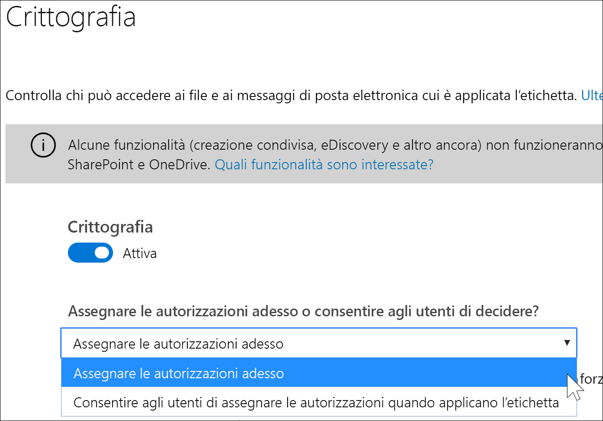
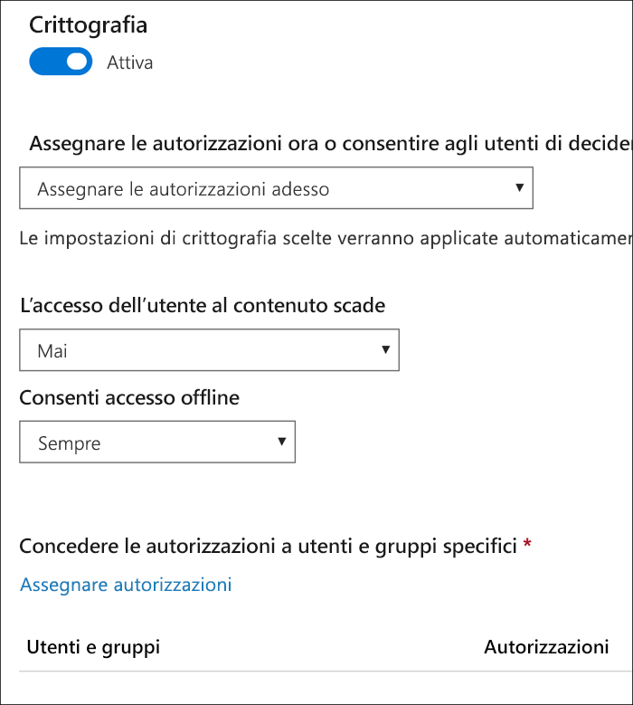
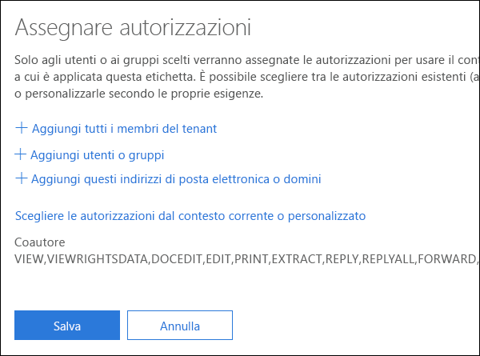
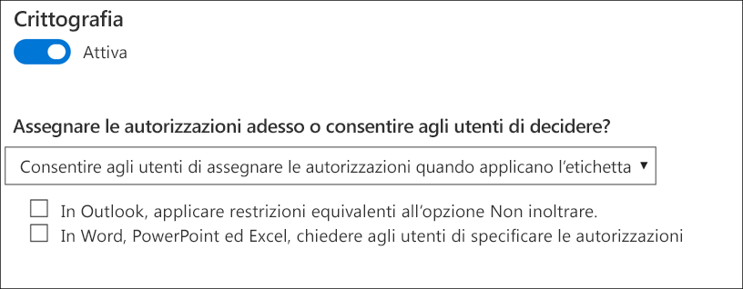
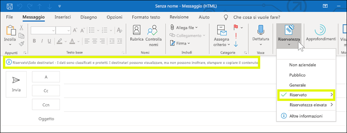
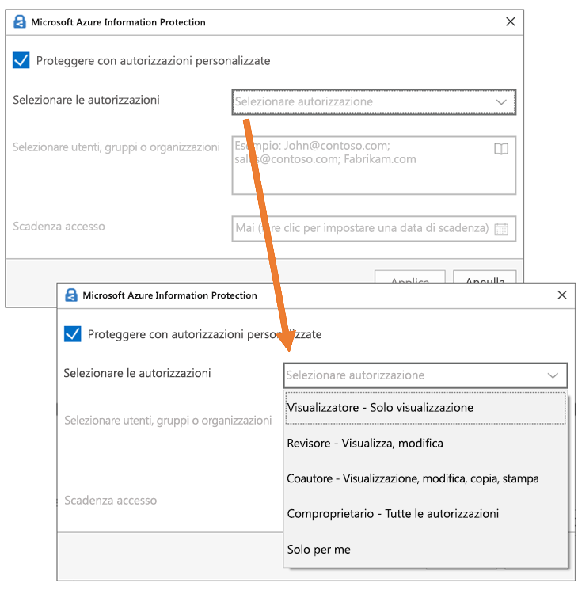

# Limitare l'accesso al contenuto utilizzando la crittografia nelle etichette di riservatezzaRestrict access to content by using encryption in sensitivity labels

Quando si crea un'etichetta di riservatezza, è possibile limitare l'accesso al contenuto a cui verrà applicata l'etichetta. Ad esempio, con le impostazioni di crittografia di un'etichetta di riservatezza, è possibile proteggere i contenuti per determinare le condizioni seguenti:When you create a sensitivity label, you can restrict access to content that the label will be applied to. For example, with the encryption settings for a sensitivity label, you can protect content so that:

- Solo gli utenti all'interno dell'organizzazione possono aprire un documento riservato o un messaggio di posta elettronica.Only users within your organization can open a confidential document or email.
- Solo gli utenti del reparto marketing possono modificare e stampare il documento di annuncio promozione o i messaggi di posta elettronica; tutti gli altri utenti dell'organizzazione possono solo leggerli.Only users in the marketing department can edit and print the promotion announcement document or email, while all other users in your organization can only read it.
- Gli utenti non possono inoltrare un messaggio di posta elettronica o copiare informazioni da esso contenenti notizie riguardo una riorganizzazione interna.Users cannot forward an email or copy information from it that contains news about an internal reorganization.
- Il listino prezzi corrente inviato ai partner commerciali non può essere aperto in seguito a una data specificata.The current price list that is sent to business partners cannot be opened after a specified date.

Quando un documento o un messaggio di posta elettronica è crittografato, l'accesso al contenuto è limitato per fare in modo che si verifichino le condizioni seguenti:When a document or email is encrypted, access to the content is restricted, so that it:

- Il contenuto può essere decrittografato solo dagli utenti autorizzati dalle impostazioni di crittografia dell'etichetta.Can be decrypted only by users authorized by the label’s encryption settings.
- Il contenuto rimane crittografato indipendentemente da dove risiede il file, all'interno o all'esterno dell'organizzazione, anche nel caso in cui il file venisse rinominato.Remains encrypted no matter where it resides, inside or outside your organization, even if the file’s renamed.
- Il contenuto resta crittografato sia se il file è archiviato (ad esempio, in un account OneDrive) sia se è in transito (ad esempio, un messaggio di posta elettronica inviato).Is encrypted both at rest (for example, in a OneDrive account) and in transit (for example, a sent email).

Infine, quando si crea un'etichetta di riservatezza, gli amministratori possono scegliere di:Finally, as an admin, when you create a sensitivity label, you can choose either to:

- **Assegnare le autorizzazioni adesso**, in modo da determinare esattamente quali utenti ottengono le autorizzazioni per il contenuto con tale etichetta.**Assign permissions now**, so that you determine exactly which users get which permissions to content with that label.
- **Consentire agli utenti di assegnare le autorizzazioni** quando applicano l'etichetta al contenuto.**Let users assign permissions** when they apply the label to content. In questo modo è possibile consentire agli utenti dell'organizzazione una certa flessibilità, che potrebbe essere necessaria per collaborare e svolgere il proprio lavoro.This way, you can allow people in your organization some flexibility that they might need to collaborate and get their work done.

Le impostazioni di crittografia sono disponibili quando si crea un'etichetta di riservatezza nel Centro conformità Microsoft 365, Centro sicurezza Microsoft 365 o Centro sicurezza e conformità di Office 365.The encryption settings are available when you create a sensitivity label in the Microsoft 365 compliance center, Microsoft 365 security center, or Office 365 Security & Compliance Center. Nel riquadro di spostamento sinistro scegliere **Classificazione** > **Etichetta di riservatezza** > **Crea un'etichetta**.In the left nav, choose **Classification** > **Sensitivity label** > **Create a label**.

## Modalità di funzionamento della crittografiaHow encryption works

La crittografia utilizza Azure Rights Management (Azure RMS). Azure RMS usa i criteri di crittografia, identità e autorizzazione. Per ulteriori informazioni, vedere [Informazioni su Microsoft Azure Rights Management](https://docs.microsoft.com/it-IT/azure/information-protection/what-is-azure-rms)Encryption uses Azure Rights Management (Azure RMS). Azure RMS uses encryption, identity, and authorization policies. To learn more, see [What is Azure Rights Management?](https://docs.microsoft.com/it-IT/azure/information-protection/what-is-azure-rms)

## Come attivare la crittografia per un'etichetta di riservatezzaHow to turn on encryption for a sensitivity label

Per iniziare, è sufficiente impostare **Crittografia** su **Attiva** e quindi scegliere se:To begin, simply toggle **Encryption** to **On**, and then choose whether to:

- **Assegnare le autorizzazioni adesso**, in modo da determinare esattamente quali utenti ottengono le autorizzazioni per il contenuto con tale etichetta.**Assign permissions now**, so that you can determine exactly which users get which permissions to content with that label. Per ulteriori informazioni, vedere la sezione successiva [Assegnare le autorizzazioni adesso](#assign-permissions-now).For more information, see the next section [Assign permissions now](#assign-permissions-now).
- **Consentire agli utenti di assegnare le autorizzazioni** quando applicano l'etichetta al contenuto.**Let users assign permissions** when they apply the label to content. In questo modo è possibile consentire agli utenti dell'organizzazione una certa flessibilità, che potrebbe essere necessaria per collaborare e svolgere il proprio lavoro.This way, you can allow people in your organization some flexibility that they might need to collaborate and get their work done. Per ulteriori informazioni, vedere la sezione successiva [Consentire agli utenti di assegnare le autorizzazioni](#let-users-assign-permissions).For more information, see the below section [Let users assign permissions](#let-users-assign-permissions).

Ad esempio, se si ha un'etichetta di riservatezza denominata **Riservatezza elevata** da applicare al contenuto più riservato, è consigliabile decidere ora chi ottiene quali autorizzazioni per il contenuto.For example, if you have a sensitivity label named **Highly Confidential** that will be applied to your most sensitive content, you may want to decide now who gets what type of permissions to that content.

In alternativa, se si ha un'etichetta di riservatezza denominata **Contratti commerciali** e il flusso di lavoro dell'organizzazione richiede che le persone collaborino a questo contenuto con persone diverse e specifiche per ogni caso, è consigliabile consentire agli utenti di decidere chi ottiene le autorizzazioni quando assegnano l'etichetta.Alternatively, if you have a sensitivity label named **Business Contracts**, and your organization's workflow requires that your people collaborate on this content with different people on an ad hoc basis, you may want to allow your users to decide who gets permissions when they assign the label. Questa flessibilità consente di migliorare la produttività degli utenti e ridurre le richieste rivolte agli amministratori per l’aggiornamento o la creazione di nuove etichette di riservatezza per situazioni specifiche.This flexibility both helps your users' productivity and reduces the requests for your admins to update or create new sensitivity labels to address specific scenarios.

## Assegnare le autorizzazioni adessoAssign permissions now

Utilizzare le opzioni seguenti per controllare chi può accedere ai documenti e ai messaggi di posta elettronica a cui verrà applicata tale etichetta.To begin, simply toggle Encryption to On, and then use the options below to control who can access email or documents to which this label is applied. You can: È possibile:You can:

1. **Consentire l'accesso al contenuto etichettato solo entro una determinata scadenza**, che può essere una data specifica o un determinato numero di giorni dopo che è stata applicata l'etichetta. Al termine di questo periodo, gli utenti non potranno aprire l'elemento etichettato. Se si specifica una data, sarà rispettato il proprio fuso orario corrente. Si noti che alcuni client di posta elettronica potrebbero non applicare la scadenza e mostrare messaggi di posta elettronica che hanno superato la data di scadenza a causa dei meccanismi di memorizzazione nella cache.**Allow access to labeled content to expire**, either on a specific date or after a specific number of days after the label is applied. After this time, users won’t be able to open the labeled item. If you specify a date, it is effective midnight on that date in your current time zone. (Note that some email clients may not enforce expiration and show emails past their expiration date, due to their caching mechanisms.)

2. **Consentire l'accesso offline** sempre, mai o per un determinato numero di giorni in seguito all'applicazione dell'etichetta. Se si limita l'accesso offline su mai o per un determinato numero di giorni, al termine di tale intervallo di tempo, ogni utente dovrà ripetere l'autenticazione e registrare il proprio accesso. Per ulteriori informazioni, vedere la sezione successiva riguardo la licenza d'uso di Rights Management.**Allow offline access** never, always, or for a specific number of days after the label is applied. If you restrict offline access to never or a number of days, when that threshold is reached, users must be reauthenticated and their access is logged. For more information, see the next section on the Rights Management use license.

### Licenza d'uso di Rights Management per l'accesso offlineRights Management use license for offline access

Quando un utente apre un documento o un messaggio di posta elettronica protetto da un'etichetta di riservatezza, gli viene concessa una licenza d'uso di Azure Rights Management per quel contenuto. Questa licenza d'uso è un certificato che contiene i diritti di utilizzo dell'utente per il documento o il messaggio di posta elettronica e la chiave di crittografia usata per crittografare il contenuto. La licenza d'uso contiene anche una data di scadenza (se è stata impostata) e il periodo di validità della licenza d'uso.When a user opens a document or email offline that’s been protected by a sensitivity label, an Azure Rights Management use license for that content is granted to the user. This use license is a certificate that contains the user's usage rights for the document or email, and the encryption key that was used to encrypt the content. The use license also contains an expiration date if this has been set, and how long the use license is valid.

Se non è stata impostata alcuna data di scadenza, il periodo di validità predefinito del contratto di licenza con l'utente finale per un tenant è di 30 giorni. Per la durata della licenza d'uso, all'utente non viene richiesto di ripetere l'autenticazione o specificare una nuova autorizzazione per il contenuto. Ciò consente all'utente di continuare ad aprire il documento o il messaggio di posta elettronica protetto senza una connessione Internet. Quando scade il periodo di validità della licenza d'uso, al successivo accesso al documento o al messaggio di posta elettronica protetto, l'utente deve ripetere l'autenticazione o specificare una nuova autorizzazione.If no expiration date has been set, the default use license validity period for a tenant is 30 days. For the duration of the use license, the user is not reauthenticated or reauthorized for the content. This lets the user continue to open the protected document or email without an Internet connection. When the use license validity period expires, the next time the user accesses the protected document or email, the user must be reauthenticated and reauthorized.

Oltre al nuovo processo di autenticazione, vengono valutati nuovamente il gruppo a cui appartiene l'utente e i relativi criteri. Questo significa che, se dopo l'ultimo accesso, sono cambiati i criteri o il gruppo di appartenenza dell'utente, anche le autorizzazioni per accedere allo stesso documento o messaggio di posta elettronica potrebbero essere cambiate.In addition to reauthentication, the policy and user group membership is reevaluated. This means that users could experience different access results for the same document or email if there are changes in the policy or group membership from when they last accessed the content.

Per ulteriori informazioni su come modificare l'impostazione predefinita di 30 giorni, vedere [Licenza d'uso di Rights Management](https://docs.microsoft.com/it-IT/azure/information-protection/configure-usage-rights#rights-management-use-license).To learn how to change the default 30-day setting, see [Rights Management use license](https://docs.microsoft.com/it-IT/azure/information-protection/configure-usage-rights#rights-management-use-license).

### Assegnare autorizzazioni a utenti o gruppi specificiAssign permissions to specific users or groups

È possibile concedere autorizzazioni a utenti specifici in modo che solo essi possano interagire con il contenuto etichettato.You can grant permissions to specific people so that only they can interact with the labeled content.

È possibile farlo in due semplici passaggi:Doing so is a straightforward two-step process:

1. Prima di tutto, aggiungere gli utenti o i gruppi a cui verranno assegnate le autorizzazioni per il contenuto etichettato.First you add users or groups that will be assigned permissions to the labeled content.
2. Quindi scegliere quali autorizzazioni assegnare agli utenti per il contenuto etichettato.Then you choose which permissions those users have for the labeled content.

#### Aggiungere utenti o gruppiAdd users or groups

Quando si assegnano le autorizzazioni, è possibile scegliere:When you assign permissions, you can choose:

- Tutti gli utenti dell'organizzazione (tutti i membri del tenant). Questa impostazione include gli account Guest.Everyone in your organization (all tenant members). This setting excludes guest accounts.
- Qualsiasi utente, gruppo di sicurezza abilitato alla posta elettronica, gruppo di distribuzione, gruppo di Office 365 o gruppo di distribuzione dinamico specifico.Any specific user or email-enabled security group, distribution group, Office 365 group, or dynamic distribution group. 
- Qualsiasi indirizzo di posta elettronica o dominio all'esterno dell'organizzazione, ad esempio gmail.com, outlook.com o hotmail.com.Any email address or domain outside your organization, such as gmail.com, hotmail.com, or outlook.com.

Quando si scelgono tutti i membri del tenant o si sfoglia la directory, gli utenti o i gruppi devono avere un indirizzo di posta elettronica.When you choose all tenant members or browse the directory, the users or groups must have an email address.

È consigliabile utilizzare i gruppi anziché gli utenti, così da mantenere la configurazione più semplice.As a best practice, use groups rather than users. This strategy keeps your configuration simpler.

#### Scegliere le autorizzazioniChoose permissions

Quando si sceglie quali autorizzazioni assegnare agli utenti o ai gruppi, è possibile selezionare:When you choose which permissions to allow for those users or groups, you can select either:

- Un [livello di autorizzazione predefinito](https://docs.microsoft.com/it-IT/azure/information-protection/configure-usage-rights#rights-included-in-permissions-levels) con un gruppo di diritti preimpostato, ad esempio Coautore o Revisore.A [predefined permissions level](https://docs.microsoft.com/it-IT/azure/information-protection/configure-usage-rights#rights-included-in-permissions-levels) with a preset group of rights, such as Co-Author or Reviewer.
- Un gruppo di diritti personalizzato, dove è possibile selezionare qualunque autorizzazioni si desideri.A Custom group of rights, where you choose whichever permissions you want.

Per ulteriori informazioni sulle singole specifiche autorizzazioni, vedere [Diritti di utilizzo e relative descrizioni](https://docs.microsoft.com/it-IT/azure/information-protection/configure-usage-rights#usage-rights-and-descriptions).For more information on each specific permission, see [Usage rights and descriptions](https://docs.microsoft.com/it-IT/azure/information-protection/configure-usage-rights#usage-rights-and-descriptions).  

Si noti che la stessa etichetta può concedere autorizzazioni diverse a vari utenti. Ad esempio, una singola etichetta può assegnare alcuni utenti come Revisore e un altro utente come Coautore, come mostrato di seguito.Note that the same label can grant different permissions to different users. For example, a single label can assign some users as Reviewer and a different user as Co-author, as shown below.

Per eseguire questa operazione, aggiungere utenti o gruppi, assegnargli le autorizzazioni e salvare le impostazioni. Quindi ripetere questi passaggi, aggiungendo utenti e assegnando loro le autorizzazioni, salvando le impostazioni ogni volta. È possibile farlo con la frequenza desiderata, in modo da poter definire autorizzazioni diverse per utenti diversi.To do this, add users or groups, assign them permissions, and save those settings. Then repeat these steps, adding users and assigning them permissions, saving the settings each time. You can do this as often as necessary, to define different permissions for different users.

#### L'emittente di Rights Management (l'utente che applica l'etichetta di riservatezza) dispone sempre dell'autorizzazione Controllo completoRights Management issuer (user applying the sensitivity label) always has Full Control

La crittografia per un'etichetta di riservatezza usa Azure RMS. Quando un utente applica un'etichetta di riservatezza per proteggere un documento o un messaggio di posta elettronica utilizzando Azure RMS, l'utente diventa l'emittente di Rights Management per quel contenuto.Encryption for a sensitivity label uses Azure RMS. When a user applies a sensitivity label to protect a document or email by using Azure RMS, that user becomes the Rights Management issuers for that content.

All'emittente di Rights Management sono sempre concesse le autorizzazioni di controllo completo per il documento o messaggio di posta elettronica. Inoltre:The Rights Management issuer is always granted Full Control permissions for the document or email, and in addition:

- Se le impostazioni di protezione includono una data di scadenza, l'emittente di Rights Management può comunque aprire e modificare il documento o il messaggio di posta elettronica in seguito a tale data.If the protection settings include an expiration date, the Rights Management issuer can still open and edit the document or email after that date.
- L'emittente di Rights Management può sempre accedere offline al documento o al messaggio di posta elettronica.The Rights Management issuer can always access the document or email offline.
- L'emittente di Rights Management può aprire un documento anche se è stato revocato.The Rights Management issuer can still open a document after it is revoked.

Per ulteriori informazioni, vedere [Emittente di Rights Management e proprietario di Rights Management](https://docs.microsoft.com/it-IT/azure/information-protection/configure-usage-rights#rights-management-issuer-and-rights-management-owner).For more information, see [Rights Management issuer and Rights Management owner](https://docs.microsoft.com/it-IT/azure/information-protection/configure-usage-rights#rights-management-issuer-and-rights-management-owner).

## Consentire agli utenti di assegnare le autorizzazioniLet users assign permissions

È possibile usare queste opzioni per consentire agli utenti di assegnare autorizzazioni quando applicano manualmente un'etichetta di riservatezza al contenuto:You can use these options to let users assign permissions when they manually apply a sensitivity label to content:

- In Outlook, un utente può applicare restrizioni equivalenti all'opzione [Non inoltrare](https://docs.microsoft.com/azure/information-protection/configure-usage-rights#do-not-forward-option-for-emails).In Outlook, a user can enforce restrictions equivalent to the [Do Not Forward](https://docs.microsoft.com/azure/information-protection/configure-usage-rights#do-not-forward-option-for-emails) option. Questa opzione è supportata in modo nativo in Outlook per Windows e non richiede di installare il client di etichettatura unificato di Azure Information Protection.This option is supported natively in Outlook on Windows, and does not require you to install the Azure Information Protection unified labeling client.
- In Word, PowerPoint ed Excel, agli utenti viene chiesto di selezionare il livello di autorizzazione per utenti, gruppi o organizzazioni specifici.In Word, PowerPoint, and Excel, a user is prompted to select a permission level for specific users, groups, or organizations. Poiché questa opzione non è supportata in modo nativo in Outlook per Windows, gli utenti devono installare il client di etichettatura unificato di Azure Information Protection.This option is not supported natively in these Office apps, so your users must install the Azure Information Protection unified labeling client.

Queste opzioni determinano le app in cui verrà visualizzata l'etichetta di riservatezza:These options determine in which apps the sensitivity label will appear:

- Se nell'etichetta di riservatezza è abilitata solo l'opzione Outlook, l'etichetta sarà visualizzata solo dagli utenti di Outlook.If the sensitivity label has only the Outlook option enabled, the label will appear to users only in Outlook.
- Se nell'etichetta di riservatezza è abilitata solo l'opzione Word, PowerPoint ed Excel, l'etichetta sarà visualizzata solo dagli utenti di queste app.If the sensitivity label has only the Word, PowerPoint, and Excel option enabled, the label will appear to users only in those apps.
- Se l'etichetta di riservatezza ha entrambe le opzioni abilitate, l'etichetta sarà visualizzata dagli utenti di tutte le app disponibili: Outlook, Word, PowerPoint ed Excel.If the sensitivity label has both options enabled, the label will appear to users in all of the available apps: Outlook, Word, PowerPoint, and Excel.

Un'etichetta di riservatezza che consente agli utenti di assegnare autorizzazioni può essere applicata al contenuto solo manualmente dagli utenti. Non può essere applicata automaticamente o usata come etichetta consigliata.A sensitivity label that lets users assign permissions can be applied to content only manually by users; it can't be auto-applied or used as a recommended label.

> [!NOTE]
> Consentire agli utenti di assegnare autorizzazioni richiede un abbonamento ad Azure Information Protection.Letting users assign permissions requires an Azure Information Protection subscription. Per usare questa funzionalità in Word, PowerPoint ed Excel, è necessario scaricare e installare il [client di etichettatura unificato di Azure Information Protection](https://docs.microsoft.com/azure/information-protection/rms-client/install-unifiedlabelingclient-app).To use this feature in Word, PowerPoint, and Excel, you must download and install the [Azure Information Protection unified labeling client](https://docs.microsoft.com/azure/information-protection/rms-client/install-unifiedlabelingclient-app). Stiamo lavorando al supporto nativo di questa funzionalità nelle app di Office, in modo che il client di Azure Information Protection non sia necessario.We're working on native support for this feature in these Office apps, so that they won't require the Azure Information Protection client. Inoltre, il client viene eseguito solo in Windows, quindi questa caratteristica non è ancora supportata in Mac, iOS, Android o Office per il Web.Also, the client runs only on Windows, so this feature is not yet supported on Mac, iOS, Android, or Office for the web.

### Restrizioni di OutlookOutlook restrictions

In Outlook, quando un utente applica un'etichetta di riservatezza che consente di assegnare autorizzazioni a un messaggio, le restrizioni sono le stesse dell'opzione Non inoltrare.In Outlook, when a user applies a sensitivity label that lets them assign permissions to a message, the restrictions are the same as the Do Not Forward option. Gli utenti vedranno il nome e la descrizione dell'etichetta nella parte superiore del messaggio, il che indica che il contenuto è protetto.The user will see the label name and description at the top of the message, which indicates the content's being protected. Diversamente da Word, PowerPoint ed Excel (vedere la [sezione successiva](#word-powerpoint-and-excel-permissions)), agli utenti non viene chiesto di selezionare autorizzazioni specifiche.Unlike Word, PowerPoint, and Excel (see the [next section](#word-powerpoint-and-excel-permissions)), users aren't prompted to select specific permissions.

Se l'opzione Non inoltrare viene applicata a un messaggio di posta elettronica, il messaggio viene crittografato e i destinatari devono essere autenticati.When the Do Not Forward option is applied to an email, the email is encrypted and recipients must be authenticated. Quindi i destinatari non potranno inoltrarlo, stamparlo o copiarlo.Then, the recipients cannot forward it, print it, or copy from it. Ad esempio, nel client Outlook il pulsante Inoltra non è disponibile, le opzioni di menu Salva con nome e Stampa non sono disponibili e non è possibile aggiungere o modificare i destinatari nelle caselle A, Cc o Ccn.For example, in the Outlook client, the Forward button is not available, the Save As and Print menu options are not available, and you cannot add or change recipients in the To, Cc, or Bcc boxes.

I documenti di Office non protetti allegati al messaggio di posta elettronica ereditano automaticamente le stesse restrizioni.Unprotected Office documents that are attached to the email automatically inherit the same restrictions. I diritti di utilizzo applicati a questi documenti sono Modifica contenuto, Modifica, Salva, Visualizza, Apri, Leggi e Consenti macro.The usage rights applied to these documents are Edit Content, Edit; Save; View, Open, Read; and Allow Macros. Se l'utente vuole avere diritti di utilizzo diversi per un allegato, o se l’allegato non è un documento di Office che supporta questa protezione ereditata, l'utente deve proteggere il file prima di allegarlo al messaggio di posta elettronica.If the user wants different usage rights for an attachment, or the attachment is not an Office document that supports this inherited protection, the user needs to protect the file before attaching it to the email.

### Autorizzazioni per Word, PowerPoint ed ExcelWord, PowerPoint, and Excel permissions

In Word, PowerPoint ed Excel, quando un utente applica un'etichetta di riservatezza che consente di assegnare autorizzazioni a un documento, viene chiesto di proteggere il contenuto, come illustrato di seguito.In Word, PowerPoint, and Excel, when a user applies a sensitivity label that lets them assign permissions to a document, they are prompted to protect the content as shown below.

L'utente può:The user can modify records.

- Selezionare un livello di autorizzazione, ad esempio Visualizzatore, che assegna l'autorizzazione Solo visualizzazione, o Coautore, che assegna le autorizzazioni di visualizzazione, modifica, copia e stampa.Select a permission level, such as Viewer (which assigns View Only permission) or Co-Author (which assigns View, Edit, Copy, and Print permissions).
- Selezionare utenti, gruppi o organizzazioni.Select users, groups, or organizations. Questo può includere persone sia interne che esterne alle organizzazioni.This can include people both inside or outside your organizations.
- Impostare una data di scadenza, dopodiché gli utenti selezionati non potranno accedere al contenuto.Set an expiration date, after which the selected users cannot access the content. Per altre informazioni, vedere la sezione precedente [Licenza d’uso di Rights Management per l'accesso offline](#rights-management-use-license-for-offline-access).For more information, see the above section [Rights Management use license for offline access](#rights-management-use-license-for-offline-access).

## Cosa accade alla crittografia esistente in seguito all'applicazione di un'etichettaWhat happens to existing encryption when a label's applied

Prima che al contenuto venga applicata un'etichetta di riservatezza, è possibile che un utente abbia già crittografato il contenuto applicando altre impostazioni di protezione.Before a sensitivity label is applied to content, it's possible that a user already encrypted the content by applying some other protection setting. Ad esempio, un utente può aver applicato:For example, a user might have applied:

- L'opzione **Non inoltrare**.The **Do Not Forward** option.
- La protezione personalizzata usando il client di etichettatura unificata di Azure Information Protection.Custom protection by using the Azure Information Protection unified labeling client.
- Un modello di Azure Rights Management Service (RMS) che crittografa il contenuto ma non viene associato a un'etichetta.An Azure Rights Management Service (RMS) template that encrypts the content but is not associated with a label.

Questa tabella descrive cosa accade alla crittografia esistente quando si applica un'etichetta di riservatezza a tale contenuto.This table describe what happens to existing encyption when a sensitivity label is applied to that content.
 
 

| |**L'utente applica un'etichetta di riservatezza con la crittografia disattivata****User applies a sensitivity label with encryption turned off**|**L'utente applica un'etichetta di riservatezza con la crittografia attivata****User applies a sensitivity label with encryption turned on**|**L'utente applica un'etichetta con Rimuovi protezione**1**User applies a label with Remove Protection**1|
|:-----|:-----|:-----|:-----|
|**Non inoltrare****Do Not Forward**|Posta elettronica - La protezione viene rimossaEmail - Protection is removed Documento - La protezione viene mantenutaDocument - Protection is preserved|La protezione dell'etichetta viene applicataLabel protection is applied|L'etichetta **Non inoltrare** viene rimossa**Do Not Forward** is removed|
|**Protezione personalizzata**1**Custom protection**1|La protezione viene mantenutaProtection is preserved|La protezione dell'etichetta viene applicataLabel protection is applied|La protezione personalizzata viene rimossaCustom protection is removed|
|**Modello di Azure RMS****Azure RMS template**|La protezione viene mantenutaProtection is preserved|La protezione dell'etichetta viene applicataLabel protection is applied|La protezione personalizzata viene rimossaCustom protection is removed|

1Supportata solo nel client di etichettatura di Azure Information Protection.1This is supported only in the Azure Information Protection labeling client.

## Archiviare contenuti crittografati in OneDrive e SharePointStoring encrypted content in OneDrive and SharePoint

Tenere presente che quando la crittografia viene applicata a file archiviati in OneDrive o SharePoint, il servizio non può elaborare il contenuto di tali file. Ciò significa che funzionalità come la creazione condivisa, eDiscovery, ricerca, Delve e altre funzionalità di collaborazione non funzionano. Inoltre, i criteri di prevenzione della perdita dei dati (DLP) possono funzionare solo con i metadati (comprese le etichette di Office 365), ma non con i contenuti di file crittografati (ad esempio i numeri di carta di credito all'interno dei file).Be aware that when encryption is applied to files stored in OneDrive and SharePoint, the service cannot process the contents of these files. This means that features such as co-authoring, eDiscovery, search, Delve, and other collaborative features do not work. Also, data loss prevention (DLP) policies can work only with the metadata (including Office 365 labels) but not the contents of encrypted files (such as credit card numbers within files).

Ciò si applica solo ai contenuti archiviati in OneDrive e SharePoint. In Exchange Online le regole di flusso di posta (note anche come regole di trasporto) usano l'[account utente con privilegi avanzati](https://docs.microsoft.com/it-IT/azure/information-protection/configure-super-users), in modo da poter analizzare il contenuto crittografato e applicare i criteri di prevenzione della perdita dei dati.This applies only to content stored in OneDrive and SharePoint. In Exchange Online, mail flow rules (also known as transport rules) use the [super user account](https://docs.microsoft.com/it-IT/azure/information-protection/configure-super-users) so that they can scan encrypted content and enforce DLP policies.

## Prerequisiti importantiImportant prerequisites

Prima di utilizzare la crittografia, potrebbe essere necessario eseguire queste attività.Before you can use encryption, you might need to perform these tasks.

### Attivazione di Azure Rights ManagementActivating Azure Rights Management

Per utilizzare la crittografia nelle etichette di riservatezza, è necessario attivare il servizio di Azure Rights Management nel tenant. Nei tenant più recenti, il servizio è attivo per impostazione predefinita, ma potrebbe essere necessario attivarlo manualmente. Per ulteriori informazioni, vedere [Attivazione di Azure Rights Management](https://docs.microsoft.com/it-IT/azure/information-protection/activate-service).To use encryption in sensitivity labels, the Azure Rights Management service needs to be activated in your tenant. In newer tenants, the service is on by default, but you might need to manually activate the service. For more information, see [Activating Azure Rights Management](https://docs.microsoft.com/it-IT/azure/information-protection/activate-service).

### Configurare Exchange per Azure Information ProtectionConfigure Exchange for Azure Information Protection

Exchange non deve essere configurato per Azure Information Protection prima che gli utenti possano applicare etichette in Outlook per proteggere i propri messaggi di posta elettronica. Tuttavia, se Exchange non è configurato per Azure Information Protection, non si hanno a disposizione le funzionalità complete utilizzando la protezione di Azure Rights Management con Exchange.Exchange does not have to be configured for Azure Information Protection before users can apply labels in Outlook to protect their emails. However, until Exchange is configured for Azure Information Protection, you do not get the full functionality of using Azure Rights Management protection with Exchange.
 
Ad esempio, gli utenti non possono visualizzare i messaggi di posta elettronica protetti sui telefoni cellulari o con Outlook sul Web, i messaggi di posta elettronica protetti non possono essere indicizzati per la ricerca e non è possibile configurare la DLP di Exchange Online per la protezione di Rights Management.For example, users cannot view protected emails on mobile phones or with Outlook on the web, protected emails cannot be indexed for search, and you cannot configure Exchange Online DLP for Rights Management protection. 

Per assicurarsi che Exchange possa supportare questi ulteriori scenari, consultare gli articoli seguenti:To ensure that Exchange can support these additional scenarios, see the following:

- Per Exchange Online, vedere le istruzioni per [Exchange Online: configurazione di IRM](https://docs.microsoft.com/it-IT/azure/information-protection/configure-office365#exchange-online-irm-configuration).For Exchange Online, see the instructions for [Exchange Online: IRM Configuration](https://docs.microsoft.com/it-IT/azure/information-protection/configure-office365#exchange-online-irm-configuration).
- Per Exchange locale, è necessario distribuire il [connettore RMS e configurare i server Exchange](https://docs.microsoft.com/it-IT/azure/information-protection/deploy-rms-connector).For Exchange on-premises, you must deploy the [RMS connector and configure your Exchange servers](https://docs.microsoft.com/it-IT/azure/information-protection/deploy-rms-connector). 
