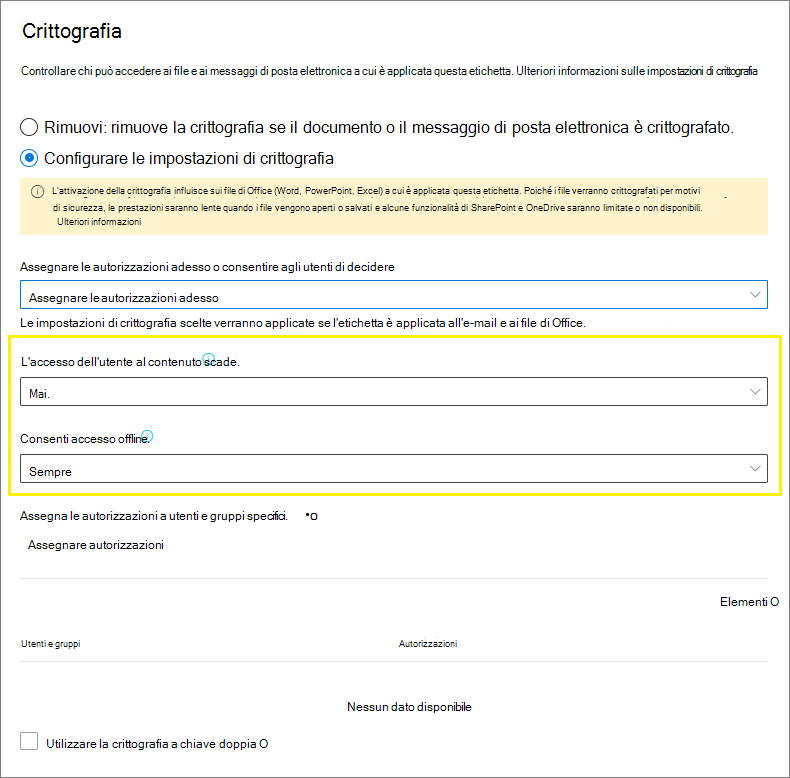

# Limitare l'accesso al contenuto utilizzando la crittografia nelle etichette di riservatezza

>*[Indicazioni per l'assegnazione di licenze di Microsoft 365 per sicurezza e conformità](/office365/servicedescriptions/microsoft-365-service-descriptions/microsoft-365-tenantlevel-services-licensing-guidance/microsoft-365-security-compliance-licensing-guidance).*

Quando si crea un'etichetta di riservatezza, è possibile limitare l'accesso al contenuto a cui verrà applicata l'etichetta. Ad esempio, con le impostazioni di crittografia di un'etichetta di riservatezza, è possibile proteggere i contenuti per determinare le condizioni seguenti:

- Solo gli utenti all'interno dell'organizzazione possono aprire un documento riservato o un messaggio di posta elettronica.
- Solo gli utenti del reparto marketing possono modificare e stampare il documento di annuncio promozione o i messaggi di posta elettronica; tutti gli altri utenti dell'organizzazione possono solo leggerli.
- Gli utenti non possono inoltrare un messaggio di posta elettronica o copiare informazioni da esso contenenti notizie riguardo una riorganizzazione interna.
- Il listino prezzi corrente inviato ai partner commerciali non può essere aperto in seguito a una data specificata.

Quando un documento o un messaggio di posta elettronica è crittografato, l'accesso al contenuto è limitato per fare in modo che si verifichino le condizioni seguenti:

- Può essere decrittografato solo dagli utenti autorizzati in base alle impostazioni di crittografia dell'etichetta.
- Il contenuto rimane crittografato indipendentemente da dove risiede il file, all'interno o all'esterno dell'organizzazione, anche nel caso in cui il file venisse rinominato.
- Il contenuto resta crittografato sia se il file è archiviato (ad esempio, in un account OneDrive) sia se è in transito (ad esempio, un messaggio di posta elettronica che viaggia in Internet).

Infine, quando si configura la crittografia nelle etichette di riservatezza come amministratore, è possibile scegliere di:

- **Assegnare le autorizzazioni adesso**, in modo da determinare esattamente quali utenti ottengono le autorizzazioni per il contenuto con tale etichetta.
- **Consentire agli utenti di assegnare le autorizzazioni** quando applicano l'etichetta al contenuto. In questo modo è possibile consentire agli utenti dell'organizzazione una certa flessibilità, che potrebbe essere necessaria per collaborare e svolgere il proprio lavoro.

Le impostazioni di crittografia sono disponibili quando si [crea un'etichetta di riservatezza](create-sensitivity-labels.md) nel Centro conformità Microsoft 365. È anche possibile usare il portale precedente, ovvero il Centro sicurezza e conformità.

## Come funziona la crittografia

La crittografia usa il servizio Azure Rights Management (Azure RMS) di Azure Information Protection. Questa soluzione di protezione usa criteri di crittografia, identità e autorizzazione. Per ulteriori informazioni, vedere [Informazioni su Azure Rights Management](/azure/information-protection/what-is-azure-rms) nella documentazione di Azure Information Protection. 

Se si usa questa soluzione di crittografia, la caratteristica **utente con privilegi avanzati** garantisce che le persone e i servizi autorizzati possano sempre leggere e controllare i dati crittografati per l'organizzazione. Se necessario, la crittografia può essere rimossa o modificata. Per altre informazioni, vedere [Configurazione di utenti con privilegi avanzati per Azure Information Protection e servizi di individuazione o di ripristino dei dati](/azure/information-protection/configure-super-users).

## Come configurare un'etichetta per la crittografia

1. Seguire le istruzioni generali per [creare o modificare un'etichetta di riservatezza](create-sensitivity-labels.md#create-and-configure-sensitivity-labels) e verificare che sia selezionata l'opzione **File ed e-email** per l'ambito dell'etichetta: 
    
    

2. Quindi, nella pagina **Scegliere le impostazioni di protezione per i file ed e-mail**, assicurarsi di selezionare **Crittografa file ed e-mail**
    
    

4.  Nella pagina **Crittografia** della procedura guidata, selezionare una delle opzioni seguenti:
    
    - **Rimuovi crittografia se il file è crittografato**: questa opzione è supportato solo dal client di etichettatura unificata di Azure Information Protection. Quando si seleziona questa opzione e si usa l'etichettatura predefinita, l'etichetta potrebbe non venire visualizzata nelle app, oppure potrebbe essere visualizzata ma non apportare alcuna modifica crittografia.
        
        Per altre informazioni su questo scenario, vedere la sezione [Cosa succede alla crittografia esistente quando viene applicata un'etichetta](#what-happens-to-existing-encryption-when-a-labels-applied). È importante comprendere che questa impostazione può generare un'etichetta di riservatezza che gli utenti potrebbero non essere in grado di applicare quando non dispongono di autorizzazioni sufficienti.
    
    - **Configurare le impostazioni di crittografia**: attiva la crittografia e rende visibili le impostazioni di crittografia:
        
        
        
        Le istruzioni relative a queste impostazioni si trovano nella seguente sezione[Configurare le impostazioni di crittografia](#configure-encryption-settings).

### Cosa accade alla crittografia esistente in seguito all'applicazione di un'etichetta

Se viene applicata un'etichetta di riservatezza a contenuto non crittografato, il risultato delle opzioni di crittografia selezionabili sarà di chiara interpretazione. Se ad esempio non è stata selezionata **Crittografa file ed e-mail**, il contenuto rimane non crittografato.

Tuttavia, il contenuto potrebbe essere già crittografato. Ad esempio, un altro utente può aver applicato:

- Le proprie autorizzazioni, che includono le autorizzazioni definite dall'utente quando l'etichetta lo richiede, le autorizzazioni personalizzate del client di Azure Information Protection e la protezione del documento **Accesso limitato** da un'app di Office.
- Un modello di protezione Azure Rights Management che consente di crittografare il contenuto in modo indipendente dall'etichetta. Questa categoria include le regole del flusso di posta che applicano la crittografia tramite protezione con diritti.
- Un'etichetta che applica la crittografia con le autorizzazioni assegnate dall'amministratore.

La tabella seguente identifica cosa accade alla crittografia esistente quando si applica un'etichetta di riservatezza a tale contenuto:

| | Crittografia: non selezionata | Crittografia: configurata | Crittografia: rimuovere \* |
|:-----|:-----|:-----|:-----|
|**Autorizzazioni specificate da un utente**|La crittografia originale viene mantenuta|Viene applicata una nuova crittografia dell'etichetta|La crittografia originale viene rimossa|
|**Modello di protezione**|La crittografia originale viene mantenuta|Viene applicata una nuova crittografia dell'etichetta|La crittografia originale viene rimossa|
|**Etichetta con autorizzazioni definite dall'amministratore**|La crittografia originale viene rimossa|Viene applicata una nuova crittografia dell'etichetta|La crittografia originale viene rimossa|

**Nota a piè di pagina:**

\* Supportata solo dal client di etichettatura unificata di Azure Information Protection

Nei casi in cui viene applicata la nuova crittografia dell'etichetta o la crittografia originale viene rimossa, ciò si verifica solo se l'utente che applica l'etichetta dispone di un ruolo o diritto di utilizzo che supporta questa azione:

- Il [diritto di utilizzo](/azure/information-protection/configure-usage-rights#usage-rights-and-descriptions) Esportazione o Controllo completo.
- Il ruolo di [emittente di Rights Management o proprietario di Rights Management](/azure/information-protection/configure-usage-rights#rights-management-issuer-and-rights-management-owner) o [utente con privilegi avanzati](/azure/information-protection/configure-super-users).

Se l'utente non dispone di uno di questi diritti o ruoli, l'etichetta non può essere applicata, quindi la crittografia originale viene mantenuta. L'utente visualizza il messaggio seguente: **Non si dispone dell'autorizzazione per apportare questa modifica all'etichetta di riservatezza. Contattare il proprietario del contenuto.**

Ad esempio, l'utente che applica Non inoltrare a un messaggio di posta elettronica può riapplicare l'etichetta al thread per sostituire o rimuovere la crittografia, perché è proprietario di Rights Management per il messaggio di posta elettronica. Tuttavia, ad eccezione degli utenti con privilegi avanzati, i destinatari di questo messaggio di posta elettronica non possono riapplicarvi etichette, perché non dispongono dei diritti di utilizzo necessari.

#### Allegati di posta elettronica per messaggi di posta elettronica crittografati

Quando un messaggio di posta elettronica viene crittografato con un metodo, tutti i documenti di Office non crittografati allegati al messaggio erediteranno automaticamente le stesse impostazioni di crittografia.

I documenti già crittografati e aggiunti come allegati mantengono sempre la crittografia originale.

## Configurare le impostazioni di crittografia

Se si seleziona **Configura le impostazioni di crittografia** nella pagina **Crittografia** della procedura guidata per creare o modificare un'etichetta di riservatezza, scegliere una delle opzioni seguenti:

- **Assegnare le autorizzazioni adesso**, in modo da determinare esattamente quali utenti ottengono le autorizzazioni per il contenuto con applicata l'etichetta. Per altre informazioni, vedere la sezione successiva [Assegnare le autorizzazioni adesso](#assign-permissions-now).
- **Consentire agli utenti di assegnare le autorizzazioni** quando applicano l'etichetta al contenuto. Con tale opzione è possibile consentire agli utenti dell'organizzazione una certa flessibilità, che potrebbe essere necessaria per collaborare e svolgere il proprio lavoro. Per altre informazioni, vedere la sezione [Consentire agli utenti di assegnare le autorizzazioni](#let-users-assign-permissions) in questa pagina.

Ad esempio, se si ha un'etichetta di riservatezza denominata **Riservatezza elevata** da applicare al contenuto più riservato, è consigliabile decidere ora chi ottiene quali autorizzazioni per il contenuto.

In alternativa, se si ha un'etichetta di riservatezza denominata **Contratti commerciali** e il flusso di lavoro dell'organizzazione richiede che le persone collaborino a questo contenuto con persone diverse e specifiche per ogni caso, è consigliabile consentire agli utenti di decidere chi ottiene le autorizzazioni quando assegnano l'etichetta. Questa flessibilità consente di migliorare la produttività degli utenti e ridurre le richieste rivolte agli amministratori per l’aggiornamento o la creazione di nuove etichette di riservatezza per situazioni specifiche.

Scegliere di assegnare le autorizzazioni adesso o consentire agli utenti di assegnare le autorizzazioni:

## Assegnare le autorizzazioni adesso

Usare le opzioni seguenti per controllare chi può accedere ai documenti e ai messaggi di posta elettronica a cui verrà applicata tale etichetta. È possibile:

- **Consentire l'accesso al contenuto etichettato solo entro una determinata scadenza**, che può essere una data specifica o un determinato numero di giorni dopo che è stata applicata l'etichetta. Al termine di questo periodo, gli utenti non potranno aprire l'elemento etichettato. Se si specifica una data, sarà rispettato il proprio fuso orario corrente. Si noti che alcuni client di posta elettronica potrebbero non applicare la scadenza e mostrare messaggi di posta elettronica che hanno superato la data di scadenza a causa dei meccanismi di memorizzazione nella cache.

- **Consentire l'accesso offline** sempre, mai o per un determinato numero di giorni in seguito all'applicazione dell'etichetta. Se si limita l'accesso offline su mai o per un determinato numero di giorni, al termine di tale intervallo di tempo, ogni utente dovrà ripetere l'autenticazione e registrare il proprio accesso. Per ulteriori informazioni, vedere la sezione successiva riguardo la licenza d'uso di Rights Management.

Impostazioni per il controllo di accesso del contenuto crittografato:

### Licenza d'uso di Rights Management per l'accesso offline

Quando un utente apre un documento o un messaggio di posta elettronica protetto dalla crittografia del servizio Microsoft Azure AD Rights Management, gli viene concessa una licenza d'uso di Azure Rights Management per quel contenuto. Questa licenza d'uso è un certificato che contiene i diritti di utilizzo dell'utente per il documento o il messaggio di posta elettronica e la chiave di crittografia usata per crittografare il contenuto. La licenza d'uso contiene anche una data di scadenza, se impostata, e la durata della validità.

Se non è stata impostata alcuna data di scadenza, il periodo di validità predefinito del contratto di licenza con l'utente finale per un tenant è di 30 giorni. Per la durata della licenza d'uso, all'utente non viene richiesto di ripetere l'autenticazione o specificare una nuova autorizzazione per il contenuto. Questo processo consente all'utente di continuare ad aprire il documento o il messaggio di posta elettronica protetto senza una connessione Internet. Quando scade il periodo di validità della licenza d'uso, al successivo accesso al documento o al messaggio di posta elettronica protetto, l'utente deve ripetere l'autenticazione o specificare una nuova autorizzazione.

Oltre al nuovo processo di autenticazione, vengono valutati nuovamente il gruppo a cui appartiene l'utente e le impostazioni di crittografia. Questo significa che se dopo l'ultimo accesso sono cambiati i criteri o il gruppo di appartenenza dell'utente, anche le autorizzazioni per accedere allo stesso documento o messaggio di posta elettronica potrebbero essere cambiate.

Per ulteriori informazioni su come modificare l'impostazione predefinita di 30 giorni, vedere [Licenza d'uso di Rights Management](/azure/information-protection/configure-usage-rights#rights-management-use-license).

### Assegnare autorizzazioni a utenti o gruppi specifici

È possibile concedere autorizzazioni a utenti specifici in modo che solo essi possano interagire con il contenuto etichettato:

1. Prima di tutto, aggiungere gli utenti o i gruppi a cui verranno assegnate le autorizzazioni per il contenuto etichettato.

2. Quindi scegliere quali autorizzazioni assegnare agli utenti per il contenuto etichettato.

Assegnazione delle autorizzazioni:

#### Aggiungere utenti o gruppi

Quando si assegnano le autorizzazioni, è possibile scegliere:

- Tutti gli utenti dell'organizzazione (tutti i membri del tenant). Questa impostazione include gli account Guest.

- Tutti gli utenti autenticati. Accertarsi di comprendere i [requisiti e le limitazioni](#requirements-and-limitations-for-add-any-authenticated-users) di questa impostazione prima di selezionarla.

- Qualsiasi utente o gruppo di sicurezza abilitato alla posta elettronica, gruppo di distribuzione o gruppo di Microsoft 365 ([denominato in precedenza gruppo di Office 365](https://techcommunity.microsoft.com/t5/microsoft-365-blog/office-365-groups-will-become-microsoft-365-groups/ba-p/1303601)) in Azure AD. Il gruppo Microsoft 365 può avere un'appartenenza statica o [un'appartenenza dinamica](/azure/active-directory/users-groups-roles/groups-create-rule). Non è possibile usare un [gruppo di distribuzione dinamico di Exchange](/Exchange/recipients/dynamic-distribution-groups/dynamic-distribution-groups) perché questo tipo di gruppo non è sincronizzato con Azure AD e non è possibile usare un gruppo di sicurezza abilitato alla posta.

- Qualsiasi indirizzo di posta elettronica o dominio. Usare questa opzione per specificare tutti gli utenti di un'altra organizzazione che usa Azure AD, immettendo qualsiasi nome di dominio di tale organizzazione. Si può usare questa opzione anche per i provider di servizi di social networking immettendo il nome di dominio, ad esempio **gmail.com**, **hotmail.com** o **outlook.com**.

    > [!NOTE]
    > Se si specifica un dominio di un'organizzazione che usa Azure AD, non è possibile limitare l'accesso a quello specifico dominio. Ciò che accade è che vengono automaticamente inclusi tutti i domini verificati in Azure AD per il tenant che possiede il nome di dominio specificato.

Quando si scelgono tutti gli utenti e i gruppi nell'organizzazione o si sfoglia la directory, gli utenti e i gruppi devono avere lo stesso indirizzo di posta elettronica.

È consigliabile utilizzare i gruppi anziché gli utenti, così da mantenere la configurazione più semplice.

##### Requisiti e limitazioni per "Aggiungere tutti gli utenti autenticati"

Questa opzione non limita gli utenti che possono accedere al contenuto crittografato dall'etichetta, anche se crittografa il contenuto e specifica le opzioni per limitare il modo in cui è possibile usarlo (autorizzazioni) e accedervi (scadenza e accesso offline). Tuttavia, l'applicazione che apre il contenuto crittografato deve essere in grado di supportare l'autenticazione in uso. Per questo motivo, i provider di servizi di social networking federati, come Google, e l'autenticazione tramite passcode monouso funzionano solo per la posta elettronica e solo quando si usa Exchange Online. È possibile usare gli account Microsoft con le app di Office 365 e il [visualizzatore Azure Information Protection](https://portal.azurerms.com/#/download).

> [!NOTE]
> È consigliabile usare questa impostazione con l'[integrazione di SharePoint e OneDrive con Azure AD B2B](/sharepoint/sharepoint-azureb2b-integration-preview) quando le etichette di riservatezza sono [abilitate per i file di Office in SharePoint e OneDrive](sensitivity-labels-sharepoint-onedrive-files.md).

Alcuni scenari tipici per l'impostazione di qualsiasi utente autenticate:

- Non interessa chi visualizza il contenuto, ma si desidera limitare il modo in cui questo viene usato. Ad esempio, non si vuole che il contenuto venga modificato, copiato o stampato.
- Non è necessario limitare gli utenti che possono accedere al contenuto, ma si desidera confermare chi può aprirlo.
- Esiste il requisito che il contenuto deve essere crittografato quando inattivo e in transito, ma non sono richiesti controlli di accesso.

#### Scegliere le autorizzazioni

Quando si sceglie quali autorizzazioni assegnare agli utenti o ai gruppi, è possibile selezionare:

- Un [livello di autorizzazione predefinito](/azure/information-protection/configure-usage-rights#rights-included-in-permissions-levels) con un gruppo di diritti preimpostato, ad esempio Coautore o Revisore.
- Autorizzazioni personalizzate, in cui è possibile scegliere uno o più diritti di utilizzo.

Per altre informazioni su come selezionare le autorizzazioni appropriate, vedere [Diritti di utilizzo e relative descrizioni](/azure/information-protection/configure-usage-rights#usage-rights-and-descriptions).  

Si noti che la stessa etichetta può concedere autorizzazioni diverse a vari utenti. Ad esempio, una singola etichetta può assegnare alcuni utenti come Revisore e un altro utente come Coautore, come mostrato nello screenshot seguente.

Per eseguire questa operazione, aggiungere utenti o gruppi, assegnargli le autorizzazioni e salvare le impostazioni. Quindi ripetere questi passaggi, aggiungendo utenti e assegnando loro le autorizzazioni, salvando le impostazioni ogni volta. È possibile ripetere questa configurazione con la frequenza desiderata, in modo da poter definire autorizzazioni diverse per utenti diversi.

#### L'emittente di Rights Management (l'utente che applica l'etichetta di riservatezza) dispone sempre dell'autorizzazione Controllo completo

La crittografia per un'etichetta di riservatezza usa il servizio Microsoft Azure AD Rights Management di Azure Information Protection. Quando un utente applica un'etichetta di riservatezza per proteggere un documento o un messaggio di posta elettronica utilizzando la crittografia, l'utente diventa l'emittente di Rights Management per quel contenuto.

All'emittente di Rights Management sono sempre concesse le autorizzazioni di controllo completo per il documento o messaggio di posta elettronica. Inoltre:

- Se le impostazioni di crittografia includono una data di scadenza, l'emittente di Rights Management può comunque aprire e modificare il documento o il messaggio di posta elettronica in seguito a tale data.
- L'emittente di Rights Management può sempre accedere offline al documento o al messaggio di posta elettronica.
- L'emittente di Rights Management può aprire un documento anche se è stato revocato.

Per ulteriori informazioni, vedere [Emittente di Rights Management e proprietario di Rights Management](/azure/information-protection/configure-usage-rights#rights-management-issuer-and-rights-management-owner).

### Crittografia a chiave doppia

> [!NOTE]
> Al momento la funzionalità è supportata solo dal client di etichettatura unificata di Azure Information Protection.

Selezionare questa opzione solo dopo aver configurato il servizio di crittografia a chiave doppia e sarà necessario usare questa crittografia a chiave doppia per i file a cui è applicata questa l'etichetta.

Per altre informazioni, prerequisiti e istruzioni di configurazione, vedere [Crittografia a chiave doppia](double-key-encryption.md).

## Consentire agli utenti di assegnare le autorizzazioni

> [!IMPORTANT]
> Non tutti i client di etichettatura supportano tutte le opzioni che consentono agli utenti di assegnare le loro autorizzazioni. Usare questa sezione per altre informazioni.

È possibile usare le opzioni seguenti per consentire agli utenti di assegnare autorizzazioni quando applicano manualmente un'etichetta di riservatezza al contenuto:

- In Outlook, un utente può selezionare restrizioni equivalenti all'opzione [Non inoltrare](/azure/information-protection/configure-usage-rights#do-not-forward-option-for-emails) o [Solo crittografia](/azure/information-protection/configure-usage-rights#encrypt-only-option-for-emails) per determinati destinatari.
    
    L'opzione Non inoltrare è supportata da tutti i client di posta elettronica che supportano le etichette di riservatezza. Tuttavia, l'applicazione dell'opzione **Solo crittografia** con un'etichetta di riservatezza è una release recente supportata solo dall'etichettatura integrata e non dal client di etichettatura unificata di Azure Information Protection. L'etichetta non sarà visibile per i client di posta elettronica che non supportano questa funzionalità.
    
    Per controllare la versione minima delle app di Outlook che usano l'etichettatura integrata per supportare l'applicazione dell'opzione Solo crittografia con un'etichetta di riservatezza, usare la [tabella funzionalità per Outlook](sensitivity-labels-office-apps.md#sensitivity-label-capabilities-in-outlook) e la riga **Consenti agli utenti di assegnare autorizzazioni: Solo crittografia**.

- In Word, PowerPoint ed Excel, agli utenti viene chiesto di selezionare le autorizzazioni personalizzate per utenti, gruppi oppure organizzazioni specifici.

    Questa opzione è supportata dal client di etichettatura unificata di Azure Information Protection e da altre app che usano l'etichettatura integrata. Per le app che non supportano questa funzionalità, l'etichetta non sarà visibile agli utenti o sarà visibile per coerenza, ma non potrà essere applicata con un messaggio di spiegazione agli utenti.
    
    Per controllare quali app che usano l'etichettatura integrata supportino questa opzione, usare la [tabella funzionalità per Word, Excel e PowerPoint](sensitivity-labels-office-apps.md#sensitivity-label-capabilities-in-word-excel-and-powerpoint) e la riga **Consenti agli utenti di assegnare autorizzazioni: chiedi agli utenti**.

Se le opzioni sono supportate, usare la tabella seguente per accertarsi se gli utenti visualizzano l'etichetta di riservatezza:

|Impostazione |Etichetta visibile in Outlook|Etichetta visibile in Word, Excel, PowerPoint|
|:-----|:-----|:-----|:-----|
|**In Outlook, applicare restrizioni con le opzioni Non inoltrare o Solo crittografia**|Sì |No |
|**In Word, PowerPoint ed Excel, chiedere agli utenti di specificare le autorizzazioni**|No |Sì|

Se sono selezionate entrambe le impostazioni, l'etichetta sarà visibile sia in Outlook che in Word, Excel e PowerPoint.

Un'etichetta di riservatezza che consente agli utenti di assegnare autorizzazioni deve essere applicata al contenuto manualmente dagli utenti. Non può essere applicata automaticamente o usata come etichetta consigliata.

Configurazione delle autorizzazioni assegnate dall'utente:

### Restrizioni di Outlook

In Outlook, quando un utente applica un'etichetta di riservatezza che consente di assegnare autorizzazioni a un messaggio, è possibile scegliere **l'opzione Non inoltrare** o **Solo crittografia**. Gli utenti vedranno il nome e la descrizione dell'etichetta nella parte superiore del messaggio, il che indica che il contenuto è protetto. Diversamente da Word, PowerPoint ed Excel (vedere la [sezione successiva](#word-powerpoint-and-excel-permissions)), agli utenti non viene chiesto di selezionare autorizzazioni specifiche.

Se una delle due opzioni viene applicata a un messaggio di posta elettronica, il messaggio viene crittografato e i destinatari devono essere autenticati. Quindi, i destinatari dispongono automaticamente di diritti di accesso con limitazioni:

- **Non inoltrare**: i destinatari non possono inoltrare il messaggio di posta elettronica, stamparlo o copiarlo. Ad esempio, nel client Outlook il pulsante Inoltra non è disponibile, le opzioni di menu Salva con nome e Stampa non sono disponibili e non è possibile aggiungere o modificare i destinatari nelle caselle A, Cc o Ccn.
    
    Per altre informazioni su come funziona questa opzione, vedere [Opzione Non inoltrare per i messaggi di posta elettronica](/azure/information-protection/configure-usage-rights#do-not-forward-option-for-emails).

- **Solo crittografia**: i destinatari dispongono di tutti i diritti di utilizzo tranne Salva come, Esporta e Controllo completo. Questa combinazione di diritti di utilizzo significa che i destinatari non hanno restrizioni, tranne quella di non poter rimuovere la protezione. Ad esempio, un destinatario può copiare dall'e-mail, stampare o inoltrare.
    
    Per altre informazioni su come funzioni questa opzione, vedere [Opzione Solo crittografia per i messaggi di posta elettronica](/azure/information-protection/configure-usage-rights#encrypt-only-option-for-emails).

I documenti di Office non crittografati allegati al messaggio di posta elettronica ereditano automaticamente le stesse restrizioni. Per Non inoltrare, i diritti di utilizzo applicati a questi documenti sono Modifica contenuto, Modifica, Salva, Visualizza, Apri, Leggi e Consenti macro. Se l'utente vuole avere diritti di utilizzo diversi per un allegato, o se l'allegato non è un documento di Office che supporta questa protezione ereditata, l'utente deve crittografare il file prima di allegarlo al messaggio di posta elettronica.

### Autorizzazioni per Word, PowerPoint ed Excel

In Word, PowerPoint ed Excel, quando un utente applica un'etichetta di riservatezza che consente di assegnare autorizzazioni a un documento, viene chiesto di specificare le proprie scelte relative a utenti e autorizzazioni se è applicata la crittografia.

Ad esempio, usando il client di etichettatura unificata di Azure Information Protection, gli utenti possono:

- Selezionare un livello di autorizzazione, ad esempio Visualizzatore, che assegna l'autorizzazione Solo visualizzazione, o Coautore, che assegna le autorizzazioni di visualizzazione, modifica, copia e stampa.
- Selezionare utenti, gruppi o organizzazioni. Questo può includere persone sia interne che esterne alle organizzazioni.
- Impostare una data di scadenza, dopodiché gli utenti selezionati non potranno accedere al contenuto. Per altre informazioni, vedere la sezione precedente [Licenza d’uso di Rights Management per l'accesso offline](#rights-management-use-license-for-offline-access).

Per l'etichettatura predefinita, gli utenti visualizzano la stessa finestra di dialogo se selezionano quanto segue:

- Windows: scheda **File** > **Info** > **Proteggi documento** > **Limita l'accesso** > **Accesso limitato**

- MacOS: scheda **Revisione** > **Protezione** > **Autorizzazioni** > **Accesso limitato**

## Configurazioni di esempio per le impostazioni di crittografia

Per ogni esempio che segue, eseguire la configurazione dalla pagina **Crittografia** della procedura guidata quando **Configura impostazioni crittografia** è selezionato:

### Esempio 1: etichetta che applica Non inoltrare per inviare un messaggio di posta elettronica crittografato a un account Gmail

Questa etichetta viene visualizzata solo in Outlook e Outlook sul Web ed è necessario usare Exchange Online. Indicare agli utenti di selezionare questa etichetta quando devono inviare un messaggio di posta elettronica crittografato a persone che usano un account di Gmail o qualsiasi altro account di posta elettronica all'esterno dell'organizzazione.

Gli utenti digitano l'indirizzo di posta elettronica di Gmail nella casella **A**.  Quindi, selezionano l'etichetta e l'opzione Non inoltrare viene aggiunta automaticamente al messaggio. Il risultato è che i destinatari non possono inoltrare il messaggio di posta elettronica né stamparlo, copiarlo o salvarlo all'esterno della propria cassetta postale usando l'opzione **Salva con nome**.

1. Nella pagina **Crittografia**: per **Assegnare le autorizzazioni ora o consentire agli utenti di decidere?** selezionare **Consentire agli utenti di assegnare le autorizzazioni quando applicano l'etichetta**.

2. Selezionare la casella di controllo: .**In Outlook, applicare le restrizioni equivalenti all'opzione Non inoltrare**.

3. Se è selezionata, deselezionare la casella di controllo **Richiedere agli utenti di specificare le autorizzazioni in Word, PowerPoint ed Excel**.

4. Selezionare **Avanti** e completare la procedura guidata.

### Esempio 2: etichetta che limita l'autorizzazione di sola lettura a tutti gli utenti di un'altra organizzazione

Questa etichetta è adatta per la condivisione di documenti molto sensibili come di sola lettura e per la visualizzazione dei documenti è sempre richiesta una connessione Internet.

Questa etichetta non è adatta ai messaggi di posta elettronica.

1. Nella pagina **Crittografia**: per **Assegnare le autorizzazioni ora o consentire agli utenti di decidere?** selezionare **Assegnare ora le autorizzazioni**.

2. Per **Consentire accesso offline**, selezionare **Mai**.

3. Selezionare **Assegna autorizzazioni**.

4. Nel riquadro **Assegna autorizzazioni** selezionare **Aggiungi indirizzi di posta elettronica o domini specifici**.

5. Nella casella di testo immettere il nome di un dominio dell'altra organizzazione, ad esempio **fabrikam.com**. Selezionare **Aggiungi**.

6. Fare clic su **Scegli autorizzazioni**.

7. Nel riquadro **Scegli autorizzazioni**, selezionare la casella a discesa, selezionare **Visualizzatore** e quindi scegliere **Salva**.

8. Tornare al riquadro **Assegna autorizzazioni** e selezionare **Salva**.

9. Nella pagina **Crittografia** selezionare **Avanti** e completare la procedura guidata.

### Esempio 3: aggiungere utenti esterni a un'etichetta esistente che crittografa il contenuto

I nuovi utenti aggiunti potranno aprire i documenti e i messaggi di posta elettronica che sono già stati protetti con questa etichetta. Le autorizzazioni concesse a questi utenti possono essere diverse da quelle degli utenti esistenti.

1. Nella pagina **Crittografia**: per **Assegnare le autorizzazioni ora o consentire agli utenti di decidere?** assicurarsi che sia selezionato **Assegnare ora le autorizzazioni**.

2. Selezionare **Assegna autorizzazioni**.

3. Nel riquadro **Assegna autorizzazioni** selezionare **Aggiungi indirizzi di posta elettronica o domini specifici**.

4. Nella casella di testo immettere l'indirizzo di posta elettronica del primo utente o gruppo da aggiungere e quindi selezionare **Aggiungi**.

5. Fare clic su **Scegli autorizzazioni**.

6. Nel riquadro **Scegli autorizzazioni**, selezionare le autorizzazioni per questo utente o gruppo e quindi scegliere **Salva**.

7. Tornare al riquadro **Assegna autorizzazioni** e ripetere i passaggi da 3 a 6 per ogni utente o gruppo che si vuole aggiungere all'etichetta. Fare quindi clic su **Salva**.

8. Nella pagina **Crittografia** selezionare **Avanti** e completare la procedura guidata.

### Esempio 4: etichetta che crittografa il contenuto, ma non limita gli utenti che possono accedervi

Questa configurazione offre il vantaggio che non è necessario specificare utenti, gruppi o domini per crittografare un messaggio di posta elettronica o un documento. Il contenuto continuerà a essere crittografato e sarà comunque possibile specificare i diritti di utilizzo, una data di scadenza e l'accesso offline.

Usare questa configurazione solo se non è necessario limitare l'accesso al documento o al messaggio di posta elettronica protetto. [Altre informazioni su questa impostazione](#requirements-and-limitations-for-add-any-authenticated-users)

1. Nella pagina **Crittografia**: per **Assegnare le autorizzazioni ora o consentire agli utenti di decidere?** assicurarsi che sia selezionato **Assegnare ora le autorizzazioni**.

2. Configurare le impostazioni per **L'accesso utente al contenuto scade** e **Consentire accesso offline** se necessario.

3. Selezionare **Assegna autorizzazioni**.

4. Nel riquadro **Assegna autorizzazioni** selezionare **Aggiungi qualsiasi utente autenticato**.

    Per **Utenti e gruppi**, vengono visualizzati gli **Utenti autenticati** aggiunti automaticamente. Non è possibile modificare questo valore, ma solo eliminarlo, annullando di conseguenza la selezione **Aggiungi qualsiasi utente autenticato**.

5. Fare clic su **Scegli autorizzazioni**.

6. Nel riquadro **Scegli autorizzazioni**, selezionare la casella a discesa, selezionare le autorizzazioni e quindi selezionare **Salva**.

7. Tornare al riquadro **Assegna autorizzazioni** e selezionare **Salva**.

8. Nella pagina **Crittografia** selezionare **Avanti** e completare la procedura guidata.

## Considerazioni sul contenuto crittografato

La crittografia dei documenti e dei messaggi di posta elettronica più sensibili aiuta a garantire che solo gli utenti autorizzati possano accedere a tali dati. Esistono tuttavia alcune considerazioni da tenere presente:

- Se l'organizzazione non ha [abilitato le etichette di riservatezza per i file di Office in SharePoint e OneDrive](sensitivity-labels-sharepoint-onedrive-files.md):

  - L'opzione di ricerca, eDiscovery e Delve non funzioneranno con i file crittografati.
  - I criteri di prevenzione della perdita dei dati funzionano per i metadati dei file crittografati, incluse le informazioni sulle etichette di conservazione, ma non con il contenuto dei file, ad esempio i numeri di carta di credito all'interno dei file.
  - Gli utenti non possono aprire file crittografati con Office sul Web. Quando le etichette di riservatezza per i file di Office in SharePoint e in OneDrive sono abilitate, gli utenti possono usare Office sul Web per aprire file crittografati, con alcune [limitazioni](sensitivity-labels-sharepoint-onedrive-files.md#limitations) che includono la crittografia che è stata applicata con una chiave locale, nota come "hold your own key" o HYOK, la [crittografia a chiave doppia](#double-key-encryption) e la crittografia applicata in modo indipendente da un'etichetta di riservatezza.

- Se vengono condivisi documenti crittografati con utenti esterni all’organizzazione, potrebbe essere necessario creare account guest e modificare i criteri di accesso condizionale. Per altre informazioni, vedere [Condivisione di documenti crittografati con utenti esterni](sensitivity-labels-office-apps.md#support-for-external-users-and-labeled-content).

- Affinché più utenti possano modificare un file crittografato contemporaneamente, devono usare Office per il Web. Se non è questo il caso e il file è già aperto:

  - Nelle app di Office (Windows, Mac, Android e iOS), gli utenti visualizzano il messaggio **File in uso** con il nome della persona che ha estratto il file. Possono quindi visualizzare una copia di sola lettura o salvare e modificare una copia del file e ricevere una notifica quando il file sarà disponibile.
  - In Office per il Web, gli utenti visualizzano un messaggio di errore che indica che non è possibile modificare il documento con altri utenti. Potranno quindi selezionare **Apri in visualizzazione di lettura**.

- La funzionalità [Salvataggio automatico](https://support.office.com/article/what-is-autosave-6d6bd723-ebfd-4e40-b5f6-ae6e8088f7a5) nelle app di Office (Windows, Mac, Android e iOS) è disabilitata per i file crittografati. Gli utenti visualizzano un messaggio che indica che il file dispone di autorizzazioni limitate che è necessario rimuovere prima di poter attivare il salvataggio automatico.

- L'apertura di file crittografati nelle app Office (Windows, Mac, Android e iOS) potrebbe richiedere più tempo.

- Se un'etichetta che applica la crittografia viene aggiunta con un'app Office quando il documento viene [estratto da SharePoint](https://support.microsoft.com/office/check-out-check-in-or-discard-changes-to-files-in-a-library-7e2c12a9-a874-4393-9511-1378a700f6de) e l'utente ignora l'estrazione, il documento resta etichettato e crittografato.

- Le azioni seguenti non sono supportate per i file crittografati dalle app Office (Windows, Mac, Android e iOS) e gli utenti visualizzano un messaggio di errore che indica che si è verificato un problema. Tuttavia, in alternativa è possibile usare la funzionalità di SharePoint:

  - Visualizzare, ripristinare e salvare copie delle versioni precedenti. In alternativa, gli utenti possono eseguire queste azioni usando Office sul Web per [attivare e configurare il controllo delle versioni per un elenco o una raccolta](https://support.office.com/article/enable-and-configure-versioning-for-a-list-or-library-1555d642-23ee-446a-990a-bcab618c7a37).
  - Modificare il nome o il percorso dei file. In alternativa, gli utenti possono [rinominare un file, una cartella o un collegamento in una raccolta documenti](https://support.microsoft.com/office/rename-a-file-folder-or-link-in-a-document-library-bc493c1a-921f-4bc1-a7f6-985ce11bb185) in SharePoint.

Per un'esperienza di collaborazione in file crittografati con etichetta di riservatezza ottimale, si consiglia di usare [etichette di riservatezza per file di Office in SharePoint e OneDrive](sensitivity-labels-sharepoint-onedrive-files.md) e Office per il Web.

## Prerequisiti importanti

Prima di utilizzare la crittografia, potrebbe essere necessario eseguire alcune attività di configurazione.

- Attivazione della protezione di Azure Information Protection
    
    Per la crittografia nelle etichette di riservatezza, il servizio di protezione (Azure Rights Management) di Azure Information Protection deve essere attivato per il tenant. Nei tenant più recenti, questa è l'impostazione predefinita, ma potrebbe essere necessario attivare il servizio manualmente. Per altre informazioni, vedere [Attivazione del servizio di protezione di Azure Information Protection](/azure/information-protection/activate-service).

- Verificare i requisiti di rete
    
    Potrebbe essere necessario apportare alcune modifiche nei dispositivi di rete, ad esempio ai firewall. Per maggiori dettagli, vedere [Firewall e infrastruttura di rete](/azure/information-protection/requirements#firewalls-and-network-infrastructure) dalla documentazione di Azure Information Protection.

- Configurare Exchange per Azure Information Protection
    
    Non è necessario configurare Exchange per Azure Information Protection prima che gli utenti possano applicare etichette in Outlook per crittografare i propri messaggi di posta elettronica. Tuttavia, se Exchange non è configurato per Azure Information Protection, non si hanno a disposizione le funzionalità complete offerte dall'uso della protezione di Microsoft Azure AD Rights Management con Exchange.
    
    Ad esempio, gli utenti non possono visualizzare i messaggi di posta elettronica crittografati sui telefoni cellulari o con Outlook sul Web, i messaggi di posta elettronica crittografati non possono essere indicizzati per la ricerca e non è possibile configurare i criteri di prevenzione della perdita dei dati di Exchange Online per la protezione di Rights Management. 
    
    Per assicurarsi che Exchange possa supportare questi ulteriori scenari, consultare gli articoli seguenti:
    
    - Per Exchange Online, vedere le istruzioni per [Exchange Online: configurazione di IRM](/azure/information-protection/configure-office365#exchangeonline-irm-configuration).
    - Per Exchange locale, è necessario distribuire il [connettore RMS e configurare i server Exchange](/azure/information-protection/deploy-rms-connector). 

## Passaggi successivi

È necessario condividere i propri documenti etichettati e crittografati con persone esterne all’organizzazione?  Vedere [Condivisione di documenti crittografati con utenti esterni](sensitivity-labels-office-apps.md#sharing-encrypted-documents-with-external-users).