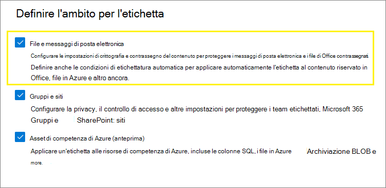
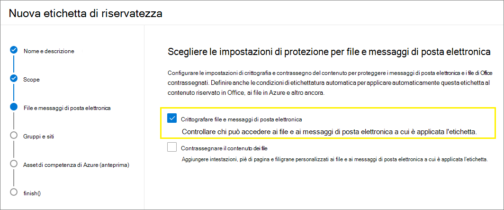
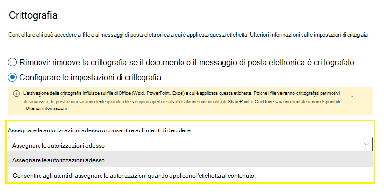
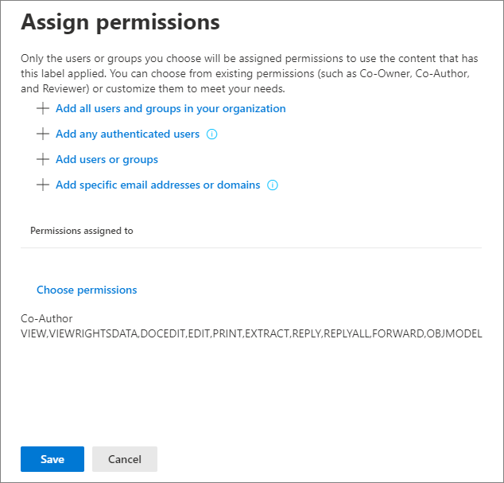
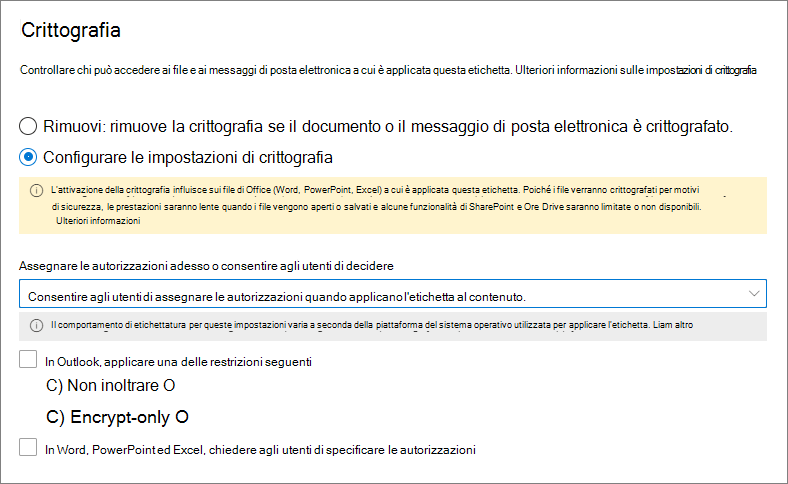

# Limitare l'accesso al contenuto utilizzando la crittografia nelle etichette di riservatezzaRestrict access to content by using sensitivity labels to apply encryption

>*[Indicazioni per l'assegnazione di licenze di Microsoft 365 per sicurezza e conformità](/office365/servicedescriptions/microsoft-365-service-descriptions/microsoft-365-tenantlevel-services-licensing-guidance/microsoft-365-security-compliance-licensing-guidance).**[Microsoft 365 licensing guidance for security & compliance](/office365/servicedescriptions/microsoft-365-service-descriptions/microsoft-365-tenantlevel-services-licensing-guidance/microsoft-365-security-compliance-licensing-guidance).*

Quando si crea un'etichetta di riservatezza, è possibile limitare l'accesso al contenuto a cui verrà applicata l'etichetta. Ad esempio, con le impostazioni di crittografia di un'etichetta di riservatezza, è possibile proteggere i contenuti per determinare le condizioni seguenti:When you create a sensitivity label, you can restrict access to content that the label will be applied to. For example, with the encryption settings for a sensitivity label, you can protect content so that:

- Solo gli utenti all'interno dell'organizzazione possono aprire un documento riservato o un messaggio di posta elettronica.Only users within your organization can open a confidential document or email.
- Solo gli utenti del reparto marketing possono modificare e stampare il documento di annuncio promozione o i messaggi di posta elettronica; tutti gli altri utenti dell'organizzazione possono solo leggerli.Only users in the marketing department can edit and print the promotion announcement document or email, while all other users in your organization can only read it.
- Gli utenti non possono inoltrare un messaggio di posta elettronica o copiare informazioni da esso contenenti notizie riguardo una riorganizzazione interna.Users cannot forward an email or copy information from it that contains news about an internal reorganization.
- Il listino prezzi corrente inviato ai partner commerciali non può essere aperto in seguito a una data specificata.The current price list that is sent to business partners cannot be opened after a specified date.

Quando un documento o un messaggio di posta elettronica è crittografato, l'accesso al contenuto è limitato per fare in modo che si verifichino le condizioni seguenti:When a document or email is encrypted, access to the content is restricted, so that it:

- Può essere decrittografato solo dagli utenti autorizzati in base alle impostazioni di crittografia dell'etichetta.Can be decrypted only by users authorized by the label's encryption settings.
- Il contenuto rimane crittografato indipendentemente da dove risiede il file, all'interno o all'esterno dell'organizzazione, anche nel caso in cui il file venisse rinominato.Remains encrypted no matter where it resides, inside or outside your organization, even if the file's renamed.
- Il contenuto resta crittografato sia se il file è archiviato (ad esempio, in un account OneDrive) sia se è in transito (ad esempio, un messaggio di posta elettronica che viaggia in Internet).Is encrypted both at rest (for example, in a OneDrive account) and in transit (for example, email as it traverses the internet).

Infine, quando si configura la crittografia nelle etichette di riservatezza come amministratore, è possibile scegliere di:Finally, as an admin, when you configure a sensitivity label to apply encryption, you can choose either to:

- **Assegnare le autorizzazioni adesso**, in modo da determinare esattamente quali utenti ottengono le autorizzazioni per il contenuto con tale etichetta.**Assign permissions now**, so that you determine exactly which users get which permissions to content with that label.
- **Consentire agli utenti di assegnare le autorizzazioni** quando applicano l'etichetta al contenuto.**Let users assign permissions** when they apply the label to content. In questo modo è possibile consentire agli utenti dell'organizzazione una certa flessibilità, che potrebbe essere necessaria per collaborare e svolgere il proprio lavoro.This way, you can allow people in your organization some flexibility that they might need to collaborate and get their work done.

Le impostazioni di crittografia sono disponibili quando si [crea un'etichetta di riservatezza](create-sensitivity-labels.md) nel Centro conformità Microsoft 365, nel Centro sicurezza Microsoft 365 o nel Centro sicurezza e conformità.The encryption settings are available when you [create a sensitivity label](create-sensitivity-labels.md) in the Microsoft 365 compliance center, Microsoft 365 security center, or the Security & Compliance Center.

## Come funziona la crittografiaUnderstand how the encryption works

La crittografia usa il servizio Azure Rights Management (Azure RMS) di Azure Information Protection.Encryption uses the Azure Rights Management service (Azure RMS) from Azure Information Protection. Questa soluzione di protezione usa criteri di crittografia, identità e autorizzazione.This protection solution uses encryption, identity, and authorization policies. Per ulteriori informazioni, vedere [Informazioni su Azure Rights Management](/azure/information-protection/what-is-azure-rms) nella documentazione di Azure Information Protection.To learn more, see [What is Azure Rights Management?](/azure/information-protection/what-is-azure-rms) from the Azure Information Protection documentation. 

Se si usa questa soluzione di crittografia, la caratteristica **utente con privilegi avanzati** garantisce che le persone e i servizi autorizzati possano sempre leggere e controllare i dati crittografati per l'organizzazione.When you use this encryption solution, the **super user** feature ensures that authorized people and services can always read and inspect the data that has been encrypted for your organization. Se necessario, la crittografia può essere rimossa o modificata.If necessary, the encryption can then be removed or changed. Per altre informazioni, vedere [Configurazione di utenti con privilegi avanzati per Azure Information Protection e servizi di individuazione o di ripristino dei dati](/azure/information-protection/configure-super-users).For more information, see [Configuring super users for Azure Information Protection and discovery services or data recovery](/azure/information-protection/configure-super-users).

## Come configurare un'etichetta per la crittografiaHow to configure a label for encryption

1. Seguire le istruzioni generali per [creare o modificare un'etichetta di riservatezza](create-sensitivity-labels.md#create-and-configure-sensitivity-labels) e verificare che sia selezionata l'opzione **File ed e-email** per l'ambito dell'etichetta:Follow the general instructions to [create or edit a sensitivity label](create-sensitivity-labels.md#create-and-configure-sensitivity-labels) and make sure **Files & emails** is selected for the label's scope: 
    
    

2. Quindi, nella pagina **Scegliere le impostazioni di protezione per i file ed e-mail**, assicurarsi di selezionare **Crittografa file ed e-mail**Then, on the **Choose protection settings for files and emails** page, make sure you select **Encrypt files and emails**
    
    

4.  Nella pagina **Crittografia** della procedura guidata, selezionare una delle opzioni seguenti:On the **Encryption** page of the wizard, select one of the following options:
    
    - **Rimuovi la crittografia se il file è crittografato**: per altre informazioni su questo scenario, vedere la sezione [Cosa succede alla crittografia esistente quando viene applicata un'etichetta](#what-happens-to-existing-encryption-when-a-labels-applied).**Remove encryption if the file is encrypted**: For more information about this scenario, see the [What happens to existing encryption when a label's applied](#what-happens-to-existing-encryption-when-a-labels-applied) section. È importante comprendere che questa impostazione può generare un'etichetta di riservatezza che gli utenti potrebbero non essere in grado di applicare quando non dispongono di autorizzazioni sufficienti.It's important to understand that this setting can result in a sensitivity label that users might not be able to apply when they don't have sufficient permissions.
    
    - **Configurare le impostazioni di crittografia**: attiva la crittografia e rende visibili le impostazioni di crittografia:**Configure encryption settings**: Turns on encryption and makes the encryption settings visible:
        
        
        
        Le istruzioni relative a queste impostazioni si trovano nella seguente sezione[Configurare le impostazioni di crittografia](#configure-encryption-settings).Instructions for these settings are in the following [Configure encryption settings](#configure-encryption-settings) section.

### Cosa accade alla crittografia esistente in seguito all'applicazione di un'etichettaWhat happens to existing encryption when a label's applied

Se viene applicata un'etichetta di riservatezza a contenuto non crittografato, il risultato delle opzioni di crittografia selezionabili sarà di chiara interpretazione.If a sensitivity label is applied to unencrypted content, the outcome of the encryption options you can select is self-explanatory. Se ad esempio non è stata selezionata **Crittografa file ed e-mail**, il contenuto rimane non crittografato.For example, if you didn't select **Encrypt files and emails**, the content remains unencrypted.

Tuttavia, il contenuto potrebbe essere già crittografato.However, the content might be already encrypted. Ad esempio, un altro utente può aver applicato:For example, another user might have applied:

- Le proprie autorizzazioni, che includono le autorizzazioni definite dall'utente quando l'etichetta lo richiede, le autorizzazioni personalizzate del client di Azure Information Protection e la protezione del documento **Accesso limitato** da un'app di Office.Their own permissions, which include user-defined permissions when prompted by a label, custom permissions by the Azure Information Protection client, and the **Restricted Access** document protection from within an Office app.
- Un modello di protezione Azure Rights Management che consente di crittografare il contenuto in modo indipendente dall'etichetta.An Azure Rights Management protection template that encrypts the content independently from a label. Questa categoria include le regole del flusso di posta che applicano la crittografia tramite protezione con diritti.This category includes mail flow rules that apply encryption by using rights protection.
- Un'etichetta che applica la crittografia con le autorizzazioni assegnate dall'amministratore.A label that applies encryption with permissions assigned by the administrator.

La tabella seguente identifica cosa accade alla crittografia esistente quando si applica un'etichetta di riservatezza a tale contenuto:The following table identifies what happens to existing encryption when a sensitivity label is applied to that content:

| | Crittografia: non selezionataEncryption: Not selected | Crittografia: configurataEncryption: Configured | Crittografia: rimuovereEncryption: Remove |
|:-----|:-----|:-----|:-----|
|**Autorizzazioni specificate da un utente****Permissions specified by a user**|La crittografia originale viene mantenutaOriginal encryption is preserved|Viene applicata una nuova crittografia dell'etichettaNew label encryption is applied|La crittografia originale viene rimossaOriginal encryption is removed|
|**Modello di protezione****Protection template**|La crittografia originale viene mantenutaOriginal encryption is preserved|Viene applicata una nuova crittografia dell'etichettaNew label encryption is applied|La crittografia originale viene rimossaOriginal encryption is removed|
|**Etichetta con autorizzazioni definite dall'amministratore****Label with administator-defined permissions**|La crittografia originale viene rimossaOriginal encryption is removed|Viene applicata una nuova crittografia dell'etichettaNew label encryption is applied|La crittografia originale viene rimossaOriginal encryption is removed|

Si noti che nei casi in cui viene applicata la nuova crittografia dell'etichetta o la crittografia originale viene rimossa, ciò si verifica solo se l'utente che applica l'etichetta dispone di un ruolo o diritto di utilizzo che supporta questa azione:Note that in the cases where the new label encryption is applied or the original encryption is removed, this happens only if the user applying the label has a usage right or role that supports this action:

- Il [diritto di utilizzo](/azure/information-protection/configure-usage-rights#usage-rights-and-descriptions) Esportazione o Controllo completo.The [usage right](/azure/information-protection/configure-usage-rights#usage-rights-and-descriptions) Export or Full Control.
- Il ruolo di [emittente di Rights Management o proprietario di Rights Management](/azure/information-protection/configure-usage-rights#rights-management-issuer-and-rights-management-owner) o [utente con privilegi avanzati](/azure/information-protection/configure-super-users).The role of [Rights Management issuer or Rights Management owner](/azure/information-protection/configure-usage-rights#rights-management-issuer-and-rights-management-owner), or [super user](/azure/information-protection/configure-super-users).

Se l'utente non dispone di uno di questi diritti o ruoli, l'etichetta non può essere applicata, quindi la crittografia originale viene mantenuta.If the user doesn't have one of these rights or roles, the label can't be applied and so the original encryption is preserved. L'utente visualizza il messaggio seguente: **Non si dispone dell'autorizzazione per apportare questa modifica all'etichetta di riservatezza. Contattare il proprietario del contenuto.**The user sees the following message: **You don't have permission to make this change to the sensitivity label. Please contact the content owner.**

Ad esempio, l'utente che applica Non inoltrare a un messaggio di posta elettronica può riapplicare l'etichetta al thread per sostituire o rimuovere la crittografia, perché è proprietario di Rights Management per il messaggio di posta elettronica.For example, the person who applies Do Not Forward to an email message can relabel the thread to replace the encryption or remove it, because they are the Rights Management owner for the email. Tuttavia, ad eccezione degli utenti con privilegi avanzati, i destinatari di questo messaggio di posta elettronica non possono riapplicarvi etichette, perché non dispongono dei diritti di utilizzo necessari.But with the exception of super users, recipients of this email can't relabel it because they don't have the required usage rights.

#### Allegati di posta elettronica per messaggi di posta elettronica crittografatiEmail attachments for encrypted email messages

Quando un messaggio di posta elettronica viene crittografato con un metodo, tutti i documenti di Office non crittografati allegati al messaggio erediteranno automaticamente le stesse impostazioni di crittografia.When an email message is encrypted by any method, any unencrypted Office documents that are attached to the email automatically inherit the same encryption settings.

I documenti già crittografati e aggiunti come allegati mantengono sempre la crittografia originale.Documents that are already encrypted and then added as attachments always preserve their original encryption.

## Configurare le impostazioni di crittografiaConfigure encryption settings

Se si seleziona **Configura le impostazioni di crittografia** nella pagina **Crittografia** della procedura guidata per creare o modificare un'etichetta di riservatezza, scegliere una delle opzioni seguenti:When you select **Configure encryption settings** on the **Encryption** page of the wizard to create or edit a sensitivity label, choose one of the following options:

- **Assegnare le autorizzazioni adesso**, in modo da determinare esattamente quali utenti ottengono le autorizzazioni per il contenuto con applicata l'etichetta.**Assign permissions now**, so that you can determine exactly which users get which permissions to content that has the label applied. Per altre informazioni, vedere la sezione successiva [Assegnare le autorizzazioni adesso](#assign-permissions-now).For more information, see the next section [Assign permissions now](#assign-permissions-now).
- **Consentire agli utenti di assegnare le autorizzazioni** quando applicano l'etichetta al contenuto.**Let users assign permissions** when your users apply the label to content. Con tale opzione è possibile consentire agli utenti dell'organizzazione una certa flessibilità, che potrebbe essere necessaria per collaborare e svolgere il proprio lavoro.With this option, you can allow people in your organization some flexibility that they might need to collaborate and get their work done. Per altre informazioni, vedere la sezione [Consentire agli utenti di assegnare le autorizzazioni](#let-users-assign-permissions) in questa pagina.For more information, see the [Let users assign permissions](#let-users-assign-permissions) section on this page.

Ad esempio, se si ha un'etichetta di riservatezza denominata **Riservatezza elevata** da applicare al contenuto più riservato, è consigliabile decidere ora chi ottiene quali autorizzazioni per il contenuto.For example, if you have a sensitivity label named **Highly Confidential** that will be applied to your most sensitive content, you might want to decide now who gets what type of permissions to that content.

In alternativa, se si ha un'etichetta di riservatezza denominata **Contratti commerciali** e il flusso di lavoro dell'organizzazione richiede che le persone collaborino a questo contenuto con persone diverse e specifiche per ogni caso, è consigliabile consentire agli utenti di decidere chi ottiene le autorizzazioni quando assegnano l'etichetta.Alternatively, if you have a sensitivity label named **Business Contracts**, and your organization's workflow requires that your people collaborate on this content with different people on an ad hoc basis, you might want to allow your users to decide who gets permissions when they assign the label. Questa flessibilità consente di migliorare la produttività degli utenti e ridurre le richieste rivolte agli amministratori per l’aggiornamento o la creazione di nuove etichette di riservatezza per situazioni specifiche.This flexibility both helps your users' productivity and reduces the requests for your admins to update or create new sensitivity labels to address specific scenarios.

Scegliere di assegnare le autorizzazioni adesso o consentire agli utenti di assegnare le autorizzazioni:Choosing whether to assign permissions now or let users assign permissions:

## Assegnare le autorizzazioni adessoAssign permissions now

Usare le opzioni seguenti per controllare chi può accedere ai documenti e ai messaggi di posta elettronica a cui verrà applicata tale etichetta.Use the following options to control who can access email or documents to which this label is applied. È possibile:You can:

- **Consentire l'accesso al contenuto etichettato solo entro una determinata scadenza**, che può essere una data specifica o un determinato numero di giorni dopo che è stata applicata l'etichetta. Al termine di questo periodo, gli utenti non potranno aprire l'elemento etichettato. Se si specifica una data, sarà rispettato il proprio fuso orario corrente. Si noti che alcuni client di posta elettronica potrebbero non applicare la scadenza e mostrare messaggi di posta elettronica che hanno superato la data di scadenza a causa dei meccanismi di memorizzazione nella cache.**Allow access to labeled content to expire**, either on a specific date or after a specific number of days after the label is applied. After this time, users won't be able to open the labeled item. If you specify a date, it is effective midnight on that date in your current time zone. (Note that some email clients might not enforce expiration and show emails past their expiration date, due to their caching mechanisms.)

- **Consentire l'accesso offline** sempre, mai o per un determinato numero di giorni in seguito all'applicazione dell'etichetta. Se si limita l'accesso offline su mai o per un determinato numero di giorni, al termine di tale intervallo di tempo, ogni utente dovrà ripetere l'autenticazione e registrare il proprio accesso. Per ulteriori informazioni, vedere la sezione successiva riguardo la licenza d'uso di Rights Management.**Allow offline access** never, always, or for a specific number of days after the label is applied. If you restrict offline access to never or a number of days, when that threshold is reached, users must be reauthenticated and their access is logged. For more information, see the next section on the Rights Management use license.

Impostazioni per il controllo di accesso del contenuto crittografato:Settings for access control for encrypted content:

### Licenza d'uso di Rights Management per l'accesso offlineRights Management use license for offline access

Quando un utente apre un documento o un messaggio di posta elettronica protetto dalla crittografia del servizio Microsoft Azure AD Rights Management, all'utente viene concessa una licenza d'uso di Azure Rights Management per quel contenuto.When a user opens a document or email that's been protected by encryption from the Azure Rights Management service, an Azure Rights Management use license for that content is granted to the user. Questa licenza d'uso è un certificato che contiene i diritti di utilizzo dell'utente per il documento o il messaggio di posta elettronica e la chiave di crittografia usata per crittografare il contenuto.This use license is a certificate that contains the user's usage rights for the document or email, and the encryption key that was used to encrypt the content. La licenza d'uso contiene anche una data di scadenza, se impostata, e la durata della validità.The use license also contains an expiration date if this has been set, and how long the use license is valid.

Se non è stata impostata alcuna data di scadenza, il periodo di validità predefinito del contratto di licenza con l'utente finale per un tenant è di 30 giorni. Per la durata della licenza d'uso, all'utente non viene richiesto di ripetere l'autenticazione o specificare una nuova autorizzazione per il contenuto. Questo processo consente all'utente di continuare ad aprire il documento o il messaggio di posta elettronica protetto senza una connessione Internet. Quando scade il periodo di validità della licenza d'uso, al successivo accesso al documento o al messaggio di posta elettronica protetto, l'utente deve ripetere l'autenticazione o specificare una nuova autorizzazione.If no expiration date has been set, the default use license validity period for a tenant is 30 days. For the duration of the use license, the user is not reauthenticated or reauthorized for the content. This process lets the user continue to open the protected document or email without an internet connection. When the use license validity period expires, the next time the user accesses the protected document or email, the user must be reauthenticated and reauthorized.

Oltre al nuovo processo di autenticazione, vengono valutati nuovamente il gruppo a cui appartiene l'utente e le impostazioni di crittografia.In addition to reauthentication, the encryption settings and user group membership is reevaluated. Questo significa che, se dopo l'ultimo accesso, sono cambiate le impostazioni di crittografia o è cambiato il gruppo di appartenenza dell'utente, anche le autorizzazioni per accedere allo stesso documento o messaggio di posta elettronica potrebbero essere cambiate.This means that users could experience different access results for the same document or email if there are changes in the encryption settings or group membership from when they last accessed the content.

Per ulteriori informazioni su come modificare l'impostazione predefinita di 30 giorni, vedere [Licenza d'uso di Rights Management](/azure/information-protection/configure-usage-rights#rights-management-use-license).To learn how to change the default 30-day setting, see [Rights Management use license](/azure/information-protection/configure-usage-rights#rights-management-use-license).

### Assegnare autorizzazioni a utenti o gruppi specificiAssign permissions to specific users or groups

È possibile concedere autorizzazioni a utenti specifici in modo che solo essi possano interagire con il contenuto etichettato:You can grant permissions to specific people so that only they can interact with the labeled content:

1. Prima di tutto, aggiungere gli utenti o i gruppi a cui verranno assegnate le autorizzazioni per il contenuto etichettato.First, add users or groups that will be assigned permissions to the labeled content.

2. Quindi scegliere quali autorizzazioni assegnare agli utenti per il contenuto etichettato.Then, choose which permissions those users should have for the labeled content.

Assegnazione delle autorizzazioni:Assigning permissions:

#### Aggiungere utenti o gruppiAdd users or groups

Quando si assegnano le autorizzazioni, è possibile scegliere:When you assign permissions, you can choose:

- Tutti gli utenti dell'organizzazione (tutti i membri del tenant). Questa impostazione include gli account Guest.Everyone in your organization (all tenant members). This setting excludes guest accounts.

- Tutti gli utenti autenticati.Any authenticated users. Accertarsi di comprendere i [requisiti e le limitazioni](#requirements-and-limitations-for-add-any-authenticated-users) di questa impostazione prima di selezionarla.Make sure you understand the [requirements and limitations](#requirements-and-limitations-for-add-any-authenticated-users) of this setting before selecting it.

- Qualsiasi utente o gruppo di sicurezza abilitato alla posta elettronica, gruppo di distribuzione o gruppo di Microsoft 365 ([denominato in precedenza gruppo di Office 365](https://techcommunity.microsoft.com/t5/microsoft-365-blog/office-365-groups-will-become-microsoft-365-groups/ba-p/1303601)) in Azure AD.Any specific user or email-enabled security group, distribution group, or Microsoft 365 group ([formerly Office 365 group](https://techcommunity.microsoft.com/t5/microsoft-365-blog/office-365-groups-will-become-microsoft-365-groups/ba-p/1303601)) in Azure AD. Il gruppo Microsoft 365 può avere un'appartenenza statica o [un'appartenenza dinamica](/azure/active-directory/users-groups-roles/groups-create-rule).The Microsoft 365 group can have static or [dynamic membership](/azure/active-directory/users-groups-roles/groups-create-rule). Non è possibile usare un [gruppo di distribuzione dinamico di Exchange](/Exchange/recipients/dynamic-distribution-groups/dynamic-distribution-groups) perché questo tipo di gruppo non è sincronizzato con Azure AD e non è possibile usare un gruppo di sicurezza abilitato alla posta.Note that you can't use a [dynamic distribution group from Exchange](/Exchange/recipients/dynamic-distribution-groups/dynamic-distribution-groups) because this group type isn't synchronized to Azure AD, and you can't use a security group that isn't email-enabled.

- Qualsiasi indirizzo di posta elettronica o dominio.Any email address or domain. Usare questa opzione per specificare tutti gli utenti di un'altra organizzazione che usa Azure AD, immettendo qualsiasi nome di dominio di tale organizzazione.Use this option to specify all users in another organization who uses Azure AD, by entering any domain name from that organization. Si può usare questa opzione anche per i provider di servizi di social networking immettendo il nome di dominio, ad esempio **gmail.com**, **hotmail.com** o **outlook.com**.You can also use this option for social providers, by entering their domain name such as **gmail.com**, **hotmail.com**, or **outlook.com**.

    > [!NOTE]
    > Se si specifica un dominio di un'organizzazione che usa Azure AD, non è possibile limitare l'accesso a quello specifico dominio.If you specify a domain from an organization that uses Azure AD, you can't restrict access to that specific domain. Ciò che accade è che vengono automaticamente inclusi tutti i domini verificati in Azure AD per il tenant che possiede il nome di dominio specificato.Instead, all verified domains in Azure AD are automatically included for the tenant that owns the domain name you specify.

Quando si scelgono tutti gli utenti e i gruppi nell'organizzazione o si sfoglia la directory, gli utenti e i gruppi devono avere lo stesso indirizzo di posta elettronica.When you choose all users and groups in your organization or browse the directory, the users or groups must have an email address.

È consigliabile utilizzare i gruppi anziché gli utenti, così da mantenere la configurazione più semplice.As a best practice, use groups rather than users. This strategy keeps your configuration simpler.

##### Requisiti e limitazioni per "Aggiungere tutti gli utenti autenticati"Requirements and limitations for "Add any authenticated users"

Questa opzione non limita gli utenti che possono accedere al contenuto crittografato dall'etichetta, anche se crittografa il contenuto e specifica le opzioni per limitare il modo in cui è possibile usarlo (autorizzazioni) e accedervi (scadenza e accesso offline).This setting doesn't restrict who can access the content that the label encrypts, while still encrypting the content and providing you with options to restrict how the content can be used (permissions), and accessed (expiry and offline access). Tuttavia, l'applicazione che apre il contenuto crittografato deve essere in grado di supportare l'autenticazione in uso.However, the application opening the encrypted content must be able to support the authentication being used. Per questo motivo, i provider di servizi di social networking federati, come Google, e l'autenticazione tramite passcode monouso funzionano solo per la posta elettronica e solo quando si usa Exchange Online.For this reason, federated social providers such as Google, and onetime passcode authentication work for email only, and only when you use Exchange Online. È possibile usare gli account Microsoft con le app di Office 365 e il [visualizzatore Azure Information Protection](https://portal.azurerms.com/#/download).Microsoft accounts can be used with Office 365 apps and the [Azure Information Protection viewer](https://portal.azurerms.com/#/download).

> [!NOTE]
> È consigliabile usare questa impostazione con l'[integrazione di SharePoint e OneDrive con Azure AD B2B](/sharepoint/sharepoint-azureb2b-integration-preview) quando le etichette di riservatezza sono [abilitate per i file di Office in SharePoint e OneDrive](sensitivity-labels-sharepoint-onedrive-files.md).Consider using this setting with [SharePoint and OneDrive integration with Azure AD B2B](/sharepoint/sharepoint-azureb2b-integration-preview) when sensitivity labels are [enabled for Office files in SharePoint and OneDrive](sensitivity-labels-sharepoint-onedrive-files.md).

Alcuni scenari tipici per l'impostazione di qualsiasi utente autenticate:Some typical scenarios for any authenticated users setting:

- Non interessa chi visualizza il contenuto, ma si desidera limitare il modo in cui questo viene usato.You don't mind who views the content, but you want to restrict how it is used. Ad esempio, non si vuole che il contenuto venga modificato, copiato o stampato.For example, you don't want the content to be edited, copied, or printed.
- Non è necessario limitare gli utenti che possono accedere al contenuto, ma si desidera confermare chi può aprirlo.You don't need to restrict who accesses the content, but you want to be able to confirm who opens it.
- Esiste il requisito che il contenuto deve essere crittografato quando inattivo e in transito, ma non sono richiesti controlli di accesso.You have a requirement that the content must be encrypted at rest and in transit, but it doesn't require access controls.

#### Scegliere le autorizzazioniChoose permissions

Quando si sceglie quali autorizzazioni assegnare agli utenti o ai gruppi, è possibile selezionare:When you choose which permissions to allow for those users or groups, you can select either:

- Un [livello di autorizzazione predefinito](/azure/information-protection/configure-usage-rights#rights-included-in-permissions-levels) con un gruppo di diritti preimpostato, ad esempio Coautore o Revisore.A [predefined permissions level](/azure/information-protection/configure-usage-rights#rights-included-in-permissions-levels) with a preset group of rights, such as Co-Author or Reviewer.
- Autorizzazioni personalizzate, in cui è possibile scegliere uno o più diritti di utilizzo.Custom permissions, where you choose one or more usage rights.

Per altre informazioni su come selezionare le autorizzazioni appropriate, vedere [Diritti di utilizzo e relative descrizioni](/azure/information-protection/configure-usage-rights#usage-rights-and-descriptions).For more information to help you select the appropriate permissions, see [Usage rights and descriptions](/azure/information-protection/configure-usage-rights#usage-rights-and-descriptions).  

Si noti che la stessa etichetta può concedere autorizzazioni diverse a vari utenti. Ad esempio, una singola etichetta può assegnare alcuni utenti come Revisore e un altro utente come Coautore, come mostrato nello screenshot seguente.Note that the same label can grant different permissions to different users. For example, a single label can assign some users as Reviewer and a different user as Co-author, as shown in the following screenshot.

Per eseguire questa operazione, aggiungere utenti o gruppi, assegnargli le autorizzazioni e salvare le impostazioni. Quindi ripetere questi passaggi, aggiungendo utenti e assegnando loro le autorizzazioni, salvando le impostazioni ogni volta. È possibile ripetere questa configurazione con la frequenza desiderata, in modo da poter definire autorizzazioni diverse per utenti diversi.To do this, add users or groups, assign them permissions, and save those settings. Then repeat these steps, adding users and assigning them permissions, saving the settings each time. You can repeat this configuration as often as necessary, to define different permissions for different users.

#### L'emittente di Rights Management (l'utente che applica l'etichetta di riservatezza) dispone sempre dell'autorizzazione Controllo completoRights Management issuer (user applying the sensitivity label) always has Full Control

La crittografia per un'etichetta di riservatezza usa il servizio Azure Rights Management (Azure RMS) di Azure Information Protection.Encryption for a sensitivity label uses the Azure Rights Management service from Azure Information Protection. Quando un utente applica un'etichetta di riservatezza per proteggere un documento o un messaggio di posta elettronica utilizzando la crittografia, l'utente diventa l'emittente di Rights Management per quel contenuto.When a user applies a sensitivity label to protect a document or email by using encryption, that user becomes the Rights Management issuer for that content.

All'emittente di Rights Management sono sempre concesse le autorizzazioni di controllo completo per il documento o messaggio di posta elettronica. Inoltre:The Rights Management issuer is always granted Full Control permissions for the document or email, and in addition:

- Se le impostazioni di crittografia includono una data di scadenza, l'emittente di Rights Management può comunque aprire e modificare il documento o il messaggio di posta elettronica in seguito a tale data.If the encryption settings include an expiration date, the Rights Management issuer can still open and edit the document or email after that date.
- L'emittente di Rights Management può sempre accedere offline al documento o al messaggio di posta elettronica.The Rights Management issuer can always access the document or email offline.
- L'emittente di Rights Management può aprire un documento anche se è stato revocato.The Rights Management issuer can still open a document after it is revoked.

Per ulteriori informazioni, vedere [Emittente di Rights Management e proprietario di Rights Management](/azure/information-protection/configure-usage-rights#rights-management-issuer-and-rights-management-owner).For more information, see [Rights Management issuer and Rights Management owner](/azure/information-protection/configure-usage-rights#rights-management-issuer-and-rights-management-owner).

### Crittografia a chiave doppiaDouble Key Encryption

> [!NOTE]
> Al momento la funzionalità è supportata solo dal client di etichettatura unificata di Azure Information Protection.This feature is currently supported only by the Azure Information Protection unified labeling client.

Selezionare questa opzione solo dopo aver configurato il servizio di crittografia a chiave doppia e sarà necessario usare questa crittografia a chiave doppia per i file a cui è applicata questa l'etichetta.Select this option only after you have configured the Double Key Encryption service and you need to use this double key encryption for files that will have this label applied.

Per altre informazioni, prerequisiti e istruzioni di configurazione, vedere [Crittografia a chiave doppia](double-key-encryption.md).For more information, prerequisites, and configuration instructions, see [Double Key Encryption (DKE)](double-key-encryption.md).

## Consentire agli utenti di assegnare le autorizzazioniLet users assign permissions

> [!IMPORTANT]
> Non tutti i client di etichettatura supportano tutte le opzioni che consentono agli utenti di assegnare le loro autorizzazioni.Not all labeling clients support all the options that let users assign their own permissions. Usare questa sezione per ulteriori informazioni.Use this section to learn more.

È possibile usare queste opzioni per consentire agli utenti di assegnare autorizzazioni quando applicano manualmente un'etichetta di riservatezza al contenuto:You can use these options to let users assign permissions when they manually apply a sensitivity label to content:

- In Outlook, un utente può selezionare restrizioni equivalenti all'opzione [Non inoltrare](/azure/information-protection/configure-usage-rights#do-not-forward-option-for-emails) o [Solo crittografia](/azure/information-protection/configure-usage-rights#encrypt-only-option-for-emails) per determinati destinatari.In Outlook, a user can select restrictions equivalent to the [Do Not Forward](/azure/information-protection/configure-usage-rights#do-not-forward-option-for-emails) option or [Encrypt-only](/azure/information-protection/configure-usage-rights#encrypt-only-option-for-emails) for their chosen recipients.
    
    L'opzione Non inoltrare è supportata da tutti i client di posta elettronica che supportano le etichette di riservatezza.The Do Not Forward option is supported by all email clients that support sensitivity labels. Tuttavia, l'applicazione dell'opzione **Solo crittografia** con un'etichetta di riservatezza è una release recente supportata solo dall'etichettatura integrata e non dal client di etichettatura unificata di Azure Information Protection.However, applying the **Encrypt-Only** option with a sensitivity label is a recent release that's supported only by built-in labeling and not the Azure Information Protection unified labeling client. L'etichetta non sarà visibile per i client di posta elettronica che non supportano questa funzionalità.For email clients that don't support this capability, the label won't be visible.
    
    Per controllare quale app Outlook che usa l'etichettatura integrata supporti l'applicazione dell'opzione Solo crittografia con un'etichetta di riservatezza, usare la [tabella funzionalità per Outlook](sensitivity-labels-office-apps.md#sensitivity-label-capabilities-in-outlook) e la riga **Consenti agli utenti di assegnare autorizzazioni: Solo crittografia**.To check which Outlook apps that use built-in labeling support applying the Encrypt-Only option with a sensitivity label, use the [capabilities table for Outlook](sensitivity-labels-office-apps.md#sensitivity-label-capabilities-in-outlook) and the row **Let users assign permissions: - Encrypt-Only**.

- In Word, PowerPoint ed Excel, agli utenti viene chiesto di selezionare le autorizzazioni personalizzate per utenti, gruppi oppure organizzazioni specifici.In Word, PowerPoint, and Excel, a user is prompted to select their own permissions for specific users, groups, or organizations.

    Questa opzione è supportata dal client di etichettatura unificata di Azure Information Protection e da altre app che usano l'etichettatura integrata.This option is supported by the Azure Information Protection unified labeling client and by some apps that use built-in labeling. Per le app che non supportano questa funzionalità, l'etichetta non sarà visibile agli utenti o sarà visibile per coerenza, ma non potrà essere applicata con un messaggio di spiegazione agli utenti.For apps that don't support this capability, the label either won't be visible for users, or the label is visible for consistency but it can't be applied with an explanation message to users.
    
    Per controllare quali app che usano l'etichettatura integrata supportino questa opzione, usare la [tabella funzionalità per Word, Excel e PowerPoint](sensitivity-labels-office-apps.md#sensitivity-label-capabilities-in-word-excel-and-powerpoint) e la riga **Consenti agli utenti di assegnare autorizzazioni: chiedi agli utenti**.To check which apps that use built-in labeling support this option, use the [capabilities table for Word, Excel, and PowerPoint](sensitivity-labels-office-apps.md#sensitivity-label-capabilities-in-word-excel-and-powerpoint) and the row **Let users assign permissions: - Prompt users**.

Se le opzioni sono supportate, usare la tabella seguente per accertarsi se gli utenti visualizzano l'etichetta di riservatezza:When the options are supported, use the following table to identify when users see the sensitivity label:

|ImpostazioneSetting |Etichetta visibile in OutlookLabel visible in Outlook|Etichetta visibile in Word, Excel, PowerPointLabel visible in Word, Excel, PowerPoint|
|:-----|:-----|:-----|:-----|
|**In Outlook, applicare restrizioni con le opzioni Non inoltrare o Solo crittografia****In Outlook, enforce restrictions with the Do Not Forward or Encrypt-Only option**|SìYes |NoNo |
|**In Word, PowerPoint ed Excel, chiedere agli utenti di specificare le autorizzazioni****In Word, PowerPoint, and Excel, prompt users to specify permissions**|NoNo |SìYes|

Se sono selezionate entrambe le impostazioni, l'etichetta sarà visibile sia in Outlook che in Word, Excel e PowerPoint.When both settings are selected, the label is therefore visible in both Outlook and in Word, Excel, and PowerPoint.

Un'etichetta di riservatezza che consente agli utenti di assegnare autorizzazioni deve essere applicata al contenuto manualmente dagli utenti. Non può essere applicata automaticamente o usata come etichetta consigliata.A sensitivity label that lets users assign permissions must be applied to content manually by users; it can't be auto-applied or used as a recommended label.

Configurazione delle autorizzazioni assegnate dall'utente:Configuring the user-assigned permissions:

### Restrizioni di OutlookOutlook restrictions

In Outlook, quando un utente applica un'etichetta di riservatezza che consente di assegnare autorizzazioni a un messaggio, è possibile scegliere **l'opzione Non inoltrare** o **Solo crittografia**.In Outlook, when a user applies a sensitivity label that lets them assign permissions to a message, you can choose the **Do Not Forward option** or **Encrypt-Only**. Gli utenti vedranno il nome e la descrizione dell'etichetta nella parte superiore del messaggio, il che indica che il contenuto è protetto.The user will see the label name and description at the top of the message, which indicates the content's being protected. Diversamente da Word, PowerPoint ed Excel (vedere la [sezione successiva](#word-powerpoint-and-excel-permissions)), agli utenti non viene chiesto di selezionare autorizzazioni specifiche.Unlike Word, PowerPoint, and Excel (see the [next section](#word-powerpoint-and-excel-permissions)), users aren't prompted to select specific permissions.

Se una delle due opzioni viene applicata a un messaggio di posta elettronica, il messaggio viene crittografato e i destinatari devono essere autenticati.When either of these options are applied to an email, the email is encrypted and recipients must be authenticated. Quindi, i destinatari dispongono automaticamente di diritti di accesso con limitazioni:Then, the recipients automatically have restricted usage rights:

- **Non inoltrare**: i destinatari non possono inoltrare il messaggio di posta elettronica, stamparlo o copiarlo.**Do Not Forward**: Recipients cannot forward the email, print it, or copy from it. Ad esempio, nel client Outlook il pulsante Inoltra non è disponibile, le opzioni di menu Salva con nome e Stampa non sono disponibili e non è possibile aggiungere o modificare i destinatari nelle caselle A, Cc o Ccn.For example, in the Outlook client, the Forward button is not available, the Save As and Print menu options are not available, and you cannot add or change recipients in the To, Cc, or Bcc boxes.
    
    Per altre informazioni su come funziona questa opzione, vedere [Opzione Non inoltrare per i messaggi di posta elettronica](https://docs.microsoft.com/azure/information-protection/configure-usage-rights#do-not-forward-option-for-emails).For more information about how this option works, see [Do Not Forward option for emails](https://docs.microsoft.com/azure/information-protection/configure-usage-rights#do-not-forward-option-for-emails).

- **Solo crittografia**: i destinatari dispongono di tutti i diritti di utilizzo tranne Salva come, Esporta e Controllo completo.**Encrypt-Only**: Recipients have all usage rights except Save As, Export and Full Control. Questa combinazione di diritti di utilizzo significa che i destinatari non hanno restrizioni, tranne quella di non poter rimuovere la protezione.This combination of usage rights means that the recipients have no restrictions except that they cannot remove the protection. Ad esempio, un destinatario può copiare dall'e-mail, stampare o inoltrare.For example, a recipient can copy from the email, print it, and forward it.
    
    Per altre informazioni su come funzioni questa opzione, vedere [Opzione Solo crittografia per i messaggi di posta elettronica](https://docs.microsoft.com/azure/information-protection/configure-usage-rights#encrypt-only-option-for-emails).For more information about how this option works, see [Encrypt-only option for emails](https://docs.microsoft.com/azure/information-protection/configure-usage-rights#encrypt-only-option-for-emails).

I documenti di Office non crittografati allegati al messaggio di posta elettronica ereditano automaticamente le stesse restrizioni.Unencrypted Office documents that are attached to the email automatically inherit the same restrictions. Per Non inoltrare, i diritti di utilizzo applicati a questi documenti sono Modifica contenuto, Modifica, Salva, Visualizza, Apri, Leggi e Consenti macro.For Do Not Forward, the usage rights applied to these documents are Edit Content, Edit; Save; View, Open, Read; and Allow Macros. Se l'utente vuole avere diritti di utilizzo diversi per un allegato, o se l'allegato non è un documento di Office che supporta questa protezione ereditata, l'utente deve crittografare il file prima di allegarlo al messaggio di posta elettronica.If the user wants different usage rights for an attachment, or the attachment is not an Office document that supports this inherited protection, the user needs to encrypt the file before attaching it to the email.

### Autorizzazioni per Word, PowerPoint ed ExcelWord, PowerPoint, and Excel permissions

In Word, PowerPoint ed Excel, quando un utente applica un'etichetta di riservatezza che consente di assegnare autorizzazioni a un documento, viene chiesto di specificare le proprie scelte relative a utenti e autorizzazioni se è applicata la crittografia.In Word, PowerPoint, and Excel, when a user applies a sensitivity label that lets them assign permissions to a document, they are prompted to specify their choice of users and permissions when the encryption is applied.

Ad esempio, usando il client di etichettatura unificata di Azure Information Protection, gli utenti possono:For example, with the Azure Information Protection unified labeling client, users can:

- Selezionare un livello di autorizzazione, ad esempio Visualizzatore, che assegna l'autorizzazione Solo visualizzazione, o Coautore, che assegna le autorizzazioni di visualizzazione, modifica, copia e stampa.Select a permission level, such as Viewer (which assigns View Only permission) or Co-Author (which assigns View, Edit, Copy, and Print permissions).
- Selezionare utenti, gruppi o organizzazioni.Select users, groups, or organizations. Questo può includere persone sia interne che esterne alle organizzazioni.This can include people both inside or outside your organizations.
- Impostare una data di scadenza, dopodiché gli utenti selezionati non potranno accedere al contenuto.Set an expiration date, after which the selected users cannot access the content. Per altre informazioni, vedere la sezione precedente [Licenza d’uso di Rights Management per l'accesso offline](#rights-management-use-license-for-offline-access).For more information, see the above section [Rights Management use license for offline access](#rights-management-use-license-for-offline-access).

Per l'etichettatura predefinita, gli utenti visualizzano la stessa finestra di dialogo se selezionano quanto segue:For built-in labeling, users see the same dialog box if they select the following:

- Windows: scheda **File** > **Info** > **Proteggi documento** > **Limita l'accesso** > **Accesso limitato**Windows: **File** tab > **Info** > **Protect Document** > **Restrict Access** > **Restricted Access**

- MacOS: scheda **Revisione** > **Protezione** > **Autorizzazioni** > **Accesso limitato**macOS: **Review** tab > **Protection** > **Permissions** > **Restricted Access**

## Configurazioni di esempio per le impostazioni di crittografiaExample configurations for the encryption settings

Per ogni esempio che segue, eseguire la configurazione dalla pagina **Crittografia** della procedura guidata quando **Configura impostazioni crittografia** è selezionato:For each example that follows, do the configuration from the **Encryption** page of the wizard when **Configure encryption settings** is selected:

### Esempio 1: etichetta che applica Non inoltrare per inviare un messaggio di posta elettronica crittografato a un account GmailExample 1: Label that applies Do Not Forward to send an encrypted email to a Gmail account

Questa etichetta viene visualizzata solo in Outlook e Outlook sul Web ed è necessario usare Exchange Online.This label displays only in Outlook and Outlook on the web, and you must use Exchange Online. Indicare agli utenti di selezionare questa etichetta quando devono inviare un messaggio di posta elettronica crittografato a persone che usano un account di Gmail o qualsiasi altro account di posta elettronica all'esterno dell'organizzazione.Instruct users to select this label when they need to send an encrypted email to people using a Gmail account (or any other email account outside your organization).

Gli utenti digitano l'indirizzo di posta elettronica di Gmail nella casella **A**.Your users type the Gmail email address in the **To** box.  Quindi, selezionano l'etichetta e l'opzione Non inoltrare viene aggiunta automaticamente al messaggio.Then, they select the label and the Do Not Forward option is automatically added to the email. Il risultato è che i destinatari non possono inoltrare il messaggio di posta elettronica né stamparlo, copiarlo o salvarlo all'esterno della propria cassetta postale usando l'opzione **Salva con nome**.The result is that recipients cannot forward the email, or print it, copy from it, or save the email outside their mailbox by using the **Save As** option.

1. Nella pagina **Crittografia**: per **Assegnare le autorizzazioni ora o consentire agli utenti di decidere?** selezionare **Consentire agli utenti di assegnare le autorizzazioni quando applicano l'etichetta**.On the **Encryption** page: For **Assign permissions now or let users decide?** select **Let users assign permissions when they apply the label**.

2. Selezionare la casella di controllo: .**In Outlook, applicare le restrizioni equivalenti all'opzione Non inoltrare**.Select the checkbox: **In Outlook, enforce restrictions equivalent to the Do Not Forward option**.

3. Se è selezionata, deselezionare la casella di controllo **Richiedere agli utenti di specificare le autorizzazioni in Word, PowerPoint ed Excel**.If selected, clear the checkbox: **In Word, PowerPoint, and Excel, prompt users to specify permissions**.

4. Selezionare **Avanti** e completare la procedura guidata.Select **Next** and complete the wizard.

### Esempio 2: etichetta che limita l'autorizzazione di sola lettura a tutti gli utenti di un'altra organizzazioneExample 2: Label that restricts read-only permission to all users in another organization

Questa etichetta è adatta per la condivisione di documenti molto sensibili come di sola lettura e per la visualizzazione dei documenti è sempre richiesta una connessione Internet.This label is suitable for sharing very sensitive documents as read-only, and the documents always require an internet connection to view them.

Questa etichetta non è adatta ai messaggi di posta elettronica.This label is not suitable for emails.

1. Nella pagina **Crittografia**: per **Assegnare le autorizzazioni ora o consentire agli utenti di decidere?** selezionare **Assegnare ora le autorizzazioni**.On the **Encryption** page: For **Assign permissions now or let users decide?** select **Assign permissions now**.

2. Per **Consentire accesso offline**, selezionare **Mai**.For **Allow offline access**, select **Never**.

3. Selezionare **Assegna autorizzazioni**.Select **Assign permissions**.

4. Nel riquadro **Assegna autorizzazioni** selezionare **Aggiungi indirizzi di posta elettronica o domini specifici**.On the **Assign permissions** pane, select **Add specific email addresses or domains**.

5. Nella casella di testo immettere il nome di un dominio dell'altra organizzazione, ad esempio **fabrikam.com**.In the text box, enter the name of a domain from the other organization, for example, **fabrikam.com**. Selezionare **Aggiungi**.Then select **Add**.

6. Fare clic su **Scegli autorizzazioni**.Select **Choose permissions**.

7. Nel riquadro **Scegli autorizzazioni**, selezionare la casella a discesa, selezionare **Visualizzatore** e quindi scegliere **Salva**.On the **Choose permissions** pane, select the dropdown box, select **Viewer**, and then select **Save**.

8. Tornare al riquadro **Assegna autorizzazioni** e selezionare **Salva**.Back on the **Assign Permissions** pane, select **Save**.

9. Nella pagina **Crittografia** selezionare **Avanti** e completare la procedura guidata.On the **Encryption** page, select **Next** and complete the wizard.

### Esempio 3: aggiungere utenti esterni a un'etichetta esistente che crittografa il contenutoExample 3: Add external users to an existing label that encrypts content

I nuovi utenti aggiunti potranno aprire i documenti e i messaggi di posta elettronica che sono già stati protetti con questa etichetta.The new users that you add will be able open documents and emails that have already been protected with this label. Le autorizzazioni concesse a questi utenti possono essere diverse da quelle degli utenti esistenti.The permissions that you grant these users can be different from the permissions that the existing users have.

1. Nella pagina **Crittografia**: per **Assegnare le autorizzazioni ora o consentire agli utenti di decidere?** assicurarsi che sia selezionato **Assegnare ora le autorizzazioni**.On the **Encryption** page: For **Assign permissions now or let users decide?** make sure **Assign permissions now** is selected.

2. Selezionare **Assegna autorizzazioni**.Select **Assign permissions**.

3. Nel riquadro **Assegna autorizzazioni** selezionare **Aggiungi indirizzi di posta elettronica o domini specifici**.On the **Assign permissions** pane, select **Add specific email addresses or domains**.

4. Nella casella di testo immettere l'indirizzo di posta elettronica del primo utente o gruppo da aggiungere e quindi selezionare **Aggiungi**.In the text box, enter the email address of the first user (or group) to add, and then select **Add**.

5. Fare clic su **Scegli autorizzazioni**.Select **Choose permissions**.

6. Nel riquadro **Scegli autorizzazioni**, selezionare le autorizzazioni per questo utente o gruppo e quindi scegliere **Salva**.On the **Choose permissions** pane, select the permissions for this user (or group), and then select **Save**.

7. Tornare al riquadro **Assegna autorizzazioni** e ripetere i passaggi da 3 a 6 per ogni utente o gruppo che si vuole aggiungere all'etichetta.Back on the **Assign Permissions** pane, repeat steps 3 through 6 for each user (or group) that you want to add to this label. Fare quindi clic su **Salva**.Then click **Save**.

8. Nella pagina **Crittografia** selezionare **Avanti** e completare la procedura guidata.On the **Encryption** page, select **Next** and complete the wizard.

### Esempio 4: etichetta che crittografa il contenuto, ma non limita gli utenti che possono accederviExample 4: Label that encrypts content but doesn't restrict who can access it

Questa configurazione offre il vantaggio che non è necessario specificare utenti, gruppi o domini per crittografare un messaggio di posta elettronica o un documento.This configuration has the advantage that you don't need to specify users, groups, or domains to encrypt an email or document. Il contenuto continuerà a essere crittografato e sarà comunque possibile specificare i diritti di utilizzo, una data di scadenza e l'accesso offline.The content will still be encrypted and you can still specify usage rights, an expiry date, and offline access.

Usare questa configurazione solo se non è necessario limitare l'accesso al documento o al messaggio di posta elettronica protetto.Use this configuration only when you do not need to restrict who can open the protected document or email. [Altre informazioni su questa impostazioneMore information about this setting](#requirements-and-limitations-for-add-any-authenticated-users)

1. Nella pagina **Crittografia**: per **Assegnare le autorizzazioni ora o consentire agli utenti di decidere?** assicurarsi che sia selezionato **Assegnare ora le autorizzazioni**.On the **Encryption** page: For **Assign permissions now or let users decide?** make sure **Assign permissions now** is selected.

2. Configurare le impostazioni per **L'accesso utente al contenuto scade** e **Consentire accesso offline** se necessario.Configure settings for **User access to content expires** and **Allow offline access** as required.

3. Selezionare **Assegna autorizzazioni**.Select **Assign permissions**.

4. Nel riquadro **Assegna autorizzazioni** selezionare **Aggiungi qualsiasi utente autenticato**.On the **Assign permissions** pane, select **Add any authenticated users**.

    Per **Utenti e gruppi**, vengono visualizzati gli **Utenti autenticati** aggiunti automaticamente.For **Users and groups**, you see **Authenticated users** automatically added. Non è possibile modificare questo valore, ma solo eliminarlo, annullando di conseguenza la selezione **Aggiungi qualsiasi utente autenticato**.You can't change this value, only delete it, which cancels the **Add any authenticated users** selection.

5. Fare clic su **Scegli autorizzazioni**.Select **Choose permissions**.

6. Nel riquadro **Scegli autorizzazioni**, selezionare la casella a discesa, selezionare le autorizzazioni e quindi selezionare **Salva**.On the **Choose permissions** pane, select the dropdown box, select the permissions you want, and then select **Save**.

7. Tornare al riquadro **Assegna autorizzazioni** e selezionare **Salva**.Back on the **Assign Permissions** pane, select **Save**.

8. Nella pagina **Crittografia** selezionare **Avanti** e completare la procedura guidata.On the **Encryption** page, select **Next** and complete the wizard.

## Considerazioni sul contenuto crittografatoConsiderations for encrypted content

La crittografia dei documenti e dei messaggi di posta elettronica più sensibili aiuta a garantire che solo gli utenti autorizzati possano accedere a tali dati.Encrypting your most sensitive documents and emails helps to ensure that only authorized people can access this data. Esistono tuttavia alcune considerazioni da tenere presente:However, there are some considerations to take into account:

- Se l'organizzazione non ha [abilitato le etichette di riservatezza per i file di Office in SharePoint e OneDrive](sensitivity-labels-sharepoint-onedrive-files.md):If your organization hasn't [enabled sensitivity labels for Office files in SharePoint and OneDrive](sensitivity-labels-sharepoint-onedrive-files.md):

  - L'opzione di ricerca, eDiscovery e Delve non funzioneranno con i file crittografati.Search, eDiscovery, and Delve will not work for encrypted files.
  - I criteri di prevenzione della perdita dei dati funzionano per i metadati dei file crittografati, incluse le informazioni sulle etichette di conservazione, ma non con il contenuto dei file, ad esempio i numeri di carta di credito all'interno dei file.DLP policies work for the metadata of these encrypted files (including retention label information) but not the content of these files (such as credit card numbers within files).
  - Gli utenti non possono aprire file crittografati con Office sul Web.Users can't open encrypted files using Office on the web. Quando le etichette di riservatezza per i file di Office in SharePoint e in OneDrive sono abilitate, gli utenti possono usare Office sul Web per aprire file crittografati, con alcune [limitazioni](sensitivity-labels-sharepoint-onedrive-files.md#limitations) che includono la crittografia che è stata applicata con una chiave locale, nota come "hold your own key" o HYOK, la [crittografia a chiave doppia](#double-key-encryption) e la crittografia applicata in modo indipendente da un'etichetta di riservatezza.When sensitivity labels for Office files in SharePoint and OneDrive are enabled, users can use Office on the web to open encrypted files, with some [limitations](sensitivity-labels-sharepoint-onedrive-files.md#limitations) that include encryption that has been applied with an on-premises key (known as "hold your own key", or HYOK), [double key encryption](#double-key-encryption), and encryption that has been applied independently from a sensitivity label.

- Se vengono condivisi documenti crittografati con utenti esterni all’organizzazione, potrebbe essere necessario creare account guest e modificare i criteri di accesso condizionale.If you share encrypted documents with people outside your organization, you might need to create guest accounts and modify Conditional Access policies. Per altre informazioni, vedere [Condivisione di documenti crittografati con utenti esterni](sensitivity-labels-office-apps.md#support-for-external-users-and-labeled-content).For more information, see [Sharing encrypted documents with external users](sensitivity-labels-office-apps.md#support-for-external-users-and-labeled-content).

- Affinché più utenti possano modificare un file crittografato contemporaneamente, devono usare Office per il Web.For multiple users to edit an encrypted file at the same time, they must all be using Office for the web. Se non è questo il caso e il file è già aperto:If this isn't the case, and the file is already open:

  - Nelle app di Office (Windows, Mac, Android e iOS), gli utenti visualizzano il messaggio **File in uso** con il nome della persona che ha estratto il file.In Office apps (Windows, Mac, Android, and iOS), users see a **File In Use** message with the name of the person who has checked out the file. Possono quindi visualizzare una copia di sola lettura o salvare e modificare una copia del file e ricevere una notifica quando il file sarà disponibile.They can then view a read-only copy or save and edit a copy of the file, and receive notification when the file is available.
  - In Office per il Web, gli utenti visualizzano un messaggio di errore che indica che non è possibile modificare il documento con altri utenti.In Office for the web, users see an error message that they can't edit the document with other people. Potranno quindi selezionare **Apri in visualizzazione di lettura**.They can then select **Open in Reading View**.

- La funzionalità [Salvataggio automatico](https://support.office.com/article/what-is-autosave-6d6bd723-ebfd-4e40-b5f6-ae6e8088f7a5) nelle app di Office (Windows, Mac, Android e iOS) è disabilitata per i file crittografati.The [AutoSave](https://support.office.com/article/what-is-autosave-6d6bd723-ebfd-4e40-b5f6-ae6e8088f7a5) functionality in Office apps (Windows, Mac, Android, and iOS) is disabled for encrypted files. Gli utenti visualizzano un messaggio che indica che il file dispone di autorizzazioni limitate che è necessario rimuovere prima di poter attivare il salvataggio automatico.Users see a message that the file has restricted permissions that must be removed before AutoSave can be turned on.

- L'apertura di file crittografati nelle app Office (Windows, Mac, Android e iOS) potrebbe richiedere più tempo.Encrypted files might take longer to open in Office apps (Windows, Mac, Android, and iOS).

- Se un'etichetta che applica la crittografia viene aggiunta con un'app Office quando il documento viene [estratto da SharePoint](https://support.microsoft.com/office/check-out-check-in-or-discard-changes-to-files-in-a-library-7e2c12a9-a874-4393-9511-1378a700f6de) e l'utente ignora l'estrazione, il documento resta etichettato e crittografato.If a label that applies encryption is added by using an Office app when the document is [checked out in SharePoint](https://support.microsoft.com/office/check-out-check-in-or-discard-changes-to-files-in-a-library-7e2c12a9-a874-4393-9511-1378a700f6de), and the user then discards the checkout, the document remains labeled and encrypted.

- Le azioni seguenti non sono supportate per i file crittografati dalle app Office (Windows, Mac, Android e iOS) e gli utenti visualizzano un messaggio di errore che indica che si è verificato un problema.The following actions for encrypted files aren't supported from Office apps (Windows, Mac, Android, and iOS), and users see an error message that something went wrong. Tuttavia, in alternativa è possibile usare la funzionalità di SharePoint:However, SharePoint functionality can be used as an alternative:

  - Visualizzare, ripristinare e salvare copie delle versioni precedenti.View, restore, and save copies of previous versions. In alternativa, gli utenti possono eseguire queste azioni usando Office sul Web per [attivare e configurare il controllo delle versioni per un elenco o una raccolta](https://support.office.com/article/enable-and-configure-versioning-for-a-list-or-library-1555d642-23ee-446a-990a-bcab618c7a37).As an alternative, users can do these actions using Office on the web when you [enable and configure versioning for a list or library](https://support.office.com/article/enable-and-configure-versioning-for-a-list-or-library-1555d642-23ee-446a-990a-bcab618c7a37).
  - Modificare il nome o il percorso dei file.Change the name or location of files. In alternativa, gli utenti possono [rinominare un file, una cartella o un collegamento in una raccolta documenti](https://support.microsoft.com/office/rename-a-file-folder-or-link-in-a-document-library-bc493c1a-921f-4bc1-a7f6-985ce11bb185) in SharePoint.As an alternative, users can [rename a file, folder, or link in a document library](https://support.microsoft.com/office/rename-a-file-folder-or-link-in-a-document-library-bc493c1a-921f-4bc1-a7f6-985ce11bb185) in SharePoint.

Per un'esperienza di collaborazione in file crittografati con etichetta di riservatezza ottimale, si consiglia di usare [etichette di riservatezza per file di Office in SharePoint e OneDrive](sensitivity-labels-sharepoint-onedrive-files.md) e Office per il Web.For the best collaboration experience for files that are encrypted by a sensitivity label, we recommend you use [sensitivity labels for Office files in SharePoint and OneDrive](sensitivity-labels-sharepoint-onedrive-files.md) and Office for the web.

## Prerequisiti importantiImportant prerequisites

Prima di utilizzare la crittografia, potrebbe essere necessario eseguire alcune attività di configurazione.Before you can use encryption, you might need to do some configuration tasks.

- Attivazione della protezione di Azure Information ProtectionActivate protection from Azure Information Protection
    
    Per la crittografia nelle etichette di riservatezza, il servizio di protezione (Azure Rights Management) di Azure Information Protection deve essere attivato per il tenant.For sensitivity labels to apply encryption, the protection service (Azure Rights Management) from Azure Information Protection must be activated for your tenant. Nei tenant più recenti, questa è l'impostazione predefinita, ma potrebbe essere necessario attivare il servizio manualmente.In newer tenants, this is the default setting, but you might need to manually activate the service. Per altre informazioni, vedere [Attivazione del servizio di protezione di Azure Information Protection](/azure/information-protection/activate-service).For more information, see [Activating the protection service from Azure Information Protection](/azure/information-protection/activate-service).

- Configurare Exchange per Azure Information ProtectionConfigure Exchange for Azure Information Protection
    
    Non è necessario configurare Exchange per Azure Information Protection prima che gli utenti possano applicare etichette in Outlook per crittografare i propri messaggi di posta elettronica.Exchange does not have to be configured for Azure Information Protection before users can apply labels in Outlook to encrypt their emails. Tuttavia, se Exchange non è configurato per Azure Information Protection, non si hanno a disposizione le funzionalità complete offerte dall'uso della protezione di Azure Rights Management con Exchange.However, until Exchange is configured for Azure Information Protection, you do not get the full functionality of using Azure Rights Management protection with Exchange.
    
    Ad esempio, gli utenti non possono visualizzare i messaggi di posta elettronica crittografati sui telefoni cellulari o con Outlook sul Web, i messaggi di posta elettronica crittografati non possono essere indicizzati per la ricerca e non è possibile configurare i criteri di prevenzione della perdita dei dati di Exchange Online per la protezione di Rights Management.For example, users cannot view encrypted emails on mobile phones or with Outlook on the web, encrypted emails cannot be indexed for search, and you cannot configure Exchange Online DLP for Rights Management protection. 
    
    Per assicurarsi che Exchange possa supportare questi ulteriori scenari, consultare gli articoli seguenti:To ensure that Exchange can support these additional scenarios, see the following:
    
    - Per Exchange Online, vedere le istruzioni per [Exchange Online: configurazione di IRM](/azure/information-protection/configure-office365#exchangeonline-irm-configuration).For Exchange Online, see the instructions for [Exchange Online: IRM Configuration](/azure/information-protection/configure-office365#exchangeonline-irm-configuration).
    - Per Exchange locale, è necessario distribuire il [connettore RMS e configurare i server Exchange](/azure/information-protection/deploy-rms-connector).For Exchange on-premises, you must deploy the [RMS connector and configure your Exchange servers](/azure/information-protection/deploy-rms-connector). 

## Passaggi successiviNext steps

È necessario condividere i propri documenti etichettati e crittografati con persone esterne all’organizzazione?Need to share your labeled and encrypted documents with people outside your organization?  Vedere [Condivisione di documenti crittografati con utenti esterni](sensitivity-labels-office-apps.md#sharing-encrypted-documents-with-external-users).See [Sharing encrypted documents with external users](sensitivity-labels-office-apps.md#sharing-encrypted-documents-with-external-users).