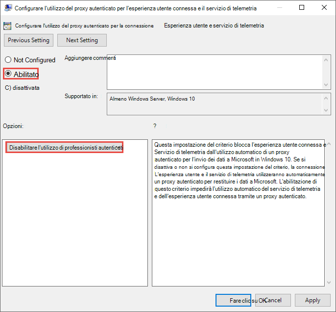
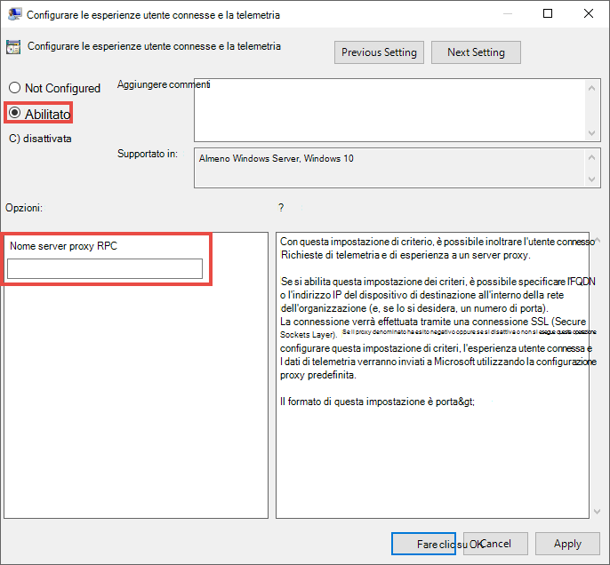

# Configurazione del proxy del dispositivo e delle impostazioni di connessione Internet per la prevenzione della perdita di dati degli endpoint

La Prevenzione della perdita dei dati degli endpoint Microsoft usa Microsoft Windows HTTP (WinHTTP) per segnalare i dati e comunicare con il servizio cloud degli endpoint Microsoft. La Prevenzione della perdita dei dati degli endpoint integrata viene eseguita nel sistema attraverso l'account LocalSystem.

> [!TIP]
> Per le organizzazioni che usano i proxy come porta di accesso a Internet, è possibile usare la protezione della rete per esaminare gli eventi che si verificano dietro un proxy. Per altre informazioni, vedere [Esaminare gli eventi di connessione che si verificano dietro i proxy di inoltro](/windows/security/threat-protection/microsoft-defender-atp/investigate-behind-proxy).

L'impostazione di configurazione WinHTTP è indipendente dalle impostazioni del proxy di esplorazione Internet (WinINet) di Windows Internet e può solo individuare un server proxy usando i metodi di individuazione automatica seguenti:

- Proxy trasparente
- Protocollo Web Proxy Auto-discovery (WPAD)

> [!NOTE]
> Se nella topologia di rete si usa un proxy trasparente o WPAD, non sono necessarie impostazioni di configurazione speciali. Per ulteriori informazioni sulle esclusioni URL nel proxy di Microsoft Defender per Endpoint, vedere [Abilitare l'accesso agli URL del servizio cloud della Prevenzione della perdita dei dati degli endpoint nel server proxy](#enable-access-to-endpoint-dlp-cloud-service-urls-in-the-proxy-server).

- Configurazione manuale del proxy statico:
    - Configurazione basata sul registro
    - WinHTTP configurato utilizzando il comando netsh. Questo è adatto solo per desktop in una topologia stabile (ad esempio: un desktop in una rete aziendale dietro lo stesso proxy)

## Configurare manualmente il server proxy con un proxy statico basato sul registro

Per i dispositivi endpoint a cui non è consentito connettersi a Internet, è necessario configurare un proxy statico basato sul registro. È necessario configurarlo per consentire solo alla Prevenzione della perdita dei dati degli endpoint di Microsoft di segnalare i dati di diagnostica e comunicare con il servizio cloud di endpoint Microsoft.

Il proxy statico è configurabile tramite Criteri di gruppo. I criteri di gruppo sono disponibili in:

1. Aprire **Modelli amministrativi > Componenti di Windows > Raccolta dati e build di anteprima > Configura l'utilizzo del proxy autenticato per l'esperienza utente connessa e servizio di telemetria**

2. Impostarlo su **Abilitato** e selezionare **Disabilita uso proxy autenticato**: 

 
3. Aprire **Modelli amministrativi > Componenti di Windows > Raccolta dati e build di anteprima > Configura esperienze utente connesse e telemetria**:

 Configurare il proxy inverso

Il criterio imposta due valori di registro`TelemetryProxyServer` come REG_SZ e `DisableEnterpriseAuthProxy` REG_DWORD nella chiave di registro`HKLM\Software\Policies\Microsoft\Windows\DataCollection`.

Il valore di registro TelemetryProxyServer è nel formato \<server name or ip\>:\<port\>. Ad esempio: **10.0.0.6:8080**

Il valore del registro `DisableEnterpriseAuthProxy` deve essere impostato su 1.

## Configurare manualmente il server proxy con il comando "netsh"

Usare netsh per configurare un proxy statico a livello di sistema.

> [!NOTE]
> Questa operazione avrà effetto su tutte le applicazioni, inclusi i servizi di Windows che usano WinHTTP con proxy predefinito. I portatili che stanno cambiando la topologia, ad esempio da Office a Home, non funzioneranno con netsh. È consigliabile usare la configurazione del proxy statico basata sul registro.

1. Aprire un prompt dei comandi con privilegi elevati:
    1. Passare a **Start** e digitare **cmd**
    1. Fare clic con il pulsante destro del mouse su **Prompt dei comandi** e scegliere **Esegui come amministratore**.
2.  Immettere il comando indicato di seguito e premere **INVIO**:

    `netsh winhttp set proxy <proxy>:<port>`

    Ad esempio: **netsh winhttp set proxy 10.0.0.6:8080**

3. Per reimpostare il proxy winhttp, immettere il comando indicato di seguito e premere **INVIO**:

     `netsh winhttp reset proxy`

Per altre informazioni, vedere [Sintassi comando netsh, contesti e formattazione](/windows-server/networking/technologies/netsh/netsh-contexts).

## Abilitare l'accesso agli URL del servizio cloud della Prevenzione della perdita dei dati degli endpoint nel server proxy

Se un proxy o un firewall blocca tutto il traffico per impostazione predefinita e consente solo domini specifici, aggiungere i domini elencati nel foglio di lavoro scaricabile all'elenco di domini consentiti.

Il [foglio di calcolo scaricabile](https://download.microsoft.com/download/8/a/5/8a51eee5-cd02-431c-9d78-a58b7f77c070/mde-urls.xlsx) elenca i servizi e gli URL associati a cui la rete deve essere in grado di connettersi. È necessario assicurarsi che non ci siano regole di filtro di rete o firewall che neghino l'accesso a questi URL, altrimenti potrebbe essere necessario creare una regola specifica per consentirgli l’accesso.

Se un proxy o un firewall ha l’analisi HTTPS (ispezione SSL) abilitata, bisogna escludere i domini elencati nella tabella di analisi HTTPS di cui sopra.
Se un proxy o un firewall blocca il traffico anonimo, perché la Prevenzione della perdita dei dati degli endpoint si connette dal contesto di sistema, assicurarsi che il traffico anonimo sia consentito negli URL elencati in precedenza.

## Verificare la connettività client agli URL dei servizi cloud Microsoft.

Verificare che la configurazione del proxy sia stata completata correttamente, che WinHTTP possa individuare e comunicare attraverso il server proxy nell’ambiente e che il server proxy consenta il traffico agli URL del servizio Defender per Endpoint.

1. Scaricare lo[strumento MDATP Client Analyzer](https://aka.ms/mdatpanalyzer) nel PC in cui è in esecuzione la Prevenzione della perdita dei dati degli endpoint.
2. Estrarre il contenuto di MDATPClientAnalyzer.zip nel dispositivo.
3. Aprire un prompt dei comandi con privilegi elevati:
    1. Passare a **Start** e digitare **cmd**.
    1. Fare clic con il pulsante destro del mouse su **Prompt dei comandi** e scegliere **Esegui come amministratore**.
4.  Immettere il comando indicato di seguito e premere **INVIO**:
    
`HardDrivePath\MDATPClientAnalyzer.cmd`

Sostituire *HardDrivePath* con il percorso in cui è stato scaricato lo strumento MDATPClientAnalyzer, ad esempio
    
**C:\Work\tools\MDATPClientAnalyzer\MDATPClientAnalyzer.cmd**

5.  Estrarre il file **MDATPClientAnalyzerResult. zip** creato dallo strumento nella cartella usata in _HardDrivePath*.

6.  Aprire **MDATPClientAnalyzerResult.txt** e verificare di avere eseguito la procedura di configurazione del proxy per abilitare l'individuazione del server e l'accesso agli URL di servizio.  Lo strumento controlla la connettività degli URL del servizio Defender per Endpoint con cui è configurato per interagire. Quindi immette i risultati per ogni URL che potrebbe essere potenzialmente utilizzato per comunicare con il servizio Defender per l'endpoint nel file **MDATPClientAnalyzerResult.txt**. Ad esempio:

    **Testing URL: https://xxx.microsoft.com/xxx   1 - Default proxy: Succeeded (200)   2 - Proxy auto discovery (WPAD): Succeeded (200)  3 - Proxy disabled: Succeeded (200)  4 - Named proxy: Doesn't exist  5 - Command-line proxy: Doesn't exist** 

Se almeno una delle opzioni di connettività restituisce uno stato (200), il client Defender per Endpoint può comunicare correttamente con l'URL testato usando questo metodo di connettività. 

Tuttavia, se i risultati della verifica della connettività indicano un errore, viene visualizzato un errore HTTP (vedere codici di stato HTTP). È quindi possibile usare gli URL nella tabella illustrata in [Abilitare l'accesso agli URL del servizio cloud della Prevenzione della perdita dei dati degli endpoint nel server proxy](#enable-access-to-endpoint-dlp-cloud-service-urls-in-the-proxy-server). Gli URL usati variano a seconda dell'area selezionata durante la procedura di onboarding.
[!NOTE] Strumento di analisi della connettività non è compatibile con la regola ASR [Bloccare le creazioni di processi provenienti dai comandi PSExec e WMI](/windows/security/threat-protection/windows-defender-exploit-guard/attack-surface-reduction#attack-surface-reduction-rules). È necessario disabilitare temporaneamente questa regola per eseguire lo strumento di connettività.

[!NOTE] Quando TelemetryProxyServer è impostato, nel Registro o tramite Criteri di Gruppo, Defender for Endpoint ricade in modalità diretta se non può accedere al proxy definito.
Argomenti correlati •   Onboarding di dispositivi Windows 10 •   Risolvere i problemi di onboarding della Microsoft Prevenzione della perdita dei dati degli endpoint

## Vedere anche

- [Informazioni sulla prevenzione della perdita di dati degli endpoint ](endpoint-dlp-learn-about.md)
- [Uso della Prevenzione della perdita di dati degli endpoint ](endpoint-dlp-using.md)
- [Informazioni sulla prevenzione della perdita di dati](dlp-learn-about-dlp.md)
- [Creare, testare e ottimizzare un criterio di prevenzione della perdita dei dati](create-test-tune-dlp-policy.md)
- [Introduzione a Esplora attività](data-classification-activity-explorer.md)
- [Microsoft Defender ATP](/windows/security/threat-protection/)
- [Strumenti e metodi di onboarding per i dispositivi Windows 10](/windows/security/threat-protection/microsoft-defender-atp/configure-endpoints)
- [Abbonamento a Microsoft 365](https://www.microsoft.com/microsoft-365/compare-microsoft-365-enterprise-plans?rtc=1)
- [Dispositivi aggiunti ad Azure AD](/azure/active-directory/devices/concept-azure-ad-join)
- [Scaricare il nuovo Microsoft Edge basato su Chromium](https://support.microsoft.com/help/4501095/download-the-new-microsoft-edge-based-on-chromium)