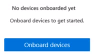

# Introduzione alla prevenzione della perdita di dati degli endpoint (anteprima)

Microsoft Endpoint Data Loss Prevention (Endpoint DLP) fa parte della famiglia di funzionalità di prevenzione della perdita dei dati (DLP) di Microsoft 365 che è possibile usare per individuare e proteggere gli elementi sensibili nei servizi di Microsoft 365. Per altre informazioni su tutte le offerte DLP di Microsoft, vedere [Panoramica sulla prevenzione della perdita dei dati](data-loss-prevention-policies.md). Per altre informazioni su Endpoint DLP, vedere [Informazioni sulla prevenzione della perdita di dati degli endpoint (anteprima)](endpoint-dlp-learn-about.md)

Microsoft Endpoint DLP consente di monitorare i dispositivi Windows 10 e rilevare l'uso e la condivisione di elementi sensibili. In questo modo si ottengono la visibilità e il controllo necessari per assicurarsi che vengano usati e protetti correttamente e per evitare comportamenti rischiosi che potrebbero comprometterli.

## Informazioni preliminari

### Licenze per SKU/abbonamenti

Prima di iniziare a usare Endpoint DLP, è necessario confermare l'[abbonamento a Microsoft 365](https://www.microsoft.com/microsoft-365/compare-microsoft-365-enterprise-plans?rtc=1) e gli eventuali componenti aggiuntivi. Per accedere e usare le funzionalità di Endpoint DLP, è necessario disporre di uno di questi abbonamenti o componenti aggiuntivi.

- Microsoft 365 E5
- Microsoft 365 A5 (EDU)
- Microsoft 365 E5 Compliance
- Microsoft 365 A5 Compliance
- Microsoft 365 E5 Information Protection and Governance
- Microsoft 365 A5 Information Protection and Governance

### Autorizzazioni

Per abilitare la gestione dei dispositivi, l'account in uso deve essere membro di uno di questi ruoli:

- Amministratore globale
- Amministratore della sicurezza
- Amministratore di conformità

Se si vuole usare un account personalizzato per vedere le impostazioni di gestione dei dispositivi, deve essere in uno dei ruoli seguenti:

- Amministratore globale
- Amministratore di conformità
- Amministratore dati di conformità
- Ruolo con autorizzazioni di lettura globali

Se si vuole usare un account personalizzato per accedere alla pagina di onboarding/offboarding, deve essere in uno dei ruoli seguenti:

- Amministratore globale
- Amministratore di conformità

Se si vuole usare un account personalizzato per attivare o disattivare il monitoraggio dei dispositivi, deve essere in uno dei ruoli seguenti:

- Amministratore globale
- Amministratore di conformità

I dati provenienti da Endpoint DLP possono essere visualizzati in [Esplora attività](data-classification-activity-explorer.md). Sono disponibili quattro ruoli che concedono l'autorizzazione per Esplora attività, l'account usato per accedere ai dati deve essere membro di uno di essi.

- Amministratore globale
- Amministratore di conformità
- Amministratore della sicurezza
- Amministratore dati di conformità

### Preparare gli endpoint

Verificare che i dispositivi Windows 10 in cui si prevede di distribuire Endpoint DLP soddisfino questi requisiti.

1. Devono eseguire Windows 10 build 1809 o superiore.
2. Tutti i dispositivi devono essere [aggiunti ad Azure Active Directory (AAD)](https://docs.microsoft.com/azure/active-directory/devices/concept-azure-ad-join).
3. Installare il browser Microsoft Edge Chromium nel dispositivo endpoint per applicare azioni dei criteri per l'attività di caricamento nel cloud. Vedere [Scaricare il nuovo Microsoft Edge basato su Chromium](https://support.microsoft.com/help/4501095/download-the-new-microsoft-edge-based-on-chromium).

## Onboarding di dispositivi nella gestione dei dispositivi

 Per poter monitorare e proteggere gli elementi sensibili in un dispositivo, è necessario abilitare il monitoraggio dei dispositivi ed eseguire l'onboarding degli endpoint. Entrambe le azioni vengono eseguite nel portale Conformità Microsoft 365.

Quando si vuole eseguire l'onboarding di nuovi dispositivi, si scarica lo script appropriato e lo si distribuisce in questi dispositivi. Seguire la [procedura di onboarding dei dispositivi](endpoint-dlp-getting-started.md#onboarding-devices).

Se i dispositivi sono già presenti in [Microsoft Defender Advanced Threat Protection (MDATP)](https://docs.microsoft.com/windows/security/threat-protection/), verranno già visualizzati nell'elenco dei dispositivi gestiti. Seguire la procedura [Con i dispositivi caricati in MDATP](endpoint-dlp-getting-started.md#with-devices-onboarded-into-mdatp).

### Onboarding dei dispositivi

In questo scenario di distribuzione si esegue l'onboarding di dispositivi non ancora caricati e si vogliono soltanto monitorare e proteggere gli elementi sensibili dalla condivisione involontaria nei dispositivi Windows 10.

1. Aprire il [Centro conformità Microsoft](https://compliance.microsoft.com).
2. Aprire la pagina delle impostazioni del Centro conformità e scegliere **Onboarding di dispositivi**. 

> [!NOTE]
> Anche se in genere sono necessari circa 60 secondi perché l'onboarding dei dispositivi sia abilitato, attendere fino a 30 minuti prima di contattare il supporto tecnico Microsoft.

3. Scegliere **Gestione dispositivi** per aprire l'elenco **Dispositivi**. L'elenco sarà vuoto finché non si caricano dispositivi.
4. Scegliere **Onboarding** per avviare il processo di onboarding.
5. Scegliere il modo in cui si vogliono distribuire questi altri dispositivi dall'elenco **Metodo di distribuzione** e quindi **scaricare il pacchetto**.

1. Seguire le procedure appropriate in [Strumenti e metodi di onboarding per i dispositivi Windows 10](https://docs.microsoft.com/windows/security/threat-protection/microsoft-defender-atp/configure-endpoints). Questo collegamento porta a una pagina di destinazione in cui è possibile accedere alle procedure di MDATP che corrispondono al pacchetto di distribuzione selezionato nel passaggio 5:
    - Onboarding di dispositivi Windows 10 con Criteri di gruppo
    - Onboarding di dispositivi Windows 10 con Microsoft Endpoint Configuration Manager
    - Onboarding di dispositivi Windows 10 con gli strumenti di Gestione dispositivi mobili
    - Onboarding di dispositivi Windows 10 con uno script locale
    - Onboarding di dispositivi VDI (Virtual Desktop Infrastructure) non persistenti.

Una volta completata l'operazione di onboarding, l'endpoint sarà visibile nell'elenco dei dispositivi e inizierà anche a inviare log di controllo delle attività a Esplora attività.

> [!NOTE]
> Questa esperienza richiede la licenza. Se non si ha la licenza necessaria, i dati non saranno visibili o accessibili.

### Con i dispositivi caricati in MDATP

In questo scenario, MDATP è già distribuito e ci sono endpoint per cui vengono creati report. Tutti questi endpoint compariranno nell'elenco dei dispositivi gestiti. È possibile continuare a eseguire l'onboarding di nuovi dispositivi in Endpoint DLP per ampliare la copertura usando la [procedura di onboarding dei dispositivi](endpoint-dlp-getting-started.md#onboarding-devices).

1. Aprire il [Centro conformità Microsoft](https://compliance.microsoft.com).
2. Aprire la pagina delle impostazioni del Centro conformità e scegliere **Abilita monitoraggio dispositivi**.
3. Scegliere **Gestione dispositivi** per aprire l'elenco **Dispositivi**. Dovrebbe essere visualizzato l'elenco dei dispositivi che già inviano report a MDATP. 
4. Scegliere **Onboarding** se è necessario aggiungere altri dispositivi.
5. Scegliere il modo in cui si vogliono distribuire questi altri dispositivi dall'elenco **Metodo di distribuzione** e quindi **Scarica pacchetto**.
6. Seguire le procedure appropriate in [Strumenti e metodi di onboarding per i dispositivi Windows 10](https://docs.microsoft.com/windows/security/threat-protection/microsoft-defender-atp/configure-endpoints). Questo collegamento porta a una pagina di destinazione in cui è possibile accedere alle procedure di MDATP che corrispondono al pacchetto di distribuzione selezionato nel passaggio 5:
    - Onboarding di dispositivi Windows 10 con Criteri di gruppo
    - Onboarding di dispositivi Windows 10 con Microsoft Endpoint Configuration Manager
    - Onboarding di dispositivi Windows 10 con gli strumenti di Gestione dispositivi mobili
    - Onboarding di dispositivi Windows 10 con uno script locale
    - Onboarding di dispositivi VDI (Virtual Desktop Infrastructure) non persistenti.

Una volta completata l'operazione di onboarding, l'endpoint sarà visibile nell'elenco **Dispositivi** e inizierà anche a inviare log di controllo a **Esplora attività**.

> [!NOTE]
>Questa esperienza richiede la licenza. Se non si ha la licenza necessaria, i dati non saranno visibili o accessibili.

### Visualizzazione dei dati di Endpoint DLP in Esplora attività

1. Aprire la pagina [Classificazione dei dati](https://compliance.microsoft.com/dataclassification?viewid=overview) per il dominio nel Centro conformità Microsoft 365 e scegliere Esplora attività.
2. Vedere le procedure in [Introduzione a Esplora attività](data-classification-activity-explorer.md) per accedere a tutti i dati relativi ai dispositivi endpoint e filtrarli.

## Passaggi successivi
Ora che si è eseguito l'onboarding dei dispositivi e che è possibile visualizzare i dati sulle attività in Esplora attività, è possibile procedere con il passaggio successivo, in cui si creano criteri di prevenzione della perdita dei dati per proteggere gli elementi sensibili.

1) [Uso della prevenzione della perdita di dati degli endpoint (anteprima)](endpoint-dlp-using.md)

## Vedere anche

- [Informazioni sulla prevenzione della perdita di dati degli endpoint (anteprima)](endpoint-dlp-learn-about.md)
- [Uso della prevenzione della perdita di dati degli endpoint (anteprima)](endpoint-dlp-using.md)
- [Panoramica sulla prevenzione della perdita dei dati](data-loss-prevention-policies.md)
- [Creare, testare e ottimizzare un criterio di prevenzione della perdita dei dati](create-test-tune-dlp-policy.md)
- [Introduzione a Esplora attività](data-classification-activity-explorer.md)
- [Microsoft Defender Advanced Threat Protection (Microsoft Defender ATP)](https://docs.microsoft.com/windows/security/threat-protection/)
- [Strumenti e metodi di onboarding per i dispositivi Windows 10](https://docs.microsoft.com/windows/security/threat-protection/microsoft-defender-atp/configure-endpoints)
- [Abbonamento a Microsoft 365](https://www.microsoft.com/microsoft-365/compare-microsoft-365-enterprise-plans?rtc=1)
- [Dispositivi aggiunti ad Azure Active Directory (AAD)](https://docs.microsoft.com/azure/active-directory/devices/concept-azure-ad-join)
- [Scaricare il nuovo Microsoft Edge basato su Chromium](https://support.microsoft.com/help/4501095/download-the-new-microsoft-edge-based-on-chromium)