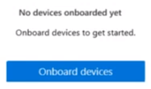
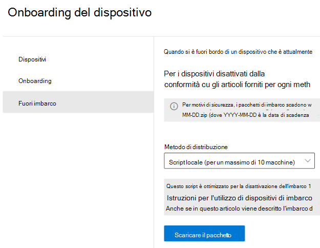
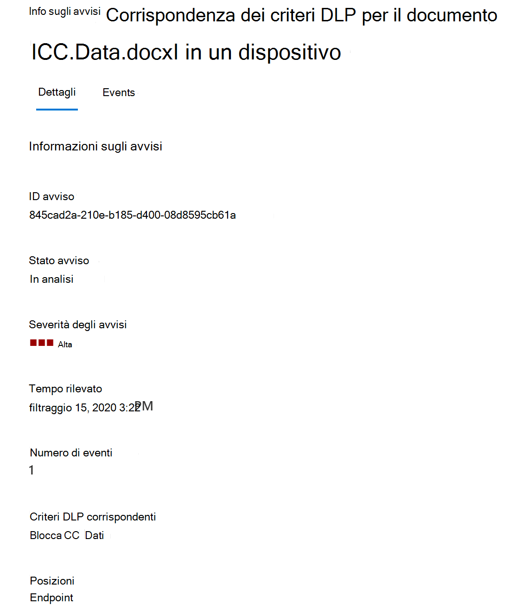
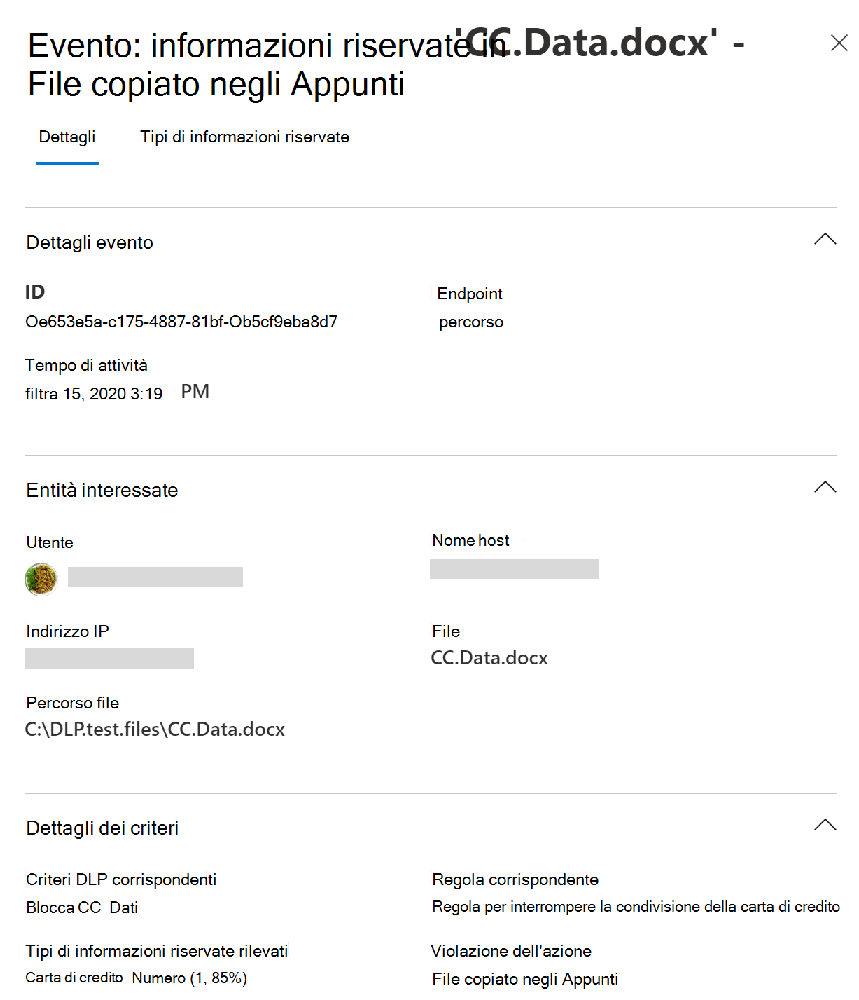
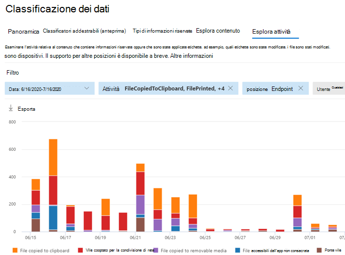
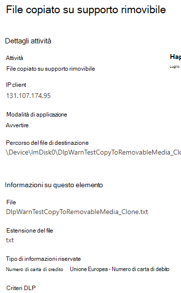

# Informazioni sulla prevenzione della perdita di dati degli endpoint di Microsoft 365

È possibile usare la prevenzione della perdita dei dati (DLP) di Microsoft 365 per monitorare le azioni intraprese sugli elementi che si considerano sensibili e per evitare la condivisione involontaria di tali elementi. Per altre informazioni, vedere [Panoramica sulla prevenzione della perdita dei dati](data-loss-prevention-policies.md).

La **prevenzione della perdita di dati degli endpoint** (Endpoint DLP) estende le funzionalità di monitoraggio e protezione delle attività di DLP agli elementi sensibili presenti nei dispositivi Windows 10. Dopo aver eseguito l'onboarding dei dispositivi nelle soluzioni del Centro conformità Microsoft 365, le informazioni sulle azioni che gli utenti stanno eseguendo sugli elementi sensibili sono rese visibili in [Esplora attività](data-classification-activity-explorer.md) ed è possibile applicare azioni di protezione su tali elementi tramite [criteri DLP](create-test-tune-dlp-policy.md).

## Attività endpoint che è possibile monitorare e su cui si può intervenire

Microsoft Endpoint DLP consente di controllare e gestire i tipi di attività seguenti, che gli utenti possono eseguire sugli elementi sensibili nei dispositivi che eseguono Windows 10. 

|attività |descrizione  | controllabile/limitabile|
|---------|---------|---------|
|caricare su servizio cloud o accedere con browser non consentiti    | Rileva quando un utente tenta di caricare un elemento in un dominio di servizio riservato o di accedere a un elemento attraverso un browser.  Se si utilizza un browser che è elencato in DLP come browser non consentito, l'attività di upload verrà bloccata e l'utente verrà reindirizzato all'utilizzo di Edge Chromium. Edge Chromium permetterà o bloccherà il caricamento o l'accesso in base alla configurazione dei criteri DLP         |controllabile e limitabile|
|copiare su altra app    |Rileva quando un utente tenta di copiare le informazioni da un elemento protetto e poi le incolla in un'altra applicazione, processo o elemento. Il processo di copiare e incollare informazioni all'interno della stessa applicazione, processo o elemento non viene rilevato da questa attività.         | controllabile e limitabile|
|copiare su supporto rimovibile USB |Rileva quando un utente tenta di copiare un elemento o un'informazione su un supporto rimovibile o un dispositivo USB.         | controllabile e limitabile|
|copiare su condivisione di rete    |Rileva quando un utente tenta di copiare un elemento in una condivisione di rete o in un'unità di rete mappata         |controllabile e limitabile|
|stampare un documento    |Rileva quando un utente tenta di stampare un elemento protetto su una stampante locale o di rete.| controllabile e limitabile         |
|copiare in una sessione remota|Rileva quando un utente tenta di copiare un elemento in una sessione desktop remota |  controllabile e limitabile|
|copiare in un dispositivo Bluetooth|Rileva quando un utente cerca di copiare un elemento in un'app Bluetooth non consentita (come definito nell'elenco delle app Bluetooth non consentite nelle impostazioni Endpoint DLP).| controllabile e limitabile|
|creare un elemento.|Rileva quando un utente crea un elemento| controllabile|
|rinominare un elemento|Rileva quando un utente rinomina un elemento| controllabile|

 ## File monitorati

Endpoint DLP supporta il monitoraggio di questi tipi di file:

- File di Word
- File di PowerPoint
- File di Excel
- File PDF
- File CSV
- File TSV
- File TXT
- File RTF
- File C
- File CLASS
- File CPP
- File CS
- File H
- File Java
 
Per impostazione predefinita, Endpoint DLP controlla le attività per questi tipi di file anche in mancanza di una corrispondenza dei criteri. Se si vogliono monitorare i dati solo se c'è una corrispondenza dei criteri, è possibile disattivare l'opzione **Controllare sempre le attività dei file per i dispositivi** nelle impostazioni globali di Endpoint DLP. Le attività in qualsiasi file di Word, PowerPoint, Excel, PDF e CSV vengono comunque sempre controllate.

Endpoint DLP monitora le attività in base al tipo MIME, pertanto le attività verranno acquisite anche se l'estensione del file viene cambiata. 

## Cosa distingue Endpoint DLP

Ci sono alcuni concetti aggiuntivi che è necessario conoscere prima di approfondire l'utilizzo di Endpoint DLP.

### Abilitare la gestione dei dispositivi

La gestione dei dispositivi è la funzionalità che consente la raccolta di dati di telemetria dai dispositivi e la introduce nelle soluzioni di conformità di Microsoft 365, come Endpoint DLP e [Gestione dei rischi Insider](insider-risk-management.md). È necessario eseguire l'onboarding di tutti i dispositivi che si vogliono usare come posizioni nei criteri DLP.

> [!div class="mx-imgBorder"]
> 

Onboarding e offboarding vengono gestiti tramite script scaricati dal centro gestione dispositivi. Nel centro sono disponibili script personalizzati per ognuno di questi metodi di distribuzione:

- script locale (fino a 10 computer)
- Criteri di gruppo
- System Center Configuration Manager (versione 1610 o successiva)
- Gestione dispositivi mobili/Microsoft Intune
- Script di onboarding VDI per dispositivi non persistenti

> [!div class="mx-imgBorder"]
> 

 Seguire le procedure in [Introduzione a Microsoft 365 Endpoint DLP](endpoint-dlp-getting-started.md) per l'onboarding dei dispositivi.

Se è stato eseguito l'onboarding di dispositivi tramite [Microsoft Defender per endpoint](https://docs.microsoft.com/windows/security/threat-protection/), questi dispositivi verranno visualizzati automaticamente nell'elenco dei dispositivi.

> [!div class="mx-imgBorder"]
> 

### Visualizzazione dei dati di Endpoint DLP

È possibile visualizzare gli avvisi correlati ai criteri di prevenzione della perdita dei dati applicati ai dispositivi endpoint passando al [Dashboard di gestione avvisi DLP](dlp-configure-view-alerts-policies.md).

È anche possibile visualizzare i dettagli dell'evento associato con metadati completi nello stesso dashboard

Dopo l'onboarding di un dispositivo, le informazioni sulle attività controllate fluiscono in Esplora attività anche prima che vengano configurati e distribuiti criteri di prevenzione della perdita dei dati che usano dispositivi come posizione.

> [!div class="mx-imgBorder"]
> 

Endpoint DLP raccoglie informazioni complete sulle attività controllate.

Ad esempio, se un file viene copiato in un supporto USB rimovibile, nei dettagli attività vengono visualizzati questi attributi:

- tipo di attività
- IP client
- percorso file di destinazione
- timestamp dell'attività
- nome del file
- utente
- estensione del file
- dimensioni del file
- tipo di informazioni sensibili (se applicabile)
- valore SHA1
- valore SHA256
- nome file precedente
- posizione
- padre
- percorso file
- tipo di percorso di origine
- piattaforma
- nome dispositivo
- tipo di percorso di destinazione
- applicazione che ha eseguito la copia
- ID dispositivo di Microsoft Defender per endpoint (se applicabile)
- produttore del dispositivo multimediale rimovibile
- modello di dispositivo multimediale rimovibile
- numero di serie del dispositivo multimediale rimovibile

> [!div class="mx-imgBorder"]
> 

## Passaggi successivi

Dopo avere acquisito familiarità con Endpoint DLP, è possibile proseguire con questi argomenti:

1) [Introduzione alla prevenzione della perdita di dati degli endpoint Microsoft](endpoint-dlp-getting-started.md)
2) [Uso della prevenzione della perdita di dati degli endpoint Microsoft](endpoint-dlp-using.md)

## Vedere anche

- [Introduzione alla prevenzione della perdita di dati degli endpoint Microsoft](endpoint-dlp-getting-started.md)
- [Uso della prevenzione della perdita di dati degli endpoint Microsoft](endpoint-dlp-using.md)
- [Panoramica sulla prevenzione della perdita dei dati](data-loss-prevention-policies.md)
- [Creare, testare e ottimizzare un criterio di prevenzione della perdita dei dati](create-test-tune-dlp-policy.md)
- [Introduzione a Esplora attività](data-classification-activity-explorer.md)
- [Microsoft Defender ATP](https://docs.microsoft.com/windows/security/threat-protection/)
- [Gestione dei rischi Insider](insider-risk-management.md)
