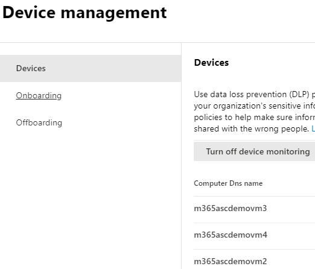

# Informazioni sulla prevenzione della perdita di dati degli endpoint di Microsoft 365Learn about Microsoft 365 Endpoint data loss prevention

È possibile usare la prevenzione della perdita dei dati (DLP) di Microsoft 365 per monitorare le azioni intraprese sugli elementi che si considerano sensibili e per evitare la condivisione involontaria di tali elementi.You can use Microsoft 365 data loss prevention (DLP) to monitor the actions that are being taken on items you've determined to be sensitive and to help prevent the unintentional sharing of those items. Per altre informazioni su DLP, vedere [Informazioni sulla prevenzione della perdita di dati](dlp-learn-about-dlp.md).For more information on DLP, see [Learn about data loss prevention](dlp-learn-about-dlp.md).

La **prevenzione della perdita di dati degli endpoint** (Endpoint DLP) estende le funzionalità di monitoraggio e protezione delle attività di DLP agli elementi sensibili presenti nei dispositivi Windows 10.**Endpoint data loss prevention** (Endpoint DLP) extends the activity monitoring and protection capabilities of DLP to sensitive items that are on Windows 10 devices. Dopo aver eseguito l'onboarding dei dispositivi nelle soluzioni del Centro conformità Microsoft 365, le informazioni sulle azioni che gli utenti stanno eseguendo sugli elementi sensibili sono rese visibili in [Esplora attività](data-classification-activity-explorer.md) ed è possibile applicare azioni di protezione su tali elementi tramite [criteri DLP](create-test-tune-dlp-policy.md).Once devices are onboarded into the Microsoft 365 compliance solutions, the information about what users are doing with sensitive items is made visible in [activity explorer](data-classification-activity-explorer.md) and you can enforce protective actions on those items via [DLP policies](create-test-tune-dlp-policy.md).

> [!TIP]
> Se si sta cercando il controllo del dispositivo per l'archiviazione rimovibile, vedere [Controllo degli accessi alle risorse di archiviazione rimovibili di Microsoft Defender per endpoint](../security/defender-endpoint/device-control-removable-storage-access-control.md#microsoft-defender-for-endpoint-device-control-removable-storage-access-control).If you are looking for device control for removable storage, see [Microsoft Defender for Endpoint Device Control Removable Storage Access Control](../security/defender-endpoint/device-control-removable-storage-access-control.md#microsoft-defender-for-endpoint-device-control-removable-storage-access-control).

## Attività endpoint che è possibile monitorare e su cui si può intervenireEndpoint activities you can monitor and take action on

Microsoft Endpoint DLP consente di controllare e gestire i tipi di attività seguenti, che gli utenti possono eseguire sugli elementi sensibili nei dispositivi che eseguono Windows 10.Microsoft Endpoint DLP enables you to audit and manage the following types of activities users take on sensitive items on devices running Windows 10.

|AttivitàActivity |DescrizioneDescription  | Controllabile/limitabileAuditable/restictable|
|---------|---------|---------|
|caricare su servizio cloud o accedere con browser non consentitiupload to cloud service, or access by unallowed browsers    | Rileva quando un utente tenta di caricare un elemento in un dominio di servizio riservato o di accedere a un elemento attraverso un browser.Detects when a user attempts to upload an item to a restricted service domain or access an item through a browser.  Se si utilizza un browser che è elencato in DLP come browser non consentito, l'attività di upload verrà bloccata e l'utente verrà reindirizzato all'utilizzo di Edge Chromium.If they are using a browser that is listed in DLP as an being an unallowed browser, the upload activity will be blocked and the user is redirected to use Edge Chromium. Edge Chromium permetterà o bloccherà il caricamento o l'accesso in base alla configurazione dei criteri DLPEdge Chromium will then either allow or block the upload or access based on the DLP policy configuration         |controllabile e limitabileauditable and restrictable|
|copiare su altra appcopy to other app    |Rileva quando un utente tenta di copiare le informazioni da un elemento protetto e poi le incolla in un'altra applicazione, processo o elemento.Detects when a user attempts to copy information from a protected item and then paste it into another app, process or item. Il processo di copiare e incollare informazioni all'interno della stessa applicazione, processo o elemento non viene rilevato da questa attività.Copying and pasting information within the same app, process, or item is not detected by this activity.         | controllabile e limitabileauditable and restrictable|
|copiare su supporto rimovibile USBcopy to USB removable media |Rileva quando un utente tenta di copiare un elemento o un'informazione su un supporto rimovibile o un dispositivo USB.Detects when a user attempts to copy an item or information to removable media or USB device.         | controllabile e limitabileauditable and restrictable|
|copiare su condivisione di retecopy to a network share    |Rileva quando un utente tenta di copiare un elemento in una condivisione di rete o in un'unità di rete mappataDetects when a user attempts to copy an item to a network share or mapped network drive         |controllabile e limitabileauditable and restrictable|
|stampare un documentoprint a document    |Rileva quando un utente tenta di stampare un elemento protetto su una stampante locale o di rete.Detects when a user attempts to print a protected item to a local or network printer.| controllabile e limitabileauditable and restrictable         |
|copiare in una sessione remotacopy to a remote session|Rileva quando un utente tenta di copiare un elemento in una sessione desktop remotaDetects when a user attempts to copy an item to a remote desktop session |  controllabile e limitabileauditable and restrictable|
|copiare in un dispositivo Bluetoothcopy to a Bluetooth device|Rileva quando un utente cerca di copiare un elemento in un'app Bluetooth non consentita (come definito nell'elenco delle app Bluetooth non consentite nelle impostazioni Endpoint DLP).Detects when a user attempts to copy an item to an unallowed Bluetooth app (as defined in the list of unallowed Bluetooth aps in Endpoint DLP settings).| controllabile e limitabileauditable and restrictable|
|creare un elemento.create an item|Rileva quando un utente crea un elementoDetects when a user creates an item| controllabileauditable|
|rinominare un elementorename an item|Rileva quando un utente rinomina un elementoDetects when a user renames an item| controllabileauditable|

## File monitoratiMonitored files

Endpoint DLP supporta il monitoraggio di questi tipi di file.Endpoint DLP supports monitoring of these file types. DLP controlla le attività per questi tipi di file anche in mancanza di una corrispondenza dei criteri.DLP audits the activities for these file types, even if there isn't a policy match. 

- File di WordWord files
- File di PowerPointPowerPoint files
- File di ExcelExcel files
- File PDFPDF files
- File CSV.csv files
- File TSV.tsv files
- File TXT.txt files
- File RTF.rtf files
- File C.c files
- File CLASS.class files
- File CPP.cpp files
- File CS.cs files
- File H.h files
- File Java.java files
 
Se si vogliono monitorare i dati solo se c'è una corrispondenza dei criteri, è possibile disattivare l'opzione **Controllare sempre le attività dei file per i dispositivi** nelle impostazioni globali di Endpoint DLP.If you only want monitoring data from policy matches, you can turn off the **Always audit file activity for devices** in the endpoint DLP global settings.

> [!NOTE]
> Se l'impostazione **Controllare sempre le attività dei file per i dispositivi** è attiva, le attività su qualsiasi file Word, PowerPoint, Excel, PDF e CSV vengono sempre controllate, anche se il dispositivo non dispone di alcun criterio.If the **Always audit file activity for devices** setting is on, activities on any Word, PowerPoint, Excel, PDF, and .csv file are always audited even if the device is not targeted by any policy.

Endpoint DLP monitora le attività in base al tipo MIME, pertanto le attività verranno acquisite anche se l'estensione del file viene cambiata.Endpoint DLP monitors activity-based on MIME type, so activities will be captured even if the file extension is changed.

## Cosa distingue Endpoint DLPWhat's different in Endpoint DLP

Ci sono alcuni concetti aggiuntivi che è necessario conoscere prima di approfondire l'utilizzo di Endpoint DLP.There are a few extra concepts that you need to be aware of before you dig into Endpoint DLP.

### Abilitare la gestione dei dispositiviEnabling Device management

La gestione dei dispositivi è la funzionalità che consente la raccolta di dati di telemetria dai dispositivi e la introduce nelle soluzioni di conformità di Microsoft 365, come Endpoint DLP e [Gestione dei rischi Insider](insider-risk-management.md).Device management is the functionality that enables the collection of telemetry from devices and brings it into Microsoft 365 compliance solutions like Endpoint DLP and [Insider Risk management](insider-risk-management.md). È necessario eseguire l'onboarding di tutti i dispositivi che si vogliono usare come posizioni nei criteri DLP.You'll need to onboard all devices you want to use as locations in DLP policies.

> [!div class="mx-imgBorder"]
> 

Onboarding e offboarding vengono gestiti tramite script scaricati dal centro gestione dispositivi.Onboarding and offboarding are handled via scripts you download from the Device management center. Nel centro sono disponibili script personalizzati per ognuno di questi metodi di distribuzione:The center has custom scripts for each of these deployment methods:

- script locale (fino a 10 computer)local script (up to 10 machines)
- Criteri di gruppoGroup policy
- System Center Configuration Manager (versione 1610 o successiva)System Center Configuration Manager (version 1610 or later)
- Gestione dispositivi mobili/Microsoft IntuneMobile Device Management/Microsoft Intune
- Script di onboarding VDI per dispositivi non persistentiVDI onboarding scripts for non-persistent machines

> [!div class="mx-imgBorder"]
> 

 Seguire le procedure in [Introduzione a Microsoft 365 Endpoint DLP](endpoint-dlp-getting-started.md) per l'onboarding dei dispositivi.Use the procedures in [Getting started with Microsoft 365 Endpoint DLP](endpoint-dlp-getting-started.md) to onboard devices.

Se è stato eseguito l'onboarding di dispositivi tramite [Microsoft Defender per endpoint](/windows/security/threat-protection/), questi dispositivi verranno visualizzati automaticamente nell'elenco dei dispositivi.If you have onboarded devices through [Microsoft Defender for Endpoint](/windows/security/threat-protection/), those devices will automatically show up in the list of devices.

> [!div class="mx-imgBorder"]
> 

### Visualizzazione dei dati di Endpoint DLPViewing Endpoint DLP data

È possibile visualizzare gli avvisi correlati ai criteri di prevenzione della perdita dei dati applicati ai dispositivi endpoint passando al [Dashboard di gestione avvisi DLP](dlp-configure-view-alerts-policies.md).You can view alerts related to DLP policies enforced on endpoint devices by going to the [DLP Alerts Management Dashboard](dlp-configure-view-alerts-policies.md).

> [!div class="mx-imgBorder"]
> 

È anche possibile visualizzare i dettagli dell'evento associato con metadati completi nello stesso dashboardYou can also view details of the associated event with rich metadata in the same dashboard

> [!div class="mx-imgBorder"]
> 

Dopo l'onboarding di un dispositivo, le informazioni sulle attività controllate fluiscono in Esplora attività anche prima che vengano configurati e distribuiti criteri di prevenzione della perdita dei dati che usano dispositivi come posizione.Once a device is onboarded, information about audited activities flows into Activity explorer even before you configure and deploy any DLP policies that have devices as a location.

> [!div class="mx-imgBorder"]
> 

Endpoint DLP raccoglie informazioni complete sulle attività controllate.Endpoint DLP collects extensive information on audited activity.

Ad esempio, se un file viene copiato in un supporto USB rimovibile, nei dettagli attività vengono visualizzati questi attributi:For example, if a file is copied to removable USB media, you'd see these attributes in the activity details:

- tipo di attivitàactivity type
- IP clientclient IP
- percorso file di destinazionetarget file path
- timestamp dell'attivitàhappened timestamp
- nome del filefile name
- utenteuser
- estensione del filefile extension
- dimensioni del filefile size
- tipo di informazioni sensibili (se applicabile)sensitive information type (if applicable)
- valore SHA1sha1 value
- valore SHA256sha256 value
- nome file precedenteprevious file name
- posizionelocation
- padreparent
- percorso filefilepath
- tipo di percorso di originesource location type
- piattaformaplatform
- nome dispositivodevice name
- tipo di percorso di destinazionedestination location type
- applicazione che ha eseguito la copiaapplication that performed the copy
- ID dispositivo di Microsoft Defender per endpoint (se applicabile)Microsoft Defender for Endpoint device ID (if applicable)
- produttore del dispositivo multimediale rimovibileremovable media device manufacturer
- modello di dispositivo multimediale rimovibileremovable media device model
- numero di serie del dispositivo multimediale rimovibileremovable media device serial number

> [!div class="mx-imgBorder"]
> 

## Passaggi successiviNext steps

Dopo avere acquisito familiarità con Endpoint DLP, è possibile proseguire con questi argomenti:Now that you've learned about Endpoint DLP, your next steps are:

1. [Introduzione alla prevenzione della perdita di dati degli endpoint MicrosoftGetting started with Microsoft Endpoint data loss prevention](endpoint-dlp-getting-started.md)
2. [Uso della prevenzione della perdita di dati degli endpoint MicrosoftUsing Microsoft Endpoint data loss prevention](endpoint-dlp-using.md)

## Vedere ancheSee also

- [Introduzione alla prevenzione della perdita di dati degli endpoint MicrosoftGetting started with Microsoft Endpoint data loss prevention](endpoint-dlp-getting-started.md)
- [Uso della prevenzione della perdita di dati degli endpoint MicrosoftUsing Microsoft Endpoint data loss prevention](endpoint-dlp-using.md)
- [Informazioni sulla prevenzione della perdita di datiLearn about data loss prevention](dlp-learn-about-dlp.md)
- [Creare, testare e ottimizzare un criterio di prevenzione della perdita dei datiCreate, test, and tune a DLP policy](create-test-tune-dlp-policy.md)
- [Introduzione a Esplora attivitàGet started with Activity explorer](data-classification-activity-explorer.md)
- [Microsoft Defender ATPMicrosoft Defender for Endpoint](/windows/security/threat-protection/)
- [Gestione dei rischi InsiderInsider Risk management](insider-risk-management.md)
