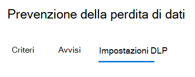
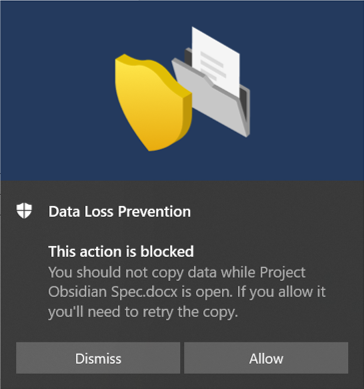

# Uso della prevenzione della perdita di dati degli endpointUsing Endpoint data loss prevention

Questo articolo illustra tre scenari in cui si creano e modificano criteri di prevenzione della perdita dei dati che usano dispositivi come posizione.This article walks you through three scenarios where you create and modify a DLP policy that uses devices as a location.

## Impostazioni DLPDLP settings

Prima di iniziare, è necessario configurare le impostazioni di prevenzione della perdita dei dati da applicare a tutti i criteri DLP per i dispositivi.Before you get started you should set up your DLP settings which are applied to all DLP policies for devices. Vanno configurate se si prevede di creare criteri che impongono:You must configure these if you intend to create policies that enforce:

- restrizioni di uscita dal cloudcloud egress restrictions
- restrizioni per app non consentiteunallowed apps restrictions

OppureOr

- Se si vogliono escludere dal monitoraggio i percorsi di file con troppi disturbiIf you want to exclude noisy file paths from monitoring

  > [!div class="mx-imgBorder"]
  > 

### Esclusioni di percorsi di fileFile path exclusions

È possibile escludere alcuni percorsi dal monitoraggio DLP, dagli avvisi DLP e dall'applicazione dei criteri DLP nei dispositivi, perché sono troppo disturbati o non contengono file a cui si è interessati.You may want to exclude certain paths from DLP monitoring, DLP alerting, and DLP policy enforcement on your devices because they are too noisy or don’t contain files you are interested in. I file presenti in tali posizioni non verranno controllati e i file creati o modificati in tali posizioni non saranno soggetti all'applicazione dei criteri di prevenzione della perdita dei dati.Files in those locations will not be audited and any files that are created or modified in those locations will not be subject to DLP policy enforcement. È possibile configurare le esclusioni di percorsi nelle impostazioni DLP.You can configure path exclusions in DLP settings.

Per creare esclusioni di percorsi si può usare questa logica:You can use this logic to construct your exclusion paths:

- Percorso file valido che termina con "\", per indicare solo i file direttamente nella cartella.Valid file path that ends with ‘\’, which means only files directly under folder.  Ad esempio, C:\TempFor example: C:\Temp\

- Percorso file valido che termina con "\*", per indicare solo i file all'interno di sottocartelle, oltre ai file direttamente nella cartella.Valid file path that ends with ‘\*’, which means only files under sub-folders, besides the files directly under the folder.  Ad esempio, C:\Temp\*For example: C:\Temp\*

- Percorso file valido che termina senza "\" o "\*", per indicare tutti i file direttamente nella cartella e in tutte le sottocartelle.Valid file path that ends without ‘\’ or ‘\*’, which means all files directly under folder and all sub-folders.  Ad esempio, C:\TempFor example: C:\Temp

- Percorso con carattere jolly compreso tra "\" su entrambi i lati.A path with wildcard between ‘\’ from each side.  Ad esempio, C:\Users\*\DesktopFor example: C:\Users\*\Desktop\

- Percorso con carattere jolly compreso tra "\" su entrambi i lati e con "(numero)" per indicare il numero esatto di sottocartelle.A path with wildcard between ‘\’ from each side and with ‘(number)’ to give exact number of subfolders.  Ad esempio, C:\Users\*(1)\DownloadsFor example: C:\Users\*(1)\Downloads\

- Un percorso con variabili di ambiente di sistema.A path with SYSTEM environment variables.  Ad esempio, %SystemDrive%\Test\*For example: %SystemDrive%\Test\*

- Una combinazione di tutti gli esempi precedenti.A mix of all the above.  Ad esempio, %SystemDrive%\Users\*\Documents\*(2)\SubFor example: %SystemDrive%\Users\*\Documents\*(2)\Sub\

### App non consentiteUnallowed apps

Quando l'impostazione **Accesso da app e browser non consentiti** di un criterio è attivata e gli utenti tentano di usare queste app per accedere a un file protetto, l'attività viene consentita, bloccata oppure bloccata ma gli utenti possono ignorare la restrizione.When a policy's **Access by unallowed apps and browsers** setting is turned on and users attempt to use these apps to access a protected file, the activity will be allowed, blocked, or blocked but users can override the restriction. Tutte le attività sono controllate e disponibili per la revisione in Esplora attività.All activity is audited and available to review in activity explorer.

> [!IMPORTANT]
> Non includere il percorso del file eseguibile, ma solo il nome (ad esempio browser.exe).Do not include the path to the executable, but only the executable name (such as browser.exe).

### App Bluetooth non consentiteUnallowed Bluetooth apps

Impedire agli utenti di trasferire file protetti dai criteri tramite specifiche app Bluetooth.Prevent people from transferring files protected by your policies via specific Bluetooth apps.

### Restrizioni del browser e del dominioBrowser and domain restrictions
Limitare la condivisione dei file riservati che corrispondono ai criteri, con i domini del servizio cloud senza restrizioni.Restrict sensitive files that match your policies from being shared with unrestricted cloud service domains.

#### Domini di servizioService domains

È possibile controllare se i file riservati protetti dai criteri possono essere caricati in specifici domini di servizio da Microsoft Edge.You can control whether sensitive files protected by your policies can be uploaded to specific service domains from Microsoft Edge.

Se la modalità elenco è impostata su **Blocca**, l'utente non potrà caricare elementi sensibili in tali domini.If the list mode is set to **Block**, then user will not be able to upload sensitive items to those domains. Quando un'azione di caricamento viene bloccata perché un elemento corrisponde a un criterio di prevenzione della perdita dei dati, DLP genera un avviso o blocca il caricamento dell'elemento sensibile.When an upload action is blocked because an item matches a DLP policy, DLP will either generate a warning or block the upload of the sensitive item.

Se la modalità elenco è impostata su **Consenti**, gli utenti possono caricare gli elementi sensibili **_solo_** in tali domini e l'accesso in caricamento a tutti gli altri domini non è consentito.If the list mode is set to **Allow**, then users will be able to upload sensitive items **_only_** to those domains, and upload access to all other domains is not allowed.

> [!IMPORTANT]
> Se la modalità di restrizione del servizio è impostata su "Consenti", per applicare le restrizioni occorre aver configurato almeno un dominio del servizio.When the service restriction mode is set to "Allow", you must have at least one service domain configured before restrictions are enforced.

#### Browser non consentitiUnallowed browsers

È possibile aggiungere browser, identificati dai nomi eseguibili, a cui verrà impedito di accedere ai file che corrispondono alle condizioni di un criterio DLP applicato in cui la restrizione relativa al caricamento nei servizi cloud è impostata su Blocca o Blocca con override.You add browsers, identified by their executable names, that will be blocked from accessing files that match the conditions of an enforced a DLP policy where the upload to cloud services restriction is set to block or block override. Quando a tali browser viene impedito di accedere a un file, gli utenti finali visualizzeranno un avviso popup con la richiesta di aprire il file con Microsoft Edge Chromium.When these browsers are blocked from accessing a file, the end users will see a toast notification asking them to open the file through Edge Chromium.

### Motivazione aziendale nei suggerimenti per i criteriBusiness justification in policy tips

È possibile controllare il modo in cui gli utenti interagiscono con l'opzione di motivazione aziendale nelle notifiche dei suggerimenti per i criteri di prevenzione della perdita dei dati.You can control how users interact with the business justification option in DLP policy tip notifications. Questa opzione viene visualizzata quando gli utenti eseguono un'attività protetta dall’impostazione **Blocco con sostituzione** in un criterio di prevenzione della perdita dei dati.This option appears when users perform an activity that's protected by the **Block with override** setting in a DLP policy. È possibile scegliere una delle opzioni seguenti:You can choose from one the following options:

- Per impostazione predefinita, gli utenti possono selezionare una motivazione predefinita o immettere un testo personalizzato.By default, users can select either a built-in justification, or enter their own text.
- Gli utenti possono solo selezionare una motivazione predefinita.Users can only select a built-in justification.
- Gli utenti possono immettere solo la propria motivazione.Users can only enter their own justification.

### Controllare sempre le attività sui file per i dispositiviAlways audit file activity for devices

Per impostazione predefinita, quando è stato eseguito l'onboarding dei dispositivi, l'attività per i file Office, PDF e CSV viene controllata automaticamente ed è resa disponibile per la revisione in Activity Explorer.By default, when devices are onboarded, activity for Office, PDF, and CSV files is automatically audited and available for review in activity explorer. Disattivare questa funzionalità se si vuole che tale attività sia verificata solo quando i dispositivi integrati siano inclusi nei criteri attivi.Turn this feature off if you want this activity to be audited only when onboarded devices are included in an active policy.

Le attività relative ai file saranno sempre controllate per i dispositivi caricati, indipendentemente dal fatto che siano inclusi in un criterio attivo.File activity will always be audited for onboarded devices, regardless of whether they are included in an active policy.

## Unione di impostazioni DLPTying DLP settings together

Con Endpoint DLP e il Web browser Microsoft Edge Chromium, è possibile limitare la condivisione involontaria di elementi sensibili con app e i servizi cloud non consentiti.With Endpoint DLP and Edge Chromium Web browser, you can restrict unintentional sharing of sensitive items to unallowed cloud apps and services. Microsoft Edge Chromium riconosce quando un elemento è limitato da un criterio di Endpoint DLP e impone restrizioni di accesso.Edge Chromium understands when an item is restricted by an Endpoint DLP policy and enforces access restrictions.

Quando si usano il browser Microsoft Edge Chromium e la posizione Endpoint DLP in un criterio di prevenzione della perdita dei dati configurato correttamente, i browser non consentiti definiti in queste impostazioni non potranno accedere agli elementi sensibili che corrispondono ai controlli del criterio DLP.When you use Endpoint DLP as a location in a properly configured DLP policy and the Edge Chromium browser, the unallowed browsers that you've defined in these settings will be prevented from accessing the sensitive items that match your DLP policy controls. Gli utenti verranno reindirizzati all'uso di Microsoft Edge Chromium, che comprende le restrizioni imposte dalla prevenzione della perdita dei dati e può bloccare o limitare attività quando le condizioni indicate nel criterio DLP sono soddisfatte.Instead, users will be redirected to use Edge Chromium and Edge Chromium, with its understanding of DLP imposed restrictions, can block or restrict activities when the conditions in the DLP policy are met.

Per usare questa restrizione sarà necessario configurare tre elementi importanti:To use this restriction you’ll need to configure three important pieces:

1. Specificare le posizioni, ovvero servizi, domini o indirizzi IP, con cui si vuole impedire la condivisione di elementi sensibili.Specify the places – services, domains, IP addresses – that you want to prevent sensitive items from being shared to.

2. Aggiungere i browser ai quali non è consentito accedere a determinati elementi sensibili in caso di corrispondenza con un criterio DLP.Add the browsers that aren’t allowed to access certain sensitive items when a DLP policy match occurs.

3. Configurare criteri DLP per definire i tipi di elementi sensibili per cui limitare il caricamento in queste posizioni, attivando **Carica nei servizi cloud** e **Accedi dai browser non consentiti**.Configure DLP policies to define the kinds of sensitive items for which upload should be restricted to these places by turning on **Upload to cloud services** and **Access from unallowed browser**.

È possibile continuare ad aggiungere nuovi servizi, app e criteri per estendere e aumentare le restrizioni in modo da soddisfare le esigenze dell'azienda e proteggere i dati sensibili.You can continue to add new services, apps, and policies to extend and augment your restrictions to meet your business needs and protect sensitive data. 

Questa configurazione contribuirà a garantire la sicurezza dei dati, evitando anche restrizioni inutili che limitano la capacità degli utenti di accedere a elementi non riservati e condividerli.This configuration will help ensure your data remains safe while also avoiding unnecessary restrictions that prevent or restrict users from accessing and sharing non-sensitive items.

## Scenari dei criteri di Endpoint DLPEndpoint DLP policy scenarios

Per acquisire familiarità con le funzionalità di Endpoint DLP e su come vengono visualizzate nei criteri DLP, sono stati predisposti alcuni scenari da seguire.To help familiarize you with Endpoint DLP features and how they surface in DLP policies, we've put together some scenarios for you to follow.

> [!IMPORTANT]
> Questi scenari di Endpoint DLP non sono le procedure ufficiali per la creazione e l'ottimizzazione di criteri DLP.These Endpoint DLP scenarios are not the official procedures for creating and tuning DLP policies. Vedere gli argomenti seguenti quando è necessario usare i criteri di prevenzione della perdita dei dati in situazioni generiche:Refer to the below topics when you need to work with DLP policies in general situations:

>- [Informazioni sulla prevenzione della perdita di datiLearn about data loss prevention](dlp-learn-about-dlp.md)
>- [Cominciare con il criterio di prevenzione della perdita dei dati predefinitoGet started with the default DLP policy](get-started-with-the-default-dlp-policy.md)
>- [Creare un criterio di prevenzione della perdita dei dati da un modelloCreate a DLP policy from a template](create-a-dlp-policy-from-a-template.md)
>- [Creare, testare e ottimizzare un criterio di prevenzione della perdita dei datiCreate, test, and tune a DLP policy](create-test-tune-dlp-policy.md)

### Scenario 1: Creare un criterio da un modello, solo controlloScenario 1: Create a policy from a template, audit only

Per questi scenari è necessario aver già eseguito l'onboarding dei dispositivi che inviano report a Esplora attività.These scenarios require that you already have devices onboarded and reporting into Activity explorer. Se non si è ancora eseguito l'onboarding di dispositivi, vedere [Introduzione alla prevenzione della perdita di dati degli endpoint](endpoint-dlp-getting-started.md).If you haven't onboarded devices yet, see [Get started with Endpoint data loss prevention](endpoint-dlp-getting-started.md).

1. Aprire la [pagina Prevenzione della perdita dei dati](https://compliance.microsoft.com/datalossprevention?viewid=policies).Open the [Data loss prevention page](https://compliance.microsoft.com/datalossprevention?viewid=policies).

2. Scegliere **Crea criterio**.Choose **Create policy**.

3. Per questo scenario, scegliere **Privacy** e poi **Informazioni personali (USA)**, quindi scegliere **Avanti**.For this scenario, choose **Privacy**, then **U.S. Personally Identifiable Information (PII) Data** and choose **Next**.

4. Impostare il campo **Stato** in posizione di disattivato per tutte le posizioni tranne **Dispositivi**.Toggle the **Status** field to off for all locations except **Devices**. Scegliere **Avanti**.Choose **Next**.

5. Accettare la selezione **Rivedere e personalizzare le impostazioni predefinite dal modello** e scegliere **Avanti**.Accept the default **Review and customize settings from the template** selection and choose **Next**.

6. Accettare i valori predefiniti per le **Azioni di protezione** e scegliere **Avanti**.Accept the default **Protection actions** values and choose **Next**.

7. Selezionare **Controlla o limita le attività nei dispositivi Windows** e uscire dalle azioni impostate su **Solo controllo**.Select **Audit or restrict activities on Windows devices** and leave the actions set to **Audit only**. Scegliere **Avanti**.Choose **Next**.

8. Accettare il valore predefinito **Vorrei prima testarli** e scegliere **Mostra i suggerimenti per i criteri in modalità di test**.Accept the default **I'd like to test it out first** value and choose **Show policy tips while in test mode**. Scegliere **Avanti**.Choose **Next**.

9. Rivedere le impostazioni e scegliere **Invia**.Review your settings and choose **Submit**.

10. Il nuovo criterio DLP verrà visualizzato nell'elenco dei criteri.The new DLP policy will appear in the policy list.

11. Controllare i dati degli endpoint monitorati in Esplora attività.Check Activity explorer for data from the monitored endpoints. Impostare il filtro della posizione per i dispositivi e aggiungere il criterio, quindi filtrare in base al nome del criterio per vederne l'impatto.Set the location filter for devices and add the policy, then filter by policy name to see the impact of this policy. Se necessario, vedere [Introduzione a Esplora attività](data-classification-activity-explorer.md).See, [Get started with activity explorer](data-classification-activity-explorer.md) if needed.

12. Provare a condividere con un utente esterno all'organizzazione un test con contenuto che attiverà la condizione Informazioni personali (USA).Attempt to share a test that contains content that will trigger the U.S. Personally Identifiable Information (PII) Data condition with someone outside your organization. Questo dovrebbe attivare il criterio.This should trigger the policy.

13. Controllare l'evento in Esplora attività.Check Activity explorer for the event.

### Scenario 2: Modificare il criterio esistente, impostare un avvisoScenario 2: Modify the existing policy, set an alert

1. Aprire la [pagina Prevenzione della perdita dei dati](https://compliance.microsoft.com/datalossprevention?viewid=policies).Open the [Data loss prevention page](https://compliance.microsoft.com/datalossprevention?viewid=policies).

2. Scegliere il criterio **Informazioni personali (USA)** creato nello scenario 1.Choose the **U.S. Personally Identifiable Information (PII) Data** policy that you created in scenario 1.

3. Scegliere **Modifica criterio**.Choose **edit policy**.

4. Passare alla pagina **Regole avanzate di prevenzione della perdita dei dati** e modificare il **Volume ridotto di contenuti rilevato nelle informazioni personali (Stati Uniti)**.Go to the **Advanced DLP rules** page and edit the **Low volume of content detected U.S. Personally Identifiable Inf**.

5. Scorrere verso il basso fino alla sezione **Report sugli eventi imprevisti** e impostare **Invia un avviso agli amministratori quando viene soddisfatta una regola** su **Attivato**.Scroll down to the **Incident reports** section and set **Send an alert to admins when a rule match occurs** to **On**. Gli avvisi di posta elettronica verranno inviati automaticamente all'amministratore e a tutti gli altri utenti aggiunti all'elenco dei destinatari.Email alerts will be automatically sent to the administrator and anyone else you add to the list of recipients. 

   > [!div class="mx-imgBorder"]
   > 
   
6. Ai fini del presente scenario, scegliere **Invia un avviso ogni volta che un'attività corrisponde alla regola**.For the purposes of this scenario, choose **Send alert every time an activity matches the rule**.

7. Scegliere **Salva**.Choose **Save**.

8. Conservare tutte le impostazioni precedenti scegliendo **Avanti** e quindi **Invia** per applicare le modifiche al criterio.Retain all your previous settings by choosing **Next** and then **Submit** the policy changes.

9. Provare a condividere con un utente esterno all'organizzazione un test con contenuto che attiverà la condizione Informazioni personali (USA).Attempt to share a test that contains content that will trigger the U.S. Personally Identifiable Information (PII) Data condition with someone outside your organization. Questo dovrebbe attivare il criterio.This should trigger the policy.

10. Controllare l'evento in Esplora attività.Check Activity explorer for the event.

### Scenario 3: Modificare il criterio esistente, bloccare l'azione con Consenti overrideScenario 3: Modify the existing policy, block the action with allow override

1. Aprire la [pagina Prevenzione della perdita dei dati](https://compliance.microsoft.com/datalossprevention?viewid=policies).Open the [Data loss prevention page](https://compliance.microsoft.com/datalossprevention?viewid=policies).

2. Scegliere il criterio **Informazioni personali (USA)** creato nello scenario 1.Choose the **U.S. Personally Identifiable Information (PII) Data** policy that you created in scenario 1.

3. Scegliere **Modifica criterio**.Choose **edit policy**.

4. Passare alla pagina **Regole avanzate di prevenzione della perdita dei dati** e modificare il **Rilevato un volume ridotto di contenuti con informazioni personali (Stati Uniti)**.Go to the **Advanced DLP rules** page and edit the **Low volume of content detected U.S. Personally Identifiable Inf**.

5. Scorrere verso il basso fino alla sezione **Controlla o limita le attività nei dispositivi Windows** e per ogni attività impostare l'azione corrispondente su **Blocca con override**.Scroll down to the **Audit or restrict activities on Windows device** section and for each activity set the corresponding action to  **Block with override**.

   > [!div class="mx-imgBorder"]
   > 
   
6. Scegliere **Salva**.Choose **Save**.

7. Ripetere i passaggi da 4 a 7 per **Rilevato un volume elevato di contenuti con informazioni personali (Stati Uniti)**.Repeat steps 4-7 for the **High volume of content detected U.S. Personally Identifiable Inf**.

8. Conservare tutte le impostazioni precedenti scegliendo **Avanti** e quindi **Invia** per applicare le modifiche al criterio.Retain all your previous settings by choosing **Next** and then **Submit** the policy changes.

9. Provare a condividere con un utente esterno all'organizzazione un test con contenuto che attiverà la condizione Informazioni personali (USA).Attempt to share a test that contains content that will trigger the U.S. Personally Identifiable Information (PII) Data condition with someone outside your organization. Questo dovrebbe attivare il criterio.This should trigger the policy.

   Nel dispositivo client sarà visualizzato un popup come questo:You'll see a popup like this on the client device:

   > [!div class="mx-imgBorder"]
   > 

10. Controllare l'evento in Esplora attività.Check Activity explorer for the event.

## Vedere ancheSee also

- [Informazioni sulla prevenzione della perdita di dati degli endpointLearn about Endpoint data loss prevention](endpoint-dlp-learn-about.md)
- [Introduzione alla prevenzione della perdita di dati degli endpointGet started with Endpoint data loss prevention](endpoint-dlp-getting-started.md)
- [Informazioni sulla prevenzione della perdita di datiLearn about data loss prevention](dlp-learn-about-dlp.md)
- [Creare, testare e ottimizzare un criterio di prevenzione della perdita dei datiCreate, test, and tune a DLP policy](create-test-tune-dlp-policy.md)
- [Introduzione a Esplora attivitàGet started with Activity explorer](data-classification-activity-explorer.md)
- [Microsoft Defender ATPMicrosoft Defender for Endpoint](/windows/security/threat-protection/)
- [Strumenti e metodi di onboarding per i dispositivi Windows 10Onboarding tools and methods for Windows 10 machines](/microsoft-365/compliance/dlp-configure-endpoints)
- [Abbonamento a Microsoft 365Microsoft 365 subscription](https://www.microsoft.com/microsoft-365/compare-microsoft-365-enterprise-plans?rtc=1)
- [Dispositivi aggiunti ad Azure Active Directory (AAD)Azure Active Directory (AAD) joined](/azure/active-directory/devices/concept-azure-ad-join)
- [Scaricare il nuovo Microsoft Edge basato su ChromiumDownload the new Microsoft Edge based on Chromium](https://support.microsoft.com/help/4501095/download-the-new-microsoft-edge-based-on-chromium)
- [Cominciare con il criterio di prevenzione della perdita dei dati predefinitoGet started with the default DLP policy](get-started-with-the-default-dlp-policy.md)
- [Creare un criterio di prevenzione della perdita dei dati da un modelloCreate a DLP policy from a template](create-a-dlp-policy-from-a-template.md)
