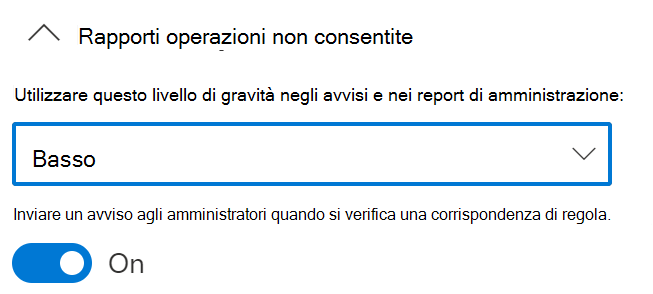

# Uso della prevenzione della perdita di dati degli endpoint

Questo articolo illustra tre scenari in cui si creano e modificano criteri di prevenzione della perdita dei dati che usano dispositivi come posizione.

## Impostazioni DLP

Prima di iniziare, è necessario configurare le impostazioni di prevenzione della perdita dei dati da applicare a tutti i criteri DLP per i dispositivi. Vanno configurate se si prevede di creare criteri che impongono:

- restrizioni di uscita dal cloud
- restrizioni per app non consentite

Oppure

- Se si vogliono escludere dal monitoraggio i percorsi di file con troppi disturbi

  > [!div class="mx-imgBorder"]
  > 

### Esclusioni di percorsi di file

È possibile escludere alcuni percorsi dal monitoraggio DLP, dagli avvisi DLP e dall'applicazione dei criteri DLP nei dispositivi, perché sono troppo disturbati o non contengono file a cui si è interessati. I file presenti in tali posizioni non verranno controllati e i file creati o modificati in tali posizioni non saranno soggetti all'applicazione dei criteri di prevenzione della perdita dei dati. È possibile configurare le esclusioni di percorsi nelle impostazioni DLP.

Per creare esclusioni di percorsi si può usare questa logica:

- Percorso file valido che termina con "\", per indicare solo i file direttamente nella cartella.  Ad esempio, C:\Temp\

- Percorso file valido che termina con "\*", per indicare solo i file all'interno di sottocartelle, oltre ai file direttamente nella cartella.  Ad esempio, C:\Temp\*

- Percorso file valido che termina senza "\" o "\*", per indicare tutti i file direttamente nella cartella e in tutte le sottocartelle.  Ad esempio, C:\Temp

- Percorso con carattere jolly compreso tra "\" su entrambi i lati.  Ad esempio, C:\Users\*\Desktop\

- Percorso con carattere jolly compreso tra "\" su entrambi i lati e con "(numero)" per indicare il numero esatto di sottocartelle.  Ad esempio, C:\Users\*(1)\Downloads\

- Un percorso con variabili di ambiente di sistema.  Ad esempio, %SystemDrive%\Test\*

- Una combinazione di tutti gli esempi precedenti.  Ad esempio, %SystemDrive%\Users\*\Documents\*(2)\Sub\

### App non consentite

Quando l'impostazione **Accesso da app e browser non consentiti** di un criterio è attivata e gli utenti tentano di usare queste app per accedere a un file protetto, l'attività viene consentita, bloccata oppure bloccata ma gli utenti possono ignorare la restrizione. Tutte le attività sono controllate e disponibili per la revisione in Esplora attività.

> [!IMPORTANT]
> Non includere il percorso del file eseguibile, ma solo il nome (ad esempio browser.exe).

### Restrizioni del browser e del dominio
Limitare la condivisione dei file riservati che corrispondono ai criteri, con i domini del servizio cloud senza restrizioni.

#### Domini di servizio

È possibile controllare se i file riservati protetti dai criteri possono essere caricati in specifici domini di servizio da Microsoft Edge.

Se la modalità elenco è impostata su **Blocca**, l'utente non potrà caricare elementi sensibili in tali domini. Quando un'azione di caricamento viene bloccata perché un elemento corrisponde a un criterio di prevenzione della perdita dei dati, DLP genera un avviso o blocca il caricamento dell'elemento sensibile.

Se la modalità elenco è impostata su **Consenti**, gli utenti possono caricare gli elementi sensibili **_solo_** in tali domini e l'accesso in caricamento a tutti gli altri domini non è consentito.

> [!IMPORTANT]
> Se la modalità di restrizione del servizio è impostata su "Consenti", per applicare le restrizioni occorre aver configurato almeno un dominio del servizio.

#### Browser non consentiti

È possibile aggiungere browser, identificati dai nomi eseguibili, a cui verrà impedito di accedere ai file che corrispondono alle condizioni di un criterio DLP applicato in cui la restrizione relativa al caricamento nei servizi cloud è impostata su Blocca o Blocca con override. Quando a tali browser viene impedito di accedere a un file, gli utenti finali visualizzeranno un avviso popup con la richiesta di aprire il file con Microsoft Edge Chromium.

### Motivazione aziendale nei suggerimenti per i criteri

È possibile controllare il modo in cui gli utenti interagiscono con l'opzione di motivazione aziendale nelle notifiche dei suggerimenti per i criteri di prevenzione della perdita dei dati. Questa opzione viene visualizzata quando gli utenti eseguono un'attività protetta dall’impostazione **Blocco con sostituzione** in un criterio di prevenzione della perdita dei dati. È possibile scegliere una delle opzioni seguenti:

- Per impostazione predefinita, gli utenti possono selezionare una motivazione predefinita o immettere un testo personalizzato.
- Gli utenti possono solo selezionare una motivazione predefinita.
- Gli utenti possono immettere solo la propria motivazione.

## Unione di impostazioni DLP

Con Endpoint DLP e il Web browser Microsoft Edge Chromium, è possibile limitare la condivisione involontaria di elementi sensibili con app e i servizi cloud non consentiti. Microsoft Edge Chromium riconosce quando un elemento è limitato da un criterio di Endpoint DLP e impone restrizioni di accesso.

Quando si usano il browser Microsoft Edge Chromium e la posizione Endpoint DLP in un criterio di prevenzione della perdita dei dati configurato correttamente, i browser non consentiti definiti in queste impostazioni non potranno accedere agli elementi sensibili che corrispondono ai controlli del criterio DLP. Gli utenti verranno reindirizzati all'uso di Microsoft Edge Chromium, che comprende le restrizioni imposte dalla prevenzione della perdita dei dati e può bloccare o limitare attività quando le condizioni indicate nel criterio DLP sono soddisfatte.

Per usare questa restrizione sarà necessario configurare tre elementi importanti:

1. Specificare le posizioni, ovvero servizi, domini o indirizzi IP, con cui si vuole impedire la condivisione di elementi sensibili.

2. Aggiungere i browser ai quali non è consentito accedere a determinati elementi sensibili in caso di corrispondenza con un criterio DLP.

3. Configurare criteri DLP per definire i tipi di elementi sensibili per cui limitare il caricamento in queste posizioni, attivando **Carica nei servizi cloud** e **Accedi dai browser non consentiti**.

È possibile continuare ad aggiungere nuovi servizi, app e criteri per estendere e aumentare le restrizioni in modo da soddisfare le esigenze dell'azienda e proteggere i dati sensibili. 

Questa configurazione contribuirà a garantire la sicurezza dei dati, evitando anche restrizioni inutili che limitano la capacità degli utenti di accedere a elementi non riservati e condividerli.

## Scenari dei criteri di Endpoint DLP

Per acquisire familiarità con le funzionalità di Endpoint DLP e su come vengono visualizzate nei criteri DLP, sono stati predisposti alcuni scenari da seguire.

> [!IMPORTANT]
> Questi scenari di Endpoint DLP non sono le procedure ufficiali per la creazione e l'ottimizzazione di criteri DLP. Vedere gli argomenti seguenti quando è necessario usare i criteri di prevenzione della perdita dei dati in situazioni generiche:

>- [Informazioni sulla prevenzione della perdita dei dati](dlp-learn-about-dlp.md)
>- [Cominciare con il criterio di prevenzione della perdita dei dati predefinito](get-started-with-the-default-dlp-policy.md)
>- [Creare un criterio di prevenzione della perdita dei dati da un modello](create-a-dlp-policy-from-a-template.md)
>- [Creare, testare e ottimizzare un criterio di prevenzione della perdita dei dati](create-test-tune-dlp-policy.md)

### Scenario 1: Creare un criterio da un modello, solo controllo

Per questi scenari è necessario aver già eseguito l'onboarding dei dispositivi che inviano report a Esplora attività. Se non si è ancora eseguito l'onboarding di dispositivi, vedere [Introduzione alla prevenzione della perdita di dati degli endpoint](endpoint-dlp-getting-started.md).

1. Aprire la [pagina Prevenzione della perdita dei dati](https://compliance.microsoft.com/datalossprevention?viewid=policies).

2. Scegliere **Crea criterio**.

3. Per questo scenario, scegliere **Privacy** e poi **Informazioni personali (USA)**, quindi scegliere **Avanti**.

4. Impostare il campo **Stato** in posizione di disattivato per tutte le posizioni tranne **Dispositivi**. Scegliere **Avanti**.

5. Accettare la selezione **Rivedere e personalizzare le impostazioni predefinite dal modello** e scegliere **Avanti**.

6. Accettare i valori predefiniti per le **Azioni di protezione** e scegliere **Avanti**.

7. Selezionare **Controlla o limita le attività nei dispositivi Windows** e uscire dalle azioni impostate su **Solo controllo**. Scegliere **Avanti**.

8. Accettare il valore predefinito **Vorrei prima testarli** e scegliere **Mostra i suggerimenti per i criteri in modalità di test**. Scegliere **Avanti**.

9. Rivedere le impostazioni e scegliere **Invia**.

10. Il nuovo criterio DLP verrà visualizzato nell'elenco dei criteri.

11. Controllare i dati degli endpoint monitorati in Esplora attività. Impostare il filtro della posizione per i dispositivi e aggiungere il criterio, quindi filtrare in base al nome del criterio per vederne l'impatto. Se necessario, vedere [Introduzione a Esplora attività](data-classification-activity-explorer.md).

12. Provare a condividere con un utente esterno all'organizzazione un test con contenuto che attiverà la condizione Informazioni personali (USA). Questo dovrebbe attivare il criterio.

13. Controllare l'evento in Esplora attività.

### Scenario 2: Modificare il criterio esistente, impostare un avviso

1. Aprire la [pagina Prevenzione della perdita dei dati](https://compliance.microsoft.com/datalossprevention?viewid=policies).

2. Scegliere il criterio **Informazioni personali (USA)** creato nello scenario 1.

3. Scegliere **Modifica criterio**.

4. Passare alla pagina **Regole avanzate di prevenzione della perdita dei dati** e modificare il **Volume ridotto di contenuti rilevato nelle informazioni personali (Stati Uniti)**.

5. Scorrere verso il basso fino alla sezione **Report sugli eventi imprevisti** e impostare **Invia un avviso agli amministratori quando viene soddisfatta una regola** su **Attivato**. Gli avvisi di posta elettronica verranno inviati automaticamente all'amministratore e a tutti gli altri utenti aggiunti all'elenco dei destinatari. 

   > [!div class="mx-imgBorder"]
   > 
   
6. Ai fini del presente scenario, scegliere **Invia un avviso ogni volta che un'attività corrisponde alla regola**.

7. Scegliere **Salva**.

8. Conservare tutte le impostazioni precedenti scegliendo **Avanti** e quindi **Invia** per applicare le modifiche al criterio.

9. Provare a condividere con un utente esterno all'organizzazione un test con contenuto che attiverà la condizione Informazioni personali (USA). Questo dovrebbe attivare il criterio.

10. Controllare l'evento in Esplora attività.

### Scenario 3: Modificare il criterio esistente, bloccare l'azione con Consenti override

1. Aprire la [pagina Prevenzione della perdita dei dati](https://compliance.microsoft.com/datalossprevention?viewid=policies).

2. Scegliere il criterio **Informazioni personali (USA)** creato nello scenario 1.

3. Scegliere **Modifica criterio**.

4. Passare alla pagina **Regole avanzate di prevenzione della perdita dei dati** e modificare il **Rilevato un volume ridotto di contenuti con informazioni personali (Stati Uniti)**.

5. Scorrere verso il basso fino alla sezione **Controlla o limita le attività nei dispositivi Windows** e per ogni attività impostare l'azione corrispondente su **Blocca con override**.

   > [!div class="mx-imgBorder"]
   > 
   
6. Scegliere **Salva**.

7. Ripetere i passaggi da 4 a 7 per **Rilevato un volume elevato di contenuti con informazioni personali (Stati Uniti)**.

8. Conservare tutte le impostazioni precedenti scegliendo **Avanti** e quindi **Invia** per applicare le modifiche al criterio.

9. Provare a condividere con un utente esterno all'organizzazione un test con contenuto che attiverà la condizione Informazioni personali (USA). Questo dovrebbe attivare il criterio.

   Nel dispositivo client sarà visualizzato un popup come questo:

   > [!div class="mx-imgBorder"]
   > 

10. Controllare l'evento in Esplora attività.

## Vedere anche

- [Informazioni sulla prevenzione della perdita di dati degli endpoint](endpoint-dlp-learn-about.md)
- [Introduzione alla prevenzione della perdita di dati degli endpoint](endpoint-dlp-getting-started.md)
- [Informazioni sulla prevenzione della perdita di dati](dlp-learn-about-dlp.md)
- [Creare, testare e ottimizzare un criterio di prevenzione della perdita dei dati](create-test-tune-dlp-policy.md)
- [Introduzione a Esplora attività](data-classification-activity-explorer.md)
- [Microsoft Defender ATP](/windows/security/threat-protection/)
- [Strumenti e metodi di onboarding per i dispositivi Windows 10](/microsoft-365/compliance/dlp-configure-endpoints)
- [Abbonamento a Microsoft 365](https://www.microsoft.com/microsoft-365/compare-microsoft-365-enterprise-plans?rtc=1)
- [Dispositivi aggiunti ad Azure Active Directory (AAD)](/azure/active-directory/devices/concept-azure-ad-join)
- [Scaricare il nuovo Microsoft Edge basato su Chromium](https://support.microsoft.com/help/4501095/download-the-new-microsoft-edge-based-on-chromium)
- [Cominciare con il criterio di prevenzione della perdita dei dati predefinito](get-started-with-the-default-dlp-policy.md)
- [Creare un criterio di prevenzione della perdita dei dati da un modello](create-a-dlp-policy-from-a-template.md)
