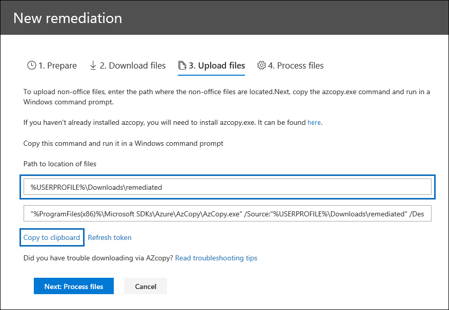

# Correzione degli errori durante l'elaborazione dei datiError remediation when processing data

La correzione degli errori consente agli amministratori di eDiscovery di correggere i problemi relativi ai dati che impediscono Advanced eDiscovery di elaborare correttamente il contenuto.Error remediation allows eDiscovery administrators the ability to rectify data issues that prevent Advanced eDiscovery from properly processing the content. Ad esempio, i file protetti da password non possono essere elaborati poiché i file sono bloccati o crittografati.For example, files that are password protected can't be processed since the files are locked or encrypted. Utilizzando la correzione degli errori, gli amministratori di eDiscovery possono scaricare i file con tali errori, rimuovere la password di protezione e quindi caricare i file corretti.Using error remediation, eDiscovery administrators can download files with such errors, remove the password protection, and then upload the remediated files.

Utilizzare il flusso di lavoro seguente per correggere i file con errori Advanced eDiscovery casi.Use the following workflow to remediate files with errors in Advanced eDiscovery cases.

## Creare una sessione di correzione degli errori per correggere i file con errori di elaborazioneCreate an error remediation session to remediate files with processing errors

> [!NOTE]
> Se la correzione guidata degli errori viene chiusa in qualsiasi momento durante la procedura seguente, è possibile  tornare alla sessione  di correzione degli errori dalla scheda Elaborazione selezionando Correzioni nel menu a discesa Visualizza. If the the error remediation wizard is closed at any time during the following procedure, you can return to the error remediation session from the **Processing** tab by selecting **Remediations** in the **View** drop-down menu.

1. Nella scheda **Elaborazione** del caso Advanced eDiscovery selezionare **Errori**  nel menu a discesa Visualizza e quindi selezionare un  set di revisione o l'intero caso nel menu a discesa Ambito.On the **Processing** tab in the Advanced eDiscovery case, select **Errors** in the **View** drop-down menu and then select a review set or the entire case in the **Scope** drop-down menu. In questa sezione vengono visualizzati tutti gli errori del caso o l'errore di uno specifico set di revisione.This section displays all errors from the case or error from a specific review set.

   

2. Selezionare gli errori che si desidera correggere facendo clic sul pulsante di opzione accanto al tipo di errore o al tipo di file.Select the errors you want to remediate by clicking the radio button next to either the error type or file type.  Nell'esempio seguente viene corretti un file protetto da password.In the following example, we're remediating a password protected file.

3. Fare **clic su Nuova correzione degli errori.**Click **New error remediation**.

    Il flusso di lavoro di correzione degli errori inizia con una fase di preparazione in cui i file con errori vengono copiati in un percorso di Archiviazione di Azure fornito da Microsoft in modo da poterli scaricare nel computer locale per la correzione.The error remediation workflow starts with a preparation stage where the files with errors are copied to a Microsoft-provided Azure Storage location so that you can download them to your local computer to remediate.

    

4. Al termine della preparazione, fare clic **su Avanti: Scarica file** per procedere con il download.After the preparation is complete, click **Next: Download files** to proceed with download.

    

5. Per scaricare i file, specificare il **Percorso di destinazione per il download**.To download files, specify the **Destination path for download**. Questo è un percorso alla cartella principale sul computer locale in cui verrà scaricato il file.This is a path to the parent folder on your local computer where the file will be downloaded.  Il percorso predefinito, %USERPROFILE%\Downloads\errors, punta alla cartella dei download dell'utente connesso.The default path, %USERPROFILE%\Downloads\errors, points to the logged-in user's downloads folder. Se lo si desidera, è possibile modificare questo percorso.You can change this path if desired. In caso di modifica, è consigliabile utilizzare un percorso di file locale per ottenere prestazioni ottimali.If you do change it, we recommend that you use a local file path for the best performance. Non usare un percorso di rete remoto.Don't use a remote network path. Ad esempio, è possibile utilizzare il percorso **C:\Remediation**.For example, you could use the path **C:\Remediation**.

   Il percorso della cartella padre viene aggiunto automaticamente al comando AzCopy (come valore del **parametro /Dest).**The path to the parent folder is automatically added to AzCopy command (as the value of the **/Dest** parameter).

6. Copiare il comando predefinito facendo clic su **Copia negli appunti**.Copy the predefined command by clicking **Copy to clipboard**. Aprire un Windows prompt dei comandi, incollare il comando AzCopy e quindi premere **INVIO.**Open a Windows Command Prompt, paste the AzCopy command, and then press **Enter**.

    

    > [!NOTE]
    > È necessario utilizzare AzCopy v8.1 per utilizzare correttamente il comando fornito nella **pagina Download dei** file.You must use AzCopy v8.1 to successfully use the command that's provided on the **Download files** page. È inoltre necessario utilizzare AzCopy v8.1 per caricare i file nel passaggio 10.You also must use AzCopy v8.1 to upload the files in step 10. Per installare questa versione di AzCopy, vedere [Transfer data with the AzCopy v8.1 on Windows](/previous-versions/azure/storage/storage-use-azcopy).To install this version of AzCopy, see [Transfer data with the AzCopy v8.1 on Windows](/previous-versions/azure/storage/storage-use-azcopy). Se il comando AzCopy fornito non riesce, vedere [Troubleshoot AzCopy in Advanced eDiscovery](troubleshooting-azcopy.md).If the supplied AzCopy command fails, please see [Troubleshoot AzCopy in Advanced eDiscovery](troubleshooting-azcopy.md).

    I file selezionati vengono scaricati nella posizione specificata al passaggio 5.The files that you selected are downloaded to the location that you specified in step 5. Nella cartella padre (ad esempio, **C:\Remediation**), viene creata automaticamente la seguente struttura di sottocartelle:In the parent folder (for example, **C:\Remediation**), the following subfolder structure is automatically created:

    `<Parent folder>\Subfolder 1\Subfolder 2\<file>`

    - La *sottocartella 1* viene denominata con l'ID del caso o del set di revisione, a seconda dell'ambito selezionato nel passaggio 1.*Subfolder 1* is named with the ID for the case or the review set, depending on the scope that you selected in step 1.

    - La *sottocartella 2* è denominata con l'ID del file scaricato*Subfolder 2* is named with the file ID of the downloaded file

    - Il file scaricato si trova nella *sottocartella 2* ed è anche denominato con l'ID file.The downloaded file is located in *Subfolder 2* and is also named with the file ID.

    Ecco un esempio del percorso della cartella e del nome del file di errore che viene creato quando gli elementi vengono scaricati nella cartella **padre C:\Remediation:**Here's an example of the folder path and error file name that's created when items are downloaded to the **C:\Remediation** parent folder:

    `C:\Remediation\232f8b7e-089c-4781-88c6-210da0615d32\d1459499146268a096ea20202cd029857d64087706e6d6ca2a224970ae3b8938\d1459499146268a096ea20202cd029857d64087706e6d6ca2a224970ae3b8938.docx`

    Se vengono scaricati più file, ognuno di essi viene scaricato in una sottocartella denominata con l'ID file.If multiple files are downloaded, each one is downloaded to a subfolder that's named with the file ID.

    > [!IMPORTANT]
    > Quando si caricano file nei passaggi 9 e 10, i file corretti devono avere lo stesso nome di file e trovarsi nella stessa struttura di sottocartelle.When you upload files in step 9 and step 10, the remediated files must have that same filename and be located in the same subfolder structure. I nomi delle sottocartelle e dei file vengono utilizzati per associare il file correttivo al file di errore originale.The subfolder and file names are used to associated the remediated file with the original error file. Se la struttura delle cartelle o i nomi dei file vengono modificati, verrà visualizzato l'errore seguente: `Cannot apply Error Remediation to the current Workingset` .If the folder structure or file names are changed, you'll receive the following error: `Cannot apply Error Remediation to the current Workingset`. Per evitare problemi, è consigliabile mantenere i file corretti nella stessa struttura di cartelle padre e sottocartelle.To prevent any issues, we recommend that keep the remediated files in the same parent folder and subfolder structure.

7. Dopo aver scaricato i file, puoi correggere i file con uno strumento appropriato.After downloading the files, you can remediate them with an appropriate tool. Per i file protetti da password, è possibile utilizzare diversi strumenti di cracking delle password.For password-protected files, there are several password cracking tools you can use. Se si conoscono le password per i file, è possibile aprirli e rimuovere la password di protezione.If you know the passwords for the files, you can open them and remove the password protection.

8. Tornare a Advanced eDiscovery e la correzione guidata degli errori e quindi fare clic su **Avanti: Upload file**.Return to Advanced eDiscovery and the error remediation wizard and then click **Next: Upload files**.  Si passa alla pagina successiva in cui è ora possibile caricare i file.This moves to the next page where you can now upload the files.

    

9. Specificare la cartella principale in cui si trovano i file corretti nella casella di testo **Percorso della posizione dei file**.Specify the parent folder where the remediated files are located in the **Path to location of files** text box. Anche in questo caso, la cartella padre deve avere la stessa struttura di sottocartelle creata al momento del download dei file.Again, the parent folder must have the same subfolder structure that was created when you downloaded the files.

    Il percorso della cartella padre viene aggiunto automaticamente al comando AzCopy (come valore del **parametro /Source).**The path to the parent folder is automatically added to AzCopy command (as the value of the **/Source** parameter).

10. Copiare il comando predefinito facendo clic su **Copia negli appunti**.Copy the predefined command by clicking **Copy to clipboard**. Aprire un Windows prompt dei comandi, incollare il comando AzCopy e quindi premere **INVIO.**Open a Windows Command Prompt, paste the AzCopy command, and then press **Enter**. caricare i file.upload the files.

    

11. Dopo aver eseguito il comando AzCopy, fare clic **su Avanti: Elabora file**.After you run the AzCopy command, click **Next: Process files**.

    Al termine dell'elaborazione, è possibile esaminare il set e visualizzare i file corretti.When processing is complete, you can go to review set and view the remediated files.

## Correzione degli errori nei file contenitoreRemediating errors in container files

In situazioni in cui il contenuto di un file contenitore (ad esempio un file .zip) non può essere estratto da Advanced eDiscovery, i contenitori possono essere scaricati e il contenuto espanso nella stessa cartella in cui si trova il contenitore originale.In situations when the contents of a container file (such as a .zip file) can't be extracted by Advanced eDiscovery, the containers can be downloaded and the contents expanded into the same folder in which the original container resides. I file espansi verranno attribuiti al contenitore padre come se fosse stato originariamente espanso da Advanced eDiscovery.The expanded files will be attributed to the parent container as if it was originally expanded by Advanced eDiscovery. Il processo funziona come descritto in precedenza, ad eccezione del caricamento di un singolo file come file sostitutivo.The process works as described as above except for uploading a single file as the replacement file.  Quando carichi file corretti, non includere il file contenitore originale.When you upload remediated files, don't include the original container file.

## Correzione degli errori caricando il testo estrattoRemediating errors by uploading the extracted text

A volte non è possibile correggere un file in formato nativo che Advanced eDiscovery può interpretare.Sometimes it's not possible to remediate a file to native format that Advanced eDiscovery can interpret. È tuttavia possibile sostituire il file originale con un file di testo contenente il testo originale del file nativo (in un processo denominato *sovrimpressione del testo).*But you can replace the original file with a text file that contains the original text of the native file (in a process called *text overlay*). A tale scopo, seguire i passaggi descritti in questo articolo, ma anziché correggere il file originale nel formato nativo, è necessario creare un file di testo contenente il testo estratto dal file originale e quindi caricare il file di testo utilizzando il nome file originale aggiunto con un suffisso .txt.To do this, follow the steps described in this article but instead of remediating the original file in the native format, you would create a text file that contains the extracted text from the original file, and then upload the text file using the original filename appended with a .txt suffix. Ad esempio, si scarica un file durante la correzione degli errori con il nome del file 335850cc-6602-4af0-acfa-1d14d9128ca2.abc.For example, you download a file during error remediation with the filename 335850cc-6602-4af0-acfa-1d14d9128ca2.abc. Si apre il file nell'applicazione nativa, si copia il testo e quindi lo si incolla in un nuovo file denominato 335850cc-6602-4af0-acfa-1d14d9128ca2.abc.txt.You open the file in the native application, copy the text, and then paste it into a new file named 335850cc-6602-4af0-acfa-1d14d9128ca2.abc.txt. In questo caso, assicurarsi di rimuovere il file originale in formato nativo dal percorso del file corretto nel computer locale prima di caricare il file di testo corretto in Advanced eDiscovery.When you do this, be sure to remove the original file in the native format from the remediated file location on your local computer before uploading the remediated text file to Advanced eDiscovery.

## Cosa succede quando i file vengono correttiWhat happens when files are remediated

Quando i file corretti vengono caricati, i metadati originali vengono mantenuti ad eccezione dei campi seguenti:When remediated files are uploaded, the original metadata is preserved except for the following fields:

- ExtractedTextSizeExtractedTextSize
- HasTextHasText
- IsErrorRemediateIsErrorRemediate
- LoadIdLoadId
- ProcessingErrorMessageProcessingErrorMessage
- ProcessingStatusProcessingStatus
- TestoText
- WordCountWordCount
- WorkingsetIdWorkingsetId

Per una definizione di tutti i campi di metadati in Advanced eDiscovery, vedere [Campi di metadati del documento](document-metadata-fields-in-advanced-ediscovery.md).For a definition of all metadata fields in Advanced eDiscovery, see [Document metadata fields](document-metadata-fields-in-advanced-ediscovery.md).