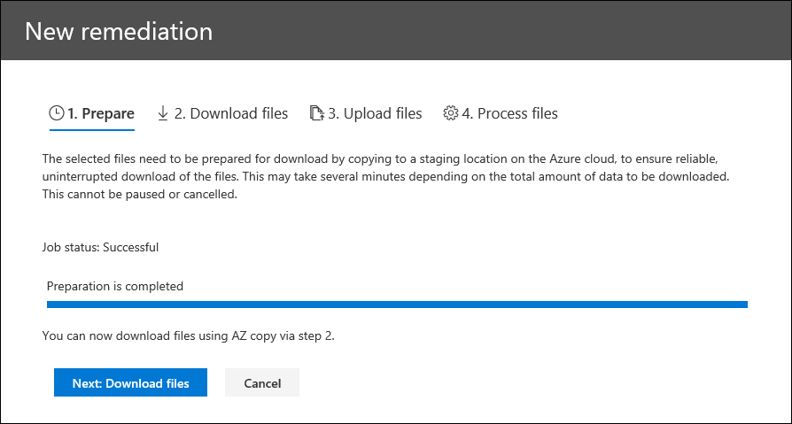

# Correzione degli errori durante l'elaborazione dei datiError remediation when processing data

La correzione degli errori consente agli amministratori di eDiscovery di correggere i problemi relativi ai dati che impediscono al eDiscovery avanzato di elaborare correttamente il contenuto.Error remediation allows eDiscovery administrators the ability to rectify data issues that prevent Advanced eDiscovery from properly processing the content. Ad esempio, i file protetti da password non possono essere elaborati dopo che i file sono stati bloccati o crittografati.For example, files that are password protected can't be processed since the files are locked or encrypted. Se si utilizza la correzione degli errori, gli amministratori di eDiscovery possono scaricare i file con tale errore, rimuovere la protezione tramite password e quindi caricare i file corretti.Using error remediation, eDiscovery administrators can download files with such errors, remove the password protection, and then upload the remediated files.

Utilizzare il flusso di lavoro seguente per correggere i file con errori nei casi avanzati di eDiscovery.Use the following workflow to remediate files with errors in Advanced eDiscovery cases.

## Creare una sessione di correzione degli errori per rimediare i file con errore di elaborazioneCreate an error remediation session to remediate files with processing errors

>[!NOTE]
>Se la procedura guidata per la correzione degli errori viene chiusa in qualsiasi momento durante la routine seguente, è possibile tornare alla sessione di correzione degli errori dalla scheda **elaborazione** selezionando **correzioni** dal menu a discesa **Visualizza** .If the the error remediation wizard is closed at any time during the following procedure, you can return to the error remediation session from the **Processing** tab by selecting **Remediations** in the **View** drop-down menu.

1. Nella scheda **elaborazione** del caso Advanced eDiscovery, selezionare **errori** dal menu a discesa **Visualizza** , quindi selezionare un set di revisione o l'intero caso nel menu a discesa **ambito** .On the **Processing** tab in the Advanced eDiscovery case, select **Errors** in the **View** drop-down menu and then select a review set or the entire case in the **Scope** drop-down menu. In questa sezione vengono visualizzati tutti gli errori provenienti dal caso o dall'errore di un set di revisione specifico.This section displays all errors from the case or error from a specific review set.

   

2. Selezionare gli errori che si desidera correggere facendo clic sul pulsante di opzione accanto al tipo di errore o al tipo di file.Select the errors you want to remediate by clicking the radio button next to either the error type or file type.  Nell'esempio seguente, viene rimediato un file protetto da password.In the following example, we're remediating a password protected file.

3. Fare clic su **nuova correzione degli errori**.Click **New error remediation**.

    Il flusso di lavoro di correzione dei problemi inizia con una fase di preparazione in cui i file con errori vengono copiati in una posizione di archiviazione di Azure fornita da Microsoft in modo da poterli scaricare nel computer locale per correggere i problemi.The error remediation workflow starts with a preparation stage where the files with errors are copied to a Microsoft-provided Azure Storage location so that you can download them to your local computer to remediate.

    

4. Al termine della preparazione, fare clic su **Avanti: scaricare i file** per continuare con il download.After the preparation is complete, click **Next: Download files** to proceed with download.

    

5. Per scaricare i file, specificare il **percorso di destinazione per il download**.To download files, specify the **Destination path for download**. Si tratta di un percorso della cartella padre nel computer locale in cui verrà scaricato il file.This is a path to the parent folder on your local computer where the file will be downloaded.  Il percorso predefinito,%USERPROFILE%\Downloads\errors, punta alla cartella Downloads dell'utente connesso.The default path, %USERPROFILE%\Downloads\errors, points to the logged-in user's downloads folder. Se lo si desidera, è possibile modificare questo percorso.You can change this path if desired. In caso contrario, si consiglia di utilizzare un percorso di file locale per ottenere prestazioni ottimali.If you do change it, we recommend that you use a local file path for the best performance. Non utilizzare un percorso di rete remoto.Don't use a remote network path. Ad esempio, è possibile utilizzare il percorso **C:\Remediation**.For example, you could use the path **C:\Remediation**. 

   Il percorso della cartella padre viene aggiunto automaticamente al comando AzCopy (come valore del parametro **/dest** ).The path to the parent folder is automatically added to AzCopy command (as the value of the **/Dest** parameter).

6. Copiare il comando predefinito facendo clic su **copia negli Appunti**.Copy the predefined command by clicking **Copy to clipboard**. Aprire un prompt dei comandi di Windows, incollare il comando AzCopy e quindi premere **invio**.Open a Windows Command Prompt, paste the AzCopy command, and then press **Enter**.  

        

    > [!NOTE]
    > È necessario utilizzare AzCopy v 8.1 per utilizzare correttamente il comando disponibile nella pagina **Scarica file** .You must use AzCopy v8.1 to successfully use the command that's provided on the **Download files** page. È inoltre necessario utilizzare AzCopy v 8.1 per caricare i file nel passaggio 10.You also must use AzCopy v8.1 to upload the files in step 10. Per installare questa versione di AzCopy, vedere [Transfer Data with the AzCopy v 8.1 in Windows](https://docs.microsoft.com/previous-versions/azure/storage/storage-use-azcopy).To install this version of AzCopy, see [Transfer data with the AzCopy v8.1 on Windows](https://docs.microsoft.com/previous-versions/azure/storage/storage-use-azcopy). Se il comando AzCopy fornito ha esito negativo, vedere [risolvere i problemi relativi a AzCopy in Advanced eDiscovery](troubleshooting-azcopy.md).If the supplied AzCopy command fails, please see [Troubleshoot AzCopy in Advanced eDiscovery](troubleshooting-azcopy.md).

    I file selezionati vengono scaricati nel percorso specificato nel passaggio 5.The files that you selected are downloaded to the location that you specified in step 5. Nella cartella padre (ad esempio, **C:\Remediation**), viene creata automaticamente la struttura di sottocartelle seguente:In the parent folder (for example, **C:\Remediation**), the following subfolder structure is automatically created:

    `<Parent folder>\Subfolder 1\Subfolder 2\<file>`

    - La *sottocartella 1* è denominata con l'ID del caso o del set di revisione, a seconda dell'ambito selezionato nel passaggio 1.*Subfolder 1* is named with the ID for the case or the review set, depending on the scope that you selected in step 1.

    - La *sottocartella 2* è denominata con l'ID file del file scaricato*Subfolder 2* is named with the file ID of the downloaded file

    - Il file scaricato si trova nella *sottocartella 2* e viene denominato anche con l'ID file.The downloaded file is located in *Subfolder 2* and is also named with the file ID.

    Di seguito è riportato un esempio del percorso della cartella e del nome del file di errore creato quando gli elementi vengono scaricati nella cartella padre di **C:\Remediation** :Here's an example of the folder path and error file name that's created when items are downloaded to the **C:\Remediation** parent folder:

    `C:\Remediation\232f8b7e-089c-4781-88c6-210da0615d32\d1459499146268a096ea20202cd029857d64087706e6d6ca2a224970ae3b8938\d1459499146268a096ea20202cd029857d64087706e6d6ca2a224970ae3b8938.docx`

    Se si scaricano più file, ognuno di essi viene scaricato in una sottocartella denominata con l'ID del file.If multiple files are downloaded, each one is downloaded to a subfolder that's named with the file ID.

    > [!IMPORTANT]
    > Quando si caricano i file nel passaggio 9 e nel passaggio 10, i file corretti devono avere lo stesso nome di file e trovarsi nella stessa struttura di sottocartelle.When you upload files in step 9 and step 10, the remediated files must have that same filename and be located in the same subfolder structure. La sottocartella e i nomi di file vengono utilizzati per associare il file di correzione al file di errore originale.The subfolder and file names are used to associated the remediated file with the original error file. Se la struttura di cartelle o i nomi di file vengono modificati, verrà visualizzato il seguente `Cannot apply Error Remediation to the current Workingset`messaggio di errore:.If the folder structure or file names are changed, you'll receive the following error: `Cannot apply Error Remediation to the current Workingset`. Per evitare problemi, è consigliabile mantenere i file corretti nella stessa cartella padre e sottocartella.To prevent any issues, we recommend that keep the remediated files in the same parent folder and subfolder structure.

7. Dopo aver scaricato i file, è possibile risolverli con uno strumento appropriato.After downloading the files, you can remediate them with an appropriate tool. Per i file protetti da password, esistono diversi strumenti di cracking delle password che è possibile utilizzare.For password-protected files, there are several password cracking tools you can use. Se si conoscono le password per i file, è possibile aprirle e rimuovere la protezione tramite password.If you know the passwords for the files, you can open them and remove the password protection.

8. Tornare a Advanced eDiscovery e la procedura guidata per la correzione degli errori, quindi fare clic su **Avanti: carica file**.Return to Advanced eDiscovery and the error remediation wizard and then click **Next: Upload files**.  Si passa alla pagina successiva in cui è ora possibile caricare i file.This moves to the next page where you can now upload the files.

    

9. Specificare la cartella padre in cui si trovano i file corretti nella casella di testo **percorso alla posizione dei file** .Specify the parent folder where the remediated files are located in the **Path to location of files** text box. Anche in questo caso, la cartella padre deve avere la stessa struttura di sottocartelle creata quando sono stati scaricati i file.Again, the parent folder must have the same subfolder structure that was created when you downloaded the files.

    Il percorso della cartella padre viene aggiunto automaticamente al comando AzCopy (come valore del parametro **/source** ).The path to the parent folder is automatically added to AzCopy command (as the value of the **/Source** parameter).

10. Copiare il comando predefinito facendo clic su **copia negli Appunti**.Copy the predefined command by clicking **Copy to clipboard**. Aprire un prompt dei comandi di Windows, incollare il comando AzCopy e quindi premere **invio**.Open a Windows Command Prompt, paste the AzCopy command, and then press **Enter**. caricare i file.upload the files.

    

11. Dopo aver eseguito il comando AzCopy, fare clic su **Avanti: elabora file**.After you run the AzCopy command, click **Next: Process files**.

    Al termine dell'elaborazione, è possibile passare a revisione set e visualizzare i file corretti.When processing is complete, you can go to review set and view the remediated files. 

## Correzione degli errori nei file contenitoreRemediating errors in container files

Nei casi in cui il contenuto di un file contenitore (ad esempio un file con estensione zip) non può essere Estratto da Advanced eDiscovery, è possibile scaricare i contenitori e il contenuto viene espanso nella stessa cartella in cui risiede il contenitore originale.In situations when the contents of a container file (such as a .zip file) can't be extracted by Advanced eDiscovery, the containers can be downloaded and the contents expanded into the same folder in which the original container resides. I file espansi verranno attribuiti al contenitore padre come se fosse stato originariamente espanso da Advanced eDiscovery.The expanded files will be attributed to the parent container as if it was originally expanded by Advanced eDiscovery. Il processo funziona come descritto sopra, tranne che per il caricamento di un singolo file come file di sostituzione.The process works as described as above except for uploading a single file as the replacement file.  Quando si caricano file corretti, non includere il file del contenitore originale.When you upload remediated files, don't include the original container file.

## Correzione degli errori mediante il caricamento del testo EstrattoRemediating errors by uploading the extracted text

A volte non è possibile correggere un file in un formato nativo che può essere interpretato da Advanced eDiscovery.Sometimes it's not possible to remediate a file to native format that Advanced eDiscovery can interpret. Tuttavia, è possibile sostituire il file originale con un file di testo contenente il testo originale del file nativo (in un processo denominato *sovrapposizione di testo*).But you can replace the original file with a text file that contains the original text of the native file (in a process called *text overlay*). A tale scopo, seguire i passaggi descritti in questo articolo, ma anziché correggere il file originale nel formato nativo, è necessario creare un file di testo contenente il testo estratto dal file originale e quindi caricare il file di testo utilizzando il nome file originale. accodato con un suffisso. txt.To do this, follow the steps described in this article but instead of remediating the original file in the native format, you would create a text file that contains the extracted text from the original file, and then upload the text file using the original filename appended with a .txt suffix. Ad esempio, è possibile scaricare un file durante la correzione degli errori con il nome file 335850cc-6602-4af0-acfa-1d14d9128ca2. ABC.For example, you download a file during error remediation with the filename 335850cc-6602-4af0-acfa-1d14d9128ca2.abc. È possibile aprire il file nell'applicazione nativa, copiare il testo e incollarlo in un nuovo file denominato 335850cc-6602-4af0-acfa-1d14d9128ca2. ABC. txt.You open the file in the native application, copy the text, and then paste it into a new file named 335850cc-6602-4af0-acfa-1d14d9128ca2.abc.txt. Quando si esegue questa operazione, assicurarsi di rimuovere il file originale nel formato nativo dal percorso dei file corretti nel computer locale prima di caricare il file di testo di cui è stata eseguita la correzione in Advanced eDiscovery.When you do this, be sure to remove the original file in the native format from the remediated file location on your local computer before uploading the remediated text file to Advanced eDiscovery.

## Cosa accade quando i file vengono correttiWhat happens when files are remediated

Quando i file corretti vengono caricati, vengono conservati i metadati originali, ad eccezione dei campi seguenti:When remediated files are uploaded, the original metadata is preserved except for the following fields: 

- ExtractedTextSizeExtractedTextSize
- HasTextHasText
- IsErrorRemediateIsErrorRemediate
- LoadIdLoadId
- ProcessingErrorMessageProcessingErrorMessage
- ProcessingStatusProcessingStatus
- TestoText
- WordCountWordCount
- WorkingsetIdWorkingsetId

Per una definizione di tutti i campi dei metadati in Advanced eDiscovery, vedere [Document Metadata Fields](document-metadata-fields.md).For a definition of all metadata fields in Advanced eDiscovery, see [Document metadata fields](document-metadata-fields.md).
