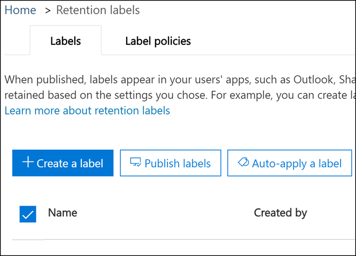

# Panoramica della conservazione basata su eventiOverview of event-driven retention

>*[Indicazioni per l'assegnazione di licenze di Microsoft 365 per sicurezza e conformità](https://aka.ms/ComplianceSD).**[Microsoft 365 licensing guidance for security & compliance](https://aka.ms/ComplianceSD).*

Quando si conserva il contenuto, il periodo di conservazione si basa spesso sull'età del contenuto: ad esempio, è possibile conservare i documenti per sette anni dopo la loro creazione e quindi eliminarli. Tuttavia, con le etichette di conservazione in Microsoft 365, è possibile basare un periodo di conservazione su quando si verifica un determinato tipo di evento. L'evento attiva l'inizio del periodo di conservazione e tutto il contenuto con un'etichetta di conservazione applicata per quel tipo di evento riceve le azioni di conservazione dell'etichetta applicate su di esso.When you retain content, the retention period is often based on the age of the content - for example, you might retain documents for seven years after they're created and then delete them. But with retention labels in Microsoft 365, you can also base a retention period on when a specific type of event occurs. The event triggers the start of the retention period, and all content with a retention label applied for that type of event get the label's retention actions enforced on them.
  
Ad esempio, è possibile usare etichette con conservazione basata su eventi per:For example, you can use labels with event-driven retention for:
  
- **Dipendenti che lasciano l'organizzazione.** Si supponga che i documenti dei dipendenti debbano essere conservati per 10 anni dal momento in cui un dipendente lascia l'organizzazione. Trascorsi 10 anni, tutti i documenti relativi all'assunzione, alle prestazioni e alla cessazione di tale dipendente devono essere smaltiti. L'evento che attiva il periodo di conservazione di 10 anni è il dipendente che lascia l'organizzazione.**Employees leaving the organization** Suppose that employee records must be retained for 10 years from the time an employee leaves the organization. After 10 years elapse, all documents related to the hiring, performance, and termination of that employee need to be disposed. The event that triggers the 10-year retention period is the employee leaving the organization. 
    
- **Scadenza contratto** Si supponga che tutti i record relativi ai contratti debbano essere conservati per cinque anni dal momento in cui scade il contratto. L'evento che fa scattare il periodo di conservazione di cinque anni è la scadenza del contratto.**Contract expiration** Suppose that all records related to contracts need to be retained for five years from the time the contract expires. The event that triggers the five-year retention period is the expiration of the contract. 
    
- **Durata del prodotto** L'organizzazione potrebbe avere requisiti di conservazione relativi all'ultima data di produzione dei prodotti per i contenuti, come le specifiche tecniche. In questo caso, l'ultima data di produzione è l'evento che attiva il periodo di conservazione.**Product lifetime** Your organization might have retention requirements related to the last manufacturing date of products for content such as technical specifications. In this case, the last manufacturing date is the event that triggers the retention period. 
    
La conservazione basata su eventi viene generalmente utilizzata come parte di un processo di gestione dei record. Ciò significa che:Event-driven retention is typically used as part of a records-management process. This means that:
  
- Anche le etichette basate sugli eventi solitamente classificano il contenuto come un record. Per ulteriori informazioni, vedere [Utilizzo di Ricerca contenuto per trovare tutto il contenuto con un'etichetta di conservazione specifica applicata](labels.md#using-content-search-to-find-all-content-with-a-specific-retention-label-applied-to-it).Labels based on events also usually classify content as a record. For more information, see [Using Content Search to find all content with a specific retention label applied to it](labels.md#using-content-search-to-find-all-content-with-a-specific-retention-label-applied-to-it).
    
- Un documento che è stato dichiarato come record ma il cui trigger di evento non è ancora stato eseguito viene conservato a tempo indeterminato (i record non possono essere eliminati in modo permanente) finché un evento non attiva il periodo di conservazione di quel documento.A document that's been declared as a record but whose event trigger has not yet happened is retained indefinitely (records can't be permanently deleted), until an event triggers that document's retention period.
    
- Le etichette di conservazione basate su eventi di solito attivano una revisione per l'eliminazione alla fine del periodo di conservazione, in modo che un Record Manager possa esaminare e eliminare manualmente il contenuto. Per ulteriori informazioni, vedere [Eliminazione dei contenuti](disposition.md).Retention labels based on events usually trigger a disposition review at the end of the retention period, so that a records manager can manually review and dispose the content. For more information, see [Disposition of content](disposition.md).
    
Un'etichetta di conservazione basata su un evento ha le stesse funzionalità di qualsiasi etichetta di conservazione in Microsoft 365. Per ulteriori informazioni, vedere [Panoramica delle etichette](labels.md).A retention label based on an event has the same capabilities as any retention label in Microsoft 365. To learn more, see [Overview of labels](labels.md).

## Informazioni sulla relazione tra tipi di eventi, etichette, eventi e ID delle risorseUnderstanding the relationship between event types, labels, events, and asset IDs

Per usare correttamente la conservazione basata su eventi, è importante comprendere la relazione tra tipi di eventi, etichette di conservazione, eventi e ID delle risorse come illustrato nei diagrammi e nella spiegazione seguenti:To successfully use event-driven retention, it's important to understand the relationship between event types, retention labels, events, and asset IDs as illustrated in the diagrams and the explanation that follows: 
  

  

  
1. Vengono create etichette di conservazione per diversi tipi di contenuto, che vengono poi associate a un tipo di evento.You create retention labels for different types of content and then associate them with a type of event. Ad esempio, le etichette di conservazione per tipi diversi di file e record di prodotti sono associate a un tipo di evento denominato Durata del prodotto, in quanto tali record devono essere conservati per 10 anni dal momento in cui il prodotto raggiunge la fine del ciclo di vita.For example, retention labels for different types of product files and records are associated with an event type named Product Lifetime because those records must be retained for 10 years from the time the product reaches its end of life.
    
2. Gli utenti (in genere i responsabili dei record) applicano queste etichette di conservazione al contenuto e (per i documenti di SharePoint e OneDrive) immettono un ID risorsa per ogni elemento.Users (typically records managers) apply those retention labels to content and (for SharePoint and OneDrive documents) enter an asset ID for each item. In questo esempio l'ID risorsa è un codice o nome del prodotto usato dall'organizzazione.In this example, the asset ID is a product name or code used by the organization. In questo modo, ai record di ogni prodotto viene assegnata un'etichetta di conservazione e ogni record ha una proprietà che contiene un ID risorsa.Thus, each product's records are assigned a retention label, and each record has a property that contains an asset ID. Il diagramma rappresenta **tutto il contenuto** per tutti i record dei prodotti in un'organizzazione e ogni elemento contiene l'ID risorsa del prodotto a cui appartiene il record.The diagram represents **all of the content** for all product records in an organization, and each item bears the asset ID of the product whose record it is. 
    
3. La durata del prodotto è il tipo di evento; un prodotto specifico che raggiunge la fine del ciclo di vita è un evento. Quando si verifica un evento di quel tipo (in questo caso, quando un prodotto raggiunge la fine del suo ciclo di vita), si crea un evento che specifica:Product Lifetime is the event type; a specific product reaching end of life is an event. When an event of that event type occurs - in this case, when a product reaches its end of life - you create an event that specifies:
    
  - Un ID risorsa (per i documenti di SharePoint e OneDrive)An asset ID (for SharePoint and OneDrive documents)
    
  - Parole chiave (per gli articoli di Exchange). In questo esempio, l'organizzazione utilizza un codice prodotto nei messaggi contenenti i record del prodotto, pertanto la parola chiave per gli elementi di Exchange è uguale all'ID risorsa per i documenti di SharePoint e OneDrive.Keywords (for Exchange items). In this example, the organization uses a product code in messages containing product records, so the keyword for Exchange items is the same as the asset ID for SharePoint and OneDrive documents.
    
  - La data in cui si è verificato l'evento. Questa data viene utilizzata come inizio del periodo di conservazione. Questa data può essere la data attuale, una futura o una passata.The date when the event occurred. This date is used as the start of the retention period. This date can be the current, a past, or a future date.
    
4. Dopo aver creato un evento, la data dell'evento viene sincronizzata con tutto il contenuto che ha un'etichetta di conservazione di quel tipo di evento e che contiene la parola chiave o l'ID risorsa specificato.After you create an event, that event date is synchronized to all the content that has a retention label of that event type and that contains the specified asset ID or keyword. Come qualsiasi etichetta di conservazione, la sincronizzazione può richiedere fino a 7 giorni.Like any retention label, this synchronization can take up to 7 days. Come mostrato nel diagramma precedente, questo evento ha attivato il periodo di conservazione di tutti gli elementi cerchiati in rosso.In the previous diagram, all the items circled in red have their retention period triggered by this event . In altre parole, quando il prodotto raggiunge la fine del ciclo di vita, questo evento attiva il periodo di conservazione per i record del prodotto.In other words, when this product reaches its end of life, that event triggers the retention period for that product's records.
    
È importante tenere presente che se per un evento non si specificano le parole chiave o un ID risorsa, **l'evento attiverà il periodo di conservazione di ogni contenuto** con un'etichetta di conservazione corrispondente a quel tipo di evento.It's important to understand that if you don't specify an asset ID or keywords for an event, **all the content** with a retention label of that event type will have its retention period triggered by the event. Nel diagramma precedente, ad esempio, verrebbe avviata la conservazione di tutto il contenuto.This means that in the previous diagram, all the content would start being retained. Questo potrebbe non essere il risultato previsto.This might not be what you intend. 
  
Tenere infine presente che ogni etichetta di conservazione ha le proprie impostazioni di conservazione.Finally, remember that each retention label has its own retention settings. In questo esempio, queste specificano tutte 10 anni ma un evento può attivare etichette con diversi periodi di conservazione.In this example, they all specify 10 years, but it's possible for an event to trigger retention labels where each label has a different retention period.
  
## Come configurare la conservazione basata su eventiHow to set up event-driven retention

Flusso di lavoro di alto livello per la conservazione basata su eventi:High-level workflow for event-driven retention:
  

  
> [!TIP]
> Vedere [Gestire il ciclo di vita dei documenti di SharePoint con etichette di conservazione](auto-apply-retention-labels-scenario.md) per uno scenario dettagliato sull'uso delle proprietà gestite in SharePont per applicare automaticamente etichette di conservazione e implementare la conservazione basata su eventi.See [Manage the lifecycle of SharePoint documents with retention labels](auto-apply-retention-labels-scenario.md) for a detailed scenario about using managed properties in SharePont to auto-apply retention labels and implement event-driven retention.

### Passaggio 1: creare un'etichetta il cui periodo di conservazione sia basato su un eventoStep 1: Create a label whose retention period is based on an event

Nel riquadro di spostamento sinistro del Centro conformità Microsoft 365, del Centro sicurezza Microsoft 365 &amp; scegliere **Classificazione** > **Etichette di conservazione** >  scheda **Etichette** > **Crea un’etichetta**.In the Microsoft 365 compliance center, Microsoft 365 security center, or the Security &amp; Compliance Center, in the left navigation, choose **Classification** > **Retention labels** > **Labels** tab > **Create a label**.
  
Quando si crea l'etichetta, attivare la conservazione, quindi scegliere l'opzione mostrata di seguito per conservare o eliminare il contenuto in base a un evento. Ciò significa che le impostazioni di conservazione non avranno effetto fino al Passaggio 5, quando verrà creato un evento nella pagina **Eventi**.When you create the label, turn on retention, and then choose the option shown below to retain or delete the content based on an event. This means that the retention settings won't go into effect until Step 5, when you create an event on the **Events** page. 
  
La conservazione basata su eventi viene generalmente usata per i contenuti classificati come record.Note that event-driven retention is typically used for content that's classified as a record. Per questo motivo, quando si creano etichette di conservazione basate su un evento, in genere, si sceglie l'opzione **Usare l'etichetta per classificare il contenuto come "Record"**.For this reason, when you create retention labels based on an event, you typically choose the option to **Use label to classify content as a "Record"**.
  
Inoltre, la conservazione basata su eventi richiede impostazioni di conservazione che:Also note that event-driven retention requires retention settings that:
  
- Conservino il contenuto.Retain the content.
    
- Eliminino il contenuto automaticamente o attivino una revisione per l'eliminazione alla fine del periodo di conservazione.Delete the content automatically or trigger a disposition review at the end of the retention period.
    

  
### Passaggio 2: scegliere un tipo di evento per l'etichettaStep 2: Choose an event type for that label

Nelle impostazioni dell'etichetta, dopo aver scelto l'opzione per basare l'etichetta su **un evento**, verrà visualizzata l'opzione **Scegli un tipo di evento**. Un tipo di evento è semplicemente una descrizione generale di un evento a cui si desidera associare un'etichetta.In the label settings, after you choose the option to base the label on **an event**, you'll see the option to **Choose an event type**. An event type is simply a general description of an event that you want to associate a label with.
  
Ad esempio, se si crea un tipo di evento denominato Durata del prodotto, verranno create le etichette di conservazione basate su eventi con i nomi che descrivono i tipi di contenuti a cui si desidera applicare le etichette, ad esempio "File di sviluppo prodotto" o "Record decisione prodotto aziendale".For example, if you create an event type named Product Lifetime, you'll create event-based retention labels with names that describe what types of content you want the labels to be applied to, such as "Product development files" or "Product business decision records".
  
Una volta scelto un tipo di evento e creata l'etichetta di conservazione, il tipo di evento non può essere modificato.Note that once you choose an event type and create the retention label, the event type cannot be changed.
  

  
### Passaggio 3: pubblicare le etichette di conservazione basate su eventiStep 3: Publish the event-based retention labels

Pubblicare le etichette di conservazione basate su eventi, in modo che possano essere applicate manualmente ai contenuti.Publish your event-based retention labels, so that they can be manually applied to content. Non è possibile selezionare un'etichetta di conservazione basata su eventi per un criterio di applicazione automatica.You cannot select an event-based retention label for an auto-apply policy. 

Per pubblicare le etichette di conservazione basate su eventi, passare alla pagina **Classificazione** > **Etichette di conservazione**.To publish your event-based retention labels, got to **Classification** > **Retention labels** page.
  

### Passaggio 4: immettere un ID risorsaStep 4: Enter an asset ID

Dopo aver applicato al contenuto un'etichetta basata sugli eventi, è possibile immettere un ID risorsa per ogni elemento. Ad esempio, la propria organizzazione potrebbe utilizzare:After an event-driven label is applied to content, you can enter an asset ID for each item. For example, your organization might use:
  
- Codici prodotto da utilizzare per conservare i contenuti solo per un prodotto specifico.Product codes that you can use to retain content for only a specific product.
    
- Codici prodotto da utilizzare per conservare i contenuti solo per un progetto specifico.Project codes that you can use to retain content for only a specific project.
    
- ID dipendente da utilizzare per conservare i contenuti solo per una persona specifica.Employee IDs that you can use to retain content for only a specific person.
    
Tenere presente che un ID risorsa è solo un'altra proprietà del documento in SharePoint e OneDrive for Business.Understand that Asset ID is simply another document property in SharePoint and OneDrive for Business. L'organizzazione potrebbe usare già altre proprietà del documento e altri ID per classificare il contenuto.Your organization may already use other document properties and IDs to classify content. In questo caso, è possibile usare anche quelle proprietà e quei valori quando si crea l'evento (vedere il passaggio 6 di seguito).If so, you can also use those properties and values when you create an event - see Step 6 that follows. L'aspetto importante è che l'organizzazione deve usare una certa combinazione proprietà:valore nelle proprietà del documento per associare l'elemento a un tipo di evento.The important point is that your organization must use some property:value combination in the document properties to associate that item with an event type.
  

  
### Passaggio 5: creare un eventoStep 5: Create an event

Quando si verifica un'istanza particolare di quel tipo di evento, ad esempio quando un prodotto raggiunge la fine del ciclo di vita, accedere alla pagina **Gestione record** > **Eventi** nel Centro sicurezza e conformità e creare un evento. È necessario attivare manualmente un evento creandolo.When a particular instance of that event type occurs - for example, a product reaches its end of life - go to the **Records management** > **Events** page in the Security &amp; Compliance Center and create an event. You need to manually trigger an event by creating it.
  
### Passaggio 6: scegliere lo stesso tipo di evento utilizzato per l'etichetta nel Passaggio 2Step 6: Choose the same event type used by the label in step 2

Quando si crea l'evento, scegliere lo stesso tipo di evento usato per l'etichetta di conservazione nel passaggio 2, ad esempio Durata del prodotto.When you create the event, choose the same event type used by the retention label in step 2 - for example, Product Lifetime. Il periodo di conservazione verrà attivato solo per il contenuto a cui sono applicate le etichette di conservazione di quel tipo di evento.Only content with retention labels applied to it of that event type will have its retention period triggered.
  

  
### Passaggio 7: immettere parole chiave o un ID risorsaStep 7: Enter keywords or an asset ID

Restringere quindi l'ambito del contenuto specificando gli ID delle risorse per i contenuti di SharePoint e OneDrive o le parole chiave per il contenuto di Exchange. Per gli ID delle risorse, la conservazione verrà applicata solo al contenuto con la coppia di proprietà e valore specificata. Se non viene inserito un ID risorsa, a **tutto il contenuto** con le etichette di quel tipo di evento viene applicata la stessa data di conservazione.Now you narrow the scope of the content by specifying asset IDs for SharePoint and OneDrive content or keywords for Exchange content. For asset IDs, retention will be enforced only on content with the specified property:value pair. If an asset ID is not entered, **all of the content** with labels of that event type get the same retention date applied to them. 
  
L'ID risorsa è semplicemente un'altra proprietà del documento in SharePoint e OneDrive for Business. Se si utilizza la proprietà ID risorsa, è necessario inserire ComplianceAssetID:\<value\> nella casella per gli ID delle risorse mostrati di seguito.Understand that Asset ID is simply another document property in SharePoint and OneDrive for Business. If you're using the Asset ID property, you would enter ComplianceAssetID:\<value\> in the box for asset IDs shown below.
  
L'organizzazione potrebbe aver applicato altre proprietà e ID ai documenti relativi a questo tipo di evento. Ad esempio, se è necessario rilevare i record di un prodotto specifico, l'ID potrebbe essere una combinazione della proprietà personalizzata ProductID e del valore "XYZ". In questo caso, inserire ProductID:XYZ nella casella per gli ID delle risorse mostrati di seguito.Your organization might have applied other properties and IDs to the documents related to this event type. For example, if you need to detect a specific product's records, the ID might be a combination of your custom property ProductID and the value "XYZ". In this case, you'd enter ProductID:XYZ in the box for asset IDs shown below.
  
Per gli elementi di Exchange, è possibile includere parole chiave. È possibile perfezionare la query utilizzando operatori di ricerca come AND, OR e NOT. Per ulteriori informazioni sugli operatori, vedere [Query con parole chiave e condizioni di ricerca per Ricerca contenuto](keyword-queries-and-search-conditions.md).For Exchange items, you can include keywords. You can refine your query by using search operators like AND, OR, and NOT. For more information on operators, see [Keyword queries and search conditions for Content Search](keyword-queries-and-search-conditions.md).
  
Infine, scegliere la data in cui si è verificato l'evento; questa data viene utilizzata come inizio del periodo di conservazione.Finally, choose the date when the event occurred; this date is used as the start of the retention period. Dopo aver creato un evento, la data dell'evento viene sincronizzata con tutto i contenuti che hanno un'etichetta di conservazione per il tipo di evento, l'ID risorsa e le parole chiave.After you create an event, that event date is synchronized to all the content with a retention label of that event type, asset ID, and keywords. Come qualsiasi etichetta di conservazione, la sincronizzazione può richiedere fino a 7 giorni.Like any retention label, this synchronization can take up to 7 days.
  

  
## Utilizzare Ricerca contenuto per trovare tutti i contenuti con un'etichetta o un ID risorsa specificiUse Content Search to find all content with a specific label or asset ID

Dopo che le etichette di conservazione sono state assegnate al contenuto, è possibile usare la funzionalità di ricerca di contenuto per trovare tutti i contenuti classificati con un'etichetta di conservazione specifica o che contengono un ID risorsa specifico.After retention labels are assigned to content, you can use content search to find all content that's classified with a specific retention label or that contains a specific asset ID.
  
Quando si crea una ricerca di contenuto:When you create a content search:
  
- Per trovare tutto il contenuto con un'etichetta di conservazione specifica, selezionare la condizione **Tag di conformità**, quindi immettere il nome completo dell'etichetta o parte di esso e usare un carattere jolly.To find all content with a specific retention label, choose the **Compliance Tag** condition, and then enter the complete label name or part of the label name and use a wildcard. 
    
- Per trovare tutto il contenuto con un ID risorsa specifico, inserire la proprietà **ComplianceAssetID** e un valore, come ComplianceAssetID:\<value\>.To find all content with a specific asset ID, enter the **ComplianceAssetID** property and a value, like ComplianceAssetID:\<value\>. 
    
Per ulteriori informazioni, vedere [Query delle parole chiave e condizioni di ricerca per ricerca contenuto](keyword-queries-and-search-conditions.md).For more information, see [Keyword queries and search conditions for Content Search](keyword-queries-and-search-conditions.md).
  
## AutorizzazioniPermissions

Per accedere alla pagina **Eventi**, i revisori devono essere membri di un gruppo di ruoli con il ruolo **Gestione eliminazione** e **Solo visualizzazione log di controllo**. Si consiglia di creare un nuovo gruppo di ruoli denominato Revisori eliminazione, aggiungendo questi due ruoli, e quindi membri, a quel gruppo di ruoli.To get access to the **Events** page, reviewers must be members of a role group with the **Disposition Management** role and the **View-Only Audit Logs** role. We recommend creating a new role group called Disposition Reviewers, adding these two roles to that role group, and then adding members to the role group. 
  
Per altre informazioni, vedere l'articolo su come [consentire agli utenti di accedere&amp; al Centro sicurezza e conformità](../security/office-365-security/grant-access-to-the-security-and-compliance-center.md).For more information, see [Give users access to the Security &amp; Compliance Center](../security/office-365-security/grant-access-to-the-security-and-compliance-center.md).
  
## Automatizzare gli eventi con PowerShellAutomate events by using PowerShell

Nell'interfaccia di amministrazione è possibile creare eventi solo manualmente e non è possibile attivare automaticamente un evento quando si verifica. Tuttavia, è possibile usare un'API REST per attivare eventi automaticamente. Per altre informazioni, vedere [Automatizzare la conservazione basata su eventi](automate-event-driven-retention.md).In the admin center, you can only create events manually; it's not possible to automatically trigger an event when it occurs. However, you can use a Rest API to trigger events automatically; for more information, see [Automate event-based retention](automate-event-driven-retention.md).

È anche possibile usare uno script di PowerShell per automatizzare la conservazione basata su eventi dalle applicazioni aziendali.You can also use a PowerShell script to automate event-based retention from your business applications. Cmdlet di PowerShell disponibili per la conservazione basata su eventi:The PowerShell cmdlets available for event-driven retention:
  
- [Get-ComplianceRetentionEventTypeGet-ComplianceRetentionEventType](https://go.microsoft.com/fwlink/?linkid=873002)
    
- [New-ComplianceRetentionEventTypeNew-ComplianceRetentionEventType](https://go.microsoft.com/fwlink/?linkid=873004)
    
- [Remove-ComplianceRetentionEventTypeRemove-ComplianceRetentionEventType](https://go.microsoft.com/fwlink/?linkid=873005)
    
- [Set-ComplianceRetentionEventTypeSet-ComplianceRetentionEventType](https://go.microsoft.com/fwlink/?linkid=873006)
    
- [Get-ComplianceRetentionEventGet-ComplianceRetentionEvent](https://go.microsoft.com/fwlink/?linkid=873001)
    
- [New-ComplianceRetentionEventNew-ComplianceRetentionEvent](https://go.microsoft.com/fwlink/?linkid=873003)
    

