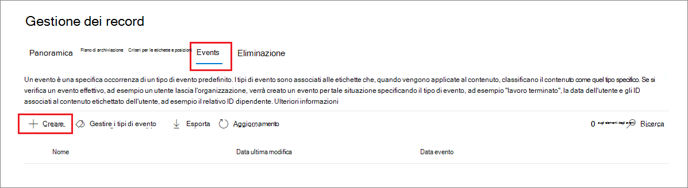
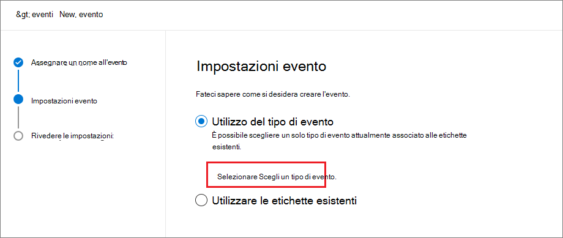

# <a name="start-retention-when-an-event-occurs"></a>Avviare la conservazione al verificarsi di un evento

>*[Indicazioni per l'assegnazione di licenze di Microsoft 365 per sicurezza e conformità](https://aka.ms/ComplianceSD).*

Quando si conserva il contenuto, il periodo di conservazione spesso si basa sulla data di creazione del contenuto stesso. Ad esempio, è possibile conservare i documenti per sette anni dalla creazione e quindi eliminarli. Quando si configurano [etichette di conservazione](retention.md#retention-labels), invece, il periodo di conservazione può essere basato anche sul momento in cui si verifica un determinato tipo di evento. L'evento attiva l'inizio del periodo di conservazione e a tutto il contenuto a cui è applicata un'etichetta di conservazione per quel tipo di evento vengono applicate le azioni di conservazione dell'etichetta.
  
Esempi per l'uso della conservazione basata su eventi:
  
- **Dipendenti che lasciano l'organizzazione** Si supponga che i record dei dipendenti debbano essere conservati per 10 anni dal momento in cui lasciano l'organizzazione. Trascorsi 10 anni, tutti i documenti relativi all'assunzione, alle prestazioni e alla cessazione del rapporto lavorativo di quel dipendente devono essere eliminati. L'evento che attiva il periodo di conservazione di 10 anni è l'uscita del dipendente dall'organizzazione. 
    
- **Scadenza del contratto** Si supponga che tutti i record relativi ai contratti debbano essere conservati per cinque anni dalla data di scadenza del contratto. L'evento che attiva il periodo di conservazione di cinque anni è la scadenza del contratto. 
    
- **Durata del prodotto** L'organizzazione potrebbe avere requisiti di conservazione relativi all'ultima data di produzione dei prodotti per i contenuti, come le specifiche tecniche. In questo caso, l'ultima data di produzione è l'evento che attiva il periodo di conservazione. 
    
La conservazione basata su eventi viene generalmente utilizzata come parte di un processo di gestione dei record. Ciò significa che:
  
- Anche le etichette basate su eventi marcano gli elementi come record, come parte di una soluzione di gestione dei record. Per altre informazioni, vedere [Informazioni sulla gestione dei record](records-management.md).

- Un documento che è stato dichiarato un record ma il cui trigger di evento non è ancora stato eseguito viene conservato a tempo indeterminato (i record non possono essere eliminati in modo permanente) finché un evento non attiva il periodo di conservazione di quel documento.
    
- Le etichette di conservazione basate su eventi di solito attivano una revisione per l'eliminazione alla fine del periodo di conservazione, in modo che un responsabile dei record possa rivedere ed eliminare manualmente il contenuto. Per altre informazioni, vedere [Eliminazione dei contenuti](disposition.md).
    

Un'etichetta di conservazione basata su un evento ha le stesse funzionalità di qualsiasi etichetta di conservazione in Microsoft 365. Per altre informazioni, vedere [Informazioni sui criteri e sulle etichette di conservazione](retention.md).

## <a name="understanding-the-relationship-between-event-types-labels-events-and-asset-ids"></a>Informazioni sulla relazione tra tipi di eventi, etichette, eventi e ID delle risorse

Per usare correttamente la conservazione basata su eventi, è importante comprendere la relazione tra tipi di eventi, etichette di conservazione, eventi e ID delle risorse come illustrato nei diagrammi e nella spiegazione seguenti: 
  

  

  
1. Vengono create etichette di conservazione per diversi tipi di contenuto, che vengono poi associate a un tipo di evento. Ad esempio, le etichette di conservazione per tipi diversi di file e record di prodotti sono associate a un tipo di evento denominato Durata del prodotto, in quanto tali record devono essere conservati per 10 anni dal momento in cui il prodotto raggiunge la fine del ciclo di vita.
    
2. Gli utenti (in genere i responsabili dei record) applicano queste etichette di conservazione al contenuto e (per i documenti di SharePoint e OneDrive) immettono un ID risorsa per ogni elemento. In questo esempio l'ID risorsa è un codice o nome del prodotto usato dall'organizzazione. Pertanto, ai record di ogni prodotto viene assegnata un'etichetta di conservazione e ogni record ha una proprietà che contiene un ID risorsa. Il diagramma rappresenta **tutto il contenuto** per tutti i record dei prodotti in un'organizzazione e ogni elemento contiene l'ID risorsa del prodotto a cui appartiene il record. 
    
3. Durata prodotto è il tipo di evento. Un prodotto specifico che raggiunge la fine del ciclo di vita è un evento. Quando si verifica un evento di questo tipo, in questo caso quando un prodotto raggiunge la fine del ciclo di vita, si crea un evento che specifica:
    
   - Un ID risorsa (per i documenti di SharePoint e OneDrive)
    
   - Parole chiave (per gli articoli di Exchange). In questo esempio, l'organizzazione utilizza un codice prodotto nei messaggi contenenti i record del prodotto, pertanto la parola chiave per gli elementi di Exchange è funzionalmente uguale all'ID risorsa per i documenti di SharePoint e OneDrive.
    
   - La data in cui si è verificato l'evento. Questa data viene utilizzata come inizio del periodo di conservazione. Questa data può essere la data attuale, una futura o una passata.

4. Dopo aver creato un evento, la data dell'evento viene sincronizzata con tutto il contenuto che ha un'etichetta di conservazione di quel tipo di evento e che contiene la parola chiave o l'ID risorsa specificato. Come per qualsiasi etichetta di conservazione, la sincronizzazione può richiedere fino a sette giorni. Come mostrato nel diagramma precedente, questo evento ha attivato il periodo di conservazione di tutti gli elementi cerchiati in rosso. In altre parole, quando il prodotto raggiunge la fine del ciclo di vita, questo evento attiva il periodo di conservazione per i record del prodotto.

È importante tenere presente che se per un evento non si specificano le parole chiave o un ID risorsa, **l'evento attiverà il periodo di conservazione di ogni contenuto** con un'etichetta di conservazione corrispondente a quel tipo di evento. Nel diagramma precedente, ad esempio, verrebbe avviata la conservazione di tutto il contenuto. Questo potrebbe non essere il risultato previsto.

Tenere infine presente che ogni etichetta di conservazione ha le proprie impostazioni di conservazione. In questo esempio, queste specificano tutte 10 anni ma un evento può attivare etichette con diversi periodi di conservazione.
  
## <a name="how-to-set-up-event-driven-retention"></a>Come configurare la conservazione basata su eventi

Flusso di lavoro di alto livello per la conservazione basata su eventi:
  

  
> [!TIP]
> Vedere [Usare etichette di riservatezza per gestire il ciclo di vita dei documenti archiviati in SharePoint](auto-apply-retention-labels-scenario.md) per uno scenario dettagliato sull'uso delle proprietà gestite in SharePoint per applicare automaticamente etichette di conservazione e implementare la conservazione basata su eventi.

### <a name="step-1-create-a-label-whose-retention-period-is-based-on-an-event"></a>Passaggio 1: creare un'etichetta il cui periodo di conservazione sia basato su un evento

Per creare e configurare l'etichetta di conservazione, usare le istruzioni in [Creare e configurare le etichette di conservazione](create-retention-labels.md#create-and-configure-retention-labels). Ma specifico per la conservazione basata su eventi, nella pagina **Definisci impostazioni di conservazione** della procedura guidata Crea etichetta di conservazione, dopo **Avvia il periodo di conservazione in base a**, selezionare uno dei tipi di eventi predefiniti dall'elenco a discesa o creane uno personalizzato selezionando **Crea nuovo tipo di evento**:


Un tipo di evento è semplicemente una descrizione generale di un evento a cui si vuole associare a un’etichetta di conservazione.

I tipi di evento predefiniti includono **(tipo di evento)** dopo il nome nell'elenco a discesa per semplificare l'identificazione ed è anche possibile visualizzare e creare il tipo di evento da **Gestione dei record** > **Eventi** scheda > **Gestisci tipi di eventi**.

La conservazione basata su eventi richiede impostazioni di conservazione che:
  
- Conservino il contenuto.
    
- Eliminino il contenuto automaticamente o attivino una revisione per l'eliminazione alla fine del periodo di conservazione.
  
La conservazione basata su eventi viene in genere usata per il contenuto dichiarato come record, quindi questo è il momento giusto per verificare se occorre selezionare anche l'opzione per contrassegnare il contenuto come [record](records-management.md#records).

Se si sta usando un tipo di evento esistente anziché creare un nuovo tipo di evento, andare al passaggio 3.

> [!NOTE]
> Dopo aver scelto un tipo di evento e salvato l'etichetta di conservazione, il tipo di evento non può essere modificato.

### <a name="step-2-create-a-new-event-type-for-your-label"></a>Passaggio 2: creare un nuovo tipo di evento per l’etichetta

Per le impostazioni di conservazione, se si è selezionato **Creare un nuovo tipo di evento**, immettere un nome e una descrizione per il tipo di evento. Selezionare **Avanti**, **Invia**, e **Fatto**.

Tornare alla pagina **Definisci impostazioni di conservazione**. Nell'opzione **Avvia il periodo di conservazione in base a**, usare l’elenco a discesa per selezionare il tipo di evento creato.

  
### <a name="step-3-publish-or-auto-apply-the-event-based-retention-labels"></a>Passaggio 3: pubblicare o applicare automaticamente le etichette di conservazione basate su eventi

Come per qualsiasi etichetta di conservazione, è necessario pubblicare o applicare automaticamente un'etichetta basata su eventi perché venga applicata manualmente o automaticamente al contenuto:
- [Creare etichette di conservazione e applicarle nelle app](create-apply-retention-labels.md)
- [Applicare automaticamente un'etichetta di conservazione al contenuto](apply-retention-labels-automatically.md)

### <a name="step-4-enter-an-asset-id"></a>Passaggio 4: immettere un ID risorsa

Dopo avere applicato al contenuto un'etichetta basata su eventi, è possibile immettere un ID risorsa per ogni elemento. Ad esempio, l'organizzazione può usare:
  
- Codici prodotto da utilizzare per conservare i contenuti solo per un prodotto specifico.
    
- Codici prodotto da utilizzare per conservare i contenuti solo per un progetto specifico.
    
- ID dipendente da utilizzare per conservare i contenuti solo per una persona specifica.
    
L'ID risorsa è semplicemente un'ulteriore proprietà di un documento disponibile in SharePoint e OneDrive. L’organizzazione potrebbe usare già altre proprietà del documento e altri ID per classificare il contenuto. In questo caso, è possibile usare anche quelle proprietà e quei valori quando si crea l'evento (vedere il Passaggio 6 di seguito). L'aspetto importante è che si deve usare una certa combinazione *proprietà:valore* nelle proprietà del documento per associare l'elemento a un tipo di evento.
  

  
### <a name="step-5-create-an-event"></a>Passaggio 5: creare un evento

Quando si verifica un'istanza particolare di quel tipo di evento, ad esempio quando un prodotto raggiunge la fine del ciclo di vita, accedere alla pagina **Gestione record** > **Eventi** nel Centro conformità Microsoft 365 e selezionare **+ Crea** per creare un evento. Per attivare l’evento occorre crearlo qui.




### <a name="step-6-choose-the-same-event-type-used-by-the-label-in-step-2"></a>Passaggio 6: scegliere lo stesso tipo di evento utilizzato per l'etichetta nel Passaggio 2

Durante la creazione dell'evento, scegliere lo stesso tipo di evento specificato nelle impostazioni dell'etichetta di conservazione nel passaggio 2. Ad esempio, se è stata selezionata l'opzione **Durata del prodotto** come tipo di evento per le impostazioni dell'etichetta, selezionare **Durata del prodotto** quando si crea l'evento. Il periodo di conservazione verrà attivato solo per il contenuto a cui sono applicate le etichette di conservazione di quel tipo di evento.



In alternativa, se è necessario creare un evento per più etichette di conservazione con tipi di evento diversi, selezionare l'opzione **Scegliere etichette esistenti**. Selezionare quindi le etichette configurate per i tipi di evento che si vuole associare all'evento.

### <a name="step-7-enter-keywords-or-an-asset-id"></a>Passaggio 7: immettere parole chiave o un ID risorsa

A questo punto si limiterà l’ambito del contenuto, specificando gli ID risorsa per il contenuto di SharePoint e OneDrive o le parole chiave per il contenuto di Exchange. Per gli ID risorsa, la conservazione verrà applicata solo al contenuto con la coppia *proprietà:valore* specificata. Se non si immette un ID risorsa, a tutti i contenuti con etichette di quel tipo di evento verrà applicata la stessa data di conservazione.

Ad esempio: se si usa la proprietà ID risorsa, immettere `ComplianceAssetID:<value>` nella casella relativa agli ID risorsa mostrati sotto.
  
È possibile che l'organizzazione abbia applicato altre proprietà e altri ID ai documenti correlati al tipo di evento. Ad esempio, se è necessario individuare i record di un prodotto specifico, l'ID può essere una combinazione della proprietà personalizzata ProductID e del valore "XYZ" In questo caso, si immetterà `ProductID:XYZ` nella casella per gli ID risorsa mostrata nell'immagine seguente.
  
Per gli elementi di Exchange includere parole chiave. È possibile usare una query con gli operatori di ricerca come AND, OR e NOT. Per altre informazioni, vedere [Query con parola chiave e condizioni di ricerca per la ricerca di contenuto](keyword-queries-and-search-conditions.md).
  
Infine, scegliere la data in cui si è verificato l'evento; questa data viene utilizzata come inizio del periodo di conservazione. Dopo aver creato un evento, la data dell'evento viene sincronizzata con tutto i contenuti che hanno un'etichetta di conservazione per il tipo di evento, l'ID risorsa e le parole chiave. Come per qualsiasi etichetta di conservazione, la sincronizzazione può richiedere fino a sette giorni.
  


Dopo la creazione di un evento, le impostazioni di conservazione vengono applicate al contenuto già etichettato e indicizzato. Se l'etichetta di conservazione viene aggiunta al nuovo contenuto dopo la creazione dell'evento, è necessario creare un nuovo evento con gli stessi dettagli.

L'eliminazione di un evento non annulla le impostazioni di conservazione attualmente in vigore per il contenuto già etichettato. Per fare questo, creare un nuovo evento con gli stessi dettagli, ma lasciare vuota la data. 

## <a name="use-content-search-to-find-all-content-with-a-specific-label-or-asset-id"></a>Usare Ricerca contenuto per trovare tutto il contenuto con un'etichetta o un ID risorsa specifico

Dopo che le etichette di conservazione sono state assegnate al contenuto, è possibile usare la funzionalità di ricerca di contenuto per trovare tutti i contenuti classificati con un'etichetta di conservazione specifica o che contengono un ID risorsa specifico:
  
- Per trovare tutto il contenuto con un'etichetta di conservazione specifica, selezionare la condizione **Etichetta di conservazione**, quindi immettere il nome completo dell'etichetta o parte di esso e usare un carattere jolly. 
    
- Per trovare tutto il contenuto con un ID risorsa specifico, inserire la proprietà **ComplianceAssetID** e un valore, usando il formato `ComplianceAssetID:<value>`. 
    
Per altre informazioni, vedere [Query con parola chiave e condizioni di ricerca per la ricerca di contenuto](keyword-queries-and-search-conditions.md).

## <a name="automate-events-by-using-powershell"></a>Automatizzare gli eventi con PowerShell

È possibile usare uno script di PowerShell per automatizzare la conservazione basata su eventi dalle applicazioni aziendali. Cmdlet di PowerShell disponibili per la conservazione basata su eventi:
  
- [Get-ComplianceRetentionEventType](https://go.microsoft.com/fwlink/?linkid=873002)
    
- [New-ComplianceRetentionEventType](https://go.microsoft.com/fwlink/?linkid=873004)
    
- [Remove-ComplianceRetentionEventType](https://go.microsoft.com/fwlink/?linkid=873005)
    
- [Set-ComplianceRetentionEventType](https://go.microsoft.com/fwlink/?linkid=873006)
    
- [Get-ComplianceRetentionEvent](https://go.microsoft.com/fwlink/?linkid=873001)
    
- [New-ComplianceRetentionEvent](https://go.microsoft.com/fwlink/?linkid=873003)
    

## <a name="automate-events-by-using-a-rest-api"></a>Automatizzare gli eventi con un'API REST

È possibile usare un'API REST per creare automaticamente gli eventi che attivano l'inizio del periodo di conservazione.

Un'API REST è un endpoint di servizio che supporta set di operazioni HTTP (metodi), che forniscono l'accesso alle risorse del servizio per la creazione, il recupero, l'aggiornamento e l'eliminazione. Per altre informazioni, vedere [Componenti di una richiesta/risposta dell'API REST](https://docs.microsoft.com/rest/api/gettingstarted/#components-of-a-rest-api-requestresponse). Con l'API REST di Microsoft 365 è possibile creare e recuperare gli eventi usando i metodi POST e GET.

Sono disponibili due opzioni per usare l'API REST:

- **Microsoft Power Automate o delle applicazioni simili** per attivare automaticamente l'occorrenza di un evento. Microsoft Power Automate è un agente di orchestrazione per la connessione ad altri sistemi, quindi non è necessario scrivere una soluzione personalizzata. Per altre informazioni, vedere il [sito Web di Power Automate](https://flow.microsoft.com/it-IT/).

- **PowerShell o un client HTTP per richiamare l'API REST** per creare eventi con PowerShell (versione 6 o successiva) nell'ambito di una soluzione personalizzata.

Prima di usare l'API REST, come amministratore globale, confermare l'URL da usare per chiamare l'evento di conservazione. A questo scopo, eseguire una chiamata all'evento di conservazione GET usando l'URL dell'API REST:

```console
https://ps.compliance.protection.outlook.com/psws/service.svc/ComplianceRetentionEvent
```

Controllare il codice di risposta. Se è 302, ottenere l'URL reindirizzato dalla proprietà Location dell'intestazione della risposta e usare tale URL anziché `https://ps.compliance.protection.outlook.com/psws/service.svc/ComplianceRetentionEvent` nelle istruzioni che seguono.

Gli eventi che vengono creati automaticamente possono essere confermati visualizzandoli in Centro conformità Microsoft 365 > **Gestione record** >  **eventi**.

### <a name="use-microsoft-power-automate-to-create-the-event"></a>Usare Microsoft Power Automate per creare l'evento

Creare un flusso che crea un evento usando l'API REST di Microsoft 365:


#### <a name="create-an-event"></a>Creare un evento

Codice di esempio per chiamare l'API REST:

- **Metodo**: POST
- **URL**: `https://ps.compliance.protection.outlook.com/psws/service.svc/ComplianceRetentionEvent`
- **Intestazioni**: Chiave = Content-Type, Valore = application/atom+xml
- **Corpo**:
    
    ```xml
    <?xml version='1.0' encoding='utf-8' standalone='yes'?>
    
    <entry xmlns:d='http://schemas.microsoft.com/ado/2007/08/dataservices'
    
    xmlns:m='http://schemas.microsoft.com/ado/2007/08/dataservices/metadata'
    
    xmlns='http://www.w3.org/2005/Atom'>
    
    <category scheme='http://schemas.microsoft.com/ado/2007/08/dataservices/scheme' term='Exchange.ComplianceRetentionEvent' />
    
    <updated>9/9/2017 10:50:00 PM</updated>
    
    <content type='application/xml'>
    
    <m:properties>
    
    <d:Name>Employee Termination </d:Name>
    
    <d:EventType>99e0ae64-a4b8-40bb-82ed-645895610f56</d:EventType>
    
    <d:SharePointAssetIdQuery>1234</d:SharePointAssetIdQuery>
    
    <d:EventDateTime>2018-12-01T00:00:00Z </d:EventDateTime>
    
    </m:properties>
    
    </content>
    
    </entry>
    ```
    
- **Autenticazione**: di base
- **Nome utente**: "Complianceuser"
- **Password**: "Compliancepassword"


##### <a name="available-parameters"></a>Parametri disponibili


|Parametri|Descrizione|Note|
|--- |--- |--- |
|<d:Name></d:Name>|Immettere un nome univoco per l'evento,|Non può contenere spazi iniziali o finali o i caratteri seguenti: % * \ & < \> \| # ? , : ;|
|<d:EventType></d:EventType>|Immettere il nome del tipo di evento (o Guid)|Esempio: "Licenziamento dipendente". Il tipo di evento deve essere associato a un'etichetta di conservazione.|
|<d:SharePointAssetIdQuery></d:SharePointAssetIdQuery>|Immettere "ComplianceAssetId:" + ID dipendente|Esempio: "ComplianceAssetId:12345"|
|<d:EventDateTime></d:EventDateTime>|Data e ora evento|Formato: aaaa-MM-ggTHH:mm:ssZ, esempio: 2018-12-01T00:00:00Z
|

###### <a name="response-codes"></a>Codici di risposta

| Codice di risposta | Descrizione       |
| ----------------- | --------------------- |
| 302               | Reindirizzare              |
| 201               | Creato               |
| 403               | Autorizzazione non riuscita  |
| 401               | Autenticazione non riuscita |

##### <a name="get-events-based-on-a-time-range"></a>Ricevere gli eventi in base a un intervallo di tempo

- **Metodo**: ottieni

- **URL**: `https://ps.compliance.protection.outlook.com/psws/service.svc/ComplianceRetentionEvent?BeginDateTime=2019-01-11&EndDateTime=2019-01-16`

- **Intestazioni**: Chiave = Content-Type, Valore = application/atom+xml

- **Autenticazione**: di base

- **Nome utente**: "Complianceuser"

- **Password**: "Compliancepassword"


###### <a name="response-codes"></a>Codici di risposta

| Codice di risposta | Descrizione                   |
| ----------------- | --------------------------------- |
| 200               | OK, un elenco di eventi in atom+ xml |
| 404               | Non trovato                         |
| 302               | Reindirizzare                          |
| 401               | Autorizzazione non riuscita              |
| 403               | Autenticazione non riuscita             |

##### <a name="get-an-event-by-id"></a>Ottenere un evento in base all'ID

- **Metodo**: ottieni

- **URL**: `https://ps.compliance.protection.outlook.com/psws/service.svc/ComplianceRetentionEvent('174e9a86-74ff-4450-8666-7c11f7730f66')`

- **Intestazioni**: Chiave = Content-Type, Valore = application/atom+xml

- **Autenticazione**: di base

- **Nome utente**: "Complianceuser"

- **Password**: "Compliancepassword"

###### <a name="response-codes"></a>Codici di risposta

| Codice di risposta | Descrizione                                      |
| ----------------- | ---------------------------------------------------- |
| 200               | OK, il corpo della risposta contiene l'evento in atom+xml |
| 404               | Non trovato                                            |
| 302               | Reindirizzare                                             |
| 401               | Autorizzazione non riuscita                                 |
| 403               | Autenticazione non riuscita                                |

##### <a name="get-an-event-by-name"></a>Ottenere un evento in base al nome

- **Metodo**: ottieni

- **URL**: `https://ps.compliance.protection.outlook.com/psws/service.svc/ComplianceRetentionEvent`

- **Intestazioni**: Chiave = Content-Type, Valore = application/atom+xml

- **Autenticazione**: di base

- **Nome utente**: "Complianceuser"

- **Password**: "Compliancepassword"


###### <a name="response-codes"></a>Codici di risposta

| Codice di risposta | Descrizione                                      |
| ----------------- | ---------------------------------------------------- |
| 200               | OK, il corpo della risposta contiene l'evento in atom+xml |
| 404               | Non trovato                                            |
| 302               | Reindirizzare                                             |
| 401               | Autorizzazione non riuscita                                 |
| 403               | Autenticazione non riuscita                                |

### <a name="use-powershell-or-any-http-client-to-create-the-event"></a>Usare PowerShell o qualsiasi client HTTP per creare l'evento

PowerShell deve essere in versione 6 o successiva.

In una sessione di PowerShell eseguire il comando riportato di seguito:

```powershell
param([string]$baseUri)

$userName = "UserName"

$password = "Password"

$securePassword = ConvertTo-SecureString $password -AsPlainText -Force

$credentials = New-Object System.Management.Automation.PSCredential($userName, $securePassword)

$EventName="EventByRESTPost-$(([Guid]::NewGuid()).ToString('N'))"

Write-Host "Start to create an event with name: $EventName"

$body = "<?xml version='1.0' encoding='utf-8' standalone='yes'?>

<entry xmlns:d='http://schemas.microsoft.com/ado/2007/08/dataservices'

xmlns:m='http://schemas.microsoft.com/ado/2007/08/dataservices/metadata'

xmlns='http://www.w3.org/2005/Atom'>

<category scheme='http://schemas.microsoft.com/ado/2007/08/dataservices/scheme' term='Exchange.ComplianceRetentionEvent' />

<updated>7/14/2017 2:03:36 PM</updated>

<content type='application/xml'>

<m:properties>

<d:Name>$EventName</d:Name>

<d:EventType>e823b782-9a07-4e30-8091-034fc01f9347</d:EventType>

<d:SharePointAssetIdQuery>'ComplianceAssetId:123'</d:SharePointAssetIdQuery>

</m:properties>

</content>

</entry>"

$event = $null

try

{

$event = Invoke-RestMethod -Body $body -Method 'POST' -Uri "$baseUri/ComplianceRetentionEvent" -ContentType "application/atom+xml" -Authentication Basic -Credential $credentials -MaximumRedirection 0

}

catch

{

$response = $_.Exception.Response

if($response.StatusCode -eq "Redirect")

{

$url = $response.Headers.Location

Write-Host "redirected to $url"

$event = Invoke-RestMethod -Body $body -Method 'POST' -Uri $url -ContentType "application/atom+xml" -Authentication Basic -Credential $credentials -MaximumRedirection 0

}

}

$event | fl *

```

