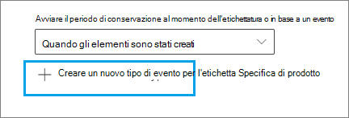

# <a name="start-retention-when-an-event-occurs"></a><span data-ttu-id="36517-103">Avviare la conservazione al verificarsi di un evento</span><span class="sxs-lookup"><span data-stu-id="36517-103">Start retention when an event occurs</span></span>

><span data-ttu-id="36517-104">*[Indicazioni per l'assegnazione di licenze di Microsoft 365 per sicurezza e conformità](https://aka.ms/ComplianceSD).*</span><span class="sxs-lookup"><span data-stu-id="36517-104">*[Microsoft 365 licensing guidance for security & compliance](https://aka.ms/ComplianceSD).*</span></span>

<span data-ttu-id="36517-p101">Quando si conserva il contenuto, il periodo di conservazione spesso si basa sulla data di creazione del contenuto stesso. Ad esempio, è possibile conservare i documenti per sette anni dalla creazione e quindi eliminarli. Quando si configurano [etichette di conservazione](retention.md#retention-labels), invece, il periodo di conservazione può essere basato anche sul momento in cui si verifica un determinato tipo di evento. L'evento attiva l'inizio del periodo di conservazione e a tutto il contenuto a cui è applicata un'etichetta di conservazione per quel tipo di evento vengono applicate le azioni di conservazione dell'etichetta.</span><span class="sxs-lookup"><span data-stu-id="36517-p101">When you retain content, the retention period is often based on the age of the content. For example, you might retain documents for seven years after they're created and then delete them. But when you configure [retention labels](retention.md#retention-labels), you can also base a retention period on when a specific type of event occurs. The event triggers the start of the retention period, and all content with a retention label applied for that type of event get the label's retention actions enforced on them.</span></span>
  
<span data-ttu-id="36517-109">Esempi per l'uso della conservazione basata su eventi:</span><span class="sxs-lookup"><span data-stu-id="36517-109">Examples for using event-based retention:</span></span>
  
- <span data-ttu-id="36517-110">**Dipendenti che lasciano l'organizzazione** Si supponga che i record dei dipendenti debbano essere conservati per 10 anni dal momento in cui lasciano l'organizzazione.</span><span class="sxs-lookup"><span data-stu-id="36517-110">**Employees leaving the organization** Suppose that employee records must be retained for 10 years from the time an employee leaves the organization.</span></span> <span data-ttu-id="36517-111">Trascorsi 10 anni, tutti i documenti relativi all'assunzione, alle prestazioni e alla cessazione del rapporto lavorativo di quel dipendente devono essere eliminati.</span><span class="sxs-lookup"><span data-stu-id="36517-111">After 10 years elapse, all documents related to the hiring, performance, and termination of that employee must be disposed.</span></span> <span data-ttu-id="36517-112">L'evento che attiva il periodo di conservazione di 10 anni è l'uscita del dipendente dall'organizzazione.</span><span class="sxs-lookup"><span data-stu-id="36517-112">The event that triggers the 10-year retention period is the employee leaving the organization.</span></span> 
    
- <span data-ttu-id="36517-113">**Scadenza del contratto** Si supponga che tutti i record relativi ai contratti debbano essere conservati per cinque anni dalla data di scadenza del contratto.</span><span class="sxs-lookup"><span data-stu-id="36517-113">**Contract expiration** Suppose that all records related to contracts must be retained for five years from the time the contract expires.</span></span> <span data-ttu-id="36517-114">L'evento che attiva il periodo di conservazione di cinque anni è la scadenza del contratto.</span><span class="sxs-lookup"><span data-stu-id="36517-114">The event that triggers the five-year retention period is the expiration of the contract.</span></span> 
    
- <span data-ttu-id="36517-p104">**Durata del prodotto** L'organizzazione potrebbe avere requisiti di conservazione relativi all'ultima data di produzione dei prodotti per i contenuti, come le specifiche tecniche. In questo caso, l'ultima data di produzione è l'evento che attiva il periodo di conservazione.</span><span class="sxs-lookup"><span data-stu-id="36517-p104">**Product lifetime** Your organization might have retention requirements related to the last manufacturing date of products for content such as technical specifications. In this case, the last manufacturing date is the event that triggers the retention period.</span></span> 
    
<span data-ttu-id="36517-p105">La conservazione basata su eventi viene generalmente utilizzata come parte di un processo di gestione dei record. Ciò significa che:</span><span class="sxs-lookup"><span data-stu-id="36517-p105">Event-based retention is typically used as part of a records-management process. This means that:</span></span>
  
- <span data-ttu-id="36517-119">Anche le etichette basate su eventi marcano gli elementi come record, come parte di una soluzione di gestione dei record.</span><span class="sxs-lookup"><span data-stu-id="36517-119">Retention labels based on events also usually mark items as a record, as a part of a records management solution.</span></span> <span data-ttu-id="36517-120">Per altre informazioni, vedere [Informazioni sulla gestione dei record](records-management.md).</span><span class="sxs-lookup"><span data-stu-id="36517-120">For more information, see [Learn about records management](records-management.md).</span></span>

- <span data-ttu-id="36517-121">Un documento che è stato dichiarato un record ma il cui trigger di evento non è ancora stato eseguito viene conservato a tempo indeterminato (i record non possono essere eliminati in modo permanente) finché un evento non attiva il periodo di conservazione di quel documento.</span><span class="sxs-lookup"><span data-stu-id="36517-121">A document that's been declared a record but whose event trigger has not yet happened is retained indefinitely (records can't be permanently deleted), until an event triggers that document's retention period.</span></span>
    
- <span data-ttu-id="36517-122">Le etichette di conservazione basate su eventi di solito attivano una revisione per l'eliminazione alla fine del periodo di conservazione, in modo che un responsabile dei record possa rivedere ed eliminare manualmente il contenuto.</span><span class="sxs-lookup"><span data-stu-id="36517-122">Retention labels based on events usually trigger a disposition review at the end of the retention period, so that a records manager can manually review and dispose of the content.</span></span> <span data-ttu-id="36517-123">Per altre informazioni, vedere [Eliminazione dei contenuti](disposition.md).</span><span class="sxs-lookup"><span data-stu-id="36517-123">For more information, see [Disposition of content](disposition.md).</span></span>
    

<span data-ttu-id="36517-124">Un'etichetta di conservazione basata su un evento ha le stesse funzionalità di qualsiasi etichetta di conservazione in Microsoft 365.</span><span class="sxs-lookup"><span data-stu-id="36517-124">A retention label based on an event has the same capabilities as any retention label in Microsoft 365.</span></span> <span data-ttu-id="36517-125">Per altre informazioni, vedere [Informazioni sui criteri e sulle etichette di conservazione](retention.md).</span><span class="sxs-lookup"><span data-stu-id="36517-125">For more information, see [Learn about retention policies and retention labels](retention.md).</span></span>

## <a name="understanding-the-relationship-between-event-types-labels-events-and-asset-ids"></a><span data-ttu-id="36517-126">Informazioni sulla relazione tra tipi di eventi, etichette, eventi e ID delle risorse</span><span class="sxs-lookup"><span data-stu-id="36517-126">Understanding the relationship between event types, labels, events, and asset IDs</span></span>

<span data-ttu-id="36517-127">Per usare correttamente la conservazione basata su eventi, è importante comprendere la relazione tra tipi di eventi, etichette di conservazione, eventi e ID delle risorse come illustrato nei diagrammi e nella spiegazione seguenti:</span><span class="sxs-lookup"><span data-stu-id="36517-127">To successfully use event-based retention, it's important to understand the relationship between event types, retention labels, events, and asset IDs as illustrated in the diagrams and the explanation that follows:</span></span> 
  

  

  
1. <span data-ttu-id="36517-130">Vengono create etichette di conservazione per diversi tipi di contenuto, che vengono poi associate a un tipo di evento.</span><span class="sxs-lookup"><span data-stu-id="36517-130">You create retention labels for different types of content and then associate them with a type of event.</span></span> <span data-ttu-id="36517-131">Ad esempio, le etichette di conservazione per tipi diversi di file e record di prodotti sono associate a un tipo di evento denominato Durata del prodotto, in quanto tali record devono essere conservati per 10 anni dal momento in cui il prodotto raggiunge la fine del ciclo di vita.</span><span class="sxs-lookup"><span data-stu-id="36517-131">For example, retention labels for different types of product files and records are associated with an event type named Product Lifetime because those records must be retained for 10 years from the time the product reaches its end of life.</span></span>
    
2. <span data-ttu-id="36517-132">Gli utenti (in genere i responsabili dei record) applicano queste etichette di conservazione al contenuto e (per i documenti di SharePoint e OneDrive) immettono un ID risorsa per ogni elemento.</span><span class="sxs-lookup"><span data-stu-id="36517-132">Users (typically records managers) apply those retention labels to content and (for documents in SharePoint and OneDrive) enter an asset ID for each item.</span></span> <span data-ttu-id="36517-133">In questo esempio l'ID risorsa è un codice o nome del prodotto usato dall'organizzazione.</span><span class="sxs-lookup"><span data-stu-id="36517-133">In this example, the asset ID is a product name or code used by the organization.</span></span> <span data-ttu-id="36517-134">Pertanto, ai record di ogni prodotto viene assegnata un'etichetta di conservazione e ogni record ha una proprietà che contiene un ID risorsa.</span><span class="sxs-lookup"><span data-stu-id="36517-134">Then, each product's records are assigned a retention label, and each record has a property that contains an asset ID.</span></span> <span data-ttu-id="36517-135">Il diagramma rappresenta **tutto il contenuto** per tutti i record dei prodotti in un'organizzazione e ogni elemento contiene l'ID risorsa del prodotto a cui appartiene il record.</span><span class="sxs-lookup"><span data-stu-id="36517-135">The diagram represents **all the content** for all product records in an organization, and each item bears the asset ID of the product whose record it is.</span></span> 
    
3. <span data-ttu-id="36517-p111">Durata prodotto è il tipo di evento. Un prodotto specifico che raggiunge la fine del ciclo di vita è un evento. Quando si verifica un evento di questo tipo, in questo caso quando un prodotto raggiunge la fine del ciclo di vita, si crea un evento che specifica:</span><span class="sxs-lookup"><span data-stu-id="36517-p111">Product Lifetime is the event type; a specific product reaching end of life is an event. When an event of that event type occurs—in this case, when a product reaches its end of life—you create an event that specifies:</span></span>
    
   - <span data-ttu-id="36517-138">Un ID risorsa (per i documenti di SharePoint e OneDrive)</span><span class="sxs-lookup"><span data-stu-id="36517-138">An asset ID (for SharePoint and OneDrive documents)</span></span>
    
   - <span data-ttu-id="36517-p112">Parole chiave (per gli articoli di Exchange). In questo esempio, l'organizzazione utilizza un codice prodotto nei messaggi contenenti i record del prodotto, pertanto la parola chiave per gli elementi di Exchange è funzionalmente uguale all'ID risorsa per i documenti di SharePoint e OneDrive.</span><span class="sxs-lookup"><span data-stu-id="36517-p112">Keywords (for Exchange items). In this example, the organization uses a product code in messages containing product records, so the keyword for Exchange items is functionally the same as the asset ID for SharePoint and OneDrive documents.</span></span>
    
   - <span data-ttu-id="36517-p113">La data in cui si è verificato l'evento. Questa data viene utilizzata come inizio del periodo di conservazione. Questa data può essere la data attuale, una futura o una passata.</span><span class="sxs-lookup"><span data-stu-id="36517-p113">The date when the event occurred. This date is used as the start of the retention period. This date can be the current, a past, or a future date.</span></span>

4. <span data-ttu-id="36517-144">Dopo aver creato un evento, la data dell'evento viene sincronizzata con tutto il contenuto che ha un'etichetta di conservazione di quel tipo di evento e che contiene la parola chiave o l'ID risorsa specificato.</span><span class="sxs-lookup"><span data-stu-id="36517-144">After you create an event, that event date is synchronized to all the content that has a retention label of that event type and that contains the specified asset ID or keyword.</span></span> <span data-ttu-id="36517-145">Come per qualsiasi etichetta di conservazione, la sincronizzazione può richiedere fino a sette giorni.</span><span class="sxs-lookup"><span data-stu-id="36517-145">Like any retention label, this synchronization can take up to seven days.</span></span> <span data-ttu-id="36517-146">Come mostrato nel diagramma precedente, questo evento ha attivato il periodo di conservazione di tutti gli elementi cerchiati in rosso.</span><span class="sxs-lookup"><span data-stu-id="36517-146">In the previous diagram, all the items circled in red have their retention period triggered by this event.</span></span> <span data-ttu-id="36517-147">In altre parole, quando il prodotto raggiunge la fine del ciclo di vita, questo evento attiva il periodo di conservazione per i record del prodotto.</span><span class="sxs-lookup"><span data-stu-id="36517-147">In other words, when this product reaches its end of life, that event triggers the retention period for that product's records.</span></span>

<span data-ttu-id="36517-148">È importante tenere presente che se per un evento non si specificano le parole chiave o un ID risorsa, **l'evento attiverà il periodo di conservazione di ogni contenuto** con un'etichetta di conservazione corrispondente a quel tipo di evento.</span><span class="sxs-lookup"><span data-stu-id="36517-148">It's important to understand that if you don't specify an asset ID or keywords for an event, **all content** with a retention label of that event type will have its retention period triggered by the event.</span></span> <span data-ttu-id="36517-149">Nel diagramma precedente, ad esempio, verrebbe avviata la conservazione di tutto il contenuto.</span><span class="sxs-lookup"><span data-stu-id="36517-149">This means that in the previous diagram, all content would start being retained.</span></span> <span data-ttu-id="36517-150">Questo potrebbe non essere il risultato previsto.</span><span class="sxs-lookup"><span data-stu-id="36517-150">This might not be what you intend.</span></span>

<span data-ttu-id="36517-151">Tenere infine presente che ogni etichetta di conservazione ha le proprie impostazioni di conservazione.</span><span class="sxs-lookup"><span data-stu-id="36517-151">Finally, remember that each retention label has its own retention settings.</span></span> <span data-ttu-id="36517-152">In questo esempio, queste specificano tutte 10 anni ma un evento può attivare etichette con diversi periodi di conservazione.</span><span class="sxs-lookup"><span data-stu-id="36517-152">In this example, they all specify 10 years, but it's possible for an event to trigger retention labels where each label has a different retention period.</span></span>
  
## <a name="how-to-set-up-event-driven-retention"></a><span data-ttu-id="36517-153">Come configurare la conservazione basata su eventi</span><span class="sxs-lookup"><span data-stu-id="36517-153">How to set up event-driven retention</span></span>

<span data-ttu-id="36517-154">Flusso di lavoro di alto livello per la conservazione basata su eventi:</span><span class="sxs-lookup"><span data-stu-id="36517-154">High-level workflow for event-driven retention:</span></span>
  

  
> [!TIP]
> <span data-ttu-id="36517-156">Vedere [Usare etichette di riservatezza per gestire il ciclo di vita dei documenti archiviati in SharePoint](auto-apply-retention-labels-scenario.md) per uno scenario dettagliato sull'uso delle proprietà gestite in SharePoint per applicare automaticamente etichette di conservazione e implementare la conservazione basata su eventi.</span><span class="sxs-lookup"><span data-stu-id="36517-156">See [Use retention labels to manage the lifecycle of documents stored in SharePoint](auto-apply-retention-labels-scenario.md) for a detailed scenario about using managed properties in SharePoint to auto-apply retention labels and implement event-driven retention.</span></span>

### <a name="step-1-create-a-label-whose-retention-period-is-based-on-an-event"></a><span data-ttu-id="36517-157">Passaggio 1: creare un'etichetta il cui periodo di conservazione sia basato su un evento</span><span class="sxs-lookup"><span data-stu-id="36517-157">Step 1: Create a label whose retention period is based on an event</span></span>

<span data-ttu-id="36517-158">Per creare e configurare l'etichetta di conservazione, usare le istruzioni in [Creare e configurare le etichette di conservazione](create-retention-labels.md#create-and-configure-retention-labels).</span><span class="sxs-lookup"><span data-stu-id="36517-158">To create and configure your retention label, use the instructions from [Create and configure retention labels](create-retention-labels.md#create-and-configure-retention-labels).</span></span> <span data-ttu-id="36517-159">Ma specifico per la conservazione basata su eventi, nella pagina **Definisci impostazioni di conservazione** della procedura guidata Crea etichetta di conservazione, dopo **Avvia il periodo di conservazione in base a**, selezionare uno dei tipi di eventi predefiniti dall'elenco a discesa o creane uno personalizzato selezionando **Crea nuovo tipo di evento**:</span><span class="sxs-lookup"><span data-stu-id="36517-159">But specific to event-based retention, on the **Define retention settings** page of the Create retention label wizard, after **Start the retention period based on**, select one of the default event types from the dropdown list, or create your own by selecting **Create new event type**:</span></span>



<span data-ttu-id="36517-161">Un tipo di evento è semplicemente una descrizione generale di un evento a cui si vuole associare a un’etichetta di conservazione.</span><span class="sxs-lookup"><span data-stu-id="36517-161">An event type is simply a general description of an event that you want to associate with a retention label.</span></span>

<span data-ttu-id="36517-162">I tipi di evento predefiniti includono **(tipo di evento)** dopo il nome nell'elenco a discesa per semplificare l'identificazione ed è anche possibile visualizzare e creare il tipo di evento da **Gestione dei record** > **Eventi** scheda > **Gestisci tipi di eventi**.</span><span class="sxs-lookup"><span data-stu-id="36517-162">The default event types have **(event type)** after their name in the dropdown list for easier identification, and you can also see and create event type from the **Records management** > **Events** tab > **Manage event types**.</span></span>

<span data-ttu-id="36517-163">La conservazione basata su eventi richiede impostazioni di conservazione che:</span><span class="sxs-lookup"><span data-stu-id="36517-163">Event-based retention requires retention settings that:</span></span>
  
- <span data-ttu-id="36517-164">Conservino il contenuto.</span><span class="sxs-lookup"><span data-stu-id="36517-164">Retain the content.</span></span>
    
- <span data-ttu-id="36517-165">Eliminino il contenuto automaticamente o attivino una revisione per l'eliminazione alla fine del periodo di conservazione.</span><span class="sxs-lookup"><span data-stu-id="36517-165">Delete the content automatically or trigger a disposition review at the end of the retention period.</span></span>
  
<span data-ttu-id="36517-166">La conservazione basata su eventi viene in genere usata per il contenuto dichiarato come record, quindi questo è il momento giusto per verificare se occorre selezionare anche l'opzione per contrassegnare il contenuto come [record](records-management.md#records).</span><span class="sxs-lookup"><span data-stu-id="36517-166">Event-based retention is typically used for content that's declared a record, so this is a good time to check whether you also need to select the option that marks content as a [record](records-management.md#records).</span></span>

<span data-ttu-id="36517-167">Se si sta usando un tipo di evento esistente anziché creare un nuovo tipo di evento, andare al passaggio 3.</span><span class="sxs-lookup"><span data-stu-id="36517-167">If you're using an existing event type rather than creating a new event type, skip to step 3.</span></span>

> [!NOTE]
> <span data-ttu-id="36517-168">Dopo aver scelto un tipo di evento e salvato l'etichetta di conservazione, il tipo di evento non può essere modificato.</span><span class="sxs-lookup"><span data-stu-id="36517-168">After you choose an event type and save the retention label, the event type cannot be changed.</span></span>

### <a name="step-2-create-a-new-event-type-for-your-label"></a><span data-ttu-id="36517-169">Passaggio 2: creare un nuovo tipo di evento per l’etichetta</span><span class="sxs-lookup"><span data-stu-id="36517-169">Step 2: Create a new event type for your label</span></span>

<span data-ttu-id="36517-170">Per le impostazioni di conservazione, se si è selezionato **Creare un nuovo tipo di evento**, immettere un nome e una descrizione per il tipo di evento.</span><span class="sxs-lookup"><span data-stu-id="36517-170">For the retention settings, if you selected **Create new event type**, enter a name and description for your event type.</span></span> <span data-ttu-id="36517-171">Selezionare **Avanti**, **Invia**, e **Fatto**.</span><span class="sxs-lookup"><span data-stu-id="36517-171">Then select **Next**, **Submit**, and **Done**.</span></span>

<span data-ttu-id="36517-172">Tornare alla pagina **Definisci impostazioni di conservazione**. Nell'opzione **Avvia il periodo di conservazione in base a**, usare l’elenco a discesa per selezionare il tipo di evento creato.</span><span class="sxs-lookup"><span data-stu-id="36517-172">Back on the **Define retention settings** page, for **Start the retention period based on**, use the dropdown list to select the event type that you created.</span></span>

  
### <a name="step-3-publish-or-auto-apply-the-event-based-retention-labels"></a><span data-ttu-id="36517-173">Passaggio 3: pubblicare o applicare automaticamente le etichette di conservazione basate su eventi</span><span class="sxs-lookup"><span data-stu-id="36517-173">Step 3: Publish or auto-apply the event-based retention labels</span></span>

<span data-ttu-id="36517-174">Come per qualsiasi etichetta di conservazione, è necessario pubblicare o applicare automaticamente un'etichetta basata su eventi perché venga applicata manualmente o automaticamente al contenuto:</span><span class="sxs-lookup"><span data-stu-id="36517-174">Just like any retention label, you need to publish or auto-apply an event-based label, for it to be manually or automatically applied to content:</span></span>
- [<span data-ttu-id="36517-175">Creare etichette di conservazione e applicarle nelle app</span><span class="sxs-lookup"><span data-stu-id="36517-175">Create retention labels and apply them in apps</span></span>](create-apply-retention-labels.md)
- [<span data-ttu-id="36517-176">Applicare automaticamente un'etichetta di conservazione al contenuto</span><span class="sxs-lookup"><span data-stu-id="36517-176">Apply a retention label to content automatically</span></span>](apply-retention-labels-automatically.md)

### <a name="step-4-enter-an-asset-id"></a><span data-ttu-id="36517-177">Passaggio 4: immettere un ID risorsa</span><span class="sxs-lookup"><span data-stu-id="36517-177">Step 4: Enter an asset ID</span></span>

<span data-ttu-id="36517-178">Dopo avere applicato al contenuto un'etichetta basata su eventi, è possibile immettere un ID risorsa per ogni elemento.</span><span class="sxs-lookup"><span data-stu-id="36517-178">After an event-based label is applied to content, you can enter an asset ID for each item.</span></span> <span data-ttu-id="36517-179">Ad esempio, l'organizzazione può usare:</span><span class="sxs-lookup"><span data-stu-id="36517-179">For example, your organization might use:</span></span>
  
- <span data-ttu-id="36517-180">Codici prodotto da utilizzare per conservare i contenuti solo per un prodotto specifico.</span><span class="sxs-lookup"><span data-stu-id="36517-180">Product codes that you can use to retain content for only a specific product.</span></span>
    
- <span data-ttu-id="36517-181">Codici prodotto da utilizzare per conservare i contenuti solo per un progetto specifico.</span><span class="sxs-lookup"><span data-stu-id="36517-181">Project codes that you can use to retain content for only a specific project.</span></span>
    
- <span data-ttu-id="36517-182">ID dipendente da utilizzare per conservare i contenuti solo per una persona specifica.</span><span class="sxs-lookup"><span data-stu-id="36517-182">Employee IDs that you can use to retain content for only a specific person.</span></span>
    
<span data-ttu-id="36517-183">L'ID risorsa è semplicemente un'ulteriore proprietà di un documento disponibile in SharePoint e OneDrive.</span><span class="sxs-lookup"><span data-stu-id="36517-183">Asset ID is simply another document property that's available in SharePoint and OneDrive.</span></span> <span data-ttu-id="36517-184">L’organizzazione potrebbe usare già altre proprietà del documento e altri ID per classificare il contenuto.</span><span class="sxs-lookup"><span data-stu-id="36517-184">Your organization might already use other document properties and IDs to classify content.</span></span> <span data-ttu-id="36517-185">In questo caso, è possibile usare anche quelle proprietà e quei valori quando si crea l'evento (vedere il Passaggio 6 di seguito).</span><span class="sxs-lookup"><span data-stu-id="36517-185">If so, you can also use those properties and values when you create an event—see step 6 that follows.</span></span> <span data-ttu-id="36517-186">L'aspetto importante è che si deve usare una certa combinazione *proprietà:valore* nelle proprietà del documento per associare l'elemento a un tipo di evento.</span><span class="sxs-lookup"><span data-stu-id="36517-186">The important point is that you must use some *property:value* combination in the document properties to associate that item with an event type.</span></span>
  

  
### <a name="step-5-create-an-event"></a><span data-ttu-id="36517-188">Passaggio 5: creare un evento</span><span class="sxs-lookup"><span data-stu-id="36517-188">Step 5: Create an event</span></span>

<span data-ttu-id="36517-189">Quando si verifica un'istanza particolare di quel tipo di evento, ad esempio quando un prodotto raggiunge la fine del ciclo di vita, accedere alla pagina **Gestione record** > **Eventi** nel Centro conformità Microsoft 365 e selezionare **+ Crea** per creare un evento.</span><span class="sxs-lookup"><span data-stu-id="36517-189">When a particular instance of that event type occurs, such as a product reaches its end of life, go to the **Records management** > **Events** page in the Microsoft 365 compliance center, and select **+ Create** to create an event.</span></span> <span data-ttu-id="36517-190">Per attivare l’evento occorre crearlo qui.</span><span class="sxs-lookup"><span data-stu-id="36517-190">You trigger the event by creating it, here.</span></span>


### <a name="step-6-choose-the-same-event-type-used-by-the-label-in-step-2"></a><span data-ttu-id="36517-192">Passaggio 6: scegliere lo stesso tipo di evento utilizzato per l'etichetta nel Passaggio 2</span><span class="sxs-lookup"><span data-stu-id="36517-192">Step 6: Choose the same event type used by the label in step 2</span></span>

<span data-ttu-id="36517-193">Durante la creazione dell'evento, scegliere lo stesso tipo di evento specificato nelle impostazioni dell'etichetta di conservazione nel passaggio 2.</span><span class="sxs-lookup"><span data-stu-id="36517-193">When you create the event, choose the same event type specified in the retention label settings in step 2.</span></span> <span data-ttu-id="36517-194">Ad esempio, se è stata selezionata l'opzione **Durata del prodotto** come tipo di evento per le impostazioni dell'etichetta, selezionare **Durata del prodotto** quando si crea l'evento.</span><span class="sxs-lookup"><span data-stu-id="36517-194">For example, if you selected **Product Lifetime** as your event type for the label settings, select **Product Lifetime** when you create the event.</span></span> <span data-ttu-id="36517-195">Il periodo di conservazione verrà attivato solo per il contenuto a cui sono applicate le etichette di conservazione di quel tipo di evento.</span><span class="sxs-lookup"><span data-stu-id="36517-195">Only content with retention labels applied to it of that event type will have its retention period triggered.</span></span>


<span data-ttu-id="36517-197">In alternativa, se è necessario creare un evento per più etichette di conservazione con tipi di evento diversi, selezionare l'opzione **Scegliere etichette esistenti**.</span><span class="sxs-lookup"><span data-stu-id="36517-197">Alternatively, if you need to create an event for multiple retention labels that have different event types, select the **Choose Existing Labels** option.</span></span> <span data-ttu-id="36517-198">Selezionare quindi le etichette configurate per i tipi di evento che si vuole associare all'evento.</span><span class="sxs-lookup"><span data-stu-id="36517-198">Then, select the labels that are configured for the event types you want to associate with this event.</span></span>

### <a name="step-7-enter-keywords-or-an-asset-id"></a><span data-ttu-id="36517-199">Passaggio 7: immettere parole chiave o un ID risorsa</span><span class="sxs-lookup"><span data-stu-id="36517-199">Step 7: Enter keywords or an asset ID</span></span>

<span data-ttu-id="36517-200">A questo punto si limiterà l’ambito del contenuto, specificando gli ID risorsa per il contenuto di SharePoint e OneDrive o le parole chiave per il contenuto di Exchange.</span><span class="sxs-lookup"><span data-stu-id="36517-200">Now you narrow the scope of the content by specifying asset IDs for SharePoint and OneDrive content, or keywords for Exchange content.</span></span> <span data-ttu-id="36517-201">Per gli ID risorsa, la conservazione verrà applicata solo al contenuto con la coppia *proprietà:valore* specificata.</span><span class="sxs-lookup"><span data-stu-id="36517-201">For asset IDs, retention will be enforced only on content with the specified *property:value* pair.</span></span> <span data-ttu-id="36517-202">Se non si immette un ID risorsa, a tutti i contenuti con etichette di quel tipo di evento verrà applicata la stessa data di conservazione.</span><span class="sxs-lookup"><span data-stu-id="36517-202">If an asset ID is not entered, all content with labels of that event type get the same retention date applied to them.</span></span>

<span data-ttu-id="36517-203">Ad esempio: se si usa la proprietà ID risorsa, immettere `ComplianceAssetID:<value>` nella casella relativa agli ID risorsa mostrati sotto.</span><span class="sxs-lookup"><span data-stu-id="36517-203">For example: If you're using the Asset ID property, enter `ComplianceAssetID:<value>` in the box for asset IDs shown below.</span></span>
  
<span data-ttu-id="36517-204">È possibile che l'organizzazione abbia applicato altre proprietà e altri ID ai documenti correlati al tipo di evento.</span><span class="sxs-lookup"><span data-stu-id="36517-204">Your organization might have applied other properties and IDs to the documents related to this event type.</span></span> <span data-ttu-id="36517-205">Ad esempio, se è necessario individuare i record di un prodotto specifico, l'ID può essere una combinazione della proprietà personalizzata ProductID e del valore "XYZ"</span><span class="sxs-lookup"><span data-stu-id="36517-205">For example, if you need to detect a specific product's records, the ID might be a combination of your custom property ProductID and the value "XYZ".</span></span> <span data-ttu-id="36517-206">In questo caso, si immetterà `ProductID:XYZ` nella casella per gli ID risorsa mostrata nell'immagine seguente.</span><span class="sxs-lookup"><span data-stu-id="36517-206">In this case, you'd enter `ProductID:XYZ` in the box for asset IDs shown in the following picture.</span></span>
  
<span data-ttu-id="36517-207">Per gli elementi di Exchange includere parole chiave.</span><span class="sxs-lookup"><span data-stu-id="36517-207">For Exchange items, use keywords.</span></span> <span data-ttu-id="36517-208">È possibile usare una query con gli operatori di ricerca come AND, OR e NOT.</span><span class="sxs-lookup"><span data-stu-id="36517-208">You can use a query by using search operators such as AND, OR, and NOT.</span></span> <span data-ttu-id="36517-209">Per altre informazioni, vedere [Query con parola chiave e condizioni di ricerca per la ricerca di contenuto](keyword-queries-and-search-conditions.md).</span><span class="sxs-lookup"><span data-stu-id="36517-209">For more information, see [Keyword queries and search conditions for Content Search](keyword-queries-and-search-conditions.md).</span></span>
  
<span data-ttu-id="36517-210">Infine, scegliere la data in cui si è verificato l'evento; questa data viene utilizzata come inizio del periodo di conservazione.</span><span class="sxs-lookup"><span data-stu-id="36517-210">Finally, choose the date when the event occurred; this date is used as the start of the retention period.</span></span> <span data-ttu-id="36517-211">Dopo aver creato un evento, la data dell'evento viene sincronizzata con tutto i contenuti che hanno un'etichetta di conservazione per il tipo di evento, l'ID risorsa e le parole chiave.</span><span class="sxs-lookup"><span data-stu-id="36517-211">After you create an event, that event date is synchronized to all the content with a retention label of that event type, asset ID, and keywords.</span></span> <span data-ttu-id="36517-212">Come per qualsiasi etichetta di conservazione, la sincronizzazione può richiedere fino a sette giorni.</span><span class="sxs-lookup"><span data-stu-id="36517-212">As with any retention label, this synchronization can take up to seven days.</span></span>
  


<span data-ttu-id="36517-214">Dopo la creazione di un evento, le impostazioni di conservazione vengono applicate al contenuto già etichettato e indicizzato.</span><span class="sxs-lookup"><span data-stu-id="36517-214">After creating an event, the retention settings take effect for the content that's already labeled and indexed.</span></span> <span data-ttu-id="36517-215">Se l'etichetta di conservazione viene aggiunta al nuovo contenuto dopo la creazione dell'evento, è necessario creare un nuovo evento con gli stessi dettagli.</span><span class="sxs-lookup"><span data-stu-id="36517-215">If the retention label is added to new content after the event is created, you must create a new event with the same details.</span></span>

<span data-ttu-id="36517-216">L'eliminazione di un evento non annulla le impostazioni di conservazione attualmente in vigore per il contenuto già etichettato.</span><span class="sxs-lookup"><span data-stu-id="36517-216">Deleting an event doesn't cancel the retention settings that are now in effect for the content that's already labeled.</span></span> <span data-ttu-id="36517-217">Per fare questo, creare un nuovo evento con gli stessi dettagli, ma lasciare vuota la data.</span><span class="sxs-lookup"><span data-stu-id="36517-217">To do that, create a new event with the same details, but leave the date blank.</span></span> 

## <a name="use-content-search-to-find-all-content-with-a-specific-label-or-asset-id"></a><span data-ttu-id="36517-218">Usare Ricerca contenuto per trovare tutto il contenuto con un'etichetta o un ID risorsa specifico</span><span class="sxs-lookup"><span data-stu-id="36517-218">Use Content Search to find all content with a specific label or asset ID</span></span>

<span data-ttu-id="36517-219">Dopo che le etichette di conservazione sono state assegnate al contenuto, è possibile usare la funzionalità di ricerca di contenuto per trovare tutti i contenuti classificati con un'etichetta di conservazione specifica o che contengono un ID risorsa specifico:</span><span class="sxs-lookup"><span data-stu-id="36517-219">After retention labels are assigned to content, you can use content search to find all content that's classified with a specific retention label or that contains a specific asset ID:</span></span>
  
- <span data-ttu-id="36517-220">Per trovare tutto il contenuto con un'etichetta di conservazione specifica, selezionare la condizione **Etichetta di conservazione**, quindi immettere il nome completo dell'etichetta o parte di esso e usare un carattere jolly.</span><span class="sxs-lookup"><span data-stu-id="36517-220">To find all content with a specific retention label, choose the **Retention label** condition, and then enter the complete label name or part of the label name and use a wildcard.</span></span> 
    
- <span data-ttu-id="36517-221">Per trovare tutto il contenuto con un ID risorsa specifico, inserire la proprietà **ComplianceAssetID** e un valore, usando il formato `ComplianceAssetID:<value>`.</span><span class="sxs-lookup"><span data-stu-id="36517-221">To find all content with a specific asset ID, enter the **ComplianceAssetID** property and a value, using the format `ComplianceAssetID:<value>`.</span></span> 
    
<span data-ttu-id="36517-222">Per altre informazioni, vedere [Query con parola chiave e condizioni di ricerca per la ricerca di contenuto](keyword-queries-and-search-conditions.md).</span><span class="sxs-lookup"><span data-stu-id="36517-222">For more information, see [Keyword queries and search conditions for Content Search](keyword-queries-and-search-conditions.md).</span></span>

## <a name="automate-events-by-using-powershell"></a><span data-ttu-id="36517-223">Automatizzare gli eventi con PowerShell</span><span class="sxs-lookup"><span data-stu-id="36517-223">Automate events by using PowerShell</span></span>

<span data-ttu-id="36517-224">È possibile usare uno script di PowerShell per automatizzare la conservazione basata su eventi dalle applicazioni aziendali.</span><span class="sxs-lookup"><span data-stu-id="36517-224">You can use a PowerShell script to automate event-based retention from your business applications.</span></span> <span data-ttu-id="36517-225">Cmdlet di PowerShell disponibili per la conservazione basata su eventi:</span><span class="sxs-lookup"><span data-stu-id="36517-225">The PowerShell cmdlets available for event-based retention:</span></span>
  
- [<span data-ttu-id="36517-226">Get-ComplianceRetentionEventType</span><span class="sxs-lookup"><span data-stu-id="36517-226">Get-ComplianceRetentionEventType</span></span>](https://go.microsoft.com/fwlink/?linkid=873002)
    
- [<span data-ttu-id="36517-227">New-ComplianceRetentionEventType</span><span class="sxs-lookup"><span data-stu-id="36517-227">New-ComplianceRetentionEventType</span></span>](https://go.microsoft.com/fwlink/?linkid=873004)
    
- [<span data-ttu-id="36517-228">Remove-ComplianceRetentionEventType</span><span class="sxs-lookup"><span data-stu-id="36517-228">Remove-ComplianceRetentionEventType</span></span>](https://go.microsoft.com/fwlink/?linkid=873005)
    
- [<span data-ttu-id="36517-229">Set-ComplianceRetentionEventType</span><span class="sxs-lookup"><span data-stu-id="36517-229">Set-ComplianceRetentionEventType</span></span>](https://go.microsoft.com/fwlink/?linkid=873006)
    
- [<span data-ttu-id="36517-230">Get-ComplianceRetentionEvent</span><span class="sxs-lookup"><span data-stu-id="36517-230">Get-ComplianceRetentionEvent</span></span>](https://go.microsoft.com/fwlink/?linkid=873001)
    
- [<span data-ttu-id="36517-231">New-ComplianceRetentionEvent</span><span class="sxs-lookup"><span data-stu-id="36517-231">New-ComplianceRetentionEvent</span></span>](https://go.microsoft.com/fwlink/?linkid=873003)
    

## <a name="automate-events-by-using-a-rest-api"></a><span data-ttu-id="36517-232">Automatizzare gli eventi con un'API REST</span><span class="sxs-lookup"><span data-stu-id="36517-232">Automate events by using a REST API</span></span>

<span data-ttu-id="36517-233">È possibile usare un'API REST per creare automaticamente gli eventi che attivano l'inizio del periodo di conservazione.</span><span class="sxs-lookup"><span data-stu-id="36517-233">You can use a REST API to automatically create the events that trigger the start of the retention time.</span></span>

<span data-ttu-id="36517-234">Un'API REST è un endpoint di servizio che supporta set di operazioni HTTP (metodi), che forniscono l'accesso alle risorse del servizio per la creazione, il recupero, l'aggiornamento e l'eliminazione.</span><span class="sxs-lookup"><span data-stu-id="36517-234">A REST API is a service endpoint that supports sets of HTTP operations (methods), which provide create/retrieve/update/delete access to the service's resources.</span></span> <span data-ttu-id="36517-235">Per altre informazioni, vedere [Componenti di una richiesta/risposta dell'API REST](https://docs.microsoft.com/rest/api/gettingstarted/#components-of-a-rest-api-requestresponse).</span><span class="sxs-lookup"><span data-stu-id="36517-235">For more information, see [Components of a REST API request/response](https://docs.microsoft.com/rest/api/gettingstarted/#components-of-a-rest-api-requestresponse).</span></span> <span data-ttu-id="36517-236">Con l'API REST di Microsoft 365 è possibile creare e recuperare gli eventi usando i metodi POST e GET.</span><span class="sxs-lookup"><span data-stu-id="36517-236">By using the Microsoft 365 REST API, events can be created and retrieved using the POST and GET methods.</span></span>

<span data-ttu-id="36517-237">Sono disponibili due opzioni per usare l'API REST:</span><span class="sxs-lookup"><span data-stu-id="36517-237">There are two options for using the REST API:</span></span>

- <span data-ttu-id="36517-238">**Microsoft Power Automate o delle applicazioni simili** per attivare automaticamente l'occorrenza di un evento.</span><span class="sxs-lookup"><span data-stu-id="36517-238">**Microsoft Power Automate or a similar application** to trigger the occurrence of an event automatically.</span></span> <span data-ttu-id="36517-239">Microsoft Power Automate è un agente di orchestrazione per la connessione ad altri sistemi, quindi non è necessario scrivere una soluzione personalizzata.</span><span class="sxs-lookup"><span data-stu-id="36517-239">Microsoft Power Automate is an orchestrator for connecting to other systems, so you don't need to write a custom solution.</span></span> <span data-ttu-id="36517-240">Per altre informazioni, vedere il [sito Web di Power Automate](https://flow.microsoft.com/it-IT/).</span><span class="sxs-lookup"><span data-stu-id="36517-240">For more information, see the [Power Automate website](https://flow.microsoft.com/it-IT/).</span></span>

- <span data-ttu-id="36517-241">**PowerShell o un client HTTP per richiamare l'API REST** per creare eventi con PowerShell (versione 6 o successiva) nell'ambito di una soluzione personalizzata.</span><span class="sxs-lookup"><span data-stu-id="36517-241">**PowerShell or an HTTP client to call the REST API** to create events by using PowerShell (version 6 or later), which is part of a custom solution.</span></span>

<span data-ttu-id="36517-242">Prima di usare l'API REST, come amministratore globale, confermare l'URL da usare per chiamare l'evento di conservazione.</span><span class="sxs-lookup"><span data-stu-id="36517-242">Before you use the REST API, as a global administrator, confirm the URL to use for the retention event call.</span></span> <span data-ttu-id="36517-243">A questo scopo, eseguire una chiamata all'evento di conservazione GET usando l'URL dell'API REST:</span><span class="sxs-lookup"><span data-stu-id="36517-243">To do this, run a GET retention event call by using the REST API URL:</span></span>

```console
https://ps.compliance.protection.outlook.com/psws/service.svc/ComplianceRetentionEvent
```

<span data-ttu-id="36517-244">Controllare il codice di risposta.</span><span class="sxs-lookup"><span data-stu-id="36517-244">Check the response code.</span></span> <span data-ttu-id="36517-245">Se è 302, ottenere l'URL reindirizzato dalla proprietà Location dell'intestazione della risposta e usare tale URL anziché `https://ps.compliance.protection.outlook.com/psws/service.svc/ComplianceRetentionEvent` nelle istruzioni che seguono.</span><span class="sxs-lookup"><span data-stu-id="36517-245">If it's 302, get the redirected URL from the Location property of the response header and use that URL instead of `https://ps.compliance.protection.outlook.com/psws/service.svc/ComplianceRetentionEvent` in the instructions that follow.</span></span>

<span data-ttu-id="36517-246">Gli eventi che vengono creati automaticamente possono essere confermati visualizzandoli in Centro conformità Microsoft 365 > **Gestione record** >  **eventi**.</span><span class="sxs-lookup"><span data-stu-id="36517-246">The events that get automatically created can be confirmed by viewing them in the Microsoft 365 compliance center > **Records management** >  **Events**.</span></span>

### <a name="use-microsoft-power-automate-to-create-the-event"></a><span data-ttu-id="36517-247">Usare Microsoft Power Automate per creare l'evento</span><span class="sxs-lookup"><span data-stu-id="36517-247">Use Microsoft Power Automate to create the event</span></span>

<span data-ttu-id="36517-248">Creare un flusso che crea un evento usando l'API REST di Microsoft 365:</span><span class="sxs-lookup"><span data-stu-id="36517-248">Create a flow that creates an event using the Microsoft 365 REST API:</span></span>


#### <a name="create-an-event"></a><span data-ttu-id="36517-251">Creare un evento</span><span class="sxs-lookup"><span data-stu-id="36517-251">Create an event</span></span>

<span data-ttu-id="36517-252">Codice di esempio per chiamare l'API REST:</span><span class="sxs-lookup"><span data-stu-id="36517-252">Sample code to call the REST API:</span></span>

- <span data-ttu-id="36517-253">**Metodo**: POST</span><span class="sxs-lookup"><span data-stu-id="36517-253">**Method**: POST</span></span>
- <span data-ttu-id="36517-254">**URL**: `https://ps.compliance.protection.outlook.com/psws/service.svc/ComplianceRetentionEvent`</span><span class="sxs-lookup"><span data-stu-id="36517-254">**URL**: `https://ps.compliance.protection.outlook.com/psws/service.svc/ComplianceRetentionEvent`</span></span>
- <span data-ttu-id="36517-255">**Intestazioni**: Chiave = Content-Type, Valore = application/atom+xml</span><span class="sxs-lookup"><span data-stu-id="36517-255">**Headers**: Key = Content-Type, Value = application/atom+xml</span></span>
- <span data-ttu-id="36517-256">**Corpo**:</span><span class="sxs-lookup"><span data-stu-id="36517-256">**Body**:</span></span>
    
    ```xml
    <?xml version='1.0' encoding='utf-8' standalone='yes'?>
    
    <entry xmlns:d='http://schemas.microsoft.com/ado/2007/08/dataservices'
    
    xmlns:m='http://schemas.microsoft.com/ado/2007/08/dataservices/metadata'
    
    xmlns='http://www.w3.org/2005/Atom'>
    
    <category scheme='http://schemas.microsoft.com/ado/2007/08/dataservices/scheme' term='Exchange.ComplianceRetentionEvent' />
    
    <updated>9/9/2017 10:50:00 PM</updated>
    
    <content type='application/xml'>
    
    <m:properties>
    
    <d:Name>Employee Termination </d:Name>
    
    <d:EventType>99e0ae64-a4b8-40bb-82ed-645895610f56</d:EventType>
    
    <d:SharePointAssetIdQuery>1234</d:SharePointAssetIdQuery>
    
    <d:EventDateTime>2018-12-01T00:00:00Z </d:EventDateTime>
    
    </m:properties>
    
    </content>
    
    </entry>
    ```
    
- <span data-ttu-id="36517-257">**Autenticazione**: di base</span><span class="sxs-lookup"><span data-stu-id="36517-257">**Authentication**: Basic</span></span>
- <span data-ttu-id="36517-258">**Nome utente**: "Complianceuser"</span><span class="sxs-lookup"><span data-stu-id="36517-258">**Username**: "Complianceuser"</span></span>
- <span data-ttu-id="36517-259">**Password**: "Compliancepassword"</span><span class="sxs-lookup"><span data-stu-id="36517-259">**Password**: "Compliancepassword"</span></span>


##### <a name="available-parameters"></a><span data-ttu-id="36517-260">Parametri disponibili</span><span class="sxs-lookup"><span data-stu-id="36517-260">Available parameters</span></span>


|<span data-ttu-id="36517-261">Parametri</span><span class="sxs-lookup"><span data-stu-id="36517-261">Parameters</span></span>|<span data-ttu-id="36517-262">Descrizione</span><span class="sxs-lookup"><span data-stu-id="36517-262">Description</span></span>|<span data-ttu-id="36517-263">Note</span><span class="sxs-lookup"><span data-stu-id="36517-263">Notes</span></span>|
|--- |--- |--- |
|<span data-ttu-id="36517-264"><d:Name></d:Name></span><span class="sxs-lookup"><span data-stu-id="36517-264"><d:Name></d:Name></span></span>|<span data-ttu-id="36517-265">Immettere un nome univoco per l'evento,</span><span class="sxs-lookup"><span data-stu-id="36517-265">Provide a unique name for the event,</span></span>|<span data-ttu-id="36517-266">Non può contenere spazi iniziali o finali o i caratteri seguenti: % \* \ & < \> \| # ?</span><span class="sxs-lookup"><span data-stu-id="36517-266">Cannot contain trailing spaces or the following characters: % \* \ & < \> \| # ?</span></span> <span data-ttu-id="36517-267">, : ;</span><span class="sxs-lookup"><span data-stu-id="36517-267">, : ;</span></span>|
|<span data-ttu-id="36517-268"><d:EventType></d:EventType></span><span class="sxs-lookup"><span data-stu-id="36517-268"><d:EventType></d:EventType></span></span>|<span data-ttu-id="36517-269">Immettere il nome del tipo di evento (o Guid)</span><span class="sxs-lookup"><span data-stu-id="36517-269">Enter event type name (or Guid),</span></span>|<span data-ttu-id="36517-270">Esempio: "Licenziamento dipendente".</span><span class="sxs-lookup"><span data-stu-id="36517-270">Example: "Employee termination".</span></span> <span data-ttu-id="36517-271">Il tipo di evento deve essere associato a un'etichetta di conservazione.</span><span class="sxs-lookup"><span data-stu-id="36517-271">Event type has to be associated with a retention label.</span></span>|
|<span data-ttu-id="36517-272"><d:SharePointAssetIdQuery></d:SharePointAssetIdQuery></span><span class="sxs-lookup"><span data-stu-id="36517-272"><d:SharePointAssetIdQuery></d:SharePointAssetIdQuery></span></span>|<span data-ttu-id="36517-273">Immettere "ComplianceAssetId:" + ID dipendente</span><span class="sxs-lookup"><span data-stu-id="36517-273">Enter "ComplianceAssetId:" + employee ID</span></span>|<span data-ttu-id="36517-274">Esempio: "ComplianceAssetId:12345"</span><span class="sxs-lookup"><span data-stu-id="36517-274">Example: "ComplianceAssetId:12345"</span></span>|
|<span data-ttu-id="36517-275"><d:EventDateTime></d:EventDateTime></span><span class="sxs-lookup"><span data-stu-id="36517-275"><d:EventDateTime></d:EventDateTime></span></span>|<span data-ttu-id="36517-276">Data e ora evento</span><span class="sxs-lookup"><span data-stu-id="36517-276">Event Date and Time</span></span>|<span data-ttu-id="36517-277">Formato: aaaa-MM-ggTHH:mm:ssZ, esempio: 2018-12-01T00:00:00Z</span><span class="sxs-lookup"><span data-stu-id="36517-277">Format: yyyy-MM-ddTHH:mm:ssZ, Example: 2018-12-01T00:00:00Z</span></span>
|

###### <a name="response-codes"></a><span data-ttu-id="36517-278">Codici di risposta</span><span class="sxs-lookup"><span data-stu-id="36517-278">Response codes</span></span>

| <span data-ttu-id="36517-279">Codice di risposta</span><span class="sxs-lookup"><span data-stu-id="36517-279">Response Code</span></span> | <span data-ttu-id="36517-280">Descrizione</span><span class="sxs-lookup"><span data-stu-id="36517-280">Description</span></span>       |
| ----------------- | --------------------- |
| <span data-ttu-id="36517-281">302</span><span class="sxs-lookup"><span data-stu-id="36517-281">302</span></span>               | <span data-ttu-id="36517-282">Reindirizzare</span><span class="sxs-lookup"><span data-stu-id="36517-282">Redirect</span></span>              |
| <span data-ttu-id="36517-283">201</span><span class="sxs-lookup"><span data-stu-id="36517-283">201</span></span>               | <span data-ttu-id="36517-284">Creato</span><span class="sxs-lookup"><span data-stu-id="36517-284">Created</span></span>               |
| <span data-ttu-id="36517-285">403</span><span class="sxs-lookup"><span data-stu-id="36517-285">403</span></span>               | <span data-ttu-id="36517-286">Autorizzazione non riuscita</span><span class="sxs-lookup"><span data-stu-id="36517-286">Authorization Failed</span></span>  |
| <span data-ttu-id="36517-287">401</span><span class="sxs-lookup"><span data-stu-id="36517-287">401</span></span>               | <span data-ttu-id="36517-288">Autenticazione non riuscita</span><span class="sxs-lookup"><span data-stu-id="36517-288">Authentication Failed</span></span> |

##### <a name="get-events-based-on-a-time-range"></a><span data-ttu-id="36517-289">Ricevere gli eventi in base a un intervallo di tempo</span><span class="sxs-lookup"><span data-stu-id="36517-289">Get events based on a time range</span></span>

- <span data-ttu-id="36517-290">**Metodo**: ottieni</span><span class="sxs-lookup"><span data-stu-id="36517-290">**Method**: GET</span></span>

- <span data-ttu-id="36517-291">**URL**: `https://ps.compliance.protection.outlook.com/psws/service.svc/ComplianceRetentionEvent?BeginDateTime=2019-01-11&EndDateTime=2019-01-16`</span><span class="sxs-lookup"><span data-stu-id="36517-291">**URL**: `https://ps.compliance.protection.outlook.com/psws/service.svc/ComplianceRetentionEvent?BeginDateTime=2019-01-11&EndDateTime=2019-01-16`</span></span>

- <span data-ttu-id="36517-292">**Intestazioni**: Chiave = Content-Type, Valore = application/atom+xml</span><span class="sxs-lookup"><span data-stu-id="36517-292">**Headers**: Key = Content-Type, Value = application/atom+xml</span></span>

- <span data-ttu-id="36517-293">**Autenticazione**: di base</span><span class="sxs-lookup"><span data-stu-id="36517-293">**Authentication**: Basic</span></span>

- <span data-ttu-id="36517-294">**Nome utente**: "Complianceuser"</span><span class="sxs-lookup"><span data-stu-id="36517-294">**Username**: "Complianceuser"</span></span>

- <span data-ttu-id="36517-295">**Password**: "Compliancepassword"</span><span class="sxs-lookup"><span data-stu-id="36517-295">**Password**: "Compliancepassword"</span></span>


###### <a name="response-codes"></a><span data-ttu-id="36517-296">Codici di risposta</span><span class="sxs-lookup"><span data-stu-id="36517-296">Response codes</span></span>

| <span data-ttu-id="36517-297">Codice di risposta</span><span class="sxs-lookup"><span data-stu-id="36517-297">Response Code</span></span> | <span data-ttu-id="36517-298">Descrizione</span><span class="sxs-lookup"><span data-stu-id="36517-298">Description</span></span>                   |
| ----------------- | --------------------------------- |
| <span data-ttu-id="36517-299">200</span><span class="sxs-lookup"><span data-stu-id="36517-299">200</span></span>               | <span data-ttu-id="36517-300">OK, un elenco di eventi in atom+ xml</span><span class="sxs-lookup"><span data-stu-id="36517-300">OK, A list of events in atom+ xml</span></span> |
| <span data-ttu-id="36517-301">404</span><span class="sxs-lookup"><span data-stu-id="36517-301">404</span></span>               | <span data-ttu-id="36517-302">Non trovato</span><span class="sxs-lookup"><span data-stu-id="36517-302">Not found</span></span>                         |
| <span data-ttu-id="36517-303">302</span><span class="sxs-lookup"><span data-stu-id="36517-303">302</span></span>               | <span data-ttu-id="36517-304">Reindirizzare</span><span class="sxs-lookup"><span data-stu-id="36517-304">Redirect</span></span>                          |
| <span data-ttu-id="36517-305">401</span><span class="sxs-lookup"><span data-stu-id="36517-305">401</span></span>               | <span data-ttu-id="36517-306">Autorizzazione non riuscita</span><span class="sxs-lookup"><span data-stu-id="36517-306">Authorization Failed</span></span>              |
| <span data-ttu-id="36517-307">403</span><span class="sxs-lookup"><span data-stu-id="36517-307">403</span></span>               | <span data-ttu-id="36517-308">Autenticazione non riuscita</span><span class="sxs-lookup"><span data-stu-id="36517-308">Authentication Failed</span></span>             |

##### <a name="get-an-event-by-id"></a><span data-ttu-id="36517-309">Ottenere un evento in base all'ID</span><span class="sxs-lookup"><span data-stu-id="36517-309">Get an event by ID</span></span>

- <span data-ttu-id="36517-310">**Metodo**: ottieni</span><span class="sxs-lookup"><span data-stu-id="36517-310">**Method**: GET</span></span>

- <span data-ttu-id="36517-311">**URL**: `https://ps.compliance.protection.outlook.com/psws/service.svc/ComplianceRetentionEvent('174e9a86-74ff-4450-8666-7c11f7730f66')`</span><span class="sxs-lookup"><span data-stu-id="36517-311">**URL**: `https://ps.compliance.protection.outlook.com/psws/service.svc/ComplianceRetentionEvent('174e9a86-74ff-4450-8666-7c11f7730f66')`</span></span>

- <span data-ttu-id="36517-312">**Intestazioni**: Chiave = Content-Type, Valore = application/atom+xml</span><span class="sxs-lookup"><span data-stu-id="36517-312">**Headers**: Key = Content-Type, Value = application/atom+xml</span></span>

- <span data-ttu-id="36517-313">**Autenticazione**: di base</span><span class="sxs-lookup"><span data-stu-id="36517-313">**Authentication**: Basic</span></span>

- <span data-ttu-id="36517-314">**Nome utente**: "Complianceuser"</span><span class="sxs-lookup"><span data-stu-id="36517-314">**Username**: "Complianceuser"</span></span>

- <span data-ttu-id="36517-315">**Password**: "Compliancepassword"</span><span class="sxs-lookup"><span data-stu-id="36517-315">**Password**: "Compliancepassword"</span></span>

###### <a name="response-codes"></a><span data-ttu-id="36517-316">Codici di risposta</span><span class="sxs-lookup"><span data-stu-id="36517-316">Response codes</span></span>

| <span data-ttu-id="36517-317">Codice di risposta</span><span class="sxs-lookup"><span data-stu-id="36517-317">Response Code</span></span> | <span data-ttu-id="36517-318">Descrizione</span><span class="sxs-lookup"><span data-stu-id="36517-318">Description</span></span>                                      |
| ----------------- | ---------------------------------------------------- |
| <span data-ttu-id="36517-319">200</span><span class="sxs-lookup"><span data-stu-id="36517-319">200</span></span>               | <span data-ttu-id="36517-320">OK, il corpo della risposta contiene l'evento in atom+xml</span><span class="sxs-lookup"><span data-stu-id="36517-320">OK, The response body contains the event in atom+xml</span></span> |
| <span data-ttu-id="36517-321">404</span><span class="sxs-lookup"><span data-stu-id="36517-321">404</span></span>               | <span data-ttu-id="36517-322">Non trovato</span><span class="sxs-lookup"><span data-stu-id="36517-322">Not found</span></span>                                            |
| <span data-ttu-id="36517-323">302</span><span class="sxs-lookup"><span data-stu-id="36517-323">302</span></span>               | <span data-ttu-id="36517-324">Reindirizzare</span><span class="sxs-lookup"><span data-stu-id="36517-324">Redirect</span></span>                                             |
| <span data-ttu-id="36517-325">401</span><span class="sxs-lookup"><span data-stu-id="36517-325">401</span></span>               | <span data-ttu-id="36517-326">Autorizzazione non riuscita</span><span class="sxs-lookup"><span data-stu-id="36517-326">Authorization Failed</span></span>                                 |
| <span data-ttu-id="36517-327">403</span><span class="sxs-lookup"><span data-stu-id="36517-327">403</span></span>               | <span data-ttu-id="36517-328">Autenticazione non riuscita</span><span class="sxs-lookup"><span data-stu-id="36517-328">Authentication Failed</span></span>                                |

##### <a name="get-an-event-by-name"></a><span data-ttu-id="36517-329">Ottenere un evento in base al nome</span><span class="sxs-lookup"><span data-stu-id="36517-329">Get an event by name</span></span>

- <span data-ttu-id="36517-330">**Metodo**: ottieni</span><span class="sxs-lookup"><span data-stu-id="36517-330">**Method**: GET</span></span>

- <span data-ttu-id="36517-331">**URL**: `https://ps.compliance.protection.outlook.com/psws/service.svc/ComplianceRetentionEvent`</span><span class="sxs-lookup"><span data-stu-id="36517-331">**URL**: `https://ps.compliance.protection.outlook.com/psws/service.svc/ComplianceRetentionEvent`</span></span>

- <span data-ttu-id="36517-332">**Intestazioni**: Chiave = Content-Type, Valore = application/atom+xml</span><span class="sxs-lookup"><span data-stu-id="36517-332">**Headers**: Key = Content-Type, Value = application/atom+xml</span></span>

- <span data-ttu-id="36517-333">**Autenticazione**: di base</span><span class="sxs-lookup"><span data-stu-id="36517-333">**Authentication**: Basic</span></span>

- <span data-ttu-id="36517-334">**Nome utente**: "Complianceuser"</span><span class="sxs-lookup"><span data-stu-id="36517-334">**Username**: "Complianceuser"</span></span>

- <span data-ttu-id="36517-335">**Password**: "Compliancepassword"</span><span class="sxs-lookup"><span data-stu-id="36517-335">**Password**: "Compliancepassword"</span></span>


###### <a name="response-codes"></a><span data-ttu-id="36517-336">Codici di risposta</span><span class="sxs-lookup"><span data-stu-id="36517-336">Response codes</span></span>

| <span data-ttu-id="36517-337">Codice di risposta</span><span class="sxs-lookup"><span data-stu-id="36517-337">Response Code</span></span> | <span data-ttu-id="36517-338">Descrizione</span><span class="sxs-lookup"><span data-stu-id="36517-338">Description</span></span>                                      |
| ----------------- | ---------------------------------------------------- |
| <span data-ttu-id="36517-339">200</span><span class="sxs-lookup"><span data-stu-id="36517-339">200</span></span>               | <span data-ttu-id="36517-340">OK, il corpo della risposta contiene l'evento in atom+xml</span><span class="sxs-lookup"><span data-stu-id="36517-340">OK, The response body contains the event in atom+xml</span></span> |
| <span data-ttu-id="36517-341">404</span><span class="sxs-lookup"><span data-stu-id="36517-341">404</span></span>               | <span data-ttu-id="36517-342">Non trovato</span><span class="sxs-lookup"><span data-stu-id="36517-342">Not found</span></span>                                            |
| <span data-ttu-id="36517-343">302</span><span class="sxs-lookup"><span data-stu-id="36517-343">302</span></span>               | <span data-ttu-id="36517-344">Reindirizzare</span><span class="sxs-lookup"><span data-stu-id="36517-344">Redirect</span></span>                                             |
| <span data-ttu-id="36517-345">401</span><span class="sxs-lookup"><span data-stu-id="36517-345">401</span></span>               | <span data-ttu-id="36517-346">Autorizzazione non riuscita</span><span class="sxs-lookup"><span data-stu-id="36517-346">Authorization Failed</span></span>                                 |
| <span data-ttu-id="36517-347">403</span><span class="sxs-lookup"><span data-stu-id="36517-347">403</span></span>               | <span data-ttu-id="36517-348">Autenticazione non riuscita</span><span class="sxs-lookup"><span data-stu-id="36517-348">Authentication Failed</span></span>                                |

### <a name="use-powershell-or-any-http-client-to-create-the-event"></a><span data-ttu-id="36517-349">Usare PowerShell o qualsiasi client HTTP per creare l'evento</span><span class="sxs-lookup"><span data-stu-id="36517-349">Use PowerShell or any HTTP client to create the event</span></span>

<span data-ttu-id="36517-350">PowerShell deve essere in versione 6 o successiva.</span><span class="sxs-lookup"><span data-stu-id="36517-350">PowerShell must be version 6 or later.</span></span>

<span data-ttu-id="36517-351">In una sessione di PowerShell eseguire il comando riportato di seguito:</span><span class="sxs-lookup"><span data-stu-id="36517-351">In a PowerShell session, run the following script:</span></span>

```powershell
param([string]$baseUri)

$userName = "UserName"

$password = "Password"

$securePassword = ConvertTo-SecureString $password -AsPlainText -Force

$credentials = New-Object System.Management.Automation.PSCredential($userName, $securePassword)

$EventName="EventByRESTPost-$(([Guid]::NewGuid()).ToString('N'))"

Write-Host "Start to create an event with name: $EventName"

$body = "<?xml version='1.0' encoding='utf-8' standalone='yes'?>

<entry xmlns:d='http://schemas.microsoft.com/ado/2007/08/dataservices'

xmlns:m='http://schemas.microsoft.com/ado/2007/08/dataservices/metadata'

xmlns='http://www.w3.org/2005/Atom'>

<category scheme='http://schemas.microsoft.com/ado/2007/08/dataservices/scheme' term='Exchange.ComplianceRetentionEvent' />

<updated>7/14/2017 2:03:36 PM</updated>

<content type='application/xml'>

<m:properties>

<d:Name>$EventName</d:Name>

<d:EventType>e823b782-9a07-4e30-8091-034fc01f9347</d:EventType>

<d:SharePointAssetIdQuery>'ComplianceAssetId:123'</d:SharePointAssetIdQuery>

</m:properties>

</content>

</entry>"

$event = $null

try

{

$event = Invoke-RestMethod -Body $body -Method 'POST' -Uri "$baseUri/ComplianceRetentionEvent" -ContentType "application/atom+xml" -Authentication Basic -Credential $credentials -MaximumRedirection 0

}

catch

{

$response = $_.Exception.Response

if($response.StatusCode -eq "Redirect")

{

$url = $response.Headers.Location

Write-Host "redirected to $url"

$event = Invoke-RestMethod -Body $body -Method 'POST' -Uri $url -ContentType "application/atom+xml" -Authentication Basic -Credential $credentials -MaximumRedirection 0

}

}

$event | fl *

```

