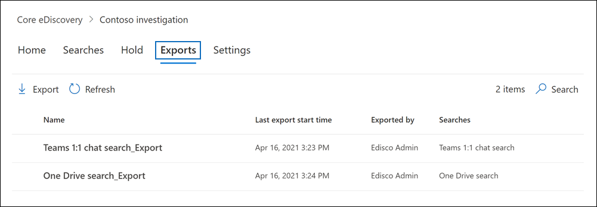

# Esportare contenuti da un caso di Core eDiscovery

Dopo aver eseguito correttamente una ricerca associata a un caso di eDiscovery di base, è possibile esportare i risultati della ricerca. Quando si esportano i risultati della ricerca, gli elementi delle cassette postali vengono scaricati nei file PST o come singoli messaggi. Quando si esporta contenuto da SharePoint e OneDrive for Business, vengono esportate copie di documenti Office nativi e altri documenti. Viene esportato Results.csv file contenente informazioni su ogni elemento esportato e un file manifesto (in formato XML) contenente informazioni su ogni risultato della ricerca.
  
## Esportare i risultati della ricerca

1. Accedere a e accedere utilizzando le credenziali per l'account utente a cui sono state assegnate [https://compliance.microsoft.com](https://compliance.microsoft.com) le autorizzazioni di eDiscovery appropriate.

2. Nel riquadro di spostamento sinistro del Centro Microsoft 365 conformità fare clic su **Mostra** tutto e quindi su **eDiscovery > Core**.

3. Nella pagina **Core eDiscovery** fare clic sul nome del caso in cui si desidera creare il blocco.

4. Nella **home** page del caso fare clic sulla **scheda** Ricerche.

5. Scegliere **Esporta** risultati dal menu Azioni nella parte inferiore della pagina a **comparsa.**

   

   Il flusso di lavoro per esportare i risultati di una ricerca associata a un caso di eDiscovery di base corrisponde all'esportazione dei risultati della ricerca per una ricerca nella **pagina Ricerca contenuto.** Per istruzioni dettagliate, vedere Export [content search results](export-search-results.md).

   > [!NOTE]
   > Quando si esportano i risultati della ricerca, è possibile abilitare la deduplicazione in modo che venga esportata solo una copia di un messaggio di posta elettronica anche se nelle cassette postali in cui è stata ricercata potrebbero essere state trovate più istanze dello stesso messaggio. Per ulteriori informazioni sulla deduplicazione e su come vengono identificati gli elementi duplicati, vedere [De-duplicazione nei risultati della ricerca eDiscovery.](de-duplication-in-ediscovery-search-results.md)

   Dopo aver avviato l'esportazione, i risultati della ricerca vengono preparati per il download, il che significa che vengono trasferiti in un percorso di Archiviazione di Azure fornito da Microsoft nel cloud Microsoft.
  
6. Fare clic **sulla scheda** Esportazioni nel caso in cui si desidera visualizzare l'elenco dei processi di esportazione.
  
   

   Potrebbe essere necessario fare clic **su Aggiorna** per aggiornare l'elenco dei processi di esportazione in modo che venga visualizzato il processo di esportazione creato. I processi di esportazione hanno lo stesso nome della ricerca corrispondente **con _Export** aggiunto al nome di ricerca.

7. Fare clic sul processo di esportazione creato per visualizzare le informazioni sullo stato nella pagina a comparsa. Queste informazioni includono la percentuale di elementi che sono stati trasferiti nell'Archiviazione di Azure locale.

8. Dopo aver trasferito tutti gli elementi, fare clic **su Scarica risultati** per scaricare i risultati della ricerca nel computer locale. Per ulteriori informazioni sul download dei risultati della ricerca, vedere Passaggio 2 in [Esportare i risultati della ricerca di contenuto](export-search-results.md#step-2-download-the-search-results)

### Ulteriori informazioni sull'esportazione di ricerche da un caso

- Per ulteriori informazioni sui file di esportazione inclusi quando si esportano i risultati della ricerca, vedere [Export a Content search report.](export-a-content-search-report.md#whats-included-in-the-report)

- Se si riavvia l'esportazione, le modifiche apportate alle query delle ricerche che costituiscono il processo di esportazione non influiranno sui risultati della ricerca recuperati. Quando si riavvia un'esportazione, verrà eseguito di nuovo lo stesso processo di query di ricerca combinato eseguito al momento della creazione del processo di esportazione.

- Inoltre, se si riavvia un'esportazione, i risultati della ricerca copiati nel percorso Archiviazione di Azure sovrascrivono i risultati precedenti. I risultati precedenti copiati non saranno disponibili per il download.
