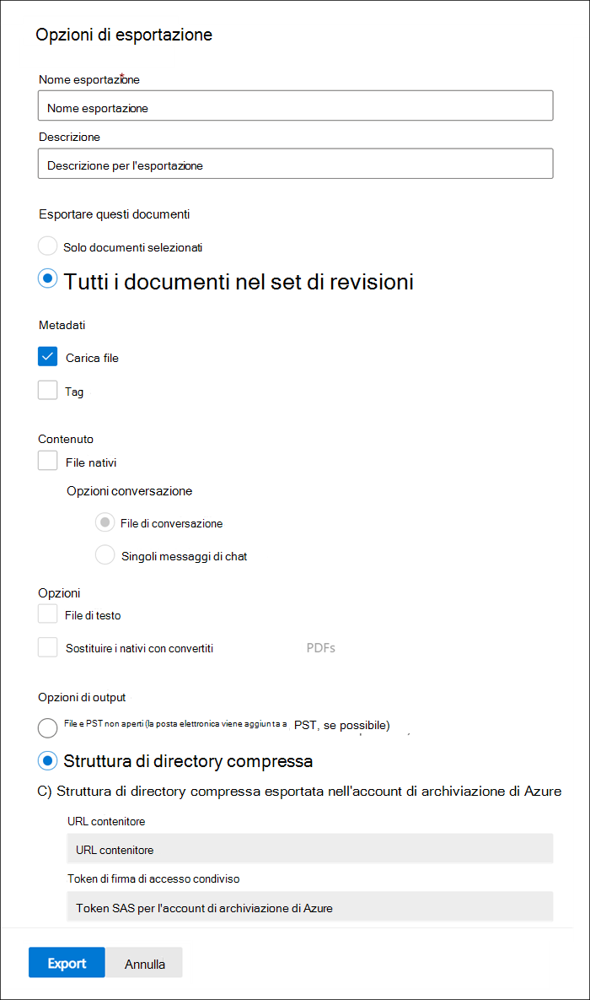

# Esportare documenti da un set di revisioni in Advanced eDiscoveryExport documents from a review set in Advanced eDiscovery

L'esportazione consente agli utenti di personalizzare il contenuto incluso nel pacchetto di download quando si esporta un documento da un set di revisioni in Advanced eDiscovery.Export allows users to customize the content that is included in the download package when you export document from a review set in Advanced eDiscovery.

Per esportare documenti da un set di revisioni:To export documents from a review set:

1. Nel Centro conformità Microsoft 365, aprire il caso Advanced eDiscovery, selezionare la  scheda Set di revisioni e quindi selezionare il set di revisioni che si desidera esportare.In the Microsoft 365 compliance center, open the Advanced eDiscovery case, select the **Review sets** tab, and then select the review set that you want to export.

2. Nel set di revisioni fare clic **su Azione**  >  **Esporta.**In the review set, click **Action** > **Export**.

   Lo strumento di esportazione visualizza la pagina a comparsa con le impostazioni per configurare l'esportazione.The Export tool displays the flyout page with the settings to configure the export. Alcune opzioni sono selezionate per impostazione predefinita, ma è possibile modificarle.Some options are selected by default, but you can change these. Per le descrizioni delle opzioni di esportazione che è possibile configurare, vedere la sezione seguente.See the following section for descriptions of the export options that you can configure.

   

3. Dopo aver configurato l'esportazione, fare clic **su Esporta** per avviare il processo di esportazione.After you configure the export, click **Export** to start the export process. A seconda dell'opzione selezionata nella sezione **Opzioni** di output, è possibile accedere ai file di esportazione tramite download diretto o nell'account Archiviazione di Azure dell'organizzazione.Depending on the option that you selected in **Output options** section, you can access the export files by direct download or in your organization's Azure Storage account.

> [!NOTE]
> I processi di esportazione vengono conservati per tutta la durata del caso.Export jobs are retained for the life of the case. Tuttavia, è necessario scaricare il contenuto da un processo di esportazione entro 30 giorni dal completamento del processo di esportazione.However, you must download the content from an export job within 30 days after the export job is complete.

## Opzioni di esportazioneExport options

Utilizzare le opzioni seguenti per configurare l'esportazione.Use the following options to configure the export. Non tutte le opzioni sono consentite per alcune opzioni di output, in particolare l'esportazione di file di testo e PDF redatti non sono consentite durante l'esportazione nel formato PST.Not all options are allowed for some output options, most notably, export of text files and redacted PDFs are not allowed when exporting to the PST format.

- **Nome esportazione**: Nome del processo di esportazione.**Export name**: Name of the export job. Verrà usato per assegnare un nome ai file ZIP che verranno scaricati.This will be used to name the ZIP files that will be downloaded.

- **Descrizione**: campo a testo libero che consente di aggiungere una descrizione.**Description**: Free-text field for you to add a description.

- **Esportare questi documenti****Export these documents**

  - Solo documenti selezionati: questa opzione esporta solo i documenti attualmente selezionati.Selected documents only: This option exports only the documents that are currently selected. Questa opzione è disponibile solo quando gli elementi sono selezionati in un set di revisioni.This option is only available when items are selected in a review set.
  
  - Tutti i documenti filtrati: questa opzione consente di esportare i documenti in un filtro attivo.All filtered documents: This option exports the documents in an active filter. Questa opzione è disponibile solo quando viene applicato un filtro al set di revisioni.This option is only available when a filter is applied to the review set.
  
  - Tutti i documenti nel set di revisioni: questa opzione consente di esportare tutti i documenti nel set di revisioni.All documents in the review set: This option exports all documents in the review set.

- **Opzioni di** output: il contenuto esportato è disponibile per il download direttamente tramite un Web browser o può essere inviato a un Archiviazione di Azure account.**Output options**: Exported content is either available for download directly through a web browser or can be sent to an Azure Storage account. Le prime due opzioni consentono il download diretto.The first two options enable direct download.
  
  - Solo report: vengono creati solo il file di riepilogo e di caricamento.Reports only: Only the summary and load file are created.
  
  - File e file PST (la posta elettronica viene aggiunta ai file PST quando possibile): i file vengono esportati in un formato simile alla struttura di directory originale visualizzata dagli utenti nelle applicazioni native.Loose files and PSTs (email is added to PSTs when possible): Files are exported in a format that resembles the original directory structure seen by users in their native applications.  Per ulteriori informazioni, vedere la [sezione Loose files and PST export structure.](#loose-files-and-pst-export-structure)For more information, see the [Loose files and PST export structure](#loose-files-and-pst-export-structure) section.
  
  - Struttura di directory compressa: i file vengono esportati e inclusi nel download.Condensed directory structure: Files are exported and included in the download.
  
  - Struttura di directory compressa esportata nell'account Archiviazione di Azure: i file vengono esportati nell'account Archiviazione di Azure dell'organizzazione.Condensed directory structure exported to your Azure Storage account: Files are exported to your organization's Azure Storage account. Per questa opzione, devi fornire l'URL del contenitore nel tuo account Archiviazione di Azure in cui esportare i file.For this option, you have to provide the URL for the container in your Azure Storage account to export the files to. Devi anche fornire il token di firma di accesso condiviso (SAS) per il tuo account Archiviazione di Azure account.You also have to provide the shared access signature (SAS) token for your Azure Storage account. Per ulteriori informazioni, vedere [Export documents in a review set to an Archiviazione di Azure account](download-export-jobs.md).For more information, see [Export documents in a review set to an Azure Storage account](download-export-jobs.md).

- **Includi****Include**
  
  - Tag: se selezionata, le informazioni di tagging vengono incluse nel file di caricamento.Tags: When selected, tagging information is included in the load file.
  
  - File di testo: questa opzione include le versioni di testo estratte dei file nativi nell'esportazione.Text files: This option includes the extracted text versions of native files in the export.
  
  - Sostituire i nativi con PDF convertiti: se i file PDF redatti vengono generati durante la revisione, questi file sono disponibili per l'esportazione.Replace redacted natives with converted PDFs: If redacted PDF files are generated during review, these files are available for export. È possibile scegliere di esportare solo i file nativi che sono stati redatti (non selezionando questa opzione) oppure è possibile selezionare questa opzione per esportare i file PDF che contengono le azioni effettive.You can choose to export only the native files that were redacted (by not selecting this option) or you can select this option to export the PDF files that contain the actual redactions.

Nelle sezioni seguenti viene descritta la struttura delle cartelle per i file con estensione loose e le opzioni della struttura di directory compressa.The following sections describe the folder structure for loose files and condensed directory structure options. Le esportazioni vengono partizionate in file ZIP con una dimensione massima di contenuto non compresso di 75 GB.Exports are partitioned into ZIP files with a maximum size of uncompressed content of 75 GB. Se le dimensioni dell'esportazione sono inferiori a 75 GB, l'esportazione sarà costituita da un file di riepilogo e da un singolo file ZIP.If the export size is less than 75 GB, the export will consist of a summary file and a single ZIP file. Per le esportazioni di dimensioni superiori a 75 GB di dati non compressi, verranno creati più file ZIP.For exports larger than 75 GB of uncompressed data, multiple ZIP files will be created. Una volta scaricati, i file ZIP possono essere decompressi in un'unica posizione per ricreare l'esportazione completa.Once downloaded, the ZIP files can be uncompressed into a single location to recreate the full export.

### File con estensione loose e struttura di esportazione PSTLoose files and PST export structure

Se si seleziona questa opzione di esportazione, il contenuto esportato viene organizzato nella struttura seguente:If you select this export option, the exported content is organized in the following structure:

- Summary.csv: include un riepilogo del contenuto esportato dal set di recensioniSummary.csv: Includes a summary of the content exported from the review set

- Cartella radice: questa cartella denominata [Nome esportazione] x di z.zip e verrà ripetuta per ogni partizione del file ZIP.Root folder: This folder in named [Export Name] x of z.zip and will be repeated for each ZIP file partition.
  
  - Export_load_file_x di z.csv: il file di metadati.Export_load_file_x of z.csv: The metadata file.
  
  - Avvisi ed errori x di z.csv: questo file include informazioni sugli errori rilevati durante il tentativo di esportazione dal set di revisione.Warnings and errors x of z.csv: This file includes information about errors encountered when trying to export from the review set.
  
  - Exchange: questa cartella contiene tutto il contenuto Exchange archiviati nei file PST.Exchange: This folder contains all content from Exchange stored in PST files. I file PDF redatti non possono essere inclusi con questa opzione.Redacted PDF files cannot be included with this option. Se nel set di revisioni è selezionato un allegato, il messaggio di posta elettronica padre verrà esportato con l'allegato allegato.If an attachment is selected in the review set, the parent email will be exported with the attachment attached.
  
  - SharePoint: questa cartella contiene tutto il contenuto nativo di SharePoint in un formato di file nativo.SharePoint: This folder contains all native content from SharePoint in a native file format. I file PDF redatti non possono essere inclusi con questa opzione.Redacted PDF files cannot be included with this option.

### Struttura di directory compressaCondensed directory structure

- Summary.csv: include un riepilogo del contenuto esportato dal set di recensioniSummary.csv: Includes a summary of the content exported from the review set

- Cartella radice: questa cartella denominata [Nome esportazione] x di z.zip e verrà ripetuta per ogni partizione del file ZIP.Root folder: This folder in named [Export Name] x of z.zip and will be repeated for each ZIP file partition.
  
  - Export_load_file_x di z.csv: il file di metadati e include anche il percorso di ogni file archiviato nel file ZIP.Export_load_file_x of z.csv: The metadata file and also includes the location of each file that is stored in the ZIP file.
  
  - Avvisi ed errori x di z.csv: questo file include informazioni sugli errori rilevati durante il tentativo di esportazione dal set di revisione.Warnings and errors x of z.csv: This file includes information about errors encountered when trying to export from the review set.

  - NativeFiles: questa cartella contiene tutti i file nativi esportati.NativeFiles: This folder contains all the native files that were exported. I file nativi vengono sostituiti con PDF redatti se è stata selezionata l'opzione Sostituisci i nativi con i *PDF convertiti.*Natives files are replaced with redacted PDFs if you selected the *Replace redacted natives with converted PDFs* option.
  
  - Error_files: questa cartella contiene file con errore di estrazione o di altro tipo.Error_files: This folder contains files that had either extraction or other processing error. I file verranno inseriti in cartelle separate, ExtractionError o ProcessingError.The files will be placed into separate folders, either ExtractionError or ProcessingError. Questi file sono elencati nel file di caricamento.These files are listed in the load file.

  - Extracted_text_files: questa cartella contiene tutti i file di testo estratti generati durante l'elaborazione.Extracted_text_files: This folder contains all of the extracted text files that were generated at processing.

### Struttura di directory compressa esportata nell'Archiviazione di Azure accountCondensed directory structure exported to your Azure Storage Account

Questa opzione utilizza la stessa struttura generale della struttura di *directory* condensata, tuttavia il contenuto non viene compresso e i dati vengono salvati nel Archiviazione di Azure account.This option uses the same general structure as the *Condensed directory structure*, however the contents is not zipped and the data is saved to your Azure Storage account. Questa opzione viene in genere utilizzata quando si utilizza un provider di eDiscovery di terze parti.This option is generally used when working with a third-party eDiscovery provider. Per informazioni dettagliate su come utilizzare questa opzione, vedere [Export documents in a review set to an Archiviazione di Azure account](download-export-jobs.md).For details about how to use this option, see [Export documents in a review set to an Azure Storage account](download-export-jobs.md).
