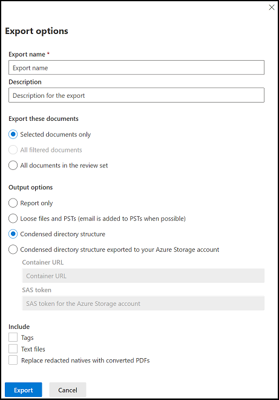

# Esportare documenti da un set di revisione in Advanced eDiscovery

L'esportazione consente agli utenti di personalizzare il contenuto incluso nel pacchetto di download quando si esporta un documento da un set di revisioni in Advanced eDiscovery.

Per esportare documenti da un set di revisioni:

1. Nel Centro conformità Microsoft 365 aprire il caso Advanced eDiscovery, selezionare la scheda **Review sets** e quindi selezionare il set di revisione che si desidera esportare.

2. Nel set di revisioni fare clic **su Azione**  >  **Esporta.**

   Lo strumento di esportazione visualizza la pagina a comparsa con le impostazioni per configurare l'esportazione. Alcune opzioni sono selezionate per impostazione predefinita, ma è possibile modificarle. Per le descrizioni delle opzioni di esportazione che è possibile configurare, vedere la sezione seguente.

   

3. Dopo aver configurato l'esportazione, fare clic **su Esporta** per avviare il processo di esportazione. A seconda dell'opzione selezionata nella sezione **Opzioni** di output, è possibile accedere ai file di esportazione tramite download diretto o nell'account di archiviazione di Azure dell'organizzazione.

> [!NOTE]
> I processi di esportazione vengono conservati per tutta la durata del caso. Tuttavia, è necessario scaricare il contenuto da un processo di esportazione entro 30 giorni dal completamento del processo di esportazione.

## Opzioni di esportazione

Utilizzare le opzioni seguenti per configurare l'esportazione.

- **Nome esportazione**: Nome del processo di esportazione.

- **Descrizione**: campo a testo libero che consente di aggiungere una descrizione.

- **Esportare questi documenti**

  - **Solo documenti selezionati:** questa opzione esporta solo i documenti attualmente selezionati.
  
  - **Tutti i documenti nel set di revisioni**: questa opzione esporta tutti i documenti nel set di revisioni.

- **Metadati**
  
  - **Carica file:** questo file contiene i metadati per ogni file. Questo file in genere può essere ingerito da strumenti di eDiscovery di terze parti. Per ulteriori informazioni sui campi inclusi, vedere [Campi dei metadati del documento in Advanced eDiscovery.](document-metadata-fields-in-Advanced-eDiscovery.md)
  
  - **Tag**: se selezionata, le informazioni di tagging vengono incluse nel file di caricamento.

- **Contenuto**
  
  - **File nativi:** selezionare questa casella di controllo per includere i file nativi dei documenti nel set di revisioni. Se si sceglie di esportare file nativi, sono disponibili le opzioni seguenti per l'esportazione delle conversazioni di chat.
  
  - **Opzioni di conversazione**

    - **File di conversazione**: questa opzione esporta conversazioni di chat ricostruite. Questo formato presenta le conversazioni in un formato simile a quello visualizzato dagli utenti nell'applicazione nativa.

    - **Singoli messaggi di chat:** questa opzione esporta i file di conversazione originali così come sono archiviati in Microsoft 365.

- **Opzioni**

  - **File di** testo : - Questa opzione include le versioni di testo estratte dei file nativi nell'esportazione.
  
  - **Sostituire i nativi con** PDF convertiti: se i file PDF redatti vengono generati durante la revisione, questi file sono disponibili per l'esportazione. È possibile scegliere di esportare solo i file nativi che sono stati redatti (non selezionando questa opzione) oppure è possibile selezionare questa opzione per esportare i file PDF che contengono le azioni effettive.

- **Opzioni di** output: il contenuto esportato è disponibile per il download direttamente tramite un Web browser o può essere inviato a un account di archiviazione di Azure. Le prime due opzioni consentono il download diretto.
  
  - **File e FILE PST (la** posta elettronica viene aggiunta ai file PST quando possibile): i file vengono esportati in un formato simile alla struttura di directory originale visualizzata dagli utenti nelle applicazioni native.  Per ulteriori informazioni, vedere la [sezione Loose files and PST export structure.](#loose-files-and-pst-export-structure)
  
  - **Struttura della directory compressa:** i file vengono esportati e inclusi nel download.
  
  - **Struttura di directory compressa esportata nell'account di archiviazione** di Azure: i file vengono esportati nell'account di archiviazione di Azure dell'organizzazione. Per questa opzione, devi fornire l'URL per il contenitore nel tuo account di archiviazione di Azure in cui esportare i file. È inoltre necessario fornire il token di firma di accesso condiviso (SAS) per l'account di archiviazione di Azure. Per ulteriori informazioni, vedere [Export documents in a review set to an Azure Storage account](download-export-jobs.md).

Nelle sezioni seguenti viene descritta la struttura delle cartelle per i file con estensione loose e le opzioni della struttura di directory compressa.

### File con estensione loose e struttura di esportazione PST

Se si seleziona questa opzione di esportazione, il contenuto esportato viene organizzato nella struttura seguente:

- Cartella radice: cartella denominata ExportName.zip
  
  - Export_load_file.csv: il file di metadati.
  
  - Summary.csv: un file di riepilogo che contiene anche le statistiche di esportazione.
  
  - Exchange: questa cartella contiene tutto il contenuto di Exchange in formato di file nativo. I file nativi vengono sostituiti con PDF redatti se è stata selezionata l'opzione Sostituisci i nativi con i **PDF convertiti.**
  
  - SharePoint: questa cartella contiene tutto il contenuto nativo di SharePoint in un formato di file nativo. I file nativi vengono sostituiti con PDF redatti se è stata selezionata l'opzione Sostituisci i nativi con i **PDF convertiti.**

### Struttura di directory compressa

- Cartella radice: questa cartella è denominata ExportName.zip
  
  - Export_load_file.csv: il file di metadati.
  
  - Summary.txt: un file di riepilogo che contiene anche le statistiche di esportazione.
  
  - NativeFiles: questa cartella contiene tutti i file nativi esportati. Se si esportano file PDF redatti, questi non vengono inseriti nei file PST. Vengono invece aggiunti a una cartella separata.
  
  - Error_files: questa cartella contiene i file di errore seguenti, se inclusi nell'esportazione:

    - ExtractionError: file CSV contenente i metadati disponibili dei file che non sono stati estratti correttamente dai file padre.

    - ProcessingError: questo file contiene un elenco di documenti con errori di elaborazione. Questo contenuto è a livello di elemento, ovvero se un allegato ha generato un errore di elaborazione, il messaggio di posta elettronica contenente l'allegato viene incluso in questa cartella.
  
  - Extracted_text_files: questa cartella contiene tutti i file di testo estratti generati durante l'elaborazione.
