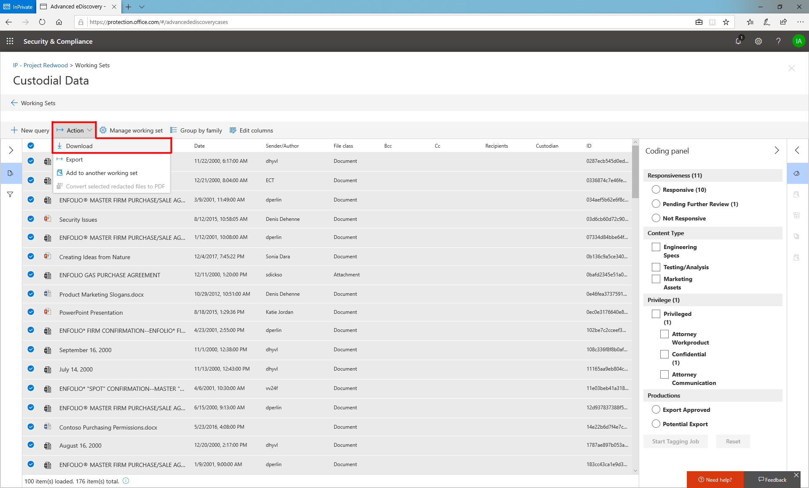

# Esportare i documenti da un insieme da rivedereExport documents from a review set

È possibile esportare il contenuto per la presentazione o la revisione esterna da un set di revisione tramite uno dei metodi seguenti:You can export content for presentation or external review from a review set by one of the following methods:

- [Scaricare documentiDownload documents](#download-documents-from-a-review-set)
 
- [Esportare documentiExport documents](#export-documents-from-a-review-set)

## Scaricare i documenti da un set di RevisioneDownload documents from a review set

Download offre un modo semplice per scaricare contenuto da un set di recensioni in formato nativo.Download offers a simple way to download content from a review set in Native format. Sfrutta le caratteristiche di trasferimento dei dati del browser in modo che una richiesta del browser venga visualizzata una volta che il download è pronto.It leverages the browser's data transfer features so a browser prompt will appear once a download is ready. I file scaricati con questo metodo verranno zippati in un file contenitore e saranno file a livello di elemento.Files downloaded using this method will be zipped into a container file and will be item level files. Questo significa che se si seleziona un allegato, verrà visualizzato automaticamente il messaggio di posta elettronica con l'allegato incluso.This means that if you select an attachment, you will automatically receive the email with the attachment included. Analogamente, se si seleziona un foglio di calcolo di Excel incorporato in un documento di Word, verrà visualizzato il documento di Word con il foglio di calcolo di Excel incorporato.Similarly, if you select an excel spreadsheet that was embedded in a word document, you will receive the word document with the excel spreadsheet embedded. Gli elementi scaricati conserveranno la data dell'Ultima modifica che può essere visualizzata come proprietà di un file.Downloaded items will preserve the last modified date which can be viewed as a file property.

Per scaricare contenuto da un set di recensioni, iniziare selezionando i file che si desidera scaricare, quindi selezionare "Scarica" dal menu azioni.To download content from a review set, start by selecting the files you want to download then select "Download" under the Actions menu.

## Esportare i documenti da un insieme da rivedereExport documents from a review set

Export consente agli utenti di personalizzare il contenuto incluso nel pacchetto di download.Export allows users to customize the content that is included in the download package. Fornisce una pagina di configurazione con le seguenti impostazioni:It provides a configuration page with the following settings:

### File di metadatiMetadata file

Questo può essere considerato come il "Load file" che contiene i metadati associati ai file che vengono esportati.This can be considered your "load file" that contains metadata associated with the files you export. Per un elenco dei campi esportati disponibili nel file di metadati, vedere [Document Metadata Fields in Advanced eDiscovery](document-metadata-fields-in-Advanced-eDiscovery.md).For a list of exported fields available in the metadata file, see [Document metadata fields in Advanced eDiscovery](document-metadata-fields-in-Advanced-eDiscovery.md). Questo file può in genere essere ingerito da strumenti di terze parti.This file can typically be ingested by third-party tools.

### Dati tagTag data

Questo contenuto verrebbe aggiunto come campi nel file di metadati.This content would be added as fields in the metadata file. Contiene tutte le informazioni sui tag applicate nei set di revisione.It contains all of the tag information applied in review sets.

### File di testoText files

È possibile generare file di testo per ogni file esportato da un set di revisione.Text files can be generated for each file exported from a review set. Spesso questi file sono necessari per i partner del servizio come parte dell'ingestione dei dati in strumenti di terze parti.Often times these files are required by service partners as part of ingesting data into third-party tools.

### File redattiRedacted files

Se durante la revisione vengono generati file PDF redatti, tali file sono disponibili durante l'esportazione.If redacted PDF files are generated during review, these files are available during export. È possibile decidere se esportare solo i file nativi o sostituire i file nativi che richiedono la redazione con i file PDF che contengono le redazioni effettive.You can decide whether to export native files only or to replace the native files that required redaction with the PDF files that contain the actual redactions.

### Percorso di esportazioneExport location

Il contenuto esportato viene recapitato a un BLOB di Azure fornito da Microsoft o è possibile utilizzare il BLOB di un cliente se i dettagli vengono forniti all'esportazione.Exported content is delivered to either a Microsoft provided Azure blob or a customer's blob can be used if the details are provided at export.

### Struttura di esportazioneExport structure

Quando il contenuto viene esportato da un set di revisione, il contenuto è organizzato nella struttura seguente.When content is exported from a review set, the content is organized in the following structure.

  - Cartella radice-ID downloadRoot folder – Download ID
    
      - Esporta\_caricamento\_file. csv = file di metadatiExport\_load\_file.csv = metadata file
    
      - Summary. txt = un file di riepilogo con statistiche di esportazioneSummary.txt = a summary file with export statistics
    
      - Input\_o file\_nativi = contiene tutti i file nativiInput\_or native\_files = contains all native files
    
      - File\_Error = contiene eventuali file di errore inclusi nell'esportazioneError\_files = contains any error files included in the export
        
          - ExtractionError – un CSV che contiene i metadati disponibili di file che non sono stati estratti correttamente dai file padreExtractionError – a csv that contains any available metadata of files that were not properly extracted from parent files
        
          - ProcessingError – contenuto con errori di elaborazione.ProcessingError – content with processing errors. Questo contenuto è a livello di elemento significato se un allegato ha subito un errore di elaborazione, il messaggio di posta elettronica che contiene l'allegato verrà incluso in questa cartella.This content is item level meaning if an attachment experienced a processing error, the email that contains the attachment will be included in this folder.
    
      - File\_di\_testo estratti = contiene tutti i file di testo estratti generati durante l'elaborazione.Extracted\_text\_files = contains all of the extracted text files generated at processing.
