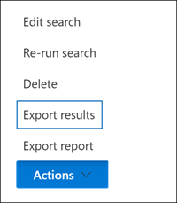
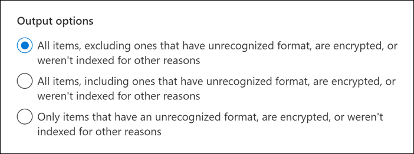

# <a name="export-content-search-results"></a>Esportare i risultati della ricerca contenuto

Dopo aver eseguito correttamente una ricerca contenuto, è possibile esportare i risultati della ricerca in un computer locale. Quando si esportano i risultati di posta elettronica, questi vengono scaricati nel computer sotto forma di file PST. Quando si esporta contenuto da SharePoint e OneDrive for Business, vengono esportate copie di documenti Office nativi. I risultati della ricerca esportati includono altri documenti e report.
  
L'esportazione dei risultati di una ricerca contenuto implica la preparazione dei risultati e il loro download in un computer locale.
  
## <a name="before-you-export-search-results"></a>Prima di esportare i risultati della ricerca

- Per esportare i risultati della ricerca, è necessario disporre del ruolo di gestione esportazione nel Centro sicurezza & conformità. Questo ruolo è assegnato al gruppo di ruoli Gestore di eDiscovery incorporato. Non viene assegnato per impostazione predefinita al gruppo di ruoli Gestione organizzazione. Per altre informazioni, vedere [Assegnare autorizzazioni di eDiscovery](assign-ediscovery-permissions.md).

- Il computer utilizzato per esportare i risultati della ricerca deve soddisfare i seguenti requisiti di sistema:
  
  - Versione più recente Windows (32 bit o 64 bit)
  
  - Microsoft .NET Framework 4.7
  
- Per eseguire lo strumento di esportazione di eDiscovery<sup>1,</sup>è necessario utilizzare uno dei browser supportati seguenti:

  - Microsoft Edge <sup>2</sup>
  
    OPPURE

  - Microsoft Internet Explorer 10 e versioni successive
  
  > [!NOTE]
  > <sup>1</sup> Microsoft non produce estensioni o componenti aggiuntivi di terze parti per ClickOnce applicazioni. L'esportazione dei risultati della ricerca con un browser non supportato con estensioni o componenti aggiuntivi di terze parti non è supportata.<br/>
  > <sup>2</sup> In seguito alle recenti modifiche apportate al Microsoft Edge, il ClickOnce non è più abilitato per impostazione predefinita. Per istruzioni sull'abilitazione del ClickOnce in Edge, vedere [Use the eDiscovery Export Tool in Microsoft Edge](configure-edge-to-export-search-results.md).
  
- È consigliabile scaricare i risultati della ricerca in un computer locale. Per evitare che il firewall o l'infrastruttura proxy dell'azienda possa causare problemi durante il download dei risultati della ricerca, è consigliabile scaricare i risultati della ricerca in un desktop virtuale esterno alla rete. Ciò può ridurre i timeout che si verificano nelle connessioni dati di Azure durante l'esportazione di un numero elevato di file. Per ulteriori informazioni sui desktop virtuali, vedere [Windows Desktop virtuale](https://azure.microsoft.com/services/virtual-desktop).

- Per migliorare le prestazioni durante il download dei risultati di ricerca, è consigliabile suddividere le ricerche che restituiscono un set di risultati di grandi dimensioni in ricerche più piccole. È ad esempio possibile utilizzare intervalli di date nelle query di ricerca per restituire un set più piccolo di risultati che possono essere scaricati più velocemente.
  
- Quando si esportano i risultati della ricerca, i dati vengono temporaneamente archiviati in un percorso di Archiviazione di Azure fornito da Microsoft nel cloud Microsoft prima che venga scaricato nel computer locale. Assicurati che l'organizzazione possa connettersi all'endpoint in Azure, che è **\* .blob.core.windows.net** (il carattere jolly rappresenta un identificatore univoco per l'esportazione). I dati dei risultati della ricerca vengono eliminati dalla posizione Archiviazione di Azure due settimane dopo la creazione. 
  
- Se l'organizzazione utilizza un server proxy per comunicare con Internet, è necessario definire le impostazioni del server proxy nel computer utilizzato per esportare i risultati della ricerca (in modo che lo strumento di esportazione possa essere autenticato dal server proxy). A tale scopo, aprire il file *machine.config* nel percorso corrispondente alla versione di Windows. 
  
  - **32 bit:**`%windir%\Microsoft.NET\Framework\[version]\Config\machine.config`
  
  - **64 bit:**`%windir%\Microsoft.NET\Framework64\[version]\Config\machine.config`
  
    Aggiungere le righe seguenti al file  *machine.config*  tra i  `<configuration>` tag e  `</configuration>` . Assicurarsi di sostituire  `ProxyServer` e con i valori corretti per  `Port` l'organizzazione, ad esempio `proxy01.contoso.com:80` . 
  
    ```xml
    <system.net>
       <defaultProxy enabled="true" useDefaultCredentials="true">
         <proxy proxyaddress="https://ProxyServer :Port " 
                usesystemdefault="False" 
                bypassonlocal="True" 
                autoDetect="False" />
       </defaultProxy>
    </system.net>
    ```

- Se i risultati di una ricerca contenuto sono precedenti a 7 giorni e si invia un processo di esportazione, viene visualizzato un messaggio di errore in cui viene richiesto di eseguire di nuovo la ricerca per aggiornare i risultati della ricerca. In questo caso, annullare l'esportazione, eseguire di nuovo la ricerca e quindi avviare di nuovo l'esportazione.

## <a name="step-1-prepare-search-results-for-export"></a>Passaggio 1: Preparare i risultati della ricerca per l'esportazione

Il primo passaggio consiste nel preparare i risultati della ricerca per l'esportazione. Quando si preparano i risultati, questi vengono caricati in un percorso di Archiviazione di Azure fornito da Microsoft nel cloud Microsoft. Il contenuto delle cassette postali e dei siti viene caricato alla velocità massima di 2 GB all'ora.
  
1. Nel Centro Microsoft 365 conformità selezionare la ricerca di contenuto da cui si desidera esportare i risultati.
  
2. Scegliere **Esporta** risultati dal menu Azioni nella parte inferiore della pagina a **comparsa.**

   

   Viene **visualizzata la** pagina a comparsa Esporta risultati. Le opzioni di esportazione disponibili per esportare il contenuto dipendono dal fatto che i risultati della ricerca si trovino nelle cassette postali o nei siti o in una combinazione di entrambi.

3. In **Opzioni di output** scegliere una delle opzioni seguenti:
  
   

    - Tutti gli elementi, esclusi quelli con formato non riconosciuto, vengono crittografati o non sono stati **indicizzati per altri motivi.** Questa opzione esporta solo gli elementi indicizzati.
  
    - Tutti gli elementi, inclusi quelli con formato non riconosciuto, vengono crittografati o non sono stati **indicizzati per altri motivi.** Questa opzione esporta gli elementi indicizzati e non indicizzati.
  
    - **Solo gli elementi con un** formato non riconosciuto, crittografati o non indicizzati per altri motivi. Questa opzione esporta solo gli elementi non indicizzati.

      Per una [descrizione dell'esportazione](#more-information) degli elementi parzialmente indicizzati, vedere la sezione Ulteriori informazioni. Per ulteriori informazioni sugli elementi parzialmente indicizzati, vedere [Elementi parzialmente indicizzati in Ricerca contenuto.](partially-indexed-items-in-content-search.md)

4. In **Esporta Exchange contenuto come** scegliere una delle opzioni seguenti:
  
   

    - **Un file PST per ogni cassetta postale**: Esporta un file PST per ogni cassetta postale utente che contiene i risultati della ricerca. Tutti i risultati della cassetta postale di archiviazione dell'utente sono inclusi nello stesso file PST. Questa opzione riproduce la struttura delle cartelle delle cassette postali dalla cassetta postale di origine.
  
    - **Un file PST contenente tutti** i messaggi : Esporta un singolo file PST (denominato *Exchange.pst*) contenente i risultati della ricerca da tutte le cassette postali di origine incluse nella ricerca. Questa opzione riproduce la struttura delle cartelle delle cassette postali per ogni messaggio.
  
    - **Un file PST contenente tutti i messaggi in** una singola cartella: esporta i risultati della ricerca in un singolo file PST in cui tutti i messaggi si trovano in una singola cartella di primo livello. Questa opzione consente ai revisori di esaminare gli elementi in ordine cronologico (gli elementi vengono ordinati in base alla data di invio) senza dover esplorare la struttura di cartelle della cassetta postale originale per ogni elemento.
  
    - **Singoli messaggi**: Esporta i risultati della ricerca come singoli messaggi di posta elettronica, utilizzando il formato msg. Se si seleziona questa opzione, i risultati della ricerca tramite posta elettronica vengono esportati in una cartella nel file system. Il percorso della cartella per i singoli messaggi è lo stesso utilizzato se i risultati sono stati esportati in un file PST.
  
5. Configurare le opzioni aggiuntive seguenti:

   

   1. Selezionare la **casella di controllo Abilita deduplicazione per Exchange contenuto per** escludere i messaggi duplicati.
  
      Se si seleziona questa opzione, verrà esportata solo una copia di un messaggio anche se nelle cassette postali in cui è stata ricercata vengono trovate più copie dello stesso messaggio. Il report dei risultati dell'esportazione (che è un file denominato Results.csv) conterrà una riga per ogni copia di un messaggio duplicato in modo da poter identificare le cassette postali (o le cartelle pubbliche) che contengono una copia del messaggio duplicato. Per ulteriori informazioni sulla deduplicazione e su come vengono identificati gli elementi duplicati, vedere [De-duplicazione nei risultati della ricerca eDiscovery.](de-duplication-in-ediscovery-search-results.md)
  
   2. Selezionare la **casella di controllo Includi versioni SharePoint file** per esportare tutte le versioni SharePoint documenti. Questa opzione viene visualizzata solo se le origini di contenuto della ricerca includono SharePoint o OneDrive for Business siti.
  
   3. Selezionare Esporta **file in una cartella compressa (compressa). Include solo singoli messaggi e SharePoint per** esportare i risultati della ricerca in cartelle compresse. Questa opzione viene visualizzata solo quando si sceglie di esportare Exchange elementi come singoli messaggi e quando i risultati della ricerca includono SharePoint o OneDrive documenti. Questa opzione viene utilizzata principalmente per aggirare il limite di 260 caratteri nei nomi dei percorsi Windows file quando gli elementi vengono esportati. Vedere "Nomi di file di elementi esportati" nella [sezione Ulteriori](#more-information) informazioni.
  
6. Fare **clic su** Esporta per avviare il processo di esportazione. I risultati della ricerca sono preparati per il download, ovvero vengono raccolti dai percorsi del contenuto originale e quindi caricati in un percorso Archiviazione di Azure nel cloud Microsoft. Questa operazione può richiedere diversi minuti.

Per istruzioni su come scaricare i risultati della ricerca esportati, vedere la sezione successiva.
  
## <a name="step-2-download-the-search-results"></a>Passaggio 2: Scaricare i risultati della ricerca

Il passaggio successivo consiste nel scaricare i risultati della ricerca dal percorso Archiviazione di Azure nel computer locale.
  
1. Nella pagina **Ricerca contenuto** nel Centro Microsoft 365 conformità selezionare la **scheda** Esportazioni
  
   Potrebbe essere necessario fare clic **su Aggiorna** per aggiornare l'elenco dei processi di esportazione in modo che venga visualizzato il processo di esportazione creato. I processi di esportazione hanno lo stesso nome della ricerca corrispondente **con _Export** aggiunto al nome di ricerca.
  
2. Selezionare il processo di esportazione creato nel passaggio 1.

3. Nella pagina a comparsa in **Chiave di esportazione** fare clic su Copia negli **Appunti.** Questa chiave viene utilizzata nel passaggio 6 per scaricare i risultati della ricerca.
  
   > [!IMPORTANT]
   > Poiché chiunque può installare e avviare lo strumento di esportazione eDiscovery e quindi utilizzare questa chiave per scaricare i risultati della ricerca, è bene assicurarsi di adottare alcune precauzioni per proteggere la chiave così come si proteggono le password o altre informazioni relative alla sicurezza. 

4. Nella parte superiore della pagina a comparsa fare clic su **Scarica risultati.**

5. Se viene richiesto di installare lo strumento di **esportazione di eDiscovery,** fare clic su **Installa**.

6. Nello strumento **di esportazione eDiscovery** eseguire le operazioni seguenti:

   

   1. Incollare la chiave di esportazione copiata nel passaggio 3 nella casella appropriata.
  
   2. Fare clic su **Sfoglia** per specificare il percorso in cui si desidera scaricare i file dei risultati della ricerca.
  
      > [!IMPORTANT]
      >  A causa di un'elevata attività di rete durante il download, è consigliabile scaricare i risultati della ricerca solo in un percorso in un'unità interna nel computer locale. Per un'esperienza di download ottimale, seguire queste linee guida: <br/>
      >- Non scaricare i risultati della ricerca in un percorso UNC, un'unità di rete mappata, un'unità USB esterna o un account OneDrive for Business sincronizzato.<br/>
      >- Disabilitare l'analisi antivirus per la cartella in cui si scarica il risultato della ricerca.<br/>
      >- Scaricare i risultati della ricerca in cartelle diverse per i processi di download simultanei.

6. Fare clic su **Avvia** per scaricare i risultati della ricerca nel computer.
  
    Lo **Strumento di esportazione eDiscovery** consente di visualizzare informazioni sullo stato delle informazioni relative al processo di esportazione, incluso il numero stimato (e le dimensioni) degli elementi rimanenti da scaricare. Al termine del processo di esportazione, è possibile accedere ai file nel percorso in cui sono stati scaricati.

## <a name="more-information"></a>Ulteriori informazioni

Ecco altre informazioni sull'esportazione dei risultati della ricerca.
  
[Limiti di esportazione](#export-limits)
  
[Esportare report](#export-reports)
  
[Esportazione di elementi parzialmente indicizzati](#exporting-partially-indexed-items)

[Esportazione di singoli messaggi o file PST](#exporting-individual-messages-or-pst-files)

[Decrittografia di messaggi di posta elettronica protetti da RMS e file allegati crittografati](#decrypting-rms-protected-email-messages-and-encrypted-file-attachments)

[Nomi file degli elementi esportati](#filenames-of-exported-items)  
  
[Varie](#miscellaneous)
  
### <a name="export-limits"></a>Limiti di esportazione

Per informazioni sui limiti durante l'esportazione dei risultati della ricerca di contenuto, vedere la sezione "Limiti di esportazione" in [Limiti per la ricerca di contenuto.](limits-for-content-search.md#export-limits)

### <a name="export-reports"></a>Esportare report
  
- Quando si esportano i risultati della ricerca, oltre ai risultati della ricerca vengono inclusi i report seguenti.
  
  - **Riepilogo esportazione** Un Excel contenente un riepilogo dell'esportazione. Sono incluse informazioni quali il numero di origini contenuto in cui è stata ricercata, le dimensioni stimate e scaricate dei risultati della ricerca e il numero stimato e scaricato di elementi esportati.
  
  - **Manifesto** File manifesto (in formato XML) contenente informazioni su ogni elemento incluso nei risultati della ricerca.
  
  - **Risultati** Un Excel contenente informazioni su ogni elemento scaricato come risultato della ricerca. Per la posta elettronica, il log dei risultati contiene informazioni su ogni messaggio, tra cui:
  
    - Il percorso del messaggio nella cassetta postale di origine (e se il messaggio è nella cassetta postale principale o di archiviazione).
  
    - La data in cui è stato inviato o ricevuto il messaggio.

    - La riga dell'oggetto del messaggio.

    - Il mittente e i destinatari del messaggio.

    - Indica se il messaggio è duplicato se è stata abilitata l'opzione di deduplicazione durante l'esportazione dei risultati della ricerca. I messaggi duplicati hanno un valore nella **colonna Duplica** in elemento che identifica il messaggio come duplicato. Il valore nella **colonna Duplica in elemento** contiene l'identità dell'elemento del messaggio esportato. Per ulteriori informazioni, vedere [De-duplication in eDiscovery search results](de-duplication-in-ediscovery-search-results.md).

      Per i documenti SharePoint e OneDrive for Business, il registro dei risultati contiene informazioni su ogni documento, tra cui:

      - L'URL per il documento.

      - L’URL per la raccolta di siti in cui si trova il documento.

      - La data dell'ultima modifica al documento.

      - Il nome del documento (che si trova nella colonna Oggetto nel log dei risultati).

  - **Elementi non indicizzati** Un Excel contenente informazioni su eventuali elementi parzialmente indicizzati che verrebbero inclusi nei risultati della ricerca. Se non si includono elementi parzialmente indicizzati quando si genera il report dei risultati della ricerca, il report verrà comunque scaricato, ma sarà vuoto.

  - **Errori e avvisi** Contiene errori e avvisi per i file rilevati durante l'esportazione. Per informazioni specifiche su ogni singolo errore o avviso, vedere la colonna Dettagli errore.

  - **Elementi ignorati** Quando si esportano risultati di ricerca da SharePoint siti OneDrive for Business, l'esportazione include in genere un report elementi ignorati (SkippedItems.csv). Gli elementi citati in questo report sono in genere elementi che non verranno scaricati, ad esempio una cartella o un set di documenti. La non esportazione di questi tipi di elementi è in base alla progettazione. Per altri elementi ignorati, il campo "Tipo di errore" e "Dettagli errore" nel rapporto elementi ignorati mostrano il motivo per cui l'elemento è stato ignorato e non è stato scaricato con gli altri risultati della ricerca.

  - **Trace.log** Contiene informazioni dettagliate sulla registrazione del processo di esportazione e consente di individuare i problemi durante l'esportazione. Se si apre un ticket con il supporto tecnico Microsoft su un problema relativo all'esportazione dei risultati della ricerca, potrebbe essere richiesto di fornire questo registro di traccia.
  
    > [!NOTE]
    > È possibile esportare questi documenti senza dover esportare i risultati della ricerca effettivi. Vedere [Export a Content search report](export-a-content-search-report.md).
  
### <a name="exporting-partially-indexed-items"></a>Esportazione di elementi parzialmente indicizzati
  
- Se si esportano elementi della cassetta postale da una ricerca di contenuto che restituisce tutti gli elementi della cassetta postale nei risultati della ricerca (poiché nessuna parola chiave è inclusa nella query di ricerca), gli elementi parzialmente indicizzati non verranno copiati nel file PST contenente gli elementi non indicizzati. Ciò è dovuto al fatto che tutti gli elementi, inclusi gli elementi parzialmente indicizzati, vengono inclusi automaticamente nei risultati di ricerca regolari. Ciò significa che gli elementi parzialmente indicizzati verranno inclusi in un file PST (o come singoli messaggi) che contiene gli altri elementi indicizzati.

    Se si esportano sia gli elementi indicizzati che gli elementi parzialmente indicizzati o solo gli elementi indicizzati da una ricerca di contenuto che restituisce tutti gli elementi, verrà scaricato lo stesso numero di elementi. Ciò accade anche se i risultati di ricerca stimati per la ricerca di contenuto (visualizzati nelle statistiche di ricerca nel Centro sicurezza & conformità) includeranno comunque una stima separata per il numero di elementi parzialmente indicizzati. Si supponga ad esempio che la stima di una ricerca che include tutti gli elementi (nessuna parola chiave nella query di ricerca) mostra che sono stati trovati 1.000 elementi e che sono stati trovati anche 200 elementi parzialmente indicizzati. In questo caso, i 1.000 elementi includono gli elementi parzialmente indicizzati perché la ricerca restituisce tutti gli elementi. In altre parole, ci sono 1.000 elementi totali restituiti dalla ricerca e non 1.200 elementi (come ci si potrebbe aspettare). Se si esportano i risultati di questa ricerca e si sceglie di esportare elementi indicizzati e parzialmente indicizzati (o solo elementi parzialmente indicizzati), verranno scaricati 1.000 elementi. Anche in questo caso, perché gli elementi parzialmente indicizzati vengono inclusi con i risultati normali (indicizzati) quando si utilizza una query di ricerca vuota per restituire tutti gli elementi. Nello stesso esempio, se si sceglie di esportare solo elementi parzialmente indicizzati, verranno scaricati solo i 200 elementi non indicizzati.

    Si noti inoltre che nell'esempio precedente (quando si esportano elementi indicizzati e parzialmente indicizzati o si esportano solo elementi indicizzati), il **rapporto** Riepilogo esportazione incluso con i risultati della ricerca esportati elenca 1.000 elementi stimati e 1.000 elementi scaricati per gli stessi motivi descritti in precedenza. 

- Se la ricerca da cui si esportano i risultati è una ricerca di percorsi di contenuto specifici o di tutti i percorsi di contenuto nell'organizzazione, verranno esportati solo gli elementi parziali dei percorsi di contenuto che contengono elementi che soddisfano i criteri di ricerca. In altre parole, se non vengono trovati risultati di ricerca in una cassetta postale o in un sito, gli eventuali elementi parzialmente indicizzati in tale cassetta postale o sito non verranno esportati. Il motivo è che l'esportazione di elementi parzialmente indicizzati da numerose posizioni nell'organizzazione potrebbe aumentare la probabilità di errori di esportazione e aumentare il tempo necessario per esportare e scaricare i risultati della ricerca.

    Per esportare elementi parzialmente indicizzati da tutti i percorsi di contenuto per una ricerca, configurare la ricerca per restituire tutti gli elementi (rimuovendo le parole chiave dalla query di ricerca) e quindi esportare solo gli elementi parzialmente indicizzati quando si esportano i risultati della ricerca.

    
  
- Quando si esportano risultati di ricerca da siti di SharePoint o OneDrive for Business, la possibilità di esportare elementi non indicizzati dipende anche dall'opzione di esportazione selezionata e dal fatto che un sito cercato contenga un elemento indicizzato che corrisponde ai criteri di ricerca. Ad esempio, se si cerca siti di SharePoint o OneDrive for Business specifici e non vengono trovati risultati di ricerca, non verrà esportato alcun elemento non indicizzato da tali siti se si sceglie la seconda opzione di esportazione per esportare sia gli elementi indicizzati che quelli non indicizzati. Se un elemento indicizzato di un sito soddisfa i criteri di ricerca, tutti gli elementi non indicizzati di tale sito verranno esportati durante l'esportazione di elementi indicizzati e non indicizzati. Nella figura seguente vengono descritte le opzioni di esportazione in base al fatto che un sito contenga un elemento indicizzato che corrisponde ai criteri di ricerca.

    

    a. Vengono esportati solo gli elementi indicizzati che soddisfano i criteri di ricerca. Non vengono esportati elementi parzialmente indicizzati.

    b. Se nessun elemento indicizzato di un sito corrisponde ai criteri di ricerca, gli elementi parzialmente indicizzati dello stesso sito non vengono esportati. Se gli elementi indicizzati di un sito vengono restituiti nei risultati della ricerca, gli elementi parzialmente indicizzati da tale sito vengono esportati. In altre parole, vengono esportati solo gli elementi parzialmente indicizzati dei siti che contengono elementi che soddisfano i criteri di ricerca.

    c. Tutti gli elementi parzialmente indicizzati di tutti i siti nella ricerca vengono esportati, indipendentemente dal fatto che un sito contenga elementi che soddisfano i criteri di ricerca.

    Se si sceglie di esportare elementi parzialmente indicizzati, gli elementi delle cassette postali parzialmente indicizzati vengono esportati in un file PST separato **indipendentemente** dall'opzione selezionata in Esporta contenuto Exchange come .

- Se nei risultati della ricerca vengono restituiti elementi parzialmente indicizzati (poiché altre proprietà di elementi parzialmente indicizzati corrispondono ai criteri di ricerca), tali elementi parzialmente indicizzati vengono esportati con i risultati di ricerca normali. Pertanto, se si sceglie di esportare sia gli elementi indicizzati che quelli parzialmente indicizzati (selezionando **l'opzione** Tutti gli elementi, inclusi quelli con formato non riconosciuto, vengono crittografati o non sono stati indicizzati per altri motivi), gli elementi parzialmente indicizzati esportati con i risultati normali verranno elencati nel report Results.csv. Non saranno elencati nel report items.csv non indicizzato.
  
### <a name="exporting-individual-messages-or-pst-files"></a>Esportazione di singoli messaggi o file PST
  
- Se il nome del percorso di un messaggio supera il limite massimo di caratteri per Windows, il nome del percorso del file viene troncato. Tuttavia, il nome del percorso del file originale verrà elencato in Manifest e ResultsLog.
  
- Come spiegato in precedenza, i risultati della ricerca tramite posta elettronica vengono esportati in una cartella nel file system. Il percorso della cartella per i singoli messaggi replica il percorso della cartella nella cassetta postale dell'utente. Ad esempio, per una ricerca denominata "ContosoCase101" i messaggi nella posta in arrivo di un utente si trovano nel percorso della cartella  `~ContosoCase101\\<date of export\Exchange\user@contoso.com (Primary)\Top of Information Store\Inbox` .

- Se si sceglie di esportare i messaggi di posta elettronica  in un  file PST contenente tutti i messaggi in una singola cartella, una cartella Posta eliminata e una cartella Cartelle ricerche vengono incluse nel livello superiore della cartella PST. Queste cartelle sono vuote.

- Come indicato in precedenza, è necessario esportare i risultati della ricerca di posta elettronica come singoli messaggi per decrittografare i messaggi protetti con RMS quando vengono esportati. I messaggi crittografati rimarranno crittografati se si esportano i risultati della ricerca di posta elettronica come file PST.
  
### <a name="decrypting-rms-protected-email-messages-and-encrypted-file-attachments"></a>Decrittografia di messaggi di posta elettronica protetti da RMS e file allegati crittografati

Tutti i messaggi di posta elettronica protetti da rights-protected (protetti con RMS) inclusi nei risultati di una ricerca contenuto verranno decrittografati quando vengono esportati. Inoltre, qualsiasi file crittografato con una tecnologia di crittografia [Microsoft](encryption.md) e allegato a un messaggio di posta elettronica incluso nei risultati della ricerca verrà decrittografato anche quando viene esportato. Questa funzionalità di decrittografia è abilitata per impostazione predefinita per i membri del gruppo di ruoli Manager eDiscovery. Questo perché il ruolo di gestione Decrittografia RMS viene assegnato a questo gruppo di ruoli per impostazione predefinita. Quando si esportano allegati e messaggi di posta elettronica crittografati, tenere presente quanto segue:
  
- Come spiegato in precedenza, per decrittografare i messaggi protetti con RMS durante l'esportazione, è necessario esportare i risultati della ricerca come singoli messaggi. Se si esportano i risultati della ricerca in un file PST, i messaggi protetti con RMS rimangono crittografati.

- I messaggi decrittografati vengono identificati nel rapporto **ResultsLog.** Questo report contiene una colonna denominata **Decode Status** e il valore **Decoded** in questa colonna identifica i messaggi decrittografati.

- Oltre a decrittografare i file allegati durante l'esportazione dei risultati della ricerca, è anche possibile visualizzare in anteprima il file decrittografato durante l'anteprima dei risultati della ricerca. È possibile visualizzare il messaggio di posta elettronica protetto da diritti solo dopo l'esportazione.

- Al momento, la funzionalità di decrittografia durante l'esportazione dei risultati della ricerca non include contenuto crittografato da siti SharePoint e OneDrive for Business siti. Tuttavia, il supporto sarà presto disponibile per i documenti crittografati con le tecnologie di crittografia Microsoft e archiviati in SharePoint Online e OneDrive for Business.

- Se è necessario impedire a un utente di decrittografare i messaggi protetti da RMS e gli allegati di file crittografati, è necessario creare un gruppo di ruoli personalizzato (copiando il gruppo di ruoli eDiscovery Manager predefinito) e quindi rimuovere il ruolo di gestione decrittografia RMS dal gruppo di ruoli personalizzato. Aggiungere quindi la persona che non si desidera decrittografare i messaggi come membro del gruppo di ruoli personalizzato.
  
### <a name="filenames-of-exported-items"></a>Nomi file degli elementi esportati
  
- Esiste un limite di 260 caratteri (imposto dal sistema operativo) per il nome del percorso completo per i messaggi di posta elettronica e i documenti del sito esportati nel computer locale. Il nome del percorso completo per gli elementi esportati include il percorso originale dell'elemento e il percorso della cartella nel computer locale in cui vengono scaricati i risultati della ricerca. Ad esempio, se si specifica di scaricare i risultati della ricerca nello strumento di esportazione di eDiscovery, il percorso completo di un elemento di posta elettronica scaricato  `C:\Users\Admin\Desktop\SearchResults` sarà  `C:\Users\Admin\Desktop\SearchResults\ContentSearch1\03.15.2017-1242PM\Exchange\sarad@contoso.com (Primary)\Top of Information Store\Inbox\Insider trading investigation.msg` .

- Se viene superato il limite di 260 caratteri, il nome del percorso completo di un elemento verrà troncato, in base ai seguenti elementi:

  - Se il nome del percorso completo è più lungo di 260 caratteri, il nome del file verrà abbreviato per arrivare al di sotto del limite. Si noti che il nome file troncato (esclusa l'estensione di file) non sarà inferiore a otto caratteri.

  - Se il nome del percorso completo è ancora troppo lungo dopo aver abbreviato il nome del file, l'elemento viene spostato dalla posizione corrente alla cartella padre. Se il percorso è ancora troppo lungo, il processo viene ripetuto: abbreviare il nome del file e, se necessario, spostarsi di nuovo nella cartella padre. Questo processo viene ripetuto fino a quando il nome percorso completo non è inferiore al limite di 260 caratteri.

  - Se esiste già un nome di percorso completo troncato, alla fine del nome del file viene aggiunto un numero di versione. ad `statusmessage(2).msg` esempio.

    Per ovviare a questo problema, è consigliabile scaricare i risultati della ricerca in un percorso con un nome di percorso breve. Ad esempio, il download dei risultati della ricerca in una cartella denominata aggiungerebbe un numero minore di caratteri ai nomi di percorso degli elementi esportati rispetto al download in  `C:\Results` una cartella denominata  `C:\Users\Admin\Desktop\Results` .

- Quando si esportano documenti del sito, è anche possibile che il nome file originale di un documento verrà modificato. Ciò avviene in modo specifico per i documenti che sono stati eliminati da un SharePoint o OneDrive for Business sito che è stato messo in attesa. Dopo l'eliminazione di un documento presente in un sito in attesa, il documento eliminato viene automaticamente spostato nella raccolta di archiviazione per il sito (che è stata creata quando il sito è stato messo in attesa). Quando il documento eliminato viene spostato nella raccolta di archiviazione, al nome file originale del documento viene aggiunto un ID univoco e generato in modo casuale. Ad esempio, se il nome del file di un documento è e tale documento viene successivamente eliminato e spostato nella raccolta di archiviazione, il nome del documento spostato nella raccolta di archiviazione viene modificato in modo simile a  `FY2017Budget.xlsx`  `FY2017Budget_DEAF727D-0478-4A7F-87DE-5487F033C81A2000-07-05T10-37-55.xlsx` . Se un documento nella raccolta archiviazione corrisponde alla query di una ricerca contenuto e si esportano i risultati di tale ricerca, il file esportato ha il nome file modificato. in questo esempio il nome del file del documento esportato sarà  `FY2017Budget_DEAF727D-0478-4A7F-87DE-5487F033C81A2000-07-05T10-37-55.xlsx` .

    Quando un documento in un sito in attesa viene modificato e il controllo delle versioni per la raccolta documenti nel sito è stato abilitato, viene creata automaticamente una copia del file nella raccolta di archiviazione. In questo caso, al nome del file del documento copiato nella raccolta di archiviazione viene aggiunto anche un ID univoco e generato in modo casuale.

    Il motivo per cui i nomi dei file dei documenti spostati o copiati nella raccolta di archiviazione sono per evitare nomi di file in conflitto. Per ulteriori informazioni sull'archiviazione dei siti e sulla raccolta di archiviazione, vedere [Overview of in-place hold in SharePoint Server 2016.](https://support.office.com/article/5e400d68-cd51-444a-8fe6-e4df1d20aa95)

### <a name="miscellaneous"></a>Varie
  
- Quando si scaricano i risultati della ricerca utilizzando lo strumento di esportazione di eDiscovery, è possibile che venga visualizzato l'errore seguente: Si tratta di un errore temporaneo, che in genere si verifica nel percorso Archiviazione di Azure `System.Net.WebException: The remote server returned an error: (412) The condition specified using HTTP conditional header(s) is not met.` ricerca. Per risolvere questo problema, ritentare [il download dei risultati della](#step-2-download-the-search-results)ricerca, che riavvierà lo strumento di esportazione di eDiscovery.

- Tutti i risultati della ricerca e i report di esportazione sono inclusi in una cartella con lo stesso nome della ricerca contenuto. I messaggi di posta elettronica che sono stati esportati si trovano in una cartella denominata **Exchange**. I documenti si trovano in una cartella denominata **SharePoint**.

- I metadati del file system per i documenti SharePoint e OneDrive for Business vengono mantenuti quando i documenti vengono esportati nel computer locale. Ciò significa che le proprietà del documento, ad esempio le date di creazione e dell'ultima modifica, non subiscono variazioni durante l’esportazione dei documenti.

- Se i risultati della ricerca includono una voce di elenco di SharePoint corrispondente alla query di ricerca, verranno esportate tutte le righe dell'elenco oltre all'elemento corrispondente alla query di ricerca e agli eventuali allegati nell'elenco. Il motivo di questo comportamento è fornire un contesto per le voci di elenco restituite nei risultati della ricerca. Gli elementi di elenco e gli allegati aggiuntivi possono causare un numero di elementi esportati diverso rispetto alla stima originale dei risultati della ricerca.
