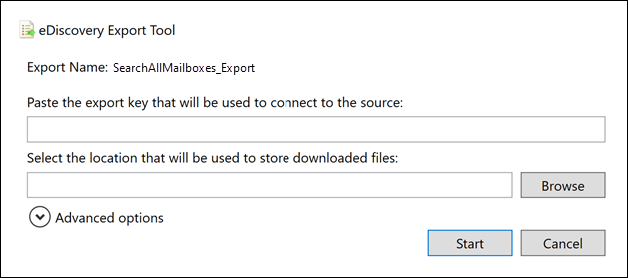
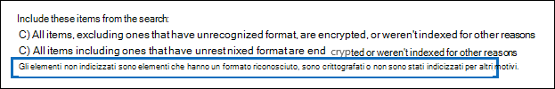

# <a name="export-content-search-results"></a>Esportare i risultati di Ricerca contenuto

Una volta eseguita correttamente una ricerca di contenuto, è possibile esportare i risultati della ricerca in un computer locale. Quando si esportano i risultati di posta elettronica, questi vengono scaricati nel computer sotto forma di file PST. Quando si esporta contenuto da siti di SharePoint e OneDrive for business, vengono esportate copie dei documenti di Office nativi. Sono inclusi altri documenti e report con i risultati della ricerca esportati.
  
L'esportazione dei risultati di una ricerca di contenuto comporta la preparazione dei risultati e il relativo download a un computer locale.
  
## <a name="before-you-export-content-search-results"></a>Prima di esportare i risultati della ricerca contenuto

- Per esportare i risultati della ricerca, è necessario assegnare il ruolo di gestione export nel centro sicurezza & Compliance. Questo ruolo è assegnato al gruppo di ruoli Gestore di eDiscovery incorporato. Non viene assegnato per impostazione predefinita al gruppo di ruoli Gestione organizzazione. Per altre informazioni, vedere [Assegnare autorizzazioni di eDiscovery](assign-ediscovery-permissions.md).

- Il computer utilizzato per esportare i risultati della ricerca deve soddisfare i seguenti requisiti di sistema:
  
  - versioni a 32 bit o 64 bit di Windows 7 e versioni successive
  
  - Microsoft .NET Framework 4.7
  
- Per eseguire lo strumento di esportazione di eDiscovery<sup>1</sup>, è necessario utilizzare uno dei seguenti browser supportati:

  - Microsoft Edge <sup>2</sup>
  
    OPPURE

  - Microsoft Internet Explorer 10 e versioni successive
  
  > [!NOTE]
  > <sup>1</sup> Microsoft non produce estensioni o componenti aggiuntivi di terze parti per le applicazioni ClickOnce. L'esportazione dei risultati di ricerca utilizzando un browser non supportato con le estensioni di terze parti o i componenti aggiuntivi non è supportata.<br/>
  > <sup>2</sup> come risultato delle recenti modifiche apportate a Microsoft Edge, il supporto ClickOnce non è più abilitato per impostazione predefinita. Per istruzioni sull'abilitazione del supporto ClickOnce in Edge, vedere [utilizzare lo strumento di esportazione di eDiscovery in Microsoft Edge](configure-edge-to-export-search-results.md).
  
- Si consiglia di scaricare i risultati della ricerca in un computer locale. Tuttavia, per eliminare l'infrastruttura del firewall o del proxy dell'azienda dalla causa dei problemi durante il download dei risultati della ricerca, è possibile prendere in considerazione la possibilità di scaricare i risultati della ricerca in un desktop virtuale all'esterno della rete. In questo caso, potrebbero verificarsi dei timeout che si verificano nelle connessioni dati di Azure durante l'esportazione di un numero elevato di file. Per ulteriori informazioni sui desktop virtuali, vedere [Windows Virtual Desktop](https://azure.microsoft.com/services/virtual-desktop). 

- Per migliorare le prestazioni durante il download dei risultati della ricerca, è consigliabile dividere le ricerche che restituiscono un set di risultati di grandi dimensioni in ricerche più piccole. Ad esempio, è possibile utilizzare intervalli di date nelle query di ricerca per restituire un insieme di risultati più piccolo che può essere scaricato più velocemente.
  
- Quando si esportano i risultati della ricerca, i dati vengono temporaneamente archiviati in una posizione di archiviazione di Azure fornita da Microsoft nel cloud Microsoft prima che vengano scaricati nel computer locale. Assicurarsi che l'organizzazione sia in grado di connettersi all'endpoint in Azure, che è **\* . blob.Core.Windows.NET** (il carattere jolly rappresenta un identificatore univoco per l'esportazione). I dati dei risultati della ricerca vengono eliminati dal percorso di archiviazione di Azure due settimane dopo la sua creazione. 
  
- Se l'organizzazione utilizza un server proxy per comunicare con Internet, è necessario definire le impostazioni del server proxy nel computer utilizzato per esportare i risultati della ricerca, in modo che lo strumento di esportazione possa essere autenticato dal server proxy. A tale scopo, aprire il file  *machine.config*  nel percorso corrispondente alla versione di Windows in uso. 
  
  - **32 bit:**`%windir%\Microsoft.NET\Framework\[version]\Config\machine.config`
  
  - **64 bit:**`%windir%\Microsoft.NET\Framework64\[version]\Config\machine.config`
  
    Aggiungere le righe seguenti al file  *machine.config*  da qualche parte tra  `<configuration>` i  `</configuration>` tag e. Assicurarsi di sostituire  `ProxyServer` e  `Port` con i valori corretti per l'organizzazione, ad esempio,  `proxy01.contoso.com:80` . 
  
    ```xml
    <system.net>
       <defaultProxy enabled="true" useDefaultCredentials="true">
         <proxy proxyaddress="https://ProxyServer :Port " 
                usesystemdefault="False" 
                bypassonlocal="True" 
                autoDetect="False" />
       </defaultProxy>
    </system.net>
    ```

## <a name="step-1-prepare-search-results-for-export"></a>Passaggio 1: Preparare i risultati della ricerca per l'esportazione

Il primo passaggio consiste nel preparare i risultati della ricerca per l'esportazione. Quando si preparano i risultati, vengono caricati in una posizione di archiviazione di Azure fornita da Microsoft nel cloud Microsoft. Il contenuto delle cassette postali e dei siti viene caricato a una velocità massima di 2 GB/ora.
  
1. Passare a [https://protection.office.com](https://protection.office.com).
  
2. Accedere usando l'account di lavoro o della scuola.
  
3. Nel riquadro sinistro del Centro sicurezza & conformità fare clic su ricerca  \> **contenuto** ricerca.
  
4. Nella pagina **Ricerca contenuto** selezionare una ricerca. 
  
5. Nel riquadro dei dettagli, in **Esporta i risultati in un computer**, fare clic su **Avvia esportazione**.
  
    > [!NOTE]
    > Se i risultati di una ricerca hanno più di 7 giorni, viene chiesto di aggiornare i risultati di ricerca. In tal caso, annullare l'esportazione, fare clic su **Aggiorna i risultati della ricerca** nel riquadro dei dettagli per la ricerca selezionata, quindi avviare l'esportazione dopo l’aggiornamento dei risultati.  
  
6. Nella pagina **Esporta i risultati della ricerca** , in **Opzioni di output**, scegliere una delle seguenti opzioni:
  
    - Tutti gli elementi, esclusi quelli con formato non riconosciuto, sono crittografati o non sono stati indicizzati per altri motivi
  
    - Tutti gli elementi, compresi quelli che dispongono di un formato non riconosciuto, sono crittografati o non sono stati indicizzati per altri motivi
  
    - Solo gli elementi che hanno un formato non riconosciuto, sono crittografati o non sono stati indicizzati per altri motivi
  
    Vedere la sezione [ulteriori informazioni](#more-information) per una descrizione del modo in cui gli elementi parzialmente indicizzati vengono esportati. Per ulteriori informazioni sugli elementi parzialmente indicizzati, vedere [gli elementi parzialmente indicizzati in ricerca contenuto](partially-indexed-items-in-content-search.md).
  
7. In **Esporta contenuto di Exchange come** scegliere una delle seguenti opzioni:
  
    - **Un file PST per ogni cassetta postale:** Esporta un file PST per ogni cassetta postale utente che contiene i risultati della ricerca. Tutti i risultati della cassetta postale di archiviazione dell'utente sono inclusi nello stesso file PST. Questa opzione riproduce la struttura delle cartelle delle cassette postali dalla cassetta postale di origine.
  
    - **Un file PST contenente tutti i messaggi:** Esporta un singolo file PST (denominato *Exchange. pst*) contenente i risultati della ricerca provenienti da tutte le cassette postali di origine incluse nella ricerca. Questa opzione riproduce la struttura delle cartelle delle cassette postali per ogni messaggio.
  
    - **Un file PST contenente tutti i messaggi in una singola cartella:** Esporta i risultati della ricerca in un singolo file PST in cui tutti i messaggi si trovano in una singola cartella di primo livello. Questa opzione consente ai revisori di esaminare gli elementi in ordine cronologico (gli elementi sono ordinati in base alla data di invio) senza dover esplorare la struttura delle cartelle della cassetta postale originale per ogni elemento.
  
    - **Singoli messaggi:** Esporta i risultati della ricerca come singoli messaggi di posta elettronica, utilizzando il formato. msg. Se si seleziona questa opzione, i risultati della ricerca della posta elettronica vengono esportati in una cartella del file System. Il percorso della cartella per i singoli messaggi è identico a quello utilizzato se i risultati sono stati esportati in file PST.
  
      > [!IMPORTANT]
      > Per decrittografare i messaggi protetti da RMS quando vengono esportati, è necessario esportare i risultati della ricerca tramite posta elettronica come singoli messaggi. I messaggi crittografati rimarranno crittografati se i risultati della ricerca vengono esportati come file PST. Per ulteriori informazioni, vedere [decrittografia dei messaggi di posta elettronica protetti da RMS e file allegati crittografati](#decrypting-rms-protected-email-messages-and-encrypted-file-attachments) in questo articolo.
  
8. Fare clic sulla casella di controllo **attiva la deduplicazione** per escludere i messaggi duplicati. Questa opzione viene visualizzata solo se le origini di contenuto della ricerca includono cassette postali di Exchange o cartelle pubbliche. 
  
    Se si seleziona questa opzione, verrà esportata una sola copia di un messaggio anche se vengono trovate più copie dello stesso messaggio nelle cassette postali che sono state perquisite. Il report Export results (Results.csv) conterrà una riga per ogni copia di un messaggio duplicato, in modo che sia possibile identificare le cassette postali (o le cartelle pubbliche) che contengono una copia del messaggio duplicato. Per ulteriori informazioni sulla deduplicazione e sulla modalità di identificazione degli elementi duplicati, vedere [de-duplication nei risultati della ricerca di eDiscovery](de-duplication-in-ediscovery-search-results.md).
  
9. Fare clic sulla casella di controllo **Includi versioni per documenti di SharePoint** per esportare tutte le versioni dei documenti di SharePoint. Questa opzione viene visualizzata solo se le origini di contenuto della ricerca includono i siti di SharePoint o OneDrive for business. 
  
10. Fare clic sulla casella di controllo **Esporta file in una cartella compressa (zippata)** per esportare i risultati della ricerca in cartelle compresse. Questa opzione è disponibile solo se si sceglie di esportare gli elementi di Exchange come singoli messaggi e quando i risultati della ricerca includono documenti di SharePoint o OneDrive. Questa opzione viene utilizzata principalmente per aggirare il limite di caratteri 260 nei nomi dei percorsi file di Windows quando gli elementi vengono esportati. Nella sezione [altre informazioni](#more-information) , vedere "nomi di file degli elementi esportati". 
  
11. Fare clic su **Avvia esportazione**. I risultati della ricerca sono pronti per il download, il che significa che sono stati caricati in una posizione di archiviazione di Azure nel cloud Microsoft. Questa operazione può richiedere diversi minuti.

Vedere la sezione successiva per istruzioni per scaricare i risultati della ricerca esportati.
  
## <a name="step-2-download-the-search-results"></a>Passaggio 2: Scaricare i risultati della ricerca

Il passaggio successivo consiste nel scaricare i risultati della ricerca dal percorso di archiviazione di Azure nel computer locale.
  
1. Nella pagina **Ricerca contenuto** fare clic sulla scheda **esportazioni** . 
  
   Potrebbe essere necessario fare clic su **Aggiorna** per aggiornare l'elenco dei processi di esportazione in modo che venga visualizzato il processo di esportazione creato. I processi di esportazione hanno lo stesso nome della ricerca corrispondente con **_Export** accodati al nome della ricerca.
  
2. Selezionare il processo di esportazione creato nel passaggio 1.

3. Nella pagina riquadro a comparsa in **chiave di esportazione**, fare clic su **copia negli Appunti**. Per scaricare i risultati della ricerca, è possibile utilizzare questa chiave nel passaggio 6.
  
4. Fai clic su **Scarica risultati**.

5. Se viene richiesto di installare lo **strumento di esportazione di eDiscovery**, fare clic su **Installa**.

6. Nello **strumento di esportazione di eDiscovery** eseguire le operazioni seguenti:

   

   1. Incollare la chiave di esportazione copiata nel passaggio 3 nell'apposita casella.
  
   2. Fare clic su **Sfoglia** per specificare il percorso in cui si desidera scaricare i file dei risultati della ricerca.
  
      > [!IMPORTANT]
      >  A causa di attività di rete elevate durante il download, è consigliabile scaricare i risultati della ricerca solo in un percorso su un'unità interna del computer locale. Per una migliore esperienza di download, seguire queste linee guida: <br/>
      >- Non scaricare i risultati della ricerca in un percorso UNC, in un'unità di rete mappata, in un'unità USB esterna o in un account OneDrive for business sincronizzato.<br/>
      >- Disabilitare l'analisi antivirus per la cartella in cui è stato scaricato il risultato della ricerca.<br/>
      >- Scaricare i risultati della ricerca in cartelle diverse per i processi di download simultanei.

6. Fare clic su **Avvia** per scaricare i risultati della ricerca nel computer.
  
    Lo **Strumento di esportazione eDiscovery** consente di visualizzare informazioni sullo stato delle informazioni relative al processo di esportazione, incluso il numero stimato (e le dimensioni) degli elementi rimanenti da scaricare. Al termine del processo di esportazione, è possibile accedere ai file nel percorso in cui sono stati scaricati.

## <a name="more-information"></a>Ulteriori informazioni

Di seguito sono riportate altre informazioni sull'esportazione dei risultati della ricerca.
  
[Limiti di esportazione](#export-limits)
  
[Esporta rapporti](#export-reports)
  
[Esportazione di elementi parzialmente indicizzati](#exporting-partially-indexed-items)

[Esportazione di singoli messaggi o file PST](#exporting-individual-messages-or-pst-files)
  
[Esportazione dei risultati da più di 100.000 cassette postali](#exporting-results-from-more-than-100000-mailboxes)

[Decrittografia dei messaggi di posta elettronica protetti da RMS e degli allegati di file crittografati](#decrypting-rms-protected-email-messages-and-encrypted-file-attachments)

[Nomi di file degli elementi esportati](#filenames-of-exported-items)  
  
[Varie](#miscellaneous)
  
### <a name="export-limits"></a>Limiti di esportazione

Per informazioni sui limiti quando si esportano i risultati della ricerca del contenuto, vedere la sezione "limiti di esportazione" in [limits for content search](limits-for-content-search.md#export-limits).

### <a name="export-reports"></a>Esporta rapporti
  
- Quando si esportano i risultati della ricerca, vengono inclusi i rapporti seguenti oltre ai risultati della ricerca.
  
  - **Riepilogo esportazione** Documento di Excel che contiene un riepilogo dell'esportazione. Sono incluse informazioni quali il numero di origini di contenuto che sono state cercate, le dimensioni stimate e scaricate dei risultati della ricerca e il numero stimato e scaricato degli elementi esportati.
  
  - **Manifesto** File manifesto (in formato XML) che contiene informazioni su ogni elemento incluso nei risultati della ricerca.
  
  - **Risultati** della ricerca Documento di Excel che contiene informazioni su ogni elemento che viene scaricato come risultato della ricerca. Per la posta elettronica, il log dei risultati contiene informazioni su ogni messaggio, tra cui:
  
    - Il percorso del messaggio nella cassetta postale di origine (e se il messaggio è nella cassetta postale principale o di archiviazione).
  
    - La data in cui è stato inviato o ricevuto il messaggio.

    - La riga dell'oggetto del messaggio.

    - Il mittente e i destinatari del messaggio.

    - Se il messaggio è un messaggio duplicato se è stata abilitata l'opzione di deduplicazione quando si esportano i risultati della ricerca. I messaggi duplicati dispongono di un valore nella colonna **Duplica a elemento** che identifica il messaggio come duplicato. Il valore nella colonna **Duplica all'elemento** contiene l'identità dell'elemento del messaggio che è stato esportato. Per ulteriori informazioni, vedere [de-duplication nei risultati della ricerca di eDiscovery](de-duplication-in-ediscovery-search-results.md).

      Per i documenti dei siti di SharePoint e OneDrive for business, il log dei risultati contiene informazioni su ogni documento, tra cui:

      - L'URL per il documento.

      - L’URL per la raccolta di siti in cui si trova il documento.

      - La data dell'ultima modifica al documento.

      - Il nome del documento (che si trova nella colonna Oggetto nel log dei risultati).

  - **Elementi non indicizzati** Documento di Excel che contiene informazioni su eventuali elementi parzialmente indicizzati che verrebbero inclusi nei risultati della ricerca. Se non si includono gli elementi parzialmente indicizzati durante la generazione del report dei risultati di ricerca, questo report verrà comunque scaricato, ma sarà vuoto.

  - **Errori e avvisi** Contiene errori e avvisi relativi ai file riscontrati durante l'esportazione. Per informazioni specifiche su ogni singolo errore o avviso, vedere la colonna Error details.

  - **Elementi ignorati** Quando si esportano i risultati della ricerca da siti di SharePoint e OneDrive for business, l'esportazione include in genere un rapporto elementi ignorati (SkippedItems.csv). Gli elementi citati in questo report sono in genere elementi che non verranno scaricati, ad esempio una cartella o un set di documenti. L'esportazione di questi tipi di elementi è in base alla progettazione. Per gli altri elementi ignorati, il campo ' tipo di errore ' è Error details ' del rapporto elementi ignorati Mostra il motivo per cui l'elemento è stato ignorato e non è stato scaricato con gli altri risultati della ricerca.

  - **Registro di traccia** Contiene informazioni dettagliate sulla registrazione relative al processo di esportazione e può essere utile per scoprire i problemi durante l'esportazione.
  
    > [!NOTE]
    > È possibile esportare solo questi documenti senza dover esportare i risultati della ricerca effettivi. Vedere [esportare un rapporto di ricerca contenuto](export-a-content-search-report.md). 
  
### <a name="exporting-partially-indexed-items"></a>Esportazione di elementi parzialmente indicizzati
  
- Se si stanno esportando elementi della cassetta postale da una ricerca di contenuto che restituisce tutti gli elementi delle cassette postali nei risultati della ricerca (perché nessuna parola chiave dove è inclusa nella query di ricerca), gli elementi parzialmente indicizzati non verranno copiati nel file PST che contiene gli elementi non indicizzati. Ciò è dovuto al fatto che tutti gli elementi, compresi gli elementi parzialmente indicizzati, vengono inclusi automaticamente nei risultati di ricerca normali. Questo significa che gli elementi parzialmente indicizzati verranno inclusi in un file PST (o come singoli messaggi) che contiene gli altri elementi indicizzati.

    Se si esportano sia gli elementi indicizzati che quelli parzialmente indicizzati oppure se si esportano solo gli elementi indicizzati da una ricerca di contenuto che restituisce tutti gli elementi, verrà scaricato lo stesso numero di elementi. Questo accade anche se i risultati della ricerca stimati per la ricerca di contenuto (visualizzati nelle statistiche di ricerca nel centro sicurezza & conformità) continueranno a includere una stima distinta per il numero di elementi parzialmente indicizzati. Si supponga, ad esempio, che la stima di una ricerca che includa tutti gli elementi (nessuna parola chiave nella query di ricerca) indichi che sono stati trovati 1.000 elementi e che sono stati trovati anche gli elementi parzialmente indicizzati 200. In questo caso, gli elementi 1.000 includono gli elementi parzialmente indicizzati poiché la ricerca restituisce tutti gli elementi. In altre parole, sono disponibili 1.000 elementi totali restituiti dalla ricerca e non 1.200 elementi (come si potrebbe immaginare). Se si esportano i risultati della ricerca e si sceglie di esportare gli elementi indicizzati e parzialmente indicizzati (o di esportare solo elementi parzialmente indicizzati), verranno scaricati gli elementi 1.000. Di nuovo, perché gli elementi parzialmente indicizzati sono inclusi nei risultati regolari (indicizzati) quando si utilizza una query di ricerca vuota per restituire tutti gli elementi. In questo stesso esempio, se si sceglie di esportare solo gli elementi parzialmente indicizzati, verranno scaricati solo gli elementi 200 non indicizzati.

    Si noti inoltre che nell'esempio precedente (quando si esportano elementi indicizzati e parzialmente indicizzati o si esportano solo elementi indicizzati), il rapporto **riepilogativo di esportazione** incluso con i risultati di ricerca esportati elenca 1.000 elementi stimati e 1.000 gli elementi scaricati per gli stessi motivi descritti in precedenza. 

- Se la ricerca da cui si stanno esportando i risultati è stata una ricerca di percorsi di contenuto specifici o di tutti i percorsi di contenuto dell'organizzazione, verranno esportati solo gli elementi parziali provenienti da percorsi di contenuto che contengono elementi che corrispondono ai criteri di ricerca. In altre parole, se non sono presenti risultati della ricerca in una cassetta postale o in un sito, tutti gli elementi parzialmente indicizzati in tale cassetta postale o sito non verranno esportati. Il motivo è che l'esportazione di elementi parzialmente indicizzati da un numero elevato di posizioni nell'organizzazione potrebbe aumentare la probabilità di errori di esportazione e aumentare il tempo necessario per esportare e scaricare i risultati della ricerca.

    Per esportare gli elementi parzialmente indicizzati da tutti i percorsi di contenuto per una ricerca, configurare la ricerca in modo che restituisca tutti gli elementi (rimuovendo le parole chiave dalla query di ricerca) e quindi esportare solo gli elementi parzialmente indicizzati quando si esportano i risultati della ricerca.

    
  
- Quando si esportano i risultati della ricerca da siti di SharePoint o OneDrive for business, la possibilità di esportare gli elementi non indicizzati dipende anche dall'opzione di esportazione selezionata e se un sito in cui è stata eseguita la ricerca contiene un elemento indicizzato che corrisponde ai criteri di ricerca. Ad esempio, se si esegue una ricerca in siti specifici di SharePoint o OneDrive for business e non vengono trovati risultati della ricerca, non verranno esportati elementi non indicizzati da tali siti se si sceglie la seconda opzione di esportazione per esportare gli elementi indicizzati e non indicizzati. Se un elemento indicizzato di un sito corrisponde ai criteri di ricerca, tutti gli elementi non indicizzati provenienti da tale sito verranno esportati quando si esportano sia gli elementi indicizzati che quelli non indicizzati. Nella figura seguente vengono illustrate le opzioni di esportazione in base al fatto che un sito contenga un elemento indicizzato che corrisponda ai criteri di ricerca.

    

    1. Vengono esportati solo gli elementi indicizzati che soddisfano i criteri di ricerca. Non vengono esportati elementi parzialmente indicizzati.

    2. Se non sono presenti elementi indicizzati provenienti da un sito che soddisfano i criteri di ricerca, gli elementi parzialmente indicizzati provenienti dallo stesso sito non vengono esportati. Se nei risultati della ricerca vengono restituiti elementi indicizzati provenienti da un sito, gli elementi parzialmente indicizzati provenienti da tale sito vengono esportati. In altre parole, vengono esportati solo gli elementi parzialmente indicizzati provenienti da siti che contengono elementi che soddisfano i criteri di ricerca.

    3. Tutti gli elementi parzialmente indicizzati provenienti da tutti i siti della ricerca vengono esportati, indipendentemente dal fatto che un sito contenga elementi che soddisfano i criteri di ricerca.

    Se si sceglie di esportare gli elementi parzialmente indicizzati, gli elementi delle cassette postali parzialmente indicizzati vengono esportati in un file PST separato indipendentemente dall'opzione scelta in **Esporta contenuto di Exchange con nome**.

- Se nei risultati della ricerca vengono restituiti elementi parzialmente indicizzati (poiché altre proprietà degli elementi parzialmente indicizzati corrispondono ai criteri di ricerca), tali voci vengono esportate con i risultati di ricerca normali. Pertanto, se si sceglie di esportare sia gli elementi indicizzati sia gli elementi parzialmente indicizzati (selezionando tutti gli elementi **, compresi quelli che dispongono di un formato non riconosciuto, vengono crittografati o non sono stati indicizzati per altri motivi, è** possibile esportare l'opzione), gli elementi parzialmente indicizzati esportati con i risultati normali verranno elencati nel report Results.csv. Non verranno elencati nel rapporto items.csv non indicizzato.
  
### <a name="exporting-individual-messages-or-pst-files"></a>Esportazione di singoli messaggi o file PST
  
- Se il nome del percorso del file del messaggio supera il limite massimo di caratteri per Windows, il nome del percorso del file viene troncato. Tuttavia, il nome del percorso del file originale verrà elencato nel manifesto e ResultsLog.
  
- Come spiegato in precedenza, i risultati della ricerca di posta elettronica vengono esportati in una cartella del file System. Il percorso della cartella per i singoli messaggi potrebbe replicare il percorso della cartella nella cassetta postale dell'utente. Ad esempio, per una ricerca denominata "ContosoCase101" i messaggi nella posta in arrivo di un utente si troverebbero nel percorso della cartella  `~ContosoCase101\\<date of export\Exchange\user@contoso.com (Primary)\Top of Information Store\Inbox` .

- Se si sceglie di esportare i messaggi di posta elettronica in un unico file PST contenente tutti i messaggi in una singola cartella, una cartella **posta eliminata** e una cartella **cartelle di ricerca** sono incluse nel livello principale della cartella PST. Queste cartelle sono vuote.

- Come indicato in precedenza, è necessario esportare i risultati della ricerca della posta elettronica come singoli messaggi per decrittografare i messaggi protetti da RMS quando vengono esportati. I messaggi crittografati rimarranno crittografati se si esportano i risultati della ricerca di posta elettronica come file PST.
  
### <a name="exporting-results-from-more-than-100000-mailboxes"></a>Esportazione dei risultati da più di 100.000 cassette postali

- Come spiegato in precedenza, è necessario utilizzare la sicurezza & Compliance Center PowerShell per scaricare i risultati della ricerca da più di 100.000 cassette postali. È possibile eseguire lo script seguente in questa sezione per scaricare i risultati della ricerca. L'utilizzo di questo script presuppone che siano già stati esportati i risultati della ricerca (il processo di esportazione viene visualizzato nella scheda **Esporta** nello strumento di ricerca del contenuto) e ora si desidera scaricarli.

   ```powershell
   $export=Get-ComplianceSearchAction SEARCHNAME_Export -IncludeCredential;
   $exportUrl=   [System.Uri]::EscapeDataString(($export.Results.Split(";") | ?{$_ -like '*Container url*'} | %{$_.Split(":",2)} | select -last 1).Trim());
   $exportToken=($export.Results.Split(";") | ?{$_ -like '*SAS Token*'} | %{$_.Split(":",2)} | select -last 1).Trim();
   ."$env:ProgramFiles\Internet Explorer\IEXPLORE.EXE" "https://complianceclientsdf.blob.core.windows.net/v16/Microsoft.Office.Client.Discovery.UnifiedExportTool.application?name=$($export.Name)&source=$exportUrl&zip=allow&trace=1";
   $exportToken | clip;
   ```

  Nello script, è necessario specificare il nome della ricerca di cui si desidera esportare i risultati. Ad esempio, per una ricerca denominata, `SearchAllMailboxes` sostituire SEARCHNAME_Export con `SearchAllMailboxes_Export` .

  Dopo aver aggiunto il nome della ricerca allo script, è possibile copiare il testo dello script e incollarlo in una finestra di Windows PowerShell [connessa al centro sicurezza & Compliance Center PowerShell](https://docs.microsoft.com/powershell/exchange/connect-to-scc-powershell). Dopo aver incollato lo script, viene visualizzato lo strumento di esportazione di eDiscovery (come quando si scaricano i risultati della ricerca tramite l'interfaccia utente):

  

  Fare clic nella casella chiave di esportazione e quindi premere `CTRL + V` per incollare la chiave di esportazione (lo script copia la chiave di esportazione negli Appunti). Fare clic su **Sfoglia** per specificare il percorso in cui si desidera scaricare i file e quindi avviare il download.

  Come indicato in precedenza, si consiglia di scaricare i risultati della ricerca in un'unità disco locale a causa dell'elevata quantità di attività del disco (letture e scritture). Non scaricare i risultati della ricerca in un'unità di rete mappata o in un altro percorso di rete.

### <a name="decrypting-rms-protected-email-messages-and-encrypted-file-attachments"></a>Decrittografia dei messaggi di posta elettronica protetti da RMS e degli allegati di file crittografati

Qualsiasi messaggio di posta elettronica protetto da diritti (RMS) incluso nei risultati di una ricerca di contenuto verrà decrittografato quando vengono esportati. Inoltre, tutti i file crittografati con una [tecnologia di crittografia Microsoft](encryption.md) ed è collegato a un messaggio di posta elettronica incluso nei risultati della ricerca verranno decrittografati anche quando viene esportato. Questa funzionalità di decrittografia è abilitata per impostazione predefinita per i membri del gruppo di ruoli eDiscovery Manager. Ciò è dovuto al fatto che il ruolo di gestione Decrypt RMS è assegnato per impostazione predefinita a questo gruppo di ruoli. Quando si esportano messaggi di posta elettronica e allegati crittografati, tenere presenti le considerazioni seguenti:
  
- Come spiegato in precedenza, per decrittografare i messaggi protetti da RMS quando vengono esportati, è necessario esportare i risultati della ricerca come singoli messaggi. Se si esportano i risultati della ricerca in un file PST, i messaggi protetti da RMS rimarranno crittografati.

- I messaggi decrittografati vengono identificati nel report di **ResultsLog** . Questo report contiene una colonna denominata **Decode status** e il valore **decodificato** in questa colonna identifica i messaggi decrittografati.

- Oltre a decrittografare gli allegati dei file durante l'esportazione dei risultati della ricerca, è anche possibile visualizzare in anteprima il file decrittografato quando si visualizzano i risultati della ricerca. Dopo l'esportazione, è possibile visualizzare solo il messaggio di posta elettronica protetto da diritti.

- In questo momento, la funzionalità di decrittografia quando si esportano i risultati della ricerca non include il contenuto crittografato dei siti di SharePoint e OneDrive for business. Tuttavia, il supporto sarà presto disponibile per i documenti crittografati con le tecnologie di crittografia Microsoft e archiviati in SharePoint Online e OneDrive for business.

- Se è necessario impedire a un utente di decrittografare i messaggi protetti da RMS e gli allegati di file crittografati, è necessario creare un gruppo di ruoli personalizzato (copiando il gruppo di ruoli eDiscovery Manager incorporato) e quindi rimuovere il ruolo di gestione Decrypt RMS dal gruppo di ruoli personalizzato. Aggiungere quindi la persona che non si desidera decrittografare i messaggi come membro del gruppo di ruoli personalizzato.
  
### <a name="filenames-of-exported-items"></a>Nomi di file degli elementi esportati
  
- Vi è un limite di 260 caratteri (imposto dal sistema operativo) per il nome del percorso completo per i messaggi di posta elettronica e i documenti del sito esportati nel computer locale. Il nome del percorso completo per gli elementi esportati include il percorso originale dell'elemento e il percorso della cartella nel computer locale in cui vengono scaricati i risultati della ricerca. Ad esempio, se si specifica di scaricare i risultati della ricerca  `C:\Users\Admin\Desktop\SearchResults` nello strumento di esportazione di eDiscovery, il percorso completo di un elemento di posta elettronica scaricato potrebbe essere  `C:\Users\Admin\Desktop\SearchResults\ContentSearch1\03.15.2017-1242PM\Exchange\sarad@contoso.com (Primary)\Top of Information Store\Inbox\Insider trading investigation.msg` .

    Se si supera il limite di 260 caratteri, il nome del percorso completo di un elemento verrà troncato.

  - Se il nome del percorso completo è maggiore di 260 caratteri, il nome del file verrà accorciato per ottenere il valore massimo. Si noti che il nome del file troncato (escludendo l'estensione di una scheda) non avrà meno di otto caratteri.

  - Se il nome del percorso completo è ancora troppo lungo dopo la riduzione del nome del file, l'elemento viene spostato dal percorso corrente alla cartella padre. Se il percorso è ancora troppo lungo, il processo viene ripetuto: accorciare il nome del file e, se necessario, spostarlo di nuovo nella cartella padre. Questo processo viene ripetuto fino a quando il percorso completo è inferiore al limite di 260 caratteri.

  - Se esiste già un nome di percorso completo troncato, viene aggiunto un numero di versione alla fine del nome del file. ad esempio,  `statusmessage(2).msg` .

    Per ovviare a questo problema, prendere in considerazione la possibilità di scaricare i risultati della ricerca in una posizione con un nome di percorso breve. ad esempio, se si desidera scaricare i risultati della ricerca in una cartella denominata  `C:\Results` , è necessario aggiungere meno caratteri ai nomi di percorso degli elementi esportati anziché scaricarli in una cartella denominata  `C:\Users\Admin\Desktop\Results` .

- Quando si esportano i documenti del sito, è anche possibile che il nome di file originale di un documento venga modificato. Questo accade in particolare per i documenti che sono stati eliminati da un sito di SharePoint o OneDrive for business che è stato messo in attesa. Dopo l'eliminazione di un documento in un sito che è in attesa, il documento eliminato viene automaticamente spostato nella raccolta conservazione per il sito (creato quando il sito è stato messo in attesa). Quando il documento eliminato viene spostato nella raccolta di conservazione, un ID univoco generato casualmente viene aggiunto al nome di file originale del documento. Ad esempio, se il nome del file di un documento è  `FY2017Budget.xlsx` e tale documento viene successivamente eliminato e spostato nella raccolta conservazione, il nome del file del documento che viene spostato nella raccolta di conservazione viene modificato in qualcosa di simile a  `FY2017Budget_DEAF727D-0478-4A7F-87DE-5487F033C81A2000-07-05T10-37-55.xlsx` . Se un documento nella raccolta conservazione contiene la query di una ricerca di contenuto e si esportano i risultati della ricerca, il nome del file esportato è stato modificato. in questo esempio, il nome di file del documento esportato è  `FY2017Budget_DEAF727D-0478-4A7F-87DE-5487F033C81A2000-07-05T10-37-55.xlsx` .

    Quando viene modificato un documento in un sito che è in attesa (e il controllo delle versioni per la raccolta documenti nel sito è stato abilitato), viene creata automaticamente una copia del file nella raccolta conservazione. In questo caso, viene aggiunto un ID univoco generato casualmente al nome del documento copiato nella raccolta di archiviazione.

    Il motivo per cui i nomi di file dei documenti spostati o copiati nella libreria di conservazione conservano è impedire i nomi di file in conflitto. Per ulteriori informazioni sull'inserimento di un'esenzione nei siti e sulla raccolta di conservazione, vedere [Overview of sul-Place Hold in SharePoint Server 2016](https://support.office.com/article/5e400d68-cd51-444a-8fe6-e4df1d20aa95).

### <a name="miscellaneous"></a>Varie
  
- Quando si scaricano i risultati della ricerca utilizzando lo strumento di esportazione di eDiscovery, è possibile che venga visualizzato il seguente messaggio di errore: `System.Net.WebException: The remote server returned an error: (412) The condition specified using HTTP conditional header(s) is not met.` errore temporaneo, che in genere si verifica nel percorso di archiviazione di Azure. Per risolvere il problema, riprovare a [scaricare i risultati della ricerca](#step-2-download-the-search-results), che riavvierà lo strumento di esportazione di eDiscovery.

- Tutti i risultati della ricerca e i report di esportazione sono inclusi in una cartella con lo stesso nome della cartella Ricerca contenuto. I messaggi di posta elettronica che sono stati esportati si trovano in una cartella denominata **Exchange**. I documenti si trovano in una cartella denominata **SharePoint**.

- I metadati del file System per i documenti nei siti di SharePoint e OneDrive for business vengono mantenuti quando i documenti vengono esportati nel computer locale. Ciò significa che le proprietà del documento, ad esempio le date di creazione e dell'ultima modifica, non subiscono variazioni durante l’esportazione dei documenti.

- Se i risultati della ricerca includono una voce di elenco di SharePoint che corrisponde alla query di ricerca, tutte le righe dell'elenco verranno esportate oltre all'elemento che corrisponde alla query di ricerca e a qualsiasi allegato nell'elenco. Il motivo di questo comportamento consiste nel fornire un contesto per gli elementi di elenco restituiti nei risultati della ricerca. Si noti inoltre che gli elementi di elenco aggiuntivi e gli allegati possono determinare una differenza tra il numero di elementi esportati e la stima originale dei risultati della ricerca.
