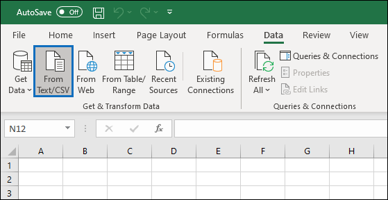
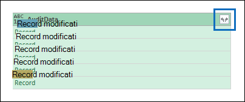

# <a name="export-configure-and-view-audit-log-records"></a>Esportare, configurare e visualizzare i record del log di controllo

Dopo aver cercato nel log di controllo e scaricato i risultati della ricerca in un file CSV, il file contiene una colonna denominata **AuditData,** che contiene informazioni aggiuntive su ogni evento. I dati in questa colonna sono formattati come un oggetto JSON, che contiene più proprietà configurate come *coppie property:value* separate da virgole. Puoi usare la funzionalità di trasformazione JSON nell'editor di Power Query in Excel per dividere ogni proprietà nell'oggetto JSON nella colonna **AuditData** in più colonne in modo che ogni proprietà abbia una propria colonna. In questo modo è possibile ordinare e filtrare in base a una o più di queste proprietà, che consentono di individuare rapidamente i dati di controllo specifici che si stanno cercando.

## <a name="step-1-export-audit-log-search-results"></a>Passaggio 1: Esportare i risultati della ricerca nel log di controllo

Il primo passaggio consiste nel cercare nel log di controllo e quindi esportare i risultati in un file con valori delimitati da virgole (CSV) nel computer locale.
  
1. Eseguire una [ricerca nel log di](search-the-audit-log-in-security-and-compliance.md#search-the-audit-log) controllo e, se necessario, rivedere i criteri di ricerca fino a ottenere i risultati desiderati.

2. Fare **clic su Esporta risultati** e selezionare Scarica tutti i **risultati.** 

   

   Questa opzione consente di esportare tutti i record di controllo dalla ricerca nel log di controllo eseguita nel passaggio 1 e di scaricare i dati non elaborati dal log di controllo in un file CSV. 

   Nella parte inferiore della finestra viene visualizzato un messaggio che richiede di aprire o salvare il file CSV. 

3. Fare **clic > Salva con nome** e salvare il file CSV nel computer locale. Il download di molti risultati della ricerca richiede un po' di tempo. Ciò si verifica in genere quando si cercano tutte le attività o un intervallo di date ampio. Al termine del download del file CSV, viene visualizzato un messaggio nella parte inferiore delle finestre.

   

> [!NOTE]
  > È possibile scaricare al massimo 50.000 voci in un file CSV da una singola ricerca nel log di controllo. Se vengono scaricate 50.000 voci nel file CSV, è probabile che ci siano più di 50.000 eventi che soddisfano i criteri di ricerca. Per esportare più di questo limite, provare a utilizzare un intervallo di date per ridurre il numero di record del registro di controllo. Potrebbe essere necessario eseguire più ricerche con intervalli di date più piccoli per esportare più di 50.000 voci.

## <a name="step-2-format-the-exported-audit-log-using-the-power-query-editor"></a>Passaggio 2: Formattare il log di controllo esportato tramite l'editor di Power Query

Il passaggio successivo consiste nell'usare la funzionalità di trasformazione JSON nell'editor di Power Query in Excel per dividere ogni proprietà nell'oggetto JSON nella **colonna AuditData** nella propria colonna. Le colonne vengono quindi filtrate per visualizzare i record in base ai valori di proprietà specifiche. Ciò consente di individuare rapidamente i dati di controllo specifici che si stanno cercando.

1. Aprire una cartella di lavoro vuota in Excel per Office 365, Excel 2019 o Excel 2016.

2. Nel gruppo **Ottieni barra** multifunzione Per & dati trasformati della scheda Dati fare clic **su Da testo/CSV.** 

    

3. Aprire il file CSV scaricato nel passaggio 1.

4. Nella finestra visualizzata fare clic su Trasforma **dati.**

   

   Il file CSV viene aperto **nell'editor di query.** Sono disponibili quattro colonne: **CreationDate,** **UserIds,** **Operations** e **AuditData.** La **colonna AuditData** è un oggetto JSON che contiene più proprietà. Il passaggio successivo consiste nel creare una colonna per ogni proprietà nell'oggetto JSON.

5. Fai clic con il pulsante destro del mouse sul titolo **nella colonna AuditData,** fai clic **su Transform** e quindi su **JSON.** 

   

6. Nell'angolo superiore destro della colonna **AuditData** fare clic sull'icona di espansione.

   

   Viene visualizzato un elenco parziale delle proprietà negli oggetti JSON nella **colonna AuditData.**

7. Fare **clic su Carica** altro per visualizzare tutte le proprietà negli oggetti JSON nella colonna **AuditData.**

   

   Puoi deselezionare la casella di controllo accanto a qualsiasi proprietà che non vuoi includere. L'eliminazione di colonne che non sono utili per l'indagine è un buon modo per ridurre la quantità di dati visualizzati nel log di controllo. 

   > [!NOTE]
   > Le proprietà JSON visualizzate nello screenshot precedente (dopo aver fatto clic su Carica **altro)** si basano sulle proprietà trovate nella colonna **AuditData** delle prime 1.000 righe del file CSV. Se sono presenti proprietà JSON diverse nei record dopo le prime 1.000 righe, queste proprietà (e una colonna corrispondente) non verranno incluse quando la colonna **AuditData** è suddivisa in più colonne. Per evitare questo problema, è consigliabile eseguire nuovamente la ricerca nel log di controllo e limitare i criteri di ricerca in modo da restituire un numero inferiore di record. Un'altra soluzione alternativa  consiste nel filtrare gli elementi nella colonna Operazioni per ridurre il numero di righe (prima di eseguire il passaggio 5 precedente) prima di trasformare l'oggetto JSON nella **colonna AuditData.**

   > [!TIP]
   > Per visualizzare un attributo all'interno di un elenco,  ad esempio AuditData.AffectedItems, fare clic sull'icona Espandi nell'angolo superiore destro della colonna da cui si desidera estrarre un attributo e quindi selezionare Espandi in nuova **riga.**  Da qui sarà un record ed  è possibile fare clic sull'icona Espandi nell'angolo superiore destro della colonna, visualizzare gli attributi e selezionare quello che si desidera visualizzare o estrarre.

8. Eseguire una delle operazioni seguenti per formattare il titolo delle colonne aggiunte per ogni proprietà JSON selezionata.

    - Deseleziona la casella di controllo Usa **nome colonna originale come** prefisso per usare il nome della proprietà JSON come nomi di colonna. ad esempio **RecordType** o **SourceFileName.**

    - Lasciare selezionata **la casella di controllo Usa** nome colonna originale come prefisso per aggiungere il prefisso AuditData ai nomi delle colonne. ad esempio **AuditData.RecordType** o **AuditData.SourceFileName.**

9. Fare clic su **OK**.

    La **colonna AuditData** è suddivisa in più colonne. Ogni nuova colonna corrisponde a una proprietà nell'oggetto JSON AuditData. Ogni riga della colonna contiene il valore della proprietà. Se la proprietà non contiene un valore, *viene* visualizzato il valore Null. In Excel le celle con valori Null sono vuote.
  
10. Nella scheda **Home** fare clic su **Chiudi & carica** per chiudere l'editor di Power Query e aprire il file CSV trasformato in una cartella di lavoro di Excel.

## <a name="use-powershell-to-search-and-export-audit-log-records"></a>Utilizzare PowerShell per cercare ed esportare i record del log di controllo

Anziché utilizzare lo strumento di ricerca dei log di controllo nel Centro sicurezza & conformità, è possibile utilizzare il cmdlet [Search-UnifiedAuditLog](https://docs.microsoft.com/powershell/module/exchange/search-unifiedauditlog) in PowerShell di Exchange Online per esportare i risultati di una ricerca nel log di controllo in un file CSV. È quindi possibile seguire la stessa procedura descritta nel passaggio 2 per formattare il log di controllo utilizzando l'editor di Power Query. Uno dei vantaggi dell'utilizzo del cmdlet di PowerShell è che è possibile cercare eventi da un servizio specifico utilizzando il *parametro RecordType.* Ecco alcuni esempi di utilizzo di PowerShell per esportare i record di controllo in un file CSV, in modo da poter usare l'editor di Power Query per trasformare l'oggetto JSON nella **colonna AuditData,** come descritto nel passaggio 2.

In questo esempio eseguire i comandi seguenti per restituire tutti i record correlati alle operazioni di condivisione di SharePoint.

```powershell
$auditlog = Search-UnifiedAuditLog -StartDate 06/01/2019 -EndDate 06/30/2019 -RecordType SharePointSharingOperation
```

```powershell
$auditlog | Select-Object -Property CreationDate,UserIds,RecordType,AuditData | Export-Csv -Path c:\AuditLogs\PowerShellAuditlog.csv -NoTypeInformation
```

I risultati della ricerca vengono esportati in un file CSV denominato *PowerShellAuditlog* contenente quattro colonne: CreationDate, UserIds, RecordType, AuditData.

È inoltre possibile utilizzare il nome o il valore di enumerazione per il tipo di record come valore per il *parametro RecordType.* Per un elenco dei nomi dei tipi di record e dei valori di enumerazione corrispondenti, vedere la tabella *AuditLogRecordType* nello schema DELL'attività di gestione di [Office 365.](https://docs.microsoft.com/office/office-365-management-api/office-365-management-activity-api-schema#enum-auditlogrecordtype---type-edmint32)

È possibile includere un solo valore per il *parametro RecordType.* Per cercare record di controllo per altri tipi di record, è necessario eseguire di nuovo i due comandi precedenti per specificare un tipo di record diverso e aggiungere tali risultati al file CSV originale. Ad esempio, è necessario eseguire i due comandi seguenti per aggiungere le attività dei file di SharePoint dallo stesso intervallo di date al file PowerShellAuditlog.csv seguente.

```powershell
$auditlog = Search-UnifiedAuditLog -StartDate 06/01/2019 -EndDate 06/30/2019 -RecordType SharePointFileOperation
```

```powershell
$auditlog | Select-Object -Property CreationDate,UserIds,RecordType,AuditData | Export-Csv -Append -Path c:\AuditLogs\PowerShellAuditlog.csv -NoTypeInformation
```

## <a name="tips-for-exporting-and-viewing-the-audit-log"></a>Suggerimenti per l'esportazione e la visualizzazione del log di controllo

Ecco alcuni suggerimenti ed esempi di esportazione e visualizzazione del log di controllo prima e dopo l'uso della funzionalità di trasformazione JSON per dividere la **colonna AuditData** in più colonne.

- Filtrare la **colonna RecordType** in modo da visualizzare solo i record di un servizio o di un'area funzionale specifica. Ad esempio, per visualizzare gli eventi correlati alla condivisione di SharePoint, è necessario selezionare **14** (il valore di enumerazione per i record attivati dalle attività di condivisione di SharePoint). Per un elenco dei servizi corrispondenti ai valori di enumerazione visualizzati nella colonna **RecordType,** vedere Proprietà dettagliate [nel log di controllo.](detailed-properties-in-the-office-365-audit-log.md)

- Filtrare **la colonna** Operazioni per visualizzare i record per attività specifiche. Per un elenco della maggior parte delle operazioni che corrispondono a un'attività in cui è possibile eseguire ricerche nello strumento di ricerca dei log di controllo nel Centro sicurezza & conformità, vedere la sezione "Attività verificate" nel log di controllo nel Centro [sicurezza & conformità.](search-the-audit-log-in-security-and-compliance.md#audited-activities)
