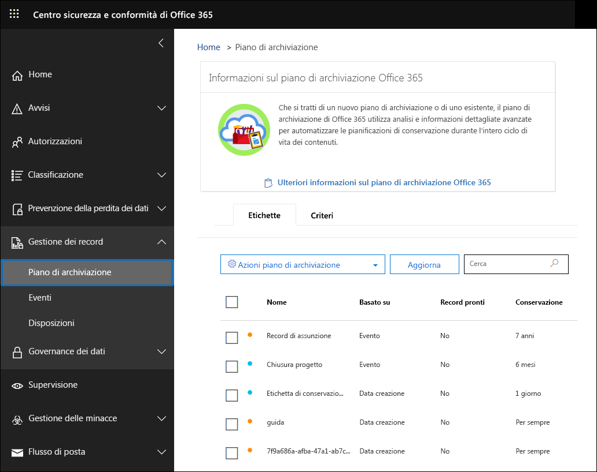
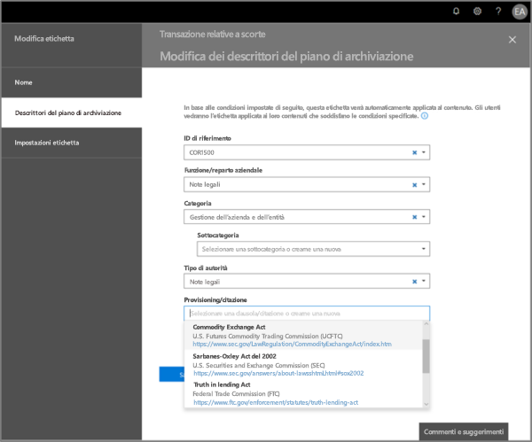
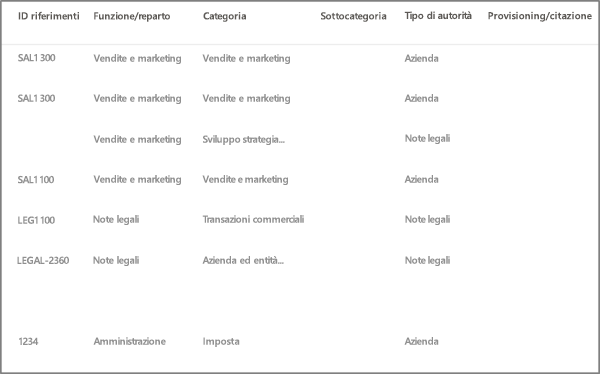
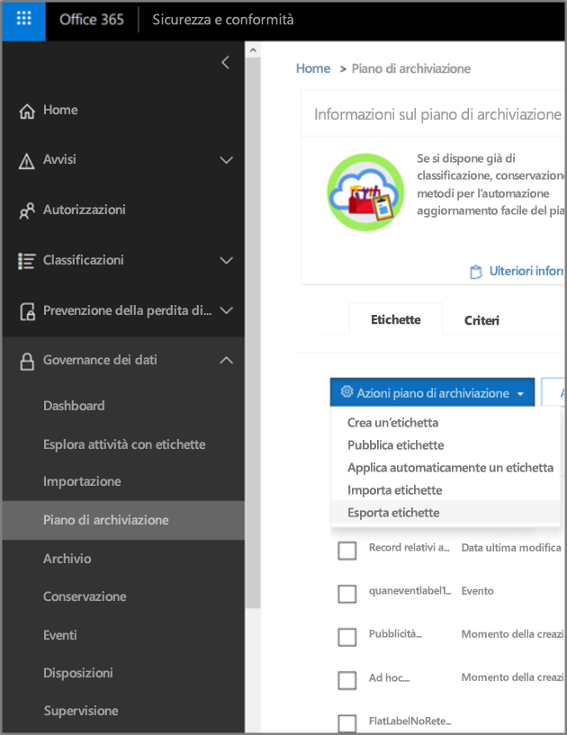
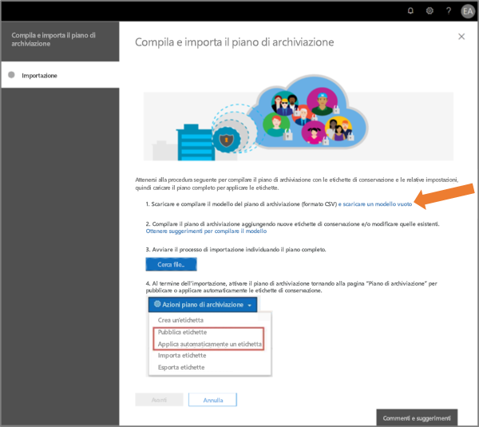
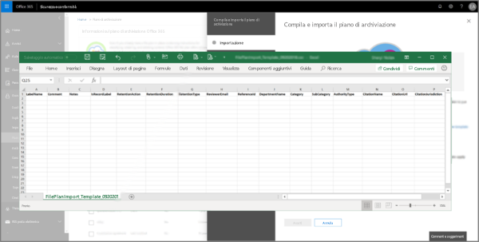
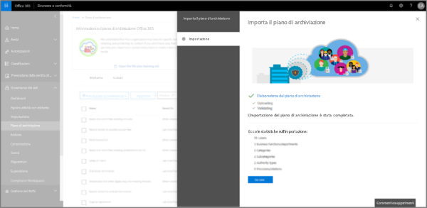
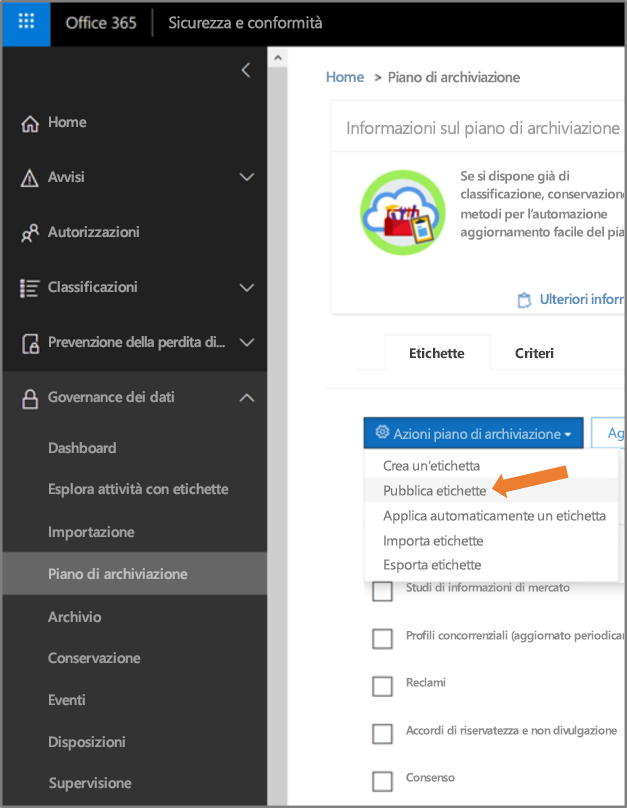

# Panoramica della gestione del piano fileOverview of file plan manager

La funzionalità Gestione del piano di archiviazione fornisce funzionalità avanzate per la gestione di criteri di etichette di conservazione ed etichette di conservazione e consente di attraversare in modo integrato le attività con etichette ed etichetta-a-contenuto per l'intero ciclo di vita del contenuto, dalla creazione alla collaborazione, passando per la dichiarazione del record e la conservazione, fino all'eliminazione finale.File plan manager provides advanced management capabilities for retention labels, retention label policies, and provides an integrated way to traverse label and label-to-content activity for your entire content lifecycle – from creation, through collaboration, record declaration, retention, and finally disposition. 

Per accedere a Gestione del piano di archiviazione nel Centro sicurezza e conformità, passare a **Gestione record** > **Piano di archiviazione**.To access file plan manager in the security and compliance center, go to **Records management** > **File plan**.

## Accesso alla gestione del piano fileAccessing file plan manager

I requisiti per accedere al piano file sono due:There are two requirements to access file plan manager, they are:

- Un abbonamento a Office 365 Enterprise E5.An Office 365 Enterprise E5 subscription.

- All'utente è stato assegnato uno dei ruoli seguenti nel Centro sicurezza e conformità:The user has been in assigned one of the following roles in the security and compliance center:
    
    - Responsabile della conservazioneRetention Manager
    
    - Responsabile della conservazione solo visualizzazioneView-only Retention Manager

## Etichette di conservazione e criteri di etichetta predefinitiDefault retention labels and label policy

Se non sono presenti etichette conservazione nel Centro Sicurezza e Conformità, la prima volta in cui scegli **Piano file** nel riquadro di spostamento a sinistra, verrà creato un criterio di etichetta denominato **Criterio di pubblicazione di governance dei dati predefinito**.If there are no retention labels in the Security & Compliance Center, the first time you choose **File plan** in the left nav, this creates a label policy called **Default Data Governance Publishing Policy**. 

Questo criterio di etichetta contiene tre etichette di conservazione:This label policy contains three retention labels:

- **Procedura operativa****Operational procedure**
- **Business general****Business general**
- **Accordo contrattuale****Contract agreement**

Queste etichette di conservazione vengono configurate solo per conservare il contenuto, non per eliminare il contenuto.These retention labels are configured only to retain content, not delete content. Questo criterio di etichetta verrà pubblicato per l'intera organizzazione e può essere disattivato o rimosso.This label policy will be published to the entire organization and can be disabled or removed. 

È possibile stabilire chi ha aperto la gestione del piano file e avviato la first-run experience esaminando il log di controllo per le attività **Criteri di conservazione creati** e **Configurazione di conservazione creata per un criterio di conservazione**.You can determine who opened file plan manager and kicked off the first-run experience by reviewing the audit log for the activities **Created retention policy** and **Created retention configuration for a retention policy**.

> [!NOTE]
> A causa di feedback di alcuni clienti, è stata rimossa la funzionalità che consente di creare le etichette di conservazione predefinite e i criteri di etichetta di conservazione indicati in precedenza.Due to customer feedback, we have removed this feature that creates the default retention labels and retention label policy mentioned above. Le etichette di conservazione e i criteri per le etichette di conservazione sono visibili solo se è stato aperta la gestione del piano file prima dell'11 aprile 2019.You will only see these retention labels and retention label policy if you opened file plan manager before April 11, 2019.

## Esplorare il piano fileNavigating your file plan

La gestione del piano file semplifica la visualizzazione unica delle impostazioni di tutti i criteri e le etichette di conservazione.File plan manager makes it easier see into and across the settings of all your retention labels and policies from one view.

Si noti che le etichette di conservazione create all'esterno del piano file saranno disponibili nel piano file e viceversa.Note that retention labels created outside of the file plan will be available in the file plan and vice versa.

Nella scheda **Etichette** del piano di archiviazione sono disponibili le funzionalità e le informazioni aggiuntive seguenti:On the file plan **Labels** tab, the following additional information and capabilities are available:

### Colonne impostazioni etichettaLabel settings columns

- **In base a** identifica il tipo di trigger che avvierà il periodo di conservazione. I valori validi sono:**Based on** identifies the type of trigger that will start the retention period. Valid values are:
    - EventoEvent
    - Momento della creazioneWhen created
    - Data ultima modificaWhen last modified
    - Data etichettaturaWhen labeled
- **Record** indica se l'elemento diventa un record dichiarato dopo l'applicazione dell'etichetta. I valori validi sono:**Record** identifies if the item will become a declared record when the label is applied. Valid values are:
    - NoNo
    - SìYes
    - Sì (normativo)Yes(Regulatory)
- **Conservazione** identifica il tipo di conservazione. I valori validi sono:**Retention** identifies the retention type. Valid values are:
    - ConservareKeep
    - Conservare ed eliminareKeep and delete
    - EliminareDelete
- **Disposizione** identifica cosa succederà al contenuto alla fine del periodo di conservazione. I valori validi sono:**Disposition** identifies what will happen to the content at the end of the retention period. Valid values are:
    - nullnull
    - Nessuna azioneNo action
    - Eliminazione automaticaAuto-delete
    - Revisione obbligatoria (ovvero revisione della disposizione)Review required (aka Disposition review)

### Colonne dei descrittori del piano di archiviazione delle etichette di conservazioneRetention label file plan descriptors columns

È ora possibile includere altre informazioni nella configurazione delle etichette di conservazione.You can now include more information in the configuration of your retention labels. L'inserimento di descrittori del piano di archiviazione nelle etichette di conservazione consente di ottimizzare la gestione e l'organizzazione del piano di archiviazione.Inserting file plan descriptors into retention  labels will improve the manageability and organization of your file plan.

Per iniziare, Gestione del piano di archiviazione fornisce alcuni valori predefiniti per Funzione/reparto, Categoria, Tipo di autorità e Clausola/citazione.To get you started, file plan manager provides some out-of-box values for: Function/department, Category, Authority type and Provision/citation. È possibile aggiungere nuovi valori al descrittore del piano di archiviazione quando si crea o si modifica un'etichetta di conservazione.You can add new file plan descriptor values when creating or editing a retention label. È anche possibile specificare descrittori del piano di archiviazione durante l'importazione di etichette di conservazione nel piano.You can also specify file plan descriptors when importing retention labels into your file plan. 

Ecco una visualizzazione del passaggio dei descrittori del piano file quando si crea o modifica un'etichetta di conservazione.Here's a view of the file plan descriptors step when creating or editing a retention label.

Ecco una visualizzazione delle colonne dei descrittori del piano di archiviazione nella scheda **Etichette** di Gestione del piano di archiviazione.Here's a view of the file plan descriptors columns on the **Labels** tab of file plan manager.

## Esportare tutte le etichette di conservazione esistenti per analizzare e/o eseguire le revisioni offlineExport all existing retention labels to analyze and/or perform offline reviews

Dalla gestione del piano file, è possibile esportare i dettagli di tutte le etichette di conservazione in un file CSV per agevolare le analisi di conformità periodiche con le parti interessate responsabili della governance dei dati all'interno dell'organizzazione.From file plan manager, you can export the details of all retention labels into a .csv file to assist you in facilitating periodic compliance reviews with data governance stakeholders in your organization.

Per esportare tutte le etichette di conservazione, nella pagina **Piano di archiviazione** selezionare **Azioni piano file** \> **Esporta etichette**.To export all retention labels: On the **File plan** page, **File plan actions** \> **Export labels**.

Verrà aperto un file CSV che contiene tutte le etichette di conservazione esistenti.A \*.csv file containing all existing retention labels will open.

## Importare le etichette di conservazione nel piano di archiviazioneImport retention labels into your file plan

In Gestione del piano di archiviazione è possibile importare in blocco nuove etichette di conservazione nonché modificare le etichette di conservazione esistenti.In the File plan manager, you can bulk import new retention labels and modify existing retention labels.

Per importare nuove etichette di conservazione e modificare le etichette di conservazione esistenti:To import new retention labels and modify existing retention labels: 

1. Nella pagina **Piano di archiviazione** passare a **Azioni piano file** > **Importa etichette**.On the **File plan** page, go to **File plan actions** > **Import labels**.

   

   

2. Scaricare un modello vuoto per importare le nuove etichette di conservazione.Download a blank template to import new retention labels. In alternativa, è possibile iniziare con il file CSV esportato durante l'esportazione delle etichette di conservazione esistenti nell'organizzazione.Alternatively, you can start with the .csv file that is exported when you export the existing retention labels in your organization.

   

3. Compilare il modello.Fill-out the template. Di seguito sono descritte le proprietà e i valori validi per ogni proprietà nel modello del piano di archiviazione.The following describes the properties and valid values for each property in the file plan template. 

   |**Proprietà****Property**|**Tipo****Type**|**Valori validi****Valid values**|
   |:-----|:-----|:-----|
   |LabelNameLabelName|StringaString|Questa proprietà specifica il nome dell'etichetta di conservazione.This property specifies the name of the retention label.|
   |CommentComment|StringaString|Usare questa proprietà per aggiungere una descrizione relativa all'etichetta di conservazione per gli amministratori.Use this property to add a description about the retention label for admins. Questa descrizione viene visualizzata solo agli amministratori che gestiscono l'etichetta nel Centro sicurezza e conformità.This description appears only to admins who manage the label in the security and compliance center.|
   |NotesNotes|StringaString|Usare questa proprietà per aggiungere una descrizione relativa all'etichetta di conservazione per gli utenti.Use this property to add a description about the retention label for users. Questa descrizione viene visualizzata quando gli utenti passano con il mouse sull'etichetta in app quali Outlook, SharePoint e OneDrive.This description appears when users hover over the label in apps like Outlook, SharePoint, and OneDrive. Se si lascia vuota questa proprietà, viene visualizzata una descrizione predefinita, che illustra le impostazioni di conservazione dell'etichetta.If you leave this property blank, a default description is displayed, which explains the label's retention settings. |
   |IsRecordLabelIsRecordLabel|StringaString|Questa proprietà specifica se l'etichetta è un'etichetta record.This property specifies whether the label is a record label. Gli elementi contrassegnati con un'etichetta record sono dichiarati come record.Items tagged with a record label are declared as records. I valori validi sono:Valid values are: **TRUE**: l'etichetta è un'etichetta record.**TRUE**: The label is a record label. Tenere presente che gli elementi dichiarati come record non possono essere eliminati.Note that items that are declared as a record can't be deleted.  **FALSE**: l'etichetta non è un'etichetta record.**FALSE**: The label isn't a record label. Questo è il valore predefinito.This is the default value.|
   |RetentionActionRetentionAction|StringaString|Questa proprietà specifica l'azione da intraprendere dopo la scadenza del valore specificato dalla proprietà RetentionDuration.This property specifies what action to take after the value specified by the RetentionDuration property expires. I valori validi sono:Valid values are: **Delete**: gli elementi più vecchi del valore specificato dalla proprietà RetentionDuration vengono eliminati.**Delete**: Items older than the value specified by the RetentionDuration property are deleted. **Keep**: gli elementi vengono mantenuti per la durata specificata dalla proprietà RetentionDuration e non viene eseguita alcuna azione alla scadenza del periodo definito per la durata.**Keep**: Retain items for the duration specified by the RetentionDuration property and then doing nothing when the duration period expires.  **KeepAndDelete**: gli elementi vengono mantenuti per la durata specificata dalla proprietà RetentionDuration e quindi vengono eliminati alla scadenza del periodo definito per la durata.**KeepAndDelete**: Retain items for the duration specified by the RetentionDuration property and then delete them when the duration period expires.   |
   |RetentionDurationRetentionDuration|StringaString|La proprietà specifica per quanti giorni mantenere il contenuto.This property specifies the number of days to retain the content. I valori validi sono:Valid values are: **Unlimited**: gli elementi verranno mantenuti a tempo indeterminato.**Unlimited**: Items will be retained indefinitely.  ***n***: un numero intero positivo, ad esempio **365**.***n***: A positive integer; for example, **365**. 
   |RetentionTypeRetentionType|StringaString|Questa proprietà specifica se la durata del periodo di conservazione è stata calcolata a partire dalla data di creazione del contenuto, dalla data dell'evento, dalla data di etichettatura (aggiunta del contrassegno) o dalla data dell'ultima modifica.This property specifies whether the retention duration is calculated from the content creation date, event date, labeled (tagged) date, or last modified date. I valori validi sono:Valid values are: **CreationAgeInDays****CreationAgeInDays** **EventAgeInDays****EventAgeInDays** **TaggedAgeInDays****TaggedAgeInDays** **ModificationAgeInDays****ModificationAgeInDays** |
   |ReviewerEmailReviewerEmail|SmtpAddressSmtpAddress|Quando questa proprietà è popolata, verrà attivata una revisione delle clausole alla scadenza della durata della conservazione.When this property is populated, a disposition review will be triggered when the retention duration expires. Questa proprietà consente di specificare l'indirizzo di posta elettronica del revisore per le azioni di conservazione **Delete** e **KeepAndDelete**.This property specifies the email address of a reviewer for **Delete** and **KeepAndDelete** retention actions. È possibile includere l'indirizzo di posta elettronica di singoli utenti, gruppi di distribuzione o di sicurezza oppure di gruppi di Office 365.You can include the email address of individual users, distribution or security groups, or Office 365 groups. È possibile indicare più indirizzi di posta elettronica separati da virgole.You can specify multiple email addresses separated by commas.|
   |ReferenceIdReferenceId|StringaString|Questa proprietà specifica il valore visualizzato nel descrittore **ID riferimento** del piano di archiviazione.This property specifies the value that's displayed in the **Reference Id** file plan descriptor.| 
   |DepartmentNameDepartmentName|StringaString|Questa proprietà specifica il valore visualizzato nel descrittore **Funzione/reparto** del piano di archiviazione.This property specifies the value that's displayed in the **Function/department** file plan descriptor.|
   |CategoryCategory|StringaString|Questa proprietà specifica il valore visualizzato nel descrittore **Categoria** del piano di archiviazione.This property specifies the value that's displayed in the **Category** file plan descriptor.|
   |SubCategorySubCategory|StringaString|Questa proprietà specifica il valore visualizzato nel descrittore **Sottocategoria** del piano di archiviazione.This property specifies the value that's displayed in the **Sub category** file plan descriptor.|
   |AuthorityTypeAuthorityType|StringaString|Questa proprietà specifica il valore visualizzato nel descrittore **Tipo di autorità** del piano di archiviazione.This property specifies the value that's displayed in the **Authority type** file plan descriptor.|
   |CitationNameCitationName|StringaString|Questa proprietà specifica il nome della citazione visualizzata nel descrittore **Clausola/citazione** del piano di archiviazione, ad esempio "Sarbanes-Oxley Act del 2002".This property specifies the name of the citation displayed in the **Provision/citation** file plan descriptor; for example "Sarbanes-Oxley Act or 2002". |
   |CitationUrlCitationUrl|StringaString|Questa proprietà specifica l'URL visualizzato nel descrittore **Clausola/citazione** del piano di archiviazione.This property specifies the URL that's displayed in the **Provision/citation** file plan descriptor.|
   |CitationJurisdictionCitationJurisdiction|StringaString|Questa proprietà specifica la giurisdizione o l'agenzia visualizzata nel descrittore **Clausola/citazione** del piano di archiviazione, ad esempio "U.S. Securities and Exchange Commission (SEC)".This property specifies the jurisdiction or agency that's displayed in the **Provision/citation** file plan descriptor; for example, "U.S. Securities and Exchange Commission (SEC)".|
   |RegulatoryRegulatory|StringaString|Lasciare vuota.Leave blank. Questa proprietà non viene usata al momento.This property isn't used at this time.|
   |EventTypeEventType|StringaString|Questa proprietà specifica la regola di conservazione associata all'etichetta.This property specifies the retention rule that's associated with the label. È possibile utilizzare qualsiasi valore che identifichi la regola in modo univoco.You can use any value that uniquely identifies the rule. Ad esempio:For example: **Nome****Name** **Nome distinto (DN)****Distinguished name (DN)** **GUID****GUID**  È possibile usare il cmdlet [Get-RetentionComplianceRule](https://docs.microsoft.com/powershell/module/exchange/policy-and-compliance-retention/get-retentioncompliancerule?view=exchange-ps) per visualizzare le regole di conservazione disponibili.You can use the [Get-RetentionComplianceRule](https://docs.microsoft.com/powershell/module/exchange/policy-and-compliance-retention/get-retentioncompliancerule?view=exchange-ps) cmdlet to view the available retention rules. Tenere presente che se si esportano etichette da un'organizzazione di Office 365, non è possibile usare i valori per la proprietà EventType di tale organizzazione durante l'importazione delle etichette in un'altra organizzazione di Office 365.Note that if you export labels from one Office 365 organization, you can't use the values for the EventType  property from that organization when importing labels to a different Office 365 organization. Questa limitazione è dovuta al fatto che i valori di EventType sono specifici di un'organizzazione.That because the EventType values are unique to an organization. |
   |||

   Ecco un esempio di modello che contiene informazioni sulle etichette di conservazione.Here's an example the template containing the information about retention labels.

   

4. Al passaggio 3 della pagina della procedura guidata di importazione del piano di archiviazione fare clic su **Cerca file** per caricare il modello compilato.Under step 3 on the import file plan wizard page, click **Browse for files** to upload the filled-out template. 

   Gestione del piano di archiviazione convaliderà le voci e visualizzerà le statistiche di importazione.File plan manager will validate the entries and display the import statistics.

   

   Se è presente un errore di convalida, la funzionalità di importazione del piano di archiviazione continuerà a convalidare ogni voce nel file di importazione e visualizzerà tutti gli errori che fanno riferimento a numeri di riga nel file di importazione, quindi copierà i risultati degli errori visualizzati in modo che sia possibile facilmente tornare al file di importazione e correggere gli errori.In the event there is a validation error, file plan import will continue to validate every entry in the import file and display all errors referencing line/row numbers in the import file, copy the displayed error results so that you can easily return to the import file and correct the errors.

5. Al termine dell'importazione, tornare a Gestione del piano di archiviazione per associare le nuove etichette di conservazione ai criteri nuovi o esistenti delle etichette di conservazione.When the import is complete, return to file plan manager to associate the new retention labels to new or existing retention label policies.

   
