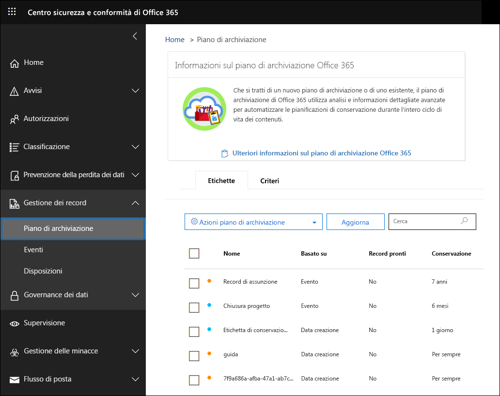
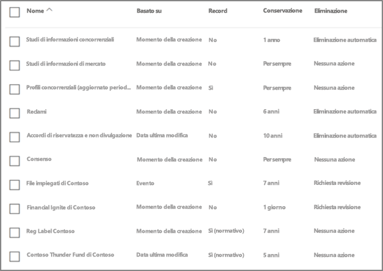
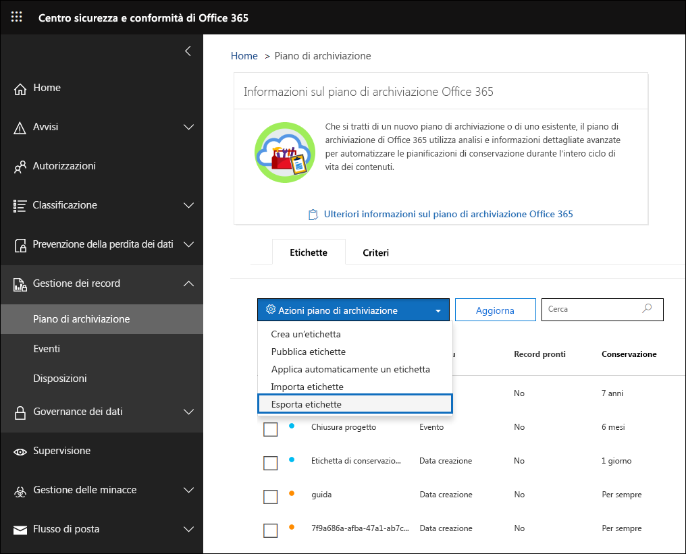
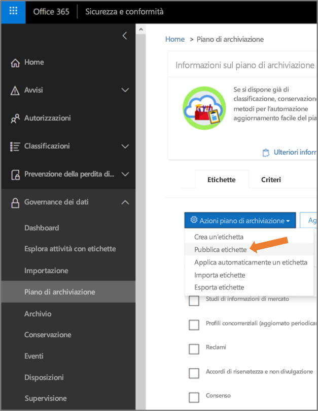

# Panoramica della gestione del piano file

>*[Indicazioni per l'assegnazione di licenze di Microsoft 365 per sicurezza e conformità](https://aka.ms/ComplianceSD).*

La gestione del piano file fornisce funzionalità avanzate per la gestione di criteri di etichette di conservazione ed etichette di conservazione e consente di attraversare in modo integrato le attività con etichette ed etichetta-a-contenuto per l’intero ciclo di vita del contenuto, dalla creazione alla collaborazione, passando per la dichiarazione del record e la conservazione, all’eliminazione finale. 

Per accedere a Gestione del piano di archiviazione nel Centro sicurezza e conformità, passare a **Gestione record** > **Piano di archiviazione**.

## Accesso alla gestione del piano file

Per accedere alla gestione del piano di archiviazione, è necessario avere uno dei seguenti ruoli di amministratore:
    
    - Responsabile della conservazione
    
    - Responsabile della conservazione solo visualizzazione

## Etichette di conservazione e criteri di etichetta predefiniti

Se non sono presenti etichette conservazione nel Centro Sicurezza e Conformità, la prima volta in cui scegli **Piano file** nel riquadro di spostamento a sinistra, verrà creato un criterio di etichetta denominato **Criterio di pubblicazione di governance dei dati predefinito**. 

Questo criterio di etichetta contiene tre etichette di conservazione:

- **Procedura operativa**
- **Business general**
- **Accordo contrattuale**

Queste etichette di conservazione vengono configurate solo per conservare il contenuto, non per eliminare il contenuto. Questo criterio di etichetta verrà pubblicato per l'intera organizzazione e può essere disattivato o rimosso. 

È possibile stabilire chi ha aperto la gestione del piano file e avviato la first-run experience esaminando il log di controllo per le attività **Criteri di conservazione creati** e **Configurazione di conservazione creata per un criterio di conservazione**.

> [!NOTE]
> A causa di feedback di alcuni clienti, è stata rimossa la funzionalità che consente di creare le etichette di conservazione predefinite e i criteri di etichetta di conservazione indicati in precedenza. Le etichette di conservazione e i criteri per le etichette di conservazione sono visibili solo se è stato aperta la gestione del piano file prima dell'11 aprile 2019.

## Esplorare il piano file

La gestione del piano file semplifica la visualizzazione unica delle impostazioni di tutti i criteri e le etichette di conservazione.

Si noti che le etichette di conservazione create all'esterno del piano file saranno disponibili nel piano file e viceversa.

Nella scheda **Etichette** del piano di archiviazione sono disponibili le funzionalità e le informazioni aggiuntive seguenti:

### Colonne impostazioni etichetta

- **In base a** identifica il tipo di trigger che avvierà il periodo di conservazione. I valori validi sono:
    - Evento
    - Momento della creazione
    - Data ultima modifica
    - Data etichettatura
- **Record** indica se l'elemento diventa un record dichiarato dopo l'applicazione dell'etichetta. I valori validi sono:
    - No
    - Sì
    - Sì (normativo)
- **Conservazione** identifica il tipo di conservazione. I valori validi sono:
    - Conservare
    - Conservare ed eliminare
    - Eliminare
- **Disposizione** identifica cosa succederà al contenuto alla fine del periodo di conservazione. I valori validi sono:
    - null
    - Nessuna azione
    - Eliminazione automatica
    - Revisione obbligatoria (ovvero revisione della disposizione)

### Colonne dei descrittori del piano di archiviazione delle etichette di conservazione

È ora possibile includere altre informazioni nella configurazione delle etichette di conservazione. L'inserimento di descrittori del piano di archiviazione nelle etichette di conservazione consente di ottimizzare la gestione e l'organizzazione del piano di archiviazione.

Per iniziare, Gestione del piano di archiviazione fornisce alcuni valori predefiniti per Funzione/reparto, Categoria, Tipo di autorità e Clausola/citazione. È possibile aggiungere nuovi valori al descrittore del piano di archiviazione quando si crea o si modifica un'etichetta di conservazione. È anche possibile specificare descrittori del piano di archiviazione durante l'importazione di etichette di conservazione nel piano. 

Ecco una visualizzazione del passaggio dei descrittori del piano file quando si crea o modifica un'etichetta di conservazione.

Ecco una visualizzazione delle colonne dei descrittori del piano di archiviazione nella scheda **Etichette** di Gestione del piano di archiviazione.

## Esportare tutte le etichette di conservazione esistenti per analizzare e/o eseguire le revisioni offline

Dalla gestione del piano file, è possibile esportare i dettagli di tutte le etichette di conservazione in un file CSV per agevolare le analisi di conformità periodiche con le parti interessate responsabili della governance dei dati all'interno dell'organizzazione.

Per esportare tutte le etichette di conservazione, nella pagina **Piano di archiviazione** selezionare **Azioni piano file** \> **Esporta etichette**.

Verrà aperto un file CSV che contiene tutte le etichette di conservazione esistenti.

## Importare le etichette di conservazione nel piano di archiviazione

In Gestione del piano di archiviazione è possibile importare in blocco nuove etichette di conservazione nonché modificare le etichette di conservazione esistenti.

Per importare nuove etichette di conservazione e modificare le etichette di conservazione esistenti: 

1. Nella pagina **Piano di archiviazione** passare a **Azioni piano file** > **Importa etichette**.

   

   

2. Scaricare un modello vuoto per importare le nuove etichette di conservazione. In alternativa, è possibile iniziare con il file CSV esportato durante l'esportazione delle etichette di conservazione esistenti nell'organizzazione.

   

3. Compilare il modello. Di seguito sono descritte le proprietà e i valori validi per ogni proprietà nel modello del piano di archiviazione. Per l'importazione, ogni valore può contenere 64 caratteri al massimo.  

   |**Proprietà**|**Tipo**|**Valori validi**|
   |:-----|:-----|:-----|
   |LabelName|Stringa|Questa proprietà specifica il nome dell'etichetta di conservazione.|
   |Comment|Stringa|Usare questa proprietà per aggiungere una descrizione relativa all'etichetta di conservazione per gli amministratori. Questa descrizione viene visualizzata solo agli amministratori che gestiscono l'etichetta nel Centro sicurezza e conformità.|
   |Notes|Stringa|Usare questa proprietà per aggiungere una descrizione relativa all'etichetta di conservazione per gli utenti. Questa descrizione viene visualizzata quando gli utenti passano con il mouse sull'etichetta in app quali Outlook, SharePoint e OneDrive. Se si lascia vuota questa proprietà, viene visualizzata una descrizione predefinita, che illustra le impostazioni di conservazione dell'etichetta. |
   |IsRecordLabel|Stringa|Questa proprietà specifica se l'etichetta è un'etichetta record. Gli elementi contrassegnati con un'etichetta record sono dichiarati come record. I valori validi sono: **TRUE**: l'etichetta è un'etichetta record. Tenere presente che gli elementi dichiarati come record non possono essere eliminati.  **FALSE**: l'etichetta non è un'etichetta record. Questo è il valore predefinito.|
   |RetentionAction|Stringa|Questa proprietà specifica l'azione da intraprendere dopo la scadenza del valore specificato dalla proprietà RetentionDuration. I valori validi sono: **Delete**: gli elementi più vecchi del valore specificato dalla proprietà RetentionDuration vengono eliminati. **Keep**: gli elementi vengono mantenuti per la durata specificata dalla proprietà RetentionDuration e non viene eseguita alcuna azione alla scadenza del periodo definito per la durata.  **KeepAndDelete**: gli elementi vengono mantenuti per la durata specificata dalla proprietà RetentionDuration e quindi vengono eliminati alla scadenza del periodo definito per la durata.   |
   |RetentionDuration|Stringa|La proprietà specifica per quanti giorni mantenere il contenuto. I valori validi sono: **Unlimited**: gli elementi verranno mantenuti a tempo indeterminato.  ***n***: un numero intero positivo, ad esempio **365**. 
   |RetentionType|Stringa|Questa proprietà specifica se la durata del periodo di conservazione è stata calcolata a partire dalla data di creazione del contenuto, dalla data dell'evento, dalla data di etichettatura (aggiunta del contrassegno) o dalla data dell'ultima modifica. I valori validi sono: **CreationAgeInDays** **EventAgeInDays** **TaggedAgeInDays** **ModificationAgeInDays** |
   |ReviewerEmail|SmtpAddress|Quando questa proprietà è popolata, verrà attivata una revisione delle clausole alla scadenza della durata della conservazione. Questa proprietà consente di specificare l'indirizzo di posta elettronica del revisore per le azioni di conservazione **Delete** e **KeepAndDelete**. È possibile includere l'indirizzo di posta elettronica di singoli utenti, gruppi di distribuzione o di sicurezza. È possibile indicare più indirizzi di posta elettronica separati da punto e virgola.|
   |ReferenceId|Stringa|Questa proprietà specifica il valore visualizzato nel descrittore **ID riferimento** del piano di archiviazione.| 
   |DepartmentName|Stringa|Questa proprietà specifica il valore visualizzato nel descrittore **Funzione/reparto** del piano di archiviazione.|
   |Category|Stringa|Questa proprietà specifica il valore visualizzato nel descrittore **Categoria** del piano di archiviazione.|
   |SubCategory|Stringa|Questa proprietà specifica il valore visualizzato nel descrittore **Sottocategoria** del piano di archiviazione.|
   |AuthorityType|Stringa|Questa proprietà specifica il valore visualizzato nel descrittore **Tipo di autorità** del piano di archiviazione.|
   |CitationName|Stringa|Questa proprietà specifica il nome della citazione visualizzata nel descrittore **Clausola/citazione** del piano di archiviazione, ad esempio "Sarbanes-Oxley Act del 2002". |
   |CitationUrl|Stringa|Questa proprietà specifica l'URL visualizzato nel descrittore **Clausola/citazione** del piano di archiviazione.|
   |CitationJurisdiction|Stringa|Questa proprietà specifica la giurisdizione o l'agenzia visualizzata nel descrittore **Clausola/citazione** del piano di archiviazione, ad esempio "U.S. Securities and Exchange Commission (SEC)".|
   |Regulatory|Stringa|Lasciare vuota. Questa proprietà non viene usata al momento.|
   |EventType|Stringa|Questa proprietà specifica la regola di conservazione associata all'etichetta. È possibile utilizzare qualsiasi valore che identifichi la regola in modo univoco. Ad esempio: **Nome** **Nome distinto (DN)** **GUID**  È possibile usare il cmdlet [Get-RetentionComplianceRule](https://docs.microsoft.com/powershell/module/exchange/policy-and-compliance-retention/get-retentioncompliancerule?view=exchange-ps) per visualizzare le regole di conservazione disponibili. Tenere presente che se si esportano etichette da un'organizzazione, non è possibile usare i valori per la proprietà EventType di tale organizzazione durante l'importazione delle etichette in un'altra organizzazione. Questa limitazione è dovuta al fatto che i valori di EventType sono specifici di un'organizzazione. |
   |||

   Ecco un esempio di modello che contiene informazioni sulle etichette di conservazione.

   

4. Al passaggio 3 della pagina della procedura guidata di importazione del piano di archiviazione fare clic su **Cerca file** per caricare il modello compilato. 

   Gestione del piano di archiviazione convaliderà le voci e visualizzerà le statistiche di importazione.

   

   Se è presente un errore di convalida, la funzionalità di importazione del piano di archiviazione continuerà a convalidare ogni voce nel file di importazione e visualizzerà tutti gli errori che fanno riferimento a numeri di riga nel file di importazione, quindi copierà i risultati degli errori visualizzati in modo che sia possibile facilmente tornare al file di importazione e correggere gli errori.

5. Al termine dell'importazione, tornare a Gestione del piano di archiviazione per associare le nuove etichette di conservazione ai criteri nuovi o esistenti delle etichette di conservazione.

   
