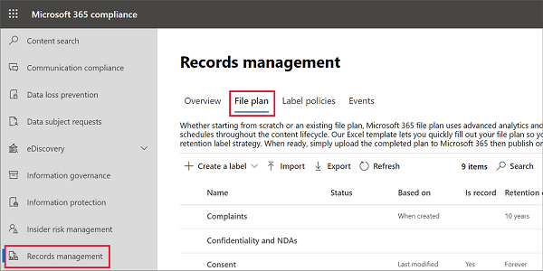
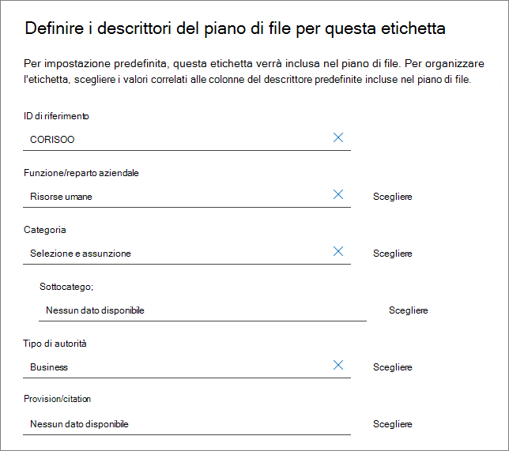
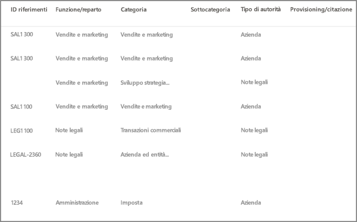
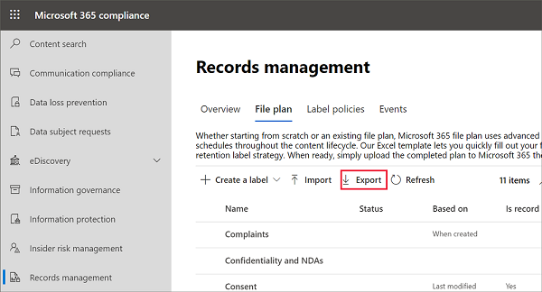
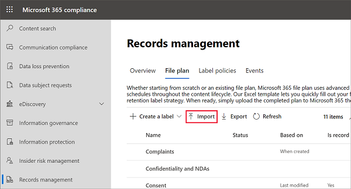
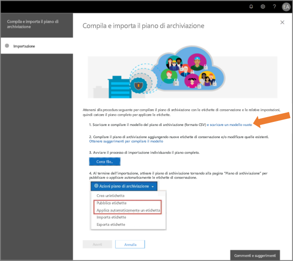
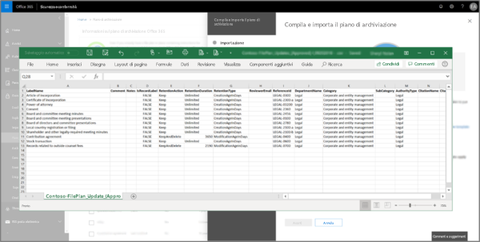

# Usare il piano di archiviazione per gestire le etichette di conservazioneUse file plan to manage retention labels

>*[Indicazioni per l'assegnazione di licenze di Microsoft 365 per sicurezza e conformità](/office365/servicedescriptions/microsoft-365-service-descriptions/microsoft-365-tenantlevel-services-licensing-guidance/microsoft-365-security-compliance-licensing-guidance).**[Microsoft 365 licensing guidance for security & compliance](/office365/servicedescriptions/microsoft-365-service-descriptions/microsoft-365-tenantlevel-services-licensing-guidance/microsoft-365-security-compliance-licensing-guidance).*

Anche se è possibile creare e gestire le etichette di conservazione dalla **Governance delle informazioni** nel Centro conformità Microsoft 365, il piano di archiviazione di **Gestione dei record** offre funzionalità di gestione aggiuntive:Although you can create and manage retention labels from **Information governance** in the Microsoft 365 compliance center, file plan from **Records management** has additional management capabilities:

- È possibile creare etichette di conservazione in blocco importando le informazioni rilevanti da un foglio di calcolo.You can bulk-create retention labels by importing the relevant information from a spreadsheet.

- È possibile esportare le informazioni dalle etichette di conservazione esistenti per l'analisi e la collaborazione offline.You can export the information from existing retention labels for analysis and offline collaboration.

- Sono disponibili ulteriori informazioni sulle etichette di conservazione per semplificarne l'uso nelle varie impostazioni da una sola visualizzazione.More information about the retention labels is displayed to make it easier to see into and across the settings of all your retention labels from one view.

- I descrittori del piano di archiviazione supportano informazioni aggiuntive e facoltative per ogni etichetta.File plan descriptors support additional and optional information for each label.

Il piano di archiviazione può essere usato per tutte le etichette di conservazione, anche per quelle che non contrassegnano il contenuto come record.File plan can be used for all retention labels, even if they don't mark content as a record.

Per informazioni sulle etichette di conservazione e sul loro utilizzo, vedere [Informazioni sui criteri di conservazione e sulle etichette di conservazione](retention.md).For information about what retention labels are and how to use them, see [Learn about retention policies and retention labels](retention.md).

## Accesso al piano di archiviazioneAccessing file plan

Per accedere al piano di archiviazione, è necessario disporre di uno dei ruoli di amministratore seguenti:To access file plan, you must have one of the following admin roles:
    
- Responsabile della conservazioneRetention Manager

- Responsabile della conservazione solo visualizzazioneView-only Retention Manager

Nel Centro conformità Microsoft 365 passare a **Soluzioni** > **Gestione record** > **Piano di archiviazione**.In the Microsoft 365 compliance center, go to **Solutions** > **Records management** > **File plan**. 

Se **Gestione record** non viene visualizzato nel pannello di navigazione, per prima cosa, scorrere verso il basso e selezionare **Mostra tutto**.If **Records management** doesn't display in the navigation pane, first scroll down, and select **Show all**.

## Esplorare il piano di archiviazioneNavigating your file plan

Se sono già state create etichette di conservazione da **Governance delle informazioni** nel Centro conformità Microsoft 365, queste etichette vengono visualizzate automaticamente nel piano di archiviazione.If you've already created retention labels from **Information governance** in the Microsoft 365 compliance center, these labels automatically display in your file plan. 

Analogamente, se a questo punto si creano etichette di conservazione nel piano di archiviazione, queste saranno disponibili anche in **Governance delle informazioni** se non sono configurate per contrassegnare il contenuto come record.Similarly, if you now create retention labels in file plan, they are also available from **Information governance** if the labels aren't configured to mark content as a record.

Nella pagina **Piano di archiviazione** sono visualizzate tutte le etichette con lo stato e le impostazioni, i descrittori facoltativi del piano di archiviazione, un'opzione di esportazione per analizzare o abilitare le revisioni offline delle etichette e un'opzione di importazione per creare etichette di conservazione.On the **File plan** page, you see all your labels with their status and settings, optional file plan descriptors, an export option to analyze or enable offline reviews of your labels, and an import option to create retention labels. 

### Colonne impostazioni etichettaLabel settings columns

Tutte le colonne tranne l'etichetta **Nome** possono essere visualizzate o nascoste selezionando l'opzione **Personalizza colonne**.All columns except the label **Name** can be displayed or hidden by selecting the **Customize columns** option. Per impostazione predefinita, tuttavia, le prime colonne mostrano le informazioni sullo stato dell'etichetta e le relative impostazioni:But by default, the first few columns display information about the label status and its settings: 

- **Stato** identifica se l'etichetta è inclusa in un criterio di etichetta o in un criterio di applicazione automatica (**Attivo**) o meno (**Inattivo**).**Status** identifies whether the label is included in a label policy or auto-apply policy (**Active**) or not (**Inactive**).

- **Basato su** identifica come o quando viene avviato il periodo di conservazione.**Based on** identifies how or when the retention period begins. Valori validi:Valid values:
    - EventoEvent
    - Momento della creazioneWhen created
    - Data ultima modificaLast modified
    - Data etichettaturaWhen labeled

- **È un record** identifica se l'elemento viene contrassegnato come record quando è applicata l'etichetta.**Is record** identifies if the item is marked as a record when the label is applied. Valori validi:Valid values:
    - NoNo
    - SìYes
    - Sì (normativo)Yes(Regulatory)

- **Durata di conservazione** identifica il periodo di conservazione.**Retention duration** identifies the retention period. Valori validi:Valid values:
    - GiorniDays
    - MesiMonths
    - AnniYears
    - Per sempreForever
    - NessunoNone

- **Tipo di eliminazione** identifica cosa succederà al contenuto alla fine del periodo di conservazione.**Disposition type** identifies what happens to the content at the end of the retention period. Valori validi:Valid values:
    - Nessuna azioneNo action
    - Eliminazione automaticaAuto-delete
    - Richiesta revisioneReview required

### Colonne dei descrittori del piano di archiviazioneFile plan descriptors columns

Il piano di archiviazione consente di includere più informazioni nell'ambito delle etichette di conservazione.File plan lets you include more information as part of your retention labels. I descrittori del piano di archiviazione offrono altre opzioni per migliorare la gestibilità e l'organizzazione del contenuto che è necessario etichettare.These file plan descriptors provide more options to improve the manageability and organization of the content you need to label.

Per impostazione predefinita, a partire da **ID riferimento**, le colonne successive mostrano i descrittori facoltativi del piano di archiviazione che è possibile specificare quando si crea un'etichetta di conservazione o si modifica un'etichetta esistente.By default, starting with **Reference ID**, the next few columns display these optional file plan descriptors that you can specify when you create a retention label, or edit an existing label. 

Per iniziare, esistono alcuni valori preesistenti per i seguenti descrittori del piano di archiviazione:To get you started, there are some out-of-box values for the following file plan descriptors: 
- Funzione/reparto aziendaleBusiness function/department
- CategoriaCategory
- Tipo di autoritàAuthority type
- Provisioning/citazioneProvision/citation 

Esempio di descrittori del piano di archiviazione quando si crea o si modifica un'etichetta di conservazione:Example of file plan descriptors when you create or edit a retention label:

Esempio di come vengono visualizzate le colonne dei descrittori del piano di archiviazione:Example view of the file plan descriptors columns:

## Esportare tutte le etichette di conservazione per analizzare o abilitare le revisioni offlineExport all retention labels to analyze or enable offline reviews

Dal piano di archiviazione, è possibile esportare i dettagli di tutte le etichette di conservazione in un file CSV per agevolare le analisi di conformità periodiche con le parti interessate responsabili della governance dei dati all'interno dell'organizzazione.From your file plan, you can export the details of all retention labels into a .csv file to help you facilitate periodic compliance reviews with data governance stakeholders in your organization.

Per esportare tutte le etichette di conservazione, nella pagina **Piano di archiviazione** fare clic su **Esporta**:To export all retention labels: On the **File plan** page, click **Export**:

Viene visualizzato un file CSV che contiene tutte le etichette di conservazione esistenti. Ad esempio:A \*.csv file that contains all existing retention labels opens. For example:

## Importare le etichette di conservazione nel piano di archiviazioneImport retention labels into your file plan

Nel piano di archiviazione, è possibile importare in blocco nuove etichette di conservazione usando un file CSV con un formato specifico.In file plan, you can bulk-import new retention labels by using a .csv file with a specific format. Dopo aver importato le etichette, è possibile apportare modifiche nel file CSV e importarlo di nuovo per semplificare la modifica in blocco delle etichette di conservazione esistenti.After the labels are imported, you can make edits in the .csv file and import the file again for easier bulk-editing of existing retention labels.

Per importare nuove etichette di conservazione e modificare le etichette di conservazione esistenti:To import new retention labels and modify existing retention labels: 

1. Nella pagina **Piano di archiviazione**, fare clic su **Importa** per usare la pagina **Compila e importa il piano di archiviazione**:On the **File plan** page, click **Import** to use the **Fill out and import your file plan** page:

   

   

2. Scaricare un modello vuoto come indicato:Download a blank template as instructed:

   

3. Compilare il modello in base alle informazioni seguenti che descrivono le proprietà e i valori validi per ogni proprietà. Per l'importazione, alcuni valori hanno una lunghezza massima:Fill out the template, using the following information that describes the properties and valid values for each property. For import, some values have a maximum length:
    
    - **LabelName**: lunghezza massima di 64 caratteri**LabelName**: Maximum length of 64 characters
    - **Comment** e **Notes**: lunghezza massima di 1.024 caratteri**Comment** and **Notes**: Maximum length of 1024 characters
    - Tutti gli altri valori: lunghezza illimitataAll other values: Unlimited length
     
    
   |ProprietàProperty|TipoType|ObbligatorioRequired|Valori validiValid values|
   |:-----|:-----|:-----|:-----|
   |LabelNameLabelName|StringaString|SìYes|Questa proprietà specifica il nome dell'etichetta di conservazione e deve essere univoca nel tenant.This property specifies the name of the retention label and must be unique in your tenant.|
   |CommentComment|StringaString|NoNo|Usare questa proprietà per aggiungere una descrizione relativa all'etichetta di conservazione per gli amministratori.Use this property to add a description about the retention label for admins. Questa descrizione viene visualizzata solo dagli amministratori che gestiscono l'etichetta di conservazione nel centro conformità.This description appears only to admins who manage the retention label in the compliance center.|
   |NotesNotes|StringaString|NoNo|Usare questa proprietà per aggiungere una descrizione relativa all'etichetta di conservazione per gli utenti.Use this property to add a description about the retention label for users. Questa descrizione viene visualizzata quando gli utenti passano con il mouse sull'etichetta in app quali Outlook, SharePoint e OneDrive.This description appears when users hover over the label in apps like Outlook, SharePoint, and OneDrive. Se si lascia vuota questa proprietà, viene visualizzata una descrizione predefinita, che illustra le impostazioni di conservazione dell'etichetta.If you leave this property blank, a default description is displayed, which explains the label's retention settings. |
   |IsRecordLabelIsRecordLabel|StringaString|No, solo se **Regulatory** è **TRUE**No, unless **Regulatory** is **TRUE**|Questa proprietà specifica se l'etichetta contrassegna il contenuto come record. I valori validi sono:This property specifies whether the label marks the content as a record. Valid values are:  **TRUE**: l'etichetta contrassegna l'elemento come record e, di conseguenza, l'elemento non può essere eliminato.**TRUE**: The label marks the item as a record and as a result, the item can't be deleted.  **FALSE**: l'etichetta non contrassegna il contenuto come record.**FALSE**: The label doesn't mark the content as a record. Questo è il valore predefinito.This is the default value.     Dipendenze del gruppo: quando questa proprietà viene specificata, è necessario specificare anche RetentionAction, RetentionDuration e RetentionType.Group dependencies: When this property is specified, RetentionAction, RetentionDuration, and RetentionType must also be specified.|
   |RetentionActionRetentionAction|StringaString|No, solo se vengono specificati **RetentionDuration**, **RetentionType** o **ReviewerEmail**No, unless **RetentionDuration**, **RetentionType**, or **ReviewerEmail** are specified|Questa proprietà specifica l'azione da intraprendere dopo la scadenza del valore specificato dalla proprietà RetentionDuration (se specificato). I valori validi sono:This property specifies what action to take after the value specified by the RetentionDuration property (if specified) expires. Valid values are:  **Delete**: gli elementi più vecchi del valore specificato dalla proprietà RetentionDuration vengono eliminati.**Delete**: Items older than the value specified by the RetentionDuration property are deleted. **Keep**: gli elementi vengono mantenuti per la durata specificata dalla proprietà RetentionDuration e non viene eseguita alcuna azione alla scadenza del periodo definito per la durata.**Keep**: Retain items for the duration specified by the RetentionDuration property and then do nothing when the duration period expires.  **KeepAndDelete**: gli elementi vengono mantenuti per la durata specificata dalla proprietà RetentionDuration e quindi vengono eliminati alla scadenza del periodo definito per la durata.**KeepAndDelete**: Retain items for the duration specified by the RetentionDuration property and then delete them when the duration period expires.     Dipendenze del gruppo: quando questa proprietà viene specificata, è necessario specificare anche RetentionDuration e RetentionType.Group dependencies: When this property is specified, RetentionDuration and RetentionType must also be specified. |
   |RetentionDurationRetentionDuration|StringaString|No, solo se vengono specificati **RetentionAction** o **RetentionType**No, unless **RetentionAction** or **RetentionType** are specified|Questa proprietà specifica per quanti giorni mantenere il contenuto. I valori validi sono:This property specifies the number of days to retain the content. Valid values are:  **Unlimited**: gli elementi verranno mantenuti a tempo indeterminato.**Unlimited**: Items will be retained indefinitely.  \**_n_*: un numero intero positivo, ad esempio **365**.\**_n_*: A positive integer in days; for example, **365**. Il numero massimo supportato è 24.855, ovvero 68 anni.The maximum number supported is 24,855, which is 68 years. Se è necessario un numero maggiore del valore massimo supportato, usare Unlimited al suo posto.If you need longer than this maximum, use Unlimited instead.    Dipendenze del gruppo: quando questa proprietà viene specificata, è necessario specificare anche RetentionAction e RetentionType.Group dependencies: When this property is specified, RetentionAction and RetentionType must also be specified.
   |RetentionTypeRetentionType|StringaString|No, solo se vengono specificati **RetentionAction** o **RetentionDuration**No, unless **RetentionAction** or **RetentionDuration** are specified|Questa proprietà specifica se la durata del periodo di conservazione (se specificata) è stata calcolata a partire dalla data di creazione del contenuto, dalla data dell'evento, dalla data di etichettatura o dalla data dell'ultima modifica. I valori validi sono:This property specifies whether the retention duration (if specified) is calculated from the content creation date, event date, when labeled date, or last modified date. Valid values are:  **CreationAgeInDays****CreationAgeInDays** **EventAgeInDays****EventAgeInDays** **TaggedAgeInDays****TaggedAgeInDays** **ModificationAgeInDays****ModificationAgeInDays**     Dipendenze del gruppo: quando questa proprietà viene specificata, è necessario specificare anche RetentionAction e RetentionDuration.Group dependencies: When this property is specified, RetentionAction and RetentionDuraction must also be specified.|
   |ReviewerEmailReviewerEmail|SmtpAddressSmtpAddress|NoNo|Quando questa proprietà è specificata, verrà attivata una revisione per l’eliminazione alla scadenza della durata della conservazione.When this property is specified, a disposition review will be triggered when the retention duration expires. Questa proprietà consente di specificare l'indirizzo di posta elettronica del revisore per l'azione di conservazione **KeepAndDelete**.This property specifies the email address of a reviewer for the **KeepAndDelete** retention action.     È possibile includere l'indirizzo di posta elettronica di singoli utenti, gruppi di distribuzione o gruppi di sicurezza nel tenant.You can include the email address of individual users, distribution groups, or security groups in your tenant. È possibile indicare più indirizzi di posta elettronica separandoli da punto e virgola.Specify multiple email addresses by separating them with semicolons.     Dipendenze del gruppo: quando questa proprietà viene specificata, è necessario specificare **RetentionAction** (deve essere **KeepAndDelete**), **RetentionDuration**, e **RetentionType**.Group dependencies: When this property is specified, **RetentionAction** (must be **KeepAndDelete**), **RetentionDuration**, and **RetentionType** must also be specified.|
   |ReferenceIdReferenceId|StringaString|NoNo|Questa proprietà specifica il valore visualizzato nel descrittore **ID riferimento** del piano di archiviazione, che è possibile utilizzare come valore univoco per l'organizzazione.This property specifies the value that's displayed in the **Reference Id** file plan descriptor, which you can use as a unique value to your organization.| 
   |DepartmentNameDepartmentName|StringaString|NoNo|Questa proprietà specifica il valore visualizzato nel descrittore **Funzione/reparto** del piano di archiviazione.This property specifies the value that's displayed in the **Function/department** file plan descriptor.|
   |CategoryCategory|StringaString|NoNo|Questa proprietà specifica il valore visualizzato nel descrittore **Categoria** del piano di archiviazione.This property specifies the value that's displayed in the **Category** file plan descriptor.|
   |SubCategorySubCategory|StringaString|NoNo|Questa proprietà specifica il valore visualizzato nel descrittore **Sottocategoria** del piano di archiviazione.This property specifies the value that's displayed in the **Sub category** file plan descriptor.|
   |AuthorityTypeAuthorityType|StringaString|NoNo|Questa proprietà specifica il valore visualizzato nel descrittore **Tipo di autorità** del piano di archiviazione.This property specifies the value that's displayed in the **Authority type** file plan descriptor.|
   |CitationNameCitationName|StringaString|NoNo|Questa proprietà specifica il nome della citazione visualizzata nel descrittore **Clausola/citazione** del piano di archiviazione.This property specifies the name of the citation displayed in the **Provision/citation** file plan descriptor. Ad esempio, "Sarbanes-Oxley Act del 2002".For example, "Sarbanes-Oxley Act of 2002". |
   |CitationUrlCitationUrl|StringaString|NoNo|Questa proprietà specifica l'URL visualizzato nel descrittore **Clausola/citazione** del piano di archiviazione.This property specifies the URL that's displayed in the **Provision/citation** file plan descriptor.|
   |CitationJurisdictionCitationJurisdiction|StringaString|NoNo|Questa proprietà specifica la giurisdizione o l'agenzia visualizzata nel descrittore **Clausola/citazione** del piano di archiviazione, ad esempio "U.S. Securities and Exchange Commission (SEC)".This property specifies the jurisdiction or agency that's displayed in the **Provision/citation** file plan descriptor. For example, "U.S. Securities and Exchange Commission (SEC)".|
   |RegulatoryRegulatory|StringaString|NoNo|Questa proprietà specifica se l'etichetta contrassegna il contenuto come record normativo, [più restrittivo](records-management.md#compare-restrictions-for-what-actions-are-allowed-or-blocked) di un record.This property specifies whether the label marks the content as a regulatory record, which is [more restrictive](records-management.md#compare-restrictions-for-what-actions-are-allowed-or-blocked) than a record. Per usare questa configurazione dell’etichetta, è necessario configurare il tenant in modo da [visualizzare l’opzione per contrassegnare il contenuto come record normativo](declare-records.md#how-to-display-the-option-to-mark-content-as-a-regulatory-record) oppure la convalida dell’importazione non andrà a buon fine.To use this label configuration, your tenant must be configured to [display the option to mark content as a regulatory record](declare-records.md#how-to-display-the-option-to-mark-content-as-a-regulatory-record), or the import validation will fail. I valori validi sono:Valid values are:  **TRUE**: l'etichetta contrassegna l'elemento come record normativo.**TRUE**: The label marks the item as a regulatory record. È inoltre necessario impostare la proprietà **IsRecordLabel** su TRUE.You must also set the **IsRecordLabel** property to TRUE. **FALSE**: l'etichetta non contrassegna il contenuto come record normativo.**FALSE**: The label doesn't mark the content as a regulatory record. Questo è il valore predefinito.This is the default value.|
   |EventTypeEventType|StringaString|No, solo se **RetentionType** è **EventAgeInDays**No, unless **RetentionType** is **EventAgeInDays**|Questa proprietà specifica un tipo di evento utilizzato per [conservazione basata su eventi](event-driven-retention.md).This property specifies an event type used for [event-based retention](event-driven-retention.md). Specificare un tipo di evento esistente visualizzato in **Gestione record** > **Eventi** > **Gestisci tipi di evento**.Specify an existing event type that's displayed in **Records management** > **Events** > **Manage event types**. In alternativa, usare il cmdlet [Get-ComplianceRetentionEventType](/powershell/module/exchange/get-complianceretentioneventtype) per visualizzare i tipi di evento disponibili.Alternatively, use the [Get-ComplianceRetentionEventType](/powershell/module/exchange/get-complianceretentioneventtype) cmdlet to view the available event types. Anche se esistono alcuni tipi di evento predefiniti, ad esempio **Attività dipendente** e **Durata del prodotto**, è anche possibile creare tipi di evento personalizzati.Although there are some built-in event types, such as **Employee activity** and **Product lifetime**, you can also create your own event types.     Se si specifica un tipo di evento personalizzato, deve esistere prima dell'importazione perché il nome viene convalidato come parte del processo di importazione.If you specify your own event type, it must exist before the import because the name is validated as part of the import process.|
   |||

   Ecco un esempio di modello che contiene informazioni sulle etichette di conservazione.Here's an example of the template containing the information about retention labels.

   

4. Al passaggio 3 della pagina **Compila e importa il piano di archiviazione**, fare clic su **Cerca file** per caricare il modello compilato e poi selezionare **Avanti**.Under step 3 on the **Fill out and import your file plan** page, click **Browse for files** to upload the filled-out template, and then select **Next**.

   Il piano di archiviazione carica il file e convalida le voci, visualizzando le statistiche di importazione.File plan uploads the file and validates the entries, displaying the import statistics.

   

5. A seconda dei risultati della convalida:Depending on the validation results:
    
    - Se la convalida non va a buon fine: prendere nota del numero della riga e del nome della colonna da correggere nel file di importazione.If validation fails: Note the row number and column name to correct in the import file. Selezionare **Chiudi**, e successivamente **Sì** per confermare.Select **Close**, and then **Yes** to confirm. Correggere gli errori nel file e salvarlo, selezionare di nuovo l'opzione **Importa** e tornare al passaggio 4.Correct the errors in the file and save it, select the **Import** option again, and return to step 4.
    
    - Se la convalida va a buon fine: è possibile selezionare **Go Live** per rendere disponibili le etichette di conservazione nel tenant.If validation passes: You can select **Go Live** to make the retention labels available in your tenant. In alternativa, selezionare l'icona Chiudi per la pagina e **Sì** per confermare di voler chiudere la procedura guidata senza rendere attualmente disponibili le etichette di conservazione nel tenant.Or, select the Close icon for the page, and **Yes** to confirm you want to close the wizard without making the retention labels available in your tenant at this time.

Una volta che le etichette importate sono state aggiunte al tenant, è possibile aggiungerle a un nuovo criterio di etichetta di conservazione oppure applicarle automaticamente.When the imported labels are added to your tenant, you can now add them to a new retention label policy, or auto-apply them. È possibile eseguire questa operazione direttamente nella pagina **Piano di archiviazione**, selezionando l'elenco a discesa da **+ Crea un'etichetta**, quindi **Criteri per la pubblicazione di etichette** o **Criteri per l'applicazione automatica di un'etichetta**.You can do this right from the **File plan** page by selecting the dropdown from **+ Create a label** and then **Policy to publish labels**, or **Policy to auto-apply a label**.

## Passaggi successiviNext steps

Per ulteriori informazioni sulla creazione e la modifica di etichette di conservazione e sui relativi criteri, vedere le seguenti linee guida:For more information about creating and editing retention labels and their policies, see the following guidance:
- [Creare etichette di conservazione e applicarle nelle appCreate retention labels and apply them in apps](create-apply-retention-labels.md)
- [Applicare automaticamente un'etichetta di conservazione al contenutoApply a retention label to content automatically](apply-retention-labels-automatically.md)