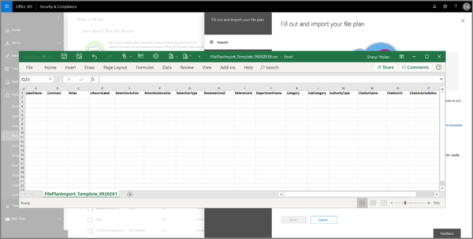

# Usare il piano di archiviazione per gestire le etichette di conservazione

>*[Indicazioni per l'assegnazione di licenze di Microsoft 365 per sicurezza e conformità](/office365/servicedescriptions/microsoft-365-service-descriptions/microsoft-365-tenantlevel-services-licensing-guidance/microsoft-365-security-compliance-licensing-guidance).*

Anche se è possibile creare e gestire le etichette di conservazione dalla **Governance delle informazioni** nel Centro conformità Microsoft 365, il piano di archiviazione di **Gestione dei record** offre funzionalità di gestione aggiuntive:

- È possibile creare etichette di conservazione in blocco importando le informazioni rilevanti da un foglio di calcolo.

- È possibile esportare le informazioni dalle etichette di conservazione esistenti per l'analisi e la collaborazione offline.

- Sono disponibili ulteriori informazioni sulle etichette di conservazione per semplificarne l'uso nelle varie impostazioni da una sola visualizzazione.

- I descrittori del piano di archiviazione supportano informazioni aggiuntive e facoltative per ogni etichetta.

Il piano di archiviazione può essere usato per tutte le etichette di conservazione, anche per quelle che non contrassegnano il contenuto come record.

Per informazioni sulle etichette di conservazione e sul loro utilizzo, vedere [Informazioni sui criteri di conservazione e sulle etichette di conservazione](retention.md).

## Accesso al piano di archiviazione

Per accedere al piano di archiviazione, è necessario disporre di uno dei ruoli di amministratore seguenti:
    
- Responsabile della conservazione

- Responsabile della conservazione solo visualizzazione

Nel Centro conformità Microsoft 365 passare a **Soluzioni** > **Gestione record** > **Piano di archiviazione**. 

Se **Gestione record** non viene visualizzato nel pannello di navigazione, per prima cosa, scorrere verso il basso e selezionare **Mostra tutto**.

## Esplorare il piano di archiviazione

Se sono già state create etichette di conservazione da **Governance delle informazioni** nel Centro conformità Microsoft 365, queste etichette vengono visualizzate automaticamente nel piano di archiviazione. 

Analogamente, se a questo punto si creano etichette di conservazione nel piano di archiviazione, queste saranno disponibili anche in **Governance delle informazioni** se non sono configurate per contrassegnare il contenuto come record.

Nella pagina **Piano di archiviazione** sono visualizzate tutte le etichette con lo stato e le impostazioni, i descrittori facoltativi del piano di archiviazione, un'opzione di esportazione per analizzare o abilitare le revisioni offline delle etichette e un'opzione di importazione per creare etichette di conservazione. 

### Colonne impostazioni etichetta

Tutte le colonne tranne l'etichetta **Nome** possono essere visualizzate o nascoste selezionando l'opzione **Personalizza colonne**. Per impostazione predefinita, tuttavia, le prime colonne mostrano le informazioni sullo stato dell'etichetta e le relative impostazioni: 

- **Stato** identifica se l'etichetta è inclusa in un criterio di etichetta o in un criterio di applicazione automatica (**Attivo**) o meno (**Inattivo**).

- **Basato su** identifica come o quando viene avviato il periodo di conservazione. Valori validi:
    - Evento
    - Momento della creazione
    - Data ultima modifica
    - Data etichettatura

- **È un record** identifica se l'elemento viene contrassegnato come record quando è applicata l'etichetta. Valori validi:
    - No
    - Sì
    - Sì (normativo)

- **Durata di conservazione** identifica il periodo di conservazione. Valori validi:
    - Giorni
    - Mesi
    - Anni
    - Per sempre
    - Nessuno

- **Tipo di eliminazione** identifica cosa succederà al contenuto alla fine del periodo di conservazione. Valori validi:
    - Nessuna azione
    - Eliminazione automatica
    - Richiesta revisione

### Colonne dei descrittori del piano di archiviazione

Il piano di archiviazione consente di includere più informazioni nell'ambito delle etichette di conservazione. I descrittori del piano di archiviazione offrono altre opzioni per migliorare la gestibilità e l'organizzazione del contenuto che è necessario etichettare.

Per impostazione predefinita, a partire da **ID riferimento**, le colonne successive mostrano i descrittori facoltativi del piano di archiviazione che è possibile specificare quando si crea un'etichetta di conservazione o si modifica un'etichetta esistente. 

Per iniziare, esistono alcuni valori preesistenti per i seguenti descrittori del piano di archiviazione: 
- Funzione/reparto aziendale
- Categoria
- Tipo di autorità
- Provisioning/citazione 

Esempio di descrittori del piano di archiviazione quando si crea o si modifica un'etichetta di conservazione:

Quando si seleziona **Scegliere** per ognuno di questi descrittori facoltativi, è possibile selezionare uno dei valori predefiniti oppure crearne uno personalizzato e quindi selezionarlo. Ad esempio: 

## Esportare tutte le etichette di conservazione per analizzare o abilitare le revisioni offline

Dal piano di archiviazione, è possibile esportare i dettagli di tutte le etichette di conservazione in un file CSV per agevolare le analisi di conformità periodiche con le parti interessate responsabili della governance dei dati all'interno dell'organizzazione.

Per esportare tutte le etichette di conservazione, nella pagina **Piano di archiviazione** fare clic su **Esporta**:

Viene visualizzato un file CSV che contiene tutte le etichette di conservazione esistenti. Ad esempio:

## Importare le etichette di conservazione nel piano di archiviazione

Nel piano di archiviazione, è possibile importare in blocco nuove etichette di conservazione usando un file CSV con un formato specifico: 

1. Nella pagina **Piano di archiviazione**, fare clic su **Importa** per usare la pagina **Compila e importa il piano di archiviazione**:

   

   

2. Scaricare un modello vuoto come indicato:

   

3. Compilare il modello in base alle informazioni seguenti che descrivono le proprietà e i valori validi per ogni proprietà. Per l'importazione, alcuni valori hanno una lunghezza massima:
    
    - **LabelName**: lunghezza massima di 64 caratteri
    - **Comment** e **Notes**: lunghezza massima di 1.024 caratteri
    - Tutti gli altri valori: lunghezza illimitata
     
    
   |Proprietà|Tipo|Obbligatorio|Valori validi|
   |:-----|:-----|:-----|:-----|
   |LabelName|Stringa|Sì|Questa proprietà specifica il nome dell'etichetta di conservazione e deve essere univoca nel tenant.|
   |Comment|Stringa|No|Usare questa proprietà per aggiungere una descrizione relativa all'etichetta di conservazione per gli amministratori. Questa descrizione viene visualizzata solo dagli amministratori che gestiscono l'etichetta di conservazione nel centro conformità.|
   |Notes|Stringa|No|Usare questa proprietà per aggiungere una descrizione relativa all'etichetta di conservazione per gli utenti. Questa descrizione viene visualizzata quando gli utenti passano con il mouse sull'etichetta in app quali Outlook, SharePoint e OneDrive. Se si lascia vuota questa proprietà, viene visualizzata una descrizione predefinita, che illustra le impostazioni di conservazione dell'etichetta. |
   |IsRecordLabel|Stringa|No, solo se **Regulatory** è **TRUE**|Questa proprietà specifica se l'etichetta contrassegna il contenuto come record. I valori validi sono: **TRUE**: l'etichetta contrassegna l'elemento come record e, di conseguenza, l'elemento non può essere eliminato.  **FALSE**: l'etichetta non contrassegna il contenuto come record. Questo è il valore predefinito.     Dipendenze del gruppo: quando questa proprietà viene specificata, è necessario specificare anche RetentionAction, RetentionDuration e RetentionType.|
   |RetentionAction|Stringa|No, solo se vengono specificati **RetentionDuration**, **RetentionType** o **ReviewerEmail**|Questa proprietà specifica l'azione da intraprendere dopo la scadenza del valore specificato dalla proprietà RetentionDuration (se specificato). I valori validi sono: **Delete**: gli elementi più vecchi del valore specificato dalla proprietà RetentionDuration vengono eliminati. **Keep**: gli elementi vengono mantenuti per la durata specificata dalla proprietà RetentionDuration e non viene eseguita alcuna azione alla scadenza del periodo definito per la durata.  **KeepAndDelete**: gli elementi vengono mantenuti per la durata specificata dalla proprietà RetentionDuration e quindi vengono eliminati alla scadenza del periodo definito per la durata.     Dipendenze del gruppo: quando questa proprietà viene specificata, è necessario specificare anche RetentionDuration e RetentionType. |
   |RetentionDuration|Stringa|No, solo se vengono specificati **RetentionAction** o **RetentionType**|Questa proprietà specifica per quanti giorni mantenere il contenuto. I valori validi sono: **Unlimited**: gli elementi verranno mantenuti a tempo indeterminato.  **_n_*: un numero intero positivo, ad esempio **365**. Il numero massimo supportato è 24.855, ovvero 68 anni. Se è necessario un numero maggiore del valore massimo supportato, usare Unlimited al suo posto.    Dipendenze del gruppo: quando questa proprietà viene specificata, è necessario specificare anche RetentionAction e RetentionType.
   |RetentionType|Stringa|No, solo se vengono specificati **RetentionAction** o **RetentionDuration**|Questa proprietà specifica se la durata del periodo di conservazione (se specificata) è stata calcolata a partire dalla data di creazione del contenuto, dalla data dell'evento, dalla data di etichettatura o dalla data dell'ultima modifica. I valori validi sono: **CreationAgeInDays** **EventAgeInDays** **TaggedAgeInDays** **ModificationAgeInDays**     Dipendenze del gruppo: quando questa proprietà viene specificata, è necessario specificare anche RetentionAction e RetentionDuration.|
   |ReviewerEmail|SmtpAddress|No|Quando questa proprietà è specificata, verrà attivata una revisione per l’eliminazione alla scadenza della durata della conservazione. Questa proprietà consente di specificare l'indirizzo di posta elettronica del revisore per l'azione di conservazione **KeepAndDelete**.     È possibile includere l'indirizzo di posta elettronica di singoli utenti, gruppi di distribuzione o gruppi di sicurezza nel tenant. È possibile indicare più indirizzi di posta elettronica separandoli da punto e virgola.     Dipendenze del gruppo: quando questa proprietà viene specificata, è necessario specificare **RetentionAction** (deve essere **KeepAndDelete**), **RetentionDuration**, e **RetentionType**.|
   |ReferenceId|Stringa|No|Questa proprietà specifica il valore visualizzato nel descrittore **ID riferimento** del piano di archiviazione, che è possibile utilizzare come valore univoco per l'organizzazione.| 
   |DepartmentName|Stringa|No|Questa proprietà specifica il valore visualizzato nel descrittore **Funzione/reparto** del piano di archiviazione.|
   |Category|Stringa|No|Questa proprietà specifica il valore visualizzato nel descrittore **Categoria** del piano di archiviazione.|
   |SubCategory|Stringa|No|Questa proprietà specifica il valore visualizzato nel descrittore **Sottocategoria** del piano di archiviazione.|
   |AuthorityType|Stringa|No|Questa proprietà specifica il valore visualizzato nel descrittore **Tipo di autorità** del piano di archiviazione.|
   |CitationName|Stringa|No|Questa proprietà specifica il nome della citazione visualizzata nel descrittore **Clausola/citazione** del piano di archiviazione. Ad esempio, "Sarbanes-Oxley Act del 2002". |
   |CitationUrl|Stringa|No|Questa proprietà specifica l'URL visualizzato nel descrittore **Clausola/citazione** del piano di archiviazione.|
   |CitationJurisdiction|Stringa|No|Questa proprietà specifica la giurisdizione o l'agenzia visualizzata nel descrittore **Clausola/citazione** del piano di archiviazione, ad esempio "U.S. Securities and Exchange Commission (SEC)".|
   |Regulatory|Stringa|No|Questa proprietà specifica se l'etichetta contrassegna il contenuto come record normativo, [più restrittivo](records-management.md#compare-restrictions-for-what-actions-are-allowed-or-blocked) di un record. Per usare questa configurazione dell’etichetta, è necessario configurare il tenant in modo da [visualizzare l’opzione per contrassegnare il contenuto come record normativo](declare-records.md#how-to-display-the-option-to-mark-content-as-a-regulatory-record) oppure la convalida dell’importazione non andrà a buon fine. I valori validi sono:  **TRUE**: l'etichetta contrassegna l'elemento come record normativo. È inoltre necessario impostare la proprietà **IsRecordLabel** su TRUE. **FALSE**: l'etichetta non contrassegna il contenuto come record normativo. Questo è il valore predefinito.|
   |EventType|Stringa|No, solo se **RetentionType** è **EventAgeInDays**|Questa proprietà specifica un tipo di evento utilizzato per [conservazione basata su eventi](event-driven-retention.md). Specificare un tipo di evento esistente visualizzato in **Gestione record** > **Eventi** > **Gestisci tipi di evento**. In alternativa, usare il cmdlet [Get-ComplianceRetentionEventType](/powershell/module/exchange/get-complianceretentioneventtype) per visualizzare i tipi di evento disponibili. Anche se esistono alcuni tipi di evento predefiniti, ad esempio **Attività dipendente** e **Durata del prodotto**, è anche possibile creare tipi di evento personalizzati.     Se si specifica un tipo di evento personalizzato, deve esistere prima dell'importazione perché il nome viene convalidato come parte del processo di importazione.|
   |||

   Ecco un esempio di modello che contiene informazioni sulle etichette di conservazione.

   

4. Al passaggio 3 della pagina **Compila e importa il piano di archiviazione**, fare clic su **Cerca file** per caricare il modello compilato e poi selezionare **Avanti**.

   Il piano di archiviazione carica il file e convalida le voci, visualizzando le statistiche di importazione.

   

5. A seconda dei risultati della convalida:
    
    - Se la convalida non va a buon fine: prendere nota del numero della riga e del nome della colonna da correggere nel file di importazione. Selezionare **Chiudi**, e successivamente **Sì** per confermare. Correggere gli errori nel file e salvarlo, selezionare di nuovo l'opzione **Importa** e tornare al passaggio 4.
    
    - Se la convalida va a buon fine: è possibile selezionare **Go Live** per rendere disponibili le etichette di conservazione nel tenant. In alternativa, selezionare l'icona Chiudi per la pagina e **Sì** per confermare di voler chiudere la procedura guidata senza rendere attualmente disponibili le etichette di conservazione nel tenant.

Quando le etichette importate vengono aggiunte al tenant, è ora possibile renderle disponibili agli utenti pubblicandole o applicarle automaticamente. È possibile eseguire entrambe le operazioni dalla scheda **Criteri etichetta** e quindi selezionare **Pubblica etichette** oppure **Applica automaticamente un'etichetta**.

## Passaggi successivi

Per ulteriori informazioni sulla creazione e la modifica di etichette di conservazione e sui relativi criteri, vedere le seguenti linee guida:
- [Creare etichette di conservazione e applicarle nelle app](create-apply-retention-labels.md)
- [Applicare automaticamente un'etichetta di conservazione al contenuto](apply-retention-labels-automatically.md)