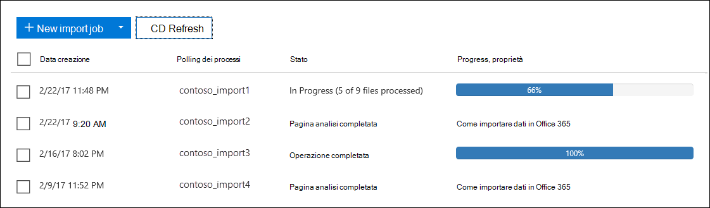
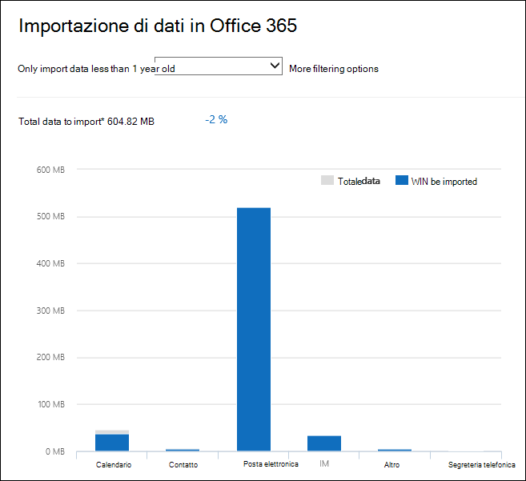

# Filtrare i dati durante l'importazione dei file PSTFilter data when importing PST files

Utilizzare la nuova funzionalità importazione intelligente nel servizio di importazione Microsoft 365 per filtrare gli elementi nei file PST che vengono effettivamente importati nelle cassette postali di destinazione.Use the new Intelligent Import feature in the Microsoft 365 Import service to filter the items in PST files that actually get imported to the target mailboxes. Tenere presente quanto segue:Here's how it works:
  
- Dopo aver creato e inviato un processo di importazione PST, i file PST vengono caricati in un'area di archiviazione di Azure nel cloud Microsoft.After you create and submit a PST import job, PST files are uploaded to an Azure storage area in the Microsoft cloud.
  
- Microsoft 365 analizza i dati nei file PST, in modo sicuro e sicuro, identificando il periodo di validità degli elementi della cassetta postale e i diversi tipi di messaggi inclusi nei file PST.Microsoft 365 analyzes the data in the PST files, in a safe and secure manner, by identifying the age of the mailbox items and the different message types included in the PST files.
  
- Una volta completata l'analisi e i dati sono pronti per l'importazione, è possibile importare tutti i dati nei file PST così com'è o tagliare i dati importati impostando filtri che controllano quali dati vengono importati.When the analysis is complete and the data is ready to import, you have the option to import all data in the PST files as is or trim the data that's imported by setting filters that control what data gets imported. Ad esempio, puoi scegliere di:For example, you can choose to:
  
  - Importa solo gli elementi di una determinata età.Import only items of a certain age.
  
  - Importare i tipi di messaggio selezionati.Import selected message types.
  
  - Escludere i messaggi inviati o ricevuti da persone specifiche.Exclude messages sent or received by specific people.
  
- Dopo aver configurato le impostazioni di filtro, Microsoft 365 solo i dati che soddisfano i criteri di filtro nelle cassette postali di destinazione specificate nel processo di importazione.After you configure the filter settings, Microsoft 365 imports only the data that meets the filtering criteria to the target mailboxes specified in the import job.
  
Nella figura seguente viene illustrato il processo di importazione intelligente e vengono evidenziate le attività eseguite e le attività eseguite da Office 365.The following graphic shows the Intelligent Import process, and highlights the tasks you perform and the tasks performed by Office 365.
  

  
## Creare un processo di importazione PSTCreate a PST import job

- I passaggi descritti in questo argomento presuppongono che sia stato creato un processo di importazione PST nel servizio di importazione Office 365 tramite il caricamento di rete o la spedizione delle unità.The steps in this topic assume that you've created a PST import job in the Office 365 Import service by using network upload or drive shipping. Per istruzioni dettagliate, vedere uno degli argomenti seguenti:For step-by-step instructions, see one of the following topics:
    
  - [Usare il caricamento tramite rete per importare file PST in Office 365Use network upload to import PST files to Office 365](use-network-upload-to-import-pst-files.md)
    
  - [Usare la spedizione unità per importare file PST in Office 365Use drive shipping to import PST files to Office 365](use-drive-shipping-to-import-pst-files-to-office-365.md)
    
- Dopo aver creato un processo di importazione utilizzando il caricamento di rete, lo stato del processo di importazione nella pagina Importa nel Centro sicurezza e conformità di & è impostato su Analisi **in** corso, il che significa che Microsoft 365 sta analizzando i dati nei file PST caricati.After you create an import job by using network upload, the status for the import job on the Import page in the Security & Compliance Center is set to **Analysis in progress**, which means that Microsoft 365 is analyzing the data in the PST files that you uploaded. Fare **clic su** Aggiorna aggiornamento per aggiornare lo stato del processo di  importazione.Click **Refresh** to update the status for the import job. 
    
- Per i processi di importazione della spedizione delle unità, i dati verranno analizzati da Microsoft 365 dopo che il personale del datacenter Microsoft riceve il disco rigido e carica i file PST nell'area di archiviazione di Azure per l'organizzazione.For drive shipping import jobs, the data will be analyzed by Microsoft 365 after Microsoft datacenter personnel receive your hard drive and upload the PST files to the Azure storage area for your organization.
  
## Filtrare i dati importati nelle cassette postaliFilter data that gets imported to mailboxes

Dopo aver creato un processo di importazione PST, eseguire la procedura seguente per filtrare i dati prima di importarlo in Office 365.After you've created a PST import job, follow these steps to filter the data before you import it to Office 365.
  
1. Passare a <https://compliance.microsoft.com> e accedere con le credenziali di un account amministratore dell'organizzazione.Go to <https://compliance.microsoft.com> and sign in using the credentials for an administrator account in your organization.
    
2. Nel riquadro sinistro del Centro conformità Microsoft 365 fare clic su **Governance delle informazioni** \> **Importa**.In the left pane of the Microsoft 365 compliance center, click **Information governance** \> **Import**.
    
    I processi di importazione per l'organizzazione sono elencati nella **scheda** Importa. Il **valore Analisi** completata nella colonna **Stato** indica i processi di importazione analizzati da Microsoft 365 e pronti per l'importazione.The import jobs for your organization are listed on the **Import** tab. The **Analysis completed** value in the **Status** column indicates the import jobs that have been analyzed by Microsoft 365 and are ready for you to import.
    
    
  
3. Selezionare il processo di importazione che si desidera completare e fare clic **su Importa in Office 365**.Select the import job that you want to complete and click **Import to Office 365**.
  
    Viene visualizzata una pagina a comparsa con informazioni sui file PST e sul processo di importazione.A fly out page is displayed with information about the PST files and other information about the import job.

4. Fare **clic su Importa Office 365**.Click **Import to Office 365**.
    
    Viene visualizzata la pagina **Filtrare i dati**.The **Filter your data** page is displayed. Contiene informazioni dettagliate sui dati nei file PST per il processo di importazione, incluse informazioni sull'età dei dati.It contains data insights about the data in the PST files for the import job, including information about the age of the data. 
    
    
  
5. A seconda che si desideri o meno tagliare i dati importati in Microsoft 365, in Vuoi filtrare i **dati?** eseguire una delle operazioni seguenti:Based on whether or not you want to trim the data that's imported to Microsoft 365, under **Do you want to filter your data?**, do one of the following:
  
    a.a. Fare **clic su Sì, si desidera filtrarlo prima dell'importazione** per tagliare i dati importati e quindi fare clic su **Avanti.**Click **Yes, I want to filter it before importing** to trim the data that you import, and then click **Next**.
  
    La **pagina Importa dati in Office 365** viene visualizzata con informazioni dettagliate sull'analisi eseguita Microsoft 365 dati.The **Import data to Office 365 page** page is displayed with detailed data insights from the analysis that Microsoft 365 performed. 
  
    
  
    Il grafico in questa pagina mostra la quantità di dati che verranno importati.The graph on this page shows the amount of data that will be imported. Le informazioni su ogni tipo di messaggio trovato nei file PST vengono visualizzate nel grafico.Information about each message type found in the PST files is displayed in the graph. È possibile posizionare il cursore su ogni barra per visualizzare informazioni specifiche su tale tipo di messaggio.You can hover the cursor over each bar to display specific information about that message type. Esiste anche un elenco a discesa con valori di età diversi in base all'analisi dei file PST.There is also a drop-down list with different age values based on the analysis of the PST files. Quando si seleziona un'età nell'elenco a discesa, il grafico viene aggiornato per mostrare la quantità di dati che verranno importati per l'età selezionata.When you select an age in the drop-down list, the graph is updated to show how much data will be imported for the selected age. 
  
    b.b. Per configurare filtri aggiuntivi per ridurre la quantità di dati importati, fare clic su **Altre opzioni di filtro.**To configure addition filters to reduce the amount of data that's imported, click **More filtering options**.
  
    
  
    È possibile configurare questi filtri:You can configure these filters:
  
      - **Età:** selezionare un'età in modo che verranno importati solo gli elementi più nuovi rispetto a quelli specificati.**Age** - Select an age so only items that are newer than the specified age will be imported. Vedi la [sezione Altre informazioni](#more-information) per una descrizione su come Microsoft 365 i bucket di validità per il filtro **Età.**See the [More information](#more-information) section for a description about how Microsoft 365 determines the age buckets for the **Age** filter. 
  
      - **Tipo:** in questa sezione vengono visualizzati tutti i tipi di messaggio trovati nei file PST per il processo di importazione.**Type** - This section shows all the message types that were found in the PST files for the import job. È possibile deselezionare una casella accanto a un tipo di messaggio che si desidera escludere.You can uncheck a box next to a message type that you want to exclude. Non è possibile escludere il tipo di messaggio Altro.You can't exclude the Other message type. Per un [elenco degli](#more-information) elementi della cassetta postale inclusi nella categoria Altro, vedere la sezione Ulteriori informazioni.See the [More information](#more-information) section for a list of mailbox items that are included in the Other category.
  
      - **Utenti:** è possibile escludere i messaggi inviati o ricevuti da utenti specifici.**Users** - You can exclude messages that are sent or received by specific people. Per escludere gli utenti visualizzati nel campo Da: , A: o Cc: dei messaggi, fare clic su Escludi utenti **accanto** al tipo di destinatario.To exclude people who appear in the From: field, To: field, or the Cc: field of messages, click **Exclude users** next to that recipient type. Digitare l'indirizzo di posta elettronica (indirizzo SMTP) della persona, fare clic su Aggiungi nuovo icona per aggiungerli all'elenco degli utenti esclusi per quel tipo di destinatario e quindi fare clic su Salva per salvare l'elenco degli   esclusi. Type the email address (SMTP address) of the person, click **Add** to add them to the list of excluded users for that recipient type, and then click **Save** to save the list of excluded users. 
  
        > [!NOTE]
        > Microsoft 365 non vengono mostrate informazioni dettagliate sui dati risultate dall'impostazione del **filtro** Persone.Microsoft 365 doesn't show data insights that result from setting the **People** filter. Tuttavia, se si imposta questo filtro in modo da escludere i messaggi inviati o ricevuti da utenti specifici, tali messaggi verranno esclusi durante il processo di importazione effettivo.However, if you set this filter to exclude messages sent or received by specific people, those messages will be excluded during the actual import process. 
  
    c.c. Fare **clic su** Applica nella pagina a comparsa Altre **opzioni** di filtro per salvare le impostazioni del filtro.Click **Apply** in the **More filtering options** fly out page to save your filter settings. 
  
    Le informazioni dettagliate sui dati nella pagina Importa dati in Office 365 vengono aggiornate **in** base alle impostazioni del filtro, inclusa la quantità totale di dati che verranno importati in base alle impostazioni del filtro.The data insights on the **Import data to Office 365** page are updated based on your filter settings, including the total amount of data that will be imported based on the filter settings. Viene inoltre visualizzato un riepilogo delle impostazioni del filtro.A summary of the filter settings is also shown. È possibile fare **clic su** Modifica accanto a un filtro per modificare l'impostazione, se necessario.You can click **Edit** next to a filter to change the setting if necessary. 
  
    
  
    d.d. Fare clic su **Avanti**.Click **Next**.
  
    Viene visualizzata una pagina di stato che mostra le impostazioni del filtro.A status page is displayed showing your filter settings. Anche in questo caso, è possibile modificare qualsiasi impostazione di filtro.Again, you can edit any of the filter settings.
  
    e.e. Fare **clic su Importa dati** per avviare l'importazione.Click **Import data** to start the import. Viene visualizzata la quantità totale di dati che verranno importati.The total amount of data that will be imported is displayed. 
  
    OppureOr
  
    a.a. Fare **clic su No, importare tutto** per importare tutti i dati nei file PST Office 365 e quindi fare clic su **Avanti.**Click **No, I want to import everything** to import all data in the PST files to Office 365, and then click **Next**.
  
    b.b. Nella pagina **Importa dati in Office 365** fare clic su Importa **dati** per avviare l'importazione.On the **Import data to Office 365** page, click **Import data** to start the import. Viene visualizzata la quantità totale di dati che verranno importati.The total amount of data that will be imported is displayed. 
  
6. Nella scheda **Importa** fare clic su **Aggiorna**  aggiornamento.On the **Import** tab, click **Refresh** . Lo stato del processo di importazione viene visualizzato nella **colonna** Stato.The status for the import job is displayed in the **Status** column.
  
7. Fare clic sul processo di importazione per visualizzare informazioni più dettagliate, ad esempio lo stato di ogni file PST e le impostazioni di filtro configurate.Click the import the job to display more detailed information, such as the status for each PST file and the filter settings that you configured.

## Ulteriori informazioniMore information

- In che modo Microsoft 365 gli incrementi per il filtro dell'età?How does Microsoft 365 determine the increments for the age filter? Quando Microsoft 365 analizza un file PST, esamina il timestamp inviato o ricevuto di ogni elemento (se un elemento ha sia un timestamp inviato che quello ricevuto, viene selezionata la data meno recente).When Microsoft 365 analyzes a PST file, it looks at the sent or received time stamp of each item (if an item has both a sent and received timestamp, the oldest date is selected). Quindi Microsoft 365 il valore dell'anno per tale timestamp e lo confronta con la data corrente per determinare l'età dell'elemento.Then Microsoft 365 looks at the year value for that timestamp and compares it to the current date to determine the age of the item. Queste ere vengono quindi utilizzate come valori nell'elenco a discesa per il **filtro** Età.These ages are then used as the values in the drop-down list for the **Age** filter. Ad esempio, se un file PST contiene messaggi dal 2016, 2015 e  2014, i valori nel filtro Età saranno **1 anno,** **2 anni** e **3 anni.**For example, if a PST file has messages from 2016, 2015, and 2014, then values in the **Age** filter would be **1 year**, **2 years**, and **3 years**.
  
- Nella tabella seguente sono elencati i tipi di  messaggio inclusi  nella categoria Altro del filtro Tipo nella pagina a comparsa Altre opzioni (vedere il passaggio 5b della procedura precedente). The following table lists the message types that are included in the **Other** category in the **Type** filter on the **More options** fly out page (see Step 5b in the previous procedure). Attualmente, non è possibile escludere gli elementi nella categoria "Altro" quando si importano file PST in Office 365.Currently, you can't exclude items in the "Other" category when you import PSTs to Office 365. 
  
    |**ID classe messaggio****Message class ID**|**Elementi delle cassette postali che utilizzano questa classe messaggio****Mailbox items that use this message class**|
    |:-----|:-----|
    |IPM. AttivitàIPM.Activity    |Voci del diarioJournal entries    |
    |IPM.DocumentIPM.Document    |Documenti e file (non allegati a un messaggio di posta elettronica)Documents and files (not attached to an email message)    |
    |IPM. FileIPM.File    |(come IPM.Document)(same as IPM.Document)    |
    |IPM. Note.IMC.NotificationIPM.Note.IMC.Notification    |Report inviati da Internet Mail Connessione, che è il Exchange Server gateway a InternetReports sent by Internet Mail Connect, which is the Exchange Server gateway to the Internet    |
    |IPM. Note.Microsoft.FaxIPM.Note.Microsoft.Fax    |Messaggi faxFax messages    |
    |IPM. Note.Rules.Oof.Template.MicrosoftIPM.Note.Rules.Oof.Template.Microsoft    |Messaggi fuori sedeOut-of-office autoreply messages    |
    |IPM. Note.Rules.ReplyTemplate.MicrosoftIPM.Note.Rules.ReplyTemplate.Microsoft    |Risposte inviate da una regola di Posta in arrivoReplies sent by an inbox rule    |
    |IPM. OLE. ClasseIPM.OLE.Class    |Eccezioni per una serie ricorrenteExceptions for a recurring series    |
    |IPM. Recall.ReportIPM.Recall.Report    |Rapporti Richiamo messaggioMessage recall reports    |
    |IPM. RemotoIPM.Remote    |Messaggi di posta remotaRemote mail messages    |
    |IPM. ReportIPM.Report    |Relazioni sullo stato degli elementiItem status reports    |
