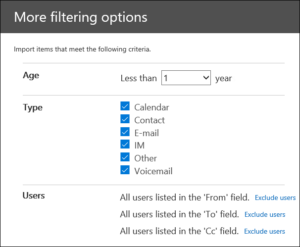

# Filtrare i dati durante l'importazione dei file PST

Utilizzare la nuova funzionalità di importazione intelligente nel servizio di importazione Office 365 per filtrare gli elementi nei file PST che vengono effettivamente importati nelle cassette postali di destinazione. Tenere presente quanto segue:
  
- Dopo aver creato e inviato un processo di importazione PST, i file PST vengono caricati in un'area di archiviazione di Azure nel cloud Microsoft.
  
- Microsoft 365 analizza i dati nei file PST, in modo sicuro e sicuro, identificando il periodo di validità degli elementi della cassetta postale e i diversi tipi di messaggi inclusi nei file PST.
  
- Una volta completata l'analisi e i dati sono pronti per l'importazione, è possibile importare tutti i dati nei file PST così com'è o tagliare i dati importati impostando filtri che controllano quali dati vengono importati. Ad esempio, puoi scegliere di:
  
  - Importa solo gli elementi di una determinata età.
  
  - Importare i tipi di messaggio selezionati.
  
  - Escludere i messaggi inviati o ricevuti da persone specifiche.
  
- Dopo aver configurato le impostazioni di filtro, Microsoft 365 solo i dati che soddisfano i criteri di filtro nelle cassette postali di destinazione specificate nel processo di importazione.
  
Nella figura seguente viene illustrato il processo di importazione intelligente e vengono evidenziate le attività eseguite e le attività eseguite da Office 365.
  

  
## Creare un processo di importazione PST

- I passaggi descritti in questo argomento presuppongono che sia stato creato un processo di importazione PST nel servizio di importazione Office 365 tramite il caricamento di rete o la spedizione delle unità. Per istruzioni dettagliate, vedere uno degli argomenti seguenti:
    
  - [Usare il caricamento tramite rete per importare file PST in Office 365](use-network-upload-to-import-pst-files.md)
    
  - [Usare la spedizione unità per importare file PST in Office 365](use-drive-shipping-to-import-pst-files-to-office-365.md)
    
- Dopo aver creato un processo di importazione utilizzando il caricamento di rete, lo stato del processo di importazione nella pagina Importa nel Centro sicurezza e conformità di & è impostato su Analisi **in** corso, il che significa che Microsoft 365 sta analizzando i dati nei file PST caricati. Fare **clic su** Aggiorna aggiornamento per aggiornare lo stato del processo di  importazione. 
    
- Per i processi di importazione della spedizione delle unità, i dati verranno analizzati da Microsoft 365 dopo che il personale del datacenter Microsoft riceve il disco rigido e carica i file PST nell'area di archiviazione di Azure per l'organizzazione.
  
## Filtrare i dati importati nelle cassette postali

Dopo aver creato un processo di importazione PST, eseguire la procedura seguente per filtrare i dati prima di importarlo in Office 365.
  
1. Passare a <https://compliance.microsoft.com> e accedere con le credenziali di un account amministratore dell'organizzazione.
    
2. Nel riquadro sinistro del Centro Microsoft 365 conformità fare clic su **Importa governance** \> **delle informazioni**.
    
    I processi di importazione per l'organizzazione sono elencati nella **scheda** Importa. Il **valore Analisi** completata nella colonna **Stato** indica i processi di importazione analizzati da Microsoft 365 e pronti per l'importazione.
    
    
  
3. Selezionare il processo di importazione che si desidera completare e fare clic **su Importa in Office 365**.
  
    Viene visualizzata una pagina a comparsa con informazioni sui file PST e sul processo di importazione.

4. Fare **clic su Importa Office 365**.
    
    Viene visualizzata la pagina **Filtrare i dati**. Contiene informazioni dettagliate sui dati nei file PST per il processo di importazione, incluse informazioni sull'età dei dati. 
    
    
  
5. A seconda che si desideri o meno tagliare i dati importati in Microsoft 365, in Vuoi filtrare i **dati?** eseguire una delle operazioni seguenti:
  
    a. Fare **clic su Sì, si desidera filtrarlo prima dell'importazione** per tagliare i dati importati e quindi fare clic su **Avanti.**
  
    La **pagina Importa dati in Office 365** viene visualizzata con informazioni dettagliate sull'analisi eseguita Microsoft 365 dati. 
  
    
  
    Il grafico in questa pagina mostra la quantità di dati che verranno importati. Le informazioni su ogni tipo di messaggio trovato nei file PST vengono visualizzate nel grafico. È possibile posizionare il cursore su ogni barra per visualizzare informazioni specifiche su tale tipo di messaggio. Esiste anche un elenco a discesa con valori di età diversi in base all'analisi dei file PST. Quando si seleziona un'età nell'elenco a discesa, il grafico viene aggiornato per mostrare la quantità di dati che verranno importati per l'età selezionata. 
  
    b. Per configurare filtri aggiuntivi per ridurre la quantità di dati importati, fare clic su **Altre opzioni di filtro.**
  
    
  
    È possibile configurare questi filtri:
  
      - **Età:** selezionare un'età in modo che verranno importati solo gli elementi più nuovi rispetto a quelli specificati. Vedi la [sezione Altre informazioni](#more-information) per una descrizione su come Microsoft 365 i bucket di validità per il filtro **Età.** 
  
      - **Tipo:** in questa sezione vengono visualizzati tutti i tipi di messaggio trovati nei file PST per il processo di importazione. È possibile deselezionare una casella accanto a un tipo di messaggio che si desidera escludere. Non è possibile escludere il tipo di messaggio Altro. Per un [elenco degli](#more-information) elementi della cassetta postale inclusi nella categoria Altro, vedere la sezione Ulteriori informazioni.
  
      - **Utenti:** è possibile escludere i messaggi inviati o ricevuti da utenti specifici. Per escludere gli utenti visualizzati nel campo Da: , A: o Cc: dei messaggi, fare clic su Escludi utenti **accanto** al tipo di destinatario. Digitare l'indirizzo di posta elettronica (indirizzo SMTP) della persona, fare clic su Aggiungi nuovo icona per aggiungerli all'elenco degli utenti esclusi per quel tipo di destinatario e quindi fare clic su Salva per salvare l'elenco degli   esclusi.  
  
        > [!NOTE]
        > Microsoft 365 non vengono mostrate informazioni dettagliate sui dati risultate dall'impostazione del **filtro** Persone. Tuttavia, se si imposta questo filtro in modo da escludere i messaggi inviati o ricevuti da utenti specifici, tali messaggi verranno esclusi durante il processo di importazione effettivo. 
  
    c. Fare **clic su** Applica nella pagina a comparsa Altre **opzioni** di filtro per salvare le impostazioni del filtro. 
  
    Le informazioni dettagliate sui dati nella pagina Importa dati in Office 365 vengono aggiornate **in** base alle impostazioni del filtro, inclusa la quantità totale di dati che verranno importati in base alle impostazioni del filtro. Viene inoltre visualizzato un riepilogo delle impostazioni del filtro. È possibile fare **clic su** Modifica accanto a un filtro per modificare l'impostazione, se necessario. 
  
    
  
    d. Fare clic su **Avanti**.
  
    Viene visualizzata una pagina di stato che mostra le impostazioni del filtro. Anche in questo caso, è possibile modificare qualsiasi impostazione di filtro.
  
    e. Fare **clic su Importa dati** per avviare l'importazione. Viene visualizzata la quantità totale di dati che verranno importati. 
  
    Oppure
  
    a. Fare **clic su No, importare tutto** per importare tutti i dati nei file PST Office 365 e quindi fare clic su **Avanti.**
  
    b. Nella pagina **Importa dati in Office 365** fare clic su Importa **dati** per avviare l'importazione. Viene visualizzata la quantità totale di dati che verranno importati. 
  
6. Nella scheda **Importa** fare clic su **Aggiorna**  aggiornamento. Lo stato del processo di importazione viene visualizzato nella **colonna** Stato.
  
7. Fare clic sul processo di importazione per visualizzare informazioni più dettagliate, ad esempio lo stato di ogni file PST e le impostazioni di filtro configurate.

## Ulteriori informazioni

- In che modo Microsoft 365 gli incrementi per il filtro dell'età? Quando Microsoft 365 analizza un file PST, esamina il timestamp inviato o ricevuto di ogni elemento (se un elemento ha sia un timestamp inviato che quello ricevuto, viene selezionata la data meno recente). Quindi Microsoft 365 il valore dell'anno per tale timestamp e lo confronta con la data corrente per determinare l'età dell'elemento. Queste ere vengono quindi utilizzate come valori nell'elenco a discesa per il **filtro** Età. Ad esempio, se un file PST contiene messaggi dal 2016, 2015 e  2014, i valori nel filtro Età saranno **1 anno,** **2 anni** e **3 anni.**
  
- Nella tabella seguente sono elencati i tipi di  messaggio inclusi  nella categoria Altro del filtro Tipo nella pagina a comparsa Altre opzioni (vedere il passaggio 5b della procedura precedente).  Attualmente, non è possibile escludere gli elementi nella categoria "Altro" quando si importano file PST in Office 365. 
  
    |**ID classe messaggio**|**Elementi delle cassette postali che utilizzano questa classe messaggio**|
    |:-----|:-----|
    |IPM. Attività    |Voci del diario    |
    |IPM.Document    |Documenti e file (non allegati a un messaggio di posta elettronica)    |
    |IPM. File    |(come IPM.Document)    |
    |IPM. Note.IMC.Notification    |Report inviati da Internet Mail Connessione, che è il Exchange Server gateway a Internet    |
    |IPM. Note.Microsoft.Fax    |Messaggi fax    |
    |IPM. Note.Rules.Oof.Template.Microsoft    |Messaggi fuori sede    |
    |IPM. Note.Rules.ReplyTemplate.Microsoft    |Risposte inviate da una regola di Posta in arrivo    |
    |IPM. OLE. Classe    |Eccezioni per una serie ricorrente    |
    |IPM. Recall.Report    |Rapporti Richiamo messaggio    |
    |IPM. Remoto    |Messaggi di posta remota    |
    |IPM. Report    |Relazioni sullo stato degli elementi    |
