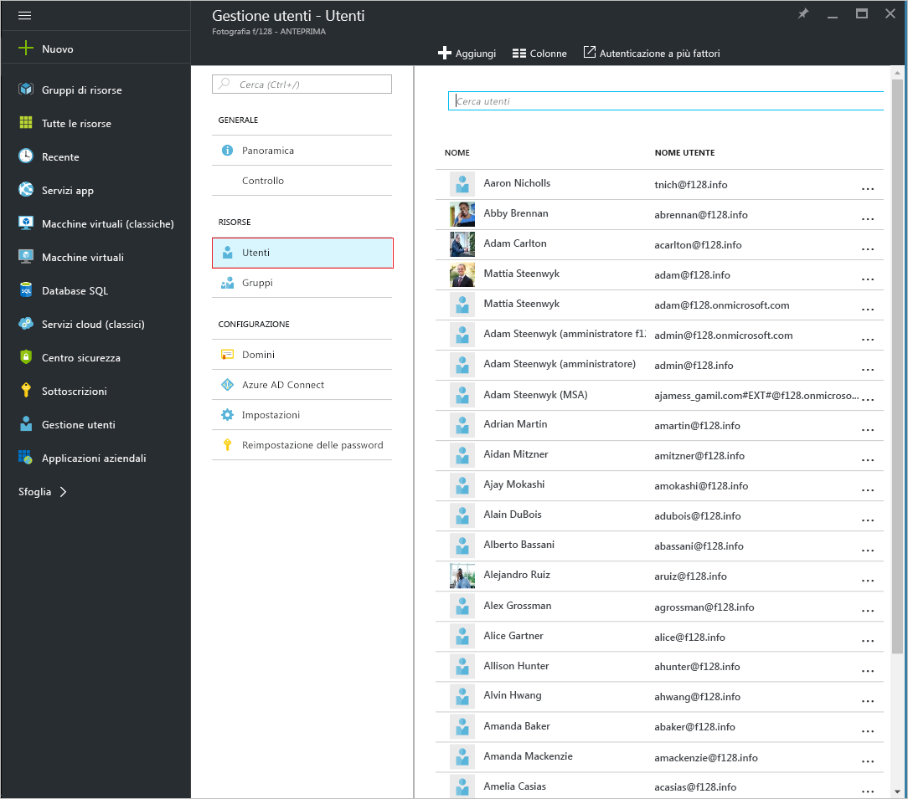
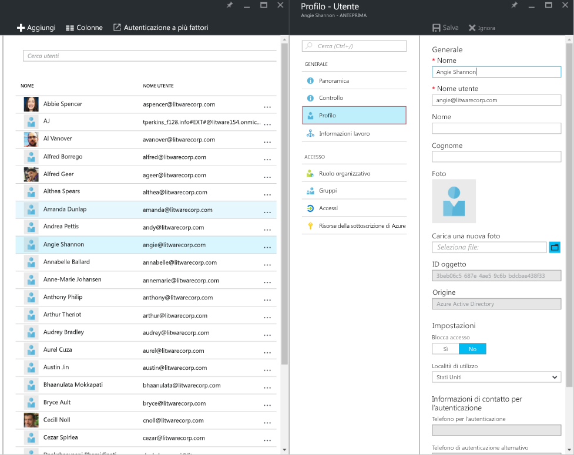
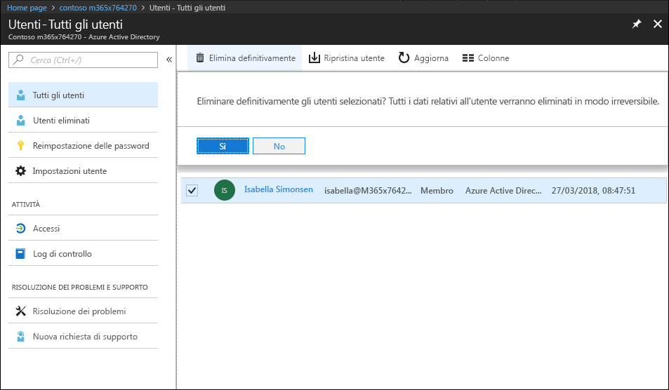
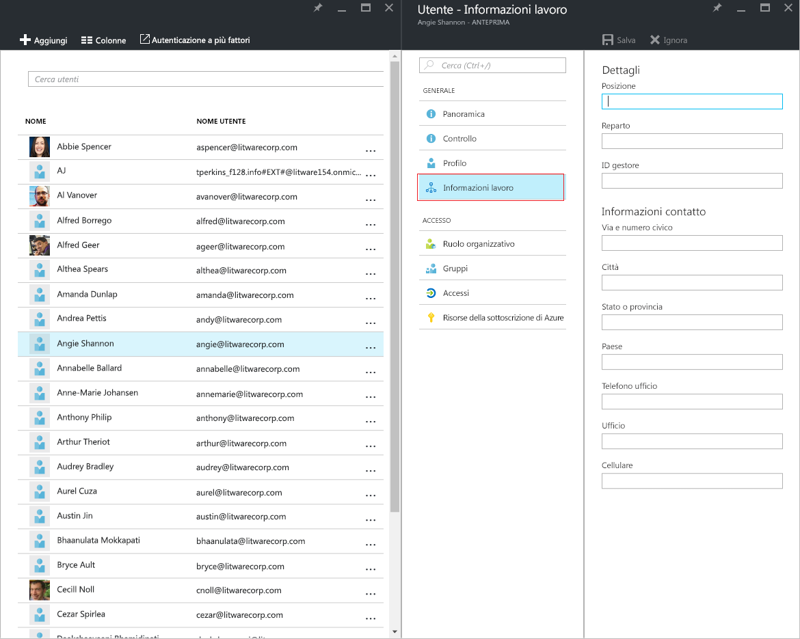
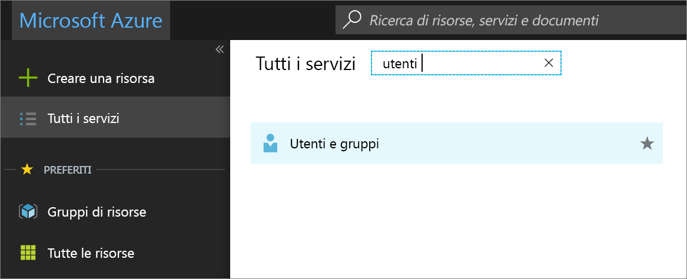
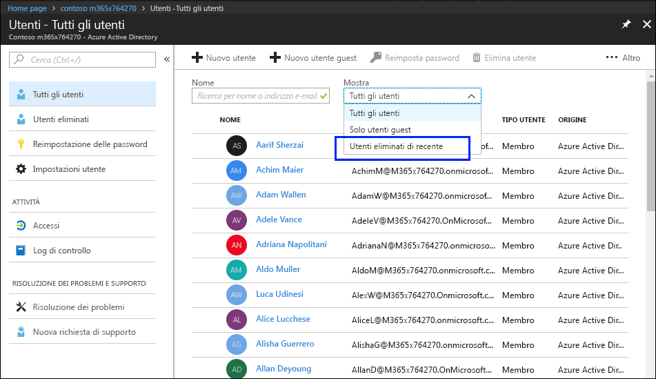
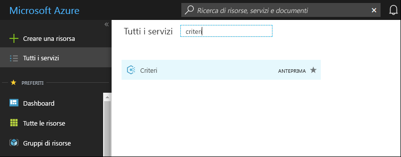
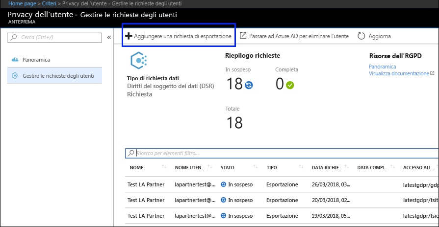
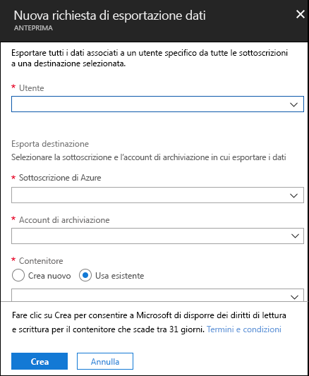

# Richieste del soggetto dei dati per l'RGPD in AzureAzure Data Subject Requests for the GDPR

## Introduzione alle richieste del soggetto dei dati (DSR)Introduction to Data Subject Requests (DSRs)

Il Regolamento generale sulla protezione dei dati (RGPD) dell'Unione europea garantisce alle persone (denominate come *soggetti dei dati* nel regolamento) il diritto di gestire i dati personali raccolti da un datore di lavoro o da un'altra organizzazione o agenzia (definiti come *titolari del trattamento dei dati* o semplicemente *titolari*). I dati personali sono ampiamente descritti nell'RGPD come dati che si riferiscono a una persona fisica identificata o identificabile. L'RGPD garantisce ai soggetti dei dati diritti specifici sui propri dati personali; tali diritti includono la possibilità di ottenere delle copie dei dati personali, richiedere di apportare delle modifiche ai dati, limitare il trattamento dei dati, eliminarli o riceverli in un formato elettronico affinché possano essere trasferiti a un altro titolare. Una richiesta formale di un soggetto dei dati rivolta a un titolare in merito a un'operazione da effettuare sui propri dati personali è denominata *Richiesta DSR* (Data Subject Rights, Diritti del soggetto dei dati) o DSR.The EU Data Protection Regulation (GDPR) gives rights to people (known in the regulation as *data subjects*) to manage the personal data that has been collected by an employer or other type of agency or organization (known as the *data controller* or just *controller*). Personal data is defined very broadly under the GDPR as any data that relates to an identified or identifiable natural person. The GDPR gives data subjects specific rights to their personal data; these rights include obtaining copies of personal data, requesting corrections to it, restricting the processing of it, deleting it, or receiving it in an electronic format so it can be moved to another controller. A formal request by a data subject to a controller to take an action on their personal data is called a *Data Subject Request* or DSR.

La guida descrive come utilizzare i prodotti, i servizi e gli strumenti di amministrazione Microsoft per aiutare i nostri clienti titolari del trattamento dei dati a individuare e gestire i dati personali per rispondere alle richieste DSR. In particolare, ciò include come identificare, accedere e usare i dati personali che risiedono nel cloud Microsoft. Di seguito è riportata una rapida panoramica dei processi descritti in questa guida:The guide discusses how to use Microsoft products, services and administrative tools to help our controller customers find and act on personal data to respond to DSRs. Specifically, this includes how to find, access, and act on personal data that reside in the Microsoft cloud. Here’s a quick overview of the processes outlined in this guide:

- **Scoprire:** usare gli strumenti di ricerca e individuazione per trovare più facilmente i dati dei clienti che potrebbero essere oggetto di una richiesta dell'interessato. Dopo aver raccolto dei documenti potenzialmente reattivi, è possibile eseguire una o più delle azioni DSR descritte nella seguente procedura per rispondere alla richiesta. In alternativa, si può determinare che la richiesta non soddisfa le linee guida dell'organizzazione relative alla risposta alle richieste degli interessati.**Discover**—Use search and discovery tools to more easily find customer data that may be the subject of a DSR. Once potentially responsive documents are collected, you can perform one or more of the DSR actions described in the following steps to respond to the request. Alternatively, you may determine that the request doesn't meet your organization’s guidelines for responding to DSRs.
 - **Accedere:** recuperare i dati personali che risiedono nel cloud Microsoft e, se richiesto, crearne una copia che può essere disponibile per l'interessato.**Access**—Retrieve personal data that resides in the Microsoft cloud and, if requested, make a copy of it that can be available to the data subject.
- **Rettificare:** apportare modifiche o implementare le azioni richieste sui dati personali, ove applicabile.**Rectify.** Make changes or implement other requested actions on the personal data.
- **Limitare:** limitare il trattamento dei dati personali, tramite la rimozione delle licenze per vari servizi di Azure o disattivando i servizi desiderati ove possibile. È anche possibile rimuovere i dati dal cloud Microsoft e mantenerli in locale o in un'altra posizione.**Restrict**—Restrict the processing of personal data, either by removing licenses for various Azure services or turning off the desired services where possible. You can also remove data from the Microsoft cloud and retain it on-premises or at another location.
- **Eliminare:** rimuovere in modo definitivo i dati personali che risiedono nel cloud Microsoft.**Delete**—Permanently remove personal data that resided in the Microsoft cloud.
- **Esportare:** fornire all'interessato una copia elettronica dei dati personali in un formato leggibile in modo automatizzato.**Export**—Provide an electronic copy (in a machine-readable format) of personal data to the data subject.

Ogni sezione di questa guida illustra le procedure tecniche che un'organizzazione titolare del trattamento dei dati può adottare per rispondere a una richiesta DSR per i dati personali nel cloud Microsoft.Each section in this guide outlines the technical procedures that a data controller organization can take to respond to a DSR for personal data in the Microsoft cloud.

## TerminologiaTerminology

Di seguito vengono fornite le definizioni dei termini importanti nella presente guida.The following provides definitions of terms that are relevant to this guide.

- **Titolare:** la persona fisica o giuridica, l'autorità pubblica, l'agenzia o altro ente che, autonomamente o unitamente ad altri soggetti, determina gli obiettivi e i mezzi del trattamento dei dati personali; laddove gli obiettivi e i mezzi di tale trattamento sono determinati da una normativa europea o di uno specifico Stato membro dell'UE, il titolare del trattamento dei dati o i criteri specifici per la sua designazione potrebbero essere forniti da tale normativa europea o di uno specifico Stato membro dell'UE.**Controller.** The natural or legal person, public authority, agency or other body which, alone or jointly with others, determines the purposes and means of the processing of personal data; where the purposes and means of such processing are determined by Union or Member State law, the controller or the specific criteria for its nomination may be provided for by Union or Member State law.

- **Dati personali e interessato:** qualsiasi informazione relativa a una persona fisica identificata o identificabile (“interessato”); una persona fisica identificabile è una persona che può essere identificata, direttamente o indirettamente, tramite dati specifici come un nome, un numero di identificazione, dati sulla posizione, un identificatore online o uno o più fattori specifici per l'identità fisica, psicologica, genetica, mentale, economica, culturale o sociale della persona fisica.**Personal data and data subject.** Any information relating to an identified or identifiable natural person (‘data subject’); an identifiable natural person is one who can be identified, directly or indirectly, in particular by reference to an identifier such as a name, an identification number, location data, an online identifier or to one or more factors specific to the physical, physiological, genetic, mental, economic, cultural or social identity of that natural person.

- **Responsabile:** una persona fisica o giuridica, un'autorità pubblica o altro ente che si occupa del trattamento dei dati personali per conto del titolare.**Processor.** A natural or legal person, public authority, agency or other body which processes personal data on behalf of the controller.

- **Dati dei clienti:** tutti i dati, compresi tutti i file di testo, audio o immagini e il software, che vengono forniti a Microsoft da, o per conto di, un cliente tramite l'uso del servizio aziendale. I dati dei clienti includono (1) informazioni che consentono l'identificazione personale degli utenti finali (ad esempio, nomi utente e informazioni di contatto in Azure Active Directory) e contenuti per i clienti che un cliente stesso carica o crea in servizi specifici (ad esempio, contenuti per i clienti in un account di archiviazione di Azure, contenuti per i clienti in un database SQL di Azure o un'immagine della macchina virtuale di un cliente in Macchine virtuali di Azure).**Customer Data**—All data, including all text, sound, video, or image files, and software, that are provided to Microsoft by, or on behalf of, a customer through use of the enterprise service. Customer Data includes both (1) identifiable information of end users (e.g., user names and contact information in Azure Active Directory) and Customer Content that a customer uploads into or creates in specific services (e.g., customer content in an Azure Storage account, customer content of an Azure SQL Database, or a customer’s virtual machine image in Azure Virtual Machines).

- **Log generati dal sistema:** log e dati relativi generati da Microsoft che consentono a Microsoft di fornire servizi aziendali agli utenti. I log generati dal sistema contengono dati principalmente presentati con l'uso di pseudonimi come identificatori univoci (in genere, un numero generato dal sistema con cui non è possibile identificare direttamente un soggetto, ma che viene usato per fornire i servizi aziendali agli utenti). I log generati dal sistema possono anche contenere informazioni personali sugli utenti finali, come un nome utente.**System-Generated Logs**—Logs and related data generated by Microsoft that help Microsoft provide enterprise services to users. System-generated logs contain primarily pseudonymized data, such as unique identifiers – typically a number generated by the system that cannot on its own identify an individual person but is used to deliver the enterprise services to users. System-generated logs may also contain identifiable information about end users, such as a user name.

## Come usare questa guidaHow to use this guide

Questa guida è costituita da due parti:This guide consists of two parts:

**Parte 1: rispondere alle richieste dei soggetti dei dati per i dati dei clienti** — Nella Parte 1 di questa guida viene illustrato come accedere, rettificare, eliminare ed esportare i dati dalle applicazioni in cui sono presenti dati creati dall'utente. In questa sezione viene descritto in modo dettagliato come gestire le richieste DSR rispetto ai contenuti per i clienti e alle informazioni personali degli utenti finali.**Part 1: Responding to Data Subject Requests for Customer Data** — Part 1 of this guide discusses how to access, rectify, restrict, delete, and export data from applications in which you have authored data. This section details how to execute DSRs against both Customer Content and also identifiable information of end users.

**Parte 2: rispondere alle richieste degli interessati per i log generati dal sistema** - Quando si usano i servizi aziendali Microsoft, Microsoft genera alcune informazioni, note come log generati dal sistema, per fornire il servizio. Nella Parte 2 di questa guida viene illustrato come accedere, eliminare ed esportare tali informazioni per Azure.**Part 2: Responding to Data Subject Requests for System-Generated Logs** — When you use Microsoft’s enterprise services, Microsoft generates some information, known as System-Generated Logs, in order to provide the service. Part 2 of this guide discusses how to access, delete and export such information for Azure.

## Informazioni sulle richieste DSR per Azure Active Directory e account del servizio MicrosoftUnderstanding DSRs for Azure Active Directory and Microsoft Service Accounts

Se si prendono in considerazione i servizi forniti ai clienti aziendali, l'esecuzione di DSR deve essere sempre chiara nell'ambito dei contesto di un tenant di Azure Active Directory (AAD) specifico. In particolare, le richieste DSR vengono sempre eseguite all'interno di un detarminato tenant di AAD. Se un utente fa parte di più tenant, è importante sottolineare che una determinata richiesta DSR viene eseguita *solo* nel contesto del tenant specifico nel quale è stata ricevuta la richiesta. Questo è un aspetto fondamentale da comprendere perché significa che l'esecuzione di una richiesta DSR da parte di un cliente aziendale **non** avrà effetto sui dati di un cliente aziendale adiacente.When considering services provided to enterprise customers, execution of DSRs must always be understood within the context of a specific Azure Active Directory (AAD) tenant. Notably, DSRs are always executed within a given AAD tenant. If a user is participating in multiple tenants, it is important to emphasize that a given DSR is *only* executed within the context of the specific tenant the request was received within. This is critical to understand as it means the execution of a DSR by one enterprise customer **will not** impact the data of an adjacent enterprise customer.

Lo stesso vale anche per gli account del servizio Microsoft (MSA) nell'ambito dei servizi forniti da un cliente aziendale: l'esecuzione di una richiesta DSR rispetto a un account MSA *associato a un tenant di AAD* sarà relativa **solo** ai dati all'interno del tenant. Inoltre, quando si gestiscono account MSA all'interno di un tenant, è importante comprendere quanto descritto di seguito:The same also applies for Microsoft Service Accounts (MSA) within the context of services provided to an enterprise customer: execution of a DSR against an MSA account *associated with an AAD tenant* **will only** pertain to data within the tenant. In addition, it is important to understand the following when handling MSA accounts within a tenant:

-   Se un utente MSA crea una sottoscrizione di Azure, l'abbonamento verrà gestito come se fosse un tenant di AAD. Di conseguenza, le richieste DSR sono limitate all'interno del tenant come descritto in precedenza.If an MSA user creates an Azure subscription, the subscription will be handled as if it were an AAD tenant. Consequently, DSRs are scoped within the tenant as described above.

-   Se si elimina una sottoscrizione di Azure creata con un account MSA, **non ci saranno effetti** sull'account MSA. Come accennato in precedenza, l'esecuzione di richieste DSR nell'ambito della sottoscrizione di Azure è limitata all'ambito del tenant stesso.If an Azure subscription created via an MSA account is deleted, **it will not affect** the actual MSA account. Again, as noted above, DSRs executing within the Azure subscription are limited to the scope of the tenant itself.

Le richieste DSR rispetto a un account MSA, **al di fuori di un determinato tenant**, vengono eseguite tramite il Consumer Privacy Dashboard. Per ulteriori informazioni, fare riferimento alla guida per le richieste dei soggetti dei dati di Windows.DSRs against an MSA account itself, **outside a given tenant**, are executed via the Consumer Privacy Dashboard. Please refer to the Windows Data Subject Request Guide for further details.

## Parte 1: guida sulle richieste DSR per i dati dei clientiPart 1: DSR Guide for Customer Data

### Esecuzione delle richieste DSR rispetto ai dati dei clientiExecuting DSRs against Customer Data

Microsoft consente di accedere, eliminare ed esportare alcuni dati dei clienti tramite il portale di Azure e anche direttamente tramite le API (Application Programming Interface) o le interfacce utente (UI) pre-esistenti per i servizi specifici (noti anche come *esperienze nel prodotto*). Informazioni su tali esperienze nel prodotto sono disponibili nella documentazione di riferimento per i relativi servizi.Microsoft provides the ability to access, delete, and export certain Customer Data through the Azure Portal and also directly via pre-existing application programming interfaces (APIs) or user interfaces (UIs) for specific services (also referred to as *in-product experiences*). Details regarding such in-product experiences are described in the respective services’ reference documentation.

>[!Important]  
> I servizi che supportano le richieste DSR nel prodotto richiedono l'uso diretto dell'API (Application Programming Interface) o dell'interfaccia utente (UI) del servizio, descrivendo le operazioni CRUD (Create, Read, Update, Delete) applicabili. Pertanto, l'esecuzione di richieste DSR in un determinato servizio deve essere effettuata unitamente all'esecuzione di una richiesta DSR all'interno del portale di Azure per completare una richiesta per uno specifico soggetto dei dati. Per ulteriori dettagli, consultare la documentazione di riferimento per i relativi servizi.Services supporting in-product DSRs require direct usage of the service’s application programming interface (API) or user interface (UI), describing applicable CRUD (create, read, update, delete) operations. Consequently, execution of DSRs within a given service must be done in addition to execution of a DSR within the Azure Portal in order to complete a full request for a given data subject. Please refer to specific services’ reference documentation for further details.

### Passaggio 1: scoprireStep 1: Discover

Il primo passaggio per rispondere a un DSR consiste nell'individuare i dati personali oggetto della richiesta.The first step in responding to a data subject rights request is to search for and identify the customer data that is the subject of the request. Questo primo passaggio, che consente nell’individuare ed esaminare i dati personali in questione, consente di determinare se un DSR soddisfa i requisiti dell'organizzazione per rispettare o rifiutare un DSR.This first step — finding and reviewing the personal data at issue — will help you determine whether a DSR meets your organization's requirements for honoring or declining a DSR. Ad esempio, dopo aver trovato ed esaminato i dati personali in questione, è possibile che la richiesta non soddisfi i requisiti dell'organizzazione, perché in questo modo può influire negativamente sui diritti e sulle libertà altrui.This first step—finding and reviewing the personal data at issue—will help you determine whether the data subject’s request meets your organization's requirements for honoring or declining it. For example, after finding and reviewing the personal data, you may determine the request doesn’t meet your organization’s requirements because doing so may adversely affect the rights and freedoms of others.

Dopo avere trovato i dati, è quindi possibile eseguire un'azione specifica per soddisfare la richiesta da parte dell'interessato.After you find the data, you can then perform the specific action to satisfy the request by the data subject.

### Azure Active DirectoryAzure Active Directory

[Azure Active Directory](https://azure.microsoft.com/services/active-directory/) è un servizio di gestione delle identità e una directory multi-tenant basata sul cloud Microsoft. È possibile individuare informazioni personali degli utenti finali, come profili utente di clienti e dipendenti e informazioni professionali sugli utenti contenenti dati personali nell'ambiente di [Azure Active Directory](https://azure.microsoft.com/services/active-directory/) (AAD) tramite il [portale di Azure](https://portal.azure.com/).[Azure Active Directory](https://azure.microsoft.com/services/active-directory/) is Microsoft’s cloud-based, multi-tenant directory and identity management service. You can locate identifiable information of end users, such as customer and employee user profiles and user work information that contain personal data in your [Azure Active Directory](https://azure.microsoft.com/services/active-directory/) (AAD) environment by using the [Azure portal](https://portal.azure.com/).

Ciò è particolarmente utile per trovare o modificare i dati personali per un utente specifico. È anche possibile aggiungere o modificare il profilo utente e le informazioni professionali. È necessario accedere con un account amministratore globale della directory.This is particularly helpful if you want to find or change personal data for a specific user. You can also add or change user profile and work information. You must sign in with an account that’s a global admin for the directory.

#### Come si individuano o si visualizzano le informazioni professionali e il profilo utente?How do I locate or view user profile and work information?

1. Accedere al [portale di Azure](https://portal.azure.com/) con un account amministratore globale della directory.Sign in to the [Azure portal](https://portal.azure.com/) with an account that's a global admin for the directory.

1. Selezionare **Tutti i servizi**, immettere **Utenti e gruppi** nella casella di testo, quindi selezionare **Invio**.Select **All services**, enter **Users and groups** in the text box, and then select **Enter**.

     

3. Nel pannello **Utenti e gruppi**, selezionare **Utenti**.On the **Users and groups** blade, select **Users**.

     

4.  Nel pannello **Utenti e gruppi - Utenti** selezionare un utente dall'elenco e quindi, nel pannello relativo all'utente selezionato, fare clic su **Profilo** per visualizzare le informazioni del profilo utente che potrebbero contenere dati personali.On the **Users and groups - Users** blade, select a user from the list, and then, on the blade for the selected user, select **Profile** to view user profile information that might contain personal data.

    

5. Se è necessario aggiungere o modificare le informazioni del profilo utente, è possibile farlo e quindi selezionare **Salva** nella barra dei comandi.If you need to add or change user profile information, you can do so, and then, in the command bar, select **Save.**

<!-- steps 6 and 7 not in original 
6. On the blade for the selected user, select **Work Info** to view user work information that may contain personal data.

     

7. If you need to add or change user work information, you can do so, and then, in the command bar, select **Save.**

end of text to isolate -->

#### Interfacce specifiche dei serviziService-Specific Interfaces

Microsoft consente di individuare i dati dei clienti direttamente tramite le API (Application Programming Interface) o le interfacce utente (UI) pre-esistenti per servizi specifici. Maggiori dettagli in merito sono disponibili nella documentazione di riferimento dei relativi servizi, in cui vengono descritte le operazioni CRUD (Create, Read, Update, Delete) applicabili.Microsoft provides the ability to discover Customer Data directly via pre-existing application programming interfaces (APIs) or user interfaces (UIs) for specific services. Details are described in the respective services’ reference documentation, describing applicable CRUD (create, read, update, delete) operations.

### Passaggio 2: accedereStep 2: Access

Dopo aver individuato i dati dei clienti che contengono dati personali potenzialmente reattivi a una richiesta DSR, l'utente e l'organizzazione devono decidere quali dati fornire all'interessato. È possibile fornire una copia del documento effettivo, una versione appositamente riadattata o uno screenshot delle parti considerate adatte alla condivisione. Per ognuna di queste risposte a una richiesta di accesso, sarà necessario recuperare una copia del documento o altro elemento contenente i dati sensibili.After you’ve found Customer Data containing personal data that is potentially responsive to a DSR, it is up to you and your organization to decide which data to provide to the data subject. You can provide them with a copy of the actual document, an appropriately redacted version, or a screenshot of the portions you have deemed appropriate to share. For each of these responses to an access request, you will have to retrieve a copy of the document or other item that contains the responsive data.

Quando si fornisce una copia all'interessato, potrebbe essere necessario rimuovere o correggere informazioni personali su altri soggetti dei dati ed eventuali informazioni riservate.When providing a copy to the data subject, you may have to remove or redact personal information about other data subjects and any confidential information.

Di seguito viene descritto come ottenere una copia dei dati in risposta a una richiesta di accesso DSR.The following explains how to get a copy of data in response to a DSR access request.

#### Azure Active DirectoryAzure Active Directory

Microsoft mette a disposizione un portale ed esperienze nel prodotto per offrire all'amministratore tenant del cliente aziendale la possibilità di gestire richieste di accesso DSR. Tali richieste consentono di accedere ai dati personali dell'utente, tra cui: (a) informazioni personali su un utente finale e (b) log generati dal sistema.Microsoft offers both a portal and in-product experiences providing the enterprise customer’s tenant administrator the capability to manage DSR access requests. DSR Access requests allow for access of the personal data of the user, including: (a) identifiable information about an end-user and (b) system-generated logs.

#### Interfacce specifiche dei serviziService-Specific Interfaces

Microsoft consente di individuare i dati dei clienti direttamente tramite le API (Application Programming Interface) o le interfacce utente (UI) pre-esistenti per servizi specifici. Maggiori dettagli in merito sono disponibili nella documentazione di riferimento dei relativi servizi, in cui vengono descritte le operazioni CRUD (Create, Read, Update, Delete) applicabili.Microsoft provides the ability to discover Customer Data directly via pre-existing application programming interfaces (APIs) or user interfaces (UIs) for specific services. Details are described in the respective services’ reference documentation, describing applicable CRUD (create, read, update, delete) operations.

### Passaggio 3: rettificareStep 3: Rectify

Se un interessato ha chiesto di rettificare i dati personali che fanno parte dei dati dell'organizzazione, l'utente e l'organizzazione dovranno determinare se la richiesta possa essere accettata. La rettifica dei dati potrebbe includere operazioni quali la modifica, la revisione o la rimozione di dati personali da un documento o altro. Il modo migliore per farlo per i dati di FastTrack e il supporto tecnico Microsoft viene fornito di seguito.If a data subject has asked you to rectify the personal data that resides in your organization’s data, you and your organization will have to determine whether it’s appropriate to honor the request. Rectifying the data may include taking actions such as editing, redacting, or removing personal data from a document or other type or item. The most expedient way to do this for Microsoft Support and FastTrack data is provided below.

#### Azure Active DirectoryAzure Active Directory

I clienti aziendali hanno la possibilità di gestire le richieste di rettifica DSR, comprese le funzionalità di modifica limitate in base alla natura di un determinato servizio Microsoft. In qualità di responsabile del trattamento dei dati, Microsoft non consente di correggere i log generati dal sistema poiché riflette attività effettive e costituisce un record cronologico degli eventi all'interno dei servizi Microsoft. Per quanto riguarda Azure Active Directory, esistono funzionalità di modifica limitate per rettificare le informazioni personali su un utente finale, come descritto più avanti.Enterprise customers have the ability to manage DSR rectify requests, including limited editing features per the nature of a given Microsoft service. As a data processor, Microsoft does not offer the ability to correct system-generated logs as it reflects factual activities and constitutes a historical record of events within Microsoft services. With respect to Azure Active Directory, limited editing features exist to rectify identifiable information about an end-user, as described further below.

##### Azure Active Directory: rettificare/correggere dati personali incompleti o inesattiAzure Active Directory: rectify/correct inaccurate or incomplete personal data

È possibile correggere, aggiornare o eliminare informazioni personali sugli utenti finali, come profili utente di clienti e dipendenti e informazioni professionali degli utenti contenenti dati personali come nome utente, titolo professionale, indirizzo o numero di telefono, nell'ambiente [Azure Active Directory](https://azure.microsoft.com/services/active-directory/) (AAD) tramite il [portale di Azure](https://portal.azure.com/). È necessario accedere con un account amministratore globale per la directory.You can correct, update, or delete identifiable information about end users, such as customer and employee user profiles and user work information that contain personal data, such as a user’s name, work title, address, or phone number, in your [Azure Active Directory](https://azure.microsoft.com/services/active-directory/) (AAD) environment by using the [Azure portal](https://portal.azure.com/). You must sign in with an account that’s a global admin for the directory.

###### Come si correggono o si aggiornano le informazioni professionali e il profilo utente in Azure Active Directory?How do I correct or update user profile and work information in Azure Active Directory?

1.  Accedere al [portale di Azure](https://portal.azure.com/) con un account amministratore globale della directory.Sign in to the [Azure portal](https://portal.azure.com/) with an account that's a global admin for the directory.

2.  Selezionare **Tutti i servizi**, immettere **Utenti e gruppi** nella casella di testo, quindi selezionare **Invio**.Select **All services**, enter **Users and groups** in the text box, and then select **Enter**.

    

3.  Nel pannello **Utenti e gruppi**, selezionare **Utenti**.On the **Users and groups** blade, select **Users**.
         
    

4.  Nel pannello **Utenti e gruppi - Utenti** selezionare un utente dall'elenco e quindi, nel pannello relativo all'utente selezionato, fare clic su **Profilo** per visualizzare le informazioni sul profilo utente da correggere o aggiornare.On the **Users and groups - Users** blade, select a user from the list, and then, on the blade for the selected user, select **Profile** to view the user profile information that needs to be corrected or updated.

    

5.  Correggere o aggiornare le informazioni e quindi selezionare **Salva** nella barra dei comandi.Correct or update the information, and then, in the command bar, select **Save.**

6.  Nel pannello dell'utente selezionato, fare clic su **Informazioni lavoro** per visualizzare le informazioni professionali dell'utente da correggere o aggiornare.On the blade for the selected user, select **Work Info** to view user work information that needs to be corrected or updated.

    

7.  Correggere o aggiornare le informazioni professionali dell'utente e quindi selezionare **Salva** nella barra dei comandi.Correct or update the user work information, and then, in the command bar, select **Save.**

#### Interfacce specifiche dei serviziService-Specific Interfaces

Microsoft consente di individuare i dati dei clienti direttamente tramite le API (Application Programming Interface) o le interfacce utente (UI) pre-esistenti per servizi specifici. Maggiori dettagli in merito sono disponibili nella documentazione di riferimento dei relativi servizi, in cui vengono descritte le operazioni CRUD (Create, Read, Update, Delete) applicabili.Microsoft provides the ability to discover Customer Data directly via pre-existing application programming interfaces (APIs) or user interfaces (UIs) for specific services. Details are described in the respective services’ reference documentation, describing applicable CRUD (create, read, update, delete) operations.

### Passaggio 4: limitareStep 4: Restrict

Gli interessati potrebbero richiedere la limitazione del trattamento dei loro dati personali. Microsoft fornisce il portale di Azure e le API (Application Programming Interface) o le interfacce utente (UI) pre-esistenti. Tali esperienze consentono all'amministratore tenant del cliente aziendale di gestire tali richieste DSR con una combinazione di esportazione dei dati ed eliminazione dei dati. Un cliente potrebbe (1) esportare una copia elettronica dei dati personali dell'utente, compresi (a) account, (b) log generati dal sistema e (c) log associati, per poi (2) eliminare l'account e i dati associati che si trovano all'interno dei sistemi Microsoft.Data subjects may request that you restrict processing of their personal data. We provide both the Azure Portal and pre-existing application programming interfaces (APIs) or user interfaces (UIs). These experiences provide the enterprise customer’s tenant administrator the capability to manage such DSRs through a combination of data export and data deletion. A customer may (1) export an electronic copy of the personal data of the user, including (a) account(s), (b) system-generated logs, and (c) associated logs, followed with (2) deletion of the account and associated data residing within Microsoft systems.

### Passaggio 5: eliminareStep 5: Delete

Il "diritto alla cancellazione" con la rimozione dei dati personali dai dati dei clienti di un'organizzazione è una delle principali protezioni nel GDPR.The “right to erasure” by the removal of personal data from an organization’s Customer Data is a key protection in the GDPR. Removing personal data includes removing all personal data and system-generated logs, except audit log information. For details, see Delete end user personal data. La rimozione dei dati personali include la rimozione di tutti i dati personali e dei log generati dal sistema, tranne le informazioni del log di controllo.Removing personal data includes removing all personal data and system-generated logs, except audit log information. Se un utente viene **eliminato temporaneamente** (vedere i dettagli di seguito), l'account viene disabilitato per 30 giorni.When a user is **soft deleted** (see details below), the account is disabled for 30 days. Se durante il periodo di 30 giorni non viene eseguita alcuna ulteriore azione, l'utente viene **eliminato definitivamente** (anche in questo caso, vedere i dettagli di seguito).If no further action is taken during this 30-day period, the user is **permanently deleted** (again, see details below). Dopo l’**eliminazione definitiva**, l'account dell’utente, i dati personali e i log generati dal sistema vengono rimossi entro 30 giorni.Upon a **permanent delete**, the user’s account, personal data, and system-generated logs are expunged within an additional 30 days. Se un amministratore tenant effettua immediatamente un’**eliminazione definitiva**, l'account dell’utente, i dati personali e i log generati dal sistema vengono rimossi entro 30 giorni.If a tenant admin immediately issues a **permanent delete**, the user’s account, personal data, and system-generated logs are expunged within 30 days of issuance.

> [!Important]
> È necessario essere un amministratore tenant per eliminare un utente dal tenant.[Important] You must be a tenant administrator to delete a user from the tenant.

#### Eliminare un utente e i dati associati tramite il portale di AzureDelete a user and associated data through the Azure portal

Dopo aver ricevuto una richiesta di eliminazione per un interessato, è possibile utilizzare il portale di Azure per eliminare un utente, le informazioni personali associate e i log generati dal sistema.After you receive a delete request for a data subject, you can use the Azure portal to delete both a user and the associated personal information as well as system-generated logs.

L'eliminazione di questi dati comporta anche l'eliminazione dell'utente dal tenant. Gli utenti vengono prima eliminati temporaneamente, ovvero l'account può essere recuperato da un amministratore tenant entro 30 giorni dall'eliminazione temporanea. Dopo 30 giorni, l'account viene eliminato dal tenant automaticamente e in modo definitivo. Prima dei 30 giorni, è possibile eliminare manualmente dal Cestino un utente eliminato temporaneamente.Deleting this data also means deleting the user from the tenant. Users are initially soft-deleted, which means the account can be recovered by a tenant admin within 30 days of being marked for soft-delete. After 30 days, the account is automatically, and permanently, deleted from the tenant. Prior to that 30 days, you can manually delete a soft-deleted user from the recycle bin.

Di seguito viene descritto il processo di eliminazione degli utenti dal tenant.Here’s the high-level process for deleting users from your tenant.

1.  Accedere al portale di Azure e individuare l'utente.Go to the Azure portal and locate the user.

2.  Eliminare l'utente. In questa fase, l'account dell'utente viene inviato al Cestino. **A questo punto, l'utente è eliminato temporaneamente, ovvero l'account è disabilitato ma non rimosso da Azure Active Directory.**Delete the user. When you initially delete the user, the user’s account is sent to the Recycle Bin. **At this point, the user is soft deleted, meaning the account is disabled, but not expunged from Azure Active Directory.**

3.  Accedere all'elenco Utenti eliminati di recente ed eliminare definitivamente l'utente. **A questo punto, l'utente è eliminato in modo permanente, ovvero l'account è stato rimosso da Azure Active Directory.**Go to the Recently deleted users list and permanently delete the user. **At this point the user is permanently deleted (also known as hard deleted), meaning the account has been expunged from Azure Active Directory**

###### Per eliminare un utente da un tenant di AzureTo delete a user from an Azure tenant

1.  Aprire il portale di Azure, selezionare il pannello **Azure Active Directory** e quindi selezionare **Utenti**.Open the Azure portal, select the **Azure Active Directory** blade, and then select **Users**.

    Viene visualizzato il pannello **Utenti - Tutti gli utenti**.The **Users – All users** blade appears.

    

2.  Selezionare la casella accanto all'utente da eliminare, selezionare **Elimina utente**, quindi **Sì** nella casella che richiede se si desidera eliminare l'utente.Check the box next to the user you want to delete, select **Delete user**, and then select **Yes** in the box asking if you want to delete the user.

    

3.  Nella casella di riepilogo **Mostra** selezionare **Utenti eliminati di recente**.In the **Show** drop-down box, select **Recently deleted users**.

    

4.  Selezionare di nuovo il nome utente, selezionare **Elimina permanentemente**, quindi seleziona **Sì** nell'apposita casella per confermare.Select the same user again, select **Delete permanently**, and then select **Yes** in the box asking if you’re sure.

>[!Important]  
>Tenere presente che, facendo clic su **Sì**, si elimina in modo permanente e irrevocabile l'utente e tutti i dati e i log generati dal sistema ad esso associati. Se si effettua questa operazione per errore, sarà necessario riaggiungere manualmente l'utente al tenant. I dati e i log generati dal sistema ad esso associati non sono recuperabili.Be aware that by clicking **Yes** you are permanently, and irrevocably, deleting the user and all associated data and system-generated logs. If you do this by mistake, you’ll have to manually add the user back to the tenant. The associated data and system-generated logs are non-recoverable.

   

#### Interfacce specifiche dei serviziService-Specific Interfaces

Microsoft consente di individuare i dati dei clienti direttamente tramite le API (Application Programming Interface) o le interfacce utente (UI) pre-esistenti per servizi specifici. Maggiori dettagli in merito sono disponibili nella documentazione di riferimento dei relativi servizi, in cui vengono descritte le operazioni CRUD (Create, Read, Update, Delete) applicabili.Microsoft provides the ability to discover Customer Data directly via pre-existing application programming interfaces (APIs) or user interfaces (UIs) for specific services. Details are described in the respective services’ reference documentation, describing applicable CRUD (create, read, update, delete) operations.

## Passaggio 6: esportareStep 6: Export

Il "diritto alla portabilità dei dati" consente a un interessato di richiedere una copia dei propri dati personali in un formato elettronico (ovvero un "formato che sia interoperabile, leggibile, di uso comune e strutturato") che possa essere trasmessa a un altro titolare del trattamento dei dati.The “right of data portability” allows a data subject to request a copy of their personal data in an electronic format (that’s a “structured, commonly used, machine read-able and interoperable format”) that may be transmitted to another data controller. Azure supports this by enabling your organization to export the data in the native JSON format, to your specified Azure Storage Container. Azure supporta questa caratteristica, consentendo all'organizzazione di esportare i dati in formato JSON nativo nel contenitore di archiviazione di Azure specificato.Azure supports this by enabling your organization to export the data in the native JSON format, to your specified Azure Storage Container. Introduction to Microsoft Azure Storage – Blob storage article.

>[Importante] È necessario essere un amministratore tenant per esportare i dati di un utente dal tenant.[Important] You must be a tenant administrator to export user data from the tenant.

### Azure Active DirectoryAzure Active Directory

Per quanto riguarda i dati del cliente, Microsoft fornisce un portale ed esperienze nel prodotto per consentire all'amministratore tenant del cliente aziendale di gestire le richieste di esportazione per le informazioni personali relative a un utente finale.With respect to Customer Data, Microsoft offers both a portal and in-product experiences providing the enterprise customer’s tenant administrator the capability to manage export requests for identifiable information about an end-user.

### Interfacce specifiche dei serviziService-Specific Interfaces

Microsoft consente di individuare i dati dei clienti direttamente tramite le API (Application Programming Interface) o le interfacce utente (UI) pre-esistenti per servizi specifici. Maggiori dettagli in merito sono disponibili nella documentazione di riferimento dei relativi servizi, in cui vengono descritte le operazioni CRUD (Create, Read, Update, Delete) applicabili.Microsoft provides the ability to discover Customer Data directly via pre-existing application programming interfaces (APIs) or user interfaces (UIs) for specific services. Details are described in the respective services’ reference documentation, describing applicable CRUD (create, read, update, delete) operations.

## Parte 2: log generati dal sistemaPart 2: System-Generated Logs

Microsoft consente anche di accedere, eliminare ed esportare determinati log generati dal sistema associati all'uso che un utente fa di Azure.Microsoft also provides you with the ability to access, delete and export certain system-generated logs associated with a user’s use of Azure.

>[!Important]
> La possibilità di limitare o rettificare i log generati dal sistema non è supportata. I log generati dal sistema costituiscono le azioni effettive condotte all'interno del cloud Microsoft e i dati di diagnostica; le modifiche a tali dati possono compromettere il record cronologico delle azioni, aumentando i rischi per la sicurezza e le truffe.The ability to restrict or rectify system-generated logs is not supported. System-generated logs constitute factual actions conducted within the Microsoft cloud and diagnostic data, and modifications to such data would compromise the historical record of actions, increasing fraud and security risks.

### Esecuzione di DSR rispetto ai log generati dal sistemaExecuting DSRs against System-Generated Logs

Microsoft consente di accedere, eliminare ed esportare determinati log generati dal sistema tramite il portale di Azure e anche direttamente tramite le interfacce programmatiche o le interfacce utente dei servizi specifici. Ulteriori informazioni in merito vengono fornite nella documentazione di riferimento dei relativi servizi.Microsoft provides the ability to access, delete, and export certain system-generated logs through the Azure Portal and also directly via programmatic interfaces or user interfaces for specific services. Details are described in the respective services’ reference documentation.

>[!Important]  
> I servizi che supportano le richieste DSR nel prodotto richiedono l'uso diretto dell'API (Application Programming Interface) o dell'interfaccia utente (UI) del servizio. Pertanto, l'esecuzione di una richiesta DSR nel prodotto **deve essere effettuata unitamente all'esecuzione di una richiesta DSR all'interno del portale di Azure per completare una richiesta per uno specifico soggetto dei dati. Per ulteriori dettagli, consultare la documentazione di riferimento per i relativi servizi.**Services supporting in-product DSRs require direct usage of the service’s application programming interface (API) or user interface (UI). Consequently, execution of an in-product DSRs **must be done in addition to execution of a DSR within the Azure Portal in order to complete a full request for a given data subject. Please refer to specific services’ reference documentation for further details.**

### Passaggio 1: accedereStep 1: Access 

L'amministratore tenant è l'unica persona all'interno dell'organizzazione che può accedere ai log generati dal sistema associati all'utilizzo di Azure di un particolare utente. I dati recuperati per una richiesta di accesso verranno forniti in un formato leggibile e in file che consentiranno all'utente di conoscere i servizi ai quali sono associati i dati. Come indicato in precedenza, i dati recuperati non includono quelli che potrebbero compromettere la sicurezza del servizio.The tenant admin is the only person within your organization who can access system-generated logs associated with a particular user’s use of Azure. The data retrieved for an access request will be provided in a machine-readable format and will be provided in files that will allow the user to know which services the data is associated with. As noted above, the data retrieved will not include data that may compromise the security of the service.

#### Azure Active DirectoryAzure Active Directory

Microsoft fornisce un portale ed esperienze nel prodotto per consentire all'amministratore tenant del cliente aziendale di gestire le richieste di accesso alle informazioni personali relative a un utente finale.With respect to Customer Data, Microsoft offers both a portal and in-product experiences providing the enterprise customer’s tenant administrator the capability to manage export requests for identifiable information about an end-user. Le richieste di accesso consentiranno l'accesso ai dati personali dell'utente, tra cui: (a) informazioni che consentono l'identificazione di un utente finale e (b) i log generati dal servizio.Access requests will allow for access of the personal data of the user, including: (a) identifiable information about an end user and (b) service-generated logs. Il processo è identico a quello descritto nella sezione di Azure Active Directory nella Parte 1, Passaggio 2: Accesso.The process is identical to that described in the Azure Active Directory section of Part 1, Step 2: Access.

#### Interfacce specifiche dei serviziService-Specific Interfaces

Microsoft consente di individuare i dati dei clienti direttamente tramite le API (Application Programming Interface) o le interfacce utente (UI) pre-esistenti per servizi specifici. Maggiori dettagli in merito sono disponibili nella documentazione di riferimento dei relativi servizi, in cui vengono descritte le operazioni CRUD (Create, Read, Update, Delete) applicabili.Microsoft provides the ability to discover Customer Data directly via pre-existing application programming interfaces (APIs) or user interfaces (UIs) for specific services. Details are described in the respective services’ reference documentation, describing applicable CRUD (create, read, update, delete) operations.

### Passaggio 2: eliminareStep 2: Delete

L'amministratore è l'unica persona all'interno dell'organizzazione che può eseguire una richiesta di eliminazione DSR per un particolare utente in un tenant di Azure.The tenant admin is the only person within your organization who can execute a DSR delete request for a particular user within an Azure tenant.

#### Azure Active DirectoryAzure Active Directory

Microsoft fornisce un portale ed esperienze nel prodotto che consentono all'amministratore tenant del cliente aziendale di gestire le richieste di eliminazione DSR. Tali richieste seguono la stessa procedura descritta nella sezione Eliminare un utente e i dati associati tramite il portale di Azure della Parte 1, Passaggio 5: eliminare.Microsoft offers both a portal and in-product experiences providing the enterprise customer’s tenant administrator the capability to manage DSR delete requests. DSR delete requests follow the same as described in the Delete a user and associated data through the Azure portal section of Part 1, Step 5: Delete.

#### Interfacce specifiche dei serviziService-Specific Interfaces

Microsoft consente di individuare i dati dei clienti direttamente tramite le API (Application Programming Interface) o le interfacce utente (UI) pre-esistenti per servizi specifici. Maggiori dettagli in merito sono disponibili nella documentazione di riferimento dei relativi servizi, in cui vengono descritte le operazioni CRUD (Create, Read, Update, Delete) applicabili.Microsoft provides the ability to discover Customer Data directly via pre-existing application programming interfaces (APIs) or user interfaces (UIs) for specific services. Details are described in the respective services’ reference documentation, describing applicable CRUD (create, read, update, delete) operations.

### Passaggio 3: esportareStep 3: Export

L'amministratore tenant è l'unica persona all'interno dell'organizzazione che può accedere ai log generati dal sistema associati all'utilizzo di Azure di un particolare utente. I dati recuperati per una richiesta di esportazione verranno forniti in un formato leggibile e in file che consentiranno all'utente di conoscere i servizi ai quali sono associati i dati. Come indicato in precedenza, i dati recuperati non includono quelli che potrebbero compromettere la sicurezza o la stabilità del servizio.The tenant admin is the only person within your organization who can access system-generated logs associated with a particular user’s use of Azure. The data retrieved for an export request will be provided in a machine-readable format and will be provided in files that will allow the user to know which services the data is associated with. As noted above, the data retrieved will not include data that may compromise the security or stability of the service.

#### Esportare i log generati dal sistema tramite il portale di AzureExport system-generated logs using the Azure portal

Dopo aver ricevuto una richiesta di esportazione per un interessato, è possibile utilizzare il portale di Azure per esportare i log generati dal sistema associati a un determinato utente.After you receive an export request for a data subject, you can use the Azure portal to export system-generated logs associated with a given user.

Di seguito viene descritto il processo di esportazione dei dati dal tenant.Here’s the high-level process for exporting data from your tenant.

1. Accedere al portale di Azure e creare una richiesta di esportazione per conto dell'utente.Go to the Azure portal and create an export request on behalf of the user.
2. Esportare i dati e inviare il file all'utente.Export the data and send file to user.

###### Per esportare le informazioni di un utente da un tenant di AzureTo export a user’s info from an Azure tenant

1. Aprire il portale di Azure, selezionare **Tutti i servizi**, digitare *criteri* nel filtro e quindi selezionare **Criteri**.Open the Azure portal, select **All services**, type *policy* into the filter, and then select **Policy**.

     

2. Nel pannello **Criteri**, selezionare **Privacy dell'utente**, quindi **Gestisci richieste utente** e infine **Aggiungi richiesta di esportazione**.In the **Policy** blade, select **User privacy**, select **Manage User Requests**, and then select **Add export request**.

    

3. Completare la **richiesta di esportazione dei dati**:Complete the **Export data request**:

    

- **Utente.** Digitare l'indirizzo e-mail dell'utente di Azure Active Directory che ha richiesto l'esportazione.**User.** Type the email address of the Azure Active Directory user that requested the export.

- **Sottoscrizione.** Selezionare l'account utilizzato per creare il report relativo all'utilizzo delle risorse e fatturare i servizi. Si tratta anche della posizione dell'account di archiviazione di Azure.**Subscription.** Select the account you use to report resource usage and to bill for services. This is also the location of your Azure storage account.

- **Account di archiviazione.**\*\*\*\* Storage account name Selezionare il percorso di archiviazione di Azure (Blob).Select the location of your Azure Storage (Blob). Per maggiori informazioni, vedere l’articolo [Introduzione ad archiviazione di Microsoft Azure - archiviazione Blob](https://docs.microsoft.com/azure/storage/common/storage-introduction#blob-storage).Storage account. Select the location of your Azure Storage (Blob). For more info, see the [Introduction to Microsoft Azure Storage – Blob storage](https://docs.microsoft.com/azure/storage/common/storage-introduction#blob-storage) article.

- **Contenitore.** Creare un nuovo contenitore (o selezionarne uno esistente) come posizione di archiviazione per i dati sulla privacy dell'utente esportati.**Container.** Create a new (or select an existing) container as the storage location for the user’s exported privacy data.

4. Selezionare **Crea**.Select **Create**.

La richiesta di esportazione passa allo stato **In sospeso**.The export request goes into **Pending** status. È possibile visualizzare lo stato del report nel pannello Privacy degli utenti - Panoramica\*\*.The export request goes into Pending status. You can view the report status on the **User privacy - Overview** blade.

>[!Important]  
>Poiché i dati personali possono provenire da più sistemi, è possibile che il completamento del processo di esportazione richieda fino a un mese.Because personal data can come from multiple systems, it’s possible that the export process might take up to one month to complete.

#### Interfacce specifiche dei serviziService-Specific Interfaces

Microsoft consente di individuare i dati dei clienti direttamente tramite le API (Application Programming Interface) o le interfacce utente (UI) pre-esistenti per servizi specifici. Maggiori dettagli in merito sono disponibili nella documentazione di riferimento dei relativi servizi, in cui vengono descritte le operazioni CRUD (Create, Read, Update, Delete) applicabili.Microsoft provides the ability to discover Customer Data directly via pre-existing application programming interfaces (APIs) or user interfaces (UIs) for specific services. Details are described in the respective services’ reference documentation, describing applicable CRUD (create, read, update, delete) operations.

### Notificare problemi riguardanti l'esportazione o l'eliminazione.Notify about exporting or deleting issues
Se si verificano problemi durante l'esportazione o l'eliminazione di dati dal portale di Azure, accedere al pannello **Guida e Supporto** del portale di Azure e inviare un nuovo ticket in **Gestione della sottoscrizione > Altre richieste di sicurezza e conformità > Pannello privacy e richieste GDPR**.If you run into issues while exporting or deleting data from the Azure portal, go to the Azure portal **Help + Support** blade and submit a new ticket under **Subscription Management > Other Security and Compliance Request > Privacy Blade and GDPR Requests**.

## Altre informazioniLearn more

- [Centro protezione MicrosoftMicrosoft Trust Center](https://www.microsoft.com/TrustCenter/Privacy/gdpr/default.aspx)