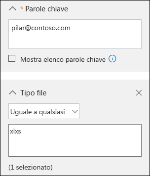
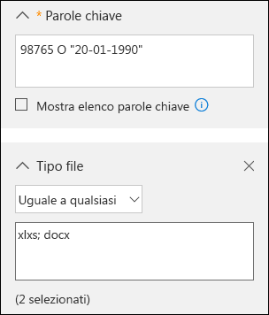
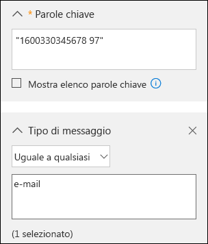

# <a name="office-365-data-subject-requests-for-the-gdpr"></a><span data-ttu-id="c003f-104">Richieste dell'interessato per il GDPR in Office 365</span><span class="sxs-lookup"><span data-stu-id="c003f-104">Office 365 Data Subject Requests for the GDPR</span></span>

## <a name="introduction-to-dsrs"></a><span data-ttu-id="c003f-105">Introduzione alle richieste DSR</span><span class="sxs-lookup"><span data-stu-id="c003f-105">Introduction to DSRs</span></span>

<span data-ttu-id="c003f-p101">Il Regolamento generale sulla protezione dei dati (GDPR) garantisce alle persone (denominate come *interessati* nel regolamento) il diritto di gestire i dati personali raccolti da un datore di lavoro o da un'altra organizzazione o agenzia (definiti come *titolari del trattamento dei dati* o semplicemente *titolari*). I dati personali sono ampiamente descritti nel GDPR come dati che si riferiscono a una persona fisica identificata o identificabile. Il Regolamento generale sulla protezione dei dati garantisce agli interessati diritti specifici sui propri dati personali. Tali diritti includono la possibilità di ottenere copie dei dati, richiedere di apportare modifiche ai dati, limitare il trattamento dei dati, eliminarli o riceverli in un formato elettronico affinché possano essere trasferiti a un altro titolare. Una richiesta formale da parte dell'interessato rivolta a un titolare in merito a un'operazione da effettuare sui propri dati personali è denominata *Richiesta DSR* (Data Subject Rights, Diritti dell'interessato) o DSR. Il titolare è tenuto a prendere immediatamente in considerazione ogni richiesta DSR e a fornire una risposta concreta effettuando l'operazione richiesta o fornendo una spiegazione del motivo per cui non è in grado di gestire la richiesta DSR. Un titolare deve confrontarsi con i propri consulenti legali o della conformità in merito alla disposizione adeguata di ogni richiesta DSR.</span><span class="sxs-lookup"><span data-stu-id="c003f-p101">The General Data Protection Regulation (GDPR) gives rights to people (known in the regulation as *data subjects*) to manage the personal data that has been collected by an employer or other type of agency or organization (known as the *data controller* or just *controller*). Personal data is defined very broadly under the GDPR as any data that relates to an identified or identifiable natural person. The GDPR gives data subjects specific rights to their personal data; these rights include obtaining copies of it, requesting changes to it, restricting the processing of it, deleting it, or receiving it in an electronic format so it can be moved to another controller. A formal request by a data subject to a controller to take an action on their personal data is called a *Data Subject Request* or DSR. The controller is obligated to promptly consider each DSR and provide a substantive response either by taking the requested action or by providing an explanation for why the DSR cannot be accommodated by the controller. A controller should consult with its own legal or compliance advisers regarding the proper disposition of any given DSR.</span></span>

<span data-ttu-id="c003f-p102">La guida descrive come usare i prodotti, i servizi e gli strumenti di amministrazione di Office 365 per individuare e gestire con facilità i dati personali per rispondere alle richieste DSR. In particolare, ciò include informazioni su come identificare i dati personali che risiedono nel cloud Microsoft, come accedervi e come usarli. Di seguito è riportata una rapida panoramica dei processi descritti in questa guida:</span><span class="sxs-lookup"><span data-stu-id="c003f-p102">The guide discusses how to use Office 365 products, services and administrative tools to help you find and act on personal data to respond to DSRs. Specifically, this includes how to find, access, and act on personal data that resides in Microsoft's cloud. Here’s a quick overview of the processes outlined in this guide:</span></span>

1.  <span data-ttu-id="c003f-p103">***Individuazione***: usare gli strumenti di ricerca e individuazione, ad esempio quelli offerti dal Centro sicurezza e conformità di Microsoft, per trovare più facilmente i contenuti dei clienti che potrebbero essere oggetto di una richiesta DSR. Dopo aver raccolto documenti potenzialmente reattivi, è possibile eseguire una o più azioni DSR tra quelle descritte nella procedura seguente per rispondere alla richiesta DSR. In alternativa, si potrebbe determinare che la richiesta non soddisfa le linee guida dell'organizzazione relative alla risposta alle DSR.</span><span class="sxs-lookup"><span data-stu-id="c003f-p103">***Discover***—Use search and discovery tools, such as those offered by the Microsoft Security & Compliance Center (SCC), to more easily find customer content that may be the subject of a DSR. Once potentially responsive documents are collected, you can perform one or more of the DSR actions described in the following steps to respond to the DSR request. Alternatively, you may determine that the request doesn't meet your organizations guidelines for responding to DSRs.</span></span>

2.  <span data-ttu-id="c003f-118">***Accesso***: recuperare i dati personali che risiedono nel cloud Microsoft e, se richiesto, farne una copia da mettere a disposizione dell'interessato.</span><span class="sxs-lookup"><span data-stu-id="c003f-118">***Access***—Retrieve personal data that resides in the Microsoft cloud and, if requested, make a copy of it available to the data subject.</span></span>

3.  <span data-ttu-id="c003f-119">***Rettifica***: apportare modifiche o implementare le azioni richieste per i dati personali, ove applicabile.</span><span class="sxs-lookup"><span data-stu-id="c003f-119">***Rectify***—Make changes or implement other requested actions on the personal data, where applicable.</span></span>

4.  <span data-ttu-id="c003f-p104">***Limitazione***: limitare il trattamento dei dati personali, tramite la rimozione delle licenze per vari servizi Office 365 o disattivando i servizi o le funzionalità desiderati ove possibile. È anche possibile rimuovere i dati dal cloud Microsoft e mantenerli in locale o in un'altra posizione.</span><span class="sxs-lookup"><span data-stu-id="c003f-p104">***Restrict***—Restrict the processing of personal data, either by removing licenses for various Office 365 services, or by turning off the desired services or features where possible. You can also remove data from the Microsoft cloud and retain it on-premises or at another location.</span></span>

5.  <span data-ttu-id="c003f-122">***Eliminazione***: rimuovere in modo definitivo i dati personali che risiedono nel cloud Microsoft.</span><span class="sxs-lookup"><span data-stu-id="c003f-122">***Delete***—Permanently remove personal data that resides in the Microsoft cloud.</span></span>

6.  <span data-ttu-id="c003f-p105">***Esportazione***: fornire una copia elettronica dei dati personali all'interessato. Il "diritto alla portabilità dei dati" del GDPR consente all'interessato di richiedere una copia elettronica dei suoi dati personali in un formato strutturato comune leggibile dal computer.</span><span class="sxs-lookup"><span data-stu-id="c003f-p105">***Export***—Provide an electronic copy of personal data to the data subject. The GDPR’s “right of data portability” allows a data subject to request an electronic copy of personal data that’s in a structured, commonly used, machine-readable format.</span></span>

### <a name="terminology"></a><span data-ttu-id="c003f-125">Terminologia</span><span class="sxs-lookup"><span data-stu-id="c003f-125">Terminology</span></span>

<span data-ttu-id="c003f-126">Di seguito vengono fornite le definizioni dei termini del GDPR importanti per la presente guida.</span><span class="sxs-lookup"><span data-stu-id="c003f-126">Here are definitions of terms from the GDPR that are relevant to this guide.</span></span>

- <span data-ttu-id="c003f-127">*Titolare del trattamento*: la persona fisica o giuridica, l'autorità pubblica, l'agenzia o altro ente che, autonomamente o unitamente ad altri soggetti, determina le finalità e i mezzi del trattamento dei dati personali. Laddove le finalità e i mezzi di tale trattamento siano determinati da una normativa europea o di uno specifico Stato membro dell'UE, il titolare del trattamento dei dati o i criteri specifici per la sua designazione potrebbero essere forniti da tale normativa europea o di uno specifico Stato membro dell'UE.</span><span class="sxs-lookup"><span data-stu-id="c003f-127">*Controller*—The natural or legal person, public authority, agency or other body which, alone or jointly with others, determines the purposes and means of the processing of personal data; where the purposes and means of such processing are determined by Union or Member State law, the controller or the specific criteria for its nomination may be provided for by Union or Member State law.</span></span>

-   <span data-ttu-id="c003f-128">*Dati personali* e *interessato*: qualsiasi informazione relativa a una persona fisica identificata o identificabile ("soggetto dei dati"); una persona fisica identificabile è una persona che può essere identificata, direttamente o indirettamente, tramite dati specifici come un nome, un numero di identificazione, dati sulla posizione, un identificatore online o uno o più fattori specifici per l'identità fisica, psicologica, genetica, mentale, economica, culturale o sociale della persona fisica.</span><span class="sxs-lookup"><span data-stu-id="c003f-128">*Personal data* and *data subject*—Any information relating to an identified or identifiable natural person (‘data subject’); an identifiable natural person is one who can be identified, directly or indirectly, in particular by reference to an identifier such as a name, an identification number, location data, an online identifier or to one or more factors specific to the physical, physiological, genetic, mental, economic, cultural or social identity of that natural person.</span></span>

-   <span data-ttu-id="c003f-129">*Responsabile*: una persona fisica o giuridica, un'autorità pubblica o altro ente che si occupa del trattamento dei dati personali per conto del titolare.</span><span class="sxs-lookup"><span data-stu-id="c003f-129">*Processor*—A natural or legal person, public authority, agency or other body which processes personal data on behalf of the controller.</span></span>

### <a name="how-to-use-this-guide"></a><span data-ttu-id="c003f-130">Come usare questa guida</span><span class="sxs-lookup"><span data-stu-id="c003f-130">How to use this guide</span></span>

<span data-ttu-id="c003f-131">Per agevolare l'individuazione delle informazioni rilevanti per il proprio caso d'uso, questa guida è divisa in quattro parti.</span><span class="sxs-lookup"><span data-stu-id="c003f-131">To help you find information relevant to your use case, this guide is divided into four parts.</span></span>

<span data-ttu-id="c003f-p106">[Parte 1. Risposta a richieste DSR per i dati del cliente](#part-1-responding-to-dsrs-for-customer-data) - *I dati del cliente* vengono creati e archiviati in Office 365 nelle operazioni quotidiane dell'azienda. Esempi delle applicazioni di Office 365 più comuni che consentono di creare dati sono Word, Excel, PowerPoint, Outlook e OneNote. Office 365 è inoltre costituito da applicazioni come SharePoint Online, Teams e Forms che consentono una migliore collaborazione con altri utenti. La Parte 1 di questa guida descrive il modo in cui è possibile individuare, accedere, rettificare, restringere, eliminare ed esportare dati dalle applicazioni di Office 365 che sono state usate per creare e archiviare dati nei servizi online di Office 365. Si rivolge a prodotti e servizi per i quali Microsoft funge da responsabile del trattamento dei dati per l'organizzazione, pertanto la funzionalità DSR viene resa disponibile all'amministratore del tenant.</span><span class="sxs-lookup"><span data-stu-id="c003f-p106">[Part 1: Responding to DSRs for Customer Data](#part-1-responding-to-dsrs-for-customer-data) - *Customer Data* is data produced and stored in Office 365 in the day-to-day operations of running your business. Examples of the most commonly used Office 365 applications which allow you to author data include Word, Excel, PowerPoint, Outlook and OneNote. Office 365 also consists of applications such as SharePoint Online, Teams, and Forms which allow you to better collaborate with others. Part 1 of this guide discusses how to discover access, rectify, restrict, delete, and export data from Office 365 applications that have been used to author and store data in Office 365 online services. It addresses products and services for which Microsoft is acting as a data processor to your organization, and thus DSR capability is made available to your tenant administrator.</span></span>

<span data-ttu-id="c003f-p107">[Parte 2. Risposta alle DSR in merito alle informazioni dettagliate generate da Office 365](#part-2-responding-to-dsrs-with-respect-to-insights-generated-by-office-365) - Office 365 fornisce alcune informazioni tramite servizi come Delve, MyAnalytics e Workplace Analytics. La Parte 2 di questa guida illustra il modo in cui queste informazioni vengono generate e come rispondere alle DSR correlate.</span><span class="sxs-lookup"><span data-stu-id="c003f-p107">[Part 2: Responding to DSRs with Respect to Insights Generated by Office 365](#part-2-responding-to-dsrs-with-respect-to-insights-generated-by-office-365) - Office 365 provides certain insights through services like Delve, MyAnalytics, and Workplace Analytics. How these insights are generated and how to respond to DSRs related to them are explained in Part 2 of this guide.</span></span>

<span data-ttu-id="c003f-p108">[Parte 3. Risposta alle richieste DSR per log generati dal sistema](#part-3-responding-to-dsrs-for-system-generated-logs) - Quando si usano i servizi aziendali di Office 365, Microsoft genera alcune informazioni come i log di servizio che registrano l'utilizzo o le prestazioni delle funzionalità nei servizi online. La maggior parte dei dati generati dal servizio contiene identificatori pseudonimi generati da Microsoft, quindi nel documento si fa riferimento a questa categoria come *log generati dal sistema*. Anche se questi dati non possono essere attribuiti a un interessato specifico senza l'uso di informazioni aggiuntive, alcuni possono rientrare nella definizione generale del GDPR di "dati personali". La Parte 3 di questa guida illustra come accedere, eliminare ed esportare log generati dal sistema.</span><span class="sxs-lookup"><span data-stu-id="c003f-p108">[Part 3: Responding to DSRs for system-generated Logs](#part-3-responding-to-dsrs-for-system-generated-logs) - When you use Office 365 enterprise services, Microsoft generates some information such as service logs that record the use or performance of features in the online services. Most service generated data contain pseudonymous identifiers generated by Microsoft and this category is thus generally referred to within this document as *system-generated logs*. Although this data can't be attributed to a specific data subject without the use of additional information, some of it may be deemed personal under GDPR's definition for "personal data." Part 3 of this guide discusses how to access, delete, and export system-generated logs.</span></span>

<span data-ttu-id="c003f-143">[Parte 4. Risorse aggiuntive di supporto per le DSR](#part-4-additional-resources-to-assist-you-with-dsrs) - La Parte 4 di questa guida elenca gli scenari limitati in cui Microsoft è il titolare del trattamento quando vengono usati determinati prodotti e servizi di Office 365.</span><span class="sxs-lookup"><span data-stu-id="c003f-143">[Part 4: Additional resources to assist you with DSRs](#part-4-additional-resources-to-assist-you-with-dsrs) - Part 4 of this guide lists limited scenarios in which Microsoft is the data controller when certain Office 365 products and services are used.</span></span>

> [!NOTE]
> <span data-ttu-id="c003f-p109">Nella maggior parte dei casi, quando nell'organizzazione si usano prodotti e servizi di Microsoft Office 365, l'amministratore è il titolare del trattamento dati e Microsoft è il responsabile. In quanto titolare del trattamento dati, si è responsabili di rispondere direttamente all'interessato. A questo scopo, le Parti 1-3 di questa guida illustrano in dettaglio le funzionalità tecniche a disposizione dell'organizzazione per rispondere a una richiesta DSR. In alcuni scenari limitati, tuttavia, è Microsoft il titolare del trattamento dati quando le persone usano determinati prodotti e servizi Office 365. In questi casi, le informazioni nella Parte 4 forniscono indicazioni sul modo in cui gli interessati possono inviare richieste DSR a Microsoft.</span><span class="sxs-lookup"><span data-stu-id="c003f-p109">In most cases, when users in your organization use Microsoft Office 365 products and services, you are the data controller and Microsoft is the processor. As a data controller, you are responsible for responding to the data subject directly. To assist you with this, Parts 1-3 of this guide detail the technical capabilities available to your organization to respond to a DSR request. In some limited scenarios, however, Microsoft will be the data controller when people use certain Office 365 products and services. In these cases, the information in Part 4 provides guidance on how data subjects can submit DSR requests to Microsoft.</span></span>


### <a name="office-365-national-clouds"></a><span data-ttu-id="c003f-149">Cloud nazionali di Office 365</span><span class="sxs-lookup"><span data-stu-id="c003f-149">Office 365 national clouds</span></span>

<span data-ttu-id="c003f-p110">I servizi di Microsoft Office 365 sono disponibili anche nei seguenti ambienti cloud nazionali: [Office 365 Germany](https://support.office.com/article/learn-about-office-365-germany-8a5a4bbc-667a-4cac-8769-d8ac9015db4c), [Office 365 gestito da 21Vianet (Cina)](https://support.office.com/article/Learn-about-Office-365-operated-by-21Vianet-A8AB5061-3346-4DA0-BB7C-5260822B53AE) e [Office 365 US Government](https://technet.microsoft.com/library/mt774581.aspx). La maggior parte del materiale sussidiario per la gestione delle richieste degli interessati descritta nel presente documento si applica a questi ambienti cloud nazionali. Data la natura isolata di tali ambienti, esistono tuttavia delle eccezioni. Se rilevanti per una determinata sottosezione, le eccezioni sono indicate nella nota corrispondente.</span><span class="sxs-lookup"><span data-stu-id="c003f-p110">The Microsoft Office 365 services are also available in the following national cloud environments: [Office 365 Germany](https://support.office.com/article/learn-about-office-365-germany-8a5a4bbc-667a-4cac-8769-d8ac9015db4c), [Office 365 operated by 21Vianet (China)](https://support.office.com/article/Learn-about-Office-365-operated-by-21Vianet-A8AB5061-3346-4DA0-BB7C-5260822B53AE), and [Office 365 US Government](https://technet.microsoft.com/library/mt774581.aspx). Most of the guidance for managing data subject requests described in this document applies to these national cloud environments. However, due to the isolated nature of these environments, there are some exceptions. Where notable for a given subsection, these exceptions are called out in a corresponding note.</span></span>

### <a name="hybrid-deployments"></a><span data-ttu-id="c003f-154">Distribuzioni ibride</span><span class="sxs-lookup"><span data-stu-id="c003f-154">Hybrid deployments</span></span>

<span data-ttu-id="c003f-p111">L'organizzazione di Office 365 può comprendere offerte di Microsoft che sono una combinazione di servizi basati sul cloud e prodotti server in locale. In generale, una distribuzione ibrida è la condivisione di account utente (gestione delle identità) e risorse (come cassette postali, siti Web e dati) presenti nel cloud e in locale. Gli scenari ibridi comuni includono:</span><span class="sxs-lookup"><span data-stu-id="c003f-p111">Your Office 365 organization may consist of Microsoft offerings that are a combination of cloud-based services and on-premises server products. In general, a hybrid deployment is typically the sharing of user accounts (identity management) and resources (such as mailboxes, web sites, and data) that exist in the cloud and on-premises. Common hybrid scenarios include:</span></span>
- <span data-ttu-id="c003f-158">Distribuzioni ibride di Exchange, dove alcuni utenti hanno cassette postali in locale e altri utenti hanno cassette postali di Exchange Online.</span><span class="sxs-lookup"><span data-stu-id="c003f-158">Exchange hybrid deployments, where some users have an on-premises mailboxes and other users have Exchange Online mailboxes.</span></span>
- <span data-ttu-id="c003f-159">Distribuzioni ibride di SharePoint, dove server del sito e file server sono in locale e gli account di OneDrive for Business sono in Office 365.</span><span class="sxs-lookup"><span data-stu-id="c003f-159">SharePoint hybrid deployments, where site and file servers are on-premises and OneDrive for Business accounts are in Office 365.</span></span>
- <span data-ttu-id="c003f-160">Il sistema di gestione delle identità in locale (Active Directory) sincronizzato con Azure Activity Directory, che è il servizio directory sottostante in Office 365.</span><span class="sxs-lookup"><span data-stu-id="c003f-160">The on-premises identity management system (Active Directory) that is synchronized with Azure Activity Directory, which is the underlying directory service in Office 365.</span></span>

<span data-ttu-id="c003f-p112">Quando si risponde a una richiesta DSR, potrebbe essere necessario determinare se i dati relativi a una richiesta DSR si trovano nel cloud Microsoft o nell'organizzazione locale e, di conseguenza, adottare la procedura appropriata per rispondere alla richiesta. La presente guida alle richieste dell'interessato in Office 365 fornisce indicazioni per la gestione dei dati basati sul cloud. Per istruzioni sui dati nell'organizzazione locale vedere [GDPR per server locali di Office](https://docs.microsoft.com/Office365/Enterprise/gdpr-for-office-servers).</span><span class="sxs-lookup"><span data-stu-id="c003f-p112">When responding to a DSR request, you may have to determine if data that's responsive to a DSR request is in the Microsoft cloud or in your on-premise organization, and then take the appropriate steps to respond to that request. The Office 365 Data Subject Request Guide (this guide) provides guidance for responding to cloud-based data. For guidance for data in your on-premises organization, see [GDPR for Office on-premises Servers](https://docs.microsoft.com/Office365/Enterprise/gdpr-for-office-servers).</span></span> 


## <a name="part-1-responding-to-dsrs-for-customer-data"></a><span data-ttu-id="c003f-164">Parte 1. Risposta a richieste DSR per i dati del cliente</span><span class="sxs-lookup"><span data-stu-id="c003f-164">Part 1: Responding to DSRs for Customer Data</span></span>

<span data-ttu-id="c003f-165">Le indicazioni per rispondere alle richieste DSR per i dati del cliente si dividono nelle quattro sezioni seguenti.</span><span class="sxs-lookup"><span data-stu-id="c003f-165">The guidance for responding to DSRs for Customer Data is divided into the following four sections.</span></span>

- [<span data-ttu-id="c003f-166">Utilizzo dello strumento Ricerca contenuto di eDiscovery per rispondere alle richieste DSR</span><span class="sxs-lookup"><span data-stu-id="c003f-166">Using the Content Search eDiscovery tool to respond to DSRs</span></span>](#using-the-content-search-ediscovery-tool-to-respond-to-dsrs)

- [<span data-ttu-id="c003f-167">Utilizzo della funzionalità in-app per rispondere alle richieste DSR</span><span class="sxs-lookup"><span data-stu-id="c003f-167">Using In-App functionality to respond to DSRs</span></span>](#using-in-app-functionality-to-respond-to-dsrs)

- [<span data-ttu-id="c003f-168">Risposta alle richieste di rettifica DSR</span><span class="sxs-lookup"><span data-stu-id="c003f-168">Responding to DSR rectification requests</span></span>](#responding-to-dsr-rectification-requests)

- [<span data-ttu-id="c003f-169">Risposta alle richieste di restrizione DSR</span><span class="sxs-lookup"><span data-stu-id="c003f-169">Responding to DSR restriction requests</span></span>](#responding-to-dsr-restriction-requests)

### <a name="how-to-determine-the-office-365-applications-that-may-be-in-scope-for-a-dsr-for-customer-data"></a><span data-ttu-id="c003f-170">Come determinare le applicazioni di Office 365 che potrebbero rientrare nell'ambito di una DSR per i dati dei clienti</span><span class="sxs-lookup"><span data-stu-id="c003f-170">How to determine the Office 365 applications that may be in scope for a DSR for Customer Data</span></span>

<span data-ttu-id="c003f-p113">Per capire dove cercare i dati personali o cosa cercare, è utile identificare le applicazioni di Office 365 che si possono usare nell'organizzazione per creare e archiviare i dati in Office 365. Questa informazione consente di restringere le applicazioni di Office 365 che rientrano nell'ambito di una richiesta DSR e aiuta a determinare in che modo è possibile cercare e accedere a dati personali correlati a una richiesta DSR. Nello specifico, consente di determinare se è possibile usare lo strumento Ricerca contenuto o se è necessario usare la funzionalità in-app dell'applicazione in cui i dati sono stati creati.</span><span class="sxs-lookup"><span data-stu-id="c003f-p113">To help you determine where to search for personal data or what to search for, it helps to identify the Office 365 applications that people in your organization can use to create and store data in Office 365. Knowing this narrows the Office 365 applications that are in-scope for a DSR and helps you determine how you will search for and access personal data that’s related to a DSR. Specifically, this means whether you can use the Content Search tool or if you’ll have to use the in-app functionality of the application the data was created in.</span></span>

<span data-ttu-id="c003f-p114">Un modo rapido per identificare le applicazioni di Office 365 usate nell'organizzazione per creare i dati dei clienti consiste nel determinare quali applicazioni sono incluse nell'abbonamento a Office 365 dell'organizzazione. È possibile a tal fine accedere agli account utente nel portale di amministrazione di Office 365 e cercare le informazioni sulla licenza del prodotto. Vedere [Assegnare licenze agli utenti in Office 365 per le aziende](https://docs.microsoft.com/office365/admin/subscriptions-and-billing/assign-licenses-to-users).</span><span class="sxs-lookup"><span data-stu-id="c003f-p114">A quick way to identify the Office 365 applications that people in your organization are using to create Customer Data is to determine which applications are included in your organization's Office 365 subscription. To do this, you can access user accounts in the Office 365 admin portal and look at the product licensing information. See [Assign licenses to users in Office 365 for business](https://docs.microsoft.com/office365/admin/subscriptions-and-billing/assign-licenses-to-users).</span></span>

## <a name="using-the-content-search-ediscovery-tool-to-respond-to-dsrs"></a><span data-ttu-id="c003f-177">Utilizzo dello strumento Ricerca contenuto di eDiscovery per rispondere alle richieste DSR</span><span class="sxs-lookup"><span data-stu-id="c003f-177">Using the Content Search eDiscovery tool to respond to DSRs</span></span>

<span data-ttu-id="c003f-p115">Quando si cercano dati personali in un grande set di dati creati e archiviati dall'organizzazione con Office 365, è opportuno prima di tutto considerare quali applicazioni potrebbero essere state usate con maggiore probabilità per creare i dati che si stanno cercando. Microsoft stima che oltre il 90% dei dati di un'organizzazione archiviati in Office 365 venga creato in Word, Excel, PowerPoint, OneNote e Outlook. I documenti creati in queste applicazioni di Office, anche se acquistate tramite Office 365 ProPlus o una licenza di SharePoint Online, vengono molto probabilmente archiviati in un sito di SharePoint Online, in un account utente di OneDrive for Business o nella cassetta postale di Exchange Online di un utente. Ciò significa che è possibile usare lo strumento Ricerca contenuto di eDiscovery per cercare (ed eseguire altre azioni correlate alle DSR) nei siti di SharePoint Online, negli account OneDrive for Business e nelle cassette postali di Exchange Online (inclusi i siti e le cassette postali associati a Gruppi di Office 365, Microsoft Teams, EDU Assignments e StaffHub) per trovare documenti ed elementi della cassetta postale che potrebbero essere rilevanti per la DSR che si sta analizzando. È possibile usare lo strumento Ricerca contenuto anche per individuare dati di clienti creati in altre applicazioni di Office 365.</span><span class="sxs-lookup"><span data-stu-id="c003f-p115">When looking for personal data within the larger set of data your organization creates and stores using in Office 365, you may want to first consider which applications people have most likely used to author the data you’re looking for. Microsoft estimates that over 90% of an organization’s data that is stored in Office 365 is authored in Word, Excel, PowerPoint, OneNote, and Outlook. Documents authored in these Office applications, even if purchased through Office 365 ProPlus or an Office perpetual license, are most likely stored on a SharePoint Online site, in a user’s OneDrive for Business account, or in a user’s Exchange Online mailbox. That means you can use the Content Search eDiscovery tool to search (and perform other DSR-related actions) across SharePoint Online sites, OneDrive for Business accounts, and Exchange Online mailboxes (including the sites and mailboxes associated with Office 365 Groups, Microsoft Teams, EDU Assignments, and StaffHub) to find documents and mailbox items that may be relevant to the DSR you’re investigating. You can also use the Content Search tool to discover Customer Data authored in other Office 365 applications.</span></span>

<span data-ttu-id="c003f-p116">La tabella seguente elenca le applicazioni di Office 365 che è possibile usare per creare contenuto creato dai clienti e che può essere individuato tramite Ricerca contenuto. Questa sezione della guida DSR offre indicazioni su come individuare, accedere, esportare ed eliminare i dati creati con queste applicazioni di Office 365.</span><span class="sxs-lookup"><span data-stu-id="c003f-p116">The following table lists the Office 365 applications that people use to create Customer Authored Content and that can be discovered by using Content Search. This section of the DSR guide provides guidance about how discover, access, export, and delete data created with these Office 365 applications.</span></span>

<span data-ttu-id="c003f-185">***Tabella 1. Applicazioni in cui è possibile usare Ricerca contenuto per trovare i dati dei clienti***</span><span class="sxs-lookup"><span data-stu-id="c003f-185">***Table 1: Applications where Content Search can be used to find Customer Data***</span></span>

| | |
| :---: | :---:|
<br/><span data-ttu-id="c003f-186">Calendario</span><span class="sxs-lookup"><span data-stu-id="c003f-186">Calendar</span></span> | <br /><span data-ttu-id="c003f-187">SharePoint Online</span><span class="sxs-lookup"><span data-stu-id="c003f-187">SharePoint Online</span></span> |
| <br/><span data-ttu-id="c003f-188">Excel</span><span class="sxs-lookup"><span data-stu-id="c003f-188">Excel</span></span> |<br /> <span data-ttu-id="c003f-189">Skype for Business</span><span class="sxs-lookup"><span data-stu-id="c003f-189">Skype for Business</span></span>|
| <br/><span data-ttu-id="c003f-190">Office Lens</span><span class="sxs-lookup"><span data-stu-id="c003f-190">Office Lens</span></span> |<br/> <span data-ttu-id="c003f-191">Attività</span><span class="sxs-lookup"><span data-stu-id="c003f-191">Tasks</span></span> |
|<br/><span data-ttu-id="c003f-192">OneDrive for Business</span><span class="sxs-lookup"><span data-stu-id="c003f-192">OneDrive for Business</span></span>|<br /><span data-ttu-id="c003f-193">Teams</span><span class="sxs-lookup"><span data-stu-id="c003f-193">Teams</span></span>|
| <br /><span data-ttu-id="c003f-194">OneNote</span><span class="sxs-lookup"><span data-stu-id="c003f-194">OneNote</span></span>| <span data-ttu-id="c003f-195">To-Do</span><span class="sxs-lookup"><span data-stu-id="c003f-195">To-Do</span></span> |
| <br /><span data-ttu-id="c003f-196">Outlook/Exchange Online</span><span class="sxs-lookup"><span data-stu-id="c003f-196">Outlook/Exchange Online</span></span> | <br /><span data-ttu-id="c003f-197">Video</span><span class="sxs-lookup"><span data-stu-id="c003f-197">Video</span></span> |
| <br /><span data-ttu-id="c003f-198">Persone</span><span class="sxs-lookup"><span data-stu-id="c003f-198">People</span></span>|<br /><span data-ttu-id="c003f-199">Visio</span><span class="sxs-lookup"><span data-stu-id="c003f-199">Visio</span></span> |
| <br /><span data-ttu-id="c003f-200">PowerPoint</span><span class="sxs-lookup"><span data-stu-id="c003f-200">PowerPoint</span></span> |  <br/> <span data-ttu-id="c003f-202">Word</span><span class="sxs-lookup"><span data-stu-id="c003f-202">Word</span></span>
||

<!-- end of table -->

> [!NOTE]
> <span data-ttu-id="c003f-p117">Lo strumento Ricerca contenuto di eDiscovery non è disponibile in [Office 365 gestito da 21Vianet (Cina)](https://support.office.com/article/Learn-about-Office-365-operated-by-21Vianet-A8AB5061-3346-4DA0-BB7C-5260822B53AE). Ciò significa che non può essere utilizzato per cercare ed esportare i dati dei clienti nelle applicazioni di Office 365 mostrate nella Tabella 1. Tuttavia, è possibile utilizzare lo strumento eDiscovery sul posto in Exchange Online per cercare contenuti nelle cassette postali utente. È inoltre possibile utilizzare il Centro eDiscovery in SharePoint Online per cercare contenuti nei siti di SharePoint e negli account di OneDrive. In alternativa, è possibile chiedere aiuto al titolare di un documento per individuare e modificare, eliminare o esportare contenuti, se necessario. Per ulteriori informazioni, vedere:</span><span class="sxs-lookup"><span data-stu-id="c003f-p117">The Content Search eDiscovery tool is not available in [Office 365 operated by 21Vianet (China)](https://support.office.com/article/Learn-about-Office-365-operated-by-21Vianet-A8AB5061-3346-4DA0-BB7C-5260822B53AE). This means you won’t able to use this tool to search for and export Customer Data in the Office 365 applications shown in Table 1. However, you can use the In-Place eDiscovery tool in Exchange Online to search for content in user mailboxes. You can also use the eDiscovery Center in SharePoint Online to search for content in SharePoint sites and OneDrive accounts. Alternatively, you can ask a document owner to help you find and make changes or deletions to content or export it if necessary. For more information, see:</span></span></br><span data-ttu-id="c003f-209">• [Creazione di una ricerca eDiscovery sul posto](https://technet.microsoft.com/library/dd353189(v=exchg.150).aspx)</span><span class="sxs-lookup"><span data-stu-id="c003f-209">• [Create an In-Place eDiscovery search](https://technet.microsoft.com/library/dd353189(v=exchg.150).aspx)</span></span></br><span data-ttu-id="c003f-210">• [Configurazione del Centro eDiscovery in SharePoint Online](https://support.office.com/article/Set-up-an-eDiscovery-Center-in-SharePoint-Online-A18F8975-AA7F-43B4-A7D6-001D14744D8E)</span><span class="sxs-lookup"><span data-stu-id="c003f-210">• [Set up an eDiscovery Center in SharePoint Online](https://support.office.com/article/Set-up-an-eDiscovery-Center-in-SharePoint-Online-A18F8975-AA7F-43B4-A7D6-001D14744D8E)</span></span>

### <a name="using-content-search-to-find-personal-data"></a><span data-ttu-id="c003f-211">Usare Ricerca contenuto per trovare dati personali</span><span class="sxs-lookup"><span data-stu-id="c003f-211">Using Content Search to find personal data</span></span>

<span data-ttu-id="c003f-p118">Il primo passo nella risposta a una richiesta DSR consiste nell'individuare i dati personali oggetto della richiesta. Questa fase consiste nell'utilizzo dello strumento eDiscovery di Office 365 per cercare dati personali (tra tutti i dati dell'organizzazione in Office 365) oppure nell'accedere direttamente all'applicazione nativa di creazione dei dati. Questa fase iniziale (individuazione e analisi dei dati personali in questione) consente di determinare se una richiesta DSR soddisfa i requisiti dell'organizzazione per accettare o rifiutare una DSR. Dopo avere individuato e analizzato i dati personali in questione, ad esempio, si potrebbe stabilire che la richiesta non soddisfa i requisiti dell'organizzazione perché potrebbe ledere i diritti e le libertà altrui o perché i dati personali sono contenuti in un record aziendale che l'azienda intende legittimamente conservare.</span><span class="sxs-lookup"><span data-stu-id="c003f-p118">The first step in responding to a DSR is to find the personal data that is the subject of the DSR. This consists of using Office 365 eDiscovery tools to search for personal data (among all your organization’s data in Office 365) or going directly to the native application in which the data was created. This first step - finding and reviewing the personal data at issue - will help you determine whether a DSR meets your organization's requirements for honoring or declining a data subject request. For example, after finding and reviewing the personal data at issue, you may determine the request doesn’t meet your organization’s requirements because doing so may adversely affect the rights and freedoms of others, or because the personal data is contained in a business record your organization has a legitimate business interest in retaining.</span></span>

<span data-ttu-id="c003f-p119">Come indicato in precedenza, Microsoft stima che oltre il 90% dei dati di un'organizzazione venga creato con applicazioni di Office, ad esempio Word ed Excel. Ciò significa che è possibile usare Ricerca contenuto nel Centro ricerca e conformità per cercare i dati più pertinenti alla richiesta DSR.</span><span class="sxs-lookup"><span data-stu-id="c003f-p119">As previously stated, Microsoft estimates that over 90% of an organization’s data is created with Office applications, such as Word and Excel. This means that you can use the Content Search in the Security & Compliance Center to search for most DSR-related data.</span></span>

<span data-ttu-id="c003f-p120">Questa guida presuppone che l'amministratore o la persona che sta cercando i dati personali che potrebbero essere utili a una richiesta DSR abbia familiarità o esperienza con lo strumento Ricerca contenuto nel Centro sicurezza e conformità. Per indicazioni generali sull'uso di Ricerca contenuto, vedere [Ricerca contenuto in Office 365](https://support.office.com/article/content-search-in-office-365-53390468-eec6-45cb-b6cd-7511f9c909e4). Assicurarsi che la persona che esegue le ricerche disponga delle autorizzazioni necessarie nel Centro sicurezza e conformità. Questa persona deve essere aggiunta come membro del gruppo di ruoli Manager di eDiscovery nel Centro sicurezza e conformità; vedere [Assegnare autorizzazioni nel Centro sicurezza e conformità di Office 365](https://support.office.com/article/Assign-eDiscovery-permissions-in-the-Office-365-Security-Compliance-Center-5b9a067b-9d2e-4aa5-bb33-99d8c0d0b5d7). Prendere in considerazione l'idea di aggiungere altre persone nell'organizzazione che sono coinvolte nell'analisi delle richieste DSR al gruppo di ruoli Manager di eDiscovery, affinché possano eseguire le azioni necessarie nello strumento Ricerca contenuto, ad esempio visualizzare l'anteprima ed esportare i risultati della ricerca. A meno che non vengano configurati limiti di conformità (come descritto [qui](#set-up-compliance-boundaries-to-limit-the-scope-of-content-searches)), tenere tuttavia presente che un Manager eDiscovery può eseguire ricerche in tutti i percorsi di contenuti nell'organizzazione, inclusi quelli che potrebbero non essere correlati all'analisi della richiesta DSR.</span><span class="sxs-lookup"><span data-stu-id="c003f-p120">This guide assumes that you or the person searching for personal data that may be responsive to a DSR request is familiar with or has experience using the Content Search tool in the Security & Compliance Center. For general guidance on using Content Search, see [Content Search in Office 365](https://support.office.com/article/content-search-in-office-365-53390468-eec6-45cb-b6cd-7511f9c909e4). Be sure that the person running the searches has been assigned the necessary permissions in the Security & Compliance Center. This person should be added as a member of the eDiscovery Manager role group in the Security & Compliance Center; see [Assign eDiscovery permissions in the Office 365 Security & Compliance Center](https://support.office.com/article/Assign-eDiscovery-permissions-in-the-Office-365-Security-Compliance-Center-5b9a067b-9d2e-4aa5-bb33-99d8c0d0b5d7). Consider adding other people in your organization who are involved in investigating DSRs to the eDiscovery Manager role group, so they can perform the necessary actions in the Content Search tool such as previewing and exporting search results. However, unless you set up compliance boundaries (as described [here](#set-up-compliance-boundaries-to-limit-the-scope-of-content-searches)) be aware that an eDiscovery Manager can search all content locations in your organization, including ones that may not be related to a DSR investigation.</span></span>

<span data-ttu-id="c003f-224">Dopo avere trovato i dati, è quindi possibile eseguire un'azione specifica per soddisfare la richiesta da parte dell'interessato.</span><span class="sxs-lookup"><span data-stu-id="c003f-224">After you find the data, you can then perform the specific action to satisfy the request by the data subject.</span></span>

> [!NOTE]
> <span data-ttu-id="c003f-225">In Office 365 Germany, il Centro sicurezza e conformità è situato in https://protection.office.de.</span><span class="sxs-lookup"><span data-stu-id="c003f-225">In Office 365 Germany, the Security & Compliance Center is located at https://protection.office.de.</span></span>


#### <a name="searching-content-locations"></a><span data-ttu-id="c003f-226">Ricerca in percorsi di contenuti</span><span class="sxs-lookup"><span data-stu-id="c003f-226">Searching content locations</span></span>

<span data-ttu-id="c003f-227">Con lo strumento Ricerca contenuto è possibile cercare i tipi seguenti di percorsi di contenuti.</span><span class="sxs-lookup"><span data-stu-id="c003f-227">You can search the following types of content locations with the Content Search tool.</span></span>

-   <span data-ttu-id="c003f-228">Cassette postali di Exchange Online; sono incluse le cassette postali associate a Gruppi di Office 365 e Microsoft Teams</span><span class="sxs-lookup"><span data-stu-id="c003f-228">Exchange Online mailboxes; this includes the mailboxes associated with Office 365 Groups and Microsoft Teams</span></span>

-   <span data-ttu-id="c003f-229">Cartelle pubbliche di Exchange Online</span><span class="sxs-lookup"><span data-stu-id="c003f-229">Exchange Online public folders</span></span>

-   <span data-ttu-id="c003f-230">Siti di SharePoint Online; sono inclusi i siti associati a Gruppi di Office 365 e Microsoft Teams</span><span class="sxs-lookup"><span data-stu-id="c003f-230">SharePoint Online sites; this includes the sites associated with Office 365 Groups and Microsoft Teams</span></span>

-   <span data-ttu-id="c003f-231">Account OneDrive for Business</span><span class="sxs-lookup"><span data-stu-id="c003f-231">OneDrive for Business accounts</span></span>

> [!NOTE]
> <span data-ttu-id="c003f-p121">Questa guida presuppone che tutti i dati che potrebbero essere rilevanti per un'indagine DSR siano archiviati in Office 365, in altre parole, archiviati nel cloud Microsoft. I dati archiviati in un computer locale di un utente o in locale nei file server dell'organizzazione non rientrano nell'ambito di un'indagine DSR sui dati archiviati in Office 365. Per indicazioni su come rispondere alle richieste DSR per i dati nelle organizzazioni locali, vedere [GDPR per i server locali di Office](https://docs.microsoft.com/Office365/Enterprise/gdpr-for-office-servers).</span><span class="sxs-lookup"><span data-stu-id="c003f-p121">This guide assumes that all data that might be relevant to a DSR investigation is stored in Office 365; in other words, stored in the Microsoft cloud. Data stored on a user’s local computer or on-premises on your organization’s file servers is outside the scope of a DSR investigation for data stored in Office 365. For guidance about responding to DSR requests for data in on-premises organizations, see [GDPR for Office on-premises Servers](https://docs.microsoft.com/Office365/Enterprise/gdpr-for-office-servers).</span></span>


#### <a name="tips-for-searching-content-locations"></a><span data-ttu-id="c003f-235">Suggerimenti sulla ricerca nei percorsi di contenuti</span><span class="sxs-lookup"><span data-stu-id="c003f-235">Tips for searching content locations</span></span>

-   <span data-ttu-id="c003f-p122">Iniziare la ricerca di tutti i percorsi di contenuti nell'organizzazione (che è possibile cercare con una singola ricerca) per determinare rapidamente quali percorsi di contenuti contengono elementi corrispondenti alla query di ricerca. È quindi possibile eseguire di nuovo la ricerca e restringerne l'ambito a percorsi specifici contenenti elementi pertinenti.</span><span class="sxs-lookup"><span data-stu-id="c003f-p122">Begin by searching all content locations in your organization (which you can search in a single search) to quickly determine which content locations contain items that match your search query. Then you can re-run the search and narrow the search scope to the specific locations that contain relevant items.</span></span>

-   <span data-ttu-id="c003f-p123">Usare le statistiche della ricerca per identificare i percorsi principali che contengono gli elementi che corrispondono alla query di ricerca. Vedere [Visualizzare statistiche delle parole chiave per i risultati di Ricerca contenuto](https://support.office.com/article/View-keyword-statistics-for-Content-Search-results-9701a024-c52e-43f0-b545-9a53478aec04).</span><span class="sxs-lookup"><span data-stu-id="c003f-p123">Use search statistics to identify the top locations that contain items that match your search query. See [View keyword statistics for Content Search results](https://support.office.com/article/View-keyword-statistics-for-Content-Search-results-9701a024-c52e-43f0-b545-9a53478aec04).</span></span>

-   <span data-ttu-id="c003f-p124">Cercare nel log di controllo di Office 365 attività recenti relative a file e cartelle eseguite dall'interessato della richiesta DSR. La ricerca nel log di controllo restituisce un elenco di record di controllo contenenti il nome e il percorso delle risorse con cui l'interessato ha interagito di recente. Queste informazioni possono essere usate per creare una query di ricerca del contenuto. Vedere [Eseguire ricerche nel log di controllo nel Centro sicurezza e conformità di Office 365](https://support.office.com/article/Search-the-audit-log-in-the-Office-365-Security-Compliance-Center-0d4d0f35-390b-4518-800e-0c7ec95e946c).</span><span class="sxs-lookup"><span data-stu-id="c003f-p124">Search the Office 365 audit log for recent file and folder activities performed by the user who is the subject of the DSR. Searching the audit log will return a list of auditing records that will contain the name and location of resources the user has recently interacted with. You may be able to use this information to build a content search query. See [Search the audit log in the Office 365 Security & Compliance Center](https://support.office.com/article/Search-the-audit-log-in-the-Office-365-Security-Compliance-Center-0d4d0f35-390b-4518-800e-0c7ec95e946c).</span></span>

#### <a name="building-search-queries-to-find-personal-data"></a><span data-ttu-id="c003f-244">Creare query di ricerca per trovare dati personali</span><span class="sxs-lookup"><span data-stu-id="c003f-244">Building search queries to find personal data</span></span>

<span data-ttu-id="c003f-p125">La DSR oggetto di indagine conterrà probabilmente identificatori che è possibile usare nella query di ricerca delle parole chiave per cercare i dati personali. Ecco alcuni identificatori comuni che possono essere usati in una query di ricerca per trovare dati personali:</span><span class="sxs-lookup"><span data-stu-id="c003f-p125">The DSR you’re investigating most likely will contain identifiers that you can use in the keyword search query to search for the personal data. Here are some common identifiers that can be used in a search query to find personal data:</span></span>

-   <span data-ttu-id="c003f-247">Indirizzo e-mail o alias</span><span class="sxs-lookup"><span data-stu-id="c003f-247">Email address or alias</span></span>

-   <span data-ttu-id="c003f-248">Numero di telefono</span><span class="sxs-lookup"><span data-stu-id="c003f-248">Phone number</span></span>

-   <span data-ttu-id="c003f-249">Indirizzo postale</span><span class="sxs-lookup"><span data-stu-id="c003f-249">Mailing address</span></span>

-   <span data-ttu-id="c003f-250">Numero ID dipendente</span><span class="sxs-lookup"><span data-stu-id="c003f-250">Employee ID number</span></span>

-   <span data-ttu-id="c003f-251">Numero del documento di identità o versione europea di un codice fiscale</span><span class="sxs-lookup"><span data-stu-id="c003f-251">National ID number or EU member version of a Social Security Number</span></span>

<span data-ttu-id="c003f-252">La richiesta DSR che si sta analizzando avrà probabilmente un identificatore e altri dettagli relativi ai dati personali oggetto della richiesta che è possibile usare in una query di ricerca.</span><span class="sxs-lookup"><span data-stu-id="c003f-252">The DSR that you’re investigating most likely will have an identifier and other details about the personal data that is the subject of the request that you can use in a search query.</span></span>

<span data-ttu-id="c003f-p126">La semplice ricerca di un indirizzo e-mail o di un ID dipendente restituirà probabilmente molti risultati. Per restringere l'ambito della ricerca affinché restituisca i contenuti più rilevanti per la richiesta DSR, è possibile aggiungere condizioni alla query di ricerca. Quando si aggiunge una condizione, la parola chiave e una condizione di ricerca vengono collegate tra loro in modo logico con l'operatore booleano **AND**. In questo modo, nei risultati della ricerca vengono restituiti solo gli elementi che corrispondono a *entrambe* la parola chiave e la condizione.</span><span class="sxs-lookup"><span data-stu-id="c003f-p126">Searching for just an email address or employee ID will probably return a lot of results. To narrow the scope of your search so it returns content most relevant to the DSR, you can add conditions to the search query. When you add a condition, the keyword and a search condition are logically connected by the **AND** Boolean operator. This means only items that match *both* the keyword and the condition will be returned in the search results.</span></span>

<span data-ttu-id="c003f-p127">La tabella seguente elenca alcune condizioni che è possibile usare per restringere l'ambito di una ricerca. La tabella elenca anche i valori che è possibile usare per ogni condizione affinché cerchi tipi di documenti ed elementi della cassetta postale specifici.</span><span class="sxs-lookup"><span data-stu-id="c003f-p127">The following table lists some conditions you can use to narrow the scope of a search. The table also lists the values that you can use for each condition to search for specific document types and mailbox items.</span></span>

<span data-ttu-id="c003f-259">***Tabella 2. Restringere l'ambito della ricerca tramite l'uso di condizioni***</span><span class="sxs-lookup"><span data-stu-id="c003f-259">***Table 2: Narrow scope of search by using conditions***</span></span>
<!-- table starts here -->

||||
| :--- | :--- |:--- |
|<span data-ttu-id="c003f-260">**Condizione**</span><span class="sxs-lookup"><span data-stu-id="c003f-260">**Condition**</span></span>|<span data-ttu-id="c003f-261">**Descrizione**</span><span class="sxs-lookup"><span data-stu-id="c003f-261">**Description**</span></span> |<span data-ttu-id="c003f-262">**Esempio di valori della condizione**</span><span class="sxs-lookup"><span data-stu-id="c003f-262">**Example of condition values**</span></span>|
| <span data-ttu-id="c003f-263">Tipo di file</span><span class="sxs-lookup"><span data-stu-id="c003f-263">File type</span></span> | <span data-ttu-id="c003f-p128">L'estensione di un documento o file. Usare questa condizione per cercare documenti e file di Office creati da applicazioni di Office 365. Usare questa condizione quando si cercano documenti situati nei siti di SharePoint Online e negli account OneDrive for Business.</span><span class="sxs-lookup"><span data-stu-id="c003f-p128">The extension of a document or file. Use this condition to search for Office documents and files created by Office 365 applications. Use this condition when searching for documents located on SharePoint Online sites and OneDrive for Business accounts.</span></span><br/><span data-ttu-id="c003f-267">Tenere presente che la proprietà del documento corrispondente è filetype.</span><span class="sxs-lookup"><span data-stu-id="c003f-267">Note that the corresponding document property is filetype.</span></span> <br/><span data-ttu-id="c003f-268">Per un elenco completo delle estensioni di file che è possibile cercare, vedere [Estensioni di nomi di file e tipi di file analizzati sottoposti a ricerca per indicizzazione predefiniti in SharePoint](https://technet.microsoft.com/library/jj219530.aspx).</span><span class="sxs-lookup"><span data-stu-id="c003f-268">For a complete list of file extensions that you can search for, see [Default crawled file name extensions and parsed file types in SharePoint](https://technet.microsoft.com/library/jj219530.aspx).</span></span>|<span data-ttu-id="c003f-269">&nbsp;&nbsp;&nbsp;&bull;&nbsp;&nbsp;csv - Cerca file con valori delimitati da virgole (CSV). I file di Excel possono essere salvati in formato CSV e i file CSV possono essere facilmente importati in Excel</span><span class="sxs-lookup"><span data-stu-id="c003f-269">&nbsp;&nbsp;&nbsp;&bull;&nbsp;&nbsp;csv – Searches for comma separated value (CSV) files; Excel files can be saved in CSV format and CSV file can easily be imported into Excel</span></span><br><span data-ttu-id="c003f-270">&bull;&nbsp;&nbsp;docx - Cerca file di Word</span><span class="sxs-lookup"><span data-stu-id="c003f-270">&bull;&nbsp;&nbsp;docx – Searches for Word file</span></span> <br><span data-ttu-id="c003f-271">&bull;&nbsp;&nbsp;mpp - Cerca file di Project <br&bull;&nbsp;&nbsp;one – Cerca file di OneNote</span><span class="sxs-lookup"><span data-stu-id="c003f-271">&bull;&nbsp;&nbsp;mpp – Searches for Project files <br&bull;&nbsp;&nbsp;one – Searches for OneNote files</span></span> <br><span data-ttu-id="c003f-272">&bull;&nbsp;&nbsp;pdf - Cerca file salvati in formato PDF</span><span class="sxs-lookup"><span data-stu-id="c003f-272">&bull;&nbsp;&nbsp;pdf – Search for files saved in a PDF format</span></span> <br><span data-ttu-id="c003f-273">&bull;&nbsp;&nbsp;pptx - Cerca file di PowerPoint</span><span class="sxs-lookup"><span data-stu-id="c003f-273">&bull;&nbsp;&nbsp;pptx – Searches for PowerPoint files</span></span> <br><span data-ttu-id="c003f-274">&bull;&nbsp;&nbsp;xlxs - Cerca file di Excel</span><span class="sxs-lookup"><span data-stu-id="c003f-274">&bull;&nbsp;&nbsp;xlxs – Searches for Excel files</span></span> <br><span data-ttu-id="c003f-275">&bull;&nbsp;&nbsp;vsd - Cerca file di Visio</span><span class="sxs-lookup"><span data-stu-id="c003f-275">&bull;&nbsp;&nbsp;vsd – Searches for Visio files</span></span> <br><span data-ttu-id="c003f-276">&bull;&nbsp;&nbsp;wmv - Cerca file video di Windows Media</span><span class="sxs-lookup"><span data-stu-id="c003f-276">&bull;&nbsp;&nbsp;wmv – Searches for Windows Media video files</span></span> <br>
| <span data-ttu-id="c003f-277">Tipo di messaggio</span><span class="sxs-lookup"><span data-stu-id="c003f-277">Message type</span></span> | <span data-ttu-id="c003f-p129">Il tipo di messaggio di posta elettronica da cercare. Usare questa condizione per cercare nelle cassette postali contatti (Persone), attività di riunioni (Calendario) o nelle conversazioni di Skype for Business. Tenere presente che la proprietà di e-mail corrispondente è *kind*.</span><span class="sxs-lookup"><span data-stu-id="c003f-p129">The email message type to search for. Use this condition to search mailboxes for contacts (People), meetings (Calendar) tasks, or Skype for Business conversations.Note that the corresponding email property is *kind*.</span></span>|<span data-ttu-id="c003f-280">&bull;&nbsp;&nbsp;*contacts* - Cerca l'elenco Contatti (Persone) di una cassetta postale</span><span class="sxs-lookup"><span data-stu-id="c003f-280">&bull;&nbsp;&nbsp;*contacts* – Searches the My Contacts list (People) of a mailbox</span></span> <br><span data-ttu-id="c003f-281">&bull;&nbsp;&nbsp;*email* - Cerca messaggi e-mail</span><span class="sxs-lookup"><span data-stu-id="c003f-281">&bull;&nbsp;&nbsp;*email* – Searches email messages</span></span> <br><span data-ttu-id="c003f-282">&bull;&nbsp;&nbsp;*im* - Cerca conversazioni di Skype for Business</span><span class="sxs-lookup"><span data-stu-id="c003f-282">&bull;&nbsp;&nbsp;*im* – Searches Skype for Business conversations</span></span><br><span data-ttu-id="c003f-283">&bull;&nbsp;&nbsp;*meetings* - Cerca appuntamenti e convocazioni di riunioni (Calendario)</span><span class="sxs-lookup"><span data-stu-id="c003f-283">&bull;&nbsp;&nbsp;*meetings* – Searches appointments and meeting requests (Calendar)</span></span> <br><span data-ttu-id="c003f-284">&bull;&nbsp;&nbsp;*tasks* – Cerca l'elenco Attività (Attività); con questo valore vengono restituite anche le attività create in Microsoft To-Do.</span><span class="sxs-lookup"><span data-stu-id="c003f-284">&bull;&nbsp;&nbsp;*tasks* – Searches the My Tasks list (Tasks); using this value will also return tasks created in Microsoft To-Do.</span></span><br>|
| <span data-ttu-id="c003f-285">Tag di conformità</span><span class="sxs-lookup"><span data-stu-id="c003f-285">Compliance tag</span></span> |<span data-ttu-id="c003f-p130">L'etichetta assegnata a un messaggio e-mail o un documento. Le etichette servono a classificare le e-mail e i documenti per la governance dei dati e ad applicare regole di conservazione in base alla classificazione definita dall'etichetta. Usare questa condizione per cercare elementi a cui è stata assegnata automaticamente o manualmente un'etichetta.</span><span class="sxs-lookup"><span data-stu-id="c003f-p130">The label assigned to an email message or a document. Labels are used to classify email and documents for data governance and enforce retention rules based on the classification defined by the label. Use this condition to search for items that have been automatically or manually assigned a label.</span></span><br/><span data-ttu-id="c003f-p131">Questa condizione è utile per le analisi delle richieste DSR poiché l'organizzazione può usare le etichette per classificare il contenuto relativo alla privacy dei dati o a dati personali o informazioni riservate. Vedere la sezione "Uso di Ricerca contenuto per trovare tutto il contenuto a cui è applicata una specifica etichetta" in [Panoramica delle etichette - Office 365](https://support.office.com/article/overview-of-labels-af398293-c69d-465e-a249-d74561552d30).</span><span class="sxs-lookup"><span data-stu-id="c003f-p131">This is a useful condition for DSR investigations because your organization may be using labels to classify content related to data privacy or that contains personal data or sensitive information. See the “Using Content Search to find all content with a specific label applied to it” section in [Overview of labels in Office 365.](https://support.office.com/article/overview-of-labels-af398293-c69d-465e-a249-d74561552d30)</span></span>|<span data-ttu-id="c003f-291">compliancetag="personal data"</span><span class="sxs-lookup"><span data-stu-id="c003f-291">compliancetag="personal data"</span></span>|
||||

  <!-- table ends here -->                                                                                           
<span data-ttu-id="c003f-p132">Esistono molte altre proprietà di e-mail e di documento e condizioni di ricerca che è possibile usare per creare query di ricerca più complesse. Per altre informazioni, vedere le sezioni seguenti nell'argomento della Guida [Query con parole chiave e condizioni di ricerca per la ricerca di contenuto](https://support.office.com/article/Keyword-queries-and-search-conditions-for-Content-Search-c4639c2e-7223-4302-8e0d-b6e10f1c3be3).</span><span class="sxs-lookup"><span data-stu-id="c003f-p132">There are many more email and document properties and search conditions that you can use to build more complex search queries. See the following sections in the [Keyword queries and search conditions for Content Search](https://support.office.com/article/Keyword-queries-and-search-conditions-for-Content-Search-c4639c2e-7223-4302-8e0d-b6e10f1c3be3) help topic for more information.</span></span>

- [<span data-ttu-id="c003f-294">Proprietà di e-mail disponibili per la ricerca</span><span class="sxs-lookup"><span data-stu-id="c003f-294">Searchable email properties</span></span>](https://support.office.com/article/Keyword-queries-and-search-conditions-for-Content-Search-c4639c2e-7223-4302-8e0d-b6e10f1c3be3)

- [<span data-ttu-id="c003f-295">Proprietà (documento) di siti disponibili per la ricerca</span><span class="sxs-lookup"><span data-stu-id="c003f-295">Searchable site (document) properties</span></span>](https://support.office.com/article/Keyword-queries-and-search-conditions-for-Content-Search-c4639c2e-7223-4302-8e0d-b6e10f1c3be3)

- [<span data-ttu-id="c003f-296">Condizioni di ricerca</span><span class="sxs-lookup"><span data-stu-id="c003f-296">Search conditions</span></span>](https://support.office.com/article/Keyword-queries-and-search-conditions-for-Content-Search-c4639c2e-7223-4302-8e0d-b6e10f1c3be3)

#### <a name="searching-for-personal-data-in-sharepoint-lists-discussions-and-forms"></a><span data-ttu-id="c003f-297">Ricerca di dati personali negli elenchi, nelle discussioni e nei moduli di SharePoint</span><span class="sxs-lookup"><span data-stu-id="c003f-297">Searching for personal data in SharePoint lists, discussions, and forms</span></span>

<span data-ttu-id="c003f-p133">Oltre a eseguire la ricerca di dati personali nei documenti, è possibile usare Ricerca contenuto anche per cercare altri tipi di dati creati con app native di SharePoint Online. Sono inclusi i dati creati tramite gli elenchi, le discussioni e i moduli di SharePoint. Quando si esegue una Ricerca contenuto e si cerca nei siti di SharePoint Online (o negli account OneDrive for Business), nei risultati della ricerca vengono restituiti dati di elenchi, discussioni e moduli corrispondenti ai criteri di ricerca.</span><span class="sxs-lookup"><span data-stu-id="c003f-p133">In addition to searching for personal data in documents, you can also use Content Search to search for other types of data that’s created by using native SharePoint Online apps. This includes data created by using SharePoint lists, discussions, and forms. When you run a Content Search and search SharePoint Online sites (or OneDrive for Business accounts) data from lists, discussions, and forms that match the search criteria will be returned in the search results.</span></span>

##### <a name="examples-of-search-queries"></a><span data-ttu-id="c003f-301">Esempi di query di ricerca</span><span class="sxs-lookup"><span data-stu-id="c003f-301">Examples of search queries</span></span>

<span data-ttu-id="c003f-p134">Ecco alcuni esempi di query di ricerca che usano parole chiave e condizioni per cercare i dati personali in risposta a una richiesta DSR. Gli esempi mostrano due versioni della query: una che mostra la sintassi della parola chiave (dove la condizione è inclusa nella casella Parola chiave) e una che mostra la versione basata su GUI della query con le condizioni.</span><span class="sxs-lookup"><span data-stu-id="c003f-p134">Here are some examples of search queries that use keywords and conditions to search for personal data in response to a DSR. The examples show two versions of the query: one of the keyword syntax (where the condition is included in Keyword box) and one showing the GUI-based version of the query with conditions.</span></span>

##### <a name="example-1"></a><span data-ttu-id="c003f-304">Esempio 1</span><span class="sxs-lookup"><span data-stu-id="c003f-304">Example 1</span></span>

<span data-ttu-id="c003f-p135">Questo esempio restituisce file di Excel situati in siti di SharePoint Online e account OneDrive for Business che contengono l'indirizzo e-mail specificato. I file possono essere restituiti se l'indirizzo e-mail viene visualizzato nei metadati dei file.</span><span class="sxs-lookup"><span data-stu-id="c003f-p135">This example returns Excel files located on SharePoint Online sites and OneDrive for Business accounts that contain the specified email address. Note that files might be returned if the email address appears in the file metadata.</span></span>

<span data-ttu-id="c003f-307">***Sintassi della parola chiave***</span><span class="sxs-lookup"><span data-stu-id="c003f-307">***Keyword syntax***</span></span>

<span data-ttu-id="c003f-308">pilar@contoso.com AND filetype="xlxs"</span><span class="sxs-lookup"><span data-stu-id="c003f-308">pilar@contoso.com AND filetype="xlxs"</span></span>

<span data-ttu-id="c003f-309">***GUI***</span><span class="sxs-lookup"><span data-stu-id="c003f-309">***GUI***</span></span>



##### <a name="example-2"></a><span data-ttu-id="c003f-310">Esempio 2</span><span class="sxs-lookup"><span data-stu-id="c003f-310">Example 2</span></span>

<span data-ttu-id="c003f-311">Questo esempio restituisce file di Word o di Excel, situati in siti di SharePoint Online e in account OneDrive for Business, che contengono l'ID dipendente specificato o la data di nascita specificata.</span><span class="sxs-lookup"><span data-stu-id="c003f-311">This example returns Excel or Word files located on SharePoint Online sites and OneDrive for Business accounts that contain the specified employee ID or birth date.</span></span>

<span data-ttu-id="c003f-312">(98765 OR "01-20-1990") AND (filetype="xlxs" OR filetype="docx")</span><span class="sxs-lookup"><span data-stu-id="c003f-312">(98765 OR "01-20-1990") AND (filetype="xlxs" OR filetype="docx")</span></span>

<span data-ttu-id="c003f-313">***GUI***</span><span class="sxs-lookup"><span data-stu-id="c003f-313">***GUI***</span></span>



##### <a name="example-3"></a><span data-ttu-id="c003f-314">Esempio 3</span><span class="sxs-lookup"><span data-stu-id="c003f-314">Example 3</span></span>

<span data-ttu-id="c003f-315">Questo esempio restituisce i messaggi e-mail che contengono i numeri ID specificati, ovvero un numero di previdenza sociale francese (INSEE)</span><span class="sxs-lookup"><span data-stu-id="c003f-315">This example returns email messages that contain the specified ID numbers, which is a France Social Security Number (INSEE)</span></span>

<span data-ttu-id="c003f-316">"1600330345678 97" AND kind="email"</span><span class="sxs-lookup"><span data-stu-id="c003f-316">"1600330345678 97" AND kind="email"</span></span>

<span data-ttu-id="c003f-317">***GUI***</span><span class="sxs-lookup"><span data-stu-id="c003f-317">***GUI***</span></span>



#### <a name="working-with-partially-indexed-items-in-content-search"></a><span data-ttu-id="c003f-318">Uso di elementi parzialmente indicizzati in Ricerca contenuto</span><span class="sxs-lookup"><span data-stu-id="c003f-318">Working with partially indexed items in Content Search</span></span>

<span data-ttu-id="c003f-p136">Gli elementi parzialmente indicizzati (denominati anche *elementi non indicizzati*) sono elementi della cassetta postale di Exchange Online e documenti sui siti di SharePoint Online e OneDrive for Business che per qualche ragione non sono stati completamente indicizzati per la ricerca e che pertanto non possono essere cercati tramite Ricerca contenuto. La maggior parte dei messaggi e-mail e dei documenti dei siti viene indicizzata correttamente perché rientra nei [limiti di indicizzazione di Office 365](https://support.office.com/article/limits-for-content-search-in-the-office-365-security-compliance-center-78fe3147-1979-4c41-83bb-aeccf244368d??). I motivi che possono impedire l'indicizzazione dei messaggi e-mail e dei file per la ricerca sono i seguenti:</span><span class="sxs-lookup"><span data-stu-id="c003f-p136">Partially indexed items (also called *unindexed items*) are Exchange Online mailbox items and documents on SharePoint Online and OneDrive for Business sites that for some reason weren't completely indexed for search, which means they aren’t searchable by using Content Search. Most email messages and site documents are successfully indexed because they fall within the [indexing limits for Office 365](https://support.office.com/article/limits-for-content-search-in-the-office-365-security-compliance-center-78fe3147-1979-4c41-83bb-aeccf244368d??). The reasons that email messages or files aren’t indexed for search include:</span></span>

-   <span data-ttu-id="c003f-322">Il tipo di file [non è riconosciuto o non è supportato per l'indicizzazione](https://support.office.com/article/partially-indexed-items-in-content-search-in-office-365-d1691de4-ca0d-446f-a0d0-373a4fc8487b??). Accade talvolta che il tipo di file sia supportato per l'indicizzazione, ma che si verifichi un errore di indicizzazione per un file specifico.</span><span class="sxs-lookup"><span data-stu-id="c003f-322">The file type is file type is [unrecognized or unsupported for indexing](https://support.office.com/article/partially-indexed-items-in-content-search-in-office-365-d1691de4-ca0d-446f-a0d0-373a4fc8487b??); though sometimes the file type is supported for indexing but an indexing error occurred for a specific file</span></span>

-   <span data-ttu-id="c003f-323">I messaggi e-mail hanno un file allegato senza un gestore valido, ad esempio un file immagine (che rappresenta la causa più comune di elementi di e-mail parzialmente indicizzati).</span><span class="sxs-lookup"><span data-stu-id="c003f-323">Email messages have an attached file without a valid handler, such as image file (this is the most common cause of partially indexed email items)</span></span>

-   <span data-ttu-id="c003f-324">I file allegati ai messaggi e-mail sono troppo grandi o troppo numerosi.</span><span class="sxs-lookup"><span data-stu-id="c003f-324">Files attached to email messages are too large or there are too many attached files</span></span>

<span data-ttu-id="c003f-p137">È consigliabile approfondire l'argomento degli elementi parzialmente indicizzati per poterli usare per rispondere alle richieste DSR. Per altre informazioni, vedere:</span><span class="sxs-lookup"><span data-stu-id="c003f-p137">We recommend that you learn more about partially indexed items so that you can work with them when responding to DSR requests. For more information, see:</span></span>

-   <span data-ttu-id="c003f-327">[Partially indexed items in Content Search in Office 365](https://support.office.com/article/partially-indexed-items-in-content-search-in-office-365-d1691de4-ca0d-446f-a0d0-373a4fc8487b??) (Elementi parzialmente indicizzati in Ricerca contenuto in Office 365)</span><span class="sxs-lookup"><span data-stu-id="c003f-327">[Partially indexed items in Content Search in Office 365](https://support.office.com/article/partially-indexed-items-in-content-search-in-office-365-d1691de4-ca0d-446f-a0d0-373a4fc8487b??)</span></span>

-   <span data-ttu-id="c003f-328">[Investigating partially indexed items in Office 365 eDiscovery](https://support.office.com/article/investigating-partially-indexed-items-in-office-365-ediscovery-4e8ff113-6361-41e2-915a-6338a7e2a1ed) (Analisi di elementi parzialmente indicizzati in eDiscovery di Office 365)</span><span class="sxs-lookup"><span data-stu-id="c003f-328">[Investigating partially indexed items in Office 365 eDiscovery](https://support.office.com/article/investigating-partially-indexed-items-in-office-365-ediscovery-4e8ff113-6361-41e2-915a-6338a7e2a1ed)</span></span>

-   <span data-ttu-id="c003f-329">[Exporting unindexed items](https://support.office.com/article/Export-Content-Search-results-from-the-Office-365-Security-Compliance-Center-ed48d448-3714-4c42-85f5-10f75f6a4278#unidexeditems) (Esportazione di elementi non indicizzati)</span><span class="sxs-lookup"><span data-stu-id="c003f-329">[Exporting unindexed items](https://support.office.com/article/Export-Content-Search-results-from-the-Office-365-Security-Compliance-Center-ed48d448-3714-4c42-85f5-10f75f6a4278#unidexeditems)</span></span>

#### <a name="tips-for-working-with-partially-indexed-items"></a><span data-ttu-id="c003f-330">Suggerimenti su come usare gli elementi parzialmente indicizzati</span><span class="sxs-lookup"><span data-stu-id="c003f-330">Tips for working with partially indexed items</span></span>

<span data-ttu-id="c003f-p138">È possibile che i dati relativi a un'analisi di una richiesta DSR si trovino in un elemento parzialmente indicizzato. Ecco alcuni suggerimenti su come usare gli elementi parzialmente indicizzati:</span><span class="sxs-lookup"><span data-stu-id="c003f-p138">It’s possible that data responsive to a DSR investigation may be in a partially indexed item. Here’s some suggestions for working with partially indexed items:</span></span>

-   <span data-ttu-id="c003f-p139">Dopo avere eseguito una ricerca, nelle statistiche di ricerca viene visualizzata una stima del numero di elementi parziali. Questa stima non include gli elementi parzialmente indicizzati presenti in SharePoint Online e OneDrive for Business. È possibile esportare i report per una Ricerca contenuto per ottenere informazioni sugli elementi parzialmente indicizzati. Il report **Unindexed Items.csv** contiene informazioni sugli elementi non indicizzati, tra cui la posizione dell'elemento, l'URL se l'elemento si trova in SharePoint Online o OneDrive for Business e la riga oggetto (in caso di messaggi) o il nome del documento. Per altre informazioni, vedere [Esportare un report di Ricerca contenuto](https://support.office.com/article/Export-a-Content-Search-report-5c8c1db6-d8ac-4dbb-8a7a-f65d452169b9).</span><span class="sxs-lookup"><span data-stu-id="c003f-p139">After you run a search, the number of estimated partially items is displayed in the search statistics; this estimate doesn’t include partially indexed items in SharePoint Online and OneDrive for Business. Export the reports for a Content Search to get information about partially indexed items. The **Unindexed Items.csv** report contains information about unindexed items, including the location of the item, the URL if the item is in SharePoint Online or OneDrive for Business, and the subject line (for messages) or name of the document. For more information, see [Export a Content Search report](https://support.office.com/article/Export-a-Content-Search-report-5c8c1db6-d8ac-4dbb-8a7a-f65d452169b9).</span></span>

-   <span data-ttu-id="c003f-337">Le statistiche e l'elenco degli elementi parzialmente indicizzati restituiti con i risultati di una Ricerca contenuto sono tutti gli elementi parziali dei percorsi di contenuto in cui è stata effettuata la ricerca.</span><span class="sxs-lookup"><span data-stu-id="c003f-337">The statistics and list of partially indexed items that are returned with the results of a Content Search are all the partially items from the content locations that are searched.</span></span>

-   <span data-ttu-id="c003f-338">Per recuperare gli elementi parzialmente indicizzati potenzialmente utili per un'indagine DSR, è possibile eseguire una delle operazioni seguenti.</span><span class="sxs-lookup"><span data-stu-id="c003f-338">To retrieve partially indexed items that are potentially responsive to a DSR investigation, you can do one of the following things.</span></span>

##### <a name="export-all-partially-indexed-items"></a><span data-ttu-id="c003f-339">Esportare tutti gli elementi parzialmente indicizzati</span><span class="sxs-lookup"><span data-stu-id="c003f-339">Export all partially indexed items</span></span>

<span data-ttu-id="c003f-p140">È possibile esportare sia i risultati di una ricerca di contenuto sia gli elementi parzialmente indicizzati dal percorso di contenuto in cui è stata effettuata la ricerca. È inoltre possibile esportare solo gli elementi parzialmente indicizzati. Questi elementi possono essere successivamente aperti nell'applicazione nativa per analizzarne il contenuto. È necessario usare questa opzione per esportare gli elementi da SharePoint Online e OneDrive for Business. Vedere [Esportare i risultati di Ricerca contenuto dal Centro sicurezza e conformità di Office 365](https://support.office.com/article/Export-Content-Search-results-from-the-Office-365-Security-Compliance-Center-ed48d448-3714-4c42-85f5-10f75f6a4278).</span><span class="sxs-lookup"><span data-stu-id="c003f-p140">You export the both the results of a content search and the partially indexed items from the content location that were search. You can also export only the partially indexed items. Then you can open them in their native application and review the content. You have to use this option to export items from SharePoint Online and OneDrive for Business. See [Export Content Search results from the Office 365 Security & Compliance Center](https://support.office.com/article/Export-Content-Search-results-from-the-Office-365-Security-Compliance-Center-ed48d448-3714-4c42-85f5-10f75f6a4278).</span></span>

##### <a name="export-a-specific-set-of-partially-indexed-items-from-mailboxes"></a><span data-ttu-id="c003f-345">Esportare un set specifico di elementi parzialmente indicizzati dalle cassette postali</span><span class="sxs-lookup"><span data-stu-id="c003f-345">Export a specific set of partially indexed items from mailboxes</span></span>

<span data-ttu-id="c003f-p141">Invece di esportare da una ricerca tutti gli elementi della cassetta postale parzialmente indicizzati, è possibile eseguire di nuovo Ricerca contenuto per cercare un elenco specifico di elementi parzialmente indicizzati e quindi esportarli. Tenere presente che è possibile eseguire questa operazione solo per gli elementi delle cassette postali. Vedere [Prepare a CSV file for a targeted Content Search in Office 365](https://support.office.com/article/prepare-a-csv-file-for-a-targeted-content-search-in-office-365-82c97bb4-2b64-4edc-804d-cedbda525d22) (Creare un file CSV per una ricerca di contenuto mirata in Office 365).</span><span class="sxs-lookup"><span data-stu-id="c003f-p141">Instead of exporting all partially indexed mailbox items from a search, you can re-run a Content Search to search for a specific list of partially indexed items, and then export them. Note that you can do this only for mailbox items. See [Prepare a CSV file for a targeted Content Search in Office 365](https://support.office.com/article/prepare-a-csv-file-for-a-targeted-content-search-in-office-365-82c97bb4-2b64-4edc-804d-cedbda525d22).</span></span>


### <a name="next-steps"></a><span data-ttu-id="c003f-349">Passaggi successivi</span><span class="sxs-lookup"><span data-stu-id="c003f-349">Next steps</span></span>

<span data-ttu-id="c003f-p142">Dopo avere trovato i dati personali rilevanti per la richiesta DSR, assicurarsi di conservare la ricerca di contenuto usata per trovare i dati. Verrà probabilmente usata nuovamente per completare altri passaggi relativi al processo di risposta alla richiesta DSR, ad esempio per [ottenerne una copia](#providing-a-copy-of-personal-data), [esportarla](#exporting-personal-data) o [eliminarla in modo definitivo](#deleting-personal-data).</span><span class="sxs-lookup"><span data-stu-id="c003f-p142">After you find the personal data that's relevant to the DSR, be sure to retain the specific Content Search that you used to find the data. You will likely re-use this search to complete other steps in the DSR response process, such as [obtaining a copy of it](#providing-a-copy-of-personal-data), [exporting it](#exporting-personal-data), or  [permanently deleting it](#deleting-personal-data).</span></span>

### <a name="additional-considerations-for-selected-applications"></a><span data-ttu-id="c003f-352">Considerazioni aggiuntive sulle applicazioni selezionate</span><span class="sxs-lookup"><span data-stu-id="c003f-352">Additional considerations for selected applications</span></span>

<span data-ttu-id="c003f-353">Le sezioni seguenti descrivono aspetti da tenere in considerazione quando si cercano dati nelle applicazioni di Office 365 seguenti.</span><span class="sxs-lookup"><span data-stu-id="c003f-353">The following sections describe things you should keep in mind when searching for data in the following Office 365 applications.</span></span>

-   [<span data-ttu-id="c003f-354">Office Lens</span><span class="sxs-lookup"><span data-stu-id="c003f-354">Office Lens</span></span>](#office-lens)

-   [<span data-ttu-id="c003f-355">Impostazioni degli ambienti OneDrive for Business e SharePoint</span><span class="sxs-lookup"><span data-stu-id="c003f-355">OneDrive for Business and SharePoint Experience Settings</span></span>](#onedrive-for-business-and-sharepoint-online-experience-settings)

-   [<span data-ttu-id="c003f-356">Microsoft Teams per l'istruzione</span><span class="sxs-lookup"><span data-stu-id="c003f-356">Microsoft Teams for Education</span></span>](#microsoft-teams-for-education)

-   [<span data-ttu-id="c003f-357">Microsoft To-Do</span><span class="sxs-lookup"><span data-stu-id="c003f-357">Microsoft To-Do</span></span>](#microsoft-to-do)

-   [<span data-ttu-id="c003f-358">Skype for Business</span><span class="sxs-lookup"><span data-stu-id="c003f-358">Skype for Business</span></span>](#skype-for-business)

#### <a name="office-lens"></a><span data-ttu-id="c003f-359">Office Lens</span><span class="sxs-lookup"><span data-stu-id="c003f-359">Office Lens</span></span>

<span data-ttu-id="c003f-p143">Con Office Lens (un'app di fotocamera supportata da dispositivi iOS, Android e Windows) gli utenti può fotografare lavagne, documenti cartacei, biglietti da visita e altri elementi contenenti molto testo. Office Lens si basa su una tecnologia di riconoscimento ottico dei caratteri che estrae il testo presente in un'immagine e lo salva in un documento di Office come file di Word, PowerPoint e OneNote o file PDF. Gli utenti possono quindi caricare il file con il testo dell'immagine nei propri account OneDrive for Business in Office 365. Ciò significa che è possibile usare lo strumento Ricerca contenuto per cercare, accedere, eliminare ed esportare dati in file creati da un'immagine di Office Lens. Per altre informazioni su Office Lens, vedere:</span><span class="sxs-lookup"><span data-stu-id="c003f-p143">A person using Office Lens (a camera app supported by devices running iOS, Android, and Windows) can take a picture of whiteboards, hardcopy documents, business cards, and other things that contain a lot of text. Office Lens uses optical character recognition technology that will extract text in an image and save it to an Office document such as a Word, PowerPoint, and OneNote or to a PDF file. Users can then upload the file that contains the text from the image to their OneDrive for Business account in Office 365. That means you can use the Content Search tool to search, access, delete, and export data in files that were created from an Office Lens image. For more information about Office Lens, see:</span></span>

-   [<span data-ttu-id="c003f-365">Office Lens per iOS</span><span class="sxs-lookup"><span data-stu-id="c003f-365">Office Lens for iOS</span></span>](https://support.office.com/article/Office-Lens-for-iOS-fbdca5f4-1b1b-4391-a931-dc1c2582397b)

-   [<span data-ttu-id="c003f-366">Office Lens per Android</span><span class="sxs-lookup"><span data-stu-id="c003f-366">Office Lens for Android</span></span>](https://support.office.com/article/Office-Lens-for-Android-ec124207-0049-4201-afaf-b5874a8e6f2b)

-   [<span data-ttu-id="c003f-367">Office Lens per Windows</span><span class="sxs-lookup"><span data-stu-id="c003f-367">Office Lens for Windows</span></span>](https://support.office.com/article/Office-Lens-for-Windows-577ec09d-8da2-4029-8bb7-12f8114f472a)

#### <a name="onedrive-for-business-and-sharepoint-online-experience-settings"></a><span data-ttu-id="c003f-368">Impostazioni degli ambienti OneDrive for Business e SharePoint</span><span class="sxs-lookup"><span data-stu-id="c003f-368">OneDrive for Business and SharePoint Online experience settings</span></span>

<span data-ttu-id="c003f-p144">Oltre ai file creati dall'utente archiviati negli account OneDrive for Business e nei siti di SharePoint Online, questi servizi archiviano informazioni sull'utente che vengono usate per abilitare varie esperienze. Gli utenti nell'organizzazione possono accedere a molte di queste informazioni usando funzionalità all'interno del prodotto. Le informazioni seguenti includono indicazioni su come accedere, visualizzare ed esportare i dati delle applicazioni OneDrive for Business e SharePoint Online.</span><span class="sxs-lookup"><span data-stu-id="c003f-p144">In addition to user-created files stored in OneDrive for Business accounts and SharePoint Online sites, these services store information about the user that is used to enable various experiences. Users still in your organization can access much of this information by using in-product functionality. The following information provides guidance on how to access, view, and export OneDrive for Business and SharePoint Online application data.</span></span>

##### <a name="sharepoint-user-profiles"></a><span data-ttu-id="c003f-372">Profili utente di SharePoint</span><span class="sxs-lookup"><span data-stu-id="c003f-372">SharePoint user profiles</span></span>

<span data-ttu-id="c003f-373">Il profilo Delve consente agli utenti di mantenere le proprietà archiviate nel profilo utente di SharePoint Online, tra cui data di nascita, numero di cellulare (e altre informazioni di contatto), informazioni personali, progetti, competenze ed esperienze, studi e istruzione, interessi e hobby.</span><span class="sxs-lookup"><span data-stu-id="c003f-373">The user's Delve profile allows users to maintain properties stored in the SharePoint Online user profile, including birthday, mobile phone number (and other contact information), about me, projects, skills and expertise, schools and education, interests, and hobbies.</span></span>

###### <a name="end-users"></a><span data-ttu-id="c003f-374">Utenti finali</span><span class="sxs-lookup"><span data-stu-id="c003f-374">End users</span></span>

<span data-ttu-id="c003f-p145">Gli utenti finali possono individuare, accedere e correggere i dati dei profili utente di SharePoint Online con l'esperienza del profilo Delve. Per altre informazioni, vedere [Visualizzare e aggiornare il profilo personale in Office Delve](https://support.office.com/article/view-and-update-your-profile-in-office-delve-4e84343b-eedf-45a1-aeb9-8627ccca14ba).</span><span class="sxs-lookup"><span data-stu-id="c003f-p145">End users can discover, access, and rectify SharePoint Online user profile data using the Delve profile experience. See [View and update your profile in Office Delve](https://support.office.com/article/view-and-update-your-profile-in-office-delve-4e84343b-eedf-45a1-aeb9-8627ccca14ba) for more details.</span></span>

<span data-ttu-id="c003f-p146">Un altro modo per gli utenti di accedere ai dati del proprio profilo SharePoint è quello di andare alla pagina di **modifica del profilo** nel proprio account OneDrive for Business, a cui si può accedere dal percorso **EditProfile.aspx** nell'URL dell'account OneDrive for Business. Per un utente <strong>user1@contoso.com</strong>, ad esempio, l'account OneDrive for Business si trova in:</span><span class="sxs-lookup"><span data-stu-id="c003f-p146">Another way for users to access their SharePoint profile data is to navigate to the **edit profile page** in their OneDrive for Business account, which can be accessed by going to the **EditProfile.aspx** path under the OneDrive for Business account URL. For example, for a user <strong>user1@contoso.com</strong>, the user's OneDrive for Business account is located at:</span></span>
>`https://contoso-my.sharepoint.com/personal/user1\_contoso\_com/\_layouts/15/OneDrive.aspx`

<span data-ttu-id="c003f-379">L'URL della pagina di modifica del profilo è:</span><span class="sxs-lookup"><span data-stu-id="c003f-379">The URL for the edit profile page would be:</span></span>
>`https://contoso-my.sharepoint.com/personal/user1\_contoso\_com/\_layouts/15/EditProfile.aspx`

<span data-ttu-id="c003f-p147">Tenere presente che le proprietà originate in Azure Active Directory non possono essere modificate in SharePoint Online. Gli utenti possono tuttavia andare alla pagina **Account** selezionando la propria **foto** nell'intestazione di Office 365, quindi selezionando **Account personale**. Se un utente intende modificare le proprietà in questa pagina, potrebbe dover richiedere la collaborazione dell'amministratore per individuare, accedere o rettificare una proprietà del profilo utente.</span><span class="sxs-lookup"><span data-stu-id="c003f-p147">Note that properties sourced in Azure Active Directory can’t be changed within SharePoint Online. However, users can go to their **Account** page by selecting their **photo** in the Office 365 header, and then selecting **My account**. Changing the properties here may require users to work with their admins to discover, access, or rectify a user profile property.</span></span>

<span data-ttu-id="c003f-383">**Amministratori**</span><span class="sxs-lookup"><span data-stu-id="c003f-383">**Admins**</span></span>

<span data-ttu-id="c003f-p148">Un amministratore può accedere e correggere le proprietà del profilo nell'interfaccia di amministrazione di SharePoint. Nell'**interfaccia di amministrazione di SharePoint**, fare clic sulla scheda **Profili utente**. Fare clic su **Gestione profili utente**, immettere un nome utente e fare clic su **Trova**. L'amministratore può fare clic con il pulsante destro del mouse su un utente qualsiasi e selezionare **Modifica profilo personale**. Le proprietà originate in Azure Active Directory non sono modificabili in SharePoint Online.</span><span class="sxs-lookup"><span data-stu-id="c003f-p148">An admin can access and rectify profile properties in the SharePoint admin center. In the **SharePoint admin center**, click the **user profiles** tab. Click **Manage user profiles**, enter a user's name, and then click **Find**. The admin can right-click any user and select **Edit My Profile**. Note that properties sourced in Azure Active Directory can’t be changed within SharePoint Online.</span></span>

<span data-ttu-id="c003f-p149">Un amministratore può esportare tutte le proprietà del profilo di un utente usando il cmdlet **Export-SPOUserProfile** in PowerShell di SharePoint Online. Vedere [Export-SPOUserProfile](https://docs.microsoft.com/powershell/module/sharepoint-online/export-spouserprofile?view=sharepoint-ps).</span><span class="sxs-lookup"><span data-stu-id="c003f-p149">An admin can export all User Profile properties for a user by using the **Export-SPOUserProfile** cmdlet in SharePoint Online PowerShell. See  [Export-SPOUserProfile](https://docs.microsoft.com/powershell/module/sharepoint-online/export-spouserprofile?view=sharepoint-ps).</span></span>

<span data-ttu-id="c003f-390">Per ulteriori informazioni sui profili utente, vedere [Gestire i profili utente nell'interfaccia di amministrazione di SharePoint](https://support.office.com/article/Manage-user-profiles-in-the-SharePoint-admin-center-494bec9c-6654-41f0-920f-f7f937ea9723).</span><span class="sxs-lookup"><span data-stu-id="c003f-390">For more information about user profiles, see [Manage user profiles in the SharePoint admin center](https://support.office.com/article/Manage-user-profiles-in-the-SharePoint-admin-center-494bec9c-6654-41f0-920f-f7f937ea9723).</span></span>

##### <a name="user-information-list-on-sharepoint-online-sites"></a><span data-ttu-id="c003f-391">Elenco Informazioni utente nei siti di SharePoint Online</span><span class="sxs-lookup"><span data-stu-id="c003f-391">User Information list on SharePoint Online sites</span></span>

<span data-ttu-id="c003f-p150">Un sottoinsieme del profilo utente di SharePoint di un utente viene sincronizzato con l'elenco Informazioni utente di ogni sito che l'utente ha visitato o per cui ha l'autorizzazione di accesso. Viene usato dalle esperienze di SharePoint Online, ad esempio le colonne Persone nelle raccolte documenti, per visualizzare le informazioni di base sull'utente, ad esempio il nome dell'autore di un documento. I dati di un elenco Informazioni utente corrispondono alle informazioni archiviate nel profilo utente di SharePoint e vengono automaticamente modificati se l'origine viene modificata. Per gli utenti eliminati, questi dati rimangono nei siti con cui hanno interagito per l'integrità referenziale dei campi delle colonne di SharePoint.</span><span class="sxs-lookup"><span data-stu-id="c003f-p150">A subset of a user's SharePoint user profile is synchronized to the User information list of every site that they visit or have permissions to access. This is used by SharePoint Online experiences, such as People columns in document libraries, to display basic information about the user, such as the name of the creator of a document. The data in a User Information list will match the information stored in SharePoint user profile and will be automatically rectified if the source is changed. For deleted users, this data remains in the sites they interacted with for referential integrity of SharePoint column fields.</span></span> 

<span data-ttu-id="c003f-p151">Gli amministratori possono controllare quali proprietà sono replicabili all'interno dell'interfaccia di amministrazione di SharePoint. A tal fine devono eseguire le operazioni seguenti:</span><span class="sxs-lookup"><span data-stu-id="c003f-p151">Admins can control which properties are replicable inside the SharePoint admin center. To do this:</span></span>

1. <span data-ttu-id="c003f-398">Accedere all'**interfaccia di amministrazione di SharePoint** e fare clic sulla scheda **Profili utente**.</span><span class="sxs-lookup"><span data-stu-id="c003f-398">Go to the **SharePoint admin center** and click the **user profiles** tab.</span></span> 
2. <span data-ttu-id="c003f-399">Fare clic su **Gestisci proprietà utente** per visualizzare un elenco di proprietà.</span><span class="sxs-lookup"><span data-stu-id="c003f-399">Click **Manage User Properties** to see a list of properties.</span></span> 
3. <span data-ttu-id="c003f-400">Fare clic con il pulsante destro del mouse su una proprietà qualsiasi, selezionare **Modifica** e modificare le varie impostazioni.</span><span class="sxs-lookup"><span data-stu-id="c003f-400">Right-click any property and select **Edit** and adjust various settings.</span></span> 
4. <span data-ttu-id="c003f-p152">In **Impostazioni criteri** la proprietà replicable controlla se la proprietà verrà rappresentata o meno nell'elenco Informazioni utente. Tenere presente che non tutte le proprietà supportano questa modifica.</span><span class="sxs-lookup"><span data-stu-id="c003f-p152">Under **Policy Settings**, the replicable property controls whether the property will be represented in the User information list. Note that not all properties support adjusting this.</span></span>

<span data-ttu-id="c003f-p153">Un amministratore può esportare tutte le proprietà di Informazioni utente per un utente di un determinato sito usando il cmdlet **Export-SPOUserInfo** in PowerShell di SharePoint Online. Vedere [Export-SPOUserInfo](https://docs.microsoft.com/powershell/module/sharepoint-online/export-spouserinfo?view=sharepoint-ps).</span><span class="sxs-lookup"><span data-stu-id="c003f-p153">An admin can export all User information properties for a user on a given site by using the **Export-SPOUserInfo** cmdlet in SharePoint Online PowerShell. See [Export-SPOUserInfo](https://docs.microsoft.com/powershell/module/sharepoint-online/export-spouserinfo?view=sharepoint-ps).</span></span>

##### <a name="onedrive-for-business-experience-settings"></a><span data-ttu-id="c003f-405">Impostazioni dell'ambiente OneDrive for Business</span><span class="sxs-lookup"><span data-stu-id="c003f-405">OneDrive for Business experience settings</span></span>

<span data-ttu-id="c003f-p154">L'ambiente OneDrive for Business di un utente memorizza le informazioni per aiutare a trovare e a esplorare i contenuti di interesse. La maggior parte di queste informazioni è accessibile agli utenti finali tramite le funzionalità incluse nel prodotto. Un amministratore può esportare le informazioni usando uno [Script di PowerShell](https://docs.microsoft.com/powershell/scripting/powershell-scripting?view=powershell-6) e i comandi del [modello a oggetti client (CSOM) di SharePoint](https://docs.microsoft.com/sharepoint/dev/sp-add-ins/complete-basic-operations-using-sharepoint-client-library-code).</span><span class="sxs-lookup"><span data-stu-id="c003f-p154">A user's OneDrive for Business experience stores information to help the user find and navigate content of interest to them. Most of this information can be accessed by end users using in-product features. An admin can export the information using a [PowerShell Script](https://docs.microsoft.com/powershell/scripting/powershell-scripting?view=powershell-6) and [SharePoint Client-Side Object Model (CSOM)](https://docs.microsoft.com/sharepoint/dev/sp-add-ins/complete-basic-operations-using-sharepoint-client-library-code) commands.</span></span>

<span data-ttu-id="c003f-409">Vedere [Esportare le impostazioni di esperienza OneDrive for Business](https://docs.microsoft.com/sharepoint/export-odfb-lists) per ulteriori informazioni sulle impostazioni, su come vengono memorizzate e su come esportarle.</span><span class="sxs-lookup"><span data-stu-id="c003f-409">See [Export OneDrive for Business experience settings](https://docs.microsoft.com/sharepoint/export-odfb-lists) for more information about the settings, how they are stored, and how to export them.</span></span>

##### <a name="onedrive-for-business-and-sharepoint-online-search"></a><span data-ttu-id="c003f-410">Ricerca in OneDrive for Business e SharePoint Online</span><span class="sxs-lookup"><span data-stu-id="c003f-410">OneDrive for Business and SharePoint Online search</span></span>

<span data-ttu-id="c003f-p155">L'esperienza di ricerca nell'app in OneDrive for Business e SharePoint Online consente di archiviare le query di ricerca di un utente per 30 giorni per aumentare la rilevanza dei risultati della ricerca. Un amministratore può esportare le query di ricerca per un utente usando il cmdlet **Export-SPOQueryLogs** in PowerShell di SharePoint Online. Vedere [Export-SPOQueryLogs](https://docs.microsoft.com/powershell/module/sharepoint-online/export-spoquerylogs?view=sharepoint-ps).</span><span class="sxs-lookup"><span data-stu-id="c003f-p155">The in-app search experience in OneDrive for Business and SharePoint Online stores a user's search queries for 30 days to increase relevance of search results. An admin can export search queries for a user by using the **Export-SPOQueryLogs** cmdlet in SharePoint Online PowerShell. See [Export-SPOQueryLogs](https://docs.microsoft.com/powershell/module/sharepoint-online/export-spoquerylogs?view=sharepoint-ps).</span></span>

#### <a name="microsoft-teams-for-education"></a><span data-ttu-id="c003f-414">Microsoft Teams per l'istruzione</span><span class="sxs-lookup"><span data-stu-id="c003f-414">Microsoft Teams for Education</span></span>

<span data-ttu-id="c003f-p156">Microsoft Teams per l'istruzione offre due funzionalità di collaborazione aggiuntive che consentono a insegnanti e studenti di creare e archiviare dati personali: Attività e Blocco appunti di OneNote per la classe. È possibile usare Ricerca di contenuto per individuare i dati in entrambe le funzionalità.</span><span class="sxs-lookup"><span data-stu-id="c003f-p156">Microsoft Teams for Education offers two additional collaboration features that teachers and students can use that creates and stores personal data: Assignments and OneNote Class Notebook. You can use Content Search to discover data in both.</span></span>

##### <a name="assignments"></a><span data-ttu-id="c003f-417">Attività</span><span class="sxs-lookup"><span data-stu-id="c003f-417">Assignments</span></span>

<span data-ttu-id="c003f-p157">I file degli studenti associati a un'attività vengono memorizzati in una raccolta di documenti nel corrispondente sito di SharePoint Online dei team. Gli amministratori IT possono usare lo strumento Ricerca contenuto per cercare i file degli studenti che sono correlati alle attività. Un amministratore può ad esempio cercare tutti i siti di SharePoint Online nell'organizzazione e usare il nome e la classe di uno studente o il nome dell'attività nella query di ricerca per individuare i dati rilevanti per una richiesta DSR.</span><span class="sxs-lookup"><span data-stu-id="c003f-p157">Students files associated with an Assignment are stored in a document library in the corresponding Teams SharePoint Online site. IT admins can use the Content Search tool to search for student files that are related to assignments. For example, an admin could search all SharePoint Online sites in the organization and use the student’s name and class or assignment name in the search query to find data relevant to a DSR.</span></span>

<span data-ttu-id="c003f-p158">Esistono altri dati correlati alle Attività che non vengono memorizzati nel sito di SharePoint Online del team di classe e che pertanto non possono essere individuati con Ricerca contenuto. Questi dati includono:</span><span class="sxs-lookup"><span data-stu-id="c003f-p158">There’s other data related to Assignments that isn’t stored in the class team SharePoint Online site, which means it’s not discoverable with Content Search. This includes:</span></span>

-   <span data-ttu-id="c003f-423">I file che l'insegnante assegna agli studenti nell'ambito dell'attività</span><span class="sxs-lookup"><span data-stu-id="c003f-423">Files that the teacher assigns to students as part of the assignment</span></span>

-   <span data-ttu-id="c003f-424">I voti degli studenti e i commenti dell'insegnante</span><span class="sxs-lookup"><span data-stu-id="c003f-424">Student grades and feedback from the teacher</span></span>

-   <span data-ttu-id="c003f-425">L'elenco di documenti inviati per un'attività da ogni studente</span><span class="sxs-lookup"><span data-stu-id="c003f-425">The list of documents submitted for an assignment by each student</span></span>

-   <span data-ttu-id="c003f-426">Metadati di un'attività</span><span class="sxs-lookup"><span data-stu-id="c003f-426">Assignment metadata</span></span>

<span data-ttu-id="c003f-427">Per questo tipo di dati, un amministratore IT o il proprietario dei dati (ad esempio un insegnante) potrebbe dover accedere all'attività nel team di classe per trovare i dati rilevanti per la richiesta DSR.</span><span class="sxs-lookup"><span data-stu-id="c003f-427">For this type if data, an IT admin or data owner (such as a teacher) may have to go into the Assignment in the class team to find data relevant to a DSR.</span></span>

##### <a name="onenote-class-notebook"></a><span data-ttu-id="c003f-428">Blocco appunti di OneNote per la classe</span><span class="sxs-lookup"><span data-stu-id="c003f-428">OneNote Class Notebook</span></span>

<span data-ttu-id="c003f-p159">La funzionalità Blocco appunti di OneNote per la classe è disponibile nel sito di SharePoint Online del team di classe. Ogni studente della classe dispone di un blocco appunti privato che viene condiviso con l'insegnante. Sono disponibili anche una raccolta di documenti in cui l'insegnante può condividere i documenti con gli studenti e uno spazio di collaborazione per tutti gli studenti della classe. I dati correlati a queste funzionalità possono essere individuati con Ricerca contenuto.</span><span class="sxs-lookup"><span data-stu-id="c003f-p159">The OneNote Class Notebook is stored in the class team SharePoint Online site. Every student in a class has a private notebook that’s shared with the teacher. There’s also a content library where a teacher can share documents with students, and a collaboration space for all students in the class. Data related to these capabilities is discoverable with Content Search.</span></span>

<span data-ttu-id="c003f-433">Ecco le indicazioni specifiche per eseguire la ricerca di un blocco appunti della classe.</span><span class="sxs-lookup"><span data-stu-id="c003f-433">Here’s specific guidance to search for a Class Notebook.</span></span>

1. <span data-ttu-id="c003f-434">Eseguire una Ricerca contenuto usando i criteri di ricerca seguenti:</span><span class="sxs-lookup"><span data-stu-id="c003f-434">Run a Content Search using the following search criteria:</span></span>

   - <span data-ttu-id="c003f-435">Cercare tutti i siti di SharePoint Online</span><span class="sxs-lookup"><span data-stu-id="c003f-435">Search all SharePoint Online sites</span></span>

   - <span data-ttu-id="c003f-436">Includere il nome del team di classe come parola chiave di ricerca, ad esempio, "9C Biology".</span><span class="sxs-lookup"><span data-stu-id="c003f-436">Include the name of the class team as a search keyword; for example, “9C Biology.”</span></span>

2. <span data-ttu-id="c003f-437">Visualizzare in anteprima i risultati della ricerca per individuare l'elemento corrispondente al blocco appunti della classe.</span><span class="sxs-lookup"><span data-stu-id="c003f-437">Preview the search results and look for the item that corresponds to the Class Notebook.</span></span>

3. <span data-ttu-id="c003f-p160">Selezionare l'elemento e quindi copiare il percorso della cartella che viene visualizzato nel riquadro dei dettagli. Questa è la cartella radice del blocco appunti della classe.</span><span class="sxs-lookup"><span data-stu-id="c003f-p160">Select that item, and then copy the folder path that’s displayed in the details pane. This is the root folder for the Class Notebook.</span></span>

4. <span data-ttu-id="c003f-p161">Modificare la ricerca creata nel passaggio 1 e sostituire il nome della classe nella query con parole chiave con il percorso della cartella del blocco appunti della classe, anteporre al percorso della cartella la proprietà del sito **path**, ad esempio **path:"<https://contosoedu.onmicrosoft.com/sites/9C> Biology/SiteAssets/9C Biology Notebook/"**. Ricordarsi di includere la barra finale e di racchiudere il tutto tra virgolette.</span><span class="sxs-lookup"><span data-stu-id="c003f-p161">Edit the search that you created in step 1 and replace the class name in the keyword query with the folder path of the Class Notebook and precede the folder path with the **path** site property; for example, **path:"<https://contosoedu.onmicrosoft.com/sites/9C> Biology/SiteAssets/9C Biology Notebook/"**. Be sure to include the quotation marks and the trailing forward slash.</span></span>

5. <span data-ttu-id="c003f-p162">Aggiungere una condizione di ricerca e selezionare la condizione del tipo di file e usare il valore one per il tipo di file. Nei risultati della ricerca verranno restituiti tutti i file di OneNote. La sintassi con parole chiave risultante dovrebbe avere un aspetto simile a questo:[](#building-search-queries-to-find-personal-data)</span><span class="sxs-lookup"><span data-stu-id="c003f-p162">Add a search condition and select the File Type condition and use one for the value of the file type. This will return all OneNote files in the search results. The resulting keyword syntax would look something like this:[](#building-search-queries-to-find-personal-data)</span></span>

    ```
   path:"<https://contosoedu.onmicrosoft.com/sites/9C> Biology/SiteAssets/9C Biology Notebook/" AND filetype="one"
   ```

6.  <span data-ttu-id="c003f-p163">Eseguire nuovamente Ricerca contenuto. Nei risultati della ricerca dovrebbero essere inclusi tutti i file di OneNote per il blocco appunti per la classe del team di classe.</span><span class="sxs-lookup"><span data-stu-id="c003f-p163">Re-run the Content Search. The search results should include all OneNote files for the Class Notebook from the class team.</span></span>

#### <a name="microsoft-to-do"></a><span data-ttu-id="c003f-447">Microsoft To-Do</span><span class="sxs-lookup"><span data-stu-id="c003f-447">Microsoft To-Do</span></span>

<span data-ttu-id="c003f-p164">Le cose da fare (denominate *attività* salvate in *elenchi attività*) in Microsoft To-Do vengono salvate come attività nella cassetta postale di Exchange Online di un utente. Ciò significa che è possibile usare lo strumento Ricerca contenuto per cercare, accedere, eliminare ed esportare le attività. Per altre informazioni, vedere [Configurare Microsoft To-Do](https://support.office.com/article/Set-up-Microsoft-To-Do-490c1a8c-2333-4952-8125-841afadb9620).</span><span class="sxs-lookup"><span data-stu-id="c003f-p164">Tasks (called *to-dos*, which are saved in *to-do lists*) in Microsoft To-Do are saved as tasks in a user’s Exchange Online mailbox. That means that you can use the Content Search tool to search, access, delete, and export to-dos. For more information, see [Set up Microsoft To-Do](https://support.office.com/article/Set-up-Microsoft-To-Do-490c1a8c-2333-4952-8125-841afadb9620).</span></span>

#### <a name="skype-for-business"></a><span data-ttu-id="c003f-451">Skype for Business</span><span class="sxs-lookup"><span data-stu-id="c003f-451">Skype for Business</span></span>

<span data-ttu-id="c003f-452">Ecco alcune informazioni aggiuntive su come accedere, visualizzare ed esportare i dati personali in Skype for Business.</span><span class="sxs-lookup"><span data-stu-id="c003f-452">Here some additional information about how to access, view, and export personal data in Skype for Business.</span></span>

-   <span data-ttu-id="c003f-p165">I file allegati a una riunione vengono mantenuti nella riunione effettiva per 180 giorni e successivamente diventano inaccessibili. Questi file sono disponibili ai partecipanti di una riunione quando accettano la convocazione di riunione e quindi visualizzano o scaricano il file allegato. Vedere la sezione "Usare gli allegati nella riunione" in [Precaricare gli allegati per una riunione Skype for Business](https://support.office.com/article/preload-attachments-for-a-skype-for-business-meeting-fd3d9f9d-b448-4754-b813-02e49393f251).</span><span class="sxs-lookup"><span data-stu-id="c003f-p165">Files attached to a meeting are retained in the actual meeting for 180 days and then become inaccessible. These files can be accessed by meeting participants by joining the meeting from the meeting request and then viewing or downloading the attached file. See the “Use the attachments in the meeting” section in [Preload attachments for a Skype for Business meeting](https://support.office.com/article/preload-attachments-for-a-skype-for-business-meeting-fd3d9f9d-b448-4754-b813-02e49393f251).</span></span>

-   <span data-ttu-id="c003f-p166">Le conversazioni di Skype for Business vengono conservate nella cartella Cronologia conversazioni delle cassette postali degli utenti. È possibile usare Ricerca contenuto per cercare nelle cassette postali i dati nelle conversazioni di Skype.</span><span class="sxs-lookup"><span data-stu-id="c003f-p166">Conversations in Skype for Business are retained in the Conversation History folder in user mailboxes. You can use Content Search to search mailboxes for data in Skype conversations.</span></span>

-   <span data-ttu-id="c003f-p167">Un interessato può esportare i propri contatti in Skype for Business. A tale fine, deve fare clic con il pulsante destro del mouse su un gruppo di contatti in Skype for Business e quindi fare clic su **Copia**. Può quindi incollare l'elenco di indirizzi e-mail in un documento di testo o di Word.</span><span class="sxs-lookup"><span data-stu-id="c003f-p167">A data subject can export their contacts in Skype for Business. To do this, they would right-click a contact group in Skype for Business and click **Copy**. Then they can paste the list of email addresses into a text or Word document.</span></span>

-   <span data-ttu-id="c003f-p168">Se la cassetta postale di Exchange Online di un partecipante alla riunione viene impostata su Blocco per controversia legale o viene assegnata a un criterio di conservazione di Office 365, i file allegati a una riunione vengono conservati nella cassetta postale dei partecipanti. È possibile usare Ricerca contenuto per cercare i file nella cassetta postale del partecipante, se non è scaduto il periodo di conservazione dei file. Per altre informazioni su come conservare i file, vedere [Retaining large files attached to a Skype for Business meeting](https://docs.microsoft.com/skypeforbusiness/set-up-policies-in-your-organization/retaining-large-files-attached-to-a-meeting) (Conservazione di file di grandi dimensioni allegati a una riunione di Skype for Business).</span><span class="sxs-lookup"><span data-stu-id="c003f-p168">If the Exchange Online mailbox of a meeting participant is placed on Litigation Hold or assigned to an Office 365 retention policy, files attached to a meeting are retained in the participants mailbox. You can use Content Search to search for those files in the participant’s mailbox if the retention period for the file has not expired. For more information about retaining files, see [Retaining large files attached to a Skype for Business meeting](https://docs.microsoft.com/skypeforbusiness/set-up-policies-in-your-organization/retaining-large-files-attached-to-a-meeting).</span></span>

## <a name="providing-a-copy-of-personal-data"></a><span data-ttu-id="c003f-464">Creazione di una copia dei dati personali</span><span class="sxs-lookup"><span data-stu-id="c003f-464">Providing a copy of personal data</span></span>

<span data-ttu-id="c003f-p169">Dopo avere individuato i dati personali potenzialmente pertinenti a una richiesta DSR, spetta all'amministratore e all'organizzazione decidere quali dati inviare all'interessato. È possibile inviare una copia del documento effettivo, una versione appositamente redatta o uno screenshot delle parti considerate condivisibili. Per ognuna di queste risposte a una richiesta di accesso, è necessario recuperare una copia del documento o altro elemento contenente i dati sensibili.</span><span class="sxs-lookup"><span data-stu-id="c003f-p169">After you’ve found personal data that is potentially responsive to a DSR, it’s up to you and your organization to decide which data to provide the data subject. For example, you can provide them with a copy of the actual document, an appropriately redacted version, or a screenshot of the portions that you’ve deemed appropriate to share. For each of these responses to an access request, you’ll have to retrieve a copy of the document or other item that contains the responsive data.</span></span>

<span data-ttu-id="c003f-468">Quando si invia una copia all'interessato, potrebbe essere necessario rimuovere o redigere informazioni personali su altri interessati ed eventuali informazioni riservate.</span><span class="sxs-lookup"><span data-stu-id="c003f-468">When providing a copy to the data subject, you may have to remove or redact personal information about other data subjects and any confidential information.</span></span>


### <a name="using-content-search-to-get-a-copy-of-personal-data"></a><span data-ttu-id="c003f-469">Usare Ricerca contenuto per ottenere una copia dei dati personali</span><span class="sxs-lookup"><span data-stu-id="c003f-469">Using Content Search to get a copy of personal data</span></span>

<span data-ttu-id="c003f-470">Esistono due modi per usare lo strumento Ricerca contenuto per ottenere una copia di un documento o di un elemento di cassetta postale individuato tramite una ricerca.</span><span class="sxs-lookup"><span data-stu-id="c003f-470">There are two ways to use the Content Search tool to get a copy of a document or mailbox item that you’ve found after running a search.</span></span>

-   <span data-ttu-id="c003f-p170">Visualizzare in anteprima i risultati della ricerca e quindi scaricare una copia del documento o dell'elemento. Questa è un'ottima soluzione per scaricare un numero limitato di elementi o file.</span><span class="sxs-lookup"><span data-stu-id="c003f-p170">Preview the search results and then download a copy of the document or item. This is a good way to download a few items or files.</span></span>

-   <span data-ttu-id="c003f-p171">Esportare i risultati della ricerca e quindi scaricare una copia di tutti gli elementi restituiti dalla ricerca. Questo metodo è più complesso, ma è molto utile per scaricare grandi quantità di elementi rilevanti per la richiesta DSR. Nell'esportazione dei risultati della ricerca vengono inclusi anche alcuni report utili, che possono essere usati per ottenere informazioni aggiuntive su ogni elemento. Il report **Results.csv** è particolarmente utile perché contiene molte informazioni sugli elementi esportati, ad esempio la posizione esatta dell'elemento (ad esempio, la cassetta postale per i messaggi e-mail o l'URL per i documenti o gli elenchi che si trovano nei siti di SharePoint Online e OneDrive for Business). Queste informazioni aiutano a identificare il proprietario dell'elemento, nel caso in cui fosse necessario contattarlo durante il processo di analisi DSR. Per altre informazioni sui report inclusi nell'esportazione dei risultati della ricerca, vedere [Esportare un report di Ricerca contenuto](https://support.office.com/article/Export-a-Content-Search-report-5c8c1db6-d8ac-4dbb-8a7a-f65d452169b9).</span><span class="sxs-lookup"><span data-stu-id="c003f-p171">Export the search results and then download a copy of all items returned by the search. This method is more complex, but it’s a good way to download lots of items that are responsive to the DSR. Useful reports are also included with you export search results. You can use these reports to get additional information about each item. The **Results.csv** report is particularly useful because it contains a lot of information about the exported items, such as the exact location of the item (for example, the mailbox for email messages or the URL for documents or lists located on SharePoint Online and OneDrive for Business sites). This information will help you identify the owner of the item, in case you need to contact them during the DSR investigation process. For more information about the reports that are included when you export search results, see [Export a Content Search report](https://support.office.com/article/Export-a-Content-Search-report-5c8c1db6-d8ac-4dbb-8a7a-f65d452169b9).</span></span>

#### <a name="preview-and-download-items"></a><span data-ttu-id="c003f-480">Visualizzare in anteprima gli elementi e scaricarli</span><span class="sxs-lookup"><span data-stu-id="c003f-480">Preview and download items</span></span>

<span data-ttu-id="c003f-p172">Dopo avere eseguito una nuova ricerca o averne aperta una esistente, è possibile visualizzare in anteprima ogni elemento che corrisponde alla query di ricerca per verificarne la pertinenza con la richiesta DSR che si sta analizzando. Sono inclusi anche gli elenchi di SharePoint e le pagine Web che vengono restituiti nei risultati della ricerca. È inoltre possibile scaricare il file originale se occorre inviarlo all'interessato. In entrambi i casi, è possibile acquisire uno screenshot per soddisfare la richiesta delle informazioni da parte dell'interessato.</span><span class="sxs-lookup"><span data-stu-id="c003f-p172">After you run a new search or open an existing search, you can preview each item that matched the search query to verify that it’s related to the DSR you’re investigating. This also includes SharePoint lists and web pages that are returned in the search results. You can also download the original file if you have to provide it to the data subject. In both cases you could take a screenshot to satisfy the data subject’s request obtain the information.</span></span>

<span data-ttu-id="c003f-p173">Non è possibile visualizzare in anteprima alcuni tipi di elementi. Se un tipo di elemento o di file non è supportato per l'anteprima, è possibile scaricare un singolo elemento nel computer locale o in un'unità di rete mappata o un altro percorso di rete. È possibile visualizzare in anteprima solo i [tipi di file supportati](https://support.office.com/article/content-search-in-office-365-53390468-eec6-45cb-b6cd-7511f9c909e4).</span><span class="sxs-lookup"><span data-stu-id="c003f-p173">Note that some types of items can’t previewed. If an item or file type isn't supported for preview, you have the option to download an individual item to your local computer or to a mapped network drive or other network location. You can only preview [supported file types](https://support.office.com/article/content-search-in-office-365-53390468-eec6-45cb-b6cd-7511f9c909e4).</span></span>

<span data-ttu-id="c003f-488">Per visualizzare in anteprima gli elementi e scaricarli:</span><span class="sxs-lookup"><span data-stu-id="c003f-488">To preview and download items:</span></span>

1.  <span data-ttu-id="c003f-489">Aprire Ricerca contenuto nel Centro sicurezza e conformità.</span><span class="sxs-lookup"><span data-stu-id="c003f-489">Open the Content Search in the Security & Compliance Center.</span></span>

2.  <span data-ttu-id="c003f-490">Se i risultati non vengono visualizzati, fare clic su **Anteprima risultati**.</span><span class="sxs-lookup"><span data-stu-id="c003f-490">If the results aren’t displayed, click **Preview results**.</span></span>

3.  <span data-ttu-id="c003f-491">Fare clic su un elemento per visualizzarlo.</span><span class="sxs-lookup"><span data-stu-id="c003f-491">Click an item to view it.</span></span>

4.  <span data-ttu-id="c003f-p174">Fare clic su **Download original file** (Scarica file originale) per scaricare l'elemento nel computer locale. È necessario scaricare anche gli elementi che non possono essere visualizzati in anteprima.</span><span class="sxs-lookup"><span data-stu-id="c003f-p174">Click **Download original file** to download the item to your local computer. You’ll also have to download items that can’t be previewed.</span></span>

<span data-ttu-id="c003f-494">Per altre informazioni sulla visualizzazione in anteprima dei risultati della ricerca, vedere [Anteprima dei risultati della ricerca](https://support.office.com/article/content-search-in-office-365-53390468-eec6-45cb-b6cd-7511f9c909e4).</span><span class="sxs-lookup"><span data-stu-id="c003f-494">For more information about previewing search results, see [Preview search results](https://support.office.com/article/content-search-in-office-365-53390468-eec6-45cb-b6cd-7511f9c909e4).</span></span>

#### <a name="export-and-download-items"></a><span data-ttu-id="c003f-495">Esportare e scaricare gli elementi</span><span class="sxs-lookup"><span data-stu-id="c003f-495">Export and download items</span></span>

<span data-ttu-id="c003f-p175">È anche possibile esportare i risultati di una ricerca contenuto per ottenere una copia di messaggi e-mail, documenti, elenchi e pagine Web contenente i dati personali, anche se questo approccio è più complesso rispetto alla visualizzazione in anteprima degli elementi. Per informazioni dettagliate sull'[esportazione dei risultati di una ricerca contenuto](#_Step_6:_Export_1), vedere la sezione successiva.</span><span class="sxs-lookup"><span data-stu-id="c003f-p175">You can also export the results of a content search to get a copy of email messages, documents, lists, and web pages containing the personal data, though this method is more involved than previewing items. See the next section for details about [exporting the results of a Content Search](#_Step_6:_Export_1).</span></span>

## <a name="exporting-personal-data"></a><span data-ttu-id="c003f-498">Esportazione dei dati personali</span><span class="sxs-lookup"><span data-stu-id="c003f-498">Exporting personal data</span></span>

<span data-ttu-id="c003f-p176">Il "diritto alla portabilità dei dati" consente all'interessato di richiedere una copia elettronica dei dati personali in un "formato leggibile su computer, di uso comune e strutturato" e di richiedere che l'organizzazione trasmetta questi file elettronici a un altro titolare del trattamento dei dati. Microsoft supporta questo diritto in due modi:</span><span class="sxs-lookup"><span data-stu-id="c003f-p176">The “right of data portability” allows a data subject to request an electronic copy of personal data that’s in a “structured, commonly used, machine-readable format”, and to request that your organization transmit these electronic files to another data controller. Microsoft supports this right in two ways:</span></span>
- <span data-ttu-id="c003f-p177">Offrendo applicazioni di Office 365 in grado di salvare i dati in un formato elettronico nativo, leggibile su computer e di uso comune. Per altre informazioni sui formati di file di Office, vedere i [documenti tecnici sui formati di file di Office](https://msdn.microsoft.com/library/office/cc313105(v=office.12).aspx).</span><span class="sxs-lookup"><span data-stu-id="c003f-p177">Offering Office 365 applications that save data in native, machine-readable, commonly-used electronic format. For more information about Office file formats, see [Office File Formats-Technical Documents](https://msdn.microsoft.com/library/office/cc313105(v=office.12).aspx).</span></span>
- <span data-ttu-id="c003f-503">Consentendo all'organizzazione di esportare i dati nel formato di file nativo o in un formato (ad esempio CSV, TXT e JSON) che possa essere facilmente importato in un'altra applicazione.</span><span class="sxs-lookup"><span data-stu-id="c003f-503">Enabling your organization to export the data in the native file format, or a format (such as CSV, TXT, and JSON) that can be easily imported to another application.</span></span>

<span data-ttu-id="c003f-504">Per soddisfare una richiesta di esportazione DSR, è possibile esportare i documenti di Office nel formato di file nativo ed esportare dati da altre applicazioni di Office 365.</span><span class="sxs-lookup"><span data-stu-id="c003f-504">To meet a DSR export request, you can export Office documents in their native file format and export data from other Office 365 applications.</span></span>

### <a name="export-and-download-content-using-content-search"></a><span data-ttu-id="c003f-505">Esportare e scaricare contenuto tramite Ricerca contenuto</span><span class="sxs-lookup"><span data-stu-id="c003f-505">Export and download content using Content Search</span></span>

<span data-ttu-id="c003f-p178">Quando si esportano i risultati di una Ricerca contenuto, è possibile scaricare gli elementi di posta elettronica come file PST o come singoli elementi (file con estensione msg). Quando si esportano documenti ed elenchi dai siti di SharePoint Online e OneDrive for Business, vengono esportate copie nei formati di file nativo. Gli elenchi di SharePoint, ad esempio, vengono esportati come file CSV e le pagine Web vengono esportate come file con estensione aspx o html.</span><span class="sxs-lookup"><span data-stu-id="c003f-p178">When you export the results of a Content Search, email items can be downloaded as PST files or as individual messages (.msg files). When you export documents and lists from SharePoint Online and OneDrive for Business sites, copies in the native file formats are exported. For example, SharePoint lists are exported as CSV files and Web pages are exported as .aspx or html files.</span></span>

> [!NOTE]
> <span data-ttu-id="c003f-509">L'esportazione di elementi della cassetta postale di un utente tramite Ricerca contenuto richiede che l'utente (proprietario della cassetta postale da cui si stanno esportando gli elementi) disponga di una licenza di Exchange Online piano 2.</span><span class="sxs-lookup"><span data-stu-id="c003f-509">Exporting mailbox items from a user’s mailbox using Content Search requires that the user (whose mailbox you’re exporting items from) is assigned an Exchange Online Plan 2 license.</span></span> 

<span data-ttu-id="c003f-510">Per esportare e scaricare gli elementi:</span><span class="sxs-lookup"><span data-stu-id="c003f-510">To export and download items:</span></span>

1.  <span data-ttu-id="c003f-511">Aprire Ricerca contenuto nel Centro sicurezza e conformità.</span><span class="sxs-lookup"><span data-stu-id="c003f-511">Open the Content Search in the Security & Compliance Center.</span></span>

2.  <span data-ttu-id="c003f-p179">Nella pagina di ricerca a comparsa fare clic su  **Altro** e quindi su **Esporta risultati**. È possibile esportare anche un report.</span><span class="sxs-lookup"><span data-stu-id="c003f-p179">On the search fly out page, click  **More**, and then click **Export results**. Note that you can also export a report.</span></span>

3.  <span data-ttu-id="c003f-p180">Completare le sezioni nella pagina a comparsa **Esporta risultati**. Assicurarsi di usare la barra di scorrimento per visualizzare tutte le opzioni di esportazione.</span><span class="sxs-lookup"><span data-stu-id="c003f-p180">Complete the sections on the **Export results** fly out page. Be sure to use the scroll bar to view all export options.</span></span>

4.  <span data-ttu-id="c003f-516">Tornare alla pagina Ricerca contenuto nel Centro sicurezza e conformità e fare clic sulla scheda **Esporta**.</span><span class="sxs-lookup"><span data-stu-id="c003f-516">Go back to the Content search page in the Security & Compliance Center, and click the **Export** tab.</span></span>

5.  <span data-ttu-id="c003f-517">Fare clic su **Aggiorna** per aggiornare la pagina.</span><span class="sxs-lookup"><span data-stu-id="c003f-517">Click **Refresh** to update the page.</span></span>

6.  <span data-ttu-id="c003f-p181">Nella colonna **Nome** fare clic sul processo di esportazione appena creato. Il nome del processo di esportazione corrisponde al nome della ricerca contenuto accodata con **\_Esporta**.</span><span class="sxs-lookup"><span data-stu-id="c003f-p181">Under the **Name** column, click the export job that you just created. The name of the export job is the name of the content search appended with **\_Export**.</span></span>

7.  <span data-ttu-id="c003f-p182">Nella pagina a comparsa dell'esportazione, in **Chiave di esportazione**, fare clic su **Copia negli Appunti**. Questa chiave verrà usata nel passaggio 10 per scaricare i risultati della ricerca.</span><span class="sxs-lookup"><span data-stu-id="c003f-p182">On the export fly out page, under **Export key**, **click Copy to clipboard**. You’ll use this key in step 10 to download the search results</span></span>

8.  <span data-ttu-id="c003f-522">Nella parte superiore della pagina a comparsa fare clic su  **Scarica risultati**.</span><span class="sxs-lookup"><span data-stu-id="c003f-522">On the top of the fly out page, click  **Download results**.</span></span>

9.  <span data-ttu-id="c003f-523">Se viene chiesto di installare lo **strumento di esportazione di eDiscovery di Microsoft Office 365**, fare clic su **Installa**.</span><span class="sxs-lookup"><span data-stu-id="c003f-523">If you're prompted to install the **Microsoft Office 365 eDiscovery Export Tool**, click **Install**.</span></span>

10. <span data-ttu-id="c003f-524">Nello **strumento di esportazione di eDiscovery** incollare nella casella appropriata la chiave di esportazione copiata nel passaggio 7.</span><span class="sxs-lookup"><span data-stu-id="c003f-524">In the **eDiscovery Export Tool**, paste the export key that you copied in step 7 in the appropriate box.</span></span>

11. <span data-ttu-id="c003f-525">Fare clic su **Sfoglia** per specificare il percorso in cui si desidera scaricare i file dei risultati della ricerca.</span><span class="sxs-lookup"><span data-stu-id="c003f-525">Click **Browse** to specify the location where you want to download the search result files.</span></span>

12. <span data-ttu-id="c003f-526">Fare clic su **Avvia** per scaricare i risultati della ricerca nel computer.</span><span class="sxs-lookup"><span data-stu-id="c003f-526">Click **Start** to download the search results to your computer.</span></span>

<span data-ttu-id="c003f-p183">Al termine del processo di esportazione, è possibile accedere ai file nel percorso del computer locale in cui sono stati scaricati. I risultati di una ricerca di contenuto vengono scaricati in una cartella che ha lo stesso nome della Ricerca contenuto. I documenti di siti vengono copiati in una sottocartella denominata **SharePoint**. Gli elementi della cassetta postale vengono copiati in una sottocartella denominata **Exchange**.</span><span class="sxs-lookup"><span data-stu-id="c003f-p183">When the export process is complete, you can access the files in the location on your local computer where they were downloaded. Results of a content search are downloaded to a folder named after the Content Search. Documents from sites are copied to a subfolder named **SharePoint**. Mailbox items are copied to subfolder named **Exchange**.</span></span>

<span data-ttu-id="c003f-531">Per le istruzioni dettagliate, vedere [Esportare i risultati di Ricerca contenuto dal Centro sicurezza e conformità di Office 365](https://support.office.com/article/Export-Content-Search-results-from-the-Office-365-Security-Compliance-Center-ed48d448-3714-4c42-85f5-10f75f6a4278).</span><span class="sxs-lookup"><span data-stu-id="c003f-531">For detailed step-by-step instructions, see [Export Content Search results from the Office 365 Security & Compliance Center](https://support.office.com/article/Export-Content-Search-results-from-the-Office-365-Security-Compliance-Center-ed48d448-3714-4c42-85f5-10f75f6a4278).</span></span>


### <a name="downloading-documents-and-lists-from-sharepoint-online-and-onedrive-for-business"></a><span data-ttu-id="c003f-532">Download di documenti ed elenchi da SharePoint Online e OneDrive for Business</span><span class="sxs-lookup"><span data-stu-id="c003f-532">Downloading documents and lists from SharePoint Online and OneDrive for Business</span></span>

<span data-ttu-id="c003f-p184">Un altro modo per esportare i dati da SharePoint Online e OneDrive for Business consiste nello scaricare i documenti e gli elenchi direttamente da un sito di SharePoint Online o un account OneDrive for Business. È necessario disporre delle autorizzazioni per accedere a un sito e quindi accedervi e scaricare i contenuti. Vedere:</span><span class="sxs-lookup"><span data-stu-id="c003f-p184">Another way to export data from SharePoint Online and OneDrive for Business is to download documents and lists directly from a SharePoint Online site or a OneDrive for Business account. You would have to get assigned the permissions to access a site, and then go to the site and download the contents. See:</span></span>

-   [<span data-ttu-id="c003f-536">Scaricare file e cartelle da OneDrive o SharePoint</span><span class="sxs-lookup"><span data-stu-id="c003f-536">Download files and folders from OneDrive or SharePoint</span></span>](https://support.office.com/article/download-files-and-folders-from-onedrive-or-sharepoint-5c7397b7-19c7-4893-84fe-d02e8fa5df05)

-   [<span data-ttu-id="c003f-537">Esportare gli elenchi di SharePoint in Excel</span><span class="sxs-lookup"><span data-stu-id="c003f-537">Export SharePoint lists to Excel</span></span>](https://support.office.com/article/export-to-excel-from-sharepoint-bfb2ea48-6118-4fa9-abb6-cced9424e5d9)

<span data-ttu-id="c003f-p185">Per alcune richieste di esportazione DSR, è consigliabile consentire agli interessati di scaricare personalmente il contenuto. In questo modo gli interessati possono accedere a un sito o a una cartella condivisa di SharePoint Online e fare clic su **Sincronizza** per sincronizzare tutti i contenuti nella raccolta documenti o nelle cartelle selezionate. Vedere:</span><span class="sxs-lookup"><span data-stu-id="c003f-p185">For some DSR export requests, you may want to allow the data subject to download content themselves. This enables the data subject to go to a SharePoint Online site or shared folder and click **Sync** to sync all contents in the document library or selected folders. See:</span></span>

-   [<span data-ttu-id="c003f-541">Consentire agli utenti di sincronizzare i file di SharePoint con il nuovo client di sincronizzazione di OneDrive</span><span class="sxs-lookup"><span data-stu-id="c003f-541">Enable users to sync SharePoint files with the new OneDrive sync client</span></span>](https://support.office.com/article/Enable-users-to-sync-SharePoint-files-with-the-new-OneDrive-sync-client-22e1f635-fb89-49e0-a176-edab26f69614)

-   [<span data-ttu-id="c003f-542">Sincronizzare i file di SharePoint con il nuovo client di sincronizzazione di OneDrive</span><span class="sxs-lookup"><span data-stu-id="c003f-542">Sync SharePoint files with the new OneDrive sync client</span></span>](https://support.office.com/article/sync-sharepoint-files-with-the-new-onedrive-sync-client-6de9ede8-5b6e-4503-80b2-6190f3354a88)

## <a name="deleting-personal-data"></a><span data-ttu-id="c003f-543">Eliminazione dei dati personali</span><span class="sxs-lookup"><span data-stu-id="c003f-543">Deleting personal data</span></span>

<span data-ttu-id="c003f-p186">Il "diritto di cancellazione" dei dati personali dai dati dei clienti di un'organizzazione è un fattore di protezione chiave nel GDPR. La rimozione dei dati personali include l'eliminazione di interi documenti o file o l'eliminazione di dati specifici all'interno di un documento o di un file (che si rivela essere un'azione e un processo analogo a quelli descritti nella sezione di Rettifica di questa guida).</span><span class="sxs-lookup"><span data-stu-id="c003f-p186">The “right to erasure” by the removal of personal data from an organization’s Customer Data is a key protection in the GDPR. Removing personal data includes deleting entire documents or files or deleting specific data within a document or file (which would be an action and process like the ones described in the Rectify section in this guide).</span></span>

<span data-ttu-id="c003f-546">Durante l'analisi o la preparazione all'eliminazione di dati personali in risposta a una richiesta DSR, ecco alcuni aspetti importanti per capire come funziona l'eliminazione (o la conservazione) dei dati in Office 365.</span><span class="sxs-lookup"><span data-stu-id="c003f-546">As you investigate or prepare to delete personal data in response to a DSR, here are a few important things to understand about how data deletion (and retention) works in Office 365.</span></span>

-   <span data-ttu-id="c003f-547">**Differenza tra eliminazione temporanea ed eliminazione definitiva** - Nei servizi di Office 365 come Exchange Online, SharePoint Online e OneDrive for Business esistono i concetti di *eliminazione temporanea* e di *eliminazione definitiva*, che sono correlati alla recuperabilità di un elemento eliminato (in genere per un periodo limitato) prima che venga rimosso dal cloud Microsoft senza possibilità di ripristinarlo.</span><span class="sxs-lookup"><span data-stu-id="c003f-547">**Soft delete vs. hard delete** – In Office 365 services such as Exchange Online, SharePoint Online, and OneDrive for Business there is the concept of *soft deletion* and *hard deletion*, which relates to the recoverability of a deleted item (usually for a limited period) before it’s permanently removed from the Microsoft cloud with no chance of recovery.</span></span> <span data-ttu-id="c003f-548">In questo contesto, un elemento eliminato temporaneamente può essere recuperato da un utente e/o da un amministratore per un periodo di tempo limitato prima dell'eliminazione definitiva.</span><span class="sxs-lookup"><span data-stu-id="c003f-548">In this context, a soft-deleted item can be recovered by a user and/or an admin for a limited amount of time before it’s hard-deleted.</span></span> <span data-ttu-id="c003f-549">Quando un elemento viene eliminato in modo definitivo, viene contrassegnato per la rimozione permanente e ripulito non appena viene elaborato dal servizio di Office 365 corrispondente.</span><span class="sxs-lookup"><span data-stu-id="c003f-549">When an item has been hard-deleted, it’s marked for permanent removal and is purged as soon as it's processed by the corresponding Office 365 service.</span></span> <span data-ttu-id="c003f-550">Di seguito viene descritto il funzionamento dell'eliminazione temporanea e definitiva per gli elementi nelle cassette postali e nei siti, a prescindere che sia il proprietario dei dati o un amministratore a eseguire l'operazione:</span><span class="sxs-lookup"><span data-stu-id="c003f-550">Here’s how soft delete and hard delete works for items in mailboxes and sites (regardless of whether the data owner or an admin deletes an item):</span></span>

    -   <span data-ttu-id="c003f-551">**Cassette postali:** un elemento viene eliminato temporaneamente quando viene eliminato dalla cartella Posta eliminata o quando un utente lo elimina premendo **MAIUSC+CANC**.</span><span class="sxs-lookup"><span data-stu-id="c003f-551">**Mailboxes:** A item is soft-deleted when it’s deleted from the Deleted Items folder or when a user deletes an item by pressing **Shift + Delete**.</span></span> <span data-ttu-id="c003f-552">Quando un elemento viene eliminato temporaneamente, viene spostato nella cartella Elementi ripristinabili della cassetta postale.</span><span class="sxs-lookup"><span data-stu-id="c003f-552">When item is soft-deleted, it's moved to the Recoverable Items folder in the mailbox.</span></span> <span data-ttu-id="c003f-553">L'utente ha la possibilità di recuperare l'elemento finché il periodo di conservazione dell'elemento eliminato non scade. In Office 365, il periodo di conservazione degli elementi eliminati è di 14 giorni, ma può essere esteso fino a 30 giorni da un amministratore.</span><span class="sxs-lookup"><span data-stu-id="c003f-553">At this point, the item can be recovered by the user until the deleted item retention period expires (in Office 365, the deleted item retention period is 14 days, but can be increased up to 30 days by an admin).</span></span> <span data-ttu-id="c003f-554">Alla scadenza del periodo di conservazione, l'elemento viene eliminato definitivamente e spostato in una cartella nascosta, denominata cartella delle *Ripuliture*.</span><span class="sxs-lookup"><span data-stu-id="c003f-554">After the retention period expires, the item is hard-deleted and moved to a hidden folder (called the *Purges* folder).</span></span> <span data-ttu-id="c003f-555">L'elemento verrà eliminato definitivamente (ripulito) da Office 365 alla successiva elaborazione della cassetta postale. Le cassette postali vengono elaborate una volta ogni 7 giorni.</span><span class="sxs-lookup"><span data-stu-id="c003f-555">The item will be permanently removed (purged) from Office 365 the next time the mailbox is processed (mailboxes are processed once every 7 days).</span></span>

    -   <span data-ttu-id="c003f-556">**Siti di SharePoint Online e OneDrive for Business**: quando un file o un documento viene eliminato, viene spostato nel Cestino del sito, anche noto come *Cestino di primo livello* e simile al Cestino di Windows.</span><span class="sxs-lookup"><span data-stu-id="c003f-556">**SharePoint Online and OneDrive for Business sites**: When a file or documented is deleted, it is moved to the site’s Recycle Bin (also called the *first-stage Recycle Bin* (which is like the Recycle Bin in Windows).</span></span> <span data-ttu-id="c003f-557">L'elemento rimarrà nel Cestino per 93 giorni (il periodo di conservazione degli elementi eliminati nei siti in Office 365).</span><span class="sxs-lookup"><span data-stu-id="c003f-557">The item will remain in the Recycle Bin for 93 days (the deleted item retention period for sites in Office 365).</span></span> <span data-ttu-id="c003f-558">Dopo tale periodo, l'elemento viene automaticamente spostato nel Cestino della raccolta siti, noto anche come *Cestino di secondo livello*.</span><span class="sxs-lookup"><span data-stu-id="c003f-558">After that period, the item is automatically moved to Recycle Bin for the site collection, which also called the *second-stage Recycle Bin*.</span></span> <span data-ttu-id="c003f-559">Si noti che gli utenti o gli amministratori con le autorizzazioni appropriate possono eliminare elementi anche dal Cestino di primo livello.</span><span class="sxs-lookup"><span data-stu-id="c003f-559">(Note that users or admins--with the appropriate permissions--can also delete items from the first-stage Recycle Bin).</span></span> <span data-ttu-id="c003f-560">L'elemento diventa a questo punto un elemento eliminato temporaneamente. Può ancora essere ripristinato da un amministratore della raccolta siti in SharePoint Online o dall'utente o l'amministratore in OneDrive for Business.</span><span class="sxs-lookup"><span data-stu-id="c003f-560">At this point, the item becomes soft-deleted; it can still be recovered by a site collection administrator in SharePoint Online or by the user or admin in OneDrive for Business).</span></span> <span data-ttu-id="c003f-561">Quando un elemento viene eliminato dal Cestino di secondo livello (manualmente o automaticamente), diventa un elemento eliminato definitivamente e non è accessibile da parte dell'utente o di un amministratore. Si noti che il periodo di conservazione è di 93 giorni sia per il Cestino di primo livello che per quello di secondo livello. Questo significa che il periodo di conservazione nel Cestino di secondo livello inizia quando l'elemento viene eliminato la prima volta. Il periodo di conservazione massimo totale è quindi di 93 giorni per entrambi i cestini.</span><span class="sxs-lookup"><span data-stu-id="c003f-561">When an item is deleted from the second-stage Recycle Bin (either manually or automatically) it becomes hard-deleted and isn't accessible by user or an admin. Note that the retention period is 93 days for both the first-stage and second-stage recycle bins. That means the second-stage Recycle Bin retention starts when the item is first deleted; therefore, the total maximum retention time is 93 days for both recycle bins.</span></span>

> [!NOTE]
> <span data-ttu-id="c003f-562">La comprensione delle azioni che determinano l'eliminazione temporanea o definitiva di un elemento aiuta a stabilire come eliminare i dati conformemente ai requisiti GDPR quando si risponde a una richiesta di eliminazione.</span><span class="sxs-lookup"><span data-stu-id="c003f-562">Understanding the actions that result in an item being soft-deleted or hard-deleted will help you determine how to delete data in a way that meets GDPR requirements when responding to a deletion request.</span></span>

-   <span data-ttu-id="c003f-p190">**Blocchi ai fini giuridici e criteri di conservazione** - In Office 365, è possibile inserire un "blocco" sulle cassette postali e sui siti. In pratica, ciò significa che nessun elemento può essere rimosso in modo permanente (eliminato definitivamente) in presenza di un blocco su una cassetta postale o un sito, fino a quando non scade il periodo di conservazione di un elemento o fino a quando non viene rimosso il blocco. Questo aspetto è importante nell'ambito dell'eliminazione del contenuto dei clienti in risposta a una richiesta DSR: se un elemento viene eliminato definitivamente da una posizione di contenuti su cui è impostato un blocco, l'elemento non viene rimosso definitivamente da Office 365 e può quindi essere plausibilmente ripristinato da un amministratore IT. Se i requisiti o i criteri dell'organizzazione prevedono che i dati vengano eliminati definitivamente e non siano ripristinabili in Office 365 in risposta a una richiesta DSR, dovrà essere rimosso qualsiasi blocco su una cassetta postale o un sito per poter eliminare definitivamente i dati in Office 365. Molto probabilmente le indicazioni dell'organizzazione per la risposta alle richieste DSR applicheranno un processo per determinare se deve essere data priorità a una specifica richiesta di eliminazione DSR o a un blocco ai fini giudiziari. Se un blocco viene rimosso per consentire l'eliminazione di elementi, può essere nuovamente implementato dopo che gli elementi sono stati eliminati.</span><span class="sxs-lookup"><span data-stu-id="c003f-p190">**Legal holds and retention policies** – In Office 365, a “hold” can be place on mailboxes and sites; in short, this means that nothing will be permanently removed (hard-deleted) if a mailbox or site is on hold, until the retention period for an item expires or until the hold is removed. This is important in the context of deleting Customer Content in response to a DSR: if an item is hard-deleted from a content location that is on hold, the item is not permanently removed from Office 365. That means it could conceivably be recovered by an IT admin. If your organization has a requirement or policy that data be permanently deleted and unrecoverable in Office 365 in response to DSR, then a hold would have to be removed from a mailbox or site to permanently delete data in Office 365. More than likely, your organization’s guidelines for responding to DSRs will have a process in place to determine whether a specific DSR deletion request or a legal hold takes precedence. If a hold is removed to delete items, it can be re-implemented after the item is deleted.</span></span>

### <a name="deleting-documents-in-sharepoint-online-and-onedrive-for-business"></a><span data-ttu-id="c003f-568">Eliminazione di documenti in SharePoint Online e OneDrive for Business</span><span class="sxs-lookup"><span data-stu-id="c003f-568">Deleting documents in SharePoint Online and OneDrive for Business</span></span>

<span data-ttu-id="c003f-p191">Dopo avere trovato il documento che deve essere eliminato in un sito di SharePoint Online o in un account OneDrive for Business (seguendo le istruzioni della sezione Individuazione della presente guida), un responsabile della privacy dei dati o un amministratore IT deve disporre delle autorizzazioni necessarie per accedere al sito ed eliminare il documento. Se appropriato, anche il proprietario del documento può essere autorizzato a eliminare il documento.</span><span class="sxs-lookup"><span data-stu-id="c003f-p191">After you find the document located on a SharePoint Online site or in a OneDrive for Business account (by following the guidance in Discover section of this guide) that needs to be deleted, a data privacy officer or IT admin would need to be assign the necessary permissions to access the site and delete the document. If appropriate, the document owner can also be instructed to delete the document.</span></span>

<span data-ttu-id="c003f-571">Di seguito viene descritto il processo di alto livello per l'eliminazione di documenti dai siti.</span><span class="sxs-lookup"><span data-stu-id="c003f-571">Here’s the high-level process for deleting documents from sites.</span></span>

1.  <span data-ttu-id="c003f-572">Accedere al sito e individuare il documento.</span><span class="sxs-lookup"><span data-stu-id="c003f-572">Go to the site and locate the document.</span></span>

2.  <span data-ttu-id="c003f-p192">Eliminare il documento. Quando si elimina un documento da un sito, il documento viene inviato al Cestino di primo livello.</span><span class="sxs-lookup"><span data-stu-id="c003f-p192">Delete the document. When you delete a document from a site, it’s sent to the first-stage Recycle Bin.</span></span>

3.  <span data-ttu-id="c003f-p193">Passare al Cestino di primo livello (il Cestino del sito) ed eliminare lo stesso documento eliminato nel passaggio precedente. Il documento viene inviato al Cestino di secondo livello. **Il documento risulta così eliminato temporaneamente**.</span><span class="sxs-lookup"><span data-stu-id="c003f-p193">Go to the first-stage Recycle Bin (the site Recycle Bin) and delete the same document you deleted in the previous step. The document is sent to the second-stage Recycle Bin. **At this point, the document is soft-deleted**.</span></span>

4.  <span data-ttu-id="c003f-p194">Passare al Cestino di secondo livello (il Cestino della raccolta siti) ed eliminare lo stesso documento eliminato dal Cestino di primo livello. **Il documento risulta così eliminato definitivamente.**</span><span class="sxs-lookup"><span data-stu-id="c003f-p194">Go to the second-stage Recycle Bin (which is the site collection Recycle Bin) and delete the same document that you deleted from the first-stage Recycle Bin. **At this point, the document is hard-deleted.**</span></span>

> [!IMPORTANT]
> <span data-ttu-id="c003f-p195">Non è possibile eliminare un documento che si trova in un sito con blocco (con una delle funzionalità di blocco a fini giudiziari o i criteri di conservazione di Office 365). Nel caso in cui una richiesta di eliminazione DSR abbia precedenza su un blocco a fini giudiziari, il blocco dovrà essere rimosso dal sito prima di poter eliminare definitivamente un documento.</span><span class="sxs-lookup"><span data-stu-id="c003f-p195">You can’t delete a document that is located on a site that is on hold (with one of the retention or legal hold features in Office 365). In the case where a DSR delete request takes precedence over a legal hold, the hold would have to be removed from the site before a document could be permanently deleted.</span></span>

<span data-ttu-id="c003f-582">Per le istruzioni dettagliate, vedere gli argomenti seguenti.</span><span class="sxs-lookup"><span data-stu-id="c003f-582">See the following topics for detailed procedures.</span></span>

- [<span data-ttu-id="c003f-583">Eliminare un file, una cartella o un collegamento da una raccolta documenti di SharePoint</span><span class="sxs-lookup"><span data-stu-id="c003f-583">Delete a file, folder, or link from a SharePoint document library</span></span>](https://support.office.com/article/Delete-a-file-folder-or-link-from-a-SharePoint-document-library-71f3c90a-0d24-4d80-8b66-f88234b79a52#ID0EAADAAA=Online)

- [<span data-ttu-id="c003f-584">Eliminare elementi o svuotare il Cestino di un sito di SharePoint</span><span class="sxs-lookup"><span data-stu-id="c003f-584">Delete items or empty the Recycle Bin of a SharePoint site</span></span>](https://support.office.com/article/delete-items-or-empty-the-recycle-bin-of-a-sharepoint-site-2e713599-d13e-40d6-96dc-66f0a366f74e#ID0EAADAAA=Online)

- [<span data-ttu-id="c003f-585">Eliminare elementi dal Cestino raccolta siti</span><span class="sxs-lookup"><span data-stu-id="c003f-585">Delete items from the site collection recycle bin</span></span>](https://support.office.com/article/Delete-items-from-the-site-collection-Recycle-Bin-dd5c00c2-aef6-4458-9d04-80b185077653#ID0EAADAAA=Online)

- <span data-ttu-id="c003f-586">Sezione "Accedere ai documenti di OneDrive for Business dell'ex dipendente" in [Accedere ai dati di un ex utente ed eseguirne il backup](https://support.office.com/article/get-access-to-and-back-up-a-former-user-s-data-a6f7f9ad-e3f5-43de-ade5-e5a0d7531604)</span><span class="sxs-lookup"><span data-stu-id="c003f-586">“Get access to the former employee’s OneDrive for Business documents” section in [Get access to and back up a former user's data](https://support.office.com/article/get-access-to-and-back-up-a-former-user-s-data-a6f7f9ad-e3f5-43de-ade5-e5a0d7531604)</span></span>

- [<span data-ttu-id="c003f-587">Eliminare i file o cartelle in OneDrive for Business</span><span class="sxs-lookup"><span data-stu-id="c003f-587">Delete files or folders in OneDrive for Business</span></span>](https://support.office.com/article/Delete-files-or-folders-in-OneDrive-21fe345a-e488-4fa7-932b-f053c1bebe8a)

- [<span data-ttu-id="c003f-588">Eliminare un elenco in SharePoint</span><span class="sxs-lookup"><span data-stu-id="c003f-588">Delete a list in SharePoint</span></span>](https://support.office.com/article/delete-a-list-in-sharepoint-2a7bca5b-b8fd-4e5b-8f4b-2ac034f3070d#ID0EAADAAA=Online)

- [<span data-ttu-id="c003f-589">Eliminare elementi dell'elenco in SharePoint Online</span><span class="sxs-lookup"><span data-stu-id="c003f-589">Delete list items in SharePoint Online</span></span>](https://support.office.com/article/delete-list-items-in-sharepoint-online-db722233-4a38-4889-a6cf-4b33fe5c60c0)

### <a name="deleting-a-sharepoint-site"></a><span data-ttu-id="c003f-590">Eliminazione di un sito di SharePoint</span><span class="sxs-lookup"><span data-stu-id="c003f-590">Deleting a SharePoint site</span></span>

<span data-ttu-id="c003f-p196">Si potrebbe determinare che il modo migliore per rispondere a una richiesta di eliminazione DSR sia di eliminare un intero sito di SharePoint, con conseguente eliminazione di tutti i dati presenti nel sito. È possibile eseguire questa operazione usando i cmdlet di PowerShell di SharePoint Online.</span><span class="sxs-lookup"><span data-stu-id="c003f-p196">You may determine that the best way to respond to a DSR delete request is to delete an entire SharePoint site, which will delete all that data located in the site. You can do this by running cmdlets in SharePoint Online PowerShell.</span></span>

-   <span data-ttu-id="c003f-593">Usare il cmdlet [Remove-SPOSite](https://docs.microsoft.com/powershell/module/sharepoint-online/remove-sposite?view=sharepoint-ps) per eliminare il sito e spostarlo nel Cestino di SharePoint Online (eliminazione temporanea).</span><span class="sxs-lookup"><span data-stu-id="c003f-593">Use the [Remove-SPOSite](https://docs.microsoft.com/powershell/module/sharepoint-online/remove-sposite?view=sharepoint-ps) cmdlet to delete the site and move it the SharePoint Online Recycle Bin (soft-delete).</span></span>

-   <span data-ttu-id="c003f-594">Usare il cmdlet [Remove-SPODeletedSite](https://docs.microsoft.com/powershell/module/sharepoint-online/remove-spodeletedsite?view=sharepoint-ps) per eliminare il sito in modo permanente (eliminazione definitiva).</span><span class="sxs-lookup"><span data-stu-id="c003f-594">Use the [Remove-SPODeletedSite](https://docs.microsoft.com/powershell/module/sharepoint-online/remove-spodeletedsite?view=sharepoint-ps) cmdlet to permanently delete the site (hard-delete).</span></span>

<span data-ttu-id="c003f-p197">Notare che non è possibile eliminare un sito che si trova in un blocco di eDiscovery o a cui sono assegnati criteri di conservazione. Prima di poter essere eliminati, i siti devono essere rimossi da un blocco di eDiscovery o dai criteri di conservazione.</span><span class="sxs-lookup"><span data-stu-id="c003f-p197">Note that you can’t delete a site the is placed on an eDiscovery hold or is assigned to a retention policy. Sites must be removed from an eDiscovery hold or retention policy before you can delete it.</span></span>

### <a name="deleting-a-onedrive-for-business-site"></a><span data-ttu-id="c003f-597">Eliminazione di un sito di OneDrive for Business</span><span class="sxs-lookup"><span data-stu-id="c003f-597">Deleting a OneDrive for Business site</span></span>

<span data-ttu-id="c003f-p198">Analogamente ai siti di SharePoint, è possibile stabilire di eliminare il sito di OneDrive for Business di un utente in risposta a una richiesta di eliminazione DSR. Se si elimina l'account di Office 365 di un utente, il sito di OneDrive for Business viene conservato (ed è ripristinabile) per 30 giorni. Dopo questo periodo, il sito viene spostato nel Cestino di SharePoint Online (eliminazione temporanea) e dopo 93 giorni viene rimosso definitivamente (eliminazione definitiva). Per accelerare questo processo, è possibile usare il cmdlet [Remove-SPOSite](https://docs.microsoft.com/powershell/module/sharepoint-online/remove-sposite?view=sharepoint-ps) per spostare il sito di OneDrive for Business nel Cestino e poi usare il cmdlet [Remove-SPODeletedSite](https://docs.microsoft.com/powershell/module/sharepoint-online/remove-spodeletedsite?view=sharepoint-ps) per eliminarlo definitivamente. Come avviene con i siti di SharePoint Online, non è possibile eliminare il sito di OneDrive for Business di un utente a cui sono stati associati blocchi di eDiscovery o criteri di conservazione prima che l'account dell'utente venisse eliminato.</span><span class="sxs-lookup"><span data-stu-id="c003f-p198">Similarly, you may determine to delete a user’s OneDrive for Business site in response to a DSR deletion request. If you delete the user’s Office 365 account, their OneDrive for Business site is retained (and restorable) for 30 days. After 30 days, it’s moved to the SharePoint Online Recycle Bin (soft-deleted), and then after 93 days, it’s permanently deleted (hard-deleted). To accelerate this process, you can use the [Remove-SPOSite](https://docs.microsoft.com/powershell/module/sharepoint-online/remove-sposite?view=sharepoint-ps) cmdlet to move the OneDrive for Business site to the Recycle Bin and then use the [Remove-SPODeletedSite](https://docs.microsoft.com/powershell/module/sharepoint-online/remove-spodeletedsite?view=sharepoint-ps) cmdlet to permanently delete it. As with sites in SharePoint Online, you can’t delete a user’s OneDrive for Business site if it was assigned to an eDiscovery hold or a retention policy before the user’s account was deleted.</span></span>

### <a name="deleting-onedrive-for-business-and-sharepoint-online-experience-settings"></a><span data-ttu-id="c003f-603">Eliminazione delle impostazioni degli ambienti OneDrive for Business e SharePoint Online</span><span class="sxs-lookup"><span data-stu-id="c003f-603">Deleting OneDrive for Business and SharePoint Online Experience Settings</span></span>

<span data-ttu-id="c003f-p199">Oltre ai file creati dall'utente memorizzati in account OneDrive per Business e in siti di SharePoint Online, questi servizi memorizzano informazioni sull'utente che vengono usate per abilitare esperienze diverse. Queste informazioni sono state trattate in precedenza in questo documento. Per informazioni su come accedere, visualizzare ed esportare i dati di applicazione di OneDrive for Business e SharePoint Online, vedere la sezione [Considerazioni aggiuntive sulle applicazioni selezionate](#_Additional_considerations_for) in [Utilizzo dello strumento Ricerca contenuto di eDiscovery per rispondere alle richieste DSR](#_Set__up).</span><span class="sxs-lookup"><span data-stu-id="c003f-p199">In addition to user-created files stored in OneDrive for Business accounts and SharePoint Online sites, these services store information about the user that is used to enable various experiences. These were previously documented in this document. See the [Additional considerations for select applications](#_Additional_considerations_for) section under [Using the Content Search eDiscovery tool to respond to DSRs](#_Set__up), for information about how to access, view, and export OneDrive for Business and SharePoint Online application data.</span></span>

#### <a name="deleting-a-sharepoint-user-profile"></a><span data-ttu-id="c003f-607">Eliminazione di un profilo utente di SharePoint</span><span class="sxs-lookup"><span data-stu-id="c003f-607">Deleting a SharePoint user profile</span></span>

<span data-ttu-id="c003f-p200">Il profilo utente di SharePoint viene eliminato definitivamente 30 giorni dopo l'eliminazione dell'account utente in Azure Active Directory. È tuttavia possibile eliminare definitivamente l'account utente. Questa operazione rimuove il profilo utente di SharePoint. Per altre informazioni, vedere la sezione [Eliminazione di un utente](#deleting-a-user) di questa guida.</span><span class="sxs-lookup"><span data-stu-id="c003f-p200">The SharePoint user profile will be permanently deleted 30 days after the user account is deleted in Azure Active Directory. However, you can hard-delete the user account, which will remove the SharePoint user profile. For more information, see the [Deleting a user section in this guide](#deleting-a-user).</span></span>

<span data-ttu-id="c003f-p201">Un amministratore può velocizzare l'eliminazione del profilo utente per un utente usando il cmdlet **Remove-SPOUserProfile** in PowerShell di SharePoint Online. Vedere [Remove-SPOUserProfile](https://docs.microsoft.com/powershell/module/sharepoint-online/remove-spouserprofile?view=sharepoint-ps). Ciò richiede almeno l'eliminazione temporanea dell'utente in Azure Active Directory.</span><span class="sxs-lookup"><span data-stu-id="c003f-p201">An admin can expedite the deletion of the User Profile for a user by using the **Remove-SPOUserProfile** cmdlet in SharePoint Online PowerShell. See [Remove-SPOUserProfile](https://docs.microsoft.com/powershell/module/sharepoint-online/remove-spouserprofile?view=sharepoint-ps). This requires the user to be at least soft-deleted in Azure Active Directory.</span></span>

#### <a name="deleting-user-information-lists-on-sharepoint-online-sites"></a><span data-ttu-id="c003f-614">Eliminazione di elenchi Informazioni utente nei siti di SharePoint Online</span><span class="sxs-lookup"><span data-stu-id="c003f-614">Deleting User Information lists on SharePoint Online sites</span></span>

<span data-ttu-id="c003f-p202">Per gli utenti che hanno lasciato l'organizzazione, questi dati rimangono nei siti con cui hanno interagito per l'integrità referenziale dei campi delle colonne di SharePoint. Un amministratore può eliminare tutte le proprietà di Informazioni utente per un utente in un determinato sito usando il comando **Remove-SPOUserInfo** in PowerShell di SharePoint Online. Vedere [Remove-SPOUserInfo](https://docs.microsoft.com/powershell/module/sharepoint-online/remove-spouserinfo?view=sharepoint-ps) per informazioni sull'esecuzione di questo cmdlet di PowerShell.</span><span class="sxs-lookup"><span data-stu-id="c003f-p202">For users that have left the organization, this data remains in the sites they interacted with for referential integrity of SharePoint column fields. An admin can delete all User information properties for a user on a given site by using the **Remove-SPOUserInfo** command in SharePoint Online PowerShell. See [Remove-SPOUserInfo](https://docs.microsoft.com/powershell/module/sharepoint-online/remove-spouserinfo?view=sharepoint-ps) for information about running this PowerShell cmdlet.</span></span>

<span data-ttu-id="c003f-p203">Per impostazione predefinita, questo comando mantiene il nome visualizzato dell'utente ed elimina proprietà quali numero di telefono, indirizzo e-mail, competenze ed esperienza o altre proprietà copiate dal profilo utente di SharePoint Online. Un amministratore può usare il parametro **RedactUser** per specificare un nome visualizzato alternativo per l'utente nell'elenco Informazioni utente. Questo influisce su diverse parti dell'esperienza utente e provoca una perdita di informazioni quando viene visualizzata la cronologia dei file nel sito.</span><span class="sxs-lookup"><span data-stu-id="c003f-p203">By default, this command will retain the display name of the user and delete properties such as telephone number, email address, skills and expertise, or other properties that were copied from the SharePoint Online user profile. An admin can use the **RedactUser** parameter to specify an alternate display name for the user in the User Information list. This will affect several parts of the user experience and will result in information loss when looking at the history of files in the site.</span></span>

<span data-ttu-id="c003f-p204">La funzionalità di correzione, infine, non rimuove tutti i metadati o il contenuto di riferimento a un utente dai documenti. Il modo di raggiungere questa correzione di contenuto dei file è descritto nella sezione [Apportare modifiche al contenuto in OneDrive for Business e SharePoint Online](#making-changes-to-content-in-onedrive-for-business-and-sharepoint-online) di questa guida. Questo metodo consiste nello scaricare, eliminare e quindi caricare una copia corretta del file.</span><span class="sxs-lookup"><span data-stu-id="c003f-p204">Finally, the redaction capability will not remove all metadata or content referencing a user from documents. The way to achieve redaction of file content and metadata is described in the [Making changes to content in OneDrive for Business and SharePoint Online](#making-changes-to-content-in-onedrive-for-business-and-sharepoint-online) section in this guide. This method consists of downloading, deleting, and then uploading a redacted copy of the file.</span></span>

#### <a name="deleting-onedrive-for-business-experience-settings"></a><span data-ttu-id="c003f-624">Eliminazione di impostazioni dell'ambiente OneDrive for Business</span><span class="sxs-lookup"><span data-stu-id="c003f-624">Deleting OneDrive for Business experience settings</span></span>

<span data-ttu-id="c003f-p205">Per eliminare tutte le informazioni e le impostazioni dell'ambiente di OneDrive for Business, è consigliabile rimuovere il sito OneDrive for Business dell'utente, dopo aver riassegnato i file conservati ad altri utenti. Un amministratore può eliminare questi elenchi usando lo [Script di PowerShell](https://docs.microsoft.com/powershell/scripting/powershell-scripting?view=powershell-6) e i comandi del [modello a oggetti client (CSOM) di SharePoint](https://docs.microsoft.com/sharepoint/dev/sp-add-ins/complete-basic-operations-using-sharepoint-client-library-code). Vedere [Eliminare le impostazioni dell'ambiente OneDrive for Business](https://docs.microsoft.com/sharepoint/delete-odfb-lists) per ulteriori informazioni sulle impostazioni, su come vengono memorizzate e su come eliminarle.</span><span class="sxs-lookup"><span data-stu-id="c003f-p205">The recommended way to delete all OneDrive for Business experience settings and information is to remove the user's OneDrive for Business site, after reassigning any retained files to other users. An admin can delete these lists using [PowerShell Script](https://docs.microsoft.com/powershell/scripting/powershell-scripting?view=powershell-6) and [SharePoint Client-Side Object Model (CSOM)](https://docs.microsoft.com/sharepoint/dev/sp-add-ins/complete-basic-operations-using-sharepoint-client-library-code) commands. See [Deleting OneDrive for Business experience settings](https://docs.microsoft.com/sharepoint/delete-odfb-lists) for more information about the settings, how they are stored, and how to delete them.</span></span>

#### <a name="onedrive-for-business-and-sharepoint-online-search-queries"></a><span data-ttu-id="c003f-628">Query di ricerca in OneDrive for Business e SharePoint Online</span><span class="sxs-lookup"><span data-stu-id="c003f-628">OneDrive for Business and SharePoint Online search queries</span></span>

<span data-ttu-id="c003f-629">Le query di ricerca di un utente create nell'esperienza di ricerca di OneDrive for Business e SharePoint Online vengono automaticamente eliminate dopo 30 giorni dalla data di creazione.</span><span class="sxs-lookup"><span data-stu-id="c003f-629">A user’s search queries created in the OneDrive for Business and SharePoint Online search experience are automatically deleted 30 days after the user creates the query.</span></span>

### <a name="deleting-items-in-exchange-online-mailboxes"></a><span data-ttu-id="c003f-630">Eliminazione di elementi nelle cassette postali di Exchange Online</span><span class="sxs-lookup"><span data-stu-id="c003f-630">Deleting items in Exchange Online mailboxes</span></span>

<span data-ttu-id="c003f-p206">Per soddisfare una richiesta di eliminazione DSR, potrebbe essere necessario eliminare elementi in cassette postali di Exchange Online. Un amministratore dispone di due modi per eliminare elementi nelle cassette postali, a seconda che decida per l'eliminazione temporanea o definitiva di tali elementi. Come avviene per i documenti nei siti di SharePoint Online o OneDrive for Business, gli elementi in una cassetta postale con blocco non possono essere eliminati definitivamente da Office 365. È necessario rimuovere il blocco prima di poter eliminare l'elemento. Sarà anche qui necessario determinare se dare precedenza al blocco sulla cassetta postale o alla richiesta di eliminazione DSR.</span><span class="sxs-lookup"><span data-stu-id="c003f-p206">You may have to delete items in Exchange Online mailboxes to satisfy a DSR delete request. There are two ways that an IT admin can delete items in mailbox, depending on whether to soft-delete or hard-delete the target items. Like documents on SharePoint Online or OneDrive for Business sites, items in a mailbox that is on hold can’t be permanently deleted from Office 365. The hold must be removed before the item can be deleted. Again, you’ll have to determine whether the hold on the mailbox or the DSR delete request takes precedence.</span></span>

#### <a name="soft-delete-mailbox-items"></a><span data-ttu-id="c003f-636">Eliminare temporaneamente elementi della cassetta postale</span><span class="sxs-lookup"><span data-stu-id="c003f-636">Soft-delete mailbox items</span></span>

<span data-ttu-id="c003f-p207">È possibile usare la funzionalità Azione di ricerca di contenuto per eliminare temporaneamente elementi che vengono restituiti da una Ricerca contenuto. Come spiegato in precedenza, gli elementi eliminati temporaneamente vengono spostati nella cartella Elementi ripristinabili nella cassetta postale.</span><span class="sxs-lookup"><span data-stu-id="c003f-p207">You can use the Content Search Action functionality to soft-delete items that are return by a Content Search. As previously explained, soft-deleted items is moved to the Recoverable Items folder in the mailbox.</span></span>

<span data-ttu-id="c003f-639">Ecco una breve panoramica del processo:</span><span class="sxs-lookup"><span data-stu-id="c003f-639">Here’s a quick overview of this process:</span></span>

1.  <span data-ttu-id="c003f-p208">Creare ed eseguire una Ricerca contenuto per trovare gli elementi da eliminare dalla cassetta postale dell'utente. Potrebbe essere necessario eseguire di nuovo la ricerca per restringere i risultati della ricerca in modo che vengano restituiti solo gli elementi da eliminare.</span><span class="sxs-lookup"><span data-stu-id="c003f-p208">Create and run a Content Search to find the items that you want to delete from the user mailbox. You may have to re-run the search to narrow that search results so that only the items that you want to delete are returned in the search results.</span></span>

2.  <span data-ttu-id="c003f-642">Usare il comando **New-ComplianceSearchAction** **-Purge** in PowerShell di Office 365 per eliminare temporaneamente gli elementi restituiti dalla Ricerca contenuto creata nel passaggio precedente.</span><span class="sxs-lookup"><span data-stu-id="c003f-642">Use the **New-ComplianceSearchAction** **-Purge** command in Office 365 PowerShell to soft-delete the item that are returned by the Content Search that was created in the previous step.</span></span>

<span data-ttu-id="c003f-643">Per istruzioni dettagliate, vedere [Cercare ed eliminare messaggi di posta elettronica nell'organizzazione di Office 365](https://support.office.com/article/Search-for-and-delete-email-messages-in-your-Office-365-organization-Admin-Help-3526fd06-b45f-445b-aed4-5ebd37b3762a).</span><span class="sxs-lookup"><span data-stu-id="c003f-643">For detailed instructions, see [Search for and delete email messages in your Office 365 organization](https://support.office.com/article/Search-for-and-delete-email-messages-in-your-Office-365-organization-Admin-Help-3526fd06-b45f-445b-aed4-5ebd37b3762a).</span></span>

#### <a name="hard-delete-mailbox-items"></a><span data-ttu-id="c003f-644">Eliminare definitivamente elementi della cassetta postale</span><span class="sxs-lookup"><span data-stu-id="c003f-644">Hard-delete mailbox items</span></span>

<span data-ttu-id="c003f-p209">Se occorre eliminare definitivamente elementi della cassetta postale in risposta a una richiesta di eliminazione DSR, è possibile usare il comando **Search-Mailbox -DeleteContent** in PowerShell di Exchange Online. Se si usa questa modalità, considerare di usare Ricerca contenuto per sviluppare e definire una query di ricerca in modo che nei risultati vengano restituiti solo gli elementi da eliminare. È quindi possibile usare la sintassi di questa query quando si esegue il comando **Search-Mailbox -DeleteContent**.</span><span class="sxs-lookup"><span data-stu-id="c003f-p209">If you have to hard-delete mailbox items in response to the DSR deletion request, you can use the **Search-Mailbox -DeleteContent** command in Exchange Online PowerShell. If you use this method, consider using Content Search to develop and refine a search query so that only the items that are to be deleted are returned in the search. Then you can use that query syntax when you run the **Search-Mailbox -DeleteContent** command.</span></span>

<span data-ttu-id="c003f-648">Per istruzioni dettagliate, vedere [Cercare ed eliminare messaggi](https://technet.microsoft.com/library/ff459253(v=exchg.150).aspx).</span><span class="sxs-lookup"><span data-stu-id="c003f-648">For detailed instructions, see [Search for and delete messages](https://technet.microsoft.com/library/ff459253(v=exchg.150).aspx).</span></span>

#### <a name="hard-delete-items-in-a-mailbox-on-hold"></a><span data-ttu-id="c003f-649">Eliminare definitivamente gli elementi in una cassetta postale con blocco</span><span class="sxs-lookup"><span data-stu-id="c003f-649">Hard-delete items in a mailbox on hold</span></span>

<span data-ttu-id="c003f-p210">Come spiegato in precedenza, se si eliminano definitivamente elementi in una cassetta postale con blocco, gli elementi non vengono rimossi dalla cassetta. Vengono spostati in una cartella nascosta nella cartella Elementi ripristinabili (la cartella **Puliture**) e vi restano per tutta la durata del blocco, che può scadere o essere rimosso. Se si verifica uno di questi eventi, gli elementi vengono ripuliti da Office 365 la volta successiva che la cassetta postale viene elaborata.</span><span class="sxs-lookup"><span data-stu-id="c003f-p210">As previously explained, if you hard-delete items in a mailbox on hold, items are not removed from the mailbox. They are moved to a hidden folder in the Recoverable Items folder (the **Purges** folder) and will remain there until the hold duration for the item expires or until the hold is removed from the mailbox. If either of those things happen, the items will be purged from Office 365 the next time that the mailbox is processed.</span></span>

<span data-ttu-id="c003f-p211">L'organizzazione potrebbe determinare che l'eliminazione definitiva degli elementi alla scadenza del blocco soddisfi i requisiti per una richiesta di eliminazione DSR. Se tuttavia si determina che gli elementi della cassetta postale debbano essere eliminati immediatamente da Office 365, è necessario rimuovere il blocco dalla cassetta postale e successivamente eliminare definitivamente gli elementi dalla cassetta postale. Per istruzioni dettagliate, vedere [Eliminare gli elementi nella cartella Elementi ripristinabili di cassette postali basate su cloud bloccate](https://support.office.com/article/Delete-items-in-the-Recoverable-Items-folder-of-cloud-based-mailboxes-on-hold-Admin-Help-a85e1c87-a48e-4715-bfa9-d5275cde67b0).</span><span class="sxs-lookup"><span data-stu-id="c003f-p211">Your organization might determine that items being permanently deleted when the hold duration expires meets the requirements for a DSR deletion request. However, if you determine that mailbox items must be immediately purged from Office 365, you would have to remove the hold from the mailbox and then hard-deleted the items from the mailbox. For detailed instructions, see [Delete items in the Recoverable Items folder of cloud-based mailboxes on hold](https://support.office.com/article/Delete-items-in-the-Recoverable-Items-folder-of-cloud-based-mailboxes-on-hold-Admin-Help-a85e1c87-a48e-4715-bfa9-d5275cde67b0).</span></span>

> [!NOTE]
> <span data-ttu-id="c003f-656">Per eliminare definitivamente elementi della cassetta postale per soddisfare una richiesta di eliminazione DSR seguendo la procedura indicata nell'argomento precedente, potrebbe essere necessario eliminare temporaneamente tali elementi mentre la cassetta postale è ancora bloccata in modo da spostarli nella cartella Elementi ripristinabili.</span><span class="sxs-lookup"><span data-stu-id="c003f-656">To hard-delete mailbox items to satisfy a DSR deletion request by following the procedure in the previous topic, you may have to soft-delete those items while the mailbox is still on hold so that they are moved to the Recoverable Items folder.</span></span>

## <a name="deleting-a-user"></a><span data-ttu-id="c003f-657">Eliminazione di un utente</span><span class="sxs-lookup"><span data-stu-id="c003f-657">Deleting a user</span></span>

<span data-ttu-id="c003f-p212">Oltre all'eliminazione dei dati personali in risposta a una richiesta di eliminazione DSR, è possibile soddisfare il " diritto all'oblio" dell'interessato eliminandone l'account utente di Office 365. Ecco alcuni motivi per cui si potrebbe voler eliminare un utente:</span><span class="sxs-lookup"><span data-stu-id="c003f-p212">In addition to deleting personal data in response to a DSR deletion request, a data subject's “right to be forgotten” may also be fulfilled by deleting their Office 365 user account. Here are some reasons that you might want to delete a user:</span></span>

-   <span data-ttu-id="c003f-660">L'interessato ha lasciato o è in procinto di lasciare l'organizzazione.</span><span class="sxs-lookup"><span data-stu-id="c003f-660">The data subject has left (or is in the process of leaving) your organization.</span></span>

-   <span data-ttu-id="c003f-p213">L'interessato ha chiesto di eliminare i log generati dal sistema che sono stati raccolti sul suo conto. Esempi di dati raccolti nei log generati dal sistema includono i dati di utilizzo dei servizi e delle app di Office 365, le informazioni sulle ricerche eseguite dall'interessato e i dati generati per prodotto e servizi come prodotto della funzionalità di sistema e dell'interazione da parte di utenti o altri sistemi. Per altre informazioni, vedere [Parte 3. Risposta alle richieste DSR per log generati dal sistema](#part-3-responding-to-dsrs-for-system-generated-logs) in questa guida.</span><span class="sxs-lookup"><span data-stu-id="c003f-p213">The data subject has requested that you delete system-generated logs that have been collected about them. Examples of data in system-generated logs include Office 365 app and service usage data, information about search requests performed by the data subject, and data generated by product and services as a product of system functionality and interaction by users or other systems. For more information, see [Part 3: Responding to DSRs for system-generated Logs](#part-3-responding-to-dsrs-for-system-generated-logs) in this guide.</span></span>

-   <span data-ttu-id="c003f-664">Impedire definitivamente all'interessato di accedere ai dati o di elaborarli in Office 365 (al contrario della limitazione di accesso temporanea con le modalità descritte nella sezione [Risposta alle richieste di restrizione DSR](#responding-to-dsr-restriction-requests)).</span><span class="sxs-lookup"><span data-stu-id="c003f-664">Permanently prevent the data subject from accessing or processing data in Office 365 (as opposed to temporarily restriction access by the methods described in the section [Responding to DSR restriction requests](#responding-to-dsr-restriction-requests).</span></span>

<span data-ttu-id="c003f-665">Dopo avere eliminato un account utente di Office 365:</span><span class="sxs-lookup"><span data-stu-id="c003f-665">After you delete an Office 365 user account:</span></span>

-   <span data-ttu-id="c003f-666">L'utente non può più accedere a Office 365 o accedere a qualsiasi delle risorse di Office 365 dell'organizzazione, ad esempio l'account OneDrive for Business, i siti di SharePoint Online o la cassetta postale di Exchange Online.</span><span class="sxs-lookup"><span data-stu-id="c003f-666">The user can no longer sign-in to Office 365 or access any of your organization's Office 365 resources, such as their OneDrive for Business account, SharePoint Online sites, or their Exchange Online mailbox.</span></span>

-   <span data-ttu-id="c003f-667">I dati personali, ad esempio indirizzo e-mail, alias, numero di telefono e indirizzo postale, associati all'account utente vengono eliminati</span><span class="sxs-lookup"><span data-stu-id="c003f-667">Personal data, such as email address, alias, phone number, and mailing address, that's associated with the user account is deleted</span></span>

-   <span data-ttu-id="c003f-p214">Alcune app di Office 365 rimuoveranno le informazioni relative all'utente. In Microsoft Flow, ad esempio, l'utente eliminato verrà rimosso dall'elenco dei proprietari di un flusso condiviso.</span><span class="sxs-lookup"><span data-stu-id="c003f-p214">Some Office 365 apps will remove information about the user. For example, in Microsoft Flow, the deleted user will be removed from the list of owners for a shared flow.</span></span>

-   <span data-ttu-id="c003f-p215">I log generati dal sistema relativi all'interessato verranno eliminati 30 giorni dopo la data di eliminazione dell'account utente. Per ulteriori informazioni, vedere la sezione [Eliminazione di log generati dal sistema](#deleting-system-generated-logs).</span><span class="sxs-lookup"><span data-stu-id="c003f-p215">System-generated logs about the data subject will be deleted 30 days after the user account is deleted. For more information, see the section [Deleting system-generated logs](#deleting-system-generated-logs).</span></span>

> [!IMPORTANT] 
> <span data-ttu-id="c003f-p216">Dopo avere eliminato un account utente, l'utente perde la possibilità di accedere a Office 365 e la possibilità di accedere a tutti i prodotti o i servizi a cui prima si affidava per l'account di lavoro o di istruzione. Questo utente non è inoltre più in grado di avviare richieste DSR tramite Microsoft direttamente nei casi in cui Microsoft è il titolare del trattamento dei dati. Per altre informazioni, vedere la sezione [Prodotti e servizi autenticati con un ID di organizzazione per cui Microsoft è titolare del trattamento dei dati](#_Product_and_services) nella parte 4 di questa guida.</span><span class="sxs-lookup"><span data-stu-id="c003f-p216">After you delete a user account, that person will lose the ability to sign in to Office 365 and the ability to sign in to any products or services for which he or she formerly relied upon for a work or school account. That person would also be unable to initiate any DSR requests through Microsoft directly in instances where Microsoft is the data controller. For more information, see the [Product and services authenticated with an Org ID for which Microsoft is a data controller](#_Product_and_services) section in Part 4 of this guide.</span></span>

> [!NOTE]
> <span data-ttu-id="c003f-p217">Se si è un cliente attualmente coinvolto in una migrazione di FastTrack, eliminando l'account utente di Office 365 non sarà eliminata la copia dei dati utilizzata dal team di Microsoft FastTrack, che viene conservata con il solo scopo di completare la migrazione. Se durante la migrazione si desidera che il team di Microsoft FastTrack elimini anche la copia dei dati, è possibile [inviare una richiesta](https://go.microsoft.com/fwlink/?linkid=874544). In condizioni normali di attività, Microsoft FastTrack eliminerà tutte le copie dei dati una volta completata la migrazione.</span><span class="sxs-lookup"><span data-stu-id="c003f-p217">In the event that you are a customer currently engaged in FastTrack migrations, deleting the Office 365 user account will not delete the data copy held by the Microsoft FastTrack team, which is held for the sole purpose of completing the migration. If, during the migration, you would like the Microsoft FastTrack team to also delete the data copy, you can [submit a request](https://go.microsoft.com/fwlink/?linkid=874544). In the ordinary course of business, Microsoft FastTrack will delete all data copies once the migration is complete.</span></span>

<span data-ttu-id="c003f-678">Come con le eliminazioni temporanea e definitiva dei dati descritte nella sezione precedente relativa all'eliminazione dei dati personali, anche quando si elimina un account utente esiste uno stato di eliminazione temporanea e uno di eliminazione definitiva.</span><span class="sxs-lookup"><span data-stu-id="c003f-678">Like the soft-deletion and hard-deletion of data that was described in the previous section on deleting personal data, when you delete a user account, there is also a soft-deleted and hard-deleted state.</span></span>

-   <span data-ttu-id="c003f-p218">Quando si elimina inizialmente un account utente (eliminando l'utente nell'interfaccia di amministrazione di Office 365 o nel portale di Azure), questo viene eliminato temporaneamente e spostato nel Cestino in Azure per un tempo massimo di 30 giorni. L'account utente è a questo punto ripristinabile.</span><span class="sxs-lookup"><span data-stu-id="c003f-p218">When you initially delete a user account (by deleting the user in the Office 365 admin center or in the Azure portal), the user account is soft-deleted, and moved the Recycle Bin in Azure for up to 30 days. At this point, the user account can be restored.</span></span>

-   <span data-ttu-id="c003f-p219">Se si elimina definitivamente l'account utente, questo viene rimosso dal Cestino in Azure. L'account utente a questo punto non può più essere ripristinato e tutti i dati ad esso associati vengono rimossi definitivamente dal cloud Microsoft. I log generati dal sistema relativi all'interessato verranno eliminati dopo l'eliminazione definitiva dell'account utente.</span><span class="sxs-lookup"><span data-stu-id="c003f-p219">If you permanently deleted the user account, the user account is hard-deleted and removed from the Recycle Bin in Azure. At this point, the user account can't be restored, and any data associated with the user account will be permanently removed from the Microsoft cloud. System-generated logs about the data subject will be deleted after the user account is hard-deleted.</span></span>

<span data-ttu-id="c003f-684">Ecco il processo ad alto livello per l'eliminazione di un utente dall'organizzazione Office 365.</span><span class="sxs-lookup"><span data-stu-id="c003f-684">Here’s the high-level process for deleting a user from your Office 365 organization.</span></span>

1.  <span data-ttu-id="c003f-685">Accedere all'interfaccia di amministrazione di Office 365 o al portale di Azure e individuare l'utente.</span><span class="sxs-lookup"><span data-stu-id="c003f-685">Go to the Office 365 admin center or the Azure portal and locate the user.</span></span>

2.  <span data-ttu-id="c003f-p220">Eliminare l'utente. Quando inizialmente si elimina un utente, l'account utente viene inviato al Cestino. L'utente a questo punto è eliminato temporaneamente. L'account viene conservato nelle eliminazioni temporanee per 30 giorni, pertanto resta ripristinabile. Dopo tale periodo, l'account viene automaticamente eliminato in modo definitivo. Per istruzioni specifiche, vedere [Eliminare gli utenti da Azure Active Directory](https://docs.microsoft.com/azure/active-directory/add-users-azure-active-directory).</span><span class="sxs-lookup"><span data-stu-id="c003f-p220">Delete the user. When you initially delete the user, the user’s account is sent to the Recycle Bin. At this point, the user is soft-deleted. The account is retained in the soft-deleted for 30 days, which allows you to restore the account. After 30 days, the account is automatically hard-deleted. For specific instructions, see [Delete users from Azure AD](https://docs.microsoft.com/azure/active-directory/add-users-azure-active-directory).</span></span><p><span data-ttu-id="c003f-p221">È possibile eliminare temporaneamente un account utente anche tramite l'interfaccia di amministrazione di Office 365. Vedere [Eliminare un utente dall'organizzazione](https://support.office.com/article/Delete-a-user-from-your-organization-D5155593-3BAC-4D8D-9D8B-F4513A81479E).</span><span class="sxs-lookup"><span data-stu-id="c003f-p221">You can also soft-delete a user account in the Office 365 admin center. See [Delete a user from your organization](https://support.office.com/article/Delete-a-user-from-your-organization-D5155593-3BAC-4D8D-9D8B-F4513A81479E).</span></span></p>

3.  <span data-ttu-id="c003f-p222">Se non si desidera attendere 30 giorni per eliminare definitivamente l'account utente, è possibile eliminarlo manualmente. Nel portale di Azure, passare all'elenco di utenti eliminati di recente ed eliminare definitivamente l'utente. L'utente risulta a questo punto eliminato definitivamente. Per istruzioni, vedere [Come rimuovere definitivamente un utente eliminato di recente](https://docs.microsoft.com/azure/active-directory/active-directory-users-restore).</span><span class="sxs-lookup"><span data-stu-id="c003f-p222">If you don't want to wait for 30-days for the user account to be hard-deleted, you can manually hard-delete it. To do this in the Azure portal, go to the Recently deleted users list and permanently delete the user. At this point the user is hard-deleted. For instructions, see [How to permanently delete a recently deleted user](https://docs.microsoft.com/azure/active-directory/active-directory-users-restore).</span></span>

<span data-ttu-id="c003f-698">Non è possibile eliminare definitivamente un utente tramite l'interfaccia di amministrazione di Office 365.</span><span class="sxs-lookup"><span data-stu-id="c003f-698">You can't hard-delete a user in the Office 365 admin portal.</span></span>

> [!NOTE]
> <span data-ttu-id="c003f-p223">In Office 365 gestito da 21Vianet (Cina), non è possibile eliminare definitivamente un utente come descritto in precedenza. Per eliminare definitivamente un utente, è possibile inviare una richiesta attraverso il portale di amministrazione di Office 365 a questo [URL](https://portal.partner.microsoftonline.cn/AdminPortal/Home#/homepage). Accedere a **Commercio** e quindi selezionare **Abbonamento** -> **Privacy** ->  **GDPR** e immettere le informazioni obbligatorie.</span><span class="sxs-lookup"><span data-stu-id="c003f-p223">In Office 365 operated by 21Vianet (China), you can’t permanently delete a user as previously described. To permanently delete a user, you can submit a request via the Office 365 admin portal at this [URL](https://portal.partner.microsoftonline.cn/AdminPortal/Home#/homepage). Go to **Commerce** and then select **Subscription** -> **Privacy** ->  **GDPR** and enter the required information.</span></span>

### <a name="removing-exchange-online-data"></a><span data-ttu-id="c003f-702">Rimozione di dati in Exchange Online</span><span class="sxs-lookup"><span data-stu-id="c003f-702">Removing Exchange Online data</span></span>

<span data-ttu-id="c003f-p224">Quando si elimina un utente, è importante sapere cosa accade alla cassetta postale di Exchange Online dell'utente. Dopo che l'account utente è stato eliminato definitivamente (nel passaggio 3 del processo precedente) la cassetta postale dell'utente eliminato non viene rimossa automaticamente da Office 365. Occorrono fino 60 giorni dalla data di eliminazione definitiva dell'account utente per rimuoverla definitivamente da Office 365. Di seguito viene descritto il ciclo di vita della cassetta postale dopo l'eliminazione dell'account utente e viene descritto lo stato dei dati della cassetta postale durante questo periodo:</span><span class="sxs-lookup"><span data-stu-id="c003f-p224">One thing to understand when deleting a user is what happens to the user's Exchange Online mailbox. After the user account is hard-deleted (in step 3 in the previously process) the deleted user's mailbox isn't automatically purged from Office 365. It will take up to 60 days after the user account is hard-deleted to permanently remove it from Office 365. Here's the mailbox lifecycle after the user account is deleted and a description of the state of the mailbox data during that time:</span></span>

-   <span data-ttu-id="c003f-707">**Dal giorno 1 al giorno 30**: la cassetta postale può essere ripristinata completamente ripristinando l'account utente eliminato temporaneamente.</span><span class="sxs-lookup"><span data-stu-id="c003f-707">**Day 1 – Day 30**: The mailbox can be fully restored by restoring the soft-deleted user account.</span></span>

-   <span data-ttu-id="c003f-p225">**Dal giorno 31 al giorno 60**: per 30 giorni dopo la data di eliminazione definitiva dell'account utente, un amministratore dell'organizzazione può recuperare i dati della cassetta postale e importarli in un'altra cassetta postale. Le organizzazioni di Office 365 possono quindi recuperare i dati delle cassette postali, se necessario.</span><span class="sxs-lookup"><span data-stu-id="c003f-p225">**Day 31 – Day 60**: For 30 days after the user account is hard-deleted, an admin in your organization can recover the data in the mailbox and import it into a different mailbox. This provides Office 365 organizations the ability to recover the mailbox data if necessary.</span></span>

-   <span data-ttu-id="c003f-p226">**Dal giorno 61 al giorno 90**: un amministratore non può più recuperare i dati della cassetta postale. Tali dati verranno contrassegnati per la rimozione permanente e dovranno trascorrere fino a ulteriori 30 giorni perché i dati della cassetta postale vengano rimossi da Office 365.</span><span class="sxs-lookup"><span data-stu-id="c003f-p226">**Day 61 – Day 90**: An admin can no longer recover the data in the mailbox. The mailbox data will be marked for permanent removal, and it will take up to 30 more days for the mailbox data to be purged from Office 365.</span></span>

<span data-ttu-id="c003f-p227">Se il ciclo di vita della cassetta postale non corrisponde ai requisiti dell'organizzazione per rispondere a una richiesta di eliminazione DSR, è possibile [contattare il Supporto Microsoft](https://support.microsoft.com/) *dopo* avere eliminato definitivamente l'account utente e richiedere a Microsoft di avviare manualmente la rimozione permanente dei dati della cassetta postale. Questo processo di rimozione permanente dei dati della cassetta postale viene avviato automaticamente dopo 61 giorni nel ciclo di vita, pertanto non vi è motivo di contattare Microsoft dopo questo punto nel ciclo di vita.</span><span class="sxs-lookup"><span data-stu-id="c003f-p227">If you determine that this mailbox lifecycle doesn't meet your organization's requirements for responding to a DSR deletion request, you can [contact Microsoft Support](https://support.microsoft.com/) *after* you hard-delete the user account, and request Microsoft to manually initiate the process to permanently remove the mailbox data. Note that this process to permanently remove mailbox data starts automatically after day 61 in the lifecycle, so there would be no reason to contact Microsoft after this point in the lifecycle.</span></span>

## <a name="using-in-app-functionality-to-respond-to-dsrs"></a><span data-ttu-id="c003f-714">Utilizzo della funzionalità in-app per rispondere alle richieste DSR</span><span class="sxs-lookup"><span data-stu-id="c003f-714">Using In-App functionality to respond to DSRs</span></span>

<span data-ttu-id="c003f-p228">Sebbene la maggior parte dei dati dei clienti venga creata e prodotta con le applicazioni descritte nella sezione precedente, Office 365 offre anche molte altre applicazioni che i clienti possono usare per creare e archiviare i dati dei clienti. La funzionalità Ricerca contenuto tuttavia non offre al momento la possibilità di individuare i dati create in queste altre applicazioni di Office 365. Per trovare i dati generati da queste applicazioni, l'amministratore o il proprietario dei dati deve usare le funzionalità nel prodotto per trovare i dati che potrebbero essere rilevanti per una richiesta DSR. La tabella seguente elenca queste applicazioni di Office 365. Fare clic sull'icona dell'applicazione per passare alla sezione di questa guida che descrive come rispondere alle richieste DSR per i dati creati nell'applicazione.</span><span class="sxs-lookup"><span data-stu-id="c003f-p228">While most Customer Data is authored and produced using the applications described in the previous section, Office 365 also offers many other applications that customers can use to produce and store Customer Data. However, Content Search doesn’t currently have the ability to find data authored in these other Office 365 applications. To find data generated by these applications, you or the data owner must use in-product functionality or features to find data that may be relevant to a DSR. The following table lists these Office 365 applications. Click the application icon to go the section in this guide that describes how to respond to DSR requests for data authored in the application.</span></span>

<span data-ttu-id="c003f-720">***Tabella 3: Applicazioni in cui le funzionalità in-app possono essere usate per trovare i dati dei clienti***</span><span class="sxs-lookup"><span data-stu-id="c003f-720">***Table 3: Applications where in-app functionality can be used to find Customer Data***</span></span>

<!--start table here NO HEADER -->

||||
|:-----:|:-----:|:-----:|:-----:|
|[](#access)<br/><span data-ttu-id="c003f-721">Access</span><span class="sxs-lookup"><span data-stu-id="c003f-721">Access</span></span>|[]()[](#business-apps-for-office-365)<br/><span data-ttu-id="c003f-722">App aziendali</span><span class="sxs-lookup"><span data-stu-id="c003f-722">Business Apps</span></span> <br/><span data-ttu-id="c003f-723">per Office 365</span><span class="sxs-lookup"><span data-stu-id="c003f-723">for Office 365</span></span> |[](#education)<br/><span data-ttu-id="c003f-724">Istruzione</span><span class="sxs-lookup"><span data-stu-id="c003f-724">Education</span></span>|
|[](#flow)<br/><span data-ttu-id="c003f-725">Flow</span><span class="sxs-lookup"><span data-stu-id="c003f-725">Flow</span></span>|[](#forms)<br/><span data-ttu-id="c003f-726">Forms</span><span class="sxs-lookup"><span data-stu-id="c003f-726">Forms</span></span>|[](#kaizala)<br/><span data-ttu-id="c003f-727">Kaizala</span><span class="sxs-lookup"><span data-stu-id="c003f-727">Kaizala</span></span>|
|[](#planner)<br/><span data-ttu-id="c003f-728">Planner</span><span class="sxs-lookup"><span data-stu-id="c003f-728">Planner</span></span>|[](#powerapps)<br/><span data-ttu-id="c003f-729">PowerApps</span><span class="sxs-lookup"><span data-stu-id="c003f-729">PowerApps</span></span>|[](#power-bi)<br/><span data-ttu-id="c003f-730">Power BI</span><span class="sxs-lookup"><span data-stu-id="c003f-730">Power BI</span></span>|
|[](#project-online)<br/> <span data-ttu-id="c003f-731">Project Online</span><span class="sxs-lookup"><span data-stu-id="c003f-731">Project Online</span></span>|[](#publisher)<br/><span data-ttu-id="c003f-732">Publisher</span><span class="sxs-lookup"><span data-stu-id="c003f-732">Publisher</span></span>|[](#staffhub)<br/><span data-ttu-id="c003f-733">StaffHub</span><span class="sxs-lookup"><span data-stu-id="c003f-733">StaffHub</span></span>|
|[](#stream)<br/><span data-ttu-id="c003f-734">Stream</span><span class="sxs-lookup"><span data-stu-id="c003f-734">Stream</span></span>|<span data-ttu-id="c003f-735">[](#sway)</span><span class="sxs-lookup"><span data-stu-id="c003f-735">[](#sway)</span></span><br/><span data-ttu-id="c003f-736">Sway</span><span class="sxs-lookup"><span data-stu-id="c003f-736">Sway</span></span>|[](#whiteboard)<br/><span data-ttu-id="c003f-737">Whiteboard</span><span class="sxs-lookup"><span data-stu-id="c003f-737">Whiteboard</span></span>|
||<span data-ttu-id="c003f-738">[](#yammer)</span><span class="sxs-lookup"><span data-stu-id="c003f-738">[](#yammer)</span></span><br/><span data-ttu-id="c003f-739">Yammer</span><span class="sxs-lookup"><span data-stu-id="c003f-739">Yammer</span></span>|
|||

<!-- end of table -->

### <a name="access"></a><span data-ttu-id="c003f-740">Accesso</span><span class="sxs-lookup"><span data-stu-id="c003f-740">Access</span></span>

<span data-ttu-id="c003f-741">Le sezioni seguenti illustrano come usare la funzionalità in-app di Microsoft Access per trovare, accedere, esportare ed eliminare i dati personali.</span><span class="sxs-lookup"><span data-stu-id="c003f-741">The following sections explain how use the in-app functionality in Microsoft Access to find, access, export, and delete personal data.</span></span>

##### <a name="discover"></a><span data-ttu-id="c003f-742">Individuazione</span><span class="sxs-lookup"><span data-stu-id="c003f-742">Discover</span></span>

<span data-ttu-id="c003f-p229">Esistono diversi modi per cercare record in un database di Access che potrebbero essere utili per rispondere a una richiesta DSR. Per un'indagine DSR, è possibile cercare i record correlati all'interessato o cercare i record che contengono dati specifici. Ad esempio, si può cercare o passare a un record corrispondente all'interessato. In alternativa, è possibile cercare i record che contengono dati specifici, come i dati personali dell'interessato. Per ulteriori informazioni, vedere:</span><span class="sxs-lookup"><span data-stu-id="c003f-p229">There are several ways that you can search for records in an Access database that might be responsive to a DSR request. For a DSR investigation, you can search for records that related to the data subject or search for records that contain specific data. For example, you could either search or go to a record that corresponds to the data subject. Or you can search for records that contain specific data, such as personal data about the data subject. For more information, see:</span></span>

- [<span data-ttu-id="c003f-748">Individuare record in un database di Access</span><span class="sxs-lookup"><span data-stu-id="c003f-748">Find records in an Access database</span></span>](https://support.office.com/article/find-records-in-an-access-database-705220b7-0255-4ef9-9349-6bd7442d1b7e) 
- [<span data-ttu-id="c003f-749">Creare una query di selezione semplice</span><span class="sxs-lookup"><span data-stu-id="c003f-749">Create a simple select query</span></span>](https://support.office.com/article/create-a-simple-select-query-de8b1c8d-14e9-4b25-8e22-70888d54de59)

##### <a name="access"></a><span data-ttu-id="c003f-750">Accesso</span><span class="sxs-lookup"><span data-stu-id="c003f-750">Access</span></span>

<span data-ttu-id="c003f-p230">Dopo aver trovato i record o i campi rilevanti per la richiesta DSR, è possibile acquisire una screenshot dei dati o esportarli in un file di Excel, un file di Word o un file di testo. È anche possibile creare e stampare un report in base a un'origine record o una query di selezione creata per trovare i dati. Vedere:</span><span class="sxs-lookup"><span data-stu-id="c003f-p230">After you find the records or fields that are relevant to the DSR request, you can take a screenshot of the data or export it to an Excel file, Word file, or a text file. You can also create and print a report based on a record source, or a select query that you created to find the data. See:</span></span>

- [<span data-ttu-id="c003f-754">Introduzione ai report in Access</span><span class="sxs-lookup"><span data-stu-id="c003f-754">Introduction to reports in Access</span></span>](https://support.office.com/article/introduction-to-reports-in-access-e0869f59-7536-4d19-8e05-7158dcd3681c)
- [<span data-ttu-id="c003f-755">Esportare dati in Excel</span><span class="sxs-lookup"><span data-stu-id="c003f-755">Export data to Excel</span></span>](https://support.office.com/article/export-data-to-excel-64e974e6-ae43-4301-a53e-20463655b1a9)
- [<span data-ttu-id="c003f-756">Esportare dati in un documento di Word</span><span class="sxs-lookup"><span data-stu-id="c003f-756">Export data to a Word document</span></span>](https://support.office.com/article/export-access-data-to-a-word-document-6e954c8e-2243-4cb9-8544-607e5b7bfc12)
- [<span data-ttu-id="c003f-757">Esportare dati in un file di testo</span><span class="sxs-lookup"><span data-stu-id="c003f-757">Export data to a text file</span></span>](https://support.office.com/article/export-data-to-a-text-file-f72dfc38-a8a0-4c5b-8c2c-bf2950814140)

##### <a name="export"></a><span data-ttu-id="c003f-758">Esportazione</span><span class="sxs-lookup"><span data-stu-id="c003f-758">Export</span></span>

<span data-ttu-id="c003f-p231">Come spiegato in precedenza, è possibile esportare dati da un database di Access in formati diversi. Il formato di file scelto per l'esportazione deve essere determinato dalla specifica richiesta di esportazione DSR da un interessato. Vedere [Importazione ed esportazione](https://support.office.com/article/import-and-export-c060505b-d8ac-4499-8879-733e56c6106f) per un elenco di argomenti che descrivono come esportare i dati di Access in formati di file diversi.</span><span class="sxs-lookup"><span data-stu-id="c003f-p231">As previously explained, you can export data from an Access database to different file formats. The file format that you choose to export to might be determined by the specific DSR export request from a data subject. See [Import and export](https://support.office.com/article/import-and-export-c060505b-d8ac-4499-8879-733e56c6106f) for a list of topics that describe how to export Access data in different file formats.</span></span>

##### <a name="delete"></a><span data-ttu-id="c003f-762">Eliminazione</span><span class="sxs-lookup"><span data-stu-id="c003f-762">Delete</span></span>

<span data-ttu-id="c003f-p232">È possibile eliminare un intero record o solo un campo da un database di Access. Il modo più veloce per eliminare un record da un database di Access consiste nell'aprire la tabella in visualizzazione Foglio dati, selezionare il record (riga) o solo i dati in un campo da eliminare e quindi premere Elimina. È anche possibile usare una query di selezione creata per trovare i dati e quindi convertirla in una query di eliminazione. Vedere:</span><span class="sxs-lookup"><span data-stu-id="c003f-p232">You can delete an entire record or a just a field from an Access database. The quickest way to delete a record from an Access database is to open the table in Datasheet view, select the record (row) or just the data in a field that you want to delete, and then press Delete. You can also use a select query that you created to find data and then convert it to a delete query. See:</span></span>

- [<span data-ttu-id="c003f-767">Eliminare uno o più record da un database</span><span class="sxs-lookup"><span data-stu-id="c003f-767">Delete one or more records from a database</span></span>](https://support.office.com/article/delete-one-or-more-records-from-a-database-002b850d-1efa-473d-9297-0994ce46c66a)
- [<span data-ttu-id="c003f-768">Creare ed eseguire una query di eliminazione</span><span class="sxs-lookup"><span data-stu-id="c003f-768">Create and run a delete query</span></span>](https://support.office.com/article/create-and-run-a-delete-query-6da65fe1-0fc7-4a64-8ef0-c052cd4c3ec5)

### <a name="business-apps-for-office-365"></a><span data-ttu-id="c003f-769">App aziendali per Office 365</span><span class="sxs-lookup"><span data-stu-id="c003f-769">Business Apps for Office 365</span></span>

<span data-ttu-id="c003f-770">Questa sezione spiega come usare le funzionalità in-app in ognuna delle seguenti App aziendali per Office 365 per rispondere alle richieste DSR.</span><span class="sxs-lookup"><span data-stu-id="c003f-770">This section explains how use the in-app functionality in each of the following Business Apps for Office 365 to respond to DSR requests.</span></span>
- [<span data-ttu-id="c003f-771">Bookings</span><span class="sxs-lookup"><span data-stu-id="c003f-771">Bookings</span></span>](#bookings)
- [<span data-ttu-id="c003f-772">Listings</span><span class="sxs-lookup"><span data-stu-id="c003f-772">Listings</span></span>](#listings)
- [<span data-ttu-id="c003f-773">Connections</span><span class="sxs-lookup"><span data-stu-id="c003f-773">Connections</span></span>](#connections)
- [<span data-ttu-id="c003f-774">Outlook Customer Manager</span><span class="sxs-lookup"><span data-stu-id="c003f-774">Outlook Customer Manager</span></span>](#outlook-customer-manager)
- [<span data-ttu-id="c003f-775">Invoicing</span><span class="sxs-lookup"><span data-stu-id="c003f-775">Invoicing</span></span>](#invoicing)

#### <a name="bookings"></a><span data-ttu-id="c003f-776">Bookings</span><span class="sxs-lookup"><span data-stu-id="c003f-776">Bookings</span></span>
<span data-ttu-id="c003f-p233">Le sezioni seguenti spiegano come usare le funzionalità in-app di Microsoft Bookings per trovare, accedere, esportare ed eliminare i dati personali. Ciò vale sia per l'app Bookings autonoma sia per l'app Bookings quando vi si accede tramite il Business Center.</span><span class="sxs-lookup"><span data-stu-id="c003f-p233">The following sections explain how use the in-app functionality in Microsoft Bookings to find, access, export, and delete personal data. This applies to both the standalone Bookings app and to Bookings when accessed through the Business center.</span></span>

<span data-ttu-id="c003f-p234">Microsoft Bookings consente agli amministratori, agli utenti o al personale, con una licenza di Bookings nella propria organizzazione, di configurare le pagine per le prenotazioni affinché i clienti possano pianificare e modificare appuntamenti, ricevere e-mail di conferma, e-mail con aggiornamenti, cancellazioni e promemoria. I proprietari dell'azienda e il personale, inoltre, possono prenotare eventi per conto dei clienti con Bookings.</span><span class="sxs-lookup"><span data-stu-id="c003f-p234">Microsoft Bookings allows administrators and users or staff, with a Bookings license in their organization, to set up booking pages so customers can schedule and make changes to appointments, receive confirmation emails, updates, cancellation, and reminders email. Business owners and their staff can also book events on behalf of their customers with Bookings.</span></span> 

<span data-ttu-id="c003f-781">I seguenti tipi di dati vengono creati da clienti, amministratori o membri del personale:</span><span class="sxs-lookup"><span data-stu-id="c003f-781">The following types of data is created by customers, administrators, or staff:</span></span> 
- <span data-ttu-id="c003f-p235">**Informazioni di contatto di clienti, partner e amici.** Questi dati contengono nome, numero di telefono, indirizzo e-mail, indirizzo e note.</span><span class="sxs-lookup"><span data-stu-id="c003f-p235">**Contact information of customers, partners and friends.** This data contains name, phone number, email address, address, and notes.</span></span>
    - <span data-ttu-id="c003f-784">I contatti per tutti gli utenti possono essere creati manualmente con i client Android, iOS e Web di Bookings.</span><span class="sxs-lookup"><span data-stu-id="c003f-784">Contacts for anyone can be manually created by using the Bookings Web, iOS, and Android clients.</span></span>
    - <span data-ttu-id="c003f-785">I contatti per tutti gli utenti possono essere importati dal dispositivo mobile di C1 in Bookings con i client Android e iOS di Bookings.</span><span class="sxs-lookup"><span data-stu-id="c003f-785">Contacts for anyone can be imported from a C1’s mobile device into Bookings with the Bookings iOS and Android clients.</span></span>
    - <span data-ttu-id="c003f-786">Inoltre, i contatti vengono creati automaticamente al momento della creazione delle prenotazioni con il flusso di lavoro di prenotazione per tutti gli utenti registrati (se la prenotazione viene creata da un utente per conto del cliente o se viene creata dal cliente con la pagina di prenotazione del proprietario).</span><span class="sxs-lookup"><span data-stu-id="c003f-786">Contacts are also auto-created at the time of booking creation through the booking workflow for anyone booked – whether the booking is created by a user on a customer’s behalf or if it’s created by the customer using the owner’s booking page.</span></span>
- <span data-ttu-id="c003f-p236">\*\*Eventi di prenotazione. \*\* Sono riunioni tra il titolare dell'azienda o il personale designato e un cliente; tali riunioni vengono create dal titolare dell'azienda o dal cliente tramite la pagina di prenotazione pubblica del titolare dell'azienda. Questi dati includono nome, indirizzo, indirizzo e-mail, numero di telefono e qualsiasi altra informazione sul cliente raccolta dal titolare dell'azienda al momento della prenotazione.</span><span class="sxs-lookup"><span data-stu-id="c003f-p236">**Booking events.** These are meetings between the business owner or their designated staff and a customer, which are created either by the business owner or the customer through the business owner’s public booking page. This data includes name, address, email address, phone number, and any other info the business owner collects from the customer at the time of booking.</span></span>
- <span data-ttu-id="c003f-p237">**Conferme e-mail/cancellazioni/aggiornamenti.** Si tratta di messaggi e-mail generati e inviati dal sistema in combinazione con eventi di prenotazione specifici. Contengono dati personali sui membri del personale che fornirà il servizio e includono dati personali sul cliente che sono stati inseriti dal titolare dell'azienda o dal cliente al momento della prenotazione.</span><span class="sxs-lookup"><span data-stu-id="c003f-p237">**Email confirmations/cancellations/updates.** These are email messages generated and sent by the system in association with specific booking events. They contain personal data about the staff who is scheduled to the deliver the relevant service and they contain personal data about the customer that was entered by either the business owner or the customer at the time of booking.</span></span>

<span data-ttu-id="c003f-p238">Tutto il contenuto dei clienti è archiviato nella cassetta postale di Exchange Online che ospita Bookings nell'organizzazione. Il contenuto viene mantenuto finché il titolare dell'azienda e il cliente sono attivi nel servizio, a meno che non richiedano esplicitamente che i dati vengano eliminati o che lascino il servizio. Questo contenuto può essere eliminato con l'interfaccia utente nel prodotto, con un cmdlet o tramite l'eliminazione della cassetta postale della prenotazione corrispondente. Una volta iniziata l'azione di eliminazione, i dati vengono eliminati entro il periodo di tempo impostato dal titolare dell'azienda.</span><span class="sxs-lookup"><span data-stu-id="c003f-p238">All customer content is stored in the Exchange Online mailbox that hosts the organization’s Bookings. This content is retained for as long as the business owner and customer are active in the service, unless they explicitly request that the data be deleted or if they leave the service. This content can be deleted with in-product UI, with a cmdlet, or through deletion of the relevant booking mailbox. Once the deleted action is initiated, the data will be deleted within the time period set by the business owner.</span></span> 

<span data-ttu-id="c003f-p239">Se un cliente decide di lasciare il servizio, il contenuto del cliente viene eliminato dopo 90 giorni. Per ulteriori informazioni sull'eliminazione del contenuto delle cassette postali dopo che vengono eliminati gli account utente, vedere [Rimozione dei dati di Exchange Online](#removing-exchange-online-data).</span><span class="sxs-lookup"><span data-stu-id="c003f-p239">If a customer decides to leave the service, their customer contents is deleted after 90 days. For more details about when mailbox content is deleted after a user accounts in deleted, see [Removing Exchange Online data](#removing-exchange-online-data).</span></span>

#### <a name="end-user-identifiable-information"></a><span data-ttu-id="c003f-799">Informazioni personali dell'utente finale</span><span class="sxs-lookup"><span data-stu-id="c003f-799">End User Identifiable Information</span></span>

<span data-ttu-id="c003f-p240">Le informazioni personali dell'utente finale (EUII) includono dati personali e di contatto sui membri del personale pianificati in Bookings. Vengono aggiunte alle pagine dei dettagli sul personale quando il titolare dell'azienda configura Bookings ed esegue aggiornamenti dopo la configurazione. Includono il nome, le iniziali, l'indirizzo e-mail e ol numero di telefono del membro del personale. Questi dati vengono archiviati nella cassetta postale di Exchange Online che ospita Bookings.</span><span class="sxs-lookup"><span data-stu-id="c003f-p240">End user Identifiable Information (EUII) includes personal and contact information about the staff that gets scheduled in Bookings. It’s added to the Staff details pages when the business owner sets up Bookings and makes updates after the setup. It contains staff member’s name, initials, email address, and phone number. This data is stored in the Exchange Online mailbox that hosts Bookings.</span></span>

<span data-ttu-id="c003f-p241">Questi dati vengono mantenuti finché il membro del personale è attivo nel servizio, a meno che non vengano esplicitamente eliminati dal titolare dell'azienda o da un amministratore tramite l'interfaccia utente nell'app o eliminando la relativa cassetta postale. Quando l'amministratore inizia l'eliminazione dei dettagli del personale, o se il membro del personale lascia il servizio, i dettagli vengono eliminati conformemente ai criteri di conservazione del contenuto della cassetta postale di Exchange Online impostati dal titolare dell'azienda o dall'amministratore.</span><span class="sxs-lookup"><span data-stu-id="c003f-p241">This data is retained for as long as the staff member is active in the service unless it’s explicitly deleted the business owner or an admin using the in-app UI or by deleting the relevant booking mailbox. When the admin initiates the deletion of staff’s details, or if the staff member leaves the service, their details are deleted in accordance with the Exchange Online mailbox’s content retention policies set by the business owner or admin.</span></span>

##### <a name="discoveraccess"></a><span data-ttu-id="c003f-806">Individuazione/Accesso</span><span class="sxs-lookup"><span data-stu-id="c003f-806">Discover/Access</span></span>
<span data-ttu-id="c003f-807">Bookings raccoglie e memorizza i seguenti tipi di dati:</span><span class="sxs-lookup"><span data-stu-id="c003f-807">Bookings gathers and stores the following types of data:</span></span>
- <span data-ttu-id="c003f-p242">Informazioni sul profilo aziendale. I contenuti dei clienti relativi all'azienda che usano Bookings vengono raccolti tramite il modulo di informazioni aziendali di Bookings e vengono sincronizzati con profilo Business nel Business Center se un cliente usa Bookings in combinazione con il Business Center.</span><span class="sxs-lookup"><span data-stu-id="c003f-p242">Business profile information. Customer content about the business using Bookings is collected through the Bookings’ Business information form and is synchronized with the Business Center Business Profile if a customer is using Bookings in conjunction with the Business center.</span></span>
- <span data-ttu-id="c003f-p243">L'unica informazione personale dell'utente finale associata a questi dati è un indirizzo e-mail del C1: le e-mail con aggiornamenti e le notifiche sulle prenotazioni vengono inviate a tale indirizzo.</span><span class="sxs-lookup"><span data-stu-id="c003f-p243">The only EUII associated with this data is an email address the C1. This address is where new booking notifications and update emails are sent.</span></span>
- <span data-ttu-id="c003f-p244">Contatti dei clienti. I contatti possono essere creati manualmente nei client Bookings Web, iOS e Android oppure possono essere importati da un dispositivo mobile. I contatti, inoltre, vengono creati automaticamente durante l'uso della pagina di prenotazione self-service. Includono le informazioni personali dell'utente finale e sono archiviati nella cassetta postale di Bookings.</span><span class="sxs-lookup"><span data-stu-id="c003f-p244">Customer contacts. Contacts can be manually created in the Bookings Web, iOS, and Android clients, or they can be imported from a mobile device. Contacts are also automatically created during the use of the self-service booking page. They contain EUII and are stored in the Bookings mailbox.</span></span>
- <span data-ttu-id="c003f-p245">Dettagli del personale. I contenuti dei clienti includono dati relativi ai membri del personale che possono fornire i servizi creati dai client Bookings Web, iOS e Android. I dettagli del personale possono contenere nome, indirizzo e-mail e numero di telefono.</span><span class="sxs-lookup"><span data-stu-id="c003f-p245">Staff details. Customer content includes data about the staff that are eligible to deliver the services created from either the Bookings Web, iOS, or Android clients. Staff details can contain name, email address, and phone number.</span></span>
- <span data-ttu-id="c003f-p246">Eventi di prenotazione. Si tratta di riunioni dei clienti e relativi contenuti dei clienti creati dall'azienda usando un'app Web client o Android/iOS oppure creati dal cliente tramite una pagina di prenotazione pubblica (o una Pagina Facebook). Questi eventi possono includere nome, indirizzo, indirizzo e-mail, numero di telefono e dettagli sugli appuntamenti.</span><span class="sxs-lookup"><span data-stu-id="c003f-p246">Booking events. These are customer meetings and related customer content created by the business using a Web client or Android/iOS app, or created by the customer using a public booking page (or a Facebook page). These events can include name, address, email address, phone number, and appointment details.</span></span>

<span data-ttu-id="c003f-p247">Richieste di riunione, conferme/cancellazioni/aggiornamenti e promemoria via e-mail: si tratta di messaggi di posta elettronica inviati dal sistema insieme alle prenotazioni. Contengono dati sul personale e sui clienti che sono stati inseriti al momento della prenotazione.</span><span class="sxs-lookup"><span data-stu-id="c003f-p247">Meeting requests, email confirmations/cancellations/updates, and email reminders. These are email messages sent by the system in association with bookings. They contain staff data and customer data that was entered at time of booking.</span></span>

##### <a name="export"></a><span data-ttu-id="c003f-825">Esportazione</span><span class="sxs-lookup"><span data-stu-id="c003f-825">Export</span></span>

<span data-ttu-id="c003f-p248">Per esportare i dati corrispondenti al titolare dell'azienda, al personale e ai clienti, è possibile utilizzare il portale sulla privacy Business Center. Vedere [Esportare o eliminare i dati degli utenti con il portale sulla privacy Business Center](https://support.office.com/article/export-or-delete-user-data-using-business-center-privacy-portal-eb48e2c1-4c91-4421-988d-5de497d1e8d8).</span><span class="sxs-lookup"><span data-stu-id="c003f-p248">To export data corresponding to the business owner, staff and customers, you can use the Business center privacy portal. See [Export or delete user data using Business center privacy portal](https://support.office.com/article/export-or-delete-user-data-using-business-center-privacy-portal-eb48e2c1-4c91-4421-988d-5de497d1e8d8).</span></span>

##### <a name="delete"></a><span data-ttu-id="c003f-828">Eliminazione</span><span class="sxs-lookup"><span data-stu-id="c003f-828">Delete</span></span>
<span data-ttu-id="c003f-829">È possibile eliminare i seguenti tipi di dati di Bookings in risposta a una richiesta di eliminazione DSR:</span><span class="sxs-lookup"><span data-stu-id="c003f-829">You can delete the following types of Bookings data in response to a DSR deleting request:</span></span>
- <span data-ttu-id="c003f-p249">**Contatti e informazioni sul profilo aziendale.** È possibile eliminare la cassetta postale di Bookings nell'interfaccia di amministrazione di Office 365. Dopo aver eliminato la cassetta postale, è possibile ripristinarla entro 30 giorni. Dopo 30 giorni, l'account e la cassetta postale corrispondente vengono eliminati definitivamente. Per informazioni dettagliate sull'eliminazione di un account utente, vedere la sezione [Eliminazione di un utente](#deleting-a-user).</span><span class="sxs-lookup"><span data-stu-id="c003f-p249">**Business profile information and contacts.** You can delete the Bookings mailbox in the Office 365 admin center. After you delete the mailbox, you can restore it with 30 days. After 30 days, the account and the corresponding mailbox are permanently deleted. For details about deleting a user account, see the section [Deleting a user](#deleting-a-user).</span></span>
- <span data-ttu-id="c003f-p250">**Dettagli del personale.** È possibile eliminare i membri del personale dalla dashboard di Bookings. Per eliminare definitivamente i dettagli del personale, è possibile eliminarne l'account di Office 365.</span><span class="sxs-lookup"><span data-stu-id="c003f-p250">**Staff details.** You can delete staff from the Bookings dashboard. To permanently detail staff, you can delete their Office 365 account.</span></span>
- <span data-ttu-id="c003f-p251">**Eventi di Bookings.** È possibile eliminare gli eventi di Bookings dal calendario di Bookings, che consente di rimuovere le informazioni del cliente.</span><span class="sxs-lookup"><span data-stu-id="c003f-p251">**Bookings events.** You can delete bookings events from the Bookings calendar, which will remove the customer’s information.</span></span>
- <span data-ttu-id="c003f-p252">**Richieste di riunione, conferme/cancellazioni/aggiornamenti e promemoria via e-mail.** È possibile eliminare tutto ciò dal calendario di Bookings, che consente di rimuovere le informazioni del cliente.</span><span class="sxs-lookup"><span data-stu-id="c003f-p252">**Meeting requests, email confirmations/cancellations/updates, and email reminders.** You can delete these from the Bookings calendar, which will remove the customer’s information.</span></span>

<span data-ttu-id="c003f-p253">Gli amministratori e i titolari dell'azienda possono anche eliminare i dati dei clienti tramite il portale sulla privacy Business Center. Vedere [Esportare o eliminare i dati degli utenti con il portale sulla privacy Business Center](https://support.office.com/article/export-or-delete-user-data-using-business-center-privacy-portal-eb48e2c1-4c91-4421-988d-5de497d1e8d8).</span><span class="sxs-lookup"><span data-stu-id="c003f-p253">Business owners and admins can also delete their customer’s data by using the Business center privacy portal. See [Export or delete user data using Business center privacy portal](https://support.office.com/article/export-or-delete-user-data-using-business-center-privacy-portal-eb48e2c1-4c91-4421-988d-5de497d1e8d8).</span></span>

<span data-ttu-id="c003f-p254">Inoltre, è possibile eliminare il titolare dell'azienda e i dati del personale, nonché il corrispondente account utente di Office 365. Vedere la sezione [Eliminazione di un utente](#deleting-a-user).</span><span class="sxs-lookup"><span data-stu-id="c003f-p254">Additionally, you can delete business owner and staff data, you can delete the corresponding Office 365 user account. See the section  [Deleting a user](#deleting-a-user).</span></span>

#### <a name="listings"></a><span data-ttu-id="c003f-846">Listings</span><span class="sxs-lookup"><span data-stu-id="c003f-846">Listings</span></span>

<span data-ttu-id="c003f-847">Le sezioni seguenti illustrano come usare la funzionalità in-app di Microsoft Listings per trovare, accedere, esportare ed eliminare i dati personali.</span><span class="sxs-lookup"><span data-stu-id="c003f-847">The following sections explain how use the in-app functionality in Microsoft Listings to find, access, export, and delete personal data.</span></span>

##### <a name="discover"></a><span data-ttu-id="c003f-848">Individuazione</span><span class="sxs-lookup"><span data-stu-id="c003f-848">Discover</span></span>
<span data-ttu-id="c003f-p255">Il proprietario di Listings può connettere la propria azienda a Google, Bing, Yelp e Facebook per ottenere una visualizzazione aggregata di valutazioni e recensioni. Listings raccoglie e memorizza i seguenti tipi di dati:</span><span class="sxs-lookup"><span data-stu-id="c003f-p255">Listings owner can connect their business to Google, Bing, Yelp, and Facebook to see an aggregated view of ratings and reviews. Listings collects and stores the following types of data:</span></span>
- <span data-ttu-id="c003f-851">Valutazioni e recensioni di Google</span><span class="sxs-lookup"><span data-stu-id="c003f-851">Google reviews and ratings</span></span>
- <span data-ttu-id="c003f-852">Valutazioni e recensioni di Bing</span><span class="sxs-lookup"><span data-stu-id="c003f-852">Bing reviews and ratings</span></span>
- <span data-ttu-id="c003f-853">Valutazioni e recensioni di Yelp</span><span class="sxs-lookup"><span data-stu-id="c003f-853">Yelp reviews and ratings</span></span>
- <span data-ttu-id="c003f-854">Valutazioni e recensioni di Facebook</span><span class="sxs-lookup"><span data-stu-id="c003f-854">Facebook reviews and ratings</span></span>

##### <a name="access"></a><span data-ttu-id="c003f-855">Accesso</span><span class="sxs-lookup"><span data-stu-id="c003f-855">Access</span></span>
<span data-ttu-id="c003f-856">I proprietari di Listings possono accedere alla dashboard di Listings per visualizzare valutazioni e recensioni.</span><span class="sxs-lookup"><span data-stu-id="c003f-856">Listings owner can sign in to the Listings dashboard to see their reviews and ratings.</span></span>

##### <a name="export"></a><span data-ttu-id="c003f-857">Esportazione</span><span class="sxs-lookup"><span data-stu-id="c003f-857">Export</span></span>
<span data-ttu-id="c003f-p256">Per esportare i dati del titolare dell'azienda, del personale e dei clienti, utilizzare il portale sulla privacy Business Center. Vedere [Esportare o eliminare i dati degli utenti con il portale sulla privacy Business Center](https://support.office.com/article/export-or-delete-user-data-using-business-center-privacy-portal-eb48e2c1-4c91-4421-988d-5de497d1e8d8).</span><span class="sxs-lookup"><span data-stu-id="c003f-p256">To export business owner, staff and customer data, use the Business center privacy portal. See [Export or delete user data using Business center privacy portal](https://support.office.com/article/export-or-delete-user-data-using-business-center-privacy-portal-eb48e2c1-4c91-4421-988d-5de497d1e8d8).</span></span>

##### <a name="delete"></a><span data-ttu-id="c003f-860">Eliminazione</span><span class="sxs-lookup"><span data-stu-id="c003f-860">Delete</span></span>
<span data-ttu-id="c003f-p257">Se un proprietario di Listings desidera eliminare le proprie informazioni di Listings, può disconnettersi dal provider nella pagina di Listings. In seguito alla disconnessione, le sue informazioni di Listings verranno eliminate.</span><span class="sxs-lookup"><span data-stu-id="c003f-p257">If a Listings owner would like to delete their Listings information, they can disconnect from the provider on the Listings page. After they disconnect, their Listings information will be deleted.</span></span>

#### <a name="connections"></a><span data-ttu-id="c003f-863">Connections</span><span class="sxs-lookup"><span data-stu-id="c003f-863">Connections</span></span>
<span data-ttu-id="c003f-864">Le sezioni seguenti illustrano come usare la funzionalità in-app di Microsoft Connections per trovare, accedere, esportare ed eliminare i dati personali.</span><span class="sxs-lookup"><span data-stu-id="c003f-864">The following sections explain how use the in-app functionality in Microsoft Connections to find, access, export, and delete personal data.</span></span>

##### <a name="discover"></a><span data-ttu-id="c003f-865">Individuazione</span><span class="sxs-lookup"><span data-stu-id="c003f-865">Discover</span></span>
<span data-ttu-id="c003f-866">Connections raccoglie e memorizza i seguenti tipi di dati:</span><span class="sxs-lookup"><span data-stu-id="c003f-866">Connections collects and stores the following types of data:</span></span> 
- <span data-ttu-id="c003f-p258">I clienti/contatti vengono creati dall'azienda tramite il client Web o l'app per dispositivi mobili (iOS, Android) oppure tramite l'app quando un contatto aziendale riceve un'e-mail per una campagna di marketing. I dati dei clienti possono includere nome, indirizzo, indirizzo e-mail e codice fiscale. Tenere presente che i contatti vengono condivisi tra tutte le app del Business Center.</span><span class="sxs-lookup"><span data-stu-id="c003f-p258">Customers/contacts are created by the business using the web client or mobile app (iOS, Android), or by using the app when a business contact is sent an email marketing campaign. Customer data can include name, address, email address, and tax ID numbers. Note that contacts are shared across all Business center apps.</span></span>
- <span data-ttu-id="c003f-870">I clienti possono registrarsi nella pagina di registrazione di Connections e salvare le proprie informazioni personali.</span><span class="sxs-lookup"><span data-stu-id="c003f-870">Customers can sign up on the Connections sign up page and save their personal information.</span></span>
- <span data-ttu-id="c003f-871">Collegamenti da campagne di posta elettronica</span><span class="sxs-lookup"><span data-stu-id="c003f-871">Links from email campaigns</span></span>

##### <a name="access"></a><span data-ttu-id="c003f-872">Accesso</span><span class="sxs-lookup"><span data-stu-id="c003f-872">Access</span></span>
<span data-ttu-id="c003f-873">Un proprietario di Connections può accedere al dashboard di Connections e visualizzare le campagne di posta elettronica che ha inviato.</span><span class="sxs-lookup"><span data-stu-id="c003f-873">A Connections owner can sign in to the Connections dashboard and see the email campaigns they’ve sent.</span></span>

##### <a name="export"></a><span data-ttu-id="c003f-874">Esportazione</span><span class="sxs-lookup"><span data-stu-id="c003f-874">Export</span></span>
<span data-ttu-id="c003f-p259">Per esportare i dati del titolare dell'azienda, del personale e dei clienti, utilizzare il portale sulla privacy Business Center. Vedere [Esportare o eliminare i dati degli utenti con il portale sulla privacy Business Center](https://support.office.com/article/export-or-delete-user-data-using-business-center-privacy-portal-eb48e2c1-4c91-4421-988d-5de497d1e8d8).</span><span class="sxs-lookup"><span data-stu-id="c003f-p259">To export business owner, staff and customer data, use the Business center privacy portal. See [Export or delete user data using Business center privacy portal](https://support.office.com/article/export-or-delete-user-data-using-business-center-privacy-portal-eb48e2c1-4c91-4421-988d-5de497d1e8d8).</span></span>

##### <a name="delete"></a><span data-ttu-id="c003f-877">Eliminazione</span><span class="sxs-lookup"><span data-stu-id="c003f-877">Delete</span></span>
<span data-ttu-id="c003f-p260">Dopo che un proprietario di Connections invia una campagna tramite messaggi e-mail, non può eliminare la campagna. Se sono presenti bozze della campagna che desidera eliminare, può accedere al dashboard di Connections ed eliminarle.</span><span class="sxs-lookup"><span data-stu-id="c003f-p260">After a Connections owner sends an email campaign, they can’t delete the campaign. If there are any draft campaigns they want to delete, they can sign in to the Connections dashboard and delete the draft campaigns.</span></span>

#### <a name="outlook-customer-manager"></a><span data-ttu-id="c003f-880">Outlook Customer Manager</span><span class="sxs-lookup"><span data-stu-id="c003f-880">Outlook Customer Manager</span></span>
<span data-ttu-id="c003f-881">Le sezioni seguenti illustrano come usare la funzionalità in-app di Outlook Customer Manager per trovare i dati personali, accedervi, esportali ed eliminarli.</span><span class="sxs-lookup"><span data-stu-id="c003f-881">The following sections explain how use the in-app functionality in Outlook Customer Manager to find, access, export, and delete personal data.</span></span>

##### <a name="discover"></a><span data-ttu-id="c003f-882">Individuazione</span><span class="sxs-lookup"><span data-stu-id="c003f-882">Discover</span></span>
<span data-ttu-id="c003f-883">Outlook Customer Manager raccoglie e memorizza le informazioni utente per il proprietario di Outlook Customer Manager e i clienti e i contatti commerciali.</span><span class="sxs-lookup"><span data-stu-id="c003f-883">Outlook Customer Manager gathers and stores user information for both the Outlook Customer Manager owner and their customers and business contacts.</span></span>
- <span data-ttu-id="c003f-p261">Dati del proprietario. Includono nome, indirizzo e indirizzo e-mail. I documenti e i file che un proprietario condivide con un cliente vengono archiviati in OneDrive for Business, SharePoint Online e come attività in Outlook.</span><span class="sxs-lookup"><span data-stu-id="c003f-p261">Owner data. This includes name, address, and email address. Documents and files that an owner shares with a customer are stored in OneDrive for Business, SharePoint Online, and as tasks in Outlook.</span></span>
- <span data-ttu-id="c003f-p262">Dati dei clienti e dei contatti commerciali. I dati dei clienti possono includere nome, indirizzo e indirizzo e-mail. I dati dei clienti e dei contatti vengono creati dall'azienda in Outlook o Outlook Web App. I contatti vengono condivisi nel Business Center. I documenti e i file che un cliente condivide con un'azienda vengono archiviati in OneDrive for Business, SharePoint Online e come attività in Outlook.</span><span class="sxs-lookup"><span data-stu-id="c003f-p262">Customer and business contact data. Customer data can include name, address, and email address. Customer and contact data is created by the business in Outlook or Outlook web app. Contacts are shared across Business center. Documents and files that a customer shares with a business are stored in OneDrive for Business, SharePoint Online, and as tasks in Outlook.</span></span>

<span data-ttu-id="c003f-892">Outlook Customer Manager, inoltre, archivia le attività e i dati statistici sui clienti in Exchange.</span><span class="sxs-lookup"><span data-stu-id="c003f-892">Outlook Customer Manager also stores activities and insights about customers in Exchange.</span></span>

##### <a name="access"></a><span data-ttu-id="c003f-893">Accesso</span><span class="sxs-lookup"><span data-stu-id="c003f-893">Access</span></span>
<span data-ttu-id="c003f-894">I proprietari di Outlook Customer Manager possono accedere a Outlook o Outlook Web App e quindi al dashboard di Outlook Customer Manager per visualizzare le interazioni che hanno avuto con i loro clienti.</span><span class="sxs-lookup"><span data-stu-id="c003f-894">Outlook Customer Manager owners can sign in to Outlook or Outlook web app, and then go to the Outlook Customer Manager dashboard to see the interactions they’ve had with their customers.</span></span>
##### <a name="export"></a><span data-ttu-id="c003f-895">Esportazione</span><span class="sxs-lookup"><span data-stu-id="c003f-895">Export</span></span>
<span data-ttu-id="c003f-p263">Per esportare i dati del titolare dell'azienda e dei clienti, utilizzare il portale sulla privacy di Outlook Customer Manager. Per informazioni dettagliate, vedere [Esportare o eliminare i dati degli utenti con il portale sulla privacy Outlook Customer Manager](https://support.office.com/article/export-or-delete-user-data-using-business-center-privacy-portal-eb48e2c1-4c91-4421-988d-5de497d1e8d8).</span><span class="sxs-lookup"><span data-stu-id="c003f-p263">To export business owner and customer data, use the Outlook Customer Manager privacy portal. For details. See [Export or delete user data using the Outlook Customer Manager privacy portal](https://support.office.com/article/export-or-delete-user-data-using-business-center-privacy-portal-eb48e2c1-4c91-4421-988d-5de497d1e8d8).</span></span>
##### <a name="delete"></a><span data-ttu-id="c003f-899">Eliminazione</span><span class="sxs-lookup"><span data-stu-id="c003f-899">Delete</span></span>
<span data-ttu-id="c003f-p264">Per eliminare i dati dei clienti, utilizzare il portale sulla privacy di Outlook Customer Manager. Vedere [Esportare o eliminare i dati degli utenti con il portale sulla privacy Outlook Customer Manager](https://support.office.com/article/export-or-delete-user-data-using-business-center-privacy-portal-eb48e2c1-4c91-4421-988d-5de497d1e8d8).</span><span class="sxs-lookup"><span data-stu-id="c003f-p264">To delete customer data, use the Outlook Customer Manager privacy portal. See [Export or delete user data using the Outlook Customer Manager privacy portal](https://support.office.com/article/export-or-delete-user-data-using-business-center-privacy-portal-eb48e2c1-4c91-4421-988d-5de497d1e8d8).</span></span>

#### <a name="invoicing"></a><span data-ttu-id="c003f-902">Invoicing</span><span class="sxs-lookup"><span data-stu-id="c003f-902">Invoicing</span></span>
<span data-ttu-id="c003f-903">Le sezioni seguenti illustrano come usare la funzionalità in-app di Microsoft Invoicing per trovare, accedere, esportare ed eliminare i dati personali.</span><span class="sxs-lookup"><span data-stu-id="c003f-903">The following sections explain how use the in-app functionality in Microsoft Invoicing to find, access, export, and delete personal data.</span></span>

##### <a name="discover"></a><span data-ttu-id="c003f-904">Individuazione</span><span class="sxs-lookup"><span data-stu-id="c003f-904">Discover</span></span>
<span data-ttu-id="c003f-905">Invoicing raccoglie e memorizza i seguenti tipi di dati:</span><span class="sxs-lookup"><span data-stu-id="c003f-905">Invoicing collects and stores the following types of data:</span></span>
- <span data-ttu-id="c003f-p265">\*\*Contatti. \*\* Vengono creati dall'azienda quando si crea una fattura o un preventivo per un contatto commerciale/cliente. I contatti vengono condivisi nel Business Center. I dati dei clienti includono nome, indirizzo, indirizzo e-mail e codice fiscale.</span><span class="sxs-lookup"><span data-stu-id="c003f-p265">**Contacts.** These are created by the business when an invoice or estimate is created for a customer/business contact. Contacts are shared across Business center. Customer data includes name, address, email address, and tax ID numbers.</span></span>
- <span data-ttu-id="c003f-p266">**Fatture**. Vengono create e inviate ai clienti e rappresentano sia un debito sia una soggettività tributaria.</span><span class="sxs-lookup"><span data-stu-id="c003f-p266">**Invoices**. These are created and sent to customers and represent both a debt and a tax liability.</span></span>
- <span data-ttu-id="c003f-p267">**Preventivi.** L'azienda può anche inviare preventivi ai clienti. Se un cliente accetta un preventivo, quest'ultimo viene convertito in una fattura. Un preventivo viene convertito in una fattura dopo che viene accettato dal cliente. I record dei preventivi non vengono conservati in seguito alla loro conversione in fattura.</span><span class="sxs-lookup"><span data-stu-id="c003f-p267">**Estimates.** The business can also send estimates to customers. If a customer accepts an estimate, it is converted to an invoice. An estimate is converted to an invoice after it’s accepted by the customer. Records of estimates aren’t kept once they’re converted to an invoice.</span></span>

##### <a name="access"></a><span data-ttu-id="c003f-917">Accesso</span><span class="sxs-lookup"><span data-stu-id="c003f-917">Access</span></span>
<span data-ttu-id="c003f-918">Gli utenti possono accedere al dashboard di Invoicing nel Business Center per visualizzare le bozze delle fatture che hanno creato e le fatture che sono state inviate ai clienti.</span><span class="sxs-lookup"><span data-stu-id="c003f-918">Users can go to the Invoicing dashboard in the to their Business center to see drafts of the invoices they’ve created and the invoices that have been seen to customers.</span></span>

##### <a name="export"></a><span data-ttu-id="c003f-919">Esportazione</span><span class="sxs-lookup"><span data-stu-id="c003f-919">Export</span></span>
<span data-ttu-id="c003f-p268">Per esportare i dati relativi alla fatturazione dei clienti, utilizzare il portale sulla privacy Business Center. Vedere [Esportare o eliminare i dati degli utenti con il portale sulla privacy Business Center](https://support.office.com/article/export-or-delete-user-data-using-business-center-privacy-portal-eb48e2c1-4c91-4421-988d-5de497d1e8d8).</span><span class="sxs-lookup"><span data-stu-id="c003f-p268">To export customer invoicing data, use the Business center privacy portal. See [Export or delete user data using Business center privacy portal](https://support.office.com/article/export-or-delete-user-data-using-business-center-privacy-portal-eb48e2c1-4c91-4421-988d-5de497d1e8d8).</span></span>

##### <a name="delete"></a><span data-ttu-id="c003f-922">Eliminazione</span><span class="sxs-lookup"><span data-stu-id="c003f-922">Delete</span></span>
<span data-ttu-id="c003f-p269">Dopo la creazione e l'invio di una fattura, quest'ultima non può essere eliminata a causa della legislazione contabile. Il proprietario di Invoicing può richiedere che Microsoft elimini le proprie informazioni (tutte o in parte) da Office 365.</span><span class="sxs-lookup"><span data-stu-id="c003f-p269">After an invoice is created and sent, it can’t be deleted due to accounting laws. The Invoicing owner can request that Microsoft delete some or all their information from Office 365.</span></span>

<span data-ttu-id="c003f-p270">In alternativa, è possibile eliminare l'account utente del proprietario di Invoicing in Office 365. Vedere la sezione [Eliminazione di un utente](#deleting-a-user).</span><span class="sxs-lookup"><span data-stu-id="c003f-p270">Alternatively, you can delete the invoicing owner’s user account in Office 365. See the section [Deleting a user](#deleting-a-user).</span></span>

### <a name="education"></a><span data-ttu-id="c003f-927">Istruzione</span><span class="sxs-lookup"><span data-stu-id="c003f-927">Education</span></span>
<span data-ttu-id="c003f-928">Questa sezione spiega come usare le funzionalità in-app delle seguenti app di Microsoft Education per rispondere alle richieste DSR.</span><span class="sxs-lookup"><span data-stu-id="c003f-928">This section explains how use the in-app functionality of the following Microsoft Education apps to respond to DSR requests.</span></span>

- <span data-ttu-id="c003f-929">Attività</span><span class="sxs-lookup"><span data-stu-id="c003f-929">Assignments</span></span>
- <span data-ttu-id="c003f-930">Blocco appunti per la classe</span><span class="sxs-lookup"><span data-stu-id="c003f-930">Class Notebook</span></span>

#### <a name="assignments"></a><span data-ttu-id="c003f-931">Attività</span><span class="sxs-lookup"><span data-stu-id="c003f-931">Assignments</span></span>
<span data-ttu-id="c003f-932">Le sezioni seguenti illustrano come usare la funzionalità in-app di Attività per trovare, accedere, esportare ed eliminare i dati personali.</span><span class="sxs-lookup"><span data-stu-id="c003f-932">The following sections explain how use the in-app functionality in Assignments to find, access, export, and delete personal data.</span></span>

##### <a name="discoveraccess"></a><span data-ttu-id="c003f-933">Individuazione/Accesso</span><span class="sxs-lookup"><span data-stu-id="c003f-933">Discover/Access</span></span>
<span data-ttu-id="c003f-p271">Attività memorizza le informazioni generate dagli insegnanti e dagli studenti. Alcune di queste informazioni vengono archiviate in SharePoint, mentre alcune vengono archiviate in una posizione diversa da SharePoint.</span><span class="sxs-lookup"><span data-stu-id="c003f-p271">Assignments stores information that is generated both by teachers and students. Some of this information is store in SharePoint and some is stored in a non-SharePoint location.</span></span>

##### <a name="finding-assignments-data-stored-in-sharepoint"></a><span data-ttu-id="c003f-936">Trovare i dati di Attività archiviati in SharePoint</span><span class="sxs-lookup"><span data-stu-id="c003f-936">Finding Assignments data stored in SharePoint</span></span>

<span data-ttu-id="c003f-p272">I file degli studenti associati a un invio per Attività vengono archiviati in una raccolta documenti (denominata **Lavoro degli studenti**) e i file associati ad Attività creati dagli insegnanti (e accessibili per gli studenti) vengono archiviati in un'altra raccolta documenti (denominata **File di classe**). Entrambe le raccolte documenti si trovano nel sito di SharePoint del team di classe corrispondente.</span><span class="sxs-lookup"><span data-stu-id="c003f-p272">Students files associated with a Submission for Assignment are stored in a document library (named **Student Work**) and files associated with Assignments that are created by teachers and (accessible by students) are stored in a different document library (named **Class Files**). Both document libraries are in the corresponding Class Team SharePoint site.</span></span>

<span data-ttu-id="c003f-p273">Un amministratore può utilizzare lo strumento Ricerca contenuto nel Centro sicurezza e conformità di Office 365 per cercare i file degli studenti (nelle raccolte Lavoro degli studenti e File di classe) che sono correlati agli invii per attività oltre ai file che sono correlati alle attività. Un amministratore può ad esempio cercare in tutti i siti di SharePoint nell'organizzazione e usare il nome e la classe di uno studente o il nome dell'attività nella query di ricerca per individuare i dati rilevanti per una richiesta DSR.</span><span class="sxs-lookup"><span data-stu-id="c003f-p273">An admin can use the Content Search tool in the Office 365 Security & Compliance Center to search for student files (in the Student Work and Class Files libraries) that are related to submissions on assignments as well as files related to assignments. For example, an admin could search all SharePoint sites in the organization and use the student’s name and class or assignment name in the search query to find data relevant to a DSR request.</span></span> 

<span data-ttu-id="c003f-p274">Analogamente, un amministratore può cercare i file degli insegnanti correlati alle attività per i file che un insegnante ha distribuito agli studenti. Ad esempio, un amministratore potrebbe cercare in tutti i siti di SharePoint nell'organizzazione e usare il nome e la classe dell'insegnante o il nome dell'attività nella query di ricerca per individuare i dati rilevanti per una richiesta DSR.</span><span class="sxs-lookup"><span data-stu-id="c003f-p274">Similarly, an admin can for teacher files related to assignments for files that a teacher distributed to students. For example, an admin could search all SharePoint sites in the organization and use the teacher's name and class or assignment name in the search query to find data relevant to a DSR request.</span></span>

<span data-ttu-id="c003f-943">Vedere la sezione [Utilizzo dello strumento Ricerca contenuto di eDiscovery per rispondere alle richieste DSR](#using-the-content-search-ediscovery-tool-to-respond-to-dsrs) in questa guida.</span><span class="sxs-lookup"><span data-stu-id="c003f-943">See [Using the Content Search eDiscovery tool to respond to DSRs](#using-the-content-search-ediscovery-tool-to-respond-to-dsrs) section in this guide.</span></span>

##### <a name="finding-assignments-data-not-stored-in-sharepoint"></a><span data-ttu-id="c003f-944">Trovare i dati di Attività non archiviati in SharePoint</span><span class="sxs-lookup"><span data-stu-id="c003f-944">Finding Assignments data not stored in SharePoint</span></span>
<span data-ttu-id="c003f-p275">I seguenti tipi di dati di Attività non vengono archiviati nel sito di SharePoint del team di classe, pertanto non possono essere individuati tramite Ricerca contenuto. Questi dati includono:</span><span class="sxs-lookup"><span data-stu-id="c003f-p275">The following types of Assignments data is not stored in the class team SharePoint site, and therefore isn't discoverable by using Content Search. This data this includes the following:</span></span>

- <span data-ttu-id="c003f-947">I voti degli studenti e i commenti dell'insegnante</span><span class="sxs-lookup"><span data-stu-id="c003f-947">Student grades and feedback from the teacher</span></span>
- <span data-ttu-id="c003f-948">L'elenco di documenti inviati per un'attività da ogni studente</span><span class="sxs-lookup"><span data-stu-id="c003f-948">The list of documents submitted for an assignment by each student</span></span>
- <span data-ttu-id="c003f-949">I dettagli delle attività, ad esempio la data di scadenza dell'assegnazione</span><span class="sxs-lookup"><span data-stu-id="c003f-949">Assignment details, like the date the assignment is due</span></span>

<span data-ttu-id="c003f-p276">Per trovare i dati che potrebbero essere rilevanti per una richiesta DSR, un amministratore o un insegnante deve accedere all'attività nel sito del team di classe. Un amministratore può aggiungere se stesso come proprietario della classe e visualizzare tutte le attività per tale team di classe.</span><span class="sxs-lookup"><span data-stu-id="c003f-p276">To find data, an admin or a teacher would have to go into the Assignment in the Class Team site to find data that may be relevant to a DSR request. An admin can add themselves as an owner to the class and view all the assignments for that class team.</span></span>

<span data-ttu-id="c003f-p277">Tenere presente che, anche se uno studente non fa più parte di una classe, i suoi dati potrebbero continuare a essere presenti nella classe e contrassegnati come "non più iscritto". In questo caso, uno studente che invia una richiesta DSR deve fornire all'amministratore l'elenco di classi alle quali era stato formalmente iscritto.</span><span class="sxs-lookup"><span data-stu-id="c003f-p277">Note that even if a student is no longer part of a class, their data might still be present in the class and marked as "no longer enrolled". In this case, a student submitting a DSR request would have to provide the admin the list of classes that they were formally enrolled it.</span></span>

##### <a name="export"></a><span data-ttu-id="c003f-954">Esportazione</span><span class="sxs-lookup"><span data-stu-id="c003f-954">Export</span></span>
<span data-ttu-id="c003f-p278">È possibile esportare i dati di Attività per uno studente specifico per tutte le classi in cui è attualmente iscritto tramite uno script di PowerShell. Vedere:</span><span class="sxs-lookup"><span data-stu-id="c003f-p278">You can export Assignments data for a specific student for all classes in which the student is currently enrolled by using a PowerShell script. See:</span></span>
- <span data-ttu-id="c003f-957">[Utilizzo di script per esportare ed eliminare i dati degli utenti da Attività](https://support.office.com/article/04473375-6c00-4dda-bfe5-b55a772958fe).</span><span class="sxs-lookup"><span data-stu-id="c003f-957">[Using scripts to export and delete user data from Assignments](https://support.office.com/article/04473375-6c00-4dda-bfe5-b55a772958fe).</span></span>
- <span data-ttu-id="c003f-958">[Esportare i dati degli studenti e degli insegnanti da Attività](https://support.office.com/article/e8c36e0e-fb6e-42c5-97fd-66f90f92a13a).</span><span class="sxs-lookup"><span data-stu-id="c003f-958">[Export student and teacher data from Assignments](https://support.office.com/article/e8c36e0e-fb6e-42c5-97fd-66f90f92a13a).</span></span>

<span data-ttu-id="c003f-p279">Se lo studente è stato rimosso dal sito del team di classe, l'amministratore può riaggiungerlo nel sito prima di eseguire lo script per l'esportazione. In alternativa, l'amministratore può usare il file di input per lo script per identificare tutte le classi alle quali lo studente sia mai stato iscritto. È anche possibile utilizzare lo script di esportazione di Attività per esportare i dati degli invii per tutte le attività alle quali ha accesso un insegnante.</span><span class="sxs-lookup"><span data-stu-id="c003f-p279">If the student has been removed from the Team Class site, the admin can add the student back to the site before running the export script. Or the admin can use the input file for the script to identify every class that the student was ever enrolled in. You can also use the Assignment export script to export submissions data for all assignments that a teacher has access to.</span></span>

##### <a name="delete"></a><span data-ttu-id="c003f-962">Eliminazione</span><span class="sxs-lookup"><span data-stu-id="c003f-962">Delete</span></span>
<span data-ttu-id="c003f-p280">È possibile eliminare i dati di Attività per uno studente specifico per tutte le classi alle quali lo studente è attualmente iscritto tramite uno script di PowerShell. È consigliabile farlo prima di rimuovere lo studente dalla classe. Vedere:</span><span class="sxs-lookup"><span data-stu-id="c003f-p280">You can delete Assignments data for a specific student for all classes in which the student is currently enrolled by using a PowerShell script. You should do this before you remove the student from the class. See:</span></span>

- <span data-ttu-id="c003f-966">[Utilizzo di script per esportare ed eliminare i dati degli utenti da Attività](https://support.office.com/article/04473375-6c00-4dda-bfe5-b55a772958fe).</span><span class="sxs-lookup"><span data-stu-id="c003f-966">[Using scripts to export and delete user data from Assignments](https://support.office.com/article/04473375-6c00-4dda-bfe5-b55a772958fe).</span></span>
- <span data-ttu-id="c003f-967">[Eliminare i dati degli studenti da Attività](https://support.office.com/article/a368853a-9565-4320-8e86-2f9423e932a4).</span><span class="sxs-lookup"><span data-stu-id="c003f-967">[Delete student data from Assignments](https://support.office.com/article/a368853a-9565-4320-8e86-2f9423e932a4).</span></span>

<span data-ttu-id="c003f-p281">Se lo studente è stato rimosso dal sito del team di classe, l'amministratore può riaggiungerlo nel sito prima di eseguire lo script per l'esportazione. In alternativa, l'amministratore può usare il file di input per lo script per identificare tutte le classi alle quali lo studente sia mai stato iscritto. Non è possibile utilizzare lo script di eliminazione di Attività per eliminare i dati degli insegnanti perché tutte le attività sono condivise nel sito del team di classe. In alternativa, un amministratore potrebbe aggiungere se stesso al sito del team di classe e quindi eliminare un'attività specifica.</span><span class="sxs-lookup"><span data-stu-id="c003f-p281">If the student has been removed from the Team Class site, the admin can add the student back to the site before running the export script. Or the admin can use the input file for the script to identify every class that the student was ever enrolled in. You can't use the Assignments deletion script to delete teacher data because all Assignments are shared across the Class Team site. As an alternative, an admin would have to add themselves to the Class Team site and then delete a specific Assignment.</span></span>

<span data-ttu-id="c003f-p282">La ricerca di contenuto in Blocco appunti per la classe è stata illustrata in precedenza nella presente guida. Vedere la sezione [Blocco appunti di OneNote per la classe](#onenote-class-notebook). È inoltre possibile usare lo strumento Ricerca contenuto per esportare i dati da un blocco appunti per la classe. In alternativa, un amministratore o l'interessato può esportare i dati da un blocco appunti per la classe. Vedere [Salvare una copia di un blocco appunti per la classe](https://support.office.com/article/44733e18-0ef1-4d4b-be51-fc2ac5bfe9ec).</span><span class="sxs-lookup"><span data-stu-id="c003f-p282">Class Notebook Searching for content in Class Notebook is discussed previously in this guide. See the [OneNote Class Notebook](#onenote-class-notebook) section. You can also use the Content Search tool to export data from a Class Notebook. Alternatively, an admin or the data subject can export data from a Class Notebook. See [Save a copy of a Class Notebook](https://support.office.com/article/44733e18-0ef1-4d4b-be51-fc2ac5bfe9ec).</span></span>

### <a name="flow"></a><span data-ttu-id="c003f-977">Flow</span><span class="sxs-lookup"><span data-stu-id="c003f-977">Flow</span></span>

<span data-ttu-id="c003f-978">Le sezioni seguenti illustrano come usare la funzionalità in-app di Microsoft Flow per trovare, accedere, esportare ed eliminare i dati personali.</span><span class="sxs-lookup"><span data-stu-id="c003f-978">The following sections explain how to use the in-app functionality in Microsoft Flow to find, access, export, and delete personal data.</span></span>

#### <a name="discover"></a><span data-ttu-id="c003f-979">Individuazione</span><span class="sxs-lookup"><span data-stu-id="c003f-979">Discover</span></span>

<span data-ttu-id="c003f-p283">Gli utenti possono usare Flow per eseguire attività correlate ai dati, ad esempio la sincronizzazione di file tra applicazioni, la copia di file da un servizio di Office 365 a un altro e la raccolta di dati da un'app di Office 365 e la relativa archiviazione in un'altra app. Un utente può ad esempio configurare Flow in modo da salvare gli allegati delle e-mail di Outlook nel proprio account OneDrive for Business. In questo esempio, si può usare lo strumento Ricerca contenuto per cercare nella cassetta postale dell'utente l'e-mail contenente l'allegato o cercare il file nell'account OneDrive for Business dell'utente. Questo è un esempio in cui i dati gestiti da Flow sono individuabili nel servizi di Office 365 connessi da un flusso di lavoro di Flow.</span><span class="sxs-lookup"><span data-stu-id="c003f-p283">People can use Flow to perform data-related tasks such as synchronizing files between applications, copying files from one Office 365 service to another, and collecting data from one Office 365 app and storing it in another. For example, a user could set up a Flow to save Outlook email attachments to their OneDrive for Business account. In this example, you could use the Content Search tool to search the user’s mailbox for the email message that contained the attachment or search their OneDrive for Business account for the file. This is an example where data handled by Flow might be discoverable in the Office 365 services connected by a Flow workflow.</span></span>

<span data-ttu-id="c003f-p284">Gli utenti possono usare Flow anche per copiare o caricare file da Office 365 in un servizio esterno, ad esempio Dropbox. In questi casi, una richiesta DSR concernente i dati in un servizio esterno dovrebbe essere inoltrata al servizio esterno, che è preposto all'elaborazione dei dati in questo tipo di scenario.</span><span class="sxs-lookup"><span data-stu-id="c003f-p284">Additionally, people can use Flow to copy or upload files from Office 365 to an external service, such as Dropbox. In these cases, a DSR request concerning the data in an external service would have to be submitted to the external service, who is processing the data in this type of scenario.</span></span>

<span data-ttu-id="c003f-p285">Se un amministratore riceve una richiesta DSR, può aggiungersi come proprietario dei flussi di un utente. L'amministratore può in questo modo eseguire funzioni tra cui esportare le definizioni del flusso, le cronologie di esecuzione ed eseguire le riassegnazioni delle autorizzazioni sul flusso. Vedere [Manage Flows in the Admin Center](https://flow.microsoft.com/blog/managing-flow-resources-in-the-admin-center/) (Gestire i flussi nell'interfaccia di amministrazione).</span><span class="sxs-lookup"><span data-stu-id="c003f-p285">If an admin receives a DSR request, they can add themselves as an owner of a user’s flows. This enables an admin to perform functions including exporting flow definitions, run histories and performing flow permission re-assignments. See [Manage Flows in the Admin Center](https://flow.microsoft.com/blog/managing-flow-resources-in-the-admin-center/).</span></span>

<span data-ttu-id="c003f-989">La possibilità di un amministratore di aggiungersi come proprietario di un flusso richiede un account con le autorizzazioni seguenti:</span><span class="sxs-lookup"><span data-stu-id="c003f-989">An admin’s ability to add themselves as an owner of a Flow requires an account with the following permissions:</span></span>

- <span data-ttu-id="c003f-990">Licenza per Flow/PowerApps piano 2 (a pagamento o versione di valutazione)</span><span class="sxs-lookup"><span data-stu-id="c003f-990">Flow/PowerApps Plan 2 license (paid or trial)</span></span>

- [<span data-ttu-id="c003f-991">Amministratore globale di Office 365\ </span><span class="sxs-lookup"><span data-stu-id="c003f-991">Office 365 global administrator\ </span></span>](https://support.office.com/article/assign-admin-roles-in-office-365-for-business-eac4d046-1afd-4f1a-85fc-8219c79e1504)

    <span data-ttu-id="c003f-992">oppure</span><span class="sxs-lookup"><span data-stu-id="c003f-992">or</span></span>

- [<span data-ttu-id="c003f-993">Amministratore globale di Azure Active Directory</span><span class="sxs-lookup"><span data-stu-id="c003f-993">Azure Active Directory global administrator</span></span>](https://docs.microsoft.com/azure/active-directory/active-directory-assign-admin-roles-azure-portal)

<span data-ttu-id="c003f-994">L'amministratore dotato di questi privilegi può usare l'interfaccia di amministrazione di Flow per accedere a tutti i flussi nell'organizzazione.</span><span class="sxs-lookup"><span data-stu-id="c003f-994">Having these privileges enables the admin to use the Flow admin center to access all Flows in the organization.</span></span>

<span data-ttu-id="c003f-995">Per aggiungersi come proprietario di un flusso:</span><span class="sxs-lookup"><span data-stu-id="c003f-995">To add yourself as an owner of a flow.</span></span>

1.  <span data-ttu-id="c003f-996">Passare a <https://admin.flow.microsoft.com>.</span><span class="sxs-lookup"><span data-stu-id="c003f-996">Go to <https://admin.flow.microsoft.com></span></span>

2.  <span data-ttu-id="c003f-997">Accedere con le credenziali di Office 365.</span><span class="sxs-lookup"><span data-stu-id="c003f-997">Sign in with your Office 365 credentials.</span></span>

3.  <span data-ttu-id="c003f-p286">Nella pagina **Ambienti** fare clic sull'ambiente per i flussi a cui si desidera accedere. Le organizzazioni Office 365 dispongono di un ambiente predefinito.</span><span class="sxs-lookup"><span data-stu-id="c003f-p286">On the **Environments** page, click the environment for the flows that you want to access. Note that Office 365 organizations have a default environment.</span></span>

4.  <span data-ttu-id="c003f-p287">Nella pagina dell'ambiente selezionato fare clic su **Risorse** e quindi su **Flussi**. Viene visualizzato un elenco di tutti i flussi nell'ambiente.</span><span class="sxs-lookup"><span data-stu-id="c003f-p287">On the page for the environment that you selected, click **Resources**, and then click **Flows.** A list of all flows in the environment is displayed.</span></span>

5.  <span data-ttu-id="c003f-1002">Fare clic su **Visualizza dettagli** per il flusso a cui ci si desidera aggiungere come membri.</span><span class="sxs-lookup"><span data-stu-id="c003f-1002">Click **View details** for the flow that you want to add yourself as a member.</span></span>

6.  <span data-ttu-id="c003f-1003">In **Proprietari** fare clic su **Gestisci condivisione**.</span><span class="sxs-lookup"><span data-stu-id="c003f-1003">Under **Owners**, click **Manage sharing**.</span></span>

7.  <span data-ttu-id="c003f-1004">Nella pagina a comparsa **Condividi** aggiungersi come membro e quindi salvare la modifica.</span><span class="sxs-lookup"><span data-stu-id="c003f-1004">On the **Share** flyout, add yourself as a member and then save the change.</span></span>

<span data-ttu-id="c003f-p288">Dopo essersi impostati come proprietari, passare a **Flow** \> **My flows** (Flussi personali) \> **Flussi del team** per accedere al flusso. Dal flusso è possibile scaricare la cronologia delle esecuzioni o esportare il flusso. Vedere:</span><span class="sxs-lookup"><span data-stu-id="c003f-p288">After you make yourself an owner, go to **Flow** \> **My flows** \> **Team flows** to access the flow. From there you can download the run history or export the flow. See:</span></span>

-   <span data-ttu-id="c003f-1008">[Download flow run history](https://flow.microsoft.com/blog/download-history-recurrence/) (Scaricare la cronologia delle esecuzioni del flusso)</span><span class="sxs-lookup"><span data-stu-id="c003f-1008">[Download flow run history](https://flow.microsoft.com/blog/download-history-recurrence/)</span></span>

-   <span data-ttu-id="c003f-1009">[Export and import your flows across environments with packaging](https://flow.microsoft.com/blog/import-export-bap-packages/) (Esportare e importare i flussi tra ambienti con creazione di pacchetti)</span><span class="sxs-lookup"><span data-stu-id="c003f-1009">[Export and import your flows across environments with packaging](https://flow.microsoft.com/blog/import-export-bap-packages/)</span></span>

#### <a name="access"></a><span data-ttu-id="c003f-1010">Access</span><span class="sxs-lookup"><span data-stu-id="c003f-1010">Access</span></span>

<span data-ttu-id="c003f-1011">Un utente può accedere alle definizioni e alle cronologie di esecuzione dei propri flussi.</span><span class="sxs-lookup"><span data-stu-id="c003f-1011">A user can access the definitions and run histories of their flows.</span></span>

-   <span data-ttu-id="c003f-p289">**Definizioni del flusso** - Un utente può esportare la definizione di un flusso (che viene esportato come pacchetto di Flow, in formato JSON in un file compresso). Vedere [Export and import your flows across environments with packaging](https://flow.microsoft.com/blog/import-export-bap-packages/) (Esportare e importare i flussi tra ambienti con creazione di pacchetti).</span><span class="sxs-lookup"><span data-stu-id="c003f-p289">**Flow definitions** - A user can export the definition of a flow (which is exported as a Flow package, formatted as JSON in a zipped file). See [Export and import your flows across environments with packaging](https://flow.microsoft.com/blog/import-export-bap-packages/).</span></span>

-   <span data-ttu-id="c003f-p290">**Cronologie di esecuzione del flusso** - Un utente può scaricare la cronologia delle esecuzioni di ognuno dei flussi. La cronologia delle esecuzioni di un flusso viene scaricata come file CSV, che può essere aperto in Excel per utilizzare i filtri o la ricerca. Gli utenti possono inoltre scaricare la cronologia delle esecuzioni di più flussi. Vedere [Download flow run history](https://flow.microsoft.com/blog/download-history-recurrence/) (Scaricare la cronologia delle esecuzioni del flusso).</span><span class="sxs-lookup"><span data-stu-id="c003f-p290">**Flow run histories** - A user can download the run history of each of their flows. A flow run history is downloaded as a CSV file, which can be opened in Excel to filter or search. Users can also download the run history of multiple flows. See [Download flow run history](https://flow.microsoft.com/blog/download-history-recurrence/).</span></span>

#### <a name="delete"></a><span data-ttu-id="c003f-1018">Eliminazione</span><span class="sxs-lookup"><span data-stu-id="c003f-1018">Delete</span></span>

<span data-ttu-id="c003f-p291">Un amministratore può aggiungersi come proprietario dei flussi di un utente nell'Interfaccia di amministrazione di Flow. <span id="_Hlk511117287" class="anchor"></span>Se un utente lascia l'organizzazione e il relativo account di Office 365 viene eliminato, i flussi di cui era l'unico proprietario verranno conservati. L'attribuzione dei flussi a un amministratore aiuta l'organizzazione a trasferire i flussi a nuovi proprietari e a evitare interruzioni nell'attività aziendale per flussi che potrebbero essere usati per processi aziendali condivisi. Un amministratore deve quindi determinare se eliminare i flussi appartenuti all'utente o semplicemente assegnarli a nuovi proprietari e quindi intraprendere l'azione.</span><span class="sxs-lookup"><span data-stu-id="c003f-p291">An admin can add themselves as an owner of a user’s flows in the Flow admin center. <span id="_Hlk511117287" class="anchor"></span>If a user leaves your organization and their Office 365 account is deleted, the flows that they are the sole owner of will be retained. This is to help your organization transition the flows to new owners and avoid any disruption to your business for flows that may be used for shared business processes. An admin then needs to determine whether to delete the flows that were owned by the user or simply re-assign to new owners, and take that action.</span></span>

<span data-ttu-id="c003f-1023">Per i flussi condivisi, quando un utente viene eliminato dall'organizzazione, il relativo nome viene rimosso dall'elenco dei proprietari.</span><span class="sxs-lookup"><span data-stu-id="c003f-1023">For shared flows, when a user is deleted from your organization, their name is removed from the list of owners.</span></span>

#### <a name="export"></a><span data-ttu-id="c003f-1024">Esportazione</span><span class="sxs-lookup"><span data-stu-id="c003f-1024">Export</span></span>

<span data-ttu-id="c003f-p292">Un amministratore può esportare la definizione e la cronologia delle esecuzioni dei flussi di un utente. L'amministratore deve a tal fine aggiungersi come proprietario del flusso dell'utente nell'Interfaccia di amministrazione di Flow.</span><span class="sxs-lookup"><span data-stu-id="c003f-p292">An admin can export the definition and run history of a user's flows. To do this, an admin must add themselves as an owner of the user's flow in the Flow admin center</span></span>

-   <span data-ttu-id="c003f-p293">**Definizioni del flusso** - Dopo essersi aggiunto come proprietario di un flusso, l'amministratore può accedere a **Flow** \> **Flussi personali** \> **Flussi del team** per esportare la definizione del flusso (che viene esportato come pacchetto di Flow, in formato JSON in un file compresso). Vedere [Export and import your flows across environments with packaging](https://flow.microsoft.com/blog/import-export-bap-packages/) (Esportare e importare i flussi tra ambienti con creazione di pacchetti).</span><span class="sxs-lookup"><span data-stu-id="c003f-p293">**Flow definitions** - After an admin adds themselves as an owner of a flow, they can go to **Flow** \> **My Flows** \> **Teams flows** to export the flow definition (which is exported as a Flow package, formatted as JSON in a zipped file). See [Export and import your flows across environments with packaging](https://flow.microsoft.com/blog/import-export-bap-packages/).</span></span>

-   <span data-ttu-id="c003f-p294">**Cronologie di esecuzione del flusso** - Un amministratore deve analogamente aggiungersi come proprietario di un flusso per esportarne la cronologia delle esecuzioni. La cronologia delle esecuzioni del flusso viene scaricata come file CSV, che può essere aperto in Excel per utilizzare i filtri o la ricerca. È inoltre possibile scaricare la cronologia delle esecuzioni di più flussi, fintanto che se ne è proprietari. Vedere [Download flow run history](https://flow.microsoft.com/blog/download-history-recurrence/) (Scaricare la cronologia delle esecuzioni del flusso).</span><span class="sxs-lookup"><span data-stu-id="c003f-p294">**Flow run histories** - Similarly, an admin must add themselves as an owner of a Flow to export its flow run history. The Flow run history is downloaded as a CSV file, which means you can use Excel to filter or search. You can also download the run history of multiple Flows, as long as you have ownership. See [Download flow run history](https://flow.microsoft.com/blog/download-history-recurrence/).</span></span>

#### <a name="connections-and-custom-connectors-in-flow"></a><span data-ttu-id="c003f-1033">Connessioni e connettori personalizzati in Flow</span><span class="sxs-lookup"><span data-stu-id="c003f-1033">Connections and custom connectors in Flow</span></span>

<span data-ttu-id="c003f-p295">Le connessioni richiedono agli utenti di specificare le credenziali per connettersi ad API, applicazioni SaaS e sistemi sviluppati personalizzati. Tali connessioni sono di proprietà dell'utente che ha stabilito la connessione e possono essere [gestite](https://docs.microsoft.com/flow/add-manage-connections) nel prodotto. Dopo la riassegnazione dei flussi, un amministratore può usare i cmdlet di PowerShell per elencare ed eliminare le connessioni nell'ambito dell'eliminazione dei dati utente.</span><span class="sxs-lookup"><span data-stu-id="c003f-p295">Connections require users to provide credentials to connect to APIs, SaaS applications and custom developed systems. These connections are owned by the user that established the connection and can be [managed](https://docs.microsoft.com/flow/add-manage-connections) in-product. After Flows have been re-assigned, an admin can use PowerShell cmdlets to list and delete these connections as part of deleting user data.</span></span>

<span data-ttu-id="c003f-p296">I connettori personalizzati consentono alle organizzazioni di estendere le funzionalità di Flow per connettersi a sistemi in cui non è disponibile alcun connettore predefinito. Il creatore di un connettore personalizzato può [condividere](https://docs.microsoft.com/flow/register-custom-api) la connessione con altri utenti dell'organizzazione. Dopo aver ricevuto una richiesta di eliminazione DSR, un amministratore deve prendere in considerazione la riassegnazione della proprietà di tali connettori per evitare interruzioni delle attività aziendali. Per accelerare il processo, un amministratore può usare i cmdlet di PowerShell per elencare, riassegnare o eliminare connettori personalizzati.</span><span class="sxs-lookup"><span data-stu-id="c003f-p296">Custom connectors allow organizations to extend the capabilities of Flow by connecting to systems where an out-of-box connector is not available. A custom connector author can [share](https://docs.microsoft.com/flow/register-custom-api) their connector with others in an organization. After receiving a DSR deleting request, an admin should consider re-assigning ownership of these connectors to avoid business disruption. To expedite this process, an admin can use PowerShell cmdlets to list, re-assign or delete custom connectors.</span></span>

### <a name="forms"></a><span data-ttu-id="c003f-1041">Forms</span><span class="sxs-lookup"><span data-stu-id="c003f-1041">Forms</span></span>
<span data-ttu-id="c003f-1042">Le sezioni seguenti illustrano come usare la funzionalità in-app di Microsoft Forms per trovare, accedere, esportare ed eliminare i dati personali.</span><span class="sxs-lookup"><span data-stu-id="c003f-1042">The following sections explain how use the in-app functionality in Microsoft Forms to find, access, export, and delete personal data.</span></span>

#### <a name="discover"></a><span data-ttu-id="c003f-1043">Individuazione</span><span class="sxs-lookup"><span data-stu-id="c003f-1043">Discover</span></span>

<span data-ttu-id="c003f-p297">Gli utenti di Forms possono accedere a <https://forms.office.com> e selezionare **Moduli personali** per vedere i moduli creati. Possono inoltre selezionare **Shared with me** (Condivisi con me) per visualizzare i moduli che altri utenti hanno condiviso tramite un collegamento. Se sono presenti molti moduli tra cui scegliere, gli utenti possono usare la barra di ricerca nel prodotto per cercarli in base al titolo o all'autore. Per determinare se in Microsoft Forms possono risiedere i dati personali adatti a rispondere a una richiesta DSR, si può chiedere all'interessato di cercare l'elenco **Shared with me** (Condivisi con me) per determinare quali utenti ("proprietari di moduli") hanno inviato moduli all'interessato. Si può quindi chiedere ai proprietari di moduli di selezionare **Condividi** nella barra di spostamento superiore e di inviare un collegamento a un modulo specifico in modo da poterlo visualizzare e determinare se è materiale adatto alla richiesta DSR.</span><span class="sxs-lookup"><span data-stu-id="c003f-p297">Forms users can go to <https://forms.office.com> and select **My forms** to see the Forms they’ve created. They can also select **Shared with me** to view Forms others have shared via a link. If there are many Forms to sort through, users can use the in-product search bar to search for Forms by title or author. To determine whether Microsoft Forms is a place where personal data responsive to your DSR is likely to reside, you can ask the Data Subject to search his or her **Shared with me** list to determine which users (“Forms owners”) have sent Forms to the Data Subject. You can then ask the forms owners to select **Share** in the top navigation bar and send you a link to a specific form so you can view it and further determine whether it is material to your DSR.</span></span>

#### <a name="access"></a><span data-ttu-id="c003f-1049">Access</span><span class="sxs-lookup"><span data-stu-id="c003f-1049">Access</span></span>

<span data-ttu-id="c003f-p298">Dopo avere individuato i moduli rilevanti, è possibile accedere alle risposte al modulo facendo clic sulla scheda **Risposte**. Sono disponibili altre informazioni su come [controllare i risultati del quiz](https://support.office.com/article/c4a9b45c-d62f-4eb7-b5db-ad81892c7c07) o i [risultati del modulo](https://support.office.com/article/02859424-341d-406f-b32a-9a0fbaf357af). Per esaminare i risultati delle risposte in Excel, selezionare la scheda **Risposte** e quindi fare clic su **Apri in Excel**. Se si desidera inviare all'interessato una copia del modulo, è possibile acquisire lo screenshot delle domande e delle risposte rilevanti che vengono visualizzate nell'applicazione in formato RTF o inviare all'interessato una copia dei risultati in Excel. Se si usa Excel e si desidera condividere con l'interessato solo alcune parti dei risultati del questionario, è possibile eliminare determinate righe o colonne o correggere le sezioni rimanenti prima di condividere i risultati. È possibile in alternativa passare a **Condividi \> Ottieni un collegamento per duplicare** in Condividi come modello per offrire all'interessato un duplicato dell'intero modulo.</span><span class="sxs-lookup"><span data-stu-id="c003f-p298">After the relevant Forms are found, you can access the responses to the Form by clicking on the **Responses** tab. Learn more about how to [check your quiz results](https://support.office.com/article/c4a9b45c-d62f-4eb7-b5db-ad81892c7c07) or [form results](https://support.office.com/article/02859424-341d-406f-b32a-9a0fbaf357af). To review response results in Excel, select the **Responses** tab, and then click **Open in Excel**. If you would like to send the Data Subject a copy of the Form, you can either take screenshots of the relevant questions and answers that are in shown in the application in rich text format or send the Data Subject an Excel copy of the results. If you are using Excel and would like to share with the Data Subject only portions of the survey result, you can delete certain rows or columns or redact the remaining sections before sharing the results. Alternatively, you can go to **Share \> Get a link to duplicate** (under Share as a template) to provide the Data Subject with a replicate of the entire Form.</span></span>

#### <a name="delete"></a><span data-ttu-id="c003f-1055">Eliminazione</span><span class="sxs-lookup"><span data-stu-id="c003f-1055">Delete</span></span>

<span data-ttu-id="c003f-p299">Un'indagine, un quiz, un questionario o un sondaggio può essere eliminato definitivamente dal proprietario. Se si vuole onorare una richiesta DSR di "diritto all'oblio" ed eliminare un modulo completamente, individuarlo nell'elenco dei moduli, selezionare i tre puntini (ellisse) nell'angolo superiore destro della finestra di anteprima del modulo e quindi fare clic su **Elimina**. Dopo che è stato eliminato, un modulo non può essere ripristinato. Per informazioni, vedere [Delete a form](https://support.office.com/article/delete-a-form-2207e468-ce1b-4c4a-a256-caf631d87af0) (Eliminare un modulo).</span><span class="sxs-lookup"><span data-stu-id="c003f-p299">Any survey, quiz, questionnaire, or poll can be permanently deleted by its owner. If you would like to honor a DSR “forget me” and delete a form in its entirety, find the Form in the list of forms, select the series of dots (ellipsis) in the upper right corner of the form preview window, and then click **Delete**. Once a Form is deleted, it can’t be retrieved. For information, see [Delete a Form](https://support.office.com/article/delete-a-form-2207e468-ce1b-4c4a-a256-caf631d87af0).</span></span>

#### <a name="export"></a><span data-ttu-id="c003f-1060">Esportazione</span><span class="sxs-lookup"><span data-stu-id="c003f-1060">Export</span></span>

<span data-ttu-id="c003f-1061">Per esportare le domande e le risposte di un modulo in un file di Excel, aprire il modulo, selezionare la scheda **Risposte** e quindi selezionare **Apri in Excel**.</span><span class="sxs-lookup"><span data-stu-id="c003f-1061">To export form questions and responses to an Excel file, open the form, select the **Responses** tab, and then select **Open in Excel**.</span></span>

### <a name="kaizala"></a><span data-ttu-id="c003f-1062">Kaizala</span><span class="sxs-lookup"><span data-stu-id="c003f-1062">Kaizala</span></span>

<span data-ttu-id="c003f-1063">Le sezioni seguenti illustrano come usare la funzionalità in-app di Microsoft Kaizala per trovare i dati personali, accedervi, esportali ed eliminarli.</span><span class="sxs-lookup"><span data-stu-id="c003f-1063">The following sections explain how use the in-app functionality in Microsoft Kaizala to find, access, export, and delete personal data.</span></span>

#### <a name="discover"></a><span data-ttu-id="c003f-1064">Individuazione</span><span class="sxs-lookup"><span data-stu-id="c003f-1064">Discover</span></span>
<span data-ttu-id="c003f-p300">Un amministratore può accedere ai dati dell'organizzazione di un utente, che sono condivisi nei gruppi aziendali, dal portale di gestione di Kaizala. I dati dell'organizzazione vengono conservati per un periodo di tempo determinato dai criteri di conservazione dell'organizzazione. Oltre ai dati degli utenti, i server Kaizala archiviano anche i seguenti tipi di dati dell'organizzazione:</span><span class="sxs-lookup"><span data-stu-id="c003f-p300">A user’s organizational data, which is data that is shared in organizational groups, can be accessed by an admin from the Kaizala management portal. Organizational data is retained for a duration of time determined by your organization’s retention policies. In addition to user data, Kaizala servers also store the following types of organizational data:</span></span>

- <span data-ttu-id="c003f-1068">Elenco di membri che fanno parte dei gruppi dell'organizzazione</span><span class="sxs-lookup"><span data-stu-id="c003f-1068">List of members who are part of the organization’s groups</span></span>
- <span data-ttu-id="c003f-1069">Dati sui messaggi dei gruppi dell'organizzazione, ovvero i messaggi e le risposte condivisi tra i gruppi dell'organizzazione</span><span class="sxs-lookup"><span data-stu-id="c003f-1069">Organization group messages data, which are messages and responses shared across organizational groups</span></span>
- <span data-ttu-id="c003f-1070">Un elenco degli utenti delle organizzazioni</span><span class="sxs-lookup"><span data-stu-id="c003f-1070">A list of users in the organizations</span></span>
- <span data-ttu-id="c003f-1071">Dai sull'utilizzo di prodotti e servizi acquisiti per tutti gli utenti nell'organizzazione.</span><span class="sxs-lookup"><span data-stu-id="c003f-1071">Product and service usage data captured for all users in the organization.</span></span>
- <span data-ttu-id="c003f-1072">Azioni di Kaizala create dall'organizzazione</span><span class="sxs-lookup"><span data-stu-id="c003f-1072">Kaizala Actions created by the organization</span></span>
- <span data-ttu-id="c003f-1073">Dati dei connettori di Kaizala</span><span class="sxs-lookup"><span data-stu-id="c003f-1073">Kaizala connectors data</span></span>

<span data-ttu-id="c003f-p301">L'interessato può accedere ai propri dati di consumo tramite l'apposita app per dispositivi mobili Kaizala. I dati di consumo includono i seguenti tipi di dati:</span><span class="sxs-lookup"><span data-stu-id="c003f-p301">A user’s consumer data can be accessed by the data subject using the Kaizala mobile app for consumer data. Consumer data includes the following types of data:</span></span>

- <span data-ttu-id="c003f-1076">Dati che appartengono a gruppi privati su Kaizala (archiviati nei server Kaizala per 90 giorni)</span><span class="sxs-lookup"><span data-stu-id="c003f-1076">Data belonging to private groups on Kaizala (stored on Kaizala servers for 90 days)</span></span>
- <span data-ttu-id="c003f-1077">Informazioni sul profilo utente e contatti dell'utente</span><span class="sxs-lookup"><span data-stu-id="c003f-1077">A user’s profile information, as well as the user’s contacts</span></span>
- <span data-ttu-id="c003f-1078">Elenco di membri che fanno parte degli stessi gruppi dell'utente</span><span class="sxs-lookup"><span data-stu-id="c003f-1078">List of members who are part of the same groups as the user</span></span>
- <span data-ttu-id="c003f-1079">Messaggi e risposte dei gruppi condivisi tra i gruppi</span><span class="sxs-lookup"><span data-stu-id="c003f-1079">Group messages and responses shared across groups</span></span>
- <span data-ttu-id="c003f-1080">Elenco contatti dell'utente (archiviato nel servizio Kaizala)</span><span class="sxs-lookup"><span data-stu-id="c003f-1080">The user’s contact list (stored on Kaizala service)</span></span>
- <span data-ttu-id="c003f-1081">Transazioni effettuate dall'utente su Kaizala (applicabile solo agli utenti di Kaizala in India)</span><span class="sxs-lookup"><span data-stu-id="c003f-1081">Transactions made by the user on Kaizala (applies to Kaizala users in India only)</span></span>
- <span data-ttu-id="c003f-1082">Dati sull'utilizzo di prodotti e servizi per l'utente</span><span class="sxs-lookup"><span data-stu-id="c003f-1082">Product and service usage data for the user</span></span>

#### <a name="access"></a><span data-ttu-id="c003f-1083">Accesso</span><span class="sxs-lookup"><span data-stu-id="c003f-1083">Access</span></span>
<span data-ttu-id="c003f-p302">Gli utenti Kaizala possono accedere ai dispositivi mobili per visualizzare i contenuti di Kaizala che hanno creato nel dispositivo in uso. Per determinare se l'app per dispositivi mobili Kaizala possa ospitare dati personali rilevanti per una richiesta DSR, è possibile chiedere all'interessato di cercare nella propria app Kaizala le informazioni richieste.</span><span class="sxs-lookup"><span data-stu-id="c003f-p302">Kaizala users can go to their mobile device to see Kaizala content they’ve created on their device. To determine whether Kaizala mobile apps is a place where personal data responsive to a DSR is likely to reside, you can ask the data subject to search their Kaizala app for the requested information.</span></span>

#### <a name="export"></a><span data-ttu-id="c003f-1086">Esportazione</span><span class="sxs-lookup"><span data-stu-id="c003f-1086">Export</span></span>
<span data-ttu-id="c003f-p303">Quando gli utenti nell'organizzazione usano Kaizala, vengono generati i dati di consumo e, se l'utente fa parte di un gruppo dell'organizzazione, potrebbero essere generati i dati dell'organizzazione. Gli amministratori possono esportare i dati dell'organizzazione di un utente dal portale di gestione di Kaizala. Gli utenti di Kaizala possono esportare i propri dati privati dall'app per dispositivi mobili Kaizala. In entrambi i casi, tenere presente che i dati sull'utilizzo di prodotti e servizi vengono esportati anche quando un amministratore o un utente esporta i dati di Kaizala. Per informazioni dettagliate, vedere:</span><span class="sxs-lookup"><span data-stu-id="c003f-p303">When users in your organization use Kaizala, consumer data is generated, and organizational data may be generated if the user participates in an organization group. Admins can export a user's organizational data from the Kaizala management portal. Kaizala consumer users can export their private data from the Kaizala mobile app. In both cases, note that product and service usage data is also export when an admin or user exports Kaizala data. For details, see:</span></span>

- [<span data-ttu-id="c003f-1092">Esportare o eliminare i dati dell'organizzazione di un utente in Kaizala</span><span class="sxs-lookup"><span data-stu-id="c003f-1092">Export or delete a user's organizational data in Kaizala</span></span>](https://support.office.com/article/export-or-delete-a-user-s-organizational-data-in-kaizala-150ec214-a070-4e8a-8509-82f46d84bbb6)
- [<span data-ttu-id="c003f-1093">Esportare o eliminare i propri dati nell'app per dispositivi mobili Kaizala</span><span class="sxs-lookup"><span data-stu-id="c003f-1093">Export or delete your data in the Kaizala mobile app</span></span>](https://support.office.com/article/export-or-delete-your-data-in-the-kaizala-mobile-app-65f83dbc-4f10-4644-9b2d-9945c967684e)

#### <a name="delete"></a><span data-ttu-id="c003f-1094">Eliminazione</span><span class="sxs-lookup"><span data-stu-id="c003f-1094">Delete</span></span>
<span data-ttu-id="c003f-p304">Un amministratore di Kaizala può rimuovere un account utente di Kaizala nel portale di gestione di Kaizala. Dopo l'eliminazione di un account utente, l'utente viene rimosso da tutti i gruppi che appartengono all'organizzazione e i dati dell'organizzazione vengono eliminati dal dispositivo dell'utente.</span><span class="sxs-lookup"><span data-stu-id="c003f-p304">A Kaizala admin can remove a Kaizala user’s account in the Kaizala management portal. After a user account is deleted, the user is removed from all groups that belong to your organization and organizational data is deleted from their device.</span></span> 

<span data-ttu-id="c003f-p305">Per rimuovere tutti i dati personali dal dispositivo mobile dell'utente, l'utente Kaizala può eliminare il proprio account Kaizala. Dopo l'eliminazione dell'account, tutti i relativi contenuti di Kaizala (tra cui chat, foto e altri dati) vengono eliminati dal dispositivo.</span><span class="sxs-lookup"><span data-stu-id="c003f-p305">To remove all private data from the user’s mobile device, the Kaizala user can delete their Kaizala account. After the account is deleted, all related Kaizala content including, chats, photos, and other data will be deleted from the device.</span></span>

<span data-ttu-id="c003f-1099">Per dettagli, vedere:</span><span class="sxs-lookup"><span data-stu-id="c003f-1099">For details, see:</span></span>
- [<span data-ttu-id="c003f-1100">Esportare o eliminare i dati dell'organizzazione di un utente in Kaizala</span><span class="sxs-lookup"><span data-stu-id="c003f-1100">Export or delete a user's organizational data in Kaizala</span></span>](https://support.office.com/article/export-or-delete-a-user-s-organizational-data-in-kaizala-150ec214-a070-4e8a-8509-82f46d84bbb6)
- [<span data-ttu-id="c003f-1101">Esportare o eliminare i propri dati nell'app per dispositivi mobili Kaizala</span><span class="sxs-lookup"><span data-stu-id="c003f-1101">Export or delete your data in the Kaizala mobile app</span></span>](https://support.office.com/article/export-or-delete-your-data-in-the-kaizala-mobile-app-65f83dbc-4f10-4644-9b2d-9945c967684e)

### <a name="planner"></a><span data-ttu-id="c003f-1102">Planner</span><span class="sxs-lookup"><span data-stu-id="c003f-1102">Planner</span></span>

<span data-ttu-id="c003f-1103">Le sezioni seguenti illustrano come usare la funzionalità in-app di Microsoft Planner per trovare, accedere, esportare ed eliminare i dati personali.</span><span class="sxs-lookup"><span data-stu-id="c003f-1103">The following sections explain how use the in-app functionality in Microsoft Planner to find, access, export, and delete personal data.</span></span>

#### <a name="discover"></a><span data-ttu-id="c003f-1104">Individuazione</span><span class="sxs-lookup"><span data-stu-id="c003f-1104">Discover</span></span>

<span data-ttu-id="c003f-p306">I piani di Planner sono associati a un Gruppo di Office 365 e i file per Gruppi di Office 365 vengono memorizzati in un sito di SharePoint Online associato per il gruppo. Ciò significa che è possibile usare Ricerca contenuto per trovare i file di Planner cercando nel sito il Gruppo di Office 365. È necessario a tal fine disporre dell'URL per il Gruppo di Office 365. Vedere [Ricerca di Microsoft Teams e Gruppi di Office 365](https://support.office.com/article/content-search-in-office-365-53390468-eec6-45cb-b6cd-7511f9c909e4) nell'argomento della Guida "Ricerca di contenuto in Office 365" per suggerimenti su come ottenere informazioni su Gruppi di Office 365 per cercare file di Planner nel sito di SharePoint Online corrispondente.</span><span class="sxs-lookup"><span data-stu-id="c003f-p306">Planner plans are associated with an Office 365 Group, and the files for Office 365 Groups are stored in an associated SharePoint Online site for the group. That means that you can use Content Search to find Planner files by searching the site for the Office 365 Group. To do this, you’ll need to have the URL for the Office 365 Group. See [Searching Microsoft Teams and Office 365 Groups](https://support.office.com/article/content-search-in-office-365-53390468-eec6-45cb-b6cd-7511f9c909e4) in the “Content Search in Office 365” help topic for tips about getting information about Office 365 Groups to help you search for Planner files in the corresponding SharePoint Online site.</span></span>

#### <a name="access"></a><span data-ttu-id="c003f-1109">Access</span><span class="sxs-lookup"><span data-stu-id="c003f-1109">Access</span></span>

<span data-ttu-id="c003f-p307">Come spiegato in precedenza, è possibile cercare il sito di SharePoint Online e la cassetta postale associati a un piano. È quindi possibile visualizzare in anteprima o scaricare i risultati della ricerca correlati per accedere ai dati.</span><span class="sxs-lookup"><span data-stu-id="c003f-p307">As previously explained, you can search the underling SharePoint Online site and mailbox that are associated with a plan. Then you can preview or download the related search results to access data.</span></span>

#### <a name="delete"></a><span data-ttu-id="c003f-1112">Eliminazione</span><span class="sxs-lookup"><span data-stu-id="c003f-1112">Delete</span></span>

<span data-ttu-id="c003f-p308">È possibile eliminare manualmente le informazioni personali di un utente attribuendosi le autorizzazioni per accedere ai piani a cui appartiene l'utente oppure accedendo con le credenziali dell'utente per apportare le modifiche. Vedere [Delete user data in Microsoft Planner](https://support.office.com/article/delete-user-data-in-microsoft-planner-4349ded2-1891-4896-8e27-05fd40f3929f) (Eliminare i dati dell'utente in Microsoft Planner).</span><span class="sxs-lookup"><span data-stu-id="c003f-p308">You can manually delete a user's personally information by either giving yourself permissions to access the plans the user is part of or signing in as the user to make the changes. See [Delete user data in Microsoft Planner](https://support.office.com/article/delete-user-data-in-microsoft-planner-4349ded2-1891-4896-8e27-05fd40f3929f).</span></span>

#### <a name="export"></a><span data-ttu-id="c003f-1115">Esportazione</span><span class="sxs-lookup"><span data-stu-id="c003f-1115">Export</span></span>

<span data-ttu-id="c003f-p309">È possibile usare uno script di PowerShell per esportare i dati di un utente da Planner. Quando si esportano i dati, viene esportato un file JSON separato per ogni piano a cui appartiene l'utente. Vedere [Export user data from Microsoft Planner](https://support.office.com/article/export-user-data-from-microsoft-planner-91258c96-b353-4da1-b6d9-d78e4809cf08) (Esportare i dati dell'utente da Microsoft Planner).</span><span class="sxs-lookup"><span data-stu-id="c003f-p309">You can use a PowerShell script to export a user's data from Planner. When you export the data, a separate JSON file is export for each plan that the user is a part of. See [Export user data from Microsoft Planner](https://support.office.com/article/export-user-data-from-microsoft-planner-91258c96-b353-4da1-b6d9-d78e4809cf08).</span></span>

### <a name="power-bi"></a><span data-ttu-id="c003f-1119">Power BI</span><span class="sxs-lookup"><span data-stu-id="c003f-1119">Power BI</span></span>

<span data-ttu-id="c003f-1120">Le sezioni seguenti illustrano come usare la funzionalità in-app di Microsoft Power BI per trovare, accedere, esportare ed eliminare i dati personali.</span><span class="sxs-lookup"><span data-stu-id="c003f-1120">The following sections explain how use the in-app functionality in Microsoft Power BI to find, access, export, and delete personal data.</span></span>

#### <a name="discover"></a><span data-ttu-id="c003f-1121">Individuazione</span><span class="sxs-lookup"><span data-stu-id="c003f-1121">Discover</span></span>
<span data-ttu-id="c003f-p310">È possibile cercare contenuti in diverse aree di lavoro in Power BI, inclusi dashboard, report, cartelle di lavoro e set di dati. Ogni tipo di area di lavoro contiene un campo di ricerca che è possibile utilizzare per cercare tale area di lavoro. Vedere [Ricerca, individuazione e ordinamento di contenuti nel servizio Power BI](https://docs.microsoft.com/power-bi/service-navigation-search-filter-sort).</span><span class="sxs-lookup"><span data-stu-id="c003f-p310">You can search for content in the different workspaces in Power BI, including dashboards, reports, workbooks, and datasets. Each type of workspace contains a search field that you can use to search that workspace. See [Searching, finding, and sorting content in Power BI service](https://docs.microsoft.com/power-bi/service-navigation-search-filter-sort).</span></span>

#### <a name="access"></a><span data-ttu-id="c003f-1125">Accesso</span><span class="sxs-lookup"><span data-stu-id="c003f-1125">Access</span></span>

<span data-ttu-id="c003f-p311">È possibile stampare report, dashboard ed elementi visivi da report in Power BI per generare una copia fisica. Non è possibile stampare interamente i report. È possibile stampare solo una pagina alla volta. A questo scopo, passare a un report, usare il campo di ricerca per trovare dati specifici e quindi stampare la pagina. Vedere [Stampa dal servizio Power BI](https://docs.microsoft.com/power-bi/service-print).</span><span class="sxs-lookup"><span data-stu-id="c003f-p311">You can print dashboards, reports, and visuals from reports in Power BI to produce a physical copy. Note that you can’t print entire reports; you can only print one page at a time. To do this, go to a report, use the search field to find specific data, and then print that page. See [Printing from Power BI service](https://docs.microsoft.com/power-bi/service-print).</span></span>

#### <a name="delete"></a><span data-ttu-id="c003f-1130">Eliminazione</span><span class="sxs-lookup"><span data-stu-id="c003f-1130">Delete</span></span>

<span data-ttu-id="c003f-1131">Per eliminare dashboard, report e cartelle di lavoro, vedere [Eliminare qualsiasi elemento nel servizio Power BI](https://docs.microsoft.com/power-bi/service-delete).</span><span class="sxs-lookup"><span data-stu-id="c003f-1131">To delete dashboards, reports, and workbooks, see [Delete almost anything in Power BI service](https://docs.microsoft.com/power-bi/service-delete).</span></span>

<span data-ttu-id="c003f-p312">L'eliminazione di un dashboard, un report o una cartella di lavoro non elimina il set di dati sottostanti. Poiché Power BI si basa su una connessione dinamica ai dati di origine sottostanti per completezza e precisione, l'eliminazione dei dati personali deve essere eseguita nell'origine. Se ad esempio è stato creato un report di Power BI connesso a Dynamics 365 for Sales come origine dati dinamica, eventuali correzioni devono essere apportate ai dati in Dynamics 365 for Sales.</span><span class="sxs-lookup"><span data-stu-id="c003f-p312">Deleting a dashboard, report, or workbook doesn’t delete the underlying dataset. Because Power BI relies on a live connection to the underlying source data to be complete and accurate, deleting personal data must be done there. (For example, if you created a Power BI report that is connected to Dynamics 365 for Sales as the live data source, you would have to make any corrections to the data in Dynamics 365 for Sales.)</span></span>

<span data-ttu-id="c003f-p313">Dopo che i dati sono stati eliminati, è possibile usare le funzionalità di [aggiornamento dati pianificato](https://docs.microsoft.com/power-bi/refresh-scheduled-refresh) di Power BI per aggiornare il set di dati memorizzato in Power BI. Dopo l'aggiornamento, i dati eliminati non saranno più disponibili in alcun report o dashboard di Power BI. Per conformità con i requisiti GDPR, occorre applicare criteri che assicurino che i dati vengono aggiornati a un intervallo regolare appropriato.</span><span class="sxs-lookup"><span data-stu-id="c003f-p313">After the data is deleted, you can use the [scheduled data refresh](https://docs.microsoft.com/power-bi/refresh-scheduled-refresh) capabilities in Power BI to update the dataset that is stored in Power BI, after which the deleted data will no longer be reflected in any Power BI reports or dashboards that leveraged that data. To help comply with GDPR requirements, you should have policies in place to ensure that you are refreshing your data at an appropriate cadence.</span></span>

#### <a name="export"></a><span data-ttu-id="c003f-1137">Esportazione</span><span class="sxs-lookup"><span data-stu-id="c003f-1137">Export</span></span>

<span data-ttu-id="c003f-1138">Per facilitare una richiesta di portabilità dei dati, è possibile esportare i dashboard e i report di Power BI:</span><span class="sxs-lookup"><span data-stu-id="c003f-1138">To facilitate a data portability request, you can export dashboards and reports in Power BI:</span></span>

-   <span data-ttu-id="c003f-p314">È possibile esportare i dati sottostanti per i report e dashboard in un file di Excel statico. Vedere il video in [Stampa dal servizio Power BI](https://docs.microsoft.com/power-bi/service-print). Con Excel è possibile modificare i dati personali da includere nella richiesta di portabilità e quindi salvarli in un formato di uso comune e leggibile al computer, ad esempio in un file con estensione csv o xml.</span><span class="sxs-lookup"><span data-stu-id="c003f-p314">You can export the underlying data for dashboards and reports to a static Excel file. See the video in [Printing from Power BI service](https://docs.microsoft.com/power-bi/service-print). Using Excel, you can then edit the personal data to be included in the portability request, and save it in a commonly used, machine-readable format such as .csv or .xml.</span></span>

-   <span data-ttu-id="c003f-p315">È possibile esportare (scaricare) un report dal servizio Power BI in Office 365 in un file con estensione pbix se originariamente il report è stato pubblicato usando Power BI Desktop. È quindi possibile importare il file in Power BI Desktop e pubblicarlo (esportarlo) nel servizio Power BI di un'altra organizzazione. Vedere [Esportare un report dal servizio Power BI in Desktop](https://docs.microsoft.com/power-bi/service-export-to-pbix).</span><span class="sxs-lookup"><span data-stu-id="c003f-p315">You can export (download) a report from the Power BI service in Office 365 to a .pbix file if it was originally published using Power BI Desktop. You can then import this file to Power BI Desktop and publish (export) it to the Power BI service of another organization. See [Export a report from Power BI service to Desktop](https://docs.microsoft.com/power-bi/service-export-to-pbix).</span></span>

### <a name="powerapps"></a><span data-ttu-id="c003f-1145">PowerApps</span><span class="sxs-lookup"><span data-stu-id="c003f-1145">PowerApps</span></span>

<span data-ttu-id="c003f-p316">Le sezioni seguenti spiegano come usare le funzionalità in-app in Microsoft PowerApps per trovare, accedere, esportare ed eliminare i dati personali. Questa procedura descrive in che modo un amministratore può trasferire app e risorse dipendenti a nuovi proprietari per limitare le interruzioni dell'attività aziendale.</span><span class="sxs-lookup"><span data-stu-id="c003f-p316">The following sections explain how use the in-app functionality in Microsoft Power Apps to find, access, export, and delete personal data. These steps outline how an admin can transition apps and their dependent resources to new owners to limit business disruption.</span></span>

#### <a name="discover"></a><span data-ttu-id="c003f-1148">Individuazione</span><span class="sxs-lookup"><span data-stu-id="c003f-1148">Discover</span></span>

<span data-ttu-id="c003f-p317">PowerApps è un servizio per la creazione di app che possono essere condivise e usate nell'organizzazione. Nell'ambito del processo di creazione o di esecuzione di un'app, un utente finisce per archiviare diversi tipi di dati e risorse nel servizio PowerApps, tra cui app, ambienti, connessioni, connettori personalizzati e autorizzazioni.</span><span class="sxs-lookup"><span data-stu-id="c003f-p317">PowerApps is a service for building apps that can be shared and used within your organization. As a part of the process of building or running an app, a user will end up storing several types of resources and data in the PowerApps service, including apps, environments, connections, custom connectors, and permissions.</span></span>

<span data-ttu-id="c003f-p318">Per semplificare una richiesta DSR correlata a PowerApps, è possibile sfruttare le operazioni di amministrazione esposte nell'[Interfaccia di amministrazione di PowerApps](https://admin.powerapps.com/) e i [cmdlet di PowerShell per amministratori di PowerApps](https://go.microsoft.com/fwlink/?linkid=871804). Per accedere a questi strumenti, è necessario disporre di un account con le autorizzazioni seguenti:</span><span class="sxs-lookup"><span data-stu-id="c003f-p318">To help facilitate a DSR request related to PowerApps, you can leverage the administration operations exposed in the [PowerApps Admin Center](https://admin.powerapps.com/) and [PowerApps Admin PowerShell cmdlets](https://go.microsoft.com/fwlink/?linkid=871804). Access to these tools will require an account with the following permissions:</span></span>

- <span data-ttu-id="c003f-p319">Una licenza per PowerApps piano 2 a pagamento o una licenza per la versione di valutazione PowerApps piano 2. È possibile accedere alla licenza della versione di valutazione di 30 giorni [qui](http://web.powerapps.com/trial).</span><span class="sxs-lookup"><span data-stu-id="c003f-p319">A paid PowerApps Plan 2 license or a PowerApps Plan 2 trial license. You can sign-up for a 30 day trial license [here](http://web.powerapps.com/trial).</span></span>

- [<span data-ttu-id="c003f-1155">Amministratore globale di Office 365</span><span class="sxs-lookup"><span data-stu-id="c003f-1155">Office 365 global administrator</span></span>](https://support.office.com/article/assign-admin-roles-in-office-365-for-business-eac4d046-1afd-4f1a-85fc-8219c79e1504)

    <span data-ttu-id="c003f-1156">oppure</span><span class="sxs-lookup"><span data-stu-id="c003f-1156">or</span></span>
- [<span data-ttu-id="c003f-1157">Amministratore globale di Azure Active Directory</span><span class="sxs-lookup"><span data-stu-id="c003f-1157">Azure Active Directory global administrator</span></span>](https://docs.microsoft.com/azure/active-directory/active-directory-assign-admin-roles-azure-portal)

<span data-ttu-id="c003f-1158">Per altre informazioni su come trovare i dati personali, vedere [Discover PowerApps personal data](https://go.microsoft.com/fwlink/?linkid=871880) (Individuare i dati personali in PowerApps).</span><span class="sxs-lookup"><span data-stu-id="c003f-1158">For more information about finding personal data, see [Discover PowerApps personal data](https://go.microsoft.com/fwlink/?linkid=871880).</span></span>

<span data-ttu-id="c003f-p320">Il servizio PowerApps include anche Common Data Service per le app, che consente agli utenti di archiviare i dati in entità standard e personalizzate all'interno di un database Common Data Service. È possibile visualizzare i dati archiviati in queste entità dal [portale di PowerApps Maker](https://web.powerapps.com) e usare le funzionalità di [ricerca avanzata](https://docs.microsoft.com/dynamics365/customer-engagement/basics/save-advanced-find-search) nel prodotto per cercare dati specifici nell'entità. Per informazioni dettagliate sull'individuazione dei dati personali in Common Data Service, vedere [Discover Common Data Service personal data](https://go.microsoft.com/fwlink/?linkid=871881) (Individuare i dati personali in Common Data Service).</span><span class="sxs-lookup"><span data-stu-id="c003f-p320">The PowerApps service also includes the Common Data Service For Apps, which enables users to store data in standard and custom entities within a Common Data Service database. You can view the data stored in these entities from the [PowerApps Maker portal](https://web.powerapps.com), and use the in-product search capabilities of [Advanced Find](https://docs.microsoft.com/dynamics365/customer-engagement/basics/save-advanced-find-search) to search for specific data in the entity. For more details around discovering personal data in the Common Data Service, see [Discover Common Data Service personal data](https://go.microsoft.com/fwlink/?linkid=871881).</span></span>

#### <a name="access"></a><span data-ttu-id="c003f-1162">Access</span><span class="sxs-lookup"><span data-stu-id="c003f-1162">Access</span></span>

<span data-ttu-id="c003f-1163">Gli amministratori possono attribuirsi privilegi per accedere ed eseguire le app e le risorse associate (inclusi i flussi, le connessioni e i connettori personalizzati) usando l'[Interfaccia di amministrazione di PowerApps](https://admin.powerapps.com/) o i [cmdlet di PowerShell per amministratori di PowerApps](https://go.microsoft.com/fwlink/?linkid=871804).</span><span class="sxs-lookup"><span data-stu-id="c003f-1163">Admins have the ability to assign themselves privileges to access and run the apps and associated resources (including flows, connections, and custom connectors) using the [PowerApps Admin Center](https://admin.powerapps.com/) or [PowerApps Admin PowerShell cmdlets](https://go.microsoft.com/fwlink/?linkid=871804).</span></span>

<span data-ttu-id="c003f-p321">Dopo aver ottenuto l'accesso all'app dell'utente, è possibile usare un Web browser per aprire l'app. Dopo avere aperto l'app, è possibile acquisire uno screenshot dei dati. Vedere [Use PowerApps in a web browser](https://docs.microsoft.com/powerapps/run-app-browser) (Usare PowerApps in un Web browser).</span><span class="sxs-lookup"><span data-stu-id="c003f-p321">After you have access to the user’s app, you can use a web browser to open the app. After you open an app, you can take a screenshot of the data. See [Use PowerApps in a web browser](https://docs.microsoft.com/powerapps/run-app-browser).</span></span>

#### <a name="delete"></a><span data-ttu-id="c003f-1167">Eliminazione</span><span class="sxs-lookup"><span data-stu-id="c003f-1167">Delete</span></span>

<span data-ttu-id="c003f-p322">Poiché PowerApps consente agli utenti di creare applicazioni line-of-business che possono essere fondamentali ai fini delle attività quotidiane dell'organizzazione, quando un utente lascia l'organizzazione e il relativo l'account di Office 365 viene eliminato, l'amministratore dovrà determinare se eliminare le app di proprietà dell'utente o semplicemente assegnarle a nuovi proprietari. Questo approccio aiuta l'organizzazione a trasferire le app a nuovi proprietari e a evitare interruzioni nell'attività aziendale per app che potrebbero essere usate per processi aziendali condivisi.</span><span class="sxs-lookup"><span data-stu-id="c003f-p322">Because PowerApps allows users to build line-of-business application that can be a critical part of your organization’s day-to-day operations, when a user leaves your organization and their Office 365 account is deleted, the admin will need to determine whether to delete the apps owned by the user or simply re-assign to new owners. This is to help your organization transition apps to new owners and avoid any disruption to your business for apps that may be used for shared business processes.</span></span>

<span data-ttu-id="c003f-p323">Per i dati condivisi, ad esempio le app, gli amministratori devono decidere se eliminare o meno definitivamente i dati condivisi dell'utente o conservarli acquisendone la proprietà o assegnandoli ad altri utenti nell'organizzazione. Vedere [Delete PowerApps personal data](https://go.microsoft.com/fwlink/?linkid=871883) (Eliminare i dati personali in PowerApps).</span><span class="sxs-lookup"><span data-stu-id="c003f-p323">For shared data, like apps, admins must decide whether or not they want to permanently delete that user’s shared data or keep them by re-assigning the data to themselves or someone else within their organization. See [Delete PowerApps personal data](https://go.microsoft.com/fwlink/?linkid=871883).</span></span>

<span data-ttu-id="c003f-p324">Tutti i dati archiviati da un utente in un'entità in un database Common Data Service per le app devono essere esaminati e (se lo si desidera) essere eliminati da un amministratore usando le funzionalità nel prodotto. Vedere [Delete Common Data Service user personal data](https://go.microsoft.com/fwlink/?linkid=871886) (Eliminare i dati personali di un utente di Common Data Service).</span><span class="sxs-lookup"><span data-stu-id="c003f-p324">Any data that was stored by a user in an entity in a Common Data Service For Apps database will also need to be reviewed and (if desired) deleted by an admin using the in-product capabilities. See [Delete Common Data Service user personal data](https://go.microsoft.com/fwlink/?linkid=871886).</span></span>

#### <a name="export"></a><span data-ttu-id="c003f-1174">Esportazione</span><span class="sxs-lookup"><span data-stu-id="c003f-1174">Export</span></span>

<span data-ttu-id="c003f-p325">Gli amministratori possono esportare i dati personali archiviati per un utente all'interno del servizio PowerApps usando l'[Interfaccia di amministrazione di PowerApps](https://admin.powerapps.com/) e i [cmdlet di PowerShell per amministratori di PowerApps](https://go.microsoft.com/fwlink/?linkid=871804). Vedere [Export PowerApps personal data](https://go.microsoft.com/fwlink/?linkid=871883) (Esportare i dati personali di PowerApps).</span><span class="sxs-lookup"><span data-stu-id="c003f-p325">Admins have the ability to export personal data stored for a user within the PowerApps service using the [PowerApps Admin Center](https://admin.powerapps.com/) and [PowerApps Admin PowerShell cmdlets](https://go.microsoft.com/fwlink/?linkid=871804). See [Export PowerApps personal data](https://go.microsoft.com/fwlink/?linkid=871883).</span></span>

<span data-ttu-id="c003f-p326">È possibile usare anche le funzionalità di [ricerca avanzata](https://docs.microsoft.com/dynamics365/customer-engagement/basics/save-advanced-find-search) nel prodotto per cercare i dati personali di un utente in una qualsiasi entità. Per informazioni dettagliate sull'esportazione dei dati personali in Common Data Service, vedere [Export Common Data Service personal data](https://go.microsoft.com/fwlink/?linkid=871889) (Esportare i dati personali di Common Data Service).</span><span class="sxs-lookup"><span data-stu-id="c003f-p326">You can also use the in-product search capabilities of [Advanced Find](https://docs.microsoft.com/dynamics365/customer-engagement/basics/save-advanced-find-search) to search for a user’s personal data in any entity. For details about exporting personal data in the Common Data Service, see [Export Common Data Service personal data](https://go.microsoft.com/fwlink/?linkid=871889).</span></span>

#### <a name="connections-and-custom-connectors-in-powerapps"></a><span data-ttu-id="c003f-1179">Connessioni e connettori personalizzati in PowerApps</span><span class="sxs-lookup"><span data-stu-id="c003f-1179">Connections and custom connectors in PowerApps</span></span>

<span data-ttu-id="c003f-p327">Le connessioni richiedono agli utenti di specificare le credenziali per connettersi ad API, applicazioni SaaS e sistemi sviluppati personalizzati. Tali connessioni sono di proprietà dell'utente che ha stabilito la connessione e possono essere [gestite](https://docs.microsoft.com/powerapps/maker/canvas-apps/add-data-connection) nel prodotto. Dopo la riassegnazione di PowerApps, un amministratore può usare i cmdlet di PowerShell per elencare ed eliminare le connessioni nell'ambito dell'eliminazione dei dati utente.</span><span class="sxs-lookup"><span data-stu-id="c003f-p327">Connections require users to provide credentials to connect to APIs, SaaS applications and custom developed systems. These connections are owned by the user that established the connection and can be [managed](https://docs.microsoft.com/powerapps/maker/canvas-apps/add-data-connection) in-product. After PowerApps have been re-assigned, an admin can use PowerShell cmdlets to list and delete these connections as part of deleting user data.</span></span>

<span data-ttu-id="c003f-p328">I connettori personalizzati consentono alle organizzazioni di estendere le funzionalità di PowerApps per connettersi a sistemi in cui non è disponibile alcun connettore predefinito. L'autore di un connettore personalizzato può [condividere](https://docs.microsoft.com/connectors/custom-connectors/use-custom-connector-powerapps) tale connettore con altri utenti dell'organizzazione. Dopo aver ricevuto una richiesta di eliminazione DSR, un amministratore deve prendere in considerazione la riassegnazione della proprietà di tali connettori per evitare interruzioni delle attività aziendali. Per accelerare il processo, un amministratore può usare i cmdlet di PowerShell per elencare, riassegnare o eliminare connettori personalizzati.</span><span class="sxs-lookup"><span data-stu-id="c003f-p328">Custom connectors allow organizations to extend the capabilities of PowerApps by connecting to systems where an out-of-box connector is not available. A custom connector author can [share](https://docs.microsoft.com/connectors/custom-connectors/use-custom-connector-powerapps) their connector with others in an organization. After receiving a DSR deleting request, an admin should consider re-assigning ownership of these connectors to avoid business disruption. To expedite this process, an admin can use PowerShell cmdlets to list, re-assign or delete custom connectors.</span></span>

### <a name="project-online"></a><span data-ttu-id="c003f-1187">Project Online</span><span class="sxs-lookup"><span data-stu-id="c003f-1187">Project Online</span></span>

<span data-ttu-id="c003f-1188">Le sezioni seguenti illustrano come usare la funzionalità in-app di Microsoft Project Online per trovare i dati personali, accedervi, esportali ed eliminarli.</span><span class="sxs-lookup"><span data-stu-id="c003f-1188">The following sections explain how use the in-app functionality in Microsoft Project Online to find, access, export, and delete personal data.</span></span>

#### <a name="discover-and-access"></a><span data-ttu-id="c003f-1189">Individuazione e accesso</span><span class="sxs-lookup"><span data-stu-id="c003f-1189">Discover and access</span></span>

<span data-ttu-id="c003f-p329">È possibile usare Ricerca contenuto per eseguire ricerche nel sito di SharePoint Online associato a un progetto (quando si crea un progetto, esiste l'opzione di creare un sito di SharePoint Online associato). Ricerca contenuto non esegue la ricerca dei dati in un progetto effettivo di Project Online, ma solo nel sito associato. Sebbene venga eseguita la ricerca di metadati relativi ai progetti, ad esempio gli utenti indicati nell'oggetto, in tal modo è tuttavia possibile trovare il progetto che contiene i dati relativi alla richiesta DSR e quindi accedervi.</span><span class="sxs-lookup"><span data-stu-id="c003f-p329">You can use Content Search to search the SharePoint Online site that’s associated with a Project (when a Project is first created, there’s an option to create an associated SharePoint Online site); Content Search doesn’t search the data in an actual project in Project Online, only the associated site. Though Content Search will search for metadata about projects such as people mentioned in the subject) However, this may help you find (and access) the Project that contains the data related to the DSR.</span></span>

> [!TIP]
> <span data-ttu-id="c003f-p330">L'URL della raccolta siti nella propria organizzazione in cui i siti sono associati ai progetti è **https://\<organizzazione\>.sharepoint.com/sites/pwa**; ad esempio **https://contoso.sharepoint.com/pwa**. È possibile usare questa raccolta siti specifica come percorso di Ricerca contenuto e cercare il nome del progetto nella query di ricerca. Un amministratore IT può anche usare la pagina Raccolte siti nell'interfaccia di amministrazione di SharePoint per ottenere un elenco di raccolte siti PWA nell'organizzazione.</span><span class="sxs-lookup"><span data-stu-id="c003f-p330">The URL for the site collection in your organization where sites associated with Projects is **https://\<your org\>.sharepoint.com/sites/pwa**; for example, **https://contoso.sharepoint.com/pwa**. You can use this specific site collection as the location of your content search and then the name of the Project in the search query. Additionally, an IT admin can use the Site Collections page in the SharePoint admin center to get a list of PWA site collections in the organization.</span></span>

#### <a name="delete"></a><span data-ttu-id="c003f-1195">Eliminazione</span><span class="sxs-lookup"><span data-stu-id="c003f-1195">Delete</span></span>

<span data-ttu-id="c003f-p331">È possibile eliminare le informazioni relative a un utente dall'ambiente Project Online. Vedere [Delete user data from Project Online](https://support.office.com/article/delete-user-data-from-project-online-252fa593-9c25-47ed-b861-643fe8bf1cb7) (Eliminazione di dati utente da Project Online).</span><span class="sxs-lookup"><span data-stu-id="c003f-p331">You can delete information about a user from your Project Online environment. See [Delete user data from Project Online](https://support.office.com/article/delete-user-data-from-project-online-252fa593-9c25-47ed-b861-643fe8bf1cb7).</span></span>

#### <a name="export"></a><span data-ttu-id="c003f-1198">Esportazione</span><span class="sxs-lookup"><span data-stu-id="c003f-1198">Export</span></span>

<span data-ttu-id="c003f-p332">È possibile esportare il contenuto di un utente specifico dall'ambiente di Project Online. Tali dati vengono esportati in più file in formato JSON. Per istruzioni dettagliate, vedere [Export user data from Project Online](https://support.office.com/article/export-user-data-from-project-online-27f3838d-3dbe-4b98-80dc-df55f851154d) (Esportare i dati utente da Project Online). Per informazioni dettagliate sui file esportati, vedere [Project Online export json object definitions](https://support.office.com/article/project-online-export-json-object-definitions-ce5faeae-9af4-4696-b847-a1f4f20327c7) (Definizioni di oggetti json di esportazione da Project Online).</span><span class="sxs-lookup"><span data-stu-id="c003f-p332">You can a specific user's content from your Project Online environment. This data is exported to multiple files in the JSON format. For step-by instructions see, [Export user data from Project Online](https://support.office.com/article/export-user-data-from-project-online-27f3838d-3dbe-4b98-80dc-df55f851154d). For detailed information about the files that are exported, see [Project Online export json object definitions](https://support.office.com/article/project-online-export-json-object-definitions-ce5faeae-9af4-4696-b847-a1f4f20327c7).</span></span>

### <a name="staffhub"></a><span data-ttu-id="c003f-1203">StaffHub</span><span class="sxs-lookup"><span data-stu-id="c003f-1203">StaffHub</span></span>

<span data-ttu-id="c003f-1204">Le sezioni seguenti illustrano come usare la funzionalità in-app di Microsoft StaffHub per trovare i dati personali, accedervi, esportali ed eliminarli.</span><span class="sxs-lookup"><span data-stu-id="c003f-1204">The following sections explain how use the in-app functionality in Microsoft StaffHub to find, access, export, and delete personal data.</span></span>

#### <a name="discover"></a><span data-ttu-id="c003f-1205">Individuazione</span><span class="sxs-lookup"><span data-stu-id="c003f-1205">Discover</span></span>

<span data-ttu-id="c003f-p333">La maggior parte dei dati in StaffHub è disponibile per tutti i membri e i responsabili del team di StaffHub. Per visualizzare i dati in StaffHub, chiedere a un responsabile oppure a un membro del team di accedere all'indirizzo <https://staffhub.office.com> per cercare dati potenzialmente rilevanti per la richiesta DSR o di essere aggiunti come membri del team in modo che sia possibile esaminare direttamente le informazioni di StaffHub per cercare dati potenzialmente sensibili.</span><span class="sxs-lookup"><span data-stu-id="c003f-p333">Most data within StaffHub is available to all StaffHub team members and managers. To review data in StaffHub, have a manager or team member go to <https://staffhub.office.com> to look for data that is potentially relevant to the DSR request or have them add you as a member of their team so that you can directly review the StaffHub information for potentially responsive data.</span></span>

#### <a name="access"></a><span data-ttu-id="c003f-1208">Access</span><span class="sxs-lookup"><span data-stu-id="c003f-1208">Access</span></span>

<span data-ttu-id="c003f-1209">Dopo che il contenuto pertinente di StaffHub è stato trovato, è possibile visualizzare e acquisire le schermate di dati rilevanti da inviare all'interessato dall'applicazione oppure scaricare il contenuto stesso.</span><span class="sxs-lookup"><span data-stu-id="c003f-1209">After relevant StaffHub content is found, you can view and take screenshots of relevant data that you would like to provide to the data subject from within the application or download it.</span></span>

-   <span data-ttu-id="c003f-p334">**Pianificazione delle informazioni**: nella scheda **Schedule** (Pianificazione) in StaffHub sono disponibili le opzioni **People View** (Visualizzazione persone) e **Shifts View** (Visualizzazione turni) che consentono di visualizzare le pianificazioni giornaliere, settimanali e mensili in base ai membri del team oppure ai turni di lavoro. Tali visualizzazioni possono essere stampate o scaricate in Excel selezionando i tre punti (puntini di sospensione) nell'angolo superiore sinistro dell'app Web StaffHub e facendo clic su **Export Schedule** (Esporta pianificazione).</span><span class="sxs-lookup"><span data-stu-id="c003f-p334">**Scheduling information** - The **Schedule** tab in StaffHub offers both a **People View** and a **Shifts View** that allows you to view daily, weekly and monthly schedules by team members or by work shifts. These views can be printed or downloaded to Excel by selecting the three dots (ellipsis) in the top left corner of the StaffHub web app and clicking **Export Schedule**.</span></span>

-   <span data-ttu-id="c003f-p335">**File condivisi** - Tutti i file di StaffHub sono archiviati in SharePoint Online ed è quindi possibile individuarli, eseguirvi l'accesso ed esportarli tramite Ricerca contenuto, come descritto in precedenza. I file possono essere visualizzati anche in StaffHub nella scheda **Files** (File).</span><span class="sxs-lookup"><span data-stu-id="c003f-p335">**Shared files** - All files in StaffHub are stored on SharePoint Online and can thus be discovered, accessed and exported by using Content Search as previously described above. They can also be viewed from within StaffHub under the tab **Files**.</span></span>

-   <span data-ttu-id="c003f-p336">**Messaggistica** - Per accedere ai messaggi, è attualmente possibile attenersi alla procedura di accesso ai dati specifici dell'utente descritta di seguito. In futuro, tutti i messaggi di StaffHub verranno archiviati in Microsoft Teams e pertanto è possibile usare lo strumento Ricerca contenuto per accedervi.</span><span class="sxs-lookup"><span data-stu-id="c003f-p336">**Messaging** - Currently, messages can be accessed by following the steps about accessing user-specific data in the next item. In the future, all messages in StaffHub will be stored in Microsoft Teams, which means you be able to use the Content Search tool to access them.</span></span>

-   <span data-ttu-id="c003f-p337">**Dati specifici dell'utente** - I dati specifici dell'utente sono costituiti da impostazioni utente, feed attività utente e cronologia delle richieste dei turni utente e nessuno di tali elementi può essere visualizzato dai membri del team o dagli amministratori. Per accedere ai dati specifici dell'utente o per esportarli, è necessario che l'interessato esegua l'accesso al proprio account StaffHub per ottenerli. In alternativa, se l'interessato ha lasciato l'organizzazione, è possibile ottenere tali dati chiedendo all'amministratore di reimpostare la password dell'utente per conto dell'interessato in modo che gli amministratori possano accedere all'account specifico.</span><span class="sxs-lookup"><span data-stu-id="c003f-p337">**User-specific data** - User-specific data consists of user settings, user activity feed and user shift request history, none of which can viewed by team members or admins. To access or export user-specific data, have the data subject sign in to their StaffHub account to obtain it. Alternatively, if the data subject has left your organization, you can obtain this data by having your admin reset the user password for the data subject to allow you or the admin to sign in to their account.</span></span>

-   <span data-ttu-id="c003f-p338">**Kronos** - StaffHub supporta le connessioni a [Kronos](http://www.kronos.com/), uno strumento di gestione del personale di terze parti. StaffHub e Kronos elaborano i dati dell'organizzazione in modo indipendente e in base a condizioni individuali firmate con ogni parte. Se la richiesta DSR si riferisce a dati conservati da Kronos, è necessario contattare Kronos per ottenere assistenza per DSR e viceversa.</span><span class="sxs-lookup"><span data-stu-id="c003f-p338">**Kronos** - StaffHub supports connections to [Kronos](http://www.kronos.com/), which is a third-party workforce management tool. StaffHub and Kronos are independent processors and process your organization's data under individual terms that you have signed with each party. If your DSR relates to data held by Kronos you will need to contact Kronos for DSR assistance and vice versa.</span></span>

#### <a name="delete"></a><span data-ttu-id="c003f-1222">Eliminazione</span><span class="sxs-lookup"><span data-stu-id="c003f-1222">Delete</span></span>

-   <span data-ttu-id="c003f-p339">La maggior parte del contenuto dati in-app gestito in StaffHub può essere eliminato da un responsabile del team direttamente dall'app. Come accennato in precedenza nella sezione Individuazione per StaffHub, è possibile essere aggiunti a un team come responsabili ed eliminare i dati.</span><span class="sxs-lookup"><span data-stu-id="c003f-p339">Most in-app data content mastered in StaffHub can be deleted by a team manager from the app itself. As previously stated in the Discover section for StaffHub, you can add yourself to a team as a team manager and delete the data.</span></span>

-   <span data-ttu-id="c003f-1225">Quando si elimina un account utente in modo permanente, entro 30 giorni StaffHub elimina il numero di telefono, l'indirizzo di posta elettronica e l'immagine del profilo dell'utente.</span><span class="sxs-lookup"><span data-stu-id="c003f-1225">When a user account is permanently deleted, StaffHub redacts the user's name, phone number, email address, and profile picture within 30 days of the account being deleted.</span></span>

#### <a name="export"></a><span data-ttu-id="c003f-1226">Esportazione</span><span class="sxs-lookup"><span data-stu-id="c003f-1226">Export</span></span>
<span data-ttu-id="c003f-1227">Vedere la sezione [Accesso](#access-12) per StaffHub.</span><span class="sxs-lookup"><span data-stu-id="c003f-1227">See the [Access](#access-12) section for StaffHub.</span></span>

### <a name="stream"></a><span data-ttu-id="c003f-1228">Stream</span><span class="sxs-lookup"><span data-stu-id="c003f-1228">Stream</span></span>

<span data-ttu-id="c003f-1229">Le sezioni seguenti illustrano come usare la funzionalità in-app di Microsoft Stream per trovare i dati personali, accedervi, esportali ed eliminarli.</span><span class="sxs-lookup"><span data-stu-id="c003f-1229">The following sections explain how use the in-app functionality in Microsoft Stream to find, access, export, and delete personal data.</span></span>

#### <a name="discover"></a><span data-ttu-id="c003f-1230">Individuazione</span><span class="sxs-lookup"><span data-stu-id="c003f-1230">Discover</span></span>

<span data-ttu-id="c003f-p340">Per individuare i contenuti generati o caricati in Stream che potrebbero essere rilevanti per una richiesta DSR, un amministratore di Stream può creare un report degli utenti per determinare quali video, descrizioni video, gruppi, canali o commenti possono essere stati caricati, creati o pubblicati da un utente di Stream. Per istruzioni su come generare un report, vedere [Gestione dei dati utente in Microsoft Stream](https://docs.microsoft.com/stream/managing-user-data). Il risultato del report è un file in formato HTML contenente collegamenti ipertestuali che è possibile usare per accedere a video di potenziale interesse. Se si desidera visualizzare un video con un set di autorizzazioni personalizzato e non si fa parte degli utenti originali ai quali era destinato il video, è possibile visualizzarlo in modalità amministratore. Vedere [Funzionalità di amministratore in Microsoft Stream](https://docs.microsoft.com/stream/manage-content-permissions).</span><span class="sxs-lookup"><span data-stu-id="c003f-p340">To discover content that is generated or uploaded to Stream that may be relevant to a data subject request, a Stream admin can run a user report to determine what videos, video descriptions, groups, channels or comments a Stream user may have uploaded, created or posted by a user. For instructions on how to generate a report, see [Managing user data in Microsoft Stream](https://docs.microsoft.com/stream/managing-user-data). The report output is in HTML format and contains hyperlinks that can be used to navigate to videos of potential interest. If you would like to view a video that has custom permission set and you are not part of the original users for whom the video was intended, you can view in admin mode, See [Admin capabilities in Microsoft Stream](https://docs.microsoft.com/stream/manage-content-permissions).</span></span>  

#### <a name="access"></a><span data-ttu-id="c003f-1235">Accesso</span><span class="sxs-lookup"><span data-stu-id="c003f-1235">Access</span></span>

<span data-ttu-id="c003f-p341">A seconda della natura delle richieste DSR, è possibile utilizzare una copia del report descritto in precedenza per soddisfare una richiesta DSR. Il report degli utenti include il nome utente e l'ID univoco di Stream, un elenco di video caricati dall'utente, un elenco di video visualizzati dagli utenti, a un elenco di canali creati dall'utente, un elenco di tutti i gruppi di cui è membro l'utente e un elenco di tutti i commenti che l'utente ha lasciato sui video. Il report, inoltre, mostra se l'utente ha visualizzato ogni video elencato nel report. Se si desidera consentire all'interessato di accedere a un video per soddisfare una richiesta DSR, è possibile condividere il video.</span><span class="sxs-lookup"><span data-stu-id="c003f-p341">Depending on the nature of the data subject request, a copy of the report described above can be used help satisfy a data subject request. The user report includes the Stream user’s name and unique ID, a list of videos the user uploaded, a list of videos the user has access to, a list of channels the user created, a list of all the groups the user is a member of, and a list of all comments the user left on videos. The report further shows whether the user viewed each video listed in the user report. If you would like to provide the data subject with access to a video to satisfy a DSR request, you can share the video.</span></span>

#### <a name="export"></a><span data-ttu-id="c003f-1240">Esportazione</span><span class="sxs-lookup"><span data-stu-id="c003f-1240">Export</span></span>

<span data-ttu-id="c003f-1241">Vedere la sezione Accesso per Stream.</span><span class="sxs-lookup"><span data-stu-id="c003f-1241">See the Access section for Stream.</span></span> 

#### <a name="delete"></a><span data-ttu-id="c003f-1242">Eliminazione</span><span class="sxs-lookup"><span data-stu-id="c003f-1242">Delete</span></span>

<span data-ttu-id="c003f-p342">Per eliminare o modificare video o altri contenuti di Stream, un amministratore di Stream può attivare la visualizzazione in modalità amministratore per eseguire la funzione necessaria. Vedere [Funzionalità di amministratore in Microsoft Stream](https://docs.microsoft.com/stream/manage-content-permissions). Se un utente ha lasciato l'organizzazione e desidera far rimuovere il proprio nome visualizzato accanto ai video che ha caricato, è possibile rimuovere il suo nome o sostituirlo con un altro. Vedere [Gestione di utenti eliminati in Microsoft Stream](https://docs.microsoft.com/stream/managing-deleted-users).</span><span class="sxs-lookup"><span data-stu-id="c003f-p342">To delete or edit videos or any other Stream content, a Stream admin can select view in admin mode to perform the necessary function. See [Admin capabilities in Microsoft Stream](https://docs.microsoft.com/stream/manage-content-permissions). If a user has left the organization and would like to have their name removed from appearing next to videos that they uploaded, you can remove their name or replace it with another. See [Managing deleted users in Microsoft Stream](https://docs.microsoft.com/stream/managing-deleted-users).</span></span>

### <a name="sway"></a><span data-ttu-id="c003f-1247">Sway</span><span class="sxs-lookup"><span data-stu-id="c003f-1247">Sway</span></span>
<span data-ttu-id="c003f-1248">Le sezioni seguenti illustrano come usare la funzionalità in-app di Microsoft Sway per trovare i dati personali, accedervi, esportali ed eliminarli.</span><span class="sxs-lookup"><span data-stu-id="c003f-1248">The following sections explain how use the in-app functionality in Microsoft Sway to find, access, export, and delete personal data.</span></span>

#### <a name="discover"></a><span data-ttu-id="c003f-1249">Individuazione</span><span class="sxs-lookup"><span data-stu-id="c003f-1249">Discover</span></span>
<span data-ttu-id="c003f-p343">Il contenuto creato con Sway (per informazioni, vedere il sito [www.sway.com](http://www.sway.com)) può essere visualizzato solo dal proprietario e dagli utenti cui l'autore ha concesso le autorizzazioni appropriate. Vedere [Privacy Settings in Sway](https://support.office.com/article/privacy-settings-in-sway-394b551c-be6f-4bd7-a70a-f318d72bf217) (Impostazioni della privacy in Sway). Per determinare se in Sway è probabile che siano presenti dati personali sensibili alle richieste DSR, è possibile chiedere all'interessato e agli utenti dell'organizzazione che possono aver generato contenuto in relazione all'interessato stesso di eseguire una ricerca all'interno dei propri sway e di condividere gli sway che potrebbero contenere dati personali sensibili alle richieste DSR. Per informazioni su come condividere uno sway, vedere "Condividere uno sway dall'account aziendale" nell'articolo [Condividere il proprio sway](https://support.office.com/article/share-your-sway-1cf853b8-ef7e-46b0-b704-003e58d28998).</span><span class="sxs-lookup"><span data-stu-id="c003f-p343">Content created using Sway (found at [www.sway.com](http://www.sway.com)) can only be seen by the owner and those that the author has permissioned to view the Sway. See [Privacy Settings in Sway](https://support.office.com/article/privacy-settings-in-sway-394b551c-be6f-4bd7-a70a-f318d72bf217). To determine whether Sway is a place where personal data responsive to your DSR is likely to reside, you can ask the Data Subject and organizational users who are likely to have generated content about the Data Subject to search their Sways and share with you any Sways that are likely to contain personal data responsive to the Data Subject’s request. For information on how to share a Sway, see “Share a Sway from your Organizational Account” in this [Share your Sway](https://support.office.com/article/share-your-sway-1cf853b8-ef7e-46b0-b704-003e58d28998) article.</span></span>

#### <a name="access"></a><span data-ttu-id="c003f-1254">Access</span><span class="sxs-lookup"><span data-stu-id="c003f-1254">Access</span></span>

<span data-ttu-id="c003f-p344">Se in uno sway sono stati trovati dati personali da condividere con l'interessato, è possibile concedere a quest'ultimo l'accesso ai dati in modi diversi. È possibile ad esempio inviare una copia della versione online dello sway (come descritto in precedenza), acquisire schermate della parte rilevante dello sway da condividere, stampare o scaricare lo sway in Word o convertirlo in un file PDF. Per altre informazioni su come scaricare uno sway, vedere la sezione "Esportazione" di seguito.</span><span class="sxs-lookup"><span data-stu-id="c003f-p344">If you have found personal data in a Sway that you would like to share with the Data Subject, you can provide the Data Subject with access to the data through one of several means. You can provide the Data Subject a copy of the online version of Sway (as described above); you can take screen shots of the relevant portion of the Sway that you would like to share; or you can print or download the Sway to Word or convert it to a PDF. How to download a Sway is further described in the “export” section below.</span></span>

#### <a name="delete"></a><span data-ttu-id="c003f-1258">Eliminazione</span><span class="sxs-lookup"><span data-stu-id="c003f-1258">Delete</span></span>

<span data-ttu-id="c003f-p345">Per informazioni su come eliminare uno sway, vedere la sezione relativa in [Privacy settings in Sway](https://support.office.com/article/privacy-settings-in-sway-394b551c-be6f-4bd7-a70a-f318d72bf217) (Impostazioni della privacy in Sway).</span><span class="sxs-lookup"><span data-stu-id="c003f-p345">To learn how to delete a Sway, go to the “How do I delete my Sway?” section in [Privacy settings in Sway](https://support.office.com/article/privacy-settings-in-sway-394b551c-be6f-4bd7-a70a-f318d72bf217).</span></span>

#### <a name="export"></a><span data-ttu-id="c003f-1261">Esportazione</span><span class="sxs-lookup"><span data-stu-id="c003f-1261">Export</span></span>

<span data-ttu-id="c003f-1262">Per esportare uno sway, aprire lo sway da scaricare, selezionare la serie di punti (puntini di sospensione) nell'angolo superiore destro, selezionare **Export** (Esporta) e quindi scegliere **Word** o **PDF**.</span><span class="sxs-lookup"><span data-stu-id="c003f-1262">To export a Sway, open the Sway that you would like to download, select the series of dots (ellipsis) in the upper right corner, select **Export,** and then choose either **Word** or **PDF**.</span></span>

### <a name="whiteboard"></a><span data-ttu-id="c003f-1263">Whiteboard</span><span class="sxs-lookup"><span data-stu-id="c003f-1263">Whiteboard</span></span>

<span data-ttu-id="c003f-1264">Le sezioni seguenti illustrano come usare la funzionalità in-app di Microsoft Whiteboard per trovare i dati personali, accedervi, esportarli ed eliminarli.</span><span class="sxs-lookup"><span data-stu-id="c003f-1264">The following sections explain how use the in-app functionality in Microsoft Whiteboard to find, access, export, and delete personal data.</span></span>

- [<span data-ttu-id="c003f-1265">Whiteboard 2016 in Surface Hub</span><span class="sxs-lookup"><span data-stu-id="c003f-1265">Whiteboard 2016 on Surface Hub</span></span>](#whiteboard-2016-on-surface-hub)
- [<span data-ttu-id="c003f-1266"> Whiteboard in tutte le altre piattaforme</span><span class="sxs-lookup"><span data-stu-id="c003f-1266"> Whiteboard on all other platforms</span></span>](#-whiteboard-for-pc-surface-hub-and-other-platforms)

#### <a name="whiteboard-2016-on-surface-hub"></a><span data-ttu-id="c003f-1267">Whiteboard 2016 in Surface Hub</span><span class="sxs-lookup"><span data-stu-id="c003f-1267">Whiteboard 2016 on Surface Hub</span></span>

<span data-ttu-id="c003f-1268">In questa sezione viene descritto come rispondere alle richieste DSR per i dati creati con l'app Whiteboard 2016 incorporata in Surface Hub.</span><span class="sxs-lookup"><span data-stu-id="c003f-1268">This section describes responding to DSR requests for data created using the built-in Whiteboard 2016 app on Surface Hub.</span></span>


##### <a name="discover"></a><span data-ttu-id="c003f-1269">Individuazione</span><span class="sxs-lookup"><span data-stu-id="c003f-1269">Discover</span></span>

<span data-ttu-id="c003f-p346">I file di Whiteboard (.wbx) vengono archiviati nell'account OneDrive for Business degli utenti. È possibile chiedere all'interessato o ad altri utenti se le lavagne che hanno creato possano contenere dati personali rilevanti per una richiesta DSR. Possono condividere una lavagna oppure è possibile ottenerne una copia da fornire all'interessato.</span><span class="sxs-lookup"><span data-stu-id="c003f-p346">Whiteboard files (.wbx files) are stored in users’ OneDrive for Business account. You can ask the data subject or other users if whiteboards they created may contain personal data responsive to a DSR request. They can share a whiteboard with you, or you can get a copy of it to give to the data subject.</span></span>

<span data-ttu-id="c003f-1273">Per accedere e trasferire lavagne:</span><span class="sxs-lookup"><span data-stu-id="c003f-1273">To access and transfer whiteboards:</span></span> 

1. <span data-ttu-id="c003f-p347">Accedere all'account OneDrive for Business dell'utente. Vedere la sezione "Accedere ai documenti di OneDrive for Business dell'ex dipendente" in [Accedere ai dati di un ex utente ed eseguirne il backup](https://support.office.com/article/get-access-to-and-back-up-a-former-user-s-data-a6f7f9ad-e3f5-43de-ade5-e5a0d7531604).</span><span class="sxs-lookup"><span data-stu-id="c003f-p347">Give yourself access to the user’s OneDrive for Business account. See the “Get access to the former employee’s OneDrive for Business documents” section in [Get access to and back up a former user's data](https://support.office.com/article/get-access-to-and-back-up-a-former-user-s-data-a6f7f9ad-e3f5-43de-ade5-e5a0d7531604).</span></span>
2. <span data-ttu-id="c003f-1276">Accedere alla cartella Dati dell'app Whiteboard nell'account OneDrive for Business dell'utente e copiare i file .wbx delle lavagne che si desidera trasferire.</span><span class="sxs-lookup"><span data-stu-id="c003f-1276">Go to the Whiteboard App Data folder in the user’s OneDrive for Business account and copy the .wbx files of the whiteboards that you want to transfer.</span></span>
3. <span data-ttu-id="c003f-1277">Accedere all'account OneDrive for Business dell'interessato e quindi alla cartella Dati dell'app Whiteboard.</span><span class="sxs-lookup"><span data-stu-id="c003f-1277">Give yourself access to the data subject’s OneDrive for Business account, and then go to Whiteboard App Data folder.</span></span>
4. <span data-ttu-id="c003f-1278">Incollare i file .wbx copiati nel passaggio precedente.</span><span class="sxs-lookup"><span data-stu-id="c003f-1278">Paste the .wbx files that you copied in the previous step.</span></span>

##### <a name="access"></a><span data-ttu-id="c003f-1279">Accesso</span><span class="sxs-lookup"><span data-stu-id="c003f-1279">Access</span></span>

<span data-ttu-id="c003f-1280">Se si trovano dati personali in una lavagna rilevanti per una richiesta di accesso DSR, è possibile consentire all'interessato di accedere a una lavagna in diversi modi:</span><span class="sxs-lookup"><span data-stu-id="c003f-1280">If you find personal data in a whiteboard that’s responsive to a DSR access request, you can provide the data subject access to a whiteboard in several ways:</span></span>
- <span data-ttu-id="c003f-1281">Acquisire screenshot delle parti importanti di una lavagna.</span><span class="sxs-lookup"><span data-stu-id="c003f-1281">Take screenshots of the relevant portions of a whiteboard.</span></span>
- <span data-ttu-id="c003f-p348">Caricare una copia del file .wbx nell'account OneDrive for Business dell'interessato. Vedere la sezione precedente per la procedura di accesso e trasferimento di file .wbx.</span><span class="sxs-lookup"><span data-stu-id="c003f-p348">Upload a copy of the .wbx file to the data subject’s OneDrive for Business account. See the previous section for steps on accessing and transferring .wbx files.</span></span>
- <span data-ttu-id="c003f-1284">Esportare una copia di una lavagna come file .png.</span><span class="sxs-lookup"><span data-stu-id="c003f-1284">Export a copy of whiteboard as a .png file.</span></span>

##### <a name="export"></a><span data-ttu-id="c003f-1285">Esportazione</span><span class="sxs-lookup"><span data-stu-id="c003f-1285">Export</span></span>

<span data-ttu-id="c003f-1286">Se si è ottenuta una copia di una lavagna, è possibile esportarla.</span><span class="sxs-lookup"><span data-stu-id="c003f-1286">If you’ve obtained a copy of a whiteboard, you can export it.</span></span> 
1. <span data-ttu-id="c003f-1287">Avviare Whiteboard in Surface Hub.</span><span class="sxs-lookup"><span data-stu-id="c003f-1287">Launch Whiteboard on the Surface Hub.</span></span>
2. <span data-ttu-id="c003f-p349">Toccare il pulsante Condividi e quindi selezionare Esporta una copia. È possibile esportare una lavagna in un file di OneNote (.one) o in un file di immagine (.png).</span><span class="sxs-lookup"><span data-stu-id="c003f-p349">Tap the Share button and then select Export a copy. You can export a whiteboard to a OneNote (.one) file or to an image (.png) file.</span></span>

##### <a name="delete"></a><span data-ttu-id="c003f-1290">Eliminazione</span><span class="sxs-lookup"><span data-stu-id="c003f-1290">Delete</span></span>

<span data-ttu-id="c003f-1291">Accedere all'account OneDrive for Business dell'utente e quindi eliminare le lavagne.</span><span class="sxs-lookup"><span data-stu-id="c003f-1291">You can give yourself access to the user’s OneDrive for Business account and then delete the whiteboards.</span></span>
1. <span data-ttu-id="c003f-p350">Accedere all'account OneDrive for Business dell'interessato. Vedere la sezione "Accedere ai documenti di OneDrive for Business dell'ex dipendente" in [Accedere ai dati di un ex utente ed eseguirne il backup](https://support.office.com/article/get-access-to-and-back-up-a-former-user-s-data-a6f7f9ad-e3f5-43de-ade5-e5a0d7531604).</span><span class="sxs-lookup"><span data-stu-id="c003f-p350">Give yourself access to the data subject’s OneDrive for Business account. See the “Get access to the former employee’s OneDrive for Business documents” section in [Get access to and back up a former user's data](https://support.office.com/article/get-access-to-and-back-up-a-former-user-s-data-a6f7f9ad-e3f5-43de-ade5-e5a0d7531604)</span></span>
2. <span data-ttu-id="c003f-1294">Accedere alla cartella Dati dell'app Whiteboard e quindi eliminarne i contenuti.</span><span class="sxs-lookup"><span data-stu-id="c003f-1294">Go to the Whiteboard App Data folder and then delete the contents of this folder.</span></span>

####  <a name="whiteboard-for-pc-surface-hub-and-other-platforms"></a><span data-ttu-id="c003f-1295">Whiteboard per PC, Surface Hub e altre piattaforme</span><span class="sxs-lookup"><span data-stu-id="c003f-1295">Whiteboard for PC, Surface Hub, and other platforms</span></span>

<span data-ttu-id="c003f-p351">Se un amministratore riceve una richiesta DSR per i dati nella nuova app Whiteboard, può utilizzare Whiteboard PowerShell per aggiungere se stesso (o altri utenti) come proprietario delle lavagne di un utente. Ciò consente a un amministratore di eseguire determinate azioni, tra cui accedere, esportare ed eliminare lavagne. Usare il cmdlet **Set-WhiteboardOwner** per aggiungere se stessi o un altro utente come proprietario di una lavagna oppure usare il cmdlet **Invoke-TransferAllWhiteboards** per trasferire la proprietà di tutte le lavagne per uno specifico utente a un nuovo proprietario. Per informazioni sull'utilizzo di questi cmdlet e sull'installazione del modulo Whiteboard PowerShell, vedere i materiali di riferimento sui cmdlet di Microsoft Whiteboard. Una volta ottenuta la proprietà di una lavagna, vedere [Materiali di riferimento per i cmdlet di Microsoft Whiteboard](https://docs.microsoft.com/powershell/module/whiteboard/?view=whiteboard-ps).</span><span class="sxs-lookup"><span data-stu-id="c003f-p351">If an admin receives a DSR request for data in the new Whiteboard app, they can use Whiteboard PowerShell to add themselves (or other users) as an owner of a user’s whiteboards. This enables an admin to perform actions including accessing, exporting, and deleting whiteboards. Use either the **Set-WhiteboardOwner** cmdlet to add yourself or another user as the owner of a whiteboard or use the **Invoke-TransferAllWhiteboards** cmdlet to transfer the ownership of all whiteboards for a specific user to a new owner. For information about using these cmdlets and installing the Whiteboard PowerShell module, see Microsoft Whiteboard cmdlet reference. After you or another person has ownership of a whiteboard, see [Microsoft Whiteboard cmdlet reference](https://docs.microsoft.com/powershell/module/whiteboard/?view=whiteboard-ps).</span></span>

<span data-ttu-id="c003f-1301">Una volta ottenuta la proprietà di una lavagna, vedere l’[articolo di supporto di Whiteboard](https://go.microsoft.com/fwlink/?linkid=872780) per istruzioni dettagliate sull'accesso, l'esportazione e l'eliminazione di lavagne.</span><span class="sxs-lookup"><span data-stu-id="c003f-1301">After you or another person has ownership of a whiteboard, see the [Whiteboard support article](https://go.microsoft.com/fwlink/?linkid=872780) for detailed guidance about accessing, exporting, and deleting whiteboards.</span></span>

### <a name="yammer"></a><span data-ttu-id="c003f-1302">Yammer</span><span class="sxs-lookup"><span data-stu-id="c003f-1302">Yammer</span></span>

<span data-ttu-id="c003f-1303">Le sezioni seguenti illustrano come usare la funzionalità in-app di Microsoft Yammer per trovare i dati personali, accedervi, esportali ed eliminarli.</span><span class="sxs-lookup"><span data-stu-id="c003f-1303">The following sections explain how use the in-app functionality in Microsoft Yammer to find, access, export, and delete personal data.</span></span>

#### <a name="discover"></a><span data-ttu-id="c003f-1304">Individuazione</span><span class="sxs-lookup"><span data-stu-id="c003f-1304">Discover</span></span>

<span data-ttu-id="c003f-p352">Nell'interfaccia di amministrazione di Yammer un amministratore verificato di Yammer (amministratore globale di Office 365 oppure amministratore verificato configurato in Yammer) può esportare i dati relativi a un determinato utente. L'esportazione include i messaggi e i file pubblicati e modificati dall'utente, oltre alle informazioni sugli argomenti e sui gruppi creati dall'utente. Quando si esegue un'esportazione di dati specifici dell'utente, l'amministratore riceve anche un messaggio di posta con i dati di attività account dell'utente che possono essere comunicati a quest'ultimo, se lo desidera. Per istruzioni dettagliate, vedere [Yammer Enterprise: Privacy](https://support.office.com/article/enterprise-privacy-yammer-eae49f12-4661-4ba5-aa72-01248f0709bf) (Privacy in Yammer Enterprise).</span><span class="sxs-lookup"><span data-stu-id="c003f-p352">From the Yammer admin center, a Yammer verified admin (Office 365 global admin or verified admin set up in Yammer) can export data pertaining to a given user. The export includes the messages and files posted and modified by the user, as well as information about topics and groups created by the user. When a user-specific data export is run, the admin will also receive an inbox message with the user’s account activity data that they can provide to the user if they so choose. For detailed instructions, see [Yammer Enterprise: Privacy](https://support.office.com/article/enterprise-privacy-yammer-eae49f12-4661-4ba5-aa72-01248f0709bf).</span></span>

<span data-ttu-id="c003f-1309">Le esportazioni specifiche dell'utente sono relative a una singola rete e di conseguenza, se l'utente appartiene a una rete esterna a Yammer, l'amministratore deve esportare i dati anche per la rete esterna, oltre che per quella interna.</span><span class="sxs-lookup"><span data-stu-id="c003f-1309">User-specific exports are for a single network, so if the user is in an external Yammer network, the admin must export data for that external network, as well as for the home network.</span></span>

<span data-ttu-id="c003f-p353">Per accedere ai dati non inclusi nell'esportazione, in relazione all'utente è possibile acquisire schermate per il profilo, le impostazioni, le appartenenze a gruppi, i messaggi con segnalibro, gli utenti e gli argomenti seguiti. Gli utenti o gli amministratori possono raccogliere queste informazioni. Per altre informazioni, vedere [Yammer Enterprise: Privacy](https://support.office.com/article/enterprise-privacy-yammer-eae49f12-4661-4ba5-aa72-01248f0709bf) (Privacy in Yammer Enterprise).</span><span class="sxs-lookup"><span data-stu-id="c003f-p353">To access data not included in data export, screen shots can be taken for the user’s profile, settings, group memberships, bookmarked messages, followed users, and followed topics. Users or admins can collect this information. For more information, see [Yammer Enterprise: Privacy](https://support.office.com/article/enterprise-privacy-yammer-eae49f12-4661-4ba5-aa72-01248f0709bf).</span></span>

#### <a name="access"></a><span data-ttu-id="c003f-1313">Access</span><span class="sxs-lookup"><span data-stu-id="c003f-1313">Access</span></span>

<span data-ttu-id="c003f-p354">È possibile visualizzare i dati nei file esportati, ad esempio il testo completo dei messaggi e il contenuto dei file stessi. È anche possibile selezionare i collegamenti nei file esportati per accedere direttamente ai messaggi e ai file pubblicati in Yammer, nonché ai gruppi e agli argomenti creati dall'utente, ai messaggi per cui l'utente ha inserito un "like", ai messaggi in cui l'utente è stato menzionato con il simbolo @, ai sondaggi cui l'utente ha partecipato e ai collegamenti che l'utente ha aggiunto.</span><span class="sxs-lookup"><span data-stu-id="c003f-p354">You can view data in the exported files, including the full text of messages and the contents of files. You can also click links in the exported files to go directly to the posted messages and files in Yammer, and to groups, and topics the user created, messages the user liked, messages where the user is @mentioned, polls the user has voted on, and links the user has added.</span></span>

<span data-ttu-id="c003f-1316">L'esportazione dei dati per utente non include gli elementi seguenti.</span><span class="sxs-lookup"><span data-stu-id="c003f-1316">Per-user data export does not include:</span></span>

- <span data-ttu-id="c003f-1317">Profilo utente</span><span class="sxs-lookup"><span data-stu-id="c003f-1317">The user’s profile:</span></span>
    - <span data-ttu-id="c003f-p355">Se l'utente ha un'identità in Yammer, dispone del controllo completo del profilo. Per informazioni su come visualizzare e modificare il profilo, vedere [Change my Yammer profile and settings](https://support.office.com/article/change-my-yammer-profile-and-settings-a3aeca0e-de34-4897-9b59-de6516542851) (Modificare il profilo e le impostazioni personali in Yammer).</span><span class="sxs-lookup"><span data-stu-id="c003f-p355">If the user has a Yammer identity, the user has full control of their profile. For information on how to view and modify the profile, see [Change my Yammer profile and settings](https://support.office.com/article/change-my-yammer-profile-and-settings-a3aeca0e-de34-4897-9b59-de6516542851).</span></span>
    - <span data-ttu-id="c003f-p356">Se l'utente ha un'identità in Office 365, il profilo utente di Yammer viene recuperato automaticamente da Office 365, che ottiene le informazioni sul profilo da Azure Active Directory (AAD). Gli utenti di Yammer possono modificare temporaneamente i propri profili in Yammer, ma tali modifiche vengono sovrascritte quando viene apportata una modifica in AAD e di conseguenza è necessario visualizzare e modificare i dati di directory in AAD. Per altre informazioni, vedere [Manage Yammer users across their lifecycle from Office 365](https://support.office.com/article/Manage-Yammer-users-across-their-life-cycle-from-Office-365-6c4c8fff-6444-404a-bffc-f9da0bcc3039) (Gestire gli utenti di Yammer nel relativo ciclo vita da Office 365) e [Aggiungere o modificare informazioni sul profilo per un utente in Azure Active Directory](https://docs.microsoft.com/azure/active-directory/active-directory-users-profile-azure-portal).</span><span class="sxs-lookup"><span data-stu-id="c003f-p356">If the user has an Office 365 identity, the Yammer user profile is pulled automatically from Office 365, which gets the profile information from Azure Active Directory (AAD). Yammer users can temporarily change their profiles in Yammer, but these changes are overwritten when there is a change in AAD, so you must view and change directory data in AAD. See [Manage Yammer users across their lifecycle from Office 365](https://support.office.com/article/Manage-Yammer-users-across-their-life-cycle-from-Office-365-6c4c8fff-6444-404a-bffc-f9da0bcc3039) and [Add or change profile information for a user in Azure Active Directory](https://docs.microsoft.com/azure/active-directory/active-directory-users-profile-azure-portal).</span></span>

-   <span data-ttu-id="c003f-1323">Impostazioni utente</span><span class="sxs-lookup"><span data-stu-id="c003f-1323">The user’s settings:</span></span>
- <span data-ttu-id="c003f-p357">L'utente può visualizzare e modificare le proprie impostazioni. Per informazioni su come visualizzare e modificare le impostazioni utente, vedere [Change my Yammer profile and settings](https://support.office.com/article/change-my-yammer-profile-and-settings-a3aeca0e-de34-4897-9b59-de6516542851) (Modificare il profilo e le impostazioni personali in Yammer). Un amministratore può visualizzare queste informazioni e acquisire le schermate, ma non modificarle. Passare alle impostazioni di Yammer \> **People** (Persone) e quindi fare clic sul nome dell'utente.</span><span class="sxs-lookup"><span data-stu-id="c003f-p357">The user can view and change their own settings. For information on how to view and modify user settings, see [Change my Yammer profile and settings](https://support.office.com/article/change-my-yammer-profile-and-settings-a3aeca0e-de34-4897-9b59-de6516542851). An admin can view this information and take screenshots, but can’t change it. Go to Yammer settings \> **People**, and then click the name of the user.</span></span><br/>
    - <span data-ttu-id="c003f-1328">Appartenenza ai gruppi dell'utente, messaggi con segnalibri, utenti e argomenti seguiti.</span><span class="sxs-lookup"><span data-stu-id="c003f-1328">The user’s group membership, bookmarked messages, followed users, and followed topics.</span></span>
    - <span data-ttu-id="c003f-p358">L'utente può visualizzare queste informazioni. Per altre informazioni, vedere [Tips for staying organized in Yammer](https://support.office.com/article/tips-for-staying-organized-in-yammer-40ae9666-75c0-4254-a84c-d87a9542f380) (Suggerimenti per rimanere organizzati in Yammer). Un amministratore può visualizzare queste informazioni e acquisire schermate, ma non modificarle. Passare alle impostazioni di Yammer \> **People** (Persone) e quindi fare clic sul nome dell'utente.</span><span class="sxs-lookup"><span data-stu-id="c003f-p358">The user can view this information. For information on how, see [Tips for staying organized in Yammer](https://support.office.com/article/tips-for-staying-organized-in-yammer-40ae9666-75c0-4254-a84c-d87a9542f380). An admin can view this information and take screenshots, but can’t change it. Go to Yammer settings \> **People**, and then click the name of the user.</span></span>

#### <a name="export"></a><span data-ttu-id="c003f-1333">Esportazione</span><span class="sxs-lookup"><span data-stu-id="c003f-1333">Export</span></span>
<span data-ttu-id="c003f-p359">Per istruzioni su come esportare i dati, vedere [Manage GDPR data subject requests in Yammer Enterprise](https://support.office.com/article/enterprise-privacy-yammer-eae49f12-4661-4ba5-aa72-01248f0709bf) (Gestire le richieste degli interessati per Yammer Enterprise nell'ambito del GDPR). È necessario eseguire un'esportazione per ogni rete Yammer di cui l'utente è membro.</span><span class="sxs-lookup"><span data-stu-id="c003f-p359">For instructions for how to export data, see [Manage GDPR data subject requests in Yammer Enterprise](https://support.office.com/article/enterprise-privacy-yammer-eae49f12-4661-4ba5-aa72-01248f0709bf). You must run a per-user export for each Yammer network the user is a member of.</span></span>

<span data-ttu-id="c003f-p360">Si noti che in Yammer sono presenti impostazioni di conservazione dei dati che prevedono l'eliminazione temporanea o definitiva quando un utente rimuove un messaggio o un file. Se l'eliminazione è temporanea, i dati rimossi vengono inclusi nell'esportazione. Se la conservazione dei dati è impostata sull'eliminazione definitiva, le informazioni rimosse non sono più memorizzate in Yammer e di conseguenza non vengono incluse nell'esportazione.</span><span class="sxs-lookup"><span data-stu-id="c003f-p360">Note that Yammer has data retention settings that either soft-delete or hard-delete data when a user deletes a message or file. If this is set to soft-delete, data a user has deleted will be included in the export. If the Yammer data retention setting is set to hard-delete, the deleted information is no longer stored in Yammer, so will not be included in the export.</span></span>

#### <a name="delete"></a><span data-ttu-id="c003f-1339">Eliminazione</span><span class="sxs-lookup"><span data-stu-id="c003f-1339">Delete</span></span>
<span data-ttu-id="c003f-p361">Yammer consente agli amministratori verificati di eseguire un'eliminazione conforme al GDPR tramite l'interfaccia di amministrazione di Yammer se ricevono un richiesta DSR. Questa opzione, definita Erase User (Cancella utente), sospende l'utente per 14 giorni e ne rimuove tutti i dati personali, ad eccezione di file e messaggi. Se l'utente è un utente guest, questa operazione deve essere eseguita per ogni rete esterna di cui l'utente guest è membro.</span><span class="sxs-lookup"><span data-stu-id="c003f-p361">Yammer allows verified admins to execute a GDPR-compliant delete via the Yammer admin center if they receive a DSR. This option is called Erase User, and it suspends the user for 14 days and then removes all their personal data, excluding files and messages. If the user is a guest user, this must be done for each external network the guest user is a member of.</span></span>

> [!NOTE]
> <span data-ttu-id="c003f-p362">Se un amministratore deve rimuovere i file e messaggi di un utente durante l'intervallo di 14 giorni, deve eseguire un'esportazione a livello utente per identificare i file e i messaggi e quindi decidere quali eliminare tramite un'eliminazione nel prodotto o tramite uno script di PowerShell. Dopo il periodo di 14 giorni, gli amministratori non possono più associare l'utente né ai file né ai messaggi.</span><span class="sxs-lookup"><span data-stu-id="c003f-p362">If an admin wants to remove the files and messages of a user during the 14-day window, they will have to perform a user level export to identify the files and messages, and then decide which ones to delete either by in-product deletion or by using a PowerShell script. After the 14-day window, the admin can no longer associate the user with their files or messages.</span></span>

<span data-ttu-id="c003f-p363">Quando un utente viene eliminato con l'opzione Elimina, viene inviata una notifica alla posta in arrivo di Yammer di tutti gli amministratori di rete e gli amministratori verificati. L'opzione Elimina utente elimina il profilo Yammer dell'utente senza eliminare il profilo di Office 365 o Azure Active Directory.</span><span class="sxs-lookup"><span data-stu-id="c003f-p363">When a user is deleted with the Erase User option, notification is sent to the Yammer Inbox of all network admins and verified admins. The Erase User option deletes the user’s Yammer profile, but does not delete their Office 365 or Azure Active Directory profile.</span></span>

<span data-ttu-id="c003f-1347">Per istruzioni dettagliate sulla procedura di rimozione di un utente, vedere [Manage GDPR data subject requests in Yammer Enterprise](https://support.office.com/article/enterprise-privacy-yammer-eae49f12-4661-4ba5-aa72-01248f0709bf) (Gestire le richieste degli interessati per Yammer Enterprise nell'ambito del GDPR).</span><span class="sxs-lookup"><span data-stu-id="c003f-1347">For detailed steps to remove a user, see [Manage GDPR data subject requests in Yammer Enterprise](https://support.office.com/article/enterprise-privacy-yammer-eae49f12-4661-4ba5-aa72-01248f0709bf).</span></span>

## <a name="responding-to-dsr-rectification-requests"></a><span data-ttu-id="c003f-1348">Risposta alle richieste di rettifica DSR</span><span class="sxs-lookup"><span data-stu-id="c003f-1348">Responding to DSR rectification requests</span></span>

<span data-ttu-id="c003f-p364">Se un interessato chiede di rettificare i dati personali che risiedono nei dati dell'organizzazione archiviati in Office 365 sarà necessario determinare, congiuntamente alla propria organizzazione, se è opportuno accettare la richiesta. Se si sceglie di accettare la richiesta, la correzione dei dati può includere azioni come la modifica, la revisione o la rimozione dei dati personali da un documento o da un altro tipo di elemento. Il modo più vantaggioso per eseguire questa operazione consiste nel chiedere al proprietario del documento o dei dati di utilizzare l'applicazione di Office 365 appropriata per eseguire la richiesta di modifica. Un'alternativa prevede che l'amministratore IT dell'organizzazione apporti la modifica. Ciò richiederà probabilmente che l'amministratore IT (o altri utenti dell'organizzazione con i privilegi necessari, ad esempio un amministratore della raccolta siti di SharePoint Online) assegni a se stesso oppure ad altri utenti che lavorano sulle richieste DSR le autorizzazioni necessarie per ottenere l'accesso al documento o al percorso del contenuto in cui il documento si trova per apportare direttamente la modifica.</span><span class="sxs-lookup"><span data-stu-id="c003f-p364">If a data subject has asked you to rectify the personal data that resides in your organization’s data stored in Office 365, you and your organization will have to determine whether it’s appropriate to honor the request. If you choose to honor the request, then rectifying the data may include taking actions such as editing, redacting, or removing personal data from a document or other type or item. The most expedient way to do this is to ask the data/document owner to use the appropriate Office 365 application to make the requested change. An alternative is to have an IT admin in your organization make the change. This will probably require the IT admin (or other people in your organization with the appropriate privileges, such as a SharePoint Online site collection administrator) to assign to themselves or someone else working on the DSR the necessary permissions to gain access to the document or the content location where the document is located to make the change directly to the document.</span></span>

### <a name="requesting-that-the-data-owner-to-make-the-approved-change"></a><span data-ttu-id="c003f-1354">Richiesta che il proprietario dei dati apporti la modifica approvata</span><span class="sxs-lookup"><span data-stu-id="c003f-1354">Requesting that the data owner to make the approved change</span></span>
<span data-ttu-id="c003f-p365">Il modo più diretto per correggere i dati personali consiste nel chiedere al proprietario dei dati di apportare la modifica. Dopo aver individuato i dati oggetto della richiesta DSR, è possibile specificare le informazioni seguenti in modo che sia possibile apportare la modifica.</span><span class="sxs-lookup"><span data-stu-id="c003f-p365">The most direct way to rectify personal data is to ask the data owner to make the change. After you locate the data that is the subject of the DSR, you can provide the following information so that they can make the change.</span></span>

-   <span data-ttu-id="c003f-1357">Percorso e il nome di file (per i documenti e altri file) dell'elemento che deve essere modificato. L'individuazione dei dati in questione fa parte del [processo di individuazione](#using-content-search-to-find-personal-data) illustrato in precedenza.</span><span class="sxs-lookup"><span data-stu-id="c003f-1357">The location and file name (for documents and other files) of the item that needs to be changed; locating the data in question is part of the discovery process [discovery process](#using-content-search-to-find-personal-data) that was previously explained.</span></span>

-   <span data-ttu-id="c003f-1358">Modifica approvata che deve essere eseguita dal proprietario dei dati</span><span class="sxs-lookup"><span data-stu-id="c003f-1358">The approved change the data owner should make</span></span>

<span data-ttu-id="c003f-1359">È consigliabile implementare un processo di conferma in cui le persone coinvolte nell'indagine DSR verifichino che la modifica richiesta sia stata eseguita.</span><span class="sxs-lookup"><span data-stu-id="c003f-1359">You may want to consider implementing a confirmation process where you or another person involved in the DSR investigation verifies that the requested change has been made.</span></span>

### <a name="gaining-access-to-a-sharepoint-online-site-or-onedrive-for-business-account-to-make-changes"></a><span data-ttu-id="c003f-1360">Ottenere l'accesso a un sito di SharePoint Online oppure a un account di OneDrive for Business per apportare modifiche</span><span class="sxs-lookup"><span data-stu-id="c003f-1360">Gaining access to a SharePoint Online site or OneDrive for Business account to make changes</span></span>
<span data-ttu-id="c003f-p366">Se per il proprietario dei dati non è possibile implementare la richiesta di rettifica dell'interessato, un amministratore IT o l'amministratore di SharePoint dell'organizzazione può accedere al percorso del contenuto e apportare le modifiche necessarie. In alternativa, un amministratore può assegnare a un altro responsabile di privacy dei dati le autorizzazioni necessarie.</span><span class="sxs-lookup"><span data-stu-id="c003f-p366">If it’s not feasible for the data owner to implement the data subject’s request for rectification, an IT admin or SharePoint admin in your organization can get access to the content location and make the required changes. Or, an admin can assign you or another data privacy officer the necessary permissions.</span></span>

#### <a name="sharepoint-online"></a><span data-ttu-id="c003f-1363">SharePoint Online</span><span class="sxs-lookup"><span data-stu-id="c003f-1363">SharePoint Online</span></span>

<span data-ttu-id="c003f-1364">Per assegnare le autorizzazioni di proprietario o di amministratore a un sito di SharePoint Online in modo che sia possibile accedere e modificare il documento, vedere</span><span class="sxs-lookup"><span data-stu-id="c003f-1364">To assign administrator or owner permissions to a SharePoint Online site so that you or someone else can access and edit that document, see</span></span>

-   <span data-ttu-id="c003f-1365">[Manage administrators for a site collection](https://support.office.com/article/Manage-administrators-for-a-site-collection-9A7E46F9-3FC4-4297-955A-82CB292A5BE0) (Gestire gli amministratori per una raccolta siti)</span><span class="sxs-lookup"><span data-stu-id="c003f-1365">[Manage administrators for a site collection](https://support.office.com/article/Manage-administrators-for-a-site-collection-9A7E46F9-3FC4-4297-955A-82CB292A5BE0)</span></span>

-   <span data-ttu-id="c003f-1366">[Edit and manage permissions for a SharePoint list or library](https://support.office.com/article/Edit-and-manage-permissions-for-a-SharePoint-list-or-library-02d770f3-59eb-4910-a608-5f84cc297782) (Modificare e gestire autorizzazioni per un elenco o una raccolta di SharePoint)</span><span class="sxs-lookup"><span data-stu-id="c003f-1366">[Edit and manage permissions for a SharePoint list or library](https://support.office.com/article/Edit-and-manage-permissions-for-a-SharePoint-list-or-library-02d770f3-59eb-4910-a608-5f84cc297782)</span></span>

#### <a name="onedrive-for-business"></a><span data-ttu-id="c003f-1367">OneDrive for Business</span><span class="sxs-lookup"><span data-stu-id="c003f-1367">OneDrive for Business</span></span>

<span data-ttu-id="c003f-1368">Un amministratore globale di Office 365 può accedere a un account OneDrive for Business dell'utente nell'interfaccia di amministratore di Office 365.</span><span class="sxs-lookup"><span data-stu-id="c003f-1368">An Office 365 global admin can access a user’s OneDrive for Business account by using the Office 365 admin center.</span></span>

1.  <span data-ttu-id="c003f-1369">Accedere a Office 365 con le credenziali di amministratore globale.</span><span class="sxs-lookup"><span data-stu-id="c003f-1369">Sign in to Office 365 with your global admin credentials.</span></span>

2.  <span data-ttu-id="c003f-1370">Passare all'interfaccia di amministrazione di Office 365.</span><span class="sxs-lookup"><span data-stu-id="c003f-1370">Go to the Office 365 admin center.</span></span>

3.  <span data-ttu-id="c003f-1371">Passare a **Utenti attivi** e selezionare l'utente.</span><span class="sxs-lookup"><span data-stu-id="c003f-1371">Go to **Active users** and select the user.</span></span>

4.  <span data-ttu-id="c003f-1372">Espandere **OneDrive for Business Settings** (Impostazioni di OneDrive for Business) nel riquadro dei dettagli e quindi fare clic su **Accedi ai file**.</span><span class="sxs-lookup"><span data-stu-id="c003f-1372">Expand **OneDrive for Business Settings** in the details pane, and then click **Access files**.</span></span>

5.  <span data-ttu-id="c003f-1373">Fare clic sull'URL per accedere all'account OneDrive for Business dell'utente.</span><span class="sxs-lookup"><span data-stu-id="c003f-1373">Click the URL to go to the user’s OneDrive for Business account.</span></span>

### <a name="gaining-access-to-an-exchange-online-mailbox-to-make-changes-to-data"></a><span data-ttu-id="c003f-1374">Ottenere l'accesso a una cassetta postale di Exchange Online per apportare modifiche ai dati</span><span class="sxs-lookup"><span data-stu-id="c003f-1374">Gaining access to an Exchange Online mailbox to make changes to data</span></span>

<span data-ttu-id="c003f-p367">Un amministratore globale di Office 365 può assegnare a se stesso le autorizzazioni necessarie per aprire e modificare (o eliminare) gli elementi nella cassetta postale di un altro utente, come se ne fosse proprietario. Un amministratore globale può anche assegnare le autorizzazioni a un altro utente. In particolare, l'amministratore globale deve aggiungere l'autorizzazione di **lettura e gestione**, che corrisponde all'accesso completo in Exchange Online. Per informazioni dettagliate, vedere:</span><span class="sxs-lookup"><span data-stu-id="c003f-p367">An Office 365 global admin can assign themselves the permissions necessary to open and edit (or delete) items in another user’s mailbox, as if they were the mailbox owner. A global admin can also assign these permissions to another user. Specifically, the global admin needs to add the **Read and manage** permission, which is the Full Access permission in Exchange Online. For details, see:</span></span>

-   [<span data-ttu-id="c003f-1379">Assegnare le autorizzazioni per la cassetta postale a un altro utente in Office 365</span><span class="sxs-lookup"><span data-stu-id="c003f-1379">Give mailbox permissions to another user in Office 365</span></span>](https://support.office.com/article/Give-mailbox-permissions-to-another-user-in-Office-365-Admin-Help-1DBCF12F-A9DE-4D1D-B0B3-A227F8A736D8)

-   [<span data-ttu-id="c003f-1380">Accedere alla cassetta postale di un'altra persona</span><span class="sxs-lookup"><span data-stu-id="c003f-1380">Access another person's mailbox</span></span>](https://support.office.com/article/Access-another-person-s-mailbox-A909AD30-E413-40B5-A487-0EA70B763081)

<span data-ttu-id="c003f-p368">Si noti che se la cassetta postale di un utente è soggetta a un blocco a fini giudiziari oppure è associata a criteri di conservazione, tutte le versioni della cassetta vengono conservate fino alla scadenza del periodo di conservazione o fino a quando il blocco non viene rimosso. Ciò significa che se un elemento della cassetta postale viene modificato in risposta alla richiesta di rettifica DSR, una copia dell'elemento originale (prima della modifica) viene conservata e archiviata in una cartella nascosta nella cartella Elementi ripristinabili nella cassetta postale dell'utente.</span><span class="sxs-lookup"><span data-stu-id="c003f-p368">Note that if the user mailbox is place on a legal hold or has been assigned to a retention policy, all versions of a mailbox are retained until the retention period expires or the hold is removed from the mailbox. That means if a mailbox item is changed in response to DSR rectification request, a copy of original item (before the change was made) is retained and stored in a hidden folder in the Recoverable Items folder in the user’s mailbox.</span></span>

### <a name="making-changes-to-content-in-onedrive-for-business-and-sharepoint-online"></a><span data-ttu-id="c003f-1383">Apportare modifiche al contenuto in OneDrive for Business e SharePoint Online</span><span class="sxs-lookup"><span data-stu-id="c003f-1383">Making changes to content in OneDrive for Business and SharePoint Online</span></span>

<span data-ttu-id="c003f-p369">I proprietari dei dati o gli amministratori IT possono modificare pagine, elenchi e documenti di SharePoint Online. Quando si apportano modifiche al contenuto di SharePoint, tenere presenti gli aspetti seguenti:</span><span class="sxs-lookup"><span data-stu-id="c003f-p369">Admins or data owners can make changes to SharePoint Online documents, lists, and pages. Keep the following things in mind when making changes to SharePoint content:</span></span>

-   <span data-ttu-id="c003f-p370">L'aggiornamento di un documento determina il salvataggio di una nuova versione del documento che contiene la revisione. Le versioni precedenti del documento non vengono aggiornate. È possibile pertanto che i dati oggetto di una richiesta di rettifica DSR rimangano nelle versioni precedenti dell'argomento. Si noti che le versioni precedenti di un argomento possono essere eliminate e rimosse definitivamente da Office 365. Vedere la sezione [Eliminazione di documenti in SharePoint Online e OneDrive for Business](#deleting-documents-in-sharepoint-online-and-onedrive-for-business) in questa guida.</span><span class="sxs-lookup"><span data-stu-id="c003f-p370">Updating a document will save a new version of the document, which will contain the revision. Older versions of the document will not be updated. That means it’s possible that the data that’s the subject of a DSR rectification request may persist in older versions of the topic. Note that older versions of a topic can be deleted and then permanently removed from Office 365. See the [Deleting documents in SharePoint Online and OneDrive for Business](#deleting-documents-in-sharepoint-online-and-onedrive-for-business) section in this guide.</span></span>

-   <span data-ttu-id="c003f-1391">Per completare la redazione di un file di SharePoint in modo da rimuovere tutte le tracce di un interessato dal file, incluse tutte le versioni del file e tutte le attività registrate eseguite dall'interessato, è necessario eseguire queste operazioni:</span><span class="sxs-lookup"><span data-stu-id="c003f-1391">To complete redact a SharePoint file in a way that removes all traces of a data subject from the file, including all versions of the file and all recorded activity performed by the data subject, you would have to perform the following steps:</span></span>

    1.  <span data-ttu-id="c003f-1392">Scaricare una copia del file nel computer locale.</span><span class="sxs-lookup"><span data-stu-id="c003f-1392">Download a copy of the file to your local computer.</span></span>

    2.  <span data-ttu-id="c003f-p371">Eliminare definitivamente il file da SharePoint Online, rimuovendolo e quindi eliminandolo dal Cestino di primo e di secondo livello. Vedere la sezione [Eliminazione di documenti in SharePoint Online e OneDrive for Business](#deleting-documents-in-sharepoint-online-and-onedrive-for-business) in questa guida.</span><span class="sxs-lookup"><span data-stu-id="c003f-p371">Permanently delete the file from SharePoint Online, by deleting the file, and then deleting if from the first-stage and second-stage Recycle Bin. See the [Deleting documents in SharePoint Online and OneDrive for Business](#deleting-documents-in-sharepoint-online-and-onedrive-for-business) section in this guide.</span></span>

    3.  <span data-ttu-id="c003f-1395">Apportare le revisioni alla copia del documento nel computer locale.</span><span class="sxs-lookup"><span data-stu-id="c003f-1395">Make the revisions to the copy of the document on your local computer.</span></span>

    4.  <span data-ttu-id="c003f-1396">Caricare il file modificato nel percorso originale di SharePoint Online.</span><span class="sxs-lookup"><span data-stu-id="c003f-1396">Upload the revised file to the original SharePoint Online location.</span></span>

-   <span data-ttu-id="c003f-p372">È possibile modificare i dati negli elenchi di SharePoint. Vedere [Add, edit, or delete list items](https://support.office.com/article/add-edit-or-delete-list-items-a4b31f53-f044-470e-9823-4526594bacde) (Aggiungere, modificare o eliminare elementi di un elenco).</span><span class="sxs-lookup"><span data-stu-id="c003f-p372">Data in SharePoint lists can be edited. See [Add, edit, or delete list items](https://support.office.com/article/add-edit-or-delete-list-items-a4b31f53-f044-470e-9823-4526594bacde).</span></span>

<span data-ttu-id="c003f-1399">Gli amministratori IT possono anche correggere alcune proprietà personali associate a un documento.</span><span class="sxs-lookup"><span data-stu-id="c003f-1399">IT admins can also correct certain personal properties associated with a document:</span></span>

<span data-ttu-id="c003f-p373">Le informazioni utente del profilo utente di SharePoint o di Office 365 sono spesso associate a documenti di OneDrive for Business e SharePoint Online per rappresentare la persona, ad esempio il nome dell'utente in una colonna relativa all'autore o all'autore della modifica per un documento o per una voce di elenco. È possibile correggere queste informazioni utente in diversi modi, a seconda dell'origine:</span><span class="sxs-lookup"><span data-stu-id="c003f-p373">User information from the SharePoint User Profile or Office 365 is often associated with OneDrive for Business and SharePoint Online documents to represent that person. For example, a user's name in a Created By or Modified By People column for a document or list item. This user information can be rectified in several ways, depending on the source:</span></span>

-   <span data-ttu-id="c003f-p374">Rettificare le proprietà utente nell'ambiente Active Directory locale. Per la sincronizzazione delle proprietà utente, ad esempio nome visualizzato, nome e così via in un ambiente Active Directory locale, è necessario che la rettifica venga eseguita in tale ambiente. Dopo l'esecuzione di un mapping appropriato, le proprietà verranno trasferite a Office 365 e quindi a OneDrive for Business e SharePoint Online.</span><span class="sxs-lookup"><span data-stu-id="c003f-p374">Rectify user properties in their own on-premises Active Directory. For customers syncing user properties such as user Display Name, First Name, etc. from an on-premises AD, those properties should be rectified there. Appropriately mapped properties will flow into Office 365, and then OneDrive for Business and SharePoint Online.</span></span>

-   <span data-ttu-id="c003f-p375">Rettificare le proprietà utente nell'interfaccia di amministrazione di Office 365. Le modifiche apportate alle informazioni sull'account vengono applicate automaticamente in OneDrive for Business e SharePoint Online. Per informazioni, vedere [Aggiungere o modificare informazioni sul profilo per un utente in Azure Active Directory](https://go.microsoft.com/fwlink/?linkid=864809). Si noti che per le proprietà con origine in Office 365, in SharePoint non può essere apportata alcuna modifica.</span><span class="sxs-lookup"><span data-stu-id="c003f-p375">Rectify user properties in the Office 365 Admin Center. Changes made to account information there will automatically be reflected in OneDrive for Business and SharePoint Online experiences. For info, see [Add or change profile information for a user in Azure Active Directory](https://go.microsoft.com/fwlink/?linkid=864809). Note that for properties sourced in Office 365, no changes can be made on the SharePoint side.</span></span>

-   <span data-ttu-id="c003f-p376">Rettificare le proprietà utente nel profilo utente di SharePoint nell'interfaccia di amministrazione di SharePoint. Nella scheda dei profili utente dell'interfaccia di amministrazione di SharePoint, gli amministratori possono fare clic su **Gestione profili utente**, eseguire la ricerca delle proprietà dell'utente e quindi scegliere di modificarle.</span><span class="sxs-lookup"><span data-stu-id="c003f-p376">Rectify user properties in the SharePoint user profile experience of the SharePoint admin center. In the user profiles tab of the SharePoint admin center, admins can click **Manage user profiles**, and look up any user's properties. Then they can choose to Edit the user's properties.</span></span>

-   <span data-ttu-id="c003f-p377">Rettificare le proprietà utente in un'origine personalizzata. Le proprietà personalizzate del profilo di SharePoint possono essere sincronizzate in un'origine personalizzata tramite Microsoft Identity Manager (MIM) o un altro metodo.</span><span class="sxs-lookup"><span data-stu-id="c003f-p377">Rectify user properties in a custom source. Custom SharePoint profile properties may be syncing from a custom source via Microsoft Identity Manager (MIM) or another method.</span></span>

<span data-ttu-id="c003f-p378">Si noti che questo non avrà effetto su tutte le esperienze, che potrebbero mantenere le informazioni precedenti, ad esempio il nome dell'utente come testo nel documento.</span><span class="sxs-lookup"><span data-stu-id="c003f-p378">Note that this will not affect all experiences, which may retain the older information. For example, the user's name as text in the document.</span></span>

### <a name="making-changes-to-content-in-power-bi"></a><span data-ttu-id="c003f-1417">Apportare modifiche al contenuto di Power BI</span><span class="sxs-lookup"><span data-stu-id="c003f-1417">Making changes to content in Power BI</span></span>
<span data-ttu-id="c003f-p379">Power BI si basa su dati di origine sottostanti usati nei relativi dashboard e report per essere completi e accurati, quindi la correzione di dati di origine inaccurati o incompleti deve essere eseguita in questo punto. Se ad esempio è stato creato un report di Power BI connesso a Dynamics 365 for Sales come origine dati in tempo reale, è necessario apportare eventuali correzioni ai dati in Dynamics 365 for Sales.</span><span class="sxs-lookup"><span data-stu-id="c003f-p379">Power BI relies on the underlying source data used in its dashboards and reports to be complete and accurate, so correcting inaccurate or incomplete source data must be done there. For example, if you created a Power BI report that is connected to Dynamics 365 for Sales as the live data source, you would have to make any corrections to the data in Dynamics 365 for Sales.</span></span>

<span data-ttu-id="c003f-p380">Una volta apportate queste modifiche, è possibile sfruttare le funzionalità di [aggiornamento pianificato dei dati](https://docs.microsoft.com/power-bi/refresh-scheduled-refresh) per aggiornare il set di dati memorizzato in Power BI in modo che i dati modificati vengano applicati negli asset di Power BI correlati. Per soddisfare i requisiti GDPR, è necessario disporre di criteri per garantire che l'aggiornamento dei dati venga eseguito con una frequenza appropriata.</span><span class="sxs-lookup"><span data-stu-id="c003f-p380">After those changes are made, you can take advantage of the [scheduled data refresh](https://docs.microsoft.com/power-bi/refresh-scheduled-refresh) capabilities to update the dataset that is stored in Power BI so that the revised data is reflected in the dependent Power BI assets. To help comply with GDPR requirements, you should have policies in place to ensure that you are refreshing your data at an appropriate cadence.</span></span>

### <a name="making-changes-to-content-in-yammer"></a><span data-ttu-id="c003f-1422">Apportare modifiche al contenuto in Yammer</span><span class="sxs-lookup"><span data-stu-id="c003f-1422">Making changes to content in Yammer</span></span>

<span data-ttu-id="c003f-p381">Per i messaggi, un utente può modificare un determinato messaggio per rettificare eventuali imprecisioni. È possibile richiedere un elenco di tutti i messaggi a un amministratore verificato di Yammer e quindi fare clic su un collegamento nel file per esaminare ogni messaggio.</span><span class="sxs-lookup"><span data-stu-id="c003f-p381">For messages, a user can edit a given message to rectify any inaccuracies. They can request a list of all their messages from a Yammer verified admin, and then click a link in the file to review each message.</span></span>

<span data-ttu-id="c003f-p382">Per i file, un utente può modificare un determinato file per rettificare eventuali imprecisioni. È possibile richiedere un elenco di tutti i file pubblicati a un amministratore verificato di Yammer e quindi accedervi in Yammer. I file esportati nella cartella appropriata possono essere visualizzati tramite una ricerca per numero di file. Per un file denominato 12345678.ppx nell'esportazione, è possibile ad esempio inserire 1235678.ppx nella casella di ricerca in Yammer. In alternativa, accedere a <strong> https://www.yammer.com/\<network\_name\>/\#/files/\<file\_number\> </strong>, ad esempio <strong> https://www.yammer.com/contosomkt.onmicrosoft.com/\#/files/12345678 </strong>.</span><span class="sxs-lookup"><span data-stu-id="c003f-p382">For files, a user can edit a given file to rectify any inaccuracies. They can request a list of all the files they posted from a Yammer verified admin, and then access the files in Yammer. Files that are exported into the Files folder can be viewed by searching for the file by number. For example, for a file named 12345678.ppx in the export, use the Search box in Yammer to search for 1235678.ppx. Or, go to <strong>https://www.yammer.com/\<network\_name\>/\#/files/\<file\_number\></strong>; for example, <strong>https://www.yammer.com/contosomkt.onmicrosoft.com/\#/files/12345678</strong>.</span></span>

<span data-ttu-id="c003f-1430">Per i dati accessibili tramite le impostazioni del profilo utente, l'utente può apportare le modifiche necessarie.</span><span class="sxs-lookup"><span data-stu-id="c003f-1430">For data that the user can access through their profile and settings, the user can make any needed changes.</span></span>

-   <span data-ttu-id="c003f-1431">Profilo utente</span><span class="sxs-lookup"><span data-stu-id="c003f-1431">The user’s profile:</span></span>

    - <span data-ttu-id="c003f-p383">Se l'utente ha un'identità in Yammer, dispone del controllo completo del profilo. Per informazioni su come visualizzare e modificare il profilo, vedere [Change my Yammer profile and settings](https://support.office.com/article/change-my-yammer-profile-and-settings-a3aeca0e-de34-4897-9b59-de6516542851) (Modificare il profilo e le impostazioni personali in Yammer).</span><span class="sxs-lookup"><span data-stu-id="c003f-p383">If the user has a Yammer identity, the user has full control of their profile. For information on how to view and modify the profile, see [Change my Yammer profile and settings](https://support.office.com/article/change-my-yammer-profile-and-settings-a3aeca0e-de34-4897-9b59-de6516542851).</span></span>

    - <span data-ttu-id="c003f-p384">Se l'utente ha un'identità in Office 365, il profilo utente di Yammer viene recuperato automaticamente da Office 365, che ottiene le informazioni sul profilo da Azure Active Directory (AAD). Gli utenti di Yammer possono modificare temporaneamente i propri profili in Yammer, ma tali modifiche vengono sovrascritte quando viene apportata una modifica in AAD e di conseguenza AAD è l'ambiente migliore per visualizzare e modificare i dati di directory. L'utente deve chiedere che AAD venga aggiornato. Per altre informazioni, vedere [Manage Yammer users across their lifecycle from Office 365](https://support.office.com/article/Manage-Yammer-users-across-their-life-cycle-from-Office-365-6c4c8fff-6444-404a-bffc-f9da0bcc3039) (Gestire gli utenti di Yammer nel relativo ciclo vita da Office 365) e [Aggiungere o modificare informazioni sul profilo per un utente in Azure Active Directory](https://docs.microsoft.com/azure/active-directory/active-directory-users-profile-azure-portal).</span><span class="sxs-lookup"><span data-stu-id="c003f-p384">If the user has an Office 365 identity, the Yammer user profile is pulled automatically from Office 365, which gets the profile information from Azure Active Directory (AAD). Yammer users can temporarily change their profiles in Yammer, but these changes are overwritten when there is a change in AAD, so the best place to view and change directory data is AAD. The user will need to request that AAD be updated. See [Manage Yammer users across their lifecycle from Office 365](https://support.office.com/article/Manage-Yammer-users-across-their-life-cycle-from-Office-365-6c4c8fff-6444-404a-bffc-f9da0bcc3039) and [Add or change profile information for a user in Azure Active Directory](https://docs.microsoft.com/azure/active-directory/active-directory-users-profile-azure-portal).</span></span>

-   <span data-ttu-id="c003f-1438">Impostazioni utente</span><span class="sxs-lookup"><span data-stu-id="c003f-1438">The user’s settings:</span></span>
    - <span data-ttu-id="c003f-p385">L'utente può modificare le proprie impostazioni. Per informazioni su come visualizzare e modificare le impostazioni utente, vedere [Change my Yammer profile and settings](https://support.office.com/article/change-my-yammer-profile-and-settings-a3aeca0e-de34-4897-9b59-de6516542851) (Modificare il profilo e le impostazioni personali in Yammer).</span><span class="sxs-lookup"><span data-stu-id="c003f-p385">The user can change their own settings. For information on how to view and modify user settings, see [Change my Yammer profile and settings](https://support.office.com/article/change-my-yammer-profile-and-settings-a3aeca0e-de34-4897-9b59-de6516542851).</span></span>

    - <span data-ttu-id="c003f-p386">Appartenenza ai gruppi dell'utente, messaggi con segnalibri, utenti e argomenti seguiti. L'utente può modificare queste informazioni. Per altre informazioni, vedere [Tips for staying organized in Yammer](https://support.office.com/article/tips-for-staying-organized-in-yammer-40ae9666-75c0-4254-a84c-d87a9542f380) (Suggerimenti per rimanere organizzati in Yammer).</span><span class="sxs-lookup"><span data-stu-id="c003f-p386">The user’s group membership, bookmarked messages, followed users, and followed topics. The user can change this information; see [Tips for staying organized in Yammer](https://support.office.com/article/tips-for-staying-organized-in-yammer-40ae9666-75c0-4254-a84c-d87a9542f380).</span></span>

## <a name="responding-to-dsr-restriction-requests"></a><span data-ttu-id="c003f-1443">Risposta alle richieste di restrizione DSR</span><span class="sxs-lookup"><span data-stu-id="c003f-1443">Responding to DSR restriction requests</span></span>

<span data-ttu-id="c003f-1444">Di seguito vengono indicati i modi per applicare restrizioni al trattamento dei dati in Office 365:</span><span class="sxs-lookup"><span data-stu-id="c003f-1444">Here are the ways to restrict the processing of data in Office 365:</span></span>

-   <span data-ttu-id="c003f-1445">Rimuovere la licenza di un'applicazione di Office 365 per impedire agli utenti di accedere ai dati tramite l'applicazione</span><span class="sxs-lookup"><span data-stu-id="c003f-1445">Remove an Office 365 application license to prevent users from accessing data via an application</span></span>

-   <span data-ttu-id="c003f-1446">Impedire agli utenti di accedere al proprio account di OneDrive for Business</span><span class="sxs-lookup"><span data-stu-id="c003f-1446">Prevent users from accessing their OneDrive for Business account</span></span>

-   <span data-ttu-id="c003f-1447">Disabilitare l'elaborazione dei dati in un servizio di Office 365</span><span class="sxs-lookup"><span data-stu-id="c003f-1447">Turn off an Office 365 service from processing the data</span></span>

-   <span data-ttu-id="c003f-1448">Rimuovere temporaneamente i dati di SharePoint Online e OneDrive for Business e conservarli in locale</span><span class="sxs-lookup"><span data-stu-id="c003f-1448">Temporarily remove the data from SharePoint Online and OneDrive for Business and retain it on-premises</span></span>

-   <span data-ttu-id="c003f-1449">Limitare temporaneamente l'accesso a un sito di SharePoint Online</span><span class="sxs-lookup"><span data-stu-id="c003f-1449">Temporarily restrict all access to a SharePoint Online site</span></span>

-   <span data-ttu-id="c003f-1450">Impedire agli utenti di accedere a Office 365</span><span class="sxs-lookup"><span data-stu-id="c003f-1450">Prevent a user from signing in to Office 365</span></span>

<span data-ttu-id="c003f-1451">Se in un secondo momento l'organizzazione determina che una restrizione non è più applicabile, è possibile eliminarla consentendo le operazioni messe in atto per applicarla, ad esempio riassegnare le licenze, riattivare un servizio o permettendo agli utenti di accedere a Office 365.</span><span class="sxs-lookup"><span data-stu-id="c003f-1451">If your organization determines later that a restriction no longer applies, you can end the restriction by reversing the steps you took to restrict it; such as re-assigning licenses, turning a service back on, or allowing a user to sign in to Office 365.</span></span>

### <a name="removing-the-license-for-an-office-365-application"></a><span data-ttu-id="c003f-1452">Rimozione di una licenza per un'applicazione di Office 365</span><span class="sxs-lookup"><span data-stu-id="c003f-1452">Removing the license for an Office 365 application</span></span>

<span data-ttu-id="c003f-p387">Come descritto in precedenza, le licenze per tutte le applicazioni di Office 365 incluse nell'abbonamento dell'organizzazione a Office 365 sono assegnate a tutti gli utenti per impostazione predefinita. Se è necessario limitare l'accesso ai dati oggetto di una richiesta DSR, un amministratore IT può usare il portale di amministrazione di Office 365 per disabilitare temporaneamente una licenza utente per un'applicazione. Se l'utente tenta di usare l'applicazione, riceve una notifica di prodotto senza licenza o un messaggio che indica che non dispone più dell'accesso. Per informazioni dettagliate, vedere [Rimuovere licenze dagli utenti in Office 365 per le aziende](https://support.office.com/article/Remove-licenses-from-users-in-Office-365-for-business-9B497C85-D0A4-4735-80FA-D3565BC05BD1).</span><span class="sxs-lookup"><span data-stu-id="c003f-p387">As previously explained, licenses for all Office 365 applications that are included in your organization’s Office 365 subscription are assigned to all users by default. If necessary to restrict access to data that’s subject to a DSR, an IT admin can use the Office 365 admin portal temporarily turn off a user’s license for an application. If a user then tries to use that application, they’ll receive an unlicensed product notification or a message saying they no longer have access. For details, see [Remove licenses from users in Office 365 for business](https://support.office.com/article/Remove-licenses-from-users-in-Office-365-for-business-9B497C85-D0A4-4735-80FA-D3565BC05BD1).</span></span>

<span data-ttu-id="c003f-1457">**Note:**</span><span class="sxs-lookup"><span data-stu-id="c003f-1457">**Notes:**</span></span>

-   <span data-ttu-id="c003f-1458">Per impedire a un utente di accedere a Yammer, è necessario prima [applicare l'identità di Office 365 per un utente di Yammer](https://support.office.com/article/Enforce-office-365-identity-for-Yammer-users-008f940b-6bec-47fc-bcc6-9c6133467562) e quindi rimuovere la licenza Yammer dell'utente.</span><span class="sxs-lookup"><span data-stu-id="c003f-1458">To restrict a user from accessing Yammer, you must first [enforce Office 365 identify for a Yammer user](https://support.office.com/article/Enforce-office-365-identity-for-Yammer-users-008f940b-6bec-47fc-bcc6-9c6133467562) and then remove the user's Yammer license.</span></span>

-   <span data-ttu-id="c003f-1459">Per gli scenari in cui è presente Power BI Embedded, è possibile limitare l'accesso all'applicazione del fornitore di software indipendente (ISV) in cui il contenuto è incorporato.</span><span class="sxs-lookup"><span data-stu-id="c003f-1459">For scenarios that take advantage of Power BI Embedded, you can restrict access to the independent software vendor (ISV) application that the content is embedded in.</span></span>

### <a name="preventing-users-from-accessing-their-onedrive-for-business-account"></a><span data-ttu-id="c003f-1460">Impedire agli utenti di accedere al proprio account di OneDrive for Business</span><span class="sxs-lookup"><span data-stu-id="c003f-1460">Preventing users from accessing their OneDrive for Business account</span></span>

<span data-ttu-id="c003f-p388">La rimozione di una licenza di SharePoint Online di un utente non impedisce all'utente di accedere al proprio account di OneDrive for Business se esiste già, ma è necessario anche rimuovere le autorizzazioni specifiche dell'utente. A tale scopo, è necessario rimuovere l'utente dal ruolo di proprietario della raccolta siti di OneDrive for Business. In particolare, è necessario rimuovere l'utente dai gruppi di amministratori principali della raccolta siti e di amministratori della raccolta siti nel profilo utente. Vedere la sezione sull'aggiunta e la rimozione di amministratori per un account di OneDrive for Business in [Manage user profiles in the SharePoint admin center](https://support.office.com/article/Manage-user-profiles-in-the-SharePoint-admin-center-494bec9c-6654-41f0-920f-f7f937ea9723) (Gestire i profili utente nell'interfaccia di amministrazione di SharePoint).</span><span class="sxs-lookup"><span data-stu-id="c003f-p388">Removing a user’s SharePoint Online license won’t prevent them from accessing their OneDrive for Business account if it already exists. You have to remove the user’s permissions to their OneDrive for Business account to. You can do this by removing the user as a site collection owner of their OneDrive for Business account. Specifically, you have to remove the user from the Primary Site Collection Administrator and Site Collection Administrators groups in their user profile. See the “Add and remove admins on a OneDrive for Business account” section in [Manage user profiles in the SharePoint admin center](https://support.office.com/article/Manage-user-profiles-in-the-SharePoint-admin-center-494bec9c-6654-41f0-920f-f7f937ea9723).</span></span>

### <a name="turning-off-an-office-365-service"></a><span data-ttu-id="c003f-1466">Disabilitazione di un servizio di Office 365</span><span class="sxs-lookup"><span data-stu-id="c003f-1466">Turning off an Office 365 Service</span></span>

<span data-ttu-id="c003f-p389">Un altro modo per rispondere a una richiesta DSR per limitare l'elaborazione dei dati consiste nel disabilitare un servizio di Office 365. Questa operazione ha naturalmente un impatto su tutti gli utenti dell'intera organizzazione e impedisce a chiunque di usare il servizio o di accedere ai dati relativi.</span><span class="sxs-lookup"><span data-stu-id="c003f-p389">Another way to address a DSR request to restrict the processing of data is to turn off an Office 365 service. Of course, this will impact all users in your entire organization and prevent everyone from using the service or accessing data in the service.</span></span>

<span data-ttu-id="c003f-p390">Il modo più vantaggioso per disabilitare un servizio consiste nell'usare PowerShell di Office 365 e nel rimuovere le licenze corrispondenti per tutti gli utenti dell'organizzazione. In questo modo si impedisce a chiunque di accedere ai dati presenti in tale servizio. Per istruzioni dettagliate, vedere [Disattivare l'accesso ai servizi con PowerShell di Office 365](https://docs.microsoft.com/office365/enterprise/powershell/disable-access-to-services-with-office-365-powershell) e seguire le procedure per disabilitare i servizi di Office 365 per gli utenti da un unico piano di gestione delle licenze.</span><span class="sxs-lookup"><span data-stu-id="c003f-p390">The most expedient way to turn off a service is to use Office 365 PowerShell and remove the corresponding user license from all users in the organization. This will in effect restrict anyone from access data in that service. For detailed instructions, see [Disable access to services with Office 365 PowerShell](https://docs.microsoft.com/office365/enterprise/powershell/disable-access-to-services-with-office-365-powershell) and follow the procedures to disable Office 365 services for users from a single licensing plan.</span></span>

> [!NOTE]
> <span data-ttu-id="c003f-p391">Per Yammer, oltre a rimuovere la licenza di Yammer dagli account utente, è necessario anche disabilitare la possibilità per gli utenti di accedere a Yammer con le credenziali relative (applicando l'uso delle credenziali di Office 365). Per istruzioni dettagliate, vedere [Disattivare l'accesso a Yammer per gli utenti di Office 365](https://support.office.com/article/Turn-off-Yammer-access-for-Office-365-users-1f79bfad-f713-4143-aa5d-5584985ce53a).</span><span class="sxs-lookup"><span data-stu-id="c003f-p391">For Yammer, in additional to removing the Yammer license from user accounts, you also must disable users’ ability to sign in to Yammer with Yammer credentials (by enforcing the use of their Office 365 credentials when signing in). For detailed instructions, see [Turn off Yammer access for Office 365 users](https://support.office.com/article/Turn-off-Yammer-access-for-Office-365-users-1f79bfad-f713-4143-aa5d-5584985ce53a).</span></span>

### <a name="temporarily-removing-data-from-sharepoint-online-or-onedrive-for-business-sites"></a><span data-ttu-id="c003f-1474">Rimozione temporanea dei dati dai siti di SharePoint Online o di OneDrive for Business</span><span class="sxs-lookup"><span data-stu-id="c003f-1474">Temporarily removing data from SharePoint Online or OneDrive for Business sites</span></span>

<span data-ttu-id="c003f-p392">Un altro modo di limitare l'elaborazione dei dati personali consiste nel rimuoverli temporaneamente da Office 365 in risposta a una richiesta DSR. Quando l'organizzazione determina che la restrizione non è più applicabile, è possibile importare nuovamente i dati in Office 365.</span><span class="sxs-lookup"><span data-stu-id="c003f-p392">Another way to restrict the processing of personal data is to temporarily remove it from Office 365 in response to a DSR. When your organization determines that the restriction no longer applies, you can import the data back into Office 365.</span></span>

<span data-ttu-id="c003f-1477">Poiché la maggior parte dei documenti di Office si trovano in un sito di SharePoint Online o di OneDrive for Business, di seguito viene indicato un processo di alto livello per la rimozione dei documenti e la successiva reimportazione.</span><span class="sxs-lookup"><span data-stu-id="c003f-1477">Because most Office documents are located on a SharePoint Online or OneDrive for Business site, here’s a high-level process for removing documents from sites and then re-importing them.</span></span>

1.  <span data-ttu-id="c003f-p393">Ottenere una copia del documento oggetto della richiesta di restrizione. Può essere necessario richiedere l'accesso al sito o rivolgersi all'amministratore globale di Office 365 o all'amministratore della raccolta di siti di inviare una copia del documento.</span><span class="sxs-lookup"><span data-stu-id="c003f-p393">Get a copy of the document that is the subject of the restriction request. You may have to request either access to the site or ask an Office 365 global admin or a site collection administrator to provide you with a copy of the document.</span></span>

2.  <span data-ttu-id="c003f-1480">Archiviare il documento in un percorso locale (ad esempio un file server o una condivisione file) oppure in un percorso diverso dal tenant di Office 365 nel cloud Microsoft.</span><span class="sxs-lookup"><span data-stu-id="c003f-1480">Store the document in an on-premises location (such as a file server or a file share) or another location other than your Office 365 tenant in the Microsoft cloud.</span></span>

3.  <span data-ttu-id="c003f-p394">Eliminare definitivamente il documento originale da Office 365. Questo è un processo costituito da tre passaggi:</span><span class="sxs-lookup"><span data-stu-id="c003f-p394">Permanently delete (purge) the original document from Office 365. This is a 3-step process:</span></span>

    <span data-ttu-id="c003f-p395">a. Eliminare la copia originale del documento. Quando si elimina un documento da un sito, il documento viene inviato al Cestino del sito (denominato anche come *Cestino di primo livello*).</span><span class="sxs-lookup"><span data-stu-id="c003f-p395">a.  Delete the original copy of the document. When you delete a document from a site, it’s sent to the site Recycle Bin (also called the *first-stage Recycle Bin*).</span></span>

    <span data-ttu-id="c003f-p396">b. Passare al Cestino del sito ed eliminare la copia del documento. Quando si elimina un documento dal Cestino del sito, il documento viene inviato al Cestino della raccolta siti (denominato anche *Cestino di secondo livello*). Vedere [Delete a file, folder, or link from a SharePoint document library](https://support.office.com/article/Delete-a-file-folder-or-link-from-a-SharePoint-document-library-71f3c90a-0d24-4d80-8b66-f88234b79a52) (Eliminare un file, una cartella o un collegamento da una raccolta documenti di SharePoint).</span><span class="sxs-lookup"><span data-stu-id="c003f-p396">b.  Go to the site Recycle Bin and delete that copy of the document. When you delete a document from the site Recycle Bin, it’s sent to the site collection Recycle Bin (also called the *second-stage Recycle Bin*). See [Delete a file, folder, or link from a SharePoint document library](https://support.office.com/article/Delete-a-file-folder-or-link-from-a-SharePoint-document-library-71f3c90a-0d24-4d80-8b66-f88234b79a52).</span></span>

    <span data-ttu-id="c003f-p397">c. Passare al Cestino della raccolta siti ed eliminare la copia del documento per rimuoverlo definitivamente da Office 365. Vedere [Delete items from the site collection recycle bin](https://support.office.com/article/Delete-items-from-the-site-collection-Recycle-Bin-dd5c00c2-aef6-4458-9d04-80b185077653) (Eliminare elementi dal Cestino della raccolta siti).</span><span class="sxs-lookup"><span data-stu-id="c003f-p397">c.  Go to the site collection Recycle Bin and delete that copy of the document, which permanently removes it from Office 365. See [Delete items from the site collection recycle bin](https://support.office.com/article/Delete-items-from-the-site-collection-Recycle-Bin-dd5c00c2-aef6-4458-9d04-80b185077653).</span></span>

4.  <span data-ttu-id="c003f-1493">Quando la restrizione non è più applicabile, la copia del documento archiviato in locale può essere caricata nuovamente nel sito in Office 365.</span><span class="sxs-lookup"><span data-stu-id="c003f-1493">When the restriction no longer applies, the copy of the document that was stored on-premises can be re-uploaded to the site in Office 365.</span></span>

> [!IMPORTANT] 
> <span data-ttu-id="c003f-p398">La procedura precedente non funziona se il documento si trova in un sito bloccato (in base a una delle funzionalità di conservazione o di blocco a fini giudiziari in Office 365). Nel caso in cui una richiesta di restrizione per una richiesta DSR abbia la precedenza rispetto a un blocco a fini giudiziari, prima che il documento possa essere eliminato in modo definitivo il blocco deve essere rimosso dal sito. Per i documenti eliminati, viene rimossa definitivamente anche la cronologia dei documenti.</span><span class="sxs-lookup"><span data-stu-id="c003f-p398">The preceding procedure won’t work if the document is located on a site that is on hold (with one of the retention or legal hold features in Office 365). In the case where a restriction request for a DSR takes precedence over a legal hold, the hold would have to be removed from the site before a document could be permanently deleted. Additionally, the document history for deleted documents is permanently removed.</span></span>

### <a name="temporarily-restricting-access-to-sharepoint-online-sites"></a><span data-ttu-id="c003f-1497">Restrizione temporanea dell'accesso ai siti di SharePoint Online</span><span class="sxs-lookup"><span data-stu-id="c003f-1497">Temporarily restricting access to SharePoint Online sites</span></span>

<span data-ttu-id="c003f-p399">Un amministratore di SharePoint Online può impedire temporaneamente a tutti gli utenti di accedere a una raccolta siti di SharePoint Online bloccando la raccolta siti stessa (con il comando **Set-SPOSite -LockState** di PowerShell per SharePoint Online). In questo modo gli utenti non possono accedere alla raccolta siti né a contenuti o dati che si trovano nel sito. Se si stabilisce che gli utenti devono essere in grado di accedere al sito, l'amministratore può quindi sbloccare il sito. Per informazioni su come eseguire il cmdlet PowerShell, vedere [Set-SPOSite](https://docs.microsoft.com/powershell/module/sharepoint-online/set-sposite).</span><span class="sxs-lookup"><span data-stu-id="c003f-p399">A SharePoint Online administrator can temporarily prevent all users from accessing a SharePoint Online site collection by locking the site collection (by using the **Set-SPOSite -LockState** command in SharePoint Online PowerShell). This will prevent users for accessing the site collection and any content or data that’s located in the site. If you then determine that users should be able to access the site, the administrator can unlock the site. See [Set-SPOSite](https://docs.microsoft.com/powershell/module/sharepoint-online/set-sposite) for information about running this PowerShell cmdlet.</span></span>

### <a name="preventing-a-user-from-signing-in-to-office-365"></a><span data-ttu-id="c003f-1502">Impedire agli utenti di accedere a Office 365</span><span class="sxs-lookup"><span data-stu-id="c003f-1502">Preventing a user from signing in to Office 365</span></span>

<span data-ttu-id="c003f-p400">Un amministratore IT può anche impedire a un utente di accedere a Office 365 e in questo caso l'utente non può accedere ad alcun servizio online di Office 365 né trattare alcun dato archiviato in Office 365. Vedere [Bloccare l'accesso di un ex dipendente ai dati di Office 365](https://support.office.com/article/Remove-a-former-employee-from-Office-365-44d96212-4d90-4027-9aa9-a95eddb367d1).</span><span class="sxs-lookup"><span data-stu-id="c003f-p400">An IT admin can also prevent a user from signing into Office 365, which would prevent the user from accessing any Office 365 online service or processing any data stored in Office 365. See [Block a former employee's access to Office 365 data](https://support.office.com/article/Remove-a-former-employee-from-Office-365-44d96212-4d90-4027-9aa9-a95eddb367d1).</span></span>

## <a name="part-2-responding-to-dsrs-with-respect-to-insights-generated-by-office-365"></a><span data-ttu-id="c003f-1505">Parte 2: risposta alle richieste DSR con rispetto alle informazioni generate da Office 365</span><span class="sxs-lookup"><span data-stu-id="c003f-1505">Part 2: Responding to DSRs with Respect to Insights Generated by Office 365</span></span>

<span data-ttu-id="c003f-1506">La famiglia di servizi Office 365 di Microsoft include servizi online che offrono informazioni a utenti e organizzazioni che hanno scelto di usarli.</span><span class="sxs-lookup"><span data-stu-id="c003f-1506">The Microsoft suite of Office 365 services includes online services that provide insights to users and organizations that have opted to use them.</span></span>
- <span data-ttu-id="c003f-1507">Delve e MyAnalytics offrono informazioni approfondite agli utenti singoli</span><span class="sxs-lookup"><span data-stu-id="c003f-1507">Delve and MyAnalytics provide insights to individual users</span></span>
- <span data-ttu-id="c003f-1508">Workplace Analytics offre informazioni approfondite alle organizzazioni</span><span class="sxs-lookup"><span data-stu-id="c003f-1508">Workplace Analytics provides insights to organizations.</span></span>

<span data-ttu-id="c003f-1509">Tali servizi sono descritti nelle sezioni seguenti.</span><span class="sxs-lookup"><span data-stu-id="c003f-1509">These services are described in the following sections.</span></span>

### <a name="delve"></a><span data-ttu-id="c003f-1510">Delve</span><span class="sxs-lookup"><span data-stu-id="c003f-1510">Delve</span></span>

<span data-ttu-id="c003f-p401">In Delve gli utenti possono gestire il proprio profilo di Office 365 e trovare persone e documenti potenzialmente rilevanti. Gli utenti possono visualizzare solo i documenti per cui dispongono delle autorizzazioni di accesso. Per una serie di articoli utili su Delve, vedere [Office Delve](https://support.office.com/article/What-is-Office-Delve-1315665a-c6af-4409-a28d-49f8916878ca).</span><span class="sxs-lookup"><span data-stu-id="c003f-p401">In Delve, users can manage their Office 365 profile and discover people and documents that may be relevant to them. Users can only see documents they have access to. For a series of helpful articles about Delve, see [Office Delve](https://support.office.com/article/What-is-Office-Delve-1315665a-c6af-4409-a28d-49f8916878ca).</span></span>

#### <a name="access-and-export"></a><span data-ttu-id="c003f-1514">Accesso ed esportazione</span><span class="sxs-lookup"><span data-stu-id="c003f-1514">Access and export</span></span>

<span data-ttu-id="c003f-p402">Gli amministratori non possono accedere né esportare i dati Delve degli utenti. Ciò significa che gli utenti devono accedere ai dati di Delve ed esportarli in modo autonomo. La maggior parte dei tipi di dati è accessibile e può essere esportata direttamente da Delve, ma alcuni tipi di dati sono disponibili solo tramite altri servizi.</span><span class="sxs-lookup"><span data-stu-id="c003f-p402">Admins can’t access or export a users’ Delve data. This means that users have to access and export Delve data themselves. Most of the data types can be accessed and exported directly from Delve, but some data types are only available through other services.</span></span>

##### <a name="data-available-in-the-delve-user-interface"></a><span data-ttu-id="c003f-1518">Dati disponibili nell'interfaccia utente di Delve</span><span class="sxs-lookup"><span data-stu-id="c003f-1518">Data available in the Delve user interface</span></span>

-   <span data-ttu-id="c003f-p403">**Dati del profilo**. Si tratta di informazioni del profilo dell'elenco indirizzi globale dell'organizzazione in Azure Active Directory, oltre a informazioni facoltative che gli utenti hanno scelto di aggiungere su se stessi. Per accedere o esportare dati del profilo in Delve, fare clic su **Me** \> **Update profile** (Io > Aggiorna profilo). È possibile copiare il contenuto direttamente dalla pagina o acquisire una schermata.</span><span class="sxs-lookup"><span data-stu-id="c003f-p403">**Profile data**. This is the profile information from your organization’s Global Address List in Azure Active Directory, as well as optional information that users have chosen to add about themselves. To access or export profile data in Delve, a user can click **Me** \> **Update profile**. They can either copy the content directly from the page or take a screenshot.</span></span>

-   <span data-ttu-id="c003f-p404">**Dati del blog**. Si tratta dei post di blog pubblicati da un utente. Per accedere ai dati del blog o per esportarli, fare clic su **Me** \> **All posts** (Io > Tutti i post). È possibile copiare il contenuto direttamente dalla pagina o acquisire una schermata.</span><span class="sxs-lookup"><span data-stu-id="c003f-p404">**Blog data**. This is blog posts published by a user. To access or export blog data, a user can click **Me** \> **All posts**. They can either copy the content directly from the page or take a screenshot.</span></span>

-   <span data-ttu-id="c003f-p405">**Dati dei contatti recenti**. Persone dell'organizzazione che Delve ha stabilito essere più rilevanti per l'utente in un determinato momento. Quando un utente fa clic su **Me** \> **See all** (Io > Visualizza tutto) nel riquadro "Click a person to see what they’re working on" (Fare clic su una persona per vedere su cosa lavora), Delve mostra le persone più rilevanti per un utente in un determinato momento.</span><span class="sxs-lookup"><span data-stu-id="c003f-p405">**Recent people data**. These are the people in the organization that Delve has inferred are most relevant to the user at a given time. When a user clicks **Me** \> **See all** in the “Click a person to see what they’re working on” pane, Delve shows the most relevant people for a user at a given time.</span></span>

##### <a name="data-available-through-an-export-link-in-delve"></a><span data-ttu-id="c003f-1530">Dati disponibili tramite un collegamento di esportazione in Delve</span><span class="sxs-lookup"><span data-stu-id="c003f-1530">Data available through an export link in Delve</span></span>
- <span data-ttu-id="c003f-p406">**Dati di elenco contatti**. Sono le persone che gli utenti hanno visualizzato in Delve. L'elenco **People** (Persone) viene visualizzato nel riquadro sinistro della home page. Gli utenti possono esportare un elenco delle ultime persone che hanno visualizzato in Delve.</span><span class="sxs-lookup"><span data-stu-id="c003f-p406">**People list data.** These are the people the user has viewed in Delve. The **People** list is shown in the left pane on the home page. Users can export the list of people they have most recently viewed in Delve.</span></span>

- <span data-ttu-id="c003f-p407">**Preferiti**. Bacheche e documenti che l'utente ha contrassegnato come Preferiti. La pagina **Favorites** (Preferiti) contiene bacheche e documenti che l'utente ha aggiunto come Preferiti. Gli utenti possono esportare un elenco delle bacheche e dei documenti preferiti correnti.</span><span class="sxs-lookup"><span data-stu-id="c003f-p407">**Favorites data**. These are boards and documents that the user has marked as their favorite. The **Favorites** page shows boards and documents that the user has added to their favorites. Users can export a list of their current favorite boards and documents.</span></span>

- <span data-ttu-id="c003f-p408">**Dati sulle impostazioni della funzionalità**. Si tratta di azioni o configurazioni di Delve dovute all'uso di Delve da parte di un utente. Gli utenti possono esportare un elenco completo di tali impostazioni.</span><span class="sxs-lookup"><span data-stu-id="c003f-p408">**Feature settings data**. These are Delve configurations or actions that result from a user’s use of Delve. Users can export a full list of these settings.</span></span> 

<span data-ttu-id="c003f-p409">Per accedere o esportare i dati di cui sopra, l'utente può fare clic sull'icona a forma di ingranaggio nell'angolo superiore destro in Delve, e quindi fare clic su **Feature settings** > **Export data** (Impostazioni della funzionalità > Esporta dati). Le informazioni vengono esportate in formato JSON.</span><span class="sxs-lookup"><span data-stu-id="c003f-p409">To access or export the above data, the user can click the gear icon in the upper-right corner in Delve, and then click **Feature settings** > **Export data**. Information is exported in JSON format.</span></span>

##### <a name="data-thats-available-through-other-services"></a><span data-ttu-id="c003f-1544">Dati disponibili tramite altri servizi</span><span class="sxs-lookup"><span data-stu-id="c003f-1544">Data that’s available through other services</span></span>

-   <span data-ttu-id="c003f-p410">**Dati di documenti rilevanti**. Documenti e allegati di posta elettronica rilevanti per l'utente. Delve organizza dinamicamente i documenti e i messaggi di posta elettronica in base alle attività dell'utente e alle persone con cui collabora in Office 365. Quando un utente apre Delve o fa clic su **Home**, Delve mostra i documenti o gli allegati più importanti per l'utente in un determinato momento. Per accedere a documenti e allegati o per esportarli, passare al servizio Office 365 tramite il quale il documento o l'allegato è stato reso disponibile (ad esempio Office.com, SharePoint Online, OneDrive for Business oppure Exchange Online).</span><span class="sxs-lookup"><span data-stu-id="c003f-p410">**Popular documents data**. These are documents and email attachments that may be relevant to the user. Delve dynamically organizes these documents and email messages based on the user’s activities and people they work with in Office 365. When a user opens Delve or clicks **Home**, Delve shows the most relevant documents or attachments for the user at a given time. To access or export the actual documents and attachments, the user can go to the Office 365 service through which the document or attachment was made available (such as Office.com, SharePoint Online, OneDrive for Business, or Exchange Online).</span></span>

-   <span data-ttu-id="c003f-p411">**Dati su documenti e allegati di posta elettronica recenti**. Documenti e allegati di posta elettronica che l'utente ha modificato. Quando un utente fa clic su **Me** \> **See all** (Me > Visualizza tutto) nel riquadro "Get back to your recent documents and email attachments" (Torna ai documenti e agli allegati di posta elettronica più recenti), Delve mostra i documenti e gli allegati di posta elettronica più recenti che l'utente ha modificato in un determinato momento. Per accedere a documenti e allegati o per esportarli, passare al servizio Office 365 tramite il quale il documento o l'allegato è stato reso disponibile (ad esempio Office.com, SharePoint Online, OneDrive for Business oppure Exchange Online).</span><span class="sxs-lookup"><span data-stu-id="c003f-p411">**Recent documents and email attachments data**. These are the most recent documents and email attachments that the user has modified. When a user clicks **Me** \> **See all** in the “Get back to your recent documents and email attachments” pane, Delve shows the latest documents and email attachments the user has modified at a given time. To access or export the actual documents and attachments, the user can go to the Office 365 service through which the document or attachment was made available; for example, Office.com, SharePoint Online, OneDrive for Business, or Exchange Online.</span></span>

-   <span data-ttu-id="c003f-p412">**Dati sui documenti dei colleghi**. Documenti che Delve ha stabilito essere più rilevanti per l'utente in un determinato momento. Quando un utente fa clic su **Me** \> **See all** (Me > Visualizza tutto) nel riquadro "Discover documents from people around you" (Individua documenti dei colleghi), Delve mostra i documenti più rilevanti per un utente in un determinato momento. Per accedere a documenti e allegati o per esportarli, passare al servizio Office 365 tramite il quale il documento o l'allegato è stato reso disponibile (ad esempio Office.com, SharePoint Online, OneDrive for Business oppure Exchange Online).</span><span class="sxs-lookup"><span data-stu-id="c003f-p412">**Documents from people around you data**. These are the documents that Delve has inferred are most relevant to the user at a given time. When a user clicks **Me** \> **See all** in the “Discover documents from people around you” pane, Delve shows the most relevant documents for a user at a given time. To access or export the actual documents, the user can go to the Office 365 service through which the document or attachment was made available (e.g. Office.com, SharePoint Online, OneDrive for Business, or Exchange Online).</span></span>

#### <a name="rectify"></a><span data-ttu-id="c003f-1558">Rettifica</span><span class="sxs-lookup"><span data-stu-id="c003f-1558">Rectify</span></span>

<span data-ttu-id="c003f-1559">In Delve gli utenti possono modificare le informazioni seguenti:</span><span class="sxs-lookup"><span data-stu-id="c003f-1559">Users can modify the following information in Delve:</span></span>

-   <span data-ttu-id="c003f-p413">**Informazioni sul profilo**. Un utente può fare clic su **Me** \> **Update profile** (Io > Aggiorna profilo) per aggiornare le proprie informazioni. In base alle impostazioni dell'organizzazione nell'elenco indirizzi globale, gli utenti potrebbero non essere in grado di modificare tutte le informazioni del profilo, ad esempio il nome o la posizione lavorativa.</span><span class="sxs-lookup"><span data-stu-id="c003f-p413">**Profile information**. A user can click **Me** \> **Update profile** to update their information. Depending on your organization’s settings in the Global Address List, users may not be able to modify all their profile information, such as their name or job title.</span></span>

-   <span data-ttu-id="c003f-p414">**Impostazioni della funzionalità**. Un utente può fare clic sull'icona a forma di ingranaggio nell'angolo superiore destro in Delve e quindi fare clic su **Feature settings** \> (Feature settings) per modificare le impostazioni desiderate.</span><span class="sxs-lookup"><span data-stu-id="c003f-p414">**Feature settings**. A user can click the gear icon in the upper-right corner in Delve, and then click **Feature settings** \> to change the desired settings.</span></span>

#### <a name="restrict"></a><span data-ttu-id="c003f-1565">Restrizione</span><span class="sxs-lookup"><span data-stu-id="c003f-1565">Restrict</span></span>

<span data-ttu-id="c003f-p415">Per limitare l'elaborazione di dati in Delve nell'organizzazione, è possibile disabilitare Office Graph. Per altre informazioni, vedere [qui](https://support.office.com/article/office-delve-for-office-365-admins-54f87a42-15a4-44b4-9df0-d36287d9531b#bkmk_delveonoff).</span><span class="sxs-lookup"><span data-stu-id="c003f-p415">To restrict processing in Delve for your organization, you can turn off the Office Graph. Learn more [here](https://support.office.com/article/office-delve-for-office-365-admins-54f87a42-15a4-44b4-9df0-d36287d9531b#bkmk_delveonoff).</span></span>

#### <a name="delete"></a><span data-ttu-id="c003f-1568">Eliminazione</span><span class="sxs-lookup"><span data-stu-id="c003f-1568">Delete</span></span>

<span data-ttu-id="c003f-1569">In Delve gli utenti possono eliminare le informazioni seguenti:</span><span class="sxs-lookup"><span data-stu-id="c003f-1569">Users can delete the following information in Delve:</span></span>

-   <span data-ttu-id="c003f-p416">**Informazioni sul profilo**. Per eliminare le informazioni sul profilo, è possibile fare clic su **Me** \> **Update profile** (Io > Aggiorna profilo) e quindi eliminare il testo in formato libero. In base alle impostazioni dell'organizzazione nell'elenco indirizzi globale, gli utenti potrebbero non essere in grado di eliminare tutte le informazioni del profilo, ad esempio il nome o la posizione lavorativa.</span><span class="sxs-lookup"><span data-stu-id="c003f-p416">**Profile information**. To delete profile information, a user can click **Me** \> **Update profile** and either delete free-form text. Depending on your organization’s settings in the Global Address List, users may not be able to delete all their profile information, such as their name or job title.</span></span>

-   <span data-ttu-id="c003f-p417">**Documenti e allegati di posta elettronica**. Per eliminare un documento o un allegato, gli utenti devono accedere al servizio in cui il documento o l'allegato è archiviato (ad esempio SharePoint Online, OneDrive for Business oppure Exchange Online) ed eliminare il documento.</span><span class="sxs-lookup"><span data-stu-id="c003f-p417">**Documents and email attachments**. To delete a document or attachment, users must go to the service where the document or attachment is stored (such as SharePoint Online, OneDrive for Business, or Exchange Online) and delete the document there.</span></span>

### <a name="myanalytics"></a><span data-ttu-id="c003f-1575">MyAnalytics</span><span class="sxs-lookup"><span data-stu-id="c003f-1575">MyAnalytics</span></span>

<span data-ttu-id="c003f-p418">MyAnalytics offre statistiche che consentono agli utenti di comprendere come trascorrono il tempo dedicato al lavoro. Per aiutare gli utenti a comprendere meglio i dati visualizzati nel dashboard personale e il modo in cui vengono calcolati, indirizzarli all'argomento della Guida [MyAnalytics personal dashboard](https://docs.microsoft.com/workplace-analytics/myanalytics/use/dashboard) (Dashboard personale di MyAnalytics).</span><span class="sxs-lookup"><span data-stu-id="c003f-p418">MyAnalytics provides statistics to users to help them understand how they spend their time at work. To help your users better understand the data that is presented to them in their personal dashboard and how that data is calculated, direct your users to the [MyAnalytics personal dashboard](https://docs.microsoft.com/workplace-analytics/myanalytics/use/dashboard) help topic.</span></span>

#### <a name="access-and-export"></a><span data-ttu-id="c003f-1578">Accesso ed esportazione</span><span class="sxs-lookup"><span data-stu-id="c003f-1578">Access and export</span></span>
<span data-ttu-id="c003f-p419">Se l'organizzazione si avvale di MyAnalytics, Microsoft genera dati statistici per tutti gli utenti (che abbiano una licenza utente di MyAnalytics o meno) per fornire risultati significativi agli utenti con licenza. Tutti i dati statistici di MyAnalytics derivano da e-mail e intestazioni delle riunioni nella cassetta postale dell'utente. Microsoft fornisce la possibilità di esportare i dati che MyAnalytics usa per generare questi dati statistici tramite lo strumento dei casi DSR nel Centro sicurezza e conformità. Per istruzioni dettagliate, vedere [Esportazione di dati da MyAnalytics e Servizio roaming di Office](https://docs.microsoft.com/office365/securitycompliance/manage-gdpr-data-subject-requests-with-the-dsr-case-tool#exporting-data-from-myanalytics-and-the-office-roaming-service).</span><span class="sxs-lookup"><span data-stu-id="c003f-p419">If your organization uses MyAnalytics, then Microsoft generates insights for all users – whether they have a MyAnalytics user license or not – to provide meaningful results to your licensed users. All MyAnalytics insights are derived from email and meeting headers in the user’s mailbox. Microsoft provides you the ability to export data that MyAnalytics uses to generate these insights by using the DSR case tool in the Security & Compliance Center. For detailed instructions. See [Exporting Data from MyAnalytics and Office Roaming Service](https://docs.microsoft.com/office365/securitycompliance/manage-gdpr-data-subject-requests-with-the-dsr-case-tool#exporting-data-from-myanalytics-and-the-office-roaming-service).</span></span>

<span data-ttu-id="c003f-p420">Oltre ai dati statistici che è possibile esportare con il Centro sicurezza e conformità, gli utenti con una licenza di MyAnalytics possono accedere al [dashboard di MyAnalytics](https://delve.office.com) quando accedono al proprio account di Office 365 per visualizzare i dati statistici su come utilizzano il tempo a lavoro. Possono acquisire screenshot dei dati statistici di MyAnalytics se desiderano avere copie permanenti delle proprie informazioni.</span><span class="sxs-lookup"><span data-stu-id="c003f-p420">In addition to the insights data that you can export using the Security & Compliance Center, users with a MyAnalytics license can go to the [MyAnalytics dashboard](https://delve.office.com) while signed in to their Office 365 account to view the insights that are generated about how they spend their time at work. They can take screenshots of MyAnalytics insights if they want to have permanent copies of their information.</span></span>


#### <a name="rectify"></a><span data-ttu-id="c003f-1586">Rettifica</span><span class="sxs-lookup"><span data-stu-id="c003f-1586">Rectify</span></span>

<span data-ttu-id="c003f-p421">Tutte le informazioni generate da MyAnalytics derivano dagli elementi di posta elettronica e di calendario dell'utente. Di conseguenza, non è possibile rettificare alcun elemento diverso da quelli di posta elettronica o di calendario di origine.</span><span class="sxs-lookup"><span data-stu-id="c003f-p421">All insights generated by MyAnalytics are derived from the user’s mail and calendar items. Therefore, there is nothing to rectify other than the source email or calendar items.</span></span>

#### <a name="restrict"></a><span data-ttu-id="c003f-1589">Restrizione</span><span class="sxs-lookup"><span data-stu-id="c003f-1589">Restrict</span></span>

<span data-ttu-id="c003f-p422">Per limitare l'elaborazione per un utente specifico, è possibile esprimere il rifiuto in modo esplicito in MyAnalytics. Per altre informazioni, vedere [Configure MyAnalytics user settings](https://docs.microsoft.com/workplace-analytics/myanalytics/setup/configure-mya-user-settings) (Configurare le impostazioni utente di MyAnalytics).</span><span class="sxs-lookup"><span data-stu-id="c003f-p422">To restrict processing for a specific user, you can opt them out of MyAnalytics. To see how, see [Configure MyAnalytics user settings](https://docs.microsoft.com/workplace-analytics/myanalytics/setup/configure-mya-user-settings).</span></span>

#### <a name="delete"></a><span data-ttu-id="c003f-1592">Eliminazione</span><span class="sxs-lookup"><span data-stu-id="c003f-1592">Delete</span></span>

<span data-ttu-id="c003f-p423">Tutto il contenuto delle cassette postali, ad esempio i dati di MyAnalytics, viene rimosso quando un account utente viene eliminato in modo definitivo da Active Directory. Per ulteriori informazioni, vedere la sezione [Eliminazione di un utente](#deleting-a-user) nella presente guida.</span><span class="sxs-lookup"><span data-stu-id="c003f-p423">All mailbox content, including MyAnalytics data, is purged when a user account is “hard-deleted” from Active Directory. For more information, see the [Deleting a user](#deleting-a-user) section in this guide.</span></span>

### <a name="workplace-analytics"></a><span data-ttu-id="c003f-1595">Workplace Analytics</span><span class="sxs-lookup"><span data-stu-id="c003f-1595">Workplace Analytics</span></span>

<span data-ttu-id="c003f-p424">Workplace Analytics consente alle organizzazioni di integrare i dati di Office 365 con i propri dati aziendali per ottenere informazioni approfondite sulla produttività a livello di organizzazione, sui modelli di collaborazione e sul coinvolgimento dei dipendenti. [Questo articolo](https://docs.microsoft.com/workplace-analytics/overview/privacy-and-data-access) illustra il controllo che l'organizzazione ha sui dati elaborati da Workplace Analytics e sugli utenti che possono accedere ai dati stessi.</span><span class="sxs-lookup"><span data-stu-id="c003f-p424">Workplace Analytics allows organizations to augment Office 365 data with their own business data to gain insights about organizational productivity, collaboration patterns, and employee engagement. [This article](https://docs.microsoft.com/workplace-analytics/overview/privacy-and-data-access) explains the control that your organization has over the data that Workplace Analytics processes and who has access to that data.</span></span>

<span data-ttu-id="c003f-1598">Per gestire le richieste DSR in Workplace Analytics:</span><span class="sxs-lookup"><span data-stu-id="c003f-1598">To assist you with DSRs in Workplace Analytics:</span></span> 

1. <span data-ttu-id="c003f-p425">Determinare se l'organizzazione usa Workplace Analytics. Per altre informazioni, vedere [Assign licenses to users in Office 365 for Business](https://docs.microsoft.com/office365/admin/subscriptions-and-billing/assign-licenses-to-users) (Assegnare licenze agli utenti in Office 365 per le aziende). Se l'organizzazione non usa Workplace Analytics, non sono disponibili ulteriori azioni.</span><span class="sxs-lookup"><span data-stu-id="c003f-p425">Determine whether your organization is using Workplace Analytics. For more information, see [Assign licenses to users in Office 365 for Business](https://docs.microsoft.com/office365/admin/subscriptions-and-billing/assign-licenses-to-users). If your organization is not using Workplace Analytics, there is no further action.</span></span>

2. <span data-ttu-id="c003f-p426">Se l'organizzazione usa Workplace Analytics, verificare a quali utenti nell'organizzazione è stato assegnato il ruolo di amministratore di Workplace Analytics. È anche necessario determinare se la cassetta postale dell'interessato dispone della licenza di Workplace Analytics. Se necessario, chiedere all'amministratore di Workplace Analytics di contattare il supporto tecnico Microsoft per gestire le richieste DSR seguenti.</span><span class="sxs-lookup"><span data-stu-id="c003f-p426">If your organization is using Workplace Analytics, then see who in your organization has been assigned to the role of Workplace Analytics administrator. You should also determine if the data subject’s mailbox is licensed for Workplace Analytics. If necessary, have your Workplace Analytics administrator contact Microsoft Support in handling the following DSR requests.</span></span> 

#### <a name="access-and-export"></a><span data-ttu-id="c003f-1605">Accesso ed esportazione</span><span class="sxs-lookup"><span data-stu-id="c003f-1605">Access and export</span></span>

<span data-ttu-id="c003f-p427">Le informazioni nei report di Workplace Analytics creati dall'utente possono o non possono contenere dati personali degli utenti cui l'organizzazione ha concesso una licenza di Workplace Analytics, in base alle informazioni che l'organizzazione ha usato per integrare i dati di Office 365. L'amministratore aziendale di Workplace Analytics deve esaminare i report per determinare se contengono i dati personali dell'utente. Se un report contiene i dati personali dell'utente, è necessario decidere se inviare all'utente una copia del report. Workplace Analytics consente di esportare il report.</span><span class="sxs-lookup"><span data-stu-id="c003f-p427">Insights in Workplace Analytics reports created by you may or may not contain personal data of users that your organization licensed for Workplace Analytics, depending on the information that your organization used to supplement the Office 365 data. Your Workplace Analytics administrator will need to review those reports to determine if they contain a user’s personal data. If a report does contain a user’s personal data, then you will need to decide if you want to provide a copy of that report to the user. Workplace Analytics allows you to export the report.</span></span> 

#### <a name="rectify"></a><span data-ttu-id="c003f-1610">Rettifica</span><span class="sxs-lookup"><span data-stu-id="c003f-1610">Rectify</span></span>

<span data-ttu-id="c003f-p428">Come illustrato in precedenza, Workplace Analytics usa i dati di Office 365 in combinazione con i dati dell'organizzazione specificati per generare report di interesse. I dati di Office 365 non possono essere rettificati perché si basano su attività di posta elettronica e di calendario. È possibile tuttavia correggere i dati dell'organizzazione caricati in Workplace Analytics per generare il report. A tale scopo, è necessario correggere i dati di origine, caricarli ed eseguire di nuovo il report per generare un nuovo report di Workplace Analytics.</span><span class="sxs-lookup"><span data-stu-id="c003f-p428">As explained above, Workplace Analytics uses Office 365 data in combination with the organizational data that you provide to generate reports of interest to you. The Office 365 data can't be rectified; it's based on a user’s email and calendar activities. However, the organizational data that you have uploaded into Workplace Analytics to generate the report can be rectified. To do this, you will need to correct the source data, upload it, and rerun the report to generate a new Workplace Analytics report.</span></span>

#### <a name="restrict"></a><span data-ttu-id="c003f-1615">Restrizione</span><span class="sxs-lookup"><span data-stu-id="c003f-1615">Restrict</span></span>
<span data-ttu-id="c003f-1616">Per limitare il trattamento per un utente specifico, è possibile rimuoverne la licenza di Workplace Analytics.</span><span class="sxs-lookup"><span data-stu-id="c003f-1616">To restrict processing for a specific user, you can remove their Workplace Analytics license.</span></span>

#### <a name="delete"></a><span data-ttu-id="c003f-1617">Eliminazione</span><span class="sxs-lookup"><span data-stu-id="c003f-1617">Delete</span></span>
<span data-ttu-id="c003f-p429">Se un interessato desidera essere rimosso da un report o da un insieme di report di Workplace Analytics, è possibile eliminare il report stesso. L'amministratore è tenuto a eliminare gli utenti dai dati dell'organizzazione utilizzati per generare il report, e a ricaricare i dati. Tutti i dati relativi all'utente vengono rimossi quando un account utente viene eliminato definitivamente da Azure Active Directory.</span><span class="sxs-lookup"><span data-stu-id="c003f-p429">If a data subject would like to be removed from a Workplace Analytics report or set of reports, you can delete the report. It is your responsibility to delete users from any organizational data that you used to generate the report, and reupload the data. All data about the user is removed when a user account is “hard-deleted” from Azure Active Directory.</span></span> 

<span data-ttu-id="c003f-1621">Per rimuovere i dati personali di un interessato, un amministratore globale di Office 365 può eseguire le operazioni seguenti:</span><span class="sxs-lookup"><span data-stu-id="c003f-1621">To remove the personal data of a data subject, an Office 365 global administrator can take the following steps:</span></span> 

1. <span data-ttu-id="c003f-1622">Rimuovere la licenza di Workplace Analytics dall'interessato.</span><span class="sxs-lookup"><span data-stu-id="c003f-1622">Remove the Workplace Analytics license from the data subject.</span></span>
2. <span data-ttu-id="c003f-p430">Eliminare la voce Azure Active Directory (AAD) per l'interessato. Per ulteriori informazioni, vedere [Eliminare un utente](https://docs.microsoft.com/azure/active-directory/fundamentals/add-users-azure-active-directory#delete-a-user).</span><span class="sxs-lookup"><span data-stu-id="c003f-p430">Delete the Azure Active Directory (AAD) entry for the data subject. (For more information, see [Delete a user](https://docs.microsoft.com/azure/active-directory/fundamentals/add-users-azure-active-directory#delete-a-user).)</span></span>
3. <span data-ttu-id="c003f-p431">Contattare il supporto tecnico e far aprire un ticket per una richiesta DSR di eliminazione di un utente. In tale ticket, identificare l'interessato tramite il relativo nome dell'entità utente (UPN).</span><span class="sxs-lookup"><span data-stu-id="c003f-p431">Contact support and have support open a ticket for a Data Subject Rights (DSR) user-delete request. In this ticket, identify the data subject by using their User Principal Name (UPN).</span></span>
4. <span data-ttu-id="c003f-1627">Esportare una copia dei dati sulle risorse umane dal sistema delle risorse umane dell'azienda (vedere l'apposito [articolo](https://docs.microsoft.com/workplace-analytics/setup/prepare-organizational-data#step-three--export-data)), rimuovere le informazioni dell'interessato dal file dei dati sulle risorse umane, quindi caricare il file dei dati delle risorse umane modificato in formato .csv in Workplace Analytics; vedere [Upload organizational data](https://docs.microsoft.com/workplace-analytics/setup/upload-organizational-data) (Caricare i dati dell'organizzazione).</span><span class="sxs-lookup"><span data-stu-id="c003f-1627">Export a copy of the HR data from the company's HR system (see [Export data](https://docs.microsoft.com/workplace-analytics/setup/prepare-organizational-data#step-three--export-data)), remove the data subject's information from that HR data file, and then upload the edited HR data file in .csv format into Workplace Analytics (see [Upload organizational data](https://docs.microsoft.com/workplace-analytics/setup/upload-organizational-data)).</span></span>

## <a name="part-3-responding-to-dsrs-for-system-generated-logs"></a><span data-ttu-id="c003f-1628">Parte 3. Risposta alle richieste DSR per log generati dal sistema</span><span class="sxs-lookup"><span data-stu-id="c003f-1628">Part 3: Responding to DSRs for system-generated Logs</span></span>

<span data-ttu-id="c003f-p432">Microsoft offre la possibilità di accedere, esportare ed eliminare log generati dal sistema che possono essere considerati personali secondo una definizione ampia di "dati personali" del GDPR. Esempi di log generati dal sistema che possono essere considerati personali ai sensi del GDPR includono:</span><span class="sxs-lookup"><span data-stu-id="c003f-p432">Microsoft also provides you with the ability to access, export, and delete system-generated logs that may be deemed personal under the GDPR’s broad definition of "personal data." Examples of system-generated logs that may be deemed personal under GDPR include:</span></span>

-   <span data-ttu-id="c003f-1631">Dati di utilizzo di prodotti e servizi, ad esempio log di attività dell'utente</span><span class="sxs-lookup"><span data-stu-id="c003f-1631">Product and service usage data such as user activity logs</span></span>

-   <span data-ttu-id="c003f-1632">Richieste di ricerca degli utenti e dati della query</span><span class="sxs-lookup"><span data-stu-id="c003f-1632">User search requests and query data</span></span>

-   <span data-ttu-id="c003f-1633">Dati generati da prodotti e servizi, come risultato della funzionalità del sistema e dell'interazione da parte di utenti o di altri sistemi</span><span class="sxs-lookup"><span data-stu-id="c003f-1633">Data generated by product and services as a product of system functionality and interaction by users or other systems</span></span>

<span data-ttu-id="c003f-p433">Tenere presente che la possibilità di limitare o rettificare dati nei log generati dal sistema non è supportata. I dati nei log generati dal sistema costituiscono le azioni effettive eseguite del cloud Microsoft e i dati di diagnostica e le modifiche a tali dati possono compromettere il record cronologico delle azioni, aumentando i rischi per la sicurezza e le truffe.</span><span class="sxs-lookup"><span data-stu-id="c003f-p433">Note that the ability to restrict or rectify data in system-generated logs is not supported. Data in system-generated logs constitutes factual actions conducted within the Microsoft cloud and diagnostic data, and modifications to such data would compromise the historical record of actions and increase fraud and security risks.</span></span>

### <a name="accessing-and-exporting-system-generated-logs"></a><span data-ttu-id="c003f-1636">Accesso ed esportazione di log generati dal sistema</span><span class="sxs-lookup"><span data-stu-id="c003f-1636">Accessing and exporting system-generated logs</span></span>

<span data-ttu-id="c003f-p434">Gli amministratori possono accedere ai log generati dal sistema associati all'uso da parte di un utente specifico dei servizi e delle applicazioni di Office 365. Per accedere ed esportare i log generati dal sistema:</span><span class="sxs-lookup"><span data-stu-id="c003f-p434">Admins can access system-generated logs associated with a particular user’s use of Office 365 services and applications. To access and export system-generated logs:</span></span>

1.  <span data-ttu-id="c003f-1639">Accedere a [Microsoft Service Trust Portal](https://servicetrust.microsoft.com/) ed effettuare l'accesso con le credenziali di amministratore globale di Office 365.</span><span class="sxs-lookup"><span data-stu-id="c003f-1639">Go to the [Microsoft Service Trust Portal](https://servicetrust.microsoft.com/) and sign in using the credentials of an Office 365 global administrator.</span></span>

2.  <span data-ttu-id="c003f-1640">Nell'elenco a discesa **Privacy** nella parte superiore della pagina fare clic su **Richiesta DSR**.</span><span class="sxs-lookup"><span data-stu-id="c003f-1640">In the **Privacy** drop-down list at the top of the page, click **Data Subject Request**.</span></span>

3.  <span data-ttu-id="c003f-1641">Nella pagina **Richiesta DSR**, in **Log generati dal sistema**, fare clic su **Esportazione log di dati**.</span><span class="sxs-lookup"><span data-stu-id="c003f-1641">On the **Data Subject Request** page, under **System Generated Logs**, click **Data Log Export**.</span></span>

    <span data-ttu-id="c003f-p435">Viene visualizzato **Esportazione log di dati**. Si noti che viene visualizzato un elenco di richieste di esportazione dati inviate dall'organizzazione.</span><span class="sxs-lookup"><span data-stu-id="c003f-p435">The **Data Log Export** is displayed. Note that a list of export data requests submitted by your organization is displayed.</span></span>

4.  <span data-ttu-id="c003f-1644">Per creare una nuova richiesta per un utente, fare clic su **Crea richiesta di esportazione dati**.</span><span class="sxs-lookup"><span data-stu-id="c003f-1644">To create a new request for a user, click **Create Export Data Request**.</span></span>

<span data-ttu-id="c003f-p436">Dopo aver creato una nuova richiesta, questa verrà inserita nella pagina **Esportazione log di dati**, in cui è possibile tenere traccia del suo stato. Una volta completata una richiesta, è possibile fare clic su un collegamento per accedere ai log generati dal sistema che verranno esportati in un percorso di archiviazione di Azure dell'organizzazione entro 30 giorni dalla creazione della richiesta. I dati verranno salvati in formati di file leggibili di uso comune, ad esempio JSON o XML. Se non si dispone di un account Azure e di un percorso di archiviazione di Azure, sarà necessario creare l'account e/o il percorso di archiviazione per l'organizzazione affinché lo strumento di esportazione di log di dati possa esportare i log generati dal sistema. Per altre informazioni, vedere [Introduzione ad Archiviazione di Azure](https://docs.microsoft.com/azure/storage/common/storage-introduction).</span><span class="sxs-lookup"><span data-stu-id="c003f-p436">After you create a new request, it will be listed on the **Data Log Export** page where you can track its status. After a request is complete, you can click a link to access the system-generated logs, which will be exported to your organization’s Azure storage location within 30 days of creating the request. The data will be saved in common, machine-readable file formats such as JSON or XML. If you don't have an Azure account and Azure storage location, you'll need to create an Azure account and/or Azure storage location for your organization so that the Data Log Export tool can export the system-generated logs. For more information, see [Introduction to Azure Storage](https://docs.microsoft.com/azure/storage/common/storage-introduction).</span></span>

> [!NOTE]
> <span data-ttu-id="c003f-p437">Quando si crea una richiesta di esportazione dei dati, i dati generati dal sistema per alcune applicazioni non verranno esportati tramite lo strumento Esportazione log di dati. Per esportare i dati per tali applicazioni, vedere [Additional steps to export system-generated log data](https://docs.microsoft.com/microsoft-365/compliance/gdpr-system-generated-log-data) (Ulteriore procedura di esportazione dei dati del log generato dal sistema).</span><span class="sxs-lookup"><span data-stu-id="c003f-p437">When you create an Export Data Request, system-generated data for a few applications will not be exported through the Data Log Export tool. To export data for these applications, see [Additional steps to export system-generated log data](https://docs.microsoft.com/microsoft-365/compliance/gdpr-system-generated-log-data).</span></span>

<span data-ttu-id="c003f-1652">Di seguito viene fornito un riepilogo sull'accesso e sull'esportazione dei log generati dal sistema tramite lo strumento Esportazione log di dati:</span><span class="sxs-lookup"><span data-stu-id="c003f-1652">The following summarizes accessing and exporting system-generated logs using the Data Log Export tool:</span></span>

  <span data-ttu-id="c003f-p438">**Quanto tempo è necessario allo strumento di esportazione log di dati di Microsoft per completare una richiesta?** Ciò può dipendere da diversi fattori. Nella maggior parte dei casi l'operazione deve essere completata in uno o due giorni, ma può richiedere fino a 30 giorni.</span><span class="sxs-lookup"><span data-stu-id="c003f-p438">**How long does the Microsoft Data Log Export tool take to complete a request?** This can depend on several factors. In most cases it should complete in one or two days, but it can take up to 30 days.</span></span>

  <span data-ttu-id="c003f-p439">**In quale formato sarà l'output?** L'output sarà struttura in file leggibili con formato XML, CSV o JSON.</span><span class="sxs-lookup"><span data-stu-id="c003f-p439">**What format will the output be in?** The output will be structured machine-readable files such as XML, CSV, or JSON.</span></span>

<span data-ttu-id="c003f-p440">**Chi ha accesso allo strumento di esportazione di log di dati per inviare le richieste di accesso a log generati dal sistema?** Gli amministratori globali di Office 365 hanno accesso all'utilità di gestione dei log del GDPR.</span><span class="sxs-lookup"><span data-stu-id="c003f-p440">**Who has access to Data Log Export tool to submit access requests for system-generated logs?** Office 365 global administrators will have access to the GDPR Log Manager utility.</span></span>

<span data-ttu-id="c003f-p441">**Quali dati vengono restituiti dallo strumento di esportazione di log di dati?** Lo strumento di esportazione di log di dati restituisce log generati dal sistema che vengono archiviati da Microsoft. I dati esportati includono vari servizi Microsoft, tra cui Office 365, Azure e Dynamics.</span><span class="sxs-lookup"><span data-stu-id="c003f-p441">**What data does the Data Log Export tool return?** The Data Log Export tool returns system generated logs that Microsoft stores. Exported data will span across various Microsoft services including Office 365, Azure and Dynamics.</span></span>

<span data-ttu-id="c003f-p442">**Come vengono restituiti i dati all'utente?** I dati verranno esportati nel percorso di archiviazione di Azure dell'organizzazione. Spetterà agli amministratori dell'organizzazione stabilire come questi dati verranno mostrati/restituiti agli utenti.</span><span class="sxs-lookup"><span data-stu-id="c003f-p442">**How is data returned to the user?** Data will be exported to your organization's Azure storage location; it will be up to admins in your organization to determine how they will show/return this data to users.</span></span>

<span data-ttu-id="c003f-p443">**Che aspetto avranno i dati nei log generato dal sistema?** Esempio di un record di log generato dal sistema in formato JSON:</span><span class="sxs-lookup"><span data-stu-id="c003f-p443">**What will data in system-generated logs look like?** Example of a system-generated log record in JSON format:</span></span>


```
[{
            "DateTime": "2017-04-28T12:09:29-07:00",

             "AppName": "SharePoint",

             "Action": "OpenFile",

             "IP": "154.192.13.131",

             "DevicePlatform": "Windows 1.0.1607"
}]
```

> [!NOTE]
> <span data-ttu-id="c003f-1667">Alcune funzionalità non consentono l'esportazione o l'eliminazione dei log generati dal sistema contenenti informazioni riservate per mantenere l'integrità di tali informazioni per motivi di sicurezza e controllo.</span><span class="sxs-lookup"><span data-stu-id="c003f-1667">Some features will not allow for the export or deletion of system-generated logs with personal information to maintain the integrity of such information for security and audit reasons.</span></span>

<span data-ttu-id="c003f-p444">I dati relativi all'uso di prodotti e servizi per alcuni dei servizi Microsoft più usati, ad esempio Exchange Online, SharePoint Online, Skype for Business, Yammer e Office 365 Groups possono essere recuperati anche eseguendo una ricerca di nel log di controllo del Centro sicurezza e conformità di Office 365. Per altre informazioni, vedere [Usare lo strumento di ricerca nei log di controllo di controllo di Office 365 nelle indagini DSR](#use-the-office-365-audit-log-search-tool-in-dsr-investigations) in Appendice A. Il log di controllo può essere utile perché è possibile assegnare autorizzazioni ad altri utenti dell'organizzazione (ad esempio il responsabile della conformità) per eseguirvi ricerche per accedere ai dati.</span><span class="sxs-lookup"><span data-stu-id="c003f-p444">Product and service usage data for some of Microsoft’s most often-used services, such as Exchange Online, SharePoint Online, Skype for Business, Yammer and Office 365 Groups can also be retrieved by searching the Office 365 audit log in the Security & Compliance Center. For more information, see [Use the Office 365 audit log search tool in DSR investigations](#use-the-office-365-audit-log-search-tool-in-dsr-investigations) in Appendix A. Using the audit log may be of interest to you because it's possible to assign permissions to other people in your organization (such as your compliance officer) to search the audit log to access this data.</span></span>

#### <a name="national-clouds"></a><span data-ttu-id="c003f-1670">Cloud nazionali</span><span class="sxs-lookup"><span data-stu-id="c003f-1670">National clouds</span></span>
<span data-ttu-id="c003f-1671">Un amministratore IT globale deve eseguire le operazioni seguenti per esportare i dati del log generato dal sistema nei cloud nazionali indicati di seguito:</span><span class="sxs-lookup"><span data-stu-id="c003f-1671">A global IT admin will need to do the following to export system-generated log data in the following national clouds:</span></span>
- <span data-ttu-id="c003f-1672">Office 365 Germany: [accedere a Microsoft Service Trust Portal per la Germania](https://aka.ms/MicrosoftSTPGermany) e completare i passaggi descritti in precedenza.</span><span class="sxs-lookup"><span data-stu-id="c003f-1672">Office 365 Germany - [Go to the Microsoft Service Trust Portal for Germany](https://aka.ms/MicrosoftSTPGermany) and complete the steps outlined above.</span></span>
- <span data-ttu-id="c003f-1673">Office 365 US Government: [accedere al portale di amministrazione di Office 365](https://portal.office365.us) e inviare una richiesta al Supporto tecnico Microsoft.</span><span class="sxs-lookup"><span data-stu-id="c003f-1673">Office 365 US Government - [Go to the Office 365 admin portal](https://portal.office365.us) and submit a request to Microsoft Support.</span></span>
- <span data-ttu-id="c003f-1674">Office 365 gestito da 21Vianet (Cina): [accedere al portale di amministrazione di Office 365 gestito da 21Vianet](https://portal.partner.microsoftonline.cn/AdminPortal/Home#/homepage) e quindi accedere a **Commercio** > **Abbonamento** > **Privacy** > **GDPR** e immettere le informazioni richieste.</span><span class="sxs-lookup"><span data-stu-id="c003f-1674">Office 365 operated by 21Vianet (China) - [Go to the Office 365 operated by 21Vianet admin portal](https://portal.partner.microsoftonline.cn/AdminPortal/Home#/homepage) and then go to **Commerce** > **Subscription** > **Privacy** > **GDPR** and enter the required information.</span></span>

### <a name="deleting-system-generated-logs"></a><span data-ttu-id="c003f-1675">Eliminazione di log generati dal sistema</span><span class="sxs-lookup"><span data-stu-id="c003f-1675">Deleting system-generated logs</span></span>
<span data-ttu-id="c003f-p445">Per eliminare i log generati dal sistema recuperati attraverso una richiesta di accesso, è necessario rimuovere l'utente dal servizio ed eliminare definitivamente il suo account Azure Active Directory. Per istruzioni su come eliminare definitivamente un utente, vedere la sezione [Eliminazione di un utente](#deleting-a-user). È importante tenere presente che l'operazione di eliminazione definitiva di un account utente è irreversibile una volta avviata.</span><span class="sxs-lookup"><span data-stu-id="c003f-p445">To delete system-generated logs retrieved through an access request, you must remove the user from the service and permanently delete their Azure Active Directory account. For instructions about permanently delete a user, see the [Deleting a user section](#deleting-a-user) in this guide. It's important to note that permanently deleting a user account is irreversible once initiated.</span></span>

<span data-ttu-id="c003f-p446">L'eliminazione definitiva di un account utente determina la rimozione dei dati dell'utente dai log generati dal sistema per quasi tutti i servizi di Office 365 entro 30 giorni. Un'eccezione è costituita da Exchange Online. A causa della natura critica del contenuto di Exchange Online e della prevenzione dalla perdita accidentale di dati, tale sistema è stato progettato per mettere in attesa i dati fino a 60 giorni dopo che un account utente è stato eliminato in modo definitivo. Per eliminare in modo permanente i dati di Exchange Online di un utente in un intervallo di 30 giorni, è necessario eliminare definitivamente l'account utente in Azure Active Directory e quindi contattare il [Supporto tecnico Microsoft](https://support.microsoft.com/) per chiedere che i dati di Exchange Online dell'utente vengano rimossi manualmente al di fuori del processo di eliminazione pianificato. Per altre informazioni, vedere [Rimozione di dati in Exchange Online](#removing-exchange-online-data), argomento descritto in precedenza in questa guida.</span><span class="sxs-lookup"><span data-stu-id="c003f-p446">Permanently deleting a user account will remove the user’s data from system-generated logs for nearly all Office 365 services within 30 days. One exception to this is that the permanent deletion of the user account takes longer than 30 days in Exchange Online. Given the critical nature of Exchange Online content and prevent accidental data loss, this system has been engineered to intentionally place data in a holding state for up to 60 days after a user account has been permanently deleted. To permanently delete a user’s Exchange Online data in a 30-day time frame, permanently delete the user account in Azure Active Directory and then contact [Microsoft Support](https://support.microsoft.com/) and request that the user's Exchange Online data be manually removed outside the scheduled delete process. For more information, see [Removing Exchange Online data](#removing-exchange-online-data), which was previously explained in this guide</span></span>

<span data-ttu-id="c003f-p447">L'eliminazione di un account utente non rimuove i log generati dal sistema per Yammer e Kaizala. Per rimuovere i dati da queste applicazioni, vedere uno degli argomenti seguenti:</span><span class="sxs-lookup"><span data-stu-id="c003f-p447">Deleting a user’s account will not remove system-generated logs for Yammer and Kaizala. To remove the data from these applications, see one of the following:</span></span>

- <span data-ttu-id="c003f-1686">Yammer - [Manage GDPR data subject requests in Yammer Enterprise](https://docs.microsoft.com/yammer/manage-security-and-compliance/gdpr-requests-in-yammer-enterprise) (Gestire le richieste degli interessati per Yammer Enterprise nell'ambito del GDPR)</span><span class="sxs-lookup"><span data-stu-id="c003f-1686">Yammer - [Manage GDPR data subject requests in Yammer Enterprise](https://docs.microsoft.com/yammer/manage-security-and-compliance/gdpr-requests-in-yammer-enterprise)</span></span>
- <span data-ttu-id="c003f-1687">Kaizala - [Export or delete a user's organizational data in Kaizala](https://docs.microsoft.com/office365/kaizala/export-or-delete-a-user-s-data) (Esportare o eliminare i dati dell'organizzazione di un utente in Kaizala)</span><span class="sxs-lookup"><span data-stu-id="c003f-1687">Kaizala - [Export or delete a user's organizational data in Kaizala](https://docs.microsoft.com/office365/kaizala/export-or-delete-a-user-s-data)</span></span>

#### <a name="national-clouds"></a><span data-ttu-id="c003f-1688">Cloud nazionali</span><span class="sxs-lookup"><span data-stu-id="c003f-1688">National clouds</span></span>

<span data-ttu-id="c003f-1689">Un amministratore IT globale deve eseguire le operazioni seguenti per eliminare i dati del log generato dal sistema nei cloud nazionali indicati di seguito:</span><span class="sxs-lookup"><span data-stu-id="c003f-1689">A global IT admin will need to do the following to delete system-generated logs in the following national clouds:</span></span>

- <span data-ttu-id="c003f-1690">Office 365 Germany: quando l'account utente viene eliminato definitivamente, anche i log generati dal sistema vengono eliminati.</span><span class="sxs-lookup"><span data-stu-id="c003f-1690">Office 365 Germany - When the user account is permanently deleted, the system-generated logs will also be deleted.</span></span> 
- <span data-ttu-id="c003f-1691">Office 365 US Government: inviare una richiesta al Supporto tecnico Microsoft tramite il [Portale di amministrazione di Office 365](http://portal.office365.us).</span><span class="sxs-lookup"><span data-stu-id="c003f-1691">Office 365 US Government - Submit a request to Microsoft Support via the [Office 365 admin portal](http://portal.office365.us).</span></span>
- <span data-ttu-id="c003f-p448">Office 365 gestito da 21Vianet (Cina): inviare una richiesta al Supporto tecnico Microsoft tramite il portale di amministrazione di Office 365 a questo [URL](https://portal.partner.microsoftonline.cn/AdminPortal/Home#/homepage). Accedere a **Commercio**, quindi selezionare **Abbonamento** -> **Privacy** -> **GDPR** e immettere le informazioni richieste.</span><span class="sxs-lookup"><span data-stu-id="c003f-p448">Office 365 operated by 21Vianet (China) - Submit a request to Microsoft Support via the Office 365 admin portal at this [URL](https://portal.partner.microsoftonline.cn/AdminPortal/Home#/homepage). Go to **Commerce** and then select **Subscription** -> **Privacy** -> **GDPR** and enter the required information.</span></span>

## <a name="part-4-additional-resources-to-assist-you-with-dsrs"></a><span data-ttu-id="c003f-1694">Parte 4: risorse aggiuntive per rispondere alle richieste DSR</span><span class="sxs-lookup"><span data-stu-id="c003f-1694">Part 4: Additional resources to assist you with DSRs</span></span>

### <a name="dsr-guides-for-other-microsoft-enterprise-services"></a><span data-ttu-id="c003f-1695">Guide alle richieste DSR per altri servizi aziendali Microsoft</span><span class="sxs-lookup"><span data-stu-id="c003f-1695">DSR guides for other Microsoft enterprise services</span></span>

<span data-ttu-id="c003f-p449">Questa guida descrive come trovare e gestire i dati personali per rispondere a richieste DSR quando si usano prodotti, servizi e strumenti di amministrazione di Office 365. Andare al [Microsoft Service Trust Portal](https://servicetrust.microsoft.com/) per accedere a guide simili per altri servizi aziendali Microsoft.</span><span class="sxs-lookup"><span data-stu-id="c003f-p449">This guide is dedicated to the topic of how to find and act on personal data to respond to DSRs when using Office 365 products, services and administrative tools. Go to the [Microsoft Service Trust Portal](https://servicetrust.microsoft.com/) to access similar guides for other Microsoft enterprise services.</span></span>

### <a name="microsoft-support"></a><span data-ttu-id="c003f-1698">Supporto tecnico Microsoft</span><span class="sxs-lookup"><span data-stu-id="c003f-1698">Microsoft Support</span></span>
<span data-ttu-id="c003f-p450">I "dati relativi al supporto" sono i dati inviati a Microsoft quando l'organizzazione o gli utenti interagiscono con Microsoft per ricevere assistenza in relazione a Office 365 o ad altri prodotti e servizi Microsoft (ad esempio, per risolvere un comportamento non previsto del prodotto). Alcuni di questi dati possono contenere dati personali. Per altre informazioni, vedere [Microsoft Support and Professional Services Data Subject Requests for the GDPR](https://docs.microsoft.com/microsoft-365/compliance/gdpr-dsr-prof-services) (Richieste degli interessati per servizi professionali e supporto tecnico Microsoft nell'ambito del GDPR).</span><span class="sxs-lookup"><span data-stu-id="c003f-p450">“Support Data” is the data you and your users provide to Microsoft if your organization or your users engage with Microsoft to receive product support related to Office 365 or other Microsoft products and services (for example, to troubleshoot unexpected product behavior). Some of this data may contain personal data. For more information, see [Microsoft Support and Professional Services Data Subject Requests for the GDPR](https://docs.microsoft.com/microsoft-365/compliance/gdpr-dsr-prof-services).</span></span>

### <a name="product-and-services-authenticated-with-an-org-id-for-which-microsoft-is-a-data-controller"></a><span data-ttu-id="c003f-1702">Prodotti e servizi autenticati con un ID organizzazione per cui Microsoft è un titolare del trattamento dei dati</span><span class="sxs-lookup"><span data-stu-id="c003f-1702">Product and services authenticated with an Org ID for which Microsoft is a data controller</span></span>

<span data-ttu-id="c003f-p451">Le sezioni 1-3 di questa guida illustrano i prodotti e servizi per cui Microsoft è responsabile del trattamento dei dati per l'organizzazione e pertanto la funzionalità DSR viene resa disponibile per l'amministratore del tenant. Esistono diverse situazioni in cui gli utenti dell'organizzazione possono usare il proprio account aziendale o dell'istituto di istruzione (denominati anche "ID Azure Active Directory" o "AAD") per accedere a prodotti e servizi per cui Microsoft è un titolare del trattamento dei dati. Per tutti tali prodotti e servizi, gli utenti devono avviare le proprie richieste in qualità di interessati direttamente a Microsoft e Microsoft risponderà direttamente all'utente. Si noti che, per progettazione, prodotti e servizi che coinvolgono l'archiviazione di contenuto creato dall'utente consentono agli utenti di accedere, esportare, rettificare ed eliminare tale contenuto nell'ambito delle funzionalità intrinseche dei prodotti. Alcuni scenari possibili sono i seguenti:</span><span class="sxs-lookup"><span data-stu-id="c003f-p451">Parts 1-3 of this guide cover products and services for which Microsoft is a data processor to your organization, and thus DSR capability is made available to your tenant administrator. There are a variety of circumstances where your organization’s users may use their work or school account (also referred to as “Azure Active Directory ID” or “AAD”) to sign in to Microsoft products and services for which Microsoft is a data controller. For all such products and services, your users will need to initiate their own data subject requests directly to Microsoft and Microsoft will fulfill the requests directly to the user. Note that, by design, products and services involving storage of user-authored content enable users to access, export, rectify, and delete their user-authored content as part of the inherent functionality of the products. Scenarios where this may apply include the following:</span></span>

- <span data-ttu-id="c003f-p452">**Servizi online connessi opzionali** - Office 365 ProPlus rende disponibili per l'utente alcuni servizi online connessi opzionali. L'elenco di tali servizi e controlli relativi all'utente è fornito [qui](https://support.office.com/article/microsoft-s-other-connected-services-92c234f1-dc91-4dc1-925d-6c90fc3816d8). È possibile decidere se si desidera consentire agli utenti finali di usare questi servizi. Per ulteriori informazioni, vedere [In che modo gli amministratori possono gestire i servizi di trattamento dei dati in Office 365 ProPlus](https://docs.microsoft.com/DeployOffice/manage-controller-services-office-365-proplus). Nella misura in cui tali servizi opzionali trattano i dati personali, Microsoft è il titolare del trattamento dei dati per questi servizi.</span><span class="sxs-lookup"><span data-stu-id="c003f-p452">**Optional connected online services** – Office 365 ProPlus makes certain optional connected online services available to the user. The list of such services and related user controls are listed [here](https://support.office.com/article/microsoft-s-other-connected-services-92c234f1-dc91-4dc1-925d-6c90fc3816d8). You can decide whether you would like to allow your end users to use these services. For more information, see [How admins can manage controller services in Office 365 ProPlus](https://docs.microsoft.com/DeployOffice/manage-controller-services-office-365-proplus). To the extent that these optional services process personal data, Microsoft is a data controller for these services.</span></span>
- <span data-ttu-id="c003f-p453">**Feedback degli utenti** - Se gli utenti scelgono di fornire un feedback sui prodotti e servizi Microsoft, Microsoft è un titolare del trattamento dei dati per tali feedback nella misura in cui contengono dati personali. Microsoft soddisferà le richieste DSR in merito ai feedback raccolti da Microsoft (compresi i feedback gestiti da rappresentanti del responsabile del trattamento dei dati Microsoft), salvo nei casi in cui Microsoft abbia indicato agli utenti di non includere dati personali durante la raccolta di feedback. Eccezioni: se Microsoft ha indicato esplicitamente agli utenti di non includere dati personali durante il processo di raccolta dei commenti, Microsoft si basa su tale istruzione e presuppone che non sia stato specificato alcun dato personale. Gli utenti che hanno creato un account diverso con il provider di servizi di commenti e suggerimenti di terze parti devono gestire la richiesta DSR direttamente con tali provider.</span><span class="sxs-lookup"><span data-stu-id="c003f-p453">**User feedback** – If your users elect to provide feedback on Microsoft products and services, Microsoft is a data controller for such feedback to the extent it contains personal data. Microsoft will fulfill any data subject requests for feedback collected by Microsoft (including feedback managed by Microsoft subprocessors) except in cases where Microsoft has instructed users to not include personal data during the feedback collection process. Exceptions: If Microsoft has instructed users to not include personal data during the feedback collection process, Microsoft will rely on that instruction and will assume that no personal data has been provided. Users who have created a separate account with third-party feedback service providers will need to fulfill their DSR directly with those providers.</span></span>
- <span data-ttu-id="c003f-p454">**Autenticazione di Windows con l'account aziendale o dell'istituto di istruzione** - Se l'organizzazione ha acquistato licenze di Windows e gli utenti eseguono l'autenticazione all'organizzazione Windows con il proprio account aziendale o dell'istituto di istruzione, Microsoft si comporta come titolare del trattamento dei dati. Per altre informazioni, vedere [Windows Data Subject Requests for the GDPR](https://docs.microsoft.com/microsoft-365/compliance/gdpr-dsr-windows) (Richieste dell'interessato per Windows nell'ambito del GDPR).</span><span class="sxs-lookup"><span data-stu-id="c003f-p454">**Windows authenticated via work or school account** - If your organization has purchased Windows licenses, and your users authenticate to organization-provided Windows with their work or school account, Microsoft acts as a data controller. For more information, see the [Windows Data Subject Requests for the GDPR](https://docs.microsoft.com/microsoft-365/compliance/gdpr-dsr-windows).</span></span>
- <span data-ttu-id="c003f-p455">**Prodotti o servizi acquistati dall'utente** - Se si consente agli utenti, che agiscono singolarmente, di acquistare prodotti o servizi che utilizzano AAD per l'autenticazione (ad esempio componenti aggiuntivi di Office o applicazioni disponibili in Microsoft Store), Microsoft può essere un titolare del trattamento dei dati. Per tali prodotti o servizi Microsoft, gli utenti devono contattare direttamente Microsoft per avviare una richiesta DSR.</span><span class="sxs-lookup"><span data-stu-id="c003f-p455">**User-acquired products or services** - If you allow your users, acting in their individual capacity, to acquire Microsoft products or services that use AAD for authentication (for example, Office Add-Ons or applications available in a Microsoft Store), Microsoft may be a data controller. For any such Microsoft products or services, users will need to contact Microsoft directly to initiate a DSR.</span></span>

> [!IMPORTANT]
> <span data-ttu-id="c003f-p456">Se si elimina un utente abilitato tramite Azure Active Directory, l'utente (precedente) perderà la possibilità di accedere a qualsiasi prodotto o servizio su cui si basava per un account aziendale o dell'istituto di istruzione. Microsoft non sarà nemmeno in grado di autenticare l'utente in relazione a una richiesta DSR per prodotti o servizi per cui Microsoft è un titolare del trattamento dei dati. Se si vuole consentire agli utenti di avviare la richieste DSR rispetto a tali servizi, è importante indicare all'utente di operare in tal senso prima di eliminare l'account AAD dell'utente.</span><span class="sxs-lookup"><span data-stu-id="c003f-p456">If you delete a user as enabled via Azure Active Directory, your (former) user will lose the ability to sign in to any products or services for which he or she formerly relied upon for a work or school account. Additionally, Microsoft will no longer be able to authenticate the user in connection with a DSR request for products or services for which Microsoft is a data controller. If you wish to enable a user to initiate DSRs against such services, it is important you instruct your user to do so before you delete the user’s AAD account.</span></span>

### <a name="personal-accounts"></a><span data-ttu-id="c003f-1724">Account personali</span><span class="sxs-lookup"><span data-stu-id="c003f-1724">Personal accounts</span></span>
<span data-ttu-id="c003f-1725">Se gli utenti hanno usato account Microsoft (ovvero account personali) per acquistare prodotti e servizi da Microsoft per uso personale e per cui Microsoft è un titolare del trattamento dei dati, possono avviare richieste DSR tramite il [dashboard sulla privacy di Microsoft](https://account.microsoft.com/account/privacy).</span><span class="sxs-lookup"><span data-stu-id="c003f-1725">If your users have used Microsoft accounts (i.e. personal accounts) to acquire products and services from Microsoft for their own use and for which Microsoft is a data controller, they may initiate DSR requests by using the [Microsoft privacy dashboard](https://account.microsoft.com/account/privacy).</span></span>

### <a name="third-party-products"></a><span data-ttu-id="c003f-1726">Prodotti di terze parti</span><span class="sxs-lookup"><span data-stu-id="c003f-1726">Third party products</span></span>

<span data-ttu-id="c003f-1727">Se l'organizzazione o gli utenti che agiscono singolarmente hanno acquistato prodotti o servizi di terze parti e usano il proprio account aziendale o dell'istituto di istruzione Microsoft per l'autenticazione, tutte le richieste dell'interessato devono essere dirette alla terze parti applicabili.</span><span class="sxs-lookup"><span data-stu-id="c003f-1727">If your organization, or your users acting in their individual capacity, have acquired products or services from third parties and use their Microsoft work or school account for authentication, any data subject requests should be directed to the applicable third party.</span></span>

## <a name="appendix-a-preparing-for-dsr-investigations"></a><span data-ttu-id="c003f-1728">Appendice A: preparazione per le indagini DSR</span><span class="sxs-lookup"><span data-stu-id="c003f-1728">Appendix A: Preparing for DSR investigations</span></span>

<span data-ttu-id="c003f-1729">Per preparare l'organizzazione a svolgere indagini DSR tramite servizi di Office 365, tenere presente quanto segue:</span><span class="sxs-lookup"><span data-stu-id="c003f-1729">To help prepare your organization to undertake DSR investigations using Office 365 services, consider the following recommendations:</span></span>
- <span data-ttu-id="c003f-1730">Usare lo strumento di gestione dei casi DSR eDiscovery nel Centro sicurezza e conformità di Office 365 per gestire indagini DSR</span><span class="sxs-lookup"><span data-stu-id="c003f-1730">Use the DSR eDiscovery case tool in the Office 365 Security & Compliance Center to manage DSR investigations</span></span>
- <span data-ttu-id="c003f-1731">Configurare i limiti di conformità per limitare l'ambito delle ricerche contenuto</span><span class="sxs-lookup"><span data-stu-id="c003f-1731">Set up Compliance Boundaries to limit the scope of Content Searches</span></span>
- <span data-ttu-id="c003f-1732">Usare lo strumento di ricerca log di controllo di Office 365 nelle indagini DSR</span><span class="sxs-lookup"><span data-stu-id="c003f-1732">Use the Office 365 audit log search tool in DSR investigations</span></span>

### <a name="use-the-dsr-case-tool-to-manage-dsr-investigations"></a><span data-ttu-id="c003f-1733">Usare lo strumento di gestione dei casi DSR per gestire le indagini DSR</span><span class="sxs-lookup"><span data-stu-id="c003f-1733">Use the DSR case tool to manage DSR investigations</span></span>

<span data-ttu-id="c003f-p457">Per gestire le indagini DSR, è consigliabile usare lo strumento di gestione dei casi DSR nel Centro sicurezza e conformità. Tale strumento consente di eseguire queste operazioni:</span><span class="sxs-lookup"><span data-stu-id="c003f-p457">We recommend that you use the DSR case tool in Security & Compliance Center to manage DSR investigations. By using the DSR case tool, you can:</span></span>

- <span data-ttu-id="c003f-1736">Creare un caso distinto per ogni indagine DSR.</span><span class="sxs-lookup"><span data-stu-id="c003f-1736">Create a separate case for each DSR investigation.</span></span>
- <span data-ttu-id="c003f-p458">Usare lo strumento integrato per eseguire una ricerca di tutto il contenuto correlato a un interessato specifico. Quando si crea un nuovo caso, la ricerca viene eseguita in questi percorsi di contenuto:</span><span class="sxs-lookup"><span data-stu-id="c003f-p458">Use the built-in to search for all content related to a specific data subject. When you create a new case and start the search, these content locations are searched:</span></span>
    - <span data-ttu-id="c003f-1739">Tutte le cassette postali nell'organizzazione (comprese quelle associate a Microsoft Teams e Gruppi di Office 365)</span><span class="sxs-lookup"><span data-stu-id="c003f-1739">All mailboxes in your organization (including the mailboxes associated with all Microsoft Teams and Office 365 Groups)</span></span>
    - <span data-ttu-id="c003f-1740">Tutti i siti di SharePoint Online e gli account di OneDrive for Business nell'organizzazione</span><span class="sxs-lookup"><span data-stu-id="c003f-1740">All SharePoint Online sites and OneDrive for Business accounts in your organization</span></span>
    - <span data-ttu-id="c003f-1741">Tutti i siti di Microsoft Teams e i siti dei gruppi di Office 365 nell'organizzazione</span><span class="sxs-lookup"><span data-stu-id="c003f-1741">All Microsoft Teams sites and Office 365 group sites in your organization</span></span>
    - <span data-ttu-id="c003f-1742">Tutte le cartelle pubbliche in Exchange Online</span><span class="sxs-lookup"><span data-stu-id="c003f-1742">All public folders in Exchange Online</span></span>
- <span data-ttu-id="c003f-1743">Modificare la query di ricerca predefinita ed eseguire nuovamente la ricerca per restringere i risultati della ricerca.</span><span class="sxs-lookup"><span data-stu-id="c003f-1743">Revise the default search query and re-run the search to narrow the search results.</span></span>
- <span data-ttu-id="c003f-p459">Controllare chi può accedere al caso aggiungendo utenti come membri del caso stesso. Solo i membri possono accedere al caso e possono visualizzare solo i casi presenti nell'elenco relativo nella pagina di casi DSR nel Centro sicurezza e conformità. È possibile anche assegnare autorizzazioni differenti a membri diversi dello stesso caso. Ad esempio, è possibile consentire ad alcuni membri solo di visualizzare il caso e i risultati di una ricerca contenuto e consentire ad altri membri di creare ricerche ed esportarne i risultati.</span><span class="sxs-lookup"><span data-stu-id="c003f-p459">Control who has access to the case by adding people as members of the case; only members can access the case and they’ll be able only see their cases in the list of cases on the DSR cases page in the Security & Compliance Center. Additionally, you can assign different permissions to different members of the same case. For example, you could allow some members to only view the case and the results of a Content Search and allow other members to create searches and export search results.</span></span>
- <span data-ttu-id="c003f-p460">Creare processi di esportazione per esportare i risultati della ricerca in risposta a una richiesta di esportazione DSR. È possibile esportare tutto il contenuto restituito da Ricerca contenuto. Vengono esportati anche altri dati di Office 365 correlati a un interessato.</span><span class="sxs-lookup"><span data-stu-id="c003f-p460">Create export jobs to export the search results in response to a DSR export request. You can export all content returned by the Content Search. Additionally, other Office 365 data related to a data subject will also be exported.</span></span>
- <span data-ttu-id="c003f-p461">Creare processi di esportazione per esportare i risultati della ricerca in risposta a una richiesta di esportazione DSR. È possibile esportare tutto il contenuto restituito da Ricerca contenuto. Inoltre, è possibile esportare log generati dal sistema per My Analytics e Servizio roaming di Office.</span><span class="sxs-lookup"><span data-stu-id="c003f-p461">Create export jobs to export the search results in response to a DSR export request. You can export all content returned by the Content Search. Additionally, you can export system-generated logs for My Analytics and Office Roaming service.</span></span>
- <span data-ttu-id="c003f-p462">Eliminare casi quando il processo di indagine DSR è terminato. Vengono rimosse tutte le ricerche di contenuto e i processi di esportazione associati al caso.</span><span class="sxs-lookup"><span data-stu-id="c003f-p462">Delete cases when the DSR investigation process is complete. This will remove all the content searches and export jobs associated with the case.</span></span>

<span data-ttu-id="c003f-1755">Per iniziare a usare i casi DSR, vedere [Gestire richieste dell'interessato per il GDPR con lo strumento dei casi DSR nel Centro sicurezza e conformità di Office 365](https://support.office.com/article/manage-dsr-cases-in-the-office-365-security-compliance-center-ce9eb942-3589-42cb-88fd-1576ecb09c5c).</span><span class="sxs-lookup"><span data-stu-id="c003f-1755">To get started with using DSR cases, see [Manage GDPR data subject requests with the DSR case tool in the Office 365 Security & Compliance Center](https://support.office.com/article/manage-dsr-cases-in-the-office-365-security-compliance-center-ce9eb942-3589-42cb-88fd-1576ecb09c5c).</span></span>

> [!IMPORTANT]
> <span data-ttu-id="c003f-p463">Un amministratore di eDiscovery può visualizzare e gestire tutti i casi DSR nell'organizzazione. Per ulteriori informazioni sui diversi ruoli correlati a eDiscovery, vedere [Assegnare autorizzazioni eDiscovery a potenziali membri del caso](https://docs.microsoft.com/Office365/SecurityCompliance/assign-ediscovery-permissions).</span><span class="sxs-lookup"><span data-stu-id="c003f-p463">An eDiscovery Administrator can view and manage all DSR cases in your organization. For more information about the different roles related to eDiscovery, see [Assign eDiscovery permissions to potential case members](https://docs.microsoft.com/Office365/SecurityCompliance/assign-ediscovery-permissions).</span></span>

### <a name="set-up-compliance-boundaries-to-limit-the-scope-of-content-searches"></a><span data-ttu-id="c003f-1758">Configurare i limiti di conformità per limitare l'ambito delle ricerche contenuto</span><span class="sxs-lookup"><span data-stu-id="c003f-1758">Set up Compliance Boundaries to limit the scope of Content Searches</span></span>

<span data-ttu-id="c003f-p464">I limiti di conformità vengono implementati tramite le funzionalità di filtro delle autorizzazioni di ricerca nel Centro sicurezza e conformità. Tali limiti consentono di creare limiti logici di ricerca all'interno dell'organizzazione per controllare i percorsi di contenuto (ad esempio cassette postali di Exchange Online e siti di SharePoint Online) in cui un responsabile della conformità o un amministratore IT può eseguire la ricerca. I limiti sono utili per organizzazioni multinazionali che devono rispettare confini geografici, per organizzazioni governative che devono tenere separati i diversi organismi e per organizzazioni aziendali separate in business unit o reparti. Per tutti questi scenari, i limiti di conformità possono essere usati nelle indagini DSR per limitare le cassette postali e siti in cui le persone coinvolte possono eseguire le ricerche.</span><span class="sxs-lookup"><span data-stu-id="c003f-p464">Compliance Boundaries are implemented by using the search permissions filtering functionality in the Security & Compliance Center. Compliance Boundaries create logical search boundaries within an organization that control/limit which content locations (for example Exchange Online mailboxes and SharePoint Online sites) that an IT admin or compliance officer can search. Compliance Boundaries are useful for multi-national organizations that need to respect geographical boundaries, governmental organizations that need to separate different agencies, and business organizations that segregated into business unit or department. For all these scenarios, Compliance Boundaries can be used in DSR investigations to limit which mailboxes and sites can be searched by people involved in the investigation.</span></span>

<span data-ttu-id="c003f-1763">I limiti di conformità possono essere usati con i casi eDiscovery per limitare i percorsi di contenuto in cui è possibile eseguire ricerche in un'indagine solo ai percorsi in un organismo o in una business unit.</span><span class="sxs-lookup"><span data-stu-id="c003f-1763">You can use Compliance Boundaries together with eDiscovery cases to limit the content locations that can be searched in an investigation to those locations only within the agency or business unit.</span></span>

<span data-ttu-id="c003f-1764">Di seguito viene indicata una panoramica generale su come implementare i limiti di conformità (con i casi eDiscovery) per le indagini DSR.</span><span class="sxs-lookup"><span data-stu-id="c003f-1764">Here’s a high-level overview of how to implement Compliance Boundaries (together with eDiscovery cases) for DSR investigations.</span></span>

1.  <span data-ttu-id="c003f-1765">Determinare gli organismi dell'organizzazione che verranno designati come limiti di conformità.</span><span class="sxs-lookup"><span data-stu-id="c003f-1765">Determine the agencies in your organization that will be designated as a compliance boundary.</span></span>

2.  <span data-ttu-id="c003f-p465">Determinare quale attributo di oggetto utente in Azure Active Directory verrà usato per definire il limite di conformità. È possibile, ad esempio, scegliere l'attributo paese, codice paese o reparto, in modo che i membri del gruppo di ruoli di amministratore creato nel passaggio successivo possano eseguire la ricerca solo nei percorsi di contenuto degli utenti che hanno un valore specifico per tale attributo. In questo modo è possibile limitare gli utenti che possono eseguire ricerche di contenuto in un organismo specifico.</span><span class="sxs-lookup"><span data-stu-id="c003f-p465">Determine which user object attribute in Azure Active Directory will be used to define the compliance boundary. For example, you might choose the Country, CountryCode, or Department attribute, so that members of the admin role group that you create in the next step can only search the content locations of the users that have a specific value for that attribute. This is how you limit who can search for content in a specific agency.</span></span>

> [!NOTE]
> <span data-ttu-id="c003f-1769">Attualmente non è necessario eseguire un ulteriore passaggio per OneDrive for Business e inviare una richiesta al supporto tecnico Microsoft per sincronizzare l'attributo con gli account di OneDrive for Business.</span><span class="sxs-lookup"><span data-stu-id="c003f-1769">Currently, you must perform an additional step for OneDrive for Business and file a Microsoft Support request to have the attribute synchronized to OneDrive for Business accounts.</span></span>

4.  <span data-ttu-id="c003f-p466">Creare un gruppo di ruoli di amministratore nel Centro sicurezza e conformità di Office 365 per ogni limite di conformità. È consigliabile creare questi gruppi di ruoli copiando il gruppo di ruoli di responsabili eDiscovery predefiniti e quindi rimuovendo i ruoli in base alle esigenze.</span><span class="sxs-lookup"><span data-stu-id="c003f-p466">Create an admin role group in the Office 365 Security & Compliance Center for each compliance boundary. We recommend that you create these role groups by copying the built-in eDiscovery Manager role group and then removing any roles as necessary.</span></span>

5.  <span data-ttu-id="c003f-p467">Aggiungere membri a ognuno dei gruppi di ruoli specifici come responsabili eDiscovery. Tali membri sono le persone responsabili per le indagini e le risposte alle richieste DSR, in genere amministratori IT, responsabili della privacy dei dati e della conformità e rappresentanti delle risorse umane.</span><span class="sxs-lookup"><span data-stu-id="c003f-p467">Add members to each of the specific role groups as eDiscovery Mangers. Members will the people responsible for investigating and responding to DSRs, and will typically consist of IT admins, data privacy officers, compliance managers, and human resource representatives.</span></span>

6.  <span data-ttu-id="c003f-p468">Creare un filtro delle autorizzazioni di ricerca per ogni limite di conformità in modo che i membri del gruppo di ruoli amministratore corrispondente possano eseguire la ricerca solo nelle cassette postali e nei degli utenti all'interno di tale organismo/limite di conformità. Il filtro delle autorizzazioni di ricerca consente ai membri del gruppo di ruoli di eseguire la ricerca solo nei percorsi di contenuto con valore dell'attributo dell'oggetto utente corrispondente all'organismo/limite di conformità.</span><span class="sxs-lookup"><span data-stu-id="c003f-p468">Create a search permissions filter for each compliance boundary so that the members of the corresponding admin role group can only search mailboxes and sites for users within that agency/compliance boundary. The search permissions filter will allow members of the corresponding role group to search only the content locations with user object attribute value that corresponds to the agency/compliance boundary.</span></span>

<span data-ttu-id="c003f-1776">Per istruzioni dettagliate, vedere [Set up compliance boundaries for eDiscovery investigations in Office 365](https://support.office.com/article/1b45c82f-26c8-44fb-9f3b-b45436fe2271) (Impostare i limiti di conformità per indagini eDiscovery in Office 365).</span><span class="sxs-lookup"><span data-stu-id="c003f-1776">For step-by-step instructions, see [Set up compliance boundaries for eDiscovery investigations in Office 365](https://support.office.com/article/1b45c82f-26c8-44fb-9f3b-b45436fe2271).</span></span>

### <a name="use-the-office-365-audit-log-search-tool-in-dsr-investigations"></a><span data-ttu-id="c003f-1777">Usare lo strumento di ricerca log di controllo di Office 365 nelle indagini DSR</span><span class="sxs-lookup"><span data-stu-id="c003f-1777">Use the Office 365 audit log search tool in DSR investigations</span></span>

<span data-ttu-id="c003f-p469">Gli amministratori IT possono usare lo strumento di ricerca nel log di controllo in Centro sicurezza e conformità per identificare documenti, file e altre risorse di Office 365 che gli utenti hanno creato, modificato o eliminato oppure a cui hanno eseguito l'accesso. La ricerca di questo tipo di attività può essere utile nelle indagini DSR. In SharePoint Online e OneDrive for Business, ad esempio, gli eventi di controllo vengono registrati quando gli utenti eseguono queste attività:</span><span class="sxs-lookup"><span data-stu-id="c003f-p469">IT admins can use the audit log search tool in the Security & Compliance Center to identity documents, files, and other Office 365 resources that users have created, accessed, changed, or deleted. Searching for this kind activity can be useful in DSR investigations. For example, in SharePoint Online and OneDrive for Business, auditing events are logged when users perform these activities:</span></span>
- <span data-ttu-id="c003f-1781">Accesso a un file</span><span class="sxs-lookup"><span data-stu-id="c003f-1781">Accessed a file</span></span>
- <span data-ttu-id="c003f-1782">Modifica di un file</span><span class="sxs-lookup"><span data-stu-id="c003f-1782">Modified a file</span></span>
- <span data-ttu-id="c003f-1783">Spostamento di un file</span><span class="sxs-lookup"><span data-stu-id="c003f-1783">Moved a file</span></span>
- <span data-ttu-id="c003f-1784">Upload o download di un file</span><span class="sxs-lookup"><span data-stu-id="c003f-1784">Uploaded or downloaded a file</span></span>

<span data-ttu-id="c003f-p470">Nel log di controllo è possibile cercare attività specifiche, tipi di attività, attività eseguite da un utente specifico o attività basate su altri criteri di ricerca. Oltre ad attività di SharePoint Online e OneDrive for Business, è possibile cercare le attività di Flow, Power BI e Microsoft Teams. Si noti che i record di controllo vengono conservati per 90 giorni. Di conseguenza, non è possibile cercare le attività dell'utente che si sono verificate più di 90 giorni prima. Per un elenco completo delle attività controllate e per informazioni su come eseguire ricerche nel log di controllo, vedere [Eseguire ricerche nel log di controllo nel Centro sicurezza e conformità di Office 365](https://support.office.com/article/Search-the-audit-log-in-the-Office-365-Security-Compliance-Center-0d4d0f35-390b-4518-800e-0c7ec95e946c).</span><span class="sxs-lookup"><span data-stu-id="c003f-p470">You can search the audit log for specific activities, types of activities, activities performed by a specific user, and other search criteria. In addition to SharePoint Online and OneDrive for Business activities, you can also search for activities in Flow, Power BI, and Microsoft Teams. Note that auditing records are retained for 90 days. Therefore, you won’t be able to search for user activities that occurred more than 90 days ago. For a complete list of audited activities and how to search the audit log, see [Search the audit log in the Office 365 Security & Compliance Center](https://support.office.com/article/Search-the-audit-log-in-the-Office-365-Security-Compliance-Center-0d4d0f35-390b-4518-800e-0c7ec95e946c).</span></span>

> [!TIP]
> <span data-ttu-id="c003f-1790">Per aggirare il limite di 90 giorni descritto in precedenza e mantenere una cronologia di esecuzione dei record di controllo dell'organizzazione, è possibile esportare periodicamente tutte le attività (ad esempio ogni 30 giorni) per disporre costantemente dei record di controllo dell'organizzazione.</span><span class="sxs-lookup"><span data-stu-id="c003f-1790">To work around the 90-day limitation discussed above and maintain a running history of your organization’s auditing records, you could export all activities on a recurring schedule (for example, every 30 days) to have a continuous record of your organization’s auditing records.</span></span>

## <a name="appendix-b-change-log"></a><span data-ttu-id="c003f-1791">Appendice B: log delle modifiche</span><span class="sxs-lookup"><span data-stu-id="c003f-1791">Appendix B: Change log</span></span>

<span data-ttu-id="c003f-1792">La tabella seguente elenca le modifiche alla Guida DSR di Office 365 dalla sua pubblicazione iniziale del 25 maggio 2018.</span><span class="sxs-lookup"><span data-stu-id="c003f-1792">The following table lists the changes to the Office 365 DSR guide since its initial publication on May 25, 2018.</span></span>


|<span data-ttu-id="c003f-1793">Data</span><span class="sxs-lookup"><span data-stu-id="c003f-1793">Date</span></span>  |<span data-ttu-id="c003f-1794">Sezione/App</span><span class="sxs-lookup"><span data-stu-id="c003f-1794">Section/App</span></span> |<span data-ttu-id="c003f-1795">Modifica</span><span class="sxs-lookup"><span data-stu-id="c003f-1795">Change</span></span>  |
|---------|---------|---------|
|<span data-ttu-id="c003f-1796">18/9/2018</span><span class="sxs-lookup"><span data-stu-id="c003f-1796">9/18/2018</span></span>     |   [<span data-ttu-id="c003f-1797">Whiteboard</span><span class="sxs-lookup"><span data-stu-id="c003f-1797">Whiteboard</span></span>](#whiteboard)      |<span data-ttu-id="c003f-p471">Whiteboard Preview non è più in anteprima ed è rilasciato al pubblico. Di conseguenza, la sezione su Whiteboard Preview è stata rinominata "Whiteboard per PC, Surface Hub e altre piattaforme”. Le procedure per l'accesso, l’esportazione e l’eliminazione dei dati sono state rimosse da questa sezione e sostituite con un collegamento all'articolo di supporto di Whiteboard.</span><span class="sxs-lookup"><span data-stu-id="c003f-p471">Whiteboard Preview is no longer in preview and has been released to general availability. Therefore, the section on Whiteboard Preview was renamed to "Whiteboard for PC, Surface Hub, and other platforms"; procedures to access, export, and delete data were removed from this section and replaced with a link to the Whiteboard support article.</span></span>|
|<span data-ttu-id="c003f-1800">08/11/2018</span><span class="sxs-lookup"><span data-stu-id="c003f-1800">11/08/2018</span></span>     |    [<span data-ttu-id="c003f-1801">Workplace Analytics</span><span class="sxs-lookup"><span data-stu-id="c003f-1801">Workplace Analytics</span></span>](#workplace-analytics)     |<span data-ttu-id="c003f-1802">Aggiunta di istruzioni dettagliate alla sezione Eliminazione sulla rimozione di un interessato da Workplace Analytics e sulla rimozione di informazioni su un interessato da un report di Workplace Analytics.</span><span class="sxs-lookup"><span data-stu-id="c003f-1802">Added step-by-step guidance to the Delete section about removing a data subject from Workplace Analytics and removing information about a data subject from a Workplace Analytics report.</span></span>|
|<span data-ttu-id="c003f-1803">12/11/2018</span><span class="sxs-lookup"><span data-stu-id="c003f-1803">11/12/2018</span></span>| <span data-ttu-id="c003f-1804">Tutto</span><span class="sxs-lookup"><span data-stu-id="c003f-1804">All</span></span>| <span data-ttu-id="c003f-1805">Correzione di segnalibri e collegamenti con errore ad argomenti esterni.</span><span class="sxs-lookup"><span data-stu-id="c003f-1805">Fixed broken bookmarks and broken links to external topics.</span></span>|
|<span data-ttu-id="c003f-1806">1/9/2019</span><span class="sxs-lookup"><span data-stu-id="c003f-1806">1/9/2019</span></span>|[<span data-ttu-id="c003f-1807">StaffHub</span><span class="sxs-lookup"><span data-stu-id="c003f-1807">StaffHub</span></span>](#staffhub)|<span data-ttu-id="c003f-1808">Nella sezione Eliminazione è stata aggiornata la descrizione di quello che succede quando un account utente viene eliminato definitivamente.</span><span class="sxs-lookup"><span data-stu-id="c003f-1808">In the Delete section, updated the description of what happens when a user account is permanently deleted.</span></span> 
