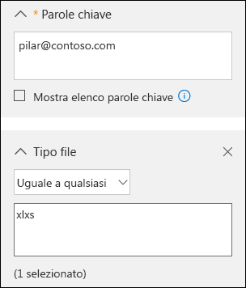
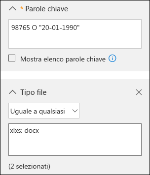
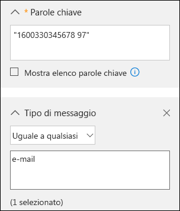

# <a name="office-365-data-subject-requests-for-the-gdpr-and-ccpa"></a>Richieste degli interessati per Office 365 nell'ambito del GDPR e del CCPA

## <a name="introduction-to-dsrs"></a>Introduzione alle richieste DSR

The European Union [General Data Protection Regulation (GDPR)](https://ec.europa.eu/justice/data-protection/reform/index_en.htm) gives rights to people (known in the regulation as *data subjects*) to manage the personal data that has been collected by an employer or other type of agency or organization (known as the *data controller* or just *controller*). Personal data is defined broadly under the GDPR as any data that relates to an identified or identifiable natural person. The GDPR gives data subjects specific rights to their personal data; these rights include obtaining copies of it, requesting changes to it, restricting the processing of it, deleting it, or receiving it in an electronic format so it can be moved to another controller. A formal request by a data subject to a controller to take an action on their personal data is called a *Data Subject Request* or DSR. The controller is obligated to promptly consider each DSR and provide a substantive response either by taking the requested action or by providing an explanation for why the DSR cannot be accommodated by the controller. A controller should consult with its own legal or compliance advisers regarding the proper disposition of any given DSR.

Analogamente, il California Consumer Privacy Act (CCPA) fornisce obblighi e diritti in materia di privacy per i consumatori della California, inclusi diritti simili ai diritti dell'interessato del GDPR, ad esempio il diritto di eliminare, ricevere e accedere alle informazioni personali (portabilità). Nell'ambito dei diritti che i consumatori possono esercitare, il CCPA prevede inoltre l'obbligo per determinate divulgazioni, di protezioni contro la discriminazione e requisiti di consenso o rifiuto esplicito per alcuni trasferimenti di dati classificati come "vendite". In generale, la definizione di vendite include la condivisione di dati a titolo oneroso. Per altre informazioni sul CCPA, vedere il [California Consumer Privacy Act](offering-ccpa.md) e le [Domande frequenti sul California Consumer Privacy Act](ccpa-faq.md).

Questa guida descrive come usare i prodotti, i servizi e gli strumenti amministrativi di Office 365 per individuare i dati personali o le informazioni personali ed effettuare operazioni su di essi per rispondere alle richieste degli interessati. In particolare, spiega come reperire i dati o le informazioni personali che si trovano nel cloud di Microsoft, nonché come accedervi e agire su di essi. Ecco una rapida panoramica dei processi descritti in questa guida:

- **Individuazione:** usare gli strumenti di ricerca per trovare più facilmente i dati del cliente che possono essere oggetto di una richiesta dell’interessato. Dopo aver raccolto i documenti potenzialmente rilevanti, è possibile eseguire una o più delle azioni DSR descritte nei passaggi seguenti per rispondere alla richiesta del soggetto interessato. In alternativa, è possibile stabilire che la richiesta non soddisfa le linee guida della propria organizzazione in merito alla risposta alle richieste dell'interessato.
- **Accesso:** recuperare i dati personali che risiedono nel cloud Microsoft e, se richiesto, crearne una copia che può essere disponibile per l'interessato.
- **Rettificare:** apportare modifiche o implementare le azioni richieste sui dati personali, ove applicabile.
- **Limitare**: limitare il trattamento dei dati personali, rimuovendo le licenze per vari servizi cloud Microsoft o disattivando i servizi desiderati, dove possibile. È anche possibile rimuovere i dati dal cloud di Microsoft e conservarli in locale o in un'altra posizione.
- **Eliminare:** rimuovere in modo definitivo i dati personali che risiedono nel cloud Microsoft.
- **Esportare/ricevere (portabilità):** fornire all'interessato una copia elettronica dei dati o delle informazioni personali in un formato leggibile in modo automatizzato. Secondo il CCPA, le informazioni personali sono qualsiasi informazione riguardante una persona fisica identificata o identificabile. Non esiste distinzione tra i ruoli privati, pubblici o professionali di una persona. Il termine definito "informazioni personali" combacia con il termine "dati personali" del GDPR. Tuttavia, il CCPA include anche i dati relativi alla famiglia e al nucleo familiare. Per altre informazioni sul CCPA, vedere il [California Consumer Privacy Act](offering-ccpa.md) e le [Domande frequenti sul California Consumer Privacy Act](ccpa-faq.md).

### <a name="terminology"></a>Terminologia

Di seguito vengono fornite le definizioni dei termini del GDPR importanti per la presente guida.

- **Titolare:** la persona fisica o giuridica, l'autorità pubblica, l'agenzia o altro ente che, autonomamente o unitamente ad altri soggetti, determina gli obiettivi e i mezzi del trattamento dei dati personali; laddove gli obiettivi e i mezzi di tale trattamento sono determinati da una normativa europea o di uno specifico Stato membro dell'UE, il titolare del trattamento dei dati o i criteri specifici per la sua designazione potrebbero essere forniti da tale normativa europea o di uno specifico Stato membro dell'UE.
- **Dati personali e interessato:** tutte le informazioni concernenti una persona fisica identificata o identificabile ("interessato"). Una persona fisica è identificabile se può essere identificata, direttamente o indirettamente, in particolare facendo riferimento a un identificatore (ad esempio un nome, un numero di identificazione, dati di posizione o un identificatore online) o a uno o più fattori relativi all'identità fisica, fisiologica, genetica, mentale, economica, culturale o sociale di tale persona fisica.
- **Responsabile:** una persona fisica o giuridica, un'autorità pubblica o altro ente che si occupa del trattamento dei dati personali per conto del titolare.
- **Dati del cliente:** tutti i dati, compresi file di testo, audio, video o immagini e software, forniti a Microsoft dal cliente o per suo conto attraverso i servizi aziendali. I dati dei clienti includono (1) informazioni che consentono l'identificazione personale degli utenti finali (ad esempio, nomi utente e informazioni di contatto in Azure Active Directory) e contenuti per i clienti che un cliente stesso carica o crea in servizi specifici (ad esempio, contenuti per i clienti in un documento di Word o Excel oppure nel testo di un messaggio di posta elettronica di Exchange Online; contenuti per i clienti aggiunti a un sito di SharePoint Online oppure salvati in un account di OneDrive for Business).
- **Log generati dal sistema:** i log e i dati correlati generati da Microsoft che consentono a Microsoft di offrire servizi aziendali agli utenti. I log generati dal sistema contengono principalmente dati associati a pseudonimi come gli identificatori univoci, cioè numeri generati dal sistema. In genere un identificatore univoco non è sufficiente per identificare una persona ma viene usato per fornire servizi aziendali agli utenti. I log generati dal sistema possono anche contenere informazioni identificabili riguardanti gli utenti finali, ad esempio un nome utente.

### <a name="how-to-use-this-guide"></a>Come usare questa guida

Per agevolare l'individuazione delle informazioni rilevanti per il proprio caso d'uso, questa guida è divisa in quattro parti.

- **[Parte 1. Risposta a richieste DSR per i dati del cliente](#part-1-responding-to-dsrs-for-customer-data):** i *dati del cliente* vengono creati e archiviati in Office 365 nelle operazioni quotidiane dell'azienda. Esempi delle applicazioni di Office 365 più comuni che consentono di creare dati sono Word, Excel, PowerPoint, Outlook e OneNote. Office 365 è inoltre costituito da applicazioni come SharePoint Online, Teams e Forms che consentono una migliore collaborazione con altri utenti. La Parte 1 di questa guida descrive il modo in cui è possibile individuare, accedere, rettificare, restringere, eliminare ed esportare dati dalle applicazioni di Office 365 che sono state usate per creare e archiviare dati nei servizi online di Office 365. Si rivolge a prodotti e servizi per i quali Microsoft funge da responsabile del trattamento dei dati per l'organizzazione, pertanto la funzionalità DSR viene resa disponibile all'amministratore del tenant.
- **[Parte 2. Risposta alle DSR in merito alle informazioni dettagliate generate da Office 365](#part-2-responding-to-dsrs-with-respect-to-insights-generated-by-office-365):** Office 365 fornisce alcune informazioni tramite servizi come Delve, MyAnalytics e Workplace Analytics. La Parte 2 di questa guida illustra il modo in cui queste informazioni vengono generate e come rispondere alle DSR correlate.
- **[Parte 3. Risposta alle richieste DSR per log generati dal sistema](#part-3-responding-to-dsrs-for-system-generated-logs):** quando si usano i servizi aziendali di Office 365, Microsoft genera alcune informazioni come i log di servizio che registrano l'utilizzo o le prestazioni delle funzionalità nei servizi online. La maggior parte dei dati generati dal servizio contiene identificatori pseudonimi generati da Microsoft, quindi nel documento si fa riferimento a questa categoria come *log generati dal sistema*. Anche se questi dati non possono essere attribuiti a un interessato specifico senza l'uso di informazioni aggiuntive, alcuni possono rientrare nella definizione generale del GDPR di "dati personali". La Parte 3 di questa guida illustra come accedere, eliminare ed esportare log generati dal sistema.
- **[Parte 4. Risorse aggiuntive di supporto per le DSR](#part-4-additional-resources-to-assist-you-with-dsrs):** la Parte 4 di questa guida elenca gli scenari limitati in cui Microsoft è il titolare del trattamento quando vengono usati determinati prodotti e servizi di Office 365.

>[!NOTE]
>In most cases, when users in your organization use Microsoft Office 365 products and services, you are the data controller and Microsoft is the processor. As a data controller, you are responsible for responding to the data subject directly. To assist you with this, Parts 1-3 of this guide detail the technical capabilities available to your organization to respond to a DSR request. In some limited scenarios, however, Microsoft will be the data controller when people use certain Office 365 products and services. In these cases, the information in Part 4 provides guidance on how data subjects can submit DSR requests to Microsoft.

### <a name="office-365-national-clouds"></a>Cloud nazionali di Office 365

The Microsoft Office 365 services are also available in the following national cloud environments: [Office 365 Germany](https://docs.microsoft.com/microsoft-365/admin/admin-overview/learn-about-office-365-germany), [Office 365 operated by 21Vianet (China)](https://docs.microsoft.com/microsoft-365/admin/services-in-china/services-in-china), and [Office 365 US Government](https://www.microsoft.com/microsoft-365/government/compare-office-365-government-plans). Most of the guidance for managing data subject requests described in this document applies to these national cloud environments. However, due to the isolated nature of these environments, there are some exceptions. Where notable for a given subsection, these exceptions are called out in a corresponding note.

### <a name="hybrid-deployments"></a>Distribuzioni ibride

Your organization may consist of Microsoft offerings that are a combination of cloud-based services and on-premises server products. In general, a hybrid deployment is typically the sharing of user accounts (identity management) and resources (such as mailboxes, web sites, and data) that exist in the cloud and on-premises. Common hybrid scenarios include:

- Distribuzioni ibride di Exchange, dove alcuni utenti hanno cassette postali in locale e altri utenti hanno cassette postali di Exchange Online.
- Distribuzioni ibride di SharePoint, dove server del sito e file server sono in locale e gli account di OneDrive for Business sono in Office 365.
- Il sistema di gestione delle identità in locale (Active Directory) sincronizzato con Azure Activity Directory, che è il servizio directory sottostante in Office 365.

When responding to a DSR request, you may have to determine if data that's responsive to a DSR request is in the Microsoft cloud or in your on-premise organization, and then take the appropriate steps to respond to that request. The Office 365 Data Subject Request Guide (this guide) provides guidance for responding to cloud-based data. For guidance for data in your on-premises organization, see [GDPR for Office on-premises Servers](https://docs.microsoft.com/Office365/Enterprise/gdpr-for-office-servers).

## <a name="part-1-responding-to-dsrs-for-customer-data"></a>Parte 1. Risposta a richieste DSR per i dati del cliente

Le indicazioni per rispondere alle richieste DSR per i dati del cliente si dividono nelle quattro sezioni seguenti:

- [Utilizzo dello strumento Ricerca contenuto di eDiscovery per rispondere alle richieste DSR](#using-the-content-search-ediscovery-tool-to-respond-to-dsrs)
- [Utilizzo della funzionalità in-app per rispondere alle richieste DSR](#using-in-app-functionality-to-respond-to-dsrs)
- [Risposta alle richieste di rettifica DSR](#responding-to-dsr-rectification-requests)
- [Risposta alle richieste di restrizione DSR](#responding-to-dsr-restriction-requests)

### <a name="how-to-determine-the-office-365-applications-that-may-be-in-scope-for-a-dsr-for-customer-data"></a>Come determinare le applicazioni di Office 365 che potrebbero rientrare nell'ambito di una DSR per i dati dei clienti

Per determinare dove cercare i dati personali o cosa cercare, è utile identificare le applicazioni di Office 365 che gli utenti dell'organizzazione possono usare per creare e archiviare i dati in Office 365. Sapere questo circoscrive le applicazioni di Office 365 che rientrano nell'ambito di una DSR e aiuta a determinare come cercare e accedere ai dati personali correlati a una DSR. In particolare, questo significa che è possibile usare lo strumento Ricerca Contenuto o, se è necessario, la funzionalità integrata dell'applicazione in cui sono stati creati i dati.

A quick way to identify the Office 365 applications that people in your organization are using to create Customer Data is to determine which applications are included in your organization's Microsoft 365 for business subscription. To do this, you can access user accounts in the Office 365 admin portal and look at the product licensing information. See [Assign licenses to users](../admin/manage/assign-licenses-to-users.md).

## <a name="using-the-content-search-ediscovery-tool-to-respond-to-dsrs"></a>Utilizzo dello strumento Ricerca contenuto di eDiscovery per rispondere alle richieste DSR

When looking for personal data within the larger set of data your organization creates and stores using in Office 365, you may want to first consider which applications people have most likely used to author the data you're looking for. Microsoft estimates that over 90% of an organization's data that is stored in Office 365 is authored in Word, Excel, PowerPoint, OneNote, and Outlook. Documents authored in these Office applications, even if purchased through Microsoft 365 Apps for enterprise or an Office perpetual license, are most likely stored on a SharePoint Online site, in a user's OneDrive for Business account, or in a user's Exchange Online mailbox. That means you can use the Content Search eDiscovery tool to search (and perform other DSR-related actions) across SharePoint Online sites, OneDrive for Business accounts, and Exchange Online mailboxes (including the sites and mailboxes associated with Microsoft 365 Groups, Microsoft Teams, EDU Assignments) to find documents and mailbox items that may be relevant to the DSR you're investigating. You can also use the Content Search tool to discover Customer Data authored in other Office 365 applications.

Nella tabella seguente sono elencate le applicazioni di Office 365 che gli utenti usano per creare contenuti creati dai clienti e che possono essere individuati con Ricerca Contenuto. In questa sezione della Guida DSR sono disponibili informazioni su come individuare, accedere, esportare ed eliminare i dati creati con le applicazioni di Office 365.

***Tabella 1. Applicazioni in cui è possibile usare Ricerca contenuto per trovare i dati dei clienti***

| | |
| :---: | :---:|
 <br> Calendario |  <br> SharePoint  |
|  <br> Excel |  <br> Skype for Business |
|  <br> Office Lens |  <br> Attività |
|  <br> OneDrive for Business | <br> Teams |
|  <br> OneNote|  <br> Da fare |
|  <br> Outlook/Exchange |  <br> Video |
|  <br> Persone |  <br> Visio |
|  <br> PowerPoint |  <br> Word
||

>[!NOTE]
>The Content Search eDiscovery tool is not available in [Office 365 operated by 21Vianet (China)](https://docs.microsoft.com/microsoft-365/admin/services-in-china/services-in-china). This means you won't able to use this tool to search for and export Customer Data in the Office 365 applications shown in Table 1. However, you can use the In-Place eDiscovery tool in Exchange Online to search for content in user mailboxes. You can also use the eDiscovery Center in SharePoint Online to search for content in SharePoint sites and OneDrive accounts. Alternatively, you can ask a document owner to help you find and make changes or deletions to content or export it if necessary. For more information, see:</br><br> * [Creazione di una ricerca eDiscovery sul posto](https://docs.microsoft.com/exchange/create-in-place-ediscovery-search-exchange-2013-help)<br> * [Configurare un Centro eDiscovery in SharePoint Online](https://support.office.com/article/Set-up-an-eDiscovery-Center-in-SharePoint-Online-A18F8975-AA7F-43B4-A7D6-001D14744D8E)

### <a name="using-content-search-to-find-personal-data"></a>Usare Ricerca contenuto per trovare dati personali

Il primo passaggio per rispondere a un DSR consiste nell'individuare i dati personali oggetto del DSR. Questa fase consiste nell'usare gli strumenti di eDiscovery di Office 365 per cercare dati personali tra tutti quelli della propria organizzazione in Office 365 o passare direttamente all'applicazione nativa in cui sono stati creati i dati. Questo primo passaggio, che consente nell’individuare ed esaminare i dati personali in questione, consente di determinare se un DSR soddisfa i requisiti dell'organizzazione per rispettare o rifiutare una richiesta dei diritti dell’interessato. Dopo avere individuato e analizzato i dati personali in questione, ad esempio, si potrebbe stabilire che la richiesta non soddisfa i requisiti dell'organizzazione perché potrebbe ledere i diritti e le libertà altrui o perché i dati personali sono contenuti in un record aziendale che l'azienda intende legittimamente conservare.

As previously stated, Microsoft estimates that over 90% of an organization's data is created with Office applications, such as Word and Excel. This means that you can use the Content Search in the Security & Compliance Center to search for most DSR-related data.

This guide assumes that you or the person searching for personal data that may be responsive to a DSR request is familiar with or has experience using the Content Search tool in the Security & Compliance Center. For general guidance on using Content Search, see [Content Search in Office 365](https://docs.microsoft.com/microsoft-365/compliance/content-search). Be sure that the person running the searches has been assigned the necessary permissions in the Security & Compliance Center. This person should be added as a member of the eDiscovery Manager role group in the Security & Compliance Center; see [Assign eDiscovery permissions in the Security & Compliance Center](https://docs.microsoft.com/microsoft-365/compliance/assign-ediscovery-permissions). Consider adding other people in your organization who are involved in investigating DSRs to the eDiscovery Manager role group, so they can perform the necessary actions in the Content Search tool such as previewing and exporting search results. However, unless you set up compliance boundaries (as described [here](#set-up-compliance-boundaries-to-limit-the-scope-of-content-searches)) be aware that an eDiscovery Manager can search all content locations in your organization, including ones that may not be related to a DSR investigation.

Dopo avere trovato i dati, è quindi possibile eseguire un'azione specifica per soddisfare la richiesta da parte dell'interessato.

>[!NOTE]
>In Office 365 Germany, il Centro sicurezza e conformità è situato in https://protection.office.de.

#### <a name="searching-content-locations"></a>Ricerca in percorsi di contenuti

Con lo strumento Ricerca contenuto è possibile cercare i tipi seguenti di percorsi di contenuti.

- Cassette postali di Exchange Online. Questo include le cassette postali associate a Gruppi di Microsoft 365 e Microsoft Teams
- Cartelle pubbliche di Exchange Online
- Siti SharePoint Online. Questo include i siti associati a Gruppi di Microsoft 365 e Microsoft Teams
- Account OneDrive for Business

>[!NOTE]
>This guide assumes that all data that might be relevant to a DSR investigation is stored in Office 365; in other words, stored in the Microsoft cloud. Data stored on a user's local computer or on-premises on your organization's file servers is outside the scope of a DSR investigation for data stored in Office 365. For guidance about responding to DSR requests for data in on-premises organizations, see [GDPR for Office on-premises Servers](https://docs.microsoft.com/Office365/Enterprise/gdpr-for-office-servers).

#### <a name="tips-for-searching-content-locations"></a>Suggerimenti sulla ricerca nei percorsi di contenuti

- Iniziare la ricerca di tutti i percorsi di contenuti nell'organizzazione (che è possibile cercare con una singola ricerca) per determinare rapidamente quali percorsi di contenuti contengono elementi corrispondenti alla query di ricerca. È quindi possibile eseguire di nuovo la ricerca e restringere l'ambito di ricerca alle posizioni specifiche che contengono elementi rilevanti.
- Use search statistics to identify the top locations that contain items that match your search query. See [View keyword statistics for Content Search results](https://docs.microsoft.com/microsoft-365/compliance/view-keyword-statistics-for-content-search).
- Eseguire ricerche nel log di controllo sulle attività recenti in file e cartelle eseguite dall'utente oggetto del DSR. La ricerca nel log di controllo restituisce un elenco di record di controllo che contiene il nome e la posizione delle risorse con cui l'utente ha interagito di recente. Potrebbe essere possibile usare queste informazioni per creare una query di ricerca contenuto. Vedere [Eseguire una ricerca nel log di controllo nel Centro sicurezza e conformità](https://docs.microsoft.com/microsoft-365/compliance/search-the-audit-log-in-security-and-compliance).

#### <a name="building-search-queries-to-find-personal-data"></a>Creare query di ricerca per trovare dati personali

La DSR che si sta analizzando contiene molto probabilmente degli identificatori che è possibile usare nella query di ricerca con parole chiave per cercare i dati personali. Ecco alcuni identificatori comuni che possono essere usati in una query di ricerca per trovare i dati personali:

- Indirizzo e-mail o alias
- Numero di telefono
- Indirizzo postale
- Numero ID dipendente
- Numero del documento di identità o versione europea di un codice fiscale

La richiesta DSR che si sta analizzando avrà probabilmente un identificatore e altri dettagli relativi ai dati personali oggetto della richiesta che è possibile usare in una query di ricerca.

Cercando solo un indirizzo di posta elettronica o un ID dipendente, probabilmente si otterranno molti risultati. Per restringere l'ambito della ricerca in modo che restituisca il contenuto più pertinente per il DSR, è possibile aggiungere delle condizioni alla query di ricerca. Quando si aggiunge una condizione, la parola chiave e una condizione di ricerca sono connesse logicamente dall'operatore booleano **AND**. Ciò significa che nei risultati della ricerca*entrambe* la parola chiave e la condizione compariranno nei risultati di ricerca.

The following table lists some conditions you can use to narrow the scope of a search. The table also lists the values that you can use for each condition to search for specific document types and mailbox items.

***Tabella 2. Restringere l'ambito della ricerca tramite l'uso di condizioni***

||||
| :--- | :--- |:--- |
|**Condizione**|**Descrizione** |**Esempio di valori della condizione**|
| Tipo di file | Estensione di un documento o di un file. Usare questa condizione per cercare documenti di Office e file creati con applicazioni di Office 365. Usare questa condizione per la ricerca di documenti in siti di SharePoint Online e account di OneDrive for Business.<br/>La proprietà del documento corrispondente è filetype. <br/>Per un elenco completo delle estensioni di file che è possibile cercare, vedere Estensioni di nomi di file e tipi di file analizzati sottoposti a ricerca per indicizzazione predefiniti in SharePoint](https://technet.microsoft.com/library/jj219530.aspx).|&nbsp;&bull;&nbsp;&nbsp;csv — Cerca file con valori delimitati da  virgole (CSV). I file di Excel possono essere salvati in formato CSV e i file CSV possono essere facilmente importati in Excel<br><br>&bull;&nbsp;&nbsp;docx — Cerca file di Word <br><br>&bull;&nbsp;&nbsp;mpp — Cerca file di Project<br/><br>&bull;&nbsp;&nbsp;one — Cerca file di OneNote <br><br>&bull;&nbsp;&nbsp;pdf — Cerca file salvati in formato PDF <br><br>&bull;&nbsp;&nbsp;pptx — Cerca file di PowerPoint <br><br>&bull;&nbsp;&nbsp;xlxs — Cerca file di Excel <br><br>&bull;&nbsp;&nbsp;vsd — Cerca file di Visio <br><br>&bull;&nbsp;&nbsp;wmv — Cerca file video di Windows Media <br>|
| Tipo di messaggio | Il tipo di messaggio di posta elettronica da cercare. Usare questa condizione per eseguire ricerche nelle cassette postali di contatti (persone), riunioni (Calendario di Outlook) o Conversazioni Skype for Business. La proprietà di posta elettronica corrispondente è*kind*.|&bull;&nbsp;&nbsp;*contacts — Cerca l’elenco Contatti (Persone) di una cassetta postale <br><br>&bull;&nbsp;&nbsp;* email — Cerca messaggi di posta elettronica. <br><br>&bull;&nbsp;&nbsp;*messaggi istantanei — consente di eseguire ricerche nelle conversazioni di Skype for Business<br><br>&bull;&nbsp;&nbsp;* riunioni — esegue ricerche di appuntamenti e convocazioni di riunione (Calendario di Outlook) <br><br>&bull;&nbsp;&nbsp;*tasks — Cerca l'elenco Attività (Attività); con questo valore vengono restituite anche le attività create in Microsoft To-Do.<br>|
| Tag di conformità |The label assigned to an email message or a document. Labels are used to classify email and documents for data governance and enforce retention rules based on the classification defined by the label. Use this condition to search for items that have been automatically or manually assigned a label.<br/>This is a useful condition for DSR investigations because your organization may be using labels to classify content related to data privacy or that contains personal data or sensitive information. See the "Using Content Search to find all content with a specific label applied to it" section in [Overview of labels in Office 365.](https://docs.microsoft.com/microsoft-365/compliance/labels)|compliancetag="personal data"|
||||

There are many more email and document properties and search conditions that you can use to build more complex search queries. See the following sections in the [Keyword queries and search conditions for Content Search](https://docs.microsoft.com/microsoft-365/compliance/keyword-queries-and-search-conditions) help topic for more information.

- [Proprietà di e-mail disponibili per la ricerca](https://docs.microsoft.com/microsoft-365/compliance/keyword-queries-and-search-conditions)
- [Proprietà (documento) di siti disponibili per la ricerca](https://docs.microsoft.com/microsoft-365/compliance/keyword-queries-and-search-conditions)
- [Condizioni di ricerca](https://docs.microsoft.com/microsoft-365/compliance/keyword-queries-and-search-conditions)

#### <a name="searching-for-personal-data-in-sharepoint-lists-discussions-and-forms"></a>Ricerca di dati personali negli elenchi, nelle discussioni e nei moduli di SharePoint

In addition to searching for personal data in documents, you can also use Content Search to search for other types of data that's created by using native SharePoint Online apps. This includes data created by using SharePoint lists, discussions, and forms. When you run a Content Search and search SharePoint Online sites (or OneDrive for Business accounts) data from lists, discussions, and forms that match the search criteria will be returned in the search results.

##### <a name="examples-of-search-queries"></a>Esempi di query di ricerca

Di seguito sono riportati alcuni esempi di query di ricerca che usano parole chiave e condizioni per cercare dati personali in risposta a un DSR. Gli esempi mostrano due versioni della query: una che mostra la sintassi della parola chiave (in cui è inclusa la condizione nella casella delle parole chiave) e una che mostra la versione basata su GUI della query con condizioni.

##### <a name="example-1"></a>Esempio 1

Questo esempio restituisce file di Excel, situati in siti di SharePoint Online e in account OneDrive for Business, che contengono l’indirizzo di posta elettronica specificato. Se l'indirizzo di posta elettronica viene visualizzato nei metadati dei file, è possibile che i file vengano restituiti.

***Sintassi della parola chiave***

```Query
pilar@contoso.com AND filetype="xlxs"
```

***GUI***



##### <a name="example-2"></a>Esempio 2

Questo esempio restituisce file di Word o di Excel, in siti di SharePoint Online e in account OneDrive for Business, che contengono l'ID dipendente specificato o la data di nascita specificata.

(98765 OR "01-20-1990") AND (filetype="xlxs" OR filetype="docx")

***GUI***



##### <a name="example-3"></a>Esempio 3

Questo esempio restituisce i messaggi e-mail che contengono il numero ID specificato, ovvero un numero di previdenza sociale francese (INSEE)

```Query
"1600330345678 97" AND kind="email"
```

***GUI***



#### <a name="working-with-partially-indexed-items-in-content-search"></a>Uso di elementi parzialmente indicizzati in Ricerca contenuto

Gli elementi indicizzati parzialmente, detti anche *elementi non indicizzati*, sono elementi e documenti di cassette postali di Exchange Online nei siti di SharePoint Online e OneDrive for Business che per qualche motivo non sono stati indicizzati per la ricerca, pertanto non sono ricercabili tramite Ricerca contenuto. La maggior parte dei messaggi di posta elettronica e i documenti del sito vengono indicizzati correttamente perché corrispondono ai [limiti di indicizzazione per Office 365.](https://docs.microsoft.com/microsoft-365/compliance/limits-for-content-search) I motivi per cui i messaggi di posta elettronica o i file non vengono indicizzati per la ricerca includono:

- Il tipo di file [non è riconosciuto o supportato per l'indicizzazione.](https://docs.microsoft.com/microsoft-365/compliance/partially-indexed-items-in-content-search) Nonostanyte il tipo di file sia supportato per l'indicizzazione si è verificato un errore di indicizzazione per un file specifico
- I messaggi e-mail hanno un file allegato senza un gestore valido, ad esempio un file immagine (che rappresenta la causa più comune di elementi di e-mail parzialmente indicizzati).
- I file allegati ai messaggi e-mail sono troppo grandi o troppo numerosi.

We recommend that you learn more about partially indexed items so that you can work with them when responding to DSR requests. For more information, see:

- [Partially indexed items in Content Search in Office 365](https://docs.microsoft.com/microsoft-365/compliance/partially-indexed-items-in-content-search) (Elementi parzialmente indicizzati in Ricerca contenuto in Office 365)
- [Investigating partially indexed items in Office 365 eDiscovery](https://docs.microsoft.com/microsoft-365/compliance/investigating-partially-indexed-items-in-ediscovery) (Analisi di elementi parzialmente indicizzati in eDiscovery di Office 365)
- [Exporting unindexed items](export-search-results.md) (Esportazione di elementi non indicizzati)

#### <a name="tips-for-working-with-partially-indexed-items"></a>Suggerimenti su come usare gli elementi parzialmente indicizzati

It's possible that data responsive to a DSR investigation may be in a partially indexed item. Here's some suggestions for working with partially indexed items:

- Dopo l'esecuzione di una ricerca, il numero di elementi parzialmente stimati viene visualizzato nelle statistiche di ricerca. Questa stima non include elementi parzialmente indicizzati in SharePoint Online e OneDrive for Business. Esportare i report per una ricerca di contenuto per ottenere informazioni sugli elementi parzialmente indicizzati. Il **report non indicizzato items.csv** contiene informazioni sugli elementi non indicizzati, inclusa la posizione dell'elemento, l'URL se l'elemento è in SharePoint Online o OneDrive for Business e la riga oggetto (per i messaggi) o il nome del documento. Per ulteriori informazioni, vedere [Esportare i risultati di Ricerca contenuto](https://docs.microsoft.com/microsoft-365/compliance/export-a-content-search-report).

- Le statistiche e l'elenco degli elementi parzialmente indicizzati restituiti con i risultati di una Ricerca contenuto sono tutti gli elementi parziali dei percorsi di contenuto in cui è stata effettuata la ricerca.

- Per recuperare gli elementi parzialmente indicizzati potenzialmente utili per un'indagine DSR, è possibile eseguire una delle operazioni seguenti:

##### <a name="export-all-partially-indexed-items"></a>Esportare tutti gli elementi parzialmente indicizzati

Si esportano i risultati di una ricerca contenuto e degli elementi parzialmente indicizzati dal percorso di contenuto in cui sono state eseguite ricerche. È anche possibile esportare solo gli elementi indicizzati parzialmente. È quindi possibile aprirle nell'applicazione nativa ed esaminare il contenuto. È necessario usare questa opzione per esportare gli elementi di SharePoint Online e OneDrive for Business. Vedere [Esportare i risultati di Ricerca contenuto dal Centro sicurezza e conformità](export-search-results.md).

##### <a name="export-a-specific-set-of-partially-indexed-items-from-mailboxes"></a>Esportare un set specifico di elementi parzialmente indicizzati dalle cassette postali

Anziché esportare tutti gli elementi delle cassette postali indicizzate parzialmente da una ricerca, è possibile rieseguire una ricerca contenuto per cercare un elenco specifico di elementi parzialmente indicizzati e quindi esportarli. È possibile eseguire questa operazione solo per gli elementi della cassetta postale. Vedere [Preparare un file CSV per una ricerca di contenuto mirata in Office 365](https://docs.microsoft.com/microsoft-365/compliance/csv-file-for-an-id-list-content-search).

### <a name="next-steps"></a>Passaggi successivi

Dopo aver trovato i dati personali pertinenti per il DSR, assicurarsi di mantenere la ricerca contenuto specifica usata per trovare i dati. È probabile che la ricerca venga riutilizzata per eseguire altri passaggi nel processo di risposta DSR, come [ ottenerne una copia](#providing-a-copy-of-personal-data),[esportarla](#exporting-personal-data) o [eliminarla definitivamente](#deleting-personal-data).

### <a name="additional-considerations-for-selected-applications"></a>Considerazioni aggiuntive sulle applicazioni selezionate

Le sezioni seguenti descrivono aspetti da tenere in considerazione quando si cercano dati nelle applicazioni di Office 365 seguenti.

- [Office Lens](#office-lens)
- [Impostazioni degli ambienti OneDrive for Business e SharePoint](#onedrive-for-business-and-sharepoint-online-experience-settings)
- [Microsoft Teams per l'istruzione](#microsoft-teams-for-education)
- [Microsoft To Do](#microsoft-to-do)
- [Skype for Business](#skype-for-business)

#### <a name="office-lens"></a>Office Lens

Una persona che usa Office Lens (un'app di fotocamera supportata da dispositivi con iOS, Android e Windows) può scattare una foto di lavagne, documenti cartacei, biglietti da visita e altri elementi che contengono molto testo. Office Lens usa la tecnologia Optical Character Recognition, che estrae il testo di un'immagine e la Salva in un documento di Office, come Word, PowerPoint e OneNote, o in un file PDF. Gli utenti possono quindi caricare il file che contiene il testo dell'immagine nell'account di OneDrive for Business in Office 365. Ciò significa che è possibile usare lo strumento ricerca contenuto per cercare, accedere, eliminare ed esportare dati nei file creati da un'immagine di Office Lens. Per altre informazioni su Office Lens, vedere:

- [Office Lens per iOS](https://support.microsoft.com/it-IT/office/microsoft-office-lens-for-ios-fbdca5f4-1b1b-4391-a931-dc1c2582397b)
- [Office Lens per Android](https://support.office.com/article/Office-Lens-for-Android-ec124207-0049-4201-afaf-b5874a8e6f2b)
- [Office Lens per Windows](https://support.microsoft.com/it-IT/office/office-lens-for-windows-577ec09d-8da2-4029-8bb7-12f8114f472a)

#### <a name="onedrive-for-business-and-sharepoint-online-experience-settings"></a>Impostazioni degli ambienti OneDrive for Business e SharePoint

In addition to user-created files stored in OneDrive for Business accounts and SharePoint Online sites, these services store information about the user that is used to enable various experiences. Users still in your organization can access much of this information by using in-product functionality. The following information provides guidance on how to access, view, and export OneDrive for Business and SharePoint Online application data.

##### <a name="sharepoint-user-profiles"></a>Profili utente di SharePoint

Il profilo Delve consente agli utenti di mantenere le proprietà archiviate nel profilo utente di SharePoint Online, tra cui data di nascita, numero di cellulare (e altre informazioni di contatto), informazioni personali, progetti, competenze ed esperienze, studi e istruzione, interessi e hobby.

###### <a name="end-users"></a>Utenti finali

End users can discover, access, and rectify SharePoint Online user profile data using the Delve profile experience. See [View and update your profile in Office Delve](https://support.office.com/article/view-and-update-your-profile-in-office-delve-4e84343b-eedf-45a1-aeb9-8627ccca14ba) for more details.

Un altro modo per gli utenti di accedere ai dati del proprio profilo SharePoint è quello di andare alla pagina di **modifica del profilo** nel proprio account OneDrive for Business, a cui si può accedere dal percorso **EditProfile.aspx** nell'URL dell'account OneDrive for Business. Per un utente <strong>user1@contoso.com</strong>, ad esempio, l'account di OneDrive for Business dell'utente è disponibile in:

```URL
`https://contoso-my.sharepoint.com/personal/user1\_contoso\_com/\_layouts/15/OneDrive.aspx`
```

L'URL della pagina di modifica del profilo è:

```URL
`https://contoso-my.sharepoint.com/personal/user1\_contoso\_com/\_layouts/15/EditProfile.aspx`
```

Le proprietà con origine in Azure Active Directory non possono essere modificate in SharePoint Online. Tuttavia, gli utenti possono accedere alla pagina dell' **account personale** selezionando la propria **foto** nell'intestazione di Office 365, quindi selezionando **account personale**. Se si modificano le proprietà, è possibile che gli utenti possano collaborare con gli amministratori per individuare, accedere o rettificare una proprietà del profilo utente.

###### <a name="admins"></a>Amministratori

Un amministratore può accedere e rettificare le proprietà del profilo nell'interfaccia di amministrazione di SharePoint. Nell’**interfaccia di amministrazione di SharePoint**, fare clic sulla scheda **profili utente**. Fare clic su**Gestisci profili utente**, immettere il nome di un utente e fare clic su **Trova**. L’amministratore può fare clic con il pulsante destro del mouse e scegliere **Modifica profilo personale**. Le proprietà con origine in Azure Active Directory non possono essere modificate in SharePoint Online.

An admin can export all User Profile properties for a user by using the **Export-SPOUserProfile** cmdlet in SharePoint Online PowerShell. See  [Export-SPOUserProfile](https://docs.microsoft.com/powershell/module/sharepoint-online/export-spouserprofile?view=sharepoint-ps).

Per ulteriori informazioni sui profili utente, vedere [Gestire i profili utente nell'interfaccia di amministrazione di SharePoint](https://docs.microsoft.com/sharepoint/manage-user-profiles).

##### <a name="user-information-list-on-sharepoint-online-sites"></a>Elenco Informazioni utente nei siti di SharePoint Online

Un sottoinsieme del profilo utente di SharePoint di un utente viene sincronizzato con l'elenco di informazioni utente di tutti i siti di visitati o di cui si dispone delle autorizzazioni di accesso. Questa operazione viene usata dalle esperienze di SharePoint Online, ad esempio le colonne di persone nelle raccolte documenti, per visualizzare le informazioni di base sull'utente, ad esempio il nome dell'autore di un documento. I dati contenuti in un elenco di informazioni utente corrispondono alle informazioni archiviate nel profilo utente di SharePoint e verranno automaticamente rettificate se l'origine viene cambiata. Per gli utenti eliminati, questi dati rimangono nei siti con cui hanno interagito per l'integrità referenziale dei campi colonna di SharePoint. 

Admins can control which properties are replicable inside the SharePoint admin center. To do this:

1. Accedere all'**interfaccia di amministrazione di SharePoint** e fare clic sulla scheda **Profili utente**.
2. Fare clic su **Gestisci proprietà utente** per visualizzare un elenco di proprietà.
3. Fare clic con il pulsante destro del mouse su una proprietà qualsiasi, selezionare **Modifica** e modificare le varie impostazioni.
4. In **Impostazioni criteri** la proprietà replicabile controlla se la proprietà verrà rappresentata o meno nell'elenco Informazioni utente. Non tutte le proprietà supportano questa impostazione.

An admin can export all User information properties for a user on a given site by using the **Export-SPOUserInfo** cmdlet in SharePoint Online PowerShell. See [Export-SPOUserInfo](https://docs.microsoft.com/powershell/module/sharepoint-online/export-spouserinfo?view=sharepoint-ps).

##### <a name="onedrive-for-business-experience-settings"></a>Impostazioni dell'ambiente OneDrive for Business

A user's OneDrive for Business experience stores information to help the user find and navigate content of interest to them. Most of this information can be accessed by end users using in-product features. An admin can export the information using a [PowerShell Script](https://docs.microsoft.com/powershell/scripting/overview) and [SharePoint Client-Side Object Model (CSOM)](https://docs.microsoft.com/sharepoint/dev/sp-add-ins/complete-basic-operations-using-sharepoint-client-library-code) commands.

Vedere [Esportare le impostazioni di esperienza OneDrive for Business](https://docs.microsoft.com/sharepoint/export-odfb-lists) per ulteriori informazioni sulle impostazioni, su come vengono memorizzate e su come esportarle.

##### <a name="onedrive-for-business-and-sharepoint-online-search"></a>Ricerca in OneDrive for Business e SharePoint Online

The in-app search experience in OneDrive for Business and SharePoint Online stores a user's search queries for 30 days to increase relevance of search results. An admin can export search queries for a user by using the **Export-SPOQueryLogs** cmdlet in SharePoint Online PowerShell. See [Export-SPOQueryLogs](https://docs.microsoft.com/powershell/module/sharepoint-online/export-spoquerylogs?view=sharepoint-ps).

#### <a name="microsoft-teams-for-education"></a>Microsoft Teams per l'istruzione

Microsoft Teams for Education offers two additional collaboration features that teachers and students can use that creates and stores personal data: Assignments and OneNote Class Notebook. You can use Content Search to discover data in both.

##### <a name="assignments"></a>Attività

Students files associated with an Assignment are stored in a document library in the corresponding Teams SharePoint Online site. IT admins can use the Content Search tool to search for student files that are related to assignments. For example, an admin could search all SharePoint Online sites in the organization and use the student's name and class or assignment name in the search query to find data relevant to a DSR.

There's other data related to Assignments that isn't stored in the class team SharePoint Online site, which means it's not discoverable with Content Search. This includes:

- I file che l'insegnante assegna agli studenti nell'ambito dell'attività
- I voti degli studenti e i commenti dell'insegnante
- L'elenco di documenti inviati per un'attività da ogni studente
- Metadati di un'attività

Per questo tipo di dati, un amministratore IT o il proprietario dei dati (ad esempio un insegnante) potrebbe dover accedere all'attività nel team di classe per trovare i dati rilevanti per la richiesta DSR.

##### <a name="onenote-class-notebook"></a>Blocco appunti di OneNote per la classe

The OneNote Class Notebook is stored in the class team SharePoint Online site. Every student in a class has a private notebook that's shared with the teacher. There's also a content library where a teacher can share documents with students, and a collaboration space for all students in the class. Data related to these capabilities is discoverable with Content Search.

Ecco le indicazioni specifiche per eseguire la ricerca di un blocco appunti della classe.

1. Eseguire una Ricerca contenuto usando i criteri di ricerca seguenti:

   - Cercare tutti i siti di SharePoint Online

   - Includere il nome del team di classe come parola chiave di ricerca, ad esempio, "9C Biology".

2. Visualizzare in anteprima i risultati della ricerca per individuare l'elemento corrispondente al blocco appunti della classe.
3. Select that item, and then copy the folder path that's displayed in the details pane. This is the root folder for the Class Notebook.
4. Edit the search that you created in step 1 and replace the class name in the keyword query with the folder path of the Class Notebook and precede the folder path with the **path** site property; for example, **path:"<https://contosoedu.onmicrosoft.com/sites/9C> Biology/SiteAssets/9C Biology Notebook/"**. Be sure to include the quotation marks and the trailing forward slash.
5. Aggiungere una condizione di ricerca e selezionare la condizione Tipo di file e usarne una per il valore del tipo di file. I file di OneNote vengono restituiti nei risultati della ricerca. La sintassi della parola chiave risultante avrà un aspetto simile al seguente:[](#building-search-queries-to-find-personal-data)

    ```Query
   path:"<https://contosoedu.onmicrosoft.com/sites/9C> Biology/SiteAssets/9C Biology Notebook/" AND filetype="one"
   ```

6.  Eseguire di nuovo la Ricerca contenuto. Nei risultati della ricerca dovrebbero essere inclusi tutti i file di OneNote per il blocco appunti per la classe del team di classe.

#### <a name="microsoft-to-do"></a>Microsoft To Do

Le *attività*, che vengono salvate in *elenchi attività*, in Microsoft To Do vengono salvate come attività nella cassetta postale di Exchange Online di un utente. Ciò significa che è possibile usare lo strumento ricerca contenuto per cercare, accedere, eliminare ed esportare le attività. Per altre informazioni, vedere [Configurare Microsoft To Do](https://support.microsoft.com/it-IT/office/set-up-microsoft-to-do-490c1a8c-2333-4952-8125-841afadb9620).

#### <a name="skype-for-business"></a>Skype for Business

Ecco alcune informazioni aggiuntive su come accedere, visualizzare ed esportare i dati personali in Skype for Business.

- Files attached to a meeting are retained in the actual meeting for 180 days and then become inaccessible. These files can be accessed by meeting participants by joining the meeting from the meeting request and then viewing or downloading the attached file. See the "Use the attachments in the meeting" section in [Preload attachments for a Skype for Business meeting](https://support.microsoft.com/it-IT/office/preload-attachments-for-a-skype-for-business-meeting-fd3d9f9d-b448-4754-b813-02e49393f251).
- Conversations in Skype for Business are retained in the Conversation History folder in user mailboxes. You can use Content Search to search mailboxes for data in Skype conversations.
- A data subject can export their contacts in Skype for Business. To do this, they would right-click a contact group in Skype for Business and click **Copy**. Then they can paste the list of email addresses into a text or Word document.
- If the Exchange Online mailbox of a meeting participant is placed on Litigation Hold or assigned to an Office 365 retention policy, files attached to a meeting are retained in the participants mailbox. You can use Content Search to search for those files in the participant's mailbox if the retention period for the file has not expired. For more information about retaining files, see [Retaining large files attached to a Skype for Business meeting](https://docs.microsoft.com/skypeforbusiness/set-up-policies-in-your-organization/retaining-large-files-attached-to-a-meeting).

## <a name="providing-a-copy-of-personal-data"></a>Creazione di una copia dei dati personali

After you've found personal data that is potentially responsive to a DSR, it's up to you and your organization to decide which data to provide the data subject. For example, you can provide them with a copy of the actual document, an appropriately redacted version, or a screenshot of the portions that you've deemed appropriate to share. For each of these responses to an access request, you'll have to retrieve a copy of the document or other item that contains the responsive data.

Quando si invia una copia all'interessato, potrebbe essere necessario rimuovere o redigere informazioni personali su altri interessati ed eventuali informazioni riservate.

### <a name="using-content-search-to-get-a-copy-of-personal-data"></a>Usare Ricerca contenuto per ottenere una copia dei dati personali

Esistono due modi per usare lo strumento Ricerca contenuto per ottenere una copia di un documento o di un elemento di cassetta postale individuato tramite una ricerca.

- Preview the search results and then download a copy of the document or item. This is a good way to download a few items or files.
- Esportare i risultati della ricerca e quindi scaricare una copia di tutti gli elementi restituiti dalla ricerca. Questo metodo è più complesso, ma è molto utile per scaricare grandi quantità di elementi rilevanti per la richiesta DSR. Nell'esportazione dei risultati della ricerca sono inclusi anche report utili. È possibile usare questi report per ottenere altre informazioni su ogni elemento. Il **report results.csv** è utile perché contiene molte informazioni sugli elementi esportati, come la posizione esatta dell'elemento (ad esempio la cassetta postale per i messaggi di posta elettronica o l'URL di documenti o elenchi nei siti di SharePoint online e OneDrive for Business). Queste informazioni consentono di identificare il proprietario dell'elemento, nel caso in cui sia necessario contattarlo durante il processo di indagine DSR. Per altre informazioni sulle relazioni incluse quando si esportano i risultati della ricerca, vedere [Esportare un report di ricerca contenuto.](https://docs.microsoft.com/microsoft-365/compliance/export-a-content-search-report)

#### <a name="preview-and-download-items"></a>Visualizzare in anteprima gli elementi e scaricarli

Dopo aver eseguito una nuova ricerca o aver aperto una ricerca esistente, è possibile visualizzare in anteprima ogni elemento che corrisponde alla query di ricerca per verificarne la pertinenza con la richiesta DSR su cui si sta lavorando. Include anche elenchi e pagine Web di SharePoint che vengono restituiti nei risultati della ricerca. È anche possibile scaricare il file originale, se è necessario fornirli all’interessato. In entrambi i casi, è possibile acquisire uno screenshot in modo da soddisfare la richiesta dell'interessato a ottenere le informazioni.

Alcuni tipi di elementi non possono essere visualizzati in anteprima. Se un tipo di elemento o di file non è supportato per l'anteprima, è possibile scaricare un singolo elemento nel computer locale o in un'unità di rete mappata o un altro percorso di rete. È possibile visualizzare in anteprima solo i[tipi di file supportati.](https://docs.microsoft.com/microsoft-365/compliance/content-search)

Per visualizzare in anteprima gli elementi e scaricarli:

1. Aprire Ricerca contenuto nel Centro sicurezza e conformità.
2. Se i risultati non vengono visualizzati, fare clic su **Anteprima risultati**.
3. Fare clic su un elemento per visualizzarlo.
4. Click **Download original file** to download the item to your local computer. You'll also have to download items that can't be previewed.

Per altre informazioni sulla visualizzazione in anteprima dei risultati della ricerca, vedere [Anteprima dei risultati della ricerca](https://docs.microsoft.com/microsoft-365/compliance/content-search).

#### <a name="export-and-download-items"></a>Esportare e scaricare gli elementi

You can also export the results of a content search to get a copy of email messages, documents, lists, and web pages containing the personal data, though this method is more involved than previewing items. See the next section for details about [exporting the results of a Content Search](#export-and-download-content-using-content-search).

## <a name="exporting-personal-data"></a>Esportazione dei dati personali

The "right of data portability" allows a data subject to request an electronic copy of personal data that's in a "structured, commonly used, machine-readable format", and to request that your organization transmit these electronic files to another data controller. Microsoft supports this right in two ways:

- Offrendo applicazioni di Office 365 che salvano i dati in un formato elettronico, comunemente usato, nativo e leggibile al computer. Per altre informazioni sui formati di file di Office, vedere [formati di file di Office - documenti tecnici](https://msdn.microsoft.com/library/office/cc313105(v=office.12).aspx).
- Consentendo all'organizzazione di esportare i dati nel formato di file nativo o in un formato (ad esempio CSV, TXT e JSON) che possa essere facilmente importato in un'altra applicazione.

Per soddisfare una richiesta di esportazione DSR, è possibile esportare i documenti di Office nel formato di file nativo ed esportare dati da altre applicazioni di Office 365.

### <a name="export-and-download-content-using-content-search"></a>Esportare e scaricare contenuto tramite Ricerca contenuto

When you export the results of a Content Search, email items can be downloaded as PST files or as individual messages (.msg files). When you export documents and lists from SharePoint Online and OneDrive for Business sites, copies in the native file formats are exported. For example, SharePoint lists are exported as CSV files and Web pages are exported as .aspx or html files.

>[!NOTE]
>L'esportazione di elementi della cassetta postale di un utente tramite Ricerca contenuto richiede che l'utente (proprietario della cassetta postale da cui si stanno esportando gli elementi) disponga di una licenza di Exchange Online piano 2. 

Per esportare e scaricare gli elementi:

1. Aprire Ricerca contenuto nel Centro sicurezza e conformità.
2. Nella pagina di ricerca a comparsa fare clic su  **Altro** e quindi su **Esporta risultati**. È possibile esportare anche un report.
3. Complete the sections on the **Export results** fly out page. Be sure to use the scroll bar to view all export options.
4. Tornare alla pagina Ricerca contenuto nel Centro sicurezza e conformità e fare clic sulla scheda **Esporta**.
5. Fare clic su **Aggiorna** per aggiornare la pagina.
6. Nella colonna**Nome** fare clic sul processo di esportazione creato.  Il nome del processo di esportazione è il nome della ricerca contenuto aggiunta all’ ** \_esportazione**.
7. Nella pagina esportazioni al volo, in**Chiave di esportazione**,**fare clic su copia negli Appunti**. Si userà questa chiave per scaricare i risultati della ricerca nel passaggio 10
8. Nella parte superiore della pagina a comparsa fare clic su  **Scarica risultati**.
9. Se viene chiesto di installare lo **strumento di esportazione di eDiscovery di Microsoft Office 365**, fare clic su **Installa**.
10. Nello **strumento di esportazione di eDiscovery** incollare nella casella appropriata la chiave di esportazione copiata nel passaggio 7.
11. Fare clic su **Sfoglia** per specificare il percorso in cui si desidera scaricare i file dei risultati della ricerca.
12. Fare clic su **Avvia** per scaricare i risultati della ricerca nel computer.

When the export process is complete, you can access the files in the location on your local computer where they were downloaded. Results of a content search are downloaded to a folder named after the Content Search. Documents from sites are copied to a subfolder named **SharePoint**. Mailbox items are copied to subfolder named **Exchange**.

Per le istruzioni dettagliate, vedere [Esportare i risultati di Ricerca contenuto dal Centro sicurezza e conformità](export-search-results.md).

### <a name="downloading-documents-and-lists-from-sharepoint-online-and-onedrive-for-business"></a>Download di documenti ed elenchi da SharePoint Online e OneDrive for Business

Another way to export data from SharePoint Online and OneDrive for Business is to download documents and lists directly from a SharePoint Online site or a OneDrive for Business account. You would have to get assigned the permissions to access a site, and then go to the site and download the contents. See:

- [Scaricare file e cartelle da OneDrive o SharePoint](https://support.office.com/article/download-files-and-folders-from-onedrive-or-sharepoint-5c7397b7-19c7-4893-84fe-d02e8fa5df05)
- [Esportare gli elenchi di SharePoint in Excel](https://support.office.com/article/export-to-excel-from-sharepoint-bfb2ea48-6118-4fa9-abb6-cced9424e5d9)

For some DSR export requests, you may want to allow the data subject to download content themselves. This enables the data subject to go to a SharePoint Online site or shared folder and click **Sync** to sync all contents in the document library or selected folders. See:

- [Consentire agli utenti di sincronizzare i file di SharePoint con il nuovo client di sincronizzazione di OneDrive](https://docs.microsoft.com/sharepoint/let-users-use-new-onedrive-sync-client)
- [Sincronizzare i file di SharePoint con il nuovo client di sincronizzazione di OneDrive](https://support.office.com/article/sync-sharepoint-files-with-the-new-onedrive-sync-client-6de9ede8-5b6e-4503-80b2-6190f3354a88)

## <a name="deleting-personal-data"></a>Eliminazione dei dati personali

Il "diritto alla cancellazione" con la rimozione dei dati personali dai dati dei clienti di un'organizzazione è una delle principali protezioni nel GDPR. La rimozione dei dati personali include l'eliminazione di interi documenti o file o l'eliminazione di dati specifici all'interno di un documento o di un file (che si rivela essere un'azione e un processo analogo a quelli descritti nella sezione di Rettifica di questa guida).

Durante l'analisi o la preparazione all'eliminazione di dati personali in risposta a una richiesta DSR, ecco alcuni aspetti importanti per capire come funziona l'eliminazione (o la conservazione) dei dati in Office 365.

- **Differenza tra eliminazione temporanea ed eliminazione definitiva:** nei servizi di Office 365 come Exchange Online, SharePoint Online e OneDrive for Business esistono i concetti di* eliminazione temporanea* e di *eliminazione definitiva*, che sono correlati alla recuperabilità di un elemento eliminato (in genere per un periodo limitato) prima che venga rimosso dal cloud Microsoft senza possibilità di ripristinarlo. In questo contesto, un elemento eliminato temporaneamente può essere recuperato da un utente e/o da un amministratore per un periodo di tempo limitato prima dell'eliminazione definitiva. Quando un elemento viene eliminato in modo definitivo, viene contrassegnato per la rimozione permanente e ripulito quando viene elaborato dal servizio di Office 365 corrispondente. Di seguito viene descritto il funzionamento dell'eliminazione temporanea e definitiva per gli elementi nelle cassette postali e nei siti, a prescindere che sia il proprietario dei dati o un amministratore a eseguire l'operazione:

    - **Cassette postali:** un elemento viene eliminato temporaneamente quando viene eliminato dalla cartella Posta eliminata o quando un utente lo elimina premendo **MAIUSC+CANC**. Quando un elemento viene eliminato temporaneamente, viene spostato nella cartella Elementi ripristinabili della cassetta postale. L'utente ha la possibilità di recuperare l'elemento finché il periodo di conservazione dell'elemento eliminato non scade. In Office 365, il periodo di conservazione degli elementi eliminati è di 14 giorni, ma può essere esteso fino a 30 giorni da un amministratore. Alla scadenza del periodo di conservazione, l'elemento viene eliminato definitivamente e spostato in una cartella nascosta, denominata cartella delle *Ripuliture*. L'elemento verrà eliminato definitivamente (ripulito) da Office 365 alla successiva elaborazione della cassetta postale. Le cassette postali vengono elaborate una volta ogni sette giorni.

    - **Siti di SharePoint Online e OneDrive for Business**: quando un file o un documento viene eliminato, viene spostato nel Cestino del sito, anche noto come *Cestino di primo livello* e simile al Cestino di Windows. L'elemento rimane nel Cestino per 93 giorni (il periodo di conservazione degli elementi eliminati nei siti in Office 365). Dopo tale periodo, l'elemento viene automaticamente spostato nel Cestino della raccolta siti, noto anche come *Cestino di secondo livello*. Si noti che gli utenti o gli amministratori con le autorizzazioni appropriate possono eliminare elementi anche dal Cestino di primo livello. L'elemento diventa a questo punto un elemento eliminato temporaneamente. Può ancora essere ripristinato da un amministratore della raccolta siti in SharePoint Online o dall'utente o l'amministratore in OneDrive for Business. Quando un elemento viene eliminato dal Cestino di secondo livello (manualmente o automaticamente), diventa un elemento eliminato definitivamente e non è accessibile da parte dell'utente o di un amministratore. Il periodo di conservazione è di 93 giorni sia per il Cestino di primo livello che per quello di secondo livello. Questo significa che il periodo di conservazione nel Cestino di secondo livello inizia quando l'elemento viene eliminato la prima volta. Di conseguenza, il periodo di conservazione massimo totale è 93 giorni per entrambi i cestini.

>[!NOTE]
>La comprensione delle azioni che determinano l'eliminazione temporanea o definitiva di un elemento aiuta a stabilire come eliminare i dati conformemente ai requisiti GDPR quando si risponde a una richiesta di eliminazione.

- **Disposizioni legali e criteri di conservazione:** in Office 365, un "blocco" può essere applicato a cassette postali e siti. In breve, questo significa che nulla è stato rimosso definitivamente (eliminazione definitiva), se una cassetta postale o un sito è bloccato, fino alla scadenza del periodo di conservazione di un elemento o finché il blocco non viene rimosso. Questo aspetto è importante nel contesto dell'eliminazione del contenuto del cliente in risposta a un DSR: se un elemento è stato eliminato in modo definitivo da un percorso di contenuto bloccato, l'elemento non viene rimosso definitivamente da Office 365. Ciò significa che potrebbe essere recuperato da un amministratore IT. Se l'organizzazione ha un requisito o criteri secondo cui i dati devono essere eliminati in modo definitivo e non possono essere recuperati in Office 365 in risposta al DSR, il blocco deve essere rimosso da una cassetta postale o un sito per eliminare definitivamente i dati in Office 365. È molto probabile che le linee guida dell'organizzazione per rispondere alle richieste dell'interessato prevedano un processo per determinare se deve essere data priorità a una specifica richiesta di eliminazione DSR o a un blocco a fini giudiziari. Se un blocco viene rimosso al fine di eliminare degli elementi, è possibile reimplementarlo dopo l'eliminazione dell'elemento.

### <a name="deleting-documents-in-sharepoint-online-and-onedrive-for-business"></a>Eliminazione di documenti in SharePoint Online e OneDrive for Business

Dopo avere trovato il documento che deve essere eliminato in un sito di SharePoint Online o in un account OneDrive for Business (seguendo le istruzioni della sezione Individuazione della presente guida), un responsabile della privacy dei dati o un amministratore IT deve disporre delle autorizzazioni necessarie per accedere al sito ed eliminare il documento. Se appropriato, anche il proprietario del documento può essere autorizzato a eliminare il documento.

Di seguito viene descritto il processo di alto livello per l'eliminazione di documenti dai siti.

1. Accedere al sito e individuare il documento.
2. Delete the document. When you delete a document from a site, it's sent to the first-stage Recycle Bin.
3. Go to the first-stage Recycle Bin (the site Recycle Bin) and delete the same document you deleted in the previous step. The document is sent to the second-stage Recycle Bin. **At this point, the document is soft-deleted**.
4. Go to the second-stage Recycle Bin (which is the site collection Recycle Bin) and delete the same document that you deleted from the first-stage Recycle Bin. **At this point, the document is hard-deleted.**

>[!IMPORTANT]
>You can't delete a document that is located on a site that is on hold (with one of the retention or legal hold features in Office 365). In the case where a DSR delete request takes precedence over a legal hold, the hold would have to be removed from the site before a document could be permanently deleted.

Per le istruzioni dettagliate, vedere gli argomenti seguenti.

- [Eliminare un file, una cartella o un collegamento da una raccolta documenti di SharePoint](https://support.microsoft.com/it-IT/office/delete-a-file-folder-or-link-from-a-sharepoint-document-library-71f3c90a-0d24-4d80-8b66-f88234b79a52)
- [Eliminare elementi o svuotare il Cestino di un sito di SharePoint](https://support.microsoft.com/it-IT/office/delete-items-or-empty-the-recycle-bin-of-a-sharepoint-site-2e713599-d13e-40d6-96dc-66f0a366f74e)
- [Eliminare elementi dal Cestino raccolta siti](https://support.microsoft.com/it-IT/office/delete-items-from-the-site-collection-recycle-bin-dd5c00c2-aef6-4458-9d04-80b185077653)
- Sezione "Accedere ai documenti di OneDrive for Business dell'ex dipendente" in [Accedere ai dati di un ex utente ed eseguirne il backup](https://docs.microsoft.com/microsoft-365/admin/add-users/get-access-to-and-back-up-a-former-user-s-data)
- [Eliminare i file o cartelle in OneDrive for Business](https://support.office.com/article/Delete-files-or-folders-in-OneDrive-21fe345a-e488-4fa7-932b-f053c1bebe8a)
- [Eliminare un elenco in SharePoint](https://support.microsoft.com/it-IT/office/delete-a-list-in-sharepoint-2a7bca5b-b8fd-4e5b-8f4b-2ac034f3070d)
- [Eliminare elementi dell'elenco in SharePoint Online](https://support.office.com/article/delete-list-items-in-sharepoint-online-db722233-4a38-4889-a6cf-4b33fe5c60c0)

### <a name="deleting-a-sharepoint-site"></a>Eliminazione di un sito di SharePoint

You may determine that the best way to respond to a DSR delete request is to delete an entire SharePoint site, which will delete all that data located in the site. You can do this by running cmdlets in SharePoint Online PowerShell.

- Usare il cmdlet [Remove-SPOSite](https://docs.microsoft.com/powershell/module/sharepoint-online/remove-sposite?view=sharepoint-ps) per eliminare il sito e spostarlo nel Cestino di SharePoint Online (eliminazione temporanea).
- Usare il cmdlet [Remove-SPODeletedSite](https://docs.microsoft.com/powershell/module/sharepoint-online/remove-spodeletedsite?view=sharepoint-ps) per eliminare il sito in modo permanente (eliminazione definitiva).

Non è possibile eliminare un sito a cui è applicato un blocco di eDiscovery o è assegnato a un criterio di conservazione. I siti devono essere rimossi dai criteri di conservazione o di conservazione di eDiscovery per poterli eliminare.

### <a name="deleting-a-onedrive-for-business-site"></a>Eliminazione di un sito di OneDrive for Business

Similarly, you may determine to delete a user's OneDrive for Business site in response to a DSR deletion request. If you delete the user's Office 365 account, their OneDrive for Business site is retained (and restorable) for 30 days. After 30 days, it's moved to the SharePoint Online Recycle Bin (soft-deleted), and then after 93 days, it's permanently deleted (hard-deleted). To accelerate this process, you can use the [Remove-SPOSite](https://docs.microsoft.com/powershell/module/sharepoint-online/remove-sposite?view=sharepoint-ps) cmdlet to move the OneDrive for Business site to the Recycle Bin and then use the [Remove-SPODeletedSite](https://docs.microsoft.com/powershell/module/sharepoint-online/remove-spodeletedsite?view=sharepoint-ps) cmdlet to permanently delete it. As with sites in SharePoint Online, you can't delete a user's OneDrive for Business site if it was assigned to an eDiscovery hold or a retention policy before the user's account was deleted.

### <a name="deleting-onedrive-for-business-and-sharepoint-online-experience-settings"></a>Eliminazione delle impostazioni degli ambienti OneDrive for Business e SharePoint Online

Oltre ai file creati dall'utente conservati in account OneDrive for Business e in siti di SharePoint Online, questi servizi conservano le informazioni sull'utente che vengono usate per abilitare esperienze diverse. Queste informazioni sono state trattate in precedenza in questo documento. Per informazioni su come accedere, visualizzare ed esportare i dati dell’applicazione di OneDrive for Business e SharePoint Online, vedere la sezione [Considerazioni aggiuntive per le applicazioni selezionate](#additional-considerations-for-selected-applications) in [Utilizzo dello strumento Ricerca contenuto di eDiscovery per rispondere alle richieste dell'interessato](#using-the-content-search-ediscovery-tool-to-respond-to-dsrs).

#### <a name="deleting-a-sharepoint-user-profile"></a>Eliminazione di un profilo utente di SharePoint

The SharePoint user profile will be permanently deleted 30 days after the user account is deleted in Azure Active Directory. However, you can hard-delete the user account, which will remove the SharePoint user profile. For more information, see the [Deleting a user section in this guide](#deleting-a-user).

An admin can expedite the deletion of the User Profile for a user by using the **Remove-SPOUserProfile** cmdlet in SharePoint Online PowerShell. See [Remove-SPOUserProfile](https://docs.microsoft.com/powershell/module/sharepoint-online/remove-spouserprofile?view=sharepoint-ps). This requires the user to be at least soft-deleted in Azure Active Directory.

#### <a name="deleting-user-information-lists-on-sharepoint-online-sites"></a>Eliminazione di elenchi Informazioni utente nei siti di SharePoint Online

For users that have left the organization, this data remains in the sites they interacted with for referential integrity of SharePoint column fields. An admin can delete all User information properties for a user on a given site by using the **Remove-SPOUserInfo** command in SharePoint Online PowerShell. See [Remove-SPOUserInfo](https://docs.microsoft.com/powershell/module/sharepoint-online/remove-spouserinfo?view=sharepoint-ps) for information about running this PowerShell cmdlet.

Per impostazione predefinita, questo comando conserva il nome visualizzato dell'utente ed elimina le proprietà come il numero di telefono, indirizzo e-mail, competenze e conoscenze o altre proprietà che sono state copiate dal profilo utente di SharePoint Online. Un amministratore può usare il parametro **RedactUser** per specificare un nome visualizzato alternativo per l'utente nell'elenco di informazioni utente. Questo problema interessa diverse parti dell'esperienza utente e comporta una perdita di informazioni quando si esamina la cronologia dei file nel sito.

Finally, the redaction capability will not remove all metadata or content referencing a user from documents. The way to achieve redaction of file content and metadata is described in the [Making changes to content in OneDrive for Business and SharePoint Online](#making-changes-to-content-in-onedrive-for-business-and-sharepoint-online) section in this guide. This method consists of downloading, deleting, and then uploading a redacted copy of the file.

#### <a name="deleting-onedrive-for-business-experience-settings"></a>Eliminazione di impostazioni dell'ambiente OneDrive for Business

The recommended way to delete all OneDrive for Business experience settings and information is to remove the user's OneDrive for Business site, after reassigning any retained files to other users. An admin can delete these lists using [PowerShell Script](https://docs.microsoft.com/powershell/scripting/overview) and [SharePoint Client-Side Object Model (CSOM)](https://docs.microsoft.com/sharepoint/dev/sp-add-ins/complete-basic-operations-using-sharepoint-client-library-code) commands. See [Deleting OneDrive for Business experience settings](https://docs.microsoft.com/sharepoint/delete-odfb-lists) for more information about the settings, how they are stored, and how to delete them.

#### <a name="onedrive-for-business-and-sharepoint-online-search-queries"></a>Query di ricerca in OneDrive for Business e SharePoint Online

Le query di ricerca di un utente create nell'esperienza di ricerca di OneDrive for Business e SharePoint Online vengono automaticamente eliminate dopo 30 giorni dalla data di creazione.

### <a name="deleting-items-in-exchange-online-mailboxes"></a>Eliminazione di elementi nelle cassette postali di Exchange Online

Potrebbe essere necessario eliminare gli elementi nelle cassette postali di Exchange Online per soddisfare una richiesta di eliminazione DSR. È possibile eliminare gli elementi della cassetta postale in due modi, a seconda del fatto che gli elementi di destinazione vengano eliminati temporaneamente o definitivamente. Come avviene per i documenti nei siti di SharePoint Online o OneDrive for Business, gli elementi in una cassetta postale con blocco non possono essere eliminati definitivamente da Office 365. Il blocco deve essere rimosso prima che l'elemento possa essere eliminato. Anche in questo caso, è necessario determinare se il contenuto della cassetta postale o della richiesta di eliminazione del DSR avrà la precedenza.

#### <a name="soft-delete-mailbox-items"></a>Eliminare temporaneamente elementi della cassetta postale

È possibile usare la funzionalità azione Ricerca contenuto per eliminare gli elementi restituiti da una Ricerca contenuto. Come spiegato in precedenza, gli elementi eliminati temporaneamente, viene spostato nella cartella Elementi ripristinabili della cassetta postale.

Ecco una breve panoramica del processo:

1. Creare ed eseguire una ricerca contenuto per trovare gli elementi che si vogliono eliminare dalla cassetta postale utente. Potrebbe essere necessario eseguire di nuovo la ricerca in modo da limitare i risultati della ricerca in modo che vengano restituiti solo gli elementi che si vogliono eliminare nei risultati della ricerca.
2. Usare il comando **New-ComplianceSearchAction** **-Purge** in PowerShell di Office 365 per eliminare temporaneamente gli elementi restituiti dalla Ricerca contenuto creata nel passaggio precedente.

Per istruzioni dettagliate, vedere [Cercare ed eliminare messaggi di posta elettronica nell'organizzazione](https://docs.microsoft.com/microsoft-365/compliance/search-for-and-delete-messages-in-your-organization).

#### <a name="hard-delete-mailbox-items"></a>Eliminare definitivamente elementi della cassetta postale

If you have to hard-delete mailbox items in response to the DSR deletion request, you can use the **Search-Mailbox -DeleteContent** command in Exchange Online PowerShell. If you use this method, consider using Content Search to develop and refine a search query so that only the items that are to be deleted are returned in the search. Then you can use that query syntax when you run the **Search-Mailbox -DeleteContent** command.

Per istruzioni dettagliate, vedere [Cercare ed eliminare messaggi](https://technet.microsoft.com/library/ff459253(v=exchg.150).aspx).

#### <a name="hard-delete-items-in-a-mailbox-on-hold"></a>Eliminare definitivamente gli elementi in una cassetta postale con blocco

As previously explained, if you hard-delete items in a mailbox on hold, items are not removed from the mailbox. They are moved to a hidden folder in the Recoverable Items folder (the **Purges** folder) and will remain there until the hold duration for the item expires or until the hold is removed from the mailbox. If either of those things happen, the items will be purged from Office 365 the next time that the mailbox is processed.

Your organization might determine that items being permanently deleted when the hold duration expires meets the requirements for a DSR deletion request. However, if you determine that mailbox items must be immediately purged from Office 365, you would have to remove the hold from the mailbox and then hard-deleted the items from the mailbox. For detailed instructions, see [Delete items in the Recoverable Items folder of cloud-based mailboxes on hold](https://docs.microsoft.com/microsoft-365/compliance/delete-items-in-the-recoverable-items-folder-of-mailboxes-on-hold).

>[!NOTE]
>Per eliminare definitivamente elementi della cassetta postale per soddisfare una richiesta di eliminazione DSR seguendo la procedura indicata nell'argomento precedente, potrebbe essere necessario eliminare temporaneamente tali elementi mentre la cassetta postale è ancora bloccata in modo da spostarli nella cartella Elementi ripristinabili.

## <a name="deleting-a-user"></a>Eliminazione di un utente

In addition to deleting personal data in response to a DSR deletion request, a data subject's "right to be forgotten" may also be fulfilled by deleting their user account. Here are some reasons that you might want to delete a user:

- L'interessato ha lasciato o è in procinto di lasciare l'organizzazione.
- The data subject has requested that you delete system-generated logs that have been collected about them. Examples of data in system-generated logs include Office 365 app and service usage data, information about search requests performed by the data subject, and data generated by product and services as a product of system functionality and interaction by users or other systems. For more information, see [Part 3: Responding to DSRs for system-generated Logs](#part-3-responding-to-dsrs-for-system-generated-logs) in this guide.
- Impedire definitivamente all'interessato di accedere ai dati o di elaborarli in Office 365 (al contrario della limitazione di accesso temporanea con le modalità descritte nella sezione [Risposta alle richieste di restrizione DSR](#responding-to-dsr-restriction-requests)).

Dopo avere eliminato un account utente:

- L'utente non può più accedere a Office 365 o accedere a qualsiasi delle risorse di Microsoft dell'organizzazione, ad esempio l'account OneDrive for Business, i siti di SharePoint Online o la cassetta postale di Exchange Online.
- I dati personali, ad esempio indirizzo e-mail, alias, numero di telefono e indirizzo postale, associati all'account utente vengono eliminati
- Alcune app di Office 365 rimuovono le informazioni sull'utente. Ad esempio, in Microsoft Flow, l'utente eliminato viene rimosso dall'elenco dei proprietari per un passaggio condiviso.
- I log generati dal sistema sull'interessato, ad eccezione dei dati che possono compromettere la sicurezza e la stabilità del servizio, verranno eliminati 30 giorni dopo l'eliminazione dell'account utente. Per altre informazioni, vedere la sezione [Eliminazione di log generati dal sistema](#deleting-system-generated-logs).

>[!IMPORTANT]
>After you delete a user account, that person will lose the ability to sign in to Office 365 and the ability to sign in to any products or services for which he or she formerly relied upon for a work or school account. That person would also be unable to initiate any DSR requests through Microsoft directly in instances where Microsoft is the data controller. For more information, see the [Product and services authenticated with an Org ID for which Microsoft is a data controller](#product-and-services-authenticated-with-an-org-id-for-which-microsoft-is-a-data-controller) section in Part 4 of this guide.

>[!NOTE]
>In the event that you are a customer currently engaged in FastTrack migrations, deleting the user account will not delete the data copy held by the Microsoft FastTrack team, which is held for the sole purpose of completing the migration. If, during the migration, you would like the Microsoft FastTrack team to also delete the data copy, you can [submit a request](https://go.microsoft.com/fwlink/?linkid=874544). In the ordinary course of business, Microsoft FastTrack will delete all data copies once the migration is complete.

Come con le eliminazioni temporanea e definitiva dei dati descritte nella sezione precedente relativa all'eliminazione dei dati personali, anche quando si elimina un account utente esiste uno stato di eliminazione temporanea e uno di eliminazione definitiva.

- Quando si elimina inizialmente un account utente (eliminando l'utente nell'interfaccia di amministrazione o nel portale di Azure), questo viene eliminato temporaneamente e spostato nel Cestino in Azure per un tempo massimo di 30 giorni. A questo punto, è possibile ripristinare l'account utente.
- If you permanently deleted the user account, the user account is hard-deleted and removed from the Recycle Bin in Azure. At this point, the user account can't be restored, and any data associated with the user account will be permanently removed from the Microsoft cloud. Hard-deleting an account deletes system-generated logs about the data subject, except for data that may compromise the security or stability of the service.

Ecco il processo ad alto livello per l'eliminazione di un utente dall'organizzazione.

1. Accedere all'interfaccia di amministrazione o al portale di Azure e individuare l'utente.

2. Delete the user. When you initially delete the user, the user's account is sent to the Recycle Bin. At this point, the user is soft-deleted. The account is retained in the soft-deleted for 30 days, which allows you to restore the account. After 30 days, the account is automatically hard-deleted. For specific instructions, see [Delete users from Azure AD](https://docs.microsoft.com/azure/active-directory/add-users-azure-active-directory).<br><br> È anche possibile eliminare temporaneamente un account utente nell'interfaccia di amministrazione. Vedere [Eliminare un utente dall'organizzazione](https://docs.microsoft.com/microsoft-365/admin/add-users/delete-a-user).

3. Se non si vuole aspettare 30 giorni prima che l'account utente venga eliminato definitivamente, è possibile eliminarlo del tutto manualmente. Per eseguire questa operazione nel portale di Azure, passare all'elenco utenti eliminati di recente ed eliminare definitivamente l'utente. A questo punto, l'utente viene eliminato in modo definitivo. Per istruzioni, vedere [Come rimuovere definitivamente un utente eliminato di recente](https://docs.microsoft.com/azure/active-directory/active-directory-users-restore).

Non è possibile eliminare definitivamente un utente tramite l'interfaccia di amministrazione di Office 365.

>[!NOTE]
>In Office 365 operated by 21Vianet (China), you can't permanently delete a user as previously described. To permanently delete a user, you can submit a request via the Office 365 admin portal at this [URL](https://portal.partner.microsoftonline.cn/AdminPortal/Home#/homepage). Go to **Commerce** and then select **Subscription** -> **Privacy** ->  **GDPR** and enter the required information.

### <a name="removing-exchange-online-data"></a>Rimozione di dati in Exchange Online

Una cosa da capire quando si elimina un utente è quello che accade alla cassetta postale di Exchange Online dell'utente. Dopo l'eliminazione dell'account utente (al passaggio 3 nel processo precedente), la cassetta postale dell'utente eliminato non viene eliminata automaticamente da Office 365. Sono necessari fino a 60 giorni dopo l'eliminazione definitiva dell'account utente per rimuoverlo definitivamente da Office 365. Ecco il ciclo di vita della cassetta postale dopo che l'account utente viene eliminato e una descrizione dello stato dei dati della cassetta postale durante quel periodo:

- **Dal giorno 1 al giorno 30**: la cassetta postale può essere ripristinata completamente ripristinando l'account utente eliminato temporaneamente.
- **Dal giorno 31 al giorno 60**: per 30 giorni dopo la data di eliminazione definitiva dell'account utente, un amministratore dell'organizzazione può recuperare i dati della cassetta postale e importarli in un'altra cassetta postale. Le organizzazioni possono quindi recuperare i dati delle cassette postali, se necessario.
- **Dal giorno 61 al giorno 90**: un amministratore non può più recuperare i dati della cassetta postale. Tali dati verranno contrassegnati per la rimozione permanente e dovranno trascorrere fino a ulteriori 30 giorni perché i dati della cassetta postale vengano rimossi da Office 365.

Se il ciclo di vita della cassetta postale non corrisponde ai requisiti dell'organizzazione per rispondere a una richiesta di eliminazione DSR, è possibile [contattare il Supporto tecnico Microsoft](https://support.microsoft.com/) *dopo* avere eliminato definitivamente l'account utente e richiedere a Microsoft di avviare manualmente la rimozione permanente dei dati della cassetta postale. Questo processo per rimuovere definitivamente i dati delle cassette postali inizia automaticamente dopo il giorno 61 nel ciclo di vita, pertanto non ci sarebbe alcun motivo di contattare Microsoft dopo questo periodo nel ciclo di vita.

## <a name="using-in-app-functionality-to-respond-to-dsrs"></a>Utilizzo della funzionalità in-app per rispondere alle richieste DSR

While most Customer Data is authored and produced using the applications described in the previous section, Office 365 also offers many other applications that customers can use to produce and store Customer Data. However, Content Search doesn't currently have the ability to find data authored in these other Office 365 applications. To find data generated by these applications, you or the data owner must use in-product functionality or features to find data that may be relevant to a DSR. The following table lists these Office 365 applications. Click the application icon to go the section in this guide that describes how to respond to DSR requests for data authored in the application.

***Tabella 3: Applicazioni in cui le funzionalità in-app possono essere usate per trovare i dati dei clienti***

||||
|:-----:|:-----:|:-----:|:-----:|
|  <br> [Access](#access) |  <br> [App aziendali<br> per Office 365](#business-apps-for-office-365) |  <br> [Funzionalità didattiche](#education)|
|  <br> [Flusso](#flow) |  <br> [Maschere](#forms) | <br> [Kaizala](#kaizala) |
|  <br> [Planner](#planner) | <br> [Power Apps](#powerapps) | <br> [Power BI](#power-bi) |
| <br> [Progetto](#project-online) | <br> [Publisher](#publisher) | <br> [Stream](#stream) | <br> [Sway](#sway) |  <br> [Lavagna](#whiteboard) |
| <br> [Yammer](#yammer) |
|||

### <a name="access"></a>Access

Le sezioni seguenti illustrano come usare la funzionalità in-app di Microsoft Access per trovare, accedere, esportare ed eliminare i dati personali.

##### <a name="discover"></a>Individuazione

There are several ways that you can search for records in an Access database that might be responsive to a DSR request. For a DSR investigation, you can search for records that related to the data subject or search for records that contain specific data. For example, you could either search or go to a record that corresponds to the data subject. Or you can search for records that contain specific data, such as personal data about the data subject. For more information, see:

- [Individuare record in un database di Access](https://support.microsoft.com/it-IT/office/find-records-in-an-access-database-705220b7-0255-4ef9-9349-6bd7442d1b7e) 
- [Creare una query di selezione semplice](https://support.office.com/article/create-a-simple-select-query-de8b1c8d-14e9-4b25-8e22-70888d54de59)

##### <a name="access"></a>Accesso

After you find the records or fields that are relevant to the DSR request, you can take a screenshot of the data or export it to an Excel file, Word file, or a text file. You can also create and print a report based on a record source, or a select query that you created to find the data. See:

- [Introduzione ai report in Access](https://support.office.com/article/introduction-to-reports-in-access-e0869f59-7536-4d19-8e05-7158dcd3681c)
- [Esportare dati in Excel](https://support.office.com/article/export-data-to-excel-64e974e6-ae43-4301-a53e-20463655b1a9)
- [Esportare dati in un documento di Word](https://support.microsoft.com/it-IT/office/export-access-data-to-a-word-document-6e954c8e-2243-4cb9-8544-607e5b7bfc12)
- [Esportare dati in un file di testo](https://support.microsoft.com/it-IT/office/export-data-to-a-text-file-f72dfc38-a8a0-4c5b-8c2c-bf2950814140)

##### <a name="export"></a>Esportazione

Come descritto in precedenza, è possibile esportare i dati da un database di Access in formati di file diversi. Il formato di file di esportazione scelto può essere determinato dalla richiesta di esportazione DSR specifica di un oggetto dati. Vedere [importazione ed esportazione](https://support.microsoft.com/it-IT/office/import-and-export-c060505b-d8ac-4499-8879-733e56c6106f) di un elenco di argomenti che descrivono come esportare i dati di Access in formati di file diversi.

##### <a name="delete"></a>Eliminazione

È possibile eliminare un intero record o solo un campo da un database di Access. Il modo più rapido per eliminare un record da un database di Access consiste nell'aprire la tabella in visualizzazione foglio dati, selezionare il record (riga) o solo i dati di un campo che si vuole eliminare e quindi premere CANC. È anche possibile usare una query di selezione creata per trovare i dati e quindi convertirla in una query di eliminazione. Vedere:

- [Eliminare uno o più record da un database](https://support.office.com/article/ways-to-add-edit-and-delete-records-5e90a80c-106d-4c55-996e-07d7200980ce)
- [Creare ed eseguire una query di eliminazione](https://support.office.com/article/create-and-run-a-delete-query-6da65fe1-0fc7-4a64-8ef0-c052cd4c3ec5)

### <a name="business-apps-for-office-365"></a>App aziendali per Office 365

Questa sezione spiega come usare le funzionalità in-app in ognuna delle seguenti App aziendali per Office 365 per rispondere alle richieste DSR.

- [Bookings](#bookings)
- [Listings](#listings)
- [Connections](#connections)
- [Outlook Customer Manager](#outlook-customer-manager)
- [Invoicing](#invoicing)

#### <a name="bookings"></a>Bookings

Le sezioni seguenti illustrano come usare la funzionalità in-app di Microsoft Bookings per trovare, accedere, esportare ed eliminare i dati personali. Ciò vale sia per l'app di Bookings autonome che per le prenotazioni quando si accede attraverso il centro business.

Microsoft Bookings allows administrators and users or staff, with a Bookings license in their organization, to set up booking pages so customers can schedule and make changes to appointments, receive confirmation emails, updates, cancellation, and reminders email. Business owners and their staff can also book events on behalf of their customers with Bookings. 

I seguenti tipi di dati vengono creati da clienti, amministratori o membri del personale:

- **Informazioni di contatto di clienti, partner e amici.** Questi dati contengono nome, numero di telefono, indirizzo e-mail, indirizzo e note.

    - I contatti per tutti gli utenti possono essere creati manualmente con i client Android, iOS e Web di Bookings.
    
    - I contatti per tutti gli utenti possono essere importati dal dispositivo mobile di C1 in Bookings con i client Android e iOS di Bookings.
    
    - Inoltre, i contatti vengono creati automaticamente al momento della creazione delle prenotazioni con il flusso di lavoro di prenotazione per tutti gli utenti registrati (se la prenotazione viene creata da un utente per conto del cliente o se viene creata dal cliente con la pagina di prenotazione del proprietario).

- **Eventi di prenotazione**. Sono riunioni tra il titolare dell'azienda o il personale designato e un cliente; tali riunioni vengono create dal titolare dell'azienda o dal cliente tramite la pagina di prenotazione pubblica del titolare dell'azienda. Questi dati includono nome, indirizzo, indirizzo e-mail, numero di telefono e qualsiasi altra informazione sul cliente raccolta dal titolare dell'azienda al momento della prenotazione.

- **Conferme/cancellazioni/aggiornamenti tramite e-mail**. Si tratta di messaggi e-mail generati e inviati dal sistema per eventi di prenotazione specifici. Contengono dati personali sui membri del personale che fornirà il servizio e includono dati personali sul cliente che sono stati inseriti dal titolare dell'azienda o dal cliente al momento della prenotazione.

Tutto il contenuto del cliente è archiviato nella cassetta postale di Exchange Online che ospita le prenotazioni dell'organizzazione. Il contenuto viene conservato per tutto il tempo in cui il proprietario e il cliente sono attivi nel servizio, a meno che non chiedano esplicitamente che i dati vengano eliminati o di lasciare il servizio. Il contenuto può essere eliminato con l'interfaccia utente di prodotto, con un cmdlet o tramite l'eliminazione della cassetta postale di prenotazione appropriata. Dopo l'avvio dell'azione di eliminazione, i dati vengono eliminati entro il periodo di tempo impostato dal proprietario dell'azienda. 

Se un cliente decide di abbandonare il servizio, il contenuto del cliente viene eliminato dopo 90 giorni. Per altre informazioni su quando il contenuto delle cassette postali viene eliminato dopo che un account utente è stato eliminato, vedere [Rimuovere i dati di Exchange Online](#removing-exchange-online-data).

#### <a name="end-user-identifiable-information"></a>Informazioni personali dell'utente finale

End user Identifiable Information (EUII) includes personal and contact information about the staff that gets scheduled in Bookings. It's added to the Staff details pages when the business owner sets up Bookings and makes updates after the setup. It contains staff member's name, initials, email address, and phone number. This data is stored in the Exchange Online mailbox that hosts Bookings.

This data is retained for as long as the staff member is active in the service unless it's explicitly deleted the business owner or an admin using the in-app UI or by deleting the relevant booking mailbox. When the admin initiates the deletion of staff's details, or if the staff member leaves the service, their details are deleted in accordance with the Exchange Online mailbox's content retention policies set by the business owner or admin.

##### <a name="discoveraccess"></a>Individuazione/Accesso

Bookings raccoglie e memorizza i seguenti tipi di dati:

- **Informazioni sul profilo aziendale:** i contenuti dei clienti relativi all'azienda che usano Bookings vengono raccolti tramite il modulo di informazioni aziendali di Bookings e vengono sincronizzati con profilo Business nel Business Center se un cliente usa Bookings in combinazione con il Business Center. L'unica informazione personale dell'utente finale associata a questi dati è un indirizzo e-mail del C1: le e-mail con aggiornamenti e le notifiche sulle prenotazioni vengono inviate a tale indirizzo.
- **Contatti dei clienti: ** i contatti possono essere creati manualmente nei client Bookings Web, iOS e Android oppure possono essere importati da un dispositivo mobile. I contatti, inoltre, vengono creati automaticamente durante l'uso della pagina di prenotazione self-service. Includono le informazioni personali dell'utente finale e sono archiviati nella cassetta postale di Bookings.
- **Dettagli del personale: ** i contenuti dei clienti includono dati relativi ai membri del personale che possono fornire i servizi creati dai client Bookings Web, iOS e Android. I dettagli del personale possono contenere nome, indirizzo e-mail e numero di telefono.
- **Eventi di prenotazione: ** si tratta di riunioni dei clienti e relativi contenuti dei clienti creati dall'azienda usando un'app Web client o Android/iOS oppure creati dal cliente tramite una pagina di prenotazione pubblica (o una Pagina Facebook). Questi eventi possono includere nome, indirizzo, indirizzo e-mail, numero di telefono e dettagli sugli appuntamenti.
- **Richieste di riunione, conferme/cancellazioni/aggiornamenti e promemoria via e-mail:** si tratta di messaggi di posta elettronica inviati dal sistema insieme alle prenotazioni. Contengono dati sul personale e sui clienti che sono stati inseriti al momento della prenotazione.

##### <a name="export"></a>Esportazione

To export data corresponding to the business owner, staff and customers, you can use the Business center privacy portal. See [Export or delete user data using Business center privacy portal](https://support.office.com/article/export-or-delete-user-data-using-business-center-privacy-portal-eb48e2c1-4c91-4421-988d-5de497d1e8d8).

##### <a name="delete"></a>Eliminazione

È possibile eliminare i seguenti tipi di dati di Bookings in risposta a una richiesta di eliminazione DSR:

- **Contatti e informazioni sul profilo aziendale:** è possibile eliminare la cassetta postale di Bookings nell'interfaccia di amministrazione. Dopo aver eliminato la cassetta postale, è possibile ripristinarla entro 30 giorni. Dopo 30 giorni, l'account e la cassetta postale corrispondente vengono eliminati definitivamente. Per informazioni dettagliate sull'eliminazione di un account utente, vedere la sezione [Eliminazione di un utente](#deleting-a-user).
- **Dettagli del personale:** è possibile eliminare i membri del personale dal dashboard di Bookings. Per eliminare definitivamente i dettagli del personale, è possibile eliminarne l'account di Office 365.
- **Eventi di Bookings:** è possibile eliminare gli eventi di Bookings dal calendario di Bookings, che consente di rimuovere le informazioni del cliente.
- **Richieste di riunione, conferme/cancellazioni/aggiornamenti e promemoria via e-mail:** è possibile eliminare tutto ciò dal calendario di Bookings per rimuovere le informazioni del cliente.

Business owners and admins can also delete their customer's data by using the Business center privacy portal. See [Export or delete user data using Business center privacy portal](https://support.office.com/article/export-or-delete-user-data-using-business-center-privacy-portal-eb48e2c1-4c91-4421-988d-5de497d1e8d8).

Additionally, you can delete business owner and staff data, you can delete the corresponding user account. See the section  [Deleting a user](#deleting-a-user).

#### <a name="listings"></a>Listings

Le sezioni seguenti illustrano come usare la funzionalità in-app di Microsoft Listings per trovare, accedere, esportare ed eliminare i dati personali.

##### <a name="discover"></a>Individuazione

Il proprietario di Listings può connettere la propria azienda a Google, Bing, Yelp e Facebook per ottenere una visualizzazione aggregata di valutazioni e recensioni.  Listings raccoglie e memorizza i seguenti tipi di dati:

- Valutazioni e recensioni di Google
- Valutazioni e recensioni di Bing
- Valutazioni e recensioni di Yelp
- Valutazioni e recensioni di Facebook

##### <a name="access"></a>Accesso
I proprietari di Listings possono accedere alla dashboard di Listings per visualizzare valutazioni e recensioni.

##### <a name="export"></a>Esportazione

To export business owner, staff and customer data, use the Business center privacy portal. See [Export or delete user data using Business center privacy portal](https://support.office.com/article/export-or-delete-user-data-using-business-center-privacy-portal-eb48e2c1-4c91-4421-988d-5de497d1e8d8).

##### <a name="delete"></a>Eliminazione

If a Listings owner would like to delete their Listings information, they can disconnect from the provider on the Listings page. After they disconnect, their Listings information will be deleted.

#### <a name="connections"></a>Connections

Le sezioni seguenti illustrano come usare la funzionalità in-app di Microsoft Connections per trovare, accedere, esportare ed eliminare i dati personali.

##### <a name="discover"></a>Individuazione

Connections raccoglie e memorizza i seguenti tipi di dati: 

- I clienti e i contatti vengono creati dall'azienda con il client Web o con l'app per dispositivi mobili (iOS, Android) oppure con l'app quando si invia un contatto commerciale a una campagna di marketing tramite posta elettronica. I dati dei clienti includono nome, indirizzo, indirizzo e-mail e codice fiscale. I contatti vengono condivisi nelle app del Business Center.
- I clienti possono registrarsi nella pagina di registrazione di Connections e salvare le proprie informazioni personali.
- Collegamenti da campagne di posta elettronica

##### <a name="access"></a>Access

Un proprietario di Connections può accedere al dashboard di Connections e visualizzare le campagne di posta elettronica che ha inviato.

##### <a name="export"></a>Esporta

To export business owner, staff and customer data, use the Business center privacy portal. See [Export or delete user data using Business center privacy portal](https://support.office.com/article/export-or-delete-user-data-using-business-center-privacy-portal-eb48e2c1-4c91-4421-988d-5de497d1e8d8).

##### <a name="delete"></a>Eliminazione

After a Connections owner sends an email campaign, they can't delete the campaign. If there are any draft campaigns they want to delete, they can sign in to the Connections dashboard and delete the draft campaigns.

#### <a name="outlook-customer-manager"></a>Outlook Customer Manager

Le sezioni seguenti illustrano come usare la funzionalità in-app di Outlook Customer Manager per trovare i dati personali, accedervi, esportali ed eliminarli.

##### <a name="discover"></a>Individuazione

Outlook Customer Manager raccoglie e memorizza le informazioni utente per il proprietario di Outlook Customer Manager e i clienti e i contatti commerciali.

- Owner data. This includes name, address, and email address. Documents and files that an owner shares with a customer are stored in OneDrive for Business, SharePoint Online, and as tasks in Outlook.
- Customer and business contact data. Customer data can include name, address, and email address. Customer and contact data is created by the business in Outlook or Outlook web app. Contacts are shared across Business center. Documents and files that a customer shares with a business are stored in OneDrive for Business, SharePoint Online, and as tasks in Outlook.

Outlook Customer Manager, inoltre, archivia le attività e i dati statistici sui clienti in Exchange.

##### <a name="access"></a>Access

I proprietari di Outlook Customer Manager possono accedere a Outlook o Outlook Web App e quindi al dashboard di Outlook Customer Manager per visualizzare le interazioni che hanno avuto con i loro clienti.

##### <a name="export"></a>Esporta

To export business owner and customer data, use the Outlook Customer Manager privacy portal. For details. See [Export or delete user data using the Outlook Customer Manager privacy portal](https://support.office.com/article/export-or-delete-user-data-using-business-center-privacy-portal-eb48e2c1-4c91-4421-988d-5de497d1e8d8).

##### <a name="delete"></a>Eliminazione

To delete customer data, use the Outlook Customer Manager privacy portal. See [Export or delete user data using the Outlook Customer Manager privacy portal](https://support.office.com/article/export-or-delete-user-data-using-business-center-privacy-portal-eb48e2c1-4c91-4421-988d-5de497d1e8d8).

#### <a name="invoicing"></a>Invoicing

Le sezioni seguenti illustrano come usare la funzionalità in-app di Microsoft Invoicing per trovare, accedere, esportare ed eliminare i dati personali.

##### <a name="discover"></a>Individuazione

Invoicing raccoglie e memorizza i seguenti tipi di dati:

- **Contatti:** vengono creati dall'azienda quando si crea una fattura o un preventivo per un contatto commerciale/cliente. I contatti vengono condivisi nel Business Center. I dati dei clienti includono nome, indirizzo, indirizzo e-mail e codice fiscale.
- **Fatture:** vengono create e inviate ai clienti e comportano un debito nei confronti dell'azienda e obblighi fiscali.
- **Preventivi:** l'azienda può anche inviare preventivi ai clienti. Se un cliente accetta un preventivo, quest'ultimo viene convertito in una fattura. Un preventivo viene convertito in una fattura dopo che viene accettato dal cliente. I record dei preventivi non vengono conservati in seguito alla loro conversione in fattura.

##### <a name="access"></a>Access

Gli utenti possono accedere al dashboard di Invoicing nel Business Center per visualizzare le bozze delle fatture che hanno creato e le fatture che sono state inviate ai clienti.

##### <a name="export"></a>Esporta

To export customer invoicing data, use the Business center privacy portal. See [Export or delete user data using Business center privacy portal](https://support.office.com/article/export-or-delete-user-data-using-business-center-privacy-portal-eb48e2c1-4c91-4421-988d-5de497d1e8d8).

##### <a name="delete"></a>Eliminazione

After an invoice is created and sent, it can't be deleted due to accounting laws. The Invoicing owner can request that Microsoft delete some or all their information from Office 365.

Alternatively, you can delete the invoicing owner's user account in Office 365. See the section [Deleting a user](#deleting-a-user).

### <a name="education"></a>Education

Questa sezione spiega come usare le funzionalità in-app delle seguenti app di Microsoft Education per rispondere alle richieste DSR.

- Attività
- Blocco appunti per la classe

#### <a name="assignments"></a>Attività

Le sezioni seguenti illustrano come usare la funzionalità in-app di Attività per trovare, accedere, esportare ed eliminare i dati personali.

##### <a name="discoveraccess"></a>Individuazione/Accesso

Assignments stores information that is generated both by teachers and students. Some of this information is store in SharePoint and some is stored in a non-SharePoint location.

##### <a name="finding-assignments-data-stored-in-sharepoint"></a>Trovare i dati di Attività archiviati in SharePoint

Students files associated with a Submission for Assignment are stored in a document library (named **Student Work**) and files associated with Assignments that are created by teachers and (accessible by students) are stored in a different document library (named **Class Files**). Both document libraries are in the corresponding Class Team SharePoint site.

Un amministratore può usare lo strumento ricerca contenuto nel Centro sicurezza & conformità per cercare i file degli studenti (nelle raccolte lavoro studente e file della classe) correlati agli invii di assegnazioni e file relativi alle assegnazioni. Ad esempio, un amministratore può eseguire ricerche in tutti i siti di SharePoint dell'organizzazione e usare il nome dello studente e il nome della classe o dell'attività nella query di ricerca per trovare i dati rilevanti per una richiesta dell'interessato.

Analogamente, un amministratore può cercare i file dei docenti correlati alle attività per i file che un docente ha distribuito agli studenti. Ad esempio, un amministratore può eseguire ricerche in tutti i siti di SharePoint dell'organizzazione e usare il nome del docente studente e il nome della classe o dell'attività nella query di ricerca per trovare i dati rilevanti per una richiesta dell'interessato.

Per altre informazioni, vedere:

- [Documentazione dell'amministratore su Attività](https://docs.microsoft.com/microsoft-365/education/deploy/assignments-admin-documentation)
- [Utilizzo dello strumento Ricerca contenuto di eDiscovery per rispondere alle richieste dell'interessato](#using-the-content-search-ediscovery-tool-to-respond-to-dsrs) (in questa guida)

##### <a name="finding-assignments-data-not-stored-in-sharepoint"></a>Trovare i dati di Attività non archiviati in SharePoint

I seguenti tipi di dati di Attività non vengono archiviati nel sito di SharePoint del team di classe, pertanto non possono essere individuati tramite Ricerca contenuto. Questi dati includono:

- I voti degli studenti e i commenti dell'insegnante
- L'elenco di documenti inviati per un'attività da ogni studente
- I dettagli delle attività, ad esempio la data di scadenza dell'assegnazione

To find data, an admin or a teacher would have to go into the Assignment in the Class Team site to find data that may be relevant to a DSR request. An admin can add themselves as an owner to the class and view all the assignments for that class team.

Anche se uno studente non fa più parte di una classe, i dati potrebbero essere ancora presenti nel corso e contrassegnati come "non più iscritti". In questo caso, uno studente che invia una richiesta di DSR deve fornire all'amministratore l'elenco dei corsi che sono stati formalmente iscritti.

##### <a name="export"></a>Esportazione

È possibile esportare i dati di Attività per uno studente specifico per tutte le classi in cui è iscritto usando uno script di PowerShell per ottenere un elenco dei corsi per lo studente e uno script di PowerShell per esportare i dati. Vedere:

- [Configurare Attività per Teams](https://docs.microsoft.com/microsoft-365/education/deploy/configure-assignments-for-teams)
- [Ottenere un elenco dei corsi per uno studente specifico](https://docs.microsoft.com/microsoft-365/education/deploy/assignments-script-get)
- [Esportare i dati degli studenti e degli insegnanti da Attività](https://docs.microsoft.com/microsoft-365/education/deploy/assignments-script-export)

If the student has been removed from the Team Class site, the admin can add the student back to the site before running the export script. Or the admin can use the input file for the script to identify every class that the student was ever enrolled in. You can also use the Assignment export script to export submissions data for all assignments that a teacher has access to.

##### <a name="delete"></a>Elimina

È possibile eliminare i dati di Attività per uno studente specifico per tutti i corsi a cui è iscritto usando uno script di PowerShell per ottenere un elenco dei corsi per lo studente e uno script di PowerShell per eliminare i dati. Eseguire questa operazione prima di rimuovere lo studente dal corso. Vedere:

- [Configurare Attività per Teams](https://docs.microsoft.com/microsoft-365/education/deploy/configure-assignments-for-teams)
- [Ottenere un elenco dei corsi per uno studente specifico](https://docs.microsoft.com/microsoft-365/education/deploy/assignments-script-get)
- [Eliminare i dati degli studenti da Attività](https://docs.microsoft.com/microsoft-365/education/deploy/assignments-script-delete)

If the student has been removed from the Team Class site, the admin can add the student back to the site before running the export script. Or the admin can use the input file for the script to identify every class that the student was ever enrolled in. You can't use the Assignments deletion script to delete teacher data because all Assignments are shared across the Class Team site. As an alternative, an admin would have to add themselves to the Class Team site and then delete a specific Assignment.

#### <a name="class-notebook"></a>Blocco appunti per la classe

La ricerca di contenuto in Blocco appunti per la classe è stata illustrata in precedenza nella presente guida. Vedere la sezione [Blocco appunti di OneNote per la classe](#onenote-class-notebook). È inoltre possibile usare lo strumento Ricerca contenuto per esportare i dati da un Blocco appunti per la classe. In alternativa, un amministratore o l'interessato può esportare i dati da un Blocco appunti per la classe. Vedere [Salvare una copia di un Blocco appunti per la classe.](https://support.office.com/article/44733e18-0ef1-4d4b-be51-fc2ac5bfe9ec)

### <a name="flow"></a>Flow

Le sezioni seguenti illustrano come usare la funzionalità in-app di Microsoft Flow per trovare, accedere, esportare ed eliminare i dati personali.

#### <a name="discover"></a>Individuazione

People can use Flow to perform data-related tasks such as synchronizing files between applications, copying files from one Office 365 service to another, and collecting data from one Office 365 app and storing it in another. For example, a user could set up a Flow to save Outlook email attachments to their OneDrive for Business account. In this example, you could use the Content Search tool to search the user's mailbox for the email message that contained the attachment or search their OneDrive for Business account for the file. This is an example where data handled by Flow might be discoverable in the Office 365 services connected by a Flow workflow.

Additionally, people can use Flow to copy or upload files from Office 365 to an external service, such as Dropbox. In these cases, a DSR request concerning the data in an external service would have to be submitted to the external service, who is processing the data in this type of scenario.

Se un amministratore riceve una richiesta DSR, può aggiungersi come proprietario dei flussi di un utente. Questo consente a un amministratore di svolgere funzioni, tra cui l'esportazione delle definizioni di flussi, l'esecuzione di storie ed eseguire le riassegnazioni di autorizzazioni per il passaggio. Vedere [Gestire i flussi nell'interfaccia di](https://flow.microsoft.com/blog/managing-flow-resources-in-the-admin-center/)amministrazione di.

La possibilità di un amministratore di aggiungersi come proprietario di un flusso richiede un account con le autorizzazioni seguenti:

- Licenza per Flow/PowerApps piano 2 (a pagamento o versione di valutazione)

- [Amministratore globale\ ](https://docs.microsoft.com/microsoft-365/admin/add-users/assign-admin-roles)

    oppure

- [Amministratore globale di Azure Active Directory](https://docs.microsoft.com/azure/active-directory/active-directory-assign-admin-roles-azure-portal)

L'amministratore dotato di questi privilegi può usare l'interfaccia di amministrazione di Flow per accedere a tutti i flussi nell'organizzazione.

Per aggiungersi come proprietario di un flusso:

1. Passare a <https://admin.flow.microsoft.com>.
2. Accedere con le credenziali di Office 365.
3. Nella pagina **Environments** fare clic sull'ambiente per i flussi a cui si vuole accedere. Le organizzazioni hanno un ambiente predefinito.
4. On the page for the environment that you selected, click **Resources**, and then click **Flows.** A list of all flows in the environment is displayed.
5. Fare clic su **Visualizza dettagli** per il flusso a cui ci si desidera aggiungere come membri.
6. In **Proprietari** fare clic su **Gestisci condivisione**.
7. Nella pagina a comparsa **Condividi** aggiungersi come membro e quindi salvare la modifica.

Dopo essere diventati proprietari, andare su **Flusso** \> **I miei flussi** \> **Flussi del team** per accedere ai flussi. Da qui è possibile scaricare il percorso o esportare il flusso. Vedere:

- [Download flow run history](https://flow.microsoft.com/blog/download-history-recurrence/) (Scaricare la cronologia delle esecuzioni del flusso)
- [Export and import your flows across environments with packaging](https://flow.microsoft.com/blog/import-export-bap-packages/) (Esportare e importare i flussi tra ambienti con creazione di pacchetti)

#### <a name="access"></a>Access

Un utente può accedere alle definizioni e alle cronologie di esecuzione dei propri flussi.

- **Definizioni del flusso:** un utente può esportare la definizione di un flusso (che viene esportato come pacchetto di Flow, in formato JSON in un file compresso). Vedere [Export and import your flows across environments with packaging](https://flow.microsoft.com/blog/import-export-bap-packages/) (Esportare e importare i flussi tra ambienti con creazione di pacchetti).
- **Cronologie di esecuzione del flusso:** un utente può scaricare la cronologia delle esecuzioni di ognuno dei flussi. La cronologia delle esecuzioni di un flusso viene scaricata come file CSV, che può essere aperto in Excel per usare i filtri o la ricerca. Gli utenti possono inoltre scaricare la cronologia delle esecuzioni di più flussi. Vedere [Download flow run history](https://flow.microsoft.com/blog/download-history-recurrence/) (Scaricare la cronologia delle esecuzioni del flusso).

#### <a name="delete"></a>Eliminazione

Un amministratore può aggiungersi come proprietario dei flussi di un utente nell'interfaccia di amministrazione di Flow. Se un utente lascia l'organizzazione e il relativo account di Office 365 viene eliminato, i flussi di cui era l'unico proprietario verranno conservati. L'attribuzione dei flussi a un amministratore aiuta l'organizzazione a trasferire i flussi a nuovi proprietari e a evitare interruzioni nell'attività aziendale per flussi che potrebbero essere usati per processi aziendali condivisi. Un amministratore deve quindi determinare se eliminare i flussi appartenuti all'utente o assegnarli a nuovi proprietari e quindi intraprendere l'azione.

Per i flussi condivisi, quando un utente viene eliminato dall'organizzazione, il relativo nome viene rimosso dall'elenco dei proprietari.

#### <a name="export"></a>Esportazione

An admin can export the definition and run history of a user's flows. To do this, an admin must add themselves as an owner of the user's flow in the Flow admin center

- **Definizioni del flusso:** dopo essersi aggiunto come proprietario di un flusso, l'amministratore può accedere a **Flow** \> **Flussi personali** \> **Flussi del team** per esportare la definizione del flusso (che viene esportata come pacchetto di Flow, in formato JSON in un file compresso). Vedere [Export and import your flows across environments with packaging](https://flow.microsoft.com/blog/import-export-bap-packages/) (Esportare e importare i flussi tra ambienti con creazione di pacchetti).

- **Cronologie di esecuzione del flusso:** un amministratore deve analogamente aggiungersi come proprietario di un flusso per esportarne la cronologia delle esecuzioni. La cronologia delle esecuzioni del flusso viene scaricata come file CSV, che può essere aperto in Excel per usare i filtri o la ricerca. È inoltre possibile scaricare la cronologia delle esecuzioni di più flussi, fintanto che se ne è proprietari. Vedere [Download flow run history](https://flow.microsoft.com/blog/download-history-recurrence/) (Scaricare la cronologia delle esecuzioni del flusso).

#### <a name="connections-and-custom-connectors-in-flow"></a>Connessioni e connettori personalizzati in Flow

Connessioni richiede agli utenti di fornire le credenziali per connettersi a API, applicazioni SaaS e sistemi sviluppati personalizzati. Queste connessioni appartengono all'utente che ha stabilito la connessione e possono essere [gestite](https://docs.microsoft.com/flow/add-manage-connections) nel prodotto. Dopo che i flussi sono stati riassegnati, un amministratore può usare i cmdlet di PowerShell per elencare ed eliminare queste connessioni come parte dell'eliminazione dei dati dell'utente.

I connettori personalizzati consentono alle organizzazioni di estendere le funzionalità del fluso connettendosi ai sistemi in cui non è disponibile un connettore. L'autore di un connettore personalizzato può [condividere ](https://docs.microsoft.com/flow/register-custom-api) il connettore con altri utenti dell'organizzazione. Dopo la ricezione di una richiesta di eliminazione DSR, un amministratore deve considerare la possibilità di riassegnare la proprietà di questi connettori per evitare interruzioni aziendali. Per accelerare questo processo, un amministratore può usare i cmdlet di PowerShell per elencare, riassegnare o eliminare i connettori personalizzati.

### <a name="forms"></a>Forms

Le sezioni seguenti illustrano come usare la funzionalità in-app di Microsoft Forms per trovare, accedere, esportare ed eliminare i dati personali.

#### <a name="discover"></a>Individuazione

Forms users can go to <https://forms.office.com> and select **My forms** to see the Forms they've created. They can also select **Shared with me** to view Forms others have shared via a link. If there are many Forms to sort through, users can use the in-product search bar to search for Forms by title or author. To determine whether Microsoft Forms is a place where personal data responsive to your DSR is likely to reside, you can ask the Data Subject to search his or her **Shared with me** list to determine which users ("Forms owners") have sent Forms to the Data Subject. You can then ask the forms owners to select **Share** in the top navigation bar and send you a link to a specific form so you can view it and further determine whether it is material to your DSR.

#### <a name="access"></a>Access

Dopo aver trovato Moduli interessanti, è possibile accedere alle risposte al modulo facendo clic sulla scheda **Risposte**. Altre informazioni su come [controllare i risultati del quiz](https://support.microsoft.com/it-IT/office/check-and-share-your-quiz-results-c4a9b45c-d62f-4eb7-b5db-ad81892c7c07) o [i risultati del modulo](https://support.office.com/article/02859424-341d-406f-b32a-9a0fbaf357af). Per rivedere i risultati delle risposte in Excel, selezionare la scheda**Risposte** e quindi fare clic su **Apri in Excel**. Se si vuole inviare all'Oggetto dati una copia del modulo, è possibile acquisire screenshot delle domande e delle risposte pertinenti visualizzate nell'applicazione in formato RTF o inviare all'Oggetto dati una copia di Excel dei risultati. Se si usa Excel e si vuole condividere con l'oggetto dati solo parti del risultato del sondaggio, è possibile eliminare determinate righe o colonne o redigere le sezioni rimanenti prima di condividere i risultati. In alternativa, è possibile passare a **Condividi \> per ottenere un collegamento da duplicare**(in Condividi come modello), per fornire all'Oggetto dati una replica dell'intero modulo.

#### <a name="delete"></a>Eliminazione

Any survey, quiz, questionnaire, or poll can be permanently deleted by its owner. If you would like to honor a DSR "forget me" and delete a form in its entirety, find the Form in the list of forms, select the series of dots (ellipsis) in the upper right corner of the form preview window, and then click **Delete**. Once a Form is deleted, it can't be retrieved. For information, see [Delete a Form](https://support.microsoft.com/it-IT/office/delete-a-form-2207e468-ce1b-4c4a-a256-caf631d87af0).

#### <a name="export"></a>Esporta

Per esportare le domande e le risposte di un modulo in un file di Excel, aprire il modulo, selezionare la scheda **Risposte** e quindi selezionare **Apri in Excel**.

### <a name="kaizala"></a>Kaizala

Le sezioni seguenti illustrano come usare la funzionalità in-app di Microsoft Kaizala per trovare i dati personali, accedervi, esportali ed eliminarli.

#### <a name="discover"></a>Individuazione

A user's organizational data, which is data that is shared in organizational groups, can be accessed by an admin from the Kaizala management portal. Organizational data is retained for a duration of time determined by your organization's retention policies. In addition to user data, Kaizala servers also store the following types of organizational data:

- Elenco di membri che fanno parte dei gruppi dell'organizzazione
- Dati sui messaggi dei gruppi dell'organizzazione, ovvero i messaggi e le risposte condivisi tra i gruppi dell'organizzazione
- Un elenco degli utenti delle organizzazioni
- Dai sull'utilizzo di prodotti e servizi acquisiti per tutti gli utenti nell'organizzazione.
- Azioni di Kaizala create dall'organizzazione
- Dati dei connettori di Kaizala

A user's consumer data can be accessed by the data subject using the Kaizala mobile app for consumer data. Consumer data includes the following types of data:

- Dati che appartengono a gruppi privati su Kaizala (archiviati nei server Kaizala per 90 giorni)
- Informazioni sul profilo utente e contatti dell'utente
- Elenco di membri che fanno parte degli stessi gruppi dell'utente
- Messaggi e risposte dei gruppi condivisi tra i gruppi
- Elenco contatti dell'utente (archiviato nel servizio Kaizala)
- Transazioni effettuate dall'utente su Kaizala (applicabile solo agli utenti di Kaizala in India)
- Dati sull'utilizzo di prodotti e servizi per l'utente

#### <a name="access"></a>Access

Kaizala users can go to their mobile device to see Kaizala content they've created on their device. To determine whether Kaizala mobile apps is a place where personal data responsive to a DSR is likely to reside, you can ask the data subject to search their Kaizala app for the requested information.

#### <a name="export"></a>Esporta

When users in your organization use Kaizala, consumer data is generated, and organizational data may be generated if the user participates in an organization group. Admins can export a user's organizational data from the Kaizala management portal. Kaizala consumer users can export their private data from the Kaizala mobile app. In both cases, note that product and service usage data is also export when an admin or user exports Kaizala data. For details, see:

- [Esportare o eliminare i dati dell'organizzazione di un utente in Kaizala](https://docs.microsoft.com/office365/kaizala/export-or-delete-a-user-s-data)
- [Esportare o eliminare i propri dati nell'app per dispositivi mobili Kaizala](https://docs.microsoft.com/office365/kaizala/export-or-delete-your-data)

#### <a name="delete"></a>Eliminazione

A Kaizala admin can remove a Kaizala user's account in the Kaizala management portal. After a user account is deleted, the user is removed from all groups that belong to your organization and organizational data is deleted from their device. 

To remove all private data from the user's mobile device, the Kaizala user can delete their Kaizala account. After the account is deleted, all related Kaizala content including, chats, photos, and other data will be deleted from the device.

Per dettagli, vedere:

- [Esportare o eliminare i dati dell'organizzazione di un utente in Kaizala](https://docs.microsoft.com/office365/kaizala/export-or-delete-a-user-s-data)
- [Esportare o eliminare i propri dati nell'app per dispositivi mobili Kaizala](https://docs.microsoft.com/office365/kaizala/export-or-delete-your-data)

### <a name="planner"></a>Planner

Le sezioni seguenti illustrano come usare la funzionalità in-app di Microsoft Planner per trovare, accedere, esportare ed eliminare i dati personali.

#### <a name="discover"></a>Individuazione

I piani di Planner sono associati a un gruppo di Microsoft 365 e i file per i Gruppi di Microsoft 365 sono archiviati in un sito di SharePoint Online associato per il gruppo. Ciò significa che è possibile usare Ricerca contenuto per trovare i file di Planner eseguendo una ricerca nel sito del gruppo di Microsoft 365. A tale scopo, è necessario avere l'URL del gruppo di Microsoft 365. Vedere [Ricerca di gruppi di Microsoft Teams e Microsoft 365](https://docs.microsoft.com/microsoft-365/compliance/content-search) nella sezione di aiuto relativa a “Ricerca di contenuto in Office 356” per ottenere informazioni sui Gruppi di Microsoft 365 che consentono di cercare i file di Planner nella pagina di SharePoint corrispondente.

#### <a name="access"></a>Access

Come spiegato in precedenza, è possibile cercare il sito di SharePoint Online e la cassetta postale associati a un piano. È quindi possibile visualizzare in anteprima o scaricare i risultati della ricerca correlati per accedere ai dati.

#### <a name="delete"></a>Eliminazione

You can manually delete a user's personally information by either giving yourself permissions to access the plans the user is part of or signing in as the user to make the changes. See [Delete user data in Microsoft Planner](https://support.office.com/article/delete-user-data-in-microsoft-planner-4349ded2-1891-4896-8e27-05fd40f3929f).

#### <a name="export"></a>Esportazione

You can use a PowerShell script to export a user's data from Planner. When you export the data, a separate JSON file is export for each plan that the user is a part of. See [Export user data from Microsoft Planner](https://support.office.com/article/export-user-data-from-microsoft-planner-91258c96-b353-4da1-b6d9-d78e4809cf08).

### <a name="power-bi"></a>Power BI

Le sezioni seguenti illustrano come usare la funzionalità in-app di Microsoft Power BI per trovare, accedere, esportare ed eliminare i dati personali.

#### <a name="discover"></a>Individuazione
You can search for content in the different workspaces in Power BI, including dashboards, reports, workbooks, and datasets. Each type of workspace contains a search field that you can use to search that workspace. See [Searching, finding, and sorting content in Power BI service](https://docs.microsoft.com/power-bi/service-navigation-search-filter-sort).

#### <a name="access"></a>Access

È possibile stampare dashboard, report e oggetti visivi nei report di Power BI per creare una copia fisica. Non è possibile stampare interi report. È possibile stampare solo una pagina alla volta. Per eseguire questa operazione, passare a un report, usare il campo di ricerca per trovare dati specifici e quindi stamparlo. Vedere [la pagina di stampa del servizio Power BI.](https://docs.microsoft.com/power-bi/service-print)

#### <a name="delete"></a>Eliminazione

Per eliminare dashboard, report e cartelle di lavoro, vedere [Eliminare qualsiasi elemento nel servizio Power BI](https://docs.microsoft.com/power-bi/service-delete).

Deleting a dashboard, report, or workbook doesn't delete the underlying dataset. Because Power BI relies on a live connection to the underlying source data to be complete and accurate, deleting personal data must be done there. (For example, if you created a Power BI report that is connected to Dynamics 365 for Sales as the live data source, you would have to make any corrections to the data in Dynamics 365 for Sales.)

Dopo che i dati sono stati eliminati, è possibile usare le funzionalità di [aggiornamento dati pianificato](https://docs.microsoft.com/power-bi/refresh-scheduled-refresh) di Power BI per aggiornare il set di dati memorizzato in Power BI. Dopo l'aggiornamento, i dati eliminati non saranno più disponibili in alcun report o dashboard che hanno usato tali dati. Per garantire la conformità ai requisiti di PILR, è consigliabile disporre di criteri per assicurarsi che i dati vengano aggiornati con una cadenza appropriata.

#### <a name="export"></a>Esportazione

Per facilitare una richiesta di portabilità dei dati, è possibile esportare i dashboard e i report di Power BI:

- You can export the underlying data for dashboards and reports to a static Excel file. See the video in [Printing from Power BI service](https://docs.microsoft.com/power-bi/service-print). Using Excel, you can then edit the personal data to be included in the portability request, and save it in a commonly used, machine-readable format such as .csv or .xml.
- You can export (download) a report from the Power BI service in Office 365 to a .pbix file if it was originally published using Power BI Desktop. You can then import this file to Power BI Desktop and publish (export) it to the Power BI service of another organization. See [Export a report from Power BI service to Desktop](https://docs.microsoft.com/power-bi/service-export-to-pbix).

### <a name="powerapps"></a>PowerApps

Le sezioni seguenti illustrano come usare la funzionalità in-app di Microsoft Power Apps per trovare, accedere, esportare ed eliminare i dati personali. Questi passaggi delineano il modo in cui un amministratore può trasferire le app e le risorse dipendenti ai nuovi proprietari per limitare le interruzioni aziendali.

#### <a name="discover"></a>Individuazione

PowerApps è un servizio per la creazione di app che può essere condiviso e usato all'interno dell'organizzazione. Nell'ambito del processo di creazione o di esecuzione di un'app, un utente finisce per archiviare diversi tipi di dati e risorse nel servizio PowerApps, tra cui app, ambienti, connessioni, connettori personalizzati e autorizzazioni.

Per semplificare una richiesta DSR correlata a PowerApps, è possibile usare le operazioni di amministrazione esposte nell'[Interfaccia di amministrazione di PowerApps](https://admin.powerapps.com/) e i [cmdlet di PowerShell per amministratori di PowerApps](https://go.microsoft.com/fwlink/?linkid=871804).  Per accedere a questi strumenti, è necessario disporre di un account con le autorizzazioni seguenti:

- Una licenza di Piano 2 di PowerApps a pagamento o una licenza di valutazione di Piano 2 d PowerApps. È possibile iscriversi [qui](https://web.powerapps.com/trial)per ottenere una licenza di valutazione di 30 giorni.
- [Amministratore globale](https://docs.microsoft.com/microsoft-365/admin/add-users/assign-admin-roles) o
- [Amministratore globale di Azure Active Directory](https://docs.microsoft.com/azure/active-directory/active-directory-assign-admin-roles-azure-portal)

Per altre informazioni su come trovare i dati personali, vedere [Discover PowerApps personal data](https://go.microsoft.com/fwlink/?linkid=871880) (Individuare i dati personali in PowerApps).

Il servizio PowerApps include anche il servizio dati comune per le app, che consente agli utenti di archiviare i dati in entità standard e personalizzate in un database del servizio dati comune. È possibile visualizzare i dati archiviati in queste entità [dal portale di PowerApps Maker](https://web.powerapps.com) e usare le funzionalità di ricerca avanzate di [Ricerca avanzata](https://docs.microsoft.com/dynamics365/customer-engagement/basics/save-advanced-find-search) per cercare dati specifici nell'entità. Per altre informazioni su come individuare i dati personali nel servizio dati comune, vedere [Individuare i dati personali dei servizi dati comuni](https://go.microsoft.com/fwlink/?linkid=871881).

#### <a name="access"></a>Access

Gli amministratori possono attribuirsi privilegi per accedere ed eseguire le app e le risorse associate (inclusi i flussi, le connessioni e i connettori personalizzati) usando l'[Interfaccia di amministrazione di PowerApps](https://admin.powerapps.com/) o i [cmdlet di PowerShell per amministratori di PowerApps](https://go.microsoft.com/fwlink/?linkid=871804).

After you have access to the user's app, you can use a web browser to open the app. After you open an app, you can take a screenshot of the data. See [Use PowerApps in a web browser](https://docs.microsoft.com/powerapps/run-app-browser).

#### <a name="delete"></a>Eliminazione

Poiché PowerApps consente agli utenti di creare applicazioni line-of-business che possono essere fondamentali ai fini delle attività quotidiane dell'organizzazione, quando un utente lascia l'organizzazione e il suo account di Office 365 viene eliminato, l'amministratore deve stabilire se eliminare le app di proprietà dell'utente o riassegnarle a nuovi proprietari. L'attribuzione delle app a un amministratore aiuta l'organizzazione a trasferire i flussi a nuovi proprietari e a evitare interruzioni nell'attività aziendale per app che potrebbero essere usate per processi aziendali condivisi.

Per i dati condivisi, ad esempio le app, gli amministratori devono decidere se eliminare definitivamente i dati condivisi dell'utente o conservarli acquisendone la proprietà o assegnandoli ad altri utenti nell'organizzazione. Vedere [Delete PowerApps personal data](https://go.microsoft.com/fwlink/?linkid=871883) (Eliminare i dati personali in PowerApps).

Any data that was stored by a user in an entity in a Common Data Service For Apps database will also need to be reviewed and (if desired) deleted by an admin using the in-product capabilities. See [Delete Common Data Service user personal data](https://go.microsoft.com/fwlink/?linkid=871886).

#### <a name="export"></a>Esportazione

Admins have the ability to export personal data stored for a user within the PowerApps service using the [PowerApps Admin Center](https://admin.powerapps.com/) and [PowerApps Admin PowerShell cmdlets](https://go.microsoft.com/fwlink/?linkid=871804). See [Export PowerApps personal data](https://go.microsoft.com/fwlink/?linkid=871883).

You can also use the in-product search capabilities of [Advanced Find](https://docs.microsoft.com/dynamics365/customer-engagement/basics/save-advanced-find-search) to search for a user's personal data in any entity. For details about exporting personal data in the Common Data Service, see [Export Common Data Service personal data](https://go.microsoft.com/fwlink/?linkid=871889).

#### <a name="connections-and-custom-connectors-in-powerapps"></a>Connessioni e connettori personalizzati in PowerApps

Connessioni richiede agli utenti di fornire le credenziali per connettersi a API, applicazioni SaaS e sistemi sviluppati personalizzati. Queste connessioni appartengono all'utente che ha stabilito la connessione e possono essere [gestite](https://docs.microsoft.com/powerapps/maker/canvas-apps/add-data-connection) nel prodotto. Dopo che le PowerApps sono state riassegnate, un amministratore può usare i cmdlet di PowerShell per elencare ed eliminare queste connessioni come parte dell'eliminazione dei dati dell'utente.

I connettori personalizzati consentono alle organizzazioni di estendere le funzionalità di PowerApps connettendosi ai sistemi in cui non è disponibile un connettore. L'autore di un connettore personalizzato può [condividere ](https://docs.microsoft.com/connectors/custom-connectors/use-custom-connector-powerapps) il connettore con altri utenti dell'organizzazione. Dopo la ricezione di una richiesta di eliminazione DSR, un amministratore deve considerare la possibilità di riassegnare la proprietà di questi connettori per evitare interruzioni aziendali. Per accelerare questo processo, un amministratore può usare i cmdlet di PowerShell per elencare, riassegnare o eliminare i connettori personalizzati.

### <a name="project-online"></a>Project Online

Le sezioni seguenti illustrano come usare la funzionalità in-app di Microsoft Project Online per trovare i dati personali, accedervi, esportali ed eliminarli.

#### <a name="discover-and-access"></a>Individuazione e accesso

È possibile usare ricerca contenuto per cercare nel sito di SharePoint Online associato a un progetto (al momento della creazione di un progetto, è disponibile un'opzione per creare un sito di SharePoint Online associato); Ricerca contenuto non esegue la ricerca nei dati di un progetto effettivo in Project Online, ma solo nel sito associato. Anche se Ricerca contenuto cerca i metadati relativi ai progetti, come le persone menzionate nell'oggetto, questo può essere utile per trovare e accedere al progetto che contiene i dati relativi al DSR.

>[!TIP]
>The URL for the site collection in your organization where sites associated with Projects is **https://\<your org\>.sharepoint.com/sites/pwa**; for example, **https://contoso.sharepoint.com/pwa**. You can use this specific site collection as the location of your content search and then the name of the Project in the search query. Additionally, an IT admin can use the Site Collections page in the SharePoint admin center to get a list of PWA site collections in the organization.

#### <a name="delete"></a>Eliminare

You can delete information about a user from your Project Online environment. See [Delete user data from Project Online](https://support.office.com/article/delete-user-data-from-project-online-252fa593-9c25-47ed-b861-643fe8bf1cb7).

#### <a name="export"></a>Esportazione

You can a specific user's content from your Project Online environment. This data is exported to multiple files in the JSON format. For step-by instructions see, [Export user data from Project Online](https://support.office.com/article/export-user-data-from-project-online-27f3838d-3dbe-4b98-80dc-df55f851154d). For detailed information about the files that are exported, see [Project Online export json object definitions](https://support.office.com/article/project-online-export-json-object-definitions-ce5faeae-9af4-4696-b847-a1f4f20327c7).

### <a name="publisher"></a>Publisher

Le sezioni seguenti illustrano come usare la funzionalità in-app di Microsoft Publisher per trovare, accedere, esportare ed eliminare i dati personali.

#### <a name="discover"></a>Individuazione

È possibile utilizzare la funzionalità di ricerca in-app per trovare del testo in un file di Publisher nello stesso modo in cui è possibile farlo nella maggior parte delle applicazioni di Office. Vedere [Cercare e sostituire testo](https://support.office.com/article/find-and-replace-text-bfe54275-b7c7-4d0f-904d-a2f38d322268).

#### <a name="access"></a>Accesso

Una volta trovati i dati, è possibile acquisirne uno screenshot o copiarli e incollarli in un file Word o di testo e fornire tale file all'interessato. È inoltre possibile salvare una pubblicazione come file Word, PDF o XPS. Vedere:

  - [Salvare una pubblicazione come documento di Word](https://support.microsoft.com/it-IT/office/save-a-publication-as-a-word-document-b5eaaae5-6f1b-48c1-bebc-44460376b693)
  - [Salvare con nome o convertire una pubblicazione in PDF o XPS con Publisher](https://support.microsoft.com/it-IT/office/save-as-or-convert-a-publication-to-pdf-or-xps-using-publisher-657332d0-d2c2-464a-9870-e9b3d22e6469)

#### <a name="export"></a>Esportazione

È possibile fornire all'interessato il file di Publisher oppure, come spiegato in precedenza, è possibile salvare una pubblicazione come file Word, PDF o XPS. Vedere:

  - [Salvare una pubblicazione come documento di Word](https://support.microsoft.com/it-IT/office/save-a-publication-as-a-word-document-b5eaaae5-6f1b-48c1-bebc-44460376b693)
  - [Salvare con nome o convertire una pubblicazione in PDF o XPS con Publisher](https://support.microsoft.com/it-IT/office/save-as-or-convert-a-publication-to-pdf-or-xps-using-publisher-657332d0-d2c2-464a-9870-e9b3d22e6469)

#### <a name="delete"></a>Eliminazione

È possibile eliminare il contenuto da una pubblicazione, eliminare intere pagine o eliminare un intero file Publisher. Vedere [Aggiungere o eliminare pagine](https://support.office.com/article/add-or-delete-pages-daf71e39-86e0-4bbc-a186-d5ec70450b08).

### <a name="stream"></a>Stream

Le sezioni seguenti illustrano come usare la funzionalità in-app di Microsoft Stream per trovare i dati personali, accedervi, esportali ed eliminarli.

#### <a name="discover"></a>Individuazione

Per individuare il contenuto generato o caricato in Stream che potrebbe essere pertinente a una richiesta di oggetto dati, un amministratore del flusso può eseguire un report utente per determinare quali video, descrizioni video, gruppi, canali o commenti un utente di Stream potrebbe aver caricato, creato o pubblicato. Per istruzioni su come generare un report, vedere [Gestire i dati degli utenti in Microsoft Stream.](https://docs.microsoft.com/stream/managing-user-data) L'output del report è in formato HTML e contiene collegamenti ipertestuali che possono essere usati per passare ai video di interesse potenziale. Se si vuole visualizzare un video con un set di autorizzazioni personalizzato e non si fa parte degli utenti originali per cui è stato progettato il video, è possibile visualizzarlo in modalità amministratore. Vedere [Funzionalità di amministrazione in Microsoft Stream.](https://docs.microsoft.com/stream/manage-content-permissions)  

#### <a name="access"></a>Access

Depending on the nature of the data subject request, a copy of the report described above can be used help satisfy a data subject request. The user report includes the Stream user's name and unique ID, a list of videos the user uploaded, a list of videos the user has access to, a list of channels the user created, a list of all the groups the user is a member of, and a list of all comments the user left on videos. The report further shows whether the user viewed each video listed in the user report. If you would like to provide the data subject with access to a video to satisfy a DSR request, you can share the video.

#### <a name="export"></a>Esporta

Vedere la sezione Accesso per Stream. 

#### <a name="delete"></a>Eliminazione

To delete or edit videos or any other Stream content, a Stream admin can select view in admin mode to perform the necessary function. See [Admin capabilities in Microsoft Stream](https://docs.microsoft.com/stream/manage-content-permissions). If a user has left the organization and would like to have their name removed from appearing next to videos that they uploaded, you can remove their name or replace it with another. See [Managing deleted users in Microsoft Stream](https://docs.microsoft.com/stream/managing-deleted-users).

### <a name="sway"></a>Sway

Le sezioni seguenti illustrano come usare la funzionalità in-app di Microsoft Sway per trovare i dati personali, accedervi, esportali ed eliminarli.

#### <a name="discover"></a>Individuazione

Il contenuto creato con Sway (che si trova in [www.sway.com](https://sway.office.com/)) può essere visto solo dal proprietario e da quelli a cui l'autore ha consentito di visualizzare lo Sway. Vedere [Impostazioni privacy in Sway](https://support.microsoft.com/it-IT/office/privacy-settings-in-sway-394b551c-be6f-4bd7-a70a-f318d72bf217). Per determinare se in Sway è probabile che siano presenti dati personali sensibili alle richieste DSR, è possibile chiedere all'interessato e agli utenti dell'organizzazione che possono aver generato contenuto in relazione all'interessato stesso di eseguire una ricerca all'interno dei propri sway e di condividere gli sway che potrebbero contenere dati personali sensibili alle richieste DSR. Per informazioni su come condividere uno sway, vedere "Condividere uno sway dall'account aziendale" nell'articolo [Condividere il proprio sway](https://support.microsoft.com/it-IT/office/share-your-sway-1cf853b8-ef7e-46b0-b704-003e58d28998).

#### <a name="access"></a>Access

Se i dati personali sono stati trovati in uno Sway che si vuole condividere con l'oggetto dati, è possibile fornire all'oggetto dati l'accesso ai dati con uno dei vari modi. È possibile fornire all'oggetto dati una copia della versione online di Sway, come descritto sopra. È possibile acquisire screenshot della parte appropriata dello Sway che si vuole condividere. In alternativa, è possibile stampare o scaricare lo Sway in Word o convertirlo in un PDF. Per altre informazioni su come scaricare uno sway, vedere la sezione sull'esportazione di seguito.

#### <a name="delete"></a>Eliminazione

To learn how to delete a Sway, go to the "How do I delete my Sway?" section in [Privacy settings in Sway](https://support.microsoft.com/it-IT/office/privacy-settings-in-sway-394b551c-be6f-4bd7-a70a-f318d72bf217).

#### <a name="export"></a>Esporta

Per esportare uno sway, aprire lo sway da scaricare, selezionare la serie di punti (puntini di sospensione) nell'angolo superiore destro, selezionare **Export** (Esporta) e quindi scegliere **Word** o **PDF**.

### <a name="whiteboard"></a>Whiteboard

Le sezioni seguenti illustrano come usare la funzionalità in-app di Microsoft Whiteboard per trovare i dati personali, accedervi, esportarli ed eliminarli.

- [Whiteboard 2016 in Surface Hub](#whiteboard-2016-on-surface-hub)
- [Whiteboard in tutte le altre piattaforme](#whiteboard-for-pc-surface-hub-and-other-platforms)

#### <a name="whiteboard-2016-on-surface-hub"></a>Whiteboard 2016 in Surface Hub

In questa sezione viene descritto come rispondere alle richieste DSR per i dati creati con l'app Whiteboard 2016 incorporata in Surface Hub.

##### <a name="discover"></a>Individuazione

Whiteboard files (.wbx files) are stored in users' OneDrive for Business account. You can ask the data subject or other users if whiteboards they created may contain personal data responsive to a DSR request. They can share a whiteboard with you, or you can get a copy of it to give to the data subject.

Per accedere e trasferire lavagne: 

1. Give yourself access to the user's OneDrive for Business account. See the "Get access to the former employee's OneDrive for Business documents" section in [Get access to and back up a former user's data](https://docs.microsoft.com/microsoft-365/admin/add-users/get-access-to-and-back-up-a-former-user-s-data).
2. Accedere alla cartella Dati dell'app Whiteboard nell'account OneDrive for Business dell'utente e copiare i file .wbx delle lavagne che si desidera trasferire.
3. Accedere all'account OneDrive for Business dell'interessato e quindi alla cartella Dati dell'app Whiteboard.
4. Incollare i file .wbx copiati nel passaggio precedente.

##### <a name="access"></a>Access

Se si trovano dati personali in una lavagna rilevanti per una richiesta di accesso DSR, è possibile consentire all'interessato di accedere a una lavagna in diversi modi:

- Acquisire screenshot delle parti importanti di una lavagna.
- Upload a copy of the .wbx file to the data subject's OneDrive for Business account. See the previous section for steps on accessing and transferring .wbx files.
- Esportare una copia di una lavagna come file .png.

##### <a name="export"></a>Esporta

Se si è ottenuta una copia di una lavagna, è possibile esportarla. 

1. Avviare Whiteboard in Surface Hub.
2. Tap the Share button and then select Export a copy.
You can export a whiteboard to a OneNote (.one) file or to an image (.png) file.

##### <a name="delete"></a>Eliminazione

Accedere all'account OneDrive for Business dell'utente e quindi eliminare le lavagne.

1. Give yourself access to the data subject's OneDrive for Business account. See the "Get access to the former employee's OneDrive for Business documents" section in [Get access to and back up a former user's data](https://docs.microsoft.com/microsoft-365/admin/add-users/get-access-to-and-back-up-a-former-user-s-data)
2. Accedere alla cartella Dati dell'app Whiteboard e quindi eliminarne i contenuti.

#### <a name="whiteboard-for-pc-surface-hub-and-other-platforms"></a>Whiteboard per PC, Surface Hub e altre piattaforme

If an admin receives a DSR request for data in the new Whiteboard app, they can use Whiteboard PowerShell to add themselves (or other users) as an owner of a user's whiteboards. This enables an admin to perform actions including accessing, exporting, and deleting whiteboards. Use either the **Set-WhiteboardOwner** cmdlet to add yourself or another user as the owner of a whiteboard or use the **Invoke-TransferAllWhiteboards** cmdlet to transfer the ownership of all whiteboards for a specific user to a new owner. For information about using these cmdlets and installing the Whiteboard PowerShell module, see Microsoft Whiteboard cmdlet reference.
After you or another person has ownership of a whiteboard, see [Microsoft Whiteboard cmdlet reference](https://docs.microsoft.com/powershell/module/whiteboard/?view=whiteboard-ps).

Una volta ottenuta la proprietà di una lavagna, vedere l’[articolo di supporto di Whiteboard](https://go.microsoft.com/fwlink/?linkid=872780) per istruzioni dettagliate sull'accesso, l'esportazione e l'eliminazione di lavagne.

### <a name="yammer"></a>Yammer

Le sezioni seguenti illustrano come usare la funzionalità in-app di Microsoft Yammer per trovare i dati personali, accedervi, esportali ed eliminarli.

#### <a name="discover"></a>Individuazione

Dall'interfaccia di amministrazione di Yammer, un amministratore verificato, ossia un amministratore globale o un amministratore verificato configurato in Yammer, può esportare i dati relativi a un determinato utente. L'esportazione include i messaggi e i file pubblicati e modificati dall'utente e le informazioni sugli argomenti e i gruppi creati dall'utente. Quando si esegue un'esportazione di dati specifici dell'utente, l'amministratore riceve anche un messaggio di posta con i dati di attività account dell'utente che possono essere comunicati a quest'ultimo, se lo desidera. Per istruzioni dettagliate, vedere [Yammer Enterprise: privacy](https://docs.microsoft.com/yammer/manage-security-and-compliance/gdpr-requests-in-yammer-enterprise).

Le esportazioni specifiche dell'utente sono relative a una singola rete e di conseguenza, se l'utente appartiene a una rete esterna a Yammer, l'amministratore deve esportare i dati anche per la rete esterna, oltre che per quella interna.

Per accedere ai dati non inclusi nell'esportazione, in relazione all'utente è possibile acquisire schermate per il profilo, le impostazioni, le appartenenze a gruppi, i messaggi con segnalibro, gli utenti e gli argomenti seguiti. Gli utenti o gli amministratori possono raccogliere queste informazioni. Per altre informazioni, vedere [Yammer Enterprise: Privacy](https://docs.microsoft.com/yammer/manage-security-and-compliance/gdpr-requests-in-yammer-enterprise).

#### <a name="access"></a>Access

You can view data in the exported files, including the full text of messages and the contents of files. You can also click links in the exported files to go directly to the posted messages and files in Yammer, and to groups, and topics the user created, messages the user liked, messages where the user is @mentioned, polls the user has voted on, and links the user has added.

L'esportazione dei dati per utente non include gli elementi seguenti.

- Profilo utente:
    - If the user has a Yammer identity, the user has full control of their profile. For information on how to view and modify the profile, see [Change my Yammer profile and settings](https://support.office.com/article/change-my-yammer-profile-and-settings-a3aeca0e-de34-4897-9b59-de6516542851).
    
    - If the user has an Office 365 identity, the Yammer user profile is pulled automatically from Office 365, which gets the profile information from Azure Active Directory (AAD). Yammer users can temporarily change their profiles in Yammer, but these changes are overwritten when there is a change in AAD, so you must view and change directory data in AAD. See [Manage Yammer users across their lifecycle from Office 365](https://docs.microsoft.com/yammer/manage-yammer-users/manage-users-across-their-lifecycle) and [Add or change profile information for a user in Azure Active Directory](https://docs.microsoft.com/azure/active-directory/active-directory-users-profile-azure-portal).

-   Impostazioni utente:

- The user can view and change their own settings. For information on how to view and modify user settings, see [Change my Yammer profile and settings](https://support.office.com/article/change-my-yammer-profile-and-settings-a3aeca0e-de34-4897-9b59-de6516542851). An admin can view this information and take screenshots, but can't change it. Go to Yammer settings \> **People**, and then click the name of the user.<br/>
    - Appartenenza ai gruppi dell'utente, messaggi con segnalibri, utenti e argomenti seguiti.
    
    - The user can view this information. For information on how, see [Tips for staying organized in Yammer](https://support.office.com/article/tips-for-staying-organized-in-yammer-40ae9666-75c0-4254-a84c-d87a9542f380). An admin can view this information and take screenshots, but can't change it. Go to Yammer settings \> **People**, and then click the name of the user.

#### <a name="export"></a>Esporta

For instructions for how to export data, see [Manage GDPR data subject requests in Yammer Enterprise](https://docs.microsoft.com/yammer/manage-security-and-compliance/gdpr-requests-in-yammer-enterprise). You must run a per-user export for each Yammer network the user is a member of.

Yammer include impostazioni di conservazione dei dati che possono essere eliminate temporaneamente o eliminano i dati quando un utente elimina un messaggio o un file. Se è impostato su cancellazione temporanea, i dati che un utente ha eliminato verranno inclusi nell'esportazione. Se l'impostazione di conservazione dei dati di Yammer è impostata su eliminazione definitiva, le informazioni eliminate non vengono più archiviate in Yammer, quindi non verranno incluse nell'esportazione.

#### <a name="delete"></a>Eliminazione

Yammer allows verified admins to execute a GDPR-compliant delete via the Yammer admin center if they receive a DSR. This option is called Erase User, and it suspends the user for 14 days and then removes all their personal data, excluding files and messages. If the user is a guest user, this must be done for each external network the guest user is a member of.

>[!NOTE]
>If an admin wants to remove the files and messages of a user during the 14-day window, they will have to perform a user level export to identify the files and messages, and then decide which ones to delete either by in-product deletion or by using a PowerShell script. After the 14-day window, the admin can no longer associate the user with their files or messages.

When a user is deleted with the Erase User option, notification is sent to the Yammer Inbox of all network admins and verified admins. The Erase User option deletes the user's Yammer profile, but does not delete their Office 365 or Azure Active Directory profile.

Per istruzioni dettagliate sulla procedura di rimozione di un utente, vedere [Manage GDPR data subject requests in Yammer Enterprise](https://docs.microsoft.com/yammer/manage-security-and-compliance/gdpr-requests-in-yammer-enterprise) (Gestire le richieste degli interessati per Yammer Enterprise nell'ambito del GDPR).

## <a name="responding-to-dsr-rectification-requests"></a>Risposta alle richieste di rettifica DSR

Se un interessato chiede di rettificare i dati personali che risiedono nei dati dell'organizzazione archiviati in Office 365 sarà necessario determinare, congiuntamente alla propria organizzazione, se è opportuno accettare la richiesta. Se si sceglie di rispettare la richiesta, la modifica dei dati può comportare l'esecuzione di azioni come la modifica, la redazione o la rimozione di dati personali da un documento o da un altro tipo o elemento. Il modo più semplice per eseguire questa operazione consiste nel chiedere al proprietario dei dati/documento di usare l'applicazione di Office 365 appropriata per apportare le modifiche necessarie. In alternativa, è possibile fare in modo che un amministratore IT dell'organizzazione apporti le modifiche. È probabile che sia necessario che l'amministratore IT (o altre persone dell'organizzazione con i privilegi appropriati, come un amministratore della raccolta di siti di SharePoint Online), possa assegnare a sé stesso o a qualcun altro che lavora al DSR le autorizzazioni necessarie per ottenere accesso al documento o al percorso di contenuto in cui si trova il documento per apportare la modifica direttamente al documento.

### <a name="requesting-that-the-data-owner-to-make-the-approved-change"></a>Richiesta che il proprietario dei dati apporti la modifica approvata

The most direct way to rectify personal data is to ask the data owner to make the change. After you locate the data that is the subject of the DSR, you can provide the following information so that they can make the change.

- Il percorso e il nome del file, per documenti e altri file, dell'elemento che deve essere modificato. L'individuazione dei dati in questione fa parte del [processo di individuazione](#using-content-search-to-find-personal-data) descritto in precedenza.
- Modifica approvata che deve essere eseguita dal proprietario dei dati

È consigliabile implementare un processo di conferma in cui le persone coinvolte nell'indagine DSR verifichino che la modifica richiesta sia stata eseguita.

### <a name="gaining-access-to-a-sharepoint-online-site-or-onedrive-for-business-account-to-make-changes"></a>Ottenere l'accesso a un sito di SharePoint Online oppure a un account di OneDrive for Business per apportare modifiche

If it's not feasible for the data owner to implement the data subject's request for rectification, an IT admin or SharePoint admin in your organization can get access to the content location and make the required changes. Or, an admin can assign you or another data privacy officer the necessary permissions.

#### <a name="sharepoint-online"></a>SharePoint Online

Per assegnare le autorizzazioni di proprietario o di amministratore a un sito di SharePoint Online in modo che sia possibile accedere e modificare il documento, vedere

- [Manage administrators for a site collection](https://docs.microsoft.com/sharepoint/manage-site-collection-administrators) (Gestire gli amministratori per una raccolta siti)

- [Edit and manage permissions for a SharePoint list or library](https://support.office.com/article/Edit-and-manage-permissions-for-a-SharePoint-list-or-library-02d770f3-59eb-4910-a608-5f84cc297782) (Modificare e gestire autorizzazioni per un elenco o una raccolta di SharePoint)

#### <a name="onedrive-for-business"></a>OneDrive for Business

Un amministratore globale può accedere a un account OneDrive for Business dell'utente.

1. Accedere a Office 365 con le credenziali di amministratore globale.
2. Passare all’interfaccia di amministrazione.
3. Passare a **Utenti attivi** e selezionare l'utente.
4. Espandere **OneDrive for Business Settings** (Impostazioni di OneDrive for Business) nel riquadro dei dettagli e quindi fare clic su **Accedi ai file**.
5. Fare clic sull'URL per accedere all'account OneDrive for Business dell'utente.

### <a name="gaining-access-to-an-exchange-online-mailbox-to-make-changes-to-data"></a>Ottenere l'accesso a una cassetta postale di Exchange Online per apportare modifiche ai dati

A global admin can assign themselves the permissions necessary to open and edit (or delete) items in another user's mailbox, as if they were the mailbox owner. A global admin can also assign these permissions to another user. Specifically, the global admin needs to add the **Read and manage** permission, which is the Full Access permission in Exchange Online. For details, see:

- [Assegnare le autorizzazioni per la cassetta postale a un altro utente in Office 365](https://docs.microsoft.com/microsoft-365/admin/add-users/give-mailbox-permissions-to-another-user)
- [Accedere alla cassetta postale di un'altra persona](https://support.office.com/article/Access-another-person-s-mailbox-A909AD30-E413-40B5-A487-0EA70B763081)

Se la cassetta postale dell'utente è stata bloccata a fini giudiziari o è stata assegnata a un criterio di conservazione, tutte le versioni di una cassetta postale verranno conservate finché non scadrà il periodo di conservazione o la cassetta postale verrà rimossa. Ciò significa che se un elemento della cassetta postale viene modificato in risposta a una richiesta di rettifica DSR, una copia dell'elemento originale (prima della modifica) viene conservata e archiviata in una cartella nascosta nella cartella Elementi ripristinabili nella cassetta postale dell'utente.

### <a name="making-changes-to-content-in-onedrive-for-business-and-sharepoint-online"></a>Apportare modifiche al contenuto in OneDrive for Business e SharePoint Online

Admins or data owners can make changes to SharePoint Online documents, lists, and pages. Keep the following things in mind when making changes to SharePoint content:

- L'aggiornamento di un documento salva una nuova versione del documento, che conterrà la revisione. Le versioni precedenti del documento non verranno aggiornate. Ciò significa che è possibile che i dati oggetto di una richiesta di rettifica DSR persistano nelle versioni meno recenti dell'argomento. Le versioni precedenti di un argomento possono essere eliminate e quindi rimosse definitivamente da Office 365. Vedere la sezione in questa guida [Eliminazione di documenti in SharePoint Online e OneDrive for Business](#deleting-documents-in-sharepoint-online-and-onedrive-for-business).
- Per completare la redazione di un file di SharePoint in modo da rimuovere tutte le tracce di un interessato dal file, incluse tutte le versioni del file e tutte le attività registrate eseguite dall'interessato, è necessario eseguire queste operazioni:

    1. Scaricare una copia del file nel computer locale.
    2. Permanently delete the file from SharePoint Online, by deleting the file, and then deleting if from the first-stage and second-stage Recycle Bin. See the [Deleting documents in SharePoint Online and OneDrive for Business](#deleting-documents-in-sharepoint-online-and-onedrive-for-business) section in this guide.
    3. Apportare le revisioni alla copia del documento nel computer locale.
    4. Caricare il file modificato nel percorso originale di SharePoint Online.

- Data in SharePoint lists can be edited. See [Add, edit, or delete list items](https://support.microsoft.com/it-IT/office/add-edit-or-delete-list-items-a4b31f53-f044-470e-9823-4526594bacde).

Gli amministratori IT possono anche correggere alcune proprietà personali associate a un documento.

User information from the SharePoint User Profile or Office 365 is often associated with OneDrive for Business and SharePoint Online documents to represent that person. For example, a user's name in a Created By or Modified By People column for a document or list item. This user information can be rectified in several ways, depending on the source:

- Rettificare le proprietà degli utenti in Active Directory locale. Per i clienti che sincronizzano le proprietà degli utenti, come il nome visualizzato dell'utente, il nome e così via, da un AD locale, tali proprietà devono essere rettificate in questa posizione. Le proprietà mappate in modo appropriato sono riportate in Office 365 e quindi in OneDrive for Business e SharePoint Online.
- Rettificare le proprietà dell'utente nell'interfaccia di amministrazione. Le modifiche apportate alle informazioni sull'account vengono applicate automaticamente nelle esperienze di OneDrive for Business e SharePoint Online. Per informazioni, vedere [Aggiungere o modificare informazioni sul profilo per un utente in Azure Active Directory](https://go.microsoft.com/fwlink/?linkid=864809). Per le proprietà di origine in Office 365, non è possibile apportare modifiche nel lato di SharePoint.
- Rectify user properties in the SharePoint user profile experience of the SharePoint admin center. In the user profiles tab of the SharePoint admin center, admins can click **Manage user profiles**, and look up any user's properties. Then they can choose to Edit the user's properties.
- Rectify user properties in a custom source. Custom SharePoint profile properties may be syncing from a custom source via Microsoft Identity Manager (MIM) or another method.

Questa operazione non influisce su tutte le esperienze, che potrebbero conservare informazioni meno recenti. Ad esempio, il nome dell'utente come testo nel documento.

### <a name="making-changes-to-content-in-power-bi"></a>Apportare modifiche al contenuto di Power BI

Power BI relies on the underlying source data used in its dashboards and reports to be complete and accurate, so correcting inaccurate or incomplete source data must be done there. For example, if you created a Power BI report that is connected to Dynamics 365 for Sales as the live data source, you would have to make any corrections to the data in Dynamics 365 for Sales.

After those changes are made, you can take advantage of the [scheduled data refresh](https://docs.microsoft.com/power-bi/refresh-scheduled-refresh) capabilities to update the dataset that is stored in Power BI so that the revised data is reflected in the dependent Power BI assets. To help comply with GDPR requirements, you should have policies in place to ensure that you are refreshing your data at an appropriate cadence.

### <a name="making-changes-to-content-in-yammer"></a>Apportare modifiche al contenuto in Yammer

For messages, a user can edit a given message to rectify any inaccuracies. They can request a list of all their messages from a Yammer verified admin, and then click a link in the file to review each message.

For files, a user can edit a given file to rectify any inaccuracies. They can request a list of all the files they posted from a Yammer verified admin, and then access the files in Yammer. Files that are exported into the Files folder can be viewed by searching for the file by number. For example, for a file named 12345678.ppx in the export, use the Search box in Yammer to search for 1235678.ppx. Or, go to <strong>https://www.yammer.com/\<network\_name\>/\#/files/\<file\_number\></strong>; for example, <strong>https://www.yammer.com/contosomkt.onmicrosoft.com/\#/files/12345678</strong>.

Per i dati accessibili tramite le impostazioni del profilo utente, l'utente può apportare le modifiche necessarie.

- Profilo utente:

    - If the user has a Yammer identity, the user has full control of their profile. For information on how to view and modify the profile, see [Change my Yammer profile and settings](https://support.office.com/article/change-my-yammer-profile-and-settings-a3aeca0e-de34-4897-9b59-de6516542851).
    - Se l'utente ha un'identità di Office 365, il profilo utente di Yammer viene estratto automaticamente da Office 365, che ottiene le informazioni del profilo da Azure Active Directory (AAD). Gli utenti di Yammer possono modificare temporaneamente i profili in Yammer, ma le modifiche vengono sovrascritte quando è presente una modifica in AAD, quindi la posizione migliore per visualizzare e modificare i dati della directory è AAD. È necessario che l'utente chieda che AAD venga aggiornato. Per altre informazioni, vedere [Gestire gli utenti di Yammer nell'intero ciclo di vita da Office 365](https://docs.microsoft.com/yammer/manage-yammer-users/manage-users-across-their-lifecycle) e [Aggiungere o modificare le informazioni sul profilo di un utente in Azure Active Directory](https://docs.microsoft.com/azure/active-directory/active-directory-users-profile-azure-portal).

- Impostazioni utente:

    - The user can change their own settings. For information on how to view and modify user settings, see [Change my Yammer profile and settings](https://support.office.com/article/change-my-yammer-profile-and-settings-a3aeca0e-de34-4897-9b59-de6516542851).
    - The user's group membership, bookmarked messages, followed users, and followed topics. The user can change this information; see [Tips for staying organized in Yammer](https://support.office.com/article/tips-for-staying-organized-in-yammer-40ae9666-75c0-4254-a84c-d87a9542f380).

## <a name="responding-to-dsr-restriction-requests"></a>Risposta alle richieste di restrizione DSR

Di seguito vengono indicati i modi per applicare restrizioni al trattamento dei dati in Office 365:

- Rimuovere la licenza di un'applicazione di Office 365 per impedire agli utenti di accedere ai dati tramite l'applicazione
- Impedire agli utenti di accedere al proprio account di OneDrive for Business
- Disabilitare l'elaborazione dei dati in un servizio di Office 365
- Rimuovere temporaneamente i dati di SharePoint Online e OneDrive for Business e conservarli in locale
- Limitare temporaneamente l'accesso a un sito di SharePoint Online
- Impedire agli utenti di accedere a Office 365

Se in un secondo momento l'organizzazione determina che una restrizione non è più applicabile, è possibile eliminarla consentendo le operazioni messe in atto per applicarla, ad esempio riassegnare le licenze, riattivare un servizio o permettendo agli utenti di accedere a Office 365.

### <a name="removing-the-license-for-an-office-365-application"></a>Rimozione di una licenza per un'applicazione di Office 365

Come descritto in precedenza, per impostazione predefinita le licenze per tutte le applicazioni di Office 365 incluse nell'abbonamento a Microsoft 365 per le aziende sono assegnate a tutti gli utenti. Se è necessario limitare l'accesso ai dati oggetto di una richiesta DSR, un amministratore IT può usare il portale di amministrazione di Office 365 per disabilitare temporaneamente una licenza utente per un'applicazione. Se un utente prova a usare l'applicazione, riceverà una notifica di prodotto senza licenza o un messaggio che informa che non ha più accesso. Per ulteriori dettagli vedere [Rimuovere licenze dagli utenti in Office 365 per le aziende](https://docs.microsoft.com/microsoft-365/admin/add-users/delete-a-user).

**Note:**

- Per impedire a un utente di accedere a Yammer, è necessario prima [applicare l'identità di Office 365 per un utente di Yammer](https://docs.microsoft.com/yammer/configure-your-yammer-network/enforce-office-365-identity) e quindi rimuovere la licenza Yammer dell'utente.

- Per gli scenari in cui è presente Power BI Embedded, è possibile limitare l'accesso all'applicazione del fornitore di software indipendente (ISV) in cui il contenuto è incorporato.

### <a name="preventing-users-from-accessing-their-onedrive-for-business-account"></a>Impedire agli utenti di accedere al proprio account di OneDrive for Business

La rimozione della licenza di SharePoint Online di un utente non gli impedisce di accedere al proprio account di OneDrive for Business, se presente. È necessario anche rimuovere le autorizzazioni specifiche dell'utente. A questo scopo, è possibile rimuovere l'utente come proprietario della raccolta siti di un account di OneDrive for Business. In particolare, è necessario rimuovere l'utente dall'amministratore della raccolta siti principale e dai gruppi di amministratori della raccolta siti nel suo profilo utente. Vedere la sezione su come aggiungere e rimuovere amministratori in un account di OneDrive for Business in [Gestire i profili utente nell'interfaccia di amministrazione di SharePoint](https://docs.microsoft.com/sharepoint/manage-user-profiles).

### <a name="turning-off-an-office-365-service"></a>Disabilitazione di un servizio di Office 365

Un altro modo per rispondere a una richiesta di DSR per limitare l'elaborazione dei dati consiste nel disattivare un servizio Office 365. Questo effetto influisce su tutti gli utenti dell'intera organizzazione e impedirà a tutti di usare il servizio o di accedere ai dati nel servizio.

The most expedient way to turn off a service is to use Office 365 PowerShell and remove the corresponding user license from all users in the organization. This will in effect restrict anyone from access data in that service. For detailed instructions, see [Disable access to services with Office 365 PowerShell](https://docs.microsoft.com/office365/enterprise/powershell/disable-access-to-services-with-office-365-powershell) and follow the procedures to disable Office 365 services for users from a single licensing plan.

>[!NOTE]
>For Yammer, in additional to removing the Yammer license from user accounts, you also must disable users' ability to sign in to Yammer with Yammer credentials (by enforcing the use of their Office 365 credentials when signing in). For detailed instructions, see [Turn off Yammer access for Microsoft 365 users](https://support.office.com/article/Turn-off-Yammer-access-for-Office-365-users-1f79bfad-f713-4143-aa5d-5584985ce53a).

### <a name="temporarily-removing-data-from-sharepoint-online-or-onedrive-for-business-sites"></a>Rimozione temporanea dei dati dai siti di SharePoint Online o di OneDrive for Business

Another way to restrict the processing of personal data is to temporarily remove it from Office 365 in response to a DSR. When your organization determines that the restriction no longer applies, you can import the data back into Office 365.

Poiché la maggior parte dei documenti di Office si trova in un sito di SharePoint Online o di OneDrive for Business, di seguito viene descritto il processo di alto livello per la rimozione dei documenti e la successiva reimportazione.

1. Get a copy of the document that is the subject of the restriction request. You may have to request either access to the site or ask a global admin or a site collection administrator to provide you with a copy of the document.
2. Archiviare il documento in un percorso locale (ad esempio un file server o una condivisione file) oppure in un percorso diverso dal tenant di Office 365 nel cloud Microsoft.
3. Permanently delete (purge) the original document from Office 365. This is a 3-step process:

    a.  Delete the original copy of the document. When you delete a document from a site, it's sent to the site Recycle Bin (also called the *first-stage Recycle Bin*).

    b.  Go to the site Recycle Bin and delete that copy of the document. When you delete a document from the site Recycle Bin, it's sent to the site collection Recycle Bin (also called the *second-stage Recycle Bin*). See [Delete a file, folder, or link from a SharePoint document library](https://support.microsoft.com/it-IT/office/delete-a-file-folder-or-link-from-a-sharepoint-document-library-71f3c90a-0d24-4d80-8b66-f88234b79a52).

    c.  Go to the site collection Recycle Bin and delete that copy of the document, which permanently removes it from Office 365. See [Delete items from the site collection recycle bin](https://support.microsoft.com/it-IT/office/delete-items-from-the-site-collection-recycle-bin-dd5c00c2-aef6-4458-9d04-80b185077653).

4. Quando la restrizione non è più applicabile, la copia del documento archiviato in locale può essere caricata nuovamente nel sito in Office 365.

>[!IMPORTANT]
>The preceding procedure won't work if the document is located on a site that is on hold (with one of the retention or legal hold features in Office 365). In the case where a restriction request for a DSR takes precedence over a legal hold, the hold would have to be removed from the site before a document could be permanently deleted. Additionally, the document history for deleted documents is permanently removed.

### <a name="temporarily-restricting-access-to-sharepoint-online-sites"></a>Restrizione temporanea dell'accesso ai siti di SharePoint Online

Un amministratore di SharePoint Online può temporaneamente impedire a tutti gli utenti di accedere a una raccolta siti di SharePoint Online bloccando la raccolta siti (usando il comando **Set -SPOSite-LockStatet** in PowerShell di SharePoint Online). Ciò impedisce agli utenti di accedere alla raccolta siti e a tutti i contenuti o dati che si trovano nel sito. Se si stabilisce che gli utenti devono essere in grado di accedere al sito, l'amministratore può sbloccare il sito. Per informazioni su come eseguire questo cmdlet di PowerShell, vedere [Set-SPOSite](https://docs.microsoft.com/powershell/module/sharepoint-online/set-sposite).

### <a name="preventing-a-user-from-signing-in-to-office-365"></a>Impedire agli utenti di accedere a Office 365

An IT admin can also prevent a user from signing into Office 365, which would prevent the user from accessing any Office 365 online service or processing any data stored in Office 365. See [Block a former employee's access to Office 365 data](https://docs.microsoft.com/microsoft-365/admin/add-users/remove-former-employee).

## <a name="part-2-responding-to-dsrs-with-respect-to-insights-generated-by-office-365"></a>Parte 2: risposta alle richieste DSR con rispetto alle informazioni generate da Office 365

La famiglia di servizi Office 365 di Microsoft include servizi online che offrono informazioni a utenti e organizzazioni che hanno scelto di usarli.

- Delve e MyAnalytics offrono informazioni approfondite agli utenti singoli
- Workplace Analytics offre informazioni approfondite alle organizzazioni

Tali servizi sono descritti nelle sezioni seguenti:

### <a name="delve"></a>Delve

In Delve gli utenti possono gestire il proprio profilo di Office 365 e individuare persone e documenti che potrebbero essere rilevanti per loro. Gli utenti vedranno solo i documenti a cui hanno accesso. Per una serie di articoli utili su ricerche approfondite, vedere[Office Delve](https://support.office.com/article/What-is-Office-Delve-1315665a-c6af-4409-a28d-49f8916878ca).

#### <a name="access-and-export"></a>Accesso ed esportazione

Admins can't access or export a users' Delve data. This means that users have to access and export Delve data themselves. Most of the data types can be accessed and exported directly from Delve, but some data types are only available through other services.

##### <a name="data-available-in-the-delve-user-interface"></a>Dati disponibili nell'interfaccia utente di Delve

- **Dati del profilo:** si tratta di informazioni del profilo dell'elenco indirizzi globale dell'organizzazione in Azure Active Directory, oltre a informazioni facoltative su se stessi che gli utenti hanno scelto di aggiungere. Per accedere o esportare dati del profilo in Delve, fare clic su **Me** \> **Aggiorna profilo**. È possibile copiare il contenuto direttamente dalla pagina o
- **Dati del blog:** si tratta dei post di blog pubblicati da un utente. Per accedere ai dati del blog o per esportarli, fare clic su **Me** \> **Tutti i post**. È possibile copiare il contenuto direttamente dalla pagina o acquisire uno screenshot.
- **Dati dei contatti recenti:** si tratta di persone dell'organizzazione che Delve ha stabilito essere più rilevanti per l'utente in un determinato momento. Quando un utente fa clic su **Me**\> **Visualizza tutto** nel riquadro "Fai clic su una persona per vedere a cosa sta lavorando", Delve mostra le persone più rilevanti per un utente in un determinato momento.

##### <a name="data-available-through-an-export-link-in-delve"></a>Dati disponibili tramite un collegamento di esportazione in Delve

- **Dati di elenco contatti:** sono le persone che gli utenti hanno visualizzato in Delve. L'elenco **Persone** viene visualizzato nel riquadro sinistro della home page. Gli utenti possono esportare un elenco delle ultime persone che hanno visualizzato in Delve.
- **Preferiti:** si tratta di bacheche e documenti che l'utente ha contrassegnato come Preferiti. La pagina **Preferiti** contiene bacheche e documenti che l'utente ha aggiunto come Preferiti. Gli utenti possono esportare un elenco delle bacheche e dei documenti preferiti correnti.
- **Dati sulle impostazioni della funzionalità:** si tratta di azioni o configurazioni di Delve dovute all'uso di Delve da parte di un utente. Gli utenti possono esportare un elenco completo di tali impostazioni.

To access or export the above data, the user can click the gear icon in the upper-right corner in Delve, and then click **Feature settings** > **Export data**. Information is exported in JSON format.

##### <a name="data-thats-available-through-other-services"></a>Dati disponibili tramite altri servizi

- **Dati di documenti rilevanti:** si tratta di documenti e allegati di posta elettronica rilevanti per l'utente. Delve organizza dinamicamente i documenti e i messaggi di posta elettronica in base alle attività dell'utente e alle persone con cui collabora in Office 365. Quando un utente apre Delve o fa clic su **Home**, Delve mostra i documenti o gli allegati più importanti per l'utente in un determinato momento. Per accedere a documenti e allegati o per esportarli, è possibile passare al servizio Office 365 tramite il quale il documento o l'allegato è stato reso disponibile (ad esempio Office.com, SharePoint Online, OneDrive for Business oppure Exchange Online).
- **Dati su documenti e allegati di posta elettronica recenti:** si tratta di documenti e allegati di posta elettronica che l'utente ha modificato. Quando un utente fa clic su **Me** \> **Visualizza tutto** nel riquadro "Torna ai documenti e agli allegati di posta elettronica recenti", Delve mostra i documenti e gli allegati di posta elettronica più recenti che l'utente ha modificato in un determinato momento. Per accedere a documenti e allegati o per esportarli, è possibile passare al servizio Office 365 tramite il quale il documento o l'allegato è stato reso disponibile; ad esempio, Office.com, SharePoint Online, OneDrive for Business oppure Exchange Online.
- **Dati sui documenti dei colleghi:** si tratta di documenti che Delve ha stabilito essere più rilevanti per l'utente in un determinato momento. Quando un utente fa clic su **Me** \> **Visualizza tutto** nel riquadro "Scopri i documenti dei colleghi", Delve mostra i documenti più rilevanti per un utente in un determinato momento. Per accedere a documenti o per esportarli, è possibile passare al servizio Office 365 tramite il quale il documento o l'allegato è stato reso disponibile; ad esempio, Office.com, SharePoint Online, OneDrive for Business oppure Exchange Online.

#### <a name="rectify"></a>Rettifica

In Delve gli utenti possono modificare le informazioni seguenti:

- **Informazioni sul profilo:** un utente può fare clic su **Me** \> **Aggiorna profilo** per aggiornare le proprie informazioni. In base alle impostazioni dell'organizzazione nell'elenco indirizzi globale, gli utenti potrebbero non essere in grado di modificare tutte le informazioni del profilo, ad esempio il nome o la posizione lavorativa.
- **Impostazioni della funzionalità:** un utente può fare clic sull'icona a forma di ingranaggio nell'angolo superiore destro in Delve e quindi fare clic su **Impostazioni della funzionalità** \> per modificare le impostazioni desiderate.

#### <a name="restrict"></a>Restrizione

To restrict processing in Delve for your organization, you can turn off the Office Graph. Learn more [here](https://docs.microsoft.com/sharepoint/delve-for-office-365-admins).

#### <a name="delete"></a>Eliminazione

In Delve gli utenti possono eliminare le informazioni seguenti:

- **Informazioni sul profilo:** per eliminare le informazioni sul profilo, è possibile fare clic su **Me** \> **Aggiorna profilo** e quindi eliminare il testo in formato libero. In base alle impostazioni dell'organizzazione nell'elenco indirizzi globale, gli utenti potrebbero non essere in grado di eliminare tutte le informazioni del profilo, ad esempio il nome o la posizione lavorativa.
- **Documenti e allegati di posta elettronica:** per eliminare un documento o un allegato, gli utenti devono accedere al servizio in cui il documento o l'allegato è archiviato (ad esempio SharePoint Online, OneDrive for Business oppure Exchange Online) ed eliminare il documento.

### <a name="myanalytics"></a>MyAnalytics

MyAnalytics provides statistics to users to help them understand how they spend their time at work. To help your users better understand the data that is presented to them in their personal dashboard and how that data is calculated, direct your users to the [MyAnalytics personal dashboard](https://docs.microsoft.com/workplace-analytics/myanalytics/use/dashboard-2) help topic.

#### <a name="access-and-export"></a>Accesso ed esportazione

Se l'organizzazione usa MyAnalytics, Microsoft genera informazioni approfondite per tutti gli utenti. Tutte le informazioni di MyAnalytics derivano dalle intestazioni dei messaggi di posta elettronica e delle riunioni nella cassetta postale dell'utente. Gli utenti possono accedere [al dashboard di MyAnalytics](https://delve.office.com) durante l'accesso al proprio account di Office 365 per visualizzare le informazioni che vengono generate sul modo in cui dedicano il proprio tempo al lavoro. È possibile creare screenshot di approfondimenti di MyAnalytics, se vogliono avere copie permanenti delle loro informazioni.

#### <a name="rectify"></a>Rettifica

All insights generated by MyAnalytics are derived from the user's mail and calendar items. Therefore, there is nothing to rectify other than the source email or calendar items.

#### <a name="restrict"></a>Restrizione

To restrict processing for a specific user, you can opt them out of MyAnalytics. To see how, see [Configure MyAnalytics user settings](https://docs.microsoft.com/workplace-analytics/myanalytics/setup/configure-myanalytics).

#### <a name="delete"></a>Eliminazione

All mailbox content, including MyAnalytics data, is purged when a user account is "hard-deleted" from Active Directory. For more information, see the [Deleting a user](#deleting-a-user) section in this guide.

### <a name="workplace-analytics"></a>Workplace Analytics

Workplace Analytics allows organizations to augment Office 365 data with their own business data to gain insights about organizational productivity, collaboration patterns, and employee engagement. [This article](https://docs.microsoft.com/workplace-analytics/index-orig) explains the control that your organization has over the data that Workplace Analytics processes and who has access to that data.

Per gestire le richieste DSR in Workplace Analytics: 

1. Determine whether your organization is using Workplace Analytics. For more information, see [Assign licenses to users](../admin/manage/assign-licenses-to-users.md). If your organization is not using Workplace Analytics, there is no further action.

2. Se l'organizzazione usa Workplace Analytics, verificare a quali utenti nell'organizzazione è stato assegnato il ruolo di amministratore di Workplace Analytics.  È anche necessario determinare se la cassetta postale dell'interessato dispone della licenza di Workplace Analytics. Se necessario, chiedere all'amministratore di Workplace Analytics di contattare il supporto tecnico Microsoft per gestire le richieste DSR seguenti: 

#### <a name="access-and-export"></a>Accesso ed esportazione

I rapporti di Workplace Analytics creati dall'utente potrebbero contenere o meno dati personali di utenti che l'organizzazione ha concesso in licenza per Workplace Analytics, a seconda delle informazioni che l'organizzazione ha usato per integrare i dati di Office 365. L'amministratore di Workplace Analytics deve rivedere tali report per determinare se contegono i dati personali di un utente. Se il report contiene i dati personali di un utente, è necessario decidere se si vuole fornire all'utente una copia del report. Workplace Analytics consente di esportare il report. 

#### <a name="rectify"></a>Rettifica

Come illustrato in precedenza, Workplace Analytics usa i dati di Office 365 con i dati aziendali forniti per generare report di interesse. I dati di Office 365 non possono essere rettificati perché si basano sulle attività di posta elettronica e di calendario di un utente. Tuttavia, i dati dell'organizzazione caricati inWorkplace Analytics per generare il report possono essere corretti. Per eseguire questa operazione, è necessario correggere i dati di origine, caricarli ed eseguire di nuovo il report per generare un nuovo report di Workplace Analytics.

#### <a name="restrict"></a>Restrizione

Per limitare il trattamento per un utente specifico, è possibile rimuoverne la licenza di Workplace Analytics.

#### <a name="delete"></a>Eliminazione

If a data subject would like to be removed from a Workplace Analytics report or set of reports, you can delete the report. It is your responsibility to delete users from any organizational data that you used to generate the report, and reupload the data. All data about the user is removed when a user account is "hard-deleted" from Azure Active Directory. 

Per rimuovere i dati personali di un interessato, un amministratore globale può eseguire le operazioni seguenti: 

1. Rimuovere la licenza di Workplace Analytics dall'interessato.
2. Delete the Azure Active Directory (AAD) entry for the data subject. (For more information, see [Delete a user](https://docs.microsoft.com/azure/active-directory/fundamentals/add-users-azure-active-directory#delete-a-user).)
3. Contact support and have support open a ticket for a Data Subject Rights (DSR) user-delete request. In this ticket, identify the data subject by using their User Principal Name (UPN).
4. Esportare una copia dei dati sulle risorse umane dal sistema delle risorse umane dell'azienda (vedere l'apposito [articolo](https://docs.microsoft.com/workplace-analytics/setup/prepare-organizational-data)), rimuovere le informazioni dell'interessato dal file dei dati sulle risorse umane, quindi caricare il file dei dati delle risorse umane modificato in formato .csv in Workplace Analytics; vedere [Upload organizational data](https://docs.microsoft.com/workplace-analytics/setup/upload-organizational-data) (Caricare i dati dell'organizzazione).

## <a name="part-3-responding-to-dsrs-for-system-generated-logs"></a>Parte 3. Risposta alle richieste DSR per log generati dal sistema

Microsoft also provides you with the ability to access, export, and delete system-generated logs that may be deemed personal under the GDPR's broad definition of "personal data." Examples of system-generated logs that may be deemed personal under GDPR include:

- Dati di utilizzo di prodotti e servizi, ad esempio log di attività dell'utente
- Richieste di ricerca degli utenti e dati della query
- Dati generati da prodotti e servizi, come risultato della funzionalità del sistema e dell'interazione da parte di utenti o di altri sistemi

La possibilità di limitare o rettificare i dati nei log generati dal sistema non è supportata. I dati nei log generati dal sistema costituiscono le azioni effettive eseguite del cloud Microsoft e i dati di diagnostica e le modifiche a tali dati possono compromettere il record cronologico delle azioni, aumentando i rischi per la sicurezza e le truffe.

### <a name="accessing-and-exporting-system-generated-logs"></a>Accesso ed esportazione di log generati dal sistema

L'amministratore tenant è l'unica persona dell'organizzazione che può accedere ai log generati dal sistema associati all'uso dei servizi e delle applicazioni di Office 365 di un particolare utente. I dati recuperati per una richiesta di esportazione saranno disponibili in un formato leggibile dal computer e verranno forniti in file che consentiranno all'utente di comprendere a quali servizi sono associati i dati. Come indicato in precedenza, i dati recuperati non includeranno dati che possono compromettere la sicurezza o la stabilità del servizio.

Per accedere ai log generati dal sistema ed esportarli:

1. Accedere al portale di Azure e selezionare **Tutti i servizi**.
2. Digitare il criterio nel filtro, quindi selezionare **Criteri**.
3. Nel pannello **Criteri**, selezionare **Privacy dell'utente**, quindi **Gestisci richieste utente** e infine **Aggiungi richiesta di esportazione**.
4. Completare la **richiesta di esportazione dei dati**:

    - **Utente**. Digitare l'indirizzo e-mail dell'utente di Azure Active Directory che ha richiesto l'esportazione.
    - **Abbonamento**. Selezionare l'account che si usa per creare report di utilizzo delle risorse e per fatturare i servizi. Questo è anche il percorso dell'account di archiviazione di Azure.
    - **Account di archiviazione**. Selezionare il percorso del servizio di archiviazione di Azure (BLOB). Per ulteriori informazioni, vedere l'articolo Introduzione ad archiviazione di Microsoft Azure: archiviazione BLOB.
    - **Contenitore**. Creare un nuovo contenitore (o selezionarne uno esistente) come posizione di archiviazione per i dati sulla privacy dell'utente esportati.

5. Selezionare **Crea**.

La richiesta di esportazione passa allo stato **In sospeso**. È possibile visualizzare lo stato del report nel pannello **Privacy degli utenti** > **Panoramica**.

>[!IMPORTANT]
>Poiché i dati personali possono provenire da più sistemi, è possibile che il completamento del processo di esportazione richieda fino a un mese.

### <a name="notify-about-exporting-or-deleting-issues"></a>Notificare problemi riguardanti l'esportazione o l'eliminazione

Se si verificano problemi durante l'esportazione o l'eliminazione di dati dal portale di Azure, accedere al pannello **Guida e supporto** del portale di Azure e inviare un nuovo ticket in **Gestione della sottoscrizione** > **Altre richieste di sicurezza e conformità** > **pannello Privacy e Richieste GDPR**.

>[!NOTE]
 >Quando si esportano dati dal portale di Azure, i dati generati dal sistema per alcune applicazioni non verranno esportati. Per esportare i dati di tali applicazioni, vedere [Ulteriore procedura di esportazione dei dati del log generato dal sistema](https://docs.microsoft.com/microsoft-365/compliance/gdpr-system-generated-log-data).

Di seguito è disponibile un riepilogo dell'accesso e dell'esportazione dei log generati dal sistema:

- **Quanto tempo richiede il completamento di una richiesta di esportazione che usa il portale di Azure?**: ciò può dipendere da diversi fattori. Generalmente l'operazione deve essere completata in uno o due giorni, ma può richiedere fino a 30 giorni.
- **In quale formato sarà l'output?**: l'output è fornito in file leggibili strutturati come XML, CSV o JSON.
- **Chi ha accesso al portale di Azure per inviare le richieste di accesso ai dati generati dal sistema?**: gli amministratori globali di Office 365 hanno accesso al portale di Azure.
- **Quali dati vengono restituiti come risultati dell'esportazione?**: i risultati contengono i log generati dal sistema archiviati da Microsoft. I dati esportati includono vari servizi Microsoft, tra cui Office 365, Azure e Dynamics. I risultati non includeranno dati che possono compromettere la sicurezza o la stabilità del servizio.
- **Come vengono restituiti i dati all'utente?**: i dati vengono esportati nel percorso di archiviazione di Azure dell'organizzazione. Spetta agli amministratori dell'organizzazione stabilire come questi dati verranno mostrati/restituiti agli utenti.
- **Come verranno visualizzati i dati dei log generati dal sistema?**: di seguito è disponibile un esempio in cui i dati sono in formato JSON:

    ```JSON
    [{
    "DateTime": "2017-04-28T12:09:29-07:00",
    "AppName": "SharePoint",
    "Action": "OpenFile",
    "IP": "154.192.13.131",
    "DevicePlatform": "Windows 1.0.1607"
    }]
    ```

I dati di utilizzo dei prodotti e dei servizi per alcuni dei servizi usati più di frequente, ad esempio Exchange Online, SharePoint Online, Skype for Business, Yammer e i Gruppi di Office 365, possono essere recuperati anche eseguendo una ricerca nel log di controllo di Office 365 nel Centro di sicurezza e conformità. Per altre informazioni, vedere [Usare lo strumento di ricerca nel log di controllo di Office 365](#use-the-audit-log-search-tool-in-dsr-investigations) nelle indagini DSR nell'appendice A. L'uso del log di controllo può essere di interesse perché è possibile assegnare autorizzazioni ad altri utenti dell'organizzazione, ad esempio al responsabile della conformità per eseguire ricerche nel log di controllo per accedere ai dati.

### <a name="deleting-system-generated-logs"></a>Eliminazione di log generati dal sistema

To delete system-generated logs retrieved through an access request, you must remove the user from the service and permanently delete their Azure Active Directory account. For instructions about permanently delete a user, see the [Deleting a user section](#deleting-a-user) in this guide. It's important to note that permanently deleting a user account is irreversible once initiated.

Se si elimina definitivamente un account utente, i dati dell'utente, ad eccezione dei dati che possono compromettere la sicurezza e la stabilità del servizio, verranno rimossi dai log generati dal sistema per quasi tutti i servizi di Office 365 entro 30 giorni. 

Un'eccezione a questo periodo di 30 giorni è che l'eliminazione definitiva dell'account utente in Exchange Online impiega più di 30 giorni. Ciò è dovuto alla natura critica del contenuto di Exchange Online e consente di evitare perdite accidentali di dati. Exchange Online è stato progettato in modo da inserire intenzionalmente i dati in uno stato di conservazione per un massimo di 60 giorni dopo l'eliminazione definitiva di un account utente. Per eliminare definitivamente i dati di Exchange Online di un utente in un periodo di 30 giorni, eliminare definitivamente l'account utente in Azure Active Directory e quindi contattare il [supporto tecnico Microsoft](https://support.microsoft.com/) e richiedere che i dati di Exchange Online dell'utente vengano rimossi manualmente al di fuori del processo di eliminazione pianificato. Per altre informazioni, vedere [Rimuovere i dati di Exchange Online](#removing-exchange-online-data), illustrati in precedenza in questa guida

Deleting a user's account will not remove system-generated logs for Yammer and Kaizala. To remove the data from these applications, see one of the following:

- Yammer - [Manage GDPR data subject requests in Yammer Enterprise](https://docs.microsoft.com/yammer/manage-security-and-compliance/gdpr-requests-in-yammer-enterprise) (Gestire le richieste degli interessati per Yammer Enterprise nell'ambito del GDPR)
- Kaizala - [Export or delete a user's organizational data in Kaizala](https://docs.microsoft.com/office365/kaizala/export-or-delete-a-user-s-data) (Esportare o eliminare i dati dell'organizzazione di un utente in Kaizala)

#### <a name="national-clouds"></a>Cloud nazionali

Un amministratore IT globale deve eseguire le operazioni seguenti per esportare i dati del log generato dal sistema nei cloud nazionali indicati di seguito:

- **Office 365 Germany**: seguire la procedura descritta in precedenza.
- **Office 365 US Government**: [accedere al portale di amministrazione di Office 365 ](https://portal.office365.us) e inviare una richiesta al Supporto tecnico Microsoft.
- **Office 365 gestito da 21Vianet (Cina)**: [accedere al portale di amministrazione di Office 365 gestito da 21Vianet ](https://portal.partner.microsoftonline.cn/AdminPortal/Home#/homepage) e quindi accedere a **Commercio** > **Abbonamento** > **Privacy** > **GDPR** e immettere le informazioni richieste.

## <a name="part-4-additional-resources-to-assist-you-with-dsrs"></a>Parte 4: risorse aggiuntive per rispondere alle richieste DSR

### <a name="dsr-guides-for-other-microsoft-enterprise-services"></a>Guide alle richieste DSR per altri servizi aziendali Microsoft

Questa guida è dedicata all'argomento su come trovare e agire sui dati personali per rispondere a DSRs quando si usano i prodotti, i servizi e gli strumenti amministrativi di Office 365. Passare al portale di [attendibilità dei servizi Microsoft](https://servicetrust.microsoft.com/) per accedere alle guide simili per altri servizi Microsoft Enterprise.

### <a name="microsoft-support"></a>Supporto tecnico Microsoft

"Support Data" is the data you and your users provide to Microsoft if your organization or your users engage with Microsoft to receive product support related to Office 365 or other Microsoft products and services (for example, to troubleshoot unexpected product behavior). Some of this data may contain personal data. For more information, see [Microsoft Support and Professional Services Data Subject Requests for the GDPR](https://docs.microsoft.com/microsoft-365/compliance/gdpr-dsr-prof-services).

### <a name="product-and-services-authenticated-with-an-org-id-for-which-microsoft-is-a-data-controller"></a>Prodotti e servizi autenticati con un ID organizzazione per cui Microsoft è un titolare del trattamento dei dati

Le parti 1-3 di questa guida si occupano di prodotti e servizi per i quali Microsoft funge da responsabile del trattamento dei dati per l'organizzazione, pertanto la funzionalità DSR viene resa disponibile all'amministratore del tenant. Ci sono varie circostanze in cui gli utenti dell'organizzazione possono usare il proprio account aziendale o dell'Istituto di istruzione (noto anche come "ID di Azure Active Directory" o "AAD") per accedere ai prodotti e ai servizi Microsoft per cui Microsoft è un titolare del trattamento dei dati. Per tutti i prodotti e i servizi di questo tipo, è necessario che gli utenti inizino a indirizzare le proprie richieste DSR direttamente a Microsoft e Microsoft soddisferà tali richieste direttamente all'utente. La progettazione, i prodotti e i servizi che interessano lo spazio di archiviazione del contenuto creato dall'utente consentono agli utenti di accedere, esportare, rettificare ed eliminare il contenuto creato dall'utente nell'ambito delle funzionalità intrinseche dei prodotti. Scenari in cui è possibile applicare questa procedura:

- **Servizi online connessi opzionali:** Microsoft 365 Apps for enterprise rende disponibili per l'utente alcuni servizi online connessi opzionali. L'elenco di servizi e controlli relativi all'utente è fornito [qui](https://support.office.com/article/microsoft-s-other-connected-services-92c234f1-dc91-4dc1-925d-6c90fc3816d8). È possibile decidere se si desidera consentire agli utenti finali di usare questi servizi. Per altre informazioni, vedere [In che modo gli amministratori possono gestire i servizi di trattamento dei dati in Microsoft 365 Apps for enterprise](https://docs.microsoft.com/DeployOffice/manage-controller-services-office-365-proplus). Se tali servizi opzionali trattano i dati personali, Microsoft è il titolare del trattamento dei dati per questi servizi.
- **Commenti e suggerimenti degli utenti**: se gli utenti scelgono di inviare commenti e suggerimenti su prodotti e servizi Microsoft, Microsoft è titolare del trattamento dei dati per tali commenti nella misura in cui contengono dati personali dell'utente. Microsoft risponde a qualsiasi richiesta dell'interessato per i commenti e i suggerimenti raccolti da Microsoft (inclusi quelli gestiti da responsabili secondari Microsoft) ad eccezione dei casi in cui Microsoft abbia indicato esplicitamente agli utenti di non includere dati personali dell'utente durante il processo di raccolta dei commenti. Eccezioni: se Microsoft ha indicato esplicitamente agli utenti di non includere dati personali durante il processo di raccolta dei commenti, Microsoft si basa su tale istruzione e presuppone che non sia stato specificato alcun dato personale. Gli utenti che hanno creato un account diverso con il provider di servizi di commenti e suggerimenti di terze parti devono gestire la richiesta DSR direttamente con tali provider.
- **Autenticazione di Windows con l'account aziendale o dell'istituto di istruzione:** se l'organizzazione ha acquistato licenze di Windows e gli utenti eseguono l'autenticazione all'organizzazione Windows con il proprio account aziendale o dell'istituto di istruzione, Microsoft si comporta come titolare del trattamento dei dati.
- **Prodotti o servizi acquistati dall'utente:** se si consente agli utenti, che agiscono singolarmente, di acquistare prodotti o servizi che usano AAD per l'autenticazione (ad esempio componenti aggiuntivi di Office add-on o applicazioni disponibili in Microsoft Store), Microsoft può essere un titolare del trattamento dei dati. Per tali prodotti o servizi Microsoft, gli utenti devono contattare direttamente Microsoft per avviare una richiesta DSR.

>[!IMPORTANT]
>If you delete a user as enabled via Azure Active Directory, your (former) user will lose the ability to sign in to any products or services for which he or she formerly relied upon for a work or school account. Additionally, Microsoft will no longer be able to authenticate the user in connection with a DSR request for products or services for which Microsoft is a data controller. If you wish to enable a user to initiate DSRs against such services, it is important you instruct your user to do so before you delete the user's AAD account.

### <a name="personal-accounts"></a>Account personali

Se gli utenti hanno usato account Microsoft (ovvero account personali) per acquistare prodotti e servizi da Microsoft per uso personale e per cui Microsoft è un titolare del trattamento dei dati, possono avviare richieste DSR tramite il [dashboard sulla privacy di Microsoft](https://account.microsoft.com/account/privacy).

### <a name="third-party-products"></a>Prodotti di terze parti

Se l'organizzazione o gli utenti che agiscono singolarmente hanno acquistato prodotti o servizi di terze parti e usano il proprio account aziendale o dell'istituto di istruzione Microsoft per l'autenticazione, tutte le richieste dell'interessato devono essere dirette alla terze parti applicabili.

## <a name="appendix-a-preparing-for-dsr-investigations"></a>Appendice A: preparazione per le indagini DSR

Per preparare l'organizzazione a svolgere indagini DSR tramite servizi di Office 365, tenere presente quanto segue:

- Usare lo strumento di gestione dei casi DSR eDiscovery nel Centro sicurezza e conformità per gestire indagini DSR
- Configurare i limiti di conformità per limitare l'ambito delle ricerche contenuto
- Usare lo strumento di ricerca log di controllo nelle indagini DSR

### <a name="use-the-dsr-case-tool-to-manage-dsr-investigations"></a>Usare lo strumento di gestione dei casi DSR per gestire le indagini DSR

We recommend that you use the DSR case tool in Security & Compliance Center to manage DSR investigations. By using the DSR case tool, you can:

- Creare un caso distinto per ogni indagine DSR.

- Usare il predefinito per cercare tutto il contenuto correlato a uno specifico oggetto dei dati. Quando si crea un caso e si avvia la ricerca, vengono cercate i percorsi di contenuto:

   - Tutte le cassette postali nell'organizzazione (comprese quelle associate a Microsoft Teams e Gruppi di Microsoft 365)
   - Tutti i siti di SharePoint Online e gli account di OneDrive for Business nell'organizzazione
   - Tutti i siti di Microsoft Teams e i siti dei gruppi di Microsoft 365 nell'organizzazione
   - Tutte le cartelle pubbliche in Exchange Online

- Modificare la query di ricerca predefinita ed eseguire nuovamente la ricerca per restringere i risultati della ricerca.

- Controllare chi ha accesso al caso aggiungendo persone come membri dello stesso. Solo i membri possono accedere al caso e possono solo vedere i propri nell'elenco di casi nella pagina casi DSR nel centro sicurezza & conformità. Inoltre, è possibile assegnare autorizzazioni diverse a diversi membri dello stesso caso. Ad esempio, è possibile consentire ad alcuni membri di visualizzare solo il caso e i risultati di una ricerca contenuto e consentire ad altri membri di creare ricerche ed esportare i risultati della ricerca.

- Creare processi di esportazione per esportare i risultati della ricerca in risposta a una richiesta di esportazione DSR. È possibile esportare tutto il contenuto restituito dalla ricerca contenuto. Vengono esportati anche altri dati di Office 365 correlati a un oggetto dati.

- Creare processi di esportazione per esportare i risultati della ricerca in risposta a una richiesta di esportazione DSR. È possibile esportare tutto il contenuto restituito dalla ricerca contenuto. È anche possibile esportare i log generati dal sistema per il servizio di roaming di Office.

- Eliminare i casi in cui il processo di indagine DSR è completato. Vengono rimosse tutte le ricerche di contenuto e i processi di esportazione associati al caso.

Per iniziare a usare i casi DSR, vedere [Gestire richieste dell'interessato per il GDPR con lo strumento dei casi DSR nel Centro sicurezza e conformità](https://docs.microsoft.com/microsoft-365/compliance/manage-gdpr-data-subject-requests-with-the-dsr-case-tool).

>[!IMPORTANT]
>An eDiscovery Administrator can view and manage all DSR cases in your organization. For more information about the different roles related to eDiscovery, see [Assign eDiscovery permissions to potential case members](https://docs.microsoft.com/Office365/SecurityCompliance/assign-ediscovery-permissions).

### <a name="set-up-compliance-boundaries-to-limit-the-scope-of-content-searches"></a>Configurare i limiti di conformità per limitare l'ambito delle ricerche contenuto

Compliance Boundaries are implemented by using the search permissions filtering functionality in the Security & Compliance Center. Compliance Boundaries create logical search boundaries within an organization that control/limit which content locations (for example Exchange Online mailboxes and SharePoint Online sites) that an IT admin or compliance officer can search. Compliance Boundaries are useful for multi-national organizations that need to respect geographical boundaries, governmental organizations that need to separate different agencies, and business organizations that segregated into business unit or department. For all these scenarios, Compliance Boundaries can be used in DSR investigations to limit which mailboxes and sites can be searched by people involved in the investigation.

I limiti di conformità possono essere usati con i casi eDiscovery per limitare i percorsi di contenuto in cui è possibile eseguire ricerche in un'indagine solo ai percorsi in un organismo o in una business unit.

Ecco una panoramica generale su come implementare i limiti di conformità (con casi di eDiscovery) per le indagini DSR.

1. Determinare gli organismi dell'organizzazione che verranno designati come limiti di conformità.

2. Determine which user object attribute in Azure Active Directory will be used to define the compliance boundary. For example, you might choose the Country, CountryCode, or Department attribute, so that members of the admin role group that you create in the next step can only search the content locations of the users that have a specific value for that attribute. This is how you limit who can search for content in a specific agency.

>[!NOTE]
>Attualmente non è necessario eseguire un ulteriore passaggio per OneDrive for Business e inviare una richiesta al supporto tecnico Microsoft per sincronizzare l'attributo con gli account di OneDrive for Business.

4. Create an admin role group in the Security & Compliance Center for each compliance boundary. We recommend that you create these role groups by copying the built-in eDiscovery Manager role group and then removing any roles as necessary.

5. Aggiungere membri a ognuno dei gruppi di ruoli specifici come Manager di eDiscovery. I membri sono le persone responsabili per le indagini e le risposte alle richieste DSR, in genere amministratori IT, responsabili della privacy dei dati e della conformità e rappresentanti delle risorse umane.

6. Creare un filtro di autorizzazioni per la ricerca per ogni limite di conformità in modo che i membri del gruppo di ruoli amministratore corrispondente possano eseguire ricerche nelle cassette postali e nei siti di per gli utenti all'interno di tale perimetro/conformità. Il filtro delle autorizzazioni di ricerca consente ai membri del gruppo di ruoli corrispondente di cercare solo i percorsi di contenuto con il valore dell'attributo oggetto utente corrispondente al limite di agenzia/conformità.

Per istruzioni dettagliate, vedere [Set up compliance boundaries for eDiscovery investigations in Office 365](https://docs.microsoft.com/microsoft-365/compliance/set-up-compliance-boundaries) (Impostare i limiti di conformità per indagini eDiscovery in Office 365).

### <a name="use-the-audit-log-search-tool-in-dsr-investigations"></a>Usare lo strumento di ricerca log di controllo nelle indagini DSR

IT admins can use the audit log search tool in the Security & Compliance Center to identity documents, files, and other Office 365 resources that users have created, accessed, changed, or deleted. Searching for this kind activity can be useful in DSR investigations. For example, in SharePoint Online and OneDrive for Business, auditing events are logged when users perform these activities:

- Accesso a un file
- Modifica di un file
- Spostamento di un file
- Upload o download di un file

È possibile eseguire una ricerca nel log di controllo per attività specifiche, tipi di attività, attività eseguite da un utente specifico e altri criteri di ricerca. Oltre alle attività di SharePoint Online e OneDrive for Business, è anche possibile cercare le attività in flussi, Power BI e Microsoft Teams. I record di controllo vengono conservati per 90 giorni. Di conseguenza, non sarà possibile cercare le attività utente che si sono verificate più di 90 giorni fa. Per un elenco completo delle attività controllate e come eseguire una ricerca nel log di controllo, vedere [Eseguire ricerche nel log di controllo nel centro sicurezza & conformità](search-the-audit-log-in-security-and-compliance.md).

>[!TIP]
>Per aggirare il limite di 90 giorni descritto in precedenza e mantenere una cronologia di esecuzione dei record di controllo dell'organizzazione, è possibile esportare periodicamente tutte le attività (ad esempio ogni 30 giorni) per disporre costantemente dei record di controllo dell'organizzazione.

## <a name="appendix-b-change-log"></a>Appendice B: log delle modifiche

La tabella seguente elenca le modifiche alla Guida DSR di Office 365 dalla sua pubblicazione iniziale del 25 maggio 2018.

|Data  |Sezione/App |Modifica  |
|:---------|:---------|:---------|
|18/9/2018 | [Whiteboard](#whiteboard) |Whiteboard Preview is no longer in preview and has been released to general availability. Therefore, the section on Whiteboard Preview was renamed to "Whiteboard for PC, Surface Hub, and other platforms"; procedures to access, export, and delete data were removed from this section and replaced with a link to the Whiteboard support article.|
|08/11/2018 | [Workplace Analytics](#workplace-analytics) |Aggiunta di istruzioni dettagliate alla sezione Eliminazione sulla rimozione di un interessato da Workplace Analytics e sulla rimozione di informazioni su un interessato da un report di Workplace Analytics.|
|12/11/2018| Tutto| Correzione di segnalibri e collegamenti con errore ad argomenti esterni.|
|1/9/2019| StaffHub |Nella sezione Eliminazione è stata aggiornata la descrizione di quello che succede quando un account utente viene eliminato definitivamente.|
|08/05/2019| [Publisher](#publisher)|Sono stati aggiunti dei contenuti sulla risposta alle richieste dell'interessato per Publisher.|
|11/7/2019| [MyAnalytics](#myanalytics)|La possibilità da parte di un amministratore di usare lo strumento di gestione dei casi DSR nel Centro sicurezza e conformità per esportare i dati di MyAnalytics è stata rimossa, perché ora tutti gli utenti possono visualizzare i dati nell'app MyAnalytics. |
|6/11/2019|[Funzionalità didattiche](#education)|Sono stati aggiunti collegamenti a nuovi argomenti sull'uso di script di PowerShell per ottenere un elenco dei corsi per uno studente specifico e quindi esportare o eliminare i relativi dati.|
|28/01/2020| Tutti | Rimozione di StaffHub dal documento perché è stato ritirato. |
||||
