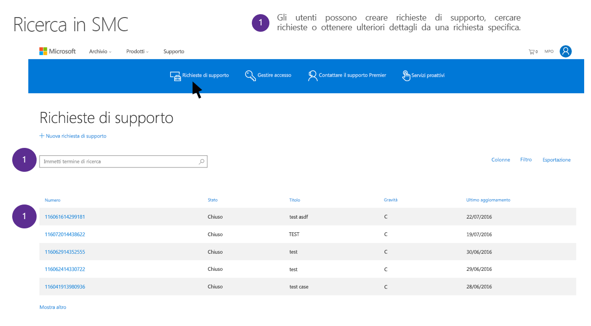

# Richieste degli interessati per Professional Services e supporto tecnico Microsoft nell'ambito del GDPR e del CCPA

## Introduzione ai servizi professionali Microsoft

Microsoft Professional Services include un gruppo eterogeneo di architetti, ingegneri, consulenti e professionisti del supporto tecnico dedicato alla realizzazione della mission di Microsoft di consentire ai clienti di fare di più e ottenere di più. Il team Professional Services include più di 21.000 operatori tra consulenti, consulenti digitali, supporto tecnico Premier, tecnici e addetti alle vendite dislocati in 191 paesi, che forniscono supporto in oltre 46 lingue, gestiscono diversi milioni di interazioni al mese e avviano interazioni tra clienti e partner attraverso strumenti automatizzati, in locale, telefono, Web e community. L'organizzazione offre competenze generali sull'intero portfolio Microsoft, sfruttando una vasta rete di partner, community tecniche, strumenti, diagnostica e canali di contatto con i clienti aziendali.

Per ulteriori informazioni sui Servizi professionali di Microsoft vedere la sezione Servizi professionali di Microsoft nel Centro protezione Microsoft (<https://www.microsoft.com/trustcenter/professional-services>). Per i servizi professionali di Microsoft, il rispetto degli obblighi derivanti dal Regolamento generale sulla protezione dei dati (GDPR) è importante. Le informazioni contenute in questo documento possono aiutare a risolvere eventuali dubbi dei clienti su come i servizi di assistenza e consulenza Microsoft supportino i clienti per gestire gli obblighi relativi alle richieste degli interessati secondo il GDPR.

### Introduzione alle richieste DSR 

Il Regolamento generale sulla protezione dei dati (RGPD) garantisce alle persone (denominate come *soggetti dei dati* nel regolamento) il diritto di gestire i dati personali raccolti da un datore di lavoro o da un altro tipo di organizzazione o agenzia (definiti come *titolari del trattamento dei dati* o semplicemente *titolari*). I dati personali sono ampiamente descritti nell'RGPD come dati che si riferiscono a una persona fisica identificata o identificabile. L'RGPD garantisce ai soggetti dei dati diritti specifici sui propri dati personali; tali diritti includono la possibilità di ottenere delle copie dei dati personali, richiedere di apportare delle modifiche ai dati, limitare il trattamento dei dati ed eliminarli. Una richiesta formale di un soggetto dei dati rivolta a un titolare in merito a un'operazione da effettuare sui propri dati personali è denominata *Richiesta DSR* (Data Subject Rights, Diritti del soggetto dei dati) o DSR. Inoltre, le società che lavorano per conto di un titolare (definite come *responsabili del trattamento dei dati* o semplicemente *responsabili*) sono tenute ad assistere il titolare nel soddisfare le richieste DSR.

Analogamente, il California Consumer Privacy Act (CCPA) fornisce obblighi e diritti in materia di privacy per i consumatori della California, inclusi diritti simili ai diritti dell'interessato del GDPR, ad esempio il diritto di eliminare, ricevere e accedere alle informazioni personali (portabilità).  Nell'ambito dei diritti che i consumatori possono esercitare, il CCPA prevede inoltre l'obbligo per determinate divulgazioni, di protezione contro la discriminazione e requisiti di consenso o rifiuto esplicito per alcuni trasferimenti di dati classificati come "vendite". In generale, le vendite sono definite per includere la condivisione dei dati per un motivo importante. Per altre informazioni sul CCPA, vedere il [California Consumer Privacy Act](offering-ccpa.md) e le [Domande frequenti sul California Consumer Privacy Act](ccpa-faq.md).

In questa guida viene descritto come individuare, accedere e utilizzare i dati personali presenti nei sistemi IT di Microsoft che potrebbero essere raccolti per fornire supporto e altre offerte di Servizi professionali.

Nello sviluppo di una risposta a una richiesta DSR, è importante che i clienti Microsoft comprendano che i dati relativi a consulenza e supporto sono separati dai dati dei clienti in Online Services o altri dati che potrebbero aver fornito a Microsoft, direttamente o tramite altri interessati. Strumenti e processi forniti per Online Services, Dashboard di privacy di Microsoft o altri sistemi Microsoft per la risposta alle richieste DSR non possono essere utilizzati per rispondere alle richieste DSR relative ai dati personali detenuti dal Supporto tecnico Microsoft o da altri Servizi professionali.

Tutte le richieste devono essere effettuate tramite un rappresentante del supporto, come descritto di seguito. Attualmente, non esiste uno strumento self-service che consenta ai clienti di accedere ai dati personali all'interno delle organizzazioni di Servizi professionali.

#### Panoramica dei processi descritti in questa guida

- **Individuazione:** usare gli strumenti di ricerca per trovare più facilmente i dati del cliente che possono essere oggetto di una richiesta dell’interessato. Dopo aver raccolto i documenti potenzialmente rilevanti, è possibile eseguire una o più delle azioni DSR descritte nei passaggi seguenti per rispondere alla richiesta del soggetto interessato. In alternativa, è possibile stabilire che la richiesta non soddisfa le linee guida della propria organizzazione in merito alla risposta alle richieste dell’interessato.
- **Accesso:** recuperare i dati personali che risiedono nel cloud Microsoft e, se richiesto, crearne una copia che può essere disponibile per l'interessato.
- **Rettificare:** apportare modifiche o implementare le azioni richieste sui dati personali, ove applicabile.
- **Limitare**: limitare il trattamento dei dati personali, rimuovendo le licenze per vari servizi di Azure o disattivando i servizi desiderati, dove possibile. È anche possibile rimuovere i dati dal cloud di Microsoft e conservarli in locale o in un'altra posizione.
- **Eliminare:** rimuovere in modo definitivo i dati personali che risiedono nel cloud Microsoft.
- **Esportazione/ricezione (portabilità):** fornire all'interessato una copia elettronica dei dati o delle informazioni personali in un formato leggibile da una macchina. Secondo il CCPA, le informazioni personali sono qualsiasi informazione relativa a una persona identificata o identificabile. Non esiste distinzione tra i ruoli privati, pubblici o professionali di una persona. Il termine definito "informazioni personali" combacia con il termine "dati personali" del GDPR. Tuttavia, il CCPA include anche i dati relativi alla famiglia e al nucleo familiare. Per altre informazioni sul CCPA, vedere il [California Consumer Privacy Act](offering-ccpa.md) e le [Domande frequenti sul California Consumer Privacy Act](ccpa-faq.md).

### Terminologia

Di seguito sono riportate le definizioni dei termini relativi all'RGPD per questa guida:

- **Titolare:** la persona fisica o giuridica, l'autorità pubblica, l'agenzia o altro ente che, autonomamente o unitamente ad altri soggetti, determina gli obiettivi e i mezzi del trattamento dei dati personali; laddove gli obiettivi e i mezzi di tale trattamento sono determinati da una normativa europea o di uno specifico Stato membro dell'UE, il titolare del trattamento dei dati o i criteri specifici per la sua designazione potrebbero essere forniti da tale normativa europea o di uno specifico Stato membro dell'UE.
- **Dati personali e interessato:** qualsiasi informazione relativa a una persona fisica identificata o identificabile (“interessato”); una persona fisica identificabile è una persona che può essere identificata, direttamente o indirettamente, tramite dati specifici come un nome, un numero di identificazione, dati sulla posizione, un identificatore online o uno o più fattori specifici per l'identità fisica, psicologica, genetica, mentale, economica, culturale o sociale della persona fisica.
- **Responsabile:** una persona fisica o giuridica, un'autorità pubblica o altro ente che si occupa del trattamento dei dati personali per conto del titolare.

#### Ulteriori termini e definizioni che possono facilitare la comprensione di questa guida

- **Dati relativi a supporto e consulenza:** tutti i dati, tra cui file di testo, audio, video e immagini, o il software, che vengono forniti a Microsoft dal cliente o per suo conto (o che il cliente autorizza Microsoft a ottenere da un servizio online) tramite un impegno con Microsoft per ottenere supporto tecnico o Servizi professionali. Per chiarire, questo non include i dati raccolti in cui Microsoft è il titolare del trattamento dei dati, inclusi i dati di contatto del cliente.
- **Contatto cliente:** dati personali che potrebbero far parte della relazione commerciale con Microsoft, ad esempio i dati personali contenuti nelle informazioni di contatto del cliente. Ciò potrebbe includere nome, indirizzo e-mail o numero di telefono del Premier Contract Service Manager (CSM), dell'amministratore IT o globale di un servizio online o ruoli simili.
- **Dati presentati con l’uso di pseudonimi:** quando si utilizza il supporto tecnico Microsoft per prodotti e servizi aziendali Microsoft, Microsoft genera alcune informazioni collegate a un identificatore numerico Microsoft per fornire il supporto. Tali informazioni vengono spesso denominate "dati presentati con l'uso di pseudonimi". Anche se questi dati non possono essere attribuiti a un interessato specifico senza l'uso di ulteriori informazioni, una parte di essi può essere considerata personale secondo l'ampia definizione illustrata nell'RGPD in merito ai dati personali. All'interno di Servizi professionali, le richieste per soddisfare o assistere all'adempimento di richieste DSR includeranno sempre automaticamente dati di indirizzamento presentati con l'uso di pseudonimi.

### Come usare questa guida

Questa guida descrive quattro scenari che un cliente può riscontrare se ha utilizzato Servizi professionali di Microsoft.

- **Richiesta DSR per un contatto del cliente che coinvolge Microsoft:** spiegazione di come Microsoft gestisce le richieste di esercizio dei diritti dell’interessato del trattamento dei dati da parte di un contatto cliente o amministratore IT.
- **Richiesta DSR per un utente finale che coinvolge Microsoft:** spiegazione di come Microsoft gestisce le richieste di esercizio dei diritti dell’interessato del trattamento dei dati da parte dei dipendenti di un cliente o di altri interessati.
- **Richiesta DSR per i dati forniti dal cliente: supporto commerciale:** spiegazione di come ottenere assistenza da Microsoft quando un cliente ha ricevuto una richiesta di esercizio dei propri diritti da parte di un suo dipendente o da altri interessati del trattamento dei dati, e i dati personali dell'interessato sono stati raccolti dal supporto tecnico Microsoft durante un impegno relativo al supporto.
- **Richiesta DSR per i dati forniti dal cliente: servizi di consulenza tra cui i servizi di migrazione di FastTrack:** spiegazione di come ottenere assistenza da Microsoft quando un cliente ha ricevuto una richiesta di esercizio dei diritti da parte di un suo dipendente o da altri interessati, e i dati personali dell'interessato sono stati raccolti da Microsoft durante un impegno di consulenza.

## Richiesta dell'interessato per un contatto del cliente che coinvolge Microsoft

*Come Microsoft risponde alle richieste da un contatto cliente o un amministratore IT per esercitare i diritti dei soggetti dei dati.*

Quando un cliente interagisce con Microsoft per ricevere servizi di consulenza o supporto, il supporto tecnico Microsoft raccoglie o recupera automaticamente dai record dell'account i dati personali del contatto cliente (ad esempio, Premier CSM, Amministratore globale, Amministratore IT). Tali dati includono probabilmente nome, indirizzo e-mail, telefono e altri dati personali del soggetto che necessita dei servizi di consulenza o supporto.

I dati personali del contatto cliente fanno parte della relazione aziendale tra Microsoft e il cliente, e Microsoft è il titolare del trattamento dei dati. Microsoft risponde alle richieste DSR dal contatto cliente in merito ai suoi dati personali, che risiedano o meno nell'organizzazione.

È importante che i clienti comprendano che la richiesta DSR riguarda solo i dati personali del contatto cliente, e che non verranno modificati o eliminati i dati del cliente inviati nell'ambito di interazioni (ad esempio, trascrizioni, descrizioni dei casi, file, prodotto di lavoro) poiché Microsoft è il responsabile del trattamento dei dati. Inoltre, per mantenere il record cronologico delle interazioni, non verranno apportate modifiche alle interazioni concluse, tra cui il record di chi ha avviato un'interazione.

Alla ricezione di una richiesta di informazioni da un contatto cliente in merito a una richiesta DSR, il personale Microsoft indirizza un contatto cliente al [supporto Microsoft per la privacy](https://go.microsoft.com/fwlink/?LinkId=321116). Si tratta del meccanismo di input principale di Microsoft per i reclami e le richieste di informazioni sulla privacy. Nel momento in cui riceve una richiesta di informazioni, il team per la privacy Microsoft determina se fa parte di un account commerciale o aziendale e risponde in modo adeguato.

Per mantenere la continuità aziendale del cliente, inoltre, Microsoft non elabora una richiesta DSR associata a un impegno finché non viene confermato un contatto sostitutivo. Alla conferma di un nuovo contatto, Microsoft sostituisce il contatto precedente con quello nuovo negli impegni aperti.

I clienti possono scegliere di apportare modifiche ai propri dati raccolti durante gli impegni di Servizi professionali tramite i normali canali di consulenza o supporto, separati dalla richiesta DSR. Ad esempio, Microsoft può assistere nell'eliminazione di impegni relativi al supporto, su richiesta (vedere di seguito nella sezione *Guida alle richieste DSR per i dati forniti dal cliente*).

***Esempio solo a scopo illustrativo***

John è un amministratore IT per un cliente aziendale O365, con un impegno relativo al supporto aperto e due impegni chiusi. Ora John sta lasciando la sua società e vuole che i suoi dati vengano eliminati. John contatta il PRC, che lo identifica come amministratore IT. John viene informato del fatto che il suo nome non può essere eliminato dagli impegni (chiusi) precedenti o dai dati all'interno degli impegni aperti. Tuttavia, il PRC sostituirà John come contatto nell'attuale ticket aperto se identifica un contatto sostitutivo. John comunica a Microsoft che Jane sarà il suo contatto sostitutivo e Microsoft apporta la modifica in tutti i sistemi di supporto.

## Richiesta dell'interessato per un utente finale che coinvolge Microsoft

*Come Microsoft risponde alle richieste dai dipendenti di un cliente o altri interessati per esercitare i propri diritti.*

Se un dipendente del cliente o un altro interessato contatta Microsoft per esercitare i propri diritti sui dati raccolti da Microsoft in qualità di responsabile del trattamento dei dati, tale soggetto viene informato che deve contattare il cliente di Microsoft, in quanto titolare del trattamento dei dati, per esercitare tali diritti. Microsoft non eseguirà ulteriori azioni in merito.

Se l'interessato ha contattato anche Microsoft per l'esercizio dei propri diritti per i dati raccolti da Microsoft in situazioni in cui Microsoft rappresenta il titolare del trattamento dei dati (ad esempio, supporto ai consumatori, contatto cliente commerciale), Microsoft risponde separatamente alla specifica richiesta dell'interessato per tali dati personali.

***Esempio solo a scopo illustrativo***

Jane è una dipendente di un cliente aziendale, Contoso, che le ha fornito un account Dynamics 365. Jane contatta Microsoft per richiedere che tutti i suoi dati vengano eliminati e viene indirizzata al Privacy Response Center. Jane compila il modulo per la richiesta. Il Privacy Response Center la identifica come utente finale aziendale e la informa del fatto che deve rivolgersi a Contoso per l'eliminazione dei suoi dati aziendali. Viene inoltre identificata come utente di Microsoft Xbox e i dati del suo account Microsoft personale vengono eliminati.

## DSR per i dati forniti dal cliente: supporto commerciale

*Come ottenere assistenza da Microsoft quando un cliente ha ricevuto una richiesta da un suo dipendente o da altri interessati per esercitare i propri diritti, e i dati personali dell'interessato sono stati raccolti dal supporto tecnico Microsoft durante un impegno relativo al supporto.*

Quando un cliente si impegna con il supporto tecnico Microsoft, Microsoft raccoglie i dati del supporto dal cliente per risolvere eventuali problemi che hanno richiesto un impegno relativo al supporto. Tali dati includono l'interazione di Microsoft con il cliente (ad esempio, chat, telefono, e-mail, invio sul Web), oltre a qualsiasi file inviato dal cliente a Microsoft o che Microsoft, con il consenso del cliente, ha estratto dall'ambiente IT del cliente o dal tenancy di Online Services per risolvere il problema riscontrato. Nel caso in cui si tratti di supporto Premier, ciò include i dati del cliente raccolti da Microsoft per impedire proattivamente futuri problemi. Tuttavia, ciò esclude le informazioni di contatto del cliente o altre informazioni derivanti dalla relazione aziendale tra Microsoft e il cliente (ad esempio, record di fatturazione).

Per tutti i dati relativi al supporto, Microsoft è il responsabile del trattamento dei dati. Di conseguenza, Microsoft non risponde alle richieste dirette dei soggetti dei dati in merito ai dati del supporto forniti quando sono stati associati a un cliente commerciale Microsoft. Microsoft aiuta il cliente tramite i normali canali di supporto per assisterlo nella risposta alle richieste DSR.

## Passaggio 1: scoprire

Il primo passaggio per ottenere l'assistenza di Microsoft nella risposta a una richiesta DSR consiste nell'individuare i dati personali oggetto della richiesta. Questo primo passaggio (individuazione e analisi dei dati personali in questione) consente al cliente di determinare se una richiesta dell'interessato soddisfa i criteri aziendali per l'accettazione di una richiesta di questo tipo.

Dopo aver trovato i dati, il cliente può effettuare l'azione specifica per soddisfare la richiesta dell'interessato. L'operazione che il cliente sta tentando di eseguire determina il livello di individuazione necessario al cliente.

Quando Microsoft assiste un cliente con la risoluzione di una richiesta DSR, si tratta di una funzione aziendale, e la richiesta viene effettuata tramite il normale canale di supporto, non tramite una richiesta al team per la privacy Microsoft.

Per individuare i dati pertinenti e ottenere assistenza da Microsoft, un cliente ha diverse opzioni per gestire la richiesta DSR:

*Opzione A: DSR del cliente per il supporto Microsoft*. Applicare la richiesta DSR a tutti i dati relativi al supporto del cliente nell'ambiente Microsoft. Per farlo, un cliente può semplicemente chiedere a Microsoft di applicare la richiesta DSR a tutti i dati del supporto raccolti.

*Opzione B: interazioni specifiche del cliente.* Usare i sistemi online per analizzare i ticket, quindi identificare le interazioni specifiche contenenti i dati personali pertinenti e segnalarli a Microsoft. Microsoft proverà a fornire assistenza per eseguire una ricerca se il cliente non è in grado di effettuare la ricerca nelle varie interazioni (ticket).

***Una volta identificati gli impegni, richiedere di applicare i diritti del soggetto dei dati a una parte specifica del record o a tutto ciò che riguarda tale impegno in Microsoft.***

Per identificare impegni specifici, i clienti devono effettuare una ricerca nei propri impegni. Per i clienti Premier, il Contract Service Manager ("CSM") di un cliente ha visibilità su tutte le richieste di supporto (SR) create in base alla programmazione del contratto. Per i clienti  non Premier, sono disponibili portali di impegni per il supporto equivalenti, come le aree di supporto di Online Services.

Il CSM può accedere al portale all'indirizzo Support.Microsoft.Com ([https://support.microsoft.com/\<localcodice della lingua\>/premier](https://support.microsoft.com/%3clocal%20language%20code%3e/premier)) ("SMC") e selezionare e analizzare le richieste di supporto. Nota: nell'URL, inserire il proprio codice della lingua.

>[!IMPORTANT]
>Oltre alla cronologia del caso in SMC, i clienti possono anche disporre dei dati personali di un utente finale nei file che sono stati raccolti da Microsoft (o che, con l'autorizzazione del cliente, sono stati rimossi dal servizio online) durante un'interazione con il supporto. Ne sono degli esempi copie delle cassette postali di Exchange del cliente, macchine virtuali di Azure o database. Tali dati personali possono essere menzionati o meno nella cronologia del caso (cioè, il ticket) per un impegno particolare. Per analizzare tali dati, il contatto cliente deve essere uno specifico contatto di richiesta del supporto (tramite AAD o MSA) autenticato che ha ricevuto un URL per uno spazio di lavoro nello strumento Data Transfer and Management (DTM) del Supporto tecnico Microsoft. Un contatto cliente avrà accesso ai file, ma non è disponibile una visione globale e SMC non indicherà se i file esistono.

Dopo aver identificato tutti i dati pertinenti nei ticket del supporto selezionati, i clienti possono decidere se richiedere l'eliminazione di tutto ciò che riguarda un ticket o applicare la richiesta DSR in modo selettivo a singole istanze di dati personali.

## Passaggio 2: accedere

Dopo che un cliente ha individuato i dati relativi al supporto contenenti dati personali potenzialmente reattivi a una richiesta DSR, il cliente deve decidere quali dati personali includere nella risposta. Ad esempio, il cliente può scegliere di rimuovere i dati personali su altri interessati ed eventuali informazioni riservate.

La risposta alla richiesta DSR potrebbe includere una copia del documento effettivo, una versione appositamente riadattata o uno screenshot delle parti che il cliente considera adatte alla condivisione. Per ognuna di queste risposte a una richiesta di accesso, il cliente dovrà recuperare una copia del documento o altro elemento contenente i dati sensibili.

L'accesso ai dati personali di un utente finale potrebbe derivare da una menzione o notazione nei vari tipi di documentazione sui contenuti. Dal momento che i clienti possono accedere ai contenuti e al ticket di interazione, possono fornire autonomamente un riepilogo dei dati personali senza ulteriore assistenza di Microsoft.

In rari casi, il cliente potrebbe dover ottenere copie dei dati relativi alle interazioni con il supporto tecnico (ad esempio, messaggi di posta elettronica, copie trascritte di registrazioni telefoniche; trascrizioni di chat) tra un rappresentante Microsoft e il rappresentante del cliente. Nella misura necessaria, Microsoft può fornire copie censurate di tali trascrizioni in base alle esigenze, alla riservatezza e alla difficoltà.

## Passaggio 3: rettificare

Se un interessato ha chiesto al cliente di rettificare i dati personali che risiedono nei dati relativi al supporto dell'organizzazione, il cliente dovrà determinare se la richiesta può essere accettata. Se il cliente scegli di accettare la richiesta, può richiedere che Microsoft apporti la modifica. Microsoft può rettificare i dati o eliminare i dati del cliente dai sistemi di supporto e richiedere al cliente di inviarli di nuovo a Microsoft nel formato corretto.

## Passaggio 4: limitare

Il cliente può chiudere un impegno o contattare Microsoft e richiedere la chiusura dell'impegno in qualsiasi momento. Un impegno chiuso impedisce l'esecuzione di qualsiasi operazione.

Per una maggiore sicurezza, il cliente può contattare Microsoft e richiedere l'aggiunta di una nota nel sistema di creazione dei ticket per le interazioni a indicare che il caso non deve essere riaperto per nessun motivo senza l'autorizzazione del cliente.

Nota: anche gli impegni (ticket) verranno eliminati secondo una pianificazione di conservazione ed eliminazione, basata sulla riservatezza dei dati, sul servizio e sul sistema. Se il cliente richiede una copia dei dati, deve assicurarsi di aver estratto i dati prima della loro eliminazione.

## Passaggio 5: eliminare

Il "diritto all’eliminazione" tramite la rimozione dei dati personali dai dati relativi al supporto di un'organizzazione è una delle principali protezioni nel GDPR. La rimozione dei dati personali include l'eliminazione di interazioni, documenti o file completi o l'eliminazione di dati specifici all'interno di un'interazione, di un documento o di un file.

Nel caso in cui un cliente abbia intenzione di eliminare dei dati personali in risposta a una richiesta DSR, di seguito sono descritti alcuni aspetti importanti sul funzionamento dell'eliminazione per il Supporto tecnico Microsoft.

Microsoft applica a tutti i dati dei criteri di conservazione ed eliminazione, che variano a seconda del rischio e di altri fattori.

Gli utenti possono richiedere l'eliminazione dei dati personali di un interessato a livello globale nei sistemi di supporto tramite il TAM o compilando una richiesta di supporto (SR) in SMC o in un sistema equivalente. *È necessario* indicare che si tratta di una richiesta di assistenza per una richiesta DSR secondo l'RGPD.

*Opzione A: richiesta dell'interessato del cliente relativa al supporto Microsoft per più sistemi*. Per una richiesta dell'interessato per più sistemi, il cliente deve fornire i dati personali necessari a Microsoft per identificare i dati richiesti (ad esempio, l'indirizzo e-mail, il numero di telefono). Microsoft non correla o esegue ricerche nei record, ma utilizza direttamente gli identificatori forniti dal cliente. Una volta individuati i dati, Microsoft elimina tutte le interazioni e tutti i dati associati.

> [!IMPORTANT]
> Nota importante: questa operazione potrebbe comportare la perdita di record cronologici importanti per l'organizzazione del cliente.

*Opzione B: interazioni specifiche del cliente*. Per quanto riguarda le interazioni specifiche che il cliente ha identificato e vuole che siano rimosse, non eliminare i ticket da SMC. In questo modo, i dati personali rimangono nei log e nei sistemi downstream che potrebbero non essere eliminati nell'intervallo di tempo necessario. Al contrario, identificare il ticket o i dati personali nel ticket da eliminare e contattare il supporto tecnico Microsoft per ricevere assistenza con l'eliminazione di tali dati.

### Istruzioni sullo strumento Data Transfer and Management (DTM) del Supporto tecnico Microsoft

Per tutte queste ricerche, Microsoft non esegue la ricerca nel DTM a causa della potenziale riservatezza del contenuto dei file. Tuttavia, se il cliente lo desidera, Microsoft elimina tutti i file contenuti nel DTM associati all'account del cliente. A causa del potenziale impatto grave sul cliente, Microsoft richiede una richiesta separata dal cliente specificando l'eliminazione dei file DTM.

- Per i casi aperti, il contatto cliente può accedere al DTM ed eliminare i file.
- Per i casi chiusi da meno di 90 giorni, è necessario effettuare una richiesta a un TAM o in una richiesta di supporto per far rimuovere i file.
- Per i casi chiusi da più di 90 giorni, i file sono stati già eliminati automaticamente.
- Anche se i dati personali sono stati rilevati solo in un file che è stato eliminato, i clienti devono comunque richiedere a Microsoft di eseguire un controllo sui dati personali nei sistemi poiché alcuni dati potrebbero essere stati rimossi dal DTM mentre è stato fornito il supporto.

## Passaggio 6: esportare

Il "diritto di portabilità dei dati" consente a un interessato di richiedere una copia dei propri dati personali in formato elettronico e di richiedere che l'organizzazione li trasmetta a un altro titolare del trattamento dei dati. Nel caso di dati relativi al supporto, le informazioni utilizzabili in possesso di Microsoft sono informazioni relative agli impegni o file che è possibile restituire al cliente per ulteriori comunicazioni o per il passaggio a un altro titolare del trattamento dei dati.

Nota: i dati esportati potrebbero non includere la proprietà intellettuale di Microsoft o i dati che possono compromettere la sicurezza o la stabilità del servizio.

***Esempio solo a scopo illustrativo***

John è un Premier CSM per un cliente aziendale, Contoso, che si avvale di O365 per l'e-mail dei dipendenti e di Azure per ospitare un database SQL di Contoso. Contoso ha più ticket aperti e chiusi. Di recente, il Supporto tecnico Microsoft, con l'autorizzazione di Contoso, ha spostato una copia del database SQL nel DTM per il supporto e la risoluzione dei problemi.

John riceve una DSR da Jane che richiede l'eliminazione di tutti i suoi dati. John accede a SMC ed esegue una ricerca in tutti gli impegni per scoprire che Jane ha riscontrato problemi con l'account di posta elettronica, che sono stati indicati in due ticket per nome e indirizzo e-mail. John contatta il suo TAM, gli fornisce il nome e l'indirizzo e-mail di Jane come identificatore e richiede l'eliminazione di quei due ticket, oltre a tutti i dati downstream che potrebbero essere stati generati da tali ticket.

John sospetta di aver avuto una chat con il personale di supporto in cui ha menzionato Jane, quindi richiede l'eliminazione anche del log di quella chat.

Sa anche che i dati personali di Jane si trovano nel database SQL. Poiché la macchina virtuale di SQL è stata spostata nel DTM meno di 90 giorni prima, chiede separatamente al suo TAM di assisterlo nell'immediata eliminazione del database dal DTM.

Infine, sapendo che i dati potrebbero essere stati rimossi dal file DTM file mentre è stato fornito il supporto, chiede a Microsoft di effettuare un controllo sui dati personali di Jane nei sistemi IT dal database SQL.

Il Supporto tecnico Microsoft esegue tutte queste eliminazioni e, in base alla richiesta del cliente, il TAM fornisce un'istruzione di attestazione sull'avvenuta eliminazione dei dati richiesta.

## Guida DSR per i dati forniti dal cliente nei servizi di consulenza, compresi i servizi di migrazione

*Come ottenere assistenza da Microsoft quando un cliente ha ricevuto una richiesta da un suo dipendente o da altri interessati per esercitare i propri diritti, e i dati personali dell'interessato sono stati raccolti da Microsoft durante un intervento di consulenza.*

## Microsoft Consulting Services

Per gli impegni di Microsoft Consulting Services contratti in cui si applica Microsoft Professional Services Data Protection Addendum (<https://aka.ms/professionalservicesdpa>).

Microsoft è il titolare del trattamento dei dati per i contatti cliente che lavorano con il team che si occupa degli impegni. Questi soggetti devono contattare il [supporto Microsoft per la privacy](https://go.microsoft.com/fwlink/?LinkId=321116) per soddisfare i diritti degli interessati.

Microsoft è il responsabile del trattamento dei dati per una richiesta DSR all'interno dei dati forniti durante un impegno di consulenza. Il cliente deve contattare il responsabile degli impegni per creare un piano per assistere nella risposta a una richiesta DSR in base ai dati raccolti e al tipo specifico di servizi di consulenza forniti. Nella misura in cui la richiesta costituisca un livello di lavoro richiesto tipico di un impegno di Microsoft Consulting Services, potrebbe essere richiesto un ordine di lavoro aggiuntivo. Inoltre, i dati personali verranno eliminati dopo ogni impegno di consulenza in un intervallo di tempo dipendente dal tipo di impegno di consulenza. Il cliente può richiedere prima l'eliminazione dei e quindi un'attestazione dell'eliminazione.

## Servizi di Microsoft FastTrack

[Microsoft FastTrack](https://na01.safelinks.protection.outlook.com/?url=https%3A%2F%2Ffasttrack.microsoft.com%2Fabout&data=02%7C01%7C%7Cd0521d8739c841df674508d596834585%7C72f988bf86f141af91ab2d7cd011db47%7C1%7C0%7C636580412901207944&sdata=PO5eh56pm9IYk5Y%2Ff%2F31e%2BRVPmrC2Qi%2FCsw1NphR8gY%3D&reserved=0) fornisce servizi di consulenza IT alle organizzazioni per aiutarle a eseguire l'onboarding e usare i servizi cloud Microsoft come Microsoft 365, Azure e Dynamics 365.

Microsoft è il titolare del trattamento dei dati per i contatti cliente che collaborano con il team di FastTrack. Se i contatti clienti desiderano accedere, modificare o rimuovere le informazioni di contatto dai record di Microsoft FastTrack, gli interessati possono inviare la richiesta direttamente alla posta in arrivo per le richieste dell'RGPD di FastTrack per Office 365\<<o365ftgdpr@microsoft.com>\>.

Per i servizi di migrazione FastTrack, Microsoft è responsabile del trattamento dei dati. In conformità con l'informativa sulla divulgazione della privacy aggiuntiva Fast Track, tutti i dati in migrazione sono considerati "dati di migrazione". Prestare particolare attenzione qualora fosse necessario eseguire DSR mentre la propria organizzazione è impegnata in un progetto di migrazione FastTrack.
  
Se è necessario trattare qualsiasi accesso, rettificare o esportare richieste degli interessati mentre i dati di un utente vengono trattati tramite i sistemi di migrazione FastTrack, sarà responsabilità del cliente soddisfare tali richieste degli interessati tramite i sistemi di origine esistenti in cui sono archiviati i dati dell'utente. Una volta completata la migrazione dell'utente e la migrazione dei dati nel servizio cloud Microsoft di destinazione, saranno quindi applicate le indicazioni fornite da Microsoft su come i clienti possono usare i prodotti, i servizi e gli strumenti amministrativi di Microsoft per trovare e agire sui dati personali per rispondere alle richieste degli interessati. Per visualizzare questa guida, vedere [Richieste dell'interessato per il GDPR](https://docs.microsoft.com/microsoft-365/compliance/gdpr-data-subject-requests). 

Se è necessario eliminare un account utente di Office 365 in risposta a una richiesta di eliminazione DSR mentre l'organizzazione è impegnata in un progetto di migrazione FastTrack in corso, è necessario tenere presente che i sistemi di migrazione possono conservare una copia dei dati di migrazione dell'utente per un periodo di tempo successivo al completamento della migrazione dell'utente e l'eliminazione dell'account utente di Office 365 non eliminerà automaticamente tali dati di migrazione degli utenti memorizzati nei sistemi di migrazione FastTrack. Se si desidera che il team Microsoft FastTrack elimini i dati di migrazione degli utenti, è possibile [inviare una richiesta](https://go.microsoft.com/fwlink/?linkid=874544). Nel corso della normale attività, Microsoft FastTrack cancellerà tutte le copie di dati una volta completata la migrazione dell'organizzazione.

## Altri servizi di consulenza

Il cliente che riceve altri Servizi professionali tramite Microsoft deve collaborare con il team che si occupa degli impegni per l'adempimento a tutti i requisiti dell'RGPD. Se tale team non è in grado di fornire istruzioni chiare sulla conformità ai requisiti dell'RGPD in merito alle richieste DSR, i clienti possono contattare il [supporto Microsoft per la privacy](https://go.microsoft.com/fwlink/?LinkId=321116) per ricevere assistenza.
