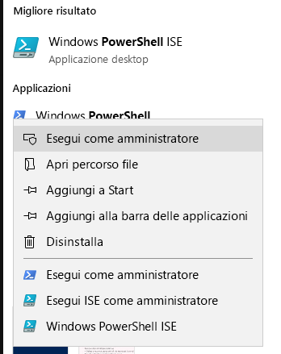
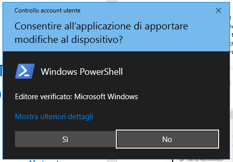
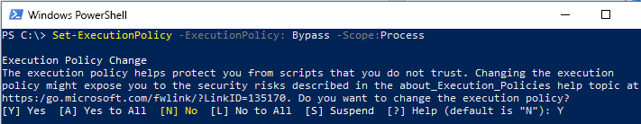

# Set di strumenti di migrazione di FastTrack per inviare una richiesta di eliminazioneFastTrack Migration Toolset for Submitting Delete Request

## Scopo del set di strumentiToolset purpose

Se si è un cliente attualmente coinvolto in una migrazione di FastTrack, eliminando l'account utente di Office 365 non sarà eliminata la copia dei dati utilizzata dal team di Microsoft FastTrack, che viene conservata con il solo scopo di completare la migrazione. Se durante la migrazione si desidera che il team di Microsoft FastTrack elimini anche la copia dei dati, è possibile inviare una richiesta tramite questo set di strumenti. In condizioni normali di attività, Microsoft FastTrack eliminerà tutte le copie dei dati una volta completata la migrazione.In the event that you are a customer currently engaged in FastTrack migrations, deleting the Office 365 user account will not delete the data copy held by the Microsoft FastTrack team, which is held for the sole purpose of completing the migration. If, during the migration, you would like the Microsoft FastTrack team to also delete the data copy, submit a request via this toolset. In the ordinary course of business, Microsoft FastTrack will delete all data copies once the migration is complete. 

### Piattaforme supportateSupported platforms
Microsoft supporta la versione iniziale di questo set di strumenti nella piattaforma Windows e nella console di PowerShell. Il set di strumenti supporta le seguenti piattaforme:Microsoft supports the initial release of this  toolset in the Windows platform and PowerShell console. The following known platforms are supported by this toolset:
 
***Tabella 1 - Piattaforme supportate da questo set di strumenti******Table 1 - Platforms supported by this toolset***
 
<!--start table here HEADER -->
 
|||||||
|:-----|:-----|:-----|:-----|:-----|:-----|
| |**Windows 7****Windows 7**|**Windows 8****Windows 8**|**Windows 10****Windows 10**|**Windows Server 2012****Windows Server 2012**|**Windows Server 2016****Windows Server 2016**|
|PS 5.0PS 5.0|NonNot SupportatoSupported|SupportatoSupported|SupportatoSupported|SupportatoSupported|SupportatoSupported|
|PS 5.1PS 5.1|NonNot SupportatoSupported|SupportatoSupported|SupportatoSupported|SupportatoSupported|SupportatoSupported|
|||
 
<!-- end of table -->

### Ottenere il set di strumentiObtaining the toolset

Il set di strumenti è disponibile in PowerShell Gallery nell'applicazione console di PowerShell. Per individuare e caricare questo modulo cmdlet, aprire PowerShell in modalità di amministratore in modo da avere le autorizzazioni adeguate per installare il modulo. Se non si è mai utilizzato prima PowerShell, passare alla barra delle applicazioni di Windows e digitare nella casella di ricerca "PowerShell". Selezionare l'applicazione console con pulsante destro del mouse e scegliere l'opzione **Esegui come amministratore**, quindi fare clic su **Sì** per eseguire Windows PowerShell.This toolset is available in the PowerShell Gallery on the PowerShell console application.  To locate and load this cmdlet module, first open PowerShell in administrator mode so it has the appropriate permissions to install the module. If you have not used PowerShell previously go to your Windows Task Bar and in the search box type “PowerShell”. Select the console app using right-click and choose **Run as administrator**, then click **Yes** to run Windows PowerShell.

Una volta aperta la console, è necessario impostare le autorizzazioni per l'esecuzione dello script. Digitare il comando seguente per consentire l'esecuzione di script: "Set-ExecutionPolicy – ExecutionPolicy: Bypass – Scope:Process"Now that the console is open, you need to set permissions for script execution. Type the following command to allow the scripts to run: ‘Set-ExecutionPolicy – ExecutionPolicy: Bypass – Scope:Process’

Verrà richiesto di confermare l'azione, in quanto l'amministratore può modificare l'ambito a propria discrezione.You will be prompted to confirm this action, as the administrator can change the scope at their discretion..

***Impostare criteri di esecuzione******Set Execution Policy***

Dopo che la console è impostata per consentire lo script, eseguire il comando seguente per installare il modulo:Now that the console is set to allow the script,  run this next command to install the module:

>`Install-Module -Name Microsoft.FastTrack ` -Repository PSGallery \``Install-Module -Name Microsoft.FastTrack ` -Repository PSGallery \`
>        
>               -WarningAction: SilentlyContinue `
>               -Force’

### Prerequisiti per il moduloPrerequisites for module
Per eseguire correttamente il modulo, è necessario installare moduli dipendenti da utilizzare, nel caso in cui non siano già installati. Potrebbe essere necessario riavviare PowerShell.To successfully execute this module, you may need to install dependent modules for use if they are not already installed. You may need to restart PowerShell.  

Per poter inviare un DSR, è necessario accedere prima con le credenziali di Office 365: immettendo le credenziali appropriate viene convalidato lo stato di amministratore globale e vengono raccolte le informazioni del tenant.In order to submit a DSR, you must first login using your Office 365 credentials – entering the proper credentials will validate your global administrator status and collect tenant information. 

**Login-FastTrackAccount -ApiKey: \<Chiave API fornita da FastTrack MVM\>****Login-FastTrackAccount -ApiKey: \<API Key provided by FastTrack MVM\>**

Una volta eseguito l'accesso, le credenziali e la chiave saranno conservate per l'utilizzo con i moduli FastTrack per il resto della sessione corrente di PowerShell.Once successfully logged in, the credentials and key will be stored for use with FastTrack modules for the remainder of the current PowerShell session.

Se è necessario connettersi a un ambiente cloud diverso da quello commerciale, sarà necessario aggiungere *-Environment* al comando *Login* con uno dei seguenti ambienti validi:If you need to connect to a cloud environment, other than commercial, *-Environment* will needed to be added to *Login* command with one of the following valid environments:
- AzureCloudAzureCloud
- AzureChinaCloudAzureChinaCloud
- AzureGermanCloudAzureGermanCloud
- AzureUSGovernmentCloudAzureUSGovernmentCloud

**Login-FastTrackAcccount -ApiKey\ <API Key provided by FastTrack MVM> -Environment: <cloud environment\>****Login-FastTrackAcccount -ApiKey\ <API Key provided by FastTrack MVM> -Environment: <cloud environment\>**

Per inviare una richiesta DSR, eseguire il comando seguente: Submit-FastTrackGdprDsrRequest -DsrRequestUserEmail: SubjectUserEmail@mycompany.comTo submit a DSR request, run the following command: Submit-FastTrackGdprDsrRequest -DsrRequestUserEmail: SubjectUserEmail@mycompany.com

Al termine dell'operazione, il cmdlet restituirà un oggetto ID transazione (che è consigliabile conservare).On success – the cmdlet will return a Transaction ID object. Please retain the Transaction ID.

#### Verificare lo stato di una richiesta transazioneChecking the status of a request transaction

Eseguire la funzione seguente usando l'ID transazione ottenuto in precedenza: Get-FastTrackGdprDsrRequest -TransactionID: "IDTransazione"Run the following function using the previously obtained Transaction ID: Get-FastTrackGdprDsrRequest -TransactionID: “YourTransactionID”

#### Codici di stato transazioneTransaction Status Codes
<!--start table here no header -->

|||
|:-----|:-----|:-----|
|**Transazione****Transaction** |**Stato****Status**|
|**Creato****Created** |La richiesta è stata creataRequest has been created|
|**Operazione non riuscita****Failed**|Non è stato possibile creare la richiesta; inviarla nuovamente o contattare l'assistenzaRequest failed to create, please resubmit, or contact support|
|**Operazione completata****Completed**|La richiesta è stata completata e purificataRequest has been completed and sanitized|
|||

<!-- end of table -->

<!-- original version: **Created**  Request has been created **Failed** Request failed to create, please resubmit, or contact support **Completed** Request has been completed and sanitized -->

## Altre informazioniLearn more
[Centro protezione MicrosoftMicrosoft Trust Center](https://www.microsoft.com/TrustCenter/Privacy/gdpr/default.aspx)