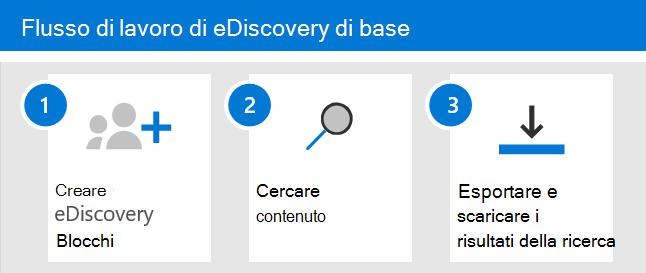

# Introduzione a Core eDiscovery

EDiscovery core in Microsoft 365 fornisce uno strumento di eDiscovery di base che le organizzazioni possono utilizzare per la ricerca e l'esportazione di contenuto in Microsoft 365 e Office 365. È inoltre possibile utilizzare eDiscovery di base per inserire un blocco eDiscovery nei percorsi di contenuto, ad esempio le cassette postali di Exchange, i siti di SharePoint, gli account di OneDrive e Microsoft teams. Non è necessario nulla per la distribuzione di eDiscovery di base, ma vi sono alcune attività prerequisite che devono essere completate da un amministratore IT e da un responsabile di eDiscovery prima che l'organizzazione possa iniziare a usare eDiscovery di base per cercare, esportare e preservare il contenuto.

In questo articolo vengono illustrati i passaggi necessari per configurare eDiscovery di base. Ciò include la verifica delle licenze necessarie per accedere a eDiscovery di base e l'archiviazione di un blocco eDiscovery nei percorsi di contenuto, nonché l'assegnazione di autorizzazioni per il team IT, legale e investigativo in modo che possano accedere e gestire i casi. In questo articolo viene inoltre fornita una panoramica generale dell'utilizzo dei casi per la ricerca e l'esportazione di contenuto.

## Passaggio 1: verifica e assegnazione delle licenze appropriate

Licensing for Core eDiscovery richiede la sottoscrizione dell'organizzazione appropriata e la gestione delle licenze per utente.

- **Sottoscrizione organizzazione:** Per accedere a eDiscovery di base nel centro conformità di Microsoft 365 o nel centro sicurezza & conformità di Office 365 e utilizzare le funzionalità di esenzione ed esportazione, è necessario che l'organizzazione disponga di un abbonamento a Microsoft 365 E3 o Office 365 E3 o superiore.

- **Licenze per utente:** Per applicare un blocco eDiscovery alle cassette postali e ai siti, a un utente deve essere assegnata una delle licenze seguenti, a seconda dell'abbonamento dell'organizzazione:

  - Una licenza di Microsoft 365 E3 o Office 365 E3 o superiore

   OPPURE

  - Licenza di Office 365 E1 con una licenza per il componente aggiuntivo di archiviazione Exchange Online piano 2 o Exchange Online

  E

  - Licenza di Office 365 E1 con una licenza del componente aggiuntivo di SharePoint Online piano 2 o OneDrive for business piano 2
  
  Per informazioni su come assegnare le licenze, vedere [assegnare licenze agli utenti](https://docs.microsoft.com/microsoft-365/admin/manage/assign-licenses-to-users).

Per informazioni sulle licenze:

- Scaricare e vedere la soluzione "Discover & Rispondi" nel [confronto di Microsoft 365 Compliance Licensing](https://docs.microsoft.com/office365/servicedescriptions/downloads/microsoft-365-compliance-licensing-comparison.xlsx).

- Vedere la [Descrizione del servizio Centro sicurezza & Compliance](https://docs.microsoft.com/office365/servicedescriptions/office-365-platform-service-description/office-365-securitycompliance-center).

## Passaggio 2: assegnare autorizzazioni di eDiscovery

Per accedere a eDiscovery core o essere aggiunto come membro di un caso di eDiscovery core, a un utente devono essere assegnate le autorizzazioni appropriate. In particolare, un utente deve essere aggiunto come membro del gruppo di ruoli di gestione di eDiscovery nel centro sicurezza & conformità di Office 365. I membri di questo gruppo di ruoli possono creare e gestire i casi di eDiscovery di base. Possono aggiungere e rimuovere membri, inserire un blocco eDiscovery su utenti, creare e modificare ricerche ed esportare il contenuto da un caso di eDiscovery core.

Completare la procedura seguente per aggiungere gli utenti al gruppo di ruoli eDiscovery Manager:

1. Accedere a [https://protection.office.com/permissions](https://protection.office.com/permissions) e accedere usando le credenziali per un account di amministratore nell'organizzazione Microsoft 365 o Office 365.

2. Nella pagina **autorizzazioni** selezionare il gruppo di ruoli **eDiscovery Manager** .

3. Nella pagina riquadro a comparsa di eDiscovery Manager, fare clic su **modifica** accanto alla sezione **gestione eDiscovery** .

4. Nella pagina **Scegli eDiscovery Manager** nella procedura guidata modifica gruppo di ruoli fare clic su **Scegli Gestione individuazione**.

5. Fare clic su **Aggiungi** e quindi selezionare la casella di controllo per tutti gli utenti che si desidera aggiungere al gruppo di ruoli.

6. Fare clic su **Aggiungi** per aggiungere gli utenti selezionati, quindi fare clic su **fine**.

7. Fare clic su **Salva** per aggiungere gli utenti al gruppo di ruoli, quindi fare clic su **Chiudi** per completare il passaggio.

### Ulteriori informazioni sul gruppo di ruoli eDiscovery Manager

Nel gruppo di ruoli eDiscovery Manager sono presenti due sottogruppi. La differenza tra questi sottogruppi dipende dall'ambito.

- **eDiscovery Manager:** È possibile visualizzare e gestire i casi di eDiscovery di base che creano o sono membri di. Se un altro Manager di eDiscovery crea un caso ma non aggiunge un secondo Manager di eDiscovery come membro del caso, il secondo responsabile di eDiscovery non sarà in grado di visualizzare o aprire il caso nella pagina Core eDiscovery nel centro conformità. In generale, la maggior parte delle persone nell'organizzazione può essere aggiunta al sottogruppo di gestione di eDiscovery.

- **amministratore di eDiscovery:** È in grado di eseguire tutte le attività di gestione dei casi che un Manager di eDiscovery può eseguire. Inoltre, un amministratore di eDiscovery è in grado di:

  - Visualizzare tutti i casi elencati nella pagina di eDiscovery di base.
  
  - Gestire qualsiasi caso nell'organizzazione dopo che si è aggiunto come membro del caso.

  - Accedere ed esportare i dati del caso per qualsiasi caso nell'organizzazione.

  A causa dell'ampio ambito di accesso, un'organizzazione deve disporre di un numero limitato di amministratori che sono membri del sottogruppo Administrators di eDiscovery.

Per ulteriori informazioni sulle autorizzazioni di eDiscovery e una descrizione di ogni ruolo assegnato al gruppo di ruoli Gestione eDiscovery, vedere [assign eDiscovery Permissions](assign-ediscovery-permissions.md).

## Passaggio 3: creare un caso di eDiscovery di base

Il passaggio successivo consiste nel creare un caso e iniziare a utilizzare eDiscovery di base. Completare la procedura seguente per creare un caso e aggiungere membri. L'utente che crea il caso viene aggiunto automaticamente come membro.

1. Passare a [https://compliance.microsoft.com](https://compliance.microsoft.com) e accedere usando le credenziali per un account utente a cui sono state assegnate le autorizzazioni appropriate di eDiscovery. I membri del gruppo di ruoli Gestione organizzazione possono anche creare casi di eDiscovery di base.

2. Nel riquadro di spostamento a sinistra del centro conformità di Microsoft 365 fare clic su **Mostra tutto**e quindi su **eDiscovery > Core**.

3. Nella pagina **principale di eDiscovery** fare clic su **Crea un caso**.

4. Nella pagina **nuovo** riquadro a comparsa del caso, assegnare un nome al caso (obbligatorio) e quindi digitare un numero di caso facoltativo e una descrizione. Il nome del caso deve essere univoco nell'organizzazione.

5. Fare clic su **Salva** per creare il caso.

   Il nuovo caso viene creato e visualizzato nella pagina di eDiscovery di base. Potrebbe essere necessario fare clic su **Aggiorna** per visualizzare il nuovo caso. 

## Passaggio 4 (facoltativo): aggiungere membri a un caso di eDiscovery di base

Se si crea un caso nel passaggio 3 e si è l'unica persona che utilizzerà il caso, non è necessario eseguire questo passaggio. È possibile iniziare a utilizzare il caso per creare eDiscovery, cercare contenuto o esportare i risultati della ricerca. Eseguire questo passaggio se si desidera concedere ad altri utenti (o gruppi di ruoli) l'accesso al caso.

1. Nella pagina **Core eDiscovery** nel centro conformità di Microsoft 365 fare clic sul nome del caso in cui si desidera aggiungere i membri.

2. Nella pagina **Gestisci** il riquadro a comparsa di questo caso, in **Manage members**fare clic su **Aggiungi** per aggiungere membri al caso. 

    È inoltre possibile scegliere di aggiungere un gruppo di ruoli come membri di un caso. In **Gestisci gruppi di ruoli**fare clic su **Aggiungi**. È possibile assegnare solo i gruppi di ruoli a cui si è membri di un caso. Ciò è dovuto al fatto che i gruppi di ruoli controllano chi può assegnare membri a un caso di eDiscovery.

3. Nell'elenco di utenti o gruppi di ruoli che possono essere aggiunti come membri del caso, fare clic sulla casella di controllo accanto ai nomi delle persone (o dei gruppi di ruolo) che si desidera aggiungere. Se si dispone di un elenco elevato di utenti che possono essere aggiunti come membri, utilizzare la casella di **ricerca** per cercare una persona specifica nell'elenco.
  
4. Dopo aver selezionato gli utenti o i gruppi di ruoli da aggiungere come membri del caso, fare clic su **Aggiungi**.

5. Fare clic su **Salva** per salvare il nuovo elenco dei membri del caso.

## Esplorare il flusso di lavoro di eDiscovery di base

Per iniziare a utilizzare eDiscovery di base, ecco un semplice flusso di lavoro per la creazione di eDiscovery per gli utenti interessati, la ricerca di contenuti rilevanti per la propria indagine e l'esportazione dei dati per ulteriori riesami. In ognuno di questi passaggi verranno evidenziate anche alcune funzionalità di eDiscovery Core estese che è possibile esplorare.

1. **[Creare un'esenzione di eDiscovery](create-ediscovery-holds.md)**. Il primo passaggio dopo la creazione di un caso consiste nell'immissione di un blocco (denominato anche *blocco di eDiscovery*) nei percorsi di contenuto degli utenti interessati all'inchiesta. I percorsi di contenuto includono le cassette postali di Exchange, i siti di SharePoint, gli account OneDrive, le cassette postali e i siti associati a Microsoft teams e i gruppi di Office 365. Anche se questo passaggio è facoltativo, la creazione di un blocco eDiscovery conserva contenuti che potrebbero essere rilevanti per il caso durante l'indagine. Quando si crea un blocco eDiscovery, è possibile mantenere tutto il contenuto in posizioni di contenuto specifiche oppure è possibile creare un blocco basato su query per conservare solo il contenuto che corrisponde a una query di attesa. Oltre a preservare il contenuto, un altro buon motivo per creare le esenzioni di eDiscovery consiste nell'eseguire rapidamente ricerche nei percorsi di contenuto in attesa (invece di dover selezionare ogni percorso da cercare) quando si creano ed eseguono ricerche nel passaggio successivo. Dopo aver completato l'indagine, è possibile rilasciare qualsiasi blocco creato.

2. **[Ricerca di contenuto](search-for-content-in-core-ediscovery.md)**. Dopo aver creato eDiscovery holds, utilizzare lo strumento di ricerca incorporato per cercare i percorsi di contenuto in attesa. È inoltre possibile cercare altri percorsi di contenuto per i dati che potrebbero essere rilevanti per il caso. È possibile creare ed eseguire ricerche diverse associate al caso. È possibile utilizzare parole chiave, proprietà e condizioni per [creare query di ricerca](keyword-queries-and-search-conditions.md) che restituiscono i risultati della ricerca con i dati più probabili rilevanti per il caso. È inoltre possibile:

   - Visualizzare le statistiche di ricerca che consentono di affinare una query di ricerca per restringere i risultati.

   - Visualizzare in anteprima i risultati della ricerca per verificare rapidamente se i dati rilevanti sono stati trovati.

   - Rivedere una query ed eseguire nuovamente la ricerca.

3. **[Esportare e scaricare i risultati della ricerca](export-content-in-core-ediscovery.md)**. Dopo aver cercato e trovato i dati rilevanti per le indagini, è possibile esportarlo fuori da Office 365 per la revisione da parte di utenti esterni al team di analisi. L'esportazione dei dati è un processo in due passaggi. Il primo passaggio consiste nell'esportare i risultati di una ricerca nel caso fuori sede 365. Questa operazione viene eseguita copiando i risultati di una ricerca in una posizione di archiviazione di Azure fornita da Microsoft. Il passaggio successivo consiste nell'utilizzare lo strumento di esportazione di eDiscovery per scaricare il contenuto in un computer locale. Oltre ai file di dati esportati, il contenuto del pacchetto di esportazione contiene anche un rapporto di esportazione, un rapporto riepilogativo e un report di errore.
