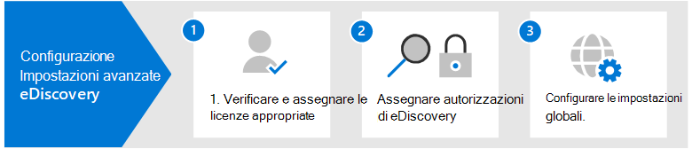

# Configurare Microsoft 365 Advanced eDiscoverySet up Microsoft 365 Advanced eDiscovery

Advanced eDiscovery in Microsoft 365 offre un flusso di lavoro end-to-end per conservare, raccogliere, esaminare, analizzare ed esportare i dati in grado di rispondere alle indagini interne ed esterne dell'organizzazione.Advanced eDiscovery in Microsoft 365 provides an end-to-end workflow to preserve, collect, review, analyze, and export data that's responsive to your organization's internal and external investigations. Non è necessario distribuire Advanced eDiscovery, ma esistono alcune attività preliminari che un amministratore IT e un manager di eDiscovery devono completare prima che l'organizzazione possa iniziare a creare e utilizzare casi di eDiscovery avanzati per gestire le indagini.Nothing is needed to deploy Advanced eDiscovery, but there are some prerequisite tasks that an IT admin and eDiscovery manager have to complete before your organization can start to create and use Advanced eDiscovery cases to manage your investigations.

In questo articolo vengono illustrati i passaggi seguenti necessari per configurare Advanced eDiscovery.This article discusses the following steps necessary to set up Advanced eDiscovery.

Ciò include la garanzia delle licenze appropriate necessarie per accedere a Advanced eDiscovery e aggiungere i custodi ai casi e l'assegnazione delle autorizzazioni al team legale e di indagine in modo che possano accedere e gestire i casi.This includes ensuring the proper licensing required to access Advanced eDiscovery and add custodians to cases, and assigning permissions to your legal and investigation team so they can access and manage cases.

## Passaggio 1: Verificare e assegnare licenze appropriateStep 1: Verify and assign appropriate licenses

Le licenze per Advanced eDiscovery richiedono l'abbonamento all'organizzazione appropriato e le licenze per utente.Licensing for Advanced eDiscovery requires the appropriate organization subscription and per-user licensing. Per un elenco dei requisiti di licenza per Advanced eDiscovery, vedere [Sottoscrizioni e licenze.](overview-ediscovery-20.md#subscriptions-and-licensing)For a list of licensing requirements for Advanced eDiscovery, see [Subscriptions and licensing](overview-ediscovery-20.md#subscriptions-and-licensing).

## Passaggio 2: Assegnare le autorizzazioni di eDiscoveryStep 2: Assign eDiscovery permissions

Per accedere a Advanced eDiscovery o essere stato aggiunto come membro di un caso advanced eDiscovery, a un utente devono essere assegnate le autorizzazioni appropriate.To access Advanced eDiscovery or added as a member of an Advanced eDiscovery case, a user must be assigned the appropriate permissions. In particolare, un utente deve essere aggiunto come membro del gruppo di ruoli Manager eDiscovery nel Centro sicurezza & conformità.Specifically, a user must be added as a member of the eDiscovery Manager role group in the Security & Compliance Center. I membri di questo gruppo di ruoli possono creare e gestire i casi di Advanced eDiscovery.Members of this role group can create and manage Advanced eDiscovery cases. Possono aggiungere e rimuovere membri, mettere in attesa i custodi e i percorsi di contenuto, gestire le notifiche di blocco legale, creare e modificare le ricerche associate in un caso, aggiungere risultati di ricerca a un set di recensioni, analizzare i dati in un set di recensioni ed esportare e scaricare da un caso advanced eDiscovery.They can add and remove members, place custodians and content locations on hold, manage legal hold notifications, create and edit searches associated in a case, add search results to a review set, analyze data in a review set, and export and download from an Advanced eDiscovery case.

Completare la procedura seguente per aggiungere utenti al gruppo di ruoli Manager eDiscovery:Complete the following steps to add users to the eDiscovery Manager role group:

1. Accedere a e accedere utilizzando le credenziali per <https://protection.office.com/permissions> un account amministratore nell'organizzazione di Microsoft 365.Go to <https://protection.office.com/permissions> and sign in using the credentials for an admin account in your Microsoft 365 organization.

2. Nella pagina **Autorizzazioni** selezionare il gruppo di ruoli **Manager eDiscovery.**On the **Permissions** page, select the **eDiscovery Manager** role group.

3. Nella pagina a comparsa Gestione eDiscovery fare clic su **Modifica** accanto alla sezione **Gestione eDiscovery.**On the eDiscovery Manager flyout page, click **Edit** next to the **eDiscovery Manager** section.

4. Nella pagina **Choose eDiscovery Manager** della procedura guidata edit role group fare clic **su Choose eDiscovery Manager.**On the **Choose eDiscovery Manager** page in the edit role group wizard, click **Choose eDiscovery Manager**.

5. Fare **clic su** Aggiungi, quindi selezionare la casella di controllo per tutti gli utenti che si desidera aggiungere al gruppo di ruoli.Click **Add** then select the checkbox for all users you want to add to the role group.

6. Fare **clic su** Aggiungi per aggiungere gli utenti selezionati e quindi fare clic su **Fine.**Click **Add** to add the selected users, and then click **Done**.

7. Fare **clic** su Salva per aggiungere gli utenti al gruppo di ruoli, quindi fare clic su **Chiudi** per completare il passaggio.Click **Save** to add the users to the role group, and then click **Close** to complete the step.

### Ulteriori informazioni sul gruppo di ruoli Manager eDiscoveryMore information about the eDiscovery Manager role group

Esistono due sottogruppi nel gruppo di ruoli Manager eDiscovery.There are two subgroups in the eDiscovery Manager role group. La differenza tra questi sottogruppi dipende dall'ambito.The difference between these subgroups is based on scope.

- **eDiscovery Manager:** può visualizzare e gestire i casi di Advanced eDiscovery creati o di cui sono membri.**eDiscovery Manager**: Can view and manage the Advanced eDiscovery cases they create or are a member of. Se un altro responsabile di eDiscovery crea un caso ma non aggiunge un secondo responsabile di eDiscovery come membro di tale caso, il secondo gestore di eDiscovery non sarà in grado di visualizzare o aprire il caso nella pagina Advanced eDiscovery nel Centro conformità.If another eDiscovery Manager creates a case but doesn't add a second eDiscovery Manager as a member of that case, the second eDiscovery Manager won't be able to view or open the case on the Advanced eDiscovery page in the compliance center. In generale, la maggior parte degli utenti dell'organizzazione può essere aggiunta al sottogruppo Manager di eDiscovery.In general, most people in your organization can be added to the eDiscovery Manager subgroup.

- **Amministratore di eDiscovery:** può eseguire tutte le attività di gestione dei casi che possono essere eseguite da un responsabile di eDiscovery.**eDiscovery Administrator**: Can perform all case management tasks that an eDiscovery Manager can do. Inoltre, un amministratore di eDiscovery è in grado di:Additionally, an eDiscovery Administrator can:

  - Visualizzare tutti i casi elencati nella pagina Advanced eDiscovery.View all cases that are listed on the Advanced eDiscovery page.
  
  - Gestire qualsiasi caso nell'organizzazione dopo essersi aggiunti come membri del caso.Manage any case in the organization after they add themselves as a member of the case.

  - Accedere ed esportare i dati del caso per qualsiasi caso nell'organizzazione.Access and export case data for any case in the organization.

  A causa dell'ampio ambito di accesso, un'organizzazione deve avere solo pochi amministratori membri del sottogruppo Amministratori di eDiscovery.Because of the broad scope of access, an organization should have only a few admins who are members of the eDiscovery Administrators subgroup.

Per ulteriori informazioni sulle autorizzazioni di eDiscovery e una descrizione di ogni ruolo assegnato al gruppo di ruoli Manager eDiscovery, vedere [Assign eDiscovery permissions](assign-ediscovery-permissions.md).For more information about eDiscovery permissions and a description of each role that's assigned to the eDiscovery Manager role group, see [Assign eDiscovery permissions](assign-ediscovery-permissions.md).

## Passaggio 3: Configurare le impostazioni globali per Advanced eDiscoveryStep 3: Configure global settings for Advanced eDiscovery

L'ultimo passaggio da completare prima che gli utenti dell'organizzazione inizino a creare e utilizzare i casi consiste nel configurare le impostazioni globali applicabili a tutti i casi dell'organizzazione.The last step to complete before people in your organization start to create and use cases is to configure global settings that apply to all cases in your organization. In questo momento, l'unica impostazione globale è il rilevamento dei privilegi *avvocato-client* (altre impostazioni globali saranno disponibili in futuro).At this time, the only global setting is *attorney-client privilege detection* (more global settings will be available in the future). Questa impostazione consente l'esecuzione del modello di privilegio avvocato-client quando si analizzano i dati in un set di revisione.This setting enables the attorney-client privilege model to run when you analyze data in a review set. Il modello usa l'apprendimento automatico per determinare la probabilità che un documento contenga contenuto di natura legale.The model uses machine learning to determine the likelihood that a document contains content that is legal in nature. Confronta inoltre i partecipanti ai documenti con un elenco di avvocati (inviato durante la configurazione del modello) per determinare se un documento ha almeno un partecipante che è un avvocato.It also compares the participants of documents with an attorney list (that you submit when setting up the model) to determine if a document has at least one participant who is an attorney.

Per ulteriori informazioni sulla configurazione e sull'utilizzo del modello di rilevamento dei privilegi [avvocato-client, vedere Set up attorney-client privilege detection in Advanced eDiscovery.](attorney-privilege-detection.md)For more information about setting up and using the attorney-client privilege detection model, see [Set up attorney-client privilege detection in Advanced eDiscovery](attorney-privilege-detection.md).

> [!NOTE]
> Si tratta di un passaggio facoltativo che è possibile eseguire in qualsiasi momento.This is an optional step that you can perform anytime. La non implementazione del modello di rilevamento dei privilegi avvocato-client non impedisce la creazione e l'utilizzo di casi di Advanced eDiscovery.Not implementing the attorney-client privilege detection model doesn't prevent you from creating and using Advanced eDiscovery cases.

## Passaggi successiviNext steps

Dopo aver configurato Advanced eDiscovery, è possibile [creare un caso.](create-and-manage-advanced-ediscoveryv2-case.md)After you set up Advanced eDiscovery, you're ready to [create a case](create-and-manage-advanced-ediscoveryv2-case.md).