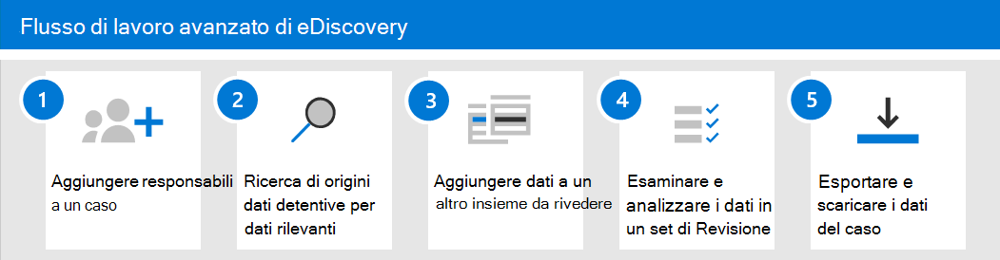

# Introduzione ad Advanced eDiscovery

Advanced eDiscovery in Microsoft 365 offre un [flusso di lavoro end-to-end](overview-ediscovery-20.md#advanced-ediscovery-architecture) per conservare, raccogliere, esaminare, analizzare ed esportare i dati che rispondono alle indagini interne ed esterne dell'organizzazione. Non è necessario eseguire alcuna operazione per la distribuzione di Advanced eDiscovery, ma sono necessarie alcune attività prerequisite che devono essere completate da un amministratore IT e da un responsabile di eDiscovery prima che l'organizzazione possa iniziare a creare e utilizzare i casi avanzati di eDiscovery per gestire le indagini.

In questo articolo vengono illustrati i passaggi necessari per configurare Advanced eDiscovery. In questo modo è possibile garantire la corretta gestione delle licenze necessarie per accedere a Advanced eDiscovery e aggiungere i depositari ai casi, nonché assegnare le autorizzazioni al team legale e investigativo affinché possano accedere e gestire i casi. In questo articolo viene inoltre fornita una panoramica generale dell'utilizzo dei casi per gestire il flusso di lavoro avanzato di eDiscovery per un'indagine legale.

## Passaggio 1: verifica e assegnazione delle licenze appropriate

La gestione delle licenze per Advanced eDiscovery richiede la sottoscrizione dell'organizzazione appropriata e la gestione delle licenze per utente.

- **Sottoscrizione organizzazione:** Per accedere alle funzionalità avanzate di eDiscovery nel centro conformità di Microsoft 365 o nel centro sicurezza & conformità, è necessario che l'organizzazione disponga di uno dei seguenti elementi:

  - Abbonamento a Microsoft 365 E5 o a Office 365 E5
  
  - Abbonamento a Microsoft 365 E3 con il componente aggiuntivo E5 Compliance

  - Sottoscrizione Microsoft 365 E3 con E5 eDiscovery e componente aggiuntivo di controllo

  Se non si dispone di un piano Microsoft 365 E5 esistente e si desidera provare Advanced eDiscovery, è possibile [aggiungere microsoft 365](https://docs.microsoft.com/office365/admin/try-or-buy-microsoft-365) alla sottoscrizione esistente oppure [iscriversi per una versione di valutazione](https://www.microsoft.com/microsoft-365/enterprise) di Microsoft 365 E5.

- **Licenze per utente:** Per aggiungere un utente come custode in un caso di eDiscovery Advance, all'utente deve essere assegnata una delle licenze seguenti, a seconda dell'abbonamento dell'organizzazione:

  - Microsoft 365: agli utenti deve essere assegnata una licenza Microsoft 365 E5, una licenza per i componenti aggiuntivi per la conformità E5 o una licenza E5 eDiscovery e Audit Add-on.

  - Office 365: agli utenti deve essere assegnata una licenza di Office 365 E5.

   Per informazioni su come assegnare le licenze, vedere [assegnare licenze agli utenti](https://docs.microsoft.com/microsoft-365/admin/manage/assign-licenses-to-users).

> [!NOTE]
> Gli utenti hanno solo bisogno di una licenza E5 (o la licenza del componente aggiuntivo appropriato) da aggiungere come depositari a un caso avanzato di eDiscovery. Gli amministratori IT, i responsabili di eDiscovery, gli avvocati, i paralegals o gli investigatori che utilizzano Advanced eDiscovery per gestire i casi e esaminare i dati del caso non necessitano di una licenza E5 o di un componente aggiuntivo.

## Passaggio 2: assegnare autorizzazioni di eDiscovery

Per accedere a Advanced eDiscovery o aggiunto come membro di un caso avanzato di eDiscovery, a un utente devono essere assegnate le autorizzazioni appropriate. In particolare, un utente deve essere aggiunto come membro del gruppo di ruoli di gestione di eDiscovery nel centro sicurezza & conformità. I membri di questo gruppo di ruoli possono creare e gestire i casi di eDiscovery avanzati. Sono in grado di aggiungere e rimuovere membri, inserire depositari e posizioni di contenuto in attesa, gestire le notifiche per la conservazione legale, creare e modificare le ricerche associate a un caso, aggiungere i risultati di ricerca a un set di revisione, analizzare i dati in un set di revisione ed esportare e scaricare da un caso avanzato di eDiscovery.

Completare la procedura seguente per aggiungere gli utenti al gruppo di ruoli eDiscovery Manager:

1. Accedere a [https://protection.office.com/permissions](https://protection.office.com/permissions) e accedere usando le credenziali per un account di amministratore nell'organizzazione Microsoft 365.

2. Nella pagina **autorizzazioni** selezionare il gruppo di ruoli **eDiscovery Manager** .

3. Nella pagina riquadro a comparsa di eDiscovery Manager, fare clic su **modifica** accanto alla sezione **gestione eDiscovery** .

4. Nella pagina **Scegli eDiscovery Manager** nella procedura guidata modifica gruppo di ruoli fare clic su **Scegli gestione eDiscovery**.

5. Fare clic su **Aggiungi** e quindi selezionare la casella di controllo per tutti gli utenti che si desidera aggiungere al gruppo di ruoli.

6. Fare clic su **Aggiungi** per aggiungere gli utenti selezionati, quindi fare clic su **fine**.

7. Fare clic su **Salva** per aggiungere gli utenti al gruppo di ruoli, quindi fare clic su **Chiudi** per completare il passaggio.

### Ulteriori informazioni sul gruppo di ruoli eDiscovery Manager

Nel gruppo di ruoli eDiscovery Manager sono presenti due sottogruppi. La differenza tra questi sottogruppi dipende dall'ambito.

- **eDiscovery Manager:** È possibile visualizzare e gestire i casi di eDiscovery avanzati che creano o sono membri di. Se un altro Manager di eDiscovery crea un caso ma non aggiunge un secondo Manager di eDiscovery come membro del caso, il secondo responsabile di eDiscovery non sarà in grado di visualizzare o aprire il caso nella pagina Advanced eDiscovery nel centro conformità. In generale, la maggior parte delle persone nell'organizzazione può essere aggiunta al sottogruppo di gestione di eDiscovery.

- **amministratore di eDiscovery:** È in grado di eseguire tutte le attività di gestione dei casi che un Manager di eDiscovery può eseguire. Inoltre, un amministratore di eDiscovery è in grado di:

  - Visualizzare tutti i casi elencati nella pagina Advanced eDiscovery.
  
  - Gestire qualsiasi caso nell'organizzazione dopo che si è aggiunto come membro del caso.

  - Accedere ed esportare i dati del caso per qualsiasi caso nell'organizzazione.

  A causa dell'ampio ambito di accesso, un'organizzazione deve disporre di un numero limitato di amministratori che sono membri del sottogruppo Administrators di eDiscovery.

Per ulteriori informazioni sulle autorizzazioni di eDiscovery e una descrizione di ogni ruolo assegnato al gruppo di ruoli Gestione eDiscovery, vedere [assign eDiscovery Permissions](assign-ediscovery-permissions.md).

## Passaggio 3: configurare le impostazioni globali per Advanced eDiscovery

L'ultimo passaggio da eseguire prima che gli utenti dell'organizzazione inizino a creare e a utilizzare i casi è la configurazione delle impostazioni globali che si applicano a tutti i casi nell'organizzazione. In questo momento, l'unica impostazione globale è il *rilevamento dei privilegi avvocato-client* (altre impostazioni globali saranno disponibili in futuro). Questa impostazione consente l'esecuzione del modello di privilegio avvocato-client quando si analizzano i dati in un set di revisione. Il modello utilizza l'apprendimento automatico per determinare la probabilità che un documento contenga contenuto che sia di natura legale. Confronta anche i partecipanti dei documenti con un elenco di avvocati (che viene inviato quando si configura il modello) per determinare se un documento ha almeno un partecipante che è un avvocato.

Per ulteriori informazioni sulla configurazione e sull'utilizzo del modello di rilevamento dei privilegi di avvocato-client, vedere [set up Attorney-Client Privilege Detection in Advanced eDiscovery](attorney-privilege-detection.md).

> [!NOTE]
> Si tratta di un passaggio facoltativo che è possibile eseguire in qualsiasi momento. L'implementazione del modello di rilevamento dei privilegi avvocato-client non impedisce la creazione e l'utilizzo di casi di eDiscovery avanzati.

## Passaggio 4: creare un caso di eDiscovery avanzato

Il passaggio successivo consiste nel creare un caso e iniziare a utilizzare Advanced eDiscovery. Completare la procedura seguente per creare un caso e aggiungere membri. L'utente che crea il caso viene aggiunto automaticamente come membro.

1. Passare a [https://compliance.microsoft.com](https://compliance.microsoft.com) e accedere con un account utente a cui sono state assegnate le autorizzazioni di eDiscovery appropriate. I membri del gruppo di ruoli Gestione organizzazione possono anche creare casi avanzati di eDiscovery.

2. Nel riquadro di spostamento a sinistra del centro conformità di Microsoft 365 fare clic su **Mostra tutto**, quindi fare clic su **eDiscovery > avanzate**.

3. Nella pagina **Advanced eDiscovery** , fare clic sulla scheda **case** , quindi fare clic su **Crea un caso**.

4. Nella pagina **nuovo** riquadro a comparsa del caso di eDiscovery, assegnare un nome al caso (obbligatorio) e quindi digitare un numero di caso facoltativo e una descrizione. Il nome del caso deve essere univoco nell'organizzazione.

5. Fare clic su **Salva** per creare il caso.

   Viene creato il nuovo caso e viene visualizzata la scheda **Impostazioni** del nuovo caso.

6. Nella sezione **accesso & autorizzazioni** della scheda **Impostazioni** fare clic su **Seleziona** e quindi su **Aggiorna**.

7. Fare clic su **Aggiorna**.

8. Nella pagina **Gestisci** il riquadro a comparsa di questo caso, in **Manage members** fare clic su **Aggiungi** per aggiungere membri al caso.

9. Nell'elenco di utenti selezionare la casella di controllo accanto ai nomi degli utenti che si desidera aggiungere al caso. Come spiegato in precedenza, accertarsi che alle persone aggiunte al caso siano state assegnate le autorizzazioni di eDiscovery appropriate.

10. Dopo aver selezionato gli utenti da aggiungere come membri del caso, fare clic su **Aggiungi**.

11. Nella pagina **Gestisci** il riquadro a comparsa di questo caso, fare clic su **Salva** per salvare il nuovo elenco dei membri del caso.

12. Fare clic sulla scheda **Home** per passare alla Home page del case.

## Esplorare il flusso di lavoro avanzato di eDiscovery

Per iniziare a utilizzare Advanced eDiscovery, ecco un semplice flusso di lavoro che si allinea con le [procedure di eDiscovery comuni](overview-ediscovery-20.md#alignment-with-edrm). In ognuno di questi passaggi verranno evidenziate anche alcune funzionalità estese avanzate di eDiscovery che è possibile esplorare.

1. **[Aggiungere i depositari a un caso](add-custodians-to-case.md)**. Il primo passaggio dopo la creazione di un caso consiste nell'aggiungere depositari. Un *custode* è una persona che ha il controllo amministrativo di un documento o di un file elettronico che potrebbe essere pertinente alla causa. Di seguito sono riportate alcune operazioni che possono essere eseguite (o che è possibile eseguire) quando si aggiungono i depositari a un caso:

   - I dati nella cassetta postale di Exchange del custode, nell'account OneDrive e in tutti i gruppi di Microsoft teams o Yammer a cui il custode è membro possono essere "contrassegnati" come dati di custodia nel caso.
  
   - I dati del custode vengono reindicizzati (tramite un processo denominato *Advanced indicizzazione*). Questo consente di ottimizzare la ricerca nel passaggio successivo.
  
   - È possibile applicare un'esenzione ai dati del custode. Questo consente di conservare i dati che potrebbero essere rilevanti per il caso durante l'inchiesta.
  
   - È possibile associare altre origini dati a un custode (ad esempio, è possibile associare un sito di SharePoint o un gruppo di Microsoft 365 a un custode), in modo che i dati possano essere reindicizzati, conservati e ricercati, come i dati della cassetta postale o dell'account di OneDrive della banca depositaria.

   - È possibile utilizzare il [flusso di lavoro comunicazioni](managing-custodian-communications.md) in Advanced eDiscovery per inviare una notifica di conservazione legale ai depositari.

2. **[Ricercare le origini dati detentive per i dati rilevanti per il caso](collecting-data-for-ediscovery.md)**. Dopo aver aggiunto i depositari a un caso, utilizzare lo strumento di ricerca incorporato per eseguire ricerche nei percorsi dei dati del custode per i dati che possono essere rilevanti per il caso. È possibile utilizzare parole chiave, proprietà e condizioni per [creare query di ricerca](building-search-queries.md) che restituiscono i risultati della ricerca con i dati più probabili rilevanti per il caso. È inoltre possibile:

   - Visualizzare le [statistiche di ricerca](search-statistics-in-advanced-ediscovery.md) che consentono di affinare una query di ricerca per restringere i risultati.

   - Visualizzare in anteprima i risultati della ricerca per verificare rapidamente se i dati rilevanti sono stati trovati.

   - Rivedere una query ed eseguire nuovamente la ricerca.

3. **[Aggiungere dati a un set di revisione](add-data-to-review-set.md)**. Dopo aver configurato e verificato che una ricerca restituisce i dati desiderati, il passaggio successivo consiste nell'aggiungere i risultati della ricerca a un set di revisione. Quando si aggiungono dati a un set di revisione, gli elementi vengono copiati dal percorso originale a un percorso di archiviazione di Azure sicuro. I dati vengono riindicizzati di nuovo per ottimizzare le ricerche accurate e veloci quando si esaminano e analizzano gli elementi nel set di revisione. Inoltre, è anche possibile [aggiungere dati non di Office 365 in un set di revisione](load-non-office-365-data-into-a-review-set.md).

   È inoltre disponibile un tipo speciale di recensione a cui è possibile aggiungere dati, denominato set di *recensioni di conversazione*. Questi tipi di set di revisione offrono funzionalità di ricostruzione delle conversazioni per ricostruire, rivedere ed esportare conversazioni filettate come quelle di Microsoft teams. Per ulteriori informazioni, vedere [rivedere le conversazioni in Advanced eDiscovery](conversation-review-sets.md).

4. **Esaminare e analizzare i dati in un set di revisione**. Ora che i dati si trova in un set di revisione, è possibile utilizzare una vasta gamma di strumenti e funzionalità per visualizzare e analizzare i dati del caso con l'obiettivo di ridurre il set di dati a ciò che è più pertinente per il caso in cui si sta indagando. Ecco un elenco di alcuni strumenti e funzionalità che è possibile utilizzare durante questo processo.

   - [Visualizzare i documenti](view-documents-in-review-set.md). Ciò include la visualizzazione dei metadati per ogni documento in un set di revisione e la visualizzazione del documento nella versione nativa o nella versione di testo.

   - [Creare query e filtri](review-set-search.md). È possibile creare query di ricerca utilizzando una vasta gamma di criteri di ricerca (inclusa la possibilità di eseguire una ricerca in tutte le [proprietà dei metadati di file](document-metadata-fields-in-advanced-ediscovery.md)) per affinare ulteriormente i dati del caso e abbatterli in ciò che è più pertinente al caso. È inoltre possibile utilizzare i filtri set di revisione per applicare rapidamente ulteriori condizioni ai risultati di una query di ricerca per affinare ulteriormente i risultati.

   - [Creare e utilizzare i tag](tagging-documents.md). È possibile applicare tag ai documenti in un set di revisione per identificare quali reattivi (o non rispondere al caso) e quindi utilizzare tali tag durante la creazione di query di ricerca per includere o escludere i documenti contrassegnati. È inoltre possibile contrassegnare per determinare i documenti da esportare.

   - [Annota e redigere i documenti](view-documents-in-review-set.md#annotate-view). È possibile utilizzare lo strumento annotazione in una recensione per annotare i documenti e il contenuto di redigere in documenti come prodotto di lavoro. Durante la revisione viene generata una versione in formato PDF di un documento annotato o redatto per ridurre il rischio di esportare la versione nativa non ritirata del documento.

   - [Analizzare i dati del caso](analyzing-data-in-review-set.md). La funzionalità di analisi in Advanced eDiscovery è potente. Advanced eDiscovery fornisce una serie di strumenti per analizzare i documenti in modo da ridurre ulteriormente il volume dei documenti da rivedere in un set di revisione. Inoltre, vengono generati report di analisi che riepilogano il risultato dell'esecuzione di analisi. Come spiegato in precedenza, l'esecuzione di analisi esegue anche [il modello di rilevamento dei privilegi del procuratore client](attorney-privilege-detection.md#use-the-attorney-client-privilege-detection-model).

5. **Esportare e scaricare i dati del caso**. Un passaggio finale dopo la raccolta, la revisione e l'analisi dei dati del caso consiste nell'esportarlo da Advanced eDiscovery per la revisione esterna o per la verifica da parte di utenti esterni al team di analisi. L'esportazione dei dati è un processo in due passaggi. Il primo passaggio consiste nell' [esportare](export-documents-from-review-set.md) i dati dall'insieme di revisione e copiarli in una posizione di archiviazione di Azure diversa (uno fornito da Microsoft o da uno gestito dall'organizzazione). Utilizzare quindi Esplora archivi di Azure per [scaricare](download-export-jobs.md) i dati in un computer locale. Oltre ai file di dati esportati, il contenuto del pacchetto di esportazione contiene anche un rapporto di esportazione, un rapporto riepilogativo e un report di errore.
