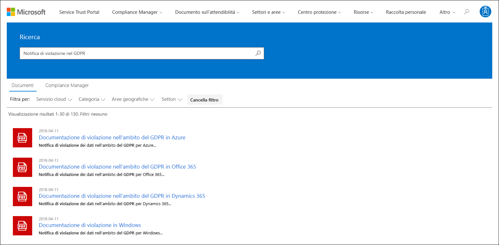
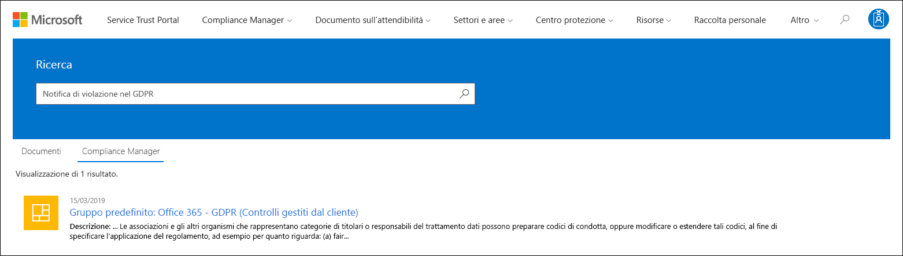
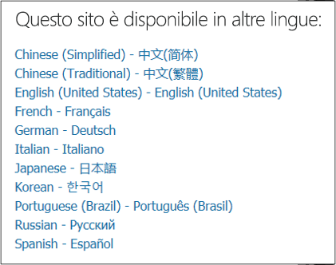

# Introduzione a Microsoft Service Trust Portal

Microsoft Service Trust Portal offre una vasta gamma di contenuti, strumenti e altre risorse relative alle procedure di sicurezza, privacy e conformità di Microsoft.

## Accesso al Service Trust Portal

Il Service Trust Portal contiene informazioni dettagliate sull'implementazione di controlli e processi di Microsoft che proteggono i servizi cloud e i dati dei clienti in esso contenuti. Per accedere ad alcune delle risorse nel Service Trust Portal, è necessario eseguire l'accesso come utente autenticato con l'account Microsoft Cloud Services (un account dell'organizzazione di Azure Active Directory o un account Microsoft) ed esaminare e accettare il contratto di non divulgazione Microsoft per i materiali di conformità.

### Clienti esistenti

I clienti esistenti possono accedere al Service Trust Portal <https://aka.ms/STP> con una delle sottoscrizioni online seguenti (Trial or paid):

- Microsoft 365
- Dynamics 365
- Azure

 > [!NOTE]
 > Gli account di Azure Active Directory associati alle organizzazioni dispongono dell'accesso all'intera gamma di documenti e funzionalità, come Compliance Manager. Gli account Microsoft creati per uso personale hanno accesso limitato al contenuto del portale del servizio di attendibilità dei servizi.

### Nuovi clienti e clienti che valutano i Microsoft Online Services

Per creare un nuovo account o creare un account di valutazione, utilizzare uno dei seguenti moduli di iscrizione (utilizzati anche per gli account di valutazione) per accedere all'STP.

- Iscriversi a un nuovo [account di valutazione di Microsoft 365 Apps for business](https://go.microsoft.com/fwlink/p/?LinkID=507653) o a un nuovo [account di valutazione di Office 365 Enterprise](https://go.microsoft.com/fwlink/p/?LinkID=698279)

- Iscriversi a un nuovo [account di valutazione di Dynamics 365](https://go.microsoft.com/fwlink/?LinkId=252780)

- Iscriversi a un nuovo [account di valutazione di Azure](https://go.microsoft.com/fwlink/?LinkId=722737).

Quando si esegue l'iscrizione a una versione di valutazione gratuita o a un abbonamento, è necessario abilitare Azure Active Directory per supportare l'accesso all'STP.

## Utilizzo del Service Trust Portal

Le funzionalità e il contenuto del portale di attendibilità del servizio sono accessibili dal menu principale.

Nelle sezioni seguenti viene descritto ogni elemento del menu principale.

### Service Trust Portal

Il collegamento **Service Trust Portal** Visualizza la Home page. Fornisce un modo rapido per tornare alla Home page.

### Compliance Manager

> [!IMPORTANT]
> Compliance Manager è stato spostato dal Service Trust Portal nel nuovo percorso nel [centro conformità di Microsoft 365](https://compliance.microsoft.com/). Tutti i dati dei clienti sono stati spostati nel nuovo percorso, quindi è possibile continuare a utilizzare Compliance Manager senza interruzioni. Per informazioni sulle nuove funzionalità, vedere la [documentazione relativa a Compliance Manager](compliance-manager.md) . Anche se la versione classica di Compliance Manager rimane nel Service Trust Portal, tutti gli utenti sono invitati a utilizzare Compliance Manager nel centro conformità di Microsoft 365.

### Documento sull’attendibilità

Offre una vasta gamma di informazioni sulla progettazione e l'implementazione della sicurezza con l'obiettivo di rendere più facile soddisfare gli obiettivi di conformità normativa mediante la comprensione del modo in cui i servizi cloud di Microsoft consentono di proteggere i dati. Per esaminare il contenuto, selezionare una delle opzioni seguenti nel menu a discesa **documenti attendibili** .

- **Rapporti di controllo:** Viene visualizzato un elenco dei rapporti di verifica e valutazione indipendenti sui servizi cloud di Microsoft. Questi rapporti forniscono informazioni sui servizi cloud Microsoft rispetto agli standard di protezione dei dati e ai requisiti normativi, ad esempio:

  - Organizzazione internazionale per la standardizzazione (ISO)
  - Service Organization Controls (SOC)
  - NIST (National Institute of Standards and Technology)
  - FedRAMP (Federal Risk and Authorization Management Program)
  - Regolamento generale sulla protezione dei dati (GDPR)

- **Protezione dei dati:** Contiene una vasta gamma di risorse, ad esempio controlli controllati, white paper, domande frequenti, test di penetrazione, strumenti di valutazione dei rischi e guide per la conformità.

- **Cianografie di sicurezza e conformità di Azure:** Risorse che consentono di creare applicazioni basate su cloud sicure e conformi. In questa sezione sono contenute linee guida per il governo, le finanze, le strutture sanitarie e le verticali di vendita al dettaglio.

### Settori e aree

Fornisce informazioni di conformità specifiche per l'industria e le aree geografiche sui servizi cloud Microsoft.

- **Industrie:** In questo momento, questa pagina fornisce una pagina di destinazione specifica del settore per il settore dei servizi finanziari. Questo contiene informazioni quali offerte di conformità, domande frequenti e storie di successo. Le risorse per più industrie verranno rilasciate in futuro, tuttavia è possibile trovare risorse per più industrie accedendo alla pagina dei **documenti di attendibilità > protezione dei dati** in STP.

- **Aree geografiche:** Fornisce pareri legali sui servizi cloud di Microsoft conformità con varie leggi di vari paesi. Alcuni paesi sono Australia, Canada, Repubblica Ceca, Danimarca, Germania, Polonia, Romania, Spagna e Regno Unito.

### Centro protezione

Collegamenti al [Centro protezione Microsoft](https://www.microsoft.com/trust-center), in cui sono disponibili ulteriori informazioni sulla sicurezza, la conformità e la privacy nel cloud Microsoft. Sono incluse informazioni sulle funzionalità dei servizi cloud di Microsoft che è possibile utilizzare per soddisfare i requisiti specifici di GDPR, la documentazione utile per la propria responsabilità GDPR e la comprensione delle misure tecniche e organizzative che Microsoft ha utilizzato per supportare la GDPR.

### Raccolta personale

Questa nuova funzionalità consente di salvare (o *aggiungere*) i documenti in modo che sia possibile accedervi rapidamente nella pagina raccolta personale. È inoltre possibile configurare le notifiche in modo che Microsoft invii un messaggio di posta elettronica quando i documenti nella raccolta personale vengono aggiornati. Per ulteriori informazioni, vedere la sezione [My Library](#my-library-1) in questo articolo.

### Altro

Andare a **più > amministratore** per accedere alle funzioni amministrative che sono disponibili solo per l'account di amministratore globale. Questa opzione è visibile solo quando l'utente ha eseguito l'accesso come amministratore globale. Nel menu a discesa **amministratore** sono disponibili due opzioni:

- **Impostazioni:** Questa pagina consente di assegnare i ruoli utente per Compliance Manager (Classic).

- **Impostazioni per la privacy degli utenti:** Questa pagina consente di esportare un report che contiene le assegnazioni di elementi di azione in Compliance Manager (Classic) per un utente specifico. È inoltre possibile riassegnare tutti gli elementi azione a un altro utente e rimuovere qualsiasi elemento di azione assegnato dall'utente specificato.

### Ricerca

Fare clic sulla lente di ingrandimento nell'angolo in alto a destra della pagina Service Trust Portal per espandere la casella, immettere i termini di ricerca e premere **invio**. Viene visualizzata **la pagina di ricerca,** con il termine di ricerca visualizzato nella casella di ricerca e i risultati di ricerca riportati di seguito.

Per impostazione predefinita, la ricerca restituisce i risultati dei documenti. È possibile filtrare i risultati utilizzando gli elenchi a discesa per affinare l'elenco dei documenti visualizzati. È possibile utilizzare più filtri per limitare l'elenco dei documenti. I filtri includono i servizi cloud specifici, le categorie di conformità o le procedure di sicurezza, le aree geografiche e le industrie. Fare clic sul collegamento nome documento per scaricare il documento.

Per elencare i controlli dalle valutazioni in Compliance Manager (classiche) correlate ai termini di ricerca, fare clic su **Compliance Manager**. I risultati della ricerca mostrano la data in cui è stata creata la valutazione, il nome del gruppo di valutazione, il servizio cloud Microsoft applicabile e se il controllo è Microsoft o gestito dal cliente. Fare clic sul nome del controllo per visualizzare il controllo nella valutazione in Compliance Manager (Classic).

> [!NOTE]
> I report e i documenti del portale di attendibilità del servizio sono disponibili per il download da almeno 12 mesi dopo la pubblicazione o fino a quando non diventa disponibile una nuova versione del documento.

## Raccolta personale

Utilizzare la funzionalità raccolta personale per aggiungere documenti e risorse nel Service Trust Portal alla pagina raccolta personale. In questo modo è possibile accedere ai documenti rilevanti in un'unica posizione.  Per aggiungere un documento alla raccolta personale, fare clic sul menu **...** a destra di un documento e quindi selezionare **Salva in raccolta**. È possibile aggiungere più documenti alla raccolta personale facendo clic sulla casella di controllo accanto a uno o più documenti e quindi facendo clic su **Salva in raccolta** nella parte superiore della pagina.

Inoltre, la caratteristica notifiche consente di configurare la raccolta personale in modo che un messaggio di posta elettronica venga inviato all'utente ogni volta che Microsoft aggiorna un documento che è stato aggiunto alla raccolta personale. Per configurare le notifiche, passare alla raccolta personale e fare clic su **impostazioni di notifica**. È possibile scegliere la frequenza delle notifiche e specificare un indirizzo di posta elettronica all'interno dell'organizzazione a cui inviare le notifiche. Le notifiche tramite posta elettronica includono collegamenti ai documenti che sono stati aggiornati e una breve descrizione dell'aggiornamento.

Si noti inoltre che sono stati identificati tutti i documenti nella raccolta personale che sono stati aggiornati negli ultimi 30 giorni, indipendentemente dal fatto che si attivano o meno le notifiche. Una breve descrizione dell'aggiornamento viene visualizzata anche in un suggerimento per gli strumenti.

## Starter Pack

Gli Starter Pack sono un insieme di documentazione a cura di Microsoft sui servizi cloud Microsoft per industrie specifiche. Attualmente, il Service Trust Portal offre i tre Starter Pack seguenti per le organizzazioni di servizi finanziari. Questi Starter Pack aiutano le organizzazioni a valutare e valutare la sicurezza, la conformità e la privacy nel cloud Microsoft e a fornire indicazioni utili per implementare i servizi cloud Microsoft nel settore dei servizi finanziari altamente regolamentato.

- **Pacchetto di avvio di valutazione:** Utilizzare per la valutazione precoce del cloud Microsoft per le organizzazioni di servizi finanziari.

- **Pacchetto di avvio di valutazione:** Dopo la valutazione, utilizzare gli elenchi di controllo e altre linee guida di questo Starter Pack per aiutare l'organizzazione a valutare i rischi legati alla sicurezza, alla conformità e alla privacy.

- **Starter Pack di controllo:** Utente questo pacchetto introduttivo per informazioni sull'utilizzo dei controlli di controllo e di altro strumento per contribuire all'implementazione di Microsoft Cloud Services in modo da ridurre l'esposizione ai rischi dell'organizzazione.

Per accedere a questi Starter Pack, accedere a **Service Trust Portal > Industries & regions > soluzioni del settore > servizi finanziari**. È possibile aprire o scaricare documenti da un pacchetto di avvio o salvarli nella raccolta personale.

## Supporto alla localizzazione

Il Service Trust Portal consente di visualizzare il contenuto della pagina in diverse lingue. Per modificare la lingua della pagina, è sufficiente fare clic sull'icona Globe nell'angolo in basso a sinistra della pagina e selezionare la lingua desiderata.

## Inviare commenti e suggerimenti

È possibile ottenere ulteriori informazioni sul Service Trust Portal oppure sugli errori che si verificano quando si utilizza il portale. È inoltre possibile contattarci con domande e commenti e suggerimenti relativi ai report di conformità e alle risorse di attendibilità dei servizi attendibili utilizzando il collegamento commenti e suggerimenti nella parte inferiore delle pagine STP.

Il feedback degli utenti è importante per noi. Fare clic sul pulsante feedback nella parte inferiore della pagina per inviarci commenti su cosa hai fatto o non ti piace, oppure suggerimenti per migliorare i prodotti o le caratteristiche del prodotto.

