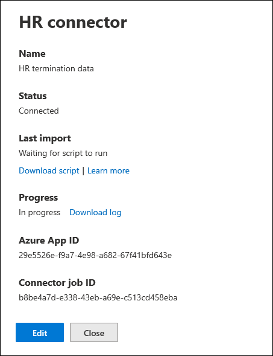

# <a name="set-up-a-connector-to-import-hr-data-in-us-government"></a><span data-ttu-id="9386e-104">Configurare un connettore per importare i dati delle risorse umane in US Government</span><span class="sxs-lookup"><span data-stu-id="9386e-104">Set up a connector to import HR data in US Government</span></span>

<span data-ttu-id="9386e-105">È possibile configurare un connettore dati nel Centro conformità Microsoft 365 per importare i dati delle risorse umane nell'organizzazione del governo statunitense.</span><span class="sxs-lookup"><span data-stu-id="9386e-105">You can set up a data connector in the Microsoft 365 compliance center to import human resources (HR) data to your US Government organization.</span></span> <span data-ttu-id="9386e-106">I dati relativi alle risorse umane includono la data in cui un dipendente ha inviato le proprie dimissioni e la data dell'ultimo giorno del dipendente.</span><span class="sxs-lookup"><span data-stu-id="9386e-106">HR-related data includes the date an employee submitted their resignation and date of the employee's last day.</span></span> <span data-ttu-id="9386e-107">Questi dati sulle risorse umane possono quindi essere utilizzati dalle soluzioni di protezione delle informazioni Microsoft, ad esempio la soluzione di gestione dei rischi [insider,](insider-risk-management.md)per proteggere l'organizzazione da attività dannose o furti di dati all'interno dell'organizzazione.</span><span class="sxs-lookup"><span data-stu-id="9386e-107">This HR data can then be used by Microsoft information protection solutions, such as the [insider risk management solution](insider-risk-management.md), to help protect your organization from malicious activity or data theft inside your organization.</span></span> <span data-ttu-id="9386e-108">La configurazione di un connettore hr consiste nella creazione di un'app in Azure Active Directory usata per l'autenticazione da parte del connettore, nella creazione di un file di mapping CSV contenente i dati delle risorse umane, nella creazione di un connettore dati nel Centro conformità e quindi nell'esecuzione di uno script (su base pianificata) che inserisce i dati delle risorse umane nel file CSV nel cloud Microsoft.</span><span class="sxs-lookup"><span data-stu-id="9386e-108">Setting up an HR connector consists of creating an app in Azure Active Directory that's used for authentication by connector, creating a CSV mapping files that contains your HR data, creating a data connector in the compliance center, and then running a script (on a scheduled basis) that ingests the HR data in the CSV file to the Microsoft cloud.</span></span> <span data-ttu-id="9386e-109">Il connettore dati viene quindi utilizzato dallo strumento di gestione dei rischi insider per accedere ai dati delle risorse umane importati nell'organizzazione di Microsoft 365 US Government.</span><span class="sxs-lookup"><span data-stu-id="9386e-109">Then the data connector is used by the insider risk management tool to access the HR data that was imported to your Microsoft 365 US Government organization.</span></span>

## <a name="before-you-begin"></a><span data-ttu-id="9386e-110">Prima di iniziare</span><span class="sxs-lookup"><span data-stu-id="9386e-110">Before you begin</span></span>

- <span data-ttu-id="9386e-111">All'utente che crea il connettore HR nel passaggio 3 deve essere assegnato il ruolo Esportazione importazione cassette postali in Exchange Online.</span><span class="sxs-lookup"><span data-stu-id="9386e-111">The user who creates the HR connector in Step 3 must be assigned the Mailbox Import Export role in Exchange Online.</span></span> <span data-ttu-id="9386e-112">Per impostazione predefinita, questo ruolo non è assegnato ad alcun gruppo di ruoli in Exchange Online.</span><span class="sxs-lookup"><span data-stu-id="9386e-112">By default, this role isn't assigned to any role group in Exchange Online.</span></span> <span data-ttu-id="9386e-113">È possibile aggiungere il ruolo Esportazione importazione cassette postali al gruppo di ruoli Gestione organizzazione in Exchange Online.</span><span class="sxs-lookup"><span data-stu-id="9386e-113">You can add the Mailbox Import Export role to the Organization Management role group in Exchange Online.</span></span> <span data-ttu-id="9386e-114">In caso contrario, è possibile creare un nuovo gruppo di ruoli, assegnare il ruolo importazione/esportazione delle cassette postali e quindi aggiungere gli utenti appropriati come membri.</span><span class="sxs-lookup"><span data-stu-id="9386e-114">Or you can create a new role group, assign the Mailbox Import Export role, and then add the appropriate users as members.</span></span> <span data-ttu-id="9386e-115">Per ulteriori informazioni, vedere le sezioni [Create role groups](/Exchange/permissions-exo/role-groups#create-role-groups) o Modify role [groups](/Exchange/permissions-exo/role-groups#modify-role-groups) nell'articolo "Manage role groups in Exchange Online".</span><span class="sxs-lookup"><span data-stu-id="9386e-115">For more information, see the [Create role groups](/Exchange/permissions-exo/role-groups#create-role-groups) or [Modify role groups](/Exchange/permissions-exo/role-groups#modify-role-groups) sections in the article "Manage role groups in Exchange Online".</span></span>

- <span data-ttu-id="9386e-116">Dovrai determinare come recuperare o esportare i dati dal sistema hr dell'organizzazione (a intervalli regolari) e aggiungerli al file CSV descritto nel passaggio 2.</span><span class="sxs-lookup"><span data-stu-id="9386e-116">You'll need to determine how to retrieve or export the data from your organization's HR system (on a regular basis) and add it to the CSV file that's described in Step 2.</span></span> <span data-ttu-id="9386e-117">Lo script eseguito nel passaggio 4 carica i dati delle risorse umane nel file CSV nel cloud Microsoft.</span><span class="sxs-lookup"><span data-stu-id="9386e-117">The script that you run in Step 4 will upload the HR data in the CSV file to the Microsoft cloud.</span></span>

- <span data-ttu-id="9386e-118">Lo script di esempio eseguito nel passaggio 4 consente di caricare i dati delle risorse umane nel cloud Microsoft in modo che possano essere utilizzati da altri strumenti Microsoft, ad esempio la soluzione di gestione dei rischi insider.</span><span class="sxs-lookup"><span data-stu-id="9386e-118">The sample script that you run in Step 4 will upload HR data to the Microsoft cloud so that it can be used by other Microsoft tools, such as the insider risk management solution.</span></span> <span data-ttu-id="9386e-119">Questo script di esempio non è supportato in alcun servizio o programma di supporto standard Microsoft.</span><span class="sxs-lookup"><span data-stu-id="9386e-119">This sample script isn't supported under any Microsoft standard support program or service.</span></span> <span data-ttu-id="9386e-120">Lo script di esempio è fornito così come è senza alcun tipo di garanzia.</span><span class="sxs-lookup"><span data-stu-id="9386e-120">The sample script is provided AS IS without warranty of any kind.</span></span> <span data-ttu-id="9386e-121">Microsoft esclude inoltre qualsiasi garanzia implicita, tra cui, senza limitazioni, tutte le garanzie implicite di commerciabilità o idoneità per uno scopo specifico.</span><span class="sxs-lookup"><span data-stu-id="9386e-121">Microsoft further disclaims all implied warranties including, without limitation, any implied warranties of merchantability or of fitness for a particular purpose.</span></span> <span data-ttu-id="9386e-122">L'utente assume tutti i rischi associati all'uso o alle prestazioni dello script di esempio e della documentazione.</span><span class="sxs-lookup"><span data-stu-id="9386e-122">The entire risk arising out of the use or performance of the sample script and documentation remains with you.</span></span> <span data-ttu-id="9386e-123">In nessun caso Microsoft, i suoi autori o chiunque altro coinvolto nella creazione, produzione o consegna degli script è da ritenersi responsabile per qualsiasi danno eventuale (inclusi, senza limitazione alcuna, danni riguardanti profitti aziendali, interruzione di attività, perdita di informazioni aziendali o altra perdita pecuniaria) derivanti dall'utilizzo o dall'incapacità di utilizzo degli script di esempio e della documentazione, anche nel caso in cui Microsoft sia stata avvisata della possibilità di tali danni.</span><span class="sxs-lookup"><span data-stu-id="9386e-123">In no event shall Microsoft, its authors, or anyone else involved in the creation, production, or delivery of the scripts be liable for any damages whatsoever (including, without limitation, damages for loss of business profits, business interruption, loss of business information, or other pecuniary loss) arising out of the use of or inability to use the sample scripts or documentation, even if Microsoft has been advised of the possibility of such damages.</span></span>

## <a name="step-1-create-an-app-in-azure-active-directory"></a><span data-ttu-id="9386e-124">Passaggio 1: Creare un'app in Azure Active Directory</span><span class="sxs-lookup"><span data-stu-id="9386e-124">Step 1: Create an app in Azure Active Directory</span></span>

<span data-ttu-id="9386e-125">Il primo passaggio consiste nel creare e registrare una nuova app in Azure Active Directory (Azure AD).</span><span class="sxs-lookup"><span data-stu-id="9386e-125">The first step is to create and register a new app in Azure Active Directory (Azure AD).</span></span> <span data-ttu-id="9386e-126">L'app corrisponderà al connettore HR creato nel passaggio 3.</span><span class="sxs-lookup"><span data-stu-id="9386e-126">The app will correspond to the HR connector that you create in Step 3.</span></span> <span data-ttu-id="9386e-127">La creazione di questa app consentirà ad Azure AD di autenticare il connettore HR quando viene eseguito e tenterà di accedere all'organizzazione.</span><span class="sxs-lookup"><span data-stu-id="9386e-127">Creating this app will allow Azure AD to authenticate the HR connector when it runs and attempts to access your organization.</span></span> <span data-ttu-id="9386e-128">Questa app verrà usata anche per autenticare lo script eseguito nel passaggio 4 per caricare i dati delle risorse umane nel cloud Microsoft.</span><span class="sxs-lookup"><span data-stu-id="9386e-128">This app will also be used to authenticate the script that you run in Step 4 to upload your HR data to the Microsoft cloud.</span></span> <span data-ttu-id="9386e-129">Durante la creazione di questa app Azure AD, assicurati di salvare le informazioni seguenti.</span><span class="sxs-lookup"><span data-stu-id="9386e-129">During the creation of this Azure AD app, be sure to save the following information.</span></span> <span data-ttu-id="9386e-130">Questi valori verranno utilizzati nei passaggi successivi.</span><span class="sxs-lookup"><span data-stu-id="9386e-130">These values will be used in later steps.</span></span>

- <span data-ttu-id="9386e-131">ID applicazione Azure AD (denominato anche *ID app* o *ID client)*</span><span class="sxs-lookup"><span data-stu-id="9386e-131">Azure AD application ID (also called the *app Id* or *client Id*)</span></span>

- <span data-ttu-id="9386e-132">Segreto dell'applicazione Azure AD (denominato *anche segreto client)*</span><span class="sxs-lookup"><span data-stu-id="9386e-132">Azure AD application secret (also called the *client secret*)</span></span>

- <span data-ttu-id="9386e-133">ID tenant (denominato anche *ID directory)*</span><span class="sxs-lookup"><span data-stu-id="9386e-133">Tenant Id (also called the *directory Id*)</span></span>

<span data-ttu-id="9386e-134">Per istruzioni dettagliate sulla creazione di un'app in Azure AD, vedi [Registrare un'applicazione con la piattaforma di identità Microsoft.](/azure/active-directory/develop/quickstart-register-app)</span><span class="sxs-lookup"><span data-stu-id="9386e-134">For step-by-step instructions for creating an app in Azure AD, see [Register an application with the Microsoft identity platform](/azure/active-directory/develop/quickstart-register-app).</span></span>

## <a name="step-2-prepare-a-csv-file-with-your-hr-data"></a><span data-ttu-id="9386e-135">Passaggio 2: Preparare un file CSV con i dati delle risorse umane</span><span class="sxs-lookup"><span data-stu-id="9386e-135">Step 2: Prepare a CSV file with your HR data</span></span>

<span data-ttu-id="9386e-136">Il passaggio successivo consiste nel creare un file CSV contenente informazioni sui dipendenti che hanno lasciato l'organizzazione.</span><span class="sxs-lookup"><span data-stu-id="9386e-136">The next step is to create a CSV file that contains information about employees who have left your organization.</span></span> <span data-ttu-id="9386e-137">Come spiegato nella sezione Prima di iniziare, è necessario determinare come generare questo file CSV dal sistema hr dell'organizzazione.</span><span class="sxs-lookup"><span data-stu-id="9386e-137">As explained in the Before You Begin section, you'll need to determine how to generate this CSV file from your organization's HR system.</span></span> <span data-ttu-id="9386e-138">L'esempio seguente mostra un file CSV completato (aperto in Note Pad) contenente i tre parametri obbligatori (colonne).</span><span class="sxs-lookup"><span data-stu-id="9386e-138">The following example shows a completed CSV file (opened in Note Pad) that contains the three required parameters (columns).</span></span> <span data-ttu-id="9386e-139">È molto più semplice modificare il file CSV in Microsoft Excel.</span><span class="sxs-lookup"><span data-stu-id="9386e-139">It's much easier to edit the CSV file in Microsoft Excel.</span></span>

```text
EmailAddress,TerminationDate,LastWorkingDate
sarad@contoso.com,2019-04-23T15:18:02.4675041+05:30,2019-04-29T15:18:02.4675041+05:30
pilarp@contoso.com,2019-04-24T09:15:49Z,2019-04-29T15:18:02.7117540
```

<span data-ttu-id="9386e-140">Nella prima riga, o riga di intestazione, del file CSV sono elencati i nomi di colonna necessari.</span><span class="sxs-lookup"><span data-stu-id="9386e-140">The first row, or header row, of the CSV file lists the required column names.</span></span> <span data-ttu-id="9386e-141">Il nome utilizzato in ogni intestazione di colonna è a te (quelli nell'esempio precedente sono suggerimenti).</span><span class="sxs-lookup"><span data-stu-id="9386e-141">The name used in each column header is up to you (the ones in the previous example are suggestions).</span></span> <span data-ttu-id="9386e-142">Tuttavia, è necessario specificare gli stessi nomi di colonna utilizzati nel *file* CSV quando si crea il connettore HR nel passaggio 3.</span><span class="sxs-lookup"><span data-stu-id="9386e-142">However, the same column names you use in the CSV file *must* be specified when you create the HR connector in Step 3.</span></span> <span data-ttu-id="9386e-143">Non includere spazi nei nomi delle colonne.</span><span class="sxs-lookup"><span data-stu-id="9386e-143">Do not include spaces in the column names.</span></span>

<span data-ttu-id="9386e-144">Nella tabella seguente viene descritta ogni colonna del file CSV:</span><span class="sxs-lookup"><span data-stu-id="9386e-144">The following table describes each column in the CSV file:</span></span>

| <span data-ttu-id="9386e-145">Nome colonna</span><span class="sxs-lookup"><span data-stu-id="9386e-145">Column name</span></span> | <span data-ttu-id="9386e-146">Descrizione</span><span class="sxs-lookup"><span data-stu-id="9386e-146">Description</span></span> |
|:-----|:-----|
| <span data-ttu-id="9386e-147">**EmailAddress**</span><span class="sxs-lookup"><span data-stu-id="9386e-147">**EmailAddress**</span></span> <br/> |<span data-ttu-id="9386e-148">Specifica l'indirizzo di posta elettronica del dipendente terminato.</span><span class="sxs-lookup"><span data-stu-id="9386e-148">Specifies the email address of the terminated employee.</span></span>|
| <span data-ttu-id="9386e-149">**TerminationDate**</span><span class="sxs-lookup"><span data-stu-id="9386e-149">**TerminationDate**</span></span> <br/> |<span data-ttu-id="9386e-150">Specifica la data in cui l'impiego della persona è stato ufficialmente terminato nell'organizzazione.</span><span class="sxs-lookup"><span data-stu-id="9386e-150">Specifies the date the person's employment was officially terminated in your organization.</span></span> <span data-ttu-id="9386e-151">Ad esempio, questa potrebbe essere la data in cui il dipendente ha dato l'avviso sull'uscita dall'organizzazione.</span><span class="sxs-lookup"><span data-stu-id="9386e-151">For example, this may be the date when the employee gave their notice about leaving your organization.</span></span> <span data-ttu-id="9386e-152">Questa data può essere diversa dalla data dell'ultimo giorno di lavoro della persona.</span><span class="sxs-lookup"><span data-stu-id="9386e-152">This date may be the different than the date of the person's last day of work.</span></span> <span data-ttu-id="9386e-153">Utilizzare il formato di data seguente: , che è il formato di data e ora `yyyy-mm-ddThh:mm:ss.nnnnnn+|-hh:mm` [ISO 8601.](https://www.iso.org/iso-8601-date-and-time-format.html)</span><span class="sxs-lookup"><span data-stu-id="9386e-153">Use the following date format: `yyyy-mm-ddThh:mm:ss.nnnnnn+|-hh:mm`, which is the [ISO 8601 date and time format](https://www.iso.org/iso-8601-date-and-time-format.html).</span></span>|
|<span data-ttu-id="9386e-154">**LastWorkingDate**</span><span class="sxs-lookup"><span data-stu-id="9386e-154">**LastWorkingDate**</span></span>|<span data-ttu-id="9386e-155">Specifica l'ultimo giorno di lavoro per il dipendente terminato.</span><span class="sxs-lookup"><span data-stu-id="9386e-155">Specifies the last day of work for the terminated employee.</span></span> <span data-ttu-id="9386e-156">Utilizzare il formato di data seguente: , che è il formato di data e ora `yyyy-mm-ddThh:mm:ss.nnnnnn+|-hh:mm` [ISO 8601.](https://www.iso.org/iso-8601-date-and-time-format.html)</span><span class="sxs-lookup"><span data-stu-id="9386e-156">Use the following date format: `yyyy-mm-ddThh:mm:ss.nnnnnn+|-hh:mm`, which is the [ISO 8601 date and time format](https://www.iso.org/iso-8601-date-and-time-format.html).</span></span>|
|||

<span data-ttu-id="9386e-157">Dopo aver creato il file CSV con i dati delle risorse umane necessari, archiviarlo nello stesso sistema dello script eseguito nel passaggio 4.</span><span class="sxs-lookup"><span data-stu-id="9386e-157">After you create the CSV file with the required HR data, store it on the same system as the script that you run in Step 4.</span></span> <span data-ttu-id="9386e-158">Assicurarsi di implementare una strategia di aggiornamento in modo che il file CSV contenga sempre le informazioni più aggiornate.</span><span class="sxs-lookup"><span data-stu-id="9386e-158">Be sure to implement an update strategy so the CSV file always contains the most current information.</span></span> <span data-ttu-id="9386e-159">In questo modo si garantisce che, qualunque sia l'esecuzione dello script, i dati più attuali sulla risoluzione dei dipendenti siano caricati nel cloud Microsoft.</span><span class="sxs-lookup"><span data-stu-id="9386e-159">Doing so ensures that that whatever you run the script, the most current employee termination data is uploaded to the Microsoft cloud.</span></span>

## <a name="step-3-create-the-hr-connector"></a><span data-ttu-id="9386e-160">Passaggio 3: Creare il connettore risorse umane</span><span class="sxs-lookup"><span data-stu-id="9386e-160">Step 3: Create the HR connector</span></span>

<span data-ttu-id="9386e-161">Il passaggio successivo consiste nel creare un connettore hr nel Centro conformità Microsoft 365.</span><span class="sxs-lookup"><span data-stu-id="9386e-161">The next step is to create an HR connector in the Microsoft 365 compliance center.</span></span> <span data-ttu-id="9386e-162">Dopo aver eseguito lo script nel passaggio 4, il connettore HR creato ingestirà i dati delle risorse umane dal file CSV all'organizzazione di Microsoft 365.</span><span class="sxs-lookup"><span data-stu-id="9386e-162">After you run the script in Step 4, the HR connector that you create will ingest the HR data from the CSV file to your Microsoft 365 organization.</span></span> <span data-ttu-id="9386e-163">In questo passaggio, assicurarsi di copiare l'ID processo generato quando si crea il connettore.</span><span class="sxs-lookup"><span data-stu-id="9386e-163">In this step, be sure to copy the job ID that's generated when you create the connector.</span></span> <span data-ttu-id="9386e-164">L'ID processo verrà utilizzato quando si esegue lo script.</span><span class="sxs-lookup"><span data-stu-id="9386e-164">You'll use the job ID when you run the script.</span></span>

1. <span data-ttu-id="9386e-165">Vai a [https://compliance.microsoft.com](https://compliance.microsoft.com) e quindi fai clic su **Connettori dati** nel riquadro di spostamento sinistro.</span><span class="sxs-lookup"><span data-stu-id="9386e-165">Go to [https://compliance.microsoft.com](https://compliance.microsoft.com) and then click **Data connectors** in the left nav.</span></span>

2. <span data-ttu-id="9386e-166">Nella pagina **Connettori dati** in **Risorse umane** fare clic su **Visualizza.**</span><span class="sxs-lookup"><span data-stu-id="9386e-166">On the **Data connectors** page under **HR**, click **View**.</span></span>

3. <span data-ttu-id="9386e-167">Nella pagina **Risorse** umane fare clic **su Aggiungi connettore**.</span><span class="sxs-lookup"><span data-stu-id="9386e-167">On the **HR** page, click **Add connector**.</span></span>

4. <span data-ttu-id="9386e-168">Nella pagina **Credenziali di autenticazione** eseguire le operazioni seguenti e quindi fare clic su **Avanti:**</span><span class="sxs-lookup"><span data-stu-id="9386e-168">On the **Authentication credentials** page, do the following and then click **Next**:</span></span>

   1. <span data-ttu-id="9386e-169">Digitare o incollare l'ID applicazione Azure AD per l'app Azure creata nel passaggio 1.</span><span class="sxs-lookup"><span data-stu-id="9386e-169">Type or paste the Azure AD application ID for the Azure app that you created in Step 1.</span></span>

   1. <span data-ttu-id="9386e-170">Digitare un nome per il connettore HR.</span><span class="sxs-lookup"><span data-stu-id="9386e-170">Type a name for the HR connector.</span></span>

5. <span data-ttu-id="9386e-171">Nella pagina **Mapping file** digitare i nomi delle tre intestazioni di colonna (denominate anche *parametri)* dal file CSV creato nel passaggio 2 in ognuna delle caselle appropriate.</span><span class="sxs-lookup"><span data-stu-id="9386e-171">On the **File mapping** page, type the names of the three column headers (also called *parameters*) from the CSV file that you created in Step 2 in each of the appropriate boxes.</span></span> <span data-ttu-id="9386e-172">Per i nomi non viene fatto distinzione tra maiuscole e minuscole.</span><span class="sxs-lookup"><span data-stu-id="9386e-172">The names are not case-sensitive.</span></span> <span data-ttu-id="9386e-173">Come spiegato in precedenza, i nomi digitati in queste caselle devono corrispondere ai nomi dei parametri nel file CSV.</span><span class="sxs-lookup"><span data-stu-id="9386e-173">As previously explained, the names that you type in these boxes must match the parameter names in your CSV file.</span></span> <span data-ttu-id="9386e-174">Ad esempio, lo screenshot seguente mostra i nomi dei parametri dell'esempio nel file CSV di esempio mostrato nel passaggio 2.</span><span class="sxs-lookup"><span data-stu-id="9386e-174">For example, the following screenshot shows the parameter names from the example in sample CSV file shown in Step 2.</span></span>

   

6. <span data-ttu-id="9386e-176">Nella pagina **Revisione** rivedere le impostazioni e quindi fare clic su **Fine** per creare il connettore.</span><span class="sxs-lookup"><span data-stu-id="9386e-176">On the **Review** page, review your settings and then click **Finish** to create the connector.</span></span>

   <span data-ttu-id="9386e-177">Viene visualizzata una pagina di stato che conferma la creazione del connettore.</span><span class="sxs-lookup"><span data-stu-id="9386e-177">A status page is displayed that confirms the connector was created.</span></span> <span data-ttu-id="9386e-178">Questa pagina contiene due aspetti importanti che è necessario completare nel passaggio successivo per eseguire lo script di esempio per caricare i dati delle risorse umane.</span><span class="sxs-lookup"><span data-stu-id="9386e-178">This page contains two important things that you need to complete the next step to run the sample script to upload your HR data.</span></span>

   

   1. <span data-ttu-id="9386e-180">**ID processo.**</span><span class="sxs-lookup"><span data-stu-id="9386e-180">**Job ID.**</span></span> <span data-ttu-id="9386e-181">Questo ID processo sarà necessario per eseguire lo script nel passaggio successivo.</span><span class="sxs-lookup"><span data-stu-id="9386e-181">You'll need this job ID to run the script in the next step.</span></span> <span data-ttu-id="9386e-182">È possibile copiarlo da questa pagina o dalla pagina del riquadro a comparsa del connettore.</span><span class="sxs-lookup"><span data-stu-id="9386e-182">You can copy it from this page or from the connector flyout page.</span></span>
   
   1. <span data-ttu-id="9386e-183">**Collegamento allo script di esempio.**</span><span class="sxs-lookup"><span data-stu-id="9386e-183">**Link to sample script.**</span></span> <span data-ttu-id="9386e-184">Fai clic **sul** collegamento qui per accedere al sito GitHub per accedere allo script di esempio (il collegamento apre una nuova finestra).</span><span class="sxs-lookup"><span data-stu-id="9386e-184">Click the **here** link to go to the GitHub site to access the sample script (the link opens a new window).</span></span> <span data-ttu-id="9386e-185">Tenere aperta questa finestra in modo che sia possibile copiare lo script nel passaggio 4.</span><span class="sxs-lookup"><span data-stu-id="9386e-185">Keep this window open so that you can copy the script in Step 4.</span></span> <span data-ttu-id="9386e-186">In alternativa, è possibile aggiungere un segnalibro alla destinazione o copiare l'URL in modo da poterlo accedere di nuovo nel passaggio 4.</span><span class="sxs-lookup"><span data-stu-id="9386e-186">Alternatively, you can bookmark the destination or copy the URL so you can access it again in Step 4.</span></span> <span data-ttu-id="9386e-187">Questo collegamento è disponibile anche nella pagina del riquadro a comparsa del connettore.</span><span class="sxs-lookup"><span data-stu-id="9386e-187">This link is also available on the connector flyout page.</span></span>

7. <span data-ttu-id="9386e-188">Fare clic su **Fatto**.</span><span class="sxs-lookup"><span data-stu-id="9386e-188">Click **Done**.</span></span>

   <span data-ttu-id="9386e-189">Il nuovo connettore viene visualizzato nell'elenco nella **scheda Connettori.**</span><span class="sxs-lookup"><span data-stu-id="9386e-189">The new connector is displayed in the list on the **Connectors** tab.</span></span> 

8. <span data-ttu-id="9386e-190">Fare clic sul connettore HR appena creato per visualizzare la pagina a comparsa, che contiene proprietà e altre informazioni sul connettore.</span><span class="sxs-lookup"><span data-stu-id="9386e-190">Click the HR connector that you just created to display the flyout page, which contains properties and other information about the connector.</span></span>

   

   <span data-ttu-id="9386e-192">Se non l'hai già fatto, puoi copiare i valori per **l'ID app di Azure** e l'ID processo **del connettore.**</span><span class="sxs-lookup"><span data-stu-id="9386e-192">If you haven't already done so, you can copy the values for the **Azure App ID** and **Connector job ID**.</span></span> <span data-ttu-id="9386e-193">Saranno necessari per eseguire lo script nel passaggio successivo.</span><span class="sxs-lookup"><span data-stu-id="9386e-193">You'll need these to run the script in the next step.</span></span> <span data-ttu-id="9386e-194">Puoi anche scaricare lo script dalla pagina a comparsa (o scaricarlo usando il collegamento nel passaggio successivo).</span><span class="sxs-lookup"><span data-stu-id="9386e-194">You can also download the script from the flyout page (or download it using the link in the next step.)</span></span>

   <span data-ttu-id="9386e-195">È anche possibile fare **clic su** Modifica per modificare l'ID app di Azure o i nomi delle intestazioni di colonna definiti nella pagina **Mapping file.**</span><span class="sxs-lookup"><span data-stu-id="9386e-195">You can also click **Edit** to change the Azure App ID or the column header names that you defined on the **File mapping** page.</span></span>

## <a name="step-4-run-the-sample-script-to-upload-your-hr-data"></a><span data-ttu-id="9386e-196">Passaggio 4: Eseguire lo script di esempio per caricare i dati delle risorse umane</span><span class="sxs-lookup"><span data-stu-id="9386e-196">Step 4: Run the sample script to upload your HR data</span></span>

<span data-ttu-id="9386e-197">L'ultimo passaggio per configurare un connettore HR consiste nell'eseguire uno script di esempio che carichi i dati delle risorse umane nel file CSV (creato nel passaggio 2) nel cloud Microsoft.</span><span class="sxs-lookup"><span data-stu-id="9386e-197">The last step in setting up an HR connector is to run a sample script that will upload the HR data in the CSV file (that you created in Step 2) to the Microsoft cloud.</span></span> <span data-ttu-id="9386e-198">In particolare, lo script carica i dati nel connettore HR.</span><span class="sxs-lookup"><span data-stu-id="9386e-198">Specifically, the script uploads the data to the HR connector.</span></span> <span data-ttu-id="9386e-199">Dopo aver eseguito lo script, il connettore HR creato nel passaggio 3 importa i dati delle risorse umane nell'organizzazione di Microsoft 365 a cui possono accedere altri strumenti di conformità, ad esempio la soluzione di gestione dei rischi Insider.</span><span class="sxs-lookup"><span data-stu-id="9386e-199">After you run the script, the HR connector that you created in Step 3 imports the HR data to your Microsoft 365 organization where it can accessed by other compliance tools, such as the Insider risk management solution.</span></span> <span data-ttu-id="9386e-200">Dopo aver eseguito lo script, è consigliabile pianificare un'attività per eseguirla automaticamente ogni giorno in modo che i dati più aggiornati sulla risoluzione dei dipendenti vengono caricati nel cloud Microsoft.</span><span class="sxs-lookup"><span data-stu-id="9386e-200">After you run the script, consider scheduling a task to run it automatically on a daily basis so the most current employee termination data is uploaded to the Microsoft cloud.</span></span> <span data-ttu-id="9386e-201">Vedere [Pianificare l'esecuzione automatica dello script.](#optional-step-6-schedule-the-script-to-run-automatically)</span><span class="sxs-lookup"><span data-stu-id="9386e-201">See [Schedule the script to run automatically](#optional-step-6-schedule-the-script-to-run-automatically).</span></span>

1. <span data-ttu-id="9386e-202">Vai alla finestra lasciata aperta dal passaggio precedente per accedere al sito GitHub con lo script di esempio.</span><span class="sxs-lookup"><span data-stu-id="9386e-202">Go to window that you left open from the previous step to access the GitHub site with the sample script.</span></span> <span data-ttu-id="9386e-203">In alternativa, aprire il sito con segnalibri o utilizzare l'URL copiato.</span><span class="sxs-lookup"><span data-stu-id="9386e-203">Alternatively, open the bookmarked site or use the URL that you copied.</span></span>

2. <span data-ttu-id="9386e-204">Fare clic **sul pulsante** Non elaborato per visualizzare lo script in visualizzazione testo.</span><span class="sxs-lookup"><span data-stu-id="9386e-204">Click the **Raw** button to display the script in text view.</span></span>

3. <span data-ttu-id="9386e-205">Copiare tutte le righe dello script di esempio e quindi salvarle in un file di testo.</span><span class="sxs-lookup"><span data-stu-id="9386e-205">Copy all the lines in the sample script and then save them to a text file.</span></span>

4. <span data-ttu-id="9386e-206">Modificare lo script di esempio per l'organizzazione, se necessario.</span><span class="sxs-lookup"><span data-stu-id="9386e-206">Modify the sample script for your organization, if necessary.</span></span>

5. <span data-ttu-id="9386e-207">Salvare il file di testo come Windows PowerShell di script utilizzando il suffisso del nome del file `.ps1` ; ad esempio, `HRConnector.ps1` .</span><span class="sxs-lookup"><span data-stu-id="9386e-207">Save the text file as a Windows PowerShell script file by using a filename suffix of `.ps1`; for example, `HRConnector.ps1`.</span></span>

6. <span data-ttu-id="9386e-208">Aprire un prompt dei comandi nel computer locale e passare alla directory in cui è stato salvato lo script.</span><span class="sxs-lookup"><span data-stu-id="9386e-208">Open a Command Prompt on your local computer, and go to the directory where you saved the script.</span></span>

7. <span data-ttu-id="9386e-209">Eseguire il comando seguente per caricare i dati delle risorse umane nel file CSV nel cloud Microsoft. Per esempio:</span><span class="sxs-lookup"><span data-stu-id="9386e-209">Run the following command to upload the HR data in the CSV file to the Microsoft cloud; for example:</span></span>

    ```powershell
    .\HRConnector.ps1 -tenantId <tenantId> -appId <appId>  -appSecret <appSecret>  -jobId <jobId>  -csvFilePath '<csvFilePath>'
    ```

   <span data-ttu-id="9386e-210">Nella tabella seguente vengono descritti i parametri da utilizzare con questo script e i relativi valori obbligatori.</span><span class="sxs-lookup"><span data-stu-id="9386e-210">The following table describes the parameters to use with this script and their required values.</span></span> <span data-ttu-id="9386e-211">Le informazioni ottenute nei passaggi precedenti vengono utilizzate nei valori per questi parametri.</span><span class="sxs-lookup"><span data-stu-id="9386e-211">The information you obtained in the previous steps is used in the values for these parameters.</span></span>

   | <span data-ttu-id="9386e-212">Parametro</span><span class="sxs-lookup"><span data-stu-id="9386e-212">Parameter</span></span> | <span data-ttu-id="9386e-213">Descrizione</span><span class="sxs-lookup"><span data-stu-id="9386e-213">Description</span></span> |
   |:-----|:-----|:-----|
   |`tenantId`|<span data-ttu-id="9386e-214">ID per l'organizzazione di Microsoft 365 ottenuta nel passaggio 1.</span><span class="sxs-lookup"><span data-stu-id="9386e-214">The Id for your Microsoft 365 organization that you obtained in Step 1.</span></span> <span data-ttu-id="9386e-215">È anche possibile ottenere l'ID tenant per l'organizzazione nel pannello **Panoramica** nell'interfaccia di amministrazione di Azure AD.</span><span class="sxs-lookup"><span data-stu-id="9386e-215">You can also obtain the tenant Id for your organization on the **Overview** blade in the Azure AD admin center.</span></span> <span data-ttu-id="9386e-216">Viene utilizzato per identificare l'organizzazione.</span><span class="sxs-lookup"><span data-stu-id="9386e-216">This is used to identify your organization.</span></span>|
   |`appId` |<span data-ttu-id="9386e-217">ID dell'applicazione Azure AD per l'app creata in Azure AD nel passaggio 1.</span><span class="sxs-lookup"><span data-stu-id="9386e-217">The Azure AD application Id for the app that you created in Azure AD in Step 1.</span></span> <span data-ttu-id="9386e-218">Viene usato da Azure AD per l'autenticazione quando lo script tenta di accedere all'organizzazione di Microsoft 365.</span><span class="sxs-lookup"><span data-stu-id="9386e-218">This is used by Azure AD for authentication when the script attempts to accesses your Microsoft 365 organization.</span></span> |
   |`appSecret`|<span data-ttu-id="9386e-219">Segreto dell'applicazione Azure AD per l'app creata in Azure AD nel passaggio 1.</span><span class="sxs-lookup"><span data-stu-id="9386e-219">The Azure AD application secret for the app that you created in Azure AD in Step 1.</span></span> <span data-ttu-id="9386e-220">Utilizzato anche per l'autenticazione.</span><span class="sxs-lookup"><span data-stu-id="9386e-220">This also used for authentication.</span></span>|
   |`jobId`|<span data-ttu-id="9386e-221">ID processo per il connettore HR creato nel passaggio 3.</span><span class="sxs-lookup"><span data-stu-id="9386e-221">The job ID for the HR connector that you created in Step 3.</span></span> <span data-ttu-id="9386e-222">Viene usato per associare i dati delle risorse umane caricati nel cloud Microsoft al connettore HR.</span><span class="sxs-lookup"><span data-stu-id="9386e-222">This is used to associate the HR data that is uploaded to the Microsoft cloud with the HR connector.</span></span>|
   |`csvFilePath`|<span data-ttu-id="9386e-223">Percorso del file CSV (archiviato nello stesso sistema dello script) creato nel passaggio 2.</span><span class="sxs-lookup"><span data-stu-id="9386e-223">The file path for the CSV file (stored on the same system as the script) that you created in Step 2.</span></span> <span data-ttu-id="9386e-224">Cercare di evitare spazi nel percorso del file. in caso contrario, utilizzare virgolette singole.</span><span class="sxs-lookup"><span data-stu-id="9386e-224">Try to avoid spaces in the file path; otherwise use single quotation marks.</span></span>|
   |||
   
   <span data-ttu-id="9386e-225">Ecco un esempio di sintassi per lo script del connettore HR usando i valori effettivi per ogni parametro:</span><span class="sxs-lookup"><span data-stu-id="9386e-225">Here's an example of the syntax for the HR connector script using actual values for each parameter:</span></span>

   ```powershell
    .\HRConnector.ps1 -tenantId d5723623-11cf-4e2e-b5a5-01d1506273g9 -appId 29ee526e-f9a7-4e98-a682-67f41bfd643e -appSecret MNubVGbcQDkGCnn -jobId b8be4a7d-e338-43eb-a69e-c513cd458eba -csvFilePath 'C:\Users\contosoadmin\Desktop\Data\employee_termination_data.csv'
    ```

   <span data-ttu-id="9386e-226">Se il caricamento ha esito positivo, lo script visualizza il **messaggio Caricamento** completato.</span><span class="sxs-lookup"><span data-stu-id="9386e-226">If the upload is successful, the script displays the **Upload Successful** message.</span></span>

   > [!NOTE]
   > <span data-ttu-id="9386e-227">In caso di problemi durante l'esecuzione del comando precedente a causa dei criteri di esecuzione, vedere [Informazioni](/powershell/module/microsoft.powershell.core/about/about_execution_policies) sui criteri di esecuzione e [Set-ExecutionPolicy](/powershell/module/microsoft.powershell.security/set-executionpolicy) per indicazioni sull'impostazione dei criteri di esecuzione.</span><span class="sxs-lookup"><span data-stu-id="9386e-227">If you have problems running the previous command because of execution policies, see [About Execution Policies](/powershell/module/microsoft.powershell.core/about/about_execution_policies) and [Set-ExecutionPolicy](/powershell/module/microsoft.powershell.security/set-executionpolicy) for guidance about setting execution policies.</span></span>

## <a name="step-5-monitor-the-hr-connector"></a><span data-ttu-id="9386e-228">Passaggio 5: Monitorare il connettore HR</span><span class="sxs-lookup"><span data-stu-id="9386e-228">Step 5: Monitor the HR connector</span></span>

<span data-ttu-id="9386e-229">Dopo aver creato il connettore HR ed eseguito lo script per caricare i dati delle risorse umane, è possibile visualizzare il connettore e lo stato di caricamento nel Centro conformità Microsoft 365.</span><span class="sxs-lookup"><span data-stu-id="9386e-229">After you create the HR connector and run the script to upload your HR data, you can view the connector and upload status in the Microsoft 365 compliance center.</span></span> <span data-ttu-id="9386e-230">Se si pianifica l'esecuzione automatica dello script a intervalli regolari, è anche possibile visualizzare lo stato corrente dopo l'ultima esecuzione dello script.</span><span class="sxs-lookup"><span data-stu-id="9386e-230">If you schedule the script to run automatically on a regular basis, you can also view the current status after the last time the script ran.</span></span>

1. <span data-ttu-id="9386e-231">Vai a [https://compliance.microsoft.com](https://compliance.microsoft.com) e fai clic su **Connettori dati** nel riquadro di spostamento sinistro.</span><span class="sxs-lookup"><span data-stu-id="9386e-231">Go to [https://compliance.microsoft.com](https://compliance.microsoft.com) and click **Data connectors** in the left nav.</span></span>

2. <span data-ttu-id="9386e-232">Fare clic **sulla scheda Connettori** e quindi selezionare il connettore HR per visualizzare la pagina a comparsa.</span><span class="sxs-lookup"><span data-stu-id="9386e-232">Click the **Connectors** tab and then select the HR connector to display the flyout page.</span></span> <span data-ttu-id="9386e-233">Questa pagina contiene le proprietà e le informazioni sul connettore.</span><span class="sxs-lookup"><span data-stu-id="9386e-233">This page contains the properties and information about the connector.</span></span>

   

3. <span data-ttu-id="9386e-235">In **Stato** fare clic sul **collegamento Scarica registro** per aprire (o salvare) il registro di stato per il connettore.</span><span class="sxs-lookup"><span data-stu-id="9386e-235">Under **Progress**, click the **Download log** link to open (or save) the status log for the connector.</span></span> <span data-ttu-id="9386e-236">Questo registro contiene informazioni su ogni esecuzione dello script e sul caricamento dei dati dal file CSV nel cloud Microsoft.</span><span class="sxs-lookup"><span data-stu-id="9386e-236">This log contains information about each time the script runs and uploads the data from the CSV file to the Microsoft cloud.</span></span> 

   

   <span data-ttu-id="9386e-238">Il `RecordsSaved` campo indica il numero di righe nel file CSV caricato.</span><span class="sxs-lookup"><span data-stu-id="9386e-238">The `RecordsSaved` field indicates the number of rows in the CSV file that uploaded.</span></span> <span data-ttu-id="9386e-239">Ad esempio, se il file CSV contiene quattro righe, il valore dei campi è 4, se lo script ha caricato correttamente tutte le righe `RecordsSaved` nel file CSV.</span><span class="sxs-lookup"><span data-stu-id="9386e-239">For example, if the CSV file contains four rows, then the value of the `RecordsSaved` fields is 4, if the script successfully uploaded all the rows in the CSV file.</span></span>

<span data-ttu-id="9386e-240">Se lo script non è stato eseguito nel passaggio 4, viene visualizzato un collegamento per scaricare lo script in **Ultima importazione.**</span><span class="sxs-lookup"><span data-stu-id="9386e-240">If you've haven't run the script in Step 4, a link to download the script is displayed under **Last import**.</span></span> <span data-ttu-id="9386e-241">È possibile scaricare lo script e quindi seguire i passaggi del passaggio 4 per eseguirlo.</span><span class="sxs-lookup"><span data-stu-id="9386e-241">You can download the script and then follow the steps in Step 4 to run it.</span></span>

## <a name="optional-step-6-schedule-the-script-to-run-automatically"></a><span data-ttu-id="9386e-242">(Facoltativo) Passaggio 6: Pianificare l'esecuzione automatica dello script</span><span class="sxs-lookup"><span data-stu-id="9386e-242">(Optional) Step 6: Schedule the script to run automatically</span></span>

<span data-ttu-id="9386e-243">Per assicurarsi che i dati sulle risorse umane più recenti dell'organizzazione siano disponibili per strumenti come la soluzione di gestione dei rischi insider, è consigliabile pianificare l'esecuzione automatica dello script su base ricorrente, ad esempio una volta al giorno.</span><span class="sxs-lookup"><span data-stu-id="9386e-243">To make sure the latest HR data from your organization is available to tools like the insider risk management solution, we recommend that you schedule the script to run automatically on a recurring basis, such as once a day.</span></span> <span data-ttu-id="9386e-244">È inoltre necessario aggiornare i dati delle risorse umane nel file CSV in base a una pianificazione simile (se non la stessa) in modo che contenga le informazioni più recenti sui dipendenti che lasciano l'organizzazione.</span><span class="sxs-lookup"><span data-stu-id="9386e-244">This also requires that you update the HR data in the CSV file on a similar (if not the same) schedule so that it contains the latest information about employees who leave your organization.</span></span> <span data-ttu-id="9386e-245">L'obiettivo è caricare i dati delle risorse umane più correnti in modo che il connettore HR possa renderli disponibili per la soluzione di gestione dei rischi insider.</span><span class="sxs-lookup"><span data-stu-id="9386e-245">The goal is to upload the most current HR data so that the HR connector can make it available to the insider risk management solution.</span></span>

<span data-ttu-id="9386e-246">Puoi usare l'app Utilità di pianificazione in Windows per eseguire automaticamente lo script ogni giorno.</span><span class="sxs-lookup"><span data-stu-id="9386e-246">You can user the Task Scheduler app in Windows to automatically run the script every day.</span></span>

1. <span data-ttu-id="9386e-247">Nel computer locale fare clic sul pulsante **Start** di Windows e quindi digitare **Utilità di pianificazione.**</span><span class="sxs-lookup"><span data-stu-id="9386e-247">On your local computer, click the Windows **Start** button and then type **Task Scheduler**.</span></span>

2. <span data-ttu-id="9386e-248">Fai clic **sull'app Utilità** di pianificazione per aprirla.</span><span class="sxs-lookup"><span data-stu-id="9386e-248">Click the **Task Scheduler** app to open it.</span></span>

3. <span data-ttu-id="9386e-249">Nella sezione **Azioni** fare clic su **Crea attività.**</span><span class="sxs-lookup"><span data-stu-id="9386e-249">In the **Actions** section, click **Create Task**.</span></span>

4. <span data-ttu-id="9386e-250">Nella scheda **Generale** digitare un nome descrittivo per l'attività pianificata. ad esempio, **HR Connector Script**.</span><span class="sxs-lookup"><span data-stu-id="9386e-250">On the **General** tab, type a descriptive name for the scheduled task; for example, **HR Connector Script**.</span></span> <span data-ttu-id="9386e-251">È inoltre possibile aggiungere una descrizione facoltativa.</span><span class="sxs-lookup"><span data-stu-id="9386e-251">You can also add an optional description.</span></span>

5. <span data-ttu-id="9386e-252">In **Opzioni di sicurezza** eseguire le operazioni seguenti:</span><span class="sxs-lookup"><span data-stu-id="9386e-252">Under **Security options**, do the following:</span></span>

   1. <span data-ttu-id="9386e-253">Determinare se eseguire lo script solo quando si è connessi al computer o eseguirlo quando si è connessi o meno.</span><span class="sxs-lookup"><span data-stu-id="9386e-253">Determine whether to run the script only when you're logged on to the computer or run it when you're logged on or not.</span></span>
   
   1. <span data-ttu-id="9386e-254">Assicurati che la **casella di controllo Esegui con** i privilegi più elevati sia selezionata.</span><span class="sxs-lookup"><span data-stu-id="9386e-254">Make sure that the **Run with the highest privileges** checkbox is selected.</span></span>

6. <span data-ttu-id="9386e-255">Selezionare la **scheda Trigger,** fare clic **su Nuovo** e quindi eseguire le operazioni seguenti:</span><span class="sxs-lookup"><span data-stu-id="9386e-255">Select the **Triggers** tab, click **New**, and then do the following things:</span></span>

   1. <span data-ttu-id="9386e-256">In **Impostazioni** selezionare l'opzione **Giornaliero** e quindi scegliere una data e un'ora per eseguire lo script per la prima volta.</span><span class="sxs-lookup"><span data-stu-id="9386e-256">Under **Settings**, select the **Daily** option, and then choose a date and time to run the script for the first time.</span></span> <span data-ttu-id="9386e-257">Lo script verrà eseguito ogni giorno alla stessa ora specificata.</span><span class="sxs-lookup"><span data-stu-id="9386e-257">The script will every day at the same specified time.</span></span>
   
   1. <span data-ttu-id="9386e-258">In **Impostazioni avanzate** assicurati che la casella di controllo **Abilitato** sia selezionata.</span><span class="sxs-lookup"><span data-stu-id="9386e-258">Under **Advanced settings**, make sure the **Enabled** checkbox is selected.</span></span>
   
   1. <span data-ttu-id="9386e-259">Fare clic su **OK**.</span><span class="sxs-lookup"><span data-stu-id="9386e-259">Click **Ok**.</span></span>

7. <span data-ttu-id="9386e-260">Selezionare la **scheda Azioni,** fare clic **su Nuovo** e quindi eseguire le operazioni seguenti:</span><span class="sxs-lookup"><span data-stu-id="9386e-260">Select the **Actions** tab, click **New**, and then do the following things:</span></span>

   

   1. <span data-ttu-id="9386e-262">**Nell'elenco a** discesa Azione assicurati che l'opzione **Avvia un** programma sia selezionata.</span><span class="sxs-lookup"><span data-stu-id="9386e-262">In the **Action** dropdown list, make sure that **Start a program** is selected.</span></span>

   1. <span data-ttu-id="9386e-263">Nella casella **Programma/script** fare clic **su** Sfoglia e passare al percorso seguente e selezionarlo in modo che il percorso sia visualizzato nella casella: `C:\Windows\System32\WindowsPowerShell\v1.0\powershell.exe` .</span><span class="sxs-lookup"><span data-stu-id="9386e-263">In the **Program/script** box, click **Browse**, and go to the following location and select it so the path is displayed in the box: `C:\Windows\System32\WindowsPowerShell\v1.0\powershell.exe`.</span></span>

   1. <span data-ttu-id="9386e-264">Nella casella **Aggiungi argomenti (facoltativo)** incollare lo stesso comando di script eseguito nel passaggio 4.</span><span class="sxs-lookup"><span data-stu-id="9386e-264">In the **Add arguments (optional)** box, paste the same script command that you ran in Step 4.</span></span> <span data-ttu-id="9386e-265">Per esempio `.\HRConnector.ps1 -tenantId "d5723623-11cf-4e2e-b5a5-01d1506273g9" -appId "c12823b7-b55a-4989-faba-02de41bb97c3" -appSecret "MNubVGbcQDkGCnn"  -jobId "e081f4f4-3831-48d6-7bb3-fcfab1581458" -csvFilePath "C:\Users\contosoadmin\Desktop\Data\employee_termination_data.csv"`</span><span class="sxs-lookup"><span data-stu-id="9386e-265">For example, `.\HRConnector.ps1 -tenantId "d5723623-11cf-4e2e-b5a5-01d1506273g9" -appId "c12823b7-b55a-4989-faba-02de41bb97c3" -appSecret "MNubVGbcQDkGCnn"  -jobId "e081f4f4-3831-48d6-7bb3-fcfab1581458" -csvFilePath "C:\Users\contosoadmin\Desktop\Data\employee_termination_data.csv"`</span></span>

   1. <span data-ttu-id="9386e-266">Nella casella **Inizia in (facoltativo)** incollare il percorso della cartella dello script eseguito nel passaggio 4.</span><span class="sxs-lookup"><span data-stu-id="9386e-266">In the **Start in (optional)** box, paste the folder location of the script that you ran in Step 4.</span></span> <span data-ttu-id="9386e-267">Ad esempio, `C:\Users\contosoadmin\Desktop\Scripts`.</span><span class="sxs-lookup"><span data-stu-id="9386e-267">For example, `C:\Users\contosoadmin\Desktop\Scripts`.</span></span>

   1. <span data-ttu-id="9386e-268">Fare **clic su OK** per salvare le impostazioni per la nuova azione.</span><span class="sxs-lookup"><span data-stu-id="9386e-268">Click **Ok** to save the settings for the new action.</span></span>

8. <span data-ttu-id="9386e-269">Nella finestra **Crea attività** fare clic su **OK** per salvare l'attività pianificata.</span><span class="sxs-lookup"><span data-stu-id="9386e-269">In the **Create Task** window, click **Ok** to save the scheduled task.</span></span> <span data-ttu-id="9386e-270">Potrebbe essere richiesto di immettere le credenziali dell'account utente.</span><span class="sxs-lookup"><span data-stu-id="9386e-270">You might be prompted to enter your user account credentials.</span></span>

   <span data-ttu-id="9386e-271">La nuova attività viene visualizzata nella libreria dell'Utilità di pianificazione.</span><span class="sxs-lookup"><span data-stu-id="9386e-271">The new task is displayed in the Task Scheduler Library.</span></span>

   

   <span data-ttu-id="9386e-273">Viene visualizzata l'ultima esecuzione dello script e la successiva esecuzione pianificata.</span><span class="sxs-lookup"><span data-stu-id="9386e-273">The last time the script ran and the next time it's scheduled to run is displayed.</span></span> <span data-ttu-id="9386e-274">È possibile fare doppio clic sull'attività per modificarla.</span><span class="sxs-lookup"><span data-stu-id="9386e-274">You can double-click the task to edit it.</span></span>

   <span data-ttu-id="9386e-275">È inoltre possibile verificare l'ultima esecuzione dello script nella pagina a comparsa del connettore HR corrispondente nel Centro conformità.</span><span class="sxs-lookup"><span data-stu-id="9386e-275">You can also verify the last time the script ran on the flyout page of the corresponding HR connector in the compliance center.</span></span>