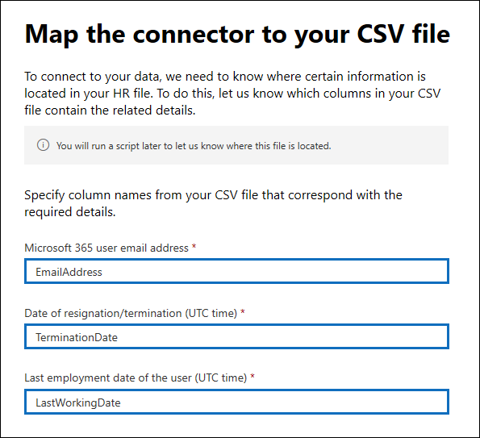
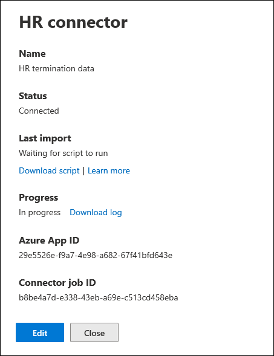

# <a name="set-up-a-connector-to-import-hr-data-preview"></a>Configurare un connettore per l'importazione dei dati HR (anteprima)

È possibile configurare un connettore di dati nel centro conformità di Microsoft 365 per importare i dati delle risorse umane (HR), ad esempio la data in cui un dipendente ha inviato le proprie dimissioni e la data dell'ultimo giorno del dipendente. Questo tipo di dati HR può quindi essere utilizzato dalle soluzioni Microsoft per la protezione delle informazioni, ad esempio la nuova [soluzione di gestione dei rischi Insider](insider-risk-management.md), per proteggere l'organizzazione da attività dannose o furti di dati all'interno dell'organizzazione. La configurazione di un connettore HR consiste nella creazione di un'app in Azure Active Directory utilizzata per l'autenticazione tramite connettore, la creazione di un file di mapping CSV contenente i dati HR, la creazione di un connettore di dati nel centro conformità e l'esecuzione di uno script (su base pianificata) che consente di ingerire i dati HR nel file CSV nel cloud Microsoft. Successivamente, il connettore dati viene utilizzato Microsoft Compliance Solutions (come Insider Risk Management) per accedere ai dati HR che sono stati importati nell'organizzazione Microsoft 365.

## <a name="before-you-begin"></a>Informazioni preliminari

- L'organizzazione deve acconsentire a consentire al servizio di importazione di Office 365 di accedere ai dati nell'organizzazione. Per acconsentire a questa richiesta, accedere a [Questa pagina](https://login.microsoftonline.com/common/oauth2/authorize?client_id=570d0bec-d001-4c4e-985e-3ab17fdc3073&response_type=code&redirect_uri=https://portal.azure.com/&nonce=1234&prompt=admin_consent), accedere con le credenziali di un amministratore globale di Microsoft 365 e quindi accettare la richiesta. È necessario completare questo passaggio prima di poter creare correttamente il connettore HR nel passaggio 3.

- All'utente che crea il connettore HR nel passaggio 3 deve essere assegnato il ruolo di importazione/esportazione delle cassette postali in Exchange Online. Per impostazione predefinita, questo ruolo non è assegnato ad alcun gruppo di ruoli in Exchange Online. È possibile aggiungere il ruolo import export delle cassette postali al gruppo di ruoli Gestione organizzazione in Exchange Online. In alternativa, è possibile creare un nuovo gruppo di ruoli, assegnare il ruolo di esportazione delle cassette postali e quindi aggiungere gli utenti corretti come membri. Per ulteriori informazioni, vedere la sezione creare gruppi di [ruoli](https://docs.microsoft.com/Exchange/permissions-exo/role-groups#create-role-groups) o [modificare gruppi di ruoli](https://docs.microsoft.com/Exchange/permissions-exo/role-groups#modify-role-groups) nell'articolo "gestire i gruppi di ruoli in Exchange Online".

- Sarà necessario determinare come recuperare o esportare i dati dal sistema HR dell'organizzazione (su base regolare) e aggiungerli al file CSV descritto nel passaggio 2. Lo script eseguito nel passaggio 4 caricherà i dati HR nel file CSV nel cloud Microsoft.

- Lo script di esempio eseguito nel passaggio 4 caricherà i dati HR nel cloud Microsoft in modo che possa essere utilizzato da altri strumenti di Microsoft, ad esempio la soluzione di gestione dei rischi Insider. Questo script di esempio non è supportato in alcun servizio o programma di supporto Microsoft standard. Lo script di esempio viene fornito come senza garanzie di alcun tipo. Inoltre Microsoft declina ogni responsabilità su garanzie implicite, senza alcuna limitazione, incluse le garanzie implicite di commerciabilità e/o adeguatezza per uno scopo specifico. L'intero rischio derivante dall'utilizzo o dalle prestazioni dello script di esempio e della documentazione resta all'interno dell'utente. In nessun caso Microsoft, i suoi autori o chiunque altro coinvolto nella creazione, produzione o consegna degli script è da ritenersi responsabile per qualsiasi danno eventuale (inclusi, senza limitazione alcuna, danni riguardanti profitti aziendali, interruzione di attività, perdita di informazioni aziendali o altra perdita pecuniaria) derivanti dall'utilizzo o dall'incapacità di utilizzo degli script di esempio e della documentazione, anche nel caso in cui Microsoft sia stata avvisata della possibilità di tali danni.

## <a name="step-1-create-an-app-in-azure-active-directory"></a>Passaggio 1: creare un'app in Azure Active Directory

Il primo passaggio consiste nel creare e registrare una nuova app in Azure Active Directory (AAD). L'app corrisponderà al connettore HR creato nel passaggio 3. La creazione di questa app consentirà a AAD di autenticare il connettore HR quando viene eseguito e tenta di accedere all'organizzazione. Questa app verrà utilizzata anche per autenticare lo script eseguito nel passaggio 4 per caricare i dati HR nel cloud Microsoft. Durante la creazione di questa app AAD, assicurarsi di salvare le informazioni seguenti. Questi valori verranno utilizzati nei passaggi successivi.

- ID applicazione AAD (denominato anche ID *app* o ID *client*)

- Segreto dell'applicazione AAD (denominato anche *segreto client*)

- ID tenant (denominato anche *ID directory*)

Per istruzioni dettagliate per la creazione di un'app in AAD, vedere registrazione di [un'applicazione con la piattaforma Microsoft Identity](https://docs.microsoft.com/azure/active-directory/develop/quickstart-register-app).

## <a name="step-2-prepare-a-csv-file-with-your-hr-data"></a>Passaggio 2: preparare un file CSV con i dati HR

Il passaggio successivo consiste nel creare un file CSV contenente informazioni sui dipendenti che hanno lasciato la propria organizzazione. Come illustrato nella sezione prima di iniziare, è necessario determinare come generare il file CSV dal sistema HR dell'organizzazione. Nell'esempio seguente viene illustrato un file CSV completato (aperto nel blocco note) che contiene i tre parametri necessari (colonne). La modifica del file CSV in Microsoft Excel è molto più semplice.

```text
EmailAddress,TerminationDate,LastWorkingDate
sarad@contoso.com,2019-04-23T15:18:02.4675041+05:30,2019-04-29T15:18:02.4675041+05:30
pilarp@contoso.com,2019-04-24T09:15:49Z,2019-04-29T15:18:02.7117540
```

La prima riga, o riga di intestazione, del file CSV elenca i nomi di colonna necessari. Il nome utilizzato in ogni intestazione di colonna dipende dall'utente (quelli nell'esempio precedente sono suggerimenti). Tuttavia, è *necessario* specificare gli stessi nomi di colonna utilizzati nel file CSV quando si crea il connettore HR nel passaggio 3. Non includere spazi nei nomi delle colonne.

Nella tabella seguente vengono descritte tutte le colonne del file CSV:

|**Nome colonna**|**Descrizione**|
|:-----|:-----|
| **EmailAddress** <br/> |Specifica l'indirizzo di posta elettronica del dipendente terminato.|
| **TerminationDate** <br/> |Specifica la data in cui l'occupazione della persona è stata ufficialmente terminata nell'organizzazione. Ad esempio, questa potrebbe essere la data in cui il dipendente ha dato la propria comunicazione sull'uscita dall'organizzazione. Questa data può essere diversa dalla data dell'ultimo giorno di lavoro dell'utente. È necessario utilizzare il formato di data seguente: `yyyy-mm-ddThh:mm:ss.nnnnnn+|-hh:mm` , ovvero il [formato di data e ora ISO 8601](https://www.iso.org/iso-8601-date-and-time-format.html).|
|**LastWorkingDate**|Specifica l'ultimo giorno di lavoro per il dipendente terminato. È necessario utilizzare il formato di data seguente: `yyyy-mm-ddThh:mm:ss.nnnnnn+|-hh:mm` , ovvero il [formato di data e ora ISO 8601](https://www.iso.org/iso-8601-date-and-time-format.html).|
|||

Dopo aver creato il file CSV con i dati HR necessari, archiviarlo nello stesso sistema dello script eseguito nel passaggio 4. È inoltre consigliabile implementare una strategia di aggiornamento per verificare che il file CSV contenga sempre le informazioni più aggiornate, in modo che qualsiasi operazione esegua lo script, i dati di terminazione dei dipendenti più recenti vengano caricati nel cloud Microsoft.

## <a name="step-3-create-the-hr-connector"></a>Passaggio 3: creare il connettore HR

Il passaggio successivo consiste nel creare un connettore HR nel centro conformità di Microsoft 365. Dopo aver eseguito lo script nel passaggio 4, il connettore HR creato inventerà i dati HR dal file CSV all'organizzazione Microsoft 365. In questo passaggio, assicurarsi di copiare il JobId generato quando si crea il connettore. Quando si esegue lo script, si utilizzerà il JobId.

1. Andare a [https://compliance.microsoft.com](https://compliance.microsoft.com) e quindi fare clic su **connettori dati** nel NAV sinistro.

2. Nella pagina **connettori dati (anteprima)** in **HR**, fare clic su **Visualizza**.

3. Nella pagina **HR** fare clic su **Aggiungi connettore**.

4. Nella pagina **credenziali di autenticazione** eseguire le operazioni seguenti e quindi fare clic su **Avanti**:

   a. Digitare o incollare l'ID dell'applicazione AAD per l'app di Azure creata al passaggio 1.

   b. Digitare un nome per il connettore HR.

5. Nella pagina **mapping dei file** Digitare i tre nomi delle intestazioni di colonna (denominati anche *parametri* dal file CSV creato nel passaggio 2 in ognuna delle caselle appropriate. I nomi non sono distinzione tra maiuscole e minuscole. Come spiegato in precedenza, i nomi digitati in queste caselle devono corrispondere ai nomi dei parametri nel file CSV. Ad esempio, nella schermata seguente vengono mostrati i nomi dei parametri dell'esempio in un file CSV di esempio illustrato nel passaggio 2.

   

6. Nella pagina **Revisione** rivedere le impostazioni e quindi fare clic su **fine** per creare il connettore.

   Viene visualizzata una pagina di stato che conferma che il connettore è stato creato. Questa pagina contiene anche l'ID del processo. Questo ID processo è necessario per eseguire lo script nel passaggio successivo. È possibile copiarlo da questa pagina o dalla pagina del riquadro a comparsa del connettore.

7. Fare clic su **Fatto**.
   
   Il nuovo connettore viene visualizzato nell'elenco della scheda **connettori** . 

8. Fare clic sul connettore HR appena creato per visualizzare la pagina del riquadro a comparsa, che contiene le proprietà e altre informazioni sul connettore. 

   

   Se non è stato ancora fatto, è possibile copiare i valori per l'ID dell' **app di Azure** e il **processo di connettore**. Sarà necessario eseguire lo script nel passaggio successivo. È inoltre possibile scaricare lo script dalla pagina del riquadro a comparsa o scaricarlo utilizzando il collegamento nel passaggio successivo.

   È inoltre possibile fare clic su **modifica** per modificare l'ID dell'app di Azure o i nomi delle intestazioni di colonna definiti nella pagina **mapping dei file** .

## <a name="step-4-run-the-sample-script-to-upload-your-hr-data"></a>Passaggio 4: eseguire lo script di esempio per caricare i dati HR

L'ultimo passaggio per la configurazione di un connettore HR è l'esecuzione di uno script di esempio che caricherà i dati HR nel file CSV (creato nel passaggio 2) nel cloud Microsoft. Nello specifico, lo script carica i dati nel connettore HR. Dopo aver eseguito lo script, il connettore HR creato nel passaggio 3 importa i dati HR nell'organizzazione Microsoft 365, in cui è possibile accedervi da altri strumenti di conformità, ad esempio la soluzione di gestione dei rischi Insider. Dopo aver eseguito lo script, prendere in considerazione la pianificazione di un'attività per l'esecuzione automatica su base giornaliera in modo che i dati di terminazione dei dipendenti più recenti vengano caricati nel cloud Microsoft. Vedere [pianificare lo script in modo che venga eseguito automaticamente](#optional-step-6-schedule-the-script-to-run-automatically).

1. Passare a [questo sito GitHub](https://github.com/microsoft/m365-hrconnector-sample-scripts/blob/master/upload_termination_records.ps1) per accedere allo script di esempio.

2. Fare clic sul pulsante **RAW** per visualizzare lo script nella visualizzazione testo

3. Copiare tutte le righe nello script di esempio e quindi salvarle in un file di testo.

4. Modificare lo script di esempio per l'organizzazione, se necessario.

5. Salvare il file di testo come file di script di Windows PowerShell utilizzando un suffisso del nome di file `.ps1` , ad esempio, `HRConnector.ps1` .

6. Aprire un prompt dei comandi nel computer locale e passare alla directory in cui è stato salvato lo script.

7. Eseguire il seguente comando per caricare i dati HR nel file CSV nel cloud Microsoft. Per esempio:

    ```powershell
    .\HRConnector.ps1 -tenantId <tenantId> -appId <appId>  -appSecret <appSecret>  -jobId <jobId>  -csvFilePath '<csvFilePath>'
    ```

   Nella tabella seguente vengono descritti i parametri da utilizzare con questo script e i valori necessari. Le informazioni ottenute nei passaggi precedenti vengono utilizzate nei valori di questi parametri.

   |**Parametro**|**Descrizione**
   |:-----|:-----|:-----|
   |`tenantId`|Questo è l'ID dell'organizzazione Microsoft 365 ottenuta al passaggio 1. È anche possibile ottenere l'tenantId per l'organizzazione nel pannello **Panoramica** nell'interfaccia di amministrazione di Azure ad. Viene utilizzato per identificare l'organizzazione.|
   |`appId` |Questo è l'ID dell'applicazione AAD per l'app creata in Azure AD nel passaggio 1. Questo metodo viene utilizzato da Azure AD per l'autenticazione quando lo script tenta di accedere all'organizzazione Microsoft 365. | 
   |`appSecret`|Si tratta del segreto dell'applicazione AAD per l'app creata in Azure AD nel passaggio 1. Questo utilizzato anche per l'autenticazione.|
   |`jobId`|Questo è l'ID processo per il connettore HR creato nel passaggio 3. Viene utilizzato per associare i dati HR caricati nel cloud Microsoft con il connettore HR.|
   |`csvFilePath`|Si tratta del percorso del file CSV, memorizzato nello stesso sistema dello script, creato nel passaggio 2. Provare ad evitare gli spazi nel percorso del file; in caso contrario, utilizzare virgolette singole.|
   |||
   
   Di seguito è riportato un esempio della sintassi per lo script del connettore HR utilizzando i valori effettivi per ogni parametro:

   ```powershell
    .\HRConnector.ps1 -tenantId d5723623-11cf-4e2e-b5a5-01d1506273g9 -appId 29ee526e-f9a7-4e98-a682-67f41bfd643e -appSecret MNubVGbcQDkGCnn -jobId b8be4a7d-e338-43eb-a69e-c513cd458eba -csvFilePath 'C:\Users\contosoadmin\Desktop\Data\employee_termination_data.csv'
    ```

   Se il caricamento ha esito positivo, lo script Visualizza il messaggio di **caricamento con esito positivo** .

## <a name="step-5-monitor-the-hr-connector"></a>Passaggio 5: monitorare il connettore HR

Dopo aver creato il connettore HR ed eseguito lo script per caricare i dati HR, è possibile visualizzare lo stato del connettore e del caricamento nel centro conformità di Microsoft 365. Se si pianifica lo script in modo che venga eseguito automaticamente periodicamente, è possibile visualizzare lo stato corrente anche dopo l'ultima esecuzione dello script.

1. Andare a [https://compliance.microsoft.com](https://compliance.microsoft.com) e fare clic su **connettori dati** nel NAV sinistro.

2. Fare clic sulla scheda **connettori** e quindi selezionare il connettore HR per visualizzare la pagina del riquadro a comparsa, che contiene le proprietà e le informazioni sul connettore.

   

3. In **stato di avanzamento**fare clic sul collegamento **accedi al registro** per aprire o salvare il registro di stato del connettore. Questo log contiene informazioni su ogni volta che lo script viene eseguito e carica i dati dal file CSV al cloud Microsoft. 

   

   Il campo **RecordsSaved** indica il numero di righe nel file CSV che è stato caricato. Ad esempio, se il file CSV contiene quattro righe, il valore dei campi **RecordsSaved** è 4, se lo script ha correttamente caricato tutte le righe del file CSV.

Se non è stato eseguito lo script nel passaggio 4, viene visualizzato un collegamento per scaricare lo script nell' **Ultima importazione**. È possibile scaricare lo script e quindi seguire i passaggi descritti nel passaggio 4 per eseguirlo.

## <a name="optional-step-6-schedule-the-script-to-run-automatically"></a>Optional Passaggio 6: pianificare l'esecuzione automatica dello script

Per assicurarsi che i dati HR più recenti dell'organizzazione siano disponibili per gli strumenti come la soluzione di gestione dei rischi Insider, si consiglia di pianificare lo script in modo che venga eseguito automaticamente su base ricorrente, ad esempio una volta al giorno. Questo richiede anche l'aggiornamento dei dati HR nel file CSV su una pianificazione analoga (se non uguale), in modo che contenga le informazioni più aggiornate sui dipendenti che lasciano l'organizzazione. L'obiettivo è quello di caricare i dati HR più aggiornati in modo che il connettore HR possa renderlo disponibile per la soluzione di gestione dei rischi Insider.

È possibile utilizzare l'app utilità di pianificazione in Windows per eseguire automaticamente lo script ogni giorno.

1. Nel computer locale, fare clic sul pulsante **Start** di Windows e quindi digitare **utilità di pianificazione**.

2. Fare clic sull'app **utilità di pianificazione** per aprirla.

3. Nella sezione **azioni** fare clic su **Crea attività**.

4. Nella scheda **generale** Digitare un nome descrittivo per l'attività pianificata. ad esempio, **lo script del connettore HR**. È inoltre possibile aggiungere una descrizione facoltativa.

5. In **Opzioni di sicurezza**eseguire le operazioni seguenti:

   a. Determinare se eseguire lo script solo quando si è connessi al computer o quando si è connessi o meno.
   
   b. Verificare che sia selezionata la casella **di controllo Esegui con i privilegi più alti** .

6. Selezionare la scheda **trigger** , fare clic su **nuovo**e quindi eseguire le operazioni seguenti:

   a. In **Impostazioni**, selezionare l'opzione **giornaliero** e quindi scegliere una data e un'ora per l'esecuzione dello script per la prima volta. Lo script viene applicato ogni giorno allo stesso tempo specificato.
   
   b. In **Impostazioni avanzate**verificare che sia selezionata la casella di controllo **abilitata** .
   
   c. Fare clic su **OK**.

7. Selezionare la scheda **azioni** , fare clic su **nuovo**e quindi eseguire le operazioni seguenti:

   

   a. Nell'elenco a discesa **azione** , verificare che sia selezionata l'opzione **avvia un programma** .

   b. Nella casella **programma/script** fare clic su **Sfoglia**e passare al percorso seguente e selezionarlo in modo che il percorso venga visualizzato nella casella: `C:\Windows\System32\WindowsPowerShell\v1.0\powershell.exe` .

   c. Nella casella **Add arguments (optional)** incollare lo stesso comando script eseguito nel passaggio 4. Per esempio`.\HRConnector.ps1 -tenantId "d5723623-11cf-4e2e-b5a5-01d1506273g9" -appId "c12823b7-b55a-4989-faba-02de41bb97c3" -appSecret "MNubVGbcQDkGCnn"  -jobId "e081f4f4-3831-48d6-7bb3-fcfab1581458" -csvFilePath "C:\Users\contosoadmin\Desktop\Data\employee_termination_data.csv"`

   d. Nella casella **inizia in (facoltativo)** incollare il percorso della cartella dello script eseguito nel passaggio 4. Ad esempio, `C:\Users\contosoadmin\Desktop\Scripts`.

   e. Fare clic su **OK** per salvare le impostazioni per la nuova azione.

8. Nella finestra **Crea attività** fare clic su **OK** per salvare l'attività pianificata. Potrebbe essere richiesto di immettere le credenziali dell'account utente.

   La nuova attività viene visualizzata nella libreria dell'utilità di pianificazione.

   

   L'ultima volta che lo script è stato eseguito e la volta successiva che viene pianificata l'esecuzione viene visualizzata. È possibile fare doppio clic sull'attività per modificarla.

   È inoltre possibile verificare l'ultima volta che lo script è stato eseguito nella pagina a comparsa del connettore HR corrispondente nel centro conformità.
